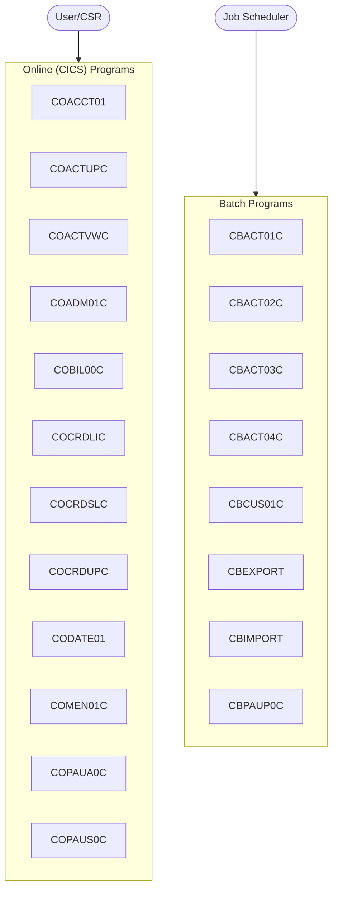

# Carddemo - System Overview

> **Auto-generated documentation** | 2026-05-02 17:07  
> Analyzed from 44 COBOL programs across 16 functional modules

---

## What is Carddemo?

Carddemo is a mainframe COBOL application composed of 44 programs
across 16 functional modules. It exposes 21 BMS screens for
online (CICS) interaction and is orchestrated by 55 JCL batch
jobs. The sections below summarize its structure, dependencies, and modernization-relevant
characteristics.

## System at a Glance

| Metric | Count |
|--------|-------|
| Programs | 44 |
| Functional Modules | 16 |
| BMS Screens | 21 |
| Data Items | 7383 |
| CICS Commands | 101 |
| SQL Statements | 28 |
| Inter-Program Calls | 59 |
| Business Rules | 447 |
| Copybooks | 73 |

## Architecture Overview

## Functional Modules

### [Module CB](modules/CB.md)

Module CB

| Programs | Type |
|----------|------|

### [Program](modules/CBACT.md)

Program

| Programs | Type |
|----------|------|

### [Xreffile](modules/CBSTM.md)

Xreffile

| Programs | Type |
|----------|------|

### [Tranfile](modules/CBTRN.md)

Tranfile

| Programs | Type |
|----------|------|

### [Module CO](modules/CO.md)

Module CO

| Programs | Type |
|----------|------|

### [Pgmiderr](modules/COA.md)

Pgmiderr

| Programs | Type |
|----------|------|

### [Termination](modules/COAC.md)

Termination

| Programs | Type |
|----------|------|

### [Getcustdata](modules/COACT.md)

Getcustdata

| Programs | Type |
|----------|------|

### [Update](modules/COB.md)

Update

| Programs | Type |
|----------|------|

### [Receive](modules/COCRD.md)

Receive

| Programs | Type |
|----------|------|

### [Para](modules/COPAU.md)

Para

| Programs | Type |
|----------|------|

### [Initialize (COTRN)](modules/COTRN.md)

Initialize (COTRN)

| Programs | Type |
|----------|------|

### [Alphanum](modules/COTRT.md)

Alphanum

| Programs | Type |
|----------|------|

### [Initialize (COUSR)](modules/COUSR.md)

Initialize (COUSR)

| Programs | Type |
|----------|------|

### [Initialize](modules/OTHER.md)

Initialize

| Programs | Type |
|----------|------|

### [Initialize (PAUDB)](modules/PAUDB.md)

Initialize (PAUDB)

| Programs | Type |
|----------|------|

## Entry Points

Programs that are not called by others -- these are likely user-facing entry points:

- [CBACT01C](programs/CBACT01C.md)
- [CBACT02C](programs/CBACT02C.md)
- [CBACT03C](programs/CBACT03C.md)
- [CBACT04C](programs/CBACT04C.md)
- [CBCUS01C](programs/CBCUS01C.md)
- [CBEXPORT](programs/CBEXPORT.md)
- [CBIMPORT](programs/CBIMPORT.md)
- [CBPAUP0C](programs/CBPAUP0C.md)
- [CBSTM03A](programs/CBSTM03A.md)
- [CBSTM03B](programs/CBSTM03B.md)
- [CBTRN01C](programs/CBTRN01C.md)
- [CBTRN02C](programs/CBTRN02C.md)
- [CBTRN03C](programs/CBTRN03C.md)
- [COACCT01](programs/COACCT01.md)
- [COACTUPC](programs/COACTUPC.md)
- [COACTVWC](programs/COACTVWC.md)
- [COADM01C](programs/COADM01C.md)
- [COBIL00C](programs/COBIL00C.md)
- [COBSWAIT](programs/COBSWAIT.md)
- [COBTUPDT](programs/COBTUPDT.md)
- [COCRDLIC](programs/COCRDLIC.md)
- [COCRDSLC](programs/COCRDSLC.md)
- [COCRDUPC](programs/COCRDUPC.md)
- [CODATE01](programs/CODATE01.md)
- [COMEN01C](programs/COMEN01C.md)
- [COPAUA0C](programs/COPAUA0C.md)
- [COPAUS0C](programs/COPAUS0C.md)
- [COPAUS1C](programs/COPAUS1C.md)
- [COPAUS2C](programs/COPAUS2C.md)
- [CORPT00C](programs/CORPT00C.md)
- [COSGN00C](programs/COSGN00C.md)
- [COTRN00C](programs/COTRN00C.md)
- [COTRN01C](programs/COTRN01C.md)
- [COTRN02C](programs/COTRN02C.md)
- [COTRTLIC](programs/COTRTLIC.md)
- [COTRTUPC](programs/COTRTUPC.md)
- [COUSR00C](programs/COUSR00C.md)
- [COUSR01C](programs/COUSR01C.md)
- [COUSR02C](programs/COUSR02C.md)
- [COUSR03C](programs/COUSR03C.md)
- [CSUTLDTC](programs/CSUTLDTC.md)
- [DBUNLDGS](programs/DBUNLDGS.md)
- [PAUDBLOD](programs/PAUDBLOD.md)
- [PAUDBUNL](programs/PAUDBUNL.md)

## Quick Navigation

| Section | Description |
|---------|-------------|
| [Program Documentation](programs/) | Detailed walkthrough for each COBOL program |
| [Linked Programs](clusters/INDEX.md) | Connected program clusters and dependency graphs |
| [Module Documentation](modules/) | Business-grouped program clusters |
| [Business Rules Catalog](business-rules/INDEX.md) | All extracted business rules |
| [Screen Catalog](screens/INDEX.md) | BMS screen definitions and layouts |
| [Call Graph](diagrams/call-graph.md) | Inter-program dependency diagram |
| [Data Dictionary](data-dictionary.md) | Complete variable listing |
| [Copybook Reference](copybook-reference.md) | Shared data structures |

---

*Generated by COBOL Documentation Pipeline*