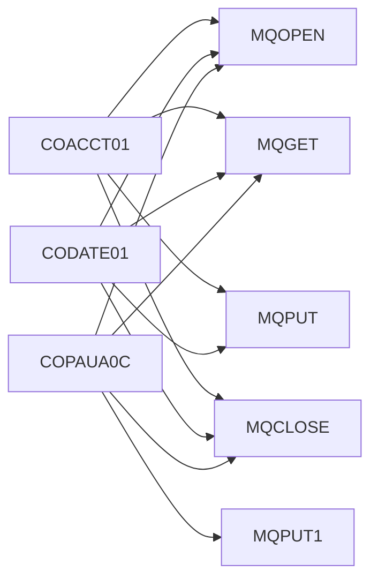

# Program Call Hierarchy

> Inter-program call relationships across the entire Carddemo application.

## Visual Call Graph

## Call Matrix

| Caller | Calls | Line |
|--------|-------|------|
| [COACCT01](../programs/COACCT01.md) | `MQOPEN` | 233 |
| [COACCT01](../programs/COACCT01.md) | `MQOPEN` | 267 |
| [COACCT01](../programs/COACCT01.md) | `MQOPEN` | 302 |
| [COACCT01](../programs/COACCT01.md) | `MQGET` | 352 |
| [COACCT01](../programs/COACCT01.md) | `MQPUT` | 479 |
| [COACCT01](../programs/COACCT01.md) | `MQPUT` | 516 |
| [COACCT01](../programs/COACCT01.md) | `MQCLOSE` | 557 |
| [COACCT01](../programs/COACCT01.md) | `MQCLOSE` | 579 |
| [COACCT01](../programs/COACCT01.md) | `MQCLOSE` | 602 |
| [CODATE01](../programs/CODATE01.md) | `MQOPEN` | 182 |
| [CODATE01](../programs/CODATE01.md) | `MQOPEN` | 216 |
| [CODATE01](../programs/CODATE01.md) | `MQOPEN` | 251 |
| [CODATE01](../programs/CODATE01.md) | `MQGET` | 301 |
| [CODATE01](../programs/CODATE01.md) | `MQPUT` | 383 |
| [CODATE01](../programs/CODATE01.md) | `MQPUT` | 420 |
| [CODATE01](../programs/CODATE01.md) | `MQCLOSE` | 461 |
| [CODATE01](../programs/CODATE01.md) | `MQCLOSE` | 483 |
| [CODATE01](../programs/CODATE01.md) | `MQCLOSE` | 506 |
| [COPAUA0C](../programs/COPAUA0C.md) | `MQOPEN` | 262 |
| [COPAUA0C](../programs/COPAUA0C.md) | `MQGET` | 400 |
| [COPAUA0C](../programs/COPAUA0C.md) | `MQPUT1` | 758 |
| [COPAUA0C](../programs/COPAUA0C.md) | `MQCLOSE` | 956 |

## Entry Points

Programs not called by any other program (likely top-level entry points or CICS transaction starters):

- [CBACT01C](../programs/CBACT01C.md)
- [CBACT02C](../programs/CBACT02C.md)
- [CBACT03C](../programs/CBACT03C.md)
- [CBACT04C](../programs/CBACT04C.md)
- [CBCUS01C](../programs/CBCUS01C.md)
- [CBEXPORT](../programs/CBEXPORT.md)
- [CBIMPORT](../programs/CBIMPORT.md)
- [CBPAUP0C](../programs/CBPAUP0C.md)
- [CBSTM03A](../programs/CBSTM03A.md)
- [CBSTM03B](../programs/CBSTM03B.md)
- [CBTRN01C](../programs/CBTRN01C.md)
- [CBTRN02C](../programs/CBTRN02C.md)
- [CBTRN03C](../programs/CBTRN03C.md)
- [COACCT01](../programs/COACCT01.md)
- [COACTUPC](../programs/COACTUPC.md)
- [COACTVWC](../programs/COACTVWC.md)
- [COADM01C](../programs/COADM01C.md)
- [COBIL00C](../programs/COBIL00C.md)
- [COBSWAIT](../programs/COBSWAIT.md)
- [COBTUPDT](../programs/COBTUPDT.md)
- [COCRDLIC](../programs/COCRDLIC.md)
- [COCRDSLC](../programs/COCRDSLC.md)
- [COCRDUPC](../programs/COCRDUPC.md)
- [CODATE01](../programs/CODATE01.md)
- [COMEN01C](../programs/COMEN01C.md)
- [COPAUA0C](../programs/COPAUA0C.md)
- [COPAUS0C](../programs/COPAUS0C.md)
- [COPAUS1C](../programs/COPAUS1C.md)
- [COPAUS2C](../programs/COPAUS2C.md)
- [CORPT00C](../programs/CORPT00C.md)
- [COSGN00C](../programs/COSGN00C.md)
- [COTRN00C](../programs/COTRN00C.md)
- [COTRN01C](../programs/COTRN01C.md)
- [COTRN02C](../programs/COTRN02C.md)
- [COTRTLIC](../programs/COTRTLIC.md)
- [COTRTUPC](../programs/COTRTUPC.md)
- [COUSR00C](../programs/COUSR00C.md)
- [COUSR01C](../programs/COUSR01C.md)
- [COUSR02C](../programs/COUSR02C.md)
- [COUSR03C](../programs/COUSR03C.md)
- [CSUTLDTC](../programs/CSUTLDTC.md)
- [DBUNLDGS](../programs/DBUNLDGS.md)
- [PAUDBLOD](../programs/PAUDBLOD.md)
- [PAUDBUNL](../programs/PAUDBUNL.md)

## Leaf Programs

Programs that don't call any other program (utility or terminal logic):

- [CBPAUP0C](../programs/CBPAUP0C.md)
- [CBSTM03B](../programs/CBSTM03B.md)
- [COACTUPC](../programs/COACTUPC.md)
- [COACTVWC](../programs/COACTVWC.md)
- [COADM01C](../programs/COADM01C.md)
- [COBIL00C](../programs/COBIL00C.md)
- [COBSWAIT](../programs/COBSWAIT.md)
- [COBTUPDT](../programs/COBTUPDT.md)
- [COCRDLIC](../programs/COCRDLIC.md)
- [COCRDSLC](../programs/COCRDSLC.md)
- [COCRDUPC](../programs/COCRDUPC.md)
- [COMEN01C](../programs/COMEN01C.md)
- [COPAUS0C](../programs/COPAUS0C.md)
- [COPAUS1C](../programs/COPAUS1C.md)
- [COPAUS2C](../programs/COPAUS2C.md)
- [CORPT00C](../programs/CORPT00C.md)
- [COSGN00C](../programs/COSGN00C.md)
- [COTRN00C](../programs/COTRN00C.md)
- [COTRN01C](../programs/COTRN01C.md)
- [COTRTLIC](../programs/COTRTLIC.md)
- [COTRTUPC](../programs/COTRTUPC.md)
- [COUSR00C](../programs/COUSR00C.md)
- [COUSR01C](../programs/COUSR01C.md)
- [COUSR02C](../programs/COUSR02C.md)
- [COUSR03C](../programs/COUSR03C.md)

---

*Generated 2026-05-02 17:07*