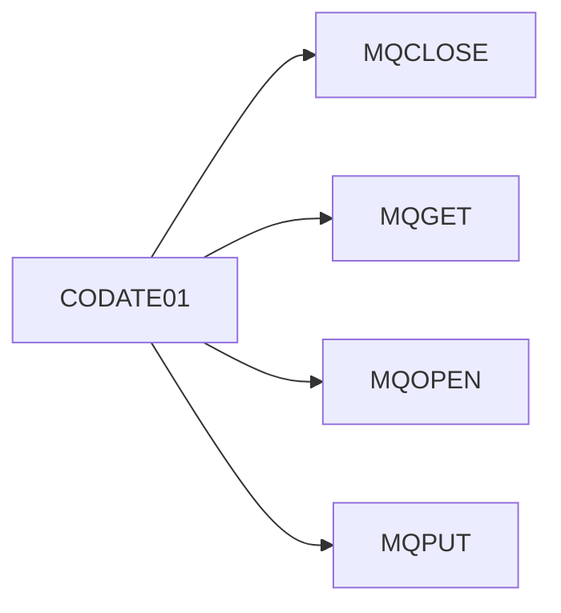

# Module: Module CO

> **Module ID:** `CO`  
> **Programs:** 4

---

## Business Purpose

Module CO

## Programs in This Module

| Program | Type | Lines | Business Purpose |
|---------|------|-------|-----------------|
| [CODATE01](../programs/CODATE01.md) | ONLINE | 525 |  |
| [COMEN01C](../programs/COMEN01C.md) | ONLINE | 309 |  |
| [CORPT00C](../programs/CORPT00C.md) | ONLINE | 650 |  |
| [COSGN00C](../programs/COSGN00C.md) | ONLINE | 261 |  |

## Internal Call Flow

Programs in this module interact through the following call chain:

| Caller | Calls | Line |
|--------|-------|------|
| [CODATE01](../programs/CODATE01.md) | `MQCLOSE` | 461 |
| [CODATE01](../programs/CODATE01.md) | `MQGET` | 301 |
| [CODATE01](../programs/CODATE01.md) | `MQOPEN` | 182 |
| [CODATE01](../programs/CODATE01.md) | `MQPUT` | 383 |

## Associated Screens

| Screen | Map | Mapset | Program |
|--------|-----|--------|---------|
| [COMEN1A](../screens/COMEN1A.md) | COMEN1A | COMEN01 | [COMEN01C](../programs/COMEN01C.md) |
| [CORPT0A](../screens/CORPT0A.md) | CORPT0A | CORPT00 | [CORPT00C](../programs/CORPT00C.md) |
| [COSGN0A](../screens/COSGN0A.md) | COSGN0A | COSGN00 | [COSGN00C](../programs/COSGN00C.md) |

---

*Generated 2026-05-12 12:31*