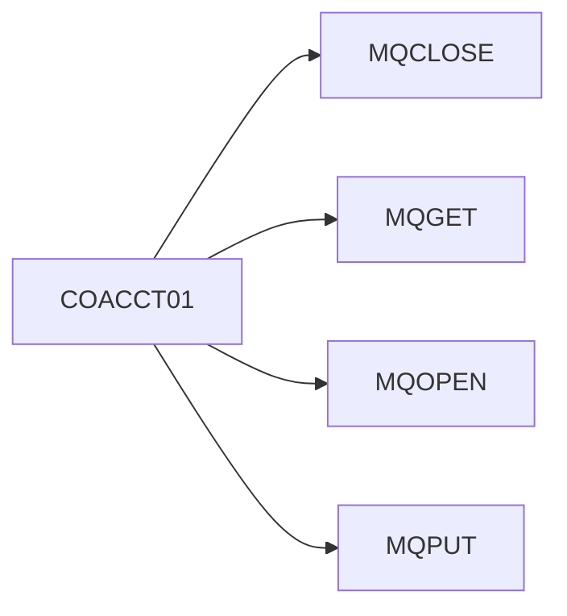

# Module: Termination

> **Module ID:** `COAC`  
> **Programs:** 1

---

## Business Purpose

Termination

## Programs in This Module

| Program | Type | Lines | Business Purpose |
|---------|------|-------|-----------------|
| [COACCT01](../programs/COACCT01.md) | ONLINE | 621 |  |

## Internal Call Flow

Programs in this module interact through the following call chain:

| Caller | Calls | Line |
|--------|-------|------|
| [COACCT01](../programs/COACCT01.md) | `MQCLOSE` | 557 |
| [COACCT01](../programs/COACCT01.md) | `MQGET` | 352 |
| [COACCT01](../programs/COACCT01.md) | `MQOPEN` | 233 |
| [COACCT01](../programs/COACCT01.md) | `MQPUT` | 479 |

---

*Generated 2026-05-12 12:31*