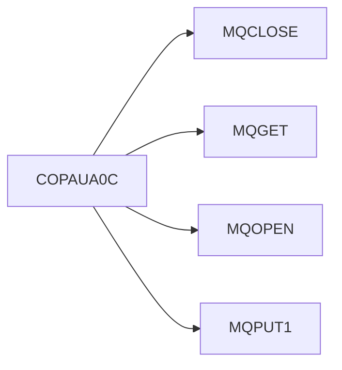

# Module: Para

> **Module ID:** `COPAU`  
> **Programs:** 4

---

## Business Purpose

Para

## Programs in This Module

| Program | Type | Lines | Business Purpose |
|---------|------|-------|-----------------|
| [COPAUA0C](../programs/COPAUA0C.md) | ONLINE | 1027 |  |
| [COPAUS0C](../programs/COPAUS0C.md) | ONLINE | 1033 |  |
| [COPAUS1C](../programs/COPAUS1C.md) | ONLINE | 605 |  |
| [COPAUS2C](../programs/COPAUS2C.md) | ONLINE | 245 |  |

## Internal Call Flow

Programs in this module interact through the following call chain:

| Caller | Calls | Line |
|--------|-------|------|
| [COPAUA0C](../programs/COPAUA0C.md) | `MQCLOSE` | 956 |
| [COPAUA0C](../programs/COPAUA0C.md) | `MQGET` | 400 |
| [COPAUA0C](../programs/COPAUA0C.md) | `MQOPEN` | 262 |
| [COPAUA0C](../programs/COPAUA0C.md) | `MQPUT1` | 758 |

---

*Generated 2026-05-12 12:31*