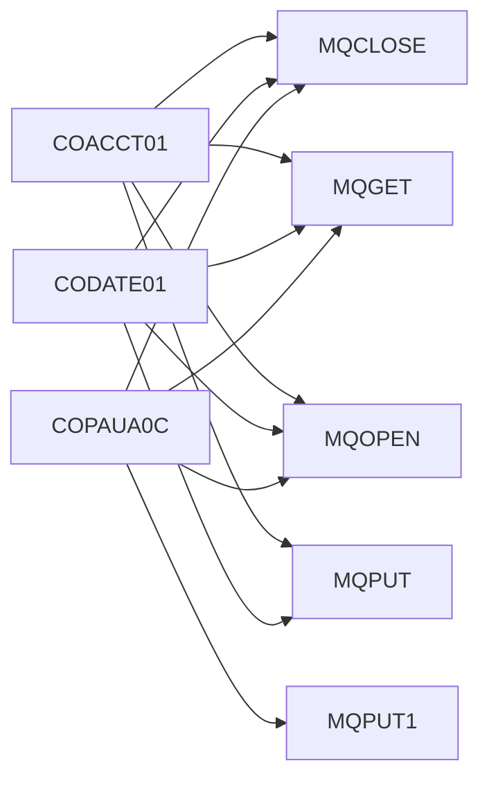

# Module: Online Processing (Uncategorised)

> **Module ID:** `ONLINE_PROCESSING`  
> **Programs:** 9

---

## Business Purpose

Online Processing (Uncategorised)

## Programs in This Module

| Program | Type | Lines | Business Purpose |
|---------|------|-------|-----------------|
| [COACCT01](../programs/COACCT01.md) | ONLINE | 621 |  |
| [COBTUPDT](../programs/COBTUPDT.md) | DB2 | 238 |  |
| [CODATE01](../programs/CODATE01.md) | ONLINE | 525 |  |
| [COPAUA0C](../programs/COPAUA0C.md) | ONLINE | 1027 |  |
| [COPAUS0C](../programs/COPAUS0C.md) | ONLINE | 1033 |  |
| [COPAUS1C](../programs/COPAUS1C.md) | ONLINE | 605 |  |
| [COPAUS2C](../programs/COPAUS2C.md) | ONLINE | 245 |  |
| [COTRTLIC](../programs/COTRTLIC.md) | ONLINE | 2099 |  |
| [COTRTUPC](../programs/COTRTUPC.md) | ONLINE | 1703 |  |

## Internal Call Flow

Programs in this module interact through the following call chain:

| Caller | Calls | Line |
|--------|-------|------|
| [COACCT01](../programs/COACCT01.md) | `MQCLOSE` | 557 |
| [COACCT01](../programs/COACCT01.md) | `MQGET` | 352 |
| [COACCT01](../programs/COACCT01.md) | `MQOPEN` | 233 |
| [COACCT01](../programs/COACCT01.md) | `MQPUT` | 479 |
| [CODATE01](../programs/CODATE01.md) | `MQCLOSE` | 461 |
| [CODATE01](../programs/CODATE01.md) | `MQGET` | 301 |
| [CODATE01](../programs/CODATE01.md) | `MQOPEN` | 182 |
| [CODATE01](../programs/CODATE01.md) | `MQPUT` | 383 |
| [COPAUA0C](../programs/COPAUA0C.md) | `MQCLOSE` | 956 |
| [COPAUA0C](../programs/COPAUA0C.md) | `MQGET` | 400 |
| [COPAUA0C](../programs/COPAUA0C.md) | `MQOPEN` | 262 |
| [COPAUA0C](../programs/COPAUA0C.md) | `MQPUT1` | 758 |

## Associated Screens

| Screen | Map | Mapset | Program |
|--------|-----|--------|---------|
| [CTRTLIA](../screens/CTRTLIA.md) | CTRTLIA | COTRTLI | [COTRTLIC](../programs/COTRTLIC.md) |
| [CTRTUPA](../screens/CTRTUPA.md) | CTRTUPA | COTRTUP | [COTRTUPC](../programs/COTRTUPC.md) |

## Data Files Used

| File | Type | Access | Program |
|------|------|--------|---------|
| `TR-RECORD` | SEQUENTIAL | SEQUENTIAL | COBTUPDT |

---

*Generated 2026-04-29 10:27*