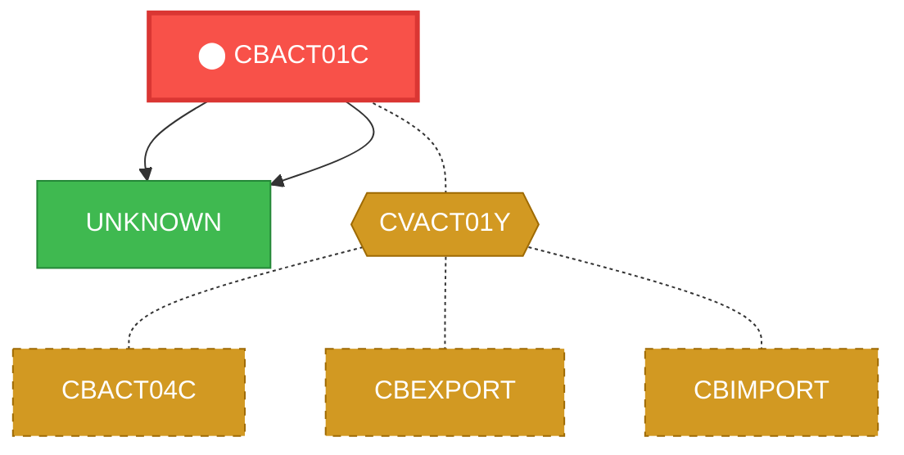

# Program: CBACT01C


---

## Quick Reference

| Attribute | Value |
|-----------|-------|
| Program ID | `CBACT01C` |
| Type | BATCH |
| Lines | 431 |
| Source | [CBACT01C.cbl](../carddemo/CBACT01C.cbl#L1) |
| Paragraphs | 16 |
| Statements | 127 |
| Impact Risk | **HIGH** — 13 programs affected |

> **View Source:** [Open CBACT01C.cbl](../carddemo/CBACT01C.cbl#L1)

## Source Grounding Facts

| Data Item | Literal Value |
|-----------|---------------|
| `END-OF-FILE` | `N` |

Status conditions found in source:
- `ACCTFILE-STATUS = '00'`
- `ACCTFILE-STATUS = '10'`
- `OUTFILE-STATUS NOT = '00'`
- `ARRYFILE-STATUS NOT = '00'`
- `VBRCFILE-STATUS NOT = '00'`
- `OUTFILE-STATUS = '00'`
- `ARRYFILE-STATUS = '00'`
- `VBRCFILE-STATUS = '00'`


## Business Purpose

*Business purpose is not present in the extracted data. Run LLM enrichment to populate this section.*


## Dependency Context

> This section shows how **CBACT01C** connects to the rest of the system — who calls it,
> what it calls, and what data it shares. If linked programs exist, they must appear here.

### Programs That Call CBACT01C (Callers)

*No programs call CBACT01C — this is likely a top-level entry point or CICS transaction starter.*

### Programs Called by CBACT01C (Callees)

| Called Program | Type | Line | Why |
|----------------|------|------|-----|
| `UNKNOWN` | None | 303 |  |
| `UNKNOWN` | None | 482 |  |

### Shared Data (Copybooks & Files)

#### Shared Copybooks

| Copybook | Also Used By | # Co-Users |
|----------|-------------|------------|
| `CODATECN` |  | 0 |
| `CVACT01Y` | CBACT04C, CBEXPORT, CBIMPORT, CBSTM03A, CBTRN01C (+8 more) | 13 |

#### Shared Files

| File | Type | Access | Also Used By |
|------|------|--------|-------------|
| `ACCTFILE-FILE` | VSAM | SEQUENTIAL |  |
| `ARRY-FILE` | SEQUENTIAL | SEQUENTIAL |  |
| `OUT-FILE` | SEQUENTIAL | SEQUENTIAL |  |
| `VBRC-FILE` | SEQUENTIAL | SEQUENTIAL |  |

## Legacy Data Contracts

> These tables are derived from FILE SECTION records and COPY-expanded data declarations. They preserve the legacy field names, COBOL storage type, inferred modern type, and status-code values needed for Java DTOs, SQL schemas, API contracts, and migration mapping.

### File Record Layouts

#### `ACCTFILE-FILE` / `FD-ACCTFILE-REC`
| Legacy Field | Meaning | COBOL Type | Modern Type | Notes |
|--------------|---------|------------|-------------|-------|
| `FD-ACCTFILE-REC` | Fd Acctfile Record | `GROUP` | `OBJECT` |  |
| `FD-ACCT-ID` | Fd Account ID | `PIC 9(11)` | `BIGINT` |  |
| `FD-ACCT-DATA` | Fd Account Data | `PIC X(289)` | `STRING(289)` |  |

#### `OUT-FILE` / `OUT-ACCT-REC`
| Legacy Field | Meaning | COBOL Type | Modern Type | Notes |
|--------------|---------|------------|-------------|-------|
| `OUT-ACCT-REC` | Out Account Record | `GROUP` | `OBJECT` |  |
| `OUT-ACCT-ID` | Out Account ID | `PIC 9(11)` | `BIGINT` |  |
| `OUT-ACCT-ACTIVE-STATUS` | Out Account Active Status | `PIC X(01)` | `STRING(1)` |  |
| `OUT-ACCT-CURR-BAL` | Out Account Curr Bal | `PIC S9(10)V99` | `DECIMAL(12,2)` |  |
| `OUT-ACCT-CREDIT-LIMIT` | Out Account Credit Limit | `PIC S9(10)V99` | `DECIMAL(12,2)` |  |
| `OUT-ACCT-CASH-CREDIT-LIMIT` | Out Account Cash Credit Limit | `PIC S9(10)V99` | `DECIMAL(12,2)` |  |
| `OUT-ACCT-OPEN-DATE` | Out Account Open Date | `PIC X(10)` | `STRING(10)` | Date-like field; verify YYDDD, YYMMDD, or ISO format before migration. |
| `OUT-ACCT-EXPIRAION-DATE` | Out Account Expiraion Date | `PIC X(10)` | `STRING(10)` | Date-like field; verify YYDDD, YYMMDD, or ISO format before migration. |
| `OUT-ACCT-REISSUE-DATE` | Out Account Reissue Date | `PIC X(10)` | `STRING(10)` | Date-like field; verify YYDDD, YYMMDD, or ISO format before migration. |
| `OUT-ACCT-CURR-CYC-CREDIT` | Out Account Curr Cyc Credit | `PIC S9(10)V99` | `DECIMAL(12,2)` |  |
| `OUT-ACCT-CURR-CYC-DEBIT` | Out Account Curr Cyc Debit | `PIC S9(10)V99` | `DECIMAL(12,2)` |  |
| `OUT-ACCT-GROUP-ID` | Out Account Group ID | `PIC X(10)` | `STRING(10)` |  |

#### `ARRY-FILE` / `ARR-ARRAY-REC`
| Legacy Field | Meaning | COBOL Type | Modern Type | Notes |
|--------------|---------|------------|-------------|-------|
| `ARR-ARRAY-REC` | Arr Array Record | `GROUP` | `OBJECT` |  |
| `ARR-ACCT-ID` | Arr Account ID | `PIC 9(11)` | `BIGINT` |  |
| `ARR-ACCT-BAL` | Arr Account Bal | `OCCURS 5` | `OBJECT` | Repeating field, 5 occurrences. |
| `ARR-ACCT-CURR-BAL` | Arr Account Curr Bal | `PIC S9(10)V99` | `DECIMAL(12,2)` |  |
| `ARR-ACCT-CURR-CYC-DEBIT` | Arr Account Curr Cyc Debit | `PIC S9(10)V99` | `DECIMAL(12,2)` |  |
| `ARR-FILLER` | Arr Filler | `PIC X(04)` | `STRING(4)` |  |

#### `VBRC-FILE` / `VBR-REC`
| Legacy Field | Meaning | COBOL Type | Modern Type | Notes |
|--------------|---------|------------|-------------|-------|
| `VBR-REC` | Vbr Record | `PIC X(80)` | `STRING(80)` |  |


### Copybook Segment Layouts

#### `CODATECN` as `CODATECN-REC`

| Legacy Field | Meaning | COBOL Type | Modern Type | Status / Format Notes |
|--------------|---------|------------|-------------|-----------------------|
| `CODATECN-REC` | Codatecn Record | `GROUP` | `OBJECT` |  |
| `CODATECN-IN-REC` | Codatecn In Record | `GROUP` | `OBJECT` |  |
| `CODATECN-TYPE` | Codatecn Type | `PIC X` | `STRING(1)` |  |
| `CODATECN-INP-DATE` | Codatecn Inp Date | `PIC X(20)` | `STRING(20)` |  |
| `CODATECN-1INP` | Codatecn 1Inp | `GROUP` | `OBJECT` |  |
| `CODATECN-1YYYY` | Codatecn 1Yyyy | `PIC XXXX` | `STRING(4)` |  |
| `CODATECN-1MM` | Codatecn 1Mm | `PIC XX` | `STRING(2)` |  |
| `CODATECN-1DD` | Codatecn 1Dd | `PIC XX` | `STRING(2)` |  |
| `CODATECN-1FIL` | Codatecn 1Fil | `PIC X(12)` | `STRING(12)` |  |
| `CODATECN-2INP` | Codatecn 2Inp | `GROUP` | `OBJECT` |  |
| `CODATECN-1O-YYYY` | Codatecn 1O Yyyy | `PIC XXXX` | `STRING(4)` |  |
| `CODATECN-1I-S1` | Codatecn 1I S1 | `PIC X` | `STRING(1)` |  |
| `CODATECN-1MM` | Codatecn 1Mm | `PIC XX` | `STRING(2)` |  |
| `CODATECN-1I-S2` | Codatecn 1I S2 | `PIC X` | `STRING(1)` |  |
| `CODATECN-2YY` | Codatecn 2Yy | `PIC XX` | `STRING(2)` |  |
| `CODATECN-2FIL` | Codatecn 2Fil | `PIC X(10)` | `STRING(10)` | Date-like field; verify YYDDD, YYMMDD, or ISO format before migration. |
| `CODATECN-OUT-REC` | Codatecn Out Record | `GROUP` | `OBJECT` |  |
| `CODATECN-OUTTYPE` | Codatecn Outtype | `PIC X` | `STRING(1)` |  |
| `CODATECN-0UT-DATE` | Codatecn 0Ut Date | `PIC X(20)` | `STRING(20)` |  |
| `CODATECN-1OUT` | Codatecn 1Out | `GROUP` | `OBJECT` |  |
| `CODATECN-1O-YYYY` | Codatecn 1O Yyyy | `PIC XXXX` | `STRING(4)` |  |
| `CODATECN-1O-S1` | Codatecn 1O S1 | `PIC X` | `STRING(1)` |  |
| `CODATECN-1O-MM` | Codatecn 1O Mm | `PIC XX` | `STRING(2)` |  |
| `CODATECN-1O-S2` | Codatecn 1O S2 | `PIC X` | `STRING(1)` |  |
| `CODATECN-1O-DD` | Codatecn 1O Dd | `PIC XX` | `STRING(2)` |  |
| `CODATECN-1OFIL` | Codatecn 1Ofil | `PIC X(10)` | `STRING(10)` | Date-like field; verify YYDDD, YYMMDD, or ISO format before migration. |
| `CODATECN-2OUT` | Codatecn 2Out | `GROUP` | `OBJECT` |  |
| `CODATECN-2O-YYYY` | Codatecn 2O Yyyy | `PIC XXXX` | `STRING(4)` |  |
| `CODATECN-2O-MM` | Codatecn 2O Mm | `PIC XX` | `STRING(2)` |  |
| `CODATECN-2O-DD` | Codatecn 2O Dd | `PIC XX` | `STRING(2)` |  |
| `CODATECN-2OFIL` | Codatecn 2Ofil | `PIC X(12)` | `STRING(12)` |  |
| `CODATECN-ERROR-MSG` | Codatecn Error Msg | `PIC X(38)` | `STRING(38)` |  |

#### `CVACT01Y` as `ACCOUNT-RECORD`

| Legacy Field | Meaning | COBOL Type | Modern Type | Status / Format Notes |
|--------------|---------|------------|-------------|-----------------------|
| `ACCOUNT-RECORD` | Account Record | `GROUP` | `OBJECT` |  |
| `ACCT-ID` | Account ID | `PIC 9(11)` | `BIGINT` |  |
| `ACCT-ACTIVE-STATUS` | Account Active Status | `PIC X(01)` | `STRING(1)` |  |
| `ACCT-CURR-BAL` | Account Curr Bal | `PIC S9(10)V99` | `DECIMAL(12,2)` |  |
| `ACCT-CREDIT-LIMIT` | Account Credit Limit | `PIC S9(10)V99` | `DECIMAL(12,2)` |  |
| `ACCT-CASH-CREDIT-LIMIT` | Account Cash Credit Limit | `PIC S9(10)V99` | `DECIMAL(12,2)` |  |
| `ACCT-OPEN-DATE` | Account Open Date | `PIC X(10)` | `STRING(10)` | Date-like field; verify YYDDD, YYMMDD, or ISO format before migration. |
| `ACCT-EXPIRAION-DATE` | Account Expiraion Date | `PIC X(10)` | `STRING(10)` | Date-like field; verify YYDDD, YYMMDD, or ISO format before migration. |
| `ACCT-REISSUE-DATE` | Account Reissue Date | `PIC X(10)` | `STRING(10)` | Date-like field; verify YYDDD, YYMMDD, or ISO format before migration. |
| `ACCT-CURR-CYC-CREDIT` | Account Curr Cyc Credit | `PIC S9(10)V99` | `DECIMAL(12,2)` |  |
| `ACCT-CURR-CYC-DEBIT` | Account Curr Cyc Debit | `PIC S9(10)V99` | `DECIMAL(12,2)` |  |
| `ACCT-ADDR-ZIP` | Account Addr Zip | `PIC X(10)` | `STRING(10)` |  |
| `ACCT-GROUP-ID` | Account Group ID | `PIC X(10)` | `STRING(10)` |  |
| `FILLER` | Filler | `PIC X(178)` | `STRING(178)` |  |


### Data Movement And Key Mapping

| Line | Source | Target | Meaning |
|------|--------|--------|---------|
| 190 | `'Y'` | `END-OF-FILE` | 'Y' populates END-OF-FILE |
| 193 | `ACCTFILE-STATUS` | `IO-STATUS` | ACCTFILE-STATUS populates IO-STATUS |
| 216 | `ACCT-ID` | `OUT-ACCT-ID` | ACCT-ID populates OUT-ACCT-ID |
| 217 | `ACCT-ACTIVE-STATUS` | `OUT-ACCT-ACTIVE-STATUS` | ACCT-ACTIVE-STATUS populates OUT-ACCT-ACTIVE-STATUS |
| 218 | `ACCT-CURR-BAL` | `OUT-ACCT-CURR-BAL` | ACCT-CURR-BAL populates OUT-ACCT-CURR-BAL |
| 219 | `ACCT-CREDIT-LIMIT` | `OUT-ACCT-CREDIT-LIMIT` | ACCT-CREDIT-LIMIT populates OUT-ACCT-CREDIT-LIMIT |
| 220 | `ACCT-CASH-CREDIT-LIMIT` | `OUT-ACCT-CASH-CREDIT-LIMIT` | ACCT-CASH-CREDIT-LIMIT populates OUT-ACCT-CASH-CREDIT-LIMIT |
| 221 | `ACCT-OPEN-DATE` | `OUT-ACCT-OPEN-DATE` | ACCT-OPEN-DATE populates OUT-ACCT-OPEN-DATE |
| 222 | `ACCT-EXPIRAION-DATE` | `OUT-ACCT-EXPIRAION-DATE` | ACCT-EXPIRAION-DATE populates OUT-ACCT-EXPIRAION-DATE |
| 223 | `ACCT-REISSUE-DATE` | `CODATECN-INP-DATE` | ACCT-REISSUE-DATE populates CODATECN-INP-DATE |
| 225 | `'2'` | `CODATECN-TYPE` | '2' populates CODATECN-TYPE |
| 226 | `'2'` | `CODATECN-OUTTYPE` | '2' populates CODATECN-OUTTYPE |
| 233 | `CODATECN-0UT-DATE` | `OUT-ACCT-REISSUE-DATE` | CODATECN-0UT-DATE populates OUT-ACCT-REISSUE-DATE |
| 235 | `ACCT-CURR-CYC-CREDIT` | `OUT-ACCT-CURR-CYC-CREDIT` | ACCT-CURR-CYC-CREDIT populates OUT-ACCT-CURR-CYC-CREDIT |
| 237 | `2525.00` | `OUT-ACCT-CURR-CYC-DEBIT` | 2525.00 populates OUT-ACCT-CURR-CYC-DEBIT |
| 239 | `ACCT-GROUP-ID` | `OUT-ACCT-GROUP-ID` | ACCT-GROUP-ID populates OUT-ACCT-GROUP-ID |
| 247 | `OUTFILE-STATUS` | `IO-STATUS` | OUTFILE-STATUS populates IO-STATUS |
| 254 | `ACCT-ID` | `ARR-ACCT-ID` | ACCT-ID populates ARR-ACCT-ID |
| 255 | `ACCT-CURR-BAL` | `ARR-ACCT-CURR-BAL(1)` | ACCT-CURR-BAL populates ARR-ACCT-CURR-BAL(1) |
| 256 | `1005.00` | `ARR-ACCT-CURR-CYC-DEBIT(1)` | 1005.00 populates ARR-ACCT-CURR-CYC-DEBIT(1) |
| 257 | `ACCT-CURR-BAL` | `ARR-ACCT-CURR-BAL(2)` | ACCT-CURR-BAL populates ARR-ACCT-CURR-BAL(2) |
| 258 | `1525.00` | `ARR-ACCT-CURR-CYC-DEBIT(2)` | 1525.00 populates ARR-ACCT-CURR-CYC-DEBIT(2) |
| 259 | `-1025.00` | `ARR-ACCT-CURR-BAL(3)` | -1025.00 populates ARR-ACCT-CURR-BAL(3) |
| 260 | `-2500.00` | `ARR-ACCT-CURR-CYC-DEBIT(3)` | -2500.00 populates ARR-ACCT-CURR-CYC-DEBIT(3) |
| 270 | `ARRYFILE-STATUS` | `IO-STATUS` | ARRYFILE-STATUS populates IO-STATUS |
| 277 | `ACCT-ID` | `VB1-ACCT-ID` | ACCT-ID populates VB1-ACCT-ID |
| 279 | `ACCT-ACTIVE-STATUS` | `VB1-ACCT-ACTIVE-STATUS` | ACCT-ACTIVE-STATUS populates VB1-ACCT-ACTIVE-STATUS |
| 280 | `ACCT-CURR-BAL` | `VB2-ACCT-CURR-BAL` | ACCT-CURR-BAL populates VB2-ACCT-CURR-BAL |
| 281 | `ACCT-CREDIT-LIMIT` | `VB2-ACCT-CREDIT-LIMIT` | ACCT-CREDIT-LIMIT populates VB2-ACCT-CREDIT-LIMIT |
| 282 | `WS-ACCT-REISSUE-YYYY` | `VB2-ACCT-REISSUE-YYYY` | WS-ACCT-REISSUE-YYYY populates VB2-ACCT-REISSUE-YYYY |


---

## Dependency Graph



> **Legend:** 🔴 Target program · 🔵 Direct callers · 🟢 Direct callees · 🟡 Copybook-coupled · ⚫ Transitive (indirect)

---

## Impact Ripple View

> **If you change CBACT01C, what else could break?**

| Impact Metric | Count |
|--------------|-------|
| Direct Callers | 0 |
| Transitive Callers (callers of callers) | 0 |
| Direct Callees | 0 |
| Transitive Callees | 0 |
| Copybook-Coupled Programs | 13 |
| **Total Impact** | **13** |
| **Risk Rating** | **HIGH** |


**Programs affected via shared copybooks:**
- `CBACT04C`
- `CBEXPORT`
- `CBIMPORT`
- `CBSTM03A`
- `CBTRN01C`
- `CBTRN02C`
- `COACCT01`
- `COACTUPC`
- `COACTVWC`
- `COBIL00C`
- `COPAUA0C`
- `COPAUS0C`
- `COTRN02C`

---

## Statement Profile

| Statement Type | Count |
|---------------|-------|
| IF | 39 |
| MOVE | 35 |
| EXIT | 15 |
| DISPLAY | 15 |
| WRITE | 8 |
| OPEN | 8 |
| READ | 2 |
| CLOSE | 2 |
| CALL | 2 |
| ARITHMETIC | 1 |

## Control Flow

```mermaid
flowchart TD
    START([Program Entry])
    1000_ACCTFILE_GET_NEXT["1000-ACCTFILE-GET-NEXT"]
    1100_DISPLAY_ACCT_RECORD["1100-DISPLAY-ACCT-RECORD"]
    1300_POPUL_ACCT_RECORD["1300-POPUL-ACCT-RECORD"]
    1350_WRITE_ACCT_RECORD["1350-WRITE-ACCT-RECORD"]
    1400_POPUL_ARRAY_RECORD["1400-POPUL-ARRAY-RECORD"]
    1450_WRITE_ARRY_RECORD["1450-WRITE-ARRY-RECORD"]
    1500_POPUL_VBRC_RECORD["1500-POPUL-VBRC-RECORD"]
    1550_WRITE_VB1_RECORD["1550-WRITE-VB1-RECORD"]
    1575_WRITE_VB2_RECORD["1575-WRITE-VB2-RECORD"]
    0000_ACCTFILE_OPEN["0000-ACCTFILE-OPEN"]
    2000_OUTFILE_OPEN["2000-OUTFILE-OPEN"]
    3000_ARRFILE_OPEN["3000-ARRFILE-OPEN"]
    4000_VBRFILE_OPEN["4000-VBRFILE-OPEN"]
    9000_ACCTFILE_CLOSE["9000-ACCTFILE-CLOSE"]
    9999_ABEND_PROGRAM["9999-ABEND-PROGRAM"]
    START --> 1000_ACCTFILE_GET_NEXT
```



## Paragraphs

### 1000-ACCTFILE-GET-NEXT

| | |
|---|---|
| **Paragraph** | `1000-ACCTFILE-GET-NEXT` |
| **Lines** | 165 - 199 |
| **View Code** | [Jump to Line 165](../carddemo/CBACT01C.cbl#L165) |


### 1100-DISPLAY-ACCT-RECORD

| | |
|---|---|
| **Paragraph** | `1100-DISPLAY-ACCT-RECORD` |
| **Lines** | 200 - 214 |
| **View Code** | [Jump to Line 200](../carddemo/CBACT01C.cbl#L200) |


### 1300-POPUL-ACCT-RECORD

| | |
|---|---|
| **Paragraph** | `1300-POPUL-ACCT-RECORD` |
| **Lines** | 215 - 241 |
| **View Code** | [Jump to Line 215](../carddemo/CBACT01C.cbl#L215) |


### 1350-WRITE-ACCT-RECORD

| | |
|---|---|
| **Paragraph** | `1350-WRITE-ACCT-RECORD` |
| **Lines** | 242 - 252 |
| **View Code** | [Jump to Line 242](../carddemo/CBACT01C.cbl#L242) |


### 1400-POPUL-ARRAY-RECORD

| | |
|---|---|
| **Paragraph** | `1400-POPUL-ARRAY-RECORD` |
| **Lines** | 253 - 262 |
| **View Code** | [Jump to Line 253](../carddemo/CBACT01C.cbl#L253) |


### 1450-WRITE-ARRY-RECORD

| | |
|---|---|
| **Paragraph** | `1450-WRITE-ARRY-RECORD` |
| **Lines** | 263 - 275 |
| **View Code** | [Jump to Line 263](../carddemo/CBACT01C.cbl#L263) |


### 1500-POPUL-VBRC-RECORD

| | |
|---|---|
| **Paragraph** | `1500-POPUL-VBRC-RECORD` |
| **Lines** | 276 - 286 |
| **View Code** | [Jump to Line 276](../carddemo/CBACT01C.cbl#L276) |


### 1550-WRITE-VB1-RECORD

| | |
|---|---|
| **Paragraph** | `1550-WRITE-VB1-RECORD` |
| **Lines** | 287 - 301 |
| **View Code** | [Jump to Line 287](../carddemo/CBACT01C.cbl#L287) |


### 1575-WRITE-VB2-RECORD

| | |
|---|---|
| **Paragraph** | `1575-WRITE-VB2-RECORD` |
| **Lines** | 302 - 316 |
| **View Code** | [Jump to Line 302](../carddemo/CBACT01C.cbl#L302) |


### 0000-ACCTFILE-OPEN

| | |
|---|---|
| **Paragraph** | `0000-ACCTFILE-OPEN` |
| **Lines** | 317 - 333 |
| **View Code** | [Jump to Line 317](../carddemo/CBACT01C.cbl#L317) |


### 2000-OUTFILE-OPEN

| | |
|---|---|
| **Paragraph** | `2000-OUTFILE-OPEN` |
| **Lines** | 334 - 351 |
| **View Code** | [Jump to Line 334](../carddemo/CBACT01C.cbl#L334) |


### 3000-ARRFILE-OPEN

| | |
|---|---|
| **Paragraph** | `3000-ARRFILE-OPEN` |
| **Lines** | 352 - 369 |
| **View Code** | [Jump to Line 352](../carddemo/CBACT01C.cbl#L352) |


### 4000-VBRFILE-OPEN

| | |
|---|---|
| **Paragraph** | `4000-VBRFILE-OPEN` |
| **Lines** | 370 - 387 |
| **View Code** | [Jump to Line 370](../carddemo/CBACT01C.cbl#L370) |


### 9000-ACCTFILE-CLOSE

| | |
|---|---|
| **Paragraph** | `9000-ACCTFILE-CLOSE` |
| **Lines** | 388 - 405 |
| **View Code** | [Jump to Line 388](../carddemo/CBACT01C.cbl#L388) |


### 9999-ABEND-PROGRAM

| | |
|---|---|
| **Paragraph** | `9999-ABEND-PROGRAM` |
| **Lines** | 406 - 412 |
| **View Code** | [Jump to Line 406](../carddemo/CBACT01C.cbl#L406) |


### 9910-DISPLAY-IO-STATUS

| | |
|---|---|
| **Paragraph** | `9910-DISPLAY-IO-STATUS` |
| **Lines** | 413 - 430 |
| **View Code** | [Jump to Line 413](../carddemo/CBACT01C.cbl#L413) |


## Executed by JCL Jobs

This program is run by the following batch JCL jobs:

| Job Name | Step | Step Comments |
|----------|------|---------------|
| [READACCT](../jcl/READACCT.md) | `STEP05` | *******************************************************************
RUN THE PROG... |


## Copybook Field Dictionaries

The following copybooks are included by this program. Each entry shows the actual fields
extracted from the copybook source file (`.cpy`).

### Copybook `CODATECN`

| Level | Field | PIC | USAGE | Parent | Notes |
|-------|-------|-----|-------|--------|-------|
| `01` | `CODATECN-REC` | `None` | None | None |  |
| `05` | `CODATECN-IN-REC` | `None` | None | CODATECN-REC |  |
| `10` | `CODATECN-TYPE` | `X` | None | CODATECN-IN-REC |  |
| `88` | `YYYYMMDD-IN` | `None` | None | CODATECN-IN-REC |  |
| `88` | `YYYY-MM-DD-IN` | `None` | None | CODATECN-IN-REC |  |
| `10` | `CODATECN-INP-DATE` | `X(20)` | None | CODATECN-IN-REC |  |
| `10` | `CODATECN-1INP` | `None` | None | CODATECN-IN-REC |  REDEFINES CODATECN-INP-DATE |
| `15` | `CODATECN-1YYYY` | `XXXX` | None | CODATECN-1INP |  |
| `15` | `CODATECN-1MM` | `XX` | None | CODATECN-1INP |  |
| `15` | `CODATECN-1DD` | `XX` | None | CODATECN-1INP |  |
| `15` | `CODATECN-1FIL` | `X(12)` | None | CODATECN-1INP |  |
| `10` | `CODATECN-2INP` | `None` | None | CODATECN-IN-REC |  REDEFINES CODATECN-INP-DATE |
| `15` | `CODATECN-1O-YYYY` | `XXXX` | None | CODATECN-2INP |  |
| `15` | `CODATECN-1I-S1` | `X` | None | CODATECN-2INP |  |
| `15` | `CODATECN-1MM` | `XX` | None | CODATECN-2INP |  |
| `15` | `CODATECN-1I-S2` | `X` | None | CODATECN-2INP |  |
| `15` | `CODATECN-2YY` | `XX` | None | CODATECN-2INP |  |
| `15` | `CODATECN-2FIL` | `X(10)` | None | CODATECN-2INP |  |
| `05` | `CODATECN-OUT-REC` | `None` | None | CODATECN-REC |  |
| `10` | `CODATECN-OUTTYPE` | `X` | None | CODATECN-OUT-REC |  |
| `88` | `YYYY-MM-DD-OP` | `None` | None | CODATECN-OUT-REC |  |
| `88` | `YYYYMMDD-OP` | `None` | None | CODATECN-OUT-REC |  |
| `10` | `CODATECN-0UT-DATE` | `X(20)` | None | CODATECN-OUT-REC |  |
| `10` | `CODATECN-1OUT` | `None` | None | CODATECN-OUT-REC |  REDEFINES CODATECN-0UT-DATE |
| `15` | `CODATECN-1O-YYYY` | `XXXX` | None | CODATECN-1OUT |  |
| `15` | `CODATECN-1O-S1` | `X` | None | CODATECN-1OUT |  |
| `15` | `CODATECN-1O-MM` | `XX` | None | CODATECN-1OUT |  |
| `15` | `CODATECN-1O-S2` | `X` | None | CODATECN-1OUT |  |
| `15` | `CODATECN-1O-DD` | `XX` | None | CODATECN-1OUT |  |
| `15` | `CODATECN-1OFIL` | `X(10)` | None | CODATECN-1OUT |  |
| `10` | `CODATECN-2OUT` | `None` | None | CODATECN-OUT-REC |  REDEFINES CODATECN-0UT-DATE |
| `15` | `CODATECN-2O-YYYY` | `XXXX` | None | CODATECN-2OUT |  |
| `15` | `CODATECN-2O-MM` | `XX` | None | CODATECN-2OUT |  |
| `15` | `CODATECN-2O-DD` | `XX` | None | CODATECN-2OUT |  |
| `15` | `CODATECN-2OFIL` | `X(12)` | None | CODATECN-2OUT |  |
| `05` | `CODATECN-ERROR-MSG` | `X(38)` | None | CODATECN-REC |  |

### Copybook `CVACT01Y`

| Level | Field | PIC | USAGE | Parent | Notes |
|-------|-------|-----|-------|--------|-------|
| `01` | `ACCOUNT-RECORD` | `None` | None | None |  |
| `05` | `ACCT-ID` | `9(11)` | None | ACCOUNT-RECORD |  |
| `05` | `ACCT-ACTIVE-STATUS` | `X(01)` | None | ACCOUNT-RECORD |  |
| `05` | `ACCT-CURR-BAL` | `S9(10)V99` | None | ACCOUNT-RECORD |  |
| `05` | `ACCT-CREDIT-LIMIT` | `S9(10)V99` | None | ACCOUNT-RECORD |  |
| `05` | `ACCT-CASH-CREDIT-LIMIT` | `S9(10)V99` | None | ACCOUNT-RECORD |  |
| `05` | `ACCT-OPEN-DATE` | `X(10)` | None | ACCOUNT-RECORD |  |
| `05` | `ACCT-EXPIRAION-DATE` | `X(10)` | None | ACCOUNT-RECORD |  |
| `05` | `ACCT-REISSUE-DATE` | `X(10)` | None | ACCOUNT-RECORD |  |
| `05` | `ACCT-CURR-CYC-CREDIT` | `S9(10)V99` | None | ACCOUNT-RECORD |  |
| `05` | `ACCT-CURR-CYC-DEBIT` | `S9(10)V99` | None | ACCOUNT-RECORD |  |
| `05` | `ACCT-ADDR-ZIP` | `X(10)` | None | ACCOUNT-RECORD |  |
| `05` | `ACCT-GROUP-ID` | `X(10)` | None | ACCOUNT-RECORD |  |


## File Record Layouts (FD)

This program declares the following file records (data contracts for I/O):

### `FD ACCTFILE-FILE` (record `FD-ACCTFILE-REC`)

| Level | Field | PIC | USAGE | Parent |
|-------|-------|-----|-------|--------|
| `01` | `FD-ACCTFILE-REC` | `None` | None | None |
| `05` | `FD-ACCT-ID` | `9(11)` | None | FD-ACCTFILE-REC |
| `05` | `FD-ACCT-DATA` | `X(289)` | None | FD-ACCTFILE-REC |

### `FD ARRY-FILE` (record `ARR-ARRAY-REC`)

| Level | Field | PIC | USAGE | Parent |
|-------|-------|-----|-------|--------|
| `01` | `ARR-ARRAY-REC` | `None` | None | None |
| `05` | `ARR-ACCT-ID` | `9(11)` | None | ARR-ARRAY-REC |
| `05` | `ARR-ACCT-BAL` | `None` | None | ARR-ARRAY-REC |
| `10` | `ARR-ACCT-CURR-BAL` | `S9(10)V99` | None | ARR-ACCT-BAL |
| `10` | `ARR-ACCT-CURR-CYC-DEBIT` | `S9(10)V99` | COMP | ARR-ACCT-BAL |
| `05` | `ARR-FILLER` | `X(04)` | None | ARR-ARRAY-REC |

### `FD OUT-FILE` (record `OUT-ACCT-REC`)

| Level | Field | PIC | USAGE | Parent |
|-------|-------|-----|-------|--------|
| `01` | `OUT-ACCT-REC` | `None` | None | None |
| `05` | `OUT-ACCT-ID` | `9(11)` | None | OUT-ACCT-REC |
| `05` | `OUT-ACCT-ACTIVE-STATUS` | `X(01)` | None | OUT-ACCT-REC |
| `05` | `OUT-ACCT-CURR-BAL` | `S9(10)V99` | None | OUT-ACCT-REC |
| `05` | `OUT-ACCT-CREDIT-LIMIT` | `S9(10)V99` | None | OUT-ACCT-REC |
| `05` | `OUT-ACCT-CASH-CREDIT-LIMIT` | `S9(10)V99` | None | OUT-ACCT-REC |
| `05` | `OUT-ACCT-OPEN-DATE` | `X(10)` | None | OUT-ACCT-REC |
| `05` | `OUT-ACCT-EXPIRAION-DATE` | `X(10)` | None | OUT-ACCT-REC |
| `05` | `OUT-ACCT-REISSUE-DATE` | `X(10)` | None | OUT-ACCT-REC |
| `05` | `OUT-ACCT-CURR-CYC-CREDIT` | `S9(10)V99` | None | OUT-ACCT-REC |
| `05` | `OUT-ACCT-CURR-CYC-DEBIT` | `S9(10)V99` | COMP | OUT-ACCT-REC |
| `05` | `OUT-ACCT-GROUP-ID` | `X(10)` | None | OUT-ACCT-REC |

### `FD VBRC-FILE` (record `VBR-REC`)

| Level | Field | PIC | USAGE | Parent |
|-------|-------|-----|-------|--------|
| `01` | `VBR-REC` | `X(80)` | None | None |


## Data Lineage (MOVE Flow)

The following MOVE statements were extracted from the source. Each row is a `source → destination`
flow that the migration team can use to trace how data is reshaped and routed.

| Source | Destination | Paragraph | Line |
|--------|-------------|-----------|------|
| `'0'` | `APPL-RESULT` | 1000-ACCTFILE-GET-NEXT | 168 |
| `'16'` | `APPL-RESULT` | 1000-ACCTFILE-GET-NEXT | 181 |
| `'12'` | `APPL-RESULT` | 1000-ACCTFILE-GET-NEXT | 183 |
| `'Y'` | `END-OF-FILE` | 1000-ACCTFILE-GET-NEXT | 190 |
| `ACCTFILE-STATUS` | `IO-STATUS` | 1000-ACCTFILE-GET-NEXT | 193 |
| `ACCT-ID` | `OUT-ACCT-ID` | 1300-POPUL-ACCT-RECORD | 216 |
| `ACCT-ACTIVE-STATUS` | `OUT-ACCT-ACTIVE-STATUS` | 1300-POPUL-ACCT-RECORD | 217 |
| `ACCT-CURR-BAL` | `OUT-ACCT-CURR-BAL` | 1300-POPUL-ACCT-RECORD | 218 |
| `ACCT-CREDIT-LIMIT` | `OUT-ACCT-CREDIT-LIMIT` | 1300-POPUL-ACCT-RECORD | 219 |
| `ACCT-CASH-CREDIT-LIMIT` | `OUT-ACCT-CASH-CREDIT-LIMIT` | 1300-POPUL-ACCT-RECORD | 220 |
| `ACCT-OPEN-DATE` | `OUT-ACCT-OPEN-DATE` | 1300-POPUL-ACCT-RECORD | 221 |
| `ACCT-EXPIRAION-DATE` | `OUT-ACCT-EXPIRAION-DATE` | 1300-POPUL-ACCT-RECORD | 222 |
| `ACCT-REISSUE-DATE` | `CODATECN-INP-DATE` | 1300-POPUL-ACCT-RECORD | 223 |
| `'2'` | `CODATECN-TYPE` | 1300-POPUL-ACCT-RECORD | 225 |
| `'2'` | `CODATECN-OUTTYPE` | 1300-POPUL-ACCT-RECORD | 226 |
| `CODATECN-0UT-DATE` | `OUT-ACCT-REISSUE-DATE` | 1300-POPUL-ACCT-RECORD | 233 |
| `ACCT-CURR-CYC-CREDIT` | `OUT-ACCT-CURR-CYC-CREDIT` | 1300-POPUL-ACCT-RECORD | 235 |
| `'2525.00'` | `OUT-ACCT-CURR-CYC-DEBIT` | 1300-POPUL-ACCT-RECORD | 237 |
| `ACCT-GROUP-ID` | `OUT-ACCT-GROUP-ID` | 1300-POPUL-ACCT-RECORD | 239 |
| `OUTFILE-STATUS` | `IO-STATUS` | 1350-WRITE-ACCT-RECORD | 247 |
| `ACCT-ID` | `ARR-ACCT-ID` | 1400-POPUL-ARRAY-RECORD | 254 |
| `ACCT-CURR-BAL` | `ARR-ACCT-CURR-BAL` | 1400-POPUL-ARRAY-RECORD | 255 |
| `'1005.00'` | `ARR-ACCT-CURR-CYC-DEBIT` | 1400-POPUL-ARRAY-RECORD | 256 |
| `ACCT-CURR-BAL` | `ARR-ACCT-CURR-BAL` | 1400-POPUL-ARRAY-RECORD | 257 |
| `'1525.00'` | `ARR-ACCT-CURR-CYC-DEBIT` | 1400-POPUL-ARRAY-RECORD | 258 |
| `'-1025.00'` | `ARR-ACCT-CURR-BAL` | 1400-POPUL-ARRAY-RECORD | 259 |
| `'-2500.00'` | `ARR-ACCT-CURR-CYC-DEBIT` | 1400-POPUL-ARRAY-RECORD | 260 |
| `ARRYFILE-STATUS` | `IO-STATUS` | 1450-WRITE-ARRY-RECORD | 270 |
| `ACCT-ID` | `VB1-ACCT-ID` | 1500-POPUL-VBRC-RECORD | 277 |
| `ACCT-ACTIVE-STATUS` | `VB1-ACCT-ACTIVE-STATUS` | 1500-POPUL-VBRC-RECORD | 279 |
| `ACCT-CURR-BAL` | `VB2-ACCT-CURR-BAL` | 1500-POPUL-VBRC-RECORD | 280 |
| `ACCT-CREDIT-LIMIT` | `VB2-ACCT-CREDIT-LIMIT` | 1500-POPUL-VBRC-RECORD | 281 |
| `WS-ACCT-REISSUE-YYYY` | `VB2-ACCT-REISSUE-YYYY` | 1500-POPUL-VBRC-RECORD | 282 |
| `'12'` | `WS-RECD-LEN` | 1550-WRITE-VB1-RECORD | 288 |
| `VBRC-REC1` | `VBR-REC` | 1550-WRITE-VB1-RECORD | 289 |
| `VBRCFILE-STATUS` | `IO-STATUS` | 1550-WRITE-VB1-RECORD | 296 |
| `'39'` | `WS-RECD-LEN` | 1575-WRITE-VB2-RECORD | 303 |
| `VBRC-REC2` | `VBR-REC` | 1575-WRITE-VB2-RECORD | 304 |
| `VBRCFILE-STATUS` | `IO-STATUS` | 1575-WRITE-VB2-RECORD | 311 |
| `'8'` | `APPL-RESULT` | 0000-ACCTFILE-OPEN | 318 |
| `'0'` | `APPL-RESULT` | 0000-ACCTFILE-OPEN | 321 |
| `'12'` | `APPL-RESULT` | 0000-ACCTFILE-OPEN | 323 |
| `ACCTFILE-STATUS` | `IO-STATUS` | 0000-ACCTFILE-OPEN | 329 |
| `'8'` | `APPL-RESULT` | 2000-OUTFILE-OPEN | 335 |
| `'0'` | `APPL-RESULT` | 2000-OUTFILE-OPEN | 338 |
| `'12'` | `APPL-RESULT` | 2000-OUTFILE-OPEN | 340 |
| `OUTFILE-STATUS` | `IO-STATUS` | 2000-OUTFILE-OPEN | 346 |
| `'8'` | `APPL-RESULT` | 3000-ARRFILE-OPEN | 353 |
| `'0'` | `APPL-RESULT` | 3000-ARRFILE-OPEN | 356 |
| `'12'` | `APPL-RESULT` | 3000-ARRFILE-OPEN | 358 |
| `ARRYFILE-STATUS` | `IO-STATUS` | 3000-ARRFILE-OPEN | 364 |
| `'8'` | `APPL-RESULT` | 4000-VBRFILE-OPEN | 371 |
| `'0'` | `APPL-RESULT` | 4000-VBRFILE-OPEN | 374 |
| `'12'` | `APPL-RESULT` | 4000-VBRFILE-OPEN | 376 |
| `VBRCFILE-STATUS` | `IO-STATUS` | 4000-VBRFILE-OPEN | 382 |
| `ACCTFILE-STATUS` | `IO-STATUS` | 9000-ACCTFILE-CLOSE | 400 |
| `'0'` | `TIMING` | 9999-ABEND-PROGRAM | 408 |
| `'999'` | `ABCODE` | 9999-ABEND-PROGRAM | 409 |
| `IO-STAT1` | `IO-STATUS-04` | 9910-DISPLAY-IO-STATUS | 416 |
| `'0'` | `TWO-BYTES-BINARY` | 9910-DISPLAY-IO-STATUS | 417 |
*+ 4 more movements*

## Known Issues & Code Anomalies

Static analysis flagged the following items in this program. Migration teams should
review each one before re-implementing in a modern stack.

| Severity | Category | Title | Paragraph | Line |
|----------|----------|-------|-----------|------|
| **WARNING** | INCOMPLETE | `OUT-FILE` is OPENed but never CLOSEd | None | 336 |
| **WARNING** | INCOMPLETE | `ARRY-FILE` is OPENed but never CLOSEd | None | 354 |
| **WARNING** | INCOMPLETE | `VBRC-FILE` is OPENed but never CLOSEd | None | 372 |
| **NOTICE** | DEAD_CODE | Variable `FD-ACCT-DATA` is declared but never referenced | None | 55 |
| **NOTICE** | DEAD_CODE | Variable `ARR-FILLER` is declared but never referenced | None | 78 |
| **NOTICE** | DEAD_CODE | Variable `ACCTFILE-STAT1` is declared but never referenced | None | 92 |
| **NOTICE** | DEAD_CODE | Variable `ACCTFILE-STAT2` is declared but never referenced | None | 93 |
| **NOTICE** | DEAD_CODE | Variable `OUTFILE-STAT1` is declared but never referenced | None | 95 |
| **NOTICE** | DEAD_CODE | Variable `OUTFILE-STAT2` is declared but never referenced | None | 96 |
| **NOTICE** | DEAD_CODE | Variable `ARRYFILE-STAT1` is declared but never referenced | None | 98 |
| **NOTICE** | DEAD_CODE | Variable `ARRYFILE-STAT2` is declared but never referenced | None | 99 |
| **NOTICE** | DEAD_CODE | Variable `VBRCFILE-STAT1` is declared but never referenced | None | 101 |
| **NOTICE** | DEAD_CODE | Variable `VBRCFILE-STAT2` is declared but never referenced | None | 102 |
| **NOTICE** | LOGIC | Paragraph `1000-ACCTFILE-GET-NEXT` terminates the program on error | 1000-ACCTFILE-GET-NEXT | 165 |
| **NOTICE** | DEPENDENCY | Static CALL to external `COBDATFT` (not in this codebase) | None | 231 |
| **NOTICE** | LOGIC | Paragraph `1350-WRITE-ACCT-RECORD` terminates the program on error | 1350-WRITE-ACCT-RECORD | 242 |
| **NOTICE** | LOGIC | Paragraph `1450-WRITE-ARRY-RECORD` terminates the program on error | 1450-WRITE-ARRY-RECORD | 263 |
| **NOTICE** | LOGIC | Paragraph `1550-WRITE-VB1-RECORD` terminates the program on error | 1550-WRITE-VB1-RECORD | 287 |
| **NOTICE** | LOGIC | Paragraph `1575-WRITE-VB2-RECORD` terminates the program on error | 1575-WRITE-VB2-RECORD | 302 |
| **NOTICE** | LOGIC | Paragraph `0000-ACCTFILE-OPEN` terminates the program on error | 0000-ACCTFILE-OPEN | 317 |
| **NOTICE** | LOGIC | Paragraph `2000-OUTFILE-OPEN` terminates the program on error | 2000-OUTFILE-OPEN | 334 |
| **NOTICE** | LOGIC | Paragraph `3000-ARRFILE-OPEN` terminates the program on error | 3000-ARRFILE-OPEN | 352 |
| **NOTICE** | LOGIC | Paragraph `4000-VBRFILE-OPEN` terminates the program on error | 4000-VBRFILE-OPEN | 370 |
| **NOTICE** | LOGIC | Paragraph `9000-ACCTFILE-CLOSE` terminates the program on error | 9000-ACCTFILE-CLOSE | 388 |
| **NOTICE** | DEPENDENCY | Static CALL to external `CEE3ABD` (not in this codebase) | None | 410 |

### WARNING — `OUT-FILE` is OPENed but never CLOSEd

File `OUT-FILE` is opened (line 336) but no `CLOSE OUT-FILE` statement appears anywhere in the program. The OS will close it on STOP RUN, but explicit CLOSE is best practice and the migration team must mirror this lifecycle.

**Recommendation:** Add an explicit `CLOSE OUT-FILE` (typically in a 9xxx-CLOSE paragraph).
---
### WARNING — `ARRY-FILE` is OPENed but never CLOSEd

File `ARRY-FILE` is opened (line 354) but no `CLOSE ARRY-FILE` statement appears anywhere in the program. The OS will close it on STOP RUN, but explicit CLOSE is best practice and the migration team must mirror this lifecycle.

**Recommendation:** Add an explicit `CLOSE ARRY-FILE` (typically in a 9xxx-CLOSE paragraph).
---
### WARNING — `VBRC-FILE` is OPENed but never CLOSEd

File `VBRC-FILE` is opened (line 372) but no `CLOSE VBRC-FILE` statement appears anywhere in the program. The OS will close it on STOP RUN, but explicit CLOSE is best practice and the migration team must mirror this lifecycle.

**Recommendation:** Add an explicit `CLOSE VBRC-FILE` (typically in a 9xxx-CLOSE paragraph).
---
### NOTICE — Variable `FD-ACCT-DATA` is declared but never referenced

`FD-ACCT-DATA` is declared at line 55 but no other statement reads or writes it. Likely a leftover from prior refactoring or an incomplete feature.
**Source excerpt** (line 55):
```cobol
05 FD-ACCT-DATA                      PIC X(289).
```

**Recommendation:** Remove the declaration or wire it into the logic that was originally intended.
---
### NOTICE — Variable `ARR-FILLER` is declared but never referenced

`ARR-FILLER` is declared at line 78 but no other statement reads or writes it. Likely a leftover from prior refactoring or an incomplete feature.
**Source excerpt** (line 78):
```cobol
05  ARR-FILLER                 PIC X(04).
```

**Recommendation:** Remove the declaration or wire it into the logic that was originally intended.
---
### NOTICE — Variable `ACCTFILE-STAT1` is declared but never referenced

`ACCTFILE-STAT1` is declared at line 92 but no other statement reads or writes it. Likely a leftover from prior refactoring or an incomplete feature.
**Source excerpt** (line 92):
```cobol
05  ACCTFILE-STAT1      PIC X.
```

**Recommendation:** Remove the declaration or wire it into the logic that was originally intended.
---
### NOTICE — Variable `ACCTFILE-STAT2` is declared but never referenced

`ACCTFILE-STAT2` is declared at line 93 but no other statement reads or writes it. Likely a leftover from prior refactoring or an incomplete feature.
**Source excerpt** (line 93):
```cobol
05  ACCTFILE-STAT2      PIC X.
```

**Recommendation:** Remove the declaration or wire it into the logic that was originally intended.
---
### NOTICE — Variable `OUTFILE-STAT1` is declared but never referenced

`OUTFILE-STAT1` is declared at line 95 but no other statement reads or writes it. Likely a leftover from prior refactoring or an incomplete feature.
**Source excerpt** (line 95):
```cobol
05  OUTFILE-STAT1       PIC X.
```

**Recommendation:** Remove the declaration or wire it into the logic that was originally intended.
---
### NOTICE — Variable `OUTFILE-STAT2` is declared but never referenced

`OUTFILE-STAT2` is declared at line 96 but no other statement reads or writes it. Likely a leftover from prior refactoring or an incomplete feature.
**Source excerpt** (line 96):
```cobol
05  OUTFILE-STAT2       PIC X.
```

**Recommendation:** Remove the declaration or wire it into the logic that was originally intended.
---
### NOTICE — Variable `ARRYFILE-STAT1` is declared but never referenced

`ARRYFILE-STAT1` is declared at line 98 but no other statement reads or writes it. Likely a leftover from prior refactoring or an incomplete feature.
**Source excerpt** (line 98):
```cobol
05  ARRYFILE-STAT1      PIC X.
```

**Recommendation:** Remove the declaration or wire it into the logic that was originally intended.
---
### NOTICE — Variable `ARRYFILE-STAT2` is declared but never referenced

`ARRYFILE-STAT2` is declared at line 99 but no other statement reads or writes it. Likely a leftover from prior refactoring or an incomplete feature.
**Source excerpt** (line 99):
```cobol
05  ARRYFILE-STAT2      PIC X.
```

**Recommendation:** Remove the declaration or wire it into the logic that was originally intended.
---
### NOTICE — Variable `VBRCFILE-STAT1` is declared but never referenced

`VBRCFILE-STAT1` is declared at line 101 but no other statement reads or writes it. Likely a leftover from prior refactoring or an incomplete feature.
**Source excerpt** (line 101):
```cobol
05  VBRCFILE-STAT1      PIC X.
```

**Recommendation:** Remove the declaration or wire it into the logic that was originally intended.
---
### NOTICE — Variable `VBRCFILE-STAT2` is declared but never referenced

`VBRCFILE-STAT2` is declared at line 102 but no other statement reads or writes it. Likely a leftover from prior refactoring or an incomplete feature.
**Source excerpt** (line 102):
```cobol
05  VBRCFILE-STAT2      PIC X.
```

**Recommendation:** Remove the declaration or wire it into the logic that was originally intended.
---
### NOTICE — Paragraph `1000-ACCTFILE-GET-NEXT` terminates the program on error

`1000-ACCTFILE-GET-NEXT` calls an ABEND routine (or STOP RUN) on the failure path. This means an error here ENDS the entire program — it does NOT reject, skip, or log-and-continue. Documentation must use "abend" / "terminate" language, not "reject".

**Recommendation:** Use ‘abend’ or ‘terminates the program’ when describing the error path of this paragraph.
---
### NOTICE — Static CALL to external `COBDATFT` (not in this codebase)

`CALL 'COBDATFT'` appears in the source but `COBDATFT` is not a program in the loaded codebase. External subroutine — verify whether it is a sister application program, a vendor utility, or an IBM-supplied service.
**Source excerpt** (line 231):
```cobol
CALL 'COBDATFT'       USING CODATECN-REC.
```

**Recommendation:** Document this external dependency in the Migration Notes — the modern equivalent must replicate its behaviour.
---
### NOTICE — Paragraph `1350-WRITE-ACCT-RECORD` terminates the program on error

`1350-WRITE-ACCT-RECORD` calls an ABEND routine (or STOP RUN) on the failure path. This means an error here ENDS the entire program — it does NOT reject, skip, or log-and-continue. Documentation must use "abend" / "terminate" language, not "reject".

**Recommendation:** Use ‘abend’ or ‘terminates the program’ when describing the error path of this paragraph.
---
### NOTICE — Paragraph `1450-WRITE-ARRY-RECORD` terminates the program on error

`1450-WRITE-ARRY-RECORD` calls an ABEND routine (or STOP RUN) on the failure path. This means an error here ENDS the entire program — it does NOT reject, skip, or log-and-continue. Documentation must use "abend" / "terminate" language, not "reject".

**Recommendation:** Use ‘abend’ or ‘terminates the program’ when describing the error path of this paragraph.
---
### NOTICE — Paragraph `1550-WRITE-VB1-RECORD` terminates the program on error

`1550-WRITE-VB1-RECORD` calls an ABEND routine (or STOP RUN) on the failure path. This means an error here ENDS the entire program — it does NOT reject, skip, or log-and-continue. Documentation must use "abend" / "terminate" language, not "reject".

**Recommendation:** Use ‘abend’ or ‘terminates the program’ when describing the error path of this paragraph.
---
### NOTICE — Paragraph `1575-WRITE-VB2-RECORD` terminates the program on error

`1575-WRITE-VB2-RECORD` calls an ABEND routine (or STOP RUN) on the failure path. This means an error here ENDS the entire program — it does NOT reject, skip, or log-and-continue. Documentation must use "abend" / "terminate" language, not "reject".

**Recommendation:** Use ‘abend’ or ‘terminates the program’ when describing the error path of this paragraph.
---
### NOTICE — Paragraph `0000-ACCTFILE-OPEN` terminates the program on error

`0000-ACCTFILE-OPEN` calls an ABEND routine (or STOP RUN) on the failure path. This means an error here ENDS the entire program — it does NOT reject, skip, or log-and-continue. Documentation must use "abend" / "terminate" language, not "reject".

**Recommendation:** Use ‘abend’ or ‘terminates the program’ when describing the error path of this paragraph.
---
### NOTICE — Paragraph `2000-OUTFILE-OPEN` terminates the program on error

`2000-OUTFILE-OPEN` calls an ABEND routine (or STOP RUN) on the failure path. This means an error here ENDS the entire program — it does NOT reject, skip, or log-and-continue. Documentation must use "abend" / "terminate" language, not "reject".

**Recommendation:** Use ‘abend’ or ‘terminates the program’ when describing the error path of this paragraph.
---
### NOTICE — Paragraph `3000-ARRFILE-OPEN` terminates the program on error

`3000-ARRFILE-OPEN` calls an ABEND routine (or STOP RUN) on the failure path. This means an error here ENDS the entire program — it does NOT reject, skip, or log-and-continue. Documentation must use "abend" / "terminate" language, not "reject".

**Recommendation:** Use ‘abend’ or ‘terminates the program’ when describing the error path of this paragraph.
---
### NOTICE — Paragraph `4000-VBRFILE-OPEN` terminates the program on error

`4000-VBRFILE-OPEN` calls an ABEND routine (or STOP RUN) on the failure path. This means an error here ENDS the entire program — it does NOT reject, skip, or log-and-continue. Documentation must use "abend" / "terminate" language, not "reject".

**Recommendation:** Use ‘abend’ or ‘terminates the program’ when describing the error path of this paragraph.
---
### NOTICE — Paragraph `9000-ACCTFILE-CLOSE` terminates the program on error

`9000-ACCTFILE-CLOSE` calls an ABEND routine (or STOP RUN) on the failure path. This means an error here ENDS the entire program — it does NOT reject, skip, or log-and-continue. Documentation must use "abend" / "terminate" language, not "reject".

**Recommendation:** Use ‘abend’ or ‘terminates the program’ when describing the error path of this paragraph.
---
### NOTICE — Static CALL to external `CEE3ABD` (not in this codebase)

`CALL 'CEE3ABD'` appears in the source but `CEE3ABD` is not a program in the loaded codebase. IBM Language Environment ABEND service (forces program termination with a user code).
**Source excerpt** (line 410):
```cobol
CALL 'CEE3ABD' USING ABCODE, TIMING.
```

**Recommendation:** Document this external dependency in the Migration Notes — the modern equivalent must replicate its behaviour.
---


## File OPEN / CLOSE Operations

The exact OPEN mode (INPUT / OUTPUT / I-O / EXTEND) determines whether a file can be
read, written, or both — and whether REWRITE / DELETE are legal. This table is the
source of truth for migrators converting to modern storage layers.

| File | Operation | Mode | Paragraph | Line |
|------|-----------|------|-----------|------|
| `ACCTFILE-FILE` | OPEN | INPUT | 0000-ACCTFILE-OPEN | 319 |
| `OUT-FILE` | OPEN | OUTPUT | 2000-OUTFILE-OPEN | 336 |
| `ARRY-FILE` | OPEN | OUTPUT | 3000-ARRFILE-OPEN | 354 |
| `VBRC-FILE` | OPEN | OUTPUT | 4000-VBRFILE-OPEN | 372 |
| `ACCTFILE-FILE` | CLOSE | None | 9000-ACCTFILE-CLOSE | 390 |


## Modernization Review Findings

These are source-derived review notes that should be checked before translating this program into Java, Spring Boot, SQL, APIs, or batch jobs.

| Finding | Why It Matters |
|---------|----------------|
| Nested IF blocks need compiler-accurate validation | Nested conditional logic was detected. During migration, validate scope with the original compiler rules and explicit `END-IF`/period termination before translating to Java or SQL. |


## Business Rules

- **Account Record Type Validation** `BR-043`  
  The system must validate the account record type to ensure it is a valid type before processing.  
  [View Rule Details](../business-rules/BR-043.md)
- **High Balance Account Archiving** `BR-044`  
  Accounts with balances exceeding a defined threshold are archived to a specific high-balance output file.  
  [View Rule Details](../business-rules/BR-044.md)
- **Populate Account Record** `BR-045`  
  When an account record is processed, populate the account record with data from the input file.  
  [View Rule Details](../business-rules/BR-045.md)
- **Account Record Archiving** `BR-046`  
  Account records are archived to specific output files based on the record type.  
  [View Rule Details](../business-rules/BR-046.md)
- **Archive Account Record** `BR-047`  
  Account records are written to an archive file.  
  [View Rule Details](../business-rules/BR-047.md)
- **Populate VB1 Record** `BR-048`  
  Account data is extracted and formatted into a VB1 record.  
  [View Rule Details](../business-rules/BR-048.md)
- **Populate VB2 Record** `BR-049`  
  When a specific condition is met (unspecified in provided code snippet), populate the VB2 record with data.  
  [View Rule Details](../business-rules/BR-049.md)
- **Account Record Type Validation** `BR-050`  
  The system validates the account record type to determine the appropriate processing path.  
  [View Rule Details](../business-rules/BR-050.md)
- **Account Record Processing** `BR-051`  
  The system processes account records based on their specific type.  
  [View Rule Details](../business-rules/BR-051.md)
- **Open Account Type 1 File** `BR-052`  
  The program opens a specific output file for account records of type 1.  
  [View Rule Details](../business-rules/BR-052.md)
- **Open Account Type 2 File** `BR-053`  
  The program opens a specific output file for account records of type 2.  
  [View Rule Details](../business-rules/BR-053.md)
- **Account File Open Status Check** `BR-054`  
  If the account file fails to open, the archiving process cannot proceed.  
  [View Rule Details](../business-rules/BR-054.md)
- **Output File Open Status Check** `BR-055`  
  If any of the output files fail to open, the archiving process cannot proceed.  
  [View Rule Details](../business-rules/BR-055.md)
- **Account Record Type Validation** `BR-056`  
  The system validates the account record type to determine the appropriate archive file.  
  [View Rule Details](../business-rules/BR-056.md)
- **Account Data Archiving** `BR-057`  
  Account data is archived to specific output files based on the account record type.  
  [View Rule Details](../business-rules/BR-057.md)
- **Account Record Type Validation** `BR-058`  
  If the account record type is invalid, the program should terminate.  
  [View Rule Details](../business-rules/BR-058.md)
- **Account File Closing Validation** `BR-059`  
  If the account file closing process fails, the program should terminate.  
  [View Rule Details](../business-rules/BR-059.md)
- **File Status Display** `BR-060`  
  The program displays the status of input and output files to provide operational feedback.  
  [View Rule Details](../business-rules/BR-060.md)

## Key Data Items

| Name | Level | Picture | Section | Business Name |
|------|-------|---------|---------|---------------|
| `ACCOUNT-RECORD` | 1 | `None` | WORKING-STORAGE | None |
| `ACCT-ID` | 5 | `9(11)` | WORKING-STORAGE | None |
| `ACCT-ACTIVE-STATUS` | 5 | `X(01)` | WORKING-STORAGE | None |
| `ACCT-CURR-BAL` | 5 | `S9(10)V99` | WORKING-STORAGE | None |
| `ACCT-CREDIT-LIMIT` | 5 | `S9(10)V99` | WORKING-STORAGE | None |
| `ACCT-CASH-CREDIT-LIMIT` | 5 | `S9(10)V99` | WORKING-STORAGE | None |
| `ACCT-OPEN-DATE` | 5 | `X(10)` | WORKING-STORAGE | None |
| `ACCT-EXPIRAION-DATE` | 5 | `X(10)` | WORKING-STORAGE | None |
| `ACCT-REISSUE-DATE` | 5 | `X(10)` | WORKING-STORAGE | None |
| `ACCT-CURR-CYC-CREDIT` | 5 | `S9(10)V99` | WORKING-STORAGE | None |
| `ACCT-CURR-CYC-DEBIT` | 5 | `S9(10)V99` | WORKING-STORAGE | None |
| `ACCT-ADDR-ZIP` | 5 | `X(10)` | WORKING-STORAGE | None |
| `ACCT-GROUP-ID` | 5 | `X(10)` | WORKING-STORAGE | None |
| `FILLER` | 5 | `X(178)` | WORKING-STORAGE | None |
| `CODATECN-REC` | 1 | `None` | WORKING-STORAGE | None |
| `CODATECN-IN-REC` | 5 | `None` | WORKING-STORAGE | None |
| `CODATECN-TYPE` | 10 | `X` | WORKING-STORAGE | None |
| `YYYYMMDD-IN` | 88 | `None` | WORKING-STORAGE | None |
| `YYYY-MM-DD-IN` | 88 | `None` | WORKING-STORAGE | None |
| `CODATECN-INP-DATE` | 10 | `X(20)` | WORKING-STORAGE | None |
| `CODATECN-1INP` | 10 | `None` | WORKING-STORAGE | None |
| `CODATECN-1YYYY` | 15 | `XXXX` | WORKING-STORAGE | None |
| `CODATECN-1MM` | 15 | `XX` | WORKING-STORAGE | None |
| `CODATECN-1DD` | 15 | `XX` | WORKING-STORAGE | None |
| `CODATECN-1FIL` | 15 | `X(12)` | WORKING-STORAGE | None |
| `CODATECN-2INP` | 10 | `None` | WORKING-STORAGE | None |
| `CODATECN-1O-YYYY` | 15 | `XXXX` | WORKING-STORAGE | None |
| `CODATECN-1I-S1` | 15 | `X` | WORKING-STORAGE | None |
| `CODATECN-1MM` | 15 | `XX` | WORKING-STORAGE | None |
| `CODATECN-1I-S2` | 15 | `X` | WORKING-STORAGE | None |
| `CODATECN-2YY` | 15 | `XX` | WORKING-STORAGE | None |
| `CODATECN-2FIL` | 15 | `X(10)` | WORKING-STORAGE | None |
| `CODATECN-OUT-REC` | 5 | `None` | WORKING-STORAGE | None |
| `CODATECN-OUTTYPE` | 10 | `X` | WORKING-STORAGE | None |
| `YYYY-MM-DD-OP` | 88 | `None` | WORKING-STORAGE | None |
| `YYYYMMDD-OP` | 88 | `None` | WORKING-STORAGE | None |
| `CODATECN-0UT-DATE` | 10 | `X(20)` | WORKING-STORAGE | None |
| `CODATECN-1OUT` | 10 | `None` | WORKING-STORAGE | None |
| `CODATECN-1O-YYYY` | 15 | `XXXX` | WORKING-STORAGE | None |
| `CODATECN-1O-S1` | 15 | `X` | WORKING-STORAGE | None |

*Showing 40 of 94 data items. See [Data Dictionary](../data-dictionary.md).*

---

*Generated 2026-05-02 17:07*