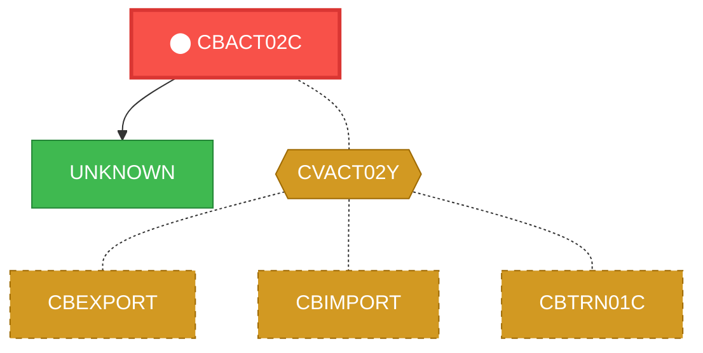
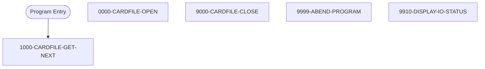

# Program: CBACT02C


---

## Quick Reference

| Attribute | Value |
|-----------|-------|
| Program ID | `CBACT02C` |
| Type | BATCH |
| Lines | 179 |
| Source | [CBACT02C.cbl](../carddemo/CBACT02C.cbl#L1) |
| Paragraphs | 5 |
| Statements | 34 |
| Impact Risk | **MEDIUM** — 9 programs affected |

> **View Source:** [Open CBACT02C.cbl](../carddemo/CBACT02C.cbl#L1)

## Source Grounding Facts

| Data Item | Literal Value |
|-----------|---------------|
| `END-OF-FILE` | `N` |

Status conditions found in source:
- `CARDFILE-STATUS = '00'`
- `CARDFILE-STATUS = '10'`


## Business Purpose

*Business purpose is not present in the extracted data. Run LLM enrichment to populate this section.*


## Dependency Context

> This section shows how **CBACT02C** connects to the rest of the system — who calls it,
> what it calls, and what data it shares. If linked programs exist, they must appear here.

### Programs That Call CBACT02C (Callers)

*No programs call CBACT02C — this is likely a top-level entry point or CICS transaction starter.*

### Programs Called by CBACT02C (Callees)

| Called Program | Type | Line | Why |
|----------------|------|------|-----|
| `UNKNOWN` | None | 172 |  |

### Shared Data (Copybooks & Files)

#### Shared Copybooks

| Copybook | Also Used By | # Co-Users |
|----------|-------------|------------|
| `CVACT02Y` | CBEXPORT, CBIMPORT, CBTRN01C, COACTVWC, COCRDLIC (+4 more) | 9 |

#### Shared Files

| File | Type | Access | Also Used By |
|------|------|--------|-------------|
| `CARDFILE-FILE` | VSAM | SEQUENTIAL |  |

## Legacy Data Contracts

> These tables are derived from FILE SECTION records and COPY-expanded data declarations. They preserve the legacy field names, COBOL storage type, inferred modern type, and status-code values needed for Java DTOs, SQL schemas, API contracts, and migration mapping.

### File Record Layouts

#### `CARDFILE-FILE` / `FD-CARDFILE-REC`
| Legacy Field | Meaning | COBOL Type | Modern Type | Notes |
|--------------|---------|------------|-------------|-------|
| `FD-CARDFILE-REC` | Fd Cardfile Record | `GROUP` | `OBJECT` |  |
| `FD-CARD-NUM` | Fd Card Number | `PIC X(16)` | `STRING(16)` |  |
| `FD-CARD-DATA` | Fd Card Data | `PIC X(134)` | `STRING(134)` |  |


### Copybook Segment Layouts

#### `CVACT02Y` as `CARD-RECORD`

| Legacy Field | Meaning | COBOL Type | Modern Type | Status / Format Notes |
|--------------|---------|------------|-------------|-----------------------|
| `CARD-RECORD` | Card Record | `GROUP` | `OBJECT` |  |
| `CARD-NUM` | Card Number | `PIC X(16)` | `STRING(16)` |  |
| `CARD-ACCT-ID` | Card Account ID | `PIC 9(11)` | `BIGINT` |  |
| `CARD-CVV-CD` | Card Cvv Cd | `PIC 9(03)` | `INTEGER` |  |
| `CARD-EMBOSSED-NAME` | Card Embossed Name | `PIC X(50)` | `STRING(50)` |  |
| `CARD-EXPIRAION-DATE` | Card Expiraion Date | `PIC X(10)` | `STRING(10)` | Date-like field; verify YYDDD, YYMMDD, or ISO format before migration. |
| `CARD-ACTIVE-STATUS` | Card Active Status | `PIC X(01)` | `STRING(1)` |  |
| `FILLER` | Filler | `PIC X(59)` | `STRING(59)` |  |


### Data Movement And Key Mapping

| Line | Source | Target | Meaning |
|------|--------|--------|---------|
| 108 | `'Y'` | `END-OF-FILE` | 'Y' populates END-OF-FILE |
| 111 | `CARDFILE-STATUS` | `IO-STATUS` | CARDFILE-STATUS populates IO-STATUS |
| 130 | `CARDFILE-STATUS` | `IO-STATUS` | CARDFILE-STATUS populates IO-STATUS |
| 148 | `CARDFILE-STATUS` | `IO-STATUS` | CARDFILE-STATUS populates IO-STATUS |
| 164 | `IO-STAT1` | `IO-STATUS-04(1:1)` | IO-STAT1 populates IO-STATUS-04(1:1) |
| 167 | `TWO-BYTES-BINARY` | `IO-STATUS-0403` | TWO-BYTES-BINARY populates IO-STATUS-0403 |
| 170 | `'0000'` | `IO-STATUS-04` | '0000' populates IO-STATUS-04 |
| 171 | `IO-STATUS` | `IO-STATUS-04(3:2)` | IO-STATUS populates IO-STATUS-04(3:2) |


---

## Dependency Graph



> **Legend:** 🔴 Target program · 🔵 Direct callers · 🟢 Direct callees · 🟡 Copybook-coupled · ⚫ Transitive (indirect)

---

## Impact Ripple View

> **If you change CBACT02C, what else could break?**

| Impact Metric | Count |
|--------------|-------|
| Direct Callers | 0 |
| Transitive Callers (callers of callers) | 0 |
| Direct Callees | 0 |
| Transitive Callees | 0 |
| Copybook-Coupled Programs | 9 |
| **Total Impact** | **9** |
| **Risk Rating** | **MEDIUM** |


**Programs affected via shared copybooks:**
- `CBEXPORT`
- `CBIMPORT`
- `CBTRN01C`
- `COACTVWC`
- `COCRDLIC`
- `COCRDSLC`
- `COCRDUPC`
- `COPAUS0C`
- `COTRTLIC`

---

## Statement Profile

| Statement Type | Count |
|---------------|-------|
| IF | 18 |
| EXIT | 4 |
| MOVE | 3 |
| READ | 2 |
| OPEN | 2 |
| CLOSE | 2 |
| DISPLAY | 1 |
| CALL | 1 |
| ARITHMETIC | 1 |

## Control Flow



## Paragraphs

### 1000-CARDFILE-GET-NEXT

| | |
|---|---|
| **Paragraph** | `1000-CARDFILE-GET-NEXT` |
| **Lines** | 92 - 117 |
| **View Code** | [Jump to Line 92](../carddemo/CBACT02C.cbl#L92) |


### 0000-CARDFILE-OPEN

| | |
|---|---|
| **Paragraph** | `0000-CARDFILE-OPEN` |
| **Lines** | 118 - 135 |
| **View Code** | [Jump to Line 118](../carddemo/CBACT02C.cbl#L118) |


### 9000-CARDFILE-CLOSE

| | |
|---|---|
| **Paragraph** | `9000-CARDFILE-CLOSE` |
| **Lines** | 136 - 153 |
| **View Code** | [Jump to Line 136](../carddemo/CBACT02C.cbl#L136) |


### 9999-ABEND-PROGRAM

| | |
|---|---|
| **Paragraph** | `9999-ABEND-PROGRAM` |
| **Lines** | 154 - 160 |
| **View Code** | [Jump to Line 154](../carddemo/CBACT02C.cbl#L154) |


### 9910-DISPLAY-IO-STATUS

| | |
|---|---|
| **Paragraph** | `9910-DISPLAY-IO-STATUS` |
| **Lines** | 161 - 178 |
| **View Code** | [Jump to Line 161](../carddemo/CBACT02C.cbl#L161) |


## Executed by JCL Jobs

This program is run by the following batch JCL jobs:

| Job Name | Step | Step Comments |
|----------|------|---------------|
| [READCARD](../jcl/READCARD.md) | `STEP05` | *****************************************************************
Copyright Amaz... |


## Copybook Field Dictionaries

The following copybooks are included by this program. Each entry shows the actual fields
extracted from the copybook source file (`.cpy`).

### Copybook `CVACT02Y`

| Level | Field | PIC | USAGE | Parent | Notes |
|-------|-------|-----|-------|--------|-------|
| `01` | `CARD-RECORD` | `None` | None | None |  |
| `05` | `CARD-NUM` | `X(16)` | None | CARD-RECORD |  |
| `05` | `CARD-ACCT-ID` | `9(11)` | None | CARD-RECORD |  |
| `05` | `CARD-CVV-CD` | `9(03)` | None | CARD-RECORD |  |
| `05` | `CARD-EMBOSSED-NAME` | `X(50)` | None | CARD-RECORD |  |
| `05` | `CARD-EXPIRAION-DATE` | `X(10)` | None | CARD-RECORD |  |
| `05` | `CARD-ACTIVE-STATUS` | `X(01)` | None | CARD-RECORD |  |


## File Record Layouts (FD)

This program declares the following file records (data contracts for I/O):

### `FD CARDFILE-FILE` (record `FD-CARDFILE-REC`)

| Level | Field | PIC | USAGE | Parent |
|-------|-------|-----|-------|--------|
| `01` | `FD-CARDFILE-REC` | `None` | None | None |
| `05` | `FD-CARD-NUM` | `X(16)` | None | FD-CARDFILE-REC |
| `05` | `FD-CARD-DATA` | `X(134)` | None | FD-CARDFILE-REC |


## Data Lineage (MOVE Flow)

The following MOVE statements were extracted from the source. Each row is a `source → destination`
flow that the migration team can use to trace how data is reshaped and routed.

| Source | Destination | Paragraph | Line |
|--------|-------------|-----------|------|
| `'0'` | `APPL-RESULT` | 1000-CARDFILE-GET-NEXT | 95 |
| `'16'` | `APPL-RESULT` | 1000-CARDFILE-GET-NEXT | 99 |
| `'12'` | `APPL-RESULT` | 1000-CARDFILE-GET-NEXT | 101 |
| `'Y'` | `END-OF-FILE` | 1000-CARDFILE-GET-NEXT | 108 |
| `CARDFILE-STATUS` | `IO-STATUS` | 1000-CARDFILE-GET-NEXT | 111 |
| `'8'` | `APPL-RESULT` | 0000-CARDFILE-OPEN | 119 |
| `'0'` | `APPL-RESULT` | 0000-CARDFILE-OPEN | 122 |
| `'12'` | `APPL-RESULT` | 0000-CARDFILE-OPEN | 124 |
| `CARDFILE-STATUS` | `IO-STATUS` | 0000-CARDFILE-OPEN | 130 |
| `CARDFILE-STATUS` | `IO-STATUS` | 9000-CARDFILE-CLOSE | 148 |
| `'0'` | `TIMING` | 9999-ABEND-PROGRAM | 156 |
| `'999'` | `ABCODE` | 9999-ABEND-PROGRAM | 157 |
| `IO-STAT1` | `IO-STATUS-04` | 9910-DISPLAY-IO-STATUS | 164 |
| `'0'` | `TWO-BYTES-BINARY` | 9910-DISPLAY-IO-STATUS | 165 |
| `IO-STAT2` | `TWO-BYTES-RIGHT` | 9910-DISPLAY-IO-STATUS | 166 |
| `TWO-BYTES-BINARY` | `IO-STATUS-0403` | 9910-DISPLAY-IO-STATUS | 167 |
| `'0000'` | `IO-STATUS-04` | 9910-DISPLAY-IO-STATUS | 170 |
| `IO-STATUS` | `IO-STATUS-04` | 9910-DISPLAY-IO-STATUS | 171 |


## Known Issues & Code Anomalies

Static analysis flagged the following items in this program. Migration teams should
review each one before re-implementing in a modern stack.

| Severity | Category | Title | Paragraph | Line |
|----------|----------|-------|-----------|------|
| **NOTICE** | DEAD_CODE | Variable `FD-CARD-DATA` is declared but never referenced | None | 40 |
| **NOTICE** | DEAD_CODE | Variable `CARDFILE-STAT1` is declared but never referenced | None | 47 |
| **NOTICE** | DEAD_CODE | Variable `CARDFILE-STAT2` is declared but never referenced | None | 48 |
| **NOTICE** | DEAD_CODE | Variable `TWO-BYTES-LEFT` is declared but never referenced | None | 55 |
| **NOTICE** | DEAD_CODE | Variable `IO-STATUS-0401` is declared but never referenced | None | 58 |
| **NOTICE** | LOGIC | Paragraph `1000-CARDFILE-GET-NEXT` terminates the program on error | 1000-CARDFILE-GET-NEXT | 92 |
| **NOTICE** | LOGIC | Paragraph `0000-CARDFILE-OPEN` terminates the program on error | 0000-CARDFILE-OPEN | 118 |
| **NOTICE** | LOGIC | Paragraph `9000-CARDFILE-CLOSE` terminates the program on error | 9000-CARDFILE-CLOSE | 136 |
| **NOTICE** | DEPENDENCY | Static CALL to external `CEE3ABD` (not in this codebase) | None | 158 |

### NOTICE — Variable `FD-CARD-DATA` is declared but never referenced

`FD-CARD-DATA` is declared at line 40 but no other statement reads or writes it. Likely a leftover from prior refactoring or an incomplete feature.
**Source excerpt** (line 40):
```cobol
05 FD-CARD-DATA                      PIC X(134).
```

**Recommendation:** Remove the declaration or wire it into the logic that was originally intended.
---
### NOTICE — Variable `CARDFILE-STAT1` is declared but never referenced

`CARDFILE-STAT1` is declared at line 47 but no other statement reads or writes it. Likely a leftover from prior refactoring or an incomplete feature.
**Source excerpt** (line 47):
```cobol
05  CARDFILE-STAT1      PIC X.
```

**Recommendation:** Remove the declaration or wire it into the logic that was originally intended.
---
### NOTICE — Variable `CARDFILE-STAT2` is declared but never referenced

`CARDFILE-STAT2` is declared at line 48 but no other statement reads or writes it. Likely a leftover from prior refactoring or an incomplete feature.
**Source excerpt** (line 48):
```cobol
05  CARDFILE-STAT2      PIC X.
```

**Recommendation:** Remove the declaration or wire it into the logic that was originally intended.
---
### NOTICE — Variable `TWO-BYTES-LEFT` is declared but never referenced

`TWO-BYTES-LEFT` is declared at line 55 but no other statement reads or writes it. Likely a leftover from prior refactoring or an incomplete feature.
**Source excerpt** (line 55):
```cobol
05  TWO-BYTES-LEFT      PIC X.
```

**Recommendation:** Remove the declaration or wire it into the logic that was originally intended.
---
### NOTICE — Variable `IO-STATUS-0401` is declared but never referenced

`IO-STATUS-0401` is declared at line 58 but no other statement reads or writes it. Likely a leftover from prior refactoring or an incomplete feature.
**Source excerpt** (line 58):
```cobol
05  IO-STATUS-0401      PIC 9   VALUE 0.
```

**Recommendation:** Remove the declaration or wire it into the logic that was originally intended.
---
### NOTICE — Paragraph `1000-CARDFILE-GET-NEXT` terminates the program on error

`1000-CARDFILE-GET-NEXT` calls an ABEND routine (or STOP RUN) on the failure path. This means an error here ENDS the entire program — it does NOT reject, skip, or log-and-continue. Documentation must use "abend" / "terminate" language, not "reject".

**Recommendation:** Use ‘abend’ or ‘terminates the program’ when describing the error path of this paragraph.
---
### NOTICE — Paragraph `0000-CARDFILE-OPEN` terminates the program on error

`0000-CARDFILE-OPEN` calls an ABEND routine (or STOP RUN) on the failure path. This means an error here ENDS the entire program — it does NOT reject, skip, or log-and-continue. Documentation must use "abend" / "terminate" language, not "reject".

**Recommendation:** Use ‘abend’ or ‘terminates the program’ when describing the error path of this paragraph.
---
### NOTICE — Paragraph `9000-CARDFILE-CLOSE` terminates the program on error

`9000-CARDFILE-CLOSE` calls an ABEND routine (or STOP RUN) on the failure path. This means an error here ENDS the entire program — it does NOT reject, skip, or log-and-continue. Documentation must use "abend" / "terminate" language, not "reject".

**Recommendation:** Use ‘abend’ or ‘terminates the program’ when describing the error path of this paragraph.
---
### NOTICE — Static CALL to external `CEE3ABD` (not in this codebase)

`CALL 'CEE3ABD'` appears in the source but `CEE3ABD` is not a program in the loaded codebase. IBM Language Environment ABEND service (forces program termination with a user code).
**Source excerpt** (line 158):
```cobol
CALL 'CEE3ABD' USING ABCODE, TIMING.
```

**Recommendation:** Document this external dependency in the Migration Notes — the modern equivalent must replicate its behaviour.
---


## File OPEN / CLOSE Operations

The exact OPEN mode (INPUT / OUTPUT / I-O / EXTEND) determines whether a file can be
read, written, or both — and whether REWRITE / DELETE are legal. This table is the
source of truth for migrators converting to modern storage layers.

| File | Operation | Mode | Paragraph | Line |
|------|-----------|------|-----------|------|
| `CARDFILE-FILE` | OPEN | INPUT | 0000-CARDFILE-OPEN | 120 |
| `CARDFILE-FILE` | CLOSE | None | 9000-CARDFILE-CLOSE | 138 |


## Modernization Review Findings

These are source-derived review notes that should be checked before translating this program into Java, Spring Boot, SQL, APIs, or batch jobs.

| Finding | Why It Matters |
|---------|----------------|
| Nested IF blocks need compiler-accurate validation | Nested conditional logic was detected. During migration, validate scope with the original compiler rules and explicit `END-IF`/period termination before translating to Java or SQL. |


## Business Rules

- **Card File Read Successful** `BR-061`  
  If a card record is successfully read from the input file, the system proceeds to process the card data.  
  [View Rule Details](../business-rules/BR-061.md)
- **Card File End of File** `BR-062`  
  When the end of the card input file is reached, the system closes the card file and proceeds to the program's termination logic.  
  [View Rule Details](../business-rules/BR-062.md)
- **Card File Open Successful** `BR-063`  
  The card file must open successfully before processing can continue.  
  [View Rule Details](../business-rules/BR-063.md)
- **Card File Open Unsuccessful** `BR-064`  
  If the card file cannot be opened, the batch process will terminate.  
  [View Rule Details](../business-rules/BR-064.md)
- **Card File Close Successful** `BR-065`  
  The card file must be closed successfully after processing all card records.  
  [View Rule Details](../business-rules/BR-065.md)
- **Card File Close Unsuccessful** `BR-066`  
  If the card file cannot be closed successfully, the program must terminate abnormally.  
  [View Rule Details](../business-rules/BR-066.md)
- **File Open Successful** `BR-067`  
  The card file must open successfully before processing can continue.  
  [View Rule Details](../business-rules/BR-067.md)
- **File Read Successful** `BR-068`  
  The card file must be read successfully to process card records.  
  [View Rule Details](../business-rules/BR-068.md)

## Key Data Items

| Name | Level | Picture | Section | Business Name |
|------|-------|---------|---------|---------------|
| `CARD-RECORD` | 1 | `None` | WORKING-STORAGE | None |
| `CARD-NUM` | 5 | `X(16)` | WORKING-STORAGE | None |
| `CARD-ACCT-ID` | 5 | `9(11)` | WORKING-STORAGE | None |
| `CARD-CVV-CD` | 5 | `9(03)` | WORKING-STORAGE | None |
| `CARD-EMBOSSED-NAME` | 5 | `X(50)` | WORKING-STORAGE | None |
| `CARD-EXPIRAION-DATE` | 5 | `X(10)` | WORKING-STORAGE | None |
| `CARD-ACTIVE-STATUS` | 5 | `X(01)` | WORKING-STORAGE | None |
| `FILLER` | 5 | `X(59)` | WORKING-STORAGE | None |
| `CARDFILE-STATUS` | 1 | `None` | WORKING-STORAGE | None |
| `CARDFILE-STAT1` | 5 | `X` | WORKING-STORAGE | None |
| `CARDFILE-STAT2` | 5 | `X` | WORKING-STORAGE | None |
| `IO-STATUS` | 1 | `None` | WORKING-STORAGE | None |
| `IO-STAT1` | 5 | `X` | WORKING-STORAGE | None |
| `IO-STAT2` | 5 | `X` | WORKING-STORAGE | None |
| `TWO-BYTES-BINARY` | 1 | `9(4)` | WORKING-STORAGE | None |
| `TWO-BYTES-ALPHA` | 1 | `None` | WORKING-STORAGE | None |
| `TWO-BYTES-LEFT` | 5 | `X` | WORKING-STORAGE | None |
| `TWO-BYTES-RIGHT` | 5 | `X` | WORKING-STORAGE | None |
| `IO-STATUS-04` | 1 | `None` | WORKING-STORAGE | None |
| `IO-STATUS-0401` | 5 | `9` | WORKING-STORAGE | None |
| `IO-STATUS-0403` | 5 | `999` | WORKING-STORAGE | None |
| `APPL-RESULT` | 1 | `S9(9)` | WORKING-STORAGE | None |
| `APPL-AOK` | 88 | `None` | WORKING-STORAGE | None |
| `APPL-EOF` | 88 | `None` | WORKING-STORAGE | None |
| `END-OF-FILE` | 1 | `X(01)` | WORKING-STORAGE | None |
| `ABCODE` | 1 | `S9(9)` | WORKING-STORAGE | None |
| `TIMING` | 1 | `S9(9)` | WORKING-STORAGE | None |

---

*Generated 2026-05-02 17:07*