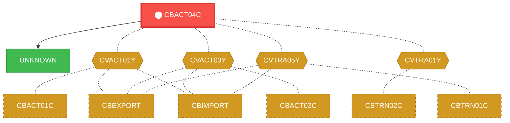

# Program: CBACT04C


---

## Quick Reference

| Attribute | Value |
|-----------|-------|
| Program ID | `CBACT04C` |
| Type | BATCH |
| Lines | 653 |
| Source | [CBACT04C.cbl](../carddemo/CBACT04C.cbl#L1) |
| Paragraphs | 22 |
| Statements | 175 |
| Impact Risk | **HIGH** — 18 programs affected |

> **View Source:** [Open CBACT04C.cbl](../carddemo/CBACT04C.cbl#L1)

## Source Grounding Facts

| Data Item | Literal Value |
|-----------|---------------|
| `END-OF-FILE` | `N` |
| `WS-FIRST-TIME` | `Y` |

Status conditions found in source:
- `TCATBALF-STATUS = '00'`
- `XREFFILE-STATUS = '00'`
- `DISCGRP-STATUS = '00'`
- `ACCTFILE-STATUS = '00'`
- `TRANFILE-STATUS = '00'`
- `TCATBALF-STATUS = '10'`
- `DISCGRP-STATUS = '23'`


## Business Purpose

*Business purpose is not present in the extracted data. Run LLM enrichment to populate this section.*


## Dependency Context

> This section shows how **CBACT04C** connects to the rest of the system — who calls it,
> what it calls, and what data it shares. If linked programs exist, they must appear here.

### Programs That Call CBACT04C (Callers)

*No programs call CBACT04C — this is likely a top-level entry point or CICS transaction starter.*

### Programs Called by CBACT04C (Callees)

| Called Program | Type | Line | Why |
|----------------|------|------|-----|
| `UNKNOWN` | None | 710 |  |

### Shared Data (Copybooks & Files)

#### Shared Copybooks

| Copybook | Also Used By | # Co-Users |
|----------|-------------|------------|
| `CVACT01Y` | CBACT01C, CBEXPORT, CBIMPORT, CBSTM03A, CBTRN01C (+8 more) | 13 |
| `CVACT03Y` | CBACT03C, CBEXPORT, CBIMPORT, CBSTM03A, CBTRN01C (+8 more) | 13 |
| `CVTRA01Y` | CBTRN02C | 1 |
| `CVTRA02Y` |  | 0 |
| `CVTRA05Y` | CBEXPORT, CBIMPORT, CBTRN01C, CBTRN02C, CBTRN03C (+5 more) | 10 |

#### Shared Files

| File | Type | Access | Also Used By |
|------|------|--------|-------------|
| `ACCOUNT-FILE` | VSAM | RANDOM | CBTRN01C, CBTRN02C |
| `DISCGRP-FILE` | VSAM | RANDOM |  |
| `TCATBAL-FILE` | VSAM | SEQUENTIAL | CBTRN02C |
| `TRANSACT-FILE` | SEQUENTIAL | SEQUENTIAL | CBTRN01C, CBTRN02C, CBTRN03C |
| `XREF-FILE` | VSAM | RANDOM | CBSTM03B, CBTRN01C, CBTRN02C, CBTRN03C |

## Legacy Data Contracts

> These tables are derived from FILE SECTION records and COPY-expanded data declarations. They preserve the legacy field names, COBOL storage type, inferred modern type, and status-code values needed for Java DTOs, SQL schemas, API contracts, and migration mapping.

### File Record Layouts

#### `TCATBAL-FILE` / `FD-TRAN-CAT-BAL-RECORD`
| Legacy Field | Meaning | COBOL Type | Modern Type | Notes |
|--------------|---------|------------|-------------|-------|
| `FD-TRAN-CAT-BAL-RECORD` | Fd Tran Cat Bal Record | `GROUP` | `OBJECT` |  |
| `FD-TRAN-CAT-KEY` | Fd Tran Cat Key | `GROUP` | `OBJECT` |  |
| `FD-TRANCAT-ACCT-ID` | Fd Trancat Account ID | `PIC 9(11)` | `BIGINT` |  |
| `FD-TRANCAT-TYPE-CD` | Fd Trancat Type Cd | `PIC X(02)` | `STRING(2)` |  |
| `FD-TRANCAT-CD` | Fd Trancat Cd | `PIC 9(04)` | `INTEGER` |  |
| `FD-FD-TRAN-CAT-DATA` | Fd Fd Tran Cat Data | `PIC X(33)` | `STRING(33)` |  |

#### `XREF-FILE` / `FD-XREFFILE-REC`
| Legacy Field | Meaning | COBOL Type | Modern Type | Notes |
|--------------|---------|------------|-------------|-------|
| `FD-XREFFILE-REC` | Fd Xreffile Record | `GROUP` | `OBJECT` |  |
| `FD-XREF-CARD-NUM` | Fd Xref Card Number | `PIC X(16)` | `STRING(16)` |  |
| `FD-XREF-CUST-NUM` | Fd Xref Customer Number | `PIC 9(09)` | `INTEGER` |  |
| `FD-XREF-ACCT-ID` | Fd Xref Account ID | `PIC 9(11)` | `BIGINT` |  |
| `FD-XREF-FILLER` | Fd Xref Filler | `PIC X(14)` | `STRING(14)` |  |

#### `DISCGRP-FILE` / `FD-DISCGRP-REC`
| Legacy Field | Meaning | COBOL Type | Modern Type | Notes |
|--------------|---------|------------|-------------|-------|
| `FD-DISCGRP-REC` | Fd Discgrp Record | `GROUP` | `OBJECT` |  |
| `FD-DISCGRP-KEY` | Fd Discgrp Key | `GROUP` | `OBJECT` |  |
| `FD-DIS-ACCT-GROUP-ID` | Fd Dis Account Group ID | `PIC X(10)` | `STRING(10)` |  |
| `FD-DIS-TRAN-TYPE-CD` | Fd Dis Tran Type Cd | `PIC X(02)` | `STRING(2)` |  |
| `FD-DIS-TRAN-CAT-CD` | Fd Dis Tran Cat Cd | `PIC 9(04)` | `INTEGER` |  |
| `FD-DISCGRP-DATA` | Fd Discgrp Data | `PIC X(34)` | `STRING(34)` |  |

#### `ACCOUNT-FILE` / `FD-ACCTFILE-REC`
| Legacy Field | Meaning | COBOL Type | Modern Type | Notes |
|--------------|---------|------------|-------------|-------|
| `FD-ACCTFILE-REC` | Fd Acctfile Record | `GROUP` | `OBJECT` |  |
| `FD-ACCT-ID` | Fd Account ID | `PIC 9(11)` | `BIGINT` |  |
| `FD-ACCT-DATA` | Fd Account Data | `PIC X(289)` | `STRING(289)` |  |

#### `TRANSACT-FILE` / `FD-TRANFILE-REC`
| Legacy Field | Meaning | COBOL Type | Modern Type | Notes |
|--------------|---------|------------|-------------|-------|
| `FD-TRANFILE-REC` | Fd Tranfile Record | `GROUP` | `OBJECT` |  |
| `FD-TRANS-ID` | Fd Trans ID | `PIC X(16)` | `STRING(16)` |  |
| `FD-ACCT-DATA` | Fd Account Data | `PIC X(334)` | `STRING(334)` |  |


### Copybook Segment Layouts

#### `CVACT01Y` as `ACCOUNT-RECORD`

| Legacy Field | Meaning | COBOL Type | Modern Type | Status / Format Notes |
|--------------|---------|------------|-------------|-----------------------|
| `ACCOUNT-RECORD` | Account Record | `GROUP` | `OBJECT` |  |
| `ACCT-ID` | Account ID | `PIC 9(11)` | `BIGINT` |  |
| `ACCT-ACTIVE-STATUS` | Account Active Status | `PIC X(01)` | `STRING(1)` |  |
| `ACCT-CURR-BAL` | Account Curr Bal | `PIC S9(10)V99` | `DECIMAL(12,2)` |  |
| `ACCT-CREDIT-LIMIT` | Account Credit Limit | `PIC S9(10)V99` | `DECIMAL(12,2)` |  |
| `ACCT-CASH-CREDIT-LIMIT` | Account Cash Credit Limit | `PIC S9(10)V99` | `DECIMAL(12,2)` |  |
| `ACCT-OPEN-DATE` | Account Open Date | `PIC X(10)` | `STRING(10)` | Date-like field; verify YYDDD, YYMMDD, or ISO format before migration. |
| `ACCT-EXPIRAION-DATE` | Account Expiraion Date | `PIC X(10)` | `STRING(10)` | Date-like field; verify YYDDD, YYMMDD, or ISO format before migration. |
| `ACCT-REISSUE-DATE` | Account Reissue Date | `PIC X(10)` | `STRING(10)` | Date-like field; verify YYDDD, YYMMDD, or ISO format before migration. |
| `ACCT-CURR-CYC-CREDIT` | Account Curr Cyc Credit | `PIC S9(10)V99` | `DECIMAL(12,2)` |  |
| `ACCT-CURR-CYC-DEBIT` | Account Curr Cyc Debit | `PIC S9(10)V99` | `DECIMAL(12,2)` |  |
| `ACCT-ADDR-ZIP` | Account Addr Zip | `PIC X(10)` | `STRING(10)` |  |
| `ACCT-GROUP-ID` | Account Group ID | `PIC X(10)` | `STRING(10)` |  |
| `FILLER` | Filler | `PIC X(178)` | `STRING(178)` |  |

#### `CVACT03Y` as `CARD-XREF-RECORD`

| Legacy Field | Meaning | COBOL Type | Modern Type | Status / Format Notes |
|--------------|---------|------------|-------------|-----------------------|
| `CARD-XREF-RECORD` | Card Xref Record | `GROUP` | `OBJECT` |  |
| `XREF-CARD-NUM` | Xref Card Number | `PIC X(16)` | `STRING(16)` |  |
| `XREF-CUST-ID` | Xref Customer ID | `PIC 9(09)` | `INTEGER` |  |
| `XREF-ACCT-ID` | Xref Account ID | `PIC 9(11)` | `BIGINT` |  |
| `FILLER` | Filler | `PIC X(14)` | `STRING(14)` |  |

#### `CVTRA01Y` as `TRAN-CAT-BAL-RECORD`

| Legacy Field | Meaning | COBOL Type | Modern Type | Status / Format Notes |
|--------------|---------|------------|-------------|-----------------------|
| `TRAN-CAT-BAL-RECORD` | Tran Cat Bal Record | `GROUP` | `OBJECT` |  |
| `TRAN-CAT-KEY` | Tran Cat Key | `GROUP` | `OBJECT` |  |
| `TRANCAT-ACCT-ID` | Trancat Account ID | `PIC 9(11)` | `BIGINT` |  |
| `TRANCAT-TYPE-CD` | Trancat Type Cd | `PIC X(02)` | `STRING(2)` |  |
| `TRANCAT-CD` | Trancat Cd | `PIC 9(04)` | `INTEGER` |  |
| `TRAN-CAT-BAL` | Tran Cat Bal | `PIC S9(09)V99` | `DECIMAL(11,2)` |  |
| `FILLER` | Filler | `PIC X(22)` | `STRING(22)` |  |

#### `CVTRA02Y` as `DIS-GROUP-RECORD`

| Legacy Field | Meaning | COBOL Type | Modern Type | Status / Format Notes |
|--------------|---------|------------|-------------|-----------------------|
| `DIS-GROUP-RECORD` | Dis Group Record | `GROUP` | `OBJECT` |  |
| `DIS-GROUP-KEY` | Dis Group Key | `GROUP` | `OBJECT` |  |
| `DIS-ACCT-GROUP-ID` | Dis Account Group ID | `PIC X(10)` | `STRING(10)` |  |
| `DIS-TRAN-TYPE-CD` | Dis Tran Type Cd | `PIC X(02)` | `STRING(2)` |  |
| `DIS-TRAN-CAT-CD` | Dis Tran Cat Cd | `PIC 9(04)` | `INTEGER` |  |
| `DIS-INT-RATE` | Dis Int Rate | `PIC S9(04)V99` | `DECIMAL(6,2)` |  |
| `FILLER` | Filler | `PIC X(28)` | `STRING(28)` |  |

#### `CVTRA05Y` as `TRAN-RECORD`

| Legacy Field | Meaning | COBOL Type | Modern Type | Status / Format Notes |
|--------------|---------|------------|-------------|-----------------------|
| `TRAN-RECORD` | Tran Record | `GROUP` | `OBJECT` |  |
| `TRAN-ID` | Tran ID | `PIC X(16)` | `STRING(16)` |  |
| `TRAN-TYPE-CD` | Tran Type Cd | `PIC X(02)` | `STRING(2)` |  |
| `TRAN-CAT-CD` | Tran Cat Cd | `PIC 9(04)` | `INTEGER` |  |
| `TRAN-SOURCE` | Tran Source | `PIC X(10)` | `STRING(10)` |  |
| `TRAN-DESC` | Tran Desc | `PIC X(100)` | `STRING(100)` |  |
| `TRAN-AMT` | Tran Amount | `PIC S9(09)V99` | `DECIMAL(11,2)` |  |
| `TRAN-MERCHANT-ID` | Tran Merchant ID | `PIC 9(09)` | `INTEGER` |  |
| `TRAN-MERCHANT-NAME` | Tran Merchant Name | `PIC X(50)` | `STRING(50)` |  |
| `TRAN-MERCHANT-CITY` | Tran Merchant City | `PIC X(50)` | `STRING(50)` |  |
| `TRAN-MERCHANT-ZIP` | Tran Merchant Zip | `PIC X(10)` | `STRING(10)` |  |
| `TRAN-CARD-NUM` | Tran Card Number | `PIC X(16)` | `STRING(16)` |  |
| `TRAN-ORIG-TS` | Tran Orig Ts | `PIC X(26)` | `STRING(26)` |  |
| `TRAN-PROC-TS` | Tran Proc Ts | `PIC X(26)` | `STRING(26)` |  |
| `FILLER` | Filler | `PIC X(20)` | `STRING(20)` |  |


### Data Movement And Key Mapping

| Line | Source | Target | Meaning |
|------|--------|--------|---------|
| 201 | `TRANCAT-ACCT-ID` | `WS-LAST-ACCT-NUM` | TRANCAT-ACCT-ID populates WS-LAST-ACCT-NUM |
| 202 | `TRANCAT-ACCT-ID` | `FD-ACCT-ID` | TRANCAT-ACCT-ID populates FD-ACCT-ID |
| 204 | `TRANCAT-ACCT-ID` | `FD-XREF-ACCT-ID` | TRANCAT-ACCT-ID populates FD-XREF-ACCT-ID |
| 210 | `ACCT-GROUP-ID` | `FD-DIS-ACCT-GROUP-ID` | ACCT-GROUP-ID populates FD-DIS-ACCT-GROUP-ID |
| 246 | `TCATBALF-STATUS` | `IO-STATUS` | TCATBALF-STATUS populates IO-STATUS |
| 264 | `XREFFILE-STATUS` | `IO-STATUS` | XREFFILE-STATUS populates IO-STATUS |
| 282 | `DISCGRP-STATUS` | `IO-STATUS` | DISCGRP-STATUS populates IO-STATUS |
| 301 | `ACCTFILE-STATUS` | `IO-STATUS` | ACCTFILE-STATUS populates IO-STATUS |
| 319 | `TRANFILE-STATUS` | `IO-STATUS` | TRANFILE-STATUS populates IO-STATUS |
| 340 | `'Y'` | `END-OF-FILE` | 'Y' populates END-OF-FILE |
| 343 | `TCATBALF-STATUS` | `IO-STATUS` | TCATBALF-STATUS populates IO-STATUS |
| 353 | `0` | `ACCT-CURR-CYC-CREDIT` | 0 populates ACCT-CURR-CYC-CREDIT |
| 354 | `0` | `ACCT-CURR-CYC-DEBIT` | 0 populates ACCT-CURR-CYC-DEBIT |
| 366 | `ACCTFILE-STATUS` | `IO-STATUS` | ACCTFILE-STATUS populates IO-STATUS |
| 387 | `ACCTFILE-STATUS` | `IO-STATUS` | ACCTFILE-STATUS populates IO-STATUS |
| 409 | `XREFFILE-STATUS` | `IO-STATUS` | XREFFILE-STATUS populates IO-STATUS |
| 432 | `DISCGRP-STATUS` | `IO-STATUS` | DISCGRP-STATUS populates IO-STATUS |
| 437 | `'DEFAULT'` | `FD-DIS-ACCT-GROUP-ID` | 'DEFAULT' populates FD-DIS-ACCT-GROUP-ID |
| 456 | `DISCGRP-STATUS` | `IO-STATUS` | DISCGRP-STATUS populates IO-STATUS |
| 490 | `WS-MONTHLY-INT` | `TRAN-AMT` | WS-MONTHLY-INT populates TRAN-AMT |
| 511 | `TRANFILE-STATUS` | `IO-STATUS` | TRANFILE-STATUS populates IO-STATUS |
| 534 | `TCATBALF-STATUS` | `IO-STATUS` | TCATBALF-STATUS populates IO-STATUS |
| 553 | `XREFFILE-STATUS` | `IO-STATUS` | XREFFILE-STATUS populates IO-STATUS |
| 571 | `DISCGRP-STATUS` | `IO-STATUS` | DISCGRP-STATUS populates IO-STATUS |
| 589 | `ACCTFILE-STATUS` | `IO-STATUS` | ACCTFILE-STATUS populates IO-STATUS |
| 607 | `TRANFILE-STATUS` | `IO-STATUS` | TRANFILE-STATUS populates IO-STATUS |
| 614 | `FUNCTION CURRENT-DATE` | `COBOL-TS` | FUNCTION CURRENT-DATE populates COBOL-TS |
| 638 | `IO-STAT1` | `IO-STATUS-04(1:1)` | IO-STAT1 populates IO-STATUS-04(1:1) |
| 641 | `TWO-BYTES-BINARY` | `IO-STATUS-0403` | TWO-BYTES-BINARY populates IO-STATUS-0403 |
| 644 | `'0000'` | `IO-STATUS-04` | '0000' populates IO-STATUS-04 |


---

## Dependency Graph



> **Legend:** 🔴 Target program · 🔵 Direct callers · 🟢 Direct callees · 🟡 Copybook-coupled · ⚫ Transitive (indirect)

---

## Impact Ripple View

> **If you change CBACT04C, what else could break?**

| Impact Metric | Count |
|--------------|-------|
| Direct Callers | 0 |
| Transitive Callers (callers of callers) | 0 |
| Direct Callees | 0 |
| Transitive Callees | 0 |
| Copybook-Coupled Programs | 18 |
| **Total Impact** | **18** |
| **Risk Rating** | **HIGH** |


**Programs affected via shared copybooks:**
- `CBACT01C`
- `CBACT03C`
- `CBEXPORT`
- `CBIMPORT`
- `CBSTM03A`
- `CBTRN01C`
- `CBTRN02C`
- `CBTRN03C`
- `COACCT01`
- `COACTUPC`
- `COACTVWC`
- `COBIL00C`
- `COPAUA0C`
- `COPAUS0C`
- `CORPT00C`
- `COTRN00C`
- `COTRN01C`
- `COTRN02C`

---

## Statement Profile

| Statement Type | Count |
|---------------|-------|
| IF | 74 |
| MOVE | 36 |
| EXIT | 21 |
| READ | 10 |
| OPEN | 10 |
| CLOSE | 10 |
| ARITHMETIC | 3 |
| WRITE | 2 |
| STRING_OP | 2 |
| REWRITE | 2 |
| PERFORM | 2 |
| DISPLAY | 1 |
| COMPUTE | 1 |
| CALL | 1 |

## Control Flow

```mermaid
flowchart TD
    START([Program Entry])
    0000_TCATBALF_OPEN["0000-TCATBALF-OPEN"]
    0100_XREFFILE_OPEN["0100-XREFFILE-OPEN"]
    0200_DISCGRP_OPEN["0200-DISCGRP-OPEN"]
    0300_ACCTFILE_OPEN["0300-ACCTFILE-OPEN"]
    0400_TRANFILE_OPEN["0400-TRANFILE-OPEN"]
    1000_TCATBALF_GET_NEXT["1000-TCATBALF-GET-NEXT"]
    1050_UPDATE_ACCOUNT["1050-UPDATE-ACCOUNT"]
    1100_GET_ACCT_DATA["1100-GET-ACCT-DATA"]
    1110_GET_XREF_DATA["1110-GET-XREF-DATA"]
    1200_GET_INTEREST_RATE["1200-GET-INTEREST-RATE"]
    1200_A_GET_DEFAULT_INT_RATE["1200-A-GET-DEFAULT-INT-RATE"]
    1300_COMPUTE_INTEREST["1300-COMPUTE-INTEREST"]
    1300_B_WRITE_TX["1300-B-WRITE-TX"]
    1400_COMPUTE_FEES["1400-COMPUTE-FEES"]
    9000_TCATBALF_CLOSE["9000-TCATBALF-CLOSE"]
    START --> 0000_TCATBALF_OPEN
    1300_B_WRITE_TX --> Z_GET_DB2_FORMAT_TIMESTAMP
    9100_XREFFILE_CLOSE --> INLINE
    9200_DISCGRP_CLOSE --> INLINE
```



## Paragraphs

### 0000-TCATBALF-OPEN

| | |
|---|---|
| **Paragraph** | `0000-TCATBALF-OPEN` |
| **Lines** | 234 - 251 |
| **View Code** | [Jump to Line 234](../carddemo/CBACT04C.cbl#L234) |


### 0100-XREFFILE-OPEN

| | |
|---|---|
| **Paragraph** | `0100-XREFFILE-OPEN` |
| **Lines** | 252 - 269 |
| **View Code** | [Jump to Line 252](../carddemo/CBACT04C.cbl#L252) |


### 0200-DISCGRP-OPEN

| | |
|---|---|
| **Paragraph** | `0200-DISCGRP-OPEN` |
| **Lines** | 270 - 288 |
| **View Code** | [Jump to Line 270](../carddemo/CBACT04C.cbl#L270) |


### 0300-ACCTFILE-OPEN

| | |
|---|---|
| **Paragraph** | `0300-ACCTFILE-OPEN` |
| **Lines** | 289 - 306 |
| **View Code** | [Jump to Line 289](../carddemo/CBACT04C.cbl#L289) |


### 0400-TRANFILE-OPEN

| | |
|---|---|
| **Paragraph** | `0400-TRANFILE-OPEN` |
| **Lines** | 307 - 324 |
| **View Code** | [Jump to Line 307](../carddemo/CBACT04C.cbl#L307) |


### 1000-TCATBALF-GET-NEXT

| | |
|---|---|
| **Paragraph** | `1000-TCATBALF-GET-NEXT` |
| **Lines** | 325 - 349 |
| **View Code** | [Jump to Line 325](../carddemo/CBACT04C.cbl#L325) |


### 1050-UPDATE-ACCOUNT

| | |
|---|---|
| **Paragraph** | `1050-UPDATE-ACCOUNT` |
| **Lines** | 350 - 371 |
| **View Code** | [Jump to Line 350](../carddemo/CBACT04C.cbl#L350) |


### 1100-GET-ACCT-DATA

| | |
|---|---|
| **Paragraph** | `1100-GET-ACCT-DATA` |
| **Lines** | 372 - 392 |
| **View Code** | [Jump to Line 372](../carddemo/CBACT04C.cbl#L372) |


### 1110-GET-XREF-DATA

| | |
|---|---|
| **Paragraph** | `1110-GET-XREF-DATA` |
| **Lines** | 393 - 414 |
| **View Code** | [Jump to Line 393](../carddemo/CBACT04C.cbl#L393) |


### 1200-GET-INTEREST-RATE

| | |
|---|---|
| **Paragraph** | `1200-GET-INTEREST-RATE` |
| **Lines** | 415 - 442 |
| **View Code** | [Jump to Line 415](../carddemo/CBACT04C.cbl#L415) |


### 1200-A-GET-DEFAULT-INT-RATE

| | |
|---|---|
| **Paragraph** | `1200-A-GET-DEFAULT-INT-RATE` |
| **Lines** | 443 - 461 |
| **View Code** | [Jump to Line 443](../carddemo/CBACT04C.cbl#L443) |


### 1300-COMPUTE-INTEREST

| | |
|---|---|
| **Paragraph** | `1300-COMPUTE-INTEREST` |
| **Lines** | 462 - 472 |
| **View Code** | [Jump to Line 462](../carddemo/CBACT04C.cbl#L462) |


### 1300-B-WRITE-TX

| | |
|---|---|
| **Paragraph** | `1300-B-WRITE-TX` |
| **Lines** | 473 - 517 |
| **View Code** | [Jump to Line 473](../carddemo/CBACT04C.cbl#L473) |


### 1400-COMPUTE-FEES

| | |
|---|---|
| **Paragraph** | `1400-COMPUTE-FEES` |
| **Lines** | 518 - 521 |
| **View Code** | [Jump to Line 518](../carddemo/CBACT04C.cbl#L518) |


### 9000-TCATBALF-CLOSE

| | |
|---|---|
| **Paragraph** | `9000-TCATBALF-CLOSE` |
| **Lines** | 522 - 540 |
| **View Code** | [Jump to Line 522](../carddemo/CBACT04C.cbl#L522) |


### 9100-XREFFILE-CLOSE

| | |
|---|---|
| **Paragraph** | `9100-XREFFILE-CLOSE` |
| **Lines** | 541 - 558 |
| **View Code** | [Jump to Line 541](../carddemo/CBACT04C.cbl#L541) |


### 9200-DISCGRP-CLOSE

| | |
|---|---|
| **Paragraph** | `9200-DISCGRP-CLOSE` |
| **Lines** | 559 - 576 |
| **View Code** | [Jump to Line 559](../carddemo/CBACT04C.cbl#L559) |


### 9300-ACCTFILE-CLOSE

| | |
|---|---|
| **Paragraph** | `9300-ACCTFILE-CLOSE` |
| **Lines** | 577 - 594 |
| **View Code** | [Jump to Line 577](../carddemo/CBACT04C.cbl#L577) |


### 9400-TRANFILE-CLOSE

| | |
|---|---|
| **Paragraph** | `9400-TRANFILE-CLOSE` |
| **Lines** | 595 - 612 |
| **View Code** | [Jump to Line 595](../carddemo/CBACT04C.cbl#L595) |


### Z-GET-DB2-FORMAT-TIMESTAMP

| | |
|---|---|
| **Paragraph** | `Z-GET-DB2-FORMAT-TIMESTAMP` |
| **Lines** | 613 - 627 |
| **View Code** | [Jump to Line 613](../carddemo/CBACT04C.cbl#L613) |


### 9999-ABEND-PROGRAM

| | |
|---|---|
| **Paragraph** | `9999-ABEND-PROGRAM` |
| **Lines** | 628 - 634 |
| **View Code** | [Jump to Line 628](../carddemo/CBACT04C.cbl#L628) |


### 9910-DISPLAY-IO-STATUS

| | |
|---|---|
| **Paragraph** | `9910-DISPLAY-IO-STATUS` |
| **Lines** | 635 - 652 |
| **View Code** | [Jump to Line 635](../carddemo/CBACT04C.cbl#L635) |


## Executed by JCL Jobs

This program is run by the following batch JCL jobs:

| Job Name | Step | Step Comments |
|----------|------|---------------|
| [INTCALC](../jcl/INTCALC.md) | `STEP15` | *****************************************************************
Copyright Amaz... |


## Copybook Field Dictionaries

The following copybooks are included by this program. Each entry shows the actual fields
extracted from the copybook source file (`.cpy`).

### Copybook `CVACT01Y`

| Level | Field | PIC | USAGE | Parent | Notes |
|-------|-------|-----|-------|--------|-------|
| `01` | `ACCOUNT-RECORD` | `None` | None | None |  |
| `05` | `ACCT-ID` | `9(11)` | None | ACCOUNT-RECORD |  |
| `05` | `ACCT-ACTIVE-STATUS` | `X(01)` | None | ACCOUNT-RECORD |  |
| `05` | `ACCT-CURR-BAL` | `S9(10)V99` | None | ACCOUNT-RECORD |  |
| `05` | `ACCT-CREDIT-LIMIT` | `S9(10)V99` | None | ACCOUNT-RECORD |  |
| `05` | `ACCT-CASH-CREDIT-LIMIT` | `S9(10)V99` | None | ACCOUNT-RECORD |  |
| `05` | `ACCT-OPEN-DATE` | `X(10)` | None | ACCOUNT-RECORD |  |
| `05` | `ACCT-EXPIRAION-DATE` | `X(10)` | None | ACCOUNT-RECORD |  |
| `05` | `ACCT-REISSUE-DATE` | `X(10)` | None | ACCOUNT-RECORD |  |
| `05` | `ACCT-CURR-CYC-CREDIT` | `S9(10)V99` | None | ACCOUNT-RECORD |  |
| `05` | `ACCT-CURR-CYC-DEBIT` | `S9(10)V99` | None | ACCOUNT-RECORD |  |
| `05` | `ACCT-ADDR-ZIP` | `X(10)` | None | ACCOUNT-RECORD |  |
| `05` | `ACCT-GROUP-ID` | `X(10)` | None | ACCOUNT-RECORD |  |

### Copybook `CVACT03Y`

| Level | Field | PIC | USAGE | Parent | Notes |
|-------|-------|-----|-------|--------|-------|
| `01` | `CARD-XREF-RECORD` | `None` | None | None |  |
| `05` | `XREF-CARD-NUM` | `X(16)` | None | CARD-XREF-RECORD |  |
| `05` | `XREF-CUST-ID` | `9(09)` | None | CARD-XREF-RECORD |  |
| `05` | `XREF-ACCT-ID` | `9(11)` | None | CARD-XREF-RECORD |  |

### Copybook `CVTRA01Y`

| Level | Field | PIC | USAGE | Parent | Notes |
|-------|-------|-----|-------|--------|-------|
| `01` | `TRAN-CAT-BAL-RECORD` | `None` | None | None |  |
| `05` | `TRAN-CAT-KEY` | `None` | None | TRAN-CAT-BAL-RECORD |  |
| `10` | `TRANCAT-ACCT-ID` | `9(11)` | None | TRAN-CAT-KEY |  |
| `10` | `TRANCAT-TYPE-CD` | `X(02)` | None | TRAN-CAT-KEY |  |
| `10` | `TRANCAT-CD` | `9(04)` | None | TRAN-CAT-KEY |  |
| `05` | `TRAN-CAT-BAL` | `S9(09)V99` | None | TRAN-CAT-BAL-RECORD |  |

### Copybook `CVTRA02Y`

| Level | Field | PIC | USAGE | Parent | Notes |
|-------|-------|-----|-------|--------|-------|
| `01` | `DIS-GROUP-RECORD` | `None` | None | None |  |
| `05` | `DIS-GROUP-KEY` | `None` | None | DIS-GROUP-RECORD |  |
| `10` | `DIS-ACCT-GROUP-ID` | `X(10)` | None | DIS-GROUP-KEY |  |
| `10` | `DIS-TRAN-TYPE-CD` | `X(02)` | None | DIS-GROUP-KEY |  |
| `10` | `DIS-TRAN-CAT-CD` | `9(04)` | None | DIS-GROUP-KEY |  |
| `05` | `DIS-INT-RATE` | `S9(04)V99` | None | DIS-GROUP-RECORD |  |

### Copybook `CVTRA05Y`

| Level | Field | PIC | USAGE | Parent | Notes |
|-------|-------|-----|-------|--------|-------|
| `01` | `TRAN-RECORD` | `None` | None | None |  |
| `05` | `TRAN-ID` | `X(16)` | None | TRAN-RECORD |  |
| `05` | `TRAN-TYPE-CD` | `X(02)` | None | TRAN-RECORD |  |
| `05` | `TRAN-CAT-CD` | `9(04)` | None | TRAN-RECORD |  |
| `05` | `TRAN-SOURCE` | `X(10)` | None | TRAN-RECORD |  |
| `05` | `TRAN-DESC` | `X(100)` | None | TRAN-RECORD |  |
| `05` | `TRAN-AMT` | `S9(09)V99` | None | TRAN-RECORD |  |
| `05` | `TRAN-MERCHANT-ID` | `9(09)` | None | TRAN-RECORD |  |
| `05` | `TRAN-MERCHANT-NAME` | `X(50)` | None | TRAN-RECORD |  |
| `05` | `TRAN-MERCHANT-CITY` | `X(50)` | None | TRAN-RECORD |  |
| `05` | `TRAN-MERCHANT-ZIP` | `X(10)` | None | TRAN-RECORD |  |
| `05` | `TRAN-CARD-NUM` | `X(16)` | None | TRAN-RECORD |  |
| `05` | `TRAN-ORIG-TS` | `X(26)` | None | TRAN-RECORD |  |
| `05` | `TRAN-PROC-TS` | `X(26)` | None | TRAN-RECORD |  |


## File Record Layouts (FD)

This program declares the following file records (data contracts for I/O):

### `FD ACCOUNT-FILE` (record `FD-ACCTFILE-REC`)

| Level | Field | PIC | USAGE | Parent |
|-------|-------|-----|-------|--------|
| `01` | `FD-ACCTFILE-REC` | `None` | None | None |
| `05` | `FD-ACCT-ID` | `9(11)` | None | FD-ACCTFILE-REC |
| `05` | `FD-ACCT-DATA` | `X(289)` | None | FD-ACCTFILE-REC |

### `FD DISCGRP-FILE` (record `FD-DISCGRP-REC`)

| Level | Field | PIC | USAGE | Parent |
|-------|-------|-----|-------|--------|
| `01` | `FD-DISCGRP-REC` | `None` | None | None |
| `05` | `FD-DISCGRP-KEY` | `None` | None | FD-DISCGRP-REC |
| `10` | `FD-DIS-ACCT-GROUP-ID` | `X(10)` | None | FD-DISCGRP-KEY |
| `10` | `FD-DIS-TRAN-TYPE-CD` | `X(02)` | None | FD-DISCGRP-KEY |
| `10` | `FD-DIS-TRAN-CAT-CD` | `9(04)` | None | FD-DISCGRP-KEY |
| `05` | `FD-DISCGRP-DATA` | `X(34)` | None | FD-DISCGRP-REC |

### `FD TCATBAL-FILE` (record `FD-TRAN-CAT-BAL-RECORD`)

| Level | Field | PIC | USAGE | Parent |
|-------|-------|-----|-------|--------|
| `01` | `FD-TRAN-CAT-BAL-RECORD` | `None` | None | None |
| `05` | `FD-TRAN-CAT-KEY` | `None` | None | FD-TRAN-CAT-BAL-RECORD |
| `10` | `FD-TRANCAT-ACCT-ID` | `9(11)` | None | FD-TRAN-CAT-KEY |
| `10` | `FD-TRANCAT-TYPE-CD` | `X(02)` | None | FD-TRAN-CAT-KEY |
| `10` | `FD-TRANCAT-CD` | `9(04)` | None | FD-TRAN-CAT-KEY |
| `05` | `FD-FD-TRAN-CAT-DATA` | `X(33)` | None | FD-TRAN-CAT-BAL-RECORD |

### `FD TRANSACT-FILE` (record `FD-TRANFILE-REC`)

| Level | Field | PIC | USAGE | Parent |
|-------|-------|-----|-------|--------|
| `01` | `FD-TRANFILE-REC` | `None` | None | None |
| `05` | `FD-TRANS-ID` | `X(16)` | None | FD-TRANFILE-REC |
| `05` | `FD-ACCT-DATA` | `X(334)` | None | FD-TRANFILE-REC |

### `FD XREF-FILE` (record `FD-XREFFILE-REC`)

| Level | Field | PIC | USAGE | Parent |
|-------|-------|-----|-------|--------|
| `01` | `FD-XREFFILE-REC` | `None` | None | None |
| `05` | `FD-XREF-CARD-NUM` | `X(16)` | None | FD-XREFFILE-REC |
| `05` | `FD-XREF-CUST-NUM` | `9(09)` | None | FD-XREFFILE-REC |
| `05` | `FD-XREF-ACCT-ID` | `9(11)` | None | FD-XREFFILE-REC |
| `05` | `FD-XREF-FILLER` | `X(14)` | None | FD-XREFFILE-REC |


## Data Lineage (MOVE Flow)

The following MOVE statements were extracted from the source. Each row is a `source → destination`
flow that the migration team can use to trace how data is reshaped and routed.

| Source | Destination | Paragraph | Line |
|--------|-------------|-----------|------|
| `'N'` | `WS-FIRST-TIME` | None | 198 |
| `'0'` | `WS-TOTAL-INT` | None | 200 |
| `TRANCAT-ACCT-ID` | `WS-LAST-ACCT-NUM` | None | 201 |
| `TRANCAT-ACCT-ID` | `FD-ACCT-ID` | None | 202 |
| `TRANCAT-ACCT-ID` | `FD-XREF-ACCT-ID` | None | 204 |
| `ACCT-GROUP-ID` | `FD-DIS-ACCT-GROUP-ID` | None | 210 |
| `TRANCAT-CD` | `FD-DIS-TRAN-CAT-CD` | None | 211 |
| `TRANCAT-TYPE-CD` | `FD-DIS-TRAN-TYPE-CD` | None | 212 |
| `'8'` | `APPL-RESULT` | 0000-TCATBALF-OPEN | 235 |
| `'0'` | `APPL-RESULT` | 0000-TCATBALF-OPEN | 238 |
| `'12'` | `APPL-RESULT` | 0000-TCATBALF-OPEN | 240 |
| `TCATBALF-STATUS` | `IO-STATUS` | 0000-TCATBALF-OPEN | 246 |
| `'8'` | `APPL-RESULT` | 0100-XREFFILE-OPEN | 253 |
| `'0'` | `APPL-RESULT` | 0100-XREFFILE-OPEN | 256 |
| `'12'` | `APPL-RESULT` | 0100-XREFFILE-OPEN | 258 |
| `XREFFILE-STATUS` | `IO-STATUS` | 0100-XREFFILE-OPEN | 264 |
| `'8'` | `APPL-RESULT` | 0200-DISCGRP-OPEN | 271 |
| `'0'` | `APPL-RESULT` | 0200-DISCGRP-OPEN | 274 |
| `'12'` | `APPL-RESULT` | 0200-DISCGRP-OPEN | 276 |
| `DISCGRP-STATUS` | `IO-STATUS` | 0200-DISCGRP-OPEN | 282 |
| `'8'` | `APPL-RESULT` | 0300-ACCTFILE-OPEN | 290 |
| `'0'` | `APPL-RESULT` | 0300-ACCTFILE-OPEN | 293 |
| `'12'` | `APPL-RESULT` | 0300-ACCTFILE-OPEN | 295 |
| `ACCTFILE-STATUS` | `IO-STATUS` | 0300-ACCTFILE-OPEN | 301 |
| `'8'` | `APPL-RESULT` | 0400-TRANFILE-OPEN | 308 |
| `'0'` | `APPL-RESULT` | 0400-TRANFILE-OPEN | 311 |
| `'12'` | `APPL-RESULT` | 0400-TRANFILE-OPEN | 313 |
| `TRANFILE-STATUS` | `IO-STATUS` | 0400-TRANFILE-OPEN | 319 |
| `'0'` | `APPL-RESULT` | 1000-TCATBALF-GET-NEXT | 328 |
| `'16'` | `APPL-RESULT` | 1000-TCATBALF-GET-NEXT | 331 |
| `'12'` | `APPL-RESULT` | 1000-TCATBALF-GET-NEXT | 333 |
| `'Y'` | `END-OF-FILE` | 1000-TCATBALF-GET-NEXT | 340 |
| `TCATBALF-STATUS` | `IO-STATUS` | 1000-TCATBALF-GET-NEXT | 343 |
| `'0'` | `ACCT-CURR-CYC-CREDIT` | 1050-UPDATE-ACCOUNT | 353 |
| `'0'` | `ACCT-CURR-CYC-DEBIT` | 1050-UPDATE-ACCOUNT | 354 |
| `'0'` | `APPL-RESULT` | 1050-UPDATE-ACCOUNT | 358 |
| `'12'` | `APPL-RESULT` | 1050-UPDATE-ACCOUNT | 360 |
| `ACCTFILE-STATUS` | `IO-STATUS` | 1050-UPDATE-ACCOUNT | 366 |
| `'0'` | `APPL-RESULT` | 1100-GET-ACCT-DATA | 379 |
| `'12'` | `APPL-RESULT` | 1100-GET-ACCT-DATA | 381 |
| `ACCTFILE-STATUS` | `IO-STATUS` | 1100-GET-ACCT-DATA | 387 |
| `'0'` | `APPL-RESULT` | 1110-GET-XREF-DATA | 401 |
| `'12'` | `APPL-RESULT` | 1110-GET-XREF-DATA | 403 |
| `XREFFILE-STATUS` | `IO-STATUS` | 1110-GET-XREF-DATA | 409 |
| `'0'` | `APPL-RESULT` | 1200-GET-INTEREST-RATE | 423 |
| `'12'` | `APPL-RESULT` | 1200-GET-INTEREST-RATE | 425 |
| `DISCGRP-STATUS` | `IO-STATUS` | 1200-GET-INTEREST-RATE | 432 |
| `'DEFAULT'` | `FD-DIS-ACCT-GROUP-ID` | 1200-GET-INTEREST-RATE | 437 |
| `'0'` | `APPL-RESULT` | 1200-A-GET-DEFAULT-INT-RATE | 447 |
| `'12'` | `APPL-RESULT` | 1200-A-GET-DEFAULT-INT-RATE | 449 |
| `DISCGRP-STATUS` | `IO-STATUS` | 1200-A-GET-DEFAULT-INT-RATE | 456 |
| `'01'` | `TRAN-TYPE-CD` | 1300-B-WRITE-TX | 482 |
| `'05'` | `TRAN-CAT-CD` | 1300-B-WRITE-TX | 483 |
| `'System'` | `TRAN-SOURCE` | 1300-B-WRITE-TX | 484 |
| `WS-MONTHLY-INT` | `TRAN-AMT` | 1300-B-WRITE-TX | 490 |
| `'0'` | `TRAN-MERCHANT-ID` | 1300-B-WRITE-TX | 491 |
| `SPACES` | `TRAN-MERCHANT-NAME` | 1300-B-WRITE-TX | 492 |
| `SPACES` | `TRAN-MERCHANT-CITY` | 1300-B-WRITE-TX | 493 |
| `SPACES` | `TRAN-MERCHANT-ZIP` | 1300-B-WRITE-TX | 494 |
| `XREF-CARD-NUM` | `TRAN-CARD-NUM` | 1300-B-WRITE-TX | 495 |
*+ 40 more movements*

## Known Issues & Code Anomalies

Static analysis flagged the following items in this program. Migration teams should
review each one before re-implementing in a modern stack.

| Severity | Category | Title | Paragraph | Line |
|----------|----------|-------|-----------|------|
| **WARNING** | NAMING | DISPLAY message in `0200-DISCGRP-OPEN` says "DALY REJECTS" but the OPEN is on `DISCGRP-FILE` | 0200-DISCGRP-OPEN | 270 |
| **WARNING** | LOGIC | Business formula: `(TRAN-CAT-BAL * DIS-INT-RATE) / 1200` — annual percentage rate → monthly decimal (combines ÷100 percent-to-decimal AND ÷12 annual-to-monthly) | 1300-COMPUTE-INTEREST | 465 |
| **NOTICE** | DEAD_CODE | Variable `FD-FD-TRAN-CAT-DATA` is declared but never referenced | None | 67 |
| **NOTICE** | DEAD_CODE | Variable `FD-XREF-CUST-NUM` is declared but never referenced | None | 72 |
| **NOTICE** | DEAD_CODE | Variable `FD-XREF-FILLER` is declared but never referenced | None | 74 |
| **NOTICE** | DEAD_CODE | Variable `FD-DISCGRP-DATA` is declared but never referenced | None | 82 |
| **NOTICE** | DEAD_CODE | Variable `FD-TRANS-ID` is declared but never referenced | None | 91 |
| **NOTICE** | DEAD_CODE | Variable `TCATBALF-STAT1` is declared but never referenced | None | 99 |
| **NOTICE** | DEAD_CODE | Variable `TCATBALF-STAT2` is declared but never referenced | None | 100 |
| **NOTICE** | DEAD_CODE | Variable `XREFFILE-STAT1` is declared but never referenced | None | 104 |
| **NOTICE** | DEAD_CODE | Variable `XREFFILE-STAT2` is declared but never referenced | None | 105 |
| **NOTICE** | DEAD_CODE | Variable `DISCGRP-STAT1` is declared but never referenced | None | 109 |
| **NOTICE** | LOGIC | Control-break pattern on `TRANCAT-ACCT-ID` (vs `WS-LAST-ACCT-NUM`) | None | 194 |
| **NOTICE** | LOGIC | Paragraph `0000-TCATBALF-OPEN` terminates the program on error | 0000-TCATBALF-OPEN | 234 |
| **NOTICE** | LOGIC | Paragraph `0100-XREFFILE-OPEN` terminates the program on error | 0100-XREFFILE-OPEN | 252 |
| **NOTICE** | LOGIC | Paragraph `0200-DISCGRP-OPEN` terminates the program on error | 0200-DISCGRP-OPEN | 270 |
| **NOTICE** | LOGIC | Paragraph `0300-ACCTFILE-OPEN` terminates the program on error | 0300-ACCTFILE-OPEN | 289 |
| **NOTICE** | LOGIC | Paragraph `0400-TRANFILE-OPEN` terminates the program on error | 0400-TRANFILE-OPEN | 307 |
| **NOTICE** | LOGIC | Paragraph `1000-TCATBALF-GET-NEXT` terminates the program on error | 1000-TCATBALF-GET-NEXT | 325 |
| **NOTICE** | LOGIC | Paragraph `1050-UPDATE-ACCOUNT` terminates the program on error | 1050-UPDATE-ACCOUNT | 350 |
| **NOTICE** | LOGIC | Paragraph `1100-GET-ACCT-DATA` terminates the program on error | 1100-GET-ACCT-DATA | 372 |
| **NOTICE** | LOGIC | Paragraph `1110-GET-XREF-DATA` terminates the program on error | 1110-GET-XREF-DATA | 393 |
| **NOTICE** | LOGIC | Paragraph `1200-GET-INTEREST-RATE` terminates the program on error | 1200-GET-INTEREST-RATE | 415 |
| **NOTICE** | LOGIC | Paragraph `1200-A-GET-DEFAULT-INT-RATE` terminates the program on error | 1200-A-GET-DEFAULT-INT-RATE | 443 |
| **NOTICE** | LOGIC | Paragraph `1300-B-WRITE-TX` terminates the program on error | 1300-B-WRITE-TX | 473 |
| **NOTICE** | INCOMPLETE | Paragraph `1400-COMPUTE-FEES` is a stub (TBD comment present) | 1400-COMPUTE-FEES | 518 |
| **NOTICE** | LOGIC | Paragraph `9000-TCATBALF-CLOSE` terminates the program on error | 9000-TCATBALF-CLOSE | 522 |
| **NOTICE** | LOGIC | Paragraph `9100-XREFFILE-CLOSE` terminates the program on error | 9100-XREFFILE-CLOSE | 541 |
| **NOTICE** | LOGIC | Paragraph `9200-DISCGRP-CLOSE` terminates the program on error | 9200-DISCGRP-CLOSE | 559 |
| **NOTICE** | LOGIC | Paragraph `9300-ACCTFILE-CLOSE` terminates the program on error | 9300-ACCTFILE-CLOSE | 577 |
| **NOTICE** | LOGIC | Paragraph `9400-TRANFILE-CLOSE` terminates the program on error | 9400-TRANFILE-CLOSE | 595 |
| **NOTICE** | DEPENDENCY | Static CALL to external `CEE3ABD` (not in this codebase) | None | 632 |

### WARNING — DISPLAY message in `0200-DISCGRP-OPEN` says "DALY REJECTS" but the OPEN is on `DISCGRP-FILE`

The error message refers to a file name that doesn't match the file being opened. Operators reading the log will look for the wrong file during incident triage.
**Source excerpt** (line 270):
```cobol
DISPLAY 'ERROR OPENING DALY REJECTS FILE'
```

**Recommendation:** Update the DISPLAY string to mention `DISCGRP-FILE`.
---
### WARNING — Business formula: `(TRAN-CAT-BAL * DIS-INT-RATE) / 1200` — annual percentage rate → monthly decimal (combines ÷100 percent-to-decimal AND ÷12 annual-to-monthly)

This formula is a business-rule calculation that MUST be preserved in the modern implementation. Document it verbatim in the Business Rules section of the doc — do not say "specific formula not detailed". Verbatim source line: `= ( TRAN-CAT-BAL * DIS-INT-RATE) / 1200`

Interpretation: annual percentage rate → monthly decimal (combines ÷100 percent-to-decimal AND ÷12 annual-to-monthly).
**Source excerpt** (line 465):
```cobol
= ( TRAN-CAT-BAL * DIS-INT-RATE) / 1200
```

**Recommendation:** Replace the literal with a named constant in the modern code and add a comment explaining the conversion. Quote the formula verbatim in the documentation's Business Rules section.
---
### NOTICE — Variable `FD-FD-TRAN-CAT-DATA` is declared but never referenced

`FD-FD-TRAN-CAT-DATA` is declared at line 67 but no other statement reads or writes it. Likely a leftover from prior refactoring or an incomplete feature.
**Source excerpt** (line 67):
```cobol
05 FD-FD-TRAN-CAT-DATA               PIC X(33).
```

**Recommendation:** Remove the declaration or wire it into the logic that was originally intended.
---
### NOTICE — Variable `FD-XREF-CUST-NUM` is declared but never referenced

`FD-XREF-CUST-NUM` is declared at line 72 but no other statement reads or writes it. Likely a leftover from prior refactoring or an incomplete feature.
**Source excerpt** (line 72):
```cobol
05 FD-XREF-CUST-NUM                  PIC 9(09).
```

**Recommendation:** Remove the declaration or wire it into the logic that was originally intended.
---
### NOTICE — Variable `FD-XREF-FILLER` is declared but never referenced

`FD-XREF-FILLER` is declared at line 74 but no other statement reads or writes it. Likely a leftover from prior refactoring or an incomplete feature.
**Source excerpt** (line 74):
```cobol
05 FD-XREF-FILLER                    PIC X(14).
```

**Recommendation:** Remove the declaration or wire it into the logic that was originally intended.
---
### NOTICE — Variable `FD-DISCGRP-DATA` is declared but never referenced

`FD-DISCGRP-DATA` is declared at line 82 but no other statement reads or writes it. Likely a leftover from prior refactoring or an incomplete feature.
**Source excerpt** (line 82):
```cobol
05 FD-DISCGRP-DATA                   PIC X(34).
```

**Recommendation:** Remove the declaration or wire it into the logic that was originally intended.
---
### NOTICE — Variable `FD-TRANS-ID` is declared but never referenced

`FD-TRANS-ID` is declared at line 91 but no other statement reads or writes it. Likely a leftover from prior refactoring or an incomplete feature.
**Source excerpt** (line 91):
```cobol
05 FD-TRANS-ID                       PIC X(16).
```

**Recommendation:** Remove the declaration or wire it into the logic that was originally intended.
---
### NOTICE — Variable `TCATBALF-STAT1` is declared but never referenced

`TCATBALF-STAT1` is declared at line 99 but no other statement reads or writes it. Likely a leftover from prior refactoring or an incomplete feature.
**Source excerpt** (line 99):
```cobol
05  TCATBALF-STAT1      PIC X.
```

**Recommendation:** Remove the declaration or wire it into the logic that was originally intended.
---
### NOTICE — Variable `TCATBALF-STAT2` is declared but never referenced

`TCATBALF-STAT2` is declared at line 100 but no other statement reads or writes it. Likely a leftover from prior refactoring or an incomplete feature.
**Source excerpt** (line 100):
```cobol
05  TCATBALF-STAT2      PIC X.
```

**Recommendation:** Remove the declaration or wire it into the logic that was originally intended.
---
### NOTICE — Variable `XREFFILE-STAT1` is declared but never referenced

`XREFFILE-STAT1` is declared at line 104 but no other statement reads or writes it. Likely a leftover from prior refactoring or an incomplete feature.
**Source excerpt** (line 104):
```cobol
05  XREFFILE-STAT1      PIC X.
```

**Recommendation:** Remove the declaration or wire it into the logic that was originally intended.
---
### NOTICE — Variable `XREFFILE-STAT2` is declared but never referenced

`XREFFILE-STAT2` is declared at line 105 but no other statement reads or writes it. Likely a leftover from prior refactoring or an incomplete feature.
**Source excerpt** (line 105):
```cobol
05  XREFFILE-STAT2      PIC X.
```

**Recommendation:** Remove the declaration or wire it into the logic that was originally intended.
---
### NOTICE — Variable `DISCGRP-STAT1` is declared but never referenced

`DISCGRP-STAT1` is declared at line 109 but no other statement reads or writes it. Likely a leftover from prior refactoring or an incomplete feature.
**Source excerpt** (line 109):
```cobol
05 DISCGRP-STAT1        PIC X.
```

**Recommendation:** Remove the declaration or wire it into the logic that was originally intended.
---
### NOTICE — Control-break pattern on `TRANCAT-ACCT-ID` (vs `WS-LAST-ACCT-NUM`)

Classic control-break: when `TRANCAT-ACCT-ID` changes, `1050-UPDATE-ACCOUNT` is invoked to flush the previous group's accumulated state. After the main loop completes the same paragraph is typically called one more time to flush the final group. This is the architectural backbone of the program — document it explicitly with the key field, the holder field, and the flush paragraph name.
**Source excerpt** (line 194):
```cobol
IF TRANCAT-ACCT-ID NOT= WS-LAST-ACCT-NUM
```

**Recommendation:** In the modern implementation, replace this idiom with a GROUP BY (SQL) or a stream group operator (collect-by-key) and ensure the final group is also flushed.
---
### NOTICE — Paragraph `0000-TCATBALF-OPEN` terminates the program on error

`0000-TCATBALF-OPEN` calls an ABEND routine (or STOP RUN) on the failure path. This means an error here ENDS the entire program — it does NOT reject, skip, or log-and-continue. Documentation must use "abend" / "terminate" language, not "reject".

**Recommendation:** Use ‘abend’ or ‘terminates the program’ when describing the error path of this paragraph.
---
### NOTICE — Paragraph `0100-XREFFILE-OPEN` terminates the program on error

`0100-XREFFILE-OPEN` calls an ABEND routine (or STOP RUN) on the failure path. This means an error here ENDS the entire program — it does NOT reject, skip, or log-and-continue. Documentation must use "abend" / "terminate" language, not "reject".

**Recommendation:** Use ‘abend’ or ‘terminates the program’ when describing the error path of this paragraph.
---
### NOTICE — Paragraph `0200-DISCGRP-OPEN` terminates the program on error

`0200-DISCGRP-OPEN` calls an ABEND routine (or STOP RUN) on the failure path. This means an error here ENDS the entire program — it does NOT reject, skip, or log-and-continue. Documentation must use "abend" / "terminate" language, not "reject".

**Recommendation:** Use ‘abend’ or ‘terminates the program’ when describing the error path of this paragraph.
---
### NOTICE — Paragraph `0300-ACCTFILE-OPEN` terminates the program on error

`0300-ACCTFILE-OPEN` calls an ABEND routine (or STOP RUN) on the failure path. This means an error here ENDS the entire program — it does NOT reject, skip, or log-and-continue. Documentation must use "abend" / "terminate" language, not "reject".

**Recommendation:** Use ‘abend’ or ‘terminates the program’ when describing the error path of this paragraph.
---
### NOTICE — Paragraph `0400-TRANFILE-OPEN` terminates the program on error

`0400-TRANFILE-OPEN` calls an ABEND routine (or STOP RUN) on the failure path. This means an error here ENDS the entire program — it does NOT reject, skip, or log-and-continue. Documentation must use "abend" / "terminate" language, not "reject".

**Recommendation:** Use ‘abend’ or ‘terminates the program’ when describing the error path of this paragraph.
---
### NOTICE — Paragraph `1000-TCATBALF-GET-NEXT` terminates the program on error

`1000-TCATBALF-GET-NEXT` calls an ABEND routine (or STOP RUN) on the failure path. This means an error here ENDS the entire program — it does NOT reject, skip, or log-and-continue. Documentation must use "abend" / "terminate" language, not "reject".

**Recommendation:** Use ‘abend’ or ‘terminates the program’ when describing the error path of this paragraph.
---
### NOTICE — Paragraph `1050-UPDATE-ACCOUNT` terminates the program on error

`1050-UPDATE-ACCOUNT` calls an ABEND routine (or STOP RUN) on the failure path. This means an error here ENDS the entire program — it does NOT reject, skip, or log-and-continue. Documentation must use "abend" / "terminate" language, not "reject".

**Recommendation:** Use ‘abend’ or ‘terminates the program’ when describing the error path of this paragraph.
---
### NOTICE — Paragraph `1100-GET-ACCT-DATA` terminates the program on error

`1100-GET-ACCT-DATA` calls an ABEND routine (or STOP RUN) on the failure path. This means an error here ENDS the entire program — it does NOT reject, skip, or log-and-continue. Documentation must use "abend" / "terminate" language, not "reject".

**Recommendation:** Use ‘abend’ or ‘terminates the program’ when describing the error path of this paragraph.
---
### NOTICE — Paragraph `1110-GET-XREF-DATA` terminates the program on error

`1110-GET-XREF-DATA` calls an ABEND routine (or STOP RUN) on the failure path. This means an error here ENDS the entire program — it does NOT reject, skip, or log-and-continue. Documentation must use "abend" / "terminate" language, not "reject".

**Recommendation:** Use ‘abend’ or ‘terminates the program’ when describing the error path of this paragraph.
---
### NOTICE — Paragraph `1200-GET-INTEREST-RATE` terminates the program on error

`1200-GET-INTEREST-RATE` calls an ABEND routine (or STOP RUN) on the failure path. This means an error here ENDS the entire program — it does NOT reject, skip, or log-and-continue. Documentation must use "abend" / "terminate" language, not "reject".

**Recommendation:** Use ‘abend’ or ‘terminates the program’ when describing the error path of this paragraph.
---
### NOTICE — Paragraph `1200-A-GET-DEFAULT-INT-RATE` terminates the program on error

`1200-A-GET-DEFAULT-INT-RATE` calls an ABEND routine (or STOP RUN) on the failure path. This means an error here ENDS the entire program — it does NOT reject, skip, or log-and-continue. Documentation must use "abend" / "terminate" language, not "reject".

**Recommendation:** Use ‘abend’ or ‘terminates the program’ when describing the error path of this paragraph.
---
### NOTICE — Paragraph `1300-B-WRITE-TX` terminates the program on error

`1300-B-WRITE-TX` calls an ABEND routine (or STOP RUN) on the failure path. This means an error here ENDS the entire program — it does NOT reject, skip, or log-and-continue. Documentation must use "abend" / "terminate" language, not "reject".

**Recommendation:** Use ‘abend’ or ‘terminates the program’ when describing the error path of this paragraph.
---
### NOTICE — Paragraph `1400-COMPUTE-FEES` is a stub (TBD comment present)

`1400-COMPUTE-FEES` contains no executable statements other than EXIT/STOP/GOBACK. The migration team should treat this as an UNIMPLEMENTED FEATURE and surface it on the migration backlog.
**Source excerpt** (line 518):
```cobol
* To be implemented                                                       
           EXIT.                                                                
      *---------------------------------------------------------------*
```

**Recommendation:** Confirm whether this is intentionally empty (placeholder for future feature) or whether the implementation was lost during refactoring.
---
### NOTICE — Paragraph `9000-TCATBALF-CLOSE` terminates the program on error

`9000-TCATBALF-CLOSE` calls an ABEND routine (or STOP RUN) on the failure path. This means an error here ENDS the entire program — it does NOT reject, skip, or log-and-continue. Documentation must use "abend" / "terminate" language, not "reject".

**Recommendation:** Use ‘abend’ or ‘terminates the program’ when describing the error path of this paragraph.
---
### NOTICE — Paragraph `9100-XREFFILE-CLOSE` terminates the program on error

`9100-XREFFILE-CLOSE` calls an ABEND routine (or STOP RUN) on the failure path. This means an error here ENDS the entire program — it does NOT reject, skip, or log-and-continue. Documentation must use "abend" / "terminate" language, not "reject".

**Recommendation:** Use ‘abend’ or ‘terminates the program’ when describing the error path of this paragraph.
---
### NOTICE — Paragraph `9200-DISCGRP-CLOSE` terminates the program on error

`9200-DISCGRP-CLOSE` calls an ABEND routine (or STOP RUN) on the failure path. This means an error here ENDS the entire program — it does NOT reject, skip, or log-and-continue. Documentation must use "abend" / "terminate" language, not "reject".

**Recommendation:** Use ‘abend’ or ‘terminates the program’ when describing the error path of this paragraph.
---
### NOTICE — Paragraph `9300-ACCTFILE-CLOSE` terminates the program on error

`9300-ACCTFILE-CLOSE` calls an ABEND routine (or STOP RUN) on the failure path. This means an error here ENDS the entire program — it does NOT reject, skip, or log-and-continue. Documentation must use "abend" / "terminate" language, not "reject".

**Recommendation:** Use ‘abend’ or ‘terminates the program’ when describing the error path of this paragraph.
---
### NOTICE — Paragraph `9400-TRANFILE-CLOSE` terminates the program on error

`9400-TRANFILE-CLOSE` calls an ABEND routine (or STOP RUN) on the failure path. This means an error here ENDS the entire program — it does NOT reject, skip, or log-and-continue. Documentation must use "abend" / "terminate" language, not "reject".

**Recommendation:** Use ‘abend’ or ‘terminates the program’ when describing the error path of this paragraph.
---
### NOTICE — Static CALL to external `CEE3ABD` (not in this codebase)

`CALL 'CEE3ABD'` appears in the source but `CEE3ABD` is not a program in the loaded codebase. IBM Language Environment ABEND service (forces program termination with a user code).
**Source excerpt** (line 632):
```cobol
CALL 'CEE3ABD' USING ABCODE, TIMING.
```

**Recommendation:** Document this external dependency in the Migration Notes — the modern equivalent must replicate its behaviour.
---

## External Runtime Parameters

This program receives the following parameters at runtime (via `PROCEDURE DIVISION USING`
or `ENTRY USING`). Each parameter must be supplied by the caller — typically a JCL job
step (`PARM=`), CICS COMMAREA, or the IMS region controller. The migration target needs
an equivalent input wiring.

| # | Parameter | Source | Declared at line |
|---|-----------|--------|------------------|
| 0 | `EXTERNAL-PARMS` | PROCEDURE DIVISION USING | 180 |

## File OPEN / CLOSE Operations

The exact OPEN mode (INPUT / OUTPUT / I-O / EXTEND) determines whether a file can be
read, written, or both — and whether REWRITE / DELETE are legal. This table is the
source of truth for migrators converting to modern storage layers.

| File | Operation | Mode | Paragraph | Line |
|------|-----------|------|-----------|------|
| `TCATBAL-FILE` | OPEN | INPUT | 0000-TCATBALF-OPEN | 236 |
| `XREF-FILE` | OPEN | INPUT | 0100-XREFFILE-OPEN | 254 |
| `DISCGRP-FILE` | OPEN | INPUT | 0200-DISCGRP-OPEN | 272 |
| `ACCOUNT-FILE` | OPEN | I-O | 0300-ACCTFILE-OPEN | 291 |
| `TRANSACT-FILE` | OPEN | OUTPUT | 0400-TRANFILE-OPEN | 309 |
| `TCATBAL-FILE` | CLOSE | None | 9000-TCATBALF-CLOSE | 524 |
| `XREF-FILE` | CLOSE | None | 9100-XREFFILE-CLOSE | 543 |
| `DISCGRP-FILE` | CLOSE | None | 9200-DISCGRP-CLOSE | 561 |
| `ACCOUNT-FILE` | CLOSE | None | 9300-ACCTFILE-CLOSE | 579 |
| `TRANSACT-FILE` | CLOSE | None | 9400-TRANFILE-CLOSE | 597 |


## Modernization Review Findings

These are source-derived review notes that should be checked before translating this program into Java, Spring Boot, SQL, APIs, or batch jobs.

| Finding | Why It Matters |
|---------|----------------|
| Nested IF blocks need compiler-accurate validation | Nested conditional logic was detected. During migration, validate scope with the original compiler rules and explicit `END-IF`/period termination before translating to Java or SQL. |


## Business Rules

- **Invalid Transaction Record** `BR-077`  
  If a transaction record is invalid, the transaction is rejected.  
  [View Rule Details](../business-rules/BR-077.md)
- **Account Not Found** `BR-078`  
  If an account cannot be found for a transaction, the transaction is rejected.  
  [View Rule Details](../business-rules/BR-078.md)
- **Cross-Reference File Open Validation** `BR-079`  
  The program must successfully open the cross-reference file to link card numbers to account IDs before processing transactions.  
  [View Rule Details](../business-rules/BR-079.md)
- **Transaction File Open Validation** `BR-080`  
  The program must successfully open the transaction file containing transaction records before processing transactions.  
  [View Rule Details](../business-rules/BR-080.md)
- **Discount Group File Open Status Check** `BR-081`  
  The program verifies that the Discount Group file has been successfully opened.  
  [View Rule Details](../business-rules/BR-081.md)
- **Interest Rate File Open Status Check** `BR-082`  
  The program verifies that the Interest Rate file has been successfully opened.  
  [View Rule Details](../business-rules/BR-082.md)
- **Transaction File Open Validation** `BR-083`  
  The transaction file must be successfully opened before processing can continue.  
  [View Rule Details](../business-rules/BR-083.md)
- **Account File Open Validation** `BR-084`  
  The account file must be successfully opened before processing can continue.  
  [View Rule Details](../business-rules/BR-084.md)
- **Transaction File Open Validation** `BR-085`  
  The transaction file must be available and successfully opened before processing can continue.  
  [View Rule Details](../business-rules/BR-085.md)
- **Account File Open Validation** `BR-086`  
  The account file must be available and successfully opened before processing can continue.  
  [View Rule Details](../business-rules/BR-086.md)
- **Invalid Transaction Handling** `BR-087`  
  If a transaction record is identified as invalid, the transaction will not be processed.  
  [View Rule Details](../business-rules/BR-087.md)
- **Account Not Found Handling** `BR-088`  
  If an account cannot be found for a given transaction, the transaction will not be processed.  
  [View Rule Details](../business-rules/BR-088.md)
- **Late Payment Fee Assessment** `BR-089`  
  If a customer's payment is received after the due date, a late payment fee is applied to their account.  
  [View Rule Details](../business-rules/BR-089.md)
- **Interest Calculation** `BR-090`  
  Interest is calculated and applied to customer accounts based on the applicable interest rate.  
  [View Rule Details](../business-rules/BR-090.md)
- **Invalid Account Handling** `BR-091`  
  If an account record cannot be found for a given transaction, the transaction is considered invalid.  
  [View Rule Details](../business-rules/BR-091.md)
- **Account Status Check** `BR-092`  
  Transactions are rejected if the associated account is not in an active status.  
  [View Rule Details](../business-rules/BR-092.md)
- **Invalid Card Number Handling** `BR-093`  
  If a card number is not found in the cross-reference file, the transaction is considered invalid.  
  [View Rule Details](../business-rules/BR-093.md)
- **Account ID Retrieval** `BR-094`  
  If a card number is found in the cross-reference file, the corresponding account ID is retrieved.  
  [View Rule Details](../business-rules/BR-094.md)
- **Apply Standard Interest Rate** `BR-095`  
  If a specific interest rate is not found for an account, apply the standard interest rate.  
  [View Rule Details](../business-rules/BR-095.md)
- **Apply Discounted Interest Rate** `BR-096`  
  If the account belongs to a discount group, apply the discounted interest rate.  
  [View Rule Details](../business-rules/BR-096.md)
- **Default Interest Rate Assignment** `BR-097`  
  If a specific interest rate is not found for an account, a default interest rate is applied.  
  [View Rule Details](../business-rules/BR-097.md)
- **Transaction Record Update** `BR-098`  
  The transaction record is updated with specific values after processing.  
  [View Rule Details](../business-rules/BR-098.md)
- **Transaction File Close Status Check** `BR-099`  
  If the transaction file did not close successfully, an error message is displayed.  
  [View Rule Details](../business-rules/BR-099.md)
- **Account Balance File Close Status Check** `BR-100`  
  If the account balance file did not close successfully, an error message is displayed.  
  [View Rule Details](../business-rules/BR-100.md)
- **Cross-Reference File Close Status Check** `BR-101`  
  If the cross-reference file (linking card numbers to account IDs) does not close successfully, the program terminates.  
  [View Rule Details](../business-rules/BR-101.md)
- **Transaction File Close Status Check** `BR-102`  
  If the transaction file does not close successfully, the program terminates.  
  [View Rule Details](../business-rules/BR-102.md)
- **Discount Group File Close Status Check** `BR-103`  
  If the discount group file is not successfully closed, an error message is displayed.  
  [View Rule Details](../business-rules/BR-103.md)
- **Discount Group File Close Error Handling** `BR-104`  
  If closing the discount group file fails, the program sets a return code to indicate the failure.  
  [View Rule Details](../business-rules/BR-104.md)
- **Transaction File Status Check** `BR-105`  
  If the transaction file processing is incomplete, an error message is displayed.  
  [View Rule Details](../business-rules/BR-105.md)
- **Account File Status Check** `BR-106`  
  If the account file processing is incomplete, an error message is displayed.  
  [View Rule Details](../business-rules/BR-106.md)
- **Transaction File Close - Record Count Validation** `BR-107`  
  Verify that the number of transaction records processed is greater than zero.  
  [View Rule Details](../business-rules/BR-107.md)
- **Transaction File Close - Update Count Validation** `BR-108`  
  Verify that the number of account records updated is greater than zero.  
  [View Rule Details](../business-rules/BR-108.md)
- **I/O Status Display** `BR-109`  
  The program displays the I/O status of file operations for debugging and monitoring purposes.  
  [View Rule Details](../business-rules/BR-109.md)

## Key Data Items

| Name | Level | Picture | Section | Business Name |
|------|-------|---------|---------|---------------|
| `TRAN-CAT-BAL-RECORD` | 1 | `None` | WORKING-STORAGE | None |
| `TRAN-CAT-KEY` | 5 | `None` | WORKING-STORAGE | None |
| `TRANCAT-ACCT-ID` | 10 | `9(11)` | WORKING-STORAGE | None |
| `TRANCAT-TYPE-CD` | 10 | `X(02)` | WORKING-STORAGE | None |
| `TRANCAT-CD` | 10 | `9(04)` | WORKING-STORAGE | None |
| `TRAN-CAT-BAL` | 5 | `S9(09)V99` | WORKING-STORAGE | None |
| `FILLER` | 5 | `X(22)` | WORKING-STORAGE | None |
| `TCATBALF-STATUS` | 1 | `None` | WORKING-STORAGE | None |
| `TCATBALF-STAT1` | 5 | `X` | WORKING-STORAGE | None |
| `TCATBALF-STAT2` | 5 | `X` | WORKING-STORAGE | None |
| `CARD-XREF-RECORD` | 1 | `None` | WORKING-STORAGE | None |
| `XREF-CARD-NUM` | 5 | `X(16)` | WORKING-STORAGE | None |
| `XREF-CUST-ID` | 5 | `9(09)` | WORKING-STORAGE | None |
| `XREF-ACCT-ID` | 5 | `9(11)` | WORKING-STORAGE | None |
| `FILLER` | 5 | `X(14)` | WORKING-STORAGE | None |
| `XREFFILE-STATUS` | 1 | `None` | WORKING-STORAGE | None |
| `XREFFILE-STAT1` | 5 | `X` | WORKING-STORAGE | None |
| `XREFFILE-STAT2` | 5 | `X` | WORKING-STORAGE | None |
| `DIS-GROUP-RECORD` | 1 | `None` | WORKING-STORAGE | None |
| `DIS-GROUP-KEY` | 5 | `None` | WORKING-STORAGE | None |
| `DIS-ACCT-GROUP-ID` | 10 | `X(10)` | WORKING-STORAGE | None |
| `DIS-TRAN-TYPE-CD` | 10 | `X(02)` | WORKING-STORAGE | None |
| `DIS-TRAN-CAT-CD` | 10 | `9(04)` | WORKING-STORAGE | None |
| `DIS-INT-RATE` | 5 | `S9(04)V99` | WORKING-STORAGE | None |
| `FILLER` | 5 | `X(28)` | WORKING-STORAGE | None |
| `DISCGRP-STATUS` | 1 | `None` | WORKING-STORAGE | None |
| `DISCGRP-STAT1` | 5 | `X` | WORKING-STORAGE | None |
| `DISCGRP-STAT2` | 5 | `X` | WORKING-STORAGE | None |
| `ACCOUNT-RECORD` | 1 | `None` | WORKING-STORAGE | None |
| `ACCT-ID` | 5 | `9(11)` | WORKING-STORAGE | None |
| `ACCT-ACTIVE-STATUS` | 5 | `X(01)` | WORKING-STORAGE | None |
| `ACCT-CURR-BAL` | 5 | `S9(10)V99` | WORKING-STORAGE | None |
| `ACCT-CREDIT-LIMIT` | 5 | `S9(10)V99` | WORKING-STORAGE | None |
| `ACCT-CASH-CREDIT-LIMIT` | 5 | `S9(10)V99` | WORKING-STORAGE | None |
| `ACCT-OPEN-DATE` | 5 | `X(10)` | WORKING-STORAGE | None |
| `ACCT-EXPIRAION-DATE` | 5 | `X(10)` | WORKING-STORAGE | None |
| `ACCT-REISSUE-DATE` | 5 | `X(10)` | WORKING-STORAGE | None |
| `ACCT-CURR-CYC-CREDIT` | 5 | `S9(10)V99` | WORKING-STORAGE | None |
| `ACCT-CURR-CYC-DEBIT` | 5 | `S9(10)V99` | WORKING-STORAGE | None |
| `ACCT-ADDR-ZIP` | 5 | `X(10)` | WORKING-STORAGE | None |

*Showing 40 of 115 data items. See [Data Dictionary](../data-dictionary.md).*

---

*Generated 2026-05-02 17:07*