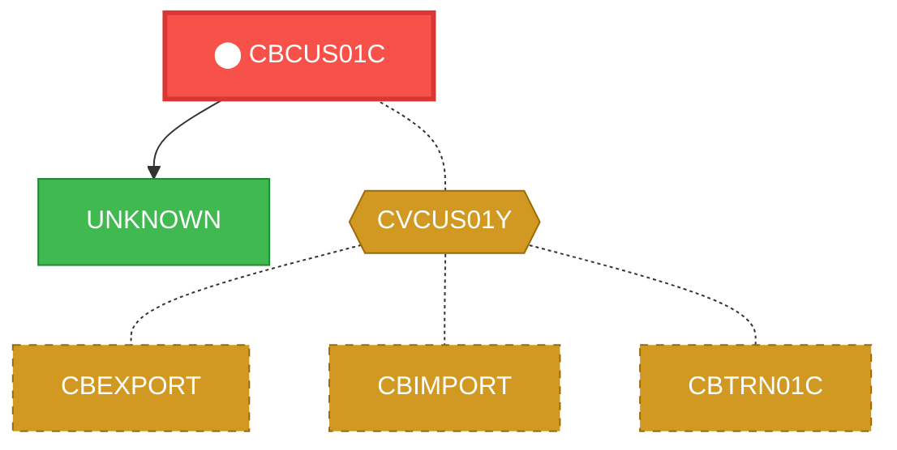
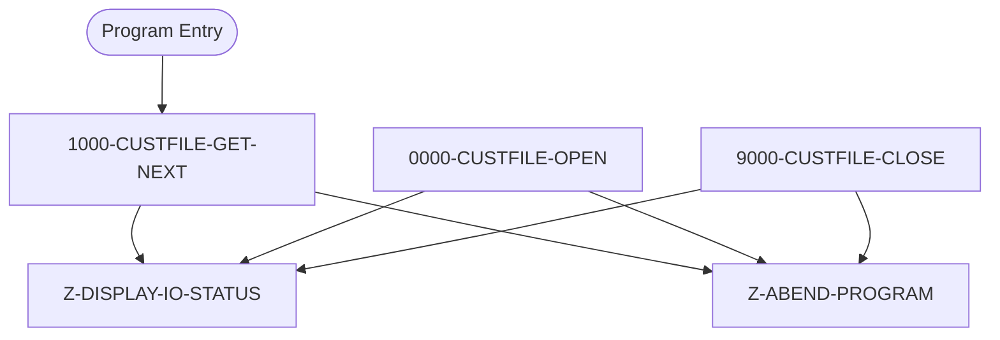

# Program: CBCUS01C


---

## Quick Reference

| Attribute | Value |
|-----------|-------|
| Program ID | `CBCUS01C` |
| Type | BATCH |
| Lines | 179 |
| Source | [CBCUS01C.cbl](../carddemo/CBCUS01C.cbl#L1) |
| Paragraphs | 5 |
| Statements | 34 |
| Impact Risk | **MEDIUM** — 9 programs affected |

> **View Source:** [Open CBCUS01C.cbl](../carddemo/CBCUS01C.cbl#L1)

## Source Grounding Facts

| Data Item | Literal Value |
|-----------|---------------|
| `END-OF-FILE` | `N` |

Status conditions found in source:
- `CUSTFILE-STATUS = '00'`
- `CUSTFILE-STATUS = '10'`


## Business Purpose

*Business purpose is not present in the extracted data. Run LLM enrichment to populate this section.*


## Dependency Context

> This section shows how **CBCUS01C** connects to the rest of the system — who calls it,
> what it calls, and what data it shares. If linked programs exist, they must appear here.

### Programs That Call CBCUS01C (Callers)

*No programs call CBCUS01C — this is likely a top-level entry point or CICS transaction starter.*

### Programs Called by CBCUS01C (Callees)

| Called Program | Type | Line | Why |
|----------------|------|------|-----|
| `UNKNOWN` | None | 184 |  |

### Shared Data (Copybooks & Files)

#### Shared Copybooks

| Copybook | Also Used By | # Co-Users |
|----------|-------------|------------|
| `CVCUS01Y` | CBEXPORT, CBIMPORT, CBTRN01C, COACTUPC, COACTVWC (+4 more) | 9 |

#### Shared Files

| File | Type | Access | Also Used By |
|------|------|--------|-------------|
| `CUSTFILE-FILE` | VSAM | SEQUENTIAL |  |

## Legacy Data Contracts

> These tables are derived from FILE SECTION records and COPY-expanded data declarations. They preserve the legacy field names, COBOL storage type, inferred modern type, and status-code values needed for Java DTOs, SQL schemas, API contracts, and migration mapping.

### File Record Layouts

#### `CUSTFILE-FILE` / `FD-CUSTFILE-REC`
| Legacy Field | Meaning | COBOL Type | Modern Type | Notes |
|--------------|---------|------------|-------------|-------|
| `FD-CUSTFILE-REC` | Fd Custfile Record | `GROUP` | `OBJECT` |  |
| `FD-CUST-ID` | Fd Customer ID | `PIC 9(09)` | `INTEGER` |  |
| `FD-CUST-DATA` | Fd Customer Data | `PIC X(491)` | `STRING(491)` |  |


### Copybook Segment Layouts

#### `CVCUS01Y` as `CUSTOMER-RECORD`

| Legacy Field | Meaning | COBOL Type | Modern Type | Status / Format Notes |
|--------------|---------|------------|-------------|-----------------------|
| `CUSTOMER-RECORD` | Customer Record | `GROUP` | `OBJECT` |  |
| `CUST-ID` | Customer ID | `PIC 9(09)` | `INTEGER` |  |
| `CUST-FIRST-NAME` | Customer First Name | `PIC X(25)` | `STRING(25)` |  |
| `CUST-MIDDLE-NAME` | Customer Middle Name | `PIC X(25)` | `STRING(25)` |  |
| `CUST-LAST-NAME` | Customer Last Name | `PIC X(25)` | `STRING(25)` |  |
| `CUST-ADDR-LINE-1` | Customer Addr Line 1 | `PIC X(50)` | `STRING(50)` |  |
| `CUST-ADDR-LINE-2` | Customer Addr Line 2 | `PIC X(50)` | `STRING(50)` |  |
| `CUST-ADDR-LINE-3` | Customer Addr Line 3 | `PIC X(50)` | `STRING(50)` |  |
| `CUST-ADDR-STATE-CD` | Customer Addr State Cd | `PIC X(02)` | `STRING(2)` |  |
| `CUST-ADDR-COUNTRY-CD` | Customer Addr Country Cd | `PIC X(03)` | `STRING(3)` |  |
| `CUST-ADDR-ZIP` | Customer Addr Zip | `PIC X(10)` | `STRING(10)` |  |
| `CUST-PHONE-NUM-1` | Customer Phone Number 1 | `PIC X(15)` | `STRING(15)` |  |
| `CUST-PHONE-NUM-2` | Customer Phone Number 2 | `PIC X(15)` | `STRING(15)` |  |
| `CUST-SSN` | Customer Ssn | `PIC 9(09)` | `INTEGER` |  |
| `CUST-GOVT-ISSUED-ID` | Customer Govt Issued ID | `PIC X(20)` | `STRING(20)` |  |
| `CUST-DOB-YYYY-MM-DD` | Customer Dob Yyyy Mm Dd | `PIC X(10)` | `STRING(10)` |  |
| `CUST-EFT-ACCOUNT-ID` | Customer Eft Account ID | `PIC X(10)` | `STRING(10)` |  |
| `CUST-PRI-CARD-HOLDER-IND` | Customer Pri Card Holder Ind | `PIC X(01)` | `STRING(1)` |  |
| `CUST-FICO-CREDIT-SCORE` | Customer Fico Credit Score | `PIC 9(03)` | `INTEGER` |  |
| `FILLER` | Filler | `PIC X(168)` | `STRING(168)` |  |


### Data Movement And Key Mapping

| Line | Source | Target | Meaning |
|------|--------|--------|---------|
| 108 | `'Y'` | `END-OF-FILE` | 'Y' populates END-OF-FILE |
| 111 | `CUSTFILE-STATUS` | `IO-STATUS` | CUSTFILE-STATUS populates IO-STATUS |
| 130 | `CUSTFILE-STATUS` | `IO-STATUS` | CUSTFILE-STATUS populates IO-STATUS |
| 148 | `CUSTFILE-STATUS` | `IO-STATUS` | CUSTFILE-STATUS populates IO-STATUS |
| 164 | `IO-STAT1` | `IO-STATUS-04(1:1)` | IO-STAT1 populates IO-STATUS-04(1:1) |
| 167 | `TWO-BYTES-BINARY` | `IO-STATUS-0403` | TWO-BYTES-BINARY populates IO-STATUS-0403 |
| 170 | `'0000'` | `IO-STATUS-04` | '0000' populates IO-STATUS-04 |
| 171 | `IO-STATUS` | `IO-STATUS-04(3:2)` | IO-STATUS populates IO-STATUS-04(3:2) |


---

## Dependency Graph



> **Legend:** 🔴 Target program · 🔵 Direct callers · 🟢 Direct callees · 🟡 Copybook-coupled · ⚫ Transitive (indirect)

---

## Impact Ripple View

> **If you change CBCUS01C, what else could break?**

| Impact Metric | Count |
|--------------|-------|
| Direct Callers | 0 |
| Transitive Callers (callers of callers) | 0 |
| Direct Callees | 0 |
| Transitive Callees | 0 |
| Copybook-Coupled Programs | 9 |
| **Total Impact** | **9** |
| **Risk Rating** | **MEDIUM** |


**Programs affected via shared copybooks:**
- `CBEXPORT`
- `CBIMPORT`
- `CBTRN01C`
- `COACTUPC`
- `COACTVWC`
- `COCRDSLC`
- `COCRDUPC`
- `COPAUA0C`
- `COPAUS0C`

---

## Statement Profile

| Statement Type | Count |
|---------------|-------|
| IF | 18 |
| EXIT | 4 |
| MOVE | 3 |
| READ | 2 |
| OPEN | 2 |
| CLOSE | 2 |
| DISPLAY | 1 |
| CALL | 1 |
| ARITHMETIC | 1 |

## Control Flow



## Paragraphs

### 1000-CUSTFILE-GET-NEXT

| | |
|---|---|
| **Paragraph** | `1000-CUSTFILE-GET-NEXT` |
| **Lines** | 92 - 117 |
| **View Code** | [Jump to Line 92](../carddemo/CBCUS01C.cbl#L92) |


### 0000-CUSTFILE-OPEN

| | |
|---|---|
| **Paragraph** | `0000-CUSTFILE-OPEN` |
| **Lines** | 118 - 135 |
| **View Code** | [Jump to Line 118](../carddemo/CBCUS01C.cbl#L118) |


### 9000-CUSTFILE-CLOSE

| | |
|---|---|
| **Paragraph** | `9000-CUSTFILE-CLOSE` |
| **Lines** | 136 - 153 |
| **View Code** | [Jump to Line 136](../carddemo/CBCUS01C.cbl#L136) |


### Z-ABEND-PROGRAM

| | |
|---|---|
| **Paragraph** | `Z-ABEND-PROGRAM` |
| **Lines** | 154 - 160 |
| **View Code** | [Jump to Line 154](../carddemo/CBCUS01C.cbl#L154) |


### Z-DISPLAY-IO-STATUS

| | |
|---|---|
| **Paragraph** | `Z-DISPLAY-IO-STATUS` |
| **Lines** | 161 - 178 |
| **View Code** | [Jump to Line 161](../carddemo/CBCUS01C.cbl#L161) |


## Executed by JCL Jobs

This program is run by the following batch JCL jobs:

| Job Name | Step | Step Comments |
|----------|------|---------------|
| [READCUST](../jcl/READCUST.md) | `STEP05` | *****************************************************************
Copyright Amaz... |


## Copybook Field Dictionaries

The following copybooks are included by this program. Each entry shows the actual fields
extracted from the copybook source file (`.cpy`).

### Copybook `CVCUS01Y`

| Level | Field | PIC | USAGE | Parent | Notes |
|-------|-------|-----|-------|--------|-------|
| `01` | `CUSTOMER-RECORD` | `None` | None | None |  |
| `05` | `CUST-ID` | `9(09)` | None | CUSTOMER-RECORD |  |
| `05` | `CUST-FIRST-NAME` | `X(25)` | None | CUSTOMER-RECORD |  |
| `05` | `CUST-MIDDLE-NAME` | `X(25)` | None | CUSTOMER-RECORD |  |
| `05` | `CUST-LAST-NAME` | `X(25)` | None | CUSTOMER-RECORD |  |
| `05` | `CUST-ADDR-LINE-1` | `X(50)` | None | CUSTOMER-RECORD |  |
| `05` | `CUST-ADDR-LINE-2` | `X(50)` | None | CUSTOMER-RECORD |  |
| `05` | `CUST-ADDR-LINE-3` | `X(50)` | None | CUSTOMER-RECORD |  |
| `05` | `CUST-ADDR-STATE-CD` | `X(02)` | None | CUSTOMER-RECORD |  |
| `05` | `CUST-ADDR-COUNTRY-CD` | `X(03)` | None | CUSTOMER-RECORD |  |
| `05` | `CUST-ADDR-ZIP` | `X(10)` | None | CUSTOMER-RECORD |  |
| `05` | `CUST-PHONE-NUM-1` | `X(15)` | None | CUSTOMER-RECORD |  |
| `05` | `CUST-PHONE-NUM-2` | `X(15)` | None | CUSTOMER-RECORD |  |
| `05` | `CUST-SSN` | `9(09)` | None | CUSTOMER-RECORD |  |
| `05` | `CUST-GOVT-ISSUED-ID` | `X(20)` | None | CUSTOMER-RECORD |  |
| `05` | `CUST-DOB-YYYY-MM-DD` | `X(10)` | None | CUSTOMER-RECORD |  |
| `05` | `CUST-EFT-ACCOUNT-ID` | `X(10)` | None | CUSTOMER-RECORD |  |
| `05` | `CUST-PRI-CARD-HOLDER-IND` | `X(01)` | None | CUSTOMER-RECORD |  |
| `05` | `CUST-FICO-CREDIT-SCORE` | `9(03)` | None | CUSTOMER-RECORD |  |


## File Record Layouts (FD)

This program declares the following file records (data contracts for I/O):

### `FD CUSTFILE-FILE` (record `FD-CUSTFILE-REC`)

| Level | Field | PIC | USAGE | Parent |
|-------|-------|-----|-------|--------|
| `01` | `FD-CUSTFILE-REC` | `None` | None | None |
| `05` | `FD-CUST-ID` | `9(09)` | None | FD-CUSTFILE-REC |
| `05` | `FD-CUST-DATA` | `X(491)` | None | FD-CUSTFILE-REC |


## Data Lineage (MOVE Flow)

The following MOVE statements were extracted from the source. Each row is a `source → destination`
flow that the migration team can use to trace how data is reshaped and routed.

| Source | Destination | Paragraph | Line |
|--------|-------------|-----------|------|
| `'0'` | `APPL-RESULT` | 1000-CUSTFILE-GET-NEXT | 95 |
| `'16'` | `APPL-RESULT` | 1000-CUSTFILE-GET-NEXT | 99 |
| `'12'` | `APPL-RESULT` | 1000-CUSTFILE-GET-NEXT | 101 |
| `'Y'` | `END-OF-FILE` | 1000-CUSTFILE-GET-NEXT | 108 |
| `CUSTFILE-STATUS` | `IO-STATUS` | 1000-CUSTFILE-GET-NEXT | 111 |
| `'8'` | `APPL-RESULT` | 0000-CUSTFILE-OPEN | 119 |
| `'0'` | `APPL-RESULT` | 0000-CUSTFILE-OPEN | 122 |
| `'12'` | `APPL-RESULT` | 0000-CUSTFILE-OPEN | 124 |
| `CUSTFILE-STATUS` | `IO-STATUS` | 0000-CUSTFILE-OPEN | 130 |
| `CUSTFILE-STATUS` | `IO-STATUS` | 9000-CUSTFILE-CLOSE | 148 |
| `'0'` | `TIMING` | Z-ABEND-PROGRAM | 156 |
| `'999'` | `ABCODE` | Z-ABEND-PROGRAM | 157 |
| `IO-STAT1` | `IO-STATUS-04` | Z-DISPLAY-IO-STATUS | 164 |
| `'0'` | `TWO-BYTES-BINARY` | Z-DISPLAY-IO-STATUS | 165 |
| `IO-STAT2` | `TWO-BYTES-RIGHT` | Z-DISPLAY-IO-STATUS | 166 |
| `TWO-BYTES-BINARY` | `IO-STATUS-0403` | Z-DISPLAY-IO-STATUS | 167 |
| `'0000'` | `IO-STATUS-04` | Z-DISPLAY-IO-STATUS | 170 |
| `IO-STATUS` | `IO-STATUS-04` | Z-DISPLAY-IO-STATUS | 171 |


## Known Issues & Code Anomalies

Static analysis flagged the following items in this program. Migration teams should
review each one before re-implementing in a modern stack.

| Severity | Category | Title | Paragraph | Line |
|----------|----------|-------|-----------|------|
| **NOTICE** | DEAD_CODE | Variable `FD-CUST-DATA` is declared but never referenced | None | 40 |
| **NOTICE** | DEAD_CODE | Variable `CUSTFILE-STAT1` is declared but never referenced | None | 47 |
| **NOTICE** | DEAD_CODE | Variable `CUSTFILE-STAT2` is declared but never referenced | None | 48 |
| **NOTICE** | DEAD_CODE | Variable `TWO-BYTES-LEFT` is declared but never referenced | None | 55 |
| **NOTICE** | DEAD_CODE | Variable `IO-STATUS-0401` is declared but never referenced | None | 58 |
| **NOTICE** | LOGIC | Paragraph `1000-CUSTFILE-GET-NEXT` terminates the program on error | 1000-CUSTFILE-GET-NEXT | 92 |
| **NOTICE** | LOGIC | Paragraph `0000-CUSTFILE-OPEN` terminates the program on error | 0000-CUSTFILE-OPEN | 118 |
| **NOTICE** | LOGIC | Paragraph `9000-CUSTFILE-CLOSE` terminates the program on error | 9000-CUSTFILE-CLOSE | 136 |
| **NOTICE** | DEPENDENCY | Static CALL to external `CEE3ABD` (not in this codebase) | None | 158 |

### NOTICE — Variable `FD-CUST-DATA` is declared but never referenced

`FD-CUST-DATA` is declared at line 40 but no other statement reads or writes it. Likely a leftover from prior refactoring or an incomplete feature.
**Source excerpt** (line 40):
```cobol
05 FD-CUST-DATA                      PIC X(491).
```

**Recommendation:** Remove the declaration or wire it into the logic that was originally intended.
---
### NOTICE — Variable `CUSTFILE-STAT1` is declared but never referenced

`CUSTFILE-STAT1` is declared at line 47 but no other statement reads or writes it. Likely a leftover from prior refactoring or an incomplete feature.
**Source excerpt** (line 47):
```cobol
05  CUSTFILE-STAT1      PIC X.
```

**Recommendation:** Remove the declaration or wire it into the logic that was originally intended.
---
### NOTICE — Variable `CUSTFILE-STAT2` is declared but never referenced

`CUSTFILE-STAT2` is declared at line 48 but no other statement reads or writes it. Likely a leftover from prior refactoring or an incomplete feature.
**Source excerpt** (line 48):
```cobol
05  CUSTFILE-STAT2      PIC X.
```

**Recommendation:** Remove the declaration or wire it into the logic that was originally intended.
---
### NOTICE — Variable `TWO-BYTES-LEFT` is declared but never referenced

`TWO-BYTES-LEFT` is declared at line 55 but no other statement reads or writes it. Likely a leftover from prior refactoring or an incomplete feature.
**Source excerpt** (line 55):
```cobol
05  TWO-BYTES-LEFT      PIC X.
```

**Recommendation:** Remove the declaration or wire it into the logic that was originally intended.
---
### NOTICE — Variable `IO-STATUS-0401` is declared but never referenced

`IO-STATUS-0401` is declared at line 58 but no other statement reads or writes it. Likely a leftover from prior refactoring or an incomplete feature.
**Source excerpt** (line 58):
```cobol
05  IO-STATUS-0401      PIC 9   VALUE 0.
```

**Recommendation:** Remove the declaration or wire it into the logic that was originally intended.
---
### NOTICE — Paragraph `1000-CUSTFILE-GET-NEXT` terminates the program on error

`1000-CUSTFILE-GET-NEXT` calls an ABEND routine (or STOP RUN) on the failure path. This means an error here ENDS the entire program — it does NOT reject, skip, or log-and-continue. Documentation must use "abend" / "terminate" language, not "reject".

**Recommendation:** Use ‘abend’ or ‘terminates the program’ when describing the error path of this paragraph.
---
### NOTICE — Paragraph `0000-CUSTFILE-OPEN` terminates the program on error

`0000-CUSTFILE-OPEN` calls an ABEND routine (or STOP RUN) on the failure path. This means an error here ENDS the entire program — it does NOT reject, skip, or log-and-continue. Documentation must use "abend" / "terminate" language, not "reject".

**Recommendation:** Use ‘abend’ or ‘terminates the program’ when describing the error path of this paragraph.
---
### NOTICE — Paragraph `9000-CUSTFILE-CLOSE` terminates the program on error

`9000-CUSTFILE-CLOSE` calls an ABEND routine (or STOP RUN) on the failure path. This means an error here ENDS the entire program — it does NOT reject, skip, or log-and-continue. Documentation must use "abend" / "terminate" language, not "reject".

**Recommendation:** Use ‘abend’ or ‘terminates the program’ when describing the error path of this paragraph.
---
### NOTICE — Static CALL to external `CEE3ABD` (not in this codebase)

`CALL 'CEE3ABD'` appears in the source but `CEE3ABD` is not a program in the loaded codebase. IBM Language Environment ABEND service (forces program termination with a user code).
**Source excerpt** (line 158):
```cobol
CALL 'CEE3ABD' USING ABCODE, TIMING.
```

**Recommendation:** Document this external dependency in the Migration Notes — the modern equivalent must replicate its behaviour.
---


## File OPEN / CLOSE Operations

The exact OPEN mode (INPUT / OUTPUT / I-O / EXTEND) determines whether a file can be
read, written, or both — and whether REWRITE / DELETE are legal. This table is the
source of truth for migrators converting to modern storage layers.

| File | Operation | Mode | Paragraph | Line |
|------|-----------|------|-----------|------|
| `CUSTFILE-FILE` | OPEN | INPUT | 0000-CUSTFILE-OPEN | 120 |
| `CUSTFILE-FILE` | CLOSE | None | 9000-CUSTFILE-CLOSE | 138 |


## Modernization Review Findings

These are source-derived review notes that should be checked before translating this program into Java, Spring Boot, SQL, APIs, or batch jobs.

| Finding | Why It Matters |
|---------|----------------|
| Nested IF blocks need compiler-accurate validation | Nested conditional logic was detected. During migration, validate scope with the original compiler rules and explicit `END-IF`/period termination before translating to Java or SQL. |


## Business Rules

- **End of Customer File Processing** `BR-110`  
  When all customer records have been processed, the system should stop reading the customer file.  
  [View Rule Details](../business-rules/BR-110.md)
- **Customer Record Read Error** `BR-111`  
  If there is an error reading a customer record, the system should handle the error.  
  [View Rule Details](../business-rules/BR-111.md)
- **Customer File Open Successful** `BR-112`  
  The customer file must open successfully for processing to continue.  
  [View Rule Details](../business-rules/BR-112.md)
- **Customer File Open Unsuccessful** `BR-113`  
  If the customer file cannot be opened, the program must terminate abnormally.  
  [View Rule Details](../business-rules/BR-113.md)
- **Customer File Close Successful** `BR-114`  
  The customer file is closed successfully.  
  [View Rule Details](../business-rules/BR-114.md)
- **Customer File Close Unsuccessful** `BR-115`  
  If the customer file cannot be closed, an error handling routine is initiated.  
  [View Rule Details](../business-rules/BR-115.md)
- **Abnormal Termination Handling** `BR-116`  
  If an error occurs during processing, the system will execute a specific error handling routine.  
  [View Rule Details](../business-rules/BR-116.md)

## Key Data Items

| Name | Level | Picture | Section | Business Name |
|------|-------|---------|---------|---------------|
| `CUSTOMER-RECORD` | 1 | `None` | WORKING-STORAGE | None |
| `CUST-ID` | 5 | `9(09)` | WORKING-STORAGE | None |
| `CUST-FIRST-NAME` | 5 | `X(25)` | WORKING-STORAGE | None |
| `CUST-MIDDLE-NAME` | 5 | `X(25)` | WORKING-STORAGE | None |
| `CUST-LAST-NAME` | 5 | `X(25)` | WORKING-STORAGE | None |
| `CUST-ADDR-LINE-1` | 5 | `X(50)` | WORKING-STORAGE | None |
| `CUST-ADDR-LINE-2` | 5 | `X(50)` | WORKING-STORAGE | None |
| `CUST-ADDR-LINE-3` | 5 | `X(50)` | WORKING-STORAGE | None |
| `CUST-ADDR-STATE-CD` | 5 | `X(02)` | WORKING-STORAGE | None |
| `CUST-ADDR-COUNTRY-CD` | 5 | `X(03)` | WORKING-STORAGE | None |
| `CUST-ADDR-ZIP` | 5 | `X(10)` | WORKING-STORAGE | None |
| `CUST-PHONE-NUM-1` | 5 | `X(15)` | WORKING-STORAGE | None |
| `CUST-PHONE-NUM-2` | 5 | `X(15)` | WORKING-STORAGE | None |
| `CUST-SSN` | 5 | `9(09)` | WORKING-STORAGE | None |
| `CUST-GOVT-ISSUED-ID` | 5 | `X(20)` | WORKING-STORAGE | None |
| `CUST-DOB-YYYY-MM-DD` | 5 | `X(10)` | WORKING-STORAGE | None |
| `CUST-EFT-ACCOUNT-ID` | 5 | `X(10)` | WORKING-STORAGE | None |
| `CUST-PRI-CARD-HOLDER-IND` | 5 | `X(01)` | WORKING-STORAGE | None |
| `CUST-FICO-CREDIT-SCORE` | 5 | `9(03)` | WORKING-STORAGE | None |
| `FILLER` | 5 | `X(168)` | WORKING-STORAGE | None |
| `CUSTFILE-STATUS` | 1 | `None` | WORKING-STORAGE | None |
| `CUSTFILE-STAT1` | 5 | `X` | WORKING-STORAGE | None |
| `CUSTFILE-STAT2` | 5 | `X` | WORKING-STORAGE | None |
| `IO-STATUS` | 1 | `None` | WORKING-STORAGE | None |
| `IO-STAT1` | 5 | `X` | WORKING-STORAGE | None |
| `IO-STAT2` | 5 | `X` | WORKING-STORAGE | None |
| `TWO-BYTES-BINARY` | 1 | `9(4)` | WORKING-STORAGE | None |
| `TWO-BYTES-ALPHA` | 1 | `None` | WORKING-STORAGE | None |
| `TWO-BYTES-LEFT` | 5 | `X` | WORKING-STORAGE | None |
| `TWO-BYTES-RIGHT` | 5 | `X` | WORKING-STORAGE | None |
| `IO-STATUS-04` | 1 | `None` | WORKING-STORAGE | None |
| `IO-STATUS-0401` | 5 | `9` | WORKING-STORAGE | None |
| `IO-STATUS-0403` | 5 | `999` | WORKING-STORAGE | None |
| `APPL-RESULT` | 1 | `S9(9)` | WORKING-STORAGE | None |
| `APPL-AOK` | 88 | `None` | WORKING-STORAGE | None |
| `APPL-EOF` | 88 | `None` | WORKING-STORAGE | None |
| `END-OF-FILE` | 1 | `X(01)` | WORKING-STORAGE | None |
| `ABCODE` | 1 | `S9(9)` | WORKING-STORAGE | None |
| `TIMING` | 1 | `S9(9)` | WORKING-STORAGE | None |

---

*Generated 2026-05-02 17:07*