# Program: CBEXPORT


---

## Quick Reference

| Attribute | Value |
|-----------|-------|
| Program ID | `CBEXPORT` |
| Type | BATCH |
| Lines | 583 |
| Source | [CBEXPORT.cbl](../carddemo/CBEXPORT.cbl#L1) |
| Paragraphs | 21 |
| Statements | 220 |
| Impact Risk | **HIGH** — 24 programs affected |

> **View Source:** [Open CBEXPORT.cbl](../carddemo/CBEXPORT.cbl#L1)

## Source Grounding Facts

| Data Item | Literal Value |
|-----------|---------------|
| `WS-CUSTOMER-EOF` | `10` |
| `WS-CUSTOMER-OK` | `00` |
| `WS-ACCOUNT-EOF` | `10` |
| `WS-ACCOUNT-OK` | `00` |
| `WS-XREF-EOF` | `10` |
| `WS-XREF-OK` | `00` |
| `WS-TRANSACTION-EOF` | `10` |
| `WS-TRANSACTION-OK` | `00` |
| `WS-CARD-EOF` | `10` |
| `WS-CARD-OK` | `00` |
| `WS-EXPORT-OK` | `00` |


## Business Purpose

*Business purpose is not present in the extracted data. Run LLM enrichment to populate this section.*


## Dependency Context

> This section shows how **CBEXPORT** connects to the rest of the system — who calls it,
> what it calls, and what data it shares. If linked programs exist, they must appear here.

### Programs That Call CBEXPORT (Callers)

*No programs call CBEXPORT — this is likely a top-level entry point or CICS transaction starter.*

### Programs Called by CBEXPORT (Callees)

| Called Program | Type | Line | Why |
|----------------|------|------|-----|
| `UNKNOWN` | None | 774 |  |

### Shared Data (Copybooks & Files)

#### Shared Copybooks

| Copybook | Also Used By | # Co-Users |
|----------|-------------|------------|
| `CVACT01Y` | CBACT01C, CBACT04C, CBIMPORT, CBSTM03A, CBTRN01C (+8 more) | 13 |
| `CVACT02Y` | CBACT02C, CBIMPORT, CBTRN01C, COACTVWC, COCRDLIC (+4 more) | 9 |
| `CVACT03Y` | CBACT03C, CBACT04C, CBIMPORT, CBSTM03A, CBTRN01C (+8 more) | 13 |
| `CVCUS01Y` | CBCUS01C, CBIMPORT, CBTRN01C, COACTUPC, COACTVWC (+4 more) | 9 |
| `CVEXPORT` | CBIMPORT | 1 |
| `CVTRA05Y` | CBACT04C, CBIMPORT, CBTRN01C, CBTRN02C, CBTRN03C (+5 more) | 10 |

#### Shared Files

| File | Type | Access | Also Used By |
|------|------|--------|-------------|
| `ACCOUNT-INPUT` | VSAM | SEQUENTIAL |  |
| `CARD-INPUT` | VSAM | SEQUENTIAL |  |
| `CUSTOMER-INPUT` | VSAM | SEQUENTIAL |  |
| `EXPORT-OUTPUT` | VSAM | SEQUENTIAL |  |
| `TRANSACTION-INPUT` | VSAM | SEQUENTIAL |  |
| `XREF-INPUT` | VSAM | SEQUENTIAL |  |

## Legacy Data Contracts

> These tables are derived from FILE SECTION records and COPY-expanded data declarations. They preserve the legacy field names, COBOL storage type, inferred modern type, and status-code values needed for Java DTOs, SQL schemas, API contracts, and migration mapping.

### File Record Layouts

#### `EXPORT-OUTPUT` / `EXPORT-OUTPUT-RECORD`
| Legacy Field | Meaning | COBOL Type | Modern Type | Notes |
|--------------|---------|------------|-------------|-------|
| `EXPORT-OUTPUT-RECORD` | Export Output Record | `PIC X(500)` | `STRING(500)` |  |


### Copybook Segment Layouts

#### `CVACT01Y` as `ACCOUNT-RECORD`

| Legacy Field | Meaning | COBOL Type | Modern Type | Status / Format Notes |
|--------------|---------|------------|-------------|-----------------------|
| `ACCOUNT-RECORD` | Account Record | `GROUP` | `OBJECT` |  |
| `ACCT-ID` | Account ID | `PIC 9(11)` | `BIGINT` |  |
| `ACCT-ACTIVE-STATUS` | Account Active Status | `PIC X(01)` | `STRING(1)` |  |
| `ACCT-CURR-BAL` | Account Curr Bal | `PIC S9(10)V99` | `DECIMAL(12,2)` |  |
| `ACCT-CREDIT-LIMIT` | Account Credit Limit | `PIC S9(10)V99` | `DECIMAL(12,2)` |  |
| `ACCT-CASH-CREDIT-LIMIT` | Account Cash Credit Limit | `PIC S9(10)V99` | `DECIMAL(12,2)` |  |
| `ACCT-OPEN-DATE` | Account Open Date | `PIC X(10)` | `STRING(10)` | Date-like field; verify YYDDD, YYMMDD, or ISO format before migration. |
| `ACCT-EXPIRAION-DATE` | Account Expiraion Date | `PIC X(10)` | `STRING(10)` | Date-like field; verify YYDDD, YYMMDD, or ISO format before migration. |
| `ACCT-REISSUE-DATE` | Account Reissue Date | `PIC X(10)` | `STRING(10)` | Date-like field; verify YYDDD, YYMMDD, or ISO format before migration. |
| `ACCT-CURR-CYC-CREDIT` | Account Curr Cyc Credit | `PIC S9(10)V99` | `DECIMAL(12,2)` |  |
| `ACCT-CURR-CYC-DEBIT` | Account Curr Cyc Debit | `PIC S9(10)V99` | `DECIMAL(12,2)` |  |
| `ACCT-ADDR-ZIP` | Account Addr Zip | `PIC X(10)` | `STRING(10)` |  |
| `ACCT-GROUP-ID` | Account Group ID | `PIC X(10)` | `STRING(10)` |  |
| `FILLER` | Filler | `PIC X(178)` | `STRING(178)` |  |

#### `CVACT02Y` as `CARD-RECORD`

| Legacy Field | Meaning | COBOL Type | Modern Type | Status / Format Notes |
|--------------|---------|------------|-------------|-----------------------|
| `CARD-RECORD` | Card Record | `GROUP` | `OBJECT` |  |
| `CARD-NUM` | Card Number | `PIC X(16)` | `STRING(16)` |  |
| `CARD-ACCT-ID` | Card Account ID | `PIC 9(11)` | `BIGINT` |  |
| `CARD-CVV-CD` | Card Cvv Cd | `PIC 9(03)` | `INTEGER` |  |
| `CARD-EMBOSSED-NAME` | Card Embossed Name | `PIC X(50)` | `STRING(50)` |  |
| `CARD-EXPIRAION-DATE` | Card Expiraion Date | `PIC X(10)` | `STRING(10)` | Date-like field; verify YYDDD, YYMMDD, or ISO format before migration. |
| `CARD-ACTIVE-STATUS` | Card Active Status | `PIC X(01)` | `STRING(1)` |  |
| `FILLER` | Filler | `PIC X(59)` | `STRING(59)` |  |

#### `CVACT03Y` as `CARD-XREF-RECORD`

| Legacy Field | Meaning | COBOL Type | Modern Type | Status / Format Notes |
|--------------|---------|------------|-------------|-----------------------|
| `CARD-XREF-RECORD` | Card Xref Record | `GROUP` | `OBJECT` |  |
| `XREF-CARD-NUM` | Xref Card Number | `PIC X(16)` | `STRING(16)` |  |
| `XREF-CUST-ID` | Xref Customer ID | `PIC 9(09)` | `INTEGER` |  |
| `XREF-ACCT-ID` | Xref Account ID | `PIC 9(11)` | `BIGINT` |  |
| `FILLER` | Filler | `PIC X(14)` | `STRING(14)` |  |

#### `CVCUS01Y` as `CUSTOMER-RECORD`

| Legacy Field | Meaning | COBOL Type | Modern Type | Status / Format Notes |
|--------------|---------|------------|-------------|-----------------------|
| `CUSTOMER-RECORD` | Customer Record | `GROUP` | `OBJECT` |  |
| `CUST-ID` | Customer ID | `PIC 9(09)` | `INTEGER` |  |
| `CUST-FIRST-NAME` | Customer First Name | `PIC X(25)` | `STRING(25)` |  |
| `CUST-MIDDLE-NAME` | Customer Middle Name | `PIC X(25)` | `STRING(25)` |  |
| `CUST-LAST-NAME` | Customer Last Name | `PIC X(25)` | `STRING(25)` |  |
| `CUST-ADDR-LINE-1` | Customer Addr Line 1 | `PIC X(50)` | `STRING(50)` |  |
| `CUST-ADDR-LINE-2` | Customer Addr Line 2 | `PIC X(50)` | `STRING(50)` |  |
| `CUST-ADDR-LINE-3` | Customer Addr Line 3 | `PIC X(50)` | `STRING(50)` |  |
| `CUST-ADDR-STATE-CD` | Customer Addr State Cd | `PIC X(02)` | `STRING(2)` |  |
| `CUST-ADDR-COUNTRY-CD` | Customer Addr Country Cd | `PIC X(03)` | `STRING(3)` |  |
| `CUST-ADDR-ZIP` | Customer Addr Zip | `PIC X(10)` | `STRING(10)` |  |
| `CUST-PHONE-NUM-1` | Customer Phone Number 1 | `PIC X(15)` | `STRING(15)` |  |
| `CUST-PHONE-NUM-2` | Customer Phone Number 2 | `PIC X(15)` | `STRING(15)` |  |
| `CUST-SSN` | Customer Ssn | `PIC 9(09)` | `INTEGER` |  |
| `CUST-GOVT-ISSUED-ID` | Customer Govt Issued ID | `PIC X(20)` | `STRING(20)` |  |
| `CUST-DOB-YYYY-MM-DD` | Customer Dob Yyyy Mm Dd | `PIC X(10)` | `STRING(10)` |  |
| `CUST-EFT-ACCOUNT-ID` | Customer Eft Account ID | `PIC X(10)` | `STRING(10)` |  |
| `CUST-PRI-CARD-HOLDER-IND` | Customer Pri Card Holder Ind | `PIC X(01)` | `STRING(1)` |  |
| `CUST-FICO-CREDIT-SCORE` | Customer Fico Credit Score | `PIC 9(03)` | `INTEGER` |  |
| `FILLER` | Filler | `PIC X(168)` | `STRING(168)` |  |

#### `CVEXPORT` as `EXPORT-RECORD`

| Legacy Field | Meaning | COBOL Type | Modern Type | Status / Format Notes |
|--------------|---------|------------|-------------|-----------------------|
| `EXPORT-RECORD` | Export Record | `GROUP` | `OBJECT` |  |
| `EXPORT-REC-TYPE` | Export Record Type | `PIC X(1)` | `STRING(1)` |  |
| `EXPORT-TIMESTAMP` | Export Timestamp | `PIC X(26)` | `STRING(26)` |  |
| `EXPORT-TIMESTAMP-R` | Export Timestamp R | `GROUP` | `OBJECT` |  |
| `EXPORT-DATE` | Export Date | `PIC X(10)` | `STRING(10)` | Date-like field; verify YYDDD, YYMMDD, or ISO format before migration. |
| `EXPORT-DATE-TIME-SEP` | Export Date Time Sep | `PIC X(1)` | `STRING(1)` |  |
| `EXPORT-TIME` | Export Time | `PIC X(15)` | `STRING(15)` |  |
| `EXPORT-SEQUENCE-NUM` | Export Sequence Number | `PIC 9(9) COMP` | `INTEGER` |  |
| `EXPORT-BRANCH-ID` | Export Branch ID | `PIC X(4)` | `STRING(4)` |  |
| `EXPORT-REGION-CODE` | Export Region Code | `PIC X(5)` | `STRING(5)` |  |
| `EXPORT-RECORD-DATA` | Export Record Data | `PIC X(460)` | `STRING(460)` |  |
| `EXPORT-CUSTOMER-DATA` | Export Customer Data | `GROUP` | `OBJECT` |  |
| `EXP-CUST-ID` | Exp Customer ID | `PIC 9(09) COMP` | `INTEGER` |  |
| `EXP-CUST-FIRST-NAME` | Exp Customer First Name | `PIC X(25)` | `STRING(25)` |  |
| `EXP-CUST-MIDDLE-NAME` | Exp Customer Middle Name | `PIC X(25)` | `STRING(25)` |  |
| `EXP-CUST-LAST-NAME` | Exp Customer Last Name | `PIC X(25)` | `STRING(25)` |  |
| `EXP-CUST-ADDR-LINES` | Exp Customer Addr Lines | `OCCURS 3` | `OBJECT` | Repeating field, 3 occurrences. |
| `EXP-CUST-ADDR-LINE` | Exp Customer Addr Line | `PIC X(50)` | `STRING(50)` |  |
| `EXP-CUST-ADDR-STATE-CD` | Exp Customer Addr State Cd | `PIC X(02)` | `STRING(2)` |  |
| `EXP-CUST-ADDR-COUNTRY-CD` | Exp Customer Addr Country Cd | `PIC X(03)` | `STRING(3)` |  |
| `EXP-CUST-ADDR-ZIP` | Exp Customer Addr Zip | `PIC X(10)` | `STRING(10)` |  |
| `EXP-CUST-PHONE-NUMS` | Exp Customer Phone Nums | `OCCURS 2` | `OBJECT` | Repeating field, 2 occurrences. |
| `EXP-CUST-PHONE-NUM` | Exp Customer Phone Number | `PIC X(15)` | `STRING(15)` |  |
| `EXP-CUST-SSN` | Exp Customer Ssn | `PIC 9(09)` | `INTEGER` |  |
| `EXP-CUST-GOVT-ISSUED-ID` | Exp Customer Govt Issued ID | `PIC X(20)` | `STRING(20)` |  |
| `EXP-CUST-DOB-YYYY-MM-DD` | Exp Customer Dob Yyyy Mm Dd | `PIC X(10)` | `STRING(10)` |  |
| `EXP-CUST-EFT-ACCOUNT-ID` | Exp Customer Eft Account ID | `PIC X(10)` | `STRING(10)` |  |
| `EXP-CUST-PRI-CARD-HOLDER-IND` | Exp Customer Pri Card Holder Ind | `PIC X(01)` | `STRING(1)` |  |
| `EXP-CUST-FICO-CREDIT-SCORE` | Exp Customer Fico Credit Score | `PIC 9(03) COMP-3` | `INTEGER` |  |
| `FILLER` | Filler | `PIC X(134)` | `STRING(134)` |  |
| `EXPORT-ACCOUNT-DATA` | Export Account Data | `GROUP` | `OBJECT` |  |
| `EXP-ACCT-ID` | Exp Account ID | `PIC 9(11)` | `BIGINT` |  |
| `EXP-ACCT-ACTIVE-STATUS` | Exp Account Active Status | `PIC X(01)` | `STRING(1)` |  |
| `EXP-ACCT-CURR-BAL` | Exp Account Curr Bal | `PIC S9(10)V99 COMP-3` | `DECIMAL(12,2)` |  |
| `EXP-ACCT-CREDIT-LIMIT` | Exp Account Credit Limit | `PIC S9(10)V99` | `DECIMAL(12,2)` |  |
| `EXP-ACCT-CASH-CREDIT-LIMIT` | Exp Account Cash Credit Limit | `PIC S9(10)V99 COMP-3` | `DECIMAL(12,2)` |  |
| `EXP-ACCT-OPEN-DATE` | Exp Account Open Date | `PIC X(10)` | `STRING(10)` | Date-like field; verify YYDDD, YYMMDD, or ISO format before migration. |
| `EXP-ACCT-EXPIRAION-DATE` | Exp Account Expiraion Date | `PIC X(10)` | `STRING(10)` | Date-like field; verify YYDDD, YYMMDD, or ISO format before migration. |
| `EXP-ACCT-REISSUE-DATE` | Exp Account Reissue Date | `PIC X(10)` | `STRING(10)` | Date-like field; verify YYDDD, YYMMDD, or ISO format before migration. |
| `EXP-ACCT-CURR-CYC-CREDIT` | Exp Account Curr Cyc Credit | `PIC S9(10)V99` | `DECIMAL(12,2)` |  |
| `EXP-ACCT-CURR-CYC-DEBIT` | Exp Account Curr Cyc Debit | `PIC S9(10)V99 COMP` | `DECIMAL(12,2)` |  |
| `EXP-ACCT-ADDR-ZIP` | Exp Account Addr Zip | `PIC X(10)` | `STRING(10)` |  |
| `EXP-ACCT-GROUP-ID` | Exp Account Group ID | `PIC X(10)` | `STRING(10)` |  |
| `FILLER` | Filler | `PIC X(352)` | `STRING(352)` |  |
| `EXPORT-TRANSACTION-DATA` | Export Transaction Data | `GROUP` | `OBJECT` |  |
| `EXP-TRAN-ID` | Exp Tran ID | `PIC X(16)` | `STRING(16)` |  |
| `EXP-TRAN-TYPE-CD` | Exp Tran Type Cd | `PIC X(02)` | `STRING(2)` |  |
| `EXP-TRAN-CAT-CD` | Exp Tran Cat Cd | `PIC 9(04)` | `INTEGER` |  |
| `EXP-TRAN-SOURCE` | Exp Tran Source | `PIC X(10)` | `STRING(10)` |  |
| `EXP-TRAN-DESC` | Exp Tran Desc | `PIC X(100)` | `STRING(100)` |  |
| `EXP-TRAN-AMT` | Exp Tran Amount | `PIC S9(09)V99 COMP-3` | `DECIMAL(11,2)` |  |
| `EXP-TRAN-MERCHANT-ID` | Exp Tran Merchant ID | `PIC 9(09) COMP` | `INTEGER` |  |
| `EXP-TRAN-MERCHANT-NAME` | Exp Tran Merchant Name | `PIC X(50)` | `STRING(50)` |  |
| `EXP-TRAN-MERCHANT-CITY` | Exp Tran Merchant City | `PIC X(50)` | `STRING(50)` |  |
| `EXP-TRAN-MERCHANT-ZIP` | Exp Tran Merchant Zip | `PIC X(10)` | `STRING(10)` |  |
| `EXP-TRAN-CARD-NUM` | Exp Tran Card Number | `PIC X(16)` | `STRING(16)` |  |
| `EXP-TRAN-ORIG-TS` | Exp Tran Orig Ts | `PIC X(26)` | `STRING(26)` |  |
| `EXP-TRAN-PROC-TS` | Exp Tran Proc Ts | `PIC X(26)` | `STRING(26)` |  |
| `FILLER` | Filler | `PIC X(140)` | `STRING(140)` |  |
| `EXPORT-CARD-XREF-DATA` | Export Card Xref Data | `GROUP` | `OBJECT` |  |
| `EXP-XREF-CARD-NUM` | Exp Xref Card Number | `PIC X(16)` | `STRING(16)` |  |
| `EXP-XREF-CUST-ID` | Exp Xref Customer ID | `PIC 9(09)` | `INTEGER` |  |
| `EXP-XREF-ACCT-ID` | Exp Xref Account ID | `PIC 9(11) COMP` | `BIGINT` |  |
| `FILLER` | Filler | `PIC X(427)` | `STRING(427)` |  |
| `EXPORT-CARD-DATA` | Export Card Data | `GROUP` | `OBJECT` |  |
| `EXP-CARD-NUM` | Exp Card Number | `PIC X(16)` | `STRING(16)` |  |
| `EXP-CARD-ACCT-ID` | Exp Card Account ID | `PIC 9(11) COMP` | `BIGINT` |  |
| `EXP-CARD-CVV-CD` | Exp Card Cvv Cd | `PIC 9(03) COMP` | `INTEGER` |  |
| `EXP-CARD-EMBOSSED-NAME` | Exp Card Embossed Name | `PIC X(50)` | `STRING(50)` |  |
| `EXP-CARD-EXPIRAION-DATE` | Exp Card Expiraion Date | `PIC X(10)` | `STRING(10)` | Date-like field; verify YYDDD, YYMMDD, or ISO format before migration. |
| `EXP-CARD-ACTIVE-STATUS` | Exp Card Active Status | `PIC X(01)` | `STRING(1)` |  |
| `FILLER` | Filler | `PIC X(373)` | `STRING(373)` |  |

#### `CVTRA05Y` as `TRAN-RECORD`

| Legacy Field | Meaning | COBOL Type | Modern Type | Status / Format Notes |
|--------------|---------|------------|-------------|-----------------------|
| `TRAN-RECORD` | Tran Record | `GROUP` | `OBJECT` |  |
| `TRAN-ID` | Tran ID | `PIC X(16)` | `STRING(16)` |  |
| `TRAN-TYPE-CD` | Tran Type Cd | `PIC X(02)` | `STRING(2)` |  |
| `TRAN-CAT-CD` | Tran Cat Cd | `PIC 9(04)` | `INTEGER` |  |
| `TRAN-SOURCE` | Tran Source | `PIC X(10)` | `STRING(10)` |  |
| `TRAN-DESC` | Tran Desc | `PIC X(100)` | `STRING(100)` |  |
| `TRAN-AMT` | Tran Amount | `PIC S9(09)V99` | `DECIMAL(11,2)` |  |
| `TRAN-MERCHANT-ID` | Tran Merchant ID | `PIC 9(09)` | `INTEGER` |  |
| `TRAN-MERCHANT-NAME` | Tran Merchant Name | `PIC X(50)` | `STRING(50)` |  |
| `TRAN-MERCHANT-CITY` | Tran Merchant City | `PIC X(50)` | `STRING(50)` |  |
| `TRAN-MERCHANT-ZIP` | Tran Merchant Zip | `PIC X(10)` | `STRING(10)` |  |
| `TRAN-CARD-NUM` | Tran Card Number | `PIC X(16)` | `STRING(16)` |  |
| `TRAN-ORIG-TS` | Tran Orig Ts | `PIC X(26)` | `STRING(26)` |  |
| `TRAN-PROC-TS` | Tran Proc Ts | `PIC X(26)` | `STRING(26)` |  |
| `FILLER` | Filler | `PIC X(20)` | `STRING(20)` |  |


### Data Movement And Key Mapping

| Line | Source | Target | Meaning |
|------|--------|--------|---------|
| 274 | `'C'` | `EXPORT-REC-TYPE` | 'C' populates EXPORT-REC-TYPE |
| 282 | `CUST-ID` | `EXP-CUST-ID` | CUST-ID populates EXP-CUST-ID |
| 283 | `CUST-FIRST-NAME` | `EXP-CUST-FIRST-NAME` | CUST-FIRST-NAME populates EXP-CUST-FIRST-NAME |
| 284 | `CUST-MIDDLE-NAME` | `EXP-CUST-MIDDLE-NAME` | CUST-MIDDLE-NAME populates EXP-CUST-MIDDLE-NAME |
| 285 | `CUST-LAST-NAME` | `EXP-CUST-LAST-NAME` | CUST-LAST-NAME populates EXP-CUST-LAST-NAME |
| 286 | `CUST-ADDR-LINE-1` | `EXP-CUST-ADDR-LINE(1)` | CUST-ADDR-LINE-1 populates EXP-CUST-ADDR-LINE(1) |
| 287 | `CUST-ADDR-LINE-2` | `EXP-CUST-ADDR-LINE(2)` | CUST-ADDR-LINE-2 populates EXP-CUST-ADDR-LINE(2) |
| 288 | `CUST-ADDR-LINE-3` | `EXP-CUST-ADDR-LINE(3)` | CUST-ADDR-LINE-3 populates EXP-CUST-ADDR-LINE(3) |
| 289 | `CUST-ADDR-STATE-CD` | `EXP-CUST-ADDR-STATE-CD` | CUST-ADDR-STATE-CD populates EXP-CUST-ADDR-STATE-CD |
| 290 | `CUST-ADDR-COUNTRY-CD` | `EXP-CUST-ADDR-COUNTRY-CD` | CUST-ADDR-COUNTRY-CD populates EXP-CUST-ADDR-COUNTRY-CD |
| 291 | `CUST-ADDR-ZIP` | `EXP-CUST-ADDR-ZIP` | CUST-ADDR-ZIP populates EXP-CUST-ADDR-ZIP |
| 292 | `CUST-PHONE-NUM-1` | `EXP-CUST-PHONE-NUM(1)` | CUST-PHONE-NUM-1 populates EXP-CUST-PHONE-NUM(1) |
| 293 | `CUST-PHONE-NUM-2` | `EXP-CUST-PHONE-NUM(2)` | CUST-PHONE-NUM-2 populates EXP-CUST-PHONE-NUM(2) |
| 294 | `CUST-SSN` | `EXP-CUST-SSN` | CUST-SSN populates EXP-CUST-SSN |
| 295 | `CUST-GOVT-ISSUED-ID` | `EXP-CUST-GOVT-ISSUED-ID` | CUST-GOVT-ISSUED-ID populates EXP-CUST-GOVT-ISSUED-ID |
| 296 | `CUST-DOB-YYYY-MM-DD` | `EXP-CUST-DOB-YYYY-MM-DD` | CUST-DOB-YYYY-MM-DD populates EXP-CUST-DOB-YYYY-MM-DD |
| 297 | `CUST-EFT-ACCOUNT-ID` | `EXP-CUST-EFT-ACCOUNT-ID` | CUST-EFT-ACCOUNT-ID populates EXP-CUST-EFT-ACCOUNT-ID |
| 298 | `CUST-PRI-CARD-HOLDER-IND` | `EXP-CUST-PRI-CARD-HOLDER-IND` | CUST-PRI-CARD-HOLDER-IND populates EXP-CUST-PRI-CARD-HOLDER-IND |
| 299 | `CUST-FICO-CREDIT-SCORE` | `EXP-CUST-FICO-CREDIT-SCORE` | CUST-FICO-CREDIT-SCORE populates EXP-CUST-FICO-CREDIT-SCORE |
| 343 | `'A'` | `EXPORT-REC-TYPE` | 'A' populates EXPORT-REC-TYPE |
| 351 | `ACCT-ID` | `EXP-ACCT-ID` | ACCT-ID populates EXP-ACCT-ID |
| 352 | `ACCT-ACTIVE-STATUS` | `EXP-ACCT-ACTIVE-STATUS` | ACCT-ACTIVE-STATUS populates EXP-ACCT-ACTIVE-STATUS |
| 353 | `ACCT-CURR-BAL` | `EXP-ACCT-CURR-BAL` | ACCT-CURR-BAL populates EXP-ACCT-CURR-BAL |
| 354 | `ACCT-CREDIT-LIMIT` | `EXP-ACCT-CREDIT-LIMIT` | ACCT-CREDIT-LIMIT populates EXP-ACCT-CREDIT-LIMIT |
| 355 | `ACCT-CASH-CREDIT-LIMIT` | `EXP-ACCT-CASH-CREDIT-LIMIT` | ACCT-CASH-CREDIT-LIMIT populates EXP-ACCT-CASH-CREDIT-LIMIT |
| 356 | `ACCT-OPEN-DATE` | `EXP-ACCT-OPEN-DATE` | ACCT-OPEN-DATE populates EXP-ACCT-OPEN-DATE |
| 357 | `ACCT-EXPIRAION-DATE` | `EXP-ACCT-EXPIRAION-DATE` | ACCT-EXPIRAION-DATE populates EXP-ACCT-EXPIRAION-DATE |
| 358 | `ACCT-REISSUE-DATE` | `EXP-ACCT-REISSUE-DATE` | ACCT-REISSUE-DATE populates EXP-ACCT-REISSUE-DATE |
| 359 | `ACCT-CURR-CYC-CREDIT` | `EXP-ACCT-CURR-CYC-CREDIT` | ACCT-CURR-CYC-CREDIT populates EXP-ACCT-CURR-CYC-CREDIT |
| 360 | `ACCT-CURR-CYC-DEBIT` | `EXP-ACCT-CURR-CYC-DEBIT` | ACCT-CURR-CYC-DEBIT populates EXP-ACCT-CURR-CYC-DEBIT |


---

## Dependency Graph

```mermaid
flowchart TD
    CBEXPORT["⬤ CBEXPORT"]:::target
    UNKNOWN["UNKNOWN"]:::callee
    CBEXPORT --> UNKNOWN
    CB_CVACT01Y{{"CVACT01Y"}}:::copybook
    CBEXPORT -.- CB_CVACT01Y
    CBACT01C["CBACT01C"]:::coupled
    CB_CVACT01Y -.- CBACT01C
    CBACT04C["CBACT04C"]:::coupled
    CB_CVACT01Y -.- CBACT04C
    CBIMPORT["CBIMPORT"]:::coupled
    CB_CVACT01Y -.- CBIMPORT
    CB_CVACT02Y{{"CVACT02Y"}}:::copybook
    CBEXPORT -.- CB_CVACT02Y
    CBACT02C["CBACT02C"]:::coupled
    CB_CVACT02Y -.- CBACT02C
    CBIMPORT["CBIMPORT"]:::coupled
    CB_CVACT02Y -.- CBIMPORT
    CBTRN01C["CBTRN01C"]:::coupled
    CB_CVACT02Y -.- CBTRN01C
    CB_CVACT03Y{{"CVACT03Y"}}:::copybook
    CBEXPORT -.- CB_CVACT03Y
    CBACT03C["CBACT03C"]:::coupled
    CB_CVACT03Y -.- CBACT03C
    CBACT04C["CBACT04C"]:::coupled
    CB_CVACT03Y -.- CBACT04C
    CBIMPORT["CBIMPORT"]:::coupled
    CB_CVACT03Y -.- CBIMPORT
    CB_CVCUS01Y{{"CVCUS01Y"}}:::copybook
    CBEXPORT -.- CB_CVCUS01Y
    CBCUS01C["CBCUS01C"]:::coupled
    CB_CVCUS01Y -.- CBCUS01C
    CBIMPORT["CBIMPORT"]:::coupled
    CB_CVCUS01Y -.- CBIMPORT
    CBTRN01C["CBTRN01C"]:::coupled
    CB_CVCUS01Y -.- CBTRN01C
    CB_CVEXPORT{{"CVEXPORT"}}:::copybook
    CBEXPORT -.- CB_CVEXPORT
    CBIMPORT["CBIMPORT"]:::coupled
    CB_CVEXPORT -.- CBIMPORT
    CB_CVTRA05Y{{"CVTRA05Y"}}:::copybook
    CBEXPORT -.- CB_CVTRA05Y
    CBACT04C["CBACT04C"]:::coupled
    CB_CVTRA05Y -.- CBACT04C
    CBIMPORT["CBIMPORT"]:::coupled
    CB_CVTRA05Y -.- CBIMPORT
    CBTRN01C["CBTRN01C"]:::coupled
    CB_CVTRA05Y -.- CBTRN01C
    classDef target fill:#f85149,stroke:#da3633,color:#fff,stroke-width:3px
    classDef caller fill:#58a6ff,stroke:#1f6feb,color:#fff
    classDef callee fill:#3fb950,stroke:#238636,color:#fff
    classDef copybook fill:#d29922,stroke:#9e6a03,color:#fff
    classDef coupled fill:#d29922,stroke:#9e6a03,color:#fff,stroke-dasharray:5
    classDef transitive fill:#484f58,stroke:#8b949e,color:#c9d1d9,stroke-dasharray:5
```



> **Legend:** 🔴 Target program · 🔵 Direct callers · 🟢 Direct callees · 🟡 Copybook-coupled · ⚫ Transitive (indirect)

---

## Impact Ripple View

> **If you change CBEXPORT, what else could break?**

| Impact Metric | Count |
|--------------|-------|
| Direct Callers | 0 |
| Transitive Callers (callers of callers) | 0 |
| Direct Callees | 0 |
| Transitive Callees | 0 |
| Copybook-Coupled Programs | 24 |
| **Total Impact** | **24** |
| **Risk Rating** | **HIGH** |


**Programs affected via shared copybooks:**
- `CBACT01C`
- `CBACT02C`
- `CBACT03C`
- `CBACT04C`
- `CBCUS01C`
- `CBIMPORT`
- `CBSTM03A`
- `CBTRN01C`
- `CBTRN02C`
- `CBTRN03C`
- `COACCT01`
- `COACTUPC`
- `COACTVWC`
- `COBIL00C`
- `COCRDLIC`
- `COCRDSLC`
- `COCRDUPC`
- `COPAUA0C`
- `COPAUS0C`
- `CORPT00C`
- `COTRN00C`
- `COTRN01C`
- `COTRN02C`
- `COTRTLIC`

---

## Statement Profile

| Statement Type | Count |
|---------------|-------|
| MOVE | 77 |
| IF | 32 |
| DISPLAY | 21 |
| PERFORM | 19 |
| ARITHMETIC | 15 |
| OPEN | 12 |
| CLOSE | 12 |
| WRITE | 10 |
| READ | 10 |
| INITIALIZE | 5 |
| STRING_OP | 3 |
| ACCEPT | 2 |
| GOBACK | 1 |
| CALL | 1 |

## Control Flow

```mermaid
flowchart TD
    START([Program Entry])
    0000_MAIN_PROCESSING["0000-MAIN-PROCESSING"]
    1000_INITIALIZE["1000-INITIALIZE"]
    1050_GENERATE_TIMESTAMP["1050-GENERATE-TIMESTAMP"]
    1100_OPEN_FILES["1100-OPEN-FILES"]
    2000_EXPORT_CUSTOMERS["2000-EXPORT-CUSTOMERS"]
    2100_READ_CUSTOMER_RECORD["2100-READ-CUSTOMER-RECORD"]
    2200_CREATE_CUSTOMER_EXP_REC["2200-CREATE-CUSTOMER-EXP-REC"]
    3000_EXPORT_ACCOUNTS["3000-EXPORT-ACCOUNTS"]
    3100_READ_ACCOUNT_RECORD["3100-READ-ACCOUNT-RECORD"]
    3200_CREATE_ACCOUNT_EXP_REC["3200-CREATE-ACCOUNT-EXP-REC"]
    4000_EXPORT_XREFS["4000-EXPORT-XREFS"]
    4100_READ_XREF_RECORD["4100-READ-XREF-RECORD"]
    4200_CREATE_XREF_EXPORT_RECORD["4200-CREATE-XREF-EXPORT-RECORD"]
    5000_EXPORT_TRANSACTIONS["5000-EXPORT-TRANSACTIONS"]
    5100_READ_TRANSACTION_RECORD["5100-READ-TRANSACTION-RECORD"]
    START --> 0000_MAIN_PROCESSING
    3200_CREATE_ACCOUNT_EXP_REC --> INLINE
    5000_EXPORT_TRANSACTIONS --> INLINE
    5600_READ_CARD_RECORD --> INLINE
    6000_FINALIZE --> INLINE
    9999_ABEND_PROGRAM --> INLINE
    5500_EXPORT_CARDS --> INLINE
```



## Paragraphs

### 0000-MAIN-PROCESSING

| | |
|---|---|
| **Paragraph** | `0000-MAIN-PROCESSING` |
| **Lines** | 149 - 160 |
| **View Code** | [Jump to Line 149](../carddemo/CBEXPORT.cbl#L149) |


### 1000-INITIALIZE

| | |
|---|---|
| **Paragraph** | `1000-INITIALIZE` |
| **Lines** | 161 - 171 |
| **View Code** | [Jump to Line 161](../carddemo/CBEXPORT.cbl#L161) |


### 1050-GENERATE-TIMESTAMP

| | |
|---|---|
| **Paragraph** | `1050-GENERATE-TIMESTAMP` |
| **Lines** | 172 - 197 |
| **View Code** | [Jump to Line 172](../carddemo/CBEXPORT.cbl#L172) |


### 1100-OPEN-FILES

| | |
|---|---|
| **Paragraph** | `1100-OPEN-FILES` |
| **Lines** | 198 - 242 |
| **View Code** | [Jump to Line 198](../carddemo/CBEXPORT.cbl#L198) |


### 2000-EXPORT-CUSTOMERS

| | |
|---|---|
| **Paragraph** | `2000-EXPORT-CUSTOMERS` |
| **Lines** | 243 - 257 |
| **View Code** | [Jump to Line 243](../carddemo/CBEXPORT.cbl#L243) |


### 2100-READ-CUSTOMER-RECORD

| | |
|---|---|
| **Paragraph** | `2100-READ-CUSTOMER-RECORD` |
| **Lines** | 258 - 268 |
| **View Code** | [Jump to Line 258](../carddemo/CBEXPORT.cbl#L258) |


### 2200-CREATE-CUSTOMER-EXP-REC

| | |
|---|---|
| **Paragraph** | `2200-CREATE-CUSTOMER-EXP-REC` |
| **Lines** | 269 - 311 |
| **View Code** | [Jump to Line 269](../carddemo/CBEXPORT.cbl#L269) |


### 3000-EXPORT-ACCOUNTS

| | |
|---|---|
| **Paragraph** | `3000-EXPORT-ACCOUNTS` |
| **Lines** | 312 - 326 |
| **View Code** | [Jump to Line 312](../carddemo/CBEXPORT.cbl#L312) |


### 3100-READ-ACCOUNT-RECORD

| | |
|---|---|
| **Paragraph** | `3100-READ-ACCOUNT-RECORD` |
| **Lines** | 327 - 337 |
| **View Code** | [Jump to Line 327](../carddemo/CBEXPORT.cbl#L327) |


### 3200-CREATE-ACCOUNT-EXP-REC

| | |
|---|---|
| **Paragraph** | `3200-CREATE-ACCOUNT-EXP-REC` |
| **Lines** | 338 - 375 |
| **View Code** | [Jump to Line 338](../carddemo/CBEXPORT.cbl#L338) |


### 4000-EXPORT-XREFS

| | |
|---|---|
| **Paragraph** | `4000-EXPORT-XREFS` |
| **Lines** | 376 - 390 |
| **View Code** | [Jump to Line 376](../carddemo/CBEXPORT.cbl#L376) |


### 4100-READ-XREF-RECORD

| | |
|---|---|
| **Paragraph** | `4100-READ-XREF-RECORD` |
| **Lines** | 391 - 401 |
| **View Code** | [Jump to Line 391](../carddemo/CBEXPORT.cbl#L391) |


### 4200-CREATE-XREF-EXPORT-RECORD

| | |
|---|---|
| **Paragraph** | `4200-CREATE-XREF-EXPORT-RECORD` |
| **Lines** | 402 - 430 |
| **View Code** | [Jump to Line 402](../carddemo/CBEXPORT.cbl#L402) |


### 5000-EXPORT-TRANSACTIONS

| | |
|---|---|
| **Paragraph** | `5000-EXPORT-TRANSACTIONS` |
| **Lines** | 431 - 445 |
| **View Code** | [Jump to Line 431](../carddemo/CBEXPORT.cbl#L431) |


### 5100-READ-TRANSACTION-RECORD

| | |
|---|---|
| **Paragraph** | `5100-READ-TRANSACTION-RECORD` |
| **Lines** | 446 - 456 |
| **View Code** | [Jump to Line 446](../carddemo/CBEXPORT.cbl#L446) |


### 5200-CREATE-TRAN-EXP-REC

| | |
|---|---|
| **Paragraph** | `5200-CREATE-TRAN-EXP-REC` |
| **Lines** | 457 - 495 |
| **View Code** | [Jump to Line 457](../carddemo/CBEXPORT.cbl#L457) |


### 5500-EXPORT-CARDS

| | |
|---|---|
| **Paragraph** | `5500-EXPORT-CARDS` |
| **Lines** | 496 - 510 |
| **View Code** | [Jump to Line 496](../carddemo/CBEXPORT.cbl#L496) |


### 5600-READ-CARD-RECORD

| | |
|---|---|
| **Paragraph** | `5600-READ-CARD-RECORD` |
| **Lines** | 511 - 521 |
| **View Code** | [Jump to Line 511](../carddemo/CBEXPORT.cbl#L511) |


### 5700-CREATE-CARD-EXPORT-RECORD

| | |
|---|---|
| **Paragraph** | `5700-CREATE-CARD-EXPORT-RECORD` |
| **Lines** | 522 - 553 |
| **View Code** | [Jump to Line 522](../carddemo/CBEXPORT.cbl#L522) |


### 6000-FINALIZE

| | |
|---|---|
| **Paragraph** | `6000-FINALIZE` |
| **Lines** | 554 - 575 |
| **View Code** | [Jump to Line 554](../carddemo/CBEXPORT.cbl#L554) |


### 9999-ABEND-PROGRAM

| | |
|---|---|
| **Paragraph** | `9999-ABEND-PROGRAM` |
| **Lines** | 576 - 582 |
| **View Code** | [Jump to Line 576](../carddemo/CBEXPORT.cbl#L576) |


## Executed by JCL Jobs

This program is run by the following batch JCL jobs:

| Job Name | Step | Step Comments |
|----------|------|---------------|
| [CBEXPORT](../jcl/CBEXPORT.md) | `STEP02` | *******************************************************************
STEP 2: RUN ... |


## Copybook Field Dictionaries

The following copybooks are included by this program. Each entry shows the actual fields
extracted from the copybook source file (`.cpy`).

### Copybook `CVACT01Y`

| Level | Field | PIC | USAGE | Parent | Notes |
|-------|-------|-----|-------|--------|-------|
| `01` | `ACCOUNT-RECORD` | `None` | None | None |  |
| `05` | `ACCT-ID` | `9(11)` | None | ACCOUNT-RECORD |  |
| `05` | `ACCT-ACTIVE-STATUS` | `X(01)` | None | ACCOUNT-RECORD |  |
| `05` | `ACCT-CURR-BAL` | `S9(10)V99` | None | ACCOUNT-RECORD |  |
| `05` | `ACCT-CREDIT-LIMIT` | `S9(10)V99` | None | ACCOUNT-RECORD |  |
| `05` | `ACCT-CASH-CREDIT-LIMIT` | `S9(10)V99` | None | ACCOUNT-RECORD |  |
| `05` | `ACCT-OPEN-DATE` | `X(10)` | None | ACCOUNT-RECORD |  |
| `05` | `ACCT-EXPIRAION-DATE` | `X(10)` | None | ACCOUNT-RECORD |  |
| `05` | `ACCT-REISSUE-DATE` | `X(10)` | None | ACCOUNT-RECORD |  |
| `05` | `ACCT-CURR-CYC-CREDIT` | `S9(10)V99` | None | ACCOUNT-RECORD |  |
| `05` | `ACCT-CURR-CYC-DEBIT` | `S9(10)V99` | None | ACCOUNT-RECORD |  |
| `05` | `ACCT-ADDR-ZIP` | `X(10)` | None | ACCOUNT-RECORD |  |
| `05` | `ACCT-GROUP-ID` | `X(10)` | None | ACCOUNT-RECORD |  |

### Copybook `CVACT02Y`

| Level | Field | PIC | USAGE | Parent | Notes |
|-------|-------|-----|-------|--------|-------|
| `01` | `CARD-RECORD` | `None` | None | None |  |
| `05` | `CARD-NUM` | `X(16)` | None | CARD-RECORD |  |
| `05` | `CARD-ACCT-ID` | `9(11)` | None | CARD-RECORD |  |
| `05` | `CARD-CVV-CD` | `9(03)` | None | CARD-RECORD |  |
| `05` | `CARD-EMBOSSED-NAME` | `X(50)` | None | CARD-RECORD |  |
| `05` | `CARD-EXPIRAION-DATE` | `X(10)` | None | CARD-RECORD |  |
| `05` | `CARD-ACTIVE-STATUS` | `X(01)` | None | CARD-RECORD |  |

### Copybook `CVACT03Y`

| Level | Field | PIC | USAGE | Parent | Notes |
|-------|-------|-----|-------|--------|-------|
| `01` | `CARD-XREF-RECORD` | `None` | None | None |  |
| `05` | `XREF-CARD-NUM` | `X(16)` | None | CARD-XREF-RECORD |  |
| `05` | `XREF-CUST-ID` | `9(09)` | None | CARD-XREF-RECORD |  |
| `05` | `XREF-ACCT-ID` | `9(11)` | None | CARD-XREF-RECORD |  |

### Copybook `CVCUS01Y`

| Level | Field | PIC | USAGE | Parent | Notes |
|-------|-------|-----|-------|--------|-------|
| `01` | `CUSTOMER-RECORD` | `None` | None | None |  |
| `05` | `CUST-ID` | `9(09)` | None | CUSTOMER-RECORD |  |
| `05` | `CUST-FIRST-NAME` | `X(25)` | None | CUSTOMER-RECORD |  |
| `05` | `CUST-MIDDLE-NAME` | `X(25)` | None | CUSTOMER-RECORD |  |
| `05` | `CUST-LAST-NAME` | `X(25)` | None | CUSTOMER-RECORD |  |
| `05` | `CUST-ADDR-LINE-1` | `X(50)` | None | CUSTOMER-RECORD |  |
| `05` | `CUST-ADDR-LINE-2` | `X(50)` | None | CUSTOMER-RECORD |  |
| `05` | `CUST-ADDR-LINE-3` | `X(50)` | None | CUSTOMER-RECORD |  |
| `05` | `CUST-ADDR-STATE-CD` | `X(02)` | None | CUSTOMER-RECORD |  |
| `05` | `CUST-ADDR-COUNTRY-CD` | `X(03)` | None | CUSTOMER-RECORD |  |
| `05` | `CUST-ADDR-ZIP` | `X(10)` | None | CUSTOMER-RECORD |  |
| `05` | `CUST-PHONE-NUM-1` | `X(15)` | None | CUSTOMER-RECORD |  |
| `05` | `CUST-PHONE-NUM-2` | `X(15)` | None | CUSTOMER-RECORD |  |
| `05` | `CUST-SSN` | `9(09)` | None | CUSTOMER-RECORD |  |
| `05` | `CUST-GOVT-ISSUED-ID` | `X(20)` | None | CUSTOMER-RECORD |  |
| `05` | `CUST-DOB-YYYY-MM-DD` | `X(10)` | None | CUSTOMER-RECORD |  |
| `05` | `CUST-EFT-ACCOUNT-ID` | `X(10)` | None | CUSTOMER-RECORD |  |
| `05` | `CUST-PRI-CARD-HOLDER-IND` | `X(01)` | None | CUSTOMER-RECORD |  |
| `05` | `CUST-FICO-CREDIT-SCORE` | `9(03)` | None | CUSTOMER-RECORD |  |

### Copybook `CVEXPORT`

| Level | Field | PIC | USAGE | Parent | Notes |
|-------|-------|-----|-------|--------|-------|
| `01` | `EXPORT-RECORD` | `None` | None | None |  |
| `05` | `EXPORT-REC-TYPE` | `X(1)` | None | EXPORT-RECORD |  |
| `05` | `EXPORT-TIMESTAMP` | `X(26)` | None | EXPORT-RECORD |  |
| `05` | `EXPORT-TIMESTAMP-R` | `None` | None | EXPORT-RECORD |  REDEFINES EXPORT-TIMESTAMP |
| `10` | `EXPORT-DATE` | `X(10)` | None | EXPORT-TIMESTAMP-R |  |
| `10` | `EXPORT-DATE-TIME-SEP` | `X(1)` | None | EXPORT-TIMESTAMP-R |  |
| `10` | `EXPORT-TIME` | `X(15)` | None | EXPORT-TIMESTAMP-R |  |
| `05` | `EXPORT-SEQUENCE-NUM` | `9(9)` | COMP | EXPORT-RECORD |  |
| `05` | `EXPORT-BRANCH-ID` | `X(4)` | None | EXPORT-RECORD |  |
| `05` | `EXPORT-REGION-CODE` | `X(5)` | None | EXPORT-RECORD |  |
| `05` | `EXPORT-RECORD-DATA` | `X(460)` | None | EXPORT-RECORD |  |
| `05` | `EXPORT-CUSTOMER-DATA` | `None` | None | EXPORT-RECORD |  REDEFINES EXPORT-RECORD-DATA |
| `10` | `EXP-CUST-ID` | `9(09)` | COMP | EXPORT-CUSTOMER-DATA |  |
| `10` | `EXP-CUST-FIRST-NAME` | `X(25)` | None | EXPORT-CUSTOMER-DATA |  |
| `10` | `EXP-CUST-MIDDLE-NAME` | `X(25)` | None | EXPORT-CUSTOMER-DATA |  |
| `10` | `EXP-CUST-LAST-NAME` | `X(25)` | None | EXPORT-CUSTOMER-DATA |  |
| `10` | `EXP-CUST-ADDR-LINES` | `None` | None | EXPORT-CUSTOMER-DATA | OCCURS 3 |
| `15` | `EXP-CUST-ADDR-LINE` | `X(50)` | None | EXP-CUST-ADDR-LINES |  |
| `10` | `EXP-CUST-ADDR-STATE-CD` | `X(02)` | None | EXPORT-CUSTOMER-DATA |  |
| `10` | `EXP-CUST-ADDR-COUNTRY-CD` | `X(03)` | None | EXPORT-CUSTOMER-DATA |  |
| `10` | `EXP-CUST-ADDR-ZIP` | `X(10)` | None | EXPORT-CUSTOMER-DATA |  |
| `10` | `EXP-CUST-PHONE-NUMS` | `None` | None | EXPORT-CUSTOMER-DATA | OCCURS 2 |
| `15` | `EXP-CUST-PHONE-NUM` | `X(15)` | None | EXP-CUST-PHONE-NUMS |  |
| `10` | `EXP-CUST-SSN` | `9(09)` | None | EXPORT-CUSTOMER-DATA |  |
| `10` | `EXP-CUST-GOVT-ISSUED-ID` | `X(20)` | None | EXPORT-CUSTOMER-DATA |  |
| `10` | `EXP-CUST-DOB-YYYY-MM-DD` | `X(10)` | None | EXPORT-CUSTOMER-DATA |  |
| `10` | `EXP-CUST-EFT-ACCOUNT-ID` | `X(10)` | None | EXPORT-CUSTOMER-DATA |  |
| `10` | `EXP-CUST-PRI-CARD-HOLDER-IND` | `X(01)` | None | EXPORT-CUSTOMER-DATA |  |
| `10` | `EXP-CUST-FICO-CREDIT-SCORE` | `9(03)` | COMP | EXPORT-CUSTOMER-DATA |  |
| `05` | `EXPORT-ACCOUNT-DATA` | `None` | None | EXPORT-RECORD |  REDEFINES EXPORT-RECORD-DATA |
| `10` | `EXP-ACCT-ID` | `9(11)` | None | EXPORT-ACCOUNT-DATA |  |
| `10` | `EXP-ACCT-ACTIVE-STATUS` | `X(01)` | None | EXPORT-ACCOUNT-DATA |  |
| `10` | `EXP-ACCT-CURR-BAL` | `S9(10)V99` | COMP | EXPORT-ACCOUNT-DATA |  |
| `10` | `EXP-ACCT-CREDIT-LIMIT` | `S9(10)V99` | None | EXPORT-ACCOUNT-DATA |  |
| `10` | `EXP-ACCT-CASH-CREDIT-LIMIT` | `S9(10)V99` | COMP | EXPORT-ACCOUNT-DATA |  |
| `10` | `EXP-ACCT-OPEN-DATE` | `X(10)` | None | EXPORT-ACCOUNT-DATA |  |
| `10` | `EXP-ACCT-EXPIRAION-DATE` | `X(10)` | None | EXPORT-ACCOUNT-DATA |  |
| `10` | `EXP-ACCT-REISSUE-DATE` | `X(10)` | None | EXPORT-ACCOUNT-DATA |  |
| `10` | `EXP-ACCT-CURR-CYC-CREDIT` | `S9(10)V99` | None | EXPORT-ACCOUNT-DATA |  |
| `10` | `EXP-ACCT-CURR-CYC-DEBIT` | `S9(10)V99` | COMP | EXPORT-ACCOUNT-DATA |  |
| `10` | `EXP-ACCT-ADDR-ZIP` | `X(10)` | None | EXPORT-ACCOUNT-DATA |  |
| `10` | `EXP-ACCT-GROUP-ID` | `X(10)` | None | EXPORT-ACCOUNT-DATA |  |
| `05` | `EXPORT-TRANSACTION-DATA` | `None` | None | EXPORT-RECORD |  REDEFINES EXPORT-RECORD-DATA |
| `10` | `EXP-TRAN-ID` | `X(16)` | None | EXPORT-TRANSACTION-DATA |  |
| `10` | `EXP-TRAN-TYPE-CD` | `X(02)` | None | EXPORT-TRANSACTION-DATA |  |
| `10` | `EXP-TRAN-CAT-CD` | `9(04)` | None | EXPORT-TRANSACTION-DATA |  |
| `10` | `EXP-TRAN-SOURCE` | `X(10)` | None | EXPORT-TRANSACTION-DATA |  |
| `10` | `EXP-TRAN-DESC` | `X(100)` | None | EXPORT-TRANSACTION-DATA |  |
| `10` | `EXP-TRAN-AMT` | `S9(09)V99` | COMP | EXPORT-TRANSACTION-DATA |  |
| `10` | `EXP-TRAN-MERCHANT-ID` | `9(09)` | COMP | EXPORT-TRANSACTION-DATA |  |
*+ 17 more fields*
### Copybook `CVTRA05Y`

| Level | Field | PIC | USAGE | Parent | Notes |
|-------|-------|-----|-------|--------|-------|
| `01` | `TRAN-RECORD` | `None` | None | None |  |
| `05` | `TRAN-ID` | `X(16)` | None | TRAN-RECORD |  |
| `05` | `TRAN-TYPE-CD` | `X(02)` | None | TRAN-RECORD |  |
| `05` | `TRAN-CAT-CD` | `9(04)` | None | TRAN-RECORD |  |
| `05` | `TRAN-SOURCE` | `X(10)` | None | TRAN-RECORD |  |
| `05` | `TRAN-DESC` | `X(100)` | None | TRAN-RECORD |  |
| `05` | `TRAN-AMT` | `S9(09)V99` | None | TRAN-RECORD |  |
| `05` | `TRAN-MERCHANT-ID` | `9(09)` | None | TRAN-RECORD |  |
| `05` | `TRAN-MERCHANT-NAME` | `X(50)` | None | TRAN-RECORD |  |
| `05` | `TRAN-MERCHANT-CITY` | `X(50)` | None | TRAN-RECORD |  |
| `05` | `TRAN-MERCHANT-ZIP` | `X(10)` | None | TRAN-RECORD |  |
| `05` | `TRAN-CARD-NUM` | `X(16)` | None | TRAN-RECORD |  |
| `05` | `TRAN-ORIG-TS` | `X(26)` | None | TRAN-RECORD |  |
| `05` | `TRAN-PROC-TS` | `X(26)` | None | TRAN-RECORD |  |


## File Record Layouts (FD)

This program declares the following file records (data contracts for I/O):

### `FD EXPORT-OUTPUT` (record `EXPORT-OUTPUT-RECORD`)

| Level | Field | PIC | USAGE | Parent |
|-------|-------|-----|-------|--------|
| `01` | `EXPORT-OUTPUT-RECORD` | `X(500)` | None | None |


## Data Lineage (MOVE Flow)

The following MOVE statements were extracted from the source. Each row is a `source → destination`
flow that the migration team can use to trace how data is reshaped and routed.

| Source | Destination | Paragraph | Line |
|--------|-------------|-----------|------|
| `'C'` | `EXPORT-REC-TYPE` | 2200-CREATE-CUSTOMER-EXP-REC | 274 |
| `WS-FORMATTED-TIMESTAMP` | `EXPORT-TIMESTAMP` | 2200-CREATE-CUSTOMER-EXP-REC | 275 |
| `WS-SEQUENCE-COUNTER` | `EXPORT-SEQUENCE-NUM` | 2200-CREATE-CUSTOMER-EXP-REC | 277 |
| `'0001'` | `EXPORT-BRANCH-ID` | 2200-CREATE-CUSTOMER-EXP-REC | 278 |
| `'NORTH'` | `EXPORT-REGION-CODE` | 2200-CREATE-CUSTOMER-EXP-REC | 279 |
| `CUST-ID` | `EXP-CUST-ID` | 2200-CREATE-CUSTOMER-EXP-REC | 282 |
| `CUST-FIRST-NAME` | `EXP-CUST-FIRST-NAME` | 2200-CREATE-CUSTOMER-EXP-REC | 283 |
| `CUST-MIDDLE-NAME` | `EXP-CUST-MIDDLE-NAME` | 2200-CREATE-CUSTOMER-EXP-REC | 284 |
| `CUST-LAST-NAME` | `EXP-CUST-LAST-NAME` | 2200-CREATE-CUSTOMER-EXP-REC | 285 |
| `CUST-ADDR-LINE-1` | `EXP-CUST-ADDR-LINE` | 2200-CREATE-CUSTOMER-EXP-REC | 286 |
| `CUST-ADDR-LINE-2` | `EXP-CUST-ADDR-LINE` | 2200-CREATE-CUSTOMER-EXP-REC | 287 |
| `CUST-ADDR-LINE-3` | `EXP-CUST-ADDR-LINE` | 2200-CREATE-CUSTOMER-EXP-REC | 288 |
| `CUST-ADDR-STATE-CD` | `EXP-CUST-ADDR-STATE-CD` | 2200-CREATE-CUSTOMER-EXP-REC | 289 |
| `CUST-ADDR-COUNTRY-CD` | `EXP-CUST-ADDR-COUNTRY-CD` | 2200-CREATE-CUSTOMER-EXP-REC | 290 |
| `CUST-ADDR-ZIP` | `EXP-CUST-ADDR-ZIP` | 2200-CREATE-CUSTOMER-EXP-REC | 291 |
| `CUST-PHONE-NUM-1` | `EXP-CUST-PHONE-NUM` | 2200-CREATE-CUSTOMER-EXP-REC | 292 |
| `CUST-PHONE-NUM-2` | `EXP-CUST-PHONE-NUM` | 2200-CREATE-CUSTOMER-EXP-REC | 293 |
| `CUST-SSN` | `EXP-CUST-SSN` | 2200-CREATE-CUSTOMER-EXP-REC | 294 |
| `CUST-GOVT-ISSUED-ID` | `EXP-CUST-GOVT-ISSUED-ID` | 2200-CREATE-CUSTOMER-EXP-REC | 295 |
| `CUST-DOB-YYYY-MM-DD` | `EXP-CUST-DOB-YYYY-MM-DD` | 2200-CREATE-CUSTOMER-EXP-REC | 296 |
| `CUST-EFT-ACCOUNT-ID` | `EXP-CUST-EFT-ACCOUNT-ID` | 2200-CREATE-CUSTOMER-EXP-REC | 297 |
| `CUST-PRI-CARD-HOLDER-IND` | `EXP-CUST-PRI-CARD-HOLDER-IND` | 2200-CREATE-CUSTOMER-EXP-REC | 298 |
| `CUST-FICO-CREDIT-SCORE` | `EXP-CUST-FICO-CREDIT-SCORE` | 2200-CREATE-CUSTOMER-EXP-REC | 299 |
| `'A'` | `EXPORT-REC-TYPE` | 3200-CREATE-ACCOUNT-EXP-REC | 343 |
| `WS-FORMATTED-TIMESTAMP` | `EXPORT-TIMESTAMP` | 3200-CREATE-ACCOUNT-EXP-REC | 344 |
| `WS-SEQUENCE-COUNTER` | `EXPORT-SEQUENCE-NUM` | 3200-CREATE-ACCOUNT-EXP-REC | 346 |
| `'0001'` | `EXPORT-BRANCH-ID` | 3200-CREATE-ACCOUNT-EXP-REC | 347 |
| `'NORTH'` | `EXPORT-REGION-CODE` | 3200-CREATE-ACCOUNT-EXP-REC | 348 |
| `ACCT-ID` | `EXP-ACCT-ID` | 3200-CREATE-ACCOUNT-EXP-REC | 351 |
| `ACCT-ACTIVE-STATUS` | `EXP-ACCT-ACTIVE-STATUS` | 3200-CREATE-ACCOUNT-EXP-REC | 352 |
| `ACCT-CURR-BAL` | `EXP-ACCT-CURR-BAL` | 3200-CREATE-ACCOUNT-EXP-REC | 353 |
| `ACCT-CREDIT-LIMIT` | `EXP-ACCT-CREDIT-LIMIT` | 3200-CREATE-ACCOUNT-EXP-REC | 354 |
| `ACCT-CASH-CREDIT-LIMIT` | `EXP-ACCT-CASH-CREDIT-LIMIT` | 3200-CREATE-ACCOUNT-EXP-REC | 355 |
| `ACCT-OPEN-DATE` | `EXP-ACCT-OPEN-DATE` | 3200-CREATE-ACCOUNT-EXP-REC | 356 |
| `ACCT-EXPIRAION-DATE` | `EXP-ACCT-EXPIRAION-DATE` | 3200-CREATE-ACCOUNT-EXP-REC | 357 |
| `ACCT-REISSUE-DATE` | `EXP-ACCT-REISSUE-DATE` | 3200-CREATE-ACCOUNT-EXP-REC | 358 |
| `ACCT-CURR-CYC-CREDIT` | `EXP-ACCT-CURR-CYC-CREDIT` | 3200-CREATE-ACCOUNT-EXP-REC | 359 |
| `ACCT-CURR-CYC-DEBIT` | `EXP-ACCT-CURR-CYC-DEBIT` | 3200-CREATE-ACCOUNT-EXP-REC | 360 |
| `ACCT-ADDR-ZIP` | `EXP-ACCT-ADDR-ZIP` | 3200-CREATE-ACCOUNT-EXP-REC | 361 |
| `ACCT-GROUP-ID` | `EXP-ACCT-GROUP-ID` | 3200-CREATE-ACCOUNT-EXP-REC | 362 |
| `'X'` | `EXPORT-REC-TYPE` | 4200-CREATE-XREF-EXPORT-RECORD | 407 |
| `WS-FORMATTED-TIMESTAMP` | `EXPORT-TIMESTAMP` | 4200-CREATE-XREF-EXPORT-RECORD | 408 |
| `WS-SEQUENCE-COUNTER` | `EXPORT-SEQUENCE-NUM` | 4200-CREATE-XREF-EXPORT-RECORD | 410 |
| `'0001'` | `EXPORT-BRANCH-ID` | 4200-CREATE-XREF-EXPORT-RECORD | 411 |
| `'NORTH'` | `EXPORT-REGION-CODE` | 4200-CREATE-XREF-EXPORT-RECORD | 412 |
| `XREF-CARD-NUM` | `EXP-XREF-CARD-NUM` | 4200-CREATE-XREF-EXPORT-RECORD | 415 |
| `XREF-CUST-ID` | `EXP-XREF-CUST-ID` | 4200-CREATE-XREF-EXPORT-RECORD | 416 |
| `XREF-ACCT-ID` | `EXP-XREF-ACCT-ID` | 4200-CREATE-XREF-EXPORT-RECORD | 417 |
| `'T'` | `EXPORT-REC-TYPE` | 5200-CREATE-TRAN-EXP-REC | 462 |
| `WS-FORMATTED-TIMESTAMP` | `EXPORT-TIMESTAMP` | 5200-CREATE-TRAN-EXP-REC | 463 |
| `WS-SEQUENCE-COUNTER` | `EXPORT-SEQUENCE-NUM` | 5200-CREATE-TRAN-EXP-REC | 465 |
| `'0001'` | `EXPORT-BRANCH-ID` | 5200-CREATE-TRAN-EXP-REC | 466 |
| `'NORTH'` | `EXPORT-REGION-CODE` | 5200-CREATE-TRAN-EXP-REC | 467 |
| `TRAN-ID` | `EXP-TRAN-ID` | 5200-CREATE-TRAN-EXP-REC | 470 |
| `TRAN-TYPE-CD` | `EXP-TRAN-TYPE-CD` | 5200-CREATE-TRAN-EXP-REC | 471 |
| `TRAN-CAT-CD` | `EXP-TRAN-CAT-CD` | 5200-CREATE-TRAN-EXP-REC | 472 |
| `TRAN-SOURCE` | `EXP-TRAN-SOURCE` | 5200-CREATE-TRAN-EXP-REC | 473 |
| `TRAN-DESC` | `EXP-TRAN-DESC` | 5200-CREATE-TRAN-EXP-REC | 474 |
| `TRAN-AMT` | `EXP-TRAN-AMT` | 5200-CREATE-TRAN-EXP-REC | 475 |
| `TRAN-MERCHANT-ID` | `EXP-TRAN-MERCHANT-ID` | 5200-CREATE-TRAN-EXP-REC | 476 |
*+ 17 more movements*

## Known Issues & Code Anomalies

Static analysis flagged the following items in this program. Migration teams should
review each one before re-implementing in a modern stack.

| Severity | Category | Title | Paragraph | Line |
|----------|----------|-------|-----------|------|
| **NOTICE** | LOGIC | Paragraph `1100-OPEN-FILES` terminates the program on error | 1100-OPEN-FILES | 198 |
| **NOTICE** | LOGIC | Paragraph `2100-READ-CUSTOMER-RECORD` terminates the program on error | 2100-READ-CUSTOMER-RECORD | 258 |
| **NOTICE** | LOGIC | Paragraph `2200-CREATE-CUSTOMER-EXP-REC` terminates the program on error | 2200-CREATE-CUSTOMER-EXP-REC | 269 |
| **NOTICE** | LOGIC | Paragraph `3100-READ-ACCOUNT-RECORD` terminates the program on error | 3100-READ-ACCOUNT-RECORD | 327 |
| **NOTICE** | LOGIC | Paragraph `3200-CREATE-ACCOUNT-EXP-REC` terminates the program on error | 3200-CREATE-ACCOUNT-EXP-REC | 338 |
| **NOTICE** | LOGIC | Paragraph `4100-READ-XREF-RECORD` terminates the program on error | 4100-READ-XREF-RECORD | 391 |
| **NOTICE** | LOGIC | Paragraph `4200-CREATE-XREF-EXPORT-RECORD` terminates the program on error | 4200-CREATE-XREF-EXPORT-RECORD | 402 |
| **NOTICE** | LOGIC | Paragraph `5100-READ-TRANSACTION-RECORD` terminates the program on error | 5100-READ-TRANSACTION-RECORD | 446 |
| **NOTICE** | LOGIC | Paragraph `5200-CREATE-TRAN-EXP-REC` terminates the program on error | 5200-CREATE-TRAN-EXP-REC | 457 |
| **NOTICE** | LOGIC | Paragraph `5600-READ-CARD-RECORD` terminates the program on error | 5600-READ-CARD-RECORD | 511 |
| **NOTICE** | LOGIC | Paragraph `5700-CREATE-CARD-EXPORT-RECORD` terminates the program on error | 5700-CREATE-CARD-EXPORT-RECORD | 522 |
| **NOTICE** | DEPENDENCY | Static CALL to external `CEE3ABD` (not in this codebase) | None | 579 |

### NOTICE — Paragraph `1100-OPEN-FILES` terminates the program on error

`1100-OPEN-FILES` calls an ABEND routine (or STOP RUN) on the failure path. This means an error here ENDS the entire program — it does NOT reject, skip, or log-and-continue. Documentation must use "abend" / "terminate" language, not "reject".

**Recommendation:** Use ‘abend’ or ‘terminates the program’ when describing the error path of this paragraph.
---
### NOTICE — Paragraph `2100-READ-CUSTOMER-RECORD` terminates the program on error

`2100-READ-CUSTOMER-RECORD` calls an ABEND routine (or STOP RUN) on the failure path. This means an error here ENDS the entire program — it does NOT reject, skip, or log-and-continue. Documentation must use "abend" / "terminate" language, not "reject".

**Recommendation:** Use ‘abend’ or ‘terminates the program’ when describing the error path of this paragraph.
---
### NOTICE — Paragraph `2200-CREATE-CUSTOMER-EXP-REC` terminates the program on error

`2200-CREATE-CUSTOMER-EXP-REC` calls an ABEND routine (or STOP RUN) on the failure path. This means an error here ENDS the entire program — it does NOT reject, skip, or log-and-continue. Documentation must use "abend" / "terminate" language, not "reject".

**Recommendation:** Use ‘abend’ or ‘terminates the program’ when describing the error path of this paragraph.
---
### NOTICE — Paragraph `3100-READ-ACCOUNT-RECORD` terminates the program on error

`3100-READ-ACCOUNT-RECORD` calls an ABEND routine (or STOP RUN) on the failure path. This means an error here ENDS the entire program — it does NOT reject, skip, or log-and-continue. Documentation must use "abend" / "terminate" language, not "reject".

**Recommendation:** Use ‘abend’ or ‘terminates the program’ when describing the error path of this paragraph.
---
### NOTICE — Paragraph `3200-CREATE-ACCOUNT-EXP-REC` terminates the program on error

`3200-CREATE-ACCOUNT-EXP-REC` calls an ABEND routine (or STOP RUN) on the failure path. This means an error here ENDS the entire program — it does NOT reject, skip, or log-and-continue. Documentation must use "abend" / "terminate" language, not "reject".

**Recommendation:** Use ‘abend’ or ‘terminates the program’ when describing the error path of this paragraph.
---
### NOTICE — Paragraph `4100-READ-XREF-RECORD` terminates the program on error

`4100-READ-XREF-RECORD` calls an ABEND routine (or STOP RUN) on the failure path. This means an error here ENDS the entire program — it does NOT reject, skip, or log-and-continue. Documentation must use "abend" / "terminate" language, not "reject".

**Recommendation:** Use ‘abend’ or ‘terminates the program’ when describing the error path of this paragraph.
---
### NOTICE — Paragraph `4200-CREATE-XREF-EXPORT-RECORD` terminates the program on error

`4200-CREATE-XREF-EXPORT-RECORD` calls an ABEND routine (or STOP RUN) on the failure path. This means an error here ENDS the entire program — it does NOT reject, skip, or log-and-continue. Documentation must use "abend" / "terminate" language, not "reject".

**Recommendation:** Use ‘abend’ or ‘terminates the program’ when describing the error path of this paragraph.
---
### NOTICE — Paragraph `5100-READ-TRANSACTION-RECORD` terminates the program on error

`5100-READ-TRANSACTION-RECORD` calls an ABEND routine (or STOP RUN) on the failure path. This means an error here ENDS the entire program — it does NOT reject, skip, or log-and-continue. Documentation must use "abend" / "terminate" language, not "reject".

**Recommendation:** Use ‘abend’ or ‘terminates the program’ when describing the error path of this paragraph.
---
### NOTICE — Paragraph `5200-CREATE-TRAN-EXP-REC` terminates the program on error

`5200-CREATE-TRAN-EXP-REC` calls an ABEND routine (or STOP RUN) on the failure path. This means an error here ENDS the entire program — it does NOT reject, skip, or log-and-continue. Documentation must use "abend" / "terminate" language, not "reject".

**Recommendation:** Use ‘abend’ or ‘terminates the program’ when describing the error path of this paragraph.
---
### NOTICE — Paragraph `5600-READ-CARD-RECORD` terminates the program on error

`5600-READ-CARD-RECORD` calls an ABEND routine (or STOP RUN) on the failure path. This means an error here ENDS the entire program — it does NOT reject, skip, or log-and-continue. Documentation must use "abend" / "terminate" language, not "reject".

**Recommendation:** Use ‘abend’ or ‘terminates the program’ when describing the error path of this paragraph.
---
### NOTICE — Paragraph `5700-CREATE-CARD-EXPORT-RECORD` terminates the program on error

`5700-CREATE-CARD-EXPORT-RECORD` calls an ABEND routine (or STOP RUN) on the failure path. This means an error here ENDS the entire program — it does NOT reject, skip, or log-and-continue. Documentation must use "abend" / "terminate" language, not "reject".

**Recommendation:** Use ‘abend’ or ‘terminates the program’ when describing the error path of this paragraph.
---
### NOTICE — Static CALL to external `CEE3ABD` (not in this codebase)

`CALL 'CEE3ABD'` appears in the source but `CEE3ABD` is not a program in the loaded codebase. IBM Language Environment ABEND service (forces program termination with a user code).
**Source excerpt** (line 579):
```cobol
CALL 'CEE3ABD'.
```

**Recommendation:** Document this external dependency in the Migration Notes — the modern equivalent must replicate its behaviour.
---


## File OPEN / CLOSE Operations

The exact OPEN mode (INPUT / OUTPUT / I-O / EXTEND) determines whether a file can be
read, written, or both — and whether REWRITE / DELETE are legal. This table is the
source of truth for migrators converting to modern storage layers.

| File | Operation | Mode | Paragraph | Line |
|------|-----------|------|-----------|------|
| `CUSTOMER-INPUT` | OPEN | INPUT | 1100-OPEN-FILES | 200 |
| `ACCOUNT-INPUT` | OPEN | INPUT | 1100-OPEN-FILES | 207 |
| `XREF-INPUT` | OPEN | INPUT | 1100-OPEN-FILES | 214 |
| `TRANSACTION-INPUT` | OPEN | INPUT | 1100-OPEN-FILES | 221 |
| `CARD-INPUT` | OPEN | INPUT | 1100-OPEN-FILES | 228 |
| `EXPORT-OUTPUT` | OPEN | OUTPUT | 1100-OPEN-FILES | 235 |
| `CUSTOMER-INPUT` | CLOSE | None | 6000-FINALIZE | 556 |
| `ACCOUNT-INPUT` | CLOSE | None | 6000-FINALIZE | 557 |
| `XREF-INPUT` | CLOSE | None | 6000-FINALIZE | 558 |
| `TRANSACTION-INPUT` | CLOSE | None | 6000-FINALIZE | 559 |
| `CARD-INPUT` | CLOSE | None | 6000-FINALIZE | 560 |
| `EXPORT-OUTPUT` | CLOSE | None | 6000-FINALIZE | 561 |


## Modernization Review Findings

These are source-derived review notes that should be checked before translating this program into Java, Spring Boot, SQL, APIs, or batch jobs.

| Finding | Why It Matters |
|---------|----------------|
| Nested IF blocks need compiler-accurate validation | Nested conditional logic was detected. During migration, validate scope with the original compiler rules and explicit `END-IF`/period termination before translating to Java or SQL. |


## Business Rules

- **Customer File Open Status Check** `BR-117`  
  The export process cannot proceed if the customer file is not successfully opened.  
  [View Rule Details](../business-rules/BR-117.md)
- **Account File Open Status Check** `BR-118`  
  The export process cannot proceed if the account file is not successfully opened.  
  [View Rule Details](../business-rules/BR-118.md)
- **Cross-Reference File Open Status Check** `BR-119`  
  The export process cannot proceed if the cross-reference file is not successfully opened.  
  [View Rule Details](../business-rules/BR-119.md)
- **Transaction File Open Status Check** `BR-120`  
  The export process cannot proceed if the transaction file is not successfully opened.  
  [View Rule Details](../business-rules/BR-120.md)
- **Export File Open Status Check** `BR-121`  
  The export process cannot proceed if the export file is not successfully opened.  
  [View Rule Details](../business-rules/BR-121.md)
- **Timestamp File Open Status Check** `BR-122`  
  The export process cannot proceed if the timestamp file is not successfully opened.  
  [View Rule Details](../business-rules/BR-122.md)
- **Invalid Customer Record** `BR-123`  
  If a customer record is invalid, it is rejected and not included in the export file.  
  [View Rule Details](../business-rules/BR-123.md)
- **Populate Customer Export Record** `BR-124`  
  When creating a customer export record, populate the record with data from the customer file.  
  [View Rule Details](../business-rules/BR-124.md)
- **Account Record Read Error** `BR-125`  
  If there is an error reading an account record, the export process will stop.  
  [View Rule Details](../business-rules/BR-125.md)
- **Populate Account Export Record** `BR-126`  
  Populate the account export record with data from the account file.  
  [View Rule Details](../business-rules/BR-126.md)
- **Cross-Reference Record Processing** `BR-127`  
  If a cross-reference record is successfully read, process it for inclusion in the export file.  
  [View Rule Details](../business-rules/BR-127.md)
- **Populate Cross-Reference Export Record** `BR-128`  
  When creating a cross-reference export record, populate it with data from the source records.  
  [View Rule Details](../business-rules/BR-128.md)
- **Transaction Amount Validation** `BR-129`  
  If a transaction amount is negative, the transaction is considered invalid and should not be included in the export file.  
  [View Rule Details](../business-rules/BR-129.md)
- **Populate Transaction Export Record** `BR-130`  
  When creating a transaction export record, populate the record with data from the source transaction record.  
  [View Rule Details](../business-rules/BR-130.md)
- **Invalid Card Record Handling** `BR-131`  
  If a card record is invalid, the system should log the error and continue processing.  
  [View Rule Details](../business-rules/BR-131.md)
- **Populate Export Record - Customer Data** `BR-132`  
  When creating an export record, populate the customer-related fields in the export record with the corresponding data from the customer record.  
  [View Rule Details](../business-rules/BR-132.md)
- **Populate Export Record - Account Data** `BR-133`  
  When creating an export record, populate the account-related fields in the export record with the corresponding data from the account record.  
  [View Rule Details](../business-rules/BR-133.md)
- **Populate Export Record - Cross-Reference Data** `BR-134`  
  When creating an export record, populate the cross-reference fields in the export record with the corresponding data from the cross-reference record.  
  [View Rule Details](../business-rules/BR-134.md)
- **Populate Export Record - Transaction Data** `BR-135`  
  When creating an export record, populate the transaction-related fields in the export record with the corresponding data from the transaction record.  
  [View Rule Details](../business-rules/BR-135.md)

## Key Data Items

| Name | Level | Picture | Section | Business Name |
|------|-------|---------|---------|---------------|
| `EXPORT-RECORD` | 1 | `None` | WORKING-STORAGE | None |
| `EXPORT-REC-TYPE` | 5 | `X(1)` | WORKING-STORAGE | None |
| `EXPORT-TIMESTAMP` | 5 | `X(26)` | WORKING-STORAGE | None |
| `EXPORT-TIMESTAMP-R` | 5 | `None` | WORKING-STORAGE | None |
| `EXPORT-DATE` | 10 | `X(10)` | WORKING-STORAGE | None |
| `EXPORT-DATE-TIME-SEP` | 10 | `X(1)` | WORKING-STORAGE | None |
| `EXPORT-TIME` | 10 | `X(15)` | WORKING-STORAGE | None |
| `EXPORT-SEQUENCE-NUM` | 5 | `9(9)` | WORKING-STORAGE | None |
| `EXPORT-BRANCH-ID` | 5 | `X(4)` | WORKING-STORAGE | None |
| `EXPORT-REGION-CODE` | 5 | `X(5)` | WORKING-STORAGE | None |
| `EXPORT-RECORD-DATA` | 5 | `X(460)` | WORKING-STORAGE | None |
| `EXPORT-CUSTOMER-DATA` | 5 | `None` | WORKING-STORAGE | None |
| `EXP-CUST-ID` | 10 | `9(09)` | WORKING-STORAGE | None |
| `EXP-CUST-FIRST-NAME` | 10 | `X(25)` | WORKING-STORAGE | None |
| `EXP-CUST-MIDDLE-NAME` | 10 | `X(25)` | WORKING-STORAGE | None |
| `EXP-CUST-LAST-NAME` | 10 | `X(25)` | WORKING-STORAGE | None |
| `EXP-CUST-ADDR-LINES` | 10 | `None` | WORKING-STORAGE | None |
| `EXP-CUST-ADDR-LINE` | 15 | `X(50)` | WORKING-STORAGE | None |
| `EXP-CUST-ADDR-STATE-CD` | 10 | `X(02)` | WORKING-STORAGE | None |
| `EXP-CUST-ADDR-COUNTRY-CD` | 10 | `X(03)` | WORKING-STORAGE | None |
| `EXP-CUST-ADDR-ZIP` | 10 | `X(10)` | WORKING-STORAGE | None |
| `EXP-CUST-PHONE-NUMS` | 10 | `None` | WORKING-STORAGE | None |
| `EXP-CUST-PHONE-NUM` | 15 | `X(15)` | WORKING-STORAGE | None |
| `EXP-CUST-SSN` | 10 | `9(09)` | WORKING-STORAGE | None |
| `EXP-CUST-GOVT-ISSUED-ID` | 10 | `X(20)` | WORKING-STORAGE | None |
| `EXP-CUST-DOB-YYYY-MM-DD` | 10 | `X(10)` | WORKING-STORAGE | None |
| `EXP-CUST-EFT-ACCOUNT-ID` | 10 | `X(10)` | WORKING-STORAGE | None |
| `EXP-CUST-PRI-CARD-HOLDER-IND` | 10 | `X(01)` | WORKING-STORAGE | None |
| `EXP-CUST-FICO-CREDIT-SCORE` | 10 | `9(03)` | WORKING-STORAGE | None |
| `FILLER` | 10 | `X(134)` | WORKING-STORAGE | None |
| `EXPORT-ACCOUNT-DATA` | 5 | `None` | WORKING-STORAGE | None |
| `EXP-ACCT-ID` | 10 | `9(11)` | WORKING-STORAGE | None |
| `EXP-ACCT-ACTIVE-STATUS` | 10 | `X(01)` | WORKING-STORAGE | None |
| `EXP-ACCT-CURR-BAL` | 10 | `S9(10)V99` | WORKING-STORAGE | None |
| `EXP-ACCT-CREDIT-LIMIT` | 10 | `S9(10)V99` | WORKING-STORAGE | None |
| `EXP-ACCT-CASH-CREDIT-LIMIT` | 10 | `S9(10)V99` | WORKING-STORAGE | None |
| `EXP-ACCT-OPEN-DATE` | 10 | `X(10)` | WORKING-STORAGE | None |
| `EXP-ACCT-EXPIRAION-DATE` | 10 | `X(10)` | WORKING-STORAGE | None |
| `EXP-ACCT-REISSUE-DATE` | 10 | `X(10)` | WORKING-STORAGE | None |
| `EXP-ACCT-CURR-CYC-CREDIT` | 10 | `S9(10)V99` | WORKING-STORAGE | None |

*Showing 40 of 112 data items. See [Data Dictionary](../data-dictionary.md).*

---

*Generated 2026-05-02 17:07*