# Program: CBIMPORT


---

## Quick Reference

| Attribute | Value |
|-----------|-------|
| Program ID | `CBIMPORT` |
| Type | BATCH |
| Lines | 488 |
| Source | [CBIMPORT.cbl](../carddemo/CBIMPORT.cbl#L1) |
| Paragraphs | 16 |
| Statements | 174 |
| Impact Risk | **HIGH** — 24 programs affected |

> **View Source:** [Open CBIMPORT.cbl](../carddemo/CBIMPORT.cbl#L1)

## Source Grounding Facts

| Data Item | Literal Value |
|-----------|---------------|
| `WS-EXPORT-EOF` | `10` |
| `WS-EXPORT-OK` | `00` |
| `WS-CUSTOMER-OK` | `00` |
| `WS-ACCOUNT-OK` | `00` |
| `WS-XREF-OK` | `00` |
| `WS-TRANSACTION-OK` | `00` |
| `WS-CARD-OK` | `00` |
| `WS-ERROR-OK` | `00` |


## Business Purpose

*Business purpose is not present in the extracted data. Run LLM enrichment to populate this section.*


## Dependency Context

> This section shows how **CBIMPORT** connects to the rest of the system — who calls it,
> what it calls, and what data it shares. If linked programs exist, they must appear here.

### Programs That Call CBIMPORT (Callers)

*No programs call CBIMPORT — this is likely a top-level entry point or CICS transaction starter.*

### Programs Called by CBIMPORT (Callees)

| Called Program | Type | Line | Why |
|----------------|------|------|-----|
| `UNKNOWN` | None | 679 |  |

### Shared Data (Copybooks & Files)

#### Shared Copybooks

| Copybook | Also Used By | # Co-Users |
|----------|-------------|------------|
| `CVACT01Y` | CBACT01C, CBACT04C, CBEXPORT, CBSTM03A, CBTRN01C (+8 more) | 13 |
| `CVACT02Y` | CBACT02C, CBEXPORT, CBTRN01C, COACTVWC, COCRDLIC (+4 more) | 9 |
| `CVACT03Y` | CBACT03C, CBACT04C, CBEXPORT, CBSTM03A, CBTRN01C (+8 more) | 13 |
| `CVCUS01Y` | CBCUS01C, CBEXPORT, CBTRN01C, COACTUPC, COACTVWC (+4 more) | 9 |
| `CVEXPORT` | CBEXPORT | 1 |
| `CVTRA05Y` | CBACT04C, CBEXPORT, CBTRN01C, CBTRN02C, CBTRN03C (+5 more) | 10 |

#### Shared Files

| File | Type | Access | Also Used By |
|------|------|--------|-------------|
| `ACCOUNT-OUTPUT` | SEQUENTIAL | SEQUENTIAL |  |
| `CARD-OUTPUT` | SEQUENTIAL | SEQUENTIAL |  |
| `CUSTOMER-OUTPUT` | SEQUENTIAL | SEQUENTIAL |  |
| `ERROR-OUTPUT` | SEQUENTIAL | SEQUENTIAL |  |
| `EXPORT-INPUT` | VSAM | SEQUENTIAL |  |
| `TRANSACTION-OUTPUT` | SEQUENTIAL | SEQUENTIAL |  |
| `XREF-OUTPUT` | SEQUENTIAL | SEQUENTIAL |  |

## Legacy Data Contracts

> These tables are derived from FILE SECTION records and COPY-expanded data declarations. They preserve the legacy field names, COBOL storage type, inferred modern type, and status-code values needed for Java DTOs, SQL schemas, API contracts, and migration mapping.

### File Record Layouts

#### `EXPORT-INPUT` / `EXPORT-INPUT-RECORD`
| Legacy Field | Meaning | COBOL Type | Modern Type | Notes |
|--------------|---------|------------|-------------|-------|
| `EXPORT-INPUT-RECORD` | Export Input Record | `PIC X(500)` | `STRING(500)` |  |

#### `ERROR-OUTPUT` / `ERROR-OUTPUT-RECORD`
| Legacy Field | Meaning | COBOL Type | Modern Type | Notes |
|--------------|---------|------------|-------------|-------|
| `ERROR-OUTPUT-RECORD` | Error Output Record | `PIC X(132)` | `STRING(132)` |  |


### Copybook Segment Layouts

#### `CVACT01Y` as `ACCOUNT-RECORD`

| Legacy Field | Meaning | COBOL Type | Modern Type | Status / Format Notes |
|--------------|---------|------------|-------------|-----------------------|
| `ACCOUNT-RECORD` | Account Record | `GROUP` | `OBJECT` |  |
| `ACCT-ID` | Account ID | `PIC 9(11)` | `BIGINT` |  |
| `ACCT-ACTIVE-STATUS` | Account Active Status | `PIC X(01)` | `STRING(1)` |  |
| `ACCT-CURR-BAL` | Account Curr Bal | `PIC S9(10)V99` | `DECIMAL(12,2)` |  |
| `ACCT-CREDIT-LIMIT` | Account Credit Limit | `PIC S9(10)V99` | `DECIMAL(12,2)` |  |
| `ACCT-CASH-CREDIT-LIMIT` | Account Cash Credit Limit | `PIC S9(10)V99` | `DECIMAL(12,2)` |  |
| `ACCT-OPEN-DATE` | Account Open Date | `PIC X(10)` | `STRING(10)` | Date-like field; verify YYDDD, YYMMDD, or ISO format before migration. |
| `ACCT-EXPIRAION-DATE` | Account Expiraion Date | `PIC X(10)` | `STRING(10)` | Date-like field; verify YYDDD, YYMMDD, or ISO format before migration. |
| `ACCT-REISSUE-DATE` | Account Reissue Date | `PIC X(10)` | `STRING(10)` | Date-like field; verify YYDDD, YYMMDD, or ISO format before migration. |
| `ACCT-CURR-CYC-CREDIT` | Account Curr Cyc Credit | `PIC S9(10)V99` | `DECIMAL(12,2)` |  |
| `ACCT-CURR-CYC-DEBIT` | Account Curr Cyc Debit | `PIC S9(10)V99` | `DECIMAL(12,2)` |  |
| `ACCT-ADDR-ZIP` | Account Addr Zip | `PIC X(10)` | `STRING(10)` |  |
| `ACCT-GROUP-ID` | Account Group ID | `PIC X(10)` | `STRING(10)` |  |
| `FILLER` | Filler | `PIC X(178)` | `STRING(178)` |  |

#### `CVACT02Y` as `CARD-RECORD`

| Legacy Field | Meaning | COBOL Type | Modern Type | Status / Format Notes |
|--------------|---------|------------|-------------|-----------------------|
| `CARD-RECORD` | Card Record | `GROUP` | `OBJECT` |  |
| `CARD-NUM` | Card Number | `PIC X(16)` | `STRING(16)` |  |
| `CARD-ACCT-ID` | Card Account ID | `PIC 9(11)` | `BIGINT` |  |
| `CARD-CVV-CD` | Card Cvv Cd | `PIC 9(03)` | `INTEGER` |  |
| `CARD-EMBOSSED-NAME` | Card Embossed Name | `PIC X(50)` | `STRING(50)` |  |
| `CARD-EXPIRAION-DATE` | Card Expiraion Date | `PIC X(10)` | `STRING(10)` | Date-like field; verify YYDDD, YYMMDD, or ISO format before migration. |
| `CARD-ACTIVE-STATUS` | Card Active Status | `PIC X(01)` | `STRING(1)` |  |
| `FILLER` | Filler | `PIC X(59)` | `STRING(59)` |  |

#### `CVACT03Y` as `CARD-XREF-RECORD`

| Legacy Field | Meaning | COBOL Type | Modern Type | Status / Format Notes |
|--------------|---------|------------|-------------|-----------------------|
| `CARD-XREF-RECORD` | Card Xref Record | `GROUP` | `OBJECT` |  |
| `XREF-CARD-NUM` | Xref Card Number | `PIC X(16)` | `STRING(16)` |  |
| `XREF-CUST-ID` | Xref Customer ID | `PIC 9(09)` | `INTEGER` |  |
| `XREF-ACCT-ID` | Xref Account ID | `PIC 9(11)` | `BIGINT` |  |
| `FILLER` | Filler | `PIC X(14)` | `STRING(14)` |  |

#### `CVCUS01Y` as `CUSTOMER-RECORD`

| Legacy Field | Meaning | COBOL Type | Modern Type | Status / Format Notes |
|--------------|---------|------------|-------------|-----------------------|
| `CUSTOMER-RECORD` | Customer Record | `GROUP` | `OBJECT` |  |
| `CUST-ID` | Customer ID | `PIC 9(09)` | `INTEGER` |  |
| `CUST-FIRST-NAME` | Customer First Name | `PIC X(25)` | `STRING(25)` |  |
| `CUST-MIDDLE-NAME` | Customer Middle Name | `PIC X(25)` | `STRING(25)` |  |
| `CUST-LAST-NAME` | Customer Last Name | `PIC X(25)` | `STRING(25)` |  |
| `CUST-ADDR-LINE-1` | Customer Addr Line 1 | `PIC X(50)` | `STRING(50)` |  |
| `CUST-ADDR-LINE-2` | Customer Addr Line 2 | `PIC X(50)` | `STRING(50)` |  |
| `CUST-ADDR-LINE-3` | Customer Addr Line 3 | `PIC X(50)` | `STRING(50)` |  |
| `CUST-ADDR-STATE-CD` | Customer Addr State Cd | `PIC X(02)` | `STRING(2)` |  |
| `CUST-ADDR-COUNTRY-CD` | Customer Addr Country Cd | `PIC X(03)` | `STRING(3)` |  |
| `CUST-ADDR-ZIP` | Customer Addr Zip | `PIC X(10)` | `STRING(10)` |  |
| `CUST-PHONE-NUM-1` | Customer Phone Number 1 | `PIC X(15)` | `STRING(15)` |  |
| `CUST-PHONE-NUM-2` | Customer Phone Number 2 | `PIC X(15)` | `STRING(15)` |  |
| `CUST-SSN` | Customer Ssn | `PIC 9(09)` | `INTEGER` |  |
| `CUST-GOVT-ISSUED-ID` | Customer Govt Issued ID | `PIC X(20)` | `STRING(20)` |  |
| `CUST-DOB-YYYY-MM-DD` | Customer Dob Yyyy Mm Dd | `PIC X(10)` | `STRING(10)` |  |
| `CUST-EFT-ACCOUNT-ID` | Customer Eft Account ID | `PIC X(10)` | `STRING(10)` |  |
| `CUST-PRI-CARD-HOLDER-IND` | Customer Pri Card Holder Ind | `PIC X(01)` | `STRING(1)` |  |
| `CUST-FICO-CREDIT-SCORE` | Customer Fico Credit Score | `PIC 9(03)` | `INTEGER` |  |
| `FILLER` | Filler | `PIC X(168)` | `STRING(168)` |  |

#### `CVEXPORT` as `EXPORT-RECORD`

| Legacy Field | Meaning | COBOL Type | Modern Type | Status / Format Notes |
|--------------|---------|------------|-------------|-----------------------|
| `EXPORT-RECORD` | Export Record | `GROUP` | `OBJECT` |  |
| `EXPORT-REC-TYPE` | Export Record Type | `PIC X(1)` | `STRING(1)` |  |
| `EXPORT-TIMESTAMP` | Export Timestamp | `PIC X(26)` | `STRING(26)` |  |
| `EXPORT-TIMESTAMP-R` | Export Timestamp R | `GROUP` | `OBJECT` |  |
| `EXPORT-DATE` | Export Date | `PIC X(10)` | `STRING(10)` | Date-like field; verify YYDDD, YYMMDD, or ISO format before migration. |
| `EXPORT-DATE-TIME-SEP` | Export Date Time Sep | `PIC X(1)` | `STRING(1)` |  |
| `EXPORT-TIME` | Export Time | `PIC X(15)` | `STRING(15)` |  |
| `EXPORT-SEQUENCE-NUM` | Export Sequence Number | `PIC 9(9) COMP` | `INTEGER` |  |
| `EXPORT-BRANCH-ID` | Export Branch ID | `PIC X(4)` | `STRING(4)` |  |
| `EXPORT-REGION-CODE` | Export Region Code | `PIC X(5)` | `STRING(5)` |  |
| `EXPORT-RECORD-DATA` | Export Record Data | `PIC X(460)` | `STRING(460)` |  |
| `EXPORT-CUSTOMER-DATA` | Export Customer Data | `GROUP` | `OBJECT` |  |
| `EXP-CUST-ID` | Exp Customer ID | `PIC 9(09) COMP` | `INTEGER` |  |
| `EXP-CUST-FIRST-NAME` | Exp Customer First Name | `PIC X(25)` | `STRING(25)` |  |
| `EXP-CUST-MIDDLE-NAME` | Exp Customer Middle Name | `PIC X(25)` | `STRING(25)` |  |
| `EXP-CUST-LAST-NAME` | Exp Customer Last Name | `PIC X(25)` | `STRING(25)` |  |
| `EXP-CUST-ADDR-LINES` | Exp Customer Addr Lines | `OCCURS 3` | `OBJECT` | Repeating field, 3 occurrences. |
| `EXP-CUST-ADDR-LINE` | Exp Customer Addr Line | `PIC X(50)` | `STRING(50)` |  |
| `EXP-CUST-ADDR-STATE-CD` | Exp Customer Addr State Cd | `PIC X(02)` | `STRING(2)` |  |
| `EXP-CUST-ADDR-COUNTRY-CD` | Exp Customer Addr Country Cd | `PIC X(03)` | `STRING(3)` |  |
| `EXP-CUST-ADDR-ZIP` | Exp Customer Addr Zip | `PIC X(10)` | `STRING(10)` |  |
| `EXP-CUST-PHONE-NUMS` | Exp Customer Phone Nums | `OCCURS 2` | `OBJECT` | Repeating field, 2 occurrences. |
| `EXP-CUST-PHONE-NUM` | Exp Customer Phone Number | `PIC X(15)` | `STRING(15)` |  |
| `EXP-CUST-SSN` | Exp Customer Ssn | `PIC 9(09)` | `INTEGER` |  |
| `EXP-CUST-GOVT-ISSUED-ID` | Exp Customer Govt Issued ID | `PIC X(20)` | `STRING(20)` |  |
| `EXP-CUST-DOB-YYYY-MM-DD` | Exp Customer Dob Yyyy Mm Dd | `PIC X(10)` | `STRING(10)` |  |
| `EXP-CUST-EFT-ACCOUNT-ID` | Exp Customer Eft Account ID | `PIC X(10)` | `STRING(10)` |  |
| `EXP-CUST-PRI-CARD-HOLDER-IND` | Exp Customer Pri Card Holder Ind | `PIC X(01)` | `STRING(1)` |  |
| `EXP-CUST-FICO-CREDIT-SCORE` | Exp Customer Fico Credit Score | `PIC 9(03) COMP-3` | `INTEGER` |  |
| `FILLER` | Filler | `PIC X(134)` | `STRING(134)` |  |
| `EXPORT-ACCOUNT-DATA` | Export Account Data | `GROUP` | `OBJECT` |  |
| `EXP-ACCT-ID` | Exp Account ID | `PIC 9(11)` | `BIGINT` |  |
| `EXP-ACCT-ACTIVE-STATUS` | Exp Account Active Status | `PIC X(01)` | `STRING(1)` |  |
| `EXP-ACCT-CURR-BAL` | Exp Account Curr Bal | `PIC S9(10)V99 COMP-3` | `DECIMAL(12,2)` |  |
| `EXP-ACCT-CREDIT-LIMIT` | Exp Account Credit Limit | `PIC S9(10)V99` | `DECIMAL(12,2)` |  |
| `EXP-ACCT-CASH-CREDIT-LIMIT` | Exp Account Cash Credit Limit | `PIC S9(10)V99 COMP-3` | `DECIMAL(12,2)` |  |
| `EXP-ACCT-OPEN-DATE` | Exp Account Open Date | `PIC X(10)` | `STRING(10)` | Date-like field; verify YYDDD, YYMMDD, or ISO format before migration. |
| `EXP-ACCT-EXPIRAION-DATE` | Exp Account Expiraion Date | `PIC X(10)` | `STRING(10)` | Date-like field; verify YYDDD, YYMMDD, or ISO format before migration. |
| `EXP-ACCT-REISSUE-DATE` | Exp Account Reissue Date | `PIC X(10)` | `STRING(10)` | Date-like field; verify YYDDD, YYMMDD, or ISO format before migration. |
| `EXP-ACCT-CURR-CYC-CREDIT` | Exp Account Curr Cyc Credit | `PIC S9(10)V99` | `DECIMAL(12,2)` |  |
| `EXP-ACCT-CURR-CYC-DEBIT` | Exp Account Curr Cyc Debit | `PIC S9(10)V99 COMP` | `DECIMAL(12,2)` |  |
| `EXP-ACCT-ADDR-ZIP` | Exp Account Addr Zip | `PIC X(10)` | `STRING(10)` |  |
| `EXP-ACCT-GROUP-ID` | Exp Account Group ID | `PIC X(10)` | `STRING(10)` |  |
| `FILLER` | Filler | `PIC X(352)` | `STRING(352)` |  |
| `EXPORT-TRANSACTION-DATA` | Export Transaction Data | `GROUP` | `OBJECT` |  |
| `EXP-TRAN-ID` | Exp Tran ID | `PIC X(16)` | `STRING(16)` |  |
| `EXP-TRAN-TYPE-CD` | Exp Tran Type Cd | `PIC X(02)` | `STRING(2)` |  |
| `EXP-TRAN-CAT-CD` | Exp Tran Cat Cd | `PIC 9(04)` | `INTEGER` |  |
| `EXP-TRAN-SOURCE` | Exp Tran Source | `PIC X(10)` | `STRING(10)` |  |
| `EXP-TRAN-DESC` | Exp Tran Desc | `PIC X(100)` | `STRING(100)` |  |
| `EXP-TRAN-AMT` | Exp Tran Amount | `PIC S9(09)V99 COMP-3` | `DECIMAL(11,2)` |  |
| `EXP-TRAN-MERCHANT-ID` | Exp Tran Merchant ID | `PIC 9(09) COMP` | `INTEGER` |  |
| `EXP-TRAN-MERCHANT-NAME` | Exp Tran Merchant Name | `PIC X(50)` | `STRING(50)` |  |
| `EXP-TRAN-MERCHANT-CITY` | Exp Tran Merchant City | `PIC X(50)` | `STRING(50)` |  |
| `EXP-TRAN-MERCHANT-ZIP` | Exp Tran Merchant Zip | `PIC X(10)` | `STRING(10)` |  |
| `EXP-TRAN-CARD-NUM` | Exp Tran Card Number | `PIC X(16)` | `STRING(16)` |  |
| `EXP-TRAN-ORIG-TS` | Exp Tran Orig Ts | `PIC X(26)` | `STRING(26)` |  |
| `EXP-TRAN-PROC-TS` | Exp Tran Proc Ts | `PIC X(26)` | `STRING(26)` |  |
| `FILLER` | Filler | `PIC X(140)` | `STRING(140)` |  |
| `EXPORT-CARD-XREF-DATA` | Export Card Xref Data | `GROUP` | `OBJECT` |  |
| `EXP-XREF-CARD-NUM` | Exp Xref Card Number | `PIC X(16)` | `STRING(16)` |  |
| `EXP-XREF-CUST-ID` | Exp Xref Customer ID | `PIC 9(09)` | `INTEGER` |  |
| `EXP-XREF-ACCT-ID` | Exp Xref Account ID | `PIC 9(11) COMP` | `BIGINT` |  |
| `FILLER` | Filler | `PIC X(427)` | `STRING(427)` |  |
| `EXPORT-CARD-DATA` | Export Card Data | `GROUP` | `OBJECT` |  |
| `EXP-CARD-NUM` | Exp Card Number | `PIC X(16)` | `STRING(16)` |  |
| `EXP-CARD-ACCT-ID` | Exp Card Account ID | `PIC 9(11) COMP` | `BIGINT` |  |
| `EXP-CARD-CVV-CD` | Exp Card Cvv Cd | `PIC 9(03) COMP` | `INTEGER` |  |
| `EXP-CARD-EMBOSSED-NAME` | Exp Card Embossed Name | `PIC X(50)` | `STRING(50)` |  |
| `EXP-CARD-EXPIRAION-DATE` | Exp Card Expiraion Date | `PIC X(10)` | `STRING(10)` | Date-like field; verify YYDDD, YYMMDD, or ISO format before migration. |
| `EXP-CARD-ACTIVE-STATUS` | Exp Card Active Status | `PIC X(01)` | `STRING(1)` |  |
| `FILLER` | Filler | `PIC X(373)` | `STRING(373)` |  |

#### `CVTRA05Y` as `TRAN-RECORD`

| Legacy Field | Meaning | COBOL Type | Modern Type | Status / Format Notes |
|--------------|---------|------------|-------------|-----------------------|
| `TRAN-RECORD` | Tran Record | `GROUP` | `OBJECT` |  |
| `TRAN-ID` | Tran ID | `PIC X(16)` | `STRING(16)` |  |
| `TRAN-TYPE-CD` | Tran Type Cd | `PIC X(02)` | `STRING(2)` |  |
| `TRAN-CAT-CD` | Tran Cat Cd | `PIC 9(04)` | `INTEGER` |  |
| `TRAN-SOURCE` | Tran Source | `PIC X(10)` | `STRING(10)` |  |
| `TRAN-DESC` | Tran Desc | `PIC X(100)` | `STRING(100)` |  |
| `TRAN-AMT` | Tran Amount | `PIC S9(09)V99` | `DECIMAL(11,2)` |  |
| `TRAN-MERCHANT-ID` | Tran Merchant ID | `PIC 9(09)` | `INTEGER` |  |
| `TRAN-MERCHANT-NAME` | Tran Merchant Name | `PIC X(50)` | `STRING(50)` |  |
| `TRAN-MERCHANT-CITY` | Tran Merchant City | `PIC X(50)` | `STRING(50)` |  |
| `TRAN-MERCHANT-ZIP` | Tran Merchant Zip | `PIC X(10)` | `STRING(10)` |  |
| `TRAN-CARD-NUM` | Tran Card Number | `PIC X(16)` | `STRING(16)` |  |
| `TRAN-ORIG-TS` | Tran Orig Ts | `PIC X(26)` | `STRING(26)` |  |
| `TRAN-PROC-TS` | Tran Proc Ts | `PIC X(26)` | `STRING(26)` |  |
| `FILLER` | Filler | `PIC X(20)` | `STRING(20)` |  |


### Data Movement And Key Mapping

| Line | Source | Target | Meaning |
|------|--------|--------|---------|
| 178 | `FUNCTION CURRENT-DATE(1:4)` | `WS-IMPORT-DATE(1:4)` | FUNCTION CURRENT-DATE(1:4) populates WS-IMPORT-DATE(1:4) |
| 179 | `'-'` | `WS-IMPORT-DATE(5:1)` | '-' populates WS-IMPORT-DATE(5:1) |
| 180 | `FUNCTION CURRENT-DATE(5:2)` | `WS-IMPORT-DATE(6:2)` | FUNCTION CURRENT-DATE(5:2) populates WS-IMPORT-DATE(6:2) |
| 181 | `'-'` | `WS-IMPORT-DATE(8:1)` | '-' populates WS-IMPORT-DATE(8:1) |
| 182 | `FUNCTION CURRENT-DATE(7:2)` | `WS-IMPORT-DATE(9:2)` | FUNCTION CURRENT-DATE(7:2) populates WS-IMPORT-DATE(9:2) |
| 184 | `FUNCTION CURRENT-DATE(9:2)` | `WS-IMPORT-TIME(1:2)` | FUNCTION CURRENT-DATE(9:2) populates WS-IMPORT-TIME(1:2) |
| 186 | `FUNCTION CURRENT-DATE(11:2)` | `WS-IMPORT-TIME(4:2)` | FUNCTION CURRENT-DATE(11:2) populates WS-IMPORT-TIME(4:2) |
| 188 | `FUNCTION CURRENT-DATE(13:2)` | `WS-IMPORT-TIME(7:2)` | FUNCTION CURRENT-DATE(13:2) populates WS-IMPORT-TIME(7:2) |
| 293 | `EXP-CUST-ID` | `CUST-ID` | EXP-CUST-ID populates CUST-ID |
| 294 | `EXP-CUST-FIRST-NAME` | `CUST-FIRST-NAME` | EXP-CUST-FIRST-NAME populates CUST-FIRST-NAME |
| 295 | `EXP-CUST-MIDDLE-NAME` | `CUST-MIDDLE-NAME` | EXP-CUST-MIDDLE-NAME populates CUST-MIDDLE-NAME |
| 296 | `EXP-CUST-LAST-NAME` | `CUST-LAST-NAME` | EXP-CUST-LAST-NAME populates CUST-LAST-NAME |
| 297 | `EXP-CUST-ADDR-LINE(1)` | `CUST-ADDR-LINE-1` | EXP-CUST-ADDR-LINE(1) populates CUST-ADDR-LINE-1 |
| 298 | `EXP-CUST-ADDR-LINE(2)` | `CUST-ADDR-LINE-2` | EXP-CUST-ADDR-LINE(2) populates CUST-ADDR-LINE-2 |
| 299 | `EXP-CUST-ADDR-LINE(3)` | `CUST-ADDR-LINE-3` | EXP-CUST-ADDR-LINE(3) populates CUST-ADDR-LINE-3 |
| 300 | `EXP-CUST-ADDR-STATE-CD` | `CUST-ADDR-STATE-CD` | EXP-CUST-ADDR-STATE-CD populates CUST-ADDR-STATE-CD |
| 301 | `EXP-CUST-ADDR-COUNTRY-CD` | `CUST-ADDR-COUNTRY-CD` | EXP-CUST-ADDR-COUNTRY-CD populates CUST-ADDR-COUNTRY-CD |
| 302 | `EXP-CUST-ADDR-ZIP` | `CUST-ADDR-ZIP` | EXP-CUST-ADDR-ZIP populates CUST-ADDR-ZIP |
| 303 | `EXP-CUST-PHONE-NUM(1)` | `CUST-PHONE-NUM-1` | EXP-CUST-PHONE-NUM(1) populates CUST-PHONE-NUM-1 |
| 304 | `EXP-CUST-PHONE-NUM(2)` | `CUST-PHONE-NUM-2` | EXP-CUST-PHONE-NUM(2) populates CUST-PHONE-NUM-2 |
| 305 | `EXP-CUST-SSN` | `CUST-SSN` | EXP-CUST-SSN populates CUST-SSN |
| 306 | `EXP-CUST-GOVT-ISSUED-ID` | `CUST-GOVT-ISSUED-ID` | EXP-CUST-GOVT-ISSUED-ID populates CUST-GOVT-ISSUED-ID |
| 307 | `EXP-CUST-DOB-YYYY-MM-DD` | `CUST-DOB-YYYY-MM-DD` | EXP-CUST-DOB-YYYY-MM-DD populates CUST-DOB-YYYY-MM-DD |
| 308 | `EXP-CUST-EFT-ACCOUNT-ID` | `CUST-EFT-ACCOUNT-ID` | EXP-CUST-EFT-ACCOUNT-ID populates CUST-EFT-ACCOUNT-ID |
| 309 | `EXP-CUST-PRI-CARD-HOLDER-IND` | `CUST-PRI-CARD-HOLDER-IND` | EXP-CUST-PRI-CARD-HOLDER-IND populates CUST-PRI-CARD-HOLDER-IND |
| 310 | `EXP-CUST-FICO-CREDIT-SCORE` | `CUST-FICO-CREDIT-SCORE` | EXP-CUST-FICO-CREDIT-SCORE populates CUST-FICO-CREDIT-SCORE |
| 328 | `EXP-ACCT-ID` | `ACCT-ID` | EXP-ACCT-ID populates ACCT-ID |
| 329 | `EXP-ACCT-ACTIVE-STATUS` | `ACCT-ACTIVE-STATUS` | EXP-ACCT-ACTIVE-STATUS populates ACCT-ACTIVE-STATUS |
| 330 | `EXP-ACCT-CURR-BAL` | `ACCT-CURR-BAL` | EXP-ACCT-CURR-BAL populates ACCT-CURR-BAL |
| 331 | `EXP-ACCT-CREDIT-LIMIT` | `ACCT-CREDIT-LIMIT` | EXP-ACCT-CREDIT-LIMIT populates ACCT-CREDIT-LIMIT |


---

## Dependency Graph

```mermaid
flowchart TD
    CBIMPORT["⬤ CBIMPORT"]:::target
    UNKNOWN["UNKNOWN"]:::callee
    CBIMPORT --> UNKNOWN
    CB_CVACT01Y{{"CVACT01Y"}}:::copybook
    CBIMPORT -.- CB_CVACT01Y
    CBACT01C["CBACT01C"]:::coupled
    CB_CVACT01Y -.- CBACT01C
    CBACT04C["CBACT04C"]:::coupled
    CB_CVACT01Y -.- CBACT04C
    CBEXPORT["CBEXPORT"]:::coupled
    CB_CVACT01Y -.- CBEXPORT
    CB_CVACT02Y{{"CVACT02Y"}}:::copybook
    CBIMPORT -.- CB_CVACT02Y
    CBACT02C["CBACT02C"]:::coupled
    CB_CVACT02Y -.- CBACT02C
    CBEXPORT["CBEXPORT"]:::coupled
    CB_CVACT02Y -.- CBEXPORT
    CBTRN01C["CBTRN01C"]:::coupled
    CB_CVACT02Y -.- CBTRN01C
    CB_CVACT03Y{{"CVACT03Y"}}:::copybook
    CBIMPORT -.- CB_CVACT03Y
    CBACT03C["CBACT03C"]:::coupled
    CB_CVACT03Y -.- CBACT03C
    CBACT04C["CBACT04C"]:::coupled
    CB_CVACT03Y -.- CBACT04C
    CBEXPORT["CBEXPORT"]:::coupled
    CB_CVACT03Y -.- CBEXPORT
    CB_CVCUS01Y{{"CVCUS01Y"}}:::copybook
    CBIMPORT -.- CB_CVCUS01Y
    CBCUS01C["CBCUS01C"]:::coupled
    CB_CVCUS01Y -.- CBCUS01C
    CBEXPORT["CBEXPORT"]:::coupled
    CB_CVCUS01Y -.- CBEXPORT
    CBTRN01C["CBTRN01C"]:::coupled
    CB_CVCUS01Y -.- CBTRN01C
    CB_CVEXPORT{{"CVEXPORT"}}:::copybook
    CBIMPORT -.- CB_CVEXPORT
    CBEXPORT["CBEXPORT"]:::coupled
    CB_CVEXPORT -.- CBEXPORT
    CB_CVTRA05Y{{"CVTRA05Y"}}:::copybook
    CBIMPORT -.- CB_CVTRA05Y
    CBACT04C["CBACT04C"]:::coupled
    CB_CVTRA05Y -.- CBACT04C
    CBEXPORT["CBEXPORT"]:::coupled
    CB_CVTRA05Y -.- CBEXPORT
    CBTRN01C["CBTRN01C"]:::coupled
    CB_CVTRA05Y -.- CBTRN01C
    classDef target fill:#f85149,stroke:#da3633,color:#fff,stroke-width:3px
    classDef caller fill:#58a6ff,stroke:#1f6feb,color:#fff
    classDef callee fill:#3fb950,stroke:#238636,color:#fff
    classDef copybook fill:#d29922,stroke:#9e6a03,color:#fff
    classDef coupled fill:#d29922,stroke:#9e6a03,color:#fff,stroke-dasharray:5
    classDef transitive fill:#484f58,stroke:#8b949e,color:#c9d1d9,stroke-dasharray:5
```



> **Legend:** 🔴 Target program · 🔵 Direct callers · 🟢 Direct callees · 🟡 Copybook-coupled · ⚫ Transitive (indirect)

---

## Impact Ripple View

> **If you change CBIMPORT, what else could break?**

| Impact Metric | Count |
|--------------|-------|
| Direct Callers | 0 |
| Transitive Callers (callers of callers) | 0 |
| Direct Callees | 0 |
| Transitive Callees | 0 |
| Copybook-Coupled Programs | 24 |
| **Total Impact** | **24** |
| **Risk Rating** | **HIGH** |


**Programs affected via shared copybooks:**
- `CBACT01C`
- `CBACT02C`
- `CBACT03C`
- `CBACT04C`
- `CBCUS01C`
- `CBEXPORT`
- `CBSTM03A`
- `CBTRN01C`
- `CBTRN02C`
- `CBTRN03C`
- `COACCT01`
- `COACTUPC`
- `COACTVWC`
- `COBIL00C`
- `COCRDLIC`
- `COCRDSLC`
- `COCRDUPC`
- `COPAUA0C`
- `COPAUS0C`
- `CORPT00C`
- `COTRN00C`
- `COTRN01C`
- `COTRN02C`
- `COTRTLIC`

---

## Statement Profile

| Statement Type | Count |
|---------------|-------|
| MOVE | 66 |
| IF | 28 |
| DISPLAY | 15 |
| OPEN | 14 |
| CLOSE | 14 |
| WRITE | 12 |
| PERFORM | 8 |
| ARITHMETIC | 7 |
| INITIALIZE | 5 |
| READ | 2 |
| GOBACK | 1 |
| EVALUATE | 1 |
| CALL | 1 |

## Control Flow

```mermaid
flowchart TD
    START([Program Entry])
    0000_MAIN_PROCESSING["0000-MAIN-PROCESSING"]
    1000_INITIALIZE["1000-INITIALIZE"]
    1100_OPEN_FILES["1100-OPEN-FILES"]
    2000_PROCESS_EXPORT_FILE["2000-PROCESS-EXPORT-FILE"]
    2100_READ_EXPORT_RECORD["2100-READ-EXPORT-RECORD"]
    2200_PROCESS_RECORD_BY_TYPE["2200-PROCESS-RECORD-BY-TYPE"]
    2300_PROCESS_CUSTOMER_RECORD["2300-PROCESS-CUSTOMER-RECORD"]
    2400_PROCESS_ACCOUNT_RECORD["2400-PROCESS-ACCOUNT-RECORD"]
    2500_PROCESS_XREF_RECORD["2500-PROCESS-XREF-RECORD"]
    2600_PROCESS_TRAN_RECORD["2600-PROCESS-TRAN-RECORD"]
    2650_PROCESS_CARD_RECORD["2650-PROCESS-CARD-RECORD"]
    2700_PROCESS_UNKNOWN_RECORD["2700-PROCESS-UNKNOWN-RECORD"]
    2750_WRITE_ERROR["2750-WRITE-ERROR"]
    3000_VALIDATE_IMPORT["3000-VALIDATE-IMPORT"]
    4000_FINALIZE["4000-FINALIZE"]
    START --> 0000_MAIN_PROCESSING
    2500_PROCESS_XREF_RECORD --> INLINE
    2600_PROCESS_TRAN_RECORD --> INLINE
    2750_WRITE_ERROR --> INLINE
    2700_PROCESS_UNKNOWN_RECORD --> INLINE
```



## Paragraphs

### 0000-MAIN-PROCESSING

| | |
|---|---|
| **Paragraph** | `0000-MAIN-PROCESSING` |
| **Lines** | 165 - 173 |
| **View Code** | [Jump to Line 165](../carddemo/CBIMPORT.cbl#L165) |


### 1000-INITIALIZE

| | |
|---|---|
| **Paragraph** | `1000-INITIALIZE` |
| **Lines** | 174 - 195 |
| **View Code** | [Jump to Line 174](../carddemo/CBIMPORT.cbl#L174) |


### 1100-OPEN-FILES

| | |
|---|---|
| **Paragraph** | `1100-OPEN-FILES` |
| **Lines** | 196 - 247 |
| **View Code** | [Jump to Line 196](../carddemo/CBIMPORT.cbl#L196) |


### 2000-PROCESS-EXPORT-FILE

| | |
|---|---|
| **Paragraph** | `2000-PROCESS-EXPORT-FILE` |
| **Lines** | 248 - 258 |
| **View Code** | [Jump to Line 248](../carddemo/CBIMPORT.cbl#L248) |


### 2100-READ-EXPORT-RECORD

| | |
|---|---|
| **Paragraph** | `2100-READ-EXPORT-RECORD` |
| **Lines** | 259 - 269 |
| **View Code** | [Jump to Line 259](../carddemo/CBIMPORT.cbl#L259) |


### 2200-PROCESS-RECORD-BY-TYPE

| | |
|---|---|
| **Paragraph** | `2200-PROCESS-RECORD-BY-TYPE` |
| **Lines** | 270 - 287 |
| **View Code** | [Jump to Line 270](../carddemo/CBIMPORT.cbl#L270) |


### 2300-PROCESS-CUSTOMER-RECORD

| | |
|---|---|
| **Paragraph** | `2300-PROCESS-CUSTOMER-RECORD` |
| **Lines** | 288 - 322 |
| **View Code** | [Jump to Line 288](../carddemo/CBIMPORT.cbl#L288) |


### 2400-PROCESS-ACCOUNT-RECORD

| | |
|---|---|
| **Paragraph** | `2400-PROCESS-ACCOUNT-RECORD` |
| **Lines** | 323 - 351 |
| **View Code** | [Jump to Line 323](../carddemo/CBIMPORT.cbl#L323) |


### 2500-PROCESS-XREF-RECORD

| | |
|---|---|
| **Paragraph** | `2500-PROCESS-XREF-RECORD` |
| **Lines** | 352 - 371 |
| **View Code** | [Jump to Line 352](../carddemo/CBIMPORT.cbl#L352) |


### 2600-PROCESS-TRAN-RECORD

| | |
|---|---|
| **Paragraph** | `2600-PROCESS-TRAN-RECORD` |
| **Lines** | 372 - 401 |
| **View Code** | [Jump to Line 372](../carddemo/CBIMPORT.cbl#L372) |


### 2650-PROCESS-CARD-RECORD

| | |
|---|---|
| **Paragraph** | `2650-PROCESS-CARD-RECORD` |
| **Lines** | 402 - 424 |
| **View Code** | [Jump to Line 402](../carddemo/CBIMPORT.cbl#L402) |


### 2700-PROCESS-UNKNOWN-RECORD

| | |
|---|---|
| **Paragraph** | `2700-PROCESS-UNKNOWN-RECORD` |
| **Lines** | 425 - 436 |
| **View Code** | [Jump to Line 425](../carddemo/CBIMPORT.cbl#L425) |


### 2750-WRITE-ERROR

| | |
|---|---|
| **Paragraph** | `2750-WRITE-ERROR` |
| **Lines** | 437 - 448 |
| **View Code** | [Jump to Line 437](../carddemo/CBIMPORT.cbl#L437) |


### 3000-VALIDATE-IMPORT

| | |
|---|---|
| **Paragraph** | `3000-VALIDATE-IMPORT` |
| **Lines** | 449 - 454 |
| **View Code** | [Jump to Line 449](../carddemo/CBIMPORT.cbl#L449) |


### 4000-FINALIZE

| | |
|---|---|
| **Paragraph** | `4000-FINALIZE` |
| **Lines** | 455 - 480 |
| **View Code** | [Jump to Line 455](../carddemo/CBIMPORT.cbl#L455) |


### 9999-ABEND-PROGRAM

| | |
|---|---|
| **Paragraph** | `9999-ABEND-PROGRAM` |
| **Lines** | 481 - 487 |
| **View Code** | [Jump to Line 481](../carddemo/CBIMPORT.cbl#L481) |


## Executed by JCL Jobs

This program is run by the following batch JCL jobs:

| Job Name | Step | Step Comments |
|----------|------|---------------|
| [CBIMPORT](../jcl/CBIMPORT.md) | `STEP01` | *****************************************************************
Copyright Amaz... |


## Copybook Field Dictionaries

The following copybooks are included by this program. Each entry shows the actual fields
extracted from the copybook source file (`.cpy`).

### Copybook `CVACT01Y`

| Level | Field | PIC | USAGE | Parent | Notes |
|-------|-------|-----|-------|--------|-------|
| `01` | `ACCOUNT-RECORD` | `None` | None | None |  |
| `05` | `ACCT-ID` | `9(11)` | None | ACCOUNT-RECORD |  |
| `05` | `ACCT-ACTIVE-STATUS` | `X(01)` | None | ACCOUNT-RECORD |  |
| `05` | `ACCT-CURR-BAL` | `S9(10)V99` | None | ACCOUNT-RECORD |  |
| `05` | `ACCT-CREDIT-LIMIT` | `S9(10)V99` | None | ACCOUNT-RECORD |  |
| `05` | `ACCT-CASH-CREDIT-LIMIT` | `S9(10)V99` | None | ACCOUNT-RECORD |  |
| `05` | `ACCT-OPEN-DATE` | `X(10)` | None | ACCOUNT-RECORD |  |
| `05` | `ACCT-EXPIRAION-DATE` | `X(10)` | None | ACCOUNT-RECORD |  |
| `05` | `ACCT-REISSUE-DATE` | `X(10)` | None | ACCOUNT-RECORD |  |
| `05` | `ACCT-CURR-CYC-CREDIT` | `S9(10)V99` | None | ACCOUNT-RECORD |  |
| `05` | `ACCT-CURR-CYC-DEBIT` | `S9(10)V99` | None | ACCOUNT-RECORD |  |
| `05` | `ACCT-ADDR-ZIP` | `X(10)` | None | ACCOUNT-RECORD |  |
| `05` | `ACCT-GROUP-ID` | `X(10)` | None | ACCOUNT-RECORD |  |

### Copybook `CVACT02Y`

| Level | Field | PIC | USAGE | Parent | Notes |
|-------|-------|-----|-------|--------|-------|
| `01` | `CARD-RECORD` | `None` | None | None |  |
| `05` | `CARD-NUM` | `X(16)` | None | CARD-RECORD |  |
| `05` | `CARD-ACCT-ID` | `9(11)` | None | CARD-RECORD |  |
| `05` | `CARD-CVV-CD` | `9(03)` | None | CARD-RECORD |  |
| `05` | `CARD-EMBOSSED-NAME` | `X(50)` | None | CARD-RECORD |  |
| `05` | `CARD-EXPIRAION-DATE` | `X(10)` | None | CARD-RECORD |  |
| `05` | `CARD-ACTIVE-STATUS` | `X(01)` | None | CARD-RECORD |  |

### Copybook `CVACT03Y`

| Level | Field | PIC | USAGE | Parent | Notes |
|-------|-------|-----|-------|--------|-------|
| `01` | `CARD-XREF-RECORD` | `None` | None | None |  |
| `05` | `XREF-CARD-NUM` | `X(16)` | None | CARD-XREF-RECORD |  |
| `05` | `XREF-CUST-ID` | `9(09)` | None | CARD-XREF-RECORD |  |
| `05` | `XREF-ACCT-ID` | `9(11)` | None | CARD-XREF-RECORD |  |

### Copybook `CVCUS01Y`

| Level | Field | PIC | USAGE | Parent | Notes |
|-------|-------|-----|-------|--------|-------|
| `01` | `CUSTOMER-RECORD` | `None` | None | None |  |
| `05` | `CUST-ID` | `9(09)` | None | CUSTOMER-RECORD |  |
| `05` | `CUST-FIRST-NAME` | `X(25)` | None | CUSTOMER-RECORD |  |
| `05` | `CUST-MIDDLE-NAME` | `X(25)` | None | CUSTOMER-RECORD |  |
| `05` | `CUST-LAST-NAME` | `X(25)` | None | CUSTOMER-RECORD |  |
| `05` | `CUST-ADDR-LINE-1` | `X(50)` | None | CUSTOMER-RECORD |  |
| `05` | `CUST-ADDR-LINE-2` | `X(50)` | None | CUSTOMER-RECORD |  |
| `05` | `CUST-ADDR-LINE-3` | `X(50)` | None | CUSTOMER-RECORD |  |
| `05` | `CUST-ADDR-STATE-CD` | `X(02)` | None | CUSTOMER-RECORD |  |
| `05` | `CUST-ADDR-COUNTRY-CD` | `X(03)` | None | CUSTOMER-RECORD |  |
| `05` | `CUST-ADDR-ZIP` | `X(10)` | None | CUSTOMER-RECORD |  |
| `05` | `CUST-PHONE-NUM-1` | `X(15)` | None | CUSTOMER-RECORD |  |
| `05` | `CUST-PHONE-NUM-2` | `X(15)` | None | CUSTOMER-RECORD |  |
| `05` | `CUST-SSN` | `9(09)` | None | CUSTOMER-RECORD |  |
| `05` | `CUST-GOVT-ISSUED-ID` | `X(20)` | None | CUSTOMER-RECORD |  |
| `05` | `CUST-DOB-YYYY-MM-DD` | `X(10)` | None | CUSTOMER-RECORD |  |
| `05` | `CUST-EFT-ACCOUNT-ID` | `X(10)` | None | CUSTOMER-RECORD |  |
| `05` | `CUST-PRI-CARD-HOLDER-IND` | `X(01)` | None | CUSTOMER-RECORD |  |
| `05` | `CUST-FICO-CREDIT-SCORE` | `9(03)` | None | CUSTOMER-RECORD |  |

### Copybook `CVEXPORT`

| Level | Field | PIC | USAGE | Parent | Notes |
|-------|-------|-----|-------|--------|-------|
| `01` | `EXPORT-RECORD` | `None` | None | None |  |
| `05` | `EXPORT-REC-TYPE` | `X(1)` | None | EXPORT-RECORD |  |
| `05` | `EXPORT-TIMESTAMP` | `X(26)` | None | EXPORT-RECORD |  |
| `05` | `EXPORT-TIMESTAMP-R` | `None` | None | EXPORT-RECORD |  REDEFINES EXPORT-TIMESTAMP |
| `10` | `EXPORT-DATE` | `X(10)` | None | EXPORT-TIMESTAMP-R |  |
| `10` | `EXPORT-DATE-TIME-SEP` | `X(1)` | None | EXPORT-TIMESTAMP-R |  |
| `10` | `EXPORT-TIME` | `X(15)` | None | EXPORT-TIMESTAMP-R |  |
| `05` | `EXPORT-SEQUENCE-NUM` | `9(9)` | COMP | EXPORT-RECORD |  |
| `05` | `EXPORT-BRANCH-ID` | `X(4)` | None | EXPORT-RECORD |  |
| `05` | `EXPORT-REGION-CODE` | `X(5)` | None | EXPORT-RECORD |  |
| `05` | `EXPORT-RECORD-DATA` | `X(460)` | None | EXPORT-RECORD |  |
| `05` | `EXPORT-CUSTOMER-DATA` | `None` | None | EXPORT-RECORD |  REDEFINES EXPORT-RECORD-DATA |
| `10` | `EXP-CUST-ID` | `9(09)` | COMP | EXPORT-CUSTOMER-DATA |  |
| `10` | `EXP-CUST-FIRST-NAME` | `X(25)` | None | EXPORT-CUSTOMER-DATA |  |
| `10` | `EXP-CUST-MIDDLE-NAME` | `X(25)` | None | EXPORT-CUSTOMER-DATA |  |
| `10` | `EXP-CUST-LAST-NAME` | `X(25)` | None | EXPORT-CUSTOMER-DATA |  |
| `10` | `EXP-CUST-ADDR-LINES` | `None` | None | EXPORT-CUSTOMER-DATA | OCCURS 3 |
| `15` | `EXP-CUST-ADDR-LINE` | `X(50)` | None | EXP-CUST-ADDR-LINES |  |
| `10` | `EXP-CUST-ADDR-STATE-CD` | `X(02)` | None | EXPORT-CUSTOMER-DATA |  |
| `10` | `EXP-CUST-ADDR-COUNTRY-CD` | `X(03)` | None | EXPORT-CUSTOMER-DATA |  |
| `10` | `EXP-CUST-ADDR-ZIP` | `X(10)` | None | EXPORT-CUSTOMER-DATA |  |
| `10` | `EXP-CUST-PHONE-NUMS` | `None` | None | EXPORT-CUSTOMER-DATA | OCCURS 2 |
| `15` | `EXP-CUST-PHONE-NUM` | `X(15)` | None | EXP-CUST-PHONE-NUMS |  |
| `10` | `EXP-CUST-SSN` | `9(09)` | None | EXPORT-CUSTOMER-DATA |  |
| `10` | `EXP-CUST-GOVT-ISSUED-ID` | `X(20)` | None | EXPORT-CUSTOMER-DATA |  |
| `10` | `EXP-CUST-DOB-YYYY-MM-DD` | `X(10)` | None | EXPORT-CUSTOMER-DATA |  |
| `10` | `EXP-CUST-EFT-ACCOUNT-ID` | `X(10)` | None | EXPORT-CUSTOMER-DATA |  |
| `10` | `EXP-CUST-PRI-CARD-HOLDER-IND` | `X(01)` | None | EXPORT-CUSTOMER-DATA |  |
| `10` | `EXP-CUST-FICO-CREDIT-SCORE` | `9(03)` | COMP | EXPORT-CUSTOMER-DATA |  |
| `05` | `EXPORT-ACCOUNT-DATA` | `None` | None | EXPORT-RECORD |  REDEFINES EXPORT-RECORD-DATA |
| `10` | `EXP-ACCT-ID` | `9(11)` | None | EXPORT-ACCOUNT-DATA |  |
| `10` | `EXP-ACCT-ACTIVE-STATUS` | `X(01)` | None | EXPORT-ACCOUNT-DATA |  |
| `10` | `EXP-ACCT-CURR-BAL` | `S9(10)V99` | COMP | EXPORT-ACCOUNT-DATA |  |
| `10` | `EXP-ACCT-CREDIT-LIMIT` | `S9(10)V99` | None | EXPORT-ACCOUNT-DATA |  |
| `10` | `EXP-ACCT-CASH-CREDIT-LIMIT` | `S9(10)V99` | COMP | EXPORT-ACCOUNT-DATA |  |
| `10` | `EXP-ACCT-OPEN-DATE` | `X(10)` | None | EXPORT-ACCOUNT-DATA |  |
| `10` | `EXP-ACCT-EXPIRAION-DATE` | `X(10)` | None | EXPORT-ACCOUNT-DATA |  |
| `10` | `EXP-ACCT-REISSUE-DATE` | `X(10)` | None | EXPORT-ACCOUNT-DATA |  |
| `10` | `EXP-ACCT-CURR-CYC-CREDIT` | `S9(10)V99` | None | EXPORT-ACCOUNT-DATA |  |
| `10` | `EXP-ACCT-CURR-CYC-DEBIT` | `S9(10)V99` | COMP | EXPORT-ACCOUNT-DATA |  |
| `10` | `EXP-ACCT-ADDR-ZIP` | `X(10)` | None | EXPORT-ACCOUNT-DATA |  |
| `10` | `EXP-ACCT-GROUP-ID` | `X(10)` | None | EXPORT-ACCOUNT-DATA |  |
| `05` | `EXPORT-TRANSACTION-DATA` | `None` | None | EXPORT-RECORD |  REDEFINES EXPORT-RECORD-DATA |
| `10` | `EXP-TRAN-ID` | `X(16)` | None | EXPORT-TRANSACTION-DATA |  |
| `10` | `EXP-TRAN-TYPE-CD` | `X(02)` | None | EXPORT-TRANSACTION-DATA |  |
| `10` | `EXP-TRAN-CAT-CD` | `9(04)` | None | EXPORT-TRANSACTION-DATA |  |
| `10` | `EXP-TRAN-SOURCE` | `X(10)` | None | EXPORT-TRANSACTION-DATA |  |
| `10` | `EXP-TRAN-DESC` | `X(100)` | None | EXPORT-TRANSACTION-DATA |  |
| `10` | `EXP-TRAN-AMT` | `S9(09)V99` | COMP | EXPORT-TRANSACTION-DATA |  |
| `10` | `EXP-TRAN-MERCHANT-ID` | `9(09)` | COMP | EXPORT-TRANSACTION-DATA |  |
*+ 17 more fields*
### Copybook `CVTRA05Y`

| Level | Field | PIC | USAGE | Parent | Notes |
|-------|-------|-----|-------|--------|-------|
| `01` | `TRAN-RECORD` | `None` | None | None |  |
| `05` | `TRAN-ID` | `X(16)` | None | TRAN-RECORD |  |
| `05` | `TRAN-TYPE-CD` | `X(02)` | None | TRAN-RECORD |  |
| `05` | `TRAN-CAT-CD` | `9(04)` | None | TRAN-RECORD |  |
| `05` | `TRAN-SOURCE` | `X(10)` | None | TRAN-RECORD |  |
| `05` | `TRAN-DESC` | `X(100)` | None | TRAN-RECORD |  |
| `05` | `TRAN-AMT` | `S9(09)V99` | None | TRAN-RECORD |  |
| `05` | `TRAN-MERCHANT-ID` | `9(09)` | None | TRAN-RECORD |  |
| `05` | `TRAN-MERCHANT-NAME` | `X(50)` | None | TRAN-RECORD |  |
| `05` | `TRAN-MERCHANT-CITY` | `X(50)` | None | TRAN-RECORD |  |
| `05` | `TRAN-MERCHANT-ZIP` | `X(10)` | None | TRAN-RECORD |  |
| `05` | `TRAN-CARD-NUM` | `X(16)` | None | TRAN-RECORD |  |
| `05` | `TRAN-ORIG-TS` | `X(26)` | None | TRAN-RECORD |  |
| `05` | `TRAN-PROC-TS` | `X(26)` | None | TRAN-RECORD |  |


## File Record Layouts (FD)

This program declares the following file records (data contracts for I/O):

### `FD ERROR-OUTPUT` (record `ERROR-OUTPUT-RECORD`)

| Level | Field | PIC | USAGE | Parent |
|-------|-------|-----|-------|--------|
| `01` | `ERROR-OUTPUT-RECORD` | `X(132)` | None | None |

### `FD EXPORT-INPUT` (record `EXPORT-INPUT-RECORD`)

| Level | Field | PIC | USAGE | Parent |
|-------|-------|-----|-------|--------|
| `01` | `EXPORT-INPUT-RECORD` | `X(500)` | None | None |


## Data Lineage (MOVE Flow)

The following MOVE statements were extracted from the source. Each row is a `source → destination`
flow that the migration team can use to trace how data is reshaped and routed.

| Source | Destination | Paragraph | Line |
|--------|-------------|-----------|------|
| `'-'` | `WS-IMPORT-DATE` | 1000-INITIALIZE | 179 |
| `'-'` | `WS-IMPORT-DATE` | 1000-INITIALIZE | 181 |
| `':'` | `WS-IMPORT-TIME` | 1000-INITIALIZE | 185 |
| `':'` | `WS-IMPORT-TIME` | 1000-INITIALIZE | 187 |
| `EXP-CUST-ID` | `CUST-ID` | 2300-PROCESS-CUSTOMER-RECORD | 293 |
| `EXP-CUST-FIRST-NAME` | `CUST-FIRST-NAME` | 2300-PROCESS-CUSTOMER-RECORD | 294 |
| `EXP-CUST-MIDDLE-NAME` | `CUST-MIDDLE-NAME` | 2300-PROCESS-CUSTOMER-RECORD | 295 |
| `EXP-CUST-LAST-NAME` | `CUST-LAST-NAME` | 2300-PROCESS-CUSTOMER-RECORD | 296 |
| `EXP-CUST-ADDR-LINE(1)` | `CUST-ADDR-LINE-1` | 2300-PROCESS-CUSTOMER-RECORD | 297 |
| `EXP-CUST-ADDR-LINE(2)` | `CUST-ADDR-LINE-2` | 2300-PROCESS-CUSTOMER-RECORD | 298 |
| `EXP-CUST-ADDR-LINE(3)` | `CUST-ADDR-LINE-3` | 2300-PROCESS-CUSTOMER-RECORD | 299 |
| `EXP-CUST-ADDR-STATE-CD` | `CUST-ADDR-STATE-CD` | 2300-PROCESS-CUSTOMER-RECORD | 300 |
| `EXP-CUST-ADDR-COUNTRY-CD` | `CUST-ADDR-COUNTRY-CD` | 2300-PROCESS-CUSTOMER-RECORD | 301 |
| `EXP-CUST-ADDR-ZIP` | `CUST-ADDR-ZIP` | 2300-PROCESS-CUSTOMER-RECORD | 302 |
| `EXP-CUST-PHONE-NUM(1)` | `CUST-PHONE-NUM-1` | 2300-PROCESS-CUSTOMER-RECORD | 303 |
| `EXP-CUST-PHONE-NUM(2)` | `CUST-PHONE-NUM-2` | 2300-PROCESS-CUSTOMER-RECORD | 304 |
| `EXP-CUST-SSN` | `CUST-SSN` | 2300-PROCESS-CUSTOMER-RECORD | 305 |
| `EXP-CUST-GOVT-ISSUED-ID` | `CUST-GOVT-ISSUED-ID` | 2300-PROCESS-CUSTOMER-RECORD | 306 |
| `EXP-CUST-DOB-YYYY-MM-DD` | `CUST-DOB-YYYY-MM-DD` | 2300-PROCESS-CUSTOMER-RECORD | 307 |
| `EXP-CUST-EFT-ACCOUNT-ID` | `CUST-EFT-ACCOUNT-ID` | 2300-PROCESS-CUSTOMER-RECORD | 308 |
| `EXP-CUST-PRI-CARD-HOLDER-IND` | `CUST-PRI-CARD-HOLDER-IND` | 2300-PROCESS-CUSTOMER-RECORD | 309 |
| `EXP-CUST-FICO-CREDIT-SCORE` | `CUST-FICO-CREDIT-SCORE` | 2300-PROCESS-CUSTOMER-RECORD | 310 |
| `EXP-ACCT-ID` | `ACCT-ID` | 2400-PROCESS-ACCOUNT-RECORD | 328 |
| `EXP-ACCT-ACTIVE-STATUS` | `ACCT-ACTIVE-STATUS` | 2400-PROCESS-ACCOUNT-RECORD | 329 |
| `EXP-ACCT-CURR-BAL` | `ACCT-CURR-BAL` | 2400-PROCESS-ACCOUNT-RECORD | 330 |
| `EXP-ACCT-CREDIT-LIMIT` | `ACCT-CREDIT-LIMIT` | 2400-PROCESS-ACCOUNT-RECORD | 331 |
| `EXP-ACCT-CASH-CREDIT-LIMIT` | `ACCT-CASH-CREDIT-LIMIT` | 2400-PROCESS-ACCOUNT-RECORD | 332 |
| `EXP-ACCT-OPEN-DATE` | `ACCT-OPEN-DATE` | 2400-PROCESS-ACCOUNT-RECORD | 333 |
| `EXP-ACCT-EXPIRAION-DATE` | `ACCT-EXPIRAION-DATE` | 2400-PROCESS-ACCOUNT-RECORD | 334 |
| `EXP-ACCT-REISSUE-DATE` | `ACCT-REISSUE-DATE` | 2400-PROCESS-ACCOUNT-RECORD | 335 |
| `EXP-ACCT-CURR-CYC-CREDIT` | `ACCT-CURR-CYC-CREDIT` | 2400-PROCESS-ACCOUNT-RECORD | 336 |
| `EXP-ACCT-CURR-CYC-DEBIT` | `ACCT-CURR-CYC-DEBIT` | 2400-PROCESS-ACCOUNT-RECORD | 337 |
| `EXP-ACCT-ADDR-ZIP` | `ACCT-ADDR-ZIP` | 2400-PROCESS-ACCOUNT-RECORD | 338 |
| `EXP-ACCT-GROUP-ID` | `ACCT-GROUP-ID` | 2400-PROCESS-ACCOUNT-RECORD | 339 |
| `EXP-XREF-CARD-NUM` | `XREF-CARD-NUM` | 2500-PROCESS-XREF-RECORD | 357 |
| `EXP-XREF-CUST-ID` | `XREF-CUST-ID` | 2500-PROCESS-XREF-RECORD | 358 |
| `EXP-XREF-ACCT-ID` | `XREF-ACCT-ID` | 2500-PROCESS-XREF-RECORD | 359 |
| `EXP-TRAN-ID` | `TRAN-ID` | 2600-PROCESS-TRAN-RECORD | 377 |
| `EXP-TRAN-TYPE-CD` | `TRAN-TYPE-CD` | 2600-PROCESS-TRAN-RECORD | 378 |
| `EXP-TRAN-CAT-CD` | `TRAN-CAT-CD` | 2600-PROCESS-TRAN-RECORD | 379 |
| `EXP-TRAN-SOURCE` | `TRAN-SOURCE` | 2600-PROCESS-TRAN-RECORD | 380 |
| `EXP-TRAN-DESC` | `TRAN-DESC` | 2600-PROCESS-TRAN-RECORD | 381 |
| `EXP-TRAN-AMT` | `TRAN-AMT` | 2600-PROCESS-TRAN-RECORD | 382 |
| `EXP-TRAN-MERCHANT-ID` | `TRAN-MERCHANT-ID` | 2600-PROCESS-TRAN-RECORD | 383 |
| `EXP-TRAN-MERCHANT-NAME` | `TRAN-MERCHANT-NAME` | 2600-PROCESS-TRAN-RECORD | 384 |
| `EXP-TRAN-MERCHANT-CITY` | `TRAN-MERCHANT-CITY` | 2600-PROCESS-TRAN-RECORD | 385 |
| `EXP-TRAN-MERCHANT-ZIP` | `TRAN-MERCHANT-ZIP` | 2600-PROCESS-TRAN-RECORD | 386 |
| `EXP-TRAN-CARD-NUM` | `TRAN-CARD-NUM` | 2600-PROCESS-TRAN-RECORD | 387 |
| `EXP-TRAN-ORIG-TS` | `TRAN-ORIG-TS` | 2600-PROCESS-TRAN-RECORD | 388 |
| `EXP-TRAN-PROC-TS` | `TRAN-PROC-TS` | 2600-PROCESS-TRAN-RECORD | 389 |
| `EXP-CARD-NUM` | `CARD-NUM` | 2650-PROCESS-CARD-RECORD | 407 |
| `EXP-CARD-ACCT-ID` | `CARD-ACCT-ID` | 2650-PROCESS-CARD-RECORD | 408 |
| `EXP-CARD-CVV-CD` | `CARD-CVV-CD` | 2650-PROCESS-CARD-RECORD | 409 |
| `EXP-CARD-EMBOSSED-NAME` | `CARD-EMBOSSED-NAME` | 2650-PROCESS-CARD-RECORD | 410 |
| `EXP-CARD-EXPIRAION-DATE` | `CARD-EXPIRAION-DATE` | 2650-PROCESS-CARD-RECORD | 411 |
| `EXP-CARD-ACTIVE-STATUS` | `CARD-ACTIVE-STATUS` | 2650-PROCESS-CARD-RECORD | 412 |
| `EXPORT-REC-TYPE` | `ERR-RECORD-TYPE` | 2700-PROCESS-UNKNOWN-RECORD | 430 |
| `EXPORT-SEQUENCE-NUM` | `ERR-SEQUENCE` | 2700-PROCESS-UNKNOWN-RECORD | 431 |
| `'Unknown record type encountered'` | `ERR-MESSAGE` | 2700-PROCESS-UNKNOWN-RECORD | 432 |


## Known Issues & Code Anomalies

Static analysis flagged the following items in this program. Migration teams should
review each one before re-implementing in a modern stack.

| Severity | Category | Title | Paragraph | Line |
|----------|----------|-------|-----------|------|
| **NOTICE** | DEAD_CODE | Variable `EXPORT-INPUT-RECORD` is declared but never referenced | None | 79 |
| **NOTICE** | LOGIC | Paragraph `1100-OPEN-FILES` terminates the program on error | 1100-OPEN-FILES | 196 |
| **NOTICE** | LOGIC | Paragraph `2100-READ-EXPORT-RECORD` terminates the program on error | 2100-READ-EXPORT-RECORD | 259 |
| **NOTICE** | LOGIC | Paragraph `2300-PROCESS-CUSTOMER-RECORD` terminates the program on error | 2300-PROCESS-CUSTOMER-RECORD | 288 |
| **NOTICE** | LOGIC | Paragraph `2400-PROCESS-ACCOUNT-RECORD` terminates the program on error | 2400-PROCESS-ACCOUNT-RECORD | 323 |
| **NOTICE** | LOGIC | Paragraph `2500-PROCESS-XREF-RECORD` terminates the program on error | 2500-PROCESS-XREF-RECORD | 352 |
| **NOTICE** | LOGIC | Paragraph `2600-PROCESS-TRAN-RECORD` terminates the program on error | 2600-PROCESS-TRAN-RECORD | 372 |
| **NOTICE** | LOGIC | Paragraph `2650-PROCESS-CARD-RECORD` terminates the program on error | 2650-PROCESS-CARD-RECORD | 402 |
| **NOTICE** | DEPENDENCY | Static CALL to external `CEE3ABD` (not in this codebase) | None | 484 |

### NOTICE — Variable `EXPORT-INPUT-RECORD` is declared but never referenced

`EXPORT-INPUT-RECORD` is declared at line 79 but no other statement reads or writes it. Likely a leftover from prior refactoring or an incomplete feature.
**Source excerpt** (line 79):
```cobol
01  EXPORT-INPUT-RECORD                        PIC X(500).
```

**Recommendation:** Remove the declaration or wire it into the logic that was originally intended.
---
### NOTICE — Paragraph `1100-OPEN-FILES` terminates the program on error

`1100-OPEN-FILES` calls an ABEND routine (or STOP RUN) on the failure path. This means an error here ENDS the entire program — it does NOT reject, skip, or log-and-continue. Documentation must use "abend" / "terminate" language, not "reject".

**Recommendation:** Use ‘abend’ or ‘terminates the program’ when describing the error path of this paragraph.
---
### NOTICE — Paragraph `2100-READ-EXPORT-RECORD` terminates the program on error

`2100-READ-EXPORT-RECORD` calls an ABEND routine (or STOP RUN) on the failure path. This means an error here ENDS the entire program — it does NOT reject, skip, or log-and-continue. Documentation must use "abend" / "terminate" language, not "reject".

**Recommendation:** Use ‘abend’ or ‘terminates the program’ when describing the error path of this paragraph.
---
### NOTICE — Paragraph `2300-PROCESS-CUSTOMER-RECORD` terminates the program on error

`2300-PROCESS-CUSTOMER-RECORD` calls an ABEND routine (or STOP RUN) on the failure path. This means an error here ENDS the entire program — it does NOT reject, skip, or log-and-continue. Documentation must use "abend" / "terminate" language, not "reject".

**Recommendation:** Use ‘abend’ or ‘terminates the program’ when describing the error path of this paragraph.
---
### NOTICE — Paragraph `2400-PROCESS-ACCOUNT-RECORD` terminates the program on error

`2400-PROCESS-ACCOUNT-RECORD` calls an ABEND routine (or STOP RUN) on the failure path. This means an error here ENDS the entire program — it does NOT reject, skip, or log-and-continue. Documentation must use "abend" / "terminate" language, not "reject".

**Recommendation:** Use ‘abend’ or ‘terminates the program’ when describing the error path of this paragraph.
---
### NOTICE — Paragraph `2500-PROCESS-XREF-RECORD` terminates the program on error

`2500-PROCESS-XREF-RECORD` calls an ABEND routine (or STOP RUN) on the failure path. This means an error here ENDS the entire program — it does NOT reject, skip, or log-and-continue. Documentation must use "abend" / "terminate" language, not "reject".

**Recommendation:** Use ‘abend’ or ‘terminates the program’ when describing the error path of this paragraph.
---
### NOTICE — Paragraph `2600-PROCESS-TRAN-RECORD` terminates the program on error

`2600-PROCESS-TRAN-RECORD` calls an ABEND routine (or STOP RUN) on the failure path. This means an error here ENDS the entire program — it does NOT reject, skip, or log-and-continue. Documentation must use "abend" / "terminate" language, not "reject".

**Recommendation:** Use ‘abend’ or ‘terminates the program’ when describing the error path of this paragraph.
---
### NOTICE — Paragraph `2650-PROCESS-CARD-RECORD` terminates the program on error

`2650-PROCESS-CARD-RECORD` calls an ABEND routine (or STOP RUN) on the failure path. This means an error here ENDS the entire program — it does NOT reject, skip, or log-and-continue. Documentation must use "abend" / "terminate" language, not "reject".

**Recommendation:** Use ‘abend’ or ‘terminates the program’ when describing the error path of this paragraph.
---
### NOTICE — Static CALL to external `CEE3ABD` (not in this codebase)

`CALL 'CEE3ABD'` appears in the source but `CEE3ABD` is not a program in the loaded codebase. IBM Language Environment ABEND service (forces program termination with a user code).
**Source excerpt** (line 484):
```cobol
CALL 'CEE3ABD'.
```

**Recommendation:** Document this external dependency in the Migration Notes — the modern equivalent must replicate its behaviour.
---


## File OPEN / CLOSE Operations

The exact OPEN mode (INPUT / OUTPUT / I-O / EXTEND) determines whether a file can be
read, written, or both — and whether REWRITE / DELETE are legal. This table is the
source of truth for migrators converting to modern storage layers.

| File | Operation | Mode | Paragraph | Line |
|------|-----------|------|-----------|------|
| `EXPORT-INPUT` | OPEN | INPUT | 1100-OPEN-FILES | 198 |
| `CUSTOMER-OUTPUT` | OPEN | OUTPUT | 1100-OPEN-FILES | 205 |
| `ACCOUNT-OUTPUT` | OPEN | OUTPUT | 1100-OPEN-FILES | 212 |
| `XREF-OUTPUT` | OPEN | OUTPUT | 1100-OPEN-FILES | 219 |
| `TRANSACTION-OUTPUT` | OPEN | OUTPUT | 1100-OPEN-FILES | 226 |
| `CARD-OUTPUT` | OPEN | OUTPUT | 1100-OPEN-FILES | 233 |
| `ERROR-OUTPUT` | OPEN | OUTPUT | 1100-OPEN-FILES | 240 |
| `EXPORT-INPUT` | CLOSE | None | 4000-FINALIZE | 457 |
| `CUSTOMER-OUTPUT` | CLOSE | None | 4000-FINALIZE | 458 |
| `ACCOUNT-OUTPUT` | CLOSE | None | 4000-FINALIZE | 459 |
| `XREF-OUTPUT` | CLOSE | None | 4000-FINALIZE | 460 |
| `TRANSACTION-OUTPUT` | CLOSE | None | 4000-FINALIZE | 461 |
| `CARD-OUTPUT` | CLOSE | None | 4000-FINALIZE | 462 |
| `ERROR-OUTPUT` | CLOSE | None | 4000-FINALIZE | 463 |


## Decision Tables (EVALUATE / WHEN)

Captured from the source. Each EVALUATE block is a structured decision the
migration team should turn into either a switch / pattern-match or a rules table.

### EVALUATE `EXPORT-REC-TYPE` — paragraph `2200-PROCESS-RECORD-BY-TYPE` (line 283)

| WHEN | Action |
|------|--------|
| **WHEN OTHER** | PERFORM 2700-PROCESS-UNKNOWN-RECORD |
| `'C'` | PERFORM 2300-PROCESS-CUSTOMER-RECORD |
| `'A'` | PERFORM 2400-PROCESS-ACCOUNT-RECORD |
| `'X'` | PERFORM 2500-PROCESS-XREF-RECORD |
| `'T'` | PERFORM 2600-PROCESS-TRAN-RECORD |
| `'D'` | PERFORM 2650-PROCESS-CARD-RECORD |


## Modernization Review Findings

These are source-derived review notes that should be checked before translating this program into Java, Spring Boot, SQL, APIs, or batch jobs.

| Finding | Why It Matters |
|---------|----------------|
| Nested IF blocks need compiler-accurate validation | Nested conditional logic was detected. During migration, validate scope with the original compiler rules and explicit `END-IF`/period termination before translating to Java or SQL. |


## Business Rules

- **Process Customer Record** `BR-136`  
  When a record from the import file is identified as a Customer record, process it to update customer information in the banking system.  
  [View Rule Details](../business-rules/BR-136.md)
- **Process Account Record** `BR-137`  
  When a record from the import file is identified as an Account record, process it to update account information in the banking system.  
  [View Rule Details](../business-rules/BR-137.md)
- **Process Cross-Reference Record** `BR-138`  
  When a record from the import file is identified as a Cross-Reference record, process it to update cross-reference information in the banking system.  
  [View Rule Details](../business-rules/BR-138.md)
- **Process Transaction Record** `BR-139`  
  When a record from the import file is identified as a Transaction record, process it to update transaction information in the banking system.  
  [View Rule Details](../business-rules/BR-139.md)
- **Process Card Record** `BR-140`  
  When a record from the import file is identified as a Card record, process it to update card information in the banking system.  
  [View Rule Details](../business-rules/BR-140.md)
- **Handle Invalid Record Type** `BR-141`  
  When a record from the import file has an unknown or invalid record type, write the record to an error file.  
  [View Rule Details](../business-rules/BR-141.md)
- **Record Type Validation** `BR-142`  
  The system must identify the type of record being processed (Customer, Account, Cross-Reference, Transaction, or Card).  
  [View Rule Details](../business-rules/BR-142.md)
- **Invalid Record Handling** `BR-143`  
  If the system cannot identify the record type, the record is considered invalid.  
  [View Rule Details](../business-rules/BR-143.md)
- **Process Customer Record** `BR-144`  
  When a record represents a customer, update the customer information in the core banking system.  
  [View Rule Details](../business-rules/BR-144.md)
- **Process Account Record** `BR-145`  
  When a record represents an account, update the account information in the core banking system.  
  [View Rule Details](../business-rules/BR-145.md)
- **Process Cross-Reference Record** `BR-146`  
  When a record represents a cross-reference, update the cross-reference information in the core banking system.  
  [View Rule Details](../business-rules/BR-146.md)
- **Process Transaction Record** `BR-147`  
  When a record represents a transaction, update the transaction information in the core banking system.  
  [View Rule Details](../business-rules/BR-147.md)
- **Process Card Record** `BR-148`  
  When a record represents a card, update the card information in the core banking system.  
  [View Rule Details](../business-rules/BR-148.md)
- **Handle Invalid Record** `BR-149`  
  When a record type is unknown or invalid, write the record to an error file.  
  [View Rule Details](../business-rules/BR-149.md)
- **Populate Customer Information** `BR-150`  
  When processing a customer record, populate the customer's core banking system record with the data from the external export file.  
  [View Rule Details](../business-rules/BR-150.md)
- **Set Account Status to Active** `BR-151`  
  When processing an account record, the account's status is set to 'Active'.  
  [View Rule Details](../business-rules/BR-151.md)
- **Populate Account Details** `BR-152`  
  When processing an account record, the account details are populated with data from the external export file.  
  [View Rule Details](../business-rules/BR-152.md)
- **Populate Cross-Reference Record** `BR-153`  
  When processing a cross-reference record, populate the corresponding fields in the cross-reference table.  
  [View Rule Details](../business-rules/BR-153.md)
- **Transaction Record Processing** `BR-154`  
  When a transaction record is processed, the system updates the relevant transaction details.  
  [View Rule Details](../business-rules/BR-154.md)
- **Populate Card Details** `BR-155`  
  When processing a card record, populate the card details in the system with the data from the import file.  
  [View Rule Details](../business-rules/BR-155.md)
- **Invalid Record Handling** `BR-156`  
  If a record from the external file is of an unrecognized type, it should be flagged as an error.  
  [View Rule Details](../business-rules/BR-156.md)

## Key Data Items

| Name | Level | Picture | Section | Business Name |
|------|-------|---------|---------|---------------|
| `EXPORT-RECORD` | 1 | `None` | WORKING-STORAGE | None |
| `EXPORT-REC-TYPE` | 5 | `X(1)` | WORKING-STORAGE | None |
| `EXPORT-TIMESTAMP` | 5 | `X(26)` | WORKING-STORAGE | None |
| `EXPORT-TIMESTAMP-R` | 5 | `None` | WORKING-STORAGE | None |
| `EXPORT-DATE` | 10 | `X(10)` | WORKING-STORAGE | None |
| `EXPORT-DATE-TIME-SEP` | 10 | `X(1)` | WORKING-STORAGE | None |
| `EXPORT-TIME` | 10 | `X(15)` | WORKING-STORAGE | None |
| `EXPORT-SEQUENCE-NUM` | 5 | `9(9)` | WORKING-STORAGE | None |
| `EXPORT-BRANCH-ID` | 5 | `X(4)` | WORKING-STORAGE | None |
| `EXPORT-REGION-CODE` | 5 | `X(5)` | WORKING-STORAGE | None |
| `EXPORT-RECORD-DATA` | 5 | `X(460)` | WORKING-STORAGE | None |
| `EXPORT-CUSTOMER-DATA` | 5 | `None` | WORKING-STORAGE | None |
| `EXP-CUST-ID` | 10 | `9(09)` | WORKING-STORAGE | None |
| `EXP-CUST-FIRST-NAME` | 10 | `X(25)` | WORKING-STORAGE | None |
| `EXP-CUST-MIDDLE-NAME` | 10 | `X(25)` | WORKING-STORAGE | None |
| `EXP-CUST-LAST-NAME` | 10 | `X(25)` | WORKING-STORAGE | None |
| `EXP-CUST-ADDR-LINES` | 10 | `None` | WORKING-STORAGE | None |
| `EXP-CUST-ADDR-LINE` | 15 | `X(50)` | WORKING-STORAGE | None |
| `EXP-CUST-ADDR-STATE-CD` | 10 | `X(02)` | WORKING-STORAGE | None |
| `EXP-CUST-ADDR-COUNTRY-CD` | 10 | `X(03)` | WORKING-STORAGE | None |
| `EXP-CUST-ADDR-ZIP` | 10 | `X(10)` | WORKING-STORAGE | None |
| `EXP-CUST-PHONE-NUMS` | 10 | `None` | WORKING-STORAGE | None |
| `EXP-CUST-PHONE-NUM` | 15 | `X(15)` | WORKING-STORAGE | None |
| `EXP-CUST-SSN` | 10 | `9(09)` | WORKING-STORAGE | None |
| `EXP-CUST-GOVT-ISSUED-ID` | 10 | `X(20)` | WORKING-STORAGE | None |
| `EXP-CUST-DOB-YYYY-MM-DD` | 10 | `X(10)` | WORKING-STORAGE | None |
| `EXP-CUST-EFT-ACCOUNT-ID` | 10 | `X(10)` | WORKING-STORAGE | None |
| `EXP-CUST-PRI-CARD-HOLDER-IND` | 10 | `X(01)` | WORKING-STORAGE | None |
| `EXP-CUST-FICO-CREDIT-SCORE` | 10 | `9(03)` | WORKING-STORAGE | None |
| `FILLER` | 10 | `X(134)` | WORKING-STORAGE | None |
| `EXPORT-ACCOUNT-DATA` | 5 | `None` | WORKING-STORAGE | None |
| `EXP-ACCT-ID` | 10 | `9(11)` | WORKING-STORAGE | None |
| `EXP-ACCT-ACTIVE-STATUS` | 10 | `X(01)` | WORKING-STORAGE | None |
| `EXP-ACCT-CURR-BAL` | 10 | `S9(10)V99` | WORKING-STORAGE | None |
| `EXP-ACCT-CREDIT-LIMIT` | 10 | `S9(10)V99` | WORKING-STORAGE | None |
| `EXP-ACCT-CASH-CREDIT-LIMIT` | 10 | `S9(10)V99` | WORKING-STORAGE | None |
| `EXP-ACCT-OPEN-DATE` | 10 | `X(10)` | WORKING-STORAGE | None |
| `EXP-ACCT-EXPIRAION-DATE` | 10 | `X(10)` | WORKING-STORAGE | None |
| `EXP-ACCT-REISSUE-DATE` | 10 | `X(10)` | WORKING-STORAGE | None |
| `EXP-ACCT-CURR-CYC-CREDIT` | 10 | `S9(10)V99` | WORKING-STORAGE | None |

*Showing 40 of 109 data items. See [Data Dictionary](../data-dictionary.md).*

---

*Generated 2026-05-02 17:07*