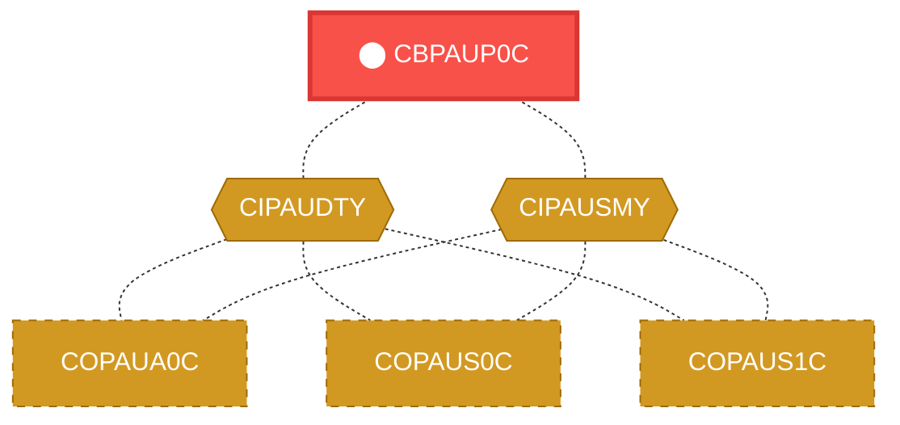
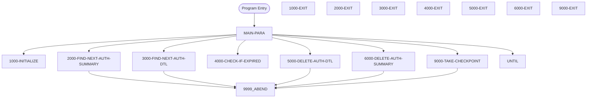

# Program: CBPAUP0C


---

## Quick Reference

| Attribute | Value |
|-----------|-------|
| Program ID | `CBPAUP0C` |
| Type | BATCH |
| Lines | 387 |
| Source | [CBPAUP0C.cbl](../carddemo/CBPAUP0C.cbl#L1) |
| Paragraphs | 17 |
| Statements | 17 |
| Impact Risk | **MEDIUM** — 7 programs affected |

> **View Source:** [Open CBPAUP0C.cbl](../carddemo/CBPAUP0C.cbl#L1)

## Source Grounding Facts

| Data Item | Literal Value |
|-----------|---------------|
| `WS-PGMNAME` | `CBPAUP0C` |
| `WS-ERR-FLG` | `N` |
| `WS-END-OF-AUTHDB-FLAG` | `N` |
| `WS-MORE-AUTHS-FLAG` | `N` |
| `WS-QUALIFY-DELETE-FLAG` | `N` |
| `END-OF-FILE` | `10` |


## Business Purpose

*Business purpose is not present in the extracted data. Run LLM enrichment to populate this section.*


## Dependency Context

> This section shows how **CBPAUP0C** connects to the rest of the system — who calls it,
> what it calls, and what data it shares. If linked programs exist, they must appear here.

### Programs That Call CBPAUP0C (Callers)

*No programs call CBPAUP0C — this is likely a top-level entry point or CICS transaction starter.*

### Programs Called by CBPAUP0C (Callees)

*CBPAUP0C does not call any other programs (leaf program).*

### Shared Data (Copybooks & Files)

#### Shared Copybooks

| Copybook | Also Used By | # Co-Users |
|----------|-------------|------------|
| `CIPAUDTY` | COPAUA0C, COPAUS0C, COPAUS1C, COPAUS2C, DBUNLDGS (+2 more) | 7 |
| `CIPAUSMY` | COPAUA0C, COPAUS0C, COPAUS1C, DBUNLDGS, PAUDBLOD (+1 more) | 6 |


## Legacy Data Contracts

> These tables are derived from FILE SECTION records and COPY-expanded data declarations. They preserve the legacy field names, COBOL storage type, inferred modern type, and status-code values needed for Java DTOs, SQL schemas, API contracts, and migration mapping.


### Copybook Segment Layouts

#### `CIPAUDTY` as `PENDING-AUTH-DETAILS`

| Legacy Field | Meaning | COBOL Type | Modern Type | Status / Format Notes |
|--------------|---------|------------|-------------|-----------------------|
| `PA-AUTHORIZATION-KEY` | Authorization Key | `GROUP` | `OBJECT` |  |
| `PA-AUTH-DATE-9C` | Authorization Date | `PIC S9(05) COMP-3` | `INTEGER` | Date-like field; verify YYDDD, YYMMDD, or ISO format before migration. |
| `PA-AUTH-TIME-9C` | Authorization Time | `PIC S9(09) COMP-3` | `INTEGER` |  |
| `PA-AUTH-ORIG-DATE` | Authorization Orig Date | `PIC X(06)` | `STRING(6)` |  |
| `PA-AUTH-ORIG-TIME` | Authorization Orig Time | `PIC X(06)` | `STRING(6)` |  |
| `PA-CARD-NUM` | Card Number | `PIC X(16)` | `STRING(16)` |  |
| `PA-AUTH-TYPE` | Authorization Type | `PIC X(04)` | `STRING(4)` |  |
| `PA-CARD-EXPIRY-DATE` | Card Expiry Date | `PIC X(04)` | `STRING(4)` |  |
| `PA-MESSAGE-TYPE` | Message Type | `PIC X(06)` | `STRING(6)` |  |
| `PA-MESSAGE-SOURCE` | Message Source | `PIC X(06)` | `STRING(6)` |  |
| `PA-AUTH-ID-CODE` | Authorization ID Code | `PIC X(06)` | `STRING(6)` |  |
| `PA-AUTH-RESP-CODE` | Authorization Response Code | `PIC X(02)` | `STRING(2)` |  |
| `PA-AUTH-RESP-REASON` | Authorization Response Reason | `PIC X(04)` | `STRING(4)` |  |
| `PA-PROCESSING-CODE` | Processing Code | `PIC 9(06)` | `INTEGER` |  |
| `PA-TRANSACTION-AMT` | Transaction Amount | `PIC S9(10)V99 COMP-3` | `DECIMAL(12,2)` |  |
| `PA-APPROVED-AMT` | Approved Amount | `PIC S9(10)V99 COMP-3` | `DECIMAL(12,2)` |  |
| `PA-MERCHANT-CATAGORY-CODE` | Merchant Catagory Code | `PIC X(04)` | `STRING(4)` |  |
| `PA-ACQR-COUNTRY-CODE` | Acqr Country Code | `PIC X(03)` | `STRING(3)` |  |
| `PA-POS-ENTRY-MODE` | Pos Entry Mode | `PIC 9(02)` | `INTEGER` |  |
| `PA-MERCHANT-ID` | Merchant ID | `PIC X(15)` | `STRING(15)` |  |
| `PA-MERCHANT-NAME` | Merchant Name | `PIC X(22)` | `STRING(22)` |  |
| `PA-MERCHANT-CITY` | Merchant City | `PIC X(13)` | `STRING(13)` |  |
| `PA-MERCHANT-STATE` | Merchant State | `PIC X(02)` | `STRING(2)` |  |
| `PA-MERCHANT-ZIP` | Merchant Zip | `PIC X(09)` | `STRING(9)` |  |
| `PA-TRANSACTION-ID` | Transaction ID | `PIC X(15)` | `STRING(15)` |  |
| `PA-MATCH-STATUS` | Match Status | `PIC X(01)` | `STRING(1)` |  |
| `PA-AUTH-FRAUD` | Authorization Fraud | `PIC X(01)` | `STRING(1)` |  |
| `PA-FRAUD-RPT-DATE` | Fraud Rpt Date | `PIC X(08)` | `STRING(8)` | Date-like field; verify YYDDD, YYMMDD, or ISO format before migration. |
| `FILLER` | Filler | `PIC X(17)` | `STRING(17)` |  |

#### `CIPAUSMY` as `PENDING-AUTH-SUMMARY`

| Legacy Field | Meaning | COBOL Type | Modern Type | Status / Format Notes |
|--------------|---------|------------|-------------|-----------------------|
| `PA-ACCT-ID` | Account ID | `PIC S9(11) COMP-3` | `BIGINT` |  |
| `PA-CUST-ID` | Customer ID | `PIC 9(09)` | `INTEGER` |  |
| `PA-AUTH-STATUS` | Authorization Status | `PIC X(01)` | `STRING(1)` |  |
| `PA-ACCOUNT-STATUS` | Account Status | `PIC X(02) OCCURS 5` | `STRING(2)` | Repeating field, 5 occurrences. |
| `PA-CREDIT-LIMIT` | Credit Limit | `PIC S9(09)V99 COMP-3` | `DECIMAL(11,2)` |  |
| `PA-CASH-LIMIT` | Cash Limit | `PIC S9(09)V99 COMP-3` | `DECIMAL(11,2)` |  |
| `PA-CREDIT-BALANCE` | Credit Balance | `PIC S9(09)V99 COMP-3` | `DECIMAL(11,2)` |  |
| `PA-CASH-BALANCE` | Cash Balance | `PIC S9(09)V99 COMP-3` | `DECIMAL(11,2)` |  |
| `PA-APPROVED-AUTH-CNT` | Approved Authorization Count | `PIC S9(04) COMP` | `INTEGER` |  |
| `PA-DECLINED-AUTH-CNT` | Declined Authorization Count | `PIC S9(04) COMP` | `INTEGER` |  |
| `PA-APPROVED-AUTH-AMT` | Approved Authorization Amount | `PIC S9(09)V99 COMP-3` | `DECIMAL(11,2)` |  |
| `PA-DECLINED-AUTH-AMT` | Declined Authorization Amount | `PIC S9(09)V99 COMP-3` | `DECIMAL(11,2)` |  |
| `FILLER` | Filler | `PIC X(34)` | `STRING(34)` |  |


### Data Movement And Key Mapping

| Line | Source | Target | Meaning |
|------|--------|--------|---------|
| 163 | `0` | `WS-AUTH-SMRY-PROC-CNT` | 0 populates WS-AUTH-SMRY-PROC-CNT |
| 233 | `PA-ACCT-ID` | `WS-CURR-APP-ID` | PA-ACCT-ID populates WS-CURR-APP-ID |


---

## Dependency Graph



> **Legend:** 🔴 Target program · 🔵 Direct callers · 🟢 Direct callees · 🟡 Copybook-coupled · ⚫ Transitive (indirect)

---

## Impact Ripple View

> **If you change CBPAUP0C, what else could break?**

| Impact Metric | Count |
|--------------|-------|
| Direct Callers | 0 |
| Transitive Callers (callers of callers) | 0 |
| Direct Callees | 0 |
| Transitive Callees | 0 |
| Copybook-Coupled Programs | 7 |
| **Total Impact** | **7** |
| **Risk Rating** | **MEDIUM** |


**Programs affected via shared copybooks:**
- `COPAUA0C`
- `COPAUS0C`
- `COPAUS1C`
- `COPAUS2C`
- `DBUNLDGS`
- `PAUDBLOD`
- `PAUDBUNL`

---

## Statement Profile

| Statement Type | Count |
|---------------|-------|
| IF | 17 |

## Control Flow



## Paragraphs

### MAIN-PARA

| | |
|---|---|
| **Paragraph** | `MAIN-PARA` |
| **Lines** | 136 - 182 |
| **View Code** | [Jump to Line 136](../carddemo/CBPAUP0C.cbl#L136) |


### 1000-INITIALIZE

| | |
|---|---|
| **Paragraph** | `1000-INITIALIZE` |
| **Lines** | 183 - 211 |
| **View Code** | [Jump to Line 183](../carddemo/CBPAUP0C.cbl#L183) |


### 1000-EXIT

| | |
|---|---|
| **Paragraph** | `1000-EXIT` |
| **Lines** | 212 - 215 |
| **View Code** | [Jump to Line 212](../carddemo/CBPAUP0C.cbl#L212) |


### 2000-FIND-NEXT-AUTH-SUMMARY

| | |
|---|---|
| **Paragraph** | `2000-FIND-NEXT-AUTH-SUMMARY` |
| **Lines** | 216 - 242 |
| **View Code** | [Jump to Line 216](../carddemo/CBPAUP0C.cbl#L216) |


### 2000-EXIT

| | |
|---|---|
| **Paragraph** | `2000-EXIT` |
| **Lines** | 243 - 247 |
| **View Code** | [Jump to Line 243](../carddemo/CBPAUP0C.cbl#L243) |


### 3000-FIND-NEXT-AUTH-DTL

| | |
|---|---|
| **Paragraph** | `3000-FIND-NEXT-AUTH-DTL` |
| **Lines** | 248 - 272 |
| **View Code** | [Jump to Line 248](../carddemo/CBPAUP0C.cbl#L248) |


### 3000-EXIT

| | |
|---|---|
| **Paragraph** | `3000-EXIT` |
| **Lines** | 273 - 276 |
| **View Code** | [Jump to Line 273](../carddemo/CBPAUP0C.cbl#L273) |


### 4000-CHECK-IF-EXPIRED

| | |
|---|---|
| **Paragraph** | `4000-CHECK-IF-EXPIRED` |
| **Lines** | 277 - 298 |
| **View Code** | [Jump to Line 277](../carddemo/CBPAUP0C.cbl#L277) |


### 4000-EXIT

| | |
|---|---|
| **Paragraph** | `4000-EXIT` |
| **Lines** | 299 - 302 |
| **View Code** | [Jump to Line 299](../carddemo/CBPAUP0C.cbl#L299) |


### 5000-DELETE-AUTH-DTL

| | |
|---|---|
| **Paragraph** | `5000-DELETE-AUTH-DTL` |
| **Lines** | 303 - 323 |
| **View Code** | [Jump to Line 303](../carddemo/CBPAUP0C.cbl#L303) |


### 5000-EXIT

| | |
|---|---|
| **Paragraph** | `5000-EXIT` |
| **Lines** | 324 - 327 |
| **View Code** | [Jump to Line 324](../carddemo/CBPAUP0C.cbl#L324) |


### 6000-DELETE-AUTH-SUMMARY

| | |
|---|---|
| **Paragraph** | `6000-DELETE-AUTH-SUMMARY` |
| **Lines** | 328 - 347 |
| **View Code** | [Jump to Line 328](../carddemo/CBPAUP0C.cbl#L328) |


### 6000-EXIT

| | |
|---|---|
| **Paragraph** | `6000-EXIT` |
| **Lines** | 348 - 351 |
| **View Code** | [Jump to Line 348](../carddemo/CBPAUP0C.cbl#L348) |


### 9000-TAKE-CHECKPOINT

| | |
|---|---|
| **Paragraph** | `9000-TAKE-CHECKPOINT` |
| **Lines** | 352 - 372 |
| **View Code** | [Jump to Line 352](../carddemo/CBPAUP0C.cbl#L352) |


### 9000-EXIT

| | |
|---|---|
| **Paragraph** | `9000-EXIT` |
| **Lines** | 373 - 376 |
| **View Code** | [Jump to Line 373](../carddemo/CBPAUP0C.cbl#L373) |


### 9999-ABEND

| | |
|---|---|
| **Paragraph** | `9999-ABEND` |
| **Lines** | 377 - 384 |
| **View Code** | [Jump to Line 377](../carddemo/CBPAUP0C.cbl#L377) |


### 9999-EXIT

| | |
|---|---|
| **Paragraph** | `9999-EXIT` |
| **Lines** | 385 - 386 |
| **View Code** | [Jump to Line 385](../carddemo/CBPAUP0C.cbl#L385) |


## Copybook Field Dictionaries

The following copybooks are included by this program. Each entry shows the actual fields
extracted from the copybook source file (`.cpy`).

### Copybook `CIPAUDTY`

| Level | Field | PIC | USAGE | Parent | Notes |
|-------|-------|-----|-------|--------|-------|
| `05` | `PA-AUTHORIZATION-KEY` | `None` | None | None |  |
| `10` | `PA-AUTH-DATE-9C` | `S9(05)` | COMP | PA-AUTHORIZATION-KEY |  |
| `10` | `PA-AUTH-TIME-9C` | `S9(09)` | COMP | PA-AUTHORIZATION-KEY |  |
| `05` | `PA-AUTH-ORIG-DATE` | `X(06)` | None | None |  |
| `05` | `PA-AUTH-ORIG-TIME` | `X(06)` | None | None |  |
| `05` | `PA-CARD-NUM` | `X(16)` | None | None |  |
| `05` | `PA-AUTH-TYPE` | `X(04)` | None | None |  |
| `05` | `PA-CARD-EXPIRY-DATE` | `X(04)` | None | None |  |
| `05` | `PA-MESSAGE-TYPE` | `X(06)` | None | None |  |
| `05` | `PA-MESSAGE-SOURCE` | `X(06)` | None | None |  |
| `05` | `PA-AUTH-ID-CODE` | `X(06)` | None | None |  |
| `05` | `PA-AUTH-RESP-CODE` | `X(02)` | None | None |  |
| `88` | `PA-AUTH-APPROVED` | `None` | None | None |  |
| `05` | `PA-AUTH-RESP-REASON` | `X(04)` | None | None |  |
| `05` | `PA-PROCESSING-CODE` | `9(06)` | None | None |  |
| `05` | `PA-TRANSACTION-AMT` | `S9(10)V99` | COMP | None |  |
| `05` | `PA-APPROVED-AMT` | `S9(10)V99` | COMP | None |  |
| `05` | `PA-MERCHANT-CATAGORY-CODE` | `X(04)` | None | None |  |
| `05` | `PA-ACQR-COUNTRY-CODE` | `X(03)` | None | None |  |
| `05` | `PA-POS-ENTRY-MODE` | `9(02)` | None | None |  |
| `05` | `PA-MERCHANT-ID` | `X(15)` | None | None |  |
| `05` | `PA-MERCHANT-NAME` | `X(22)` | None | None |  |
| `05` | `PA-MERCHANT-CITY` | `X(13)` | None | None |  |
| `05` | `PA-MERCHANT-STATE` | `X(02)` | None | None |  |
| `05` | `PA-MERCHANT-ZIP` | `X(09)` | None | None |  |
| `05` | `PA-TRANSACTION-ID` | `X(15)` | None | None |  |
| `05` | `PA-MATCH-STATUS` | `X(01)` | None | None |  |
| `88` | `PA-MATCH-PENDING` | `None` | None | None |  |
| `88` | `PA-MATCH-AUTH-DECLINED` | `None` | None | None |  |
| `88` | `PA-MATCH-PENDING-EXPIRED` | `None` | None | None |  |
| `88` | `PA-MATCHED-WITH-TRAN` | `None` | None | None |  |
| `05` | `PA-AUTH-FRAUD` | `X(01)` | None | None |  |
| `88` | `PA-FRAUD-CONFIRMED` | `None` | None | None |  |
| `88` | `PA-FRAUD-REMOVED` | `None` | None | None |  |
| `05` | `PA-FRAUD-RPT-DATE` | `X(08)` | None | None |  |

### Copybook `CIPAUSMY`

| Level | Field | PIC | USAGE | Parent | Notes |
|-------|-------|-----|-------|--------|-------|
| `05` | `PA-ACCT-ID` | `S9(11)` | COMP | None |  |
| `05` | `PA-CUST-ID` | `9(09)` | None | None |  |
| `05` | `PA-AUTH-STATUS` | `X(01)` | None | None |  |
| `05` | `PA-ACCOUNT-STATUS` | `X(02)` | None | None | OCCURS 5 |
| `05` | `PA-CREDIT-LIMIT` | `S9(09)V99` | COMP | None |  |
| `05` | `PA-CASH-LIMIT` | `S9(09)V99` | COMP | None |  |
| `05` | `PA-CREDIT-BALANCE` | `S9(09)V99` | COMP | None |  |
| `05` | `PA-CASH-BALANCE` | `S9(09)V99` | COMP | None |  |
| `05` | `PA-APPROVED-AUTH-CNT` | `S9(04)` | COMP | None |  |
| `05` | `PA-DECLINED-AUTH-CNT` | `S9(04)` | COMP | None |  |
| `05` | `PA-APPROVED-AUTH-AMT` | `S9(09)V99` | COMP | None |  |
| `05` | `PA-DECLINED-AUTH-AMT` | `S9(09)V99` | COMP | None |  |


## Data Lineage (MOVE Flow)

The following MOVE statements were extracted from the source. Each row is a `source → destination`
flow that the migration team can use to trace how data is reshaped and routed.

| Source | Destination | Paragraph | Line |
|--------|-------------|-----------|------|
| `'0'` | `WS-AUTH-SMRY-PROC-CNT` | MAIN-PARA | 163 |
| `P-EXPIRY-DAYS` | `WS-EXPIRY-DAYS` | 1000-INITIALIZE | 197 |
| `'5'` | `WS-EXPIRY-DAYS` | 1000-INITIALIZE | 199 |
| `'5'` | `P-CHKP-FREQ` | 1000-INITIALIZE | 202 |
| `'10'` | `P-CHKP-DIS-FREQ` | 1000-INITIALIZE | 205 |
| `'N'` | `P-DEBUG-FLAG` | 1000-INITIALIZE | 208 |
| `PA-ACCT-ID` | `WS-CURR-APP-ID` | 2000-FIND-NEXT-AUTH-SUMMARY | 233 |
| `'0'` | `WS-NO-CHKP` | 9000-TAKE-CHECKPOINT | 361 |
| `'16'` | `RETURN-CODE` | 9999-ABEND | 382 |


## Known Issues & Code Anomalies

Static analysis flagged the following items in this program. Migration teams should
review each one before re-implementing in a modern stack.

| Severity | Category | Title | Paragraph | Line |
|----------|----------|-------|-----------|------|
| **BUG** | LOGIC | Duplicate condition in AND clause | MAIN-PARA | 156 |
| **NOTICE** | DEAD_CODE | Variable `WS-PGMNAME` is declared but never referenced | None | 42 |
| **NOTICE** | DEAD_CODE | Variable `IDX` is declared but never referenced | None | 48 |
| **NOTICE** | DEAD_CODE | Variable `WS-TOT-REC-WRITTEN` is declared but never referenced | None | 53 |
| **NOTICE** | DEAD_CODE | Variable `WS-ERR-FLG` is declared but never referenced | None | 59 |
| **NOTICE** | DEAD_CODE | Variable `WS-END-OF-AUTHDB-FLAG` is declared but never referenced | None | 62 |
| **NOTICE** | DEAD_CODE | Variable `WS-MORE-AUTHS-FLAG` is declared but never referenced | None | 65 |
| **NOTICE** | DEAD_CODE | Variable `WS-QUALIFY-DELETE-FLAG` is declared but never referenced | None | 68 |
| **NOTICE** | DEAD_CODE | Variable `WS-INFILE-STATUS` is declared but never referenced | None | 71 |
| **NOTICE** | DEAD_CODE | Variable `WS-CUSTID-STATUS` is declared but never referenced | None | 72 |
| **NOTICE** | DEAD_CODE | Variable `PSB-NAME` is declared but never referenced | None | 80 |
| **NOTICE** | LOGIC | Paragraph `2000-FIND-NEXT-AUTH-SUMMARY` terminates the program on error | 2000-FIND-NEXT-AUTH-SUMMARY | 216 |
| **NOTICE** | LOGIC | Paragraph `3000-FIND-NEXT-AUTH-DTL` terminates the program on error | 3000-FIND-NEXT-AUTH-DTL | 248 |
| **NOTICE** | LOGIC | Paragraph `5000-DELETE-AUTH-DTL` terminates the program on error | 5000-DELETE-AUTH-DTL | 303 |
| **NOTICE** | LOGIC | Paragraph `6000-DELETE-AUTH-SUMMARY` terminates the program on error | 6000-DELETE-AUTH-SUMMARY | 328 |
| **NOTICE** | LOGIC | Paragraph `9000-TAKE-CHECKPOINT` terminates the program on error | 9000-TAKE-CHECKPOINT | 352 |

### BUG — Duplicate condition in AND clause

The condition `PA-APPROVED-AUTH-CNT <= 0` is checked twice with `AND` between them. This is almost certainly a typo where one side was meant to reference a different variable (e.g. DECLINED instead of APPROVED).
**Source excerpt** (line 156):
```cobol
IF PA-APPROVED-AUTH-CNT <= 0 AND PA-APPROVED-AUTH-CNT <= 0
                 PERFORM 6000-DELETE-AUTH-SUMMARY THRU 6000-EXIT
```

**Recommendation:** Verify the intended second condition with the source-of-truth spec; the most common cause is a copy-paste of the first variable.
---
### NOTICE — Variable `WS-PGMNAME` is declared but never referenced

`WS-PGMNAME` is declared at line 42 but no other statement reads or writes it. Likely a leftover from prior refactoring or an incomplete feature.
**Source excerpt** (line 42):
```cobol
05 WS-PGMNAME                 PIC X(08) VALUE 'CBPAUP0C'.
```

**Recommendation:** Remove the declaration or wire it into the logic that was originally intended.
---
### NOTICE — Variable `IDX` is declared but never referenced

`IDX` is declared at line 48 but no other statement reads or writes it. Likely a leftover from prior refactoring or an incomplete feature.
**Source excerpt** (line 48):
```cobol
05 IDX                        PIC S9(4) COMP.
```

**Recommendation:** Remove the declaration or wire it into the logic that was originally intended.
---
### NOTICE — Variable `WS-TOT-REC-WRITTEN` is declared but never referenced

`WS-TOT-REC-WRITTEN` is declared at line 53 but no other statement reads or writes it. Likely a leftover from prior refactoring or an incomplete feature.
**Source excerpt** (line 53):
```cobol
05 WS-TOT-REC-WRITTEN         PIC S9(8) COMP VALUE 0.
```

**Recommendation:** Remove the declaration or wire it into the logic that was originally intended.
---
### NOTICE — Variable `WS-ERR-FLG` is declared but never referenced

`WS-ERR-FLG` is declared at line 59 but no other statement reads or writes it. Likely a leftover from prior refactoring or an incomplete feature.
**Source excerpt** (line 59):
```cobol
05 WS-ERR-FLG                 PIC X(01) VALUE 'N'.
```

**Recommendation:** Remove the declaration or wire it into the logic that was originally intended.
---
### NOTICE — Variable `WS-END-OF-AUTHDB-FLAG` is declared but never referenced

`WS-END-OF-AUTHDB-FLAG` is declared at line 62 but no other statement reads or writes it. Likely a leftover from prior refactoring or an incomplete feature.
**Source excerpt** (line 62):
```cobol
05 WS-END-OF-AUTHDB-FLAG      PIC X(01) VALUE 'N'.
```

**Recommendation:** Remove the declaration or wire it into the logic that was originally intended.
---
### NOTICE — Variable `WS-MORE-AUTHS-FLAG` is declared but never referenced

`WS-MORE-AUTHS-FLAG` is declared at line 65 but no other statement reads or writes it. Likely a leftover from prior refactoring or an incomplete feature.
**Source excerpt** (line 65):
```cobol
05 WS-MORE-AUTHS-FLAG         PIC X(01) VALUE 'N'.
```

**Recommendation:** Remove the declaration or wire it into the logic that was originally intended.
---
### NOTICE — Variable `WS-QUALIFY-DELETE-FLAG` is declared but never referenced

`WS-QUALIFY-DELETE-FLAG` is declared at line 68 but no other statement reads or writes it. Likely a leftover from prior refactoring or an incomplete feature.
**Source excerpt** (line 68):
```cobol
05 WS-QUALIFY-DELETE-FLAG     PIC X(01) VALUE 'N'.
```

**Recommendation:** Remove the declaration or wire it into the logic that was originally intended.
---
### NOTICE — Variable `WS-INFILE-STATUS` is declared but never referenced

`WS-INFILE-STATUS` is declared at line 71 but no other statement reads or writes it. Likely a leftover from prior refactoring or an incomplete feature.
**Source excerpt** (line 71):
```cobol
05 WS-INFILE-STATUS           PIC X(02) VALUE SPACES.
```

**Recommendation:** Remove the declaration or wire it into the logic that was originally intended.
---
### NOTICE — Variable `WS-CUSTID-STATUS` is declared but never referenced

`WS-CUSTID-STATUS` is declared at line 72 but no other statement reads or writes it. Likely a leftover from prior refactoring or an incomplete feature.
**Source excerpt** (line 72):
```cobol
05 WS-CUSTID-STATUS           PIC X(02) VALUE SPACES.
```

**Recommendation:** Remove the declaration or wire it into the logic that was originally intended.
---
### NOTICE — Variable `PSB-NAME` is declared but never referenced

`PSB-NAME` is declared at line 80 but no other statement reads or writes it. Likely a leftover from prior refactoring or an incomplete feature.
**Source excerpt** (line 80):
```cobol
05 PSB-NAME                        PIC X(8) VALUE 'PSBPAUTB'.
```

**Recommendation:** Remove the declaration or wire it into the logic that was originally intended.
---
### NOTICE — Paragraph `2000-FIND-NEXT-AUTH-SUMMARY` terminates the program on error

`2000-FIND-NEXT-AUTH-SUMMARY` calls an ABEND routine (or STOP RUN) on the failure path. This means an error here ENDS the entire program — it does NOT reject, skip, or log-and-continue. Documentation must use "abend" / "terminate" language, not "reject".

**Recommendation:** Use ‘abend’ or ‘terminates the program’ when describing the error path of this paragraph.
---
### NOTICE — Paragraph `3000-FIND-NEXT-AUTH-DTL` terminates the program on error

`3000-FIND-NEXT-AUTH-DTL` calls an ABEND routine (or STOP RUN) on the failure path. This means an error here ENDS the entire program — it does NOT reject, skip, or log-and-continue. Documentation must use "abend" / "terminate" language, not "reject".

**Recommendation:** Use ‘abend’ or ‘terminates the program’ when describing the error path of this paragraph.
---
### NOTICE — Paragraph `5000-DELETE-AUTH-DTL` terminates the program on error

`5000-DELETE-AUTH-DTL` calls an ABEND routine (or STOP RUN) on the failure path. This means an error here ENDS the entire program — it does NOT reject, skip, or log-and-continue. Documentation must use "abend" / "terminate" language, not "reject".

**Recommendation:** Use ‘abend’ or ‘terminates the program’ when describing the error path of this paragraph.
---
### NOTICE — Paragraph `6000-DELETE-AUTH-SUMMARY` terminates the program on error

`6000-DELETE-AUTH-SUMMARY` calls an ABEND routine (or STOP RUN) on the failure path. This means an error here ENDS the entire program — it does NOT reject, skip, or log-and-continue. Documentation must use "abend" / "terminate" language, not "reject".

**Recommendation:** Use ‘abend’ or ‘terminates the program’ when describing the error path of this paragraph.
---
### NOTICE — Paragraph `9000-TAKE-CHECKPOINT` terminates the program on error

`9000-TAKE-CHECKPOINT` calls an ABEND routine (or STOP RUN) on the failure path. This means an error here ENDS the entire program — it does NOT reject, skip, or log-and-continue. Documentation must use "abend" / "terminate" language, not "reject".

**Recommendation:** Use ‘abend’ or ‘terminates the program’ when describing the error path of this paragraph.
---

## External Runtime Parameters

This program receives the following parameters at runtime (via `PROCEDURE DIVISION USING`
or `ENTRY USING`). Each parameter must be supplied by the caller — typically a JCL job
step (`PARM=`), CICS COMMAREA, or the IMS region controller. The migration target needs
an equivalent input wiring.

| # | Parameter | Source | Declared at line |
|---|-----------|--------|------------------|
| 0 | `IO-PCB-MASK` | PROCEDURE DIVISION USING | 132 |
| 1 | `PGM-PCB-MASK` | PROCEDURE DIVISION USING | 132 |


## Decision Tables (EVALUATE / WHEN)

Captured from the source. Each EVALUATE block is a structured decision the
migration team should turn into either a switch / pattern-match or a rules table.

### EVALUATE `DIBSTAT` — paragraph `2000-FIND-NEXT-AUTH-SUMMARY` (line 236)

| WHEN | Action |
|------|--------|
| **WHEN OTHER** | DISPLAY 'AUTH SUMMARY READ FAILED  :' DIBSTAT |
| `'  '` | SET NOT-END-OF-AUTHDB TO TRUE |
| `'GB'` | SET END-OF-AUTHDB     TO TRUE |

### EVALUATE `DIBSTAT` — paragraph `3000-FIND-NEXT-AUTH-DTL` (line 266)

| WHEN | Action |
|------|--------|
| **WHEN OTHER** | DISPLAY 'AUTH DETAIL READ FAILED  :' DIBSTAT |
| `'  '` | SET MORE-AUTHS       TO TRUE |
| `'GE'` |  |
| `'GB'` | SET NO-MORE-AUTHS    TO TRUE |


## Modernization Review Findings

These are source-derived review notes that should be checked before translating this program into Java, Spring Boot, SQL, APIs, or batch jobs.

| Finding | Why It Matters |
|---------|----------------|
| Template/debug fields require usage review | Fields such as `PA-CARD-EXPIRY-DATE` look like debug, checkpoint, or abandoned template state. Verify references before designing modern DTOs or database columns. |
| Numeric validation on a COBOL numeric field | `P-EXPIRY-DAYS IS NUMERIC` was found in source. If the field is packed or binary numeric, this may be corruption detection rather than normal validation. |
| Nested IF blocks need compiler-accurate validation | Nested conditional logic was detected. During migration, validate scope with the original compiler rules and explicit `END-IF`/period termination before translating to Java or SQL. |


## Business Rules

*No business rules extracted yet. Run LLM enrichment to extract rules from IF/EVALUATE logic.*

## Key Data Items

*No data items found for this program.*

---

*Generated 2026-05-02 17:07*