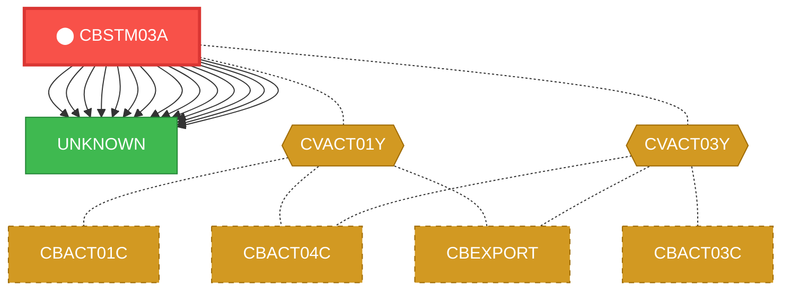

# Program: CBSTM03A


---

## Quick Reference

| Attribute | Value |
|-----------|-------|
| Program ID | `CBSTM03A` |
| Type | BATCH |
| Lines | 925 |
| Source | [CBSTM03A.CBL](../carddemo/CBSTM03A.CBL#L1) |
| Paragraphs | 25 |
| Statements | 409 |
| Impact Risk | **HIGH** — 15 programs affected |

> **View Source:** [Open CBSTM03A.CBL](../carddemo/CBSTM03A.CBL#L1)

## Source Grounding Facts

| Data Item | Literal Value |
|-----------|---------------|
| `WS-FL-DD` | `TRNXFILE` |
| `END-OF-FILE` | `N` |


## Business Purpose

*Business purpose is not present in the extracted data. Run LLM enrichment to populate this section.*


## Dependency Context

> This section shows how **CBSTM03A** connects to the rest of the system — who calls it,
> what it calls, and what data it shares. If linked programs exist, they must appear here.

### Programs That Call CBSTM03A (Callers)

*No programs call CBSTM03A — this is likely a top-level entry point or CICS transaction starter.*

### Programs Called by CBSTM03A (Callees)

| Called Program | Type | Line | Why |
|----------------|------|------|-----|
| `UNKNOWN` | None | 435 |  |
| `UNKNOWN` | None | 461 |  |
| `UNKNOWN` | None | 485 |  |
| `UNKNOWN` | None | 818 |  |
| `UNKNOWN` | None | 830 |  |
| `UNKNOWN` | None | 853 |  |
| `UNKNOWN` | None | 871 |  |
| `UNKNOWN` | None | 889 |  |
| `UNKNOWN` | None | 919 |  |
| `UNKNOWN` | None | 944 |  |
| `UNKNOWN` | None | 961 |  |
| `UNKNOWN` | None | 977 |  |
| `UNKNOWN` | None | 993 |  |
| `UNKNOWN` | None | 1007 |  |

### Shared Data (Copybooks & Files)

#### Shared Copybooks

| Copybook | Also Used By | # Co-Users |
|----------|-------------|------------|
| `COSTM01` |  | 0 |
| `CUSTREC` |  | 0 |
| `CVACT01Y` | CBACT01C, CBACT04C, CBEXPORT, CBIMPORT, CBTRN01C (+8 more) | 13 |
| `CVACT03Y` | CBACT03C, CBACT04C, CBEXPORT, CBIMPORT, CBTRN01C (+8 more) | 13 |

#### Shared Files

| File | Type | Access | Also Used By |
|------|------|--------|-------------|
| `HTML-FILE` | None | None |  |
| `STMT-FILE` | None | None |  |

## Legacy Data Contracts

> These tables are derived from FILE SECTION records and COPY-expanded data declarations. They preserve the legacy field names, COBOL storage type, inferred modern type, and status-code values needed for Java DTOs, SQL schemas, API contracts, and migration mapping.

### File Record Layouts

#### `STMT-FILE` / `FD-STMTFILE-REC`
| Legacy Field | Meaning | COBOL Type | Modern Type | Notes |
|--------------|---------|------------|-------------|-------|
| `FD-STMTFILE-REC` | Fd Stmtfile Record | `PIC X(80)` | `STRING(80)` |  |

#### `HTML-FILE` / `FD-HTMLFILE-REC`
| Legacy Field | Meaning | COBOL Type | Modern Type | Notes |
|--------------|---------|------------|-------------|-------|
| `FD-HTMLFILE-REC` | Fd Htmlfile Record | `PIC X(100)` | `STRING(100)` |  |


### Copybook Segment Layouts

#### `COSTM01` as `TRNX-RECORD`

| Legacy Field | Meaning | COBOL Type | Modern Type | Status / Format Notes |
|--------------|---------|------------|-------------|-----------------------|
| `TRNX-RECORD` | Trnx Record | `GROUP` | `OBJECT` |  |
| `TRNX-KEY` | Trnx Key | `GROUP` | `OBJECT` |  |
| `TRNX-CARD-NUM` | Trnx Card Number | `PIC X(16)` | `STRING(16)` |  |
| `TRNX-ID` | Trnx ID | `PIC X(16)` | `STRING(16)` |  |
| `TRNX-REST` | Trnx Rest | `GROUP` | `OBJECT` |  |
| `TRNX-TYPE-CD` | Trnx Type Cd | `PIC X(02)` | `STRING(2)` |  |
| `TRNX-CAT-CD` | Trnx Cat Cd | `PIC 9(04)` | `INTEGER` |  |
| `TRNX-SOURCE` | Trnx Source | `PIC X(10)` | `STRING(10)` |  |
| `TRNX-DESC` | Trnx Desc | `PIC X(100)` | `STRING(100)` |  |
| `TRNX-AMT` | Trnx Amount | `PIC S9(09)V99` | `DECIMAL(11,2)` |  |
| `TRNX-MERCHANT-ID` | Trnx Merchant ID | `PIC 9(09)` | `INTEGER` |  |
| `TRNX-MERCHANT-NAME` | Trnx Merchant Name | `PIC X(50)` | `STRING(50)` |  |
| `TRNX-MERCHANT-CITY` | Trnx Merchant City | `PIC X(50)` | `STRING(50)` |  |
| `TRNX-MERCHANT-ZIP` | Trnx Merchant Zip | `PIC X(10)` | `STRING(10)` |  |
| `TRNX-ORIG-TS` | Trnx Orig Ts | `PIC X(26)` | `STRING(26)` |  |
| `TRNX-PROC-TS` | Trnx Proc Ts | `PIC X(26)` | `STRING(26)` |  |
| `FILLER` | Filler | `PIC X(20)` | `STRING(20)` |  |

#### `CUSTREC` as `CUSTOMER-RECORD`

| Legacy Field | Meaning | COBOL Type | Modern Type | Status / Format Notes |
|--------------|---------|------------|-------------|-----------------------|
| `CUSTOMER-RECORD` | Customer Record | `GROUP` | `OBJECT` |  |
| `CUST-ID` | Customer ID | `PIC 9(09)` | `INTEGER` |  |
| `CUST-FIRST-NAME` | Customer First Name | `PIC X(25)` | `STRING(25)` |  |
| `CUST-MIDDLE-NAME` | Customer Middle Name | `PIC X(25)` | `STRING(25)` |  |
| `CUST-LAST-NAME` | Customer Last Name | `PIC X(25)` | `STRING(25)` |  |
| `CUST-ADDR-LINE-1` | Customer Addr Line 1 | `PIC X(50)` | `STRING(50)` |  |
| `CUST-ADDR-LINE-2` | Customer Addr Line 2 | `PIC X(50)` | `STRING(50)` |  |
| `CUST-ADDR-LINE-3` | Customer Addr Line 3 | `PIC X(50)` | `STRING(50)` |  |
| `CUST-ADDR-STATE-CD` | Customer Addr State Cd | `PIC X(02)` | `STRING(2)` |  |
| `CUST-ADDR-COUNTRY-CD` | Customer Addr Country Cd | `PIC X(03)` | `STRING(3)` |  |
| `CUST-ADDR-ZIP` | Customer Addr Zip | `PIC X(10)` | `STRING(10)` |  |
| `CUST-PHONE-NUM-1` | Customer Phone Number 1 | `PIC X(15)` | `STRING(15)` |  |
| `CUST-PHONE-NUM-2` | Customer Phone Number 2 | `PIC X(15)` | `STRING(15)` |  |
| `CUST-SSN` | Customer Ssn | `PIC 9(09)` | `INTEGER` |  |
| `CUST-GOVT-ISSUED-ID` | Customer Govt Issued ID | `PIC X(20)` | `STRING(20)` |  |
| `CUST-DOB-YYYYMMDD` | Customer Dob Yyyymmdd | `PIC X(10)` | `STRING(10)` |  |
| `CUST-EFT-ACCOUNT-ID` | Customer Eft Account ID | `PIC X(10)` | `STRING(10)` |  |
| `CUST-PRI-CARD-HOLDER-IND` | Customer Pri Card Holder Ind | `PIC X(01)` | `STRING(1)` |  |
| `CUST-FICO-CREDIT-SCORE` | Customer Fico Credit Score | `PIC 9(03)` | `INTEGER` |  |
| `FILLER` | Filler | `PIC X(168)` | `STRING(168)` |  |

#### `CVACT01Y` as `ACCOUNT-RECORD`

| Legacy Field | Meaning | COBOL Type | Modern Type | Status / Format Notes |
|--------------|---------|------------|-------------|-----------------------|
| `ACCOUNT-RECORD` | Account Record | `GROUP` | `OBJECT` |  |
| `ACCT-ID` | Account ID | `PIC 9(11)` | `BIGINT` |  |
| `ACCT-ACTIVE-STATUS` | Account Active Status | `PIC X(01)` | `STRING(1)` |  |
| `ACCT-CURR-BAL` | Account Curr Bal | `PIC S9(10)V99` | `DECIMAL(12,2)` |  |
| `ACCT-CREDIT-LIMIT` | Account Credit Limit | `PIC S9(10)V99` | `DECIMAL(12,2)` |  |
| `ACCT-CASH-CREDIT-LIMIT` | Account Cash Credit Limit | `PIC S9(10)V99` | `DECIMAL(12,2)` |  |
| `ACCT-OPEN-DATE` | Account Open Date | `PIC X(10)` | `STRING(10)` | Date-like field; verify YYDDD, YYMMDD, or ISO format before migration. |
| `ACCT-EXPIRAION-DATE` | Account Expiraion Date | `PIC X(10)` | `STRING(10)` | Date-like field; verify YYDDD, YYMMDD, or ISO format before migration. |
| `ACCT-REISSUE-DATE` | Account Reissue Date | `PIC X(10)` | `STRING(10)` | Date-like field; verify YYDDD, YYMMDD, or ISO format before migration. |
| `ACCT-CURR-CYC-CREDIT` | Account Curr Cyc Credit | `PIC S9(10)V99` | `DECIMAL(12,2)` |  |
| `ACCT-CURR-CYC-DEBIT` | Account Curr Cyc Debit | `PIC S9(10)V99` | `DECIMAL(12,2)` |  |
| `ACCT-ADDR-ZIP` | Account Addr Zip | `PIC X(10)` | `STRING(10)` |  |
| `ACCT-GROUP-ID` | Account Group ID | `PIC X(10)` | `STRING(10)` |  |
| `FILLER` | Filler | `PIC X(178)` | `STRING(178)` |  |

#### `CVACT03Y` as `CARD-XREF-RECORD`

| Legacy Field | Meaning | COBOL Type | Modern Type | Status / Format Notes |
|--------------|---------|------------|-------------|-----------------------|
| `CARD-XREF-RECORD` | Card Xref Record | `GROUP` | `OBJECT` |  |
| `XREF-CARD-NUM` | Xref Card Number | `PIC X(16)` | `STRING(16)` |  |
| `XREF-CUST-ID` | Xref Customer ID | `PIC 9(09)` | `INTEGER` |  |
| `XREF-ACCT-ID` | Xref Account ID | `PIC 9(11)` | `BIGINT` |  |
| `FILLER` | Filler | `PIC X(14)` | `STRING(14)` |  |


### Data Movement And Key Mapping

| Line | Source | Target | Meaning |
|------|--------|--------|---------|
| 325 | `ZERO` | `WS-TOTAL-AMT` | ZERO populates WS-TOTAL-AMT |
| 347 | `'XREFFILE'` | `WS-M03B-DD` | 'XREFFILE' populates WS-M03B-DD |
| 357 | `'Y'` | `END-OF-FILE` | 'Y' populates END-OF-FILE |
| 364 | `WS-M03B-FLDT` | `CARD-XREF-RECORD` | WS-M03B-FLDT populates CARD-XREF-RECORD |
| 370 | `'CUSTFILE'` | `WS-M03B-DD` | 'CUSTFILE' populates WS-M03B-DD |
| 372 | `XREF-CUST-ID` | `WS-M03B-KEY` | XREF-CUST-ID populates WS-M03B-KEY |
| 373 | `ZERO` | `WS-M03B-KEY-LN` | ZERO populates WS-M03B-KEY-LN |
| 388 | `WS-M03B-FLDT` | `CUSTOMER-RECORD` | WS-M03B-FLDT populates CUSTOMER-RECORD |
| 394 | `'ACCTFILE'` | `WS-M03B-DD` | 'ACCTFILE' populates WS-M03B-DD |
| 396 | `XREF-ACCT-ID` | `WS-M03B-KEY` | XREF-ACCT-ID populates WS-M03B-KEY |
| 397 | `ZERO` | `WS-M03B-KEY-LN` | ZERO populates WS-M03B-KEY-LN |
| 412 | `WS-M03B-FLDT` | `ACCOUNT-RECORD` | WS-M03B-FLDT populates ACCOUNT-RECORD |
| 433 | `WS-TOTAL-AMT` | `WS-TRN-AMT` | WS-TOTAL-AMT populates WS-TRN-AMT |
| 434 | `WS-TRN-AMT` | `ST-TOTAL-TRAMT` | WS-TRN-AMT populates ST-TOTAL-TRAMT |
| 470 | `CUST-ADDR-LINE-1` | `ST-ADD1` | CUST-ADDR-LINE-1 populates ST-ADD1 |
| 471 | `CUST-ADDR-LINE-2` | `ST-ADD2` | CUST-ADDR-LINE-2 populates ST-ADD2 |
| 483 | `ACCT-ID` | `ST-ACCT-ID` | ACCT-ID populates ST-ACCT-ID |
| 484 | `ACCT-CURR-BAL` | `ST-CURR-BAL` | ACCT-CURR-BAL populates ST-CURR-BAL |
| 485 | `CUST-FICO-CREDIT-SCORE` | `ST-FICO-SCORE` | CUST-FICO-CREDIT-SCORE populates ST-FICO-SCORE |
| 529 | `ACCT-ID` | `L11-ACCT` | ACCT-ID populates L11-ACCT |
| 561 | `SPACES` | `FD-HTMLFILE-REC` | SPACES populates FD-HTMLFILE-REC |
| 678 | `TRNX-AMT` | `ST-TRANAMT` | TRNX-AMT populates ST-TRANAMT |
| 731 | `'TRNXFILE'` | `WS-M03B-DD` | 'TRNXFILE' populates WS-M03B-DD |
| 756 | `WS-M03B-FLDT` | `TRNX-RECORD` | WS-M03B-FLDT populates TRNX-RECORD |
| 766 | `'XREFFILE'` | `WS-M03B-DD` | 'XREFFILE' populates WS-M03B-DD |
| 779 | `'CUSTFILE'` | `WS-FL-DD` | 'CUSTFILE' populates WS-FL-DD |
| 784 | `'CUSTFILE'` | `WS-M03B-DD` | 'CUSTFILE' populates WS-M03B-DD |
| 797 | `'ACCTFILE'` | `WS-FL-DD` | 'ACCTFILE' populates WS-FL-DD |
| 802 | `'ACCTFILE'` | `WS-M03B-DD` | 'ACCTFILE' populates WS-M03B-DD |
| 832 | `'TRNXFILE'` | `WS-M03B-DD` | 'TRNXFILE' populates WS-M03B-DD |


---

## Dependency Graph



> **Legend:** 🔴 Target program · 🔵 Direct callers · 🟢 Direct callees · 🟡 Copybook-coupled · ⚫ Transitive (indirect)

---

## Impact Ripple View

> **If you change CBSTM03A, what else could break?**

| Impact Metric | Count |
|--------------|-------|
| Direct Callers | 0 |
| Transitive Callers (callers of callers) | 0 |
| Direct Callees | 0 |
| Transitive Callees | 0 |
| Copybook-Coupled Programs | 15 |
| **Total Impact** | **15** |
| **Risk Rating** | **HIGH** |


**Programs affected via shared copybooks:**
- `CBACT01C`
- `CBACT03C`
- `CBACT04C`
- `CBEXPORT`
- `CBIMPORT`
- `CBTRN01C`
- `CBTRN02C`
- `CBTRN03C`
- `COACCT01`
- `COACTUPC`
- `COACTVWC`
- `COBIL00C`
- `COPAUA0C`
- `COPAUS0C`
- `COTRN02C`

---

## Statement Profile

| Statement Type | Count |
|---------------|-------|
| WRITE | 167 |
| SET | 77 |
| MOVE | 70 |
| IF | 25 |
| EXIT | 17 |
| CALL | 14 |
| STRING_OP | 12 |
| PERFORM | 8 |
| GOTO | 6 |
| EVALUATE | 5 |
| COMPUTE | 2 |
| CLOSE | 2 |
| OPEN | 1 |
| INITIALIZE | 1 |
| GOBACK | 1 |
| DISPLAY | 1 |

## Control Flow

```mermaid
flowchart TD
    START([Program Entry])
    0000_START["0000-START"]
    1000_MAINLINE["1000-MAINLINE"]
    9999_GOBACK["9999-GOBACK"]
    1000_XREFFILE_GET_NEXT["1000-XREFFILE-GET-NEXT"]
    2000_CUSTFILE_GET["2000-CUSTFILE-GET"]
    3000_ACCTFILE_GET["3000-ACCTFILE-GET"]
    4000_TRNXFILE_GET["4000-TRNXFILE-GET"]
    5000_CREATE_STATEMENT["5000-CREATE-STATEMENT"]
    5100_WRITE_HTML_HEADER["5100-WRITE-HTML-HEADER"]
    5100_EXIT["5100-EXIT"]
    5200_WRITE_HTML_NMADBS["5200-WRITE-HTML-NMADBS"]
    5200_EXIT["5200-EXIT"]
    6000_WRITE_TRANS["6000-WRITE-TRANS"]
    8100_FILE_OPEN["8100-FILE-OPEN"]
    8100_TRNXFILE_OPEN["8100-TRNXFILE-OPEN"]
    START --> 0000_START
    3000_ACCTFILE_GET --> INLINE
    4000_TRNXFILE_GET --> INLINE
    5000_CREATE_STATEMENT --> INLINE
    5100_WRITE_HTML_HEADER --> INLINE
    5200_WRITE_HTML_NMADBS --> INLINE
```



## Paragraphs

### 0000-START

| | |
|---|---|
| **Paragraph** | `0000-START` |
| **Lines** | 296 - 315 |
| **View Code** | [Jump to Line 296](../carddemo/CBSTM03A.CBL#L296) |


### 1000-MAINLINE

| | |
|---|---|
| **Paragraph** | `1000-MAINLINE` |
| **Lines** | 316 - 340 |
| **View Code** | [Jump to Line 316](../carddemo/CBSTM03A.CBL#L316) |


### 9999-GOBACK

| | |
|---|---|
| **Paragraph** | `9999-GOBACK` |
| **Lines** | 341 - 344 |
| **View Code** | [Jump to Line 341](../carddemo/CBSTM03A.CBL#L341) |


### 1000-XREFFILE-GET-NEXT

| | |
|---|---|
| **Paragraph** | `1000-XREFFILE-GET-NEXT` |
| **Lines** | 345 - 367 |
| **View Code** | [Jump to Line 345](../carddemo/CBSTM03A.CBL#L345) |


### 2000-CUSTFILE-GET

| | |
|---|---|
| **Paragraph** | `2000-CUSTFILE-GET` |
| **Lines** | 368 - 391 |
| **View Code** | [Jump to Line 368](../carddemo/CBSTM03A.CBL#L368) |


### 3000-ACCTFILE-GET

| | |
|---|---|
| **Paragraph** | `3000-ACCTFILE-GET` |
| **Lines** | 392 - 415 |
| **View Code** | [Jump to Line 392](../carddemo/CBSTM03A.CBL#L392) |


### 4000-TRNXFILE-GET

| | |
|---|---|
| **Paragraph** | `4000-TRNXFILE-GET` |
| **Lines** | 416 - 457 |
| **View Code** | [Jump to Line 416](../carddemo/CBSTM03A.CBL#L416) |


### 5000-CREATE-STATEMENT

| | |
|---|---|
| **Paragraph** | `5000-CREATE-STATEMENT` |
| **Lines** | 458 - 505 |
| **View Code** | [Jump to Line 458](../carddemo/CBSTM03A.CBL#L458) |


### 5100-WRITE-HTML-HEADER

| | |
|---|---|
| **Paragraph** | `5100-WRITE-HTML-HEADER` |
| **Lines** | 506 - 553 |
| **View Code** | [Jump to Line 506](../carddemo/CBSTM03A.CBL#L506) |


### 5100-EXIT

| | |
|---|---|
| **Paragraph** | `5100-EXIT` |
| **Lines** | 554 - 557 |
| **View Code** | [Jump to Line 554](../carddemo/CBSTM03A.CBL#L554) |


### 5200-WRITE-HTML-NMADBS

| | |
|---|---|
| **Paragraph** | `5200-WRITE-HTML-NMADBS` |
| **Lines** | 558 - 670 |
| **View Code** | [Jump to Line 558](../carddemo/CBSTM03A.CBL#L558) |


### 5200-EXIT

| | |
|---|---|
| **Paragraph** | `5200-EXIT` |
| **Lines** | 671 - 674 |
| **View Code** | [Jump to Line 671](../carddemo/CBSTM03A.CBL#L671) |


### 6000-WRITE-TRANS

| | |
|---|---|
| **Paragraph** | `6000-WRITE-TRANS` |
| **Lines** | 675 - 725 |
| **View Code** | [Jump to Line 675](../carddemo/CBSTM03A.CBL#L675) |


### 8100-FILE-OPEN

| | |
|---|---|
| **Paragraph** | `8100-FILE-OPEN` |
| **Lines** | 726 - 729 |
| **View Code** | [Jump to Line 726](../carddemo/CBSTM03A.CBL#L726) |


### 8100-TRNXFILE-OPEN

| | |
|---|---|
| **Paragraph** | `8100-TRNXFILE-OPEN` |
| **Lines** | 730 - 764 |
| **View Code** | [Jump to Line 730](../carddemo/CBSTM03A.CBL#L730) |


### 8200-XREFFILE-OPEN

| | |
|---|---|
| **Paragraph** | `8200-XREFFILE-OPEN` |
| **Lines** | 765 - 782 |
| **View Code** | [Jump to Line 765](../carddemo/CBSTM03A.CBL#L765) |


### 8300-CUSTFILE-OPEN

| | |
|---|---|
| **Paragraph** | `8300-CUSTFILE-OPEN` |
| **Lines** | 783 - 800 |
| **View Code** | [Jump to Line 783](../carddemo/CBSTM03A.CBL#L783) |


### 8400-ACCTFILE-OPEN

| | |
|---|---|
| **Paragraph** | `8400-ACCTFILE-OPEN` |
| **Lines** | 801 - 817 |
| **View Code** | [Jump to Line 801](../carddemo/CBSTM03A.CBL#L801) |


### 8500-READTRNX-READ

| | |
|---|---|
| **Paragraph** | `8500-READTRNX-READ` |
| **Lines** | 818 - 848 |
| **View Code** | [Jump to Line 818](../carddemo/CBSTM03A.CBL#L818) |


### 8599-EXIT

| | |
|---|---|
| **Paragraph** | `8599-EXIT` |
| **Lines** | 849 - 855 |
| **View Code** | [Jump to Line 849](../carddemo/CBSTM03A.CBL#L849) |


### 9100-TRNXFILE-CLOSE

| | |
|---|---|
| **Paragraph** | `9100-TRNXFILE-CLOSE` |
| **Lines** | 856 - 872 |
| **View Code** | [Jump to Line 856](../carddemo/CBSTM03A.CBL#L856) |


### 9200-XREFFILE-CLOSE

| | |
|---|---|
| **Paragraph** | `9200-XREFFILE-CLOSE` |
| **Lines** | 873 - 888 |
| **View Code** | [Jump to Line 873](../carddemo/CBSTM03A.CBL#L873) |


### 9300-CUSTFILE-CLOSE

| | |
|---|---|
| **Paragraph** | `9300-CUSTFILE-CLOSE` |
| **Lines** | 889 - 904 |
| **View Code** | [Jump to Line 889](../carddemo/CBSTM03A.CBL#L889) |


### 9400-ACCTFILE-CLOSE

| | |
|---|---|
| **Paragraph** | `9400-ACCTFILE-CLOSE` |
| **Lines** | 905 - 920 |
| **View Code** | [Jump to Line 905](../carddemo/CBSTM03A.CBL#L905) |


### 9999-ABEND-PROGRAM

| | |
|---|---|
| **Paragraph** | `9999-ABEND-PROGRAM` |
| **Lines** | 921 - 924 |
| **View Code** | [Jump to Line 921](../carddemo/CBSTM03A.CBL#L921) |


## Executed by JCL Jobs

This program is run by the following batch JCL jobs:

| Job Name | Step | Step Comments |
|----------|------|---------------|
| [CREASTMT](../jcl/CREASTMT.md) | `STEP040` | ********************************************************************
PRODUCING R... |


## Copybook Field Dictionaries

The following copybooks are included by this program. Each entry shows the actual fields
extracted from the copybook source file (`.cpy`).

### Copybook `COSTM01`

| Level | Field | PIC | USAGE | Parent | Notes |
|-------|-------|-----|-------|--------|-------|
| `01` | `TRNX-RECORD` | `None` | None | None |  |
| `05` | `TRNX-KEY` | `None` | None | TRNX-RECORD |  |
| `10` | `TRNX-CARD-NUM` | `X(16)` | None | TRNX-KEY |  |
| `10` | `TRNX-ID` | `X(16)` | None | TRNX-KEY |  |
| `05` | `TRNX-REST` | `None` | None | TRNX-RECORD |  |
| `10` | `TRNX-TYPE-CD` | `X(02)` | None | TRNX-REST |  |
| `10` | `TRNX-CAT-CD` | `9(04)` | None | TRNX-REST |  |
| `10` | `TRNX-SOURCE` | `X(10)` | None | TRNX-REST |  |
| `10` | `TRNX-DESC` | `X(100)` | None | TRNX-REST |  |
| `10` | `TRNX-AMT` | `S9(09)V99` | None | TRNX-REST |  |
| `10` | `TRNX-MERCHANT-ID` | `9(09)` | None | TRNX-REST |  |
| `10` | `TRNX-MERCHANT-NAME` | `X(50)` | None | TRNX-REST |  |
| `10` | `TRNX-MERCHANT-CITY` | `X(50)` | None | TRNX-REST |  |
| `10` | `TRNX-MERCHANT-ZIP` | `X(10)` | None | TRNX-REST |  |
| `10` | `TRNX-ORIG-TS` | `X(26)` | None | TRNX-REST |  |
| `10` | `TRNX-PROC-TS` | `X(26)` | None | TRNX-REST |  |

### Copybook `CUSTREC`

| Level | Field | PIC | USAGE | Parent | Notes |
|-------|-------|-----|-------|--------|-------|
| `01` | `CUSTOMER-RECORD` | `None` | None | None |  |
| `05` | `CUST-ID` | `9(09)` | None | CUSTOMER-RECORD |  |
| `05` | `CUST-FIRST-NAME` | `X(25)` | None | CUSTOMER-RECORD |  |
| `05` | `CUST-MIDDLE-NAME` | `X(25)` | None | CUSTOMER-RECORD |  |
| `05` | `CUST-LAST-NAME` | `X(25)` | None | CUSTOMER-RECORD |  |
| `05` | `CUST-ADDR-LINE-1` | `X(50)` | None | CUSTOMER-RECORD |  |
| `05` | `CUST-ADDR-LINE-2` | `X(50)` | None | CUSTOMER-RECORD |  |
| `05` | `CUST-ADDR-LINE-3` | `X(50)` | None | CUSTOMER-RECORD |  |
| `05` | `CUST-ADDR-STATE-CD` | `X(02)` | None | CUSTOMER-RECORD |  |
| `05` | `CUST-ADDR-COUNTRY-CD` | `X(03)` | None | CUSTOMER-RECORD |  |
| `05` | `CUST-ADDR-ZIP` | `X(10)` | None | CUSTOMER-RECORD |  |
| `05` | `CUST-PHONE-NUM-1` | `X(15)` | None | CUSTOMER-RECORD |  |
| `05` | `CUST-PHONE-NUM-2` | `X(15)` | None | CUSTOMER-RECORD |  |
| `05` | `CUST-SSN` | `9(09)` | None | CUSTOMER-RECORD |  |
| `05` | `CUST-GOVT-ISSUED-ID` | `X(20)` | None | CUSTOMER-RECORD |  |
| `05` | `CUST-DOB-YYYYMMDD` | `X(10)` | None | CUSTOMER-RECORD |  |
| `05` | `CUST-EFT-ACCOUNT-ID` | `X(10)` | None | CUSTOMER-RECORD |  |
| `05` | `CUST-PRI-CARD-HOLDER-IND` | `X(01)` | None | CUSTOMER-RECORD |  |
| `05` | `CUST-FICO-CREDIT-SCORE` | `9(03)` | None | CUSTOMER-RECORD |  |

### Copybook `CVACT01Y`

| Level | Field | PIC | USAGE | Parent | Notes |
|-------|-------|-----|-------|--------|-------|
| `01` | `ACCOUNT-RECORD` | `None` | None | None |  |
| `05` | `ACCT-ID` | `9(11)` | None | ACCOUNT-RECORD |  |
| `05` | `ACCT-ACTIVE-STATUS` | `X(01)` | None | ACCOUNT-RECORD |  |
| `05` | `ACCT-CURR-BAL` | `S9(10)V99` | None | ACCOUNT-RECORD |  |
| `05` | `ACCT-CREDIT-LIMIT` | `S9(10)V99` | None | ACCOUNT-RECORD |  |
| `05` | `ACCT-CASH-CREDIT-LIMIT` | `S9(10)V99` | None | ACCOUNT-RECORD |  |
| `05` | `ACCT-OPEN-DATE` | `X(10)` | None | ACCOUNT-RECORD |  |
| `05` | `ACCT-EXPIRAION-DATE` | `X(10)` | None | ACCOUNT-RECORD |  |
| `05` | `ACCT-REISSUE-DATE` | `X(10)` | None | ACCOUNT-RECORD |  |
| `05` | `ACCT-CURR-CYC-CREDIT` | `S9(10)V99` | None | ACCOUNT-RECORD |  |
| `05` | `ACCT-CURR-CYC-DEBIT` | `S9(10)V99` | None | ACCOUNT-RECORD |  |
| `05` | `ACCT-ADDR-ZIP` | `X(10)` | None | ACCOUNT-RECORD |  |
| `05` | `ACCT-GROUP-ID` | `X(10)` | None | ACCOUNT-RECORD |  |

### Copybook `CVACT03Y`

| Level | Field | PIC | USAGE | Parent | Notes |
|-------|-------|-----|-------|--------|-------|
| `01` | `CARD-XREF-RECORD` | `None` | None | None |  |
| `05` | `XREF-CARD-NUM` | `X(16)` | None | CARD-XREF-RECORD |  |
| `05` | `XREF-CUST-ID` | `9(09)` | None | CARD-XREF-RECORD |  |
| `05` | `XREF-ACCT-ID` | `9(11)` | None | CARD-XREF-RECORD |  |


## File Record Layouts (FD)

This program declares the following file records (data contracts for I/O):

### `FD HTML-FILE` (record `FD-HTMLFILE-REC`)

| Level | Field | PIC | USAGE | Parent |
|-------|-------|-----|-------|--------|
| `01` | `FD-HTMLFILE-REC` | `X(100)` | None | None |

### `FD STMT-FILE` (record `FD-STMTFILE-REC`)

| Level | Field | PIC | USAGE | Parent |
|-------|-------|-----|-------|--------|
| `01` | `FD-STMTFILE-REC` | `X(80)` | None | None |


## Data Lineage (MOVE Flow)

The following MOVE statements were extracted from the source. Each row is a `source → destination`
flow that the migration team can use to trace how data is reshaped and routed.

| Source | Destination | Paragraph | Line |
|--------|-------------|-----------|------|
| `'1'` | `CR-JMP` | 1000-MAINLINE | 324 |
| `ZERO` | `WS-TOTAL-AMT` | 1000-MAINLINE | 325 |
| `'XREFFILE'` | `WS-M03B-DD` | 1000-XREFFILE-GET-NEXT | 347 |
| `ZERO` | `WS-M03B-RC` | 1000-XREFFILE-GET-NEXT | 349 |
| `SPACES` | `WS-M03B-FLDT` | 1000-XREFFILE-GET-NEXT | 350 |
| `'Y'` | `END-OF-FILE` | 1000-XREFFILE-GET-NEXT | 357 |
| `WS-M03B-FLDT` | `CARD-XREF-RECORD` | 1000-XREFFILE-GET-NEXT | 364 |
| `'CUSTFILE'` | `WS-M03B-DD` | 2000-CUSTFILE-GET | 370 |
| `XREF-CUST-ID` | `WS-M03B-KEY` | 2000-CUSTFILE-GET | 372 |
| `ZERO` | `WS-M03B-KEY-LN` | 2000-CUSTFILE-GET | 373 |
| `ZERO` | `WS-M03B-RC` | 2000-CUSTFILE-GET | 375 |
| `SPACES` | `WS-M03B-FLDT` | 2000-CUSTFILE-GET | 376 |
| `WS-M03B-FLDT` | `CUSTOMER-RECORD` | 2000-CUSTFILE-GET | 388 |
| `'ACCTFILE'` | `WS-M03B-DD` | 3000-ACCTFILE-GET | 394 |
| `XREF-ACCT-ID` | `WS-M03B-KEY` | 3000-ACCTFILE-GET | 396 |
| `ZERO` | `WS-M03B-KEY-LN` | 3000-ACCTFILE-GET | 397 |
| `ZERO` | `WS-M03B-RC` | 3000-ACCTFILE-GET | 399 |
| `SPACES` | `WS-M03B-FLDT` | 3000-ACCTFILE-GET | 400 |
| `WS-M03B-FLDT` | `ACCOUNT-RECORD` | 3000-ACCTFILE-GET | 412 |
| `WS-TOTAL-AMT` | `WS-TRN-AMT` | 4000-TRNXFILE-GET | 433 |
| `WS-TRN-AMT` | `ST-TOTAL-TRAMT` | 4000-TRNXFILE-GET | 434 |
| `CUST-ADDR-LINE-1` | `ST-ADD1` | 5000-CREATE-STATEMENT | 470 |
| `CUST-ADDR-LINE-2` | `ST-ADD2` | 5000-CREATE-STATEMENT | 471 |
| `ACCT-ID` | `ST-ACCT-ID` | 5000-CREATE-STATEMENT | 483 |
| `ACCT-CURR-BAL` | `ST-CURR-BAL` | 5000-CREATE-STATEMENT | 484 |
| `CUST-FICO-CREDIT-SCORE` | `ST-FICO-SCORE` | 5000-CREATE-STATEMENT | 485 |
| `ACCT-ID` | `L11-ACCT` | 5100-WRITE-HTML-HEADER | 529 |
| `ST-NAME` | `L23-NAME` | 5200-WRITE-HTML-NMADBS | 560 |
| `SPACES` | `FD-HTMLFILE-REC` | 5200-WRITE-HTML-NMADBS | 561 |
| `SPACES` | `HTML-ADDR-LN` | 5200-WRITE-HTML-NMADBS | 569 |
| `SPACES` | `HTML-ADDR-LN` | 5200-WRITE-HTML-NMADBS | 577 |
| `SPACES` | `HTML-ADDR-LN` | 5200-WRITE-HTML-NMADBS | 585 |
| `SPACES` | `HTML-BSIC-LN` | 5200-WRITE-HTML-NMADBS | 613 |
| `SPACES` | `HTML-BSIC-LN` | 5200-WRITE-HTML-NMADBS | 620 |
| `SPACES` | `HTML-BSIC-LN` | 5200-WRITE-HTML-NMADBS | 627 |
| `TRNX-ID` | `ST-TRANID` | 6000-WRITE-TRANS | 676 |
| `TRNX-DESC` | `ST-TRANDT` | 6000-WRITE-TRANS | 677 |
| `TRNX-AMT` | `ST-TRANAMT` | 6000-WRITE-TRANS | 678 |
| `SPACES` | `HTML-TRAN-LN` | 6000-WRITE-TRANS | 686 |
| `SPACES` | `HTML-TRAN-LN` | 6000-WRITE-TRANS | 698 |
| `SPACES` | `HTML-TRAN-LN` | 6000-WRITE-TRANS | 710 |
| `'TRNXFILE'` | `WS-M03B-DD` | 8100-TRNXFILE-OPEN | 731 |
| `ZERO` | `WS-M03B-RC` | 8100-TRNXFILE-OPEN | 733 |
| `SPACES` | `WS-M03B-FLDT` | 8100-TRNXFILE-OPEN | 745 |
| `WS-M03B-FLDT` | `TRNX-RECORD` | 8100-TRNXFILE-OPEN | 756 |
| `TRNX-CARD-NUM` | `WS-SAVE-CARD` | 8100-TRNXFILE-OPEN | 757 |
| `'1'` | `CR-CNT` | 8100-TRNXFILE-OPEN | 758 |
| `'0'` | `TR-CNT` | 8100-TRNXFILE-OPEN | 759 |
| `'READTRNX'` | `WS-FL-DD` | 8100-TRNXFILE-OPEN | 760 |
| `'XREFFILE'` | `WS-M03B-DD` | 8200-XREFFILE-OPEN | 766 |
| `ZERO` | `WS-M03B-RC` | 8200-XREFFILE-OPEN | 768 |
| `'CUSTFILE'` | `WS-FL-DD` | 8200-XREFFILE-OPEN | 779 |
| `'CUSTFILE'` | `WS-M03B-DD` | 8300-CUSTFILE-OPEN | 784 |
| `ZERO` | `WS-M03B-RC` | 8300-CUSTFILE-OPEN | 786 |
| `'ACCTFILE'` | `WS-FL-DD` | 8300-CUSTFILE-OPEN | 797 |
| `'ACCTFILE'` | `WS-M03B-DD` | 8400-ACCTFILE-OPEN | 802 |
| `ZERO` | `WS-M03B-RC` | 8400-ACCTFILE-OPEN | 804 |
| `TR-CNT` | `WS-TRCT` | 8500-READTRNX-READ | 822 |
| `'1'` | `TR-CNT` | 8500-READTRNX-READ | 824 |
| `TRNX-CARD-NUM` | `WS-CARD-NUM` | 8500-READTRNX-READ | 827 |
*+ 16 more movements*

## Known Issues & Code Anomalies

Static analysis flagged the following items in this program. Migration teams should
review each one before re-implementing in a modern stack.

| Severity | Category | Title | Paragraph | Line |
|----------|----------|-------|-----------|------|
| **NOTICE** | DEAD_CODE | Variable `WS-M03B-OPER` is declared but never referenced | None | 73 |
| **NOTICE** | DEAD_CODE | Variable `ALIGN-PSA` is declared but never referenced | None | 240 |
| **NOTICE** | DEAD_CODE | Variable `TIOTPSTP` is declared but never referenced | None | 250 |
| **NOTICE** | LOGIC | Paragraph `1000-XREFFILE-GET-NEXT` terminates the program on error | 1000-XREFFILE-GET-NEXT | 345 |
| **NOTICE** | DEPENDENCY | Static CALL to external `CBSTM03B` (not in this codebase) | None | 351 |
| **NOTICE** | LOGIC | Paragraph `2000-CUSTFILE-GET` terminates the program on error | 2000-CUSTFILE-GET | 368 |
| **NOTICE** | LOGIC | Paragraph `3000-ACCTFILE-GET` terminates the program on error | 3000-ACCTFILE-GET | 392 |
| **NOTICE** | LOGIC | Paragraph `8100-TRNXFILE-OPEN` terminates the program on error | 8100-TRNXFILE-OPEN | 730 |
| **NOTICE** | LOGIC | Paragraph `8200-XREFFILE-OPEN` terminates the program on error | 8200-XREFFILE-OPEN | 765 |
| **NOTICE** | LOGIC | Paragraph `8300-CUSTFILE-OPEN` terminates the program on error | 8300-CUSTFILE-OPEN | 783 |
| **NOTICE** | LOGIC | Paragraph `8400-ACCTFILE-OPEN` terminates the program on error | 8400-ACCTFILE-OPEN | 801 |
| **NOTICE** | LOGIC | Paragraph `8500-READTRNX-READ` terminates the program on error | 8500-READTRNX-READ | 818 |
| **NOTICE** | LOGIC | Paragraph `9100-TRNXFILE-CLOSE` terminates the program on error | 9100-TRNXFILE-CLOSE | 856 |
| **NOTICE** | LOGIC | Paragraph `9200-XREFFILE-CLOSE` terminates the program on error | 9200-XREFFILE-CLOSE | 873 |
| **NOTICE** | LOGIC | Paragraph `9300-CUSTFILE-CLOSE` terminates the program on error | 9300-CUSTFILE-CLOSE | 889 |
| **NOTICE** | LOGIC | Paragraph `9400-ACCTFILE-CLOSE` terminates the program on error | 9400-ACCTFILE-CLOSE | 905 |
| **NOTICE** | DEPENDENCY | Static CALL to external `CEE3ABD` (not in this codebase) | None | 923 |

### NOTICE — Variable `WS-M03B-OPER` is declared but never referenced

`WS-M03B-OPER` is declared at line 73 but no other statement reads or writes it. Likely a leftover from prior refactoring or an incomplete feature.
**Source excerpt** (line 73):
```cobol
05  WS-M03B-OPER        PIC X(01).
```

**Recommendation:** Remove the declaration or wire it into the logic that was originally intended.
---
### NOTICE — Variable `ALIGN-PSA` is declared but never referenced

`ALIGN-PSA` is declared at line 240 but no other statement reads or writes it. Likely a leftover from prior refactoring or an incomplete feature.
**Source excerpt** (line 240):
```cobol
01  ALIGN-PSA        PIC 9(16) BINARY.
```

**Recommendation:** Remove the declaration or wire it into the logic that was originally intended.
---
### NOTICE — Variable `TIOTPSTP` is declared but never referenced

`TIOTPSTP` is declared at line 250 but no other statement reads or writes it. Likely a leftover from prior refactoring or an incomplete feature.
**Source excerpt** (line 250):
```cobol
05  TIOTPSTP     PIC X(08).
```

**Recommendation:** Remove the declaration or wire it into the logic that was originally intended.
---
### NOTICE — Paragraph `1000-XREFFILE-GET-NEXT` terminates the program on error

`1000-XREFFILE-GET-NEXT` calls an ABEND routine (or STOP RUN) on the failure path. This means an error here ENDS the entire program — it does NOT reject, skip, or log-and-continue. Documentation must use "abend" / "terminate" language, not "reject".

**Recommendation:** Use ‘abend’ or ‘terminates the program’ when describing the error path of this paragraph.
---
### NOTICE — Static CALL to external `CBSTM03B` (not in this codebase)

`CALL 'CBSTM03B'` appears in the source but `CBSTM03B` is not a program in the loaded codebase. External subroutine — verify whether it is a sister application program, a vendor utility, or an IBM-supplied service.
**Source excerpt** (line 351):
```cobol
CALL 'CBSTM03B' USING WS-M03B-AREA.
```

**Recommendation:** Document this external dependency in the Migration Notes — the modern equivalent must replicate its behaviour.
---
### NOTICE — Paragraph `2000-CUSTFILE-GET` terminates the program on error

`2000-CUSTFILE-GET` calls an ABEND routine (or STOP RUN) on the failure path. This means an error here ENDS the entire program — it does NOT reject, skip, or log-and-continue. Documentation must use "abend" / "terminate" language, not "reject".

**Recommendation:** Use ‘abend’ or ‘terminates the program’ when describing the error path of this paragraph.
---
### NOTICE — Paragraph `3000-ACCTFILE-GET` terminates the program on error

`3000-ACCTFILE-GET` calls an ABEND routine (or STOP RUN) on the failure path. This means an error here ENDS the entire program — it does NOT reject, skip, or log-and-continue. Documentation must use "abend" / "terminate" language, not "reject".

**Recommendation:** Use ‘abend’ or ‘terminates the program’ when describing the error path of this paragraph.
---
### NOTICE — Paragraph `8100-TRNXFILE-OPEN` terminates the program on error

`8100-TRNXFILE-OPEN` calls an ABEND routine (or STOP RUN) on the failure path. This means an error here ENDS the entire program — it does NOT reject, skip, or log-and-continue. Documentation must use "abend" / "terminate" language, not "reject".

**Recommendation:** Use ‘abend’ or ‘terminates the program’ when describing the error path of this paragraph.
---
### NOTICE — Paragraph `8200-XREFFILE-OPEN` terminates the program on error

`8200-XREFFILE-OPEN` calls an ABEND routine (or STOP RUN) on the failure path. This means an error here ENDS the entire program — it does NOT reject, skip, or log-and-continue. Documentation must use "abend" / "terminate" language, not "reject".

**Recommendation:** Use ‘abend’ or ‘terminates the program’ when describing the error path of this paragraph.
---
### NOTICE — Paragraph `8300-CUSTFILE-OPEN` terminates the program on error

`8300-CUSTFILE-OPEN` calls an ABEND routine (or STOP RUN) on the failure path. This means an error here ENDS the entire program — it does NOT reject, skip, or log-and-continue. Documentation must use "abend" / "terminate" language, not "reject".

**Recommendation:** Use ‘abend’ or ‘terminates the program’ when describing the error path of this paragraph.
---
### NOTICE — Paragraph `8400-ACCTFILE-OPEN` terminates the program on error

`8400-ACCTFILE-OPEN` calls an ABEND routine (or STOP RUN) on the failure path. This means an error here ENDS the entire program — it does NOT reject, skip, or log-and-continue. Documentation must use "abend" / "terminate" language, not "reject".

**Recommendation:** Use ‘abend’ or ‘terminates the program’ when describing the error path of this paragraph.
---
### NOTICE — Paragraph `8500-READTRNX-READ` terminates the program on error

`8500-READTRNX-READ` calls an ABEND routine (or STOP RUN) on the failure path. This means an error here ENDS the entire program — it does NOT reject, skip, or log-and-continue. Documentation must use "abend" / "terminate" language, not "reject".

**Recommendation:** Use ‘abend’ or ‘terminates the program’ when describing the error path of this paragraph.
---
### NOTICE — Paragraph `9100-TRNXFILE-CLOSE` terminates the program on error

`9100-TRNXFILE-CLOSE` calls an ABEND routine (or STOP RUN) on the failure path. This means an error here ENDS the entire program — it does NOT reject, skip, or log-and-continue. Documentation must use "abend" / "terminate" language, not "reject".

**Recommendation:** Use ‘abend’ or ‘terminates the program’ when describing the error path of this paragraph.
---
### NOTICE — Paragraph `9200-XREFFILE-CLOSE` terminates the program on error

`9200-XREFFILE-CLOSE` calls an ABEND routine (or STOP RUN) on the failure path. This means an error here ENDS the entire program — it does NOT reject, skip, or log-and-continue. Documentation must use "abend" / "terminate" language, not "reject".

**Recommendation:** Use ‘abend’ or ‘terminates the program’ when describing the error path of this paragraph.
---
### NOTICE — Paragraph `9300-CUSTFILE-CLOSE` terminates the program on error

`9300-CUSTFILE-CLOSE` calls an ABEND routine (or STOP RUN) on the failure path. This means an error here ENDS the entire program — it does NOT reject, skip, or log-and-continue. Documentation must use "abend" / "terminate" language, not "reject".

**Recommendation:** Use ‘abend’ or ‘terminates the program’ when describing the error path of this paragraph.
---
### NOTICE — Paragraph `9400-ACCTFILE-CLOSE` terminates the program on error

`9400-ACCTFILE-CLOSE` calls an ABEND routine (or STOP RUN) on the failure path. This means an error here ENDS the entire program — it does NOT reject, skip, or log-and-continue. Documentation must use "abend" / "terminate" language, not "reject".

**Recommendation:** Use ‘abend’ or ‘terminates the program’ when describing the error path of this paragraph.
---
### NOTICE — Static CALL to external `CEE3ABD` (not in this codebase)

`CALL 'CEE3ABD'` appears in the source but `CEE3ABD` is not a program in the loaded codebase. IBM Language Environment ABEND service (forces program termination with a user code).
**Source excerpt** (line 923):
```cobol
CALL 'CEE3ABD'.
```

**Recommendation:** Document this external dependency in the Migration Notes — the modern equivalent must replicate its behaviour.
---


## File OPEN / CLOSE Operations

The exact OPEN mode (INPUT / OUTPUT / I-O / EXTEND) determines whether a file can be
read, written, or both — and whether REWRITE / DELETE are legal. This table is the
source of truth for migrators converting to modern storage layers.

| File | Operation | Mode | Paragraph | Line |
|------|-----------|------|-----------|------|
| `VALUE` | CLOSE | None | None | 75 |
| `STMT-FILE` | OPEN | OUTPUT | None | 293 |
| `HTML-FILE` | OPEN | OUTPUT | None | 293 |
| `STMT-FILE` | CLOSE | None | 1000-MAINLINE | 339 |
| `HTML-FILE` | CLOSE | None | 1000-MAINLINE | 339 |
| `TO` | CLOSE | None | 9100-TRNXFILE-CLOSE | 858 |
| `TRUE` | CLOSE | None | 9100-TRNXFILE-CLOSE | 858 |
| `TO` | CLOSE | None | 9200-XREFFILE-CLOSE | 875 |
| `TRUE` | CLOSE | None | 9200-XREFFILE-CLOSE | 875 |
| `TO` | CLOSE | None | 9300-CUSTFILE-CLOSE | 891 |
| `TRUE` | CLOSE | None | 9300-CUSTFILE-CLOSE | 891 |
| `TO` | CLOSE | None | 9400-ACCTFILE-CLOSE | 907 |
| `TRUE` | CLOSE | None | 9400-ACCTFILE-CLOSE | 907 |


## Decision Tables (EVALUATE / WHEN)

Captured from the source. Each EVALUATE block is a structured decision the
migration team should turn into either a switch / pattern-match or a rules table.

### EVALUATE `WS-M03B-RC` — paragraph `1000-XREFFILE-GET-NEXT` (line 358)

| WHEN | Action |
|------|--------|
| **WHEN OTHER** | DISPLAY 'ERROR READING XREFFILE' |
| `'00'` | CONTINUE |
| `'10'` | MOVE 'Y' TO END-OF-FILE |

### EVALUATE `WS-M03B-RC` — paragraph `2000-CUSTFILE-GET` (line 382)

| WHEN | Action |
|------|--------|
| **WHEN OTHER** | DISPLAY 'ERROR READING CUSTFILE' |
| `'00'` | CONTINUE |

### EVALUATE `WS-M03B-RC` — paragraph `3000-ACCTFILE-GET` (line 406)

| WHEN | Action |
|------|--------|
| **WHEN OTHER** | DISPLAY 'ERROR READING ACCTFILE' |
| `'00'` | CONTINUE |

### EVALUATE `WS-M03B-RC` — paragraph `8500-READTRNX-READ` (line 843)

| WHEN | Action |
|------|--------|
| **WHEN OTHER** | DISPLAY 'ERROR READING TRNXFILE' |
| `'00'` | MOVE WS-M03B-FLDT TO TRNX-RECORD |
| `'10'` | GO TO 8599-EXIT |


## Modernization Review Findings

These are source-derived review notes that should be checked before translating this program into Java, Spring Boot, SQL, APIs, or batch jobs.

| Finding | Why It Matters |
|---------|----------------|
| Nested IF blocks need compiler-accurate validation | Nested conditional logic was detected. During migration, validate scope with the original compiler rules and explicit `END-IF`/period termination before translating to Java or SQL. |


## Business Rules

- **Transaction Type Validation** `BR-157`  
  Only transactions of type 'Credit', 'Debit', or 'Adjustment' are processed for inclusion in the customer statement.  
  [View Rule Details](../business-rules/BR-157.md)
- **Cross-Reference Record Found** `BR-158`  
  When a cross-reference record is successfully read, the card number, customer ID, and other relevant details are extracted for further processing.  
  [View Rule Details](../business-rules/BR-158.md)
- **Handle Invalid Customer Status** `BR-159`  
  If a customer's status is invalid, the system should proceed as if the customer is inactive.  
  [View Rule Details](../business-rules/BR-159.md)
- **Account Status Handling** `BR-160`  
  The system must handle different account statuses appropriately during statement generation.  
  [View Rule Details](../business-rules/BR-160.md)
- **Transaction Record Validation** `BR-161`  
  Only process transaction records with a valid transaction code.  
  [View Rule Details](../business-rules/BR-161.md)
- **Transaction Amount Limit** `BR-162`  
  Transactions exceeding a predefined amount limit are flagged for review.  
  [View Rule Details](../business-rules/BR-162.md)
- **Cross-Reference File Open Successful** `BR-163`  
  If the cross-reference file opens successfully, proceed to the next step in processing.  
  [View Rule Details](../business-rules/BR-163.md)
- **Cross-Reference File Open Unsuccessful** `BR-164`  
  If the cross-reference file fails to open, the statement generation process is terminated.  
  [View Rule Details](../business-rules/BR-164.md)
- **Customer File Open Error** `BR-165`  
  If the customer file cannot be opened, the statement generation process will stop.  
  [View Rule Details](../business-rules/BR-165.md)
- **Account File Open Status Check** `BR-166`  
  If the account file cannot be opened, the statement generation process cannot proceed.  
  [View Rule Details](../business-rules/BR-166.md)
- **Transaction Type Validation** `BR-167`  
  Only transactions of type 'P', 'D', 'W', or 'I' are included in the customer's monthly statement.  
  [View Rule Details](../business-rules/BR-167.md)
- **Transaction Code Handling** `BR-168`  
  Specific transaction codes trigger different descriptions to be displayed on the customer statement.  
  [View Rule Details](../business-rules/BR-168.md)
- **Transaction File Close Status** `BR-169`  
  If the transaction file is successfully closed, set the transaction file status to 'Closed Successfully'.  
  [View Rule Details](../business-rules/BR-169.md)
- **Transaction File Close Status Unsuccessful** `BR-170`  
  If the transaction file is not successfully closed, set the transaction file status to 'Close Unsuccessful'.  
  [View Rule Details](../business-rules/BR-170.md)
- **Cross-Reference File Close Status** `BR-171`  
  If the cross-reference file is successfully closed, proceed to the next step.  
  [View Rule Details](../business-rules/BR-171.md)
- **Cross-Reference File Close Error** `BR-172`  
  If the cross-reference file fails to close, stop the statement generation process.  
  [View Rule Details](../business-rules/BR-172.md)
- **End of Customer File Processing** `BR-173`  
  When the end of the customer file is reached, the program proceeds to the next step.  
  [View Rule Details](../business-rules/BR-173.md)
- **Account File Closing Procedure** `BR-174`  
  When the account file processing is complete, specific actions are performed to finalize the process.  
  [View Rule Details](../business-rules/BR-174.md)

## Key Data Items

| Name | Level | Picture | Section | Business Name |
|------|-------|---------|---------|---------------|
| `TRNX-RECORD` | 1 | `None` | WORKING-STORAGE | None |
| `TRNX-KEY` | 5 | `None` | WORKING-STORAGE | None |
| `TRNX-CARD-NUM` | 10 | `X(16)` | WORKING-STORAGE | None |
| `TRNX-ID` | 10 | `X(16)` | WORKING-STORAGE | None |
| `TRNX-REST` | 5 | `None` | WORKING-STORAGE | None |
| `TRNX-TYPE-CD` | 10 | `X(02)` | WORKING-STORAGE | None |
| `TRNX-CAT-CD` | 10 | `9(04)` | WORKING-STORAGE | None |
| `TRNX-SOURCE` | 10 | `X(10)` | WORKING-STORAGE | None |
| `TRNX-DESC` | 10 | `X(100)` | WORKING-STORAGE | None |
| `TRNX-AMT` | 10 | `S9(09)V99` | WORKING-STORAGE | None |
| `TRNX-MERCHANT-ID` | 10 | `9(09)` | WORKING-STORAGE | None |
| `TRNX-MERCHANT-NAME` | 10 | `X(50)` | WORKING-STORAGE | None |
| `TRNX-MERCHANT-CITY` | 10 | `X(50)` | WORKING-STORAGE | None |
| `TRNX-MERCHANT-ZIP` | 10 | `X(10)` | WORKING-STORAGE | None |
| `TRNX-ORIG-TS` | 10 | `X(26)` | WORKING-STORAGE | None |
| `TRNX-PROC-TS` | 10 | `X(26)` | WORKING-STORAGE | None |
| `FILLER` | 10 | `X(20)` | WORKING-STORAGE | None |
| `CARD-XREF-RECORD` | 1 | `None` | WORKING-STORAGE | None |
| `XREF-CARD-NUM` | 5 | `X(16)` | WORKING-STORAGE | None |
| `XREF-CUST-ID` | 5 | `9(09)` | WORKING-STORAGE | None |
| `XREF-ACCT-ID` | 5 | `9(11)` | WORKING-STORAGE | None |
| `FILLER` | 5 | `X(14)` | WORKING-STORAGE | None |
| `CUSTOMER-RECORD` | 1 | `None` | WORKING-STORAGE | None |
| `CUST-ID` | 5 | `9(09)` | WORKING-STORAGE | None |
| `CUST-FIRST-NAME` | 5 | `X(25)` | WORKING-STORAGE | None |
| `CUST-MIDDLE-NAME` | 5 | `X(25)` | WORKING-STORAGE | None |
| `CUST-LAST-NAME` | 5 | `X(25)` | WORKING-STORAGE | None |
| `CUST-ADDR-LINE-1` | 5 | `X(50)` | WORKING-STORAGE | None |
| `CUST-ADDR-LINE-2` | 5 | `X(50)` | WORKING-STORAGE | None |
| `CUST-ADDR-LINE-3` | 5 | `X(50)` | WORKING-STORAGE | None |
| `CUST-ADDR-STATE-CD` | 5 | `X(02)` | WORKING-STORAGE | None |
| `CUST-ADDR-COUNTRY-CD` | 5 | `X(03)` | WORKING-STORAGE | None |
| `CUST-ADDR-ZIP` | 5 | `X(10)` | WORKING-STORAGE | None |
| `CUST-PHONE-NUM-1` | 5 | `X(15)` | WORKING-STORAGE | None |
| `CUST-PHONE-NUM-2` | 5 | `X(15)` | WORKING-STORAGE | None |
| `CUST-SSN` | 5 | `9(09)` | WORKING-STORAGE | None |
| `CUST-GOVT-ISSUED-ID` | 5 | `X(20)` | WORKING-STORAGE | None |
| `CUST-DOB-YYYYMMDD` | 5 | `X(10)` | WORKING-STORAGE | None |
| `CUST-EFT-ACCOUNT-ID` | 5 | `X(10)` | WORKING-STORAGE | None |
| `CUST-PRI-CARD-HOLDER-IND` | 5 | `X(01)` | WORKING-STORAGE | None |

*Showing 40 of 222 data items. See [Data Dictionary](../data-dictionary.md).*

---

*Generated 2026-05-02 17:07*