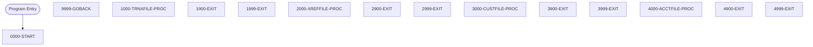

# Program: CBSTM03B


---

## Quick Reference

| Attribute | Value |
|-----------|-------|
| Program ID | `CBSTM03B` |
| Type | BATCH |
| Lines | 231 |
| Source | [CBSTM03B.CBL](../carddemo/CBSTM03B.CBL#L1) |
| Paragraphs | 14 |
| Statements | 34 |
| Impact Risk | **LOW** — 0 programs affected |

> **View Source:** [Open CBSTM03B.CBL](../carddemo/CBSTM03B.CBL#L1)


## Business Purpose

*Business purpose is not present in the extracted data. Run LLM enrichment to populate this section.*


## Dependency Context

> This section shows how **CBSTM03B** connects to the rest of the system — who calls it,
> what it calls, and what data it shares. If linked programs exist, they must appear here.

### Programs That Call CBSTM03B (Callers)

*No programs call CBSTM03B — this is likely a top-level entry point or CICS transaction starter.*

### Programs Called by CBSTM03B (Callees)

*CBSTM03B does not call any other programs (leaf program).*

### Shared Data (Copybooks & Files)

*No shared copybooks.*

#### Shared Files

| File | Type | Access | Also Used By |
|------|------|--------|-------------|
| `ACCT-FILE` | VSAM | RANDOM |  |
| `CUST-FILE` | VSAM | RANDOM |  |
| `TRNX-FILE` | VSAM | SEQUENTIAL |  |
| `XREF-FILE` | VSAM | SEQUENTIAL | CBACT04C, CBTRN01C, CBTRN02C, CBTRN03C |

## Legacy Data Contracts

> These tables are derived from FILE SECTION records and COPY-expanded data declarations. They preserve the legacy field names, COBOL storage type, inferred modern type, and status-code values needed for Java DTOs, SQL schemas, API contracts, and migration mapping.

### File Record Layouts

#### `TRNX-FILE` / `FD-TRNXFILE-REC`
| Legacy Field | Meaning | COBOL Type | Modern Type | Notes |
|--------------|---------|------------|-------------|-------|
| `FD-TRNXFILE-REC` | Fd Trnxfile Record | `GROUP` | `OBJECT` |  |
| `FD-TRNXS-ID` | Fd Trnxs ID | `GROUP` | `OBJECT` |  |
| `FD-TRNX-CARD` | Fd Trnx Card | `PIC X(16)` | `STRING(16)` |  |
| `FD-TRNX-ID` | Fd Trnx ID | `PIC X(16)` | `STRING(16)` |  |
| `FD-ACCT-DATA` | Fd Account Data | `PIC X(318)` | `STRING(318)` |  |

#### `XREF-FILE` / `FD-XREFFILE-REC`
| Legacy Field | Meaning | COBOL Type | Modern Type | Notes |
|--------------|---------|------------|-------------|-------|
| `FD-XREFFILE-REC` | Fd Xreffile Record | `GROUP` | `OBJECT` |  |
| `FD-XREF-CARD-NUM` | Fd Xref Card Number | `PIC X(16)` | `STRING(16)` |  |
| `FD-XREF-DATA` | Fd Xref Data | `PIC X(34)` | `STRING(34)` |  |

#### `CUST-FILE` / `FD-CUSTFILE-REC`
| Legacy Field | Meaning | COBOL Type | Modern Type | Notes |
|--------------|---------|------------|-------------|-------|
| `FD-CUSTFILE-REC` | Fd Custfile Record | `GROUP` | `OBJECT` |  |
| `FD-CUST-ID` | Fd Customer ID | `PIC X(09)` | `STRING(9)` |  |
| `FD-CUST-DATA` | Fd Customer Data | `PIC X(491)` | `STRING(491)` |  |

#### `ACCT-FILE` / `FD-ACCTFILE-REC`
| Legacy Field | Meaning | COBOL Type | Modern Type | Notes |
|--------------|---------|------------|-------------|-------|
| `FD-ACCTFILE-REC` | Fd Acctfile Record | `GROUP` | `OBJECT` |  |
| `FD-ACCT-ID` | Fd Account ID | `PIC 9(11)` | `BIGINT` |  |
| `FD-ACCT-DATA` | Fd Account Data | `PIC X(289)` | `STRING(289)` |  |


### Data Movement And Key Mapping

| Line | Source | Target | Meaning |
|------|--------|--------|---------|
| 152 | `TRNXFILE-STATUS` | `LK-M03B-RC` | TRNXFILE-STATUS populates LK-M03B-RC |
| 176 | `XREFFILE-STATUS` | `LK-M03B-RC` | XREFFILE-STATUS populates LK-M03B-RC |
| 189 | `LK-M03B-KEY (1:LK-M03B-KEY-LN)` | `FD-CUST-ID` | LK-M03B-KEY (1:LK-M03B-KEY-LN) populates FD-CUST-ID |
| 201 | `CUSTFILE-STATUS` | `LK-M03B-RC` | CUSTFILE-STATUS populates LK-M03B-RC |
| 214 | `LK-M03B-KEY (1:LK-M03B-KEY-LN)` | `FD-ACCT-ID` | LK-M03B-KEY (1:LK-M03B-KEY-LN) populates FD-ACCT-ID |
| 226 | `ACCTFILE-STATUS` | `LK-M03B-RC` | ACCTFILE-STATUS populates LK-M03B-RC |


---

## Dependency Graph


> **Legend:** 🔴 Target program · 🔵 Direct callers · 🟢 Direct callees · 🟡 Copybook-coupled · ⚫ Transitive (indirect)

---

## Impact Ripple View

> **If you change CBSTM03B, what else could break?**

| Impact Metric | Count |
|--------------|-------|
| Direct Callers | 0 |
| Transitive Callers (callers of callers) | 0 |
| Direct Callees | 0 |
| Transitive Callees | 0 |
| Copybook-Coupled Programs | 0 |
| **Total Impact** | **0** |
| **Risk Rating** | **LOW** |


---

## Statement Profile

| Statement Type | Count |
|---------------|-------|
| IF | 12 |
| READ | 4 |
| OPEN | 4 |
| MOVE | 4 |
| EXIT | 4 |
| CLOSE | 4 |
| GOBACK | 1 |
| EVALUATE | 1 |

## Control Flow



## Paragraphs

### 0000-START

| | |
|---|---|
| **Paragraph** | `0000-START` |
| **Lines** | 116 - 129 |
| **View Code** | [Jump to Line 116](../carddemo/CBSTM03B.CBL#L116) |


### 9999-GOBACK

| | |
|---|---|
| **Paragraph** | `9999-GOBACK` |
| **Lines** | 130 - 132 |
| **View Code** | [Jump to Line 130](../carddemo/CBSTM03B.CBL#L130) |


### 1000-TRNXFILE-PROC

| | |
|---|---|
| **Paragraph** | `1000-TRNXFILE-PROC` |
| **Lines** | 133 - 150 |
| **View Code** | [Jump to Line 133](../carddemo/CBSTM03B.CBL#L133) |


### 1900-EXIT

| | |
|---|---|
| **Paragraph** | `1900-EXIT` |
| **Lines** | 151 - 153 |
| **View Code** | [Jump to Line 151](../carddemo/CBSTM03B.CBL#L151) |


### 1999-EXIT

| | |
|---|---|
| **Paragraph** | `1999-EXIT` |
| **Lines** | 154 - 156 |
| **View Code** | [Jump to Line 154](../carddemo/CBSTM03B.CBL#L154) |


### 2000-XREFFILE-PROC

| | |
|---|---|
| **Paragraph** | `2000-XREFFILE-PROC` |
| **Lines** | 157 - 174 |
| **View Code** | [Jump to Line 157](../carddemo/CBSTM03B.CBL#L157) |


### 2900-EXIT

| | |
|---|---|
| **Paragraph** | `2900-EXIT` |
| **Lines** | 175 - 177 |
| **View Code** | [Jump to Line 175](../carddemo/CBSTM03B.CBL#L175) |


### 2999-EXIT

| | |
|---|---|
| **Paragraph** | `2999-EXIT` |
| **Lines** | 178 - 180 |
| **View Code** | [Jump to Line 178](../carddemo/CBSTM03B.CBL#L178) |


### 3000-CUSTFILE-PROC

| | |
|---|---|
| **Paragraph** | `3000-CUSTFILE-PROC` |
| **Lines** | 181 - 199 |
| **View Code** | [Jump to Line 181](../carddemo/CBSTM03B.CBL#L181) |


### 3900-EXIT

| | |
|---|---|
| **Paragraph** | `3900-EXIT` |
| **Lines** | 200 - 202 |
| **View Code** | [Jump to Line 200](../carddemo/CBSTM03B.CBL#L200) |


### 3999-EXIT

| | |
|---|---|
| **Paragraph** | `3999-EXIT` |
| **Lines** | 203 - 205 |
| **View Code** | [Jump to Line 203](../carddemo/CBSTM03B.CBL#L203) |


### 4000-ACCTFILE-PROC

| | |
|---|---|
| **Paragraph** | `4000-ACCTFILE-PROC` |
| **Lines** | 206 - 224 |
| **View Code** | [Jump to Line 206](../carddemo/CBSTM03B.CBL#L206) |


### 4900-EXIT

| | |
|---|---|
| **Paragraph** | `4900-EXIT` |
| **Lines** | 225 - 227 |
| **View Code** | [Jump to Line 225](../carddemo/CBSTM03B.CBL#L225) |


### 4999-EXIT

| | |
|---|---|
| **Paragraph** | `4999-EXIT` |
| **Lines** | 228 - 230 |
| **View Code** | [Jump to Line 228](../carddemo/CBSTM03B.CBL#L228) |


## File Record Layouts (FD)

This program declares the following file records (data contracts for I/O):

### `FD ACCT-FILE` (record `FD-ACCTFILE-REC`)

| Level | Field | PIC | USAGE | Parent |
|-------|-------|-----|-------|--------|
| `01` | `FD-ACCTFILE-REC` | `None` | None | None |
| `05` | `FD-ACCT-ID` | `9(11)` | None | FD-ACCTFILE-REC |
| `05` | `FD-ACCT-DATA` | `X(289)` | None | FD-ACCTFILE-REC |

### `FD CUST-FILE` (record `FD-CUSTFILE-REC`)

| Level | Field | PIC | USAGE | Parent |
|-------|-------|-----|-------|--------|
| `01` | `FD-CUSTFILE-REC` | `None` | None | None |
| `05` | `FD-CUST-ID` | `X(09)` | None | FD-CUSTFILE-REC |
| `05` | `FD-CUST-DATA` | `X(491)` | None | FD-CUSTFILE-REC |

### `FD TRNX-FILE` (record `FD-TRNXFILE-REC`)

| Level | Field | PIC | USAGE | Parent |
|-------|-------|-----|-------|--------|
| `01` | `FD-TRNXFILE-REC` | `None` | None | None |
| `05` | `FD-TRNXS-ID` | `None` | None | FD-TRNXFILE-REC |
| `10` | `FD-TRNX-CARD` | `X(16)` | None | FD-TRNXS-ID |
| `10` | `FD-TRNX-ID` | `X(16)` | None | FD-TRNXS-ID |
| `05` | `FD-ACCT-DATA` | `X(318)` | None | FD-TRNXFILE-REC |

### `FD XREF-FILE` (record `FD-XREFFILE-REC`)

| Level | Field | PIC | USAGE | Parent |
|-------|-------|-----|-------|--------|
| `01` | `FD-XREFFILE-REC` | `None` | None | None |
| `05` | `FD-XREF-CARD-NUM` | `X(16)` | None | FD-XREFFILE-REC |
| `05` | `FD-XREF-DATA` | `X(34)` | None | FD-XREFFILE-REC |


## Data Lineage (MOVE Flow)

The following MOVE statements were extracted from the source. Each row is a `source → destination`
flow that the migration team can use to trace how data is reshaped and routed.

| Source | Destination | Paragraph | Line |
|--------|-------------|-----------|------|
| `TRNXFILE-STATUS` | `LK-M03B-RC` | 1900-EXIT | 152 |
| `XREFFILE-STATUS` | `LK-M03B-RC` | 2900-EXIT | 176 |
| `CUSTFILE-STATUS` | `LK-M03B-RC` | 3900-EXIT | 201 |
| `ACCTFILE-STATUS` | `LK-M03B-RC` | 4900-EXIT | 226 |


## Known Issues & Code Anomalies

Static analysis flagged the following items in this program. Migration teams should
review each one before re-implementing in a modern stack.

| Severity | Category | Title | Paragraph | Line |
|----------|----------|-------|-----------|------|
| **NOTICE** | DEAD_CODE | Variable `FD-XREF-DATA` is declared but never referenced | None | 68 |
| **NOTICE** | DEAD_CODE | Variable `FD-CUST-DATA` is declared but never referenced | None | 73 |
| **NOTICE** | DEAD_CODE | Variable `TRNXFILE-STAT1` is declared but never referenced | None | 84 |
| **NOTICE** | DEAD_CODE | Variable `TRNXFILE-STAT2` is declared but never referenced | None | 85 |
| **NOTICE** | DEAD_CODE | Variable `XREFFILE-STAT1` is declared but never referenced | None | 88 |
| **NOTICE** | DEAD_CODE | Variable `XREFFILE-STAT2` is declared but never referenced | None | 89 |
| **NOTICE** | DEAD_CODE | Variable `CUSTFILE-STAT1` is declared but never referenced | None | 92 |
| **NOTICE** | DEAD_CODE | Variable `CUSTFILE-STAT2` is declared but never referenced | None | 93 |
| **NOTICE** | DEAD_CODE | Variable `ACCTFILE-STAT1` is declared but never referenced | None | 96 |
| **NOTICE** | DEAD_CODE | Variable `ACCTFILE-STAT2` is declared but never referenced | None | 97 |

### NOTICE — Variable `FD-XREF-DATA` is declared but never referenced

`FD-XREF-DATA` is declared at line 68 but no other statement reads or writes it. Likely a leftover from prior refactoring or an incomplete feature.
**Source excerpt** (line 68):
```cobol
05 FD-XREF-DATA                      PIC X(34).
```

**Recommendation:** Remove the declaration or wire it into the logic that was originally intended.
---
### NOTICE — Variable `FD-CUST-DATA` is declared but never referenced

`FD-CUST-DATA` is declared at line 73 but no other statement reads or writes it. Likely a leftover from prior refactoring or an incomplete feature.
**Source excerpt** (line 73):
```cobol
05 FD-CUST-DATA                      PIC X(491).
```

**Recommendation:** Remove the declaration or wire it into the logic that was originally intended.
---
### NOTICE — Variable `TRNXFILE-STAT1` is declared but never referenced

`TRNXFILE-STAT1` is declared at line 84 but no other statement reads or writes it. Likely a leftover from prior refactoring or an incomplete feature.
**Source excerpt** (line 84):
```cobol
05  TRNXFILE-STAT1      PIC X.
```

**Recommendation:** Remove the declaration or wire it into the logic that was originally intended.
---
### NOTICE — Variable `TRNXFILE-STAT2` is declared but never referenced

`TRNXFILE-STAT2` is declared at line 85 but no other statement reads or writes it. Likely a leftover from prior refactoring or an incomplete feature.
**Source excerpt** (line 85):
```cobol
05  TRNXFILE-STAT2      PIC X.
```

**Recommendation:** Remove the declaration or wire it into the logic that was originally intended.
---
### NOTICE — Variable `XREFFILE-STAT1` is declared but never referenced

`XREFFILE-STAT1` is declared at line 88 but no other statement reads or writes it. Likely a leftover from prior refactoring or an incomplete feature.
**Source excerpt** (line 88):
```cobol
05  XREFFILE-STAT1      PIC X.
```

**Recommendation:** Remove the declaration or wire it into the logic that was originally intended.
---
### NOTICE — Variable `XREFFILE-STAT2` is declared but never referenced

`XREFFILE-STAT2` is declared at line 89 but no other statement reads or writes it. Likely a leftover from prior refactoring or an incomplete feature.
**Source excerpt** (line 89):
```cobol
05  XREFFILE-STAT2      PIC X.
```

**Recommendation:** Remove the declaration or wire it into the logic that was originally intended.
---
### NOTICE — Variable `CUSTFILE-STAT1` is declared but never referenced

`CUSTFILE-STAT1` is declared at line 92 but no other statement reads or writes it. Likely a leftover from prior refactoring or an incomplete feature.
**Source excerpt** (line 92):
```cobol
05  CUSTFILE-STAT1      PIC X.
```

**Recommendation:** Remove the declaration or wire it into the logic that was originally intended.
---
### NOTICE — Variable `CUSTFILE-STAT2` is declared but never referenced

`CUSTFILE-STAT2` is declared at line 93 but no other statement reads or writes it. Likely a leftover from prior refactoring or an incomplete feature.
**Source excerpt** (line 93):
```cobol
05  CUSTFILE-STAT2      PIC X.
```

**Recommendation:** Remove the declaration or wire it into the logic that was originally intended.
---
### NOTICE — Variable `ACCTFILE-STAT1` is declared but never referenced

`ACCTFILE-STAT1` is declared at line 96 but no other statement reads or writes it. Likely a leftover from prior refactoring or an incomplete feature.
**Source excerpt** (line 96):
```cobol
05  ACCTFILE-STAT1      PIC X.
```

**Recommendation:** Remove the declaration or wire it into the logic that was originally intended.
---
### NOTICE — Variable `ACCTFILE-STAT2` is declared but never referenced

`ACCTFILE-STAT2` is declared at line 97 but no other statement reads or writes it. Likely a leftover from prior refactoring or an incomplete feature.
**Source excerpt** (line 97):
```cobol
05  ACCTFILE-STAT2      PIC X.
```

**Recommendation:** Remove the declaration or wire it into the logic that was originally intended.
---

## External Runtime Parameters

This program receives the following parameters at runtime (via `PROCEDURE DIVISION USING`
or `ENTRY USING`). Each parameter must be supplied by the caller — typically a JCL job
step (`PARM=`), CICS COMMAREA, or the IMS region controller. The migration target needs
an equivalent input wiring.

| # | Parameter | Source | Declared at line |
|---|-----------|--------|------------------|
| 0 | `LK-M03B-AREA` | PROCEDURE DIVISION USING | 114 |

## File OPEN / CLOSE Operations

The exact OPEN mode (INPUT / OUTPUT / I-O / EXTEND) determines whether a file can be
read, written, or both — and whether REWRITE / DELETE are legal. This table is the
source of truth for migrators converting to modern storage layers.

| File | Operation | Mode | Paragraph | Line |
|------|-----------|------|-----------|------|
| `VALUE` | CLOSE | None | None | 104 |
| `TRNX-FILE` | OPEN | INPUT | 1000-TRNXFILE-PROC | 136 |
| `TRNX-FILE` | CLOSE | None | 1000-TRNXFILE-PROC | 147 |
| `XREF-FILE` | OPEN | INPUT | 2000-XREFFILE-PROC | 160 |
| `XREF-FILE` | CLOSE | None | 2000-XREFFILE-PROC | 171 |
| `CUST-FILE` | OPEN | INPUT | 3000-CUSTFILE-PROC | 184 |
| `CUST-FILE` | CLOSE | None | 3000-CUSTFILE-PROC | 196 |
| `ACCT-FILE` | OPEN | INPUT | 4000-ACCTFILE-PROC | 209 |
| `ACCT-FILE` | CLOSE | None | 4000-ACCTFILE-PROC | 221 |


## Modernization Review Findings

These are source-derived review notes that should be checked before translating this program into Java, Spring Boot, SQL, APIs, or batch jobs.

| Finding | Why It Matters |
|---------|----------------|
| Nested IF blocks need compiler-accurate validation | Nested conditional logic was detected. During migration, validate scope with the original compiler rules and explicit `END-IF`/period termination before translating to Java or SQL. |


## Business Rules

- **Transaction File Open Check** `BR-175`  
  The system verifies if the transaction file can be opened based on the input parameter.  
  [View Rule Details](../business-rules/BR-175.md)
- **Cross-Reference File Open Check** `BR-176`  
  The system verifies if the cross-reference file can be opened based on the input parameter.  
  [View Rule Details](../business-rules/BR-176.md)
- **Customer File Open Check** `BR-177`  
  The system verifies if the customer file can be opened based on the input parameter.  
  [View Rule Details](../business-rules/BR-177.md)
- **Account File Open Check** `BR-178`  
  The system verifies if the account file can be opened based on the input parameter.  
  [View Rule Details](../business-rules/BR-178.md)
- **Transaction File Close Check** `BR-179`  
  The system verifies if the transaction file can be closed based on the input parameter.  
  [View Rule Details](../business-rules/BR-179.md)
- **Cross-Reference File Close Check** `BR-180`  
  The system verifies if the cross-reference file can be closed based on the input parameter.  
  [View Rule Details](../business-rules/BR-180.md)
- **Customer File Close Check** `BR-181`  
  The system verifies if the customer file can be closed based on the input parameter.  
  [View Rule Details](../business-rules/BR-181.md)
- **Account File Close Check** `BR-182`  
  The system verifies if the account file can be closed based on the input parameter.  
  [View Rule Details](../business-rules/BR-182.md)
- **Transaction File Read Check** `BR-183`  
  The system verifies if the transaction file can be read based on the input parameter.  
  [View Rule Details](../business-rules/BR-183.md)
- **Cross-Reference File Read Check** `BR-184`  
  The system verifies if the cross-reference file can be read based on the input parameter.  
  [View Rule Details](../business-rules/BR-184.md)
- **Customer File Read Check** `BR-185`  
  The system verifies if the customer file can be read based on the input parameter.  
  [View Rule Details](../business-rules/BR-185.md)
- **Account File Read Check** `BR-186`  
  The system verifies if the account file can be read based on the input parameter.  
  [View Rule Details](../business-rules/BR-186.md)
- **Transaction File Read-Key Check** `BR-187`  
  The system verifies if the transaction file can be read by key based on the input parameter.  
  [View Rule Details](../business-rules/BR-187.md)
- **Cross-Reference File Read-Key Check** `BR-188`  
  The system verifies if the cross-reference file can be read by key based on the input parameter.  
  [View Rule Details](../business-rules/BR-188.md)
- **Customer File Read-Key Check** `BR-189`  
  The system verifies if the customer file can be read by key based on the input parameter.  
  [View Rule Details](../business-rules/BR-189.md)
- **Account File Read-Key Check** `BR-190`  
  The system verifies if the account file can be read by key based on the input parameter.  
  [View Rule Details](../business-rules/BR-190.md)
- **Transaction File Write Check** `BR-191`  
  The system verifies if the transaction file can be written to based on the input parameter.  
  [View Rule Details](../business-rules/BR-191.md)
- **Cross-Reference File Write Check** `BR-192`  
  The system verifies if the cross-reference file can be written to based on the input parameter.  
  [View Rule Details](../business-rules/BR-192.md)
- **Customer File Write Check** `BR-193`  
  The system verifies if the customer file can be written to based on the input parameter.  
  [View Rule Details](../business-rules/BR-193.md)
- **Account File Write Check** `BR-194`  
  The system verifies if the account file can be written to based on the input parameter.  
  [View Rule Details](../business-rules/BR-194.md)
- **Transaction File Open Status Check** `BR-195`  
  The system verifies if the transaction file can be opened successfully.  
  [View Rule Details](../business-rules/BR-195.md)
- **Transaction File Read Status Check** `BR-196`  
  The system verifies if records can be read from the transaction file.  
  [View Rule Details](../business-rules/BR-196.md)
- **Transaction File Write Status Check** `BR-197`  
  The system verifies if records can be written to the transaction file.  
  [View Rule Details](../business-rules/BR-197.md)
- **Cross-Reference File Open Status Check** `BR-198`  
  The system verifies if the cross-reference file can be opened successfully.  
  [View Rule Details](../business-rules/BR-198.md)
- **Cross-Reference File Read Status Check** `BR-199`  
  The system verifies if records can be read from the cross-reference file.  
  [View Rule Details](../business-rules/BR-199.md)
- **Cross-Reference File Close Status Check** `BR-200`  
  The system verifies if the cross-reference file can be closed successfully.  
  [View Rule Details](../business-rules/BR-200.md)
- **Customer File Read Status Check** `BR-201`  
  If the attempt to read the customer file fails, the customer file status is set to indicate a read error.  
  [View Rule Details](../business-rules/BR-201.md)
- **Customer File Write Status Check** `BR-202`  
  If the attempt to write to the customer file fails, the customer file status is set to indicate a write error.  
  [View Rule Details](../business-rules/BR-202.md)
- **Account File Open Status Check** `BR-203`  
  The system verifies if the account file can be opened successfully.  
  [View Rule Details](../business-rules/BR-203.md)
- **Account File Read Status Check** `BR-204`  
  The system verifies if records can be read from the account file.  
  [View Rule Details](../business-rules/BR-204.md)
- **Account File Read-by-Key Status Check** `BR-205`  
  The system verifies if records can be read from the account file using a key.  
  [View Rule Details](../business-rules/BR-205.md)

## Key Data Items

| Name | Level | Picture | Section | Business Name |
|------|-------|---------|---------|---------------|
| `TRNXFILE-STATUS` | 1 | `None` | WORKING-STORAGE | None |
| `TRNXFILE-STAT1` | 5 | `X` | WORKING-STORAGE | None |
| `TRNXFILE-STAT2` | 5 | `X` | WORKING-STORAGE | None |
| `XREFFILE-STATUS` | 1 | `None` | WORKING-STORAGE | None |
| `XREFFILE-STAT1` | 5 | `X` | WORKING-STORAGE | None |
| `XREFFILE-STAT2` | 5 | `X` | WORKING-STORAGE | None |
| `CUSTFILE-STATUS` | 1 | `None` | WORKING-STORAGE | None |
| `CUSTFILE-STAT1` | 5 | `X` | WORKING-STORAGE | None |
| `CUSTFILE-STAT2` | 5 | `X` | WORKING-STORAGE | None |
| `ACCTFILE-STATUS` | 1 | `None` | WORKING-STORAGE | None |
| `ACCTFILE-STAT1` | 5 | `X` | WORKING-STORAGE | None |
| `ACCTFILE-STAT2` | 5 | `X` | WORKING-STORAGE | None |
| `LK-M03B-AREA` | 1 | `None` | LINKAGE | None |
| `LK-M03B-DD` | 5 | `X(08)` | LINKAGE | None |
| `LK-M03B-OPER` | 5 | `X(01)` | LINKAGE | None |
| `M03B-OPEN` | 88 | `None` | LINKAGE | None |
| `M03B-CLOSE` | 88 | `None` | LINKAGE | None |
| `M03B-READ` | 88 | `None` | LINKAGE | None |
| `M03B-READ-K` | 88 | `None` | LINKAGE | None |
| `M03B-WRITE` | 88 | `None` | LINKAGE | None |
| `M03B-REWRITE` | 88 | `None` | LINKAGE | None |
| `LK-M03B-RC` | 5 | `X(02)` | LINKAGE | None |
| `LK-M03B-KEY` | 5 | `X(25)` | LINKAGE | None |
| `LK-M03B-KEY-LN` | 5 | `S9(4)` | LINKAGE | None |
| `LK-M03B-FLDT` | 5 | `X(1000)` | LINKAGE | None |

---

*Generated 2026-05-02 17:07*