# Program: CBTRN01C


---

## Quick Reference

| Attribute | Value |
|-----------|-------|
| Program ID | `CBTRN01C` |
| Type | BATCH |
| Lines | 495 |
| Source | [CBTRN01C.cbl](../carddemo/CBTRN01C.cbl#L1) |
| Paragraphs | 18 |
| Statements | 132 |
| Impact Risk | **HIGH** — 24 programs affected |

> **View Source:** [Open CBTRN01C.cbl](../carddemo/CBTRN01C.cbl#L1)

## Source Grounding Facts

| Data Item | Literal Value |
|-----------|---------------|
| `END-OF-DAILY-TRANS-FILE` | `N` |

Status conditions found in source:
- `WS-XREF-READ-STATUS = 0`
- `WS-ACCT-READ-STATUS NOT = 0`
- `DALYTRAN-STATUS = '00'`
- `DALYTRAN-STATUS = '10'`
- `CUSTFILE-STATUS = '00'`
- `XREFFILE-STATUS = '00'`
- `CARDFILE-STATUS = '00'`
- `ACCTFILE-STATUS = '00'`
- `TRANFILE-STATUS = '00'`


## Business Purpose

*Business purpose is not present in the extracted data. Run LLM enrichment to populate this section.*


## Dependency Context

> This section shows how **CBTRN01C** connects to the rest of the system — who calls it,
> what it calls, and what data it shares. If linked programs exist, they must appear here.

### Programs That Call CBTRN01C (Callers)

*No programs call CBTRN01C — this is likely a top-level entry point or CICS transaction starter.*

### Programs Called by CBTRN01C (Callees)

| Called Program | Type | Line | Why |
|----------------|------|------|-----|
| `UNKNOWN` | None | 586 |  |

### Shared Data (Copybooks & Files)

#### Shared Copybooks

| Copybook | Also Used By | # Co-Users |
|----------|-------------|------------|
| `CVACT01Y` | CBACT01C, CBACT04C, CBEXPORT, CBIMPORT, CBSTM03A (+8 more) | 13 |
| `CVACT02Y` | CBACT02C, CBEXPORT, CBIMPORT, COACTVWC, COCRDLIC (+4 more) | 9 |
| `CVACT03Y` | CBACT03C, CBACT04C, CBEXPORT, CBIMPORT, CBSTM03A (+8 more) | 13 |
| `CVCUS01Y` | CBCUS01C, CBEXPORT, CBIMPORT, COACTUPC, COACTVWC (+4 more) | 9 |
| `CVTRA05Y` | CBACT04C, CBEXPORT, CBIMPORT, CBTRN02C, CBTRN03C (+5 more) | 10 |
| `CVTRA06Y` | CBTRN02C | 1 |

#### Shared Files

| File | Type | Access | Also Used By |
|------|------|--------|-------------|
| `ACCOUNT-FILE` | VSAM | RANDOM | CBACT04C, CBTRN02C |
| `CARD-FILE` | VSAM | RANDOM |  |
| `CUSTOMER-FILE` | VSAM | RANDOM |  |
| `DALYTRAN-FILE` | SEQUENTIAL | SEQUENTIAL | CBTRN02C |
| `TRANSACT-FILE` | VSAM | RANDOM | CBACT04C, CBTRN02C, CBTRN03C |
| `XREF-FILE` | VSAM | RANDOM | CBACT04C, CBSTM03B, CBTRN02C, CBTRN03C |

## Legacy Data Contracts

> These tables are derived from FILE SECTION records and COPY-expanded data declarations. They preserve the legacy field names, COBOL storage type, inferred modern type, and status-code values needed for Java DTOs, SQL schemas, API contracts, and migration mapping.

### File Record Layouts

#### `DALYTRAN-FILE` / `FD-TRAN-RECORD`
| Legacy Field | Meaning | COBOL Type | Modern Type | Notes |
|--------------|---------|------------|-------------|-------|
| `FD-TRAN-RECORD` | Fd Tran Record | `GROUP` | `OBJECT` |  |
| `FD-TRAN-ID` | Fd Tran ID | `PIC X(16)` | `STRING(16)` |  |
| `FD-CUST-DATA` | Fd Customer Data | `PIC X(334)` | `STRING(334)` |  |

#### `CUSTOMER-FILE` / `FD-CUSTFILE-REC`
| Legacy Field | Meaning | COBOL Type | Modern Type | Notes |
|--------------|---------|------------|-------------|-------|
| `FD-CUSTFILE-REC` | Fd Custfile Record | `GROUP` | `OBJECT` |  |
| `FD-CUST-ID` | Fd Customer ID | `PIC 9(09)` | `INTEGER` |  |
| `FD-CUST-DATA` | Fd Customer Data | `PIC X(491)` | `STRING(491)` |  |

#### `XREF-FILE` / `FD-XREFFILE-REC`
| Legacy Field | Meaning | COBOL Type | Modern Type | Notes |
|--------------|---------|------------|-------------|-------|
| `FD-XREFFILE-REC` | Fd Xreffile Record | `GROUP` | `OBJECT` |  |
| `FD-XREF-CARD-NUM` | Fd Xref Card Number | `PIC X(16)` | `STRING(16)` |  |
| `FD-XREF-DATA` | Fd Xref Data | `PIC X(34)` | `STRING(34)` |  |

#### `CARD-FILE` / `FD-CARDFILE-REC`
| Legacy Field | Meaning | COBOL Type | Modern Type | Notes |
|--------------|---------|------------|-------------|-------|
| `FD-CARDFILE-REC` | Fd Cardfile Record | `GROUP` | `OBJECT` |  |
| `FD-CARD-NUM` | Fd Card Number | `PIC X(16)` | `STRING(16)` |  |
| `FD-CARD-DATA` | Fd Card Data | `PIC X(134)` | `STRING(134)` |  |

#### `ACCOUNT-FILE` / `FD-ACCTFILE-REC`
| Legacy Field | Meaning | COBOL Type | Modern Type | Notes |
|--------------|---------|------------|-------------|-------|
| `FD-ACCTFILE-REC` | Fd Acctfile Record | `GROUP` | `OBJECT` |  |
| `FD-ACCT-ID` | Fd Account ID | `PIC 9(11)` | `BIGINT` |  |
| `FD-ACCT-DATA` | Fd Account Data | `PIC X(289)` | `STRING(289)` |  |

#### `TRANSACT-FILE` / `FD-TRANFILE-REC`
| Legacy Field | Meaning | COBOL Type | Modern Type | Notes |
|--------------|---------|------------|-------------|-------|
| `FD-TRANFILE-REC` | Fd Tranfile Record | `GROUP` | `OBJECT` |  |
| `FD-TRANS-ID` | Fd Trans ID | `PIC X(16)` | `STRING(16)` |  |
| `FD-ACCT-DATA` | Fd Account Data | `PIC X(334)` | `STRING(334)` |  |


### Copybook Segment Layouts

#### `CVACT01Y` as `ACCOUNT-RECORD`

| Legacy Field | Meaning | COBOL Type | Modern Type | Status / Format Notes |
|--------------|---------|------------|-------------|-----------------------|
| `ACCOUNT-RECORD` | Account Record | `GROUP` | `OBJECT` |  |
| `ACCT-ID` | Account ID | `PIC 9(11)` | `BIGINT` |  |
| `ACCT-ACTIVE-STATUS` | Account Active Status | `PIC X(01)` | `STRING(1)` |  |
| `ACCT-CURR-BAL` | Account Curr Bal | `PIC S9(10)V99` | `DECIMAL(12,2)` |  |
| `ACCT-CREDIT-LIMIT` | Account Credit Limit | `PIC S9(10)V99` | `DECIMAL(12,2)` |  |
| `ACCT-CASH-CREDIT-LIMIT` | Account Cash Credit Limit | `PIC S9(10)V99` | `DECIMAL(12,2)` |  |
| `ACCT-OPEN-DATE` | Account Open Date | `PIC X(10)` | `STRING(10)` | Date-like field; verify YYDDD, YYMMDD, or ISO format before migration. |
| `ACCT-EXPIRAION-DATE` | Account Expiraion Date | `PIC X(10)` | `STRING(10)` | Date-like field; verify YYDDD, YYMMDD, or ISO format before migration. |
| `ACCT-REISSUE-DATE` | Account Reissue Date | `PIC X(10)` | `STRING(10)` | Date-like field; verify YYDDD, YYMMDD, or ISO format before migration. |
| `ACCT-CURR-CYC-CREDIT` | Account Curr Cyc Credit | `PIC S9(10)V99` | `DECIMAL(12,2)` |  |
| `ACCT-CURR-CYC-DEBIT` | Account Curr Cyc Debit | `PIC S9(10)V99` | `DECIMAL(12,2)` |  |
| `ACCT-ADDR-ZIP` | Account Addr Zip | `PIC X(10)` | `STRING(10)` |  |
| `ACCT-GROUP-ID` | Account Group ID | `PIC X(10)` | `STRING(10)` |  |
| `FILLER` | Filler | `PIC X(178)` | `STRING(178)` |  |

#### `CVACT02Y` as `CARD-RECORD`

| Legacy Field | Meaning | COBOL Type | Modern Type | Status / Format Notes |
|--------------|---------|------------|-------------|-----------------------|
| `CARD-RECORD` | Card Record | `GROUP` | `OBJECT` |  |
| `CARD-NUM` | Card Number | `PIC X(16)` | `STRING(16)` |  |
| `CARD-ACCT-ID` | Card Account ID | `PIC 9(11)` | `BIGINT` |  |
| `CARD-CVV-CD` | Card Cvv Cd | `PIC 9(03)` | `INTEGER` |  |
| `CARD-EMBOSSED-NAME` | Card Embossed Name | `PIC X(50)` | `STRING(50)` |  |
| `CARD-EXPIRAION-DATE` | Card Expiraion Date | `PIC X(10)` | `STRING(10)` | Date-like field; verify YYDDD, YYMMDD, or ISO format before migration. |
| `CARD-ACTIVE-STATUS` | Card Active Status | `PIC X(01)` | `STRING(1)` |  |
| `FILLER` | Filler | `PIC X(59)` | `STRING(59)` |  |

#### `CVACT03Y` as `CARD-XREF-RECORD`

| Legacy Field | Meaning | COBOL Type | Modern Type | Status / Format Notes |
|--------------|---------|------------|-------------|-----------------------|
| `CARD-XREF-RECORD` | Card Xref Record | `GROUP` | `OBJECT` |  |
| `XREF-CARD-NUM` | Xref Card Number | `PIC X(16)` | `STRING(16)` |  |
| `XREF-CUST-ID` | Xref Customer ID | `PIC 9(09)` | `INTEGER` |  |
| `XREF-ACCT-ID` | Xref Account ID | `PIC 9(11)` | `BIGINT` |  |
| `FILLER` | Filler | `PIC X(14)` | `STRING(14)` |  |

#### `CVCUS01Y` as `CUSTOMER-RECORD`

| Legacy Field | Meaning | COBOL Type | Modern Type | Status / Format Notes |
|--------------|---------|------------|-------------|-----------------------|
| `CUSTOMER-RECORD` | Customer Record | `GROUP` | `OBJECT` |  |
| `CUST-ID` | Customer ID | `PIC 9(09)` | `INTEGER` |  |
| `CUST-FIRST-NAME` | Customer First Name | `PIC X(25)` | `STRING(25)` |  |
| `CUST-MIDDLE-NAME` | Customer Middle Name | `PIC X(25)` | `STRING(25)` |  |
| `CUST-LAST-NAME` | Customer Last Name | `PIC X(25)` | `STRING(25)` |  |
| `CUST-ADDR-LINE-1` | Customer Addr Line 1 | `PIC X(50)` | `STRING(50)` |  |
| `CUST-ADDR-LINE-2` | Customer Addr Line 2 | `PIC X(50)` | `STRING(50)` |  |
| `CUST-ADDR-LINE-3` | Customer Addr Line 3 | `PIC X(50)` | `STRING(50)` |  |
| `CUST-ADDR-STATE-CD` | Customer Addr State Cd | `PIC X(02)` | `STRING(2)` |  |
| `CUST-ADDR-COUNTRY-CD` | Customer Addr Country Cd | `PIC X(03)` | `STRING(3)` |  |
| `CUST-ADDR-ZIP` | Customer Addr Zip | `PIC X(10)` | `STRING(10)` |  |
| `CUST-PHONE-NUM-1` | Customer Phone Number 1 | `PIC X(15)` | `STRING(15)` |  |
| `CUST-PHONE-NUM-2` | Customer Phone Number 2 | `PIC X(15)` | `STRING(15)` |  |
| `CUST-SSN` | Customer Ssn | `PIC 9(09)` | `INTEGER` |  |
| `CUST-GOVT-ISSUED-ID` | Customer Govt Issued ID | `PIC X(20)` | `STRING(20)` |  |
| `CUST-DOB-YYYY-MM-DD` | Customer Dob Yyyy Mm Dd | `PIC X(10)` | `STRING(10)` |  |
| `CUST-EFT-ACCOUNT-ID` | Customer Eft Account ID | `PIC X(10)` | `STRING(10)` |  |
| `CUST-PRI-CARD-HOLDER-IND` | Customer Pri Card Holder Ind | `PIC X(01)` | `STRING(1)` |  |
| `CUST-FICO-CREDIT-SCORE` | Customer Fico Credit Score | `PIC 9(03)` | `INTEGER` |  |
| `FILLER` | Filler | `PIC X(168)` | `STRING(168)` |  |

#### `CVTRA05Y` as `TRAN-RECORD`

| Legacy Field | Meaning | COBOL Type | Modern Type | Status / Format Notes |
|--------------|---------|------------|-------------|-----------------------|
| `TRAN-RECORD` | Tran Record | `GROUP` | `OBJECT` |  |
| `TRAN-ID` | Tran ID | `PIC X(16)` | `STRING(16)` |  |
| `TRAN-TYPE-CD` | Tran Type Cd | `PIC X(02)` | `STRING(2)` |  |
| `TRAN-CAT-CD` | Tran Cat Cd | `PIC 9(04)` | `INTEGER` |  |
| `TRAN-SOURCE` | Tran Source | `PIC X(10)` | `STRING(10)` |  |
| `TRAN-DESC` | Tran Desc | `PIC X(100)` | `STRING(100)` |  |
| `TRAN-AMT` | Tran Amount | `PIC S9(09)V99` | `DECIMAL(11,2)` |  |
| `TRAN-MERCHANT-ID` | Tran Merchant ID | `PIC 9(09)` | `INTEGER` |  |
| `TRAN-MERCHANT-NAME` | Tran Merchant Name | `PIC X(50)` | `STRING(50)` |  |
| `TRAN-MERCHANT-CITY` | Tran Merchant City | `PIC X(50)` | `STRING(50)` |  |
| `TRAN-MERCHANT-ZIP` | Tran Merchant Zip | `PIC X(10)` | `STRING(10)` |  |
| `TRAN-CARD-NUM` | Tran Card Number | `PIC X(16)` | `STRING(16)` |  |
| `TRAN-ORIG-TS` | Tran Orig Ts | `PIC X(26)` | `STRING(26)` |  |
| `TRAN-PROC-TS` | Tran Proc Ts | `PIC X(26)` | `STRING(26)` |  |
| `FILLER` | Filler | `PIC X(20)` | `STRING(20)` |  |

#### `CVTRA06Y` as `DALYTRAN-RECORD`

| Legacy Field | Meaning | COBOL Type | Modern Type | Status / Format Notes |
|--------------|---------|------------|-------------|-----------------------|
| `DALYTRAN-RECORD` | Dalytran Record | `GROUP` | `OBJECT` |  |
| `DALYTRAN-ID` | Dalytran ID | `PIC X(16)` | `STRING(16)` |  |
| `DALYTRAN-TYPE-CD` | Dalytran Type Cd | `PIC X(02)` | `STRING(2)` |  |
| `DALYTRAN-CAT-CD` | Dalytran Cat Cd | `PIC 9(04)` | `INTEGER` |  |
| `DALYTRAN-SOURCE` | Dalytran Source | `PIC X(10)` | `STRING(10)` |  |
| `DALYTRAN-DESC` | Dalytran Desc | `PIC X(100)` | `STRING(100)` |  |
| `DALYTRAN-AMT` | Dalytran Amount | `PIC S9(09)V99` | `DECIMAL(11,2)` |  |
| `DALYTRAN-MERCHANT-ID` | Dalytran Merchant ID | `PIC 9(09)` | `INTEGER` |  |
| `DALYTRAN-MERCHANT-NAME` | Dalytran Merchant Name | `PIC X(50)` | `STRING(50)` |  |
| `DALYTRAN-MERCHANT-CITY` | Dalytran Merchant City | `PIC X(50)` | `STRING(50)` |  |
| `DALYTRAN-MERCHANT-ZIP` | Dalytran Merchant Zip | `PIC X(10)` | `STRING(10)` |  |
| `DALYTRAN-CARD-NUM` | Dalytran Card Number | `PIC X(16)` | `STRING(16)` |  |
| `DALYTRAN-ORIG-TS` | Dalytran Orig Ts | `PIC X(26)` | `STRING(26)` |  |
| `DALYTRAN-PROC-TS` | Dalytran Proc Ts | `PIC X(26)` | `STRING(26)` |  |
| `FILLER` | Filler | `PIC X(20)` | `STRING(20)` |  |


### Data Movement And Key Mapping

| Line | Source | Target | Meaning |
|------|--------|--------|---------|
| 170 | `0` | `WS-XREF-READ-STATUS` | 0 populates WS-XREF-READ-STATUS |
| 174 | `0` | `WS-ACCT-READ-STATUS` | 0 populates WS-ACCT-READ-STATUS |
| 175 | `XREF-ACCT-ID` | `ACCT-ID` | XREF-ACCT-ID populates ACCT-ID |
| 217 | `'Y'` | `END-OF-DAILY-TRANS-FILE` | 'Y' populates END-OF-DAILY-TRANS-FILE |
| 220 | `DALYTRAN-STATUS` | `IO-STATUS` | DALYTRAN-STATUS populates IO-STATUS |
| 233 | `4` | `WS-XREF-READ-STATUS` | 4 populates WS-XREF-READ-STATUS |
| 242 | `ACCT-ID` | `FD-ACCT-ID` | ACCT-ID populates FD-ACCT-ID |
| 247 | `4` | `WS-ACCT-READ-STATUS` | 4 populates WS-ACCT-READ-STATUS |
| 264 | `DALYTRAN-STATUS` | `IO-STATUS` | DALYTRAN-STATUS populates IO-STATUS |
| 283 | `CUSTFILE-STATUS` | `IO-STATUS` | CUSTFILE-STATUS populates IO-STATUS |
| 301 | `XREFFILE-STATUS` | `IO-STATUS` | XREFFILE-STATUS populates IO-STATUS |
| 319 | `CARDFILE-STATUS` | `IO-STATUS` | CARDFILE-STATUS populates IO-STATUS |
| 337 | `ACCTFILE-STATUS` | `IO-STATUS` | ACCTFILE-STATUS populates IO-STATUS |
| 355 | `TRANFILE-STATUS` | `IO-STATUS` | TRANFILE-STATUS populates IO-STATUS |
| 373 | `CUSTFILE-STATUS` | `IO-STATUS` | CUSTFILE-STATUS populates IO-STATUS |
| 391 | `CUSTFILE-STATUS` | `IO-STATUS` | CUSTFILE-STATUS populates IO-STATUS |
| 409 | `XREFFILE-STATUS` | `IO-STATUS` | XREFFILE-STATUS populates IO-STATUS |
| 427 | `CARDFILE-STATUS` | `IO-STATUS` | CARDFILE-STATUS populates IO-STATUS |
| 445 | `ACCTFILE-STATUS` | `IO-STATUS` | ACCTFILE-STATUS populates IO-STATUS |
| 463 | `TRANFILE-STATUS` | `IO-STATUS` | TRANFILE-STATUS populates IO-STATUS |
| 479 | `IO-STAT1` | `IO-STATUS-04(1:1)` | IO-STAT1 populates IO-STATUS-04(1:1) |
| 482 | `TWO-BYTES-BINARY` | `IO-STATUS-0403` | TWO-BYTES-BINARY populates IO-STATUS-0403 |
| 485 | `'0000'` | `IO-STATUS-04` | '0000' populates IO-STATUS-04 |
| 486 | `IO-STATUS` | `IO-STATUS-04(3:2)` | IO-STATUS populates IO-STATUS-04(3:2) |


---

## Dependency Graph

```mermaid
flowchart TD
    CBTRN01C["⬤ CBTRN01C"]:::target
    UNKNOWN["UNKNOWN"]:::callee
    CBTRN01C --> UNKNOWN
    CB_CVACT01Y{{"CVACT01Y"}}:::copybook
    CBTRN01C -.- CB_CVACT01Y
    CBACT01C["CBACT01C"]:::coupled
    CB_CVACT01Y -.- CBACT01C
    CBACT04C["CBACT04C"]:::coupled
    CB_CVACT01Y -.- CBACT04C
    CBEXPORT["CBEXPORT"]:::coupled
    CB_CVACT01Y -.- CBEXPORT
    CB_CVACT02Y{{"CVACT02Y"}}:::copybook
    CBTRN01C -.- CB_CVACT02Y
    CBACT02C["CBACT02C"]:::coupled
    CB_CVACT02Y -.- CBACT02C
    CBEXPORT["CBEXPORT"]:::coupled
    CB_CVACT02Y -.- CBEXPORT
    CBIMPORT["CBIMPORT"]:::coupled
    CB_CVACT02Y -.- CBIMPORT
    CB_CVACT03Y{{"CVACT03Y"}}:::copybook
    CBTRN01C -.- CB_CVACT03Y
    CBACT03C["CBACT03C"]:::coupled
    CB_CVACT03Y -.- CBACT03C
    CBACT04C["CBACT04C"]:::coupled
    CB_CVACT03Y -.- CBACT04C
    CBEXPORT["CBEXPORT"]:::coupled
    CB_CVACT03Y -.- CBEXPORT
    CB_CVCUS01Y{{"CVCUS01Y"}}:::copybook
    CBTRN01C -.- CB_CVCUS01Y
    CBCUS01C["CBCUS01C"]:::coupled
    CB_CVCUS01Y -.- CBCUS01C
    CBEXPORT["CBEXPORT"]:::coupled
    CB_CVCUS01Y -.- CBEXPORT
    CBIMPORT["CBIMPORT"]:::coupled
    CB_CVCUS01Y -.- CBIMPORT
    CB_CVTRA05Y{{"CVTRA05Y"}}:::copybook
    CBTRN01C -.- CB_CVTRA05Y
    CBACT04C["CBACT04C"]:::coupled
    CB_CVTRA05Y -.- CBACT04C
    CBEXPORT["CBEXPORT"]:::coupled
    CB_CVTRA05Y -.- CBEXPORT
    CBIMPORT["CBIMPORT"]:::coupled
    CB_CVTRA05Y -.- CBIMPORT
    CB_CVTRA06Y{{"CVTRA06Y"}}:::copybook
    CBTRN01C -.- CB_CVTRA06Y
    CBTRN02C["CBTRN02C"]:::coupled
    CB_CVTRA06Y -.- CBTRN02C
    classDef target fill:#f85149,stroke:#da3633,color:#fff,stroke-width:3px
    classDef caller fill:#58a6ff,stroke:#1f6feb,color:#fff
    classDef callee fill:#3fb950,stroke:#238636,color:#fff
    classDef copybook fill:#d29922,stroke:#9e6a03,color:#fff
    classDef coupled fill:#d29922,stroke:#9e6a03,color:#fff,stroke-dasharray:5
    classDef transitive fill:#484f58,stroke:#8b949e,color:#c9d1d9,stroke-dasharray:5
```



> **Legend:** 🔴 Target program · 🔵 Direct callers · 🟢 Direct callees · 🟡 Copybook-coupled · ⚫ Transitive (indirect)

---

## Impact Ripple View

> **If you change CBTRN01C, what else could break?**

| Impact Metric | Count |
|--------------|-------|
| Direct Callers | 0 |
| Transitive Callers (callers of callers) | 0 |
| Direct Callees | 0 |
| Transitive Callees | 0 |
| Copybook-Coupled Programs | 24 |
| **Total Impact** | **24** |
| **Risk Rating** | **HIGH** |


**Programs affected via shared copybooks:**
- `CBACT01C`
- `CBACT02C`
- `CBACT03C`
- `CBACT04C`
- `CBCUS01C`
- `CBEXPORT`
- `CBIMPORT`
- `CBSTM03A`
- `CBTRN02C`
- `CBTRN03C`
- `COACCT01`
- `COACTUPC`
- `COACTVWC`
- `COBIL00C`
- `COCRDLIC`
- `COCRDSLC`
- `COCRDUPC`
- `COPAUA0C`
- `COPAUS0C`
- `CORPT00C`
- `COTRN00C`
- `COTRN01C`
- `COTRN02C`
- `COTRTLIC`

---

## Statement Profile

| Statement Type | Count |
|---------------|-------|
| IF | 54 |
| EXIT | 14 |
| PERFORM | 13 |
| OPEN | 12 |
| CLOSE | 12 |
| MOVE | 10 |
| READ | 6 |
| ARITHMETIC | 6 |
| DISPLAY | 3 |
| GOBACK | 1 |
| CALL | 1 |

## Control Flow

```mermaid
flowchart TD
    START([Program Entry])
    MAIN_PARA["MAIN-PARA"]
    1000_DALYTRAN_GET_NEXT["1000-DALYTRAN-GET-NEXT"]
    2000_LOOKUP_XREF["2000-LOOKUP-XREF"]
    3000_READ_ACCOUNT["3000-READ-ACCOUNT"]
    0000_DALYTRAN_OPEN["0000-DALYTRAN-OPEN"]
    0100_CUSTFILE_OPEN["0100-CUSTFILE-OPEN"]
    0200_XREFFILE_OPEN["0200-XREFFILE-OPEN"]
    0300_CARDFILE_OPEN["0300-CARDFILE-OPEN"]
    0400_ACCTFILE_OPEN["0400-ACCTFILE-OPEN"]
    0500_TRANFILE_OPEN["0500-TRANFILE-OPEN"]
    9000_DALYTRAN_CLOSE["9000-DALYTRAN-CLOSE"]
    9100_CUSTFILE_CLOSE["9100-CUSTFILE-CLOSE"]
    9200_XREFFILE_CLOSE["9200-XREFFILE-CLOSE"]
    9300_CARDFILE_CLOSE["9300-CARDFILE-CLOSE"]
    9400_ACCTFILE_CLOSE["9400-ACCTFILE-CLOSE"]
    START --> MAIN_PARA
    1000_DALYTRAN_GET_NEXT --> Z_DISPLAY_IO_STATUS
    1000_DALYTRAN_GET_NEXT --> Z_ABEND_PROGRAM
    0000_DALYTRAN_OPEN --> Z_DISPLAY_IO_STATUS
    0000_DALYTRAN_OPEN --> Z_ABEND_PROGRAM
    0000_DALYTRAN_OPEN --> INLINE
    0100_CUSTFILE_OPEN --> INLINE
    0100_CUSTFILE_OPEN --> Z_DISPLAY_IO_STATUS
    0100_CUSTFILE_OPEN --> Z_ABEND_PROGRAM
    0200_XREFFILE_OPEN --> INLINE
    0200_XREFFILE_OPEN --> Z_DISPLAY_IO_STATUS
    0200_XREFFILE_OPEN --> Z_ABEND_PROGRAM
```



## Paragraphs

### MAIN-PARA

| | |
|---|---|
| **Paragraph** | `MAIN-PARA` |
| **Lines** | 155 - 201 |
| **View Code** | [Jump to Line 155](../carddemo/CBTRN01C.cbl#L155) |


### 1000-DALYTRAN-GET-NEXT

| | |
|---|---|
| **Paragraph** | `1000-DALYTRAN-GET-NEXT` |
| **Lines** | 202 - 226 |
| **View Code** | [Jump to Line 202](../carddemo/CBTRN01C.cbl#L202) |


### 2000-LOOKUP-XREF

| | |
|---|---|
| **Paragraph** | `2000-LOOKUP-XREF` |
| **Lines** | 227 - 240 |
| **View Code** | [Jump to Line 227](../carddemo/CBTRN01C.cbl#L227) |


### 3000-READ-ACCOUNT

| | |
|---|---|
| **Paragraph** | `3000-READ-ACCOUNT` |
| **Lines** | 241 - 251 |
| **View Code** | [Jump to Line 241](../carddemo/CBTRN01C.cbl#L241) |


### 0000-DALYTRAN-OPEN

| | |
|---|---|
| **Paragraph** | `0000-DALYTRAN-OPEN` |
| **Lines** | 252 - 270 |
| **View Code** | [Jump to Line 252](../carddemo/CBTRN01C.cbl#L252) |


### 0100-CUSTFILE-OPEN

| | |
|---|---|
| **Paragraph** | `0100-CUSTFILE-OPEN` |
| **Lines** | 271 - 288 |
| **View Code** | [Jump to Line 271](../carddemo/CBTRN01C.cbl#L271) |


### 0200-XREFFILE-OPEN

| | |
|---|---|
| **Paragraph** | `0200-XREFFILE-OPEN` |
| **Lines** | 289 - 306 |
| **View Code** | [Jump to Line 289](../carddemo/CBTRN01C.cbl#L289) |


### 0300-CARDFILE-OPEN

| | |
|---|---|
| **Paragraph** | `0300-CARDFILE-OPEN` |
| **Lines** | 307 - 324 |
| **View Code** | [Jump to Line 307](../carddemo/CBTRN01C.cbl#L307) |


### 0400-ACCTFILE-OPEN

| | |
|---|---|
| **Paragraph** | `0400-ACCTFILE-OPEN` |
| **Lines** | 325 - 342 |
| **View Code** | [Jump to Line 325](../carddemo/CBTRN01C.cbl#L325) |


### 0500-TRANFILE-OPEN

| | |
|---|---|
| **Paragraph** | `0500-TRANFILE-OPEN` |
| **Lines** | 343 - 360 |
| **View Code** | [Jump to Line 343](../carddemo/CBTRN01C.cbl#L343) |


### 9000-DALYTRAN-CLOSE

| | |
|---|---|
| **Paragraph** | `9000-DALYTRAN-CLOSE` |
| **Lines** | 361 - 378 |
| **View Code** | [Jump to Line 361](../carddemo/CBTRN01C.cbl#L361) |


### 9100-CUSTFILE-CLOSE

| | |
|---|---|
| **Paragraph** | `9100-CUSTFILE-CLOSE` |
| **Lines** | 379 - 396 |
| **View Code** | [Jump to Line 379](../carddemo/CBTRN01C.cbl#L379) |


### 9200-XREFFILE-CLOSE

| | |
|---|---|
| **Paragraph** | `9200-XREFFILE-CLOSE` |
| **Lines** | 397 - 414 |
| **View Code** | [Jump to Line 397](../carddemo/CBTRN01C.cbl#L397) |


### 9300-CARDFILE-CLOSE

| | |
|---|---|
| **Paragraph** | `9300-CARDFILE-CLOSE` |
| **Lines** | 415 - 432 |
| **View Code** | [Jump to Line 415](../carddemo/CBTRN01C.cbl#L415) |


### 9400-ACCTFILE-CLOSE

| | |
|---|---|
| **Paragraph** | `9400-ACCTFILE-CLOSE` |
| **Lines** | 433 - 450 |
| **View Code** | [Jump to Line 433](../carddemo/CBTRN01C.cbl#L433) |


### 9500-TRANFILE-CLOSE

| | |
|---|---|
| **Paragraph** | `9500-TRANFILE-CLOSE` |
| **Lines** | 451 - 468 |
| **View Code** | [Jump to Line 451](../carddemo/CBTRN01C.cbl#L451) |


### Z-ABEND-PROGRAM

| | |
|---|---|
| **Paragraph** | `Z-ABEND-PROGRAM` |
| **Lines** | 469 - 475 |
| **View Code** | [Jump to Line 469](../carddemo/CBTRN01C.cbl#L469) |


### Z-DISPLAY-IO-STATUS

| | |
|---|---|
| **Paragraph** | `Z-DISPLAY-IO-STATUS` |
| **Lines** | 476 - 494 |
| **View Code** | [Jump to Line 476](../carddemo/CBTRN01C.cbl#L476) |


## Copybook Field Dictionaries

The following copybooks are included by this program. Each entry shows the actual fields
extracted from the copybook source file (`.cpy`).

### Copybook `CVACT01Y`

| Level | Field | PIC | USAGE | Parent | Notes |
|-------|-------|-----|-------|--------|-------|
| `01` | `ACCOUNT-RECORD` | `None` | None | None |  |
| `05` | `ACCT-ID` | `9(11)` | None | ACCOUNT-RECORD |  |
| `05` | `ACCT-ACTIVE-STATUS` | `X(01)` | None | ACCOUNT-RECORD |  |
| `05` | `ACCT-CURR-BAL` | `S9(10)V99` | None | ACCOUNT-RECORD |  |
| `05` | `ACCT-CREDIT-LIMIT` | `S9(10)V99` | None | ACCOUNT-RECORD |  |
| `05` | `ACCT-CASH-CREDIT-LIMIT` | `S9(10)V99` | None | ACCOUNT-RECORD |  |
| `05` | `ACCT-OPEN-DATE` | `X(10)` | None | ACCOUNT-RECORD |  |
| `05` | `ACCT-EXPIRAION-DATE` | `X(10)` | None | ACCOUNT-RECORD |  |
| `05` | `ACCT-REISSUE-DATE` | `X(10)` | None | ACCOUNT-RECORD |  |
| `05` | `ACCT-CURR-CYC-CREDIT` | `S9(10)V99` | None | ACCOUNT-RECORD |  |
| `05` | `ACCT-CURR-CYC-DEBIT` | `S9(10)V99` | None | ACCOUNT-RECORD |  |
| `05` | `ACCT-ADDR-ZIP` | `X(10)` | None | ACCOUNT-RECORD |  |
| `05` | `ACCT-GROUP-ID` | `X(10)` | None | ACCOUNT-RECORD |  |

### Copybook `CVACT02Y`

| Level | Field | PIC | USAGE | Parent | Notes |
|-------|-------|-----|-------|--------|-------|
| `01` | `CARD-RECORD` | `None` | None | None |  |
| `05` | `CARD-NUM` | `X(16)` | None | CARD-RECORD |  |
| `05` | `CARD-ACCT-ID` | `9(11)` | None | CARD-RECORD |  |
| `05` | `CARD-CVV-CD` | `9(03)` | None | CARD-RECORD |  |
| `05` | `CARD-EMBOSSED-NAME` | `X(50)` | None | CARD-RECORD |  |
| `05` | `CARD-EXPIRAION-DATE` | `X(10)` | None | CARD-RECORD |  |
| `05` | `CARD-ACTIVE-STATUS` | `X(01)` | None | CARD-RECORD |  |

### Copybook `CVACT03Y`

| Level | Field | PIC | USAGE | Parent | Notes |
|-------|-------|-----|-------|--------|-------|
| `01` | `CARD-XREF-RECORD` | `None` | None | None |  |
| `05` | `XREF-CARD-NUM` | `X(16)` | None | CARD-XREF-RECORD |  |
| `05` | `XREF-CUST-ID` | `9(09)` | None | CARD-XREF-RECORD |  |
| `05` | `XREF-ACCT-ID` | `9(11)` | None | CARD-XREF-RECORD |  |

### Copybook `CVCUS01Y`

| Level | Field | PIC | USAGE | Parent | Notes |
|-------|-------|-----|-------|--------|-------|
| `01` | `CUSTOMER-RECORD` | `None` | None | None |  |
| `05` | `CUST-ID` | `9(09)` | None | CUSTOMER-RECORD |  |
| `05` | `CUST-FIRST-NAME` | `X(25)` | None | CUSTOMER-RECORD |  |
| `05` | `CUST-MIDDLE-NAME` | `X(25)` | None | CUSTOMER-RECORD |  |
| `05` | `CUST-LAST-NAME` | `X(25)` | None | CUSTOMER-RECORD |  |
| `05` | `CUST-ADDR-LINE-1` | `X(50)` | None | CUSTOMER-RECORD |  |
| `05` | `CUST-ADDR-LINE-2` | `X(50)` | None | CUSTOMER-RECORD |  |
| `05` | `CUST-ADDR-LINE-3` | `X(50)` | None | CUSTOMER-RECORD |  |
| `05` | `CUST-ADDR-STATE-CD` | `X(02)` | None | CUSTOMER-RECORD |  |
| `05` | `CUST-ADDR-COUNTRY-CD` | `X(03)` | None | CUSTOMER-RECORD |  |
| `05` | `CUST-ADDR-ZIP` | `X(10)` | None | CUSTOMER-RECORD |  |
| `05` | `CUST-PHONE-NUM-1` | `X(15)` | None | CUSTOMER-RECORD |  |
| `05` | `CUST-PHONE-NUM-2` | `X(15)` | None | CUSTOMER-RECORD |  |
| `05` | `CUST-SSN` | `9(09)` | None | CUSTOMER-RECORD |  |
| `05` | `CUST-GOVT-ISSUED-ID` | `X(20)` | None | CUSTOMER-RECORD |  |
| `05` | `CUST-DOB-YYYY-MM-DD` | `X(10)` | None | CUSTOMER-RECORD |  |
| `05` | `CUST-EFT-ACCOUNT-ID` | `X(10)` | None | CUSTOMER-RECORD |  |
| `05` | `CUST-PRI-CARD-HOLDER-IND` | `X(01)` | None | CUSTOMER-RECORD |  |
| `05` | `CUST-FICO-CREDIT-SCORE` | `9(03)` | None | CUSTOMER-RECORD |  |

### Copybook `CVTRA05Y`

| Level | Field | PIC | USAGE | Parent | Notes |
|-------|-------|-----|-------|--------|-------|
| `01` | `TRAN-RECORD` | `None` | None | None |  |
| `05` | `TRAN-ID` | `X(16)` | None | TRAN-RECORD |  |
| `05` | `TRAN-TYPE-CD` | `X(02)` | None | TRAN-RECORD |  |
| `05` | `TRAN-CAT-CD` | `9(04)` | None | TRAN-RECORD |  |
| `05` | `TRAN-SOURCE` | `X(10)` | None | TRAN-RECORD |  |
| `05` | `TRAN-DESC` | `X(100)` | None | TRAN-RECORD |  |
| `05` | `TRAN-AMT` | `S9(09)V99` | None | TRAN-RECORD |  |
| `05` | `TRAN-MERCHANT-ID` | `9(09)` | None | TRAN-RECORD |  |
| `05` | `TRAN-MERCHANT-NAME` | `X(50)` | None | TRAN-RECORD |  |
| `05` | `TRAN-MERCHANT-CITY` | `X(50)` | None | TRAN-RECORD |  |
| `05` | `TRAN-MERCHANT-ZIP` | `X(10)` | None | TRAN-RECORD |  |
| `05` | `TRAN-CARD-NUM` | `X(16)` | None | TRAN-RECORD |  |
| `05` | `TRAN-ORIG-TS` | `X(26)` | None | TRAN-RECORD |  |
| `05` | `TRAN-PROC-TS` | `X(26)` | None | TRAN-RECORD |  |

### Copybook `CVTRA06Y`

| Level | Field | PIC | USAGE | Parent | Notes |
|-------|-------|-----|-------|--------|-------|
| `01` | `DALYTRAN-RECORD` | `None` | None | None |  |
| `05` | `DALYTRAN-ID` | `X(16)` | None | DALYTRAN-RECORD |  |
| `05` | `DALYTRAN-TYPE-CD` | `X(02)` | None | DALYTRAN-RECORD |  |
| `05` | `DALYTRAN-CAT-CD` | `9(04)` | None | DALYTRAN-RECORD |  |
| `05` | `DALYTRAN-SOURCE` | `X(10)` | None | DALYTRAN-RECORD |  |
| `05` | `DALYTRAN-DESC` | `X(100)` | None | DALYTRAN-RECORD |  |
| `05` | `DALYTRAN-AMT` | `S9(09)V99` | None | DALYTRAN-RECORD |  |
| `05` | `DALYTRAN-MERCHANT-ID` | `9(09)` | None | DALYTRAN-RECORD |  |
| `05` | `DALYTRAN-MERCHANT-NAME` | `X(50)` | None | DALYTRAN-RECORD |  |
| `05` | `DALYTRAN-MERCHANT-CITY` | `X(50)` | None | DALYTRAN-RECORD |  |
| `05` | `DALYTRAN-MERCHANT-ZIP` | `X(10)` | None | DALYTRAN-RECORD |  |
| `05` | `DALYTRAN-CARD-NUM` | `X(16)` | None | DALYTRAN-RECORD |  |
| `05` | `DALYTRAN-ORIG-TS` | `X(26)` | None | DALYTRAN-RECORD |  |
| `05` | `DALYTRAN-PROC-TS` | `X(26)` | None | DALYTRAN-RECORD |  |


## File Record Layouts (FD)

This program declares the following file records (data contracts for I/O):

### `FD ACCOUNT-FILE` (record `FD-ACCTFILE-REC`)

| Level | Field | PIC | USAGE | Parent |
|-------|-------|-----|-------|--------|
| `01` | `FD-ACCTFILE-REC` | `None` | None | None |
| `05` | `FD-ACCT-ID` | `9(11)` | None | FD-ACCTFILE-REC |
| `05` | `FD-ACCT-DATA` | `X(289)` | None | FD-ACCTFILE-REC |

### `FD CARD-FILE` (record `FD-CARDFILE-REC`)

| Level | Field | PIC | USAGE | Parent |
|-------|-------|-----|-------|--------|
| `01` | `FD-CARDFILE-REC` | `None` | None | None |
| `05` | `FD-CARD-NUM` | `X(16)` | None | FD-CARDFILE-REC |
| `05` | `FD-CARD-DATA` | `X(134)` | None | FD-CARDFILE-REC |

### `FD CUSTOMER-FILE` (record `FD-CUSTFILE-REC`)

| Level | Field | PIC | USAGE | Parent |
|-------|-------|-----|-------|--------|
| `01` | `FD-CUSTFILE-REC` | `None` | None | None |
| `05` | `FD-CUST-ID` | `9(09)` | None | FD-CUSTFILE-REC |
| `05` | `FD-CUST-DATA` | `X(491)` | None | FD-CUSTFILE-REC |

### `FD DALYTRAN-FILE` (record `FD-TRAN-RECORD`)

| Level | Field | PIC | USAGE | Parent |
|-------|-------|-----|-------|--------|
| `01` | `FD-TRAN-RECORD` | `None` | None | None |
| `05` | `FD-TRAN-ID` | `X(16)` | None | FD-TRAN-RECORD |
| `05` | `FD-CUST-DATA` | `X(334)` | None | FD-TRAN-RECORD |

### `FD TRANSACT-FILE` (record `FD-TRANFILE-REC`)

| Level | Field | PIC | USAGE | Parent |
|-------|-------|-----|-------|--------|
| `01` | `FD-TRANFILE-REC` | `None` | None | None |
| `05` | `FD-TRANS-ID` | `X(16)` | None | FD-TRANFILE-REC |
| `05` | `FD-ACCT-DATA` | `X(334)` | None | FD-TRANFILE-REC |

### `FD XREF-FILE` (record `FD-XREFFILE-REC`)

| Level | Field | PIC | USAGE | Parent |
|-------|-------|-----|-------|--------|
| `01` | `FD-XREFFILE-REC` | `None` | None | None |
| `05` | `FD-XREF-CARD-NUM` | `X(16)` | None | FD-XREFFILE-REC |
| `05` | `FD-XREF-DATA` | `X(34)` | None | FD-XREFFILE-REC |


## Data Lineage (MOVE Flow)

The following MOVE statements were extracted from the source. Each row is a `source → destination`
flow that the migration team can use to trace how data is reshaped and routed.

| Source | Destination | Paragraph | Line |
|--------|-------------|-----------|------|
| `'0'` | `WS-XREF-READ-STATUS` | MAIN-PARA | 170 |
| `DALYTRAN-CARD-NUM` | `XREF-CARD-NUM` | MAIN-PARA | 171 |
| `'0'` | `WS-ACCT-READ-STATUS` | MAIN-PARA | 174 |
| `XREF-ACCT-ID` | `ACCT-ID` | MAIN-PARA | 175 |
| `'0'` | `APPL-RESULT` | 1000-DALYTRAN-GET-NEXT | 205 |
| `'16'` | `APPL-RESULT` | 1000-DALYTRAN-GET-NEXT | 208 |
| `'12'` | `APPL-RESULT` | 1000-DALYTRAN-GET-NEXT | 210 |
| `'Y'` | `END-OF-DAILY-TRANS-FILE` | 1000-DALYTRAN-GET-NEXT | 217 |
| `DALYTRAN-STATUS` | `IO-STATUS` | 1000-DALYTRAN-GET-NEXT | 220 |
| `XREF-CARD-NUM` | `FD-XREF-CARD-NUM` | 2000-LOOKUP-XREF | 228 |
| `'4'` | `WS-XREF-READ-STATUS` | 2000-LOOKUP-XREF | 233 |
| `ACCT-ID` | `FD-ACCT-ID` | 3000-READ-ACCOUNT | 242 |
| `'4'` | `WS-ACCT-READ-STATUS` | 3000-READ-ACCOUNT | 247 |
| `'8'` | `APPL-RESULT` | 0000-DALYTRAN-OPEN | 253 |
| `'0'` | `APPL-RESULT` | 0000-DALYTRAN-OPEN | 256 |
| `'12'` | `APPL-RESULT` | 0000-DALYTRAN-OPEN | 258 |
| `DALYTRAN-STATUS` | `IO-STATUS` | 0000-DALYTRAN-OPEN | 264 |
| `'8'` | `APPL-RESULT` | 0100-CUSTFILE-OPEN | 272 |
| `'0'` | `APPL-RESULT` | 0100-CUSTFILE-OPEN | 275 |
| `'12'` | `APPL-RESULT` | 0100-CUSTFILE-OPEN | 277 |
| `CUSTFILE-STATUS` | `IO-STATUS` | 0100-CUSTFILE-OPEN | 283 |
| `'8'` | `APPL-RESULT` | 0200-XREFFILE-OPEN | 290 |
| `'0'` | `APPL-RESULT` | 0200-XREFFILE-OPEN | 293 |
| `'12'` | `APPL-RESULT` | 0200-XREFFILE-OPEN | 295 |
| `XREFFILE-STATUS` | `IO-STATUS` | 0200-XREFFILE-OPEN | 301 |
| `'8'` | `APPL-RESULT` | 0300-CARDFILE-OPEN | 308 |
| `'0'` | `APPL-RESULT` | 0300-CARDFILE-OPEN | 311 |
| `'12'` | `APPL-RESULT` | 0300-CARDFILE-OPEN | 313 |
| `CARDFILE-STATUS` | `IO-STATUS` | 0300-CARDFILE-OPEN | 319 |
| `'8'` | `APPL-RESULT` | 0400-ACCTFILE-OPEN | 326 |
| `'0'` | `APPL-RESULT` | 0400-ACCTFILE-OPEN | 329 |
| `'12'` | `APPL-RESULT` | 0400-ACCTFILE-OPEN | 331 |
| `ACCTFILE-STATUS` | `IO-STATUS` | 0400-ACCTFILE-OPEN | 337 |
| `'8'` | `APPL-RESULT` | 0500-TRANFILE-OPEN | 344 |
| `'0'` | `APPL-RESULT` | 0500-TRANFILE-OPEN | 347 |
| `'12'` | `APPL-RESULT` | 0500-TRANFILE-OPEN | 349 |
| `TRANFILE-STATUS` | `IO-STATUS` | 0500-TRANFILE-OPEN | 355 |
| `'0'` | `APPL-RESULT` | 9000-DALYTRAN-CLOSE | 365 |
| `'12'` | `APPL-RESULT` | 9000-DALYTRAN-CLOSE | 367 |
| `CUSTFILE-STATUS` | `IO-STATUS` | 9000-DALYTRAN-CLOSE | 373 |
| `'0'` | `APPL-RESULT` | 9100-CUSTFILE-CLOSE | 383 |
| `'12'` | `APPL-RESULT` | 9100-CUSTFILE-CLOSE | 385 |
| `CUSTFILE-STATUS` | `IO-STATUS` | 9100-CUSTFILE-CLOSE | 391 |
| `'0'` | `APPL-RESULT` | 9200-XREFFILE-CLOSE | 401 |
| `'12'` | `APPL-RESULT` | 9200-XREFFILE-CLOSE | 403 |
| `XREFFILE-STATUS` | `IO-STATUS` | 9200-XREFFILE-CLOSE | 409 |
| `'0'` | `APPL-RESULT` | 9300-CARDFILE-CLOSE | 419 |
| `'12'` | `APPL-RESULT` | 9300-CARDFILE-CLOSE | 421 |
| `CARDFILE-STATUS` | `IO-STATUS` | 9300-CARDFILE-CLOSE | 427 |
| `'0'` | `APPL-RESULT` | 9400-ACCTFILE-CLOSE | 437 |
| `'12'` | `APPL-RESULT` | 9400-ACCTFILE-CLOSE | 439 |
| `ACCTFILE-STATUS` | `IO-STATUS` | 9400-ACCTFILE-CLOSE | 445 |
| `'0'` | `APPL-RESULT` | 9500-TRANFILE-CLOSE | 455 |
| `'12'` | `APPL-RESULT` | 9500-TRANFILE-CLOSE | 457 |
| `TRANFILE-STATUS` | `IO-STATUS` | 9500-TRANFILE-CLOSE | 463 |
| `'0'` | `TIMING` | Z-ABEND-PROGRAM | 471 |
| `'999'` | `ABCODE` | Z-ABEND-PROGRAM | 472 |
| `IO-STAT1` | `IO-STATUS-04` | Z-DISPLAY-IO-STATUS | 479 |
| `'0'` | `TWO-BYTES-BINARY` | Z-DISPLAY-IO-STATUS | 480 |
| `IO-STAT2` | `TWO-BYTES-RIGHT` | Z-DISPLAY-IO-STATUS | 481 |
*+ 3 more movements*

## Known Issues & Code Anomalies

Static analysis flagged the following items in this program. Migration teams should
review each one before re-implementing in a modern stack.

| Severity | Category | Title | Paragraph | Line |
|----------|----------|-------|-----------|------|
| **WARNING** | NAMING | DISPLAY message in `0000-DALYTRAN-OPEN` says "DAILY TRANSACTION" but the OPEN is on `DALYTRAN-FILE` | 0000-DALYTRAN-OPEN | 252 |
| **NOTICE** | DEAD_CODE | Variable `FD-TRAN-ID` is declared but never referenced | None | 68 |
| **NOTICE** | DEAD_CODE | Variable `FD-XREF-DATA` is declared but never referenced | None | 79 |
| **NOTICE** | DEAD_CODE | Variable `FD-CARD-DATA` is declared but never referenced | None | 84 |
| **NOTICE** | DEAD_CODE | Variable `DALYTRAN-STAT1` is declared but never referenced | None | 101 |
| **NOTICE** | DEAD_CODE | Variable `DALYTRAN-STAT2` is declared but never referenced | None | 102 |
| **NOTICE** | DEAD_CODE | Variable `CUSTFILE-STAT1` is declared but never referenced | None | 106 |
| **NOTICE** | DEAD_CODE | Variable `CUSTFILE-STAT2` is declared but never referenced | None | 107 |
| **NOTICE** | DEAD_CODE | Variable `XREFFILE-STAT1` is declared but never referenced | None | 111 |
| **NOTICE** | DEAD_CODE | Variable `XREFFILE-STAT2` is declared but never referenced | None | 112 |
| **NOTICE** | DEAD_CODE | Variable `CARDFILE-STAT1` is declared but never referenced | None | 116 |
| **NOTICE** | LOGIC | Paragraph `1000-DALYTRAN-GET-NEXT` terminates the program on error | 1000-DALYTRAN-GET-NEXT | 202 |
| **NOTICE** | LOGIC | Paragraph `0000-DALYTRAN-OPEN` terminates the program on error | 0000-DALYTRAN-OPEN | 252 |
| **NOTICE** | LOGIC | Paragraph `0100-CUSTFILE-OPEN` terminates the program on error | 0100-CUSTFILE-OPEN | 271 |
| **NOTICE** | LOGIC | Paragraph `0200-XREFFILE-OPEN` terminates the program on error | 0200-XREFFILE-OPEN | 289 |
| **NOTICE** | LOGIC | Paragraph `0300-CARDFILE-OPEN` terminates the program on error | 0300-CARDFILE-OPEN | 307 |
| **NOTICE** | LOGIC | Paragraph `0400-ACCTFILE-OPEN` terminates the program on error | 0400-ACCTFILE-OPEN | 325 |
| **NOTICE** | LOGIC | Paragraph `0500-TRANFILE-OPEN` terminates the program on error | 0500-TRANFILE-OPEN | 343 |
| **NOTICE** | LOGIC | Paragraph `9000-DALYTRAN-CLOSE` terminates the program on error | 9000-DALYTRAN-CLOSE | 361 |
| **NOTICE** | LOGIC | Paragraph `9100-CUSTFILE-CLOSE` terminates the program on error | 9100-CUSTFILE-CLOSE | 379 |
| **NOTICE** | LOGIC | Paragraph `9200-XREFFILE-CLOSE` terminates the program on error | 9200-XREFFILE-CLOSE | 397 |
| **NOTICE** | LOGIC | Paragraph `9300-CARDFILE-CLOSE` terminates the program on error | 9300-CARDFILE-CLOSE | 415 |
| **NOTICE** | LOGIC | Paragraph `9400-ACCTFILE-CLOSE` terminates the program on error | 9400-ACCTFILE-CLOSE | 433 |
| **NOTICE** | LOGIC | Paragraph `9500-TRANFILE-CLOSE` terminates the program on error | 9500-TRANFILE-CLOSE | 451 |
| **NOTICE** | DEPENDENCY | Static CALL to external `CEE3ABD` (not in this codebase) | None | 473 |

### WARNING — DISPLAY message in `0000-DALYTRAN-OPEN` says "DAILY TRANSACTION" but the OPEN is on `DALYTRAN-FILE`

The error message refers to a file name that doesn't match the file being opened. Operators reading the log will look for the wrong file during incident triage.
**Source excerpt** (line 252):
```cobol
DISPLAY 'ERROR OPENING DAILY TRANSACTION FILE'
```

**Recommendation:** Update the DISPLAY string to mention `DALYTRAN-FILE`.
---
### NOTICE — Variable `FD-TRAN-ID` is declared but never referenced

`FD-TRAN-ID` is declared at line 68 but no other statement reads or writes it. Likely a leftover from prior refactoring or an incomplete feature.
**Source excerpt** (line 68):
```cobol
05 FD-TRAN-ID                        PIC X(16).
```

**Recommendation:** Remove the declaration or wire it into the logic that was originally intended.
---
### NOTICE — Variable `FD-XREF-DATA` is declared but never referenced

`FD-XREF-DATA` is declared at line 79 but no other statement reads or writes it. Likely a leftover from prior refactoring or an incomplete feature.
**Source excerpt** (line 79):
```cobol
05 FD-XREF-DATA                      PIC X(34).
```

**Recommendation:** Remove the declaration or wire it into the logic that was originally intended.
---
### NOTICE — Variable `FD-CARD-DATA` is declared but never referenced

`FD-CARD-DATA` is declared at line 84 but no other statement reads or writes it. Likely a leftover from prior refactoring or an incomplete feature.
**Source excerpt** (line 84):
```cobol
05 FD-CARD-DATA                      PIC X(134).
```

**Recommendation:** Remove the declaration or wire it into the logic that was originally intended.
---
### NOTICE — Variable `DALYTRAN-STAT1` is declared but never referenced

`DALYTRAN-STAT1` is declared at line 101 but no other statement reads or writes it. Likely a leftover from prior refactoring or an incomplete feature.
**Source excerpt** (line 101):
```cobol
05  DALYTRAN-STAT1      PIC X.
```

**Recommendation:** Remove the declaration or wire it into the logic that was originally intended.
---
### NOTICE — Variable `DALYTRAN-STAT2` is declared but never referenced

`DALYTRAN-STAT2` is declared at line 102 but no other statement reads or writes it. Likely a leftover from prior refactoring or an incomplete feature.
**Source excerpt** (line 102):
```cobol
05  DALYTRAN-STAT2      PIC X.
```

**Recommendation:** Remove the declaration or wire it into the logic that was originally intended.
---
### NOTICE — Variable `CUSTFILE-STAT1` is declared but never referenced

`CUSTFILE-STAT1` is declared at line 106 but no other statement reads or writes it. Likely a leftover from prior refactoring or an incomplete feature.
**Source excerpt** (line 106):
```cobol
05  CUSTFILE-STAT1      PIC X.
```

**Recommendation:** Remove the declaration or wire it into the logic that was originally intended.
---
### NOTICE — Variable `CUSTFILE-STAT2` is declared but never referenced

`CUSTFILE-STAT2` is declared at line 107 but no other statement reads or writes it. Likely a leftover from prior refactoring or an incomplete feature.
**Source excerpt** (line 107):
```cobol
05  CUSTFILE-STAT2      PIC X.
```

**Recommendation:** Remove the declaration or wire it into the logic that was originally intended.
---
### NOTICE — Variable `XREFFILE-STAT1` is declared but never referenced

`XREFFILE-STAT1` is declared at line 111 but no other statement reads or writes it. Likely a leftover from prior refactoring or an incomplete feature.
**Source excerpt** (line 111):
```cobol
05  XREFFILE-STAT1      PIC X.
```

**Recommendation:** Remove the declaration or wire it into the logic that was originally intended.
---
### NOTICE — Variable `XREFFILE-STAT2` is declared but never referenced

`XREFFILE-STAT2` is declared at line 112 but no other statement reads or writes it. Likely a leftover from prior refactoring or an incomplete feature.
**Source excerpt** (line 112):
```cobol
05  XREFFILE-STAT2      PIC X.
```

**Recommendation:** Remove the declaration or wire it into the logic that was originally intended.
---
### NOTICE — Variable `CARDFILE-STAT1` is declared but never referenced

`CARDFILE-STAT1` is declared at line 116 but no other statement reads or writes it. Likely a leftover from prior refactoring or an incomplete feature.
**Source excerpt** (line 116):
```cobol
05  CARDFILE-STAT1      PIC X.
```

**Recommendation:** Remove the declaration or wire it into the logic that was originally intended.
---
### NOTICE — Paragraph `1000-DALYTRAN-GET-NEXT` terminates the program on error

`1000-DALYTRAN-GET-NEXT` calls an ABEND routine (or STOP RUN) on the failure path. This means an error here ENDS the entire program — it does NOT reject, skip, or log-and-continue. Documentation must use "abend" / "terminate" language, not "reject".

**Recommendation:** Use ‘abend’ or ‘terminates the program’ when describing the error path of this paragraph.
---
### NOTICE — Paragraph `0000-DALYTRAN-OPEN` terminates the program on error

`0000-DALYTRAN-OPEN` calls an ABEND routine (or STOP RUN) on the failure path. This means an error here ENDS the entire program — it does NOT reject, skip, or log-and-continue. Documentation must use "abend" / "terminate" language, not "reject".

**Recommendation:** Use ‘abend’ or ‘terminates the program’ when describing the error path of this paragraph.
---
### NOTICE — Paragraph `0100-CUSTFILE-OPEN` terminates the program on error

`0100-CUSTFILE-OPEN` calls an ABEND routine (or STOP RUN) on the failure path. This means an error here ENDS the entire program — it does NOT reject, skip, or log-and-continue. Documentation must use "abend" / "terminate" language, not "reject".

**Recommendation:** Use ‘abend’ or ‘terminates the program’ when describing the error path of this paragraph.
---
### NOTICE — Paragraph `0200-XREFFILE-OPEN` terminates the program on error

`0200-XREFFILE-OPEN` calls an ABEND routine (or STOP RUN) on the failure path. This means an error here ENDS the entire program — it does NOT reject, skip, or log-and-continue. Documentation must use "abend" / "terminate" language, not "reject".

**Recommendation:** Use ‘abend’ or ‘terminates the program’ when describing the error path of this paragraph.
---
### NOTICE — Paragraph `0300-CARDFILE-OPEN` terminates the program on error

`0300-CARDFILE-OPEN` calls an ABEND routine (or STOP RUN) on the failure path. This means an error here ENDS the entire program — it does NOT reject, skip, or log-and-continue. Documentation must use "abend" / "terminate" language, not "reject".

**Recommendation:** Use ‘abend’ or ‘terminates the program’ when describing the error path of this paragraph.
---
### NOTICE — Paragraph `0400-ACCTFILE-OPEN` terminates the program on error

`0400-ACCTFILE-OPEN` calls an ABEND routine (or STOP RUN) on the failure path. This means an error here ENDS the entire program — it does NOT reject, skip, or log-and-continue. Documentation must use "abend" / "terminate" language, not "reject".

**Recommendation:** Use ‘abend’ or ‘terminates the program’ when describing the error path of this paragraph.
---
### NOTICE — Paragraph `0500-TRANFILE-OPEN` terminates the program on error

`0500-TRANFILE-OPEN` calls an ABEND routine (or STOP RUN) on the failure path. This means an error here ENDS the entire program — it does NOT reject, skip, or log-and-continue. Documentation must use "abend" / "terminate" language, not "reject".

**Recommendation:** Use ‘abend’ or ‘terminates the program’ when describing the error path of this paragraph.
---
### NOTICE — Paragraph `9000-DALYTRAN-CLOSE` terminates the program on error

`9000-DALYTRAN-CLOSE` calls an ABEND routine (or STOP RUN) on the failure path. This means an error here ENDS the entire program — it does NOT reject, skip, or log-and-continue. Documentation must use "abend" / "terminate" language, not "reject".

**Recommendation:** Use ‘abend’ or ‘terminates the program’ when describing the error path of this paragraph.
---
### NOTICE — Paragraph `9100-CUSTFILE-CLOSE` terminates the program on error

`9100-CUSTFILE-CLOSE` calls an ABEND routine (or STOP RUN) on the failure path. This means an error here ENDS the entire program — it does NOT reject, skip, or log-and-continue. Documentation must use "abend" / "terminate" language, not "reject".

**Recommendation:** Use ‘abend’ or ‘terminates the program’ when describing the error path of this paragraph.
---
### NOTICE — Paragraph `9200-XREFFILE-CLOSE` terminates the program on error

`9200-XREFFILE-CLOSE` calls an ABEND routine (or STOP RUN) on the failure path. This means an error here ENDS the entire program — it does NOT reject, skip, or log-and-continue. Documentation must use "abend" / "terminate" language, not "reject".

**Recommendation:** Use ‘abend’ or ‘terminates the program’ when describing the error path of this paragraph.
---
### NOTICE — Paragraph `9300-CARDFILE-CLOSE` terminates the program on error

`9300-CARDFILE-CLOSE` calls an ABEND routine (or STOP RUN) on the failure path. This means an error here ENDS the entire program — it does NOT reject, skip, or log-and-continue. Documentation must use "abend" / "terminate" language, not "reject".

**Recommendation:** Use ‘abend’ or ‘terminates the program’ when describing the error path of this paragraph.
---
### NOTICE — Paragraph `9400-ACCTFILE-CLOSE` terminates the program on error

`9400-ACCTFILE-CLOSE` calls an ABEND routine (or STOP RUN) on the failure path. This means an error here ENDS the entire program — it does NOT reject, skip, or log-and-continue. Documentation must use "abend" / "terminate" language, not "reject".

**Recommendation:** Use ‘abend’ or ‘terminates the program’ when describing the error path of this paragraph.
---
### NOTICE — Paragraph `9500-TRANFILE-CLOSE` terminates the program on error

`9500-TRANFILE-CLOSE` calls an ABEND routine (or STOP RUN) on the failure path. This means an error here ENDS the entire program — it does NOT reject, skip, or log-and-continue. Documentation must use "abend" / "terminate" language, not "reject".

**Recommendation:** Use ‘abend’ or ‘terminates the program’ when describing the error path of this paragraph.
---
### NOTICE — Static CALL to external `CEE3ABD` (not in this codebase)

`CALL 'CEE3ABD'` appears in the source but `CEE3ABD` is not a program in the loaded codebase. IBM Language Environment ABEND service (forces program termination with a user code).
**Source excerpt** (line 473):
```cobol
CALL 'CEE3ABD' USING ABCODE, TIMING.
```

**Recommendation:** Document this external dependency in the Migration Notes — the modern equivalent must replicate its behaviour.
---


## File OPEN / CLOSE Operations

The exact OPEN mode (INPUT / OUTPUT / I-O / EXTEND) determines whether a file can be
read, written, or both — and whether REWRITE / DELETE are legal. This table is the
source of truth for migrators converting to modern storage layers.

| File | Operation | Mode | Paragraph | Line |
|------|-----------|------|-----------|------|
| `DALYTRAN-FILE` | OPEN | INPUT | 0000-DALYTRAN-OPEN | 254 |
| `CUSTOMER-FILE` | OPEN | INPUT | 0100-CUSTFILE-OPEN | 273 |
| `XREF-FILE` | OPEN | INPUT | 0200-XREFFILE-OPEN | 291 |
| `CARD-FILE` | OPEN | INPUT | 0300-CARDFILE-OPEN | 309 |
| `ACCOUNT-FILE` | OPEN | INPUT | 0400-ACCTFILE-OPEN | 327 |
| `TRANSACT-FILE` | OPEN | INPUT | 0500-TRANFILE-OPEN | 345 |
| `DALYTRAN-FILE` | CLOSE | None | 9000-DALYTRAN-CLOSE | 363 |
| `CUSTOMER-FILE` | CLOSE | None | 9100-CUSTFILE-CLOSE | 381 |
| `XREF-FILE` | CLOSE | None | 9200-XREFFILE-CLOSE | 399 |
| `CARD-FILE` | CLOSE | None | 9300-CARDFILE-CLOSE | 417 |
| `ACCOUNT-FILE` | CLOSE | None | 9400-ACCTFILE-CLOSE | 435 |
| `TRANSACT-FILE` | CLOSE | None | 9500-TRANFILE-CLOSE | 453 |


## Modernization Review Findings

These are source-derived review notes that should be checked before translating this program into Java, Spring Boot, SQL, APIs, or batch jobs.

| Finding | Why It Matters |
|---------|----------------|
| Nested IF blocks need compiler-accurate validation | Nested conditional logic was detected. During migration, validate scope with the original compiler rules and explicit `END-IF`/period termination before translating to Java or SQL. |


## Business Rules

- **Transaction Record Read Failure** `BR-206`  
  If a transaction record cannot be read from the daily transaction file, the program will stop processing.  
  [View Rule Details](../business-rules/BR-206.md)
- **End of Daily Transaction File** `BR-207`  
  When the end of the daily transaction file is reached, the program proceeds to the next step in the process.  
  [View Rule Details](../business-rules/BR-207.md)
- **Transaction File Open Validation** `BR-208`  
  The daily transaction file must be successfully opened before processing can continue.  
  [View Rule Details](../business-rules/BR-208.md)
- **Customer Cross-Reference File Open Validation** `BR-209`  
  The customer cross-reference file, linking transaction details to customer accounts, must be successfully opened before processing can continue.  
  [View Rule Details](../business-rules/BR-209.md)
- **Customer File Open Successful** `BR-210`  
  The program must successfully open the customer file to proceed with transaction processing.  
  [View Rule Details](../business-rules/BR-210.md)
- **Customer File Open Unsuccessful** `BR-211`  
  If the customer file cannot be opened, the transaction processing job must terminate.  
  [View Rule Details](../business-rules/BR-211.md)
- **Cross-Reference File Open Successful** `BR-212`  
  The program must successfully open the cross-reference file to proceed with transaction processing.  
  [View Rule Details](../business-rules/BR-212.md)
- **Cross-Reference File Open Unsuccessful** `BR-213`  
  If the cross-reference file cannot be opened, the transaction processing will be terminated.  
  [View Rule Details](../business-rules/BR-213.md)
- **Card File Open Status Check** `BR-214`  
  If the card file fails to open, the transaction processing will stop.  
  [View Rule Details](../business-rules/BR-214.md)
- **Card File Not Found Handling** `BR-215`  
  If the card file is not found, the transaction processing will stop.  
  [View Rule Details](../business-rules/BR-215.md)
- **Account File Open Successful** `BR-216`  
  The system must successfully open the account file before processing transactions.  
  [View Rule Details](../business-rules/BR-216.md)
- **Account File Open Unsuccessful** `BR-217`  
  If the account file cannot be opened, the transaction processing must be stopped.  
  [View Rule Details](../business-rules/BR-217.md)
- **Transaction File Open Successful** `BR-218`  
  The daily transaction file must open successfully for processing to continue.  
  [View Rule Details](../business-rules/BR-218.md)
- **Customer Cross-Reference File Open Successful** `BR-219`  
  The customer cross-reference file must open successfully to link transactions to customer data.  
  [View Rule Details](../business-rules/BR-219.md)
- **Transaction File Closing Success** `BR-220`  
  Ensure the daily transaction file is successfully closed.  
  [View Rule Details](../business-rules/BR-220.md)
- **Account File Closing Success** `BR-221`  
  Ensure the account file is successfully closed.  
  [View Rule Details](../business-rules/BR-221.md)
- **Customer File Close Status Check** `BR-222`  
  The system verifies that the customer file has been successfully closed.  
  [View Rule Details](../business-rules/BR-222.md)
- **Cross-Reference File Close Status Check** `BR-223`  
  The system verifies that the cross-reference file has been successfully closed.  
  [View Rule Details](../business-rules/BR-223.md)
- **Cross-Reference File Close Status Check** `BR-224`  
  If the cross-reference file does not close successfully, the program should terminate.  
  [View Rule Details](../business-rules/BR-224.md)
- **Customer File Close Status Check** `BR-225`  
  If the customer file does not close successfully, the program should terminate.  
  [View Rule Details](../business-rules/BR-225.md)
- **Card File Status Check** `BR-226`  
  If the card file is not successfully closed, the transaction processing is considered incomplete.  
  [View Rule Details](../business-rules/BR-226.md)
- **Card File Error Handling** `BR-227`  
  If an error occurs while closing the card file, an error message is displayed.  
  [View Rule Details](../business-rules/BR-227.md)
- **Account File Status Check** `BR-228`  
  If the account file is not successfully closed, an error message is displayed.  
  [View Rule Details](../business-rules/BR-228.md)
- **Transaction File Status Check** `BR-229`  
  If the transaction file is not successfully closed, an error message is displayed.  
  [View Rule Details](../business-rules/BR-229.md)
- **Transaction File Close Success Check** `BR-230`  
  Verify that the daily transaction file has been successfully closed.  
  [View Rule Details](../business-rules/BR-230.md)
- **Customer Cross-Reference File Close Success Check** `BR-231`  
  Ensure the customer cross-reference file is successfully closed.  
  [View Rule Details](../business-rules/BR-231.md)
- **Transaction File Read Error** `BR-232`  
  If the program fails to read a transaction record, the batch process will terminate.  
  [View Rule Details](../business-rules/BR-232.md)

## Key Data Items

| Name | Level | Picture | Section | Business Name |
|------|-------|---------|---------|---------------|
| `DALYTRAN-RECORD` | 1 | `None` | WORKING-STORAGE | None |
| `DALYTRAN-ID` | 5 | `X(16)` | WORKING-STORAGE | None |
| `DALYTRAN-TYPE-CD` | 5 | `X(02)` | WORKING-STORAGE | None |
| `DALYTRAN-CAT-CD` | 5 | `9(04)` | WORKING-STORAGE | None |
| `DALYTRAN-SOURCE` | 5 | `X(10)` | WORKING-STORAGE | None |
| `DALYTRAN-DESC` | 5 | `X(100)` | WORKING-STORAGE | None |
| `DALYTRAN-AMT` | 5 | `S9(09)V99` | WORKING-STORAGE | None |
| `DALYTRAN-MERCHANT-ID` | 5 | `9(09)` | WORKING-STORAGE | None |
| `DALYTRAN-MERCHANT-NAME` | 5 | `X(50)` | WORKING-STORAGE | None |
| `DALYTRAN-MERCHANT-CITY` | 5 | `X(50)` | WORKING-STORAGE | None |
| `DALYTRAN-MERCHANT-ZIP` | 5 | `X(10)` | WORKING-STORAGE | None |
| `DALYTRAN-CARD-NUM` | 5 | `X(16)` | WORKING-STORAGE | None |
| `DALYTRAN-ORIG-TS` | 5 | `X(26)` | WORKING-STORAGE | None |
| `DALYTRAN-PROC-TS` | 5 | `X(26)` | WORKING-STORAGE | None |
| `FILLER` | 5 | `X(20)` | WORKING-STORAGE | None |
| `DALYTRAN-STATUS` | 1 | `None` | WORKING-STORAGE | None |
| `DALYTRAN-STAT1` | 5 | `X` | WORKING-STORAGE | None |
| `DALYTRAN-STAT2` | 5 | `X` | WORKING-STORAGE | None |
| `CUSTOMER-RECORD` | 1 | `None` | WORKING-STORAGE | None |
| `CUST-ID` | 5 | `9(09)` | WORKING-STORAGE | None |
| `CUST-FIRST-NAME` | 5 | `X(25)` | WORKING-STORAGE | None |
| `CUST-MIDDLE-NAME` | 5 | `X(25)` | WORKING-STORAGE | None |
| `CUST-LAST-NAME` | 5 | `X(25)` | WORKING-STORAGE | None |
| `CUST-ADDR-LINE-1` | 5 | `X(50)` | WORKING-STORAGE | None |
| `CUST-ADDR-LINE-2` | 5 | `X(50)` | WORKING-STORAGE | None |
| `CUST-ADDR-LINE-3` | 5 | `X(50)` | WORKING-STORAGE | None |
| `CUST-ADDR-STATE-CD` | 5 | `X(02)` | WORKING-STORAGE | None |
| `CUST-ADDR-COUNTRY-CD` | 5 | `X(03)` | WORKING-STORAGE | None |
| `CUST-ADDR-ZIP` | 5 | `X(10)` | WORKING-STORAGE | None |
| `CUST-PHONE-NUM-1` | 5 | `X(15)` | WORKING-STORAGE | None |
| `CUST-PHONE-NUM-2` | 5 | `X(15)` | WORKING-STORAGE | None |
| `CUST-SSN` | 5 | `9(09)` | WORKING-STORAGE | None |
| `CUST-GOVT-ISSUED-ID` | 5 | `X(20)` | WORKING-STORAGE | None |
| `CUST-DOB-YYYY-MM-DD` | 5 | `X(10)` | WORKING-STORAGE | None |
| `CUST-EFT-ACCOUNT-ID` | 5 | `X(10)` | WORKING-STORAGE | None |
| `CUST-PRI-CARD-HOLDER-IND` | 5 | `X(01)` | WORKING-STORAGE | None |
| `CUST-FICO-CREDIT-SCORE` | 5 | `9(03)` | WORKING-STORAGE | None |
| `FILLER` | 5 | `X(168)` | WORKING-STORAGE | None |
| `CUSTFILE-STATUS` | 1 | `None` | WORKING-STORAGE | None |
| `CUSTFILE-STAT1` | 5 | `X` | WORKING-STORAGE | None |

*Showing 40 of 114 data items. See [Data Dictionary](../data-dictionary.md).*

---

*Generated 2026-05-02 17:07*