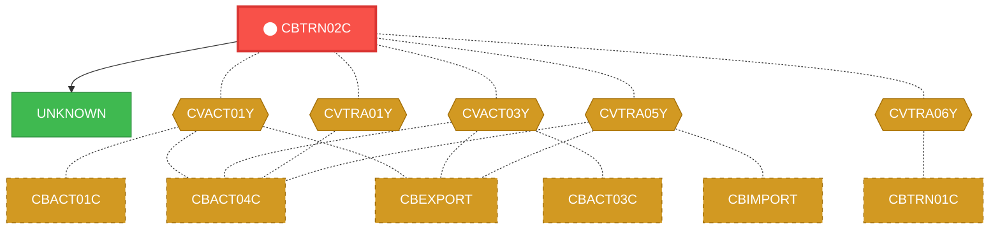

# Program: CBTRN02C


---

## Quick Reference

| Attribute | Value |
|-----------|-------|
| Program ID | `CBTRN02C` |
| Type | BATCH |
| Lines | 732 |
| Source | [CBTRN02C.cbl](../carddemo/CBTRN02C.cbl#L1) |
| Paragraphs | 26 |
| Statements | 213 |
| Impact Risk | **HIGH** — 18 programs affected |

> **View Source:** [Open CBTRN02C.cbl](../carddemo/CBTRN02C.cbl#L1)

## Source Grounding Facts

| Data Item | Literal Value |
|-----------|---------------|
| `END-OF-FILE` | `N` |
| `WS-CREATE-TRANCAT-REC` | `N` |

Status conditions found in source:
- `DALYTRAN-STATUS = '00'`
- `TRANFILE-STATUS = '00'`
- `XREFFILE-STATUS = '00'`
- `DALYREJS-STATUS = '00'`
- `ACCTFILE-STATUS = '00'`
- `TCATBALF-STATUS = '00'`
- `DALYTRAN-STATUS = '10'`


## Business Purpose

*Business purpose is not present in the extracted data. Run LLM enrichment to populate this section.*


## Dependency Context

> This section shows how **CBTRN02C** connects to the rest of the system — who calls it,
> what it calls, and what data it shares. If linked programs exist, they must appear here.

### Programs That Call CBTRN02C (Callers)

*No programs call CBTRN02C — this is likely a top-level entry point or CICS transaction starter.*

### Programs Called by CBTRN02C (Callees)

| Called Program | Type | Line | Why |
|----------------|------|------|-----|
| `UNKNOWN` | None | 797 |  |

### Shared Data (Copybooks & Files)

#### Shared Copybooks

| Copybook | Also Used By | # Co-Users |
|----------|-------------|------------|
| `CVACT01Y` | CBACT01C, CBACT04C, CBEXPORT, CBIMPORT, CBSTM03A (+8 more) | 13 |
| `CVACT03Y` | CBACT03C, CBACT04C, CBEXPORT, CBIMPORT, CBSTM03A (+8 more) | 13 |
| `CVTRA01Y` | CBACT04C | 1 |
| `CVTRA05Y` | CBACT04C, CBEXPORT, CBIMPORT, CBTRN01C, CBTRN03C (+5 more) | 10 |
| `CVTRA06Y` | CBTRN01C | 1 |

#### Shared Files

| File | Type | Access | Also Used By |
|------|------|--------|-------------|
| `ACCOUNT-FILE` | VSAM | RANDOM | CBACT04C, CBTRN01C |
| `DALYREJS-FILE` | SEQUENTIAL | SEQUENTIAL |  |
| `DALYTRAN-FILE` | SEQUENTIAL | SEQUENTIAL | CBTRN01C |
| `TCATBAL-FILE` | VSAM | RANDOM | CBACT04C |
| `TRANSACT-FILE` | VSAM | RANDOM | CBACT04C, CBTRN01C, CBTRN03C |
| `XREF-FILE` | VSAM | RANDOM | CBACT04C, CBSTM03B, CBTRN01C, CBTRN03C |

## Legacy Data Contracts

> These tables are derived from FILE SECTION records and COPY-expanded data declarations. They preserve the legacy field names, COBOL storage type, inferred modern type, and status-code values needed for Java DTOs, SQL schemas, API contracts, and migration mapping.

### File Record Layouts

#### `DALYTRAN-FILE` / `FD-TRAN-RECORD`
| Legacy Field | Meaning | COBOL Type | Modern Type | Notes |
|--------------|---------|------------|-------------|-------|
| `FD-TRAN-RECORD` | Fd Tran Record | `GROUP` | `OBJECT` |  |
| `FD-TRAN-ID` | Fd Tran ID | `PIC X(16)` | `STRING(16)` |  |
| `FD-CUST-DATA` | Fd Customer Data | `PIC X(334)` | `STRING(334)` |  |

#### `TRANSACT-FILE` / `FD-TRANFILE-REC`
| Legacy Field | Meaning | COBOL Type | Modern Type | Notes |
|--------------|---------|------------|-------------|-------|
| `FD-TRANFILE-REC` | Fd Tranfile Record | `GROUP` | `OBJECT` |  |
| `FD-TRANS-ID` | Fd Trans ID | `PIC X(16)` | `STRING(16)` |  |
| `FD-ACCT-DATA` | Fd Account Data | `PIC X(334)` | `STRING(334)` |  |

#### `XREF-FILE` / `FD-XREFFILE-REC`
| Legacy Field | Meaning | COBOL Type | Modern Type | Notes |
|--------------|---------|------------|-------------|-------|
| `FD-XREFFILE-REC` | Fd Xreffile Record | `GROUP` | `OBJECT` |  |
| `FD-XREF-CARD-NUM` | Fd Xref Card Number | `PIC X(16)` | `STRING(16)` |  |
| `FD-XREF-DATA` | Fd Xref Data | `PIC X(34)` | `STRING(34)` |  |

#### `DALYREJS-FILE` / `FD-REJS-RECORD`
| Legacy Field | Meaning | COBOL Type | Modern Type | Notes |
|--------------|---------|------------|-------------|-------|
| `FD-REJS-RECORD` | Fd Rejs Record | `GROUP` | `OBJECT` |  |
| `FD-REJECT-RECORD` | Fd Reject Record | `PIC X(350)` | `STRING(350)` |  |
| `FD-VALIDATION-TRAILER` | Fd Validation Trailer | `PIC X(80)` | `STRING(80)` |  |

#### `ACCOUNT-FILE` / `FD-ACCTFILE-REC`
| Legacy Field | Meaning | COBOL Type | Modern Type | Notes |
|--------------|---------|------------|-------------|-------|
| `FD-ACCTFILE-REC` | Fd Acctfile Record | `GROUP` | `OBJECT` |  |
| `FD-ACCT-ID` | Fd Account ID | `PIC 9(11)` | `BIGINT` |  |
| `FD-ACCT-DATA` | Fd Account Data | `PIC X(289)` | `STRING(289)` |  |

#### `TCATBAL-FILE` / `FD-TRAN-CAT-BAL-RECORD`
| Legacy Field | Meaning | COBOL Type | Modern Type | Notes |
|--------------|---------|------------|-------------|-------|
| `FD-TRAN-CAT-BAL-RECORD` | Fd Tran Cat Bal Record | `GROUP` | `OBJECT` |  |
| `FD-TRAN-CAT-KEY` | Fd Tran Cat Key | `GROUP` | `OBJECT` |  |
| `FD-TRANCAT-ACCT-ID` | Fd Trancat Account ID | `PIC 9(11)` | `BIGINT` |  |
| `FD-TRANCAT-TYPE-CD` | Fd Trancat Type Cd | `PIC X(02)` | `STRING(2)` |  |
| `FD-TRANCAT-CD` | Fd Trancat Cd | `PIC 9(04)` | `INTEGER` |  |
| `FD-FD-TRAN-CAT-DATA` | Fd Fd Tran Cat Data | `PIC X(33)` | `STRING(33)` |  |


### Copybook Segment Layouts

#### `CVACT01Y` as `ACCOUNT-RECORD`

| Legacy Field | Meaning | COBOL Type | Modern Type | Status / Format Notes |
|--------------|---------|------------|-------------|-----------------------|
| `ACCOUNT-RECORD` | Account Record | `GROUP` | `OBJECT` |  |
| `ACCT-ID` | Account ID | `PIC 9(11)` | `BIGINT` |  |
| `ACCT-ACTIVE-STATUS` | Account Active Status | `PIC X(01)` | `STRING(1)` |  |
| `ACCT-CURR-BAL` | Account Curr Bal | `PIC S9(10)V99` | `DECIMAL(12,2)` |  |
| `ACCT-CREDIT-LIMIT` | Account Credit Limit | `PIC S9(10)V99` | `DECIMAL(12,2)` |  |
| `ACCT-CASH-CREDIT-LIMIT` | Account Cash Credit Limit | `PIC S9(10)V99` | `DECIMAL(12,2)` |  |
| `ACCT-OPEN-DATE` | Account Open Date | `PIC X(10)` | `STRING(10)` | Date-like field; verify YYDDD, YYMMDD, or ISO format before migration. |
| `ACCT-EXPIRAION-DATE` | Account Expiraion Date | `PIC X(10)` | `STRING(10)` | Date-like field; verify YYDDD, YYMMDD, or ISO format before migration. |
| `ACCT-REISSUE-DATE` | Account Reissue Date | `PIC X(10)` | `STRING(10)` | Date-like field; verify YYDDD, YYMMDD, or ISO format before migration. |
| `ACCT-CURR-CYC-CREDIT` | Account Curr Cyc Credit | `PIC S9(10)V99` | `DECIMAL(12,2)` |  |
| `ACCT-CURR-CYC-DEBIT` | Account Curr Cyc Debit | `PIC S9(10)V99` | `DECIMAL(12,2)` |  |
| `ACCT-ADDR-ZIP` | Account Addr Zip | `PIC X(10)` | `STRING(10)` |  |
| `ACCT-GROUP-ID` | Account Group ID | `PIC X(10)` | `STRING(10)` |  |
| `FILLER` | Filler | `PIC X(178)` | `STRING(178)` |  |

#### `CVACT03Y` as `CARD-XREF-RECORD`

| Legacy Field | Meaning | COBOL Type | Modern Type | Status / Format Notes |
|--------------|---------|------------|-------------|-----------------------|
| `CARD-XREF-RECORD` | Card Xref Record | `GROUP` | `OBJECT` |  |
| `XREF-CARD-NUM` | Xref Card Number | `PIC X(16)` | `STRING(16)` |  |
| `XREF-CUST-ID` | Xref Customer ID | `PIC 9(09)` | `INTEGER` |  |
| `XREF-ACCT-ID` | Xref Account ID | `PIC 9(11)` | `BIGINT` |  |
| `FILLER` | Filler | `PIC X(14)` | `STRING(14)` |  |

#### `CVTRA01Y` as `TRAN-CAT-BAL-RECORD`

| Legacy Field | Meaning | COBOL Type | Modern Type | Status / Format Notes |
|--------------|---------|------------|-------------|-----------------------|
| `TRAN-CAT-BAL-RECORD` | Tran Cat Bal Record | `GROUP` | `OBJECT` |  |
| `TRAN-CAT-KEY` | Tran Cat Key | `GROUP` | `OBJECT` |  |
| `TRANCAT-ACCT-ID` | Trancat Account ID | `PIC 9(11)` | `BIGINT` |  |
| `TRANCAT-TYPE-CD` | Trancat Type Cd | `PIC X(02)` | `STRING(2)` |  |
| `TRANCAT-CD` | Trancat Cd | `PIC 9(04)` | `INTEGER` |  |
| `TRAN-CAT-BAL` | Tran Cat Bal | `PIC S9(09)V99` | `DECIMAL(11,2)` |  |
| `FILLER` | Filler | `PIC X(22)` | `STRING(22)` |  |

#### `CVTRA05Y` as `TRAN-RECORD`

| Legacy Field | Meaning | COBOL Type | Modern Type | Status / Format Notes |
|--------------|---------|------------|-------------|-----------------------|
| `TRAN-RECORD` | Tran Record | `GROUP` | `OBJECT` |  |
| `TRAN-ID` | Tran ID | `PIC X(16)` | `STRING(16)` |  |
| `TRAN-TYPE-CD` | Tran Type Cd | `PIC X(02)` | `STRING(2)` |  |
| `TRAN-CAT-CD` | Tran Cat Cd | `PIC 9(04)` | `INTEGER` |  |
| `TRAN-SOURCE` | Tran Source | `PIC X(10)` | `STRING(10)` |  |
| `TRAN-DESC` | Tran Desc | `PIC X(100)` | `STRING(100)` |  |
| `TRAN-AMT` | Tran Amount | `PIC S9(09)V99` | `DECIMAL(11,2)` |  |
| `TRAN-MERCHANT-ID` | Tran Merchant ID | `PIC 9(09)` | `INTEGER` |  |
| `TRAN-MERCHANT-NAME` | Tran Merchant Name | `PIC X(50)` | `STRING(50)` |  |
| `TRAN-MERCHANT-CITY` | Tran Merchant City | `PIC X(50)` | `STRING(50)` |  |
| `TRAN-MERCHANT-ZIP` | Tran Merchant Zip | `PIC X(10)` | `STRING(10)` |  |
| `TRAN-CARD-NUM` | Tran Card Number | `PIC X(16)` | `STRING(16)` |  |
| `TRAN-ORIG-TS` | Tran Orig Ts | `PIC X(26)` | `STRING(26)` |  |
| `TRAN-PROC-TS` | Tran Proc Ts | `PIC X(26)` | `STRING(26)` |  |
| `FILLER` | Filler | `PIC X(20)` | `STRING(20)` |  |

#### `CVTRA06Y` as `DALYTRAN-RECORD`

| Legacy Field | Meaning | COBOL Type | Modern Type | Status / Format Notes |
|--------------|---------|------------|-------------|-----------------------|
| `DALYTRAN-RECORD` | Dalytran Record | `GROUP` | `OBJECT` |  |
| `DALYTRAN-ID` | Dalytran ID | `PIC X(16)` | `STRING(16)` |  |
| `DALYTRAN-TYPE-CD` | Dalytran Type Cd | `PIC X(02)` | `STRING(2)` |  |
| `DALYTRAN-CAT-CD` | Dalytran Cat Cd | `PIC 9(04)` | `INTEGER` |  |
| `DALYTRAN-SOURCE` | Dalytran Source | `PIC X(10)` | `STRING(10)` |  |
| `DALYTRAN-DESC` | Dalytran Desc | `PIC X(100)` | `STRING(100)` |  |
| `DALYTRAN-AMT` | Dalytran Amount | `PIC S9(09)V99` | `DECIMAL(11,2)` |  |
| `DALYTRAN-MERCHANT-ID` | Dalytran Merchant ID | `PIC 9(09)` | `INTEGER` |  |
| `DALYTRAN-MERCHANT-NAME` | Dalytran Merchant Name | `PIC X(50)` | `STRING(50)` |  |
| `DALYTRAN-MERCHANT-CITY` | Dalytran Merchant City | `PIC X(50)` | `STRING(50)` |  |
| `DALYTRAN-MERCHANT-ZIP` | Dalytran Merchant Zip | `PIC X(10)` | `STRING(10)` |  |
| `DALYTRAN-CARD-NUM` | Dalytran Card Number | `PIC X(16)` | `STRING(16)` |  |
| `DALYTRAN-ORIG-TS` | Dalytran Orig Ts | `PIC X(26)` | `STRING(26)` |  |
| `DALYTRAN-PROC-TS` | Dalytran Proc Ts | `PIC X(26)` | `STRING(26)` |  |
| `FILLER` | Filler | `PIC X(20)` | `STRING(20)` |  |


### Data Movement And Key Mapping

| Line | Source | Target | Meaning |
|------|--------|--------|---------|
| 248 | `DALYTRAN-STATUS` | `IO-STATUS` | DALYTRAN-STATUS populates IO-STATUS |
| 266 | `TRANFILE-STATUS` | `IO-STATUS` | TRANFILE-STATUS populates IO-STATUS |
| 285 | `XREFFILE-STATUS` | `IO-STATUS` | XREFFILE-STATUS populates IO-STATUS |
| 303 | `DALYREJS-STATUS` | `IO-STATUS` | DALYREJS-STATUS populates IO-STATUS |
| 321 | `ACCTFILE-STATUS` | `IO-STATUS` | ACCTFILE-STATUS populates IO-STATUS |
| 339 | `TCATBALF-STATUS` | `IO-STATUS` | TCATBALF-STATUS populates IO-STATUS |
| 361 | `'Y'` | `END-OF-FILE` | 'Y' populates END-OF-FILE |
| 364 | `DALYTRAN-STATUS` | `IO-STATUS` | DALYTRAN-STATUS populates IO-STATUS |
| 394 | `XREF-ACCT-ID` | `FD-ACCT-ID` | XREF-ACCT-ID populates FD-ACCT-ID |
| 430 | `DALYTRAN-AMT` | `TRAN-AMT` | DALYTRAN-AMT populates TRAN-AMT |
| 447 | `DALYTRAN-RECORD` | `REJECT-TRAN-DATA` | DALYTRAN-RECORD populates REJECT-TRAN-DATA |
| 461 | `DALYREJS-STATUS` | `IO-STATUS` | DALYREJS-STATUS populates IO-STATUS |
| 469 | `XREF-ACCT-ID` | `FD-TRANCAT-ACCT-ID` | XREF-ACCT-ID populates FD-TRANCAT-ACCT-ID |
| 473 | `'N'` | `WS-CREATE-TRANCAT-REC` | 'N' populates WS-CREATE-TRANCAT-REC |
| 478 | `'Y'` | `WS-CREATE-TRANCAT-REC` | 'Y' populates WS-CREATE-TRANCAT-REC |
| 490 | `TCATBALF-STATUS` | `IO-STATUS` | TCATBALF-STATUS populates IO-STATUS |
| 505 | `XREF-ACCT-ID` | `TRANCAT-ACCT-ID` | XREF-ACCT-ID populates TRANCAT-ACCT-ID |
| 521 | `TCATBALF-STATUS` | `IO-STATUS` | TCATBALF-STATUS populates IO-STATUS |
| 539 | `TCATBALF-STATUS` | `IO-STATUS` | TCATBALF-STATUS populates IO-STATUS |
| 575 | `TRANFILE-STATUS` | `IO-STATUS` | TRANFILE-STATUS populates IO-STATUS |
| 594 | `DALYTRAN-STATUS` | `IO-STATUS` | DALYTRAN-STATUS populates IO-STATUS |
| 612 | `TRANFILE-STATUS` | `IO-STATUS` | TRANFILE-STATUS populates IO-STATUS |
| 631 | `XREFFILE-STATUS` | `IO-STATUS` | XREFFILE-STATUS populates IO-STATUS |
| 649 | `XREFFILE-STATUS` | `IO-STATUS` | XREFFILE-STATUS populates IO-STATUS |
| 667 | `ACCTFILE-STATUS` | `IO-STATUS` | ACCTFILE-STATUS populates IO-STATUS |
| 686 | `TCATBALF-STATUS` | `IO-STATUS` | TCATBALF-STATUS populates IO-STATUS |
| 693 | `FUNCTION CURRENT-DATE` | `COBOL-TS` | FUNCTION CURRENT-DATE populates COBOL-TS |
| 717 | `IO-STAT1` | `IO-STATUS-04(1:1)` | IO-STAT1 populates IO-STATUS-04(1:1) |
| 720 | `TWO-BYTES-BINARY` | `IO-STATUS-0403` | TWO-BYTES-BINARY populates IO-STATUS-0403 |
| 723 | `'0000'` | `IO-STATUS-04` | '0000' populates IO-STATUS-04 |


---

## Dependency Graph



> **Legend:** 🔴 Target program · 🔵 Direct callers · 🟢 Direct callees · 🟡 Copybook-coupled · ⚫ Transitive (indirect)

---

## Impact Ripple View

> **If you change CBTRN02C, what else could break?**

| Impact Metric | Count |
|--------------|-------|
| Direct Callers | 0 |
| Transitive Callers (callers of callers) | 0 |
| Direct Callees | 0 |
| Transitive Callees | 0 |
| Copybook-Coupled Programs | 18 |
| **Total Impact** | **18** |
| **Risk Rating** | **HIGH** |


**Programs affected via shared copybooks:**
- `CBACT01C`
- `CBACT03C`
- `CBACT04C`
- `CBEXPORT`
- `CBIMPORT`
- `CBSTM03A`
- `CBTRN01C`
- `CBTRN03C`
- `COACCT01`
- `COACTUPC`
- `COACTVWC`
- `COBIL00C`
- `COPAUA0C`
- `COPAUS0C`
- `CORPT00C`
- `COTRN00C`
- `COTRN01C`
- `COTRN02C`

---

## Statement Profile

| Statement Type | Count |
|---------------|-------|
| IF | 86 |
| MOVE | 51 |
| EXIT | 23 |
| OPEN | 12 |
| CLOSE | 12 |
| READ | 8 |
| WRITE | 6 |
| PERFORM | 5 |
| REWRITE | 4 |
| ARITHMETIC | 3 |
| INITIALIZE | 1 |
| DISPLAY | 1 |
| CALL | 1 |

## Control Flow

```mermaid
flowchart TD
    START([Program Entry])
    0000_DALYTRAN_OPEN["0000-DALYTRAN-OPEN"]
    0100_TRANFILE_OPEN["0100-TRANFILE-OPEN"]
    0200_XREFFILE_OPEN["0200-XREFFILE-OPEN"]
    0300_DALYREJS_OPEN["0300-DALYREJS-OPEN"]
    0400_ACCTFILE_OPEN["0400-ACCTFILE-OPEN"]
    0500_TCATBALF_OPEN["0500-TCATBALF-OPEN"]
    1000_DALYTRAN_GET_NEXT["1000-DALYTRAN-GET-NEXT"]
    1500_VALIDATE_TRAN["1500-VALIDATE-TRAN"]
    1500_A_LOOKUP_XREF["1500-A-LOOKUP-XREF"]
    1500_B_LOOKUP_ACCT["1500-B-LOOKUP-ACCT"]
    2000_POST_TRANSACTION["2000-POST-TRANSACTION"]
    2500_WRITE_REJECT_REC["2500-WRITE-REJECT-REC"]
    2700_UPDATE_TCATBAL["2700-UPDATE-TCATBAL"]
    2700_A_CREATE_TCATBAL_REC["2700-A-CREATE-TCATBAL-REC"]
    2700_B_UPDATE_TCATBAL_REC["2700-B-UPDATE-TCATBAL-REC"]
    START --> 0000_DALYTRAN_OPEN
    2000_POST_TRANSACTION --> Z_GET_DB2_FORMAT_TIMESTAMP
    2500_WRITE_REJECT_REC --> INLINE
    2700_A_CREATE_TCATBAL_REC --> INLINE
    2700_B_UPDATE_TCATBAL_REC --> INLINE
```



## Paragraphs

### 0000-DALYTRAN-OPEN

| | |
|---|---|
| **Paragraph** | `0000-DALYTRAN-OPEN` |
| **Lines** | 236 - 253 |
| **View Code** | [Jump to Line 236](../carddemo/CBTRN02C.cbl#L236) |


### 0100-TRANFILE-OPEN

| | |
|---|---|
| **Paragraph** | `0100-TRANFILE-OPEN` |
| **Lines** | 254 - 272 |
| **View Code** | [Jump to Line 254](../carddemo/CBTRN02C.cbl#L254) |


### 0200-XREFFILE-OPEN

| | |
|---|---|
| **Paragraph** | `0200-XREFFILE-OPEN` |
| **Lines** | 273 - 290 |
| **View Code** | [Jump to Line 273](../carddemo/CBTRN02C.cbl#L273) |


### 0300-DALYREJS-OPEN

| | |
|---|---|
| **Paragraph** | `0300-DALYREJS-OPEN` |
| **Lines** | 291 - 308 |
| **View Code** | [Jump to Line 291](../carddemo/CBTRN02C.cbl#L291) |


### 0400-ACCTFILE-OPEN

| | |
|---|---|
| **Paragraph** | `0400-ACCTFILE-OPEN` |
| **Lines** | 309 - 326 |
| **View Code** | [Jump to Line 309](../carddemo/CBTRN02C.cbl#L309) |


### 0500-TCATBALF-OPEN

| | |
|---|---|
| **Paragraph** | `0500-TCATBALF-OPEN` |
| **Lines** | 327 - 344 |
| **View Code** | [Jump to Line 327](../carddemo/CBTRN02C.cbl#L327) |


### 1000-DALYTRAN-GET-NEXT

| | |
|---|---|
| **Paragraph** | `1000-DALYTRAN-GET-NEXT` |
| **Lines** | 345 - 369 |
| **View Code** | [Jump to Line 345](../carddemo/CBTRN02C.cbl#L345) |


### 1500-VALIDATE-TRAN

| | |
|---|---|
| **Paragraph** | `1500-VALIDATE-TRAN` |
| **Lines** | 370 - 379 |
| **View Code** | [Jump to Line 370](../carddemo/CBTRN02C.cbl#L370) |


### 1500-A-LOOKUP-XREF

| | |
|---|---|
| **Paragraph** | `1500-A-LOOKUP-XREF` |
| **Lines** | 380 - 392 |
| **View Code** | [Jump to Line 380](../carddemo/CBTRN02C.cbl#L380) |


### 1500-B-LOOKUP-ACCT

| | |
|---|---|
| **Paragraph** | `1500-B-LOOKUP-ACCT` |
| **Lines** | 393 - 423 |
| **View Code** | [Jump to Line 393](../carddemo/CBTRN02C.cbl#L393) |


### 2000-POST-TRANSACTION

| | |
|---|---|
| **Paragraph** | `2000-POST-TRANSACTION` |
| **Lines** | 424 - 445 |
| **View Code** | [Jump to Line 424](../carddemo/CBTRN02C.cbl#L424) |


### 2500-WRITE-REJECT-REC

| | |
|---|---|
| **Paragraph** | `2500-WRITE-REJECT-REC` |
| **Lines** | 446 - 466 |
| **View Code** | [Jump to Line 446](../carddemo/CBTRN02C.cbl#L446) |


### 2700-UPDATE-TCATBAL

| | |
|---|---|
| **Paragraph** | `2700-UPDATE-TCATBAL` |
| **Lines** | 467 - 502 |
| **View Code** | [Jump to Line 467](../carddemo/CBTRN02C.cbl#L467) |


### 2700-A-CREATE-TCATBAL-REC

| | |
|---|---|
| **Paragraph** | `2700-A-CREATE-TCATBAL-REC` |
| **Lines** | 503 - 525 |
| **View Code** | [Jump to Line 503](../carddemo/CBTRN02C.cbl#L503) |


### 2700-B-UPDATE-TCATBAL-REC

| | |
|---|---|
| **Paragraph** | `2700-B-UPDATE-TCATBAL-REC` |
| **Lines** | 526 - 544 |
| **View Code** | [Jump to Line 526](../carddemo/CBTRN02C.cbl#L526) |


### 2800-UPDATE-ACCOUNT-REC

| | |
|---|---|
| **Paragraph** | `2800-UPDATE-ACCOUNT-REC` |
| **Lines** | 545 - 561 |
| **View Code** | [Jump to Line 545](../carddemo/CBTRN02C.cbl#L545) |


### 2900-WRITE-TRANSACTION-FILE

| | |
|---|---|
| **Paragraph** | `2900-WRITE-TRANSACTION-FILE` |
| **Lines** | 562 - 581 |
| **View Code** | [Jump to Line 562](../carddemo/CBTRN02C.cbl#L562) |


### 9000-DALYTRAN-CLOSE

| | |
|---|---|
| **Paragraph** | `9000-DALYTRAN-CLOSE` |
| **Lines** | 582 - 599 |
| **View Code** | [Jump to Line 582](../carddemo/CBTRN02C.cbl#L582) |


### 9100-TRANFILE-CLOSE

| | |
|---|---|
| **Paragraph** | `9100-TRANFILE-CLOSE` |
| **Lines** | 600 - 618 |
| **View Code** | [Jump to Line 600](../carddemo/CBTRN02C.cbl#L600) |


### 9200-XREFFILE-CLOSE

| | |
|---|---|
| **Paragraph** | `9200-XREFFILE-CLOSE` |
| **Lines** | 619 - 636 |
| **View Code** | [Jump to Line 619](../carddemo/CBTRN02C.cbl#L619) |


### 9300-DALYREJS-CLOSE

| | |
|---|---|
| **Paragraph** | `9300-DALYREJS-CLOSE` |
| **Lines** | 637 - 654 |
| **View Code** | [Jump to Line 637](../carddemo/CBTRN02C.cbl#L637) |


### 9400-ACCTFILE-CLOSE

| | |
|---|---|
| **Paragraph** | `9400-ACCTFILE-CLOSE` |
| **Lines** | 655 - 673 |
| **View Code** | [Jump to Line 655](../carddemo/CBTRN02C.cbl#L655) |


### 9500-TCATBALF-CLOSE

| | |
|---|---|
| **Paragraph** | `9500-TCATBALF-CLOSE` |
| **Lines** | 674 - 691 |
| **View Code** | [Jump to Line 674](../carddemo/CBTRN02C.cbl#L674) |


### Z-GET-DB2-FORMAT-TIMESTAMP

| | |
|---|---|
| **Paragraph** | `Z-GET-DB2-FORMAT-TIMESTAMP` |
| **Lines** | 692 - 706 |
| **View Code** | [Jump to Line 692](../carddemo/CBTRN02C.cbl#L692) |


### 9999-ABEND-PROGRAM

| | |
|---|---|
| **Paragraph** | `9999-ABEND-PROGRAM` |
| **Lines** | 707 - 713 |
| **View Code** | [Jump to Line 707](../carddemo/CBTRN02C.cbl#L707) |


### 9910-DISPLAY-IO-STATUS

| | |
|---|---|
| **Paragraph** | `9910-DISPLAY-IO-STATUS` |
| **Lines** | 714 - 731 |
| **View Code** | [Jump to Line 714](../carddemo/CBTRN02C.cbl#L714) |


## Executed by JCL Jobs

This program is run by the following batch JCL jobs:

| Job Name | Step | Step Comments |
|----------|------|---------------|
| [POSTTRAN](../jcl/POSTTRAN.md) | `STEP15` | *****************************************************************
Copyright Amaz... |


## Copybook Field Dictionaries

The following copybooks are included by this program. Each entry shows the actual fields
extracted from the copybook source file (`.cpy`).

### Copybook `CVACT01Y`

| Level | Field | PIC | USAGE | Parent | Notes |
|-------|-------|-----|-------|--------|-------|
| `01` | `ACCOUNT-RECORD` | `None` | None | None |  |
| `05` | `ACCT-ID` | `9(11)` | None | ACCOUNT-RECORD |  |
| `05` | `ACCT-ACTIVE-STATUS` | `X(01)` | None | ACCOUNT-RECORD |  |
| `05` | `ACCT-CURR-BAL` | `S9(10)V99` | None | ACCOUNT-RECORD |  |
| `05` | `ACCT-CREDIT-LIMIT` | `S9(10)V99` | None | ACCOUNT-RECORD |  |
| `05` | `ACCT-CASH-CREDIT-LIMIT` | `S9(10)V99` | None | ACCOUNT-RECORD |  |
| `05` | `ACCT-OPEN-DATE` | `X(10)` | None | ACCOUNT-RECORD |  |
| `05` | `ACCT-EXPIRAION-DATE` | `X(10)` | None | ACCOUNT-RECORD |  |
| `05` | `ACCT-REISSUE-DATE` | `X(10)` | None | ACCOUNT-RECORD |  |
| `05` | `ACCT-CURR-CYC-CREDIT` | `S9(10)V99` | None | ACCOUNT-RECORD |  |
| `05` | `ACCT-CURR-CYC-DEBIT` | `S9(10)V99` | None | ACCOUNT-RECORD |  |
| `05` | `ACCT-ADDR-ZIP` | `X(10)` | None | ACCOUNT-RECORD |  |
| `05` | `ACCT-GROUP-ID` | `X(10)` | None | ACCOUNT-RECORD |  |

### Copybook `CVACT03Y`

| Level | Field | PIC | USAGE | Parent | Notes |
|-------|-------|-----|-------|--------|-------|
| `01` | `CARD-XREF-RECORD` | `None` | None | None |  |
| `05` | `XREF-CARD-NUM` | `X(16)` | None | CARD-XREF-RECORD |  |
| `05` | `XREF-CUST-ID` | `9(09)` | None | CARD-XREF-RECORD |  |
| `05` | `XREF-ACCT-ID` | `9(11)` | None | CARD-XREF-RECORD |  |

### Copybook `CVTRA01Y`

| Level | Field | PIC | USAGE | Parent | Notes |
|-------|-------|-----|-------|--------|-------|
| `01` | `TRAN-CAT-BAL-RECORD` | `None` | None | None |  |
| `05` | `TRAN-CAT-KEY` | `None` | None | TRAN-CAT-BAL-RECORD |  |
| `10` | `TRANCAT-ACCT-ID` | `9(11)` | None | TRAN-CAT-KEY |  |
| `10` | `TRANCAT-TYPE-CD` | `X(02)` | None | TRAN-CAT-KEY |  |
| `10` | `TRANCAT-CD` | `9(04)` | None | TRAN-CAT-KEY |  |
| `05` | `TRAN-CAT-BAL` | `S9(09)V99` | None | TRAN-CAT-BAL-RECORD |  |

### Copybook `CVTRA05Y`

| Level | Field | PIC | USAGE | Parent | Notes |
|-------|-------|-----|-------|--------|-------|
| `01` | `TRAN-RECORD` | `None` | None | None |  |
| `05` | `TRAN-ID` | `X(16)` | None | TRAN-RECORD |  |
| `05` | `TRAN-TYPE-CD` | `X(02)` | None | TRAN-RECORD |  |
| `05` | `TRAN-CAT-CD` | `9(04)` | None | TRAN-RECORD |  |
| `05` | `TRAN-SOURCE` | `X(10)` | None | TRAN-RECORD |  |
| `05` | `TRAN-DESC` | `X(100)` | None | TRAN-RECORD |  |
| `05` | `TRAN-AMT` | `S9(09)V99` | None | TRAN-RECORD |  |
| `05` | `TRAN-MERCHANT-ID` | `9(09)` | None | TRAN-RECORD |  |
| `05` | `TRAN-MERCHANT-NAME` | `X(50)` | None | TRAN-RECORD |  |
| `05` | `TRAN-MERCHANT-CITY` | `X(50)` | None | TRAN-RECORD |  |
| `05` | `TRAN-MERCHANT-ZIP` | `X(10)` | None | TRAN-RECORD |  |
| `05` | `TRAN-CARD-NUM` | `X(16)` | None | TRAN-RECORD |  |
| `05` | `TRAN-ORIG-TS` | `X(26)` | None | TRAN-RECORD |  |
| `05` | `TRAN-PROC-TS` | `X(26)` | None | TRAN-RECORD |  |

### Copybook `CVTRA06Y`

| Level | Field | PIC | USAGE | Parent | Notes |
|-------|-------|-----|-------|--------|-------|
| `01` | `DALYTRAN-RECORD` | `None` | None | None |  |
| `05` | `DALYTRAN-ID` | `X(16)` | None | DALYTRAN-RECORD |  |
| `05` | `DALYTRAN-TYPE-CD` | `X(02)` | None | DALYTRAN-RECORD |  |
| `05` | `DALYTRAN-CAT-CD` | `9(04)` | None | DALYTRAN-RECORD |  |
| `05` | `DALYTRAN-SOURCE` | `X(10)` | None | DALYTRAN-RECORD |  |
| `05` | `DALYTRAN-DESC` | `X(100)` | None | DALYTRAN-RECORD |  |
| `05` | `DALYTRAN-AMT` | `S9(09)V99` | None | DALYTRAN-RECORD |  |
| `05` | `DALYTRAN-MERCHANT-ID` | `9(09)` | None | DALYTRAN-RECORD |  |
| `05` | `DALYTRAN-MERCHANT-NAME` | `X(50)` | None | DALYTRAN-RECORD |  |
| `05` | `DALYTRAN-MERCHANT-CITY` | `X(50)` | None | DALYTRAN-RECORD |  |
| `05` | `DALYTRAN-MERCHANT-ZIP` | `X(10)` | None | DALYTRAN-RECORD |  |
| `05` | `DALYTRAN-CARD-NUM` | `X(16)` | None | DALYTRAN-RECORD |  |
| `05` | `DALYTRAN-ORIG-TS` | `X(26)` | None | DALYTRAN-RECORD |  |
| `05` | `DALYTRAN-PROC-TS` | `X(26)` | None | DALYTRAN-RECORD |  |


## File Record Layouts (FD)

This program declares the following file records (data contracts for I/O):

### `FD ACCOUNT-FILE` (record `FD-ACCTFILE-REC`)

| Level | Field | PIC | USAGE | Parent |
|-------|-------|-----|-------|--------|
| `01` | `FD-ACCTFILE-REC` | `None` | None | None |
| `05` | `FD-ACCT-ID` | `9(11)` | None | FD-ACCTFILE-REC |
| `05` | `FD-ACCT-DATA` | `X(289)` | None | FD-ACCTFILE-REC |

### `FD DALYREJS-FILE` (record `FD-REJS-RECORD`)

| Level | Field | PIC | USAGE | Parent |
|-------|-------|-----|-------|--------|
| `01` | `FD-REJS-RECORD` | `None` | None | None |
| `05` | `FD-REJECT-RECORD` | `X(350)` | None | FD-REJS-RECORD |
| `05` | `FD-VALIDATION-TRAILER` | `X(80)` | None | FD-REJS-RECORD |

### `FD DALYTRAN-FILE` (record `FD-TRAN-RECORD`)

| Level | Field | PIC | USAGE | Parent |
|-------|-------|-----|-------|--------|
| `01` | `FD-TRAN-RECORD` | `None` | None | None |
| `05` | `FD-TRAN-ID` | `X(16)` | None | FD-TRAN-RECORD |
| `05` | `FD-CUST-DATA` | `X(334)` | None | FD-TRAN-RECORD |

### `FD TCATBAL-FILE` (record `FD-TRAN-CAT-BAL-RECORD`)

| Level | Field | PIC | USAGE | Parent |
|-------|-------|-----|-------|--------|
| `01` | `FD-TRAN-CAT-BAL-RECORD` | `None` | None | None |
| `05` | `FD-TRAN-CAT-KEY` | `None` | None | FD-TRAN-CAT-BAL-RECORD |
| `10` | `FD-TRANCAT-ACCT-ID` | `9(11)` | None | FD-TRAN-CAT-KEY |
| `10` | `FD-TRANCAT-TYPE-CD` | `X(02)` | None | FD-TRAN-CAT-KEY |
| `10` | `FD-TRANCAT-CD` | `9(04)` | None | FD-TRAN-CAT-KEY |
| `05` | `FD-FD-TRAN-CAT-DATA` | `X(33)` | None | FD-TRAN-CAT-BAL-RECORD |

### `FD TRANSACT-FILE` (record `FD-TRANFILE-REC`)

| Level | Field | PIC | USAGE | Parent |
|-------|-------|-----|-------|--------|
| `01` | `FD-TRANFILE-REC` | `None` | None | None |
| `05` | `FD-TRANS-ID` | `X(16)` | None | FD-TRANFILE-REC |
| `05` | `FD-ACCT-DATA` | `X(334)` | None | FD-TRANFILE-REC |

### `FD XREF-FILE` (record `FD-XREFFILE-REC`)

| Level | Field | PIC | USAGE | Parent |
|-------|-------|-----|-------|--------|
| `01` | `FD-XREFFILE-REC` | `None` | None | None |
| `05` | `FD-XREF-CARD-NUM` | `X(16)` | None | FD-XREFFILE-REC |
| `05` | `FD-XREF-DATA` | `X(34)` | None | FD-XREFFILE-REC |


## Data Lineage (MOVE Flow)

The following MOVE statements were extracted from the source. Each row is a `source → destination`
flow that the migration team can use to trace how data is reshaped and routed.

| Source | Destination | Paragraph | Line |
|--------|-------------|-----------|------|
| `'0'` | `WS-VALIDATION-FAIL-REASON` | None | 208 |
| `SPACES` | `WS-VALIDATION-FAIL-REASON-DESC` | None | 209 |
| `'4'` | `RETURN-CODE` | None | 230 |
| `'8'` | `APPL-RESULT` | 0000-DALYTRAN-OPEN | 237 |
| `'0'` | `APPL-RESULT` | 0000-DALYTRAN-OPEN | 240 |
| `'12'` | `APPL-RESULT` | 0000-DALYTRAN-OPEN | 242 |
| `DALYTRAN-STATUS` | `IO-STATUS` | 0000-DALYTRAN-OPEN | 248 |
| `'8'` | `APPL-RESULT` | 0100-TRANFILE-OPEN | 255 |
| `'0'` | `APPL-RESULT` | 0100-TRANFILE-OPEN | 258 |
| `'12'` | `APPL-RESULT` | 0100-TRANFILE-OPEN | 260 |
| `TRANFILE-STATUS` | `IO-STATUS` | 0100-TRANFILE-OPEN | 266 |
| `'8'` | `APPL-RESULT` | 0200-XREFFILE-OPEN | 274 |
| `'0'` | `APPL-RESULT` | 0200-XREFFILE-OPEN | 277 |
| `'12'` | `APPL-RESULT` | 0200-XREFFILE-OPEN | 279 |
| `XREFFILE-STATUS` | `IO-STATUS` | 0200-XREFFILE-OPEN | 285 |
| `'8'` | `APPL-RESULT` | 0300-DALYREJS-OPEN | 292 |
| `'0'` | `APPL-RESULT` | 0300-DALYREJS-OPEN | 295 |
| `'12'` | `APPL-RESULT` | 0300-DALYREJS-OPEN | 297 |
| `DALYREJS-STATUS` | `IO-STATUS` | 0300-DALYREJS-OPEN | 303 |
| `'8'` | `APPL-RESULT` | 0400-ACCTFILE-OPEN | 310 |
| `'0'` | `APPL-RESULT` | 0400-ACCTFILE-OPEN | 313 |
| `'12'` | `APPL-RESULT` | 0400-ACCTFILE-OPEN | 315 |
| `ACCTFILE-STATUS` | `IO-STATUS` | 0400-ACCTFILE-OPEN | 321 |
| `'8'` | `APPL-RESULT` | 0500-TCATBALF-OPEN | 328 |
| `'0'` | `APPL-RESULT` | 0500-TCATBALF-OPEN | 331 |
| `'12'` | `APPL-RESULT` | 0500-TCATBALF-OPEN | 333 |
| `TCATBALF-STATUS` | `IO-STATUS` | 0500-TCATBALF-OPEN | 339 |
| `'0'` | `APPL-RESULT` | 1000-DALYTRAN-GET-NEXT | 348 |
| `'16'` | `APPL-RESULT` | 1000-DALYTRAN-GET-NEXT | 352 |
| `'12'` | `APPL-RESULT` | 1000-DALYTRAN-GET-NEXT | 354 |
| `'Y'` | `END-OF-FILE` | 1000-DALYTRAN-GET-NEXT | 361 |
| `DALYTRAN-STATUS` | `IO-STATUS` | 1000-DALYTRAN-GET-NEXT | 364 |
| `DALYTRAN-CARD-NUM` | `FD-XREF-CARD-NUM` | 1500-A-LOOKUP-XREF | 382 |
| `'100'` | `WS-VALIDATION-FAIL-REASON` | 1500-A-LOOKUP-XREF | 385 |
| `XREF-ACCT-ID` | `FD-ACCT-ID` | 1500-B-LOOKUP-ACCT | 394 |
| `'101'` | `WS-VALIDATION-FAIL-REASON` | 1500-B-LOOKUP-ACCT | 397 |
| `'102'` | `WS-VALIDATION-FAIL-REASON` | 1500-B-LOOKUP-ACCT | 410 |
| `'103'` | `WS-VALIDATION-FAIL-REASON` | 1500-B-LOOKUP-ACCT | 417 |
| `DALYTRAN-ID` | `TRAN-ID` | 2000-POST-TRANSACTION | 425 |
| `DALYTRAN-TYPE-CD` | `TRAN-TYPE-CD` | 2000-POST-TRANSACTION | 426 |
| `DALYTRAN-CAT-CD` | `TRAN-CAT-CD` | 2000-POST-TRANSACTION | 427 |
| `DALYTRAN-SOURCE` | `TRAN-SOURCE` | 2000-POST-TRANSACTION | 428 |
| `DALYTRAN-DESC` | `TRAN-DESC` | 2000-POST-TRANSACTION | 429 |
| `DALYTRAN-AMT` | `TRAN-AMT` | 2000-POST-TRANSACTION | 430 |
| `DALYTRAN-MERCHANT-ID` | `TRAN-MERCHANT-ID` | 2000-POST-TRANSACTION | 431 |
| `DALYTRAN-MERCHANT-NAME` | `TRAN-MERCHANT-NAME` | 2000-POST-TRANSACTION | 432 |
| `DALYTRAN-MERCHANT-CITY` | `TRAN-MERCHANT-CITY` | 2000-POST-TRANSACTION | 433 |
| `DALYTRAN-MERCHANT-ZIP` | `TRAN-MERCHANT-ZIP` | 2000-POST-TRANSACTION | 434 |
| `DALYTRAN-CARD-NUM` | `TRAN-CARD-NUM` | 2000-POST-TRANSACTION | 435 |
| `DALYTRAN-ORIG-TS` | `TRAN-ORIG-TS` | 2000-POST-TRANSACTION | 436 |
| `DB2-FORMAT-TS` | `TRAN-PROC-TS` | 2000-POST-TRANSACTION | 438 |
| `DALYTRAN-RECORD` | `REJECT-TRAN-DATA` | 2500-WRITE-REJECT-REC | 447 |
| `WS-VALIDATION-TRAILER` | `VALIDATION-TRAILER` | 2500-WRITE-REJECT-REC | 448 |
| `'8'` | `APPL-RESULT` | 2500-WRITE-REJECT-REC | 450 |
| `'0'` | `APPL-RESULT` | 2500-WRITE-REJECT-REC | 453 |
| `'12'` | `APPL-RESULT` | 2500-WRITE-REJECT-REC | 455 |
| `DALYREJS-STATUS` | `IO-STATUS` | 2500-WRITE-REJECT-REC | 461 |
| `XREF-ACCT-ID` | `FD-TRANCAT-ACCT-ID` | 2700-UPDATE-TCATBAL | 469 |
| `DALYTRAN-TYPE-CD` | `FD-TRANCAT-TYPE-CD` | 2700-UPDATE-TCATBAL | 470 |
| `DALYTRAN-CAT-CD` | `FD-TRANCAT-CD` | 2700-UPDATE-TCATBAL | 471 |
*+ 40 more movements*

## Known Issues & Code Anomalies

Static analysis flagged the following items in this program. Migration teams should
review each one before re-implementing in a modern stack.

| Severity | Category | Title | Paragraph | Line |
|----------|----------|-------|-----------|------|
| **WARNING** | NAMING | DISPLAY message in `0300-DALYREJS-OPEN` says "DALY REJECTS" but the OPEN is on `DALYREJS-FILE` | 0300-DALYREJS-OPEN | 291 |
| **WARNING** | NAMING | DISPLAY message in `0500-TCATBALF-OPEN` says "TRANSACTION BALANCE" but the OPEN is on `TCATBAL-FILE` | 0500-TCATBALF-OPEN | 327 |
| **WARNING** | LOGIC | `PERFORM 2700-UPDATE-TCATBAL` runs unconditionally after `PERFORM Z-GET-DB2-FORMAT-TIMESTAMP` in `2000-POST-TRANSACTION` | 2000-POST-TRANSACTION | 437 |
| **NOTICE** | DEAD_CODE | Variable `FD-TRAN-ID` is declared but never referenced | None | 68 |
| **NOTICE** | DEAD_CODE | Variable `FD-CUST-DATA` is declared but never referenced | None | 69 |
| **NOTICE** | DEAD_CODE | Variable `FD-XREF-DATA` is declared but never referenced | None | 79 |
| **NOTICE** | DEAD_CODE | Variable `FD-REJECT-RECORD` is declared but never referenced | None | 83 |
| **NOTICE** | DEAD_CODE | Variable `FD-VALIDATION-TRAILER` is declared but never referenced | None | 84 |
| **NOTICE** | DEAD_CODE | Variable `FD-FD-TRAN-CAT-DATA` is declared but never referenced | None | 97 |
| **NOTICE** | DEAD_CODE | Variable `DALYTRAN-STAT1` is declared but never referenced | None | 104 |
| **NOTICE** | DEAD_CODE | Variable `DALYTRAN-STAT2` is declared but never referenced | None | 105 |
| **NOTICE** | DEAD_CODE | Variable `TRANFILE-STAT1` is declared but never referenced | None | 109 |
| **NOTICE** | DEAD_CODE | Variable `TRANFILE-STAT2` is declared but never referenced | None | 110 |
| **NOTICE** | LOGIC | Paragraph `0000-DALYTRAN-OPEN` terminates the program on error | 0000-DALYTRAN-OPEN | 236 |
| **NOTICE** | LOGIC | Paragraph `0100-TRANFILE-OPEN` terminates the program on error | 0100-TRANFILE-OPEN | 254 |
| **NOTICE** | LOGIC | Paragraph `0200-XREFFILE-OPEN` terminates the program on error | 0200-XREFFILE-OPEN | 273 |
| **NOTICE** | LOGIC | Paragraph `0300-DALYREJS-OPEN` terminates the program on error | 0300-DALYREJS-OPEN | 291 |
| **NOTICE** | LOGIC | Paragraph `0400-ACCTFILE-OPEN` terminates the program on error | 0400-ACCTFILE-OPEN | 309 |
| **NOTICE** | LOGIC | Paragraph `0500-TCATBALF-OPEN` terminates the program on error | 0500-TCATBALF-OPEN | 327 |
| **NOTICE** | LOGIC | Paragraph `1000-DALYTRAN-GET-NEXT` terminates the program on error | 1000-DALYTRAN-GET-NEXT | 345 |
| **NOTICE** | LOGIC | Paragraph `2500-WRITE-REJECT-REC` terminates the program on error | 2500-WRITE-REJECT-REC | 446 |
| **NOTICE** | LOGIC | Paragraph `2700-UPDATE-TCATBAL` terminates the program on error | 2700-UPDATE-TCATBAL | 467 |
| **NOTICE** | LOGIC | Paragraph `2700-A-CREATE-TCATBAL-REC` terminates the program on error | 2700-A-CREATE-TCATBAL-REC | 503 |
| **NOTICE** | LOGIC | Paragraph `2700-B-UPDATE-TCATBAL-REC` terminates the program on error | 2700-B-UPDATE-TCATBAL-REC | 526 |
| **NOTICE** | LOGIC | Paragraph `2900-WRITE-TRANSACTION-FILE` terminates the program on error | 2900-WRITE-TRANSACTION-FILE | 562 |
| **NOTICE** | LOGIC | Paragraph `9000-DALYTRAN-CLOSE` terminates the program on error | 9000-DALYTRAN-CLOSE | 582 |
| **NOTICE** | LOGIC | Paragraph `9100-TRANFILE-CLOSE` terminates the program on error | 9100-TRANFILE-CLOSE | 600 |
| **NOTICE** | LOGIC | Paragraph `9200-XREFFILE-CLOSE` terminates the program on error | 9200-XREFFILE-CLOSE | 619 |
| **NOTICE** | LOGIC | Paragraph `9300-DALYREJS-CLOSE` terminates the program on error | 9300-DALYREJS-CLOSE | 637 |
| **NOTICE** | LOGIC | Paragraph `9400-ACCTFILE-CLOSE` terminates the program on error | 9400-ACCTFILE-CLOSE | 655 |
| **NOTICE** | LOGIC | Paragraph `9500-TCATBALF-CLOSE` terminates the program on error | 9500-TCATBALF-CLOSE | 674 |
| **NOTICE** | DEPENDENCY | Static CALL to external `CEE3ABD` (not in this codebase) | None | 711 |

### WARNING — DISPLAY message in `0300-DALYREJS-OPEN` says "DALY REJECTS" but the OPEN is on `DALYREJS-FILE`

The error message refers to a file name that doesn't match the file being opened. Operators reading the log will look for the wrong file during incident triage.
**Source excerpt** (line 291):
```cobol
DISPLAY 'ERROR OPENING DALY REJECTS FILE'
```

**Recommendation:** Update the DISPLAY string to mention `DALYREJS-FILE`.
---
### WARNING — DISPLAY message in `0500-TCATBALF-OPEN` says "TRANSACTION BALANCE" but the OPEN is on `TCATBAL-FILE`

The error message refers to a file name that doesn't match the file being opened. Operators reading the log will look for the wrong file during incident triage.
**Source excerpt** (line 327):
```cobol
DISPLAY 'ERROR OPENING TRANSACTION BALANCE FILE'
```

**Recommendation:** Update the DISPLAY string to mention `TCATBAL-FILE`.
---
### WARNING — `PERFORM 2700-UPDATE-TCATBAL` runs unconditionally after `PERFORM Z-GET-DB2-FORMAT-TIMESTAMP` in `2000-POST-TRANSACTION`

There is no IF / EVALUATE check between the read-style `Z-GET-DB2-FORMAT-TIMESTAMP` and the mutating `2700-UPDATE-TCATBAL`. If `Z-GET-DB2-FORMAT-TIMESTAMP` encounters an error (NOTFND, IO failure, etc.) without setting STOP RUN or PERFORM-aborting, `2700-UPDATE-TCATBAL` will execute anyway — potentially deleting/updating against stale or invalid state. Verify `Z-GET-DB2-FORMAT-TIMESTAMP` aborts the program on failure or that `2700-UPDATE-TCATBAL` checks a status flag set by `Z-GET-DB2-FORMAT-TIMESTAMP`.
**Source excerpt** (line 437):
```cobol
           PERFORM Z-GET-DB2-FORMAT-TIMESTAMP
           MOVE  DB2-FORMAT-TS          TO    TRAN-PROC-TS

           PERFORM 2700-UPDATE-TCATBAL
```

**Recommendation:** Add an `IF <status-flag> = 'OK'` guard around `PERFORM 2700-UPDATE-TCATBAL` or have `Z-GET-DB2-FORMAT-TIMESTAMP` set ERR-FLG-ON / call ABEND on failure.
---
### NOTICE — Variable `FD-TRAN-ID` is declared but never referenced

`FD-TRAN-ID` is declared at line 68 but no other statement reads or writes it. Likely a leftover from prior refactoring or an incomplete feature.
**Source excerpt** (line 68):
```cobol
05 FD-TRAN-ID                        PIC X(16).
```

**Recommendation:** Remove the declaration or wire it into the logic that was originally intended.
---
### NOTICE — Variable `FD-CUST-DATA` is declared but never referenced

`FD-CUST-DATA` is declared at line 69 but no other statement reads or writes it. Likely a leftover from prior refactoring or an incomplete feature.
**Source excerpt** (line 69):
```cobol
05 FD-CUST-DATA                      PIC X(334).
```

**Recommendation:** Remove the declaration or wire it into the logic that was originally intended.
---
### NOTICE — Variable `FD-XREF-DATA` is declared but never referenced

`FD-XREF-DATA` is declared at line 79 but no other statement reads or writes it. Likely a leftover from prior refactoring or an incomplete feature.
**Source excerpt** (line 79):
```cobol
05 FD-XREF-DATA                      PIC X(34).
```

**Recommendation:** Remove the declaration or wire it into the logic that was originally intended.
---
### NOTICE — Variable `FD-REJECT-RECORD` is declared but never referenced

`FD-REJECT-RECORD` is declared at line 83 but no other statement reads or writes it. Likely a leftover from prior refactoring or an incomplete feature.
**Source excerpt** (line 83):
```cobol
05 FD-REJECT-RECORD                  PIC X(350).
```

**Recommendation:** Remove the declaration or wire it into the logic that was originally intended.
---
### NOTICE — Variable `FD-VALIDATION-TRAILER` is declared but never referenced

`FD-VALIDATION-TRAILER` is declared at line 84 but no other statement reads or writes it. Likely a leftover from prior refactoring or an incomplete feature.
**Source excerpt** (line 84):
```cobol
05 FD-VALIDATION-TRAILER             PIC X(80).
```

**Recommendation:** Remove the declaration or wire it into the logic that was originally intended.
---
### NOTICE — Variable `FD-FD-TRAN-CAT-DATA` is declared but never referenced

`FD-FD-TRAN-CAT-DATA` is declared at line 97 but no other statement reads or writes it. Likely a leftover from prior refactoring or an incomplete feature.
**Source excerpt** (line 97):
```cobol
05 FD-FD-TRAN-CAT-DATA               PIC X(33).
```

**Recommendation:** Remove the declaration or wire it into the logic that was originally intended.
---
### NOTICE — Variable `DALYTRAN-STAT1` is declared but never referenced

`DALYTRAN-STAT1` is declared at line 104 but no other statement reads or writes it. Likely a leftover from prior refactoring or an incomplete feature.
**Source excerpt** (line 104):
```cobol
05  DALYTRAN-STAT1      PIC X.
```

**Recommendation:** Remove the declaration or wire it into the logic that was originally intended.
---
### NOTICE — Variable `DALYTRAN-STAT2` is declared but never referenced

`DALYTRAN-STAT2` is declared at line 105 but no other statement reads or writes it. Likely a leftover from prior refactoring or an incomplete feature.
**Source excerpt** (line 105):
```cobol
05  DALYTRAN-STAT2      PIC X.
```

**Recommendation:** Remove the declaration or wire it into the logic that was originally intended.
---
### NOTICE — Variable `TRANFILE-STAT1` is declared but never referenced

`TRANFILE-STAT1` is declared at line 109 but no other statement reads or writes it. Likely a leftover from prior refactoring or an incomplete feature.
**Source excerpt** (line 109):
```cobol
05  TRANFILE-STAT1      PIC X.
```

**Recommendation:** Remove the declaration or wire it into the logic that was originally intended.
---
### NOTICE — Variable `TRANFILE-STAT2` is declared but never referenced

`TRANFILE-STAT2` is declared at line 110 but no other statement reads or writes it. Likely a leftover from prior refactoring or an incomplete feature.
**Source excerpt** (line 110):
```cobol
05  TRANFILE-STAT2      PIC X.
```

**Recommendation:** Remove the declaration or wire it into the logic that was originally intended.
---
### NOTICE — Paragraph `0000-DALYTRAN-OPEN` terminates the program on error

`0000-DALYTRAN-OPEN` calls an ABEND routine (or STOP RUN) on the failure path. This means an error here ENDS the entire program — it does NOT reject, skip, or log-and-continue. Documentation must use "abend" / "terminate" language, not "reject".

**Recommendation:** Use ‘abend’ or ‘terminates the program’ when describing the error path of this paragraph.
---
### NOTICE — Paragraph `0100-TRANFILE-OPEN` terminates the program on error

`0100-TRANFILE-OPEN` calls an ABEND routine (or STOP RUN) on the failure path. This means an error here ENDS the entire program — it does NOT reject, skip, or log-and-continue. Documentation must use "abend" / "terminate" language, not "reject".

**Recommendation:** Use ‘abend’ or ‘terminates the program’ when describing the error path of this paragraph.
---
### NOTICE — Paragraph `0200-XREFFILE-OPEN` terminates the program on error

`0200-XREFFILE-OPEN` calls an ABEND routine (or STOP RUN) on the failure path. This means an error here ENDS the entire program — it does NOT reject, skip, or log-and-continue. Documentation must use "abend" / "terminate" language, not "reject".

**Recommendation:** Use ‘abend’ or ‘terminates the program’ when describing the error path of this paragraph.
---
### NOTICE — Paragraph `0300-DALYREJS-OPEN` terminates the program on error

`0300-DALYREJS-OPEN` calls an ABEND routine (or STOP RUN) on the failure path. This means an error here ENDS the entire program — it does NOT reject, skip, or log-and-continue. Documentation must use "abend" / "terminate" language, not "reject".

**Recommendation:** Use ‘abend’ or ‘terminates the program’ when describing the error path of this paragraph.
---
### NOTICE — Paragraph `0400-ACCTFILE-OPEN` terminates the program on error

`0400-ACCTFILE-OPEN` calls an ABEND routine (or STOP RUN) on the failure path. This means an error here ENDS the entire program — it does NOT reject, skip, or log-and-continue. Documentation must use "abend" / "terminate" language, not "reject".

**Recommendation:** Use ‘abend’ or ‘terminates the program’ when describing the error path of this paragraph.
---
### NOTICE — Paragraph `0500-TCATBALF-OPEN` terminates the program on error

`0500-TCATBALF-OPEN` calls an ABEND routine (or STOP RUN) on the failure path. This means an error here ENDS the entire program — it does NOT reject, skip, or log-and-continue. Documentation must use "abend" / "terminate" language, not "reject".

**Recommendation:** Use ‘abend’ or ‘terminates the program’ when describing the error path of this paragraph.
---
### NOTICE — Paragraph `1000-DALYTRAN-GET-NEXT` terminates the program on error

`1000-DALYTRAN-GET-NEXT` calls an ABEND routine (or STOP RUN) on the failure path. This means an error here ENDS the entire program — it does NOT reject, skip, or log-and-continue. Documentation must use "abend" / "terminate" language, not "reject".

**Recommendation:** Use ‘abend’ or ‘terminates the program’ when describing the error path of this paragraph.
---
### NOTICE — Paragraph `2500-WRITE-REJECT-REC` terminates the program on error

`2500-WRITE-REJECT-REC` calls an ABEND routine (or STOP RUN) on the failure path. This means an error here ENDS the entire program — it does NOT reject, skip, or log-and-continue. Documentation must use "abend" / "terminate" language, not "reject".

**Recommendation:** Use ‘abend’ or ‘terminates the program’ when describing the error path of this paragraph.
---
### NOTICE — Paragraph `2700-UPDATE-TCATBAL` terminates the program on error

`2700-UPDATE-TCATBAL` calls an ABEND routine (or STOP RUN) on the failure path. This means an error here ENDS the entire program — it does NOT reject, skip, or log-and-continue. Documentation must use "abend" / "terminate" language, not "reject".

**Recommendation:** Use ‘abend’ or ‘terminates the program’ when describing the error path of this paragraph.
---
### NOTICE — Paragraph `2700-A-CREATE-TCATBAL-REC` terminates the program on error

`2700-A-CREATE-TCATBAL-REC` calls an ABEND routine (or STOP RUN) on the failure path. This means an error here ENDS the entire program — it does NOT reject, skip, or log-and-continue. Documentation must use "abend" / "terminate" language, not "reject".

**Recommendation:** Use ‘abend’ or ‘terminates the program’ when describing the error path of this paragraph.
---
### NOTICE — Paragraph `2700-B-UPDATE-TCATBAL-REC` terminates the program on error

`2700-B-UPDATE-TCATBAL-REC` calls an ABEND routine (or STOP RUN) on the failure path. This means an error here ENDS the entire program — it does NOT reject, skip, or log-and-continue. Documentation must use "abend" / "terminate" language, not "reject".

**Recommendation:** Use ‘abend’ or ‘terminates the program’ when describing the error path of this paragraph.
---
### NOTICE — Paragraph `2900-WRITE-TRANSACTION-FILE` terminates the program on error

`2900-WRITE-TRANSACTION-FILE` calls an ABEND routine (or STOP RUN) on the failure path. This means an error here ENDS the entire program — it does NOT reject, skip, or log-and-continue. Documentation must use "abend" / "terminate" language, not "reject".

**Recommendation:** Use ‘abend’ or ‘terminates the program’ when describing the error path of this paragraph.
---
### NOTICE — Paragraph `9000-DALYTRAN-CLOSE` terminates the program on error

`9000-DALYTRAN-CLOSE` calls an ABEND routine (or STOP RUN) on the failure path. This means an error here ENDS the entire program — it does NOT reject, skip, or log-and-continue. Documentation must use "abend" / "terminate" language, not "reject".

**Recommendation:** Use ‘abend’ or ‘terminates the program’ when describing the error path of this paragraph.
---
### NOTICE — Paragraph `9100-TRANFILE-CLOSE` terminates the program on error

`9100-TRANFILE-CLOSE` calls an ABEND routine (or STOP RUN) on the failure path. This means an error here ENDS the entire program — it does NOT reject, skip, or log-and-continue. Documentation must use "abend" / "terminate" language, not "reject".

**Recommendation:** Use ‘abend’ or ‘terminates the program’ when describing the error path of this paragraph.
---
### NOTICE — Paragraph `9200-XREFFILE-CLOSE` terminates the program on error

`9200-XREFFILE-CLOSE` calls an ABEND routine (or STOP RUN) on the failure path. This means an error here ENDS the entire program — it does NOT reject, skip, or log-and-continue. Documentation must use "abend" / "terminate" language, not "reject".

**Recommendation:** Use ‘abend’ or ‘terminates the program’ when describing the error path of this paragraph.
---
### NOTICE — Paragraph `9300-DALYREJS-CLOSE` terminates the program on error

`9300-DALYREJS-CLOSE` calls an ABEND routine (or STOP RUN) on the failure path. This means an error here ENDS the entire program — it does NOT reject, skip, or log-and-continue. Documentation must use "abend" / "terminate" language, not "reject".

**Recommendation:** Use ‘abend’ or ‘terminates the program’ when describing the error path of this paragraph.
---
### NOTICE — Paragraph `9400-ACCTFILE-CLOSE` terminates the program on error

`9400-ACCTFILE-CLOSE` calls an ABEND routine (or STOP RUN) on the failure path. This means an error here ENDS the entire program — it does NOT reject, skip, or log-and-continue. Documentation must use "abend" / "terminate" language, not "reject".

**Recommendation:** Use ‘abend’ or ‘terminates the program’ when describing the error path of this paragraph.
---
### NOTICE — Paragraph `9500-TCATBALF-CLOSE` terminates the program on error

`9500-TCATBALF-CLOSE` calls an ABEND routine (or STOP RUN) on the failure path. This means an error here ENDS the entire program — it does NOT reject, skip, or log-and-continue. Documentation must use "abend" / "terminate" language, not "reject".

**Recommendation:** Use ‘abend’ or ‘terminates the program’ when describing the error path of this paragraph.
---
### NOTICE — Static CALL to external `CEE3ABD` (not in this codebase)

`CALL 'CEE3ABD'` appears in the source but `CEE3ABD` is not a program in the loaded codebase. IBM Language Environment ABEND service (forces program termination with a user code).
**Source excerpt** (line 711):
```cobol
CALL 'CEE3ABD' USING ABCODE, TIMING.
```

**Recommendation:** Document this external dependency in the Migration Notes — the modern equivalent must replicate its behaviour.
---


## File OPEN / CLOSE Operations

The exact OPEN mode (INPUT / OUTPUT / I-O / EXTEND) determines whether a file can be
read, written, or both — and whether REWRITE / DELETE are legal. This table is the
source of truth for migrators converting to modern storage layers.

| File | Operation | Mode | Paragraph | Line |
|------|-----------|------|-----------|------|
| `DALYTRAN-FILE` | OPEN | INPUT | 0000-DALYTRAN-OPEN | 238 |
| `TRANSACT-FILE` | OPEN | OUTPUT | 0100-TRANFILE-OPEN | 256 |
| `XREF-FILE` | OPEN | INPUT | 0200-XREFFILE-OPEN | 275 |
| `DALYREJS-FILE` | OPEN | OUTPUT | 0300-DALYREJS-OPEN | 293 |
| `ACCOUNT-FILE` | OPEN | I-O | 0400-ACCTFILE-OPEN | 311 |
| `TCATBAL-FILE` | OPEN | I-O | 0500-TCATBALF-OPEN | 329 |
| `DALYTRAN-FILE` | CLOSE | None | 9000-DALYTRAN-CLOSE | 584 |
| `TRANSACT-FILE` | CLOSE | None | 9100-TRANFILE-CLOSE | 602 |
| `XREF-FILE` | CLOSE | None | 9200-XREFFILE-CLOSE | 621 |
| `DALYREJS-FILE` | CLOSE | None | 9300-DALYREJS-CLOSE | 639 |
| `ACCOUNT-FILE` | CLOSE | None | 9400-ACCTFILE-CLOSE | 657 |
| `TCATBAL-FILE` | CLOSE | None | 9500-TCATBALF-CLOSE | 676 |


## Modernization Review Findings

These are source-derived review notes that should be checked before translating this program into Java, Spring Boot, SQL, APIs, or batch jobs.

| Finding | Why It Matters |
|---------|----------------|
| Nested IF blocks need compiler-accurate validation | Nested conditional logic was detected. During migration, validate scope with the original compiler rules and explicit `END-IF`/period termination before translating to Java or SQL. |


## Business Rules

- **Transaction File Open Successful** `BR-233`  
  The daily transaction file must be successfully opened before processing can continue.  
  [View Rule Details](../business-rules/BR-233.md)
- **Cross-Reference File Open Successful** `BR-234`  
  The cross-reference file, used for validating transaction data, must be successfully opened before processing can continue.  
  [View Rule Details](../business-rules/BR-234.md)
- **Transaction File Open Successful** `BR-235`  
  The transaction file must open successfully for processing to continue.  
  [View Rule Details](../business-rules/BR-235.md)
- **Transaction File Open Unsuccessful** `BR-236`  
  If the transaction file cannot be opened, the batch process must terminate.  
  [View Rule Details](../business-rules/BR-236.md)
- **Cross-Reference File Open Successful** `BR-237`  
  The program must successfully open the cross-reference file to proceed with transaction processing.  
  [View Rule Details](../business-rules/BR-237.md)
- **Cross-Reference File Open Unsuccessful** `BR-238`  
  If the program fails to open the cross-reference file, the transaction processing cannot continue.  
  [View Rule Details](../business-rules/BR-238.md)
- **Transaction File Open Validation** `BR-239`  
  The daily transaction file must be successfully opened before processing can continue.  
  [View Rule Details](../business-rules/BR-239.md)
- **Reject File Open Validation** `BR-240`  
  The reject file must be successfully opened before invalid transactions can be written.  
  [View Rule Details](../business-rules/BR-240.md)
- **Account Record Found** `BR-241`  
  If a matching account record is found in the account file, proceed with transaction processing.  
  [View Rule Details](../business-rules/BR-241.md)
- **Invalid Account Number** `BR-242`  
  If a matching account record is not found in the account file, reject the transaction.  
  [View Rule Details](../business-rules/BR-242.md)
- **TCATBAL File Open Status Check** `BR-243`  
  The program verifies that the Transaction Category Balance file (TCATBAL) has been successfully opened before proceeding with transaction processing.  
  [View Rule Details](../business-rules/BR-243.md)
- **TCATBAL File Availability Check** `BR-244`  
  The program checks if the Transaction Category Balance file (TCATBAL) is available for processing.  
  [View Rule Details](../business-rules/BR-244.md)
- **Transaction Record Validation** `BR-245`  
  If a transaction record is read successfully from the input file, proceed to process the transaction.  
  [View Rule Details](../business-rules/BR-245.md)
- **End of Daily Transaction Processing** `BR-246`  
  If the end of the daily transaction input file is reached, finalize the transaction processing.  
  [View Rule Details](../business-rules/BR-246.md)
- **Invalid Transaction Code** `BR-247`  
  If a transaction has an invalid transaction code, it is rejected.  
  [View Rule Details](../business-rules/BR-247.md)
- **Invalid Transaction Record Handling** `BR-248`  
  If a transaction record is determined to be invalid, write the rejected record to the reject file.  
  [View Rule Details](../business-rules/BR-248.md)
- **Increase Transaction Category Balance for Credits** `BR-249`  
  If a transaction is a credit, increase the corresponding transaction category balance.  
  [View Rule Details](../business-rules/BR-249.md)
- **Decrease Transaction Category Balance for Debits** `BR-250`  
  If a transaction is a debit, decrease the corresponding transaction category balance.  
  [View Rule Details](../business-rules/BR-250.md)
- **Handle Zero Amount Transactions** `BR-251`  
  If a transaction has a zero amount, it may be handled differently or skipped.  
  [View Rule Details](../business-rules/BR-251.md)
- **Initial Transaction Category Balance** `BR-252`  
  When creating a new transaction category balance record, the beginning balance, total debits, and total credits are initialized to zero.  
  [View Rule Details](../business-rules/BR-252.md)
- **Increase Transaction Category Balance for Credits** `BR-253`  
  If a transaction is a credit, increase the corresponding transaction category balance.  
  [View Rule Details](../business-rules/BR-253.md)
- **Decrease Transaction Category Balance for Debits** `BR-254`  
  If a transaction is a debit, decrease the corresponding transaction category balance.  
  [View Rule Details](../business-rules/BR-254.md)
- **Transaction Amount Limit Check** `BR-255`  
  If a transaction amount exceeds a predefined limit, the transaction is considered invalid.  
  [View Rule Details](../business-rules/BR-255.md)
- **Account Status Check** `BR-256`  
  Transactions are only allowed for accounts that are in good standing.  
  [View Rule Details](../business-rules/BR-256.md)
- **Transaction Category Balance Update** `BR-257`  
  The transaction category balance is updated to reflect the transaction amount.  
  [View Rule Details](../business-rules/BR-257.md)
- **Transaction Record Write Success** `BR-258`  
  If a transaction record is successfully written to the output file, increment the count of successfully written transaction records.  
  [View Rule Details](../business-rules/BR-258.md)
- **Transaction Record Write Failure** `BR-259`  
  If a transaction record cannot be written to the output file, increment the count of failed transaction record writes.  
  [View Rule Details](../business-rules/BR-259.md)
- **Transaction Category Balance Update** `BR-260`  
  If a transaction is successfully processed, the corresponding transaction category balance is updated to reflect the transaction amount.  
  [View Rule Details](../business-rules/BR-260.md)
- **Reject Invalid Transactions** `BR-261`  
  If a transaction fails validation, it is written to a reject file for further review and correction.  
  [View Rule Details](../business-rules/BR-261.md)
- **Transaction File Status Check** `BR-262`  
  If the transaction file processing was successful, proceed to update the transaction category balance file.  
  [View Rule Details](../business-rules/BR-262.md)
- **Transaction File Error Handling** `BR-263`  
  If the transaction file processing encountered errors, bypass updating the transaction category balance file.  
  [View Rule Details](../business-rules/BR-263.md)
- **Transaction Category Balance Update** `BR-264`  
  The transaction category balance file is updated to reflect the processed transactions.  
  [View Rule Details](../business-rules/BR-264.md)
- **Reject Record if TCATBAL Update Fails** `BR-265`  
  If updating the Transaction Category Balance file (TCATBAL) is unsuccessful, the transaction record is considered invalid and should be rejected.  
  [View Rule Details](../business-rules/BR-265.md)
- **Close Reject File After Processing** `BR-266`  
  After processing all transaction records, the reject file must be closed to ensure all rejected transactions are properly written and the file is available for subsequent use.  
  [View Rule Details](../business-rules/BR-266.md)
- **Account File Status Check** `BR-267`  
  Verify the account file was successfully processed.  
  [View Rule Details](../business-rules/BR-267.md)
- **Transaction Category Balance File Status Check** `BR-268`  
  Verify the transaction category balance file was successfully processed.  
  [View Rule Details](../business-rules/BR-268.md)
- **TCATBAL File Status Check** `BR-269`  
  If the transaction category balance file (TCATBAL) close operation is unsuccessful, the program terminates.  
  [View Rule Details](../business-rules/BR-269.md)
- **TCATBAL File Close Error Handling** `BR-270`  
  If an error occurs during the closing of the transaction category balance file (TCATBAL), an error message is displayed.  
  [View Rule Details](../business-rules/BR-270.md)
- **File Status Display** `BR-271`  
  The program displays the status of input/output operations for debugging and monitoring purposes.  
  [View Rule Details](../business-rules/BR-271.md)

## Key Data Items

| Name | Level | Picture | Section | Business Name |
|------|-------|---------|---------|---------------|
| `DALYTRAN-RECORD` | 1 | `None` | WORKING-STORAGE | None |
| `DALYTRAN-ID` | 5 | `X(16)` | WORKING-STORAGE | None |
| `DALYTRAN-TYPE-CD` | 5 | `X(02)` | WORKING-STORAGE | None |
| `DALYTRAN-CAT-CD` | 5 | `9(04)` | WORKING-STORAGE | None |
| `DALYTRAN-SOURCE` | 5 | `X(10)` | WORKING-STORAGE | None |
| `DALYTRAN-DESC` | 5 | `X(100)` | WORKING-STORAGE | None |
| `DALYTRAN-AMT` | 5 | `S9(09)V99` | WORKING-STORAGE | None |
| `DALYTRAN-MERCHANT-ID` | 5 | `9(09)` | WORKING-STORAGE | None |
| `DALYTRAN-MERCHANT-NAME` | 5 | `X(50)` | WORKING-STORAGE | None |
| `DALYTRAN-MERCHANT-CITY` | 5 | `X(50)` | WORKING-STORAGE | None |
| `DALYTRAN-MERCHANT-ZIP` | 5 | `X(10)` | WORKING-STORAGE | None |
| `DALYTRAN-CARD-NUM` | 5 | `X(16)` | WORKING-STORAGE | None |
| `DALYTRAN-ORIG-TS` | 5 | `X(26)` | WORKING-STORAGE | None |
| `DALYTRAN-PROC-TS` | 5 | `X(26)` | WORKING-STORAGE | None |
| `FILLER` | 5 | `X(20)` | WORKING-STORAGE | None |
| `DALYTRAN-STATUS` | 1 | `None` | WORKING-STORAGE | None |
| `DALYTRAN-STAT1` | 5 | `X` | WORKING-STORAGE | None |
| `DALYTRAN-STAT2` | 5 | `X` | WORKING-STORAGE | None |
| `TRAN-RECORD` | 1 | `None` | WORKING-STORAGE | None |
| `TRAN-ID` | 5 | `X(16)` | WORKING-STORAGE | None |
| `TRAN-TYPE-CD` | 5 | `X(02)` | WORKING-STORAGE | None |
| `TRAN-CAT-CD` | 5 | `9(04)` | WORKING-STORAGE | None |
| `TRAN-SOURCE` | 5 | `X(10)` | WORKING-STORAGE | None |
| `TRAN-DESC` | 5 | `X(100)` | WORKING-STORAGE | None |
| `TRAN-AMT` | 5 | `S9(09)V99` | WORKING-STORAGE | None |
| `TRAN-MERCHANT-ID` | 5 | `9(09)` | WORKING-STORAGE | None |
| `TRAN-MERCHANT-NAME` | 5 | `X(50)` | WORKING-STORAGE | None |
| `TRAN-MERCHANT-CITY` | 5 | `X(50)` | WORKING-STORAGE | None |
| `TRAN-MERCHANT-ZIP` | 5 | `X(10)` | WORKING-STORAGE | None |
| `TRAN-CARD-NUM` | 5 | `X(16)` | WORKING-STORAGE | None |
| `TRAN-ORIG-TS` | 5 | `X(26)` | WORKING-STORAGE | None |
| `TRAN-PROC-TS` | 5 | `X(26)` | WORKING-STORAGE | None |
| `FILLER` | 5 | `X(20)` | WORKING-STORAGE | None |
| `TRANFILE-STATUS` | 1 | `None` | WORKING-STORAGE | None |
| `TRANFILE-STAT1` | 5 | `X` | WORKING-STORAGE | None |
| `TRANFILE-STAT2` | 5 | `X` | WORKING-STORAGE | None |
| `CARD-XREF-RECORD` | 1 | `None` | WORKING-STORAGE | None |
| `XREF-CARD-NUM` | 5 | `X(16)` | WORKING-STORAGE | None |
| `XREF-CUST-ID` | 5 | `9(09)` | WORKING-STORAGE | None |
| `XREF-ACCT-ID` | 5 | `9(11)` | WORKING-STORAGE | None |

*Showing 40 of 127 data items. See [Data Dictionary](../data-dictionary.md).*

---

*Generated 2026-05-02 17:07*