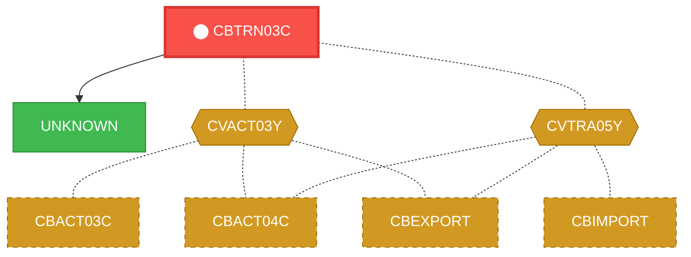

# Program: CBTRN03C


---

## Quick Reference

| Attribute | Value |
|-----------|-------|
| Program ID | `CBTRN03C` |
| Type | BATCH |
| Lines | 650 |
| Source | [CBTRN03C.cbl](../carddemo/CBTRN03C.cbl#L1) |
| Paragraphs | 26 |
| Statements | 192 |
| Impact Risk | **HIGH** — 16 programs affected |

> **View Source:** [Open CBTRN03C.cbl](../carddemo/CBTRN03C.cbl#L1)

## Source Grounding Facts

| Data Item | Literal Value |
|-----------|---------------|
| `WS-FIRST-TIME` | `Y` |
| `END-OF-FILE` | `N` |

Status conditions found in source:
- `TRANREPT-STATUS = '00'`
- `TRANFILE-STATUS = '00'`
- `CARDXREF-STATUS = '00'`
- `TRANTYPE-STATUS = '00'`
- `TRANCATG-STATUS = '00'`
- `DATEPARM-STATUS = '00'`


## Business Purpose

*Business purpose is not present in the extracted data. Run LLM enrichment to populate this section.*


## Dependency Context

> This section shows how **CBTRN03C** connects to the rest of the system — who calls it,
> what it calls, and what data it shares. If linked programs exist, they must appear here.

### Programs That Call CBTRN03C (Callers)

*No programs call CBTRN03C — this is likely a top-level entry point or CICS transaction starter.*

### Programs Called by CBTRN03C (Callees)

| Called Program | Type | Line | Why |
|----------------|------|------|-----|
| `UNKNOWN` | None | 757 |  |

### Shared Data (Copybooks & Files)

#### Shared Copybooks

| Copybook | Also Used By | # Co-Users |
|----------|-------------|------------|
| `CVACT03Y` | CBACT03C, CBACT04C, CBEXPORT, CBIMPORT, CBSTM03A (+8 more) | 13 |
| `CVTRA03Y` |  | 0 |
| `CVTRA04Y` |  | 0 |
| `CVTRA05Y` | CBACT04C, CBEXPORT, CBIMPORT, CBTRN01C, CBTRN02C (+5 more) | 10 |
| `CVTRA07Y` |  | 0 |

#### Shared Files

| File | Type | Access | Also Used By |
|------|------|--------|-------------|
| `DATE-PARMS-FILE` | SEQUENTIAL | None |  |
| `REPORT-FILE` | SEQUENTIAL | None |  |
| `TRANCATG-FILE` | VSAM | RANDOM |  |
| `TRANSACT-FILE` | SEQUENTIAL | None | CBACT04C, CBTRN01C, CBTRN02C |
| `TRANTYPE-FILE` | VSAM | RANDOM |  |
| `XREF-FILE` | VSAM | RANDOM | CBACT04C, CBSTM03B, CBTRN01C, CBTRN02C |

## Legacy Data Contracts

> These tables are derived from FILE SECTION records and COPY-expanded data declarations. They preserve the legacy field names, COBOL storage type, inferred modern type, and status-code values needed for Java DTOs, SQL schemas, API contracts, and migration mapping.

### File Record Layouts

#### `TRANSACT-FILE` / `FD-TRANFILE-REC`
| Legacy Field | Meaning | COBOL Type | Modern Type | Notes |
|--------------|---------|------------|-------------|-------|
| `FD-TRANFILE-REC` | Fd Tranfile Record | `GROUP` | `OBJECT` |  |
| `FD-TRANS-DATA` | Fd Trans Data | `PIC X(304)` | `STRING(304)` |  |
| `FD-TRAN-PROC-TS` | Fd Tran Proc Ts | `PIC X(26)` | `STRING(26)` |  |
| `FD-FILLER` | Fd Filler | `PIC X(20)` | `STRING(20)` |  |

#### `XREF-FILE` / `FD-CARDXREF-REC`
| Legacy Field | Meaning | COBOL Type | Modern Type | Notes |
|--------------|---------|------------|-------------|-------|
| `FD-CARDXREF-REC` | Fd Cardxref Record | `GROUP` | `OBJECT` |  |
| `FD-XREF-CARD-NUM` | Fd Xref Card Number | `PIC X(16)` | `STRING(16)` |  |
| `FD-XREF-DATA` | Fd Xref Data | `PIC X(34)` | `STRING(34)` |  |

#### `TRANTYPE-FILE` / `FD-TRANTYPE-REC`
| Legacy Field | Meaning | COBOL Type | Modern Type | Notes |
|--------------|---------|------------|-------------|-------|
| `FD-TRANTYPE-REC` | Fd Trantype Record | `GROUP` | `OBJECT` |  |
| `FD-TRAN-TYPE` | Fd Tran Type | `PIC X(02)` | `STRING(2)` |  |
| `FD-TRAN-DATA` | Fd Tran Data | `PIC X(58)` | `STRING(58)` |  |

#### `TRANCATG-FILE` / `FD-TRAN-CAT-RECORD`
| Legacy Field | Meaning | COBOL Type | Modern Type | Notes |
|--------------|---------|------------|-------------|-------|
| `FD-TRAN-CAT-RECORD` | Fd Tran Cat Record | `GROUP` | `OBJECT` |  |
| `FD-TRAN-CAT-KEY` | Fd Tran Cat Key | `GROUP` | `OBJECT` |  |
| `FD-TRAN-TYPE-CD` | Fd Tran Type Cd | `PIC X(02)` | `STRING(2)` |  |
| `FD-TRAN-CAT-CD` | Fd Tran Cat Cd | `PIC 9(04)` | `INTEGER` |  |
| `FD-TRAN-CAT-DATA` | Fd Tran Cat Data | `PIC X(54)` | `STRING(54)` |  |

#### `REPORT-FILE` / `FD-REPTFILE-REC`
| Legacy Field | Meaning | COBOL Type | Modern Type | Notes |
|--------------|---------|------------|-------------|-------|
| `FD-REPTFILE-REC` | Fd Reptfile Record | `PIC X(133)` | `STRING(133)` |  |

#### `DATE-PARMS-FILE` / `FD-DATEPARM-REC`
| Legacy Field | Meaning | COBOL Type | Modern Type | Notes |
|--------------|---------|------------|-------------|-------|
| `FD-DATEPARM-REC` | Fd Dateparm Record | `PIC X(80)` | `STRING(80)` |  |


### Copybook Segment Layouts

#### `CVACT03Y` as `CARD-XREF-RECORD`

| Legacy Field | Meaning | COBOL Type | Modern Type | Status / Format Notes |
|--------------|---------|------------|-------------|-----------------------|
| `CARD-XREF-RECORD` | Card Xref Record | `GROUP` | `OBJECT` |  |
| `XREF-CARD-NUM` | Xref Card Number | `PIC X(16)` | `STRING(16)` |  |
| `XREF-CUST-ID` | Xref Customer ID | `PIC 9(09)` | `INTEGER` |  |
| `XREF-ACCT-ID` | Xref Account ID | `PIC 9(11)` | `BIGINT` |  |
| `FILLER` | Filler | `PIC X(14)` | `STRING(14)` |  |

#### `CVTRA03Y` as `TRAN-TYPE-RECORD`

| Legacy Field | Meaning | COBOL Type | Modern Type | Status / Format Notes |
|--------------|---------|------------|-------------|-----------------------|
| `TRAN-TYPE-RECORD` | Tran Type Record | `GROUP` | `OBJECT` |  |
| `TRAN-TYPE` | Tran Type | `PIC X(02)` | `STRING(2)` |  |
| `TRAN-TYPE-DESC` | Tran Type Desc | `PIC X(50)` | `STRING(50)` |  |
| `FILLER` | Filler | `PIC X(08)` | `STRING(8)` |  |

#### `CVTRA04Y` as `TRAN-CAT-RECORD`

| Legacy Field | Meaning | COBOL Type | Modern Type | Status / Format Notes |
|--------------|---------|------------|-------------|-----------------------|
| `TRAN-CAT-RECORD` | Tran Cat Record | `GROUP` | `OBJECT` |  |
| `TRAN-CAT-KEY` | Tran Cat Key | `GROUP` | `OBJECT` |  |
| `TRAN-TYPE-CD` | Tran Type Cd | `PIC X(02)` | `STRING(2)` |  |
| `TRAN-CAT-CD` | Tran Cat Cd | `PIC 9(04)` | `INTEGER` |  |
| `TRAN-CAT-TYPE-DESC` | Tran Cat Type Desc | `PIC X(50)` | `STRING(50)` |  |
| `FILLER` | Filler | `PIC X(04)` | `STRING(4)` |  |

#### `CVTRA05Y` as `TRAN-RECORD`

| Legacy Field | Meaning | COBOL Type | Modern Type | Status / Format Notes |
|--------------|---------|------------|-------------|-----------------------|
| `TRAN-RECORD` | Tran Record | `GROUP` | `OBJECT` |  |
| `TRAN-ID` | Tran ID | `PIC X(16)` | `STRING(16)` |  |
| `TRAN-TYPE-CD` | Tran Type Cd | `PIC X(02)` | `STRING(2)` |  |
| `TRAN-CAT-CD` | Tran Cat Cd | `PIC 9(04)` | `INTEGER` |  |
| `TRAN-SOURCE` | Tran Source | `PIC X(10)` | `STRING(10)` |  |
| `TRAN-DESC` | Tran Desc | `PIC X(100)` | `STRING(100)` |  |
| `TRAN-AMT` | Tran Amount | `PIC S9(09)V99` | `DECIMAL(11,2)` |  |
| `TRAN-MERCHANT-ID` | Tran Merchant ID | `PIC 9(09)` | `INTEGER` |  |
| `TRAN-MERCHANT-NAME` | Tran Merchant Name | `PIC X(50)` | `STRING(50)` |  |
| `TRAN-MERCHANT-CITY` | Tran Merchant City | `PIC X(50)` | `STRING(50)` |  |
| `TRAN-MERCHANT-ZIP` | Tran Merchant Zip | `PIC X(10)` | `STRING(10)` |  |
| `TRAN-CARD-NUM` | Tran Card Number | `PIC X(16)` | `STRING(16)` |  |
| `TRAN-ORIG-TS` | Tran Orig Ts | `PIC X(26)` | `STRING(26)` |  |
| `TRAN-PROC-TS` | Tran Proc Ts | `PIC X(26)` | `STRING(26)` |  |
| `FILLER` | Filler | `PIC X(20)` | `STRING(20)` |  |

#### `CVTRA07Y` as `REPORT-NAME-HEADER`

| Legacy Field | Meaning | COBOL Type | Modern Type | Status / Format Notes |
|--------------|---------|------------|-------------|-----------------------|
| `REPORT-NAME-HEADER` | Report Name Header | `GROUP` | `OBJECT` |  |
| `REPT-SHORT-NAME` | Rept Short Name | `PIC X(38)` | `STRING(38)` |  |
| `REPT-LONG-NAME` | Rept Long Name | `PIC X(41)` | `STRING(41)` |  |
| `REPT-DATE-HEADER` | Rept Date Header | `PIC X(12)` | `STRING(12)` |  |
| `REPT-START-DATE` | Rept Start Date | `PIC X(10)` | `STRING(10)` | Date-like field; verify YYDDD, YYMMDD, or ISO format before migration. |
| `FILLER` | Filler | `PIC X(04)` | `STRING(4)` |  |
| `REPT-END-DATE` | Rept End Date | `PIC X(10)` | `STRING(10)` | Date-like field; verify YYDDD, YYMMDD, or ISO format before migration. |
| `TRANSACTION-DETAIL-REPORT` | Transaction Detail Report | `GROUP` | `OBJECT` |  |
| `TRAN-REPORT-TRANS-ID` | Tran Report Trans ID | `PIC X(16)` | `STRING(16)` |  |
| `FILLER` | Filler | `PIC X(01)` | `STRING(1)` |  |
| `TRAN-REPORT-ACCOUNT-ID` | Tran Report Account ID | `PIC X(11)` | `STRING(11)` |  |
| `FILLER` | Filler | `PIC X(01)` | `STRING(1)` |  |
| `TRAN-REPORT-TYPE-CD` | Tran Report Type Cd | `PIC X(02)` | `STRING(2)` |  |
| `FILLER` | Filler | `PIC X(01)` | `STRING(1)` |  |
| `TRAN-REPORT-TYPE-DESC` | Tran Report Type Desc | `PIC X(15)` | `STRING(15)` |  |
| `FILLER` | Filler | `PIC X(01)` | `STRING(1)` |  |
| `TRAN-REPORT-CAT-CD` | Tran Report Cat Cd | `PIC 9(04)` | `INTEGER` |  |
| `FILLER` | Filler | `PIC X(01)` | `STRING(1)` |  |
| `TRAN-REPORT-CAT-DESC` | Tran Report Cat Desc | `PIC X(29)` | `STRING(29)` |  |
| `FILLER` | Filler | `PIC X(01)` | `STRING(1)` |  |
| `TRAN-REPORT-SOURCE` | Tran Report Source | `PIC X(10)` | `STRING(10)` |  |
| `FILLER` | Filler | `PIC X(04)` | `STRING(4)` |  |
| `TRAN-REPORT-AMT` | Tran Report Amount | `PIC -ZZZ,ZZZ,ZZZ` | `INTEGER` |  |
| `FILLER` | Filler | `PIC X(02)` | `STRING(2)` |  |
| `TRANSACTION-HEADER-1` | Transaction Header 1 | `GROUP` | `OBJECT` |  |
| `FILLER` | Filler | `PIC X(17)` | `STRING(17)` |  |
| `FILLER` | Filler | `PIC X(12)` | `STRING(12)` |  |
| `FILLER` | Filler | `PIC X(19)` | `STRING(19)` |  |
| `FILLER` | Filler | `PIC X(35)` | `STRING(35)` |  |
| `FILLER` | Filler | `PIC X(14)` | `STRING(14)` |  |
| `FILLER` | Filler | `PIC X` | `STRING(1)` |  |
| `FILLER` | Filler | `PIC X(16)` | `STRING(16)` |  |
| `TRANSACTION-HEADER-2` | Transaction Header 2 | `PIC X(133)` | `STRING(133)` |  |
| `REPORT-PAGE-TOTALS` | Report Page Totals | `GROUP` | `OBJECT` |  |
| `FILLER` | Filler | `PIC X(11)` | `STRING(11)` |  |
| `FILLER` | Filler | `PIC X(86)` | `STRING(86)` |  |
| `REPT-PAGE-TOTAL` | Rept Page Total | `PIC +ZZZ,ZZZ,ZZZ` | `INTEGER` |  |
| `REPORT-ACCOUNT-TOTALS` | Report Account Totals | `GROUP` | `OBJECT` |  |
| `FILLER` | Filler | `PIC X(13)` | `STRING(13)` |  |
| `FILLER` | Filler | `PIC X(84)` | `STRING(84)` |  |
| `REPT-ACCOUNT-TOTAL` | Rept Account Total | `PIC +ZZZ,ZZZ,ZZZ` | `INTEGER` |  |
| `REPORT-GRAND-TOTALS` | Report Grand Totals | `GROUP` | `OBJECT` |  |
| `FILLER` | Filler | `PIC X(11)` | `STRING(11)` |  |
| `FILLER` | Filler | `PIC X(86)` | `STRING(86)` |  |
| `REPT-GRAND-TOTAL` | Rept Grand Total | `PIC +ZZZ,ZZZ,ZZZ` | `INTEGER` |  |


### Data Movement And Key Mapping

| Line | Source | Target | Meaning |
|------|--------|--------|---------|
| 189 | `TRAN-TYPE-CD OF TRAN-RECORD` | `FD-TRAN-TYPE` | TRAN-TYPE-CD OF TRAN-RECORD populates FD-TRAN-TYPE |
| 236 | `'Y'` | `END-OF-FILE` | 'Y' populates END-OF-FILE |
| 239 | `DATEPARM-STATUS` | `IO-STATUS` | DATEPARM-STATUS populates IO-STATUS |
| 264 | `'Y'` | `END-OF-FILE` | 'Y' populates END-OF-FILE |
| 267 | `TRANFILE-STATUS` | `IO-STATUS` | TRANFILE-STATUS populates IO-STATUS |
| 277 | `WS-START-DATE` | `REPT-START-DATE` | WS-START-DATE populates REPT-START-DATE |
| 278 | `WS-END-DATE` | `REPT-END-DATE` | WS-END-DATE populates REPT-END-DATE |
| 295 | `REPORT-PAGE-TOTALS` | `FD-REPTFILE-REC` | REPORT-PAGE-TOTALS populates FD-REPTFILE-REC |
| 300 | `TRANSACTION-HEADER-2` | `FD-REPTFILE-REC` | TRANSACTION-HEADER-2 populates FD-REPTFILE-REC |
| 308 | `REPORT-ACCOUNT-TOTALS` | `FD-REPTFILE-REC` | REPORT-ACCOUNT-TOTALS populates FD-REPTFILE-REC |
| 312 | `TRANSACTION-HEADER-2` | `FD-REPTFILE-REC` | TRANSACTION-HEADER-2 populates FD-REPTFILE-REC |
| 320 | `REPORT-GRAND-TOTALS` | `FD-REPTFILE-REC` | REPORT-GRAND-TOTALS populates FD-REPTFILE-REC |
| 325 | `REPORT-NAME-HEADER` | `FD-REPTFILE-REC` | REPORT-NAME-HEADER populates FD-REPTFILE-REC |
| 329 | `WS-BLANK-LINE` | `FD-REPTFILE-REC` | WS-BLANK-LINE populates FD-REPTFILE-REC |
| 333 | `TRANSACTION-HEADER-1` | `FD-REPTFILE-REC` | TRANSACTION-HEADER-1 populates FD-REPTFILE-REC |
| 337 | `TRANSACTION-HEADER-2` | `FD-REPTFILE-REC` | TRANSACTION-HEADER-2 populates FD-REPTFILE-REC |
| 355 | `TRANREPT-STATUS` | `IO-STATUS` | TRANREPT-STATUS populates IO-STATUS |
| 364 | `XREF-ACCT-ID` | `TRAN-REPORT-ACCOUNT-ID` | XREF-ACCT-ID populates TRAN-REPORT-ACCOUNT-ID |
| 365 | `TRAN-TYPE-CD OF TRAN-RECORD` | `TRAN-REPORT-TYPE-CD` | TRAN-TYPE-CD OF TRAN-RECORD populates TRAN-REPORT-TYPE-CD |
| 367 | `TRAN-CAT-CD OF TRAN-RECORD` | `TRAN-REPORT-CAT-CD` | TRAN-CAT-CD OF TRAN-RECORD populates TRAN-REPORT-CAT-CD |
| 370 | `TRAN-AMT` | `TRAN-REPORT-AMT` | TRAN-AMT populates TRAN-REPORT-AMT |
| 371 | `TRANSACTION-DETAIL-REPORT` | `FD-REPTFILE-REC` | TRANSACTION-DETAIL-REPORT populates FD-REPTFILE-REC |
| 388 | `TRANFILE-STATUS` | `IO-STATUS` | TRANFILE-STATUS populates IO-STATUS |
| 406 | `TRANREPT-STATUS` | `IO-STATUS` | TRANREPT-STATUS populates IO-STATUS |
| 424 | `CARDXREF-STATUS` | `IO-STATUS` | CARDXREF-STATUS populates IO-STATUS |
| 442 | `TRANTYPE-STATUS` | `IO-STATUS` | TRANTYPE-STATUS populates IO-STATUS |
| 460 | `TRANCATG-STATUS` | `IO-STATUS` | TRANCATG-STATUS populates IO-STATUS |
| 478 | `DATEPARM-STATUS` | `IO-STATUS` | DATEPARM-STATUS populates IO-STATUS |
| 488 | `23` | `IO-STATUS` | 23 populates IO-STATUS |
| 498 | `23` | `IO-STATUS` | 23 populates IO-STATUS |


---

## Dependency Graph



> **Legend:** 🔴 Target program · 🔵 Direct callers · 🟢 Direct callees · 🟡 Copybook-coupled · ⚫ Transitive (indirect)

---

## Impact Ripple View

> **If you change CBTRN03C, what else could break?**

| Impact Metric | Count |
|--------------|-------|
| Direct Callers | 0 |
| Transitive Callers (callers of callers) | 0 |
| Direct Callees | 0 |
| Transitive Callees | 0 |
| Copybook-Coupled Programs | 16 |
| **Total Impact** | **16** |
| **Risk Rating** | **HIGH** |


**Programs affected via shared copybooks:**
- `CBACT03C`
- `CBACT04C`
- `CBEXPORT`
- `CBIMPORT`
- `CBSTM03A`
- `CBTRN01C`
- `CBTRN02C`
- `COACTUPC`
- `COACTVWC`
- `COBIL00C`
- `COPAUA0C`
- `COPAUS0C`
- `CORPT00C`
- `COTRN00C`
- `COTRN01C`
- `COTRN02C`

---

## Statement Profile

| Statement Type | Count |
|---------------|-------|
| IF | 68 |
| MOVE | 35 |
| EXIT | 24 |
| ARITHMETIC | 13 |
| OPEN | 12 |
| CLOSE | 12 |
| PERFORM | 11 |
| READ | 10 |
| WRITE | 2 |
| EVALUATE | 2 |
| INITIALIZE | 1 |
| DISPLAY | 1 |
| CALL | 1 |

## Control Flow

```mermaid
flowchart TD
    START([Program Entry])
    0550_DATEPARM_READ["0550-DATEPARM-READ"]
    1000_TRANFILE_GET_NEXT["1000-TRANFILE-GET-NEXT"]
    1100_WRITE_TRANSACTION_REPORT["1100-WRITE-TRANSACTION-REPORT"]
    1110_WRITE_PAGE_TOTALS["1110-WRITE-PAGE-TOTALS"]
    1120_WRITE_ACCOUNT_TOTALS["1120-WRITE-ACCOUNT-TOTALS"]
    1110_WRITE_GRAND_TOTALS["1110-WRITE-GRAND-TOTALS"]
    1120_WRITE_HEADERS["1120-WRITE-HEADERS"]
    1111_WRITE_REPORT_REC["1111-WRITE-REPORT-REC"]
    1120_WRITE_DETAIL["1120-WRITE-DETAIL"]
    0000_TRANFILE_OPEN["0000-TRANFILE-OPEN"]
    0100_REPTFILE_OPEN["0100-REPTFILE-OPEN"]
    0200_CARDXREF_OPEN["0200-CARDXREF-OPEN"]
    0300_TRANTYPE_OPEN["0300-TRANTYPE-OPEN"]
    0400_TRANCATG_OPEN["0400-TRANCATG-OPEN"]
    0500_DATEPARM_OPEN["0500-DATEPARM-OPEN"]
    START --> 0550_DATEPARM_READ
    0200_CARDXREF_OPEN --> INLINE
    0300_TRANTYPE_OPEN --> INLINE
    0400_TRANCATG_OPEN --> INLINE
    1500_B_LOOKUP_TRANTYPE --> INLINE
```



## Paragraphs

### 0550-DATEPARM-READ

| | |
|---|---|
| **Paragraph** | `0550-DATEPARM-READ` |
| **Lines** | 220 - 247 |
| **View Code** | [Jump to Line 220](../carddemo/CBTRN03C.cbl#L220) |


### 1000-TRANFILE-GET-NEXT

| | |
|---|---|
| **Paragraph** | `1000-TRANFILE-GET-NEXT` |
| **Lines** | 248 - 273 |
| **View Code** | [Jump to Line 248](../carddemo/CBTRN03C.cbl#L248) |


### 1100-WRITE-TRANSACTION-REPORT

| | |
|---|---|
| **Paragraph** | `1100-WRITE-TRANSACTION-REPORT` |
| **Lines** | 274 - 292 |
| **View Code** | [Jump to Line 274](../carddemo/CBTRN03C.cbl#L274) |


### 1110-WRITE-PAGE-TOTALS

| | |
|---|---|
| **Paragraph** | `1110-WRITE-PAGE-TOTALS` |
| **Lines** | 293 - 305 |
| **View Code** | [Jump to Line 293](../carddemo/CBTRN03C.cbl#L293) |


### 1120-WRITE-ACCOUNT-TOTALS

| | |
|---|---|
| **Paragraph** | `1120-WRITE-ACCOUNT-TOTALS` |
| **Lines** | 306 - 317 |
| **View Code** | [Jump to Line 306](../carddemo/CBTRN03C.cbl#L306) |


### 1110-WRITE-GRAND-TOTALS

| | |
|---|---|
| **Paragraph** | `1110-WRITE-GRAND-TOTALS` |
| **Lines** | 318 - 323 |
| **View Code** | [Jump to Line 318](../carddemo/CBTRN03C.cbl#L318) |


### 1120-WRITE-HEADERS

| | |
|---|---|
| **Paragraph** | `1120-WRITE-HEADERS` |
| **Lines** | 324 - 342 |
| **View Code** | [Jump to Line 324](../carddemo/CBTRN03C.cbl#L324) |


### 1111-WRITE-REPORT-REC

| | |
|---|---|
| **Paragraph** | `1111-WRITE-REPORT-REC` |
| **Lines** | 343 - 360 |
| **View Code** | [Jump to Line 343](../carddemo/CBTRN03C.cbl#L343) |


### 1120-WRITE-DETAIL

| | |
|---|---|
| **Paragraph** | `1120-WRITE-DETAIL` |
| **Lines** | 361 - 375 |
| **View Code** | [Jump to Line 361](../carddemo/CBTRN03C.cbl#L361) |


### 0000-TRANFILE-OPEN

| | |
|---|---|
| **Paragraph** | `0000-TRANFILE-OPEN` |
| **Lines** | 376 - 393 |
| **View Code** | [Jump to Line 376](../carddemo/CBTRN03C.cbl#L376) |


### 0100-REPTFILE-OPEN

| | |
|---|---|
| **Paragraph** | `0100-REPTFILE-OPEN` |
| **Lines** | 394 - 411 |
| **View Code** | [Jump to Line 394](../carddemo/CBTRN03C.cbl#L394) |


### 0200-CARDXREF-OPEN

| | |
|---|---|
| **Paragraph** | `0200-CARDXREF-OPEN` |
| **Lines** | 412 - 429 |
| **View Code** | [Jump to Line 412](../carddemo/CBTRN03C.cbl#L412) |


### 0300-TRANTYPE-OPEN

| | |
|---|---|
| **Paragraph** | `0300-TRANTYPE-OPEN` |
| **Lines** | 430 - 447 |
| **View Code** | [Jump to Line 430](../carddemo/CBTRN03C.cbl#L430) |


### 0400-TRANCATG-OPEN

| | |
|---|---|
| **Paragraph** | `0400-TRANCATG-OPEN` |
| **Lines** | 448 - 465 |
| **View Code** | [Jump to Line 448](../carddemo/CBTRN03C.cbl#L448) |


### 0500-DATEPARM-OPEN

| | |
|---|---|
| **Paragraph** | `0500-DATEPARM-OPEN` |
| **Lines** | 466 - 483 |
| **View Code** | [Jump to Line 466](../carddemo/CBTRN03C.cbl#L466) |


### 1500-A-LOOKUP-XREF

| | |
|---|---|
| **Paragraph** | `1500-A-LOOKUP-XREF` |
| **Lines** | 484 - 493 |
| **View Code** | [Jump to Line 484](../carddemo/CBTRN03C.cbl#L484) |


### 1500-B-LOOKUP-TRANTYPE

| | |
|---|---|
| **Paragraph** | `1500-B-LOOKUP-TRANTYPE` |
| **Lines** | 494 - 503 |
| **View Code** | [Jump to Line 494](../carddemo/CBTRN03C.cbl#L494) |


### 1500-C-LOOKUP-TRANCATG

| | |
|---|---|
| **Paragraph** | `1500-C-LOOKUP-TRANCATG` |
| **Lines** | 504 - 513 |
| **View Code** | [Jump to Line 504](../carddemo/CBTRN03C.cbl#L504) |


### 9000-TRANFILE-CLOSE

| | |
|---|---|
| **Paragraph** | `9000-TRANFILE-CLOSE` |
| **Lines** | 514 - 531 |
| **View Code** | [Jump to Line 514](../carddemo/CBTRN03C.cbl#L514) |


### 9100-REPTFILE-CLOSE

| | |
|---|---|
| **Paragraph** | `9100-REPTFILE-CLOSE` |
| **Lines** | 532 - 550 |
| **View Code** | [Jump to Line 532](../carddemo/CBTRN03C.cbl#L532) |


### 9200-CARDXREF-CLOSE

| | |
|---|---|
| **Paragraph** | `9200-CARDXREF-CLOSE` |
| **Lines** | 551 - 568 |
| **View Code** | [Jump to Line 551](../carddemo/CBTRN03C.cbl#L551) |


### 9300-TRANTYPE-CLOSE

| | |
|---|---|
| **Paragraph** | `9300-TRANTYPE-CLOSE` |
| **Lines** | 569 - 586 |
| **View Code** | [Jump to Line 569](../carddemo/CBTRN03C.cbl#L569) |


### 9400-TRANCATG-CLOSE

| | |
|---|---|
| **Paragraph** | `9400-TRANCATG-CLOSE` |
| **Lines** | 587 - 604 |
| **View Code** | [Jump to Line 587](../carddemo/CBTRN03C.cbl#L587) |


### 9500-DATEPARM-CLOSE

| | |
|---|---|
| **Paragraph** | `9500-DATEPARM-CLOSE` |
| **Lines** | 605 - 625 |
| **View Code** | [Jump to Line 605](../carddemo/CBTRN03C.cbl#L605) |


### 9999-ABEND-PROGRAM

| | |
|---|---|
| **Paragraph** | `9999-ABEND-PROGRAM` |
| **Lines** | 626 - 632 |
| **View Code** | [Jump to Line 626](../carddemo/CBTRN03C.cbl#L626) |


### 9910-DISPLAY-IO-STATUS

| | |
|---|---|
| **Paragraph** | `9910-DISPLAY-IO-STATUS` |
| **Lines** | 633 - 649 |
| **View Code** | [Jump to Line 633](../carddemo/CBTRN03C.cbl#L633) |


## Executed by JCL Jobs

This program is run by the following batch JCL jobs:

| Job Name | Step | Step Comments |
|----------|------|---------------|
| [TRANREPT](../jcl/TRANREPT.md) | `STEP10R` | *******************************************************************
Produce a fo... |


## Copybook Field Dictionaries

The following copybooks are included by this program. Each entry shows the actual fields
extracted from the copybook source file (`.cpy`).

### Copybook `CVACT03Y`

| Level | Field | PIC | USAGE | Parent | Notes |
|-------|-------|-----|-------|--------|-------|
| `01` | `CARD-XREF-RECORD` | `None` | None | None |  |
| `05` | `XREF-CARD-NUM` | `X(16)` | None | CARD-XREF-RECORD |  |
| `05` | `XREF-CUST-ID` | `9(09)` | None | CARD-XREF-RECORD |  |
| `05` | `XREF-ACCT-ID` | `9(11)` | None | CARD-XREF-RECORD |  |

### Copybook `CVTRA03Y`

| Level | Field | PIC | USAGE | Parent | Notes |
|-------|-------|-----|-------|--------|-------|
| `01` | `TRAN-TYPE-RECORD` | `None` | None | None |  |
| `05` | `TRAN-TYPE` | `X(02)` | None | TRAN-TYPE-RECORD |  |
| `05` | `TRAN-TYPE-DESC` | `X(50)` | None | TRAN-TYPE-RECORD |  |

### Copybook `CVTRA04Y`

| Level | Field | PIC | USAGE | Parent | Notes |
|-------|-------|-----|-------|--------|-------|
| `01` | `TRAN-CAT-RECORD` | `None` | None | None |  |
| `05` | `TRAN-CAT-KEY` | `None` | None | TRAN-CAT-RECORD |  |
| `10` | `TRAN-TYPE-CD` | `X(02)` | None | TRAN-CAT-KEY |  |
| `10` | `TRAN-CAT-CD` | `9(04)` | None | TRAN-CAT-KEY |  |
| `05` | `TRAN-CAT-TYPE-DESC` | `X(50)` | None | TRAN-CAT-RECORD |  |

### Copybook `CVTRA05Y`

| Level | Field | PIC | USAGE | Parent | Notes |
|-------|-------|-----|-------|--------|-------|
| `01` | `TRAN-RECORD` | `None` | None | None |  |
| `05` | `TRAN-ID` | `X(16)` | None | TRAN-RECORD |  |
| `05` | `TRAN-TYPE-CD` | `X(02)` | None | TRAN-RECORD |  |
| `05` | `TRAN-CAT-CD` | `9(04)` | None | TRAN-RECORD |  |
| `05` | `TRAN-SOURCE` | `X(10)` | None | TRAN-RECORD |  |
| `05` | `TRAN-DESC` | `X(100)` | None | TRAN-RECORD |  |
| `05` | `TRAN-AMT` | `S9(09)V99` | None | TRAN-RECORD |  |
| `05` | `TRAN-MERCHANT-ID` | `9(09)` | None | TRAN-RECORD |  |
| `05` | `TRAN-MERCHANT-NAME` | `X(50)` | None | TRAN-RECORD |  |
| `05` | `TRAN-MERCHANT-CITY` | `X(50)` | None | TRAN-RECORD |  |
| `05` | `TRAN-MERCHANT-ZIP` | `X(10)` | None | TRAN-RECORD |  |
| `05` | `TRAN-CARD-NUM` | `X(16)` | None | TRAN-RECORD |  |
| `05` | `TRAN-ORIG-TS` | `X(26)` | None | TRAN-RECORD |  |
| `05` | `TRAN-PROC-TS` | `X(26)` | None | TRAN-RECORD |  |

### Copybook `CVTRA07Y`

| Level | Field | PIC | USAGE | Parent | Notes |
|-------|-------|-----|-------|--------|-------|
| `01` | `REPORT-NAME-HEADER` | `None` | None | None |  |
| `05` | `REPT-SHORT-NAME` | `X(38)` | None | REPORT-NAME-HEADER |  |
| `05` | `REPT-LONG-NAME` | `X(41)` | None | REPORT-NAME-HEADER |  |
| `05` | `REPT-DATE-HEADER` | `X(12)` | None | REPORT-NAME-HEADER |  |
| `05` | `REPT-START-DATE` | `X(10)` | None | REPORT-NAME-HEADER |  |
| `05` | `REPT-END-DATE` | `X(10)` | None | REPORT-NAME-HEADER |  |
| `01` | `TRANSACTION-DETAIL-REPORT` | `None` | None | None |  |
| `05` | `TRAN-REPORT-TRANS-ID` | `X(16)` | None | TRANSACTION-DETAIL-REPORT |  |
| `05` | `TRAN-REPORT-ACCOUNT-ID` | `X(11)` | None | TRANSACTION-DETAIL-REPORT |  |
| `05` | `TRAN-REPORT-TYPE-CD` | `X(02)` | None | TRANSACTION-DETAIL-REPORT |  |
| `05` | `TRAN-REPORT-TYPE-DESC` | `X(15)` | None | TRANSACTION-DETAIL-REPORT |  |
| `05` | `TRAN-REPORT-CAT-CD` | `9(04)` | None | TRANSACTION-DETAIL-REPORT |  |
| `05` | `TRAN-REPORT-CAT-DESC` | `X(29)` | None | TRANSACTION-DETAIL-REPORT |  |
| `05` | `TRAN-REPORT-SOURCE` | `X(10)` | None | TRANSACTION-DETAIL-REPORT |  |
| `05` | `TRAN-REPORT-AMT` | `-ZZZ,ZZZ,ZZZ` | None | TRANSACTION-DETAIL-REPORT |  |
| `01` | `TRANSACTION-HEADER-1` | `None` | None | None |  |
| `01` | `TRANSACTION-HEADER-2` | `X(133)` | None | None |  |
| `01` | `REPORT-PAGE-TOTALS` | `None` | None | None |  |
| `01` | `REPORT-ACCOUNT-TOTALS` | `None` | None | None |  |
| `05` | `REPT-PAGE-TOTAL` | `+ZZZ,ZZZ,ZZZ` | None | REPORT-PAGE-TOTALS |  |
| `01` | `REPORT-GRAND-TOTALS` | `None` | None | None |  |
| `05` | `REPT-ACCOUNT-TOTAL` | `+ZZZ,ZZZ,ZZZ` | None | REPORT-ACCOUNT-TOTALS |  |
| `05` | `REPT-GRAND-TOTAL` | `+ZZZ,ZZZ,ZZZ` | None | REPORT-GRAND-TOTALS |  |


## File Record Layouts (FD)

This program declares the following file records (data contracts for I/O):

### `FD DATE-PARMS-FILE` (record `FD-DATEPARM-REC`)

| Level | Field | PIC | USAGE | Parent |
|-------|-------|-----|-------|--------|
| `01` | `FD-DATEPARM-REC` | `X(80)` | None | None |

### `FD REPORT-FILE` (record `FD-REPTFILE-REC`)

| Level | Field | PIC | USAGE | Parent |
|-------|-------|-----|-------|--------|
| `01` | `FD-REPTFILE-REC` | `X(133)` | None | None |

### `FD TRANCATG-FILE` (record `FD-TRAN-CAT-RECORD`)

| Level | Field | PIC | USAGE | Parent |
|-------|-------|-----|-------|--------|
| `01` | `FD-TRAN-CAT-RECORD` | `None` | None | None |
| `05` | `FD-TRAN-CAT-KEY` | `None` | None | FD-TRAN-CAT-RECORD |
| `10` | `FD-TRAN-TYPE-CD` | `X(02)` | None | FD-TRAN-CAT-KEY |
| `10` | `FD-TRAN-CAT-CD` | `9(04)` | None | FD-TRAN-CAT-KEY |
| `05` | `FD-TRAN-CAT-DATA` | `X(54)` | None | FD-TRAN-CAT-RECORD |

### `FD TRANSACT-FILE` (record `FD-TRANFILE-REC`)

| Level | Field | PIC | USAGE | Parent |
|-------|-------|-----|-------|--------|
| `01` | `FD-TRANFILE-REC` | `None` | None | None |
| `05` | `FD-TRANS-DATA` | `X(304)` | None | FD-TRANFILE-REC |
| `05` | `FD-TRAN-PROC-TS` | `X(26)` | None | FD-TRANFILE-REC |
| `05` | `FD-FILLER` | `X(20)` | None | FD-TRANFILE-REC |

### `FD TRANTYPE-FILE` (record `FD-TRANTYPE-REC`)

| Level | Field | PIC | USAGE | Parent |
|-------|-------|-----|-------|--------|
| `01` | `FD-TRANTYPE-REC` | `None` | None | None |
| `05` | `FD-TRAN-TYPE` | `X(02)` | None | FD-TRANTYPE-REC |
| `05` | `FD-TRAN-DATA` | `X(58)` | None | FD-TRANTYPE-REC |

### `FD XREF-FILE` (record `FD-CARDXREF-REC`)

| Level | Field | PIC | USAGE | Parent |
|-------|-------|-----|-------|--------|
| `01` | `FD-CARDXREF-REC` | `None` | None | None |
| `05` | `FD-XREF-CARD-NUM` | `X(16)` | None | FD-CARDXREF-REC |
| `05` | `FD-XREF-DATA` | `X(34)` | None | FD-CARDXREF-REC |


## Data Lineage (MOVE Flow)

The following MOVE statements were extracted from the source. Each row is a `source → destination`
flow that the migration team can use to trace how data is reshaped and routed.

| Source | Destination | Paragraph | Line |
|--------|-------------|-----------|------|
| `TRAN-CARD-NUM` | `WS-CURR-CARD-NUM` | None | 185 |
| `TRAN-CARD-NUM` | `FD-XREF-CARD-NUM` | None | 186 |
| `'0'` | `APPL-RESULT` | 0550-DATEPARM-READ | 224 |
| `'16'` | `APPL-RESULT` | 0550-DATEPARM-READ | 226 |
| `'12'` | `APPL-RESULT` | 0550-DATEPARM-READ | 228 |
| `'Y'` | `END-OF-FILE` | 0550-DATEPARM-READ | 236 |
| `DATEPARM-STATUS` | `IO-STATUS` | 0550-DATEPARM-READ | 239 |
| `'0'` | `APPL-RESULT` | 1000-TRANFILE-GET-NEXT | 253 |
| `'16'` | `APPL-RESULT` | 1000-TRANFILE-GET-NEXT | 255 |
| `'12'` | `APPL-RESULT` | 1000-TRANFILE-GET-NEXT | 257 |
| `'Y'` | `END-OF-FILE` | 1000-TRANFILE-GET-NEXT | 264 |
| `TRANFILE-STATUS` | `IO-STATUS` | 1000-TRANFILE-GET-NEXT | 267 |
| `'N'` | `WS-FIRST-TIME` | 1100-WRITE-TRANSACTION-REPORT | 276 |
| `WS-START-DATE` | `REPT-START-DATE` | 1100-WRITE-TRANSACTION-REPORT | 277 |
| `WS-END-DATE` | `REPT-END-DATE` | 1100-WRITE-TRANSACTION-REPORT | 278 |
| `WS-PAGE-TOTAL` | `REPT-PAGE-TOTAL` | 1110-WRITE-PAGE-TOTALS | 294 |
| `REPORT-PAGE-TOTALS` | `FD-REPTFILE-REC` | 1110-WRITE-PAGE-TOTALS | 295 |
| `'0'` | `WS-PAGE-TOTAL` | 1110-WRITE-PAGE-TOTALS | 298 |
| `TRANSACTION-HEADER-2` | `FD-REPTFILE-REC` | 1110-WRITE-PAGE-TOTALS | 300 |
| `WS-ACCOUNT-TOTAL` | `REPT-ACCOUNT-TOTAL` | 1120-WRITE-ACCOUNT-TOTALS | 307 |
| `REPORT-ACCOUNT-TOTALS` | `FD-REPTFILE-REC` | 1120-WRITE-ACCOUNT-TOTALS | 308 |
| `'0'` | `WS-ACCOUNT-TOTAL` | 1120-WRITE-ACCOUNT-TOTALS | 310 |
| `TRANSACTION-HEADER-2` | `FD-REPTFILE-REC` | 1120-WRITE-ACCOUNT-TOTALS | 312 |
| `WS-GRAND-TOTAL` | `REPT-GRAND-TOTAL` | 1110-WRITE-GRAND-TOTALS | 319 |
| `REPORT-GRAND-TOTALS` | `FD-REPTFILE-REC` | 1110-WRITE-GRAND-TOTALS | 320 |
| `REPORT-NAME-HEADER` | `FD-REPTFILE-REC` | 1120-WRITE-HEADERS | 325 |
| `WS-BLANK-LINE` | `FD-REPTFILE-REC` | 1120-WRITE-HEADERS | 329 |
| `TRANSACTION-HEADER-1` | `FD-REPTFILE-REC` | 1120-WRITE-HEADERS | 333 |
| `TRANSACTION-HEADER-2` | `FD-REPTFILE-REC` | 1120-WRITE-HEADERS | 337 |
| `'0'` | `APPL-RESULT` | 1111-WRITE-REPORT-REC | 347 |
| `'12'` | `APPL-RESULT` | 1111-WRITE-REPORT-REC | 349 |
| `TRANREPT-STATUS` | `IO-STATUS` | 1111-WRITE-REPORT-REC | 355 |
| `TRAN-ID` | `TRAN-REPORT-TRANS-ID` | 1120-WRITE-DETAIL | 363 |
| `XREF-ACCT-ID` | `TRAN-REPORT-ACCOUNT-ID` | 1120-WRITE-DETAIL | 364 |
| `TRAN-TYPE-DESC` | `TRAN-REPORT-TYPE-DESC` | 1120-WRITE-DETAIL | 366 |
| `TRAN-CAT-TYPE-DESC` | `TRAN-REPORT-CAT-DESC` | 1120-WRITE-DETAIL | 368 |
| `TRAN-SOURCE` | `TRAN-REPORT-SOURCE` | 1120-WRITE-DETAIL | 369 |
| `TRAN-AMT` | `TRAN-REPORT-AMT` | 1120-WRITE-DETAIL | 370 |
| `TRANSACTION-DETAIL-REPORT` | `FD-REPTFILE-REC` | 1120-WRITE-DETAIL | 371 |
| `'8'` | `APPL-RESULT` | 0000-TRANFILE-OPEN | 377 |
| `'0'` | `APPL-RESULT` | 0000-TRANFILE-OPEN | 380 |
| `'12'` | `APPL-RESULT` | 0000-TRANFILE-OPEN | 382 |
| `TRANFILE-STATUS` | `IO-STATUS` | 0000-TRANFILE-OPEN | 388 |
| `'8'` | `APPL-RESULT` | 0100-REPTFILE-OPEN | 395 |
| `'0'` | `APPL-RESULT` | 0100-REPTFILE-OPEN | 398 |
| `'12'` | `APPL-RESULT` | 0100-REPTFILE-OPEN | 400 |
| `TRANREPT-STATUS` | `IO-STATUS` | 0100-REPTFILE-OPEN | 406 |
| `'8'` | `APPL-RESULT` | 0200-CARDXREF-OPEN | 413 |
| `'0'` | `APPL-RESULT` | 0200-CARDXREF-OPEN | 416 |
| `'12'` | `APPL-RESULT` | 0200-CARDXREF-OPEN | 418 |
| `CARDXREF-STATUS` | `IO-STATUS` | 0200-CARDXREF-OPEN | 424 |
| `'8'` | `APPL-RESULT` | 0300-TRANTYPE-OPEN | 431 |
| `'0'` | `APPL-RESULT` | 0300-TRANTYPE-OPEN | 434 |
| `'12'` | `APPL-RESULT` | 0300-TRANTYPE-OPEN | 436 |
| `TRANTYPE-STATUS` | `IO-STATUS` | 0300-TRANTYPE-OPEN | 442 |
| `'8'` | `APPL-RESULT` | 0400-TRANCATG-OPEN | 449 |
| `'0'` | `APPL-RESULT` | 0400-TRANCATG-OPEN | 452 |
| `'12'` | `APPL-RESULT` | 0400-TRANCATG-OPEN | 454 |
| `TRANCATG-STATUS` | `IO-STATUS` | 0400-TRANCATG-OPEN | 460 |
| `'8'` | `APPL-RESULT` | 0500-DATEPARM-OPEN | 467 |
*+ 32 more movements*

## Known Issues & Code Anomalies

Static analysis flagged the following items in this program. Migration teams should
review each one before re-implementing in a modern stack.

| Severity | Category | Title | Paragraph | Line |
|----------|----------|-------|-----------|------|
| **WARNING** | NAMING | DISPLAY message in `0300-TRANTYPE-OPEN` says "TRANSACTION TYPE" but the OPEN is on `TRANTYPE-FILE` | 0300-TRANTYPE-OPEN | 430 |
| **WARNING** | NAMING | DISPLAY message in `0400-TRANCATG-OPEN` says "TRANSACTION CATG" but the OPEN is on `TRANCATG-FILE` | 0400-TRANCATG-OPEN | 448 |
| **NOTICE** | DEAD_CODE | Variable `FD-TRANS-DATA` is declared but never referenced | None | 63 |
| **NOTICE** | DEAD_CODE | Variable `FD-TRAN-PROC-TS` is declared but never referenced | None | 64 |
| **NOTICE** | DEAD_CODE | Variable `FD-FILLER` is declared but never referenced | None | 65 |
| **NOTICE** | DEAD_CODE | Variable `FD-XREF-DATA` is declared but never referenced | None | 70 |
| **NOTICE** | DEAD_CODE | Variable `FD-TRAN-DATA` is declared but never referenced | None | 75 |
| **NOTICE** | DEAD_CODE | Variable `FD-TRAN-CAT-DATA` is declared but never referenced | None | 82 |
| **NOTICE** | DEAD_CODE | Variable `FD-DATEPARM-REC` is declared but never referenced | None | 88 |
| **NOTICE** | DEAD_CODE | Variable `TRANFILE-STAT1` is declared but never referenced | None | 95 |
| **NOTICE** | DEAD_CODE | Variable `TRANFILE-STAT2` is declared but never referenced | None | 96 |
| **NOTICE** | DEAD_CODE | Variable `CARDXREF-STAT1` is declared but never referenced | None | 100 |
| **NOTICE** | LOGIC | Paragraph `0550-DATEPARM-READ` terminates the program on error | 0550-DATEPARM-READ | 220 |
| **NOTICE** | LOGIC | Paragraph `1000-TRANFILE-GET-NEXT` terminates the program on error | 1000-TRANFILE-GET-NEXT | 248 |
| **NOTICE** | LOGIC | Paragraph `1111-WRITE-REPORT-REC` terminates the program on error | 1111-WRITE-REPORT-REC | 343 |
| **NOTICE** | LOGIC | Paragraph `0000-TRANFILE-OPEN` terminates the program on error | 0000-TRANFILE-OPEN | 376 |
| **NOTICE** | LOGIC | Paragraph `0100-REPTFILE-OPEN` terminates the program on error | 0100-REPTFILE-OPEN | 394 |
| **NOTICE** | LOGIC | Paragraph `0200-CARDXREF-OPEN` terminates the program on error | 0200-CARDXREF-OPEN | 412 |
| **NOTICE** | LOGIC | Paragraph `0300-TRANTYPE-OPEN` terminates the program on error | 0300-TRANTYPE-OPEN | 430 |
| **NOTICE** | LOGIC | Paragraph `0400-TRANCATG-OPEN` terminates the program on error | 0400-TRANCATG-OPEN | 448 |
| **NOTICE** | LOGIC | Paragraph `0500-DATEPARM-OPEN` terminates the program on error | 0500-DATEPARM-OPEN | 466 |
| **NOTICE** | LOGIC | Paragraph `1500-A-LOOKUP-XREF` terminates the program on error | 1500-A-LOOKUP-XREF | 484 |
| **NOTICE** | LOGIC | Paragraph `1500-B-LOOKUP-TRANTYPE` terminates the program on error | 1500-B-LOOKUP-TRANTYPE | 494 |
| **NOTICE** | LOGIC | Paragraph `1500-C-LOOKUP-TRANCATG` terminates the program on error | 1500-C-LOOKUP-TRANCATG | 504 |
| **NOTICE** | LOGIC | Paragraph `9000-TRANFILE-CLOSE` terminates the program on error | 9000-TRANFILE-CLOSE | 514 |
| **NOTICE** | LOGIC | Paragraph `9100-REPTFILE-CLOSE` terminates the program on error | 9100-REPTFILE-CLOSE | 532 |
| **NOTICE** | LOGIC | Paragraph `9200-CARDXREF-CLOSE` terminates the program on error | 9200-CARDXREF-CLOSE | 551 |
| **NOTICE** | LOGIC | Paragraph `9300-TRANTYPE-CLOSE` terminates the program on error | 9300-TRANTYPE-CLOSE | 569 |
| **NOTICE** | LOGIC | Paragraph `9400-TRANCATG-CLOSE` terminates the program on error | 9400-TRANCATG-CLOSE | 587 |
| **NOTICE** | LOGIC | Paragraph `9500-DATEPARM-CLOSE` terminates the program on error | 9500-DATEPARM-CLOSE | 605 |
| **NOTICE** | DEPENDENCY | Static CALL to external `CEE3ABD` (not in this codebase) | None | 630 |

### WARNING — DISPLAY message in `0300-TRANTYPE-OPEN` says "TRANSACTION TYPE" but the OPEN is on `TRANTYPE-FILE`

The error message refers to a file name that doesn't match the file being opened. Operators reading the log will look for the wrong file during incident triage.
**Source excerpt** (line 430):
```cobol
DISPLAY 'ERROR OPENING TRANSACTION TYPE FILE'
```

**Recommendation:** Update the DISPLAY string to mention `TRANTYPE-FILE`.
---
### WARNING — DISPLAY message in `0400-TRANCATG-OPEN` says "TRANSACTION CATG" but the OPEN is on `TRANCATG-FILE`

The error message refers to a file name that doesn't match the file being opened. Operators reading the log will look for the wrong file during incident triage.
**Source excerpt** (line 448):
```cobol
DISPLAY 'ERROR OPENING TRANSACTION CATG FILE'
```

**Recommendation:** Update the DISPLAY string to mention `TRANCATG-FILE`.
---
### NOTICE — Variable `FD-TRANS-DATA` is declared but never referenced

`FD-TRANS-DATA` is declared at line 63 but no other statement reads or writes it. Likely a leftover from prior refactoring or an incomplete feature.
**Source excerpt** (line 63):
```cobol
05 FD-TRANS-DATA      PIC X(304).
```

**Recommendation:** Remove the declaration or wire it into the logic that was originally intended.
---
### NOTICE — Variable `FD-TRAN-PROC-TS` is declared but never referenced

`FD-TRAN-PROC-TS` is declared at line 64 but no other statement reads or writes it. Likely a leftover from prior refactoring or an incomplete feature.
**Source excerpt** (line 64):
```cobol
05 FD-TRAN-PROC-TS    PIC X(26).
```

**Recommendation:** Remove the declaration or wire it into the logic that was originally intended.
---
### NOTICE — Variable `FD-FILLER` is declared but never referenced

`FD-FILLER` is declared at line 65 but no other statement reads or writes it. Likely a leftover from prior refactoring or an incomplete feature.
**Source excerpt** (line 65):
```cobol
05 FD-FILLER          PIC X(20).
```

**Recommendation:** Remove the declaration or wire it into the logic that was originally intended.
---
### NOTICE — Variable `FD-XREF-DATA` is declared but never referenced

`FD-XREF-DATA` is declared at line 70 but no other statement reads or writes it. Likely a leftover from prior refactoring or an incomplete feature.
**Source excerpt** (line 70):
```cobol
05 FD-XREF-DATA                      PIC X(34).
```

**Recommendation:** Remove the declaration or wire it into the logic that was originally intended.
---
### NOTICE — Variable `FD-TRAN-DATA` is declared but never referenced

`FD-TRAN-DATA` is declared at line 75 but no other statement reads or writes it. Likely a leftover from prior refactoring or an incomplete feature.
**Source excerpt** (line 75):
```cobol
05 FD-TRAN-DATA       PIC X(58).
```

**Recommendation:** Remove the declaration or wire it into the logic that was originally intended.
---
### NOTICE — Variable `FD-TRAN-CAT-DATA` is declared but never referenced

`FD-TRAN-CAT-DATA` is declared at line 82 but no other statement reads or writes it. Likely a leftover from prior refactoring or an incomplete feature.
**Source excerpt** (line 82):
```cobol
05  FD-TRAN-CAT-DATA                           PIC X(54).
```

**Recommendation:** Remove the declaration or wire it into the logic that was originally intended.
---
### NOTICE — Variable `FD-DATEPARM-REC` is declared but never referenced

`FD-DATEPARM-REC` is declared at line 88 but no other statement reads or writes it. Likely a leftover from prior refactoring or an incomplete feature.
**Source excerpt** (line 88):
```cobol
01 FD-DATEPARM-REC       PIC X(80).
```

**Recommendation:** Remove the declaration or wire it into the logic that was originally intended.
---
### NOTICE — Variable `TRANFILE-STAT1` is declared but never referenced

`TRANFILE-STAT1` is declared at line 95 but no other statement reads or writes it. Likely a leftover from prior refactoring or an incomplete feature.
**Source excerpt** (line 95):
```cobol
05 TRANFILE-STAT1     PIC X.
```

**Recommendation:** Remove the declaration or wire it into the logic that was originally intended.
---
### NOTICE — Variable `TRANFILE-STAT2` is declared but never referenced

`TRANFILE-STAT2` is declared at line 96 but no other statement reads or writes it. Likely a leftover from prior refactoring or an incomplete feature.
**Source excerpt** (line 96):
```cobol
05 TRANFILE-STAT2     PIC X.
```

**Recommendation:** Remove the declaration or wire it into the logic that was originally intended.
---
### NOTICE — Variable `CARDXREF-STAT1` is declared but never referenced

`CARDXREF-STAT1` is declared at line 100 but no other statement reads or writes it. Likely a leftover from prior refactoring or an incomplete feature.
**Source excerpt** (line 100):
```cobol
05  CARDXREF-STAT1      PIC X.
```

**Recommendation:** Remove the declaration or wire it into the logic that was originally intended.
---
### NOTICE — Paragraph `0550-DATEPARM-READ` terminates the program on error

`0550-DATEPARM-READ` calls an ABEND routine (or STOP RUN) on the failure path. This means an error here ENDS the entire program — it does NOT reject, skip, or log-and-continue. Documentation must use "abend" / "terminate" language, not "reject".

**Recommendation:** Use ‘abend’ or ‘terminates the program’ when describing the error path of this paragraph.
---
### NOTICE — Paragraph `1000-TRANFILE-GET-NEXT` terminates the program on error

`1000-TRANFILE-GET-NEXT` calls an ABEND routine (or STOP RUN) on the failure path. This means an error here ENDS the entire program — it does NOT reject, skip, or log-and-continue. Documentation must use "abend" / "terminate" language, not "reject".

**Recommendation:** Use ‘abend’ or ‘terminates the program’ when describing the error path of this paragraph.
---
### NOTICE — Paragraph `1111-WRITE-REPORT-REC` terminates the program on error

`1111-WRITE-REPORT-REC` calls an ABEND routine (or STOP RUN) on the failure path. This means an error here ENDS the entire program — it does NOT reject, skip, or log-and-continue. Documentation must use "abend" / "terminate" language, not "reject".

**Recommendation:** Use ‘abend’ or ‘terminates the program’ when describing the error path of this paragraph.
---
### NOTICE — Paragraph `0000-TRANFILE-OPEN` terminates the program on error

`0000-TRANFILE-OPEN` calls an ABEND routine (or STOP RUN) on the failure path. This means an error here ENDS the entire program — it does NOT reject, skip, or log-and-continue. Documentation must use "abend" / "terminate" language, not "reject".

**Recommendation:** Use ‘abend’ or ‘terminates the program’ when describing the error path of this paragraph.
---
### NOTICE — Paragraph `0100-REPTFILE-OPEN` terminates the program on error

`0100-REPTFILE-OPEN` calls an ABEND routine (or STOP RUN) on the failure path. This means an error here ENDS the entire program — it does NOT reject, skip, or log-and-continue. Documentation must use "abend" / "terminate" language, not "reject".

**Recommendation:** Use ‘abend’ or ‘terminates the program’ when describing the error path of this paragraph.
---
### NOTICE — Paragraph `0200-CARDXREF-OPEN` terminates the program on error

`0200-CARDXREF-OPEN` calls an ABEND routine (or STOP RUN) on the failure path. This means an error here ENDS the entire program — it does NOT reject, skip, or log-and-continue. Documentation must use "abend" / "terminate" language, not "reject".

**Recommendation:** Use ‘abend’ or ‘terminates the program’ when describing the error path of this paragraph.
---
### NOTICE — Paragraph `0300-TRANTYPE-OPEN` terminates the program on error

`0300-TRANTYPE-OPEN` calls an ABEND routine (or STOP RUN) on the failure path. This means an error here ENDS the entire program — it does NOT reject, skip, or log-and-continue. Documentation must use "abend" / "terminate" language, not "reject".

**Recommendation:** Use ‘abend’ or ‘terminates the program’ when describing the error path of this paragraph.
---
### NOTICE — Paragraph `0400-TRANCATG-OPEN` terminates the program on error

`0400-TRANCATG-OPEN` calls an ABEND routine (or STOP RUN) on the failure path. This means an error here ENDS the entire program — it does NOT reject, skip, or log-and-continue. Documentation must use "abend" / "terminate" language, not "reject".

**Recommendation:** Use ‘abend’ or ‘terminates the program’ when describing the error path of this paragraph.
---
### NOTICE — Paragraph `0500-DATEPARM-OPEN` terminates the program on error

`0500-DATEPARM-OPEN` calls an ABEND routine (or STOP RUN) on the failure path. This means an error here ENDS the entire program — it does NOT reject, skip, or log-and-continue. Documentation must use "abend" / "terminate" language, not "reject".

**Recommendation:** Use ‘abend’ or ‘terminates the program’ when describing the error path of this paragraph.
---
### NOTICE — Paragraph `1500-A-LOOKUP-XREF` terminates the program on error

`1500-A-LOOKUP-XREF` calls an ABEND routine (or STOP RUN) on the failure path. This means an error here ENDS the entire program — it does NOT reject, skip, or log-and-continue. Documentation must use "abend" / "terminate" language, not "reject".

**Recommendation:** Use ‘abend’ or ‘terminates the program’ when describing the error path of this paragraph.
---
### NOTICE — Paragraph `1500-B-LOOKUP-TRANTYPE` terminates the program on error

`1500-B-LOOKUP-TRANTYPE` calls an ABEND routine (or STOP RUN) on the failure path. This means an error here ENDS the entire program — it does NOT reject, skip, or log-and-continue. Documentation must use "abend" / "terminate" language, not "reject".

**Recommendation:** Use ‘abend’ or ‘terminates the program’ when describing the error path of this paragraph.
---
### NOTICE — Paragraph `1500-C-LOOKUP-TRANCATG` terminates the program on error

`1500-C-LOOKUP-TRANCATG` calls an ABEND routine (or STOP RUN) on the failure path. This means an error here ENDS the entire program — it does NOT reject, skip, or log-and-continue. Documentation must use "abend" / "terminate" language, not "reject".

**Recommendation:** Use ‘abend’ or ‘terminates the program’ when describing the error path of this paragraph.
---
### NOTICE — Paragraph `9000-TRANFILE-CLOSE` terminates the program on error

`9000-TRANFILE-CLOSE` calls an ABEND routine (or STOP RUN) on the failure path. This means an error here ENDS the entire program — it does NOT reject, skip, or log-and-continue. Documentation must use "abend" / "terminate" language, not "reject".

**Recommendation:** Use ‘abend’ or ‘terminates the program’ when describing the error path of this paragraph.
---
### NOTICE — Paragraph `9100-REPTFILE-CLOSE` terminates the program on error

`9100-REPTFILE-CLOSE` calls an ABEND routine (or STOP RUN) on the failure path. This means an error here ENDS the entire program — it does NOT reject, skip, or log-and-continue. Documentation must use "abend" / "terminate" language, not "reject".

**Recommendation:** Use ‘abend’ or ‘terminates the program’ when describing the error path of this paragraph.
---
### NOTICE — Paragraph `9200-CARDXREF-CLOSE` terminates the program on error

`9200-CARDXREF-CLOSE` calls an ABEND routine (or STOP RUN) on the failure path. This means an error here ENDS the entire program — it does NOT reject, skip, or log-and-continue. Documentation must use "abend" / "terminate" language, not "reject".

**Recommendation:** Use ‘abend’ or ‘terminates the program’ when describing the error path of this paragraph.
---
### NOTICE — Paragraph `9300-TRANTYPE-CLOSE` terminates the program on error

`9300-TRANTYPE-CLOSE` calls an ABEND routine (or STOP RUN) on the failure path. This means an error here ENDS the entire program — it does NOT reject, skip, or log-and-continue. Documentation must use "abend" / "terminate" language, not "reject".

**Recommendation:** Use ‘abend’ or ‘terminates the program’ when describing the error path of this paragraph.
---
### NOTICE — Paragraph `9400-TRANCATG-CLOSE` terminates the program on error

`9400-TRANCATG-CLOSE` calls an ABEND routine (or STOP RUN) on the failure path. This means an error here ENDS the entire program — it does NOT reject, skip, or log-and-continue. Documentation must use "abend" / "terminate" language, not "reject".

**Recommendation:** Use ‘abend’ or ‘terminates the program’ when describing the error path of this paragraph.
---
### NOTICE — Paragraph `9500-DATEPARM-CLOSE` terminates the program on error

`9500-DATEPARM-CLOSE` calls an ABEND routine (or STOP RUN) on the failure path. This means an error here ENDS the entire program — it does NOT reject, skip, or log-and-continue. Documentation must use "abend" / "terminate" language, not "reject".

**Recommendation:** Use ‘abend’ or ‘terminates the program’ when describing the error path of this paragraph.
---
### NOTICE — Static CALL to external `CEE3ABD` (not in this codebase)

`CALL 'CEE3ABD'` appears in the source but `CEE3ABD` is not a program in the loaded codebase. IBM Language Environment ABEND service (forces program termination with a user code).
**Source excerpt** (line 630):
```cobol
CALL 'CEE3ABD' USING ABCODE, TIMING.
```

**Recommendation:** Document this external dependency in the Migration Notes — the modern equivalent must replicate its behaviour.
---


## File OPEN / CLOSE Operations

The exact OPEN mode (INPUT / OUTPUT / I-O / EXTEND) determines whether a file can be
read, written, or both — and whether REWRITE / DELETE are legal. This table is the
source of truth for migrators converting to modern storage layers.

| File | Operation | Mode | Paragraph | Line |
|------|-----------|------|-----------|------|
| `TRANSACT-FILE` | OPEN | INPUT | 0000-TRANFILE-OPEN | 378 |
| `REPORT-FILE` | OPEN | OUTPUT | 0100-REPTFILE-OPEN | 396 |
| `XREF-FILE` | OPEN | INPUT | 0200-CARDXREF-OPEN | 414 |
| `TRANTYPE-FILE` | OPEN | INPUT | 0300-TRANTYPE-OPEN | 432 |
| `TRANCATG-FILE` | OPEN | INPUT | 0400-TRANCATG-OPEN | 450 |
| `DATE-PARMS-FILE` | OPEN | INPUT | 0500-DATEPARM-OPEN | 468 |
| `TRANSACT-FILE` | CLOSE | None | 9000-TRANFILE-CLOSE | 516 |
| `REPORT-FILE` | CLOSE | None | 9100-REPTFILE-CLOSE | 534 |
| `XREF-FILE` | CLOSE | None | 9200-CARDXREF-CLOSE | 553 |
| `TRANTYPE-FILE` | CLOSE | None | 9300-TRANTYPE-CLOSE | 571 |
| `TRANCATG-FILE` | CLOSE | None | 9400-TRANCATG-CLOSE | 589 |
| `DATE-PARMS-FILE` | CLOSE | None | 9500-DATEPARM-CLOSE | 607 |


## Decision Tables (EVALUATE / WHEN)

Captured from the source. Each EVALUATE block is a structured decision the
migration team should turn into either a switch / pattern-match or a rules table.

### EVALUATE `DATEPARM-STATUS` — paragraph `0550-DATEPARM-READ` (line 227)

| WHEN | Action |
|------|--------|
| **WHEN OTHER** | MOVE 12 TO APPL-RESULT |
| `'00'` | MOVE 0 TO APPL-RESULT |
| `'10'` | MOVE 16 TO APPL-RESULT |

### EVALUATE `TRANFILE-STATUS` — paragraph `1000-TRANFILE-GET-NEXT` (line 256)

| WHEN | Action |
|------|--------|
| **WHEN OTHER** | MOVE 12 TO APPL-RESULT |
| `'00'` | MOVE 0 TO APPL-RESULT |
| `'10'` | MOVE 16 TO APPL-RESULT |


## Modernization Review Findings

These are source-derived review notes that should be checked before translating this program into Java, Spring Boot, SQL, APIs, or batch jobs.

| Finding | Why It Matters |
|---------|----------------|
| Nested IF blocks need compiler-accurate validation | Nested conditional logic was detected. During migration, validate scope with the original compiler rules and explicit `END-IF`/period termination before translating to Java or SQL. |


## Business Rules

- **Invalid Date Range** `BR-272`  
  If the report's start date is later than the end date, the report cannot be generated.  
  [View Rule Details](../business-rules/BR-272.md)
- **Transaction Type Processing** `BR-273`  
  Different actions are taken based on the type of transaction.  
  [View Rule Details](../business-rules/BR-273.md)
- **Invalid Transaction Handling** `BR-274`  
  If a transaction record has an invalid transaction type, it is flagged as an error.  
  [View Rule Details](../business-rules/BR-274.md)
- **Transaction Amount Threshold** `BR-275`  
  If a transaction amount exceeds a predefined threshold, it may require special handling or review.  
  [View Rule Details](../business-rules/BR-275.md)
- **Account Activity Limit** `BR-276`  
  If an account's total transaction activity exceeds a predefined limit, it may indicate unusual activity.  
  [View Rule Details](../business-rules/BR-276.md)
- **Page Overflow Check** `BR-277`  
  If the current line count exceeds the maximum lines per page, a new page is started.  
  [View Rule Details](../business-rules/BR-277.md)
- **Account Overflow Check** `BR-278`  
  If the current page count exceeds the maximum pages per account, a new account section is started.  
  [View Rule Details](../business-rules/BR-278.md)
- **Transaction File Open Validation** `BR-279`  
  The transaction file must be successfully opened before processing can continue.  
  [View Rule Details](../business-rules/BR-279.md)
- **Cross-Reference File Open Validation** `BR-280`  
  The cross-reference file must be successfully opened before transaction data can be enriched.  
  [View Rule Details](../business-rules/BR-280.md)
- **Page Overflow Check** `BR-281`  
  If the current line count on the report page exceeds the maximum allowed lines per page, a new page should be started.  
  [View Rule Details](../business-rules/BR-281.md)
- **Account Overflow Check** `BR-282`  
  If the current account number changes, print the account totals and reset the account totals.  
  [View Rule Details](../business-rules/BR-282.md)
- **Cross-Reference File Open Validation** `BR-283`  
  The program must successfully open the cross-reference file to proceed with transaction processing.  
  [View Rule Details](../business-rules/BR-283.md)
- **Transaction Data Validation** `BR-284`  
  The program validates transaction data against the cross-reference file to ensure data integrity.  
  [View Rule Details](../business-rules/BR-284.md)
- **Transaction Type Validation** `BR-285`  
  If the transaction type is invalid, the transaction should be rejected.  
  [View Rule Details](../business-rules/BR-285.md)
- **High Value Transaction Handling** `BR-286`  
  Transactions exceeding a certain value require special handling.  
  [View Rule Details](../business-rules/BR-286.md)
- **Transaction Category Assignment** `BR-287`  
  Transactions are categorized based on specific criteria to facilitate reporting and analysis.  
  [View Rule Details](../business-rules/BR-287.md)
- **Transaction Data Enrichment** `BR-288`  
  Transaction data is enhanced with additional information from cross-reference files to provide a more comprehensive view.  
  [View Rule Details](../business-rules/BR-288.md)
- **Report Date Range Control** `BR-289`  
  The report includes transactions within a specific date range defined in a parameter file.  
  [View Rule Details](../business-rules/BR-289.md)
- **Report Date Range Validation** `BR-290`  
  The report will only be generated if the specified start date is before the specified end date.  
  [View Rule Details](../business-rules/BR-290.md)
- **Parameter File Required** `BR-291`  
  The report generation requires a valid parameter file to define the report's date range.  
  [View Rule Details](../business-rules/BR-291.md)
- **Transaction File Status Check** `BR-292`  
  If the transaction file does not close successfully, stop the report generation process.  
  [View Rule Details](../business-rules/BR-292.md)
- **Report File Status Check** `BR-293`  
  If the report file is not successfully closed, stop the report generation process.  
  [View Rule Details](../business-rules/BR-293.md)
- **Transaction File Status Check** `BR-294`  
  If the transaction file is not successfully closed, stop the report generation process.  
  [View Rule Details](../business-rules/BR-294.md)
- **Card Cross-Reference File Status Check** `BR-295`  
  If the card cross-reference file is not successfully closed, an error message is displayed.  
  [View Rule Details](../business-rules/BR-295.md)
- **Card Cross-Reference File Status Check** `BR-296`  
  If the card cross-reference file is successfully closed, a confirmation message is displayed.  
  [View Rule Details](../business-rules/BR-296.md)
- **Transaction Type Validation** `BR-297`  
  If the transaction type is invalid, the transaction should be rejected.  
  [View Rule Details](../business-rules/BR-297.md)
- **Transaction Type Closure** `BR-298`  
  When processing a specific transaction type, a closure process must be initiated.  
  [View Rule Details](../business-rules/BR-298.md)
- **Transaction Category Closing Procedure** `BR-299`  
  When processing of a specific transaction category is complete, the system finalizes the category's totals.  
  [View Rule Details](../business-rules/BR-299.md)
- **Report Date Range Validation** `BR-300`  
  The report will only be generated if the specified start date is before the specified end date.  
  [View Rule Details](../business-rules/BR-300.md)
- **File Status Check** `BR-301`  
  If a file operation fails, the program must stop.  
  [View Rule Details](../business-rules/BR-301.md)

## Key Data Items

| Name | Level | Picture | Section | Business Name |
|------|-------|---------|---------|---------------|
| `TRAN-RECORD` | 1 | `None` | WORKING-STORAGE | None |
| `TRAN-ID` | 5 | `X(16)` | WORKING-STORAGE | None |
| `TRAN-TYPE-CD` | 5 | `X(02)` | WORKING-STORAGE | None |
| `TRAN-CAT-CD` | 5 | `9(04)` | WORKING-STORAGE | None |
| `TRAN-SOURCE` | 5 | `X(10)` | WORKING-STORAGE | None |
| `TRAN-DESC` | 5 | `X(100)` | WORKING-STORAGE | None |
| `TRAN-AMT` | 5 | `S9(09)V99` | WORKING-STORAGE | None |
| `TRAN-MERCHANT-ID` | 5 | `9(09)` | WORKING-STORAGE | None |
| `TRAN-MERCHANT-NAME` | 5 | `X(50)` | WORKING-STORAGE | None |
| `TRAN-MERCHANT-CITY` | 5 | `X(50)` | WORKING-STORAGE | None |
| `TRAN-MERCHANT-ZIP` | 5 | `X(10)` | WORKING-STORAGE | None |
| `TRAN-CARD-NUM` | 5 | `X(16)` | WORKING-STORAGE | None |
| `TRAN-ORIG-TS` | 5 | `X(26)` | WORKING-STORAGE | None |
| `TRAN-PROC-TS` | 5 | `X(26)` | WORKING-STORAGE | None |
| `FILLER` | 5 | `X(20)` | WORKING-STORAGE | None |
| `TRANFILE-STATUS` | 1 | `None` | WORKING-STORAGE | None |
| `TRANFILE-STAT1` | 5 | `X` | WORKING-STORAGE | None |
| `TRANFILE-STAT2` | 5 | `X` | WORKING-STORAGE | None |
| `CARD-XREF-RECORD` | 1 | `None` | WORKING-STORAGE | None |
| `XREF-CARD-NUM` | 5 | `X(16)` | WORKING-STORAGE | None |
| `XREF-CUST-ID` | 5 | `9(09)` | WORKING-STORAGE | None |
| `XREF-ACCT-ID` | 5 | `9(11)` | WORKING-STORAGE | None |
| `FILLER` | 5 | `X(14)` | WORKING-STORAGE | None |
| `CARDXREF-STATUS` | 1 | `None` | WORKING-STORAGE | None |
| `CARDXREF-STAT1` | 5 | `X` | WORKING-STORAGE | None |
| `CARDXREF-STAT2` | 5 | `X` | WORKING-STORAGE | None |
| `TRAN-TYPE-RECORD` | 1 | `None` | WORKING-STORAGE | None |
| `TRAN-TYPE` | 5 | `X(02)` | WORKING-STORAGE | None |
| `TRAN-TYPE-DESC` | 5 | `X(50)` | WORKING-STORAGE | None |
| `FILLER` | 5 | `X(08)` | WORKING-STORAGE | None |
| `TRANTYPE-STATUS` | 1 | `None` | WORKING-STORAGE | None |
| `TRANTYPE-STAT1` | 5 | `X` | WORKING-STORAGE | None |
| `TRANTYPE-STAT2` | 5 | `X` | WORKING-STORAGE | None |
| `TRAN-CAT-RECORD` | 1 | `None` | WORKING-STORAGE | None |
| `TRAN-CAT-KEY` | 5 | `None` | WORKING-STORAGE | None |
| `TRAN-TYPE-CD` | 10 | `X(02)` | WORKING-STORAGE | None |
| `TRAN-CAT-CD` | 10 | `9(04)` | WORKING-STORAGE | None |
| `TRAN-CAT-TYPE-DESC` | 5 | `X(50)` | WORKING-STORAGE | None |
| `FILLER` | 5 | `X(04)` | WORKING-STORAGE | None |
| `TRANCATG-STATUS` | 1 | `None` | WORKING-STORAGE | None |

*Showing 40 of 122 data items. See [Data Dictionary](../data-dictionary.md).*

---

*Generated 2026-05-02 17:07*