# Program: COACCT01


---

## Quick Reference

| Attribute | Value |
|-----------|-------|
| Program ID | `COACCT01` |
| Type | ONLINE |
| Lines | 621 |
| Source | [COACCT01.cbl](../carddemo/COACCT01.cbl#L1) |
| Paragraphs | 13 |
| Statements | 7 |
| Impact Risk | **HIGH** — 14 programs affected |

> **View Source:** [Open COACCT01.cbl](../carddemo/COACCT01.cbl#L1)

## Source Grounding Facts

| Data Item | Literal Value |
|-----------|---------------|
| `WS-MQ-MSG-FLAG` | `N` |
| `WS-RESP-QUEUE-STS` | `N` |
| `WS-ERR-QUEUE-STS` | `N` |
| `WS-REPLY-QUEUE-STS` | `N` |
| `WS-ACCT-LBL` | `ACCOUNT ID :` |
| `WS-STATUS-LBL` | `ACCOUNT STATUS :` |
| `WS-CURR-BAL-LBL` | `BALANCE :` |
| `WS-CRDT-LMT-LBL` | `CREDIT LIMIT :` |
| `WS-CASH-LIMIT-LBL` | `CASH LIMIT :` |
| `WS-OPEN-DATE-LBL` | `OPEN DATE :` |
| `WS-EXPR-DATE-LBL` | `EXPR DATE :` |
| `WS-REISSUE-DT-LBL` | `REIS DATE :` |
| `WS-CURR-CYC-CREDIT-LBL` | `CREDIT BAL :` |
| `WS-CURR-CYC-DEBIT-LBL` | `DEBIT BAL :` |
| `WS-ACCT-GRP-LBL` | `GROUP ID :` |


## Business Purpose

*Business purpose is not present in the extracted data. Run LLM enrichment to populate this section.*


## Dependency Context

> This section shows how **COACCT01** connects to the rest of the system — who calls it,
> what it calls, and what data it shares. If linked programs exist, they must appear here.

### Programs That Call COACCT01 (Callers)

*No programs call COACCT01 — this is likely a top-level entry point or CICS transaction starter.*

### Programs Called by COACCT01 (Callees)

| Called Program | Type | Line | Why |
|----------------|------|------|-----|
| `MQCLOSE` | None | 557 |  |
| `MQCLOSE` | None | 579 |  |
| `MQCLOSE` | None | 602 |  |
| `MQGET` | None | 352 |  |
| `MQOPEN` | None | 233 |  |
| `MQOPEN` | None | 267 |  |
| `MQOPEN` | None | 302 |  |
| `MQPUT` | None | 479 |  |
| `MQPUT` | None | 516 |  |

### Shared Data (Copybooks & Files)

#### Shared Copybooks

| Copybook | Also Used By | # Co-Users |
|----------|-------------|------------|
| `03500000` |  | 0 |
| `CMQGMOV` | CODATE01, COPAUA0C | 2 |
| `CMQMDV` | CODATE01, COPAUA0C | 2 |
| `CMQODV` | CODATE01, COPAUA0C | 2 |
| `CMQPMOV` | CODATE01, COPAUA0C | 2 |
| `CMQTML` | CODATE01, COPAUA0C | 2 |
| `CMQV` | CODATE01, COPAUA0C | 2 |
| `CVACT01Y` | CBACT01C, CBACT04C, CBEXPORT, CBIMPORT, CBSTM03A (+8 more) | 13 |
| `REPLACING` | CODATE01 | 1 |


## Legacy Data Contracts

> These tables are derived from FILE SECTION records and COPY-expanded data declarations. They preserve the legacy field names, COBOL storage type, inferred modern type, and status-code values needed for Java DTOs, SQL schemas, API contracts, and migration mapping.


### Copybook Segment Layouts

#### `CMQGMOV` as `MQGMO`

| Legacy Field | Meaning | COBOL Type | Modern Type | Status / Format Notes |
|--------------|---------|------------|-------------|-----------------------|
| `MQGMO` | Mqgmo | `GROUP` | `OBJECT` |  |
| `MQGMO-STRUCID` | Mqgmo Strucid | `PIC X(04)` | `STRING(4)` |  |
| `MQGMO-VERSION` | Mqgmo Version | `PIC S9(09) COMP` | `INTEGER` |  |
| `MQGMO-OPTIONS` | Mqgmo Options | `PIC S9(09) COMP` | `INTEGER` |  |
| `MQGMO-WAITINTERVAL` | Mqgmo Waitinterval | `PIC S9(09) COMP` | `INTEGER` |  |

#### `CVACT01Y` as `ACCOUNT-RECORD`

| Legacy Field | Meaning | COBOL Type | Modern Type | Status / Format Notes |
|--------------|---------|------------|-------------|-----------------------|
| `ACCOUNT-RECORD` | Account Record | `GROUP` | `OBJECT` |  |
| `ACCT-ID` | Account ID | `PIC 9(11)` | `BIGINT` |  |
| `ACCT-ACTIVE-STATUS` | Account Active Status | `PIC X(01)` | `STRING(1)` |  |
| `ACCT-CURR-BAL` | Account Curr Bal | `PIC S9(10)V99` | `DECIMAL(12,2)` |  |
| `ACCT-CREDIT-LIMIT` | Account Credit Limit | `PIC S9(10)V99` | `DECIMAL(12,2)` |  |
| `ACCT-CASH-CREDIT-LIMIT` | Account Cash Credit Limit | `PIC S9(10)V99` | `DECIMAL(12,2)` |  |
| `ACCT-OPEN-DATE` | Account Open Date | `PIC X(10)` | `STRING(10)` | Date-like field; verify YYDDD, YYMMDD, or ISO format before migration. |
| `ACCT-EXPIRAION-DATE` | Account Expiraion Date | `PIC X(10)` | `STRING(10)` | Date-like field; verify YYDDD, YYMMDD, or ISO format before migration. |
| `ACCT-REISSUE-DATE` | Account Reissue Date | `PIC X(10)` | `STRING(10)` | Date-like field; verify YYDDD, YYMMDD, or ISO format before migration. |
| `ACCT-CURR-CYC-CREDIT` | Account Curr Cyc Credit | `PIC S9(10)V99` | `DECIMAL(12,2)` |  |
| `ACCT-CURR-CYC-DEBIT` | Account Curr Cyc Debit | `PIC S9(10)V99` | `DECIMAL(12,2)` |  |
| `ACCT-ADDR-ZIP` | Account Addr Zip | `PIC X(10)` | `STRING(10)` |  |
| `ACCT-GROUP-ID` | Account Group ID | `PIC X(10)` | `STRING(10)` |  |
| `FILLER` | Filler | `PIC X(178)` | `STRING(178)` |  |


### Data Movement And Key Mapping

| Line | Source | Target | Meaning |
|------|--------|--------|---------|
| 198 | `'CARD.DEMO.REPLY.ACCT'` | `REPLY-QUEUE-NAME` | 'CARD.DEMO.REPLY.ACCT' populates REPLY-QUEUE-NAME |
| 250 | `'INP MQOPEN ERR'` | `MQ-APPL-RETURN-MESSAGE` | 'INP MQOPEN ERR' populates MQ-APPL-RETURN-MESSAGE |
| 284 | `'OUT MQOPEN ERR'` | `MQ-APPL-RETURN-MESSAGE` | 'OUT MQOPEN ERR' populates MQ-APPL-RETURN-MESSAGE |
| 319 | `'ERR MQOPEN ERR'` | `MQ-APPL-RETURN-MESSAGE` | 'ERR MQOPEN ERR' populates MQ-APPL-RETURN-MESSAGE |
| 369 | `MQ-BUFFER` | `REQUEST-MESSAGE` | MQ-BUFFER populates REQUEST-MESSAGE |
| 373 | `REQUEST-MESSAGE` | `REQUEST-MSG-COPY` | REQUEST-MESSAGE populates REQUEST-MSG-COPY |
| 384 | `'INP MQGET ERR:'` | `MQ-APPL-RETURN-MESSAGE` | 'INP MQGET ERR:' populates MQ-APPL-RETURN-MESSAGE |
| 391 | `SPACES` | `REPLY-MESSAGE` | SPACES populates REPLY-MESSAGE |
| 394 | `WS-KEY` | `WS-CARD-RID-ACCT-ID` | WS-KEY populates WS-CARD-RID-ACCT-ID |
| 408 | `ACCT-ID` | `WS-ACCT-ID` | ACCT-ID populates WS-ACCT-ID |
| 411 | `ACCT-CURR-BAL` | `WS-ACCT-CURR-BAL` | ACCT-CURR-BAL populates WS-ACCT-CURR-BAL |
| 416 | `ACCT-OPEN-DATE` | `WS-ACCT-OPEN-DATE` | ACCT-OPEN-DATE populates WS-ACCT-OPEN-DATE |
| 425 | `ACCT-GROUP-ID` | `WS-ACCT-GROUP-ID` | ACCT-GROUP-ID populates WS-ACCT-GROUP-ID |
| 426 | `WS-ACCT-RESPONSE` | `REPLY-MESSAGE` | WS-ACCT-RESPONSE populates REPLY-MESSAGE |
| 467 | `REPLY-MESSAGE` | `MQ-BUFFER` | REPLY-MESSAGE populates MQ-BUFFER |
| 496 | `'MQPUT ERR'` | `MQ-APPL-RETURN-MESSAGE` | 'MQPUT ERR' populates MQ-APPL-RETURN-MESSAGE |
| 505 | `MQ-ERR-DISPLAY` | `ERROR-MESSAGE,` | MQ-ERR-DISPLAY populates ERROR-MESSAGE, |
| 506 | `ERROR-MESSAGE` | `MQ-BUFFER` | ERROR-MESSAGE populates MQ-BUFFER |
| 533 | `'MQPUT ERR'` | `MQ-APPL-RETURN-MESSAGE` | 'MQPUT ERR' populates MQ-APPL-RETURN-MESSAGE |
| 571 | `'MQCLOSE ERR'` | `MQ-APPL-RETURN-MESSAGE` | 'MQCLOSE ERR' populates MQ-APPL-RETURN-MESSAGE |
| 593 | `'MQCLOSE ERR'` | `MQ-APPL-RETURN-MESSAGE` | 'MQCLOSE ERR' populates MQ-APPL-RETURN-MESSAGE |
| 616 | `'MQCLOSE ERR'` | `MQ-APPL-RETURN-MESSAGE` | 'MQCLOSE ERR' populates MQ-APPL-RETURN-MESSAGE |


---

## Dependency Graph

```mermaid
flowchart TD
    COACCT01["⬤ COACCT01"]:::target
    MQCLOSE["MQCLOSE"]:::callee
    MQCLOSE["MQCLOSE"]:::callee
    MQCLOSE["MQCLOSE"]:::callee
    MQGET["MQGET"]:::callee
    MQOPEN["MQOPEN"]:::callee
    MQOPEN["MQOPEN"]:::callee
    MQOPEN["MQOPEN"]:::callee
    MQPUT["MQPUT"]:::callee
    MQPUT["MQPUT"]:::callee
    COACCT01 --> MQCLOSE
    COACCT01 --> MQCLOSE
    COACCT01 --> MQCLOSE
    COACCT01 --> MQGET
    COACCT01 --> MQOPEN
    COACCT01 --> MQOPEN
    COACCT01 --> MQOPEN
    COACCT01 --> MQPUT
    COACCT01 --> MQPUT
    CB_CMQGMOV{{"CMQGMOV"}}:::copybook
    COACCT01 -.- CB_CMQGMOV
    CODATE01["CODATE01"]:::coupled
    CB_CMQGMOV -.- CODATE01
    COPAUA0C["COPAUA0C"]:::coupled
    CB_CMQGMOV -.- COPAUA0C
    CB_CMQMDV{{"CMQMDV"}}:::copybook
    COACCT01 -.- CB_CMQMDV
    CODATE01["CODATE01"]:::coupled
    CB_CMQMDV -.- CODATE01
    COPAUA0C["COPAUA0C"]:::coupled
    CB_CMQMDV -.- COPAUA0C
    CB_CMQODV{{"CMQODV"}}:::copybook
    COACCT01 -.- CB_CMQODV
    CODATE01["CODATE01"]:::coupled
    CB_CMQODV -.- CODATE01
    COPAUA0C["COPAUA0C"]:::coupled
    CB_CMQODV -.- COPAUA0C
    CB_CMQPMOV{{"CMQPMOV"}}:::copybook
    COACCT01 -.- CB_CMQPMOV
    CODATE01["CODATE01"]:::coupled
    CB_CMQPMOV -.- CODATE01
    COPAUA0C["COPAUA0C"]:::coupled
    CB_CMQPMOV -.- COPAUA0C
    CB_CMQTML{{"CMQTML"}}:::copybook
    COACCT01 -.- CB_CMQTML
    CODATE01["CODATE01"]:::coupled
    CB_CMQTML -.- CODATE01
    COPAUA0C["COPAUA0C"]:::coupled
    CB_CMQTML -.- COPAUA0C
    CB_CMQV{{"CMQV"}}:::copybook
    COACCT01 -.- CB_CMQV
    CODATE01["CODATE01"]:::coupled
    CB_CMQV -.- CODATE01
    COPAUA0C["COPAUA0C"]:::coupled
    CB_CMQV -.- COPAUA0C
    CB_CVACT01Y{{"CVACT01Y"}}:::copybook
    COACCT01 -.- CB_CVACT01Y
    CBACT01C["CBACT01C"]:::coupled
    CB_CVACT01Y -.- CBACT01C
    CBACT04C["CBACT04C"]:::coupled
    CB_CVACT01Y -.- CBACT04C
    CBEXPORT["CBEXPORT"]:::coupled
    CB_CVACT01Y -.- CBEXPORT
    classDef target fill:#f85149,stroke:#da3633,color:#fff,stroke-width:3px
    classDef caller fill:#58a6ff,stroke:#1f6feb,color:#fff
    classDef callee fill:#3fb950,stroke:#238636,color:#fff
    classDef copybook fill:#d29922,stroke:#9e6a03,color:#fff
    classDef coupled fill:#d29922,stroke:#9e6a03,color:#fff,stroke-dasharray:5
    classDef transitive fill:#484f58,stroke:#8b949e,color:#c9d1d9,stroke-dasharray:5
```



> **Legend:** 🔴 Target program · 🔵 Direct callers · 🟢 Direct callees · 🟡 Copybook-coupled · ⚫ Transitive (indirect)

---

## Impact Ripple View

> **If you change COACCT01, what else could break?**

| Impact Metric | Count |
|--------------|-------|
| Direct Callers | 0 |
| Transitive Callers (callers of callers) | 0 |
| Direct Callees | 0 |
| Transitive Callees | 0 |
| Copybook-Coupled Programs | 14 |
| **Total Impact** | **14** |
| **Risk Rating** | **HIGH** |


**Programs affected via shared copybooks:**
- `CBACT01C`
- `CBACT04C`
- `CBEXPORT`
- `CBIMPORT`
- `CBSTM03A`
- `CBTRN01C`
- `CBTRN02C`
- `COACTUPC`
- `COACTVWC`
- `COBIL00C`
- `CODATE01`
- `COPAUA0C`
- `COPAUS0C`
- `COTRN02C`

---

## Statement Profile

| Statement Type | Count |
|---------------|-------|
| IF | 7 |

## Control Flow

```mermaid
flowchart TD
    START([Program Entry])
    1000_CONTROL["1000-CONTROL"]
    2300_OPEN_INPUT_QUEUE["2300-OPEN-INPUT-QUEUE"]
    2400_OPEN_OUTPUT_QUEUE["2400-OPEN-OUTPUT-QUEUE"]
    2100_OPEN_ERROR_QUEUE["2100-OPEN-ERROR-QUEUE"]
    4000_MAIN_PROCESS["4000-MAIN-PROCESS"]
    3000_GET_REQUEST["3000-GET-REQUEST"]
    4000_PROCESS_REQUEST_REPLY["4000-PROCESS-REQUEST-REPLY"]
    4100_PUT_REPLY["4100-PUT-REPLY"]
    9000_ERROR["9000-ERROR"]
    8000_TERMINATION["8000-TERMINATION"]
    5000_CLOSE_INPUT_QUEUE["5000-CLOSE-INPUT-QUEUE"]
    5100_CLOSE_OUTPUT_QUEUE["5100-CLOSE-OUTPUT-QUEUE"]
    5200_CLOSE_ERROR_QUEUE["5200-CLOSE-ERROR-QUEUE"]
    START --> 1000_CONTROL
    MAIN --> 2100_OPEN_ERROR_QUEUE
    MAIN --> 9000_ERROR
    MAIN --> 8000_TERMINATION
    MAIN --> 2300_OPEN_INPUT_QUEUE
    MAIN --> 2400_OPEN_OUTPUT_QUEUE
    MAIN --> 3000_GET_REQUEST
    MAIN --> 4000_MAIN_PROCESS
    MAIN --> 4000_PROCESS_REQUEST_REPLY
    MAIN --> 4100_PUT_REPLY
```



## Paragraphs

### 1000-CONTROL

| | |
|---|---|
| **Paragraph** | `1000-CONTROL` |
| **Lines** | 178 - 221 |
| **View Code** | [Jump to Line 178](../carddemo/COACCT01.cbl#L178) |


### 2300-OPEN-INPUT-QUEUE

| | |
|---|---|
| **Paragraph** | `2300-OPEN-INPUT-QUEUE` |
| **Lines** | 222 - 254 |
| **View Code** | [Jump to Line 222](../carddemo/COACCT01.cbl#L222) |


### 2400-OPEN-OUTPUT-QUEUE

| | |
|---|---|
| **Paragraph** | `2400-OPEN-OUTPUT-QUEUE` |
| **Lines** | 255 - 288 |
| **View Code** | [Jump to Line 255](../carddemo/COACCT01.cbl#L255) |


### 2100-OPEN-ERROR-QUEUE

| | |
|---|---|
| **Paragraph** | `2100-OPEN-ERROR-QUEUE` |
| **Lines** | 289 - 324 |
| **View Code** | [Jump to Line 289](../carddemo/COACCT01.cbl#L289) |


### 4000-MAIN-PROCESS

| | |
|---|---|
| **Paragraph** | `4000-MAIN-PROCESS` |
| **Lines** | 325 - 333 |
| **View Code** | [Jump to Line 325](../carddemo/COACCT01.cbl#L325) |


### 3000-GET-REQUEST

| | |
|---|---|
| **Paragraph** | `3000-GET-REQUEST` |
| **Lines** | 334 - 389 |
| **View Code** | [Jump to Line 334](../carddemo/COACCT01.cbl#L334) |


### 4000-PROCESS-REQUEST-REPLY

| | |
|---|---|
| **Paragraph** | `4000-PROCESS-REQUEST-REPLY` |
| **Lines** | 390 - 461 |
| **View Code** | [Jump to Line 390](../carddemo/COACCT01.cbl#L390) |


### 4100-PUT-REPLY

| | |
|---|---|
| **Paragraph** | `4100-PUT-REPLY` |
| **Lines** | 462 - 500 |
| **View Code** | [Jump to Line 462](../carddemo/COACCT01.cbl#L462) |


### 9000-ERROR

| | |
|---|---|
| **Paragraph** | `9000-ERROR` |
| **Lines** | 501 - 537 |
| **View Code** | [Jump to Line 501](../carddemo/COACCT01.cbl#L501) |


### 8000-TERMINATION

| | |
|---|---|
| **Paragraph** | `8000-TERMINATION` |
| **Lines** | 538 - 551 |
| **View Code** | [Jump to Line 538](../carddemo/COACCT01.cbl#L538) |


### 5000-CLOSE-INPUT-QUEUE

| | |
|---|---|
| **Paragraph** | `5000-CLOSE-INPUT-QUEUE` |
| **Lines** | 552 - 573 |
| **View Code** | [Jump to Line 552](../carddemo/COACCT01.cbl#L552) |


### 5100-CLOSE-OUTPUT-QUEUE

| | |
|---|---|
| **Paragraph** | `5100-CLOSE-OUTPUT-QUEUE` |
| **Lines** | 574 - 596 |
| **View Code** | [Jump to Line 574](../carddemo/COACCT01.cbl#L574) |


### 5200-CLOSE-ERROR-QUEUE

| | |
|---|---|
| **Paragraph** | `5200-CLOSE-ERROR-QUEUE` |
| **Lines** | 597 - 621 |
| **View Code** | [Jump to Line 597](../carddemo/COACCT01.cbl#L597) |


## Copybook Field Dictionaries

The following copybooks are included by this program. Each entry shows the actual fields
extracted from the copybook source file (`.cpy`).

### Copybook `CMQGMOV`

| Level | Field | PIC | USAGE | Parent | Notes |
|-------|-------|-----|-------|--------|-------|
| `01` | `MQGMO` | `None` | None | None |  |
| `05` | `MQGMO-STRUCID` | `X(04)` | None | MQGMO |  |
| `05` | `MQGMO-VERSION` | `S9(09)` | COMP | MQGMO |  |
| `05` | `MQGMO-OPTIONS` | `S9(09)` | COMP | MQGMO |  |
| `05` | `MQGMO-WAITINTERVAL` | `S9(09)` | COMP | MQGMO |  |

### Copybook `CVACT01Y`

| Level | Field | PIC | USAGE | Parent | Notes |
|-------|-------|-----|-------|--------|-------|
| `01` | `ACCOUNT-RECORD` | `None` | None | None |  |
| `05` | `ACCT-ID` | `9(11)` | None | ACCOUNT-RECORD |  |
| `05` | `ACCT-ACTIVE-STATUS` | `X(01)` | None | ACCOUNT-RECORD |  |
| `05` | `ACCT-CURR-BAL` | `S9(10)V99` | None | ACCOUNT-RECORD |  |
| `05` | `ACCT-CREDIT-LIMIT` | `S9(10)V99` | None | ACCOUNT-RECORD |  |
| `05` | `ACCT-CASH-CREDIT-LIMIT` | `S9(10)V99` | None | ACCOUNT-RECORD |  |
| `05` | `ACCT-OPEN-DATE` | `X(10)` | None | ACCOUNT-RECORD |  |
| `05` | `ACCT-EXPIRAION-DATE` | `X(10)` | None | ACCOUNT-RECORD |  |
| `05` | `ACCT-REISSUE-DATE` | `X(10)` | None | ACCOUNT-RECORD |  |
| `05` | `ACCT-CURR-CYC-CREDIT` | `S9(10)V99` | None | ACCOUNT-RECORD |  |
| `05` | `ACCT-CURR-CYC-DEBIT` | `S9(10)V99` | None | ACCOUNT-RECORD |  |
| `05` | `ACCT-ADDR-ZIP` | `X(10)` | None | ACCOUNT-RECORD |  |
| `05` | `ACCT-GROUP-ID` | `X(10)` | None | ACCOUNT-RECORD |  |


## Data Lineage (MOVE Flow)

The following MOVE statements were extracted from the source. Each row is a `source → destination`
flow that the migration team can use to trace how data is reshaped and routed.

| Source | Destination | Paragraph | Line |
|--------|-------------|-----------|------|
| `MQTM-QNAME` | `INPUT-QUEUE-NAME` | 1000-CONTROL | 197 |
| `'CARD.DEMO.REPLY.ACCT'` | `REPLY-QUEUE-NAME` | 1000-CONTROL | 198 |
| `'CICS RETREIVE'` | `MQ-ERROR-PARA` | 1000-CONTROL | 200 |
| `WS-CICS-RESP1-CD` | `WS-CICS-RESP1-CD-D` | 1000-CONTROL | 201 |
| `WS-CICS-RESP2-CD` | `WS-CICS-RESP2-CD` | 1000-CONTROL | 202 |
| `SPACES` | `MQOD-OBJECTQMGRNAME` | 2300-OPEN-INPUT-QUEUE | 226 |
| `INPUT-QUEUE-NAME` | `MQOD-OBJECTNAME` | 2300-OPEN-INPUT-QUEUE | 227 |
| `MQ-CONDITION-CODE` | `MQ-APPL-CONDITION-CODE` | 2300-OPEN-INPUT-QUEUE | 242 |
| `MQ-REASON-CODE` | `MQ-APPL-REASON-CODE` | 2300-OPEN-INPUT-QUEUE | 243 |
| `MQ-HOBJ` | `INPUT-QUEUE-HANDLE` | 2300-OPEN-INPUT-QUEUE | 244 |
| `MQ-CONDITION-CODE` | `MQ-APPL-CONDITION-CODE` | 2300-OPEN-INPUT-QUEUE | 247 |
| `MQ-REASON-CODE` | `MQ-APPL-REASON-CODE` | 2300-OPEN-INPUT-QUEUE | 248 |
| `INPUT-QUEUE-NAME` | `MQ-APPL-QUEUE-NAME` | 2300-OPEN-INPUT-QUEUE | 249 |
| `'INP MQOPEN ERR'` | `MQ-APPL-RETURN-MESSAGE` | 2300-OPEN-INPUT-QUEUE | 250 |
| `SPACES` | `MQOD-OBJECTQMGRNAME` | 2400-OPEN-OUTPUT-QUEUE | 260 |
| `REPLY-QUEUE-NAME` | `MQOD-OBJECTNAME` | 2400-OPEN-OUTPUT-QUEUE | 261 |
| `MQ-CONDITION-CODE` | `MQ-APPL-CONDITION-CODE` | 2400-OPEN-OUTPUT-QUEUE | 276 |
| `MQ-REASON-CODE` | `MQ-APPL-REASON-CODE` | 2400-OPEN-OUTPUT-QUEUE | 277 |
| `MQ-HOBJ` | `OUTPUT-QUEUE-HANDLE` | 2400-OPEN-OUTPUT-QUEUE | 278 |
| `MQ-CONDITION-CODE` | `MQ-APPL-CONDITION-CODE` | 2400-OPEN-OUTPUT-QUEUE | 281 |
| `MQ-REASON-CODE` | `MQ-APPL-REASON-CODE` | 2400-OPEN-OUTPUT-QUEUE | 282 |
| `REPLY-QUEUE-NAME` | `MQ-APPL-QUEUE-NAME` | 2400-OPEN-OUTPUT-QUEUE | 283 |
| `'OUT MQOPEN ERR'` | `MQ-APPL-RETURN-MESSAGE` | 2400-OPEN-OUTPUT-QUEUE | 284 |
| `'CARD.DEMO.ERROR'` | `ERROR-QUEUE-NAME` | 2100-OPEN-ERROR-QUEUE | 294 |
| `SPACES` | `MQOD-OBJECTQMGRNAME` | 2100-OPEN-ERROR-QUEUE | 295 |
| `ERROR-QUEUE-NAME` | `MQOD-OBJECTNAME` | 2100-OPEN-ERROR-QUEUE | 296 |
| `MQ-CONDITION-CODE` | `MQ-APPL-CONDITION-CODE` | 2100-OPEN-ERROR-QUEUE | 311 |
| `MQ-REASON-CODE` | `MQ-APPL-REASON-CODE` | 2100-OPEN-ERROR-QUEUE | 312 |
| `MQ-HOBJ` | `ERROR-QUEUE-HANDLE` | 2100-OPEN-ERROR-QUEUE | 313 |
| `MQ-CONDITION-CODE` | `MQ-APPL-CONDITION-CODE` | 2100-OPEN-ERROR-QUEUE | 316 |
| `MQ-REASON-CODE` | `MQ-APPL-REASON-CODE` | 2100-OPEN-ERROR-QUEUE | 317 |
| `ERROR-QUEUE-NAME` | `MQ-APPL-QUEUE-NAME` | 2100-OPEN-ERROR-QUEUE | 318 |
| `'ERR MQOPEN ERR'` | `MQ-APPL-RETURN-MESSAGE` | 2100-OPEN-ERROR-QUEUE | 319 |
| `'5000'` | `MQGMO-WAITINTERVAL` | 3000-GET-REQUEST | 337 |
| `SPACES` | `MQ-CORRELID` | 3000-GET-REQUEST | 338 |
| `SPACES` | `MQ-MSG-ID` | 3000-GET-REQUEST | 339 |
| `INPUT-QUEUE-NAME` | `MQ-QUEUE` | 3000-GET-REQUEST | 340 |
| `INPUT-QUEUE-HANDLE` | `MQ-HOBJ` | 3000-GET-REQUEST | 341 |
| `'1000'` | `MQ-BUFFER-LENGTH` | 3000-GET-REQUEST | 342 |
| `MQMI-NONE` | `MQMD-MSGID` | 3000-GET-REQUEST | 343 |
| `MQCI-NONE` | `MQMD-CORRELID` | 3000-GET-REQUEST | 344 |
| `MQMD-MSGID` | `MQ-MSG-ID` | 3000-GET-REQUEST | 364 |
| `MQMD-CORRELID` | `MQ-CORRELID` | 3000-GET-REQUEST | 365 |
| `MQMD-REPLYTOQ` | `MQ-QUEUE-REPLY` | 3000-GET-REQUEST | 366 |
| `MQ-CONDITION-CODE` | `MQ-APPL-CONDITION-CODE` | 3000-GET-REQUEST | 367 |
| `MQ-REASON-CODE` | `MQ-APPL-REASON-CODE` | 3000-GET-REQUEST | 368 |
| `MQ-BUFFER` | `REQUEST-MESSAGE` | 3000-GET-REQUEST | 369 |
| `MQ-CORRELID` | `SAVE-CORELID` | 3000-GET-REQUEST | 370 |
| `MQ-QUEUE-REPLY` | `SAVE-REPLY2Q` | 3000-GET-REQUEST | 371 |
| `MQ-MSG-ID` | `SAVE-MSGID` | 3000-GET-REQUEST | 372 |
| `REQUEST-MESSAGE` | `REQUEST-MSG-COPY` | 3000-GET-REQUEST | 373 |
| `MQ-CONDITION-CODE` | `MQ-APPL-CONDITION-CODE` | 3000-GET-REQUEST | 381 |
| `MQ-REASON-CODE` | `MQ-APPL-REASON-CODE` | 3000-GET-REQUEST | 382 |
| `INPUT-QUEUE-NAME` | `MQ-APPL-QUEUE-NAME` | 3000-GET-REQUEST | 383 |
| `'INP MQGET ERR:'` | `MQ-APPL-RETURN-MESSAGE` | 3000-GET-REQUEST | 384 |
| `SPACES` | `REPLY-MESSAGE` | 4000-PROCESS-REQUEST-REPLY | 391 |
| `WS-KEY` | `WS-CARD-RID-ACCT-ID` | 4000-PROCESS-REQUEST-REPLY | 394 |
| `ACCT-ID` | `WS-ACCT-ID` | 4000-PROCESS-REQUEST-REPLY | 408 |
| `ACCT-CURR-BAL` | `WS-ACCT-CURR-BAL` | 4000-PROCESS-REQUEST-REPLY | 411 |
| `ACCT-OPEN-DATE` | `WS-ACCT-OPEN-DATE` | 4000-PROCESS-REQUEST-REPLY | 416 |
*+ 40 more movements*

## Known Issues & Code Anomalies

Static analysis flagged the following items in this program. Migration teams should
review each one before re-implementing in a modern stack.

| Severity | Category | Title | Paragraph | Line |
|----------|----------|-------|-----------|------|
| **NOTICE** | DEAD_CODE | Variable `WS-MQ-MSG-FLAG` is declared but never referenced | None | 13 |
| **NOTICE** | DEAD_CODE | Variable `WS-RESP-QUEUE-STS` is declared but never referenced | None | 16 |
| **NOTICE** | DEAD_CODE | Variable `WS-ERR-QUEUE-STS` is declared but never referenced | None | 19 |
| **NOTICE** | DEAD_CODE | Variable `WS-REPLY-QUEUE-STS` is declared but never referenced | None | 22 |
| **NOTICE** | DEAD_CODE | Variable `WS-ACCT-LBL` is declared but never referenced | None | 132 |
| **NOTICE** | DEAD_CODE | Variable `WS-STATUS-LBL` is declared but never referenced | None | 135 |
| **NOTICE** | DEAD_CODE | Variable `WS-CURR-BAL-LBL` is declared but never referenced | None | 138 |
| **NOTICE** | DEAD_CODE | Variable `WS-CRDT-LMT-LBL` is declared but never referenced | None | 142 |
| **NOTICE** | DEAD_CODE | Variable `WS-CASH-LIMIT-LBL` is declared but never referenced | None | 146 |
| **NOTICE** | DEAD_CODE | Variable `WS-OPEN-DATE-LBL` is declared but never referenced | None | 150 |
| **NOTICE** | DEPENDENCY | Static CALL to external `MQOPEN` (not in this codebase) | None | 233 |
| **NOTICE** | DEPENDENCY | Static CALL to external `MQGET` (not in this codebase) | None | 352 |
| **NOTICE** | DEPENDENCY | Static CALL to external `MQPUT` (not in this codebase) | None | 479 |
| **NOTICE** | DEPENDENCY | Static CALL to external `MQCLOSE` (not in this codebase) | None | 557 |

### NOTICE — Variable `WS-MQ-MSG-FLAG` is declared but never referenced

`WS-MQ-MSG-FLAG` is declared at line 13 but no other statement reads or writes it. Likely a leftover from prior refactoring or an incomplete feature.
**Source excerpt** (line 13):
```cobol
001800 01 WS-MQ-MSG-FLAG                PIC X(01) VALUE 'N'.            00180007
```

**Recommendation:** Remove the declaration or wire it into the logic that was originally intended.
---
### NOTICE — Variable `WS-RESP-QUEUE-STS` is declared but never referenced

`WS-RESP-QUEUE-STS` is declared at line 16 but no other statement reads or writes it. Likely a leftover from prior refactoring or an incomplete feature.
**Source excerpt** (line 16):
```cobol
002100 01 WS-RESP-QUEUE-STS            PIC X(01) VALUE 'N'.             00210007
```

**Recommendation:** Remove the declaration or wire it into the logic that was originally intended.
---
### NOTICE — Variable `WS-ERR-QUEUE-STS` is declared but never referenced

`WS-ERR-QUEUE-STS` is declared at line 19 but no other statement reads or writes it. Likely a leftover from prior refactoring or an incomplete feature.
**Source excerpt** (line 19):
```cobol
002400 01 WS-ERR-QUEUE-STS             PIC X(01) VALUE 'N'.             00240007
```

**Recommendation:** Remove the declaration or wire it into the logic that was originally intended.
---
### NOTICE — Variable `WS-REPLY-QUEUE-STS` is declared but never referenced

`WS-REPLY-QUEUE-STS` is declared at line 22 but no other statement reads or writes it. Likely a leftover from prior refactoring or an incomplete feature.
**Source excerpt** (line 22):
```cobol
002700 01 WS-REPLY-QUEUE-STS           PIC X(01) VALUE 'N'.             00270007
```

**Recommendation:** Remove the declaration or wire it into the logic that was originally intended.
---
### NOTICE — Variable `WS-ACCT-LBL` is declared but never referenced

`WS-ACCT-LBL` is declared at line 132 but no other statement reads or writes it. Likely a leftover from prior refactoring or an incomplete feature.
**Source excerpt** (line 132):
```cobol
05  WS-ACCT-LBL                       PIC X(13) VALUE        01259307
```

**Recommendation:** Remove the declaration or wire it into the logic that was originally intended.
---
### NOTICE — Variable `WS-STATUS-LBL` is declared but never referenced

`WS-STATUS-LBL` is declared at line 135 but no other statement reads or writes it. Likely a leftover from prior refactoring or an incomplete feature.
**Source excerpt** (line 135):
```cobol
05  WS-STATUS-LBL                     PIC X(17) VALUE        01259608
```

**Recommendation:** Remove the declaration or wire it into the logic that was originally intended.
---
### NOTICE — Variable `WS-CURR-BAL-LBL` is declared but never referenced

`WS-CURR-BAL-LBL` is declared at line 138 but no other statement reads or writes it. Likely a leftover from prior refactoring or an incomplete feature.
**Source excerpt** (line 138):
```cobol
05  WS-CURR-BAL-LBL                   PIC X(10) VALUE        01259907
```

**Recommendation:** Remove the declaration or wire it into the logic that was originally intended.
---
### NOTICE — Variable `WS-CRDT-LMT-LBL` is declared but never referenced

`WS-CRDT-LMT-LBL` is declared at line 142 but no other statement reads or writes it. Likely a leftover from prior refactoring or an incomplete feature.
**Source excerpt** (line 142):
```cobol
05  WS-CRDT-LMT-LBL                   PIC X(15) VALUE        01260307
```

**Recommendation:** Remove the declaration or wire it into the logic that was originally intended.
---
### NOTICE — Variable `WS-CASH-LIMIT-LBL` is declared but never referenced

`WS-CASH-LIMIT-LBL` is declared at line 146 but no other statement reads or writes it. Likely a leftover from prior refactoring or an incomplete feature.
**Source excerpt** (line 146):
```cobol
05  WS-CASH-LIMIT-LBL                 PIC X(13) VALUE        01260707
```

**Recommendation:** Remove the declaration or wire it into the logic that was originally intended.
---
### NOTICE — Variable `WS-OPEN-DATE-LBL` is declared but never referenced

`WS-OPEN-DATE-LBL` is declared at line 150 but no other statement reads or writes it. Likely a leftover from prior refactoring or an incomplete feature.
**Source excerpt** (line 150):
```cobol
05  WS-OPEN-DATE-LBL                  PIC X(12) VALUE        01261107
```

**Recommendation:** Remove the declaration or wire it into the logic that was originally intended.
---
### NOTICE — Static CALL to external `MQOPEN` (not in this codebase)

`CALL 'MQOPEN'` appears in the source but `MQOPEN` is not a program in the loaded codebase. External subroutine — verify whether it is a sister application program, a vendor utility, or an IBM-supplied service.
**Source excerpt** (line 233):
```cobol
CALL 'MQOPEN' USING QMGR-HANDLE-CONN                         01990000
```

**Recommendation:** Document this external dependency in the Migration Notes — the modern equivalent must replicate its behaviour.
---
### NOTICE — Static CALL to external `MQGET` (not in this codebase)

`CALL 'MQGET'` appears in the source but `MQGET` is not a program in the loaded codebase. External subroutine — verify whether it is a sister application program, a vendor utility, or an IBM-supplied service.
**Source excerpt** (line 352):
```cobol
CALL 'MQGET'  USING MQ-HCONN                                 03290000
```

**Recommendation:** Document this external dependency in the Migration Notes — the modern equivalent must replicate its behaviour.
---
### NOTICE — Static CALL to external `MQPUT` (not in this codebase)

`CALL 'MQPUT'` appears in the source but `MQPUT` is not a program in the loaded codebase. External subroutine — verify whether it is a sister application program, a vendor utility, or an IBM-supplied service.
**Source excerpt** (line 479):
```cobol
CALL 'MQPUT'  USING MQ-HCONN                                 04070000
```

**Recommendation:** Document this external dependency in the Migration Notes — the modern equivalent must replicate its behaviour.
---
### NOTICE — Static CALL to external `MQCLOSE` (not in this codebase)

`CALL 'MQCLOSE'` appears in the source but `MQCLOSE` is not a program in the loaded codebase. External subroutine — verify whether it is a sister application program, a vendor utility, or an IBM-supplied service.
**Source excerpt** (line 557):
```cobol
CALL 'MQCLOSE' USING MQ-HCONN                                04890000
```

**Recommendation:** Document this external dependency in the Migration Notes — the modern equivalent must replicate its behaviour.
---


## IBM MQ Operations

This program calls the IBM MQ API. Each row is a queueing operation that must be
preserved (or migrated to Kafka/SQS topics) when modernising.

| Function | Description | Queue | Paragraph | Line |
|----------|-------------|-------|-----------|------|
| `MQOPEN` | Open a queue or other object | None | 2300-OPEN-INPUT-QUEUE | 233 |
| `MQOPEN` | Open a queue or other object | None | 2400-OPEN-OUTPUT-QUEUE | 267 |
| `MQOPEN` | Open a queue or other object | None | 2100-OPEN-ERROR-QUEUE | 302 |
| `MQGET` | Read a message from a queue | None | 3000-GET-REQUEST | 352 |
| `MQPUT` | Write a message to a queue | None | 4100-PUT-REPLY | 479 |
| `MQPUT` | Write a message to a queue | None | 9000-ERROR | 516 |
| `MQCLOSE` | Close a queue or other object | None | 5000-CLOSE-INPUT-QUEUE | 557 |
| `MQCLOSE` | Close a queue or other object | None | 5100-CLOSE-OUTPUT-QUEUE | 579 |
| `MQCLOSE` | Close a queue or other object | None | 5200-CLOSE-ERROR-QUEUE | 602 |

## Decision Tables (EVALUATE / WHEN)

Captured from the source. Each EVALUATE block is a structured decision the
migration team should turn into either a switch / pattern-match or a rules table.

### EVALUATE `MQ-CONDITION-CODE` — paragraph `2300-OPEN-INPUT-QUEUE` (line 246)

| WHEN | Action |
|------|--------|
| **WHEN OTHER** | MOVE MQ-CONDITION-CODE TO MQ-APPL-CONDITION-CODE |
| `MQCC-OK` | MOVE MQ-CONDITION-CODE TO MQ-APPL-CONDITION-CODE |

### EVALUATE `MQ-CONDITION-CODE` — paragraph `2400-OPEN-OUTPUT-QUEUE` (line 280)

| WHEN | Action |
|------|--------|
| **WHEN OTHER** | MOVE MQ-CONDITION-CODE TO MQ-APPL-CONDITION-CODE |
| `MQCC-OK` | MOVE MQ-CONDITION-CODE TO MQ-APPL-CONDITION-CODE |

### EVALUATE `MQ-CONDITION-CODE` — paragraph `2100-OPEN-ERROR-QUEUE` (line 315)

| WHEN | Action |
|------|--------|
| **WHEN OTHER** | MOVE MQ-CONDITION-CODE TO MQ-APPL-CONDITION-CODE |
| `MQCC-OK` | MOVE MQ-CONDITION-CODE TO MQ-APPL-CONDITION-CODE |

### EVALUATE `WS-RESP-CD` — paragraph `4000-PROCESS-REQUEST-REPLY` (line 437)

| WHEN | Action |
|------|--------|
| **WHEN OTHER** | MOVE WS-RESP-CD        TO MQ-APPL-CONDITION-CODE |
| `DFHRESP(NORMAL)` | MOVE ACCT-ID          TO WS-ACCT-ID |
| `DFHRESP(NOTFND)` | STRING 'INVALID REQUEST PARAMETERS ' |

### EVALUATE `MQ-CONDITION-CODE` — paragraph `4100-PUT-REPLY` (line 492)

| WHEN | Action |
|------|--------|
| **WHEN OTHER** | MOVE MQ-CONDITION-CODE TO MQ-APPL-CONDITION-CODE |
| `MQCC-OK` | MOVE MQ-CONDITION-CODE TO MQ-APPL-CONDITION-CODE |

### EVALUATE `MQ-CONDITION-CODE` — paragraph `9000-ERROR` (line 529)

| WHEN | Action |
|------|--------|
| **WHEN OTHER** | MOVE MQ-CONDITION-CODE TO MQ-APPL-CONDITION-CODE |
| `MQCC-OK` | MOVE MQ-CONDITION-CODE TO MQ-APPL-CONDITION-CODE |

### EVALUATE `MQ-CONDITION-CODE` — paragraph `5000-CLOSE-INPUT-QUEUE` (line 567)

| WHEN | Action |
|------|--------|
| **WHEN OTHER** | MOVE MQ-CONDITION-CODE TO MQ-APPL-CONDITION-CODE |
| `MQCC-OK` | MOVE MQ-CONDITION-CODE TO MQ-APPL-CONDITION-CODE |

### EVALUATE `MQ-CONDITION-CODE` — paragraph `5100-CLOSE-OUTPUT-QUEUE` (line 589)

| WHEN | Action |
|------|--------|
| **WHEN OTHER** | MOVE MQ-CONDITION-CODE TO MQ-APPL-CONDITION-CODE |
| `MQCC-OK` | MOVE MQ-CONDITION-CODE TO MQ-APPL-CONDITION-CODE |

### EVALUATE `MQ-CONDITION-CODE` — paragraph `5200-CLOSE-ERROR-QUEUE` (line 612)

| WHEN | Action |
|------|--------|
| **WHEN OTHER** | MOVE MQ-CONDITION-CODE TO MQ-APPL-CONDITION-CODE |
| `MQCC-OK` | MOVE MQ-CONDITION-CODE TO MQ-APPL-CONDITION-CODE |


## Modernization Review Findings

These are source-derived review notes that should be checked before translating this program into Java, Spring Boot, SQL, APIs, or batch jobs.

| Finding | Why It Matters |
|---------|----------------|
| Nested IF blocks need compiler-accurate validation | Nested conditional logic was detected. During migration, validate scope with the original compiler rules and explicit `END-IF`/period termination before translating to Java or SQL. |


## Business Rules

*No business rules extracted yet. Run LLM enrichment to extract rules from IF/EVALUATE logic.*

## Key Data Items

*No data items found for this program.*

---

*Generated 2026-05-02 17:07*