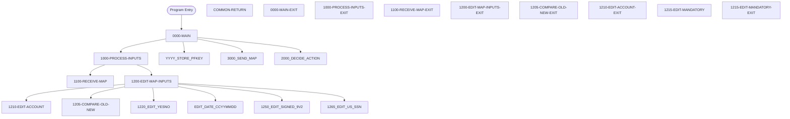

# Program: COACTUPC


---

## Quick Reference

| Attribute | Value |
|-----------|-------|
| Program ID | `COACTUPC` |
| Type | ONLINE |
| Lines | 4237 |
| Source | [COACTUPC.cbl](../carddemo/COACTUPC.cbl#L1) |
| Paragraphs | 85 |
| Statements | 166 |
| Impact Risk | **HIGH** — 32 programs affected |

> **View Source:** [Open COACTUPC.cbl](../carddemo/COACTUPC.cbl#L1)

## Source Grounding Facts

| Data Item | Literal Value |
|-----------|---------------|
| `WS-EDIT-US-PHONE-IS-INVALID` | `000` |
| `WS-EDIT-US-SSN-IS-INVALID` | `000` |
| `WS-RETURN-FLAG-ON` | `1` |
| `WS-EDIT-DT-OF-BIRTH-INVALID` | `000` |
| `WS-EDIT-OPEN-DATE-IS-INVALID` | `000` |
| `WS-EDIT-EXPIRY-IS-INVALID` | `000` |
| `WS-EDIT-REISSUE-DATE-INVALID` | `000` |
| `WS-EXIT-MESSAGE` | `PF03 pressed.Exiting` |
| `WS-PROMPT-FOR-ACCT` | `Account number not provided` |
| `WS-PROMPT-FOR-LASTNAME` | `Last name not provided` |
| `WS-NAME-MUST-BE-ALPHA` | `Name can only contain alphabets and spaces` |

Status conditions found in source:
- `ACCT-ACTIVE-STATUS EQUAL ACUP-OLD-ACTIVE-STATUS`


## Business Purpose

*Business purpose is not present in the extracted data. Run LLM enrichment to populate this section.*


## Dependency Context

> This section shows how **COACTUPC** connects to the rest of the system — who calls it,
> what it calls, and what data it shares. If linked programs exist, they must appear here.

### Programs That Call COACTUPC (Callers)

*No programs call COACTUPC — this is likely a top-level entry point or CICS transaction starter.*

### Programs Called by COACTUPC (Callees)

*COACTUPC does not call any other programs (leaf program).*

### Shared Data (Copybooks & Files)

#### Shared Copybooks

| Copybook | Also Used By | # Co-Users |
|----------|-------------|------------|
| `COACTUP` |  | 0 |
| `COCOM01Y` | COACTVWC, COADM01C, COBIL00C, COCRDLIC, COCRDSLC (+15 more) | 20 |
| `COTTL01Y` | COACTVWC, COADM01C, COBIL00C, COCRDLIC, COCRDSLC (+15 more) | 20 |
| `CSDAT01Y` | COACTVWC, COADM01C, COBIL00C, COCRDLIC, COCRDSLC (+15 more) | 20 |
| `CSLKPCDY` |  | 0 |
| `CSMSG01Y` | COACTVWC, COADM01C, COBIL00C, COCRDLIC, COCRDSLC (+15 more) | 20 |
| `CSMSG02Y` | COACTVWC, COCRDSLC, COCRDUPC, COPAUS0C, COPAUS1C (+1 more) | 6 |
| `CSSETATY` | COTRTUPC | 1 |
| `CSUSR01Y` | COACTVWC, COADM01C, COCRDLIC, COCRDSLC, COCRDUPC (+8 more) | 13 |
| `CSUTLDPY` |  | 0 |
| `CVACT01Y` | CBACT01C, CBACT04C, CBEXPORT, CBIMPORT, CBSTM03A (+8 more) | 13 |
| `CVACT03Y` | CBACT03C, CBACT04C, CBEXPORT, CBIMPORT, CBSTM03A (+8 more) | 13 |
| `CVCRD01Y` | COACTVWC, COCRDLIC, COCRDSLC, COCRDUPC, COTRTLIC (+1 more) | 6 |
| `CVCUS01Y` | CBCUS01C, CBEXPORT, CBIMPORT, CBTRN01C, COACTVWC (+4 more) | 9 |
| `DFHAID` | COACTVWC, COADM01C, COBIL00C, COCRDLIC, COCRDSLC (+15 more) | 20 |
| `DFHBMSCA` | COACTVWC, COADM01C, COBIL00C, COCRDLIC, COCRDSLC (+15 more) | 20 |


## Legacy Data Contracts

> These tables are derived from FILE SECTION records and COPY-expanded data declarations. They preserve the legacy field names, COBOL storage type, inferred modern type, and status-code values needed for Java DTOs, SQL schemas, API contracts, and migration mapping.


### Copybook Segment Layouts

#### `COACTUP` as `CACTUPAI`

| Legacy Field | Meaning | COBOL Type | Modern Type | Status / Format Notes |
|--------------|---------|------------|-------------|-----------------------|
| `CACTUPAI` | Cactupai | `GROUP` | `OBJECT` |  |
| `CACTUPAO` | Cactupao | `GROUP` | `OBJECT` |  |

#### `COCOM01Y` as `CARDDEMO-COMMAREA`

| Legacy Field | Meaning | COBOL Type | Modern Type | Status / Format Notes |
|--------------|---------|------------|-------------|-----------------------|
| `CARDDEMO-COMMAREA` | Carddemo Commarea | `GROUP` | `OBJECT` |  |
| `CDEMO-GENERAL-INFO` | General Info | `GROUP` | `OBJECT` |  |
| `CDEMO-FROM-TRANID` | From Tranid | `PIC X(04)` | `STRING(4)` |  |
| `CDEMO-FROM-PROGRAM` | From Program | `PIC X(08)` | `STRING(8)` |  |
| `CDEMO-TO-TRANID` | To Tranid | `PIC X(04)` | `STRING(4)` |  |
| `CDEMO-TO-PROGRAM` | To Program | `PIC X(08)` | `STRING(8)` |  |
| `CDEMO-USER-ID` | User ID | `PIC X(08)` | `STRING(8)` |  |
| `CDEMO-USER-TYPE` | User Type | `PIC X(01)` | `STRING(1)` |  |
| `CDEMO-PGM-CONTEXT` | Pgm Context | `PIC 9(01)` | `INTEGER` |  |
| `CDEMO-CUSTOMER-INFO` | Customer Info | `GROUP` | `OBJECT` |  |
| `CDEMO-CUST-ID` | Customer ID | `PIC 9(09)` | `INTEGER` |  |
| `CDEMO-CUST-FNAME` | Customer Fname | `PIC X(25)` | `STRING(25)` |  |
| `CDEMO-CUST-MNAME` | Customer Mname | `PIC X(25)` | `STRING(25)` |  |
| `CDEMO-CUST-LNAME` | Customer Lname | `PIC X(25)` | `STRING(25)` |  |
| `CDEMO-ACCOUNT-INFO` | Account Info | `GROUP` | `OBJECT` |  |
| `CDEMO-ACCT-ID` | Account ID | `PIC 9(11)` | `BIGINT` |  |
| `CDEMO-ACCT-STATUS` | Account Status | `PIC X(01)` | `STRING(1)` |  |
| `CDEMO-CARD-INFO` | Card Info | `GROUP` | `OBJECT` |  |
| `CDEMO-CARD-NUM` | Card Number | `PIC 9(16)` | `BIGINT` |  |
| `CDEMO-MORE-INFO` | More Info | `GROUP` | `OBJECT` |  |
| `CDEMO-LAST-MAP` | Last Map | `PIC X(7)` | `STRING(7)` |  |
| `CDEMO-LAST-MAPSET` | Last Mapset | `PIC X(7)` | `STRING(7)` |  |

#### `COTTL01Y` as `CCDA-SCREEN-TITLE`

| Legacy Field | Meaning | COBOL Type | Modern Type | Status / Format Notes |
|--------------|---------|------------|-------------|-----------------------|
| `CCDA-SCREEN-TITLE` | Ccda Screen Title | `GROUP` | `OBJECT` |  |
| `CCDA-TITLE01` | Ccda Title01 | `PIC X(40)` | `STRING(40)` |  |
| `CCDA-TITLE02` | Ccda Title02 | `PIC X(40)` | `STRING(40)` |  |
| `CCDA-THANK-YOU` | Ccda Thank You | `PIC X(40)` | `STRING(40)` |  |

#### `CSDAT01Y` as `WS-DATE-TIME`

| Legacy Field | Meaning | COBOL Type | Modern Type | Status / Format Notes |
|--------------|---------|------------|-------------|-----------------------|
| `WS-DATE-TIME` | Date Time | `GROUP` | `OBJECT` |  |
| `WS-CURDATE-DATA` | Curdate Data | `GROUP` | `OBJECT` |  |
| `WS-CURDATE` | Curdate | `GROUP` | `OBJECT` |  |
| `WS-CURDATE-YEAR` | Curdate Year | `PIC 9(04)` | `INTEGER` |  |
| `WS-CURDATE-MONTH` | Curdate Month | `PIC 9(02)` | `INTEGER` |  |
| `WS-CURDATE-DAY` | Curdate Day | `PIC 9(02)` | `INTEGER` |  |
| `WS-CURDATE-N` | Curdate N | `PIC 9(08)` | `INTEGER` |  |
| `WS-CURTIME` | Curtime | `GROUP` | `OBJECT` |  |
| `WS-CURTIME-HOURS` | Curtime Hours | `PIC 9(02)` | `INTEGER` |  |
| `WS-CURTIME-MINUTE` | Curtime Minute | `PIC 9(02)` | `INTEGER` |  |
| `WS-CURTIME-SECOND` | Curtime Second | `PIC 9(02)` | `INTEGER` |  |
| `WS-CURTIME-MILSEC` | Curtime Milsec | `PIC 9(02)` | `INTEGER` |  |
| `WS-CURTIME-N` | Curtime N | `PIC 9(08)` | `INTEGER` |  |
| `WS-CURDATE-MM-DD-YY` | Curdate Mm Dd Yy | `GROUP` | `OBJECT` |  |
| `WS-CURDATE-MM` | Curdate Mm | `PIC 9(02)` | `INTEGER` |  |
| `FILLER` | Filler | `PIC X(01)` | `STRING(1)` |  |
| `WS-CURDATE-DD` | Curdate Dd | `PIC 9(02)` | `INTEGER` |  |
| `FILLER` | Filler | `PIC X(01)` | `STRING(1)` |  |
| `WS-CURDATE-YY` | Curdate Yy | `PIC 9(02)` | `INTEGER` |  |
| `WS-CURTIME-HH-MM-SS` | Curtime Hh Mm Ss | `GROUP` | `OBJECT` |  |
| `WS-CURTIME-HH` | Curtime Hh | `PIC 9(02)` | `INTEGER` |  |
| `FILLER` | Filler | `PIC X(01)` | `STRING(1)` |  |
| `WS-CURTIME-MM` | Curtime Mm | `PIC 9(02)` | `INTEGER` |  |
| `FILLER` | Filler | `PIC X(01)` | `STRING(1)` |  |
| `WS-CURTIME-SS` | Curtime Ss | `PIC 9(02)` | `INTEGER` |  |
| `WS-TIMESTAMP` | Timestamp | `GROUP` | `OBJECT` |  |
| `WS-TIMESTAMP-DT-YYYY` | Timestamp Date Yyyy | `PIC 9(04)` | `INTEGER` |  |
| `FILLER` | Filler | `PIC X(01)` | `STRING(1)` |  |
| `WS-TIMESTAMP-DT-MM` | Timestamp Date Mm | `PIC 9(02)` | `INTEGER` |  |
| `FILLER` | Filler | `PIC X(01)` | `STRING(1)` |  |
| `WS-TIMESTAMP-DT-DD` | Timestamp Date Dd | `PIC 9(02)` | `INTEGER` |  |
| `FILLER` | Filler | `PIC X(01)` | `STRING(1)` |  |
| `WS-TIMESTAMP-TM-HH` | Timestamp Tm Hh | `PIC 9(02)` | `INTEGER` |  |
| `FILLER` | Filler | `PIC X(01)` | `STRING(1)` |  |
| `WS-TIMESTAMP-TM-MM` | Timestamp Tm Mm | `PIC 9(02)` | `INTEGER` |  |
| `FILLER` | Filler | `PIC X(01)` | `STRING(1)` |  |
| `WS-TIMESTAMP-TM-SS` | Timestamp Tm Ss | `PIC 9(02)` | `INTEGER` |  |
| `FILLER` | Filler | `PIC X(01)` | `STRING(1)` |  |
| `WS-TIMESTAMP-TM-MS6` | Timestamp Tm Ms6 | `PIC 9(06)` | `INTEGER` |  |

#### `CSLKPCDY` as `WS-US-PHONE-AREA-CODE-TO-EDIT`

| Legacy Field | Meaning | COBOL Type | Modern Type | Status / Format Notes |
|--------------|---------|------------|-------------|-----------------------|
| `WS-US-PHONE-AREA-CODE-TO-EDIT` | Us Phone Area Code To Edit | `PIC XXX` | `STRING(3)` |  |
| `US-STATE-CODE-TO-EDIT` | Us State Code To Edit | `PIC X(2)` | `STRING(2)` |  |
| `US-STATE-ZIPCODE-TO-EDIT` | Us State Zipcode To Edit | `GROUP` | `OBJECT` |  |

#### `CSMSG01Y` as `CCDA-COMMON-MESSAGES`

| Legacy Field | Meaning | COBOL Type | Modern Type | Status / Format Notes |
|--------------|---------|------------|-------------|-----------------------|
| `CCDA-COMMON-MESSAGES` | Ccda Common Messages | `GROUP` | `OBJECT` |  |
| `CCDA-MSG-THANK-YOU` | Ccda Msg Thank You | `PIC X(50)` | `STRING(50)` |  |
| `CCDA-MSG-INVALID-KEY` | Ccda Msg Invalid Key | `PIC X(50)` | `STRING(50)` |  |

#### `CSMSG02Y` as `ABEND-DATA`

| Legacy Field | Meaning | COBOL Type | Modern Type | Status / Format Notes |
|--------------|---------|------------|-------------|-----------------------|
| `ABEND-DATA` | Abend Data | `GROUP` | `OBJECT` |  |
| `ABEND-CODE` | Abend Code | `PIC X(4)` | `STRING(4)` |  |
| `ABEND-CULPRIT` | Abend Culprit | `PIC X(8)` | `STRING(8)` |  |
| `ABEND-REASON` | Abend Reason | `PIC X(50)` | `STRING(50)` |  |
| `ABEND-MSG` | Abend Msg | `PIC X(72)` | `STRING(72)` |  |

#### `CSUSR01Y` as `SEC-USER-DATA`

| Legacy Field | Meaning | COBOL Type | Modern Type | Status / Format Notes |
|--------------|---------|------------|-------------|-----------------------|
| `SEC-USER-DATA` | Sec User Data | `GROUP` | `OBJECT` |  |
| `SEC-USR-ID` | Sec Usr ID | `PIC X(08)` | `STRING(8)` |  |
| `SEC-USR-FNAME` | Sec Usr Fname | `PIC X(20)` | `STRING(20)` |  |
| `SEC-USR-LNAME` | Sec Usr Lname | `PIC X(20)` | `STRING(20)` |  |
| `SEC-USR-PWD` | Sec Usr Pwd | `PIC X(08)` | `STRING(8)` |  |
| `SEC-USR-TYPE` | Sec Usr Type | `PIC X(01)` | `STRING(1)` |  |
| `SEC-USR-FILLER` | Sec Usr Filler | `PIC X(23)` | `STRING(23)` |  |

#### `CVACT01Y` as `ACCOUNT-RECORD`

| Legacy Field | Meaning | COBOL Type | Modern Type | Status / Format Notes |
|--------------|---------|------------|-------------|-----------------------|
| `ACCOUNT-RECORD` | Account Record | `GROUP` | `OBJECT` |  |
| `ACCT-ID` | Account ID | `PIC 9(11)` | `BIGINT` |  |
| `ACCT-ACTIVE-STATUS` | Account Active Status | `PIC X(01)` | `STRING(1)` |  |
| `ACCT-CURR-BAL` | Account Curr Bal | `PIC S9(10)V99` | `DECIMAL(12,2)` |  |
| `ACCT-CREDIT-LIMIT` | Account Credit Limit | `PIC S9(10)V99` | `DECIMAL(12,2)` |  |
| `ACCT-CASH-CREDIT-LIMIT` | Account Cash Credit Limit | `PIC S9(10)V99` | `DECIMAL(12,2)` |  |
| `ACCT-OPEN-DATE` | Account Open Date | `PIC X(10)` | `STRING(10)` | Date-like field; verify YYDDD, YYMMDD, or ISO format before migration. |
| `ACCT-EXPIRAION-DATE` | Account Expiraion Date | `PIC X(10)` | `STRING(10)` | Date-like field; verify YYDDD, YYMMDD, or ISO format before migration. |
| `ACCT-REISSUE-DATE` | Account Reissue Date | `PIC X(10)` | `STRING(10)` | Date-like field; verify YYDDD, YYMMDD, or ISO format before migration. |
| `ACCT-CURR-CYC-CREDIT` | Account Curr Cyc Credit | `PIC S9(10)V99` | `DECIMAL(12,2)` |  |
| `ACCT-CURR-CYC-DEBIT` | Account Curr Cyc Debit | `PIC S9(10)V99` | `DECIMAL(12,2)` |  |
| `ACCT-ADDR-ZIP` | Account Addr Zip | `PIC X(10)` | `STRING(10)` |  |
| `ACCT-GROUP-ID` | Account Group ID | `PIC X(10)` | `STRING(10)` |  |
| `FILLER` | Filler | `PIC X(178)` | `STRING(178)` |  |

#### `CVACT03Y` as `CARD-XREF-RECORD`

| Legacy Field | Meaning | COBOL Type | Modern Type | Status / Format Notes |
|--------------|---------|------------|-------------|-----------------------|
| `CARD-XREF-RECORD` | Card Xref Record | `GROUP` | `OBJECT` |  |
| `XREF-CARD-NUM` | Xref Card Number | `PIC X(16)` | `STRING(16)` |  |
| `XREF-CUST-ID` | Xref Customer ID | `PIC 9(09)` | `INTEGER` |  |
| `XREF-ACCT-ID` | Xref Account ID | `PIC 9(11)` | `BIGINT` |  |
| `FILLER` | Filler | `PIC X(14)` | `STRING(14)` |  |

#### `CVCRD01Y` as `CC-WORK-AREAS`

| Legacy Field | Meaning | COBOL Type | Modern Type | Status / Format Notes |
|--------------|---------|------------|-------------|-----------------------|
| `CC-WORK-AREAS` | Cc Work Areas | `GROUP` | `OBJECT` |  |
| `CC-WORK-AREA` | Cc Work Area | `GROUP` | `OBJECT` |  |
| `CCARD-AID` | Ccard Aid | `PIC X(5)` | `STRING(5)` |  |
| `CCARD-NEXT-PROG` | Ccard Next Prog | `PIC X(8)` | `STRING(8)` |  |
| `CCARD-NEXT-MAPSET` | Ccard Next Mapset | `PIC X(7)` | `STRING(7)` |  |
| `CCARD-NEXT-MAP` | Ccard Next Map | `PIC X(7)` | `STRING(7)` |  |
| `CCARD-ERROR-MSG` | Ccard Error Msg | `PIC X(75)` | `STRING(75)` |  |
| `CCARD-RETURN-MSG` | Ccard Return Msg | `PIC X(75)` | `STRING(75)` |  |
| `CC-ACCT-ID` | Cc Account ID | `PIC X(11)` | `STRING(11)` |  |
| `CC-ACCT-ID-N` | Cc Account ID N | `PIC 9(11)` | `BIGINT` |  |
| `CC-CARD-NUM` | Cc Card Number | `PIC X(16)` | `STRING(16)` |  |
| `CC-CARD-NUM-N` | Cc Card Number N | `PIC 9(16)` | `BIGINT` |  |
| `CC-CUST-ID` | Cc Customer ID | `PIC X(09)` | `STRING(9)` |  |
| `CC-CUST-ID-N` | Cc Customer ID N | `PIC 9(9)` | `INTEGER` |  |

#### `CVCUS01Y` as `CUSTOMER-RECORD`

| Legacy Field | Meaning | COBOL Type | Modern Type | Status / Format Notes |
|--------------|---------|------------|-------------|-----------------------|
| `CUSTOMER-RECORD` | Customer Record | `GROUP` | `OBJECT` |  |
| `CUST-ID` | Customer ID | `PIC 9(09)` | `INTEGER` |  |
| `CUST-FIRST-NAME` | Customer First Name | `PIC X(25)` | `STRING(25)` |  |
| `CUST-MIDDLE-NAME` | Customer Middle Name | `PIC X(25)` | `STRING(25)` |  |
| `CUST-LAST-NAME` | Customer Last Name | `PIC X(25)` | `STRING(25)` |  |
| `CUST-ADDR-LINE-1` | Customer Addr Line 1 | `PIC X(50)` | `STRING(50)` |  |
| `CUST-ADDR-LINE-2` | Customer Addr Line 2 | `PIC X(50)` | `STRING(50)` |  |
| `CUST-ADDR-LINE-3` | Customer Addr Line 3 | `PIC X(50)` | `STRING(50)` |  |
| `CUST-ADDR-STATE-CD` | Customer Addr State Cd | `PIC X(02)` | `STRING(2)` |  |
| `CUST-ADDR-COUNTRY-CD` | Customer Addr Country Cd | `PIC X(03)` | `STRING(3)` |  |
| `CUST-ADDR-ZIP` | Customer Addr Zip | `PIC X(10)` | `STRING(10)` |  |
| `CUST-PHONE-NUM-1` | Customer Phone Number 1 | `PIC X(15)` | `STRING(15)` |  |
| `CUST-PHONE-NUM-2` | Customer Phone Number 2 | `PIC X(15)` | `STRING(15)` |  |
| `CUST-SSN` | Customer Ssn | `PIC 9(09)` | `INTEGER` |  |
| `CUST-GOVT-ISSUED-ID` | Customer Govt Issued ID | `PIC X(20)` | `STRING(20)` |  |
| `CUST-DOB-YYYY-MM-DD` | Customer Dob Yyyy Mm Dd | `PIC X(10)` | `STRING(10)` |  |
| `CUST-EFT-ACCOUNT-ID` | Customer Eft Account ID | `PIC X(10)` | `STRING(10)` |  |
| `CUST-PRI-CARD-HOLDER-IND` | Customer Pri Card Holder Ind | `PIC X(01)` | `STRING(1)` |  |
| `CUST-FICO-CREDIT-SCORE` | Customer Fico Credit Score | `PIC 9(03)` | `INTEGER` |  |
| `FILLER` | Filler | `PIC X(168)` | `STRING(168)` |  |

#### `DFHAID` as `DFHAID`

| Legacy Field | Meaning | COBOL Type | Modern Type | Status / Format Notes |
|--------------|---------|------------|-------------|-----------------------|
| `DFHAID` | Dfhaid | `GROUP` | `OBJECT` |  |

#### `DFHBMSCA` as `DFHBMSCA`

| Legacy Field | Meaning | COBOL Type | Modern Type | Status / Format Notes |
|--------------|---------|------------|-------------|-----------------------|
| `DFHBMSCA` | Dfhbmsca | `GROUP` | `OBJECT` |  |


### Data Movement And Key Mapping

| Line | Source | Target | Meaning |
|------|--------|--------|---------|
| 1053 | `LOW-VALUES` | `CC-ACCT-ID` | LOW-VALUES populates CC-ACCT-ID |
| 1056 | `ACCTSIDI OF CACTUPAI` | `CC-ACCT-ID` | ACCTSIDI OF CACTUPAI populates CC-ACCT-ID |
| 1067 | `LOW-VALUES` | `ACUP-NEW-ACTIVE-STATUS` | LOW-VALUES populates ACUP-NEW-ACTIVE-STATUS |
| 1069 | `ACSTTUSI OF CACTUPAI` | `ACUP-NEW-ACTIVE-STATUS` | ACSTTUSI OF CACTUPAI populates ACUP-NEW-ACTIVE-STATUS |
| 1226 | `LOW-VALUES` | `ACUP-NEW-CUST-ID-X` | LOW-VALUES populates ACUP-NEW-CUST-ID-X |
| 1228 | `ACSTNUMI OF CACTUPAI` | `ACUP-NEW-CUST-ID-X` | ACSTNUMI OF CACTUPAI populates ACUP-NEW-CUST-ID-X |
| 1235 | `LOW-VALUES` | `ACUP-NEW-CUST-SSN-1` | LOW-VALUES populates ACUP-NEW-CUST-SSN-1 |
| 1237 | `ACTSSN1I OF CACTUPAI` | `ACUP-NEW-CUST-SSN-1` | ACTSSN1I OF CACTUPAI populates ACUP-NEW-CUST-SSN-1 |
| 1242 | `LOW-VALUES` | `ACUP-NEW-CUST-SSN-2` | LOW-VALUES populates ACUP-NEW-CUST-SSN-2 |
| 1244 | `ACTSSN2I OF CACTUPAI` | `ACUP-NEW-CUST-SSN-2` | ACTSSN2I OF CACTUPAI populates ACUP-NEW-CUST-SSN-2 |
| 1249 | `LOW-VALUES` | `ACUP-NEW-CUST-SSN-3` | LOW-VALUES populates ACUP-NEW-CUST-SSN-3 |
| 1251 | `ACTSSN3I OF CACTUPAI` | `ACUP-NEW-CUST-SSN-3` | ACTSSN3I OF CACTUPAI populates ACUP-NEW-CUST-SSN-3 |
| 1258 | `LOW-VALUES` | `ACUP-NEW-CUST-DOB-YEAR` | LOW-VALUES populates ACUP-NEW-CUST-DOB-YEAR |
| 1260 | `DOBYEARI OF CACTUPAI` | `ACUP-NEW-CUST-DOB-YEAR` | DOBYEARI OF CACTUPAI populates ACUP-NEW-CUST-DOB-YEAR |
| 1265 | `LOW-VALUES` | `ACUP-NEW-CUST-DOB-MON` | LOW-VALUES populates ACUP-NEW-CUST-DOB-MON |
| 1267 | `DOBMONI OF CACTUPAI` | `ACUP-NEW-CUST-DOB-MON` | DOBMONI OF CACTUPAI populates ACUP-NEW-CUST-DOB-MON |
| 1272 | `LOW-VALUES` | `ACUP-NEW-CUST-DOB-DAY` | LOW-VALUES populates ACUP-NEW-CUST-DOB-DAY |
| 1274 | `DOBDAYI OF CACTUPAI` | `ACUP-NEW-CUST-DOB-DAY` | DOBDAYI OF CACTUPAI populates ACUP-NEW-CUST-DOB-DAY |
| 1281 | `LOW-VALUES` | `ACUP-NEW-CUST-FICO-SCORE-X` | LOW-VALUES populates ACUP-NEW-CUST-FICO-SCORE-X |
| 1283 | `ACSTFCOI OF CACTUPAI` | `ACUP-NEW-CUST-FICO-SCORE-X` | ACSTFCOI OF CACTUPAI populates ACUP-NEW-CUST-FICO-SCORE-X |
| 1290 | `LOW-VALUES` | `ACUP-NEW-CUST-FIRST-NAME` | LOW-VALUES populates ACUP-NEW-CUST-FIRST-NAME |
| 1292 | `ACSFNAMI OF CACTUPAI` | `ACUP-NEW-CUST-FIRST-NAME` | ACSFNAMI OF CACTUPAI populates ACUP-NEW-CUST-FIRST-NAME |
| 1299 | `LOW-VALUES` | `ACUP-NEW-CUST-MIDDLE-NAME` | LOW-VALUES populates ACUP-NEW-CUST-MIDDLE-NAME |
| 1301 | `ACSMNAMI OF CACTUPAI` | `ACUP-NEW-CUST-MIDDLE-NAME` | ACSMNAMI OF CACTUPAI populates ACUP-NEW-CUST-MIDDLE-NAME |
| 1308 | `LOW-VALUES` | `ACUP-NEW-CUST-LAST-NAME` | LOW-VALUES populates ACUP-NEW-CUST-LAST-NAME |
| 1310 | `ACSLNAMI OF CACTUPAI` | `ACUP-NEW-CUST-LAST-NAME` | ACSLNAMI OF CACTUPAI populates ACUP-NEW-CUST-LAST-NAME |
| 1317 | `LOW-VALUES` | `ACUP-NEW-CUST-ADDR-LINE-1` | LOW-VALUES populates ACUP-NEW-CUST-ADDR-LINE-1 |
| 1319 | `ACSADL1I OF CACTUPAI` | `ACUP-NEW-CUST-ADDR-LINE-1` | ACSADL1I OF CACTUPAI populates ACUP-NEW-CUST-ADDR-LINE-1 |
| 1324 | `LOW-VALUES` | `ACUP-NEW-CUST-ADDR-LINE-2` | LOW-VALUES populates ACUP-NEW-CUST-ADDR-LINE-2 |
| 1326 | `ACSADL2I OF CACTUPAI` | `ACUP-NEW-CUST-ADDR-LINE-2` | ACSADL2I OF CACTUPAI populates ACUP-NEW-CUST-ADDR-LINE-2 |


---

## Dependency Graph

```mermaid
flowchart TD
    COACTUPC["⬤ COACTUPC"]:::target
    CB_COCOM01Y{{"COCOM01Y"}}:::copybook
    COACTUPC -.- CB_COCOM01Y
    COACTVWC["COACTVWC"]:::coupled
    CB_COCOM01Y -.- COACTVWC
    COADM01C["COADM01C"]:::coupled
    CB_COCOM01Y -.- COADM01C
    COBIL00C["COBIL00C"]:::coupled
    CB_COCOM01Y -.- COBIL00C
    CB_COTTL01Y{{"COTTL01Y"}}:::copybook
    COACTUPC -.- CB_COTTL01Y
    COACTVWC["COACTVWC"]:::coupled
    CB_COTTL01Y -.- COACTVWC
    COADM01C["COADM01C"]:::coupled
    CB_COTTL01Y -.- COADM01C
    COBIL00C["COBIL00C"]:::coupled
    CB_COTTL01Y -.- COBIL00C
    CB_CSDAT01Y{{"CSDAT01Y"}}:::copybook
    COACTUPC -.- CB_CSDAT01Y
    COACTVWC["COACTVWC"]:::coupled
    CB_CSDAT01Y -.- COACTVWC
    COADM01C["COADM01C"]:::coupled
    CB_CSDAT01Y -.- COADM01C
    COBIL00C["COBIL00C"]:::coupled
    CB_CSDAT01Y -.- COBIL00C
    CB_CSMSG01Y{{"CSMSG01Y"}}:::copybook
    COACTUPC -.- CB_CSMSG01Y
    COACTVWC["COACTVWC"]:::coupled
    CB_CSMSG01Y -.- COACTVWC
    COADM01C["COADM01C"]:::coupled
    CB_CSMSG01Y -.- COADM01C
    COBIL00C["COBIL00C"]:::coupled
    CB_CSMSG01Y -.- COBIL00C
    CB_CSMSG02Y{{"CSMSG02Y"}}:::copybook
    COACTUPC -.- CB_CSMSG02Y
    COACTVWC["COACTVWC"]:::coupled
    CB_CSMSG02Y -.- COACTVWC
    COCRDSLC["COCRDSLC"]:::coupled
    CB_CSMSG02Y -.- COCRDSLC
    COCRDUPC["COCRDUPC"]:::coupled
    CB_CSMSG02Y -.- COCRDUPC
    CB_CSSETATY{{"CSSETATY"}}:::copybook
    COACTUPC -.- CB_CSSETATY
    COTRTUPC["COTRTUPC"]:::coupled
    CB_CSSETATY -.- COTRTUPC
    classDef target fill:#f85149,stroke:#da3633,color:#fff,stroke-width:3px
    classDef caller fill:#58a6ff,stroke:#1f6feb,color:#fff
    classDef callee fill:#3fb950,stroke:#238636,color:#fff
    classDef copybook fill:#d29922,stroke:#9e6a03,color:#fff
    classDef coupled fill:#d29922,stroke:#9e6a03,color:#fff,stroke-dasharray:5
    classDef transitive fill:#484f58,stroke:#8b949e,color:#c9d1d9,stroke-dasharray:5
```



> **Legend:** 🔴 Target program · 🔵 Direct callers · 🟢 Direct callees · 🟡 Copybook-coupled · ⚫ Transitive (indirect)

---

## Impact Ripple View

> **If you change COACTUPC, what else could break?**

| Impact Metric | Count |
|--------------|-------|
| Direct Callers | 0 |
| Transitive Callers (callers of callers) | 0 |
| Direct Callees | 0 |
| Transitive Callees | 0 |
| Copybook-Coupled Programs | 32 |
| **Total Impact** | **32** |
| **Risk Rating** | **HIGH** |


**Programs affected via shared copybooks:**
- `CBACT01C`
- `CBACT03C`
- `CBACT04C`
- `CBCUS01C`
- `CBEXPORT`
- `CBIMPORT`
- `CBSTM03A`
- `CBTRN01C`
- `CBTRN02C`
- `CBTRN03C`
- `COACCT01`
- `COACTVWC`
- `COADM01C`
- `COBIL00C`
- `COCRDLIC`
- `COCRDSLC`
- `COCRDUPC`
- `COMEN01C`
- `COPAUA0C`
- `COPAUS0C`
- `COPAUS1C`
- `CORPT00C`
- `COSGN00C`
- `COTRN00C`
- `COTRN01C`
- `COTRN02C`
- `COTRTLIC`
- `COTRTUPC`
- `COUSR00C`
- `COUSR01C`
- `COUSR02C`
- `COUSR03C`

---

## Statement Profile

| Statement Type | Count |
|---------------|-------|
| IF | 164 |
| REWRITE | 2 |

## Control Flow



## Paragraphs

### 0000-MAIN

| | |
|---|---|
| **Paragraph** | `0000-MAIN` |
| **Lines** | 859 - 1006 |
| **View Code** | [Jump to Line 859](../carddemo/COACTUPC.cbl#L859) |


### COMMON-RETURN

| | |
|---|---|
| **Paragraph** | `COMMON-RETURN` |
| **Lines** | 1007 - 1020 |
| **View Code** | [Jump to Line 1007](../carddemo/COACTUPC.cbl#L1007) |


### 0000-MAIN-EXIT

| | |
|---|---|
| **Paragraph** | `0000-MAIN-EXIT` |
| **Lines** | 1021 - 1024 |
| **View Code** | [Jump to Line 1021](../carddemo/COACTUPC.cbl#L1021) |


### 1000-PROCESS-INPUTS

| | |
|---|---|
| **Paragraph** | `1000-PROCESS-INPUTS` |
| **Lines** | 1025 - 1035 |
| **View Code** | [Jump to Line 1025](../carddemo/COACTUPC.cbl#L1025) |


### 1000-PROCESS-INPUTS-EXIT

| | |
|---|---|
| **Paragraph** | `1000-PROCESS-INPUTS-EXIT` |
| **Lines** | 1036 - 1038 |
| **View Code** | [Jump to Line 1036](../carddemo/COACTUPC.cbl#L1036) |


### 1100-RECEIVE-MAP

| | |
|---|---|
| **Paragraph** | `1100-RECEIVE-MAP` |
| **Lines** | 1039 - 1425 |
| **View Code** | [Jump to Line 1039](../carddemo/COACTUPC.cbl#L1039) |


### 1100-RECEIVE-MAP-EXIT

| | |
|---|---|
| **Paragraph** | `1100-RECEIVE-MAP-EXIT` |
| **Lines** | 1426 - 1428 |
| **View Code** | [Jump to Line 1426](../carddemo/COACTUPC.cbl#L1426) |


### 1200-EDIT-MAP-INPUTS

| | |
|---|---|
| **Paragraph** | `1200-EDIT-MAP-INPUTS` |
| **Lines** | 1429 - 1677 |
| **View Code** | [Jump to Line 1429](../carddemo/COACTUPC.cbl#L1429) |


### 1200-EDIT-MAP-INPUTS-EXIT

| | |
|---|---|
| **Paragraph** | `1200-EDIT-MAP-INPUTS-EXIT` |
| **Lines** | 1678 - 1680 |
| **View Code** | [Jump to Line 1678](../carddemo/COACTUPC.cbl#L1678) |


### 1205-COMPARE-OLD-NEW

| | |
|---|---|
| **Paragraph** | `1205-COMPARE-OLD-NEW` |
| **Lines** | 1681 - 1776 |
| **View Code** | [Jump to Line 1681](../carddemo/COACTUPC.cbl#L1681) |


### 1205-COMPARE-OLD-NEW-EXIT

| | |
|---|---|
| **Paragraph** | `1205-COMPARE-OLD-NEW-EXIT` |
| **Lines** | 1777 - 1782 |
| **View Code** | [Jump to Line 1777](../carddemo/COACTUPC.cbl#L1777) |


### 1210-EDIT-ACCOUNT

| | |
|---|---|
| **Paragraph** | `1210-EDIT-ACCOUNT` |
| **Lines** | 1783 - 1819 |
| **View Code** | [Jump to Line 1783](../carddemo/COACTUPC.cbl#L1783) |


### 1210-EDIT-ACCOUNT-EXIT

| | |
|---|---|
| **Paragraph** | `1210-EDIT-ACCOUNT-EXIT` |
| **Lines** | 1820 - 1823 |
| **View Code** | [Jump to Line 1820](../carddemo/COACTUPC.cbl#L1820) |


### 1215-EDIT-MANDATORY

| | |
|---|---|
| **Paragraph** | `1215-EDIT-MANDATORY` |
| **Lines** | 1824 - 1851 |
| **View Code** | [Jump to Line 1824](../carddemo/COACTUPC.cbl#L1824) |


### 1215-EDIT-MANDATORY-EXIT

| | |
|---|---|
| **Paragraph** | `1215-EDIT-MANDATORY-EXIT` |
| **Lines** | 1852 - 1855 |
| **View Code** | [Jump to Line 1852](../carddemo/COACTUPC.cbl#L1852) |


### 1220-EDIT-YESNO

| | |
|---|---|
| **Paragraph** | `1220-EDIT-YESNO` |
| **Lines** | 1856 - 1893 |
| **View Code** | [Jump to Line 1856](../carddemo/COACTUPC.cbl#L1856) |


### 1220-EDIT-YESNO-EXIT

| | |
|---|---|
| **Paragraph** | `1220-EDIT-YESNO-EXIT` |
| **Lines** | 1894 - 1897 |
| **View Code** | [Jump to Line 1894](../carddemo/COACTUPC.cbl#L1894) |


### 1225-EDIT-ALPHA-REQD

| | |
|---|---|
| **Paragraph** | `1225-EDIT-ALPHA-REQD` |
| **Lines** | 1898 - 1950 |
| **View Code** | [Jump to Line 1898](../carddemo/COACTUPC.cbl#L1898) |


### 1225-EDIT-ALPHA-REQD-EXIT

| | |
|---|---|
| **Paragraph** | `1225-EDIT-ALPHA-REQD-EXIT` |
| **Lines** | 1951 - 1954 |
| **View Code** | [Jump to Line 1951](../carddemo/COACTUPC.cbl#L1951) |


### 1230-EDIT-ALPHANUM-REQD

| | |
|---|---|
| **Paragraph** | `1230-EDIT-ALPHANUM-REQD` |
| **Lines** | 1955 - 2008 |
| **View Code** | [Jump to Line 1955](../carddemo/COACTUPC.cbl#L1955) |


### 1230-EDIT-ALPHANUM-REQD-EXIT

| | |
|---|---|
| **Paragraph** | `1230-EDIT-ALPHANUM-REQD-EXIT` |
| **Lines** | 2009 - 2011 |
| **View Code** | [Jump to Line 2009](../carddemo/COACTUPC.cbl#L2009) |


### 1235-EDIT-ALPHA-OPT

| | |
|---|---|
| **Paragraph** | `1235-EDIT-ALPHA-OPT` |
| **Lines** | 2012 - 2056 |
| **View Code** | [Jump to Line 2012](../carddemo/COACTUPC.cbl#L2012) |


### 1235-EDIT-ALPHA-OPT-EXIT

| | |
|---|---|
| **Paragraph** | `1235-EDIT-ALPHA-OPT-EXIT` |
| **Lines** | 2057 - 2060 |
| **View Code** | [Jump to Line 2057](../carddemo/COACTUPC.cbl#L2057) |


### 1240-EDIT-ALPHANUM-OPT

| | |
|---|---|
| **Paragraph** | `1240-EDIT-ALPHANUM-OPT` |
| **Lines** | 2061 - 2104 |
| **View Code** | [Jump to Line 2061](../carddemo/COACTUPC.cbl#L2061) |


### 1240-EDIT-ALPHANUM-OPT-EXIT

| | |
|---|---|
| **Paragraph** | `1240-EDIT-ALPHANUM-OPT-EXIT` |
| **Lines** | 2105 - 2108 |
| **View Code** | [Jump to Line 2105](../carddemo/COACTUPC.cbl#L2105) |


### 1245-EDIT-NUM-REQD

| | |
|---|---|
| **Paragraph** | `1245-EDIT-NUM-REQD` |
| **Lines** | 2109 - 2175 |
| **View Code** | [Jump to Line 2109](../carddemo/COACTUPC.cbl#L2109) |


### 1245-EDIT-NUM-REQD-EXIT

| | |
|---|---|
| **Paragraph** | `1245-EDIT-NUM-REQD-EXIT` |
| **Lines** | 2176 - 2179 |
| **View Code** | [Jump to Line 2176](../carddemo/COACTUPC.cbl#L2176) |


### 1250-EDIT-SIGNED-9V2

| | |
|---|---|
| **Paragraph** | `1250-EDIT-SIGNED-9V2` |
| **Lines** | 2180 - 2220 |
| **View Code** | [Jump to Line 2180](../carddemo/COACTUPC.cbl#L2180) |


### 1250-EDIT-SIGNED-9V2-EXIT

| | |
|---|---|
| **Paragraph** | `1250-EDIT-SIGNED-9V2-EXIT` |
| **Lines** | 2221 - 2224 |
| **View Code** | [Jump to Line 2221](../carddemo/COACTUPC.cbl#L2221) |


### 1260-EDIT-US-PHONE-NUM

| | |
|---|---|
| **Paragraph** | `1260-EDIT-US-PHONE-NUM` |
| **Lines** | 2225 - 2245 |
| **View Code** | [Jump to Line 2225](../carddemo/COACTUPC.cbl#L2225) |


### EDIT-AREA-CODE

| | |
|---|---|
| **Paragraph** | `EDIT-AREA-CODE` |
| **Lines** | 2246 - 2315 |
| **View Code** | [Jump to Line 2246](../carddemo/COACTUPC.cbl#L2246) |


### EDIT-US-PHONE-PREFIX

| | |
|---|---|
| **Paragraph** | `EDIT-US-PHONE-PREFIX` |
| **Lines** | 2316 - 2369 |
| **View Code** | [Jump to Line 2316](../carddemo/COACTUPC.cbl#L2316) |


### EDIT-US-PHONE-LINENUM

| | |
|---|---|
| **Paragraph** | `EDIT-US-PHONE-LINENUM` |
| **Lines** | 2370 - 2423 |
| **View Code** | [Jump to Line 2370](../carddemo/COACTUPC.cbl#L2370) |


### EDIT-US-PHONE-EXIT

| | |
|---|---|
| **Paragraph** | `EDIT-US-PHONE-EXIT` |
| **Lines** | 2424 - 2426 |
| **View Code** | [Jump to Line 2424](../carddemo/COACTUPC.cbl#L2424) |


### 1260-EDIT-US-PHONE-NUM-EXIT

| | |
|---|---|
| **Paragraph** | `1260-EDIT-US-PHONE-NUM-EXIT` |
| **Lines** | 2427 - 2430 |
| **View Code** | [Jump to Line 2427](../carddemo/COACTUPC.cbl#L2427) |


### 1265-EDIT-US-SSN

| | |
|---|---|
| **Paragraph** | `1265-EDIT-US-SSN` |
| **Lines** | 2431 - 2488 |
| **View Code** | [Jump to Line 2431](../carddemo/COACTUPC.cbl#L2431) |


### 1265-EDIT-US-SSN-EXIT

| | |
|---|---|
| **Paragraph** | `1265-EDIT-US-SSN-EXIT` |
| **Lines** | 2489 - 2492 |
| **View Code** | [Jump to Line 2489](../carddemo/COACTUPC.cbl#L2489) |


### 1270-EDIT-US-STATE-CD

| | |
|---|---|
| **Paragraph** | `1270-EDIT-US-STATE-CD` |
| **Lines** | 2493 - 2510 |
| **View Code** | [Jump to Line 2493](../carddemo/COACTUPC.cbl#L2493) |


### 1270-EDIT-US-STATE-CD-EXIT

| | |
|---|---|
| **Paragraph** | `1270-EDIT-US-STATE-CD-EXIT` |
| **Lines** | 2511 - 2513 |
| **View Code** | [Jump to Line 2511](../carddemo/COACTUPC.cbl#L2511) |


### 1275-EDIT-FICO-SCORE

| | |
|---|---|
| **Paragraph** | `1275-EDIT-FICO-SCORE` |
| **Lines** | 2514 - 2530 |
| **View Code** | [Jump to Line 2514](../carddemo/COACTUPC.cbl#L2514) |


### 1275-EDIT-FICO-SCORE-EXIT

| | |
|---|---|
| **Paragraph** | `1275-EDIT-FICO-SCORE-EXIT` |
| **Lines** | 2531 - 2535 |
| **View Code** | [Jump to Line 2531](../carddemo/COACTUPC.cbl#L2531) |


### 1280-EDIT-US-STATE-ZIP-CD

| | |
|---|---|
| **Paragraph** | `1280-EDIT-US-STATE-ZIP-CD` |
| **Lines** | 2536 - 2557 |
| **View Code** | [Jump to Line 2536](../carddemo/COACTUPC.cbl#L2536) |


### 1280-EDIT-US-STATE-ZIP-CD-EXIT

| | |
|---|---|
| **Paragraph** | `1280-EDIT-US-STATE-ZIP-CD-EXIT` |
| **Lines** | 2558 - 2561 |
| **View Code** | [Jump to Line 2558](../carddemo/COACTUPC.cbl#L2558) |


### 2000-DECIDE-ACTION

| | |
|---|---|
| **Paragraph** | `2000-DECIDE-ACTION` |
| **Lines** | 2562 - 2642 |
| **View Code** | [Jump to Line 2562](../carddemo/COACTUPC.cbl#L2562) |


### 2000-DECIDE-ACTION-EXIT

| | |
|---|---|
| **Paragraph** | `2000-DECIDE-ACTION-EXIT` |
| **Lines** | 2643 - 2648 |
| **View Code** | [Jump to Line 2643](../carddemo/COACTUPC.cbl#L2643) |


### 3000-SEND-MAP

| | |
|---|---|
| **Paragraph** | `3000-SEND-MAP` |
| **Lines** | 2649 - 2663 |
| **View Code** | [Jump to Line 2649](../carddemo/COACTUPC.cbl#L2649) |


### 3000-SEND-MAP-EXIT

| | |
|---|---|
| **Paragraph** | `3000-SEND-MAP-EXIT` |
| **Lines** | 2664 - 2667 |
| **View Code** | [Jump to Line 2664](../carddemo/COACTUPC.cbl#L2664) |


### 3100-SCREEN-INIT

| | |
|---|---|
| **Paragraph** | `3100-SCREEN-INIT` |
| **Lines** | 2668 - 2693 |
| **View Code** | [Jump to Line 2668](../carddemo/COACTUPC.cbl#L2668) |


### 3100-SCREEN-INIT-EXIT

| | |
|---|---|
| **Paragraph** | `3100-SCREEN-INIT-EXIT` |
| **Lines** | 2694 - 2697 |
| **View Code** | [Jump to Line 2694](../carddemo/COACTUPC.cbl#L2694) |


### 3200-SETUP-SCREEN-VARS

| | |
|---|---|
| **Paragraph** | `3200-SETUP-SCREEN-VARS` |
| **Lines** | 2698 - 2726 |
| **View Code** | [Jump to Line 2698](../carddemo/COACTUPC.cbl#L2698) |


### 3200-SETUP-SCREEN-VARS-EXIT

| | |
|---|---|
| **Paragraph** | `3200-SETUP-SCREEN-VARS-EXIT` |
| **Lines** | 2727 - 2730 |
| **View Code** | [Jump to Line 2727](../carddemo/COACTUPC.cbl#L2727) |


### 3201-SHOW-INITIAL-VALUES

| | |
|---|---|
| **Paragraph** | `3201-SHOW-INITIAL-VALUES` |
| **Lines** | 2731 - 2782 |
| **View Code** | [Jump to Line 2731](../carddemo/COACTUPC.cbl#L2731) |


### 3201-SHOW-INITIAL-VALUES-EXIT

| | |
|---|---|
| **Paragraph** | `3201-SHOW-INITIAL-VALUES-EXIT` |
| **Lines** | 2783 - 2786 |
| **View Code** | [Jump to Line 2783](../carddemo/COACTUPC.cbl#L2783) |


### 3202-SHOW-ORIGINAL-VALUES

| | |
|---|---|
| **Paragraph** | `3202-SHOW-ORIGINAL-VALUES` |
| **Lines** | 2787 - 2866 |
| **View Code** | [Jump to Line 2787](../carddemo/COACTUPC.cbl#L2787) |


### 3202-SHOW-ORIGINAL-VALUES-EXIT

| | |
|---|---|
| **Paragraph** | `3202-SHOW-ORIGINAL-VALUES-EXIT` |
| **Lines** | 2867 - 2869 |
| **View Code** | [Jump to Line 2867](../carddemo/COACTUPC.cbl#L2867) |


### 3203-SHOW-UPDATED-VALUES

| | |
|---|---|
| **Paragraph** | `3203-SHOW-UPDATED-VALUES` |
| **Lines** | 2870 - 2950 |
| **View Code** | [Jump to Line 2870](../carddemo/COACTUPC.cbl#L2870) |


### 3203-SHOW-UPDATED-VALUES-EXIT

| | |
|---|---|
| **Paragraph** | `3203-SHOW-UPDATED-VALUES-EXIT` |
| **Lines** | 2951 - 2954 |
| **View Code** | [Jump to Line 2951](../carddemo/COACTUPC.cbl#L2951) |


### 3250-SETUP-INFOMSG

| | |
|---|---|
| **Paragraph** | `3250-SETUP-INFOMSG` |
| **Lines** | 2955 - 2982 |
| **View Code** | [Jump to Line 2955](../carddemo/COACTUPC.cbl#L2955) |


### 3250-SETUP-INFOMSG-EXIT

| | |
|---|---|
| **Paragraph** | `3250-SETUP-INFOMSG-EXIT` |
| **Lines** | 2983 - 2985 |
| **View Code** | [Jump to Line 2983](../carddemo/COACTUPC.cbl#L2983) |


### 3300-SETUP-SCREEN-ATTRS

| | |
|---|---|
| **Paragraph** | `3300-SETUP-SCREEN-ATTRS` |
| **Lines** | 2986 - 3436 |
| **View Code** | [Jump to Line 2986](../carddemo/COACTUPC.cbl#L2986) |


### 3300-SETUP-SCREEN-ATTRS-EXIT

| | |
|---|---|
| **Paragraph** | `3300-SETUP-SCREEN-ATTRS-EXIT` |
| **Lines** | 3437 - 3440 |
| **View Code** | [Jump to Line 3437](../carddemo/COACTUPC.cbl#L3437) |


### 3310-PROTECT-ALL-ATTRS

| | |
|---|---|
| **Paragraph** | `3310-PROTECT-ALL-ATTRS` |
| **Lines** | 3441 - 3495 |
| **View Code** | [Jump to Line 3441](../carddemo/COACTUPC.cbl#L3441) |


### 3310-PROTECT-ALL-ATTRS-EXIT

| | |
|---|---|
| **Paragraph** | `3310-PROTECT-ALL-ATTRS-EXIT` |
| **Lines** | 3496 - 3499 |
| **View Code** | [Jump to Line 3496](../carddemo/COACTUPC.cbl#L3496) |


### 3320-UNPROTECT-FEW-ATTRS

| | |
|---|---|
| **Paragraph** | `3320-UNPROTECT-FEW-ATTRS` |
| **Lines** | 3500 - 3561 |
| **View Code** | [Jump to Line 3500](../carddemo/COACTUPC.cbl#L3500) |


### 3320-UNPROTECT-FEW-ATTRS-EXIT

| | |
|---|---|
| **Paragraph** | `3320-UNPROTECT-FEW-ATTRS-EXIT` |
| **Lines** | 3562 - 3565 |
| **View Code** | [Jump to Line 3562](../carddemo/COACTUPC.cbl#L3562) |


### 3390-SETUP-INFOMSG-ATTRS

| | |
|---|---|
| **Paragraph** | `3390-SETUP-INFOMSG-ATTRS` |
| **Lines** | 3566 - 3583 |
| **View Code** | [Jump to Line 3566](../carddemo/COACTUPC.cbl#L3566) |


### 3390-SETUP-INFOMSG-ATTRS-EXIT

| | |
|---|---|
| **Paragraph** | `3390-SETUP-INFOMSG-ATTRS-EXIT` |
| **Lines** | 3584 - 3588 |
| **View Code** | [Jump to Line 3584](../carddemo/COACTUPC.cbl#L3584) |


### 3400-SEND-SCREEN

| | |
|---|---|
| **Paragraph** | `3400-SEND-SCREEN` |
| **Lines** | 3589 - 3602 |
| **View Code** | [Jump to Line 3589](../carddemo/COACTUPC.cbl#L3589) |


### 3400-SEND-SCREEN-EXIT

| | |
|---|---|
| **Paragraph** | `3400-SEND-SCREEN-EXIT` |
| **Lines** | 3603 - 3607 |
| **View Code** | [Jump to Line 3603](../carddemo/COACTUPC.cbl#L3603) |


### 9000-READ-ACCT

| | |
|---|---|
| **Paragraph** | `9000-READ-ACCT` |
| **Lines** | 3608 - 3646 |
| **View Code** | [Jump to Line 3608](../carddemo/COACTUPC.cbl#L3608) |


### 9000-READ-ACCT-EXIT

| | |
|---|---|
| **Paragraph** | `9000-READ-ACCT-EXIT` |
| **Lines** | 3647 - 3649 |
| **View Code** | [Jump to Line 3647](../carddemo/COACTUPC.cbl#L3647) |


### 9200-GETCARDXREF-BYACCT

| | |
|---|---|
| **Paragraph** | `9200-GETCARDXREF-BYACCT` |
| **Lines** | 3650 - 3697 |
| **View Code** | [Jump to Line 3650](../carddemo/COACTUPC.cbl#L3650) |


### 9200-GETCARDXREF-BYACCT-EXIT

| | |
|---|---|
| **Paragraph** | `9200-GETCARDXREF-BYACCT-EXIT` |
| **Lines** | 3698 - 3700 |
| **View Code** | [Jump to Line 3698](../carddemo/COACTUPC.cbl#L3698) |


### 9300-GETACCTDATA-BYACCT

| | |
|---|---|
| **Paragraph** | `9300-GETACCTDATA-BYACCT` |
| **Lines** | 3701 - 3747 |
| **View Code** | [Jump to Line 3701](../carddemo/COACTUPC.cbl#L3701) |


### 9300-GETACCTDATA-BYACCT-EXIT

| | |
|---|---|
| **Paragraph** | `9300-GETACCTDATA-BYACCT-EXIT` |
| **Lines** | 3748 - 3751 |
| **View Code** | [Jump to Line 3748](../carddemo/COACTUPC.cbl#L3748) |


### 9400-GETCUSTDATA-BYCUST

| | |
|---|---|
| **Paragraph** | `9400-GETCUSTDATA-BYCUST` |
| **Lines** | 3752 - 3796 |
| **View Code** | [Jump to Line 3752](../carddemo/COACTUPC.cbl#L3752) |


### 9400-GETCUSTDATA-BYCUST-EXIT

| | |
|---|---|
| **Paragraph** | `9400-GETCUSTDATA-BYCUST-EXIT` |
| **Lines** | 3797 - 3800 |
| **View Code** | [Jump to Line 3797](../carddemo/COACTUPC.cbl#L3797) |


### 9500-STORE-FETCHED-DATA

| | |
|---|---|
| **Paragraph** | `9500-STORE-FETCHED-DATA` |
| **Lines** | 3801 - 3884 |
| **View Code** | [Jump to Line 3801](../carddemo/COACTUPC.cbl#L3801) |


### 9500-STORE-FETCHED-DATA-EXIT

| | |
|---|---|
| **Paragraph** | `9500-STORE-FETCHED-DATA-EXIT` |
| **Lines** | 3885 - 3887 |
| **View Code** | [Jump to Line 3885](../carddemo/COACTUPC.cbl#L3885) |


### 9600-WRITE-PROCESSING

| | |
|---|---|
| **Paragraph** | `9600-WRITE-PROCESSING` |
| **Lines** | 3888 - 4104 |
| **View Code** | [Jump to Line 3888](../carddemo/COACTUPC.cbl#L3888) |


### 9600-WRITE-PROCESSING-EXIT

| | |
|---|---|
| **Paragraph** | `9600-WRITE-PROCESSING-EXIT` |
| **Lines** | 4105 - 4108 |
| **View Code** | [Jump to Line 4105](../carddemo/COACTUPC.cbl#L4105) |


### 9700-CHECK-CHANGE-IN-REC

| | |
|---|---|
| **Paragraph** | `9700-CHECK-CHANGE-IN-REC` |
| **Lines** | 4109 - 4192 |
| **View Code** | [Jump to Line 4109](../carddemo/COACTUPC.cbl#L4109) |


### 9700-CHECK-CHANGE-IN-REC-EXIT

| | |
|---|---|
| **Paragraph** | `9700-CHECK-CHANGE-IN-REC-EXIT` |
| **Lines** | 4193 - 4202 |
| **View Code** | [Jump to Line 4193](../carddemo/COACTUPC.cbl#L4193) |


### ABEND-ROUTINE

| | |
|---|---|
| **Paragraph** | `ABEND-ROUTINE` |
| **Lines** | 4203 - 4225 |
| **View Code** | [Jump to Line 4203](../carddemo/COACTUPC.cbl#L4203) |


### ABEND-ROUTINE-EXIT

| | |
|---|---|
| **Paragraph** | `ABEND-ROUTINE-EXIT` |
| **Lines** | 4226 - 4236 |
| **View Code** | [Jump to Line 4226](../carddemo/COACTUPC.cbl#L4226) |


## Copybook Field Dictionaries

The following copybooks are included by this program. Each entry shows the actual fields
extracted from the copybook source file (`.cpy`).

### Copybook `COACTUP`

| Level | Field | PIC | USAGE | Parent | Notes |
|-------|-------|-----|-------|--------|-------|
| `01` | `CACTUPAI` | `None` | None | None |  |
| `02` | `TRNNAMEL` | `S9(4)` | COMP | CACTUPAI |  |
| `02` | `TRNNAMEF` | `X` | None | CACTUPAI |  |
| `03` | `TRNNAMEA` | `X` | None | CACTUPAI |  |
| `02` | `TRNNAMEI` | `X(4)` | None | CACTUPAI |  |
| `02` | `TITLE01L` | `S9(4)` | COMP | CACTUPAI |  |
| `02` | `TITLE01F` | `X` | None | CACTUPAI |  |
| `03` | `TITLE01A` | `X` | None | CACTUPAI |  |
| `02` | `TITLE01I` | `X(40)` | None | CACTUPAI |  |
| `02` | `CURDATEL` | `S9(4)` | COMP | CACTUPAI |  |
| `02` | `CURDATEF` | `X` | None | CACTUPAI |  |
| `03` | `CURDATEA` | `X` | None | CACTUPAI |  |
| `02` | `CURDATEI` | `X(8)` | None | CACTUPAI |  |
| `02` | `PGMNAMEL` | `S9(4)` | COMP | CACTUPAI |  |
| `02` | `PGMNAMEF` | `X` | None | CACTUPAI |  |
| `03` | `PGMNAMEA` | `X` | None | CACTUPAI |  |
| `02` | `PGMNAMEI` | `X(8)` | None | CACTUPAI |  |
| `02` | `TITLE02L` | `S9(4)` | COMP | CACTUPAI |  |
| `02` | `TITLE02F` | `X` | None | CACTUPAI |  |
| `03` | `TITLE02A` | `X` | None | CACTUPAI |  |
| `02` | `TITLE02I` | `X(40)` | None | CACTUPAI |  |
| `02` | `CURTIMEL` | `S9(4)` | COMP | CACTUPAI |  |
| `02` | `CURTIMEF` | `X` | None | CACTUPAI |  |
| `03` | `CURTIMEA` | `X` | None | CACTUPAI |  |
| `02` | `CURTIMEI` | `X(8)` | None | CACTUPAI |  |
| `02` | `ACCTSIDL` | `S9(4)` | COMP | CACTUPAI |  |
| `02` | `ACCTSIDF` | `X` | None | CACTUPAI |  |
| `03` | `ACCTSIDA` | `X` | None | CACTUPAI |  |
| `02` | `ACCTSIDI` | `X(11)` | None | CACTUPAI |  |
| `02` | `ACSTTUSL` | `S9(4)` | COMP | CACTUPAI |  |
| `02` | `ACSTTUSF` | `X` | None | CACTUPAI |  |
| `03` | `ACSTTUSA` | `X` | None | CACTUPAI |  |
| `02` | `ACSTTUSI` | `X(1)` | None | CACTUPAI |  |
| `02` | `OPNYEARL` | `S9(4)` | COMP | CACTUPAI |  |
| `02` | `OPNYEARF` | `X` | None | CACTUPAI |  |
| `03` | `OPNYEARA` | `X` | None | CACTUPAI |  |
| `02` | `OPNYEARI` | `X(4)` | None | CACTUPAI |  |
| `02` | `OPNMONL` | `S9(4)` | COMP | CACTUPAI |  |
| `02` | `OPNMONF` | `X` | None | CACTUPAI |  |
| `03` | `OPNMONA` | `X` | None | CACTUPAI |  |
| `02` | `OPNMONI` | `X(2)` | None | CACTUPAI |  |
| `02` | `OPNDAYL` | `S9(4)` | COMP | CACTUPAI |  |
| `02` | `OPNDAYF` | `X` | None | CACTUPAI |  |
| `03` | `OPNDAYA` | `X` | None | CACTUPAI |  |
| `02` | `OPNDAYI` | `X(2)` | None | CACTUPAI |  |
| `02` | `ACRDLIML` | `S9(4)` | COMP | CACTUPAI |  |
| `02` | `ACRDLIMF` | `X` | None | CACTUPAI |  |
| `03` | `ACRDLIMA` | `X` | None | CACTUPAI |  |
| `02` | `ACRDLIMI` | `X(15)` | None | CACTUPAI |  |
| `02` | `EXPYEARL` | `S9(4)` | COMP | CACTUPAI |  |
*+ 438 more fields*
### Copybook `COCOM01Y`

| Level | Field | PIC | USAGE | Parent | Notes |
|-------|-------|-----|-------|--------|-------|
| `01` | `CARDDEMO-COMMAREA` | `None` | None | None |  |
| `05` | `CDEMO-GENERAL-INFO` | `None` | None | CARDDEMO-COMMAREA |  |
| `10` | `CDEMO-FROM-TRANID` | `X(04)` | None | CDEMO-GENERAL-INFO |  |
| `10` | `CDEMO-FROM-PROGRAM` | `X(08)` | None | CDEMO-GENERAL-INFO |  |
| `10` | `CDEMO-TO-TRANID` | `X(04)` | None | CDEMO-GENERAL-INFO |  |
| `10` | `CDEMO-TO-PROGRAM` | `X(08)` | None | CDEMO-GENERAL-INFO |  |
| `10` | `CDEMO-USER-ID` | `X(08)` | None | CDEMO-GENERAL-INFO |  |
| `10` | `CDEMO-USER-TYPE` | `X(01)` | None | CDEMO-GENERAL-INFO |  |
| `88` | `CDEMO-USRTYP-ADMIN` | `None` | None | CDEMO-GENERAL-INFO |  |
| `88` | `CDEMO-USRTYP-USER` | `None` | None | CDEMO-GENERAL-INFO |  |
| `10` | `CDEMO-PGM-CONTEXT` | `9(01)` | None | CDEMO-GENERAL-INFO |  |
| `88` | `CDEMO-PGM-ENTER` | `None` | None | CDEMO-GENERAL-INFO |  |
| `88` | `CDEMO-PGM-REENTER` | `None` | None | CDEMO-GENERAL-INFO |  |
| `05` | `CDEMO-CUSTOMER-INFO` | `None` | None | CARDDEMO-COMMAREA |  |
| `10` | `CDEMO-CUST-ID` | `9(09)` | None | CDEMO-CUSTOMER-INFO |  |
| `10` | `CDEMO-CUST-FNAME` | `X(25)` | None | CDEMO-CUSTOMER-INFO |  |
| `10` | `CDEMO-CUST-MNAME` | `X(25)` | None | CDEMO-CUSTOMER-INFO |  |
| `10` | `CDEMO-CUST-LNAME` | `X(25)` | None | CDEMO-CUSTOMER-INFO |  |
| `05` | `CDEMO-ACCOUNT-INFO` | `None` | None | CARDDEMO-COMMAREA |  |
| `10` | `CDEMO-ACCT-ID` | `9(11)` | None | CDEMO-ACCOUNT-INFO |  |
| `10` | `CDEMO-ACCT-STATUS` | `X(01)` | None | CDEMO-ACCOUNT-INFO |  |
| `05` | `CDEMO-CARD-INFO` | `None` | None | CARDDEMO-COMMAREA |  |
| `10` | `CDEMO-CARD-NUM` | `9(16)` | None | CDEMO-CARD-INFO |  |
| `05` | `CDEMO-MORE-INFO` | `None` | None | CARDDEMO-COMMAREA |  |
| `10` | `CDEMO-LAST-MAP` | `X(7)` | None | CDEMO-MORE-INFO |  |
| `10` | `CDEMO-LAST-MAPSET` | `X(7)` | None | CDEMO-MORE-INFO |  |

### Copybook `COTTL01Y`

| Level | Field | PIC | USAGE | Parent | Notes |
|-------|-------|-----|-------|--------|-------|
| `01` | `CCDA-SCREEN-TITLE` | `None` | None | None |  |
| `05` | `CCDA-TITLE01` | `X(40)` | None | CCDA-SCREEN-TITLE |  |
| `05` | `CCDA-TITLE02` | `X(40)` | None | CCDA-SCREEN-TITLE |  |
| `05` | `CCDA-THANK-YOU` | `X(40)` | None | CCDA-SCREEN-TITLE |  |

### Copybook `CSDAT01Y`

| Level | Field | PIC | USAGE | Parent | Notes |
|-------|-------|-----|-------|--------|-------|
| `01` | `WS-DATE-TIME` | `None` | None | None |  |
| `05` | `WS-CURDATE-DATA` | `None` | None | WS-DATE-TIME |  |
| `10` | `WS-CURDATE` | `None` | None | WS-CURDATE-DATA |  |
| `15` | `WS-CURDATE-YEAR` | `9(04)` | None | WS-CURDATE |  |
| `15` | `WS-CURDATE-MONTH` | `9(02)` | None | WS-CURDATE |  |
| `15` | `WS-CURDATE-DAY` | `9(02)` | None | WS-CURDATE |  |
| `10` | `WS-CURDATE-N` | `9(08)` | None | WS-CURDATE-DATA |  REDEFINES WS-CURDATE |
| `10` | `WS-CURTIME` | `None` | None | WS-CURDATE-DATA |  |
| `15` | `WS-CURTIME-HOURS` | `9(02)` | None | WS-CURTIME |  |
| `15` | `WS-CURTIME-MINUTE` | `9(02)` | None | WS-CURTIME |  |
| `15` | `WS-CURTIME-SECOND` | `9(02)` | None | WS-CURTIME |  |
| `15` | `WS-CURTIME-MILSEC` | `9(02)` | None | WS-CURTIME |  |
| `10` | `WS-CURTIME-N` | `9(08)` | None | WS-CURDATE-DATA |  REDEFINES WS-CURTIME |
| `05` | `WS-CURDATE-MM-DD-YY` | `None` | None | WS-DATE-TIME |  |
| `10` | `WS-CURDATE-MM` | `9(02)` | None | WS-CURDATE-MM-DD-YY |  |
| `10` | `WS-CURDATE-DD` | `9(02)` | None | WS-CURDATE-MM-DD-YY |  |
| `10` | `WS-CURDATE-YY` | `9(02)` | None | WS-CURDATE-MM-DD-YY |  |
| `05` | `WS-CURTIME-HH-MM-SS` | `None` | None | WS-DATE-TIME |  |
| `10` | `WS-CURTIME-HH` | `9(02)` | None | WS-CURTIME-HH-MM-SS |  |
| `10` | `WS-CURTIME-MM` | `9(02)` | None | WS-CURTIME-HH-MM-SS |  |
| `10` | `WS-CURTIME-SS` | `9(02)` | None | WS-CURTIME-HH-MM-SS |  |
| `05` | `WS-TIMESTAMP` | `None` | None | WS-DATE-TIME |  |
| `10` | `WS-TIMESTAMP-DT-YYYY` | `9(04)` | None | WS-TIMESTAMP |  |
| `10` | `WS-TIMESTAMP-DT-MM` | `9(02)` | None | WS-TIMESTAMP |  |
| `10` | `WS-TIMESTAMP-DT-DD` | `9(02)` | None | WS-TIMESTAMP |  |
| `10` | `WS-TIMESTAMP-TM-HH` | `9(02)` | None | WS-TIMESTAMP |  |
| `10` | `WS-TIMESTAMP-TM-MM` | `9(02)` | None | WS-TIMESTAMP |  |
| `10` | `WS-TIMESTAMP-TM-SS` | `9(02)` | None | WS-TIMESTAMP |  |
| `10` | `WS-TIMESTAMP-TM-MS6` | `9(06)` | None | WS-TIMESTAMP |  |

### Copybook `CSLKPCDY`

| Level | Field | PIC | USAGE | Parent | Notes |
|-------|-------|-----|-------|--------|-------|
| `01` | `WS-US-PHONE-AREA-CODE-TO-EDIT` | `XXX` | None | None |  |
| `88` | `VALID-PHONE-AREA-CODE` | `None` | None | None |  |
| `88` | `VALID-GENERAL-PURP-CODE` | `None` | None | None |  |
| `88` | `VALID-EASY-RECOG-AREA-CODE` | `None` | None | None |  |
| `01` | `US-STATE-CODE-TO-EDIT` | `X(2)` | None | None |  |
| `88` | `VALID-US-STATE-CODE` | `None` | None | None |  |
| `01` | `US-STATE-ZIPCODE-TO-EDIT` | `None` | None | None |  |
| `02` | `US-STATE-AND-FIRST-ZIP2` | `X(4)` | None | US-STATE-ZIPCODE-TO-EDIT |  |
| `88` | `VALID-US-STATE-ZIP-CD2-COMBO` | `None` | None | US-STATE-ZIPCODE-TO-EDIT |  |
| `02` | `LAST-3-OF-ZIP` | `X(3)` | None | US-STATE-ZIPCODE-TO-EDIT |  |

### Copybook `CSMSG01Y`

| Level | Field | PIC | USAGE | Parent | Notes |
|-------|-------|-----|-------|--------|-------|
| `01` | `CCDA-COMMON-MESSAGES` | `None` | None | None |  |
| `05` | `CCDA-MSG-THANK-YOU` | `X(50)` | None | CCDA-COMMON-MESSAGES |  |
| `05` | `CCDA-MSG-INVALID-KEY` | `X(50)` | None | CCDA-COMMON-MESSAGES |  |

### Copybook `CSMSG02Y`

| Level | Field | PIC | USAGE | Parent | Notes |
|-------|-------|-----|-------|--------|-------|
| `01` | `ABEND-DATA` | `None` | None | None |  |
| `05` | `ABEND-CODE` | `X(4)` | None | ABEND-DATA |  |
| `05` | `ABEND-CULPRIT` | `X(8)` | None | ABEND-DATA |  |
| `05` | `ABEND-REASON` | `X(50)` | None | ABEND-DATA |  |
| `05` | `ABEND-MSG` | `X(72)` | None | ABEND-DATA |  |

### Copybook `CSUSR01Y`

| Level | Field | PIC | USAGE | Parent | Notes |
|-------|-------|-----|-------|--------|-------|
| `01` | `SEC-USER-DATA` | `None` | None | None |  |
| `05` | `SEC-USR-ID` | `X(08)` | None | SEC-USER-DATA |  |
| `05` | `SEC-USR-FNAME` | `X(20)` | None | SEC-USER-DATA |  |
| `05` | `SEC-USR-LNAME` | `X(20)` | None | SEC-USER-DATA |  |
| `05` | `SEC-USR-PWD` | `X(08)` | None | SEC-USER-DATA |  |
| `05` | `SEC-USR-TYPE` | `X(01)` | None | SEC-USER-DATA |  |
| `05` | `SEC-USR-FILLER` | `X(23)` | None | SEC-USER-DATA |  |

### Copybook `CVACT01Y`

| Level | Field | PIC | USAGE | Parent | Notes |
|-------|-------|-----|-------|--------|-------|
| `01` | `ACCOUNT-RECORD` | `None` | None | None |  |
| `05` | `ACCT-ID` | `9(11)` | None | ACCOUNT-RECORD |  |
| `05` | `ACCT-ACTIVE-STATUS` | `X(01)` | None | ACCOUNT-RECORD |  |
| `05` | `ACCT-CURR-BAL` | `S9(10)V99` | None | ACCOUNT-RECORD |  |
| `05` | `ACCT-CREDIT-LIMIT` | `S9(10)V99` | None | ACCOUNT-RECORD |  |
| `05` | `ACCT-CASH-CREDIT-LIMIT` | `S9(10)V99` | None | ACCOUNT-RECORD |  |
| `05` | `ACCT-OPEN-DATE` | `X(10)` | None | ACCOUNT-RECORD |  |
| `05` | `ACCT-EXPIRAION-DATE` | `X(10)` | None | ACCOUNT-RECORD |  |
| `05` | `ACCT-REISSUE-DATE` | `X(10)` | None | ACCOUNT-RECORD |  |
| `05` | `ACCT-CURR-CYC-CREDIT` | `S9(10)V99` | None | ACCOUNT-RECORD |  |
| `05` | `ACCT-CURR-CYC-DEBIT` | `S9(10)V99` | None | ACCOUNT-RECORD |  |
| `05` | `ACCT-ADDR-ZIP` | `X(10)` | None | ACCOUNT-RECORD |  |
| `05` | `ACCT-GROUP-ID` | `X(10)` | None | ACCOUNT-RECORD |  |

### Copybook `CVACT03Y`

| Level | Field | PIC | USAGE | Parent | Notes |
|-------|-------|-----|-------|--------|-------|
| `01` | `CARD-XREF-RECORD` | `None` | None | None |  |
| `05` | `XREF-CARD-NUM` | `X(16)` | None | CARD-XREF-RECORD |  |
| `05` | `XREF-CUST-ID` | `9(09)` | None | CARD-XREF-RECORD |  |
| `05` | `XREF-ACCT-ID` | `9(11)` | None | CARD-XREF-RECORD |  |

### Copybook `CVCRD01Y`

| Level | Field | PIC | USAGE | Parent | Notes |
|-------|-------|-----|-------|--------|-------|
| `01` | `CC-WORK-AREAS` | `None` | None | None |  |
| `05` | `CC-WORK-AREA` | `None` | None | CC-WORK-AREAS |  |
| `10` | `CCARD-AID` | `X(5)` | None | CC-WORK-AREA |  |
| `88` | `CCARD-AID-ENTER` | `None` | None | CC-WORK-AREA |  |
| `88` | `CCARD-AID-CLEAR` | `None` | None | CC-WORK-AREA |  |
| `88` | `CCARD-AID-PA1` | `None` | None | CC-WORK-AREA |  |
| `88` | `CCARD-AID-PA2` | `None` | None | CC-WORK-AREA |  |
| `88` | `CCARD-AID-PFK01` | `None` | None | CC-WORK-AREA |  |
| `88` | `CCARD-AID-PFK02` | `None` | None | CC-WORK-AREA |  |
| `88` | `CCARD-AID-PFK03` | `None` | None | CC-WORK-AREA |  |
| `88` | `CCARD-AID-PFK04` | `None` | None | CC-WORK-AREA |  |
| `88` | `CCARD-AID-PFK05` | `None` | None | CC-WORK-AREA |  |
| `88` | `CCARD-AID-PFK06` | `None` | None | CC-WORK-AREA |  |
| `88` | `CCARD-AID-PFK07` | `None` | None | CC-WORK-AREA |  |
| `88` | `CCARD-AID-PFK08` | `None` | None | CC-WORK-AREA |  |
| `88` | `CCARD-AID-PFK09` | `None` | None | CC-WORK-AREA |  |
| `88` | `CCARD-AID-PFK10` | `None` | None | CC-WORK-AREA |  |
| `88` | `CCARD-AID-PFK11` | `None` | None | CC-WORK-AREA |  |
| `88` | `CCARD-AID-PFK12` | `None` | None | CC-WORK-AREA |  |
| `10` | `CCARD-NEXT-PROG` | `X(8)` | None | CC-WORK-AREA |  |
| `10` | `CCARD-NEXT-MAPSET` | `X(7)` | None | CC-WORK-AREA |  |
| `10` | `CCARD-NEXT-MAP` | `X(7)` | None | CC-WORK-AREA |  |
| `10` | `CCARD-ERROR-MSG` | `X(75)` | None | CC-WORK-AREA |  |
| `10` | `CCARD-RETURN-MSG` | `X(75)` | None | CC-WORK-AREA |  |
| `88` | `CCARD-RETURN-MSG-OFF` | `None` | None | CC-WORK-AREA |  |
| `10` | `CC-ACCT-ID` | `X(11)` | None | CC-WORK-AREA |  |
| `10` | `CC-ACCT-ID-N` | `9(11)` | None | CC-WORK-AREA |  REDEFINES CC-ACCT-ID |
| `10` | `CC-CARD-NUM` | `X(16)` | None | CC-WORK-AREA |  |
| `10` | `CC-CARD-NUM-N` | `9(16)` | None | CC-WORK-AREA |  REDEFINES CC-CARD-NUM |
| `10` | `CC-CUST-ID` | `X(09)` | None | CC-WORK-AREA |  |
| `10` | `CC-CUST-ID-N` | `9(9)` | None | CC-WORK-AREA |  REDEFINES CC-CUST-ID |

### Copybook `CVCUS01Y`

| Level | Field | PIC | USAGE | Parent | Notes |
|-------|-------|-----|-------|--------|-------|
| `01` | `CUSTOMER-RECORD` | `None` | None | None |  |
| `05` | `CUST-ID` | `9(09)` | None | CUSTOMER-RECORD |  |
| `05` | `CUST-FIRST-NAME` | `X(25)` | None | CUSTOMER-RECORD |  |
| `05` | `CUST-MIDDLE-NAME` | `X(25)` | None | CUSTOMER-RECORD |  |
| `05` | `CUST-LAST-NAME` | `X(25)` | None | CUSTOMER-RECORD |  |
| `05` | `CUST-ADDR-LINE-1` | `X(50)` | None | CUSTOMER-RECORD |  |
| `05` | `CUST-ADDR-LINE-2` | `X(50)` | None | CUSTOMER-RECORD |  |
| `05` | `CUST-ADDR-LINE-3` | `X(50)` | None | CUSTOMER-RECORD |  |
| `05` | `CUST-ADDR-STATE-CD` | `X(02)` | None | CUSTOMER-RECORD |  |
| `05` | `CUST-ADDR-COUNTRY-CD` | `X(03)` | None | CUSTOMER-RECORD |  |
| `05` | `CUST-ADDR-ZIP` | `X(10)` | None | CUSTOMER-RECORD |  |
| `05` | `CUST-PHONE-NUM-1` | `X(15)` | None | CUSTOMER-RECORD |  |
| `05` | `CUST-PHONE-NUM-2` | `X(15)` | None | CUSTOMER-RECORD |  |
| `05` | `CUST-SSN` | `9(09)` | None | CUSTOMER-RECORD |  |
| `05` | `CUST-GOVT-ISSUED-ID` | `X(20)` | None | CUSTOMER-RECORD |  |
| `05` | `CUST-DOB-YYYY-MM-DD` | `X(10)` | None | CUSTOMER-RECORD |  |
| `05` | `CUST-EFT-ACCOUNT-ID` | `X(10)` | None | CUSTOMER-RECORD |  |
| `05` | `CUST-PRI-CARD-HOLDER-IND` | `X(01)` | None | CUSTOMER-RECORD |  |
| `05` | `CUST-FICO-CREDIT-SCORE` | `9(03)` | None | CUSTOMER-RECORD |  |

### Copybook `DFHAID`

| Level | Field | PIC | USAGE | Parent | Notes |
|-------|-------|-----|-------|--------|-------|
| `01` | `DFHAID` | `None` | None | None |  |
| `02` | `DFHENTER` | `X` | None | DFHAID |  |
| `02` | `DFHCLEAR` | `X` | None | DFHAID |  |
| `02` | `DFHCLRP` | `X` | None | DFHAID |  |
| `02` | `DFHPA1` | `X` | None | DFHAID |  |
| `02` | `DFHPA2` | `X` | None | DFHAID |  |
| `02` | `DFHPA3` | `X` | None | DFHAID |  |
| `02` | `DFHPF1` | `X` | None | DFHAID |  |
| `02` | `DFHPF2` | `X` | None | DFHAID |  |
| `02` | `DFHPF3` | `X` | None | DFHAID |  |
| `02` | `DFHPF4` | `X` | None | DFHAID |  |
| `02` | `DFHPF5` | `X` | None | DFHAID |  |
| `02` | `DFHPF6` | `X` | None | DFHAID |  |
| `02` | `DFHPF7` | `X` | None | DFHAID |  |
| `02` | `DFHPF8` | `X` | None | DFHAID |  |
| `02` | `DFHPF9` | `X` | None | DFHAID |  |
| `02` | `DFHPF10` | `X` | None | DFHAID |  |
| `02` | `DFHPF11` | `X` | None | DFHAID |  |
| `02` | `DFHPF12` | `X` | None | DFHAID |  |
| `02` | `DFHPF13` | `X` | None | DFHAID |  |
| `02` | `DFHPF14` | `X` | None | DFHAID |  |
| `02` | `DFHPF15` | `X` | None | DFHAID |  |
| `02` | `DFHPF16` | `X` | None | DFHAID |  |
| `02` | `DFHPF17` | `X` | None | DFHAID |  |
| `02` | `DFHPF18` | `X` | None | DFHAID |  |
| `02` | `DFHPF19` | `X` | None | DFHAID |  |
| `02` | `DFHPF20` | `X` | None | DFHAID |  |
| `02` | `DFHPF21` | `X` | None | DFHAID |  |
| `02` | `DFHPF22` | `X` | None | DFHAID |  |
| `02` | `DFHPF23` | `X` | None | DFHAID |  |
| `02` | `DFHPF24` | `X` | None | DFHAID |  |
| `02` | `DFHPEN` | `X` | None | DFHAID |  |
| `02` | `DFHOPID` | `X` | None | DFHAID |  |
| `02` | `DFHMSRE` | `X` | None | DFHAID |  |
| `02` | `DFHSTRF` | `X` | None | DFHAID |  |
| `02` | `DFHTRIG` | `X` | None | DFHAID |  |

### Copybook `DFHBMSCA`

| Level | Field | PIC | USAGE | Parent | Notes |
|-------|-------|-----|-------|--------|-------|
| `01` | `DFHBMSCA` | `None` | None | None |  |
| `02` | `DFHBMPEM` | `X` | None | DFHBMSCA |  |
| `02` | `DFHBMPNL` | `X` | None | DFHBMSCA |  |
| `02` | `DFHBMASK` | `X` | None | DFHBMSCA |  |
| `02` | `DFHBMUNP` | `X` | None | DFHBMSCA |  |
| `02` | `DFHBMUNN` | `X` | None | DFHBMSCA |  |
| `02` | `DFHBMPRO` | `X` | None | DFHBMSCA |  |
| `02` | `DFHBMBRY` | `X` | None | DFHBMSCA |  |
| `02` | `DFHBMDAR` | `X` | None | DFHBMSCA |  |
| `02` | `DFHBMFSE` | `X` | None | DFHBMSCA |  |
| `02` | `DFHBMPRF` | `X` | None | DFHBMSCA |  |
| `02` | `DFHBMASF` | `X` | None | DFHBMSCA |  |
| `02` | `DFHBMASB` | `X` | None | DFHBMSCA |  |
| `02` | `DFHBMEOF` | `X` | None | DFHBMSCA |  |
| `02` | `DFHBMEC` | `X` | None | DFHBMSCA |  |
| `02` | `DFHSA` | `X` | None | DFHBMSCA |  |
| `02` | `DFHCOLOR` | `X` | None | DFHBMSCA |  |
| `02` | `DFHPS` | `X` | None | DFHBMSCA |  |
| `02` | `DFHHLT` | `X` | None | DFHBMSCA |  |
| `02` | `DFHVAL` | `X` | None | DFHBMSCA |  |
| `02` | `DFHOUTLN` | `X` | None | DFHBMSCA |  |
| `02` | `DFHBKTRN` | `X` | None | DFHBMSCA |  |
| `02` | `DFHALL` | `X` | None | DFHBMSCA |  |
| `02` | `DFHERROR` | `X` | None | DFHBMSCA |  |
| `02` | `DFHDFT` | `X` | None | DFHBMSCA |  |
| `02` | `DFHDFCOL` | `X` | None | DFHBMSCA |  |
| `02` | `DFHBLUE` | `X` | None | DFHBMSCA |  |
| `02` | `DFHRED` | `X` | None | DFHBMSCA |  |
| `02` | `DFHPINK` | `X` | None | DFHBMSCA |  |
| `02` | `DFHGREEN` | `X` | None | DFHBMSCA |  |
| `02` | `DFHTURQ` | `X` | None | DFHBMSCA |  |
| `02` | `DFHYELLO` | `X` | None | DFHBMSCA |  |
| `02` | `DFHWHTE` | `X` | None | DFHBMSCA |  |
| `02` | `CATTR-H-UNPROT` | `X` | None | DFHBMSCA |  |
| `02` | `CATTR-H-UNPROT-FSET` | `X` | None | DFHBMSCA |  |
| `02` | `CATTR-H-UNPROT-NUM` | `X` | None | DFHBMSCA |  |
| `02` | `CATTR-H-ASKIP` | `X` | None | DFHBMSCA |  |


## Data Lineage (MOVE Flow)

The following MOVE statements were extracted from the source. Each row is a `source → destination`
flow that the migration team can use to trace how data is reshaped and routed.

| Source | Destination | Paragraph | Line |
|--------|-------------|-----------|------|
| `LIT-THISTRANID` | `WS-TRANID` | 0000-MAIN | 872 |
| `LIT-MENUTRANID` | `CDEMO-TO-TRANID` | 0000-MAIN | 932 |
| `CDEMO-FROM-TRANID` | `CDEMO-TO-TRANID` | 0000-MAIN | 934 |
| `LIT-MENUPGM` | `CDEMO-TO-PROGRAM` | 0000-MAIN | 939 |
| `CDEMO-FROM-PROGRAM` | `CDEMO-TO-PROGRAM` | 0000-MAIN | 941 |
| `LIT-THISTRANID` | `CDEMO-FROM-TRANID` | 0000-MAIN | 944 |
| `LIT-THISPGM` | `CDEMO-FROM-PROGRAM` | 0000-MAIN | 945 |
| `LIT-THISMAPSET` | `CDEMO-LAST-MAPSET` | 0000-MAIN | 949 |
| `LIT-THISMAP` | `CDEMO-LAST-MAP` | 0000-MAIN | 950 |
| `WS-RETURN-MSG` | `CCARD-ERROR-MSG` | COMMON-RETURN | 1008 |
| `CARDDEMO-COMMAREA` | `WS-COMMAREA` | COMMON-RETURN | 1010 |
| `WS-RETURN-MSG` | `CCARD-ERROR-MSG` | 1000-PROCESS-INPUTS | 1030 |
| `LIT-THISPGM` | `CCARD-NEXT-PROG` | 1000-PROCESS-INPUTS | 1031 |
| `LIT-THISMAPSET` | `CCARD-NEXT-MAPSET` | 1000-PROCESS-INPUTS | 1032 |
| `LIT-THISMAP` | `CCARD-NEXT-MAP` | 1000-PROCESS-INPUTS | 1033 |
| `LOW-VALUES` | `CC-ACCT-ID` | 1100-RECEIVE-MAP | 1053 |
| `LOW-VALUES` | `ACUP-NEW-ACTIVE-STATUS` | 1100-RECEIVE-MAP | 1067 |
| `LOW-VALUES` | `ACUP-NEW-CREDIT-LIMIT-X` | 1100-RECEIVE-MAP | 1075 |
| `LOW-VALUES` | `ACUP-NEW-CASH-CREDIT-LIMIT-X` | 1100-RECEIVE-MAP | 1089 |
| `LOW-VALUES` | `ACUP-NEW-CURR-BAL-X` | 1100-RECEIVE-MAP | 1103 |
| `LOW-VALUES` | `ACUP-NEW-CURR-CYC-CREDIT-X` | 1100-RECEIVE-MAP | 1117 |
| `LOW-VALUES` | `ACUP-NEW-CURR-CYC-DEBIT-X` | 1100-RECEIVE-MAP | 1131 |
| `LOW-VALUES` | `ACUP-NEW-OPEN-YEAR` | 1100-RECEIVE-MAP | 1146 |
| `LOW-VALUES` | `ACUP-NEW-OPEN-MON` | 1100-RECEIVE-MAP | 1153 |
| `LOW-VALUES` | `ACUP-NEW-OPEN-DAY` | 1100-RECEIVE-MAP | 1160 |
| `LOW-VALUES` | `ACUP-NEW-EXP-YEAR` | 1100-RECEIVE-MAP | 1169 |
| `LOW-VALUES` | `ACUP-NEW-EXP-MON` | 1100-RECEIVE-MAP | 1176 |
| `LOW-VALUES` | `ACUP-NEW-EXP-DAY` | 1100-RECEIVE-MAP | 1183 |
| `LOW-VALUES` | `ACUP-NEW-REISSUE-YEAR` | 1100-RECEIVE-MAP | 1192 |
| `LOW-VALUES` | `ACUP-NEW-REISSUE-MON` | 1100-RECEIVE-MAP | 1199 |
| `LOW-VALUES` | `ACUP-NEW-REISSUE-DAY` | 1100-RECEIVE-MAP | 1206 |
| `LOW-VALUES` | `ACUP-NEW-GROUP-ID` | 1100-RECEIVE-MAP | 1215 |
| `LOW-VALUES` | `ACUP-NEW-CUST-ID-X` | 1100-RECEIVE-MAP | 1226 |
| `LOW-VALUES` | `ACUP-NEW-CUST-SSN-1` | 1100-RECEIVE-MAP | 1235 |
| `LOW-VALUES` | `ACUP-NEW-CUST-SSN-2` | 1100-RECEIVE-MAP | 1242 |
| `LOW-VALUES` | `ACUP-NEW-CUST-SSN-3` | 1100-RECEIVE-MAP | 1249 |
| `LOW-VALUES` | `ACUP-NEW-CUST-DOB-YEAR` | 1100-RECEIVE-MAP | 1258 |
| `LOW-VALUES` | `ACUP-NEW-CUST-DOB-MON` | 1100-RECEIVE-MAP | 1265 |
| `LOW-VALUES` | `ACUP-NEW-CUST-DOB-DAY` | 1100-RECEIVE-MAP | 1272 |
| `LOW-VALUES` | `ACUP-NEW-CUST-FICO-SCORE-X` | 1100-RECEIVE-MAP | 1281 |
| `LOW-VALUES` | `ACUP-NEW-CUST-FIRST-NAME` | 1100-RECEIVE-MAP | 1290 |
| `LOW-VALUES` | `ACUP-NEW-CUST-MIDDLE-NAME` | 1100-RECEIVE-MAP | 1299 |
| `LOW-VALUES` | `ACUP-NEW-CUST-LAST-NAME` | 1100-RECEIVE-MAP | 1308 |
| `LOW-VALUES` | `ACUP-NEW-CUST-ADDR-LINE-1` | 1100-RECEIVE-MAP | 1317 |
| `LOW-VALUES` | `ACUP-NEW-CUST-ADDR-LINE-2` | 1100-RECEIVE-MAP | 1324 |
| `LOW-VALUES` | `ACUP-NEW-CUST-ADDR-LINE-3` | 1100-RECEIVE-MAP | 1331 |
| `LOW-VALUES` | `ACUP-NEW-CUST-ADDR-STATE-CD` | 1100-RECEIVE-MAP | 1338 |
| `LOW-VALUES` | `ACUP-NEW-CUST-ADDR-COUNTRY-CD` | 1100-RECEIVE-MAP | 1345 |
| `LOW-VALUES` | `ACUP-NEW-CUST-ADDR-ZIP` | 1100-RECEIVE-MAP | 1352 |
| `LOW-VALUES` | `ACUP-NEW-CUST-PHONE-NUM-1A` | 1100-RECEIVE-MAP | 1359 |
| `LOW-VALUES` | `ACUP-NEW-CUST-PHONE-NUM-1B` | 1100-RECEIVE-MAP | 1366 |
| `LOW-VALUES` | `ACUP-NEW-CUST-PHONE-NUM-1C` | 1100-RECEIVE-MAP | 1373 |
| `LOW-VALUES` | `ACUP-NEW-CUST-PHONE-NUM-2A` | 1100-RECEIVE-MAP | 1380 |
| `LOW-VALUES` | `ACUP-NEW-CUST-PHONE-NUM-2B` | 1100-RECEIVE-MAP | 1387 |
| `LOW-VALUES` | `ACUP-NEW-CUST-PHONE-NUM-2C` | 1100-RECEIVE-MAP | 1394 |
| `LOW-VALUES` | `ACUP-NEW-CUST-GOVT-ISSUED-ID` | 1100-RECEIVE-MAP | 1403 |
| `LOW-VALUES` | `ACUP-NEW-CUST-EFT-ACCOUNT-ID` | 1100-RECEIVE-MAP | 1412 |
| `LOW-VALUES` | `ACUP-NEW-CUST-PRI-HOLDER-IND` | 1100-RECEIVE-MAP | 1421 |
| `LOW-VALUES` | `ACUP-OLD-ACCT-DATA` | 1200-EDIT-MAP-INPUTS | 1438 |
| `LOW-VALUES` | `WS-NON-KEY-FLAGS` | 1200-EDIT-MAP-INPUTS | 1466 |
*+ 40 more movements*

## Known Issues & Code Anomalies

Static analysis flagged the following items in this program. Migration teams should
review each one before re-implementing in a modern stack.

| Severity | Category | Title | Paragraph | Line |
|----------|----------|-------|-----------|------|
| **WARNING** | LOGIC | IF block likely terminated by a period instead of END-IF | 9200-GETCARDXREF-BYACCT | 3671 |
| **NOTICE** | DEAD_CODE | Variable `WS-DATACHANGED-FLAG` is declared but never referenced | None | 168 |
| **NOTICE** | DEAD_CODE | Variable `WS-INPUT-FLAG` is declared but never referenced | None | 171 |
| **NOTICE** | DEAD_CODE | Variable `WS-PFK-FLAG` is declared but never referenced | None | 178 |
| **NOTICE** | DEAD_CODE | Variable `WS-EDIT-ACCT-FLAG` is declared but never referenced | None | 183 |
| **NOTICE** | DEAD_CODE | Variable `WS-EDIT-CUST-FLAG` is declared but never referenced | None | 187 |
| **NOTICE** | DEAD_CODE | Variable `WS-LONG-MSG` is declared but never referenced | None | 462 |
| **NOTICE** | DEAD_CODE | Variable `LIT-CARDUPDATE-PGM` is declared but never referenced | None | 541 |
| **NOTICE** | DEAD_CODE | Variable `LIT-CARDUPDATE-TRANID` is declared but never referenced | None | 543 |
| **NOTICE** | DEAD_CODE | Variable `LIT-CARDUPDATE-MAPSET` is declared but never referenced | None | 545 |
| **NOTICE** | DEAD_CODE | Variable `LIT-CCLISTPGM` is declared but never referenced | None | 549 |

### WARNING — IF block likely terminated by a period instead of END-IF

An `IF` statement appears to be closed by a period mid-block rather than an explicit `END-IF`/`ELSE`. Statements that look nested in the IF may actually run unconditionally. This pattern frequently masks a real conditional bug.
**Source excerpt** (line 3671):
```cobol
IF WS-RETURN-MSG-OFF
                    MOVE WS-RESP-CD               TO ERROR-RESP
                    MOVE WS-REAS-CD               TO ERROR-RESP2
                    STRING
                    'Account:'
```

**Recommendation:** Add an explicit END-IF and re-check that the statements after the period are intentionally unconditional.
---
### NOTICE — Variable `WS-DATACHANGED-FLAG` is declared but never referenced

`WS-DATACHANGED-FLAG` is declared at line 168 but no other statement reads or writes it. Likely a leftover from prior refactoring or an incomplete feature.
**Source excerpt** (line 168):
```cobol
05  WS-DATACHANGED-FLAG                   PIC X(1).
```

**Recommendation:** Remove the declaration or wire it into the logic that was originally intended.
---
### NOTICE — Variable `WS-INPUT-FLAG` is declared but never referenced

`WS-INPUT-FLAG` is declared at line 171 but no other statement reads or writes it. Likely a leftover from prior refactoring or an incomplete feature.
**Source excerpt** (line 171):
```cobol
05  WS-INPUT-FLAG                         PIC X(1).
```

**Recommendation:** Remove the declaration or wire it into the logic that was originally intended.
---
### NOTICE — Variable `WS-PFK-FLAG` is declared but never referenced

`WS-PFK-FLAG` is declared at line 178 but no other statement reads or writes it. Likely a leftover from prior refactoring or an incomplete feature.
**Source excerpt** (line 178):
```cobol
05  WS-PFK-FLAG                           PIC X(1).
```

**Recommendation:** Remove the declaration or wire it into the logic that was originally intended.
---
### NOTICE — Variable `WS-EDIT-ACCT-FLAG` is declared but never referenced

`WS-EDIT-ACCT-FLAG` is declared at line 183 but no other statement reads or writes it. Likely a leftover from prior refactoring or an incomplete feature.
**Source excerpt** (line 183):
```cobol
05  WS-EDIT-ACCT-FLAG                     PIC X(1).
```

**Recommendation:** Remove the declaration or wire it into the logic that was originally intended.
---
### NOTICE — Variable `WS-EDIT-CUST-FLAG` is declared but never referenced

`WS-EDIT-CUST-FLAG` is declared at line 187 but no other statement reads or writes it. Likely a leftover from prior refactoring or an incomplete feature.
**Source excerpt** (line 187):
```cobol
05  WS-EDIT-CUST-FLAG                     PIC X(1).
```

**Recommendation:** Remove the declaration or wire it into the logic that was originally intended.
---
### NOTICE — Variable `WS-LONG-MSG` is declared but never referenced

`WS-LONG-MSG` is declared at line 462 but no other statement reads or writes it. Likely a leftover from prior refactoring or an incomplete feature.
**Source excerpt** (line 462):
```cobol
05  WS-LONG-MSG                           PIC X(500).
```

**Recommendation:** Remove the declaration or wire it into the logic that was originally intended.
---
### NOTICE — Variable `LIT-CARDUPDATE-PGM` is declared but never referenced

`LIT-CARDUPDATE-PGM` is declared at line 541 but no other statement reads or writes it. Likely a leftover from prior refactoring or an incomplete feature.
**Source excerpt** (line 541):
```cobol
05 LIT-CARDUPDATE-PGM                    PIC X(8)
```

**Recommendation:** Remove the declaration or wire it into the logic that was originally intended.
---
### NOTICE — Variable `LIT-CARDUPDATE-TRANID` is declared but never referenced

`LIT-CARDUPDATE-TRANID` is declared at line 543 but no other statement reads or writes it. Likely a leftover from prior refactoring or an incomplete feature.
**Source excerpt** (line 543):
```cobol
05 LIT-CARDUPDATE-TRANID                 PIC X(4)
```

**Recommendation:** Remove the declaration or wire it into the logic that was originally intended.
---
### NOTICE — Variable `LIT-CARDUPDATE-MAPSET` is declared but never referenced

`LIT-CARDUPDATE-MAPSET` is declared at line 545 but no other statement reads or writes it. Likely a leftover from prior refactoring or an incomplete feature.
**Source excerpt** (line 545):
```cobol
05 LIT-CARDUPDATE-MAPSET                 PIC X(8)
```

**Recommendation:** Remove the declaration or wire it into the logic that was originally intended.
---
### NOTICE — Variable `LIT-CCLISTPGM` is declared but never referenced

`LIT-CCLISTPGM` is declared at line 549 but no other statement reads or writes it. Likely a leftover from prior refactoring or an incomplete feature.
**Source excerpt** (line 549):
```cobol
05 LIT-CCLISTPGM                         PIC X(8)
```

**Recommendation:** Remove the declaration or wire it into the logic that was originally intended.
---


## Decision Tables (EVALUATE / WHEN)

Captured from the source. Each EVALUATE block is a structured decision the
migration team should turn into either a switch / pattern-match or a rules table.

### EVALUATE `TRUE` — paragraph `2000-DECIDE-ACTION` (line 2633)

| WHEN | Action |
|------|--------|
| **WHEN OTHER** | MOVE LIT-THISPGM    TO ABEND-CULPRIT |
| `ACUP-DETAILS-NOT-FETCHED` |  |
| `CCARD-AID-PFK12` | IF  FLG-ACCTFILTER-ISVALID |
| `ACUP-SHOW-DETAILS` | IF INPUT-ERROR |
| `ACUP-CHANGES-NOT-OK` | CONTINUE |
| `ACUP-CHANGES-OK-NOT-CONFIRMED` | AND CCARD-AID-PFK05 |
| `ACUP-CHANGES-OK-NOT-CONFIRMED` | CONTINUE |
| `ACUP-CHANGES-OKAYED-AND-DONE` | SET ACUP-SHOW-DETAILS TO TRUE |

### EVALUATE `TRUE` — paragraph `2000-DECIDE-ACTION` (line 2613)

| WHEN | Action |
|------|--------|
| **WHEN OTHER** | SET ACUP-CHANGES-OKAYED-AND-DONE   TO TRUE |
| `COULD-NOT-LOCK-ACCT-FOR-UPDATE` | SET ACUP-CHANGES-OKAYED-LOCK-ERROR TO TRUE |
| `LOCKED-BUT-UPDATE-FAILED` | SET ACUP-CHANGES-OKAYED-BUT-FAILED TO TRUE |
| `DATA-WAS-CHANGED-BEFORE-UPDATE` | SET ACUP-SHOW-DETAILS            TO TRUE |

### EVALUATE `TRUE` — paragraph `3200-SETUP-SCREEN-VARS` (line 2721)

| WHEN | Action |
|------|--------|
| **WHEN OTHER** | PERFORM 3202-SHOW-ORIGINAL-VALUES |
| `ACUP-DETAILS-NOT-FETCHED` |  |
| `CC-ACCT-ID-N =  0` | PERFORM 3201-SHOW-INITIAL-VALUES |
| `ACUP-SHOW-DETAILS` | PERFORM 3202-SHOW-ORIGINAL-VALUES |
| `ACUP-CHANGES-MADE` | PERFORM 3203-SHOW-UPDATED-VALUES |

### EVALUATE `TRUE` — paragraph `3250-SETUP-INFOMSG` (line 2958)

| WHEN | Action |
|------|--------|
| `CDEMO-PGM-ENTER` | SET  PROMPT-FOR-SEARCH-KEYS TO TRUE |
| `ACUP-DETAILS-NOT-FETCHED` | SET PROMPT-FOR-SEARCH-KEYS      TO TRUE |
| `ACUP-SHOW-DETAILS` | SET PROMPT-FOR-CHANGES         TO TRUE |
| `ACUP-CHANGES-NOT-OK` | SET PROMPT-FOR-CHANGES         TO TRUE |
| `ACUP-CHANGES-OK-NOT-CONFIRMED` | SET PROMPT-FOR-CONFIRMATION    TO TRUE |
| `ACUP-CHANGES-OKAYED-AND-DONE` | SET CONFIRM-UPDATE-SUCCESS     TO TRUE |
| `ACUP-CHANGES-OKAYED-LOCK-ERROR` | SET INFORM-FAILURE             TO TRUE |
| `ACUP-CHANGES-OKAYED-BUT-FAILED` | SET INFORM-FAILURE             TO TRUE |
| `WS-NO-INFO-MESSAGE` | SET PROMPT-FOR-SEARCH-KEYS      TO TRUE |

### EVALUATE `TRUE` — paragraph `3300-SETUP-SCREEN-ATTRS` (line 3004)

| WHEN | Action |
|------|--------|
| **WHEN OTHER** | MOVE DFHBMFSE      TO ACCTSIDA OF CACTUPAI |
| `ACUP-DETAILS-NOT-FETCHED` | MOVE DFHBMFSE      TO ACCTSIDA OF CACTUPAI |
| `ACUP-SHOW-DETAILS` |  |
| `ACUP-CHANGES-NOT-OK` | PERFORM 3320-UNPROTECT-FEW-ATTRS |
| `ACUP-CHANGES-OK-NOT-CONFIRMED` |  |
| `ACUP-CHANGES-OKAYED-AND-DONE` | CONTINUE |

### EVALUATE `TRUE` — paragraph `3300-SETUP-SCREEN-ATTRS` (line 3165)

| WHEN | Action |
|------|--------|
| **WHEN OTHER** | MOVE -1              TO ACCTSIDL OF CACTUPAI |
| `FOUND-ACCOUNT-DATA` |  |
| `NO-CHANGES-DETECTED` | MOVE -1              TO ACSTTUSL OF CACTUPAI |
| `FLG-ACCTFILTER-NOT-OK` |  |
| `FLG-ACCTFILTER-BLANK` | MOVE -1             TO ACCTSIDL OF CACTUPAI |
| `FLG-ACCT-STATUS-NOT-OK` |  |
| `FLG-ACCT-STATUS-BLANK` | MOVE -1              TO ACSTTUSL OF CACTUPAI |
| `FLG-OPEN-YEAR-NOT-OK` |  |
| `FLG-OPEN-YEAR-BLANK` | MOVE -1              TO OPNYEARL OF CACTUPAI |
| `FLG-OPEN-MONTH-NOT-OK` |  |
| `FLG-OPEN-MONTH-BLANK` | MOVE -1              TO OPNMONL  OF CACTUPAI |
| `FLG-OPEN-DAY-NOT-OK` |  |
| `FLG-OPEN-DAY-BLANK` | MOVE -1              TO OPNDAYL  OF CACTUPAI |
| `FLG-CRED-LIMIT-NOT-OK` |  |
| `FLG-CRED-LIMIT-BLANK` | MOVE -1              TO ACRDLIML OF CACTUPAI |
| `FLG-EXPIRY-YEAR-NOT-OK` |  |
| `FLG-EXPIRY-YEAR-BLANK` | MOVE -1              TO EXPYEARL OF CACTUPAI |
| `FLG-EXPIRY-MONTH-NOT-OK` |  |
| `FLG-EXPIRY-MONTH-BLANK` | MOVE -1              TO EXPMONL  OF CACTUPAI |
| `FLG-EXPIRY-DAY-NOT-OK` |  |
| `FLG-EXPIRY-DAY-BLANK` | MOVE -1              TO EXPDAYL  OF CACTUPAI |
| `FLG-CASH-CREDIT-LIMIT-NOT-OK` |  |
| `FLG-CASH-CREDIT-LIMIT-BLANK` | MOVE -1              TO ACSHLIML OF CACTUPAI |
| `FLG-REISSUE-YEAR-NOT-OK` |  |
| `FLG-REISSUE-YEAR-BLANK` | MOVE -1              TO RISYEARL OF CACTUPAI |
| `FLG-REISSUE-MONTH-NOT-OK` |  |
| `FLG-REISSUE-MONTH-BLANK` | MOVE -1              TO RISMONL  OF CACTUPAI |
| `FLG-REISSUE-DAY-NOT-OK` |  |
| `FLG-REISSUE-DAY-BLANK` | MOVE -1              TO RISDAYL  OF CACTUPAI |
| `FLG-CURR-BAL-NOT-OK` |  |
| `FLG-CURR-BAL-BLANK` | MOVE -1              TO ACURBALL OF CACTUPAI |
| `FLG-CURR-CYC-CREDIT-NOT-OK` |  |
| `FLG-CURR-CYC-CREDIT-BLANK` | MOVE -1              TO ACRCYCRL OF CACTUPAI |
| `FLG-CURR-CYC-DEBIT-NOT-OK` |  |
| `FLG-CURR-CYC-DEBIT-BLANK` | MOVE -1              TO ACRCYDBL OF CACTUPAI |
| `FLG-EDIT-US-SSN-PART1-NOT-OK` |  |
| `FLG-EDIT-US-SSN-PART1-BLANK` | MOVE -1              TO ACTSSN1L OF CACTUPAI |
| `FLG-EDIT-US-SSN-PART2-NOT-OK` |  |
| `FLG-EDIT-US-SSN-PART2-BLANK` | MOVE -1              TO ACTSSN2L  OF CACTUPAI |
| `FLG-EDIT-US-SSN-PART3-NOT-OK` |  |
| `FLG-EDIT-US-SSN-PART3-BLANK` | MOVE -1              TO ACTSSN3L  OF CACTUPAI |
| `FLG-DT-OF-BIRTH-YEAR-NOT-OK` |  |
| `FLG-DT-OF-BIRTH-YEAR-BLANK` | MOVE -1              TO DOBYEARL OF CACTUPAI |
| `FLG-DT-OF-BIRTH-MONTH-NOT-OK` |  |
| `FLG-DT-OF-BIRTH-MONTH-BLANK` | MOVE -1              TO DOBMONL  OF CACTUPAI |
| `FLG-DT-OF-BIRTH-DAY-NOT-OK` |  |
| `FLG-DT-OF-BIRTH-DAY-BLANK` | MOVE -1              TO DOBDAYL  OF CACTUPAI |
| `FLG-FICO-SCORE-NOT-OK` |  |
| `FLG-FICO-SCORE-BLANK` | MOVE -1              TO ACSTFCOL OF CACTUPAI |
| `FLG-FIRST-NAME-NOT-OK` |  |
| `FLG-FIRST-NAME-BLANK` | MOVE -1              TO ACSFNAML OF CACTUPAI |
| `FLG-MIDDLE-NAME-NOT-OK` | MOVE -1              TO ACSMNAML OF CACTUPAI |
| `FLG-LAST-NAME-NOT-OK` |  |
| `FLG-LAST-NAME-BLANK` | MOVE -1              TO ACSLNAML OF CACTUPAI |
| `FLG-ADDRESS-LINE-1-NOT-OK` |  |
| `FLG-ADDRESS-LINE-1-BLANK` | MOVE -1              TO ACSADL1L OF CACTUPAI |
| `FLG-STATE-NOT-OK` |  |
| `FLG-STATE-BLANK` | MOVE -1              TO ACSSTTEL OF CACTUPAI |
| `FLG-ZIPCODE-NOT-OK` |  |
| `FLG-ZIPCODE-BLANK` | MOVE -1              TO ACSZIPCL OF CACTUPAI |
| `FLG-CITY-NOT-OK` |  |
| `FLG-CITY-BLANK` | MOVE -1              TO ACSCITYL OF CACTUPAI |
| `FLG-COUNTRY-NOT-OK` |  |
| `FLG-COUNTRY-BLANK` | MOVE -1              TO ACSCTRYL OF CACTUPAI |
| `FLG-PHONE-NUM-1A-NOT-OK` |  |
| `FLG-PHONE-NUM-1A-BLANK` | MOVE -1              TO ACSPH1AL OF CACTUPAI |
| `FLG-PHONE-NUM-1B-NOT-OK` |  |
| `FLG-PHONE-NUM-1B-BLANK` | MOVE -1              TO ACSPH1BL OF CACTUPAI |
| `FLG-PHONE-NUM-1C-NOT-OK` |  |
| `FLG-PHONE-NUM-1C-BLANK` | MOVE -1              TO ACSPH1CL OF CACTUPAI |
| `FLG-PHONE-NUM-2A-NOT-OK` |  |
| `FLG-PHONE-NUM-2A-BLANK` | MOVE -1              TO ACSPH2AL OF CACTUPAI |
| `FLG-PHONE-NUM-2B-NOT-OK` |  |
| `FLG-PHONE-NUM-2B-BLANK` | MOVE -1              TO ACSPH2BL OF CACTUPAI |
| `FLG-PHONE-NUM-2C-NOT-OK` |  |
| `FLG-PHONE-NUM-2C-BLANK` | MOVE -1              TO ACSPH2CL OF CACTUPAI |
| `FLG-EFT-ACCOUNT-ID-NOT-OK` |  |
| `FLG-EFT-ACCOUNT-ID-BLANK` | MOVE -1              TO ACSEFTCL OF CACTUPAI |
| `FLG-PRI-CARDHOLDER-NOT-OK` |  |
| `FLG-PRI-CARDHOLDER-BLANK` | MOVE -1              TO ACSPFLGL OF CACTUPAI |

### EVALUATE `WS-RESP-CD` — paragraph `9200-GETCARDXREF-BYACCT` (line 3686)

| WHEN | Action |
|------|--------|
| **WHEN OTHER** | SET INPUT-ERROR                 TO TRUE |
| `DFHRESP(NORMAL)` | MOVE XREF-CUST-ID               TO CDEMO-CUST-ID |
| `DFHRESP(NOTFND)` | SET INPUT-ERROR                 TO TRUE |

### EVALUATE `WS-RESP-CD` — paragraph `9300-GETACCTDATA-BYACCT` (line 3736)

| WHEN | Action |
|------|--------|
| **WHEN OTHER** | SET INPUT-ERROR                 TO TRUE |
| `DFHRESP(NORMAL)` | SET FOUND-ACCT-IN-MASTER        TO TRUE |
| `DFHRESP(NOTFND)` | SET INPUT-ERROR                 TO TRUE |

### EVALUATE `WS-RESP-CD` — paragraph `9400-GETCUSTDATA-BYCUST` (line 3785)

| WHEN | Action |
|------|--------|
| **WHEN OTHER** | SET INPUT-ERROR                 TO TRUE |
| `DFHRESP(NORMAL)` | SET FOUND-CUST-IN-MASTER        TO TRUE |
| `DFHRESP(NOTFND)` | SET INPUT-ERROR                 TO TRUE |

### EVALUATE `TRUE` — paragraph `0000-MAIN` (line 996)

| WHEN | Action |
|------|--------|
| **WHEN OTHER** | PERFORM 1000-PROCESS-INPUTS |
| `CCARD-AID-PFK03` | SET CCARD-AID-PFK03     TO TRUE |
| `ACUP-DETAILS-NOT-FETCHED` | AND CDEMO-PGM-ENTER |
| `CDEMO-FROM-PROGRAM   EQUAL LIT-MENUPGM` | AND NOT CDEMO-PGM-REENTER |
| `ACUP-CHANGES-OKAYED-AND-DONE` |  |
| `ACUP-CHANGES-FAILED` | INITIALIZE WS-THIS-PROGCOMMAREA |


## CICS HANDLE Routing

Each entry shows where exceptional CICS conditions are routed. Migration to a
modern stack should map these to try / catch handlers or middleware filters.

| Type | Condition | Target Paragraph | Line |
|------|-----------|------------------|------|
| ABEND | `LABEL` | `ABEND-ROUTINE` | 862 |
| ABEND | `ABEND-ROUTINE` | *(suspend / cancel prior handler)* | 862 |
| ABEND | `CANCEL` | *(suspend / cancel prior handler)* | 4218 |


## Modernization Review Findings

These are source-derived review notes that should be checked before translating this program into Java, Spring Boot, SQL, APIs, or batch jobs.

| Finding | Why It Matters |
|---------|----------------|
| Numeric validation on a COBOL numeric field | `WS-EDIT-US-PHONE-NUMA IS NUMERIC` was found in source. If the field is packed or binary numeric, this may be corruption detection rather than normal validation. |
| Nested IF blocks need compiler-accurate validation | Nested conditional logic was detected. During migration, validate scope with the original compiler rules and explicit `END-IF`/period termination before translating to Java or SQL. |


## Business Rules

*No business rules extracted yet. Run LLM enrichment to extract rules from IF/EVALUATE logic.*

## Key Data Items

*No data items found for this program.*

---

*Generated 2026-05-02 17:07*