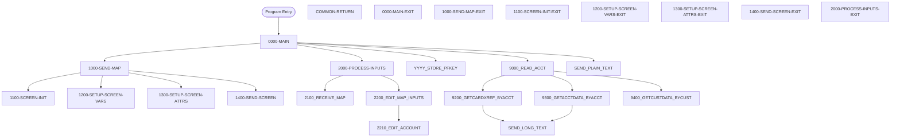

# Program: COACTVWC


---

## Quick Reference

| Attribute | Value |
|-----------|-------|
| Program ID | `COACTVWC` |
| Type | ONLINE |
| Lines | 942 |
| Source | [COACTVWC.cbl](../carddemo/COACTVWC.cbl#L1) |
| Paragraphs | 34 |
| Statements | 28 |
| Impact Risk | **HIGH** — 33 programs affected |

> **View Source:** [Open COACTVWC.cbl](../carddemo/COACTVWC.cbl#L1)

## Source Grounding Facts

| Data Item | Literal Value |
|-----------|---------------|
| `WS-PROMPT-FOR-INPUT` | `Enter or update id of account to display` |
| `WS-INFORM-OUTPUT` | `Displaying details of given Account` |
| `WS-EXIT-MESSAGE` | `PF03 pressed.Exiting` |
| `WS-PROMPT-FOR-ACCT` | `Account number not provided` |


## Business Purpose

*Business purpose is not present in the extracted data. Run LLM enrichment to populate this section.*


## Dependency Context

> This section shows how **COACTVWC** connects to the rest of the system — who calls it,
> what it calls, and what data it shares. If linked programs exist, they must appear here.

### Programs That Call COACTVWC (Callers)

*No programs call COACTVWC — this is likely a top-level entry point or CICS transaction starter.*

### Programs Called by COACTVWC (Callees)

*COACTVWC does not call any other programs (leaf program).*

### Shared Data (Copybooks & Files)

#### Shared Copybooks

| Copybook | Also Used By | # Co-Users |
|----------|-------------|------------|
| `COACTVW` |  | 0 |
| `COCOM01Y` | COACTUPC, COADM01C, COBIL00C, COCRDLIC, COCRDSLC (+15 more) | 20 |
| `COTTL01Y` | COACTUPC, COADM01C, COBIL00C, COCRDLIC, COCRDSLC (+15 more) | 20 |
| `CSDAT01Y` | COACTUPC, COADM01C, COBIL00C, COCRDLIC, COCRDSLC (+15 more) | 20 |
| `CSMSG01Y` | COACTUPC, COADM01C, COBIL00C, COCRDLIC, COCRDSLC (+15 more) | 20 |
| `CSMSG02Y` | COACTUPC, COCRDSLC, COCRDUPC, COPAUS0C, COPAUS1C (+1 more) | 6 |
| `CSUSR01Y` | COACTUPC, COADM01C, COCRDLIC, COCRDSLC, COCRDUPC (+8 more) | 13 |
| `CVACT01Y` | CBACT01C, CBACT04C, CBEXPORT, CBIMPORT, CBSTM03A (+8 more) | 13 |
| `CVACT02Y` | CBACT02C, CBEXPORT, CBIMPORT, CBTRN01C, COCRDLIC (+4 more) | 9 |
| `CVACT03Y` | CBACT03C, CBACT04C, CBEXPORT, CBIMPORT, CBSTM03A (+8 more) | 13 |
| `CVCRD01Y` | COACTUPC, COCRDLIC, COCRDSLC, COCRDUPC, COTRTLIC (+1 more) | 6 |
| `CVCUS01Y` | CBCUS01C, CBEXPORT, CBIMPORT, CBTRN01C, COACTUPC (+4 more) | 9 |
| `DFHAID` | COACTUPC, COADM01C, COBIL00C, COCRDLIC, COCRDSLC (+15 more) | 20 |
| `DFHBMSCA` | COACTUPC, COADM01C, COBIL00C, COCRDLIC, COCRDSLC (+15 more) | 20 |


## Legacy Data Contracts

> These tables are derived from FILE SECTION records and COPY-expanded data declarations. They preserve the legacy field names, COBOL storage type, inferred modern type, and status-code values needed for Java DTOs, SQL schemas, API contracts, and migration mapping.


### Copybook Segment Layouts

#### `COACTVW` as `CACTVWAI`

| Legacy Field | Meaning | COBOL Type | Modern Type | Status / Format Notes |
|--------------|---------|------------|-------------|-----------------------|
| `CACTVWAI` | Cactvwai | `GROUP` | `OBJECT` |  |
| `CACTVWAO` | Cactvwao | `GROUP` | `OBJECT` |  |

#### `COCOM01Y` as `CARDDEMO-COMMAREA`

| Legacy Field | Meaning | COBOL Type | Modern Type | Status / Format Notes |
|--------------|---------|------------|-------------|-----------------------|
| `CARDDEMO-COMMAREA` | Carddemo Commarea | `GROUP` | `OBJECT` |  |
| `CDEMO-GENERAL-INFO` | General Info | `GROUP` | `OBJECT` |  |
| `CDEMO-FROM-TRANID` | From Tranid | `PIC X(04)` | `STRING(4)` |  |
| `CDEMO-FROM-PROGRAM` | From Program | `PIC X(08)` | `STRING(8)` |  |
| `CDEMO-TO-TRANID` | To Tranid | `PIC X(04)` | `STRING(4)` |  |
| `CDEMO-TO-PROGRAM` | To Program | `PIC X(08)` | `STRING(8)` |  |
| `CDEMO-USER-ID` | User ID | `PIC X(08)` | `STRING(8)` |  |
| `CDEMO-USER-TYPE` | User Type | `PIC X(01)` | `STRING(1)` |  |
| `CDEMO-PGM-CONTEXT` | Pgm Context | `PIC 9(01)` | `INTEGER` |  |
| `CDEMO-CUSTOMER-INFO` | Customer Info | `GROUP` | `OBJECT` |  |
| `CDEMO-CUST-ID` | Customer ID | `PIC 9(09)` | `INTEGER` |  |
| `CDEMO-CUST-FNAME` | Customer Fname | `PIC X(25)` | `STRING(25)` |  |
| `CDEMO-CUST-MNAME` | Customer Mname | `PIC X(25)` | `STRING(25)` |  |
| `CDEMO-CUST-LNAME` | Customer Lname | `PIC X(25)` | `STRING(25)` |  |
| `CDEMO-ACCOUNT-INFO` | Account Info | `GROUP` | `OBJECT` |  |
| `CDEMO-ACCT-ID` | Account ID | `PIC 9(11)` | `BIGINT` |  |
| `CDEMO-ACCT-STATUS` | Account Status | `PIC X(01)` | `STRING(1)` |  |
| `CDEMO-CARD-INFO` | Card Info | `GROUP` | `OBJECT` |  |
| `CDEMO-CARD-NUM` | Card Number | `PIC 9(16)` | `BIGINT` |  |
| `CDEMO-MORE-INFO` | More Info | `GROUP` | `OBJECT` |  |
| `CDEMO-LAST-MAP` | Last Map | `PIC X(7)` | `STRING(7)` |  |
| `CDEMO-LAST-MAPSET` | Last Mapset | `PIC X(7)` | `STRING(7)` |  |

#### `COTTL01Y` as `CCDA-SCREEN-TITLE`

| Legacy Field | Meaning | COBOL Type | Modern Type | Status / Format Notes |
|--------------|---------|------------|-------------|-----------------------|
| `CCDA-SCREEN-TITLE` | Ccda Screen Title | `GROUP` | `OBJECT` |  |
| `CCDA-TITLE01` | Ccda Title01 | `PIC X(40)` | `STRING(40)` |  |
| `CCDA-TITLE02` | Ccda Title02 | `PIC X(40)` | `STRING(40)` |  |
| `CCDA-THANK-YOU` | Ccda Thank You | `PIC X(40)` | `STRING(40)` |  |

#### `CSDAT01Y` as `WS-DATE-TIME`

| Legacy Field | Meaning | COBOL Type | Modern Type | Status / Format Notes |
|--------------|---------|------------|-------------|-----------------------|
| `WS-DATE-TIME` | Date Time | `GROUP` | `OBJECT` |  |
| `WS-CURDATE-DATA` | Curdate Data | `GROUP` | `OBJECT` |  |
| `WS-CURDATE` | Curdate | `GROUP` | `OBJECT` |  |
| `WS-CURDATE-YEAR` | Curdate Year | `PIC 9(04)` | `INTEGER` |  |
| `WS-CURDATE-MONTH` | Curdate Month | `PIC 9(02)` | `INTEGER` |  |
| `WS-CURDATE-DAY` | Curdate Day | `PIC 9(02)` | `INTEGER` |  |
| `WS-CURDATE-N` | Curdate N | `PIC 9(08)` | `INTEGER` |  |
| `WS-CURTIME` | Curtime | `GROUP` | `OBJECT` |  |
| `WS-CURTIME-HOURS` | Curtime Hours | `PIC 9(02)` | `INTEGER` |  |
| `WS-CURTIME-MINUTE` | Curtime Minute | `PIC 9(02)` | `INTEGER` |  |
| `WS-CURTIME-SECOND` | Curtime Second | `PIC 9(02)` | `INTEGER` |  |
| `WS-CURTIME-MILSEC` | Curtime Milsec | `PIC 9(02)` | `INTEGER` |  |
| `WS-CURTIME-N` | Curtime N | `PIC 9(08)` | `INTEGER` |  |
| `WS-CURDATE-MM-DD-YY` | Curdate Mm Dd Yy | `GROUP` | `OBJECT` |  |
| `WS-CURDATE-MM` | Curdate Mm | `PIC 9(02)` | `INTEGER` |  |
| `FILLER` | Filler | `PIC X(01)` | `STRING(1)` |  |
| `WS-CURDATE-DD` | Curdate Dd | `PIC 9(02)` | `INTEGER` |  |
| `FILLER` | Filler | `PIC X(01)` | `STRING(1)` |  |
| `WS-CURDATE-YY` | Curdate Yy | `PIC 9(02)` | `INTEGER` |  |
| `WS-CURTIME-HH-MM-SS` | Curtime Hh Mm Ss | `GROUP` | `OBJECT` |  |
| `WS-CURTIME-HH` | Curtime Hh | `PIC 9(02)` | `INTEGER` |  |
| `FILLER` | Filler | `PIC X(01)` | `STRING(1)` |  |
| `WS-CURTIME-MM` | Curtime Mm | `PIC 9(02)` | `INTEGER` |  |
| `FILLER` | Filler | `PIC X(01)` | `STRING(1)` |  |
| `WS-CURTIME-SS` | Curtime Ss | `PIC 9(02)` | `INTEGER` |  |
| `WS-TIMESTAMP` | Timestamp | `GROUP` | `OBJECT` |  |
| `WS-TIMESTAMP-DT-YYYY` | Timestamp Date Yyyy | `PIC 9(04)` | `INTEGER` |  |
| `FILLER` | Filler | `PIC X(01)` | `STRING(1)` |  |
| `WS-TIMESTAMP-DT-MM` | Timestamp Date Mm | `PIC 9(02)` | `INTEGER` |  |
| `FILLER` | Filler | `PIC X(01)` | `STRING(1)` |  |
| `WS-TIMESTAMP-DT-DD` | Timestamp Date Dd | `PIC 9(02)` | `INTEGER` |  |
| `FILLER` | Filler | `PIC X(01)` | `STRING(1)` |  |
| `WS-TIMESTAMP-TM-HH` | Timestamp Tm Hh | `PIC 9(02)` | `INTEGER` |  |
| `FILLER` | Filler | `PIC X(01)` | `STRING(1)` |  |
| `WS-TIMESTAMP-TM-MM` | Timestamp Tm Mm | `PIC 9(02)` | `INTEGER` |  |
| `FILLER` | Filler | `PIC X(01)` | `STRING(1)` |  |
| `WS-TIMESTAMP-TM-SS` | Timestamp Tm Ss | `PIC 9(02)` | `INTEGER` |  |
| `FILLER` | Filler | `PIC X(01)` | `STRING(1)` |  |
| `WS-TIMESTAMP-TM-MS6` | Timestamp Tm Ms6 | `PIC 9(06)` | `INTEGER` |  |

#### `CSMSG01Y` as `CCDA-COMMON-MESSAGES`

| Legacy Field | Meaning | COBOL Type | Modern Type | Status / Format Notes |
|--------------|---------|------------|-------------|-----------------------|
| `CCDA-COMMON-MESSAGES` | Ccda Common Messages | `GROUP` | `OBJECT` |  |
| `CCDA-MSG-THANK-YOU` | Ccda Msg Thank You | `PIC X(50)` | `STRING(50)` |  |
| `CCDA-MSG-INVALID-KEY` | Ccda Msg Invalid Key | `PIC X(50)` | `STRING(50)` |  |

#### `CSMSG02Y` as `ABEND-DATA`

| Legacy Field | Meaning | COBOL Type | Modern Type | Status / Format Notes |
|--------------|---------|------------|-------------|-----------------------|
| `ABEND-DATA` | Abend Data | `GROUP` | `OBJECT` |  |
| `ABEND-CODE` | Abend Code | `PIC X(4)` | `STRING(4)` |  |
| `ABEND-CULPRIT` | Abend Culprit | `PIC X(8)` | `STRING(8)` |  |
| `ABEND-REASON` | Abend Reason | `PIC X(50)` | `STRING(50)` |  |
| `ABEND-MSG` | Abend Msg | `PIC X(72)` | `STRING(72)` |  |

#### `CSUSR01Y` as `SEC-USER-DATA`

| Legacy Field | Meaning | COBOL Type | Modern Type | Status / Format Notes |
|--------------|---------|------------|-------------|-----------------------|
| `SEC-USER-DATA` | Sec User Data | `GROUP` | `OBJECT` |  |
| `SEC-USR-ID` | Sec Usr ID | `PIC X(08)` | `STRING(8)` |  |
| `SEC-USR-FNAME` | Sec Usr Fname | `PIC X(20)` | `STRING(20)` |  |
| `SEC-USR-LNAME` | Sec Usr Lname | `PIC X(20)` | `STRING(20)` |  |
| `SEC-USR-PWD` | Sec Usr Pwd | `PIC X(08)` | `STRING(8)` |  |
| `SEC-USR-TYPE` | Sec Usr Type | `PIC X(01)` | `STRING(1)` |  |
| `SEC-USR-FILLER` | Sec Usr Filler | `PIC X(23)` | `STRING(23)` |  |

#### `CVACT01Y` as `ACCOUNT-RECORD`

| Legacy Field | Meaning | COBOL Type | Modern Type | Status / Format Notes |
|--------------|---------|------------|-------------|-----------------------|
| `ACCOUNT-RECORD` | Account Record | `GROUP` | `OBJECT` |  |
| `ACCT-ID` | Account ID | `PIC 9(11)` | `BIGINT` |  |
| `ACCT-ACTIVE-STATUS` | Account Active Status | `PIC X(01)` | `STRING(1)` |  |
| `ACCT-CURR-BAL` | Account Curr Bal | `PIC S9(10)V99` | `DECIMAL(12,2)` |  |
| `ACCT-CREDIT-LIMIT` | Account Credit Limit | `PIC S9(10)V99` | `DECIMAL(12,2)` |  |
| `ACCT-CASH-CREDIT-LIMIT` | Account Cash Credit Limit | `PIC S9(10)V99` | `DECIMAL(12,2)` |  |
| `ACCT-OPEN-DATE` | Account Open Date | `PIC X(10)` | `STRING(10)` | Date-like field; verify YYDDD, YYMMDD, or ISO format before migration. |
| `ACCT-EXPIRAION-DATE` | Account Expiraion Date | `PIC X(10)` | `STRING(10)` | Date-like field; verify YYDDD, YYMMDD, or ISO format before migration. |
| `ACCT-REISSUE-DATE` | Account Reissue Date | `PIC X(10)` | `STRING(10)` | Date-like field; verify YYDDD, YYMMDD, or ISO format before migration. |
| `ACCT-CURR-CYC-CREDIT` | Account Curr Cyc Credit | `PIC S9(10)V99` | `DECIMAL(12,2)` |  |
| `ACCT-CURR-CYC-DEBIT` | Account Curr Cyc Debit | `PIC S9(10)V99` | `DECIMAL(12,2)` |  |
| `ACCT-ADDR-ZIP` | Account Addr Zip | `PIC X(10)` | `STRING(10)` |  |
| `ACCT-GROUP-ID` | Account Group ID | `PIC X(10)` | `STRING(10)` |  |
| `FILLER` | Filler | `PIC X(178)` | `STRING(178)` |  |

#### `CVACT02Y` as `CARD-RECORD`

| Legacy Field | Meaning | COBOL Type | Modern Type | Status / Format Notes |
|--------------|---------|------------|-------------|-----------------------|
| `CARD-RECORD` | Card Record | `GROUP` | `OBJECT` |  |
| `CARD-NUM` | Card Number | `PIC X(16)` | `STRING(16)` |  |
| `CARD-ACCT-ID` | Card Account ID | `PIC 9(11)` | `BIGINT` |  |
| `CARD-CVV-CD` | Card Cvv Cd | `PIC 9(03)` | `INTEGER` |  |
| `CARD-EMBOSSED-NAME` | Card Embossed Name | `PIC X(50)` | `STRING(50)` |  |
| `CARD-EXPIRAION-DATE` | Card Expiraion Date | `PIC X(10)` | `STRING(10)` | Date-like field; verify YYDDD, YYMMDD, or ISO format before migration. |
| `CARD-ACTIVE-STATUS` | Card Active Status | `PIC X(01)` | `STRING(1)` |  |
| `FILLER` | Filler | `PIC X(59)` | `STRING(59)` |  |

#### `CVACT03Y` as `CARD-XREF-RECORD`

| Legacy Field | Meaning | COBOL Type | Modern Type | Status / Format Notes |
|--------------|---------|------------|-------------|-----------------------|
| `CARD-XREF-RECORD` | Card Xref Record | `GROUP` | `OBJECT` |  |
| `XREF-CARD-NUM` | Xref Card Number | `PIC X(16)` | `STRING(16)` |  |
| `XREF-CUST-ID` | Xref Customer ID | `PIC 9(09)` | `INTEGER` |  |
| `XREF-ACCT-ID` | Xref Account ID | `PIC 9(11)` | `BIGINT` |  |
| `FILLER` | Filler | `PIC X(14)` | `STRING(14)` |  |

#### `CVCRD01Y` as `CC-WORK-AREAS`

| Legacy Field | Meaning | COBOL Type | Modern Type | Status / Format Notes |
|--------------|---------|------------|-------------|-----------------------|
| `CC-WORK-AREAS` | Cc Work Areas | `GROUP` | `OBJECT` |  |
| `CC-WORK-AREA` | Cc Work Area | `GROUP` | `OBJECT` |  |
| `CCARD-AID` | Ccard Aid | `PIC X(5)` | `STRING(5)` |  |
| `CCARD-NEXT-PROG` | Ccard Next Prog | `PIC X(8)` | `STRING(8)` |  |
| `CCARD-NEXT-MAPSET` | Ccard Next Mapset | `PIC X(7)` | `STRING(7)` |  |
| `CCARD-NEXT-MAP` | Ccard Next Map | `PIC X(7)` | `STRING(7)` |  |
| `CCARD-ERROR-MSG` | Ccard Error Msg | `PIC X(75)` | `STRING(75)` |  |
| `CCARD-RETURN-MSG` | Ccard Return Msg | `PIC X(75)` | `STRING(75)` |  |
| `CC-ACCT-ID` | Cc Account ID | `PIC X(11)` | `STRING(11)` |  |
| `CC-ACCT-ID-N` | Cc Account ID N | `PIC 9(11)` | `BIGINT` |  |
| `CC-CARD-NUM` | Cc Card Number | `PIC X(16)` | `STRING(16)` |  |
| `CC-CARD-NUM-N` | Cc Card Number N | `PIC 9(16)` | `BIGINT` |  |
| `CC-CUST-ID` | Cc Customer ID | `PIC X(09)` | `STRING(9)` |  |
| `CC-CUST-ID-N` | Cc Customer ID N | `PIC 9(9)` | `INTEGER` |  |

#### `CVCUS01Y` as `CUSTOMER-RECORD`

| Legacy Field | Meaning | COBOL Type | Modern Type | Status / Format Notes |
|--------------|---------|------------|-------------|-----------------------|
| `CUSTOMER-RECORD` | Customer Record | `GROUP` | `OBJECT` |  |
| `CUST-ID` | Customer ID | `PIC 9(09)` | `INTEGER` |  |
| `CUST-FIRST-NAME` | Customer First Name | `PIC X(25)` | `STRING(25)` |  |
| `CUST-MIDDLE-NAME` | Customer Middle Name | `PIC X(25)` | `STRING(25)` |  |
| `CUST-LAST-NAME` | Customer Last Name | `PIC X(25)` | `STRING(25)` |  |
| `CUST-ADDR-LINE-1` | Customer Addr Line 1 | `PIC X(50)` | `STRING(50)` |  |
| `CUST-ADDR-LINE-2` | Customer Addr Line 2 | `PIC X(50)` | `STRING(50)` |  |
| `CUST-ADDR-LINE-3` | Customer Addr Line 3 | `PIC X(50)` | `STRING(50)` |  |
| `CUST-ADDR-STATE-CD` | Customer Addr State Cd | `PIC X(02)` | `STRING(2)` |  |
| `CUST-ADDR-COUNTRY-CD` | Customer Addr Country Cd | `PIC X(03)` | `STRING(3)` |  |
| `CUST-ADDR-ZIP` | Customer Addr Zip | `PIC X(10)` | `STRING(10)` |  |
| `CUST-PHONE-NUM-1` | Customer Phone Number 1 | `PIC X(15)` | `STRING(15)` |  |
| `CUST-PHONE-NUM-2` | Customer Phone Number 2 | `PIC X(15)` | `STRING(15)` |  |
| `CUST-SSN` | Customer Ssn | `PIC 9(09)` | `INTEGER` |  |
| `CUST-GOVT-ISSUED-ID` | Customer Govt Issued ID | `PIC X(20)` | `STRING(20)` |  |
| `CUST-DOB-YYYY-MM-DD` | Customer Dob Yyyy Mm Dd | `PIC X(10)` | `STRING(10)` |  |
| `CUST-EFT-ACCOUNT-ID` | Customer Eft Account ID | `PIC X(10)` | `STRING(10)` |  |
| `CUST-PRI-CARD-HOLDER-IND` | Customer Pri Card Holder Ind | `PIC X(01)` | `STRING(1)` |  |
| `CUST-FICO-CREDIT-SCORE` | Customer Fico Credit Score | `PIC 9(03)` | `INTEGER` |  |
| `FILLER` | Filler | `PIC X(168)` | `STRING(168)` |  |

#### `DFHAID` as `DFHAID`

| Legacy Field | Meaning | COBOL Type | Modern Type | Status / Format Notes |
|--------------|---------|------------|-------------|-----------------------|
| `DFHAID` | Dfhaid | `GROUP` | `OBJECT` |  |

#### `DFHBMSCA` as `DFHBMSCA`

| Legacy Field | Meaning | COBOL Type | Modern Type | Status / Format Notes |
|--------------|---------|------------|-------------|-----------------------|
| `DFHBMSCA` | Dfhbmsca | `GROUP` | `OBJECT` |  |


### Data Movement And Key Mapping

| Line | Source | Target | Meaning |
|------|--------|--------|---------|
| 434 | `FUNCTION CURRENT-DATE` | `WS-CURDATE-DATA` | FUNCTION CURRENT-DATE populates WS-CURDATE-DATA |
| 441 | `FUNCTION CURRENT-DATE` | `WS-CURDATE-DATA` | FUNCTION CURRENT-DATE populates WS-CURDATE-DATA |
| 443 | `WS-CURDATE-MONTH` | `WS-CURDATE-MM` | WS-CURDATE-MONTH populates WS-CURDATE-MM |
| 444 | `WS-CURDATE-DAY` | `WS-CURDATE-DD` | WS-CURDATE-DAY populates WS-CURDATE-DD |
| 445 | `WS-CURDATE-YEAR(3:2)` | `WS-CURDATE-YY` | WS-CURDATE-YEAR(3:2) populates WS-CURDATE-YY |
| 447 | `WS-CURDATE-MM-DD-YY` | `CURDATEO OF CACTVWAO` | WS-CURDATE-MM-DD-YY populates CURDATEO OF CACTVWAO |
| 466 | `LOW-VALUES` | `ACCTSIDO OF CACTVWAO` | LOW-VALUES populates ACCTSIDO OF CACTVWAO |
| 468 | `CC-ACCT-ID` | `ACCTSIDO OF CACTVWAO` | CC-ACCT-ID populates ACCTSIDO OF CACTVWAO |
| 473 | `ACCT-ACTIVE-STATUS` | `ACSTTUSO OF CACTVWAO` | ACCT-ACTIVE-STATUS populates ACSTTUSO OF CACTVWAO |
| 475 | `ACCT-CURR-BAL` | `ACURBALO OF CACTVWAO` | ACCT-CURR-BAL populates ACURBALO OF CACTVWAO |
| 477 | `ACCT-CREDIT-LIMIT` | `ACRDLIMO OF CACTVWAO` | ACCT-CREDIT-LIMIT populates ACRDLIMO OF CACTVWAO |
| 485 | `ACCT-CURR-CYC-DEBIT` | `ACRCYDBO OF CACTVWAO` | ACCT-CURR-CYC-DEBIT populates ACRCYDBO OF CACTVWAO |
| 487 | `ACCT-OPEN-DATE` | `ADTOPENO OF CACTVWAO` | ACCT-OPEN-DATE populates ADTOPENO OF CACTVWAO |
| 488 | `ACCT-EXPIRAION-DATE` | `AEXPDTO OF CACTVWAO` | ACCT-EXPIRAION-DATE populates AEXPDTO OF CACTVWAO |
| 489 | `ACCT-REISSUE-DATE` | `AREISDTO OF CACTVWAO` | ACCT-REISSUE-DATE populates AREISDTO OF CACTVWAO |
| 490 | `ACCT-GROUP-ID` | `AADDGRPO OF CACTVWAO` | ACCT-GROUP-ID populates AADDGRPO OF CACTVWAO |
| 494 | `CUST-ID` | `ACSTNUMO OF CACTVWAO` | CUST-ID populates ACSTNUMO OF CACTVWAO |
| 507 | `CUST-DOB-YYYY-MM-DD` | `ACSTDOBO OF CACTVWAO` | CUST-DOB-YYYY-MM-DD populates ACSTDOBO OF CACTVWAO |
| 508 | `CUST-FIRST-NAME` | `ACSFNAMO OF CACTVWAO` | CUST-FIRST-NAME populates ACSFNAMO OF CACTVWAO |
| 509 | `CUST-MIDDLE-NAME` | `ACSMNAMO OF CACTVWAO` | CUST-MIDDLE-NAME populates ACSMNAMO OF CACTVWAO |
| 510 | `CUST-LAST-NAME` | `ACSLNAMO OF CACTVWAO` | CUST-LAST-NAME populates ACSLNAMO OF CACTVWAO |
| 511 | `CUST-ADDR-LINE-1` | `ACSADL1O OF CACTVWAO` | CUST-ADDR-LINE-1 populates ACSADL1O OF CACTVWAO |
| 512 | `CUST-ADDR-LINE-2` | `ACSADL2O OF CACTVWAO` | CUST-ADDR-LINE-2 populates ACSADL2O OF CACTVWAO |
| 513 | `CUST-ADDR-LINE-3` | `ACSCITYO OF CACTVWAO` | CUST-ADDR-LINE-3 populates ACSCITYO OF CACTVWAO |
| 514 | `CUST-ADDR-STATE-CD` | `ACSSTTEO OF CACTVWAO` | CUST-ADDR-STATE-CD populates ACSSTTEO OF CACTVWAO |
| 515 | `CUST-ADDR-ZIP` | `ACSZIPCO OF CACTVWAO` | CUST-ADDR-ZIP populates ACSZIPCO OF CACTVWAO |
| 516 | `CUST-ADDR-COUNTRY-CD` | `ACSCTRYO OF CACTVWAO` | CUST-ADDR-COUNTRY-CD populates ACSCTRYO OF CACTVWAO |
| 517 | `CUST-PHONE-NUM-1` | `ACSPHN1O OF CACTVWAO` | CUST-PHONE-NUM-1 populates ACSPHN1O OF CACTVWAO |
| 518 | `CUST-PHONE-NUM-2` | `ACSPHN2O OF CACTVWAO` | CUST-PHONE-NUM-2 populates ACSPHN2O OF CACTVWAO |
| 519 | `CUST-GOVT-ISSUED-ID` | `ACSGOVTO OF CACTVWAO` | CUST-GOVT-ISSUED-ID populates ACSGOVTO OF CACTVWAO |


---

## Dependency Graph

```mermaid
flowchart TD
    COACTVWC["⬤ COACTVWC"]:::target
    CB_COCOM01Y{{"COCOM01Y"}}:::copybook
    COACTVWC -.- CB_COCOM01Y
    COACTUPC["COACTUPC"]:::coupled
    CB_COCOM01Y -.- COACTUPC
    COADM01C["COADM01C"]:::coupled
    CB_COCOM01Y -.- COADM01C
    COBIL00C["COBIL00C"]:::coupled
    CB_COCOM01Y -.- COBIL00C
    CB_COTTL01Y{{"COTTL01Y"}}:::copybook
    COACTVWC -.- CB_COTTL01Y
    COACTUPC["COACTUPC"]:::coupled
    CB_COTTL01Y -.- COACTUPC
    COADM01C["COADM01C"]:::coupled
    CB_COTTL01Y -.- COADM01C
    COBIL00C["COBIL00C"]:::coupled
    CB_COTTL01Y -.- COBIL00C
    CB_CSDAT01Y{{"CSDAT01Y"}}:::copybook
    COACTVWC -.- CB_CSDAT01Y
    COACTUPC["COACTUPC"]:::coupled
    CB_CSDAT01Y -.- COACTUPC
    COADM01C["COADM01C"]:::coupled
    CB_CSDAT01Y -.- COADM01C
    COBIL00C["COBIL00C"]:::coupled
    CB_CSDAT01Y -.- COBIL00C
    CB_CSMSG01Y{{"CSMSG01Y"}}:::copybook
    COACTVWC -.- CB_CSMSG01Y
    COACTUPC["COACTUPC"]:::coupled
    CB_CSMSG01Y -.- COACTUPC
    COADM01C["COADM01C"]:::coupled
    CB_CSMSG01Y -.- COADM01C
    COBIL00C["COBIL00C"]:::coupled
    CB_CSMSG01Y -.- COBIL00C
    CB_CSMSG02Y{{"CSMSG02Y"}}:::copybook
    COACTVWC -.- CB_CSMSG02Y
    COACTUPC["COACTUPC"]:::coupled
    CB_CSMSG02Y -.- COACTUPC
    COCRDSLC["COCRDSLC"]:::coupled
    CB_CSMSG02Y -.- COCRDSLC
    COCRDUPC["COCRDUPC"]:::coupled
    CB_CSMSG02Y -.- COCRDUPC
    CB_CSUSR01Y{{"CSUSR01Y"}}:::copybook
    COACTVWC -.- CB_CSUSR01Y
    COACTUPC["COACTUPC"]:::coupled
    CB_CSUSR01Y -.- COACTUPC
    COADM01C["COADM01C"]:::coupled
    CB_CSUSR01Y -.- COADM01C
    COCRDLIC["COCRDLIC"]:::coupled
    CB_CSUSR01Y -.- COCRDLIC
    CB_CVACT01Y{{"CVACT01Y"}}:::copybook
    COACTVWC -.- CB_CVACT01Y
    CBACT01C["CBACT01C"]:::coupled
    CB_CVACT01Y -.- CBACT01C
    CBACT04C["CBACT04C"]:::coupled
    CB_CVACT01Y -.- CBACT04C
    CBEXPORT["CBEXPORT"]:::coupled
    CB_CVACT01Y -.- CBEXPORT
    classDef target fill:#f85149,stroke:#da3633,color:#fff,stroke-width:3px
    classDef caller fill:#58a6ff,stroke:#1f6feb,color:#fff
    classDef callee fill:#3fb950,stroke:#238636,color:#fff
    classDef copybook fill:#d29922,stroke:#9e6a03,color:#fff
    classDef coupled fill:#d29922,stroke:#9e6a03,color:#fff,stroke-dasharray:5
    classDef transitive fill:#484f58,stroke:#8b949e,color:#c9d1d9,stroke-dasharray:5
```



> **Legend:** 🔴 Target program · 🔵 Direct callers · 🟢 Direct callees · 🟡 Copybook-coupled · ⚫ Transitive (indirect)

---

## Impact Ripple View

> **If you change COACTVWC, what else could break?**

| Impact Metric | Count |
|--------------|-------|
| Direct Callers | 0 |
| Transitive Callers (callers of callers) | 0 |
| Direct Callees | 0 |
| Transitive Callees | 0 |
| Copybook-Coupled Programs | 33 |
| **Total Impact** | **33** |
| **Risk Rating** | **HIGH** |


**Programs affected via shared copybooks:**
- `CBACT01C`
- `CBACT02C`
- `CBACT03C`
- `CBACT04C`
- `CBCUS01C`
- `CBEXPORT`
- `CBIMPORT`
- `CBSTM03A`
- `CBTRN01C`
- `CBTRN02C`
- `CBTRN03C`
- `COACCT01`
- `COACTUPC`
- `COADM01C`
- `COBIL00C`
- `COCRDLIC`
- `COCRDSLC`
- `COCRDUPC`
- `COMEN01C`
- `COPAUA0C`
- `COPAUS0C`
- `COPAUS1C`
- `CORPT00C`
- `COSGN00C`
- `COTRN00C`
- `COTRN01C`
- `COTRN02C`
- `COTRTLIC`
- `COTRTUPC`
- `COUSR00C`
- `COUSR01C`
- `COUSR02C`
- `COUSR03C`

---

## Statement Profile

| Statement Type | Count |
|---------------|-------|
| IF | 28 |

## Control Flow



## Paragraphs

### 0000-MAIN

| | |
|---|---|
| **Paragraph** | `0000-MAIN` |
| **Lines** | 262 - 393 |
| **View Code** | [Jump to Line 262](../carddemo/COACTVWC.cbl#L262) |


### COMMON-RETURN

| | |
|---|---|
| **Paragraph** | `COMMON-RETURN` |
| **Lines** | 394 - 407 |
| **View Code** | [Jump to Line 394](../carddemo/COACTVWC.cbl#L394) |


### 0000-MAIN-EXIT

| | |
|---|---|
| **Paragraph** | `0000-MAIN-EXIT` |
| **Lines** | 411 - 415 |
| **View Code** | [Jump to Line 411](../carddemo/COACTVWC.cbl#L411) |


### 1000-SEND-MAP

| | |
|---|---|
| **Paragraph** | `1000-SEND-MAP` |
| **Lines** | 416 - 426 |
| **View Code** | [Jump to Line 416](../carddemo/COACTVWC.cbl#L416) |


### 1000-SEND-MAP-EXIT

| | |
|---|---|
| **Paragraph** | `1000-SEND-MAP-EXIT` |
| **Lines** | 427 - 430 |
| **View Code** | [Jump to Line 427](../carddemo/COACTVWC.cbl#L427) |


### 1100-SCREEN-INIT

| | |
|---|---|
| **Paragraph** | `1100-SCREEN-INIT` |
| **Lines** | 431 - 456 |
| **View Code** | [Jump to Line 431](../carddemo/COACTVWC.cbl#L431) |


### 1100-SCREEN-INIT-EXIT

| | |
|---|---|
| **Paragraph** | `1100-SCREEN-INIT-EXIT` |
| **Lines** | 457 - 459 |
| **View Code** | [Jump to Line 457](../carddemo/COACTVWC.cbl#L457) |


### 1200-SETUP-SCREEN-VARS

| | |
|---|---|
| **Paragraph** | `1200-SETUP-SCREEN-VARS` |
| **Lines** | 460 - 536 |
| **View Code** | [Jump to Line 460](../carddemo/COACTVWC.cbl#L460) |


### 1200-SETUP-SCREEN-VARS-EXIT

| | |
|---|---|
| **Paragraph** | `1200-SETUP-SCREEN-VARS-EXIT` |
| **Lines** | 537 - 540 |
| **View Code** | [Jump to Line 537](../carddemo/COACTVWC.cbl#L537) |


### 1300-SETUP-SCREEN-ATTRS

| | |
|---|---|
| **Paragraph** | `1300-SETUP-SCREEN-ATTRS` |
| **Lines** | 541 - 573 |
| **View Code** | [Jump to Line 541](../carddemo/COACTVWC.cbl#L541) |


### 1300-SETUP-SCREEN-ATTRS-EXIT

| | |
|---|---|
| **Paragraph** | `1300-SETUP-SCREEN-ATTRS-EXIT` |
| **Lines** | 574 - 576 |
| **View Code** | [Jump to Line 574](../carddemo/COACTVWC.cbl#L574) |


### 1400-SEND-SCREEN

| | |
|---|---|
| **Paragraph** | `1400-SEND-SCREEN` |
| **Lines** | 577 - 591 |
| **View Code** | [Jump to Line 577](../carddemo/COACTVWC.cbl#L577) |


### 1400-SEND-SCREEN-EXIT

| | |
|---|---|
| **Paragraph** | `1400-SEND-SCREEN-EXIT` |
| **Lines** | 592 - 595 |
| **View Code** | [Jump to Line 592](../carddemo/COACTVWC.cbl#L592) |


### 2000-PROCESS-INPUTS

| | |
|---|---|
| **Paragraph** | `2000-PROCESS-INPUTS` |
| **Lines** | 596 - 606 |
| **View Code** | [Jump to Line 596](../carddemo/COACTVWC.cbl#L596) |


### 2000-PROCESS-INPUTS-EXIT

| | |
|---|---|
| **Paragraph** | `2000-PROCESS-INPUTS-EXIT` |
| **Lines** | 607 - 609 |
| **View Code** | [Jump to Line 607](../carddemo/COACTVWC.cbl#L607) |


### 2100-RECEIVE-MAP

| | |
|---|---|
| **Paragraph** | `2100-RECEIVE-MAP` |
| **Lines** | 610 - 618 |
| **View Code** | [Jump to Line 610](../carddemo/COACTVWC.cbl#L610) |


### 2100-RECEIVE-MAP-EXIT

| | |
|---|---|
| **Paragraph** | `2100-RECEIVE-MAP-EXIT` |
| **Lines** | 619 - 621 |
| **View Code** | [Jump to Line 619](../carddemo/COACTVWC.cbl#L619) |


### 2200-EDIT-MAP-INPUTS

| | |
|---|---|
| **Paragraph** | `2200-EDIT-MAP-INPUTS` |
| **Lines** | 622 - 644 |
| **View Code** | [Jump to Line 622](../carddemo/COACTVWC.cbl#L622) |


### 2200-EDIT-MAP-INPUTS-EXIT

| | |
|---|---|
| **Paragraph** | `2200-EDIT-MAP-INPUTS-EXIT` |
| **Lines** | 645 - 648 |
| **View Code** | [Jump to Line 645](../carddemo/COACTVWC.cbl#L645) |


### 2210-EDIT-ACCOUNT

| | |
|---|---|
| **Paragraph** | `2210-EDIT-ACCOUNT` |
| **Lines** | 649 - 682 |
| **View Code** | [Jump to Line 649](../carddemo/COACTVWC.cbl#L649) |


### 2210-EDIT-ACCOUNT-EXIT

| | |
|---|---|
| **Paragraph** | `2210-EDIT-ACCOUNT-EXIT` |
| **Lines** | 683 - 686 |
| **View Code** | [Jump to Line 683](../carddemo/COACTVWC.cbl#L683) |


### 9000-READ-ACCT

| | |
|---|---|
| **Paragraph** | `9000-READ-ACCT` |
| **Lines** | 687 - 719 |
| **View Code** | [Jump to Line 687](../carddemo/COACTVWC.cbl#L687) |


### 9000-READ-ACCT-EXIT

| | |
|---|---|
| **Paragraph** | `9000-READ-ACCT-EXIT` |
| **Lines** | 720 - 722 |
| **View Code** | [Jump to Line 720](../carddemo/COACTVWC.cbl#L720) |


### 9200-GETCARDXREF-BYACCT

| | |
|---|---|
| **Paragraph** | `9200-GETCARDXREF-BYACCT` |
| **Lines** | 723 - 770 |
| **View Code** | [Jump to Line 723](../carddemo/COACTVWC.cbl#L723) |


### 9200-GETCARDXREF-BYACCT-EXIT

| | |
|---|---|
| **Paragraph** | `9200-GETCARDXREF-BYACCT-EXIT` |
| **Lines** | 771 - 773 |
| **View Code** | [Jump to Line 771](../carddemo/COACTVWC.cbl#L771) |


### 9300-GETACCTDATA-BYACCT

| | |
|---|---|
| **Paragraph** | `9300-GETACCTDATA-BYACCT` |
| **Lines** | 774 - 820 |
| **View Code** | [Jump to Line 774](../carddemo/COACTVWC.cbl#L774) |


### 9300-GETACCTDATA-BYACCT-EXIT

| | |
|---|---|
| **Paragraph** | `9300-GETACCTDATA-BYACCT-EXIT` |
| **Lines** | 821 - 824 |
| **View Code** | [Jump to Line 821](../carddemo/COACTVWC.cbl#L821) |


### 9400-GETCUSTDATA-BYCUST

| | |
|---|---|
| **Paragraph** | `9400-GETCUSTDATA-BYCUST` |
| **Lines** | 825 - 869 |
| **View Code** | [Jump to Line 825](../carddemo/COACTVWC.cbl#L825) |


### 9400-GETCUSTDATA-BYCUST-EXIT

| | |
|---|---|
| **Paragraph** | `9400-GETCUSTDATA-BYCUST-EXIT` |
| **Lines** | 870 - 876 |
| **View Code** | [Jump to Line 870](../carddemo/COACTVWC.cbl#L870) |


### SEND-PLAIN-TEXT

| | |
|---|---|
| **Paragraph** | `SEND-PLAIN-TEXT` |
| **Lines** | 877 - 887 |
| **View Code** | [Jump to Line 877](../carddemo/COACTVWC.cbl#L877) |


### SEND-PLAIN-TEXT-EXIT

| | |
|---|---|
| **Paragraph** | `SEND-PLAIN-TEXT-EXIT` |
| **Lines** | 888 - 895 |
| **View Code** | [Jump to Line 888](../carddemo/COACTVWC.cbl#L888) |


### SEND-LONG-TEXT

| | |
|---|---|
| **Paragraph** | `SEND-LONG-TEXT` |
| **Lines** | 896 - 906 |
| **View Code** | [Jump to Line 896](../carddemo/COACTVWC.cbl#L896) |


### SEND-LONG-TEXT-EXIT

| | |
|---|---|
| **Paragraph** | `SEND-LONG-TEXT-EXIT` |
| **Lines** | 907 - 915 |
| **View Code** | [Jump to Line 907](../carddemo/COACTVWC.cbl#L907) |


### ABEND-ROUTINE

| | |
|---|---|
| **Paragraph** | `ABEND-ROUTINE` |
| **Lines** | 916 - 941 |
| **View Code** | [Jump to Line 916](../carddemo/COACTVWC.cbl#L916) |


## Copybook Field Dictionaries

The following copybooks are included by this program. Each entry shows the actual fields
extracted from the copybook source file (`.cpy`).

### Copybook `COACTVW`

| Level | Field | PIC | USAGE | Parent | Notes |
|-------|-------|-----|-------|--------|-------|
| `01` | `CACTVWAI` | `None` | None | None |  |
| `02` | `TRNNAMEL` | `S9(4)` | COMP | CACTVWAI |  |
| `02` | `TRNNAMEF` | `X` | None | CACTVWAI |  |
| `03` | `TRNNAMEA` | `X` | None | CACTVWAI |  |
| `02` | `TRNNAMEI` | `X(4)` | None | CACTVWAI |  |
| `02` | `TITLE01L` | `S9(4)` | COMP | CACTVWAI |  |
| `02` | `TITLE01F` | `X` | None | CACTVWAI |  |
| `03` | `TITLE01A` | `X` | None | CACTVWAI |  |
| `02` | `TITLE01I` | `X(40)` | None | CACTVWAI |  |
| `02` | `CURDATEL` | `S9(4)` | COMP | CACTVWAI |  |
| `02` | `CURDATEF` | `X` | None | CACTVWAI |  |
| `03` | `CURDATEA` | `X` | None | CACTVWAI |  |
| `02` | `CURDATEI` | `X(8)` | None | CACTVWAI |  |
| `02` | `PGMNAMEL` | `S9(4)` | COMP | CACTVWAI |  |
| `02` | `PGMNAMEF` | `X` | None | CACTVWAI |  |
| `03` | `PGMNAMEA` | `X` | None | CACTVWAI |  |
| `02` | `PGMNAMEI` | `X(8)` | None | CACTVWAI |  |
| `02` | `TITLE02L` | `S9(4)` | COMP | CACTVWAI |  |
| `02` | `TITLE02F` | `X` | None | CACTVWAI |  |
| `03` | `TITLE02A` | `X` | None | CACTVWAI |  |
| `02` | `TITLE02I` | `X(40)` | None | CACTVWAI |  |
| `02` | `CURTIMEL` | `S9(4)` | COMP | CACTVWAI |  |
| `02` | `CURTIMEF` | `X` | None | CACTVWAI |  |
| `03` | `CURTIMEA` | `X` | None | CACTVWAI |  |
| `02` | `CURTIMEI` | `X(8)` | None | CACTVWAI |  |
| `02` | `ACCTSIDL` | `S9(4)` | COMP | CACTVWAI |  |
| `02` | `ACCTSIDF` | `X` | None | CACTVWAI |  |
| `03` | `ACCTSIDA` | `X` | None | CACTVWAI |  |
| `02` | `ACCTSIDI` | `99999999999` | None | CACTVWAI |  |
| `02` | `ACSTTUSL` | `S9(4)` | COMP | CACTVWAI |  |
| `02` | `ACSTTUSF` | `X` | None | CACTVWAI |  |
| `03` | `ACSTTUSA` | `X` | None | CACTVWAI |  |
| `02` | `ACSTTUSI` | `X(1)` | None | CACTVWAI |  |
| `02` | `ADTOPENL` | `S9(4)` | COMP | CACTVWAI |  |
| `02` | `ADTOPENF` | `X` | None | CACTVWAI |  |
| `03` | `ADTOPENA` | `X` | None | CACTVWAI |  |
| `02` | `ADTOPENI` | `X(10)` | None | CACTVWAI |  |
| `02` | `ACRDLIML` | `S9(4)` | COMP | CACTVWAI |  |
| `02` | `ACRDLIMF` | `X` | None | CACTVWAI |  |
| `03` | `ACRDLIMA` | `X` | None | CACTVWAI |  |
| `02` | `ACRDLIMI` | `X(15)` | None | CACTVWAI |  |
| `02` | `AEXPDTL` | `S9(4)` | COMP | CACTVWAI |  |
| `02` | `AEXPDTF` | `X` | None | CACTVWAI |  |
| `03` | `AEXPDTA` | `X` | None | CACTVWAI |  |
| `02` | `AEXPDTI` | `X(10)` | None | CACTVWAI |  |
| `02` | `ACSHLIML` | `S9(4)` | COMP | CACTVWAI |  |
| `02` | `ACSHLIMF` | `X` | None | CACTVWAI |  |
| `03` | `ACSHLIMA` | `X` | None | CACTVWAI |  |
| `02` | `ACSHLIMI` | `X(15)` | None | CACTVWAI |  |
| `02` | `AREISDTL` | `S9(4)` | COMP | CACTVWAI |  |
*+ 285 more fields*
### Copybook `COCOM01Y`

| Level | Field | PIC | USAGE | Parent | Notes |
|-------|-------|-----|-------|--------|-------|
| `01` | `CARDDEMO-COMMAREA` | `None` | None | None |  |
| `05` | `CDEMO-GENERAL-INFO` | `None` | None | CARDDEMO-COMMAREA |  |
| `10` | `CDEMO-FROM-TRANID` | `X(04)` | None | CDEMO-GENERAL-INFO |  |
| `10` | `CDEMO-FROM-PROGRAM` | `X(08)` | None | CDEMO-GENERAL-INFO |  |
| `10` | `CDEMO-TO-TRANID` | `X(04)` | None | CDEMO-GENERAL-INFO |  |
| `10` | `CDEMO-TO-PROGRAM` | `X(08)` | None | CDEMO-GENERAL-INFO |  |
| `10` | `CDEMO-USER-ID` | `X(08)` | None | CDEMO-GENERAL-INFO |  |
| `10` | `CDEMO-USER-TYPE` | `X(01)` | None | CDEMO-GENERAL-INFO |  |
| `88` | `CDEMO-USRTYP-ADMIN` | `None` | None | CDEMO-GENERAL-INFO |  |
| `88` | `CDEMO-USRTYP-USER` | `None` | None | CDEMO-GENERAL-INFO |  |
| `10` | `CDEMO-PGM-CONTEXT` | `9(01)` | None | CDEMO-GENERAL-INFO |  |
| `88` | `CDEMO-PGM-ENTER` | `None` | None | CDEMO-GENERAL-INFO |  |
| `88` | `CDEMO-PGM-REENTER` | `None` | None | CDEMO-GENERAL-INFO |  |
| `05` | `CDEMO-CUSTOMER-INFO` | `None` | None | CARDDEMO-COMMAREA |  |
| `10` | `CDEMO-CUST-ID` | `9(09)` | None | CDEMO-CUSTOMER-INFO |  |
| `10` | `CDEMO-CUST-FNAME` | `X(25)` | None | CDEMO-CUSTOMER-INFO |  |
| `10` | `CDEMO-CUST-MNAME` | `X(25)` | None | CDEMO-CUSTOMER-INFO |  |
| `10` | `CDEMO-CUST-LNAME` | `X(25)` | None | CDEMO-CUSTOMER-INFO |  |
| `05` | `CDEMO-ACCOUNT-INFO` | `None` | None | CARDDEMO-COMMAREA |  |
| `10` | `CDEMO-ACCT-ID` | `9(11)` | None | CDEMO-ACCOUNT-INFO |  |
| `10` | `CDEMO-ACCT-STATUS` | `X(01)` | None | CDEMO-ACCOUNT-INFO |  |
| `05` | `CDEMO-CARD-INFO` | `None` | None | CARDDEMO-COMMAREA |  |
| `10` | `CDEMO-CARD-NUM` | `9(16)` | None | CDEMO-CARD-INFO |  |
| `05` | `CDEMO-MORE-INFO` | `None` | None | CARDDEMO-COMMAREA |  |
| `10` | `CDEMO-LAST-MAP` | `X(7)` | None | CDEMO-MORE-INFO |  |
| `10` | `CDEMO-LAST-MAPSET` | `X(7)` | None | CDEMO-MORE-INFO |  |

### Copybook `COTTL01Y`

| Level | Field | PIC | USAGE | Parent | Notes |
|-------|-------|-----|-------|--------|-------|
| `01` | `CCDA-SCREEN-TITLE` | `None` | None | None |  |
| `05` | `CCDA-TITLE01` | `X(40)` | None | CCDA-SCREEN-TITLE |  |
| `05` | `CCDA-TITLE02` | `X(40)` | None | CCDA-SCREEN-TITLE |  |
| `05` | `CCDA-THANK-YOU` | `X(40)` | None | CCDA-SCREEN-TITLE |  |

### Copybook `CSDAT01Y`

| Level | Field | PIC | USAGE | Parent | Notes |
|-------|-------|-----|-------|--------|-------|
| `01` | `WS-DATE-TIME` | `None` | None | None |  |
| `05` | `WS-CURDATE-DATA` | `None` | None | WS-DATE-TIME |  |
| `10` | `WS-CURDATE` | `None` | None | WS-CURDATE-DATA |  |
| `15` | `WS-CURDATE-YEAR` | `9(04)` | None | WS-CURDATE |  |
| `15` | `WS-CURDATE-MONTH` | `9(02)` | None | WS-CURDATE |  |
| `15` | `WS-CURDATE-DAY` | `9(02)` | None | WS-CURDATE |  |
| `10` | `WS-CURDATE-N` | `9(08)` | None | WS-CURDATE-DATA |  REDEFINES WS-CURDATE |
| `10` | `WS-CURTIME` | `None` | None | WS-CURDATE-DATA |  |
| `15` | `WS-CURTIME-HOURS` | `9(02)` | None | WS-CURTIME |  |
| `15` | `WS-CURTIME-MINUTE` | `9(02)` | None | WS-CURTIME |  |
| `15` | `WS-CURTIME-SECOND` | `9(02)` | None | WS-CURTIME |  |
| `15` | `WS-CURTIME-MILSEC` | `9(02)` | None | WS-CURTIME |  |
| `10` | `WS-CURTIME-N` | `9(08)` | None | WS-CURDATE-DATA |  REDEFINES WS-CURTIME |
| `05` | `WS-CURDATE-MM-DD-YY` | `None` | None | WS-DATE-TIME |  |
| `10` | `WS-CURDATE-MM` | `9(02)` | None | WS-CURDATE-MM-DD-YY |  |
| `10` | `WS-CURDATE-DD` | `9(02)` | None | WS-CURDATE-MM-DD-YY |  |
| `10` | `WS-CURDATE-YY` | `9(02)` | None | WS-CURDATE-MM-DD-YY |  |
| `05` | `WS-CURTIME-HH-MM-SS` | `None` | None | WS-DATE-TIME |  |
| `10` | `WS-CURTIME-HH` | `9(02)` | None | WS-CURTIME-HH-MM-SS |  |
| `10` | `WS-CURTIME-MM` | `9(02)` | None | WS-CURTIME-HH-MM-SS |  |
| `10` | `WS-CURTIME-SS` | `9(02)` | None | WS-CURTIME-HH-MM-SS |  |
| `05` | `WS-TIMESTAMP` | `None` | None | WS-DATE-TIME |  |
| `10` | `WS-TIMESTAMP-DT-YYYY` | `9(04)` | None | WS-TIMESTAMP |  |
| `10` | `WS-TIMESTAMP-DT-MM` | `9(02)` | None | WS-TIMESTAMP |  |
| `10` | `WS-TIMESTAMP-DT-DD` | `9(02)` | None | WS-TIMESTAMP |  |
| `10` | `WS-TIMESTAMP-TM-HH` | `9(02)` | None | WS-TIMESTAMP |  |
| `10` | `WS-TIMESTAMP-TM-MM` | `9(02)` | None | WS-TIMESTAMP |  |
| `10` | `WS-TIMESTAMP-TM-SS` | `9(02)` | None | WS-TIMESTAMP |  |
| `10` | `WS-TIMESTAMP-TM-MS6` | `9(06)` | None | WS-TIMESTAMP |  |

### Copybook `CSMSG01Y`

| Level | Field | PIC | USAGE | Parent | Notes |
|-------|-------|-----|-------|--------|-------|
| `01` | `CCDA-COMMON-MESSAGES` | `None` | None | None |  |
| `05` | `CCDA-MSG-THANK-YOU` | `X(50)` | None | CCDA-COMMON-MESSAGES |  |
| `05` | `CCDA-MSG-INVALID-KEY` | `X(50)` | None | CCDA-COMMON-MESSAGES |  |

### Copybook `CSMSG02Y`

| Level | Field | PIC | USAGE | Parent | Notes |
|-------|-------|-----|-------|--------|-------|
| `01` | `ABEND-DATA` | `None` | None | None |  |
| `05` | `ABEND-CODE` | `X(4)` | None | ABEND-DATA |  |
| `05` | `ABEND-CULPRIT` | `X(8)` | None | ABEND-DATA |  |
| `05` | `ABEND-REASON` | `X(50)` | None | ABEND-DATA |  |
| `05` | `ABEND-MSG` | `X(72)` | None | ABEND-DATA |  |

### Copybook `CSUSR01Y`

| Level | Field | PIC | USAGE | Parent | Notes |
|-------|-------|-----|-------|--------|-------|
| `01` | `SEC-USER-DATA` | `None` | None | None |  |
| `05` | `SEC-USR-ID` | `X(08)` | None | SEC-USER-DATA |  |
| `05` | `SEC-USR-FNAME` | `X(20)` | None | SEC-USER-DATA |  |
| `05` | `SEC-USR-LNAME` | `X(20)` | None | SEC-USER-DATA |  |
| `05` | `SEC-USR-PWD` | `X(08)` | None | SEC-USER-DATA |  |
| `05` | `SEC-USR-TYPE` | `X(01)` | None | SEC-USER-DATA |  |
| `05` | `SEC-USR-FILLER` | `X(23)` | None | SEC-USER-DATA |  |

### Copybook `CVACT01Y`

| Level | Field | PIC | USAGE | Parent | Notes |
|-------|-------|-----|-------|--------|-------|
| `01` | `ACCOUNT-RECORD` | `None` | None | None |  |
| `05` | `ACCT-ID` | `9(11)` | None | ACCOUNT-RECORD |  |
| `05` | `ACCT-ACTIVE-STATUS` | `X(01)` | None | ACCOUNT-RECORD |  |
| `05` | `ACCT-CURR-BAL` | `S9(10)V99` | None | ACCOUNT-RECORD |  |
| `05` | `ACCT-CREDIT-LIMIT` | `S9(10)V99` | None | ACCOUNT-RECORD |  |
| `05` | `ACCT-CASH-CREDIT-LIMIT` | `S9(10)V99` | None | ACCOUNT-RECORD |  |
| `05` | `ACCT-OPEN-DATE` | `X(10)` | None | ACCOUNT-RECORD |  |
| `05` | `ACCT-EXPIRAION-DATE` | `X(10)` | None | ACCOUNT-RECORD |  |
| `05` | `ACCT-REISSUE-DATE` | `X(10)` | None | ACCOUNT-RECORD |  |
| `05` | `ACCT-CURR-CYC-CREDIT` | `S9(10)V99` | None | ACCOUNT-RECORD |  |
| `05` | `ACCT-CURR-CYC-DEBIT` | `S9(10)V99` | None | ACCOUNT-RECORD |  |
| `05` | `ACCT-ADDR-ZIP` | `X(10)` | None | ACCOUNT-RECORD |  |
| `05` | `ACCT-GROUP-ID` | `X(10)` | None | ACCOUNT-RECORD |  |

### Copybook `CVACT02Y`

| Level | Field | PIC | USAGE | Parent | Notes |
|-------|-------|-----|-------|--------|-------|
| `01` | `CARD-RECORD` | `None` | None | None |  |
| `05` | `CARD-NUM` | `X(16)` | None | CARD-RECORD |  |
| `05` | `CARD-ACCT-ID` | `9(11)` | None | CARD-RECORD |  |
| `05` | `CARD-CVV-CD` | `9(03)` | None | CARD-RECORD |  |
| `05` | `CARD-EMBOSSED-NAME` | `X(50)` | None | CARD-RECORD |  |
| `05` | `CARD-EXPIRAION-DATE` | `X(10)` | None | CARD-RECORD |  |
| `05` | `CARD-ACTIVE-STATUS` | `X(01)` | None | CARD-RECORD |  |

### Copybook `CVACT03Y`

| Level | Field | PIC | USAGE | Parent | Notes |
|-------|-------|-----|-------|--------|-------|
| `01` | `CARD-XREF-RECORD` | `None` | None | None |  |
| `05` | `XREF-CARD-NUM` | `X(16)` | None | CARD-XREF-RECORD |  |
| `05` | `XREF-CUST-ID` | `9(09)` | None | CARD-XREF-RECORD |  |
| `05` | `XREF-ACCT-ID` | `9(11)` | None | CARD-XREF-RECORD |  |

### Copybook `CVCRD01Y`

| Level | Field | PIC | USAGE | Parent | Notes |
|-------|-------|-----|-------|--------|-------|
| `01` | `CC-WORK-AREAS` | `None` | None | None |  |
| `05` | `CC-WORK-AREA` | `None` | None | CC-WORK-AREAS |  |
| `10` | `CCARD-AID` | `X(5)` | None | CC-WORK-AREA |  |
| `88` | `CCARD-AID-ENTER` | `None` | None | CC-WORK-AREA |  |
| `88` | `CCARD-AID-CLEAR` | `None` | None | CC-WORK-AREA |  |
| `88` | `CCARD-AID-PA1` | `None` | None | CC-WORK-AREA |  |
| `88` | `CCARD-AID-PA2` | `None` | None | CC-WORK-AREA |  |
| `88` | `CCARD-AID-PFK01` | `None` | None | CC-WORK-AREA |  |
| `88` | `CCARD-AID-PFK02` | `None` | None | CC-WORK-AREA |  |
| `88` | `CCARD-AID-PFK03` | `None` | None | CC-WORK-AREA |  |
| `88` | `CCARD-AID-PFK04` | `None` | None | CC-WORK-AREA |  |
| `88` | `CCARD-AID-PFK05` | `None` | None | CC-WORK-AREA |  |
| `88` | `CCARD-AID-PFK06` | `None` | None | CC-WORK-AREA |  |
| `88` | `CCARD-AID-PFK07` | `None` | None | CC-WORK-AREA |  |
| `88` | `CCARD-AID-PFK08` | `None` | None | CC-WORK-AREA |  |
| `88` | `CCARD-AID-PFK09` | `None` | None | CC-WORK-AREA |  |
| `88` | `CCARD-AID-PFK10` | `None` | None | CC-WORK-AREA |  |
| `88` | `CCARD-AID-PFK11` | `None` | None | CC-WORK-AREA |  |
| `88` | `CCARD-AID-PFK12` | `None` | None | CC-WORK-AREA |  |
| `10` | `CCARD-NEXT-PROG` | `X(8)` | None | CC-WORK-AREA |  |
| `10` | `CCARD-NEXT-MAPSET` | `X(7)` | None | CC-WORK-AREA |  |
| `10` | `CCARD-NEXT-MAP` | `X(7)` | None | CC-WORK-AREA |  |
| `10` | `CCARD-ERROR-MSG` | `X(75)` | None | CC-WORK-AREA |  |
| `10` | `CCARD-RETURN-MSG` | `X(75)` | None | CC-WORK-AREA |  |
| `88` | `CCARD-RETURN-MSG-OFF` | `None` | None | CC-WORK-AREA |  |
| `10` | `CC-ACCT-ID` | `X(11)` | None | CC-WORK-AREA |  |
| `10` | `CC-ACCT-ID-N` | `9(11)` | None | CC-WORK-AREA |  REDEFINES CC-ACCT-ID |
| `10` | `CC-CARD-NUM` | `X(16)` | None | CC-WORK-AREA |  |
| `10` | `CC-CARD-NUM-N` | `9(16)` | None | CC-WORK-AREA |  REDEFINES CC-CARD-NUM |
| `10` | `CC-CUST-ID` | `X(09)` | None | CC-WORK-AREA |  |
| `10` | `CC-CUST-ID-N` | `9(9)` | None | CC-WORK-AREA |  REDEFINES CC-CUST-ID |

### Copybook `CVCUS01Y`

| Level | Field | PIC | USAGE | Parent | Notes |
|-------|-------|-----|-------|--------|-------|
| `01` | `CUSTOMER-RECORD` | `None` | None | None |  |
| `05` | `CUST-ID` | `9(09)` | None | CUSTOMER-RECORD |  |
| `05` | `CUST-FIRST-NAME` | `X(25)` | None | CUSTOMER-RECORD |  |
| `05` | `CUST-MIDDLE-NAME` | `X(25)` | None | CUSTOMER-RECORD |  |
| `05` | `CUST-LAST-NAME` | `X(25)` | None | CUSTOMER-RECORD |  |
| `05` | `CUST-ADDR-LINE-1` | `X(50)` | None | CUSTOMER-RECORD |  |
| `05` | `CUST-ADDR-LINE-2` | `X(50)` | None | CUSTOMER-RECORD |  |
| `05` | `CUST-ADDR-LINE-3` | `X(50)` | None | CUSTOMER-RECORD |  |
| `05` | `CUST-ADDR-STATE-CD` | `X(02)` | None | CUSTOMER-RECORD |  |
| `05` | `CUST-ADDR-COUNTRY-CD` | `X(03)` | None | CUSTOMER-RECORD |  |
| `05` | `CUST-ADDR-ZIP` | `X(10)` | None | CUSTOMER-RECORD |  |
| `05` | `CUST-PHONE-NUM-1` | `X(15)` | None | CUSTOMER-RECORD |  |
| `05` | `CUST-PHONE-NUM-2` | `X(15)` | None | CUSTOMER-RECORD |  |
| `05` | `CUST-SSN` | `9(09)` | None | CUSTOMER-RECORD |  |
| `05` | `CUST-GOVT-ISSUED-ID` | `X(20)` | None | CUSTOMER-RECORD |  |
| `05` | `CUST-DOB-YYYY-MM-DD` | `X(10)` | None | CUSTOMER-RECORD |  |
| `05` | `CUST-EFT-ACCOUNT-ID` | `X(10)` | None | CUSTOMER-RECORD |  |
| `05` | `CUST-PRI-CARD-HOLDER-IND` | `X(01)` | None | CUSTOMER-RECORD |  |
| `05` | `CUST-FICO-CREDIT-SCORE` | `9(03)` | None | CUSTOMER-RECORD |  |

### Copybook `DFHAID`

| Level | Field | PIC | USAGE | Parent | Notes |
|-------|-------|-----|-------|--------|-------|
| `01` | `DFHAID` | `None` | None | None |  |
| `02` | `DFHENTER` | `X` | None | DFHAID |  |
| `02` | `DFHCLEAR` | `X` | None | DFHAID |  |
| `02` | `DFHCLRP` | `X` | None | DFHAID |  |
| `02` | `DFHPA1` | `X` | None | DFHAID |  |
| `02` | `DFHPA2` | `X` | None | DFHAID |  |
| `02` | `DFHPA3` | `X` | None | DFHAID |  |
| `02` | `DFHPF1` | `X` | None | DFHAID |  |
| `02` | `DFHPF2` | `X` | None | DFHAID |  |
| `02` | `DFHPF3` | `X` | None | DFHAID |  |
| `02` | `DFHPF4` | `X` | None | DFHAID |  |
| `02` | `DFHPF5` | `X` | None | DFHAID |  |
| `02` | `DFHPF6` | `X` | None | DFHAID |  |
| `02` | `DFHPF7` | `X` | None | DFHAID |  |
| `02` | `DFHPF8` | `X` | None | DFHAID |  |
| `02` | `DFHPF9` | `X` | None | DFHAID |  |
| `02` | `DFHPF10` | `X` | None | DFHAID |  |
| `02` | `DFHPF11` | `X` | None | DFHAID |  |
| `02` | `DFHPF12` | `X` | None | DFHAID |  |
| `02` | `DFHPF13` | `X` | None | DFHAID |  |
| `02` | `DFHPF14` | `X` | None | DFHAID |  |
| `02` | `DFHPF15` | `X` | None | DFHAID |  |
| `02` | `DFHPF16` | `X` | None | DFHAID |  |
| `02` | `DFHPF17` | `X` | None | DFHAID |  |
| `02` | `DFHPF18` | `X` | None | DFHAID |  |
| `02` | `DFHPF19` | `X` | None | DFHAID |  |
| `02` | `DFHPF20` | `X` | None | DFHAID |  |
| `02` | `DFHPF21` | `X` | None | DFHAID |  |
| `02` | `DFHPF22` | `X` | None | DFHAID |  |
| `02` | `DFHPF23` | `X` | None | DFHAID |  |
| `02` | `DFHPF24` | `X` | None | DFHAID |  |
| `02` | `DFHPEN` | `X` | None | DFHAID |  |
| `02` | `DFHOPID` | `X` | None | DFHAID |  |
| `02` | `DFHMSRE` | `X` | None | DFHAID |  |
| `02` | `DFHSTRF` | `X` | None | DFHAID |  |
| `02` | `DFHTRIG` | `X` | None | DFHAID |  |

### Copybook `DFHBMSCA`

| Level | Field | PIC | USAGE | Parent | Notes |
|-------|-------|-----|-------|--------|-------|
| `01` | `DFHBMSCA` | `None` | None | None |  |
| `02` | `DFHBMPEM` | `X` | None | DFHBMSCA |  |
| `02` | `DFHBMPNL` | `X` | None | DFHBMSCA |  |
| `02` | `DFHBMASK` | `X` | None | DFHBMSCA |  |
| `02` | `DFHBMUNP` | `X` | None | DFHBMSCA |  |
| `02` | `DFHBMUNN` | `X` | None | DFHBMSCA |  |
| `02` | `DFHBMPRO` | `X` | None | DFHBMSCA |  |
| `02` | `DFHBMBRY` | `X` | None | DFHBMSCA |  |
| `02` | `DFHBMDAR` | `X` | None | DFHBMSCA |  |
| `02` | `DFHBMFSE` | `X` | None | DFHBMSCA |  |
| `02` | `DFHBMPRF` | `X` | None | DFHBMSCA |  |
| `02` | `DFHBMASF` | `X` | None | DFHBMSCA |  |
| `02` | `DFHBMASB` | `X` | None | DFHBMSCA |  |
| `02` | `DFHBMEOF` | `X` | None | DFHBMSCA |  |
| `02` | `DFHBMEC` | `X` | None | DFHBMSCA |  |
| `02` | `DFHSA` | `X` | None | DFHBMSCA |  |
| `02` | `DFHCOLOR` | `X` | None | DFHBMSCA |  |
| `02` | `DFHPS` | `X` | None | DFHBMSCA |  |
| `02` | `DFHHLT` | `X` | None | DFHBMSCA |  |
| `02` | `DFHVAL` | `X` | None | DFHBMSCA |  |
| `02` | `DFHOUTLN` | `X` | None | DFHBMSCA |  |
| `02` | `DFHBKTRN` | `X` | None | DFHBMSCA |  |
| `02` | `DFHALL` | `X` | None | DFHBMSCA |  |
| `02` | `DFHERROR` | `X` | None | DFHBMSCA |  |
| `02` | `DFHDFT` | `X` | None | DFHBMSCA |  |
| `02` | `DFHDFCOL` | `X` | None | DFHBMSCA |  |
| `02` | `DFHBLUE` | `X` | None | DFHBMSCA |  |
| `02` | `DFHRED` | `X` | None | DFHBMSCA |  |
| `02` | `DFHPINK` | `X` | None | DFHBMSCA |  |
| `02` | `DFHGREEN` | `X` | None | DFHBMSCA |  |
| `02` | `DFHTURQ` | `X` | None | DFHBMSCA |  |
| `02` | `DFHYELLO` | `X` | None | DFHBMSCA |  |
| `02` | `DFHWHTE` | `X` | None | DFHBMSCA |  |
| `02` | `CATTR-H-UNPROT` | `X` | None | DFHBMSCA |  |
| `02` | `CATTR-H-UNPROT-FSET` | `X` | None | DFHBMSCA |  |
| `02` | `CATTR-H-UNPROT-NUM` | `X` | None | DFHBMSCA |  |
| `02` | `CATTR-H-ASKIP` | `X` | None | DFHBMSCA |  |


## Data Lineage (MOVE Flow)

The following MOVE statements were extracted from the source. Each row is a `source → destination`
flow that the migration team can use to trace how data is reshaped and routed.

| Source | Destination | Paragraph | Line |
|--------|-------------|-----------|------|
| `LIT-THISTRANID` | `WS-TRANID` | 0000-MAIN | 274 |
| `LIT-MENUTRANID` | `CDEMO-TO-TRANID` | 0000-MAIN | 330 |
| `CDEMO-FROM-TRANID` | `CDEMO-TO-TRANID` | 0000-MAIN | 332 |
| `LIT-MENUPGM` | `CDEMO-TO-PROGRAM` | 0000-MAIN | 336 |
| `CDEMO-FROM-PROGRAM` | `CDEMO-TO-PROGRAM` | 0000-MAIN | 338 |
| `LIT-THISTRANID` | `CDEMO-FROM-TRANID` | 0000-MAIN | 341 |
| `LIT-THISPGM` | `CDEMO-FROM-PROGRAM` | 0000-MAIN | 342 |
| `LIT-THISMAPSET` | `CDEMO-LAST-MAPSET` | 0000-MAIN | 346 |
| `LIT-THISMAP` | `CDEMO-LAST-MAP` | 0000-MAIN | 347 |
| `LIT-THISPGM` | `ABEND-CULPRIT` | 0000-MAIN | 376 |
| `'0001'` | `ABEND-CODE` | 0000-MAIN | 377 |
| `SPACES` | `ABEND-REASON` | 0000-MAIN | 378 |
| `WS-RETURN-MSG` | `CCARD-ERROR-MSG` | 0000-MAIN | 388 |
| `WS-RETURN-MSG` | `CCARD-ERROR-MSG` | COMMON-RETURN | 395 |
| `CARDDEMO-COMMAREA` | `WS-COMMAREA` | COMMON-RETURN | 397 |
| `LOW-VALUES` | `CACTVWAO` | 1100-SCREEN-INIT | 432 |
| `CCDA-TITLE01` | `TITLE01O` | 1100-SCREEN-INIT | 436 |
| `CCDA-TITLE01` | `OF` | 1100-SCREEN-INIT | 436 |
| `CCDA-TITLE01` | `CACTVWAO` | 1100-SCREEN-INIT | 436 |
| `CCDA-TITLE02` | `TITLE02O` | 1100-SCREEN-INIT | 437 |
| `CCDA-TITLE02` | `OF` | 1100-SCREEN-INIT | 437 |
| `CCDA-TITLE02` | `CACTVWAO` | 1100-SCREEN-INIT | 437 |
| `LIT-THISTRANID` | `TRNNAMEO` | 1100-SCREEN-INIT | 438 |
| `LIT-THISTRANID` | `OF` | 1100-SCREEN-INIT | 438 |
| `LIT-THISTRANID` | `CACTVWAO` | 1100-SCREEN-INIT | 438 |
| `LIT-THISPGM` | `PGMNAMEO` | 1100-SCREEN-INIT | 439 |
| `LIT-THISPGM` | `OF` | 1100-SCREEN-INIT | 439 |
| `LIT-THISPGM` | `CACTVWAO` | 1100-SCREEN-INIT | 439 |
| `WS-CURDATE-MONTH` | `WS-CURDATE-MM` | 1100-SCREEN-INIT | 443 |
| `WS-CURDATE-DAY` | `WS-CURDATE-DD` | 1100-SCREEN-INIT | 444 |
| `WS-CURDATE-YEAR(3:2)` | `WS-CURDATE-YY` | 1100-SCREEN-INIT | 445 |
| `WS-CURDATE-MM-DD-YY` | `CURDATEO` | 1100-SCREEN-INIT | 447 |
| `WS-CURDATE-MM-DD-YY` | `OF` | 1100-SCREEN-INIT | 447 |
| `WS-CURDATE-MM-DD-YY` | `CACTVWAO` | 1100-SCREEN-INIT | 447 |
| `WS-CURTIME-HOURS` | `WS-CURTIME-HH` | 1100-SCREEN-INIT | 449 |
| `WS-CURTIME-MINUTE` | `WS-CURTIME-MM` | 1100-SCREEN-INIT | 450 |
| `WS-CURTIME-SECOND` | `WS-CURTIME-SS` | 1100-SCREEN-INIT | 451 |
| `WS-CURTIME-HH-MM-SS` | `CURTIMEO` | 1100-SCREEN-INIT | 453 |
| `WS-CURTIME-HH-MM-SS` | `OF` | 1100-SCREEN-INIT | 453 |
| `WS-CURTIME-HH-MM-SS` | `CACTVWAO` | 1100-SCREEN-INIT | 453 |
| `LOW-VALUES` | `ACCTSIDO` | 1200-SETUP-SCREEN-VARS | 466 |
| `LOW-VALUES` | `OF` | 1200-SETUP-SCREEN-VARS | 466 |
| `LOW-VALUES` | `CACTVWAO` | 1200-SETUP-SCREEN-VARS | 466 |
| `CC-ACCT-ID` | `ACCTSIDO` | 1200-SETUP-SCREEN-VARS | 468 |
| `CC-ACCT-ID` | `OF` | 1200-SETUP-SCREEN-VARS | 468 |
| `CC-ACCT-ID` | `CACTVWAO` | 1200-SETUP-SCREEN-VARS | 468 |
| `ACCT-ACTIVE-STATUS` | `ACSTTUSO` | 1200-SETUP-SCREEN-VARS | 473 |
| `ACCT-ACTIVE-STATUS` | `OF` | 1200-SETUP-SCREEN-VARS | 473 |
| `ACCT-ACTIVE-STATUS` | `CACTVWAO` | 1200-SETUP-SCREEN-VARS | 473 |
| `ACCT-CURR-BAL` | `ACURBALO` | 1200-SETUP-SCREEN-VARS | 475 |
| `ACCT-CURR-BAL` | `OF` | 1200-SETUP-SCREEN-VARS | 475 |
| `ACCT-CURR-BAL` | `CACTVWAO` | 1200-SETUP-SCREEN-VARS | 475 |
| `ACCT-CREDIT-LIMIT` | `ACRDLIMO` | 1200-SETUP-SCREEN-VARS | 477 |
| `ACCT-CREDIT-LIMIT` | `OF` | 1200-SETUP-SCREEN-VARS | 477 |
| `ACCT-CREDIT-LIMIT` | `CACTVWAO` | 1200-SETUP-SCREEN-VARS | 477 |
| `ACCT-CURR-CYC-DEBIT` | `ACRCYDBO` | 1200-SETUP-SCREEN-VARS | 485 |
| `ACCT-CURR-CYC-DEBIT` | `OF` | 1200-SETUP-SCREEN-VARS | 485 |
| `ACCT-CURR-CYC-DEBIT` | `CACTVWAO` | 1200-SETUP-SCREEN-VARS | 485 |
| `ACCT-OPEN-DATE` | `ADTOPENO` | 1200-SETUP-SCREEN-VARS | 487 |
| `ACCT-OPEN-DATE` | `OF` | 1200-SETUP-SCREEN-VARS | 487 |
*+ 40 more movements*

## Known Issues & Code Anomalies

Static analysis flagged the following items in this program. Migration teams should
review each one before re-implementing in a modern stack.

| Severity | Category | Title | Paragraph | Line |
|----------|----------|-------|-----------|------|
| **WARNING** | LOGIC | IF block likely terminated by a period instead of END-IF | 9200-GETCARDXREF-BYACCT | 744 |
| **NOTICE** | DEAD_CODE | Variable `WS-INPUT-FLAG` is declared but never referenced | None | 50 |
| **NOTICE** | DEAD_CODE | Variable `WS-PFK-FLAG` is declared but never referenced | None | 54 |
| **NOTICE** | DEAD_CODE | Variable `WS-EDIT-ACCT-FLAG` is declared but never referenced | None | 58 |
| **NOTICE** | DEAD_CODE | Variable `WS-EDIT-CUST-FLAG` is declared but never referenced | None | 62 |
| **NOTICE** | DEAD_CODE | Variable `LIT-CCLISTPGM` is declared but never referenced | None | 151 |
| **NOTICE** | DEAD_CODE | Variable `LIT-CCLISTTRANID` is declared but never referenced | None | 153 |
| **NOTICE** | DEAD_CODE | Variable `LIT-CCLISTMAPSET` is declared but never referenced | None | 155 |
| **NOTICE** | DEAD_CODE | Variable `LIT-CARDUPDATEPGM` is declared but never referenced | None | 159 |
| **NOTICE** | DEAD_CODE | Variable `LIT-CARDUDPATETRANID` is declared but never referenced | None | 161 |
| **NOTICE** | DEAD_CODE | Variable `LIT-CARDUPDATEMAPSET` is declared but never referenced | None | 163 |

### WARNING — IF block likely terminated by a period instead of END-IF

An `IF` statement appears to be closed by a period mid-block rather than an explicit `END-IF`/`ELSE`. Statements that look nested in the IF may actually run unconditionally. This pattern frequently masks a real conditional bug.
**Source excerpt** (line 744):
```cobol
IF WS-RETURN-MSG-OFF                                          
                    MOVE WS-RESP-CD               TO ERROR-RESP                 
                    MOVE WS-REAS-CD               TO ERROR-RESP2                
                    STRING                                                      
                    'Account:'
```

**Recommendation:** Add an explicit END-IF and re-check that the statements after the period are intentionally unconditional.
---
### NOTICE — Variable `WS-INPUT-FLAG` is declared but never referenced

`WS-INPUT-FLAG` is declared at line 50 but no other statement reads or writes it. Likely a leftover from prior refactoring or an incomplete feature.
**Source excerpt** (line 50):
```cobol
05  WS-INPUT-FLAG                         PIC X(1).
```

**Recommendation:** Remove the declaration or wire it into the logic that was originally intended.
---
### NOTICE — Variable `WS-PFK-FLAG` is declared but never referenced

`WS-PFK-FLAG` is declared at line 54 but no other statement reads or writes it. Likely a leftover from prior refactoring or an incomplete feature.
**Source excerpt** (line 54):
```cobol
05  WS-PFK-FLAG                           PIC X(1).
```

**Recommendation:** Remove the declaration or wire it into the logic that was originally intended.
---
### NOTICE — Variable `WS-EDIT-ACCT-FLAG` is declared but never referenced

`WS-EDIT-ACCT-FLAG` is declared at line 58 but no other statement reads or writes it. Likely a leftover from prior refactoring or an incomplete feature.
**Source excerpt** (line 58):
```cobol
05  WS-EDIT-ACCT-FLAG                     PIC X(1).
```

**Recommendation:** Remove the declaration or wire it into the logic that was originally intended.
---
### NOTICE — Variable `WS-EDIT-CUST-FLAG` is declared but never referenced

`WS-EDIT-CUST-FLAG` is declared at line 62 but no other statement reads or writes it. Likely a leftover from prior refactoring or an incomplete feature.
**Source excerpt** (line 62):
```cobol
05  WS-EDIT-CUST-FLAG                     PIC X(1).
```

**Recommendation:** Remove the declaration or wire it into the logic that was originally intended.
---
### NOTICE — Variable `LIT-CCLISTPGM` is declared but never referenced

`LIT-CCLISTPGM` is declared at line 151 but no other statement reads or writes it. Likely a leftover from prior refactoring or an incomplete feature.
**Source excerpt** (line 151):
```cobol
05 LIT-CCLISTPGM                         PIC X(8)
```

**Recommendation:** Remove the declaration or wire it into the logic that was originally intended.
---
### NOTICE — Variable `LIT-CCLISTTRANID` is declared but never referenced

`LIT-CCLISTTRANID` is declared at line 153 but no other statement reads or writes it. Likely a leftover from prior refactoring or an incomplete feature.
**Source excerpt** (line 153):
```cobol
05 LIT-CCLISTTRANID                      PIC X(4)
```

**Recommendation:** Remove the declaration or wire it into the logic that was originally intended.
---
### NOTICE — Variable `LIT-CCLISTMAPSET` is declared but never referenced

`LIT-CCLISTMAPSET` is declared at line 155 but no other statement reads or writes it. Likely a leftover from prior refactoring or an incomplete feature.
**Source excerpt** (line 155):
```cobol
05 LIT-CCLISTMAPSET                      PIC X(7)
```

**Recommendation:** Remove the declaration or wire it into the logic that was originally intended.
---
### NOTICE — Variable `LIT-CARDUPDATEPGM` is declared but never referenced

`LIT-CARDUPDATEPGM` is declared at line 159 but no other statement reads or writes it. Likely a leftover from prior refactoring or an incomplete feature.
**Source excerpt** (line 159):
```cobol
05 LIT-CARDUPDATEPGM                           PIC X(8)
```

**Recommendation:** Remove the declaration or wire it into the logic that was originally intended.
---
### NOTICE — Variable `LIT-CARDUDPATETRANID` is declared but never referenced

`LIT-CARDUDPATETRANID` is declared at line 161 but no other statement reads or writes it. Likely a leftover from prior refactoring or an incomplete feature.
**Source excerpt** (line 161):
```cobol
05 LIT-CARDUDPATETRANID                        PIC X(4)
```

**Recommendation:** Remove the declaration or wire it into the logic that was originally intended.
---
### NOTICE — Variable `LIT-CARDUPDATEMAPSET` is declared but never referenced

`LIT-CARDUPDATEMAPSET` is declared at line 163 but no other statement reads or writes it. Likely a leftover from prior refactoring or an incomplete feature.
**Source excerpt** (line 163):
```cobol
05 LIT-CARDUPDATEMAPSET                        PIC X(8)
```

**Recommendation:** Remove the declaration or wire it into the logic that was originally intended.
---


## Decision Tables (EVALUATE / WHEN)

Captured from the source. Each EVALUATE block is a structured decision the
migration team should turn into either a switch / pattern-match or a rules table.

### EVALUATE `TRUE` — paragraph `0000-MAIN` (line 375)

| WHEN | Action |
|------|--------|
| **WHEN OTHER** | MOVE LIT-THISPGM    TO ABEND-CULPRIT |
| `CCARD-AID-PFK03` | IF CDEMO-FROM-TRANID    EQUAL LOW-VALUES |
| `CDEMO-PGM-ENTER` | PERFORM 1000-SEND-MAP THRU |
| `CDEMO-PGM-REENTER` | PERFORM 2000-PROCESS-INPUTS |

### EVALUATE `TRUE` — paragraph `1300-SETUP-SCREEN-ATTRS` (line 550)

| WHEN | Action |
|------|--------|
| **WHEN OTHER** | MOVE -1             TO ACCTSIDL OF CACTVWAI |
| `FLG-ACCTFILTER-NOT-OK` |  |
| `FLG-ACCTFILTER-BLANK` | MOVE -1             TO ACCTSIDL OF CACTVWAI |

### EVALUATE `WS-RESP-CD` — paragraph `9200-GETCARDXREF-BYACCT` (line 759)

| WHEN | Action |
|------|--------|
| **WHEN OTHER** | SET INPUT-ERROR                 TO TRUE |
| `DFHRESP(NORMAL)` | MOVE XREF-CUST-ID               TO CDEMO-CUST-ID |
| `DFHRESP(NOTFND)` | SET INPUT-ERROR                 TO TRUE |

### EVALUATE `WS-RESP-CD` — paragraph `9300-GETACCTDATA-BYACCT` (line 809)

| WHEN | Action |
|------|--------|
| **WHEN OTHER** | SET INPUT-ERROR                 TO TRUE |
| `DFHRESP(NORMAL)` | SET FOUND-ACCT-IN-MASTER        TO TRUE |
| `DFHRESP(NOTFND)` | SET INPUT-ERROR                 TO TRUE |

### EVALUATE `WS-RESP-CD` — paragraph `9400-GETCUSTDATA-BYCUST` (line 858)

| WHEN | Action |
|------|--------|
| **WHEN OTHER** | SET INPUT-ERROR                 TO TRUE |
| `DFHRESP(NORMAL)` | SET FOUND-CUST-IN-MASTER        TO TRUE |
| `DFHRESP(NOTFND)` | SET INPUT-ERROR                 TO TRUE |


## CICS HANDLE Routing

Each entry shows where exceptional CICS conditions are routed. Migration to a
modern stack should map these to try / catch handlers or middleware filters.

| Type | Condition | Target Paragraph | Line |
|------|-----------|------------------|------|
| ABEND | `LABEL` | `ABEND-ROUTINE` | 264 |
| ABEND | `ABEND-ROUTINE` | *(suspend / cancel prior handler)* | 264 |
| ABEND | `CANCEL` | *(suspend / cancel prior handler)* | 930 |


## Modernization Review Findings

These are source-derived review notes that should be checked before translating this program into Java, Spring Boot, SQL, APIs, or batch jobs.

| Finding | Why It Matters |
|---------|----------------|
| Nested IF blocks need compiler-accurate validation | Nested conditional logic was detected. During migration, validate scope with the original compiler rules and explicit `END-IF`/period termination before translating to Java or SQL. |


## Business Rules

*No business rules extracted yet. Run LLM enrichment to extract rules from IF/EVALUATE logic.*

## Key Data Items

*No data items found for this program.*

---

*Generated 2026-05-02 17:07*