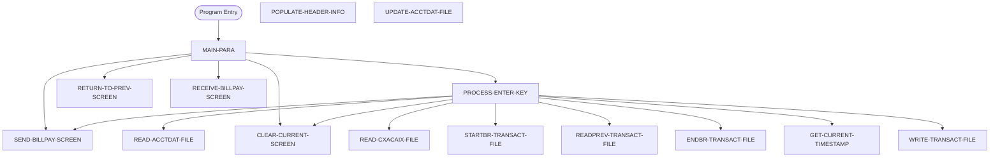

# Program: COBIL00C


---

## Quick Reference

| Attribute | Value |
|-----------|-------|
| Program ID | `COBIL00C` |
| Type | ONLINE |
| Lines | 573 |
| Source | [COBIL00C.cbl](../carddemo/COBIL00C.cbl#L1) |
| Paragraphs | 16 |
| Statements | 64 |
| Impact Risk | **HIGH** — 31 programs affected |

> **View Source:** [Open COBIL00C.cbl](../carddemo/COBIL00C.cbl#L1)

## Source Grounding Facts

| Data Item | Literal Value |
|-----------|---------------|
| `WS-PGMNAME` | `COBIL00C` |
| `WS-TRANID` | `CB00` |
| `WS-TRANSACT-FILE` | `TRANSACT` |
| `WS-ACCTDAT-FILE` | `ACCTDAT` |
| `WS-CXACAIX-FILE` | `CXACAIX` |
| `WS-ERR-FLG` | `N` |
| `WS-USR-MODIFIED` | `N` |
| `WS-CONF-PAY-FLG` | `N` |
| `WS-TRAN-DATE` | `00/00/00` |


## Business Purpose

*Business purpose is not present in the extracted data. Run LLM enrichment to populate this section.*


## Dependency Context

> This section shows how **COBIL00C** connects to the rest of the system — who calls it,
> what it calls, and what data it shares. If linked programs exist, they must appear here.

### Programs That Call COBIL00C (Callers)

*No programs call COBIL00C — this is likely a top-level entry point or CICS transaction starter.*

### Programs Called by COBIL00C (Callees)

*COBIL00C does not call any other programs (leaf program).*

### Shared Data (Copybooks & Files)

#### Shared Copybooks

| Copybook | Also Used By | # Co-Users |
|----------|-------------|------------|
| `COBIL00` |  | 0 |
| `COCOM01Y` | COACTUPC, COACTVWC, COADM01C, COCRDLIC, COCRDSLC (+15 more) | 20 |
| `COTTL01Y` | COACTUPC, COACTVWC, COADM01C, COCRDLIC, COCRDSLC (+15 more) | 20 |
| `CSDAT01Y` | COACTUPC, COACTVWC, COADM01C, COCRDLIC, COCRDSLC (+15 more) | 20 |
| `CSMSG01Y` | COACTUPC, COACTVWC, COADM01C, COCRDLIC, COCRDSLC (+15 more) | 20 |
| `CVACT01Y` | CBACT01C, CBACT04C, CBEXPORT, CBIMPORT, CBSTM03A (+8 more) | 13 |
| `CVACT03Y` | CBACT03C, CBACT04C, CBEXPORT, CBIMPORT, CBSTM03A (+8 more) | 13 |
| `CVTRA05Y` | CBACT04C, CBEXPORT, CBIMPORT, CBTRN01C, CBTRN02C (+5 more) | 10 |
| `DFHAID` | COACTUPC, COACTVWC, COADM01C, COCRDLIC, COCRDSLC (+15 more) | 20 |
| `DFHBMSCA` | COACTUPC, COACTVWC, COADM01C, COCRDLIC, COCRDSLC (+15 more) | 20 |


## Legacy Data Contracts

> These tables are derived from FILE SECTION records and COPY-expanded data declarations. They preserve the legacy field names, COBOL storage type, inferred modern type, and status-code values needed for Java DTOs, SQL schemas, API contracts, and migration mapping.


### Copybook Segment Layouts

#### `COBIL00` as `COBIL0AI`

| Legacy Field | Meaning | COBOL Type | Modern Type | Status / Format Notes |
|--------------|---------|------------|-------------|-----------------------|
| `COBIL0AI` | Cobil0Ai | `GROUP` | `OBJECT` |  |
| `COBIL0AO` | Cobil0Ao | `GROUP` | `OBJECT` |  |

#### `COCOM01Y` as `CARDDEMO-COMMAREA`

| Legacy Field | Meaning | COBOL Type | Modern Type | Status / Format Notes |
|--------------|---------|------------|-------------|-----------------------|
| `CARDDEMO-COMMAREA` | Carddemo Commarea | `GROUP` | `OBJECT` |  |
| `CDEMO-GENERAL-INFO` | General Info | `GROUP` | `OBJECT` |  |
| `CDEMO-FROM-TRANID` | From Tranid | `PIC X(04)` | `STRING(4)` |  |
| `CDEMO-FROM-PROGRAM` | From Program | `PIC X(08)` | `STRING(8)` |  |
| `CDEMO-TO-TRANID` | To Tranid | `PIC X(04)` | `STRING(4)` |  |
| `CDEMO-TO-PROGRAM` | To Program | `PIC X(08)` | `STRING(8)` |  |
| `CDEMO-USER-ID` | User ID | `PIC X(08)` | `STRING(8)` |  |
| `CDEMO-USER-TYPE` | User Type | `PIC X(01)` | `STRING(1)` |  |
| `CDEMO-PGM-CONTEXT` | Pgm Context | `PIC 9(01)` | `INTEGER` |  |
| `CDEMO-CUSTOMER-INFO` | Customer Info | `GROUP` | `OBJECT` |  |
| `CDEMO-CUST-ID` | Customer ID | `PIC 9(09)` | `INTEGER` |  |
| `CDEMO-CUST-FNAME` | Customer Fname | `PIC X(25)` | `STRING(25)` |  |
| `CDEMO-CUST-MNAME` | Customer Mname | `PIC X(25)` | `STRING(25)` |  |
| `CDEMO-CUST-LNAME` | Customer Lname | `PIC X(25)` | `STRING(25)` |  |
| `CDEMO-ACCOUNT-INFO` | Account Info | `GROUP` | `OBJECT` |  |
| `CDEMO-ACCT-ID` | Account ID | `PIC 9(11)` | `BIGINT` |  |
| `CDEMO-ACCT-STATUS` | Account Status | `PIC X(01)` | `STRING(1)` |  |
| `CDEMO-CARD-INFO` | Card Info | `GROUP` | `OBJECT` |  |
| `CDEMO-CARD-NUM` | Card Number | `PIC 9(16)` | `BIGINT` |  |
| `CDEMO-MORE-INFO` | More Info | `GROUP` | `OBJECT` |  |
| `CDEMO-LAST-MAP` | Last Map | `PIC X(7)` | `STRING(7)` |  |
| `CDEMO-LAST-MAPSET` | Last Mapset | `PIC X(7)` | `STRING(7)` |  |

#### `COTTL01Y` as `CCDA-SCREEN-TITLE`

| Legacy Field | Meaning | COBOL Type | Modern Type | Status / Format Notes |
|--------------|---------|------------|-------------|-----------------------|
| `CCDA-SCREEN-TITLE` | Ccda Screen Title | `GROUP` | `OBJECT` |  |
| `CCDA-TITLE01` | Ccda Title01 | `PIC X(40)` | `STRING(40)` |  |
| `CCDA-TITLE02` | Ccda Title02 | `PIC X(40)` | `STRING(40)` |  |
| `CCDA-THANK-YOU` | Ccda Thank You | `PIC X(40)` | `STRING(40)` |  |

#### `CSDAT01Y` as `WS-DATE-TIME`

| Legacy Field | Meaning | COBOL Type | Modern Type | Status / Format Notes |
|--------------|---------|------------|-------------|-----------------------|
| `WS-DATE-TIME` | Date Time | `GROUP` | `OBJECT` |  |
| `WS-CURDATE-DATA` | Curdate Data | `GROUP` | `OBJECT` |  |
| `WS-CURDATE` | Curdate | `GROUP` | `OBJECT` |  |
| `WS-CURDATE-YEAR` | Curdate Year | `PIC 9(04)` | `INTEGER` |  |
| `WS-CURDATE-MONTH` | Curdate Month | `PIC 9(02)` | `INTEGER` |  |
| `WS-CURDATE-DAY` | Curdate Day | `PIC 9(02)` | `INTEGER` |  |
| `WS-CURDATE-N` | Curdate N | `PIC 9(08)` | `INTEGER` |  |
| `WS-CURTIME` | Curtime | `GROUP` | `OBJECT` |  |
| `WS-CURTIME-HOURS` | Curtime Hours | `PIC 9(02)` | `INTEGER` |  |
| `WS-CURTIME-MINUTE` | Curtime Minute | `PIC 9(02)` | `INTEGER` |  |
| `WS-CURTIME-SECOND` | Curtime Second | `PIC 9(02)` | `INTEGER` |  |
| `WS-CURTIME-MILSEC` | Curtime Milsec | `PIC 9(02)` | `INTEGER` |  |
| `WS-CURTIME-N` | Curtime N | `PIC 9(08)` | `INTEGER` |  |
| `WS-CURDATE-MM-DD-YY` | Curdate Mm Dd Yy | `GROUP` | `OBJECT` |  |
| `WS-CURDATE-MM` | Curdate Mm | `PIC 9(02)` | `INTEGER` |  |
| `FILLER` | Filler | `PIC X(01)` | `STRING(1)` |  |
| `WS-CURDATE-DD` | Curdate Dd | `PIC 9(02)` | `INTEGER` |  |
| `FILLER` | Filler | `PIC X(01)` | `STRING(1)` |  |
| `WS-CURDATE-YY` | Curdate Yy | `PIC 9(02)` | `INTEGER` |  |
| `WS-CURTIME-HH-MM-SS` | Curtime Hh Mm Ss | `GROUP` | `OBJECT` |  |
| `WS-CURTIME-HH` | Curtime Hh | `PIC 9(02)` | `INTEGER` |  |
| `FILLER` | Filler | `PIC X(01)` | `STRING(1)` |  |
| `WS-CURTIME-MM` | Curtime Mm | `PIC 9(02)` | `INTEGER` |  |
| `FILLER` | Filler | `PIC X(01)` | `STRING(1)` |  |
| `WS-CURTIME-SS` | Curtime Ss | `PIC 9(02)` | `INTEGER` |  |
| `WS-TIMESTAMP` | Timestamp | `GROUP` | `OBJECT` |  |
| `WS-TIMESTAMP-DT-YYYY` | Timestamp Date Yyyy | `PIC 9(04)` | `INTEGER` |  |
| `FILLER` | Filler | `PIC X(01)` | `STRING(1)` |  |
| `WS-TIMESTAMP-DT-MM` | Timestamp Date Mm | `PIC 9(02)` | `INTEGER` |  |
| `FILLER` | Filler | `PIC X(01)` | `STRING(1)` |  |
| `WS-TIMESTAMP-DT-DD` | Timestamp Date Dd | `PIC 9(02)` | `INTEGER` |  |
| `FILLER` | Filler | `PIC X(01)` | `STRING(1)` |  |
| `WS-TIMESTAMP-TM-HH` | Timestamp Tm Hh | `PIC 9(02)` | `INTEGER` |  |
| `FILLER` | Filler | `PIC X(01)` | `STRING(1)` |  |
| `WS-TIMESTAMP-TM-MM` | Timestamp Tm Mm | `PIC 9(02)` | `INTEGER` |  |
| `FILLER` | Filler | `PIC X(01)` | `STRING(1)` |  |
| `WS-TIMESTAMP-TM-SS` | Timestamp Tm Ss | `PIC 9(02)` | `INTEGER` |  |
| `FILLER` | Filler | `PIC X(01)` | `STRING(1)` |  |
| `WS-TIMESTAMP-TM-MS6` | Timestamp Tm Ms6 | `PIC 9(06)` | `INTEGER` |  |

#### `CSMSG01Y` as `CCDA-COMMON-MESSAGES`

| Legacy Field | Meaning | COBOL Type | Modern Type | Status / Format Notes |
|--------------|---------|------------|-------------|-----------------------|
| `CCDA-COMMON-MESSAGES` | Ccda Common Messages | `GROUP` | `OBJECT` |  |
| `CCDA-MSG-THANK-YOU` | Ccda Msg Thank You | `PIC X(50)` | `STRING(50)` |  |
| `CCDA-MSG-INVALID-KEY` | Ccda Msg Invalid Key | `PIC X(50)` | `STRING(50)` |  |

#### `CVACT01Y` as `ACCOUNT-RECORD`

| Legacy Field | Meaning | COBOL Type | Modern Type | Status / Format Notes |
|--------------|---------|------------|-------------|-----------------------|
| `ACCOUNT-RECORD` | Account Record | `GROUP` | `OBJECT` |  |
| `ACCT-ID` | Account ID | `PIC 9(11)` | `BIGINT` |  |
| `ACCT-ACTIVE-STATUS` | Account Active Status | `PIC X(01)` | `STRING(1)` |  |
| `ACCT-CURR-BAL` | Account Curr Bal | `PIC S9(10)V99` | `DECIMAL(12,2)` |  |
| `ACCT-CREDIT-LIMIT` | Account Credit Limit | `PIC S9(10)V99` | `DECIMAL(12,2)` |  |
| `ACCT-CASH-CREDIT-LIMIT` | Account Cash Credit Limit | `PIC S9(10)V99` | `DECIMAL(12,2)` |  |
| `ACCT-OPEN-DATE` | Account Open Date | `PIC X(10)` | `STRING(10)` | Date-like field; verify YYDDD, YYMMDD, or ISO format before migration. |
| `ACCT-EXPIRAION-DATE` | Account Expiraion Date | `PIC X(10)` | `STRING(10)` | Date-like field; verify YYDDD, YYMMDD, or ISO format before migration. |
| `ACCT-REISSUE-DATE` | Account Reissue Date | `PIC X(10)` | `STRING(10)` | Date-like field; verify YYDDD, YYMMDD, or ISO format before migration. |
| `ACCT-CURR-CYC-CREDIT` | Account Curr Cyc Credit | `PIC S9(10)V99` | `DECIMAL(12,2)` |  |
| `ACCT-CURR-CYC-DEBIT` | Account Curr Cyc Debit | `PIC S9(10)V99` | `DECIMAL(12,2)` |  |
| `ACCT-ADDR-ZIP` | Account Addr Zip | `PIC X(10)` | `STRING(10)` |  |
| `ACCT-GROUP-ID` | Account Group ID | `PIC X(10)` | `STRING(10)` |  |
| `FILLER` | Filler | `PIC X(178)` | `STRING(178)` |  |

#### `CVACT03Y` as `CARD-XREF-RECORD`

| Legacy Field | Meaning | COBOL Type | Modern Type | Status / Format Notes |
|--------------|---------|------------|-------------|-----------------------|
| `CARD-XREF-RECORD` | Card Xref Record | `GROUP` | `OBJECT` |  |
| `XREF-CARD-NUM` | Xref Card Number | `PIC X(16)` | `STRING(16)` |  |
| `XREF-CUST-ID` | Xref Customer ID | `PIC 9(09)` | `INTEGER` |  |
| `XREF-ACCT-ID` | Xref Account ID | `PIC 9(11)` | `BIGINT` |  |
| `FILLER` | Filler | `PIC X(14)` | `STRING(14)` |  |

#### `CVTRA05Y` as `TRAN-RECORD`

| Legacy Field | Meaning | COBOL Type | Modern Type | Status / Format Notes |
|--------------|---------|------------|-------------|-----------------------|
| `TRAN-RECORD` | Tran Record | `GROUP` | `OBJECT` |  |
| `TRAN-ID` | Tran ID | `PIC X(16)` | `STRING(16)` |  |
| `TRAN-TYPE-CD` | Tran Type Cd | `PIC X(02)` | `STRING(2)` |  |
| `TRAN-CAT-CD` | Tran Cat Cd | `PIC 9(04)` | `INTEGER` |  |
| `TRAN-SOURCE` | Tran Source | `PIC X(10)` | `STRING(10)` |  |
| `TRAN-DESC` | Tran Desc | `PIC X(100)` | `STRING(100)` |  |
| `TRAN-AMT` | Tran Amount | `PIC S9(09)V99` | `DECIMAL(11,2)` |  |
| `TRAN-MERCHANT-ID` | Tran Merchant ID | `PIC 9(09)` | `INTEGER` |  |
| `TRAN-MERCHANT-NAME` | Tran Merchant Name | `PIC X(50)` | `STRING(50)` |  |
| `TRAN-MERCHANT-CITY` | Tran Merchant City | `PIC X(50)` | `STRING(50)` |  |
| `TRAN-MERCHANT-ZIP` | Tran Merchant Zip | `PIC X(10)` | `STRING(10)` |  |
| `TRAN-CARD-NUM` | Tran Card Number | `PIC X(16)` | `STRING(16)` |  |
| `TRAN-ORIG-TS` | Tran Orig Ts | `PIC X(26)` | `STRING(26)` |  |
| `TRAN-PROC-TS` | Tran Proc Ts | `PIC X(26)` | `STRING(26)` |  |
| `FILLER` | Filler | `PIC X(20)` | `STRING(20)` |  |

#### `DFHAID` as `DFHAID`

| Legacy Field | Meaning | COBOL Type | Modern Type | Status / Format Notes |
|--------------|---------|------------|-------------|-----------------------|
| `DFHAID` | Dfhaid | `GROUP` | `OBJECT` |  |

#### `DFHBMSCA` as `DFHBMSCA`

| Legacy Field | Meaning | COBOL Type | Modern Type | Status / Format Notes |
|--------------|---------|------------|-------------|-----------------------|
| `DFHBMSCA` | Dfhbmsca | `GROUP` | `OBJECT` |  |


### Data Movement And Key Mapping

| Line | Source | Target | Meaning |
|------|--------|--------|---------|
| 104 | `SPACES` | `WS-MESSAGE` | SPACES populates WS-MESSAGE |
| 140 | `CCDA-MSG-INVALID-KEY` | `WS-MESSAGE` | CCDA-MSG-INVALID-KEY populates WS-MESSAGE |
| 170 | `ACTIDINI OF COBIL0AI` | `ACCT-ID` | ACTIDINI OF COBIL0AI populates ACCT-ID |
| 193 | `ACCT-CURR-BAL` | `WS-CURR-BAL` | ACCT-CURR-BAL populates WS-CURR-BAL |
| 224 | `ACCT-CURR-BAL` | `TRAN-AMT` | ACCT-CURR-BAL populates TRAN-AMT |
| 264 | `WS-CUR-DATE-X10` | `WS-TIMESTAMP(01:10)` | WS-CUR-DATE-X10 populates WS-TIMESTAMP(01:10) |
| 293 | `WS-MESSAGE` | `ERRMSGO OF COBIL0AO` | WS-MESSAGE populates ERRMSGO OF COBIL0AO |
| 321 | `FUNCTION CURRENT-DATE` | `WS-CURDATE-DATA` | FUNCTION CURRENT-DATE populates WS-CURDATE-DATA |
| 328 | `WS-CURDATE-MONTH` | `WS-CURDATE-MM` | WS-CURDATE-MONTH populates WS-CURDATE-MM |
| 329 | `WS-CURDATE-DAY` | `WS-CURDATE-DD` | WS-CURDATE-DAY populates WS-CURDATE-DD |
| 330 | `WS-CURDATE-YEAR(3:2)` | `WS-CURDATE-YY` | WS-CURDATE-YEAR(3:2) populates WS-CURDATE-YY |
| 332 | `WS-CURDATE-MM-DD-YY` | `CURDATEO OF COBIL0AO` | WS-CURDATE-MM-DD-YY populates CURDATEO OF COBIL0AO |
| 399 | `'Unable` | `Update Account` | 'Unable populates Update Account |
| 432 | `'Unable` | `lookup XREF AIX file` | 'Unable populates lookup XREF AIX file |
| 525 | `SPACES` | `WS-MESSAGE` | SPACES populates WS-MESSAGE |


---

## Dependency Graph

```mermaid
flowchart TD
    COBIL00C["⬤ COBIL00C"]:::target
    CB_COCOM01Y{{"COCOM01Y"}}:::copybook
    COBIL00C -.- CB_COCOM01Y
    COACTUPC["COACTUPC"]:::coupled
    CB_COCOM01Y -.- COACTUPC
    COACTVWC["COACTVWC"]:::coupled
    CB_COCOM01Y -.- COACTVWC
    COADM01C["COADM01C"]:::coupled
    CB_COCOM01Y -.- COADM01C
    CB_COTTL01Y{{"COTTL01Y"}}:::copybook
    COBIL00C -.- CB_COTTL01Y
    COACTUPC["COACTUPC"]:::coupled
    CB_COTTL01Y -.- COACTUPC
    COACTVWC["COACTVWC"]:::coupled
    CB_COTTL01Y -.- COACTVWC
    COADM01C["COADM01C"]:::coupled
    CB_COTTL01Y -.- COADM01C
    CB_CSDAT01Y{{"CSDAT01Y"}}:::copybook
    COBIL00C -.- CB_CSDAT01Y
    COACTUPC["COACTUPC"]:::coupled
    CB_CSDAT01Y -.- COACTUPC
    COACTVWC["COACTVWC"]:::coupled
    CB_CSDAT01Y -.- COACTVWC
    COADM01C["COADM01C"]:::coupled
    CB_CSDAT01Y -.- COADM01C
    CB_CSMSG01Y{{"CSMSG01Y"}}:::copybook
    COBIL00C -.- CB_CSMSG01Y
    COACTUPC["COACTUPC"]:::coupled
    CB_CSMSG01Y -.- COACTUPC
    COACTVWC["COACTVWC"]:::coupled
    CB_CSMSG01Y -.- COACTVWC
    COADM01C["COADM01C"]:::coupled
    CB_CSMSG01Y -.- COADM01C
    CB_CVACT01Y{{"CVACT01Y"}}:::copybook
    COBIL00C -.- CB_CVACT01Y
    CBACT01C["CBACT01C"]:::coupled
    CB_CVACT01Y -.- CBACT01C
    CBACT04C["CBACT04C"]:::coupled
    CB_CVACT01Y -.- CBACT04C
    CBEXPORT["CBEXPORT"]:::coupled
    CB_CVACT01Y -.- CBEXPORT
    CB_CVACT03Y{{"CVACT03Y"}}:::copybook
    COBIL00C -.- CB_CVACT03Y
    CBACT03C["CBACT03C"]:::coupled
    CB_CVACT03Y -.- CBACT03C
    CBACT04C["CBACT04C"]:::coupled
    CB_CVACT03Y -.- CBACT04C
    CBEXPORT["CBEXPORT"]:::coupled
    CB_CVACT03Y -.- CBEXPORT
    CB_CVTRA05Y{{"CVTRA05Y"}}:::copybook
    COBIL00C -.- CB_CVTRA05Y
    CBACT04C["CBACT04C"]:::coupled
    CB_CVTRA05Y -.- CBACT04C
    CBEXPORT["CBEXPORT"]:::coupled
    CB_CVTRA05Y -.- CBEXPORT
    CBIMPORT["CBIMPORT"]:::coupled
    CB_CVTRA05Y -.- CBIMPORT
    classDef target fill:#f85149,stroke:#da3633,color:#fff,stroke-width:3px
    classDef caller fill:#58a6ff,stroke:#1f6feb,color:#fff
    classDef callee fill:#3fb950,stroke:#238636,color:#fff
    classDef copybook fill:#d29922,stroke:#9e6a03,color:#fff
    classDef coupled fill:#d29922,stroke:#9e6a03,color:#fff,stroke-dasharray:5
    classDef transitive fill:#484f58,stroke:#8b949e,color:#c9d1d9,stroke-dasharray:5
```



> **Legend:** 🔴 Target program · 🔵 Direct callers · 🟢 Direct callees · 🟡 Copybook-coupled · ⚫ Transitive (indirect)

---

## Impact Ripple View

> **If you change COBIL00C, what else could break?**

| Impact Metric | Count |
|--------------|-------|
| Direct Callers | 0 |
| Transitive Callers (callers of callers) | 0 |
| Direct Callees | 0 |
| Transitive Callees | 0 |
| Copybook-Coupled Programs | 31 |
| **Total Impact** | **31** |
| **Risk Rating** | **HIGH** |


**Programs affected via shared copybooks:**
- `CBACT01C`
- `CBACT03C`
- `CBACT04C`
- `CBEXPORT`
- `CBIMPORT`
- `CBSTM03A`
- `CBTRN01C`
- `CBTRN02C`
- `CBTRN03C`
- `COACCT01`
- `COACTUPC`
- `COACTVWC`
- `COADM01C`
- `COCRDLIC`
- `COCRDSLC`
- `COCRDUPC`
- `COMEN01C`
- `COPAUA0C`
- `COPAUS0C`
- `COPAUS1C`
- `CORPT00C`
- `COSGN00C`
- `COTRN00C`
- `COTRN01C`
- `COTRN02C`
- `COTRTLIC`
- `COTRTUPC`
- `COUSR00C`
- `COUSR01C`
- `COUSR02C`
- `COUSR03C`

---

## Statement Profile

| Statement Type | Count |
|---------------|-------|
| MOVE | 23 |
| IF | 15 |
| EXEC_CICS | 12 |
| EVALUATE | 7 |
| SET | 3 |
| PERFORM | 3 |
| INITIALIZE | 1 |

## Control Flow



## Paragraphs

### MAIN-PARA

| | |
|---|---|
| **Paragraph** | `MAIN-PARA` |
| **Lines** | 99 - 153 |
| **View Code** | [Jump to Line 99](../carddemo/COBIL00C.cbl#L99) |


### PROCESS-ENTER-KEY

| | |
|---|---|
| **Paragraph** | `PROCESS-ENTER-KEY` |
| **Lines** | 154 - 248 |
| **View Code** | [Jump to Line 154](../carddemo/COBIL00C.cbl#L154) |


### GET-CURRENT-TIMESTAMP

| | |
|---|---|
| **Paragraph** | `GET-CURRENT-TIMESTAMP` |
| **Lines** | 249 - 272 |
| **View Code** | [Jump to Line 249](../carddemo/COBIL00C.cbl#L249) |


### RETURN-TO-PREV-SCREEN

| | |
|---|---|
| **Paragraph** | `RETURN-TO-PREV-SCREEN` |
| **Lines** | 273 - 288 |
| **View Code** | [Jump to Line 273](../carddemo/COBIL00C.cbl#L273) |


### SEND-BILLPAY-SCREEN

| | |
|---|---|
| **Paragraph** | `SEND-BILLPAY-SCREEN` |
| **Lines** | 289 - 305 |
| **View Code** | [Jump to Line 289](../carddemo/COBIL00C.cbl#L289) |


### RECEIVE-BILLPAY-SCREEN

| | |
|---|---|
| **Paragraph** | `RECEIVE-BILLPAY-SCREEN` |
| **Lines** | 306 - 318 |
| **View Code** | [Jump to Line 306](../carddemo/COBIL00C.cbl#L306) |


### POPULATE-HEADER-INFO

| | |
|---|---|
| **Paragraph** | `POPULATE-HEADER-INFO` |
| **Lines** | 319 - 342 |
| **View Code** | [Jump to Line 319](../carddemo/COBIL00C.cbl#L319) |


### READ-ACCTDAT-FILE

| | |
|---|---|
| **Paragraph** | `READ-ACCTDAT-FILE` |
| **Lines** | 343 - 376 |
| **View Code** | [Jump to Line 343](../carddemo/COBIL00C.cbl#L343) |


### UPDATE-ACCTDAT-FILE

| | |
|---|---|
| **Paragraph** | `UPDATE-ACCTDAT-FILE` |
| **Lines** | 377 - 407 |
| **View Code** | [Jump to Line 377](../carddemo/COBIL00C.cbl#L377) |


### READ-CXACAIX-FILE

| | |
|---|---|
| **Paragraph** | `READ-CXACAIX-FILE` |
| **Lines** | 408 - 440 |
| **View Code** | [Jump to Line 408](../carddemo/COBIL00C.cbl#L408) |


### STARTBR-TRANSACT-FILE

| | |
|---|---|
| **Paragraph** | `STARTBR-TRANSACT-FILE` |
| **Lines** | 441 - 471 |
| **View Code** | [Jump to Line 441](../carddemo/COBIL00C.cbl#L441) |


### READPREV-TRANSACT-FILE

| | |
|---|---|
| **Paragraph** | `READPREV-TRANSACT-FILE` |
| **Lines** | 472 - 500 |
| **View Code** | [Jump to Line 472](../carddemo/COBIL00C.cbl#L472) |


### ENDBR-TRANSACT-FILE

| | |
|---|---|
| **Paragraph** | `ENDBR-TRANSACT-FILE` |
| **Lines** | 501 - 509 |
| **View Code** | [Jump to Line 501](../carddemo/COBIL00C.cbl#L501) |


### WRITE-TRANSACT-FILE

| | |
|---|---|
| **Paragraph** | `WRITE-TRANSACT-FILE` |
| **Lines** | 510 - 551 |
| **View Code** | [Jump to Line 510](../carddemo/COBIL00C.cbl#L510) |


### CLEAR-CURRENT-SCREEN

| | |
|---|---|
| **Paragraph** | `CLEAR-CURRENT-SCREEN` |
| **Lines** | 552 - 559 |
| **View Code** | [Jump to Line 552](../carddemo/COBIL00C.cbl#L552) |


### INITIALIZE-ALL-FIELDS

| | |
|---|---|
| **Paragraph** | `INITIALIZE-ALL-FIELDS` |
| **Lines** | 560 - 572 |
| **View Code** | [Jump to Line 560](../carddemo/COBIL00C.cbl#L560) |


## Copybook Field Dictionaries

The following copybooks are included by this program. Each entry shows the actual fields
extracted from the copybook source file (`.cpy`).

### Copybook `COBIL00`

| Level | Field | PIC | USAGE | Parent | Notes |
|-------|-------|-----|-------|--------|-------|
| `01` | `COBIL0AI` | `None` | None | None |  |
| `02` | `TRNNAMEL` | `S9(4)` | COMP | COBIL0AI |  |
| `02` | `TRNNAMEF` | `X` | None | COBIL0AI |  |
| `03` | `TRNNAMEA` | `X` | None | COBIL0AI |  |
| `02` | `TRNNAMEI` | `X(4)` | None | COBIL0AI |  |
| `02` | `TITLE01L` | `S9(4)` | COMP | COBIL0AI |  |
| `02` | `TITLE01F` | `X` | None | COBIL0AI |  |
| `03` | `TITLE01A` | `X` | None | COBIL0AI |  |
| `02` | `TITLE01I` | `X(40)` | None | COBIL0AI |  |
| `02` | `CURDATEL` | `S9(4)` | COMP | COBIL0AI |  |
| `02` | `CURDATEF` | `X` | None | COBIL0AI |  |
| `03` | `CURDATEA` | `X` | None | COBIL0AI |  |
| `02` | `CURDATEI` | `X(8)` | None | COBIL0AI |  |
| `02` | `PGMNAMEL` | `S9(4)` | COMP | COBIL0AI |  |
| `02` | `PGMNAMEF` | `X` | None | COBIL0AI |  |
| `03` | `PGMNAMEA` | `X` | None | COBIL0AI |  |
| `02` | `PGMNAMEI` | `X(8)` | None | COBIL0AI |  |
| `02` | `TITLE02L` | `S9(4)` | COMP | COBIL0AI |  |
| `02` | `TITLE02F` | `X` | None | COBIL0AI |  |
| `03` | `TITLE02A` | `X` | None | COBIL0AI |  |
| `02` | `TITLE02I` | `X(40)` | None | COBIL0AI |  |
| `02` | `CURTIMEL` | `S9(4)` | COMP | COBIL0AI |  |
| `02` | `CURTIMEF` | `X` | None | COBIL0AI |  |
| `03` | `CURTIMEA` | `X` | None | COBIL0AI |  |
| `02` | `CURTIMEI` | `X(8)` | None | COBIL0AI |  |
| `02` | `ACTIDINL` | `S9(4)` | COMP | COBIL0AI |  |
| `02` | `ACTIDINF` | `X` | None | COBIL0AI |  |
| `03` | `ACTIDINA` | `X` | None | COBIL0AI |  |
| `02` | `ACTIDINI` | `X(11)` | None | COBIL0AI |  |
| `02` | `CURBALL` | `S9(4)` | COMP | COBIL0AI |  |
| `02` | `CURBALF` | `X` | None | COBIL0AI |  |
| `03` | `CURBALA` | `X` | None | COBIL0AI |  |
| `02` | `CURBALI` | `X(14)` | None | COBIL0AI |  |
| `02` | `CONFIRML` | `S9(4)` | COMP | COBIL0AI |  |
| `02` | `CONFIRMF` | `X` | None | COBIL0AI |  |
| `03` | `CONFIRMA` | `X` | None | COBIL0AI |  |
| `02` | `CONFIRMI` | `X(1)` | None | COBIL0AI |  |
| `02` | `ERRMSGL` | `S9(4)` | COMP | COBIL0AI |  |
| `02` | `ERRMSGF` | `X` | None | COBIL0AI |  |
| `03` | `ERRMSGA` | `X` | None | COBIL0AI |  |
| `02` | `ERRMSGI` | `X(78)` | None | COBIL0AI |  |
| `01` | `COBIL0AO` | `None` | None | None |  REDEFINES COBIL0AI |
| `02` | `TRNNAMEC` | `X` | None | COBIL0AO |  |
| `02` | `TRNNAMEP` | `X` | None | COBIL0AO |  |
| `02` | `TRNNAMEH` | `X` | None | COBIL0AO |  |
| `02` | `TRNNAMEV` | `X` | None | COBIL0AO |  |
| `02` | `TRNNAMEO` | `X(4)` | None | COBIL0AO |  |
| `02` | `TITLE01C` | `X` | None | COBIL0AO |  |
| `02` | `TITLE01P` | `X` | None | COBIL0AO |  |
| `02` | `TITLE01H` | `X` | None | COBIL0AO |  |
*+ 42 more fields*
### Copybook `COCOM01Y`

| Level | Field | PIC | USAGE | Parent | Notes |
|-------|-------|-----|-------|--------|-------|
| `01` | `CARDDEMO-COMMAREA` | `None` | None | None |  |
| `05` | `CDEMO-GENERAL-INFO` | `None` | None | CARDDEMO-COMMAREA |  |
| `10` | `CDEMO-FROM-TRANID` | `X(04)` | None | CDEMO-GENERAL-INFO |  |
| `10` | `CDEMO-FROM-PROGRAM` | `X(08)` | None | CDEMO-GENERAL-INFO |  |
| `10` | `CDEMO-TO-TRANID` | `X(04)` | None | CDEMO-GENERAL-INFO |  |
| `10` | `CDEMO-TO-PROGRAM` | `X(08)` | None | CDEMO-GENERAL-INFO |  |
| `10` | `CDEMO-USER-ID` | `X(08)` | None | CDEMO-GENERAL-INFO |  |
| `10` | `CDEMO-USER-TYPE` | `X(01)` | None | CDEMO-GENERAL-INFO |  |
| `88` | `CDEMO-USRTYP-ADMIN` | `None` | None | CDEMO-GENERAL-INFO |  |
| `88` | `CDEMO-USRTYP-USER` | `None` | None | CDEMO-GENERAL-INFO |  |
| `10` | `CDEMO-PGM-CONTEXT` | `9(01)` | None | CDEMO-GENERAL-INFO |  |
| `88` | `CDEMO-PGM-ENTER` | `None` | None | CDEMO-GENERAL-INFO |  |
| `88` | `CDEMO-PGM-REENTER` | `None` | None | CDEMO-GENERAL-INFO |  |
| `05` | `CDEMO-CUSTOMER-INFO` | `None` | None | CARDDEMO-COMMAREA |  |
| `10` | `CDEMO-CUST-ID` | `9(09)` | None | CDEMO-CUSTOMER-INFO |  |
| `10` | `CDEMO-CUST-FNAME` | `X(25)` | None | CDEMO-CUSTOMER-INFO |  |
| `10` | `CDEMO-CUST-MNAME` | `X(25)` | None | CDEMO-CUSTOMER-INFO |  |
| `10` | `CDEMO-CUST-LNAME` | `X(25)` | None | CDEMO-CUSTOMER-INFO |  |
| `05` | `CDEMO-ACCOUNT-INFO` | `None` | None | CARDDEMO-COMMAREA |  |
| `10` | `CDEMO-ACCT-ID` | `9(11)` | None | CDEMO-ACCOUNT-INFO |  |
| `10` | `CDEMO-ACCT-STATUS` | `X(01)` | None | CDEMO-ACCOUNT-INFO |  |
| `05` | `CDEMO-CARD-INFO` | `None` | None | CARDDEMO-COMMAREA |  |
| `10` | `CDEMO-CARD-NUM` | `9(16)` | None | CDEMO-CARD-INFO |  |
| `05` | `CDEMO-MORE-INFO` | `None` | None | CARDDEMO-COMMAREA |  |
| `10` | `CDEMO-LAST-MAP` | `X(7)` | None | CDEMO-MORE-INFO |  |
| `10` | `CDEMO-LAST-MAPSET` | `X(7)` | None | CDEMO-MORE-INFO |  |

### Copybook `COTTL01Y`

| Level | Field | PIC | USAGE | Parent | Notes |
|-------|-------|-----|-------|--------|-------|
| `01` | `CCDA-SCREEN-TITLE` | `None` | None | None |  |
| `05` | `CCDA-TITLE01` | `X(40)` | None | CCDA-SCREEN-TITLE |  |
| `05` | `CCDA-TITLE02` | `X(40)` | None | CCDA-SCREEN-TITLE |  |
| `05` | `CCDA-THANK-YOU` | `X(40)` | None | CCDA-SCREEN-TITLE |  |

### Copybook `CSDAT01Y`

| Level | Field | PIC | USAGE | Parent | Notes |
|-------|-------|-----|-------|--------|-------|
| `01` | `WS-DATE-TIME` | `None` | None | None |  |
| `05` | `WS-CURDATE-DATA` | `None` | None | WS-DATE-TIME |  |
| `10` | `WS-CURDATE` | `None` | None | WS-CURDATE-DATA |  |
| `15` | `WS-CURDATE-YEAR` | `9(04)` | None | WS-CURDATE |  |
| `15` | `WS-CURDATE-MONTH` | `9(02)` | None | WS-CURDATE |  |
| `15` | `WS-CURDATE-DAY` | `9(02)` | None | WS-CURDATE |  |
| `10` | `WS-CURDATE-N` | `9(08)` | None | WS-CURDATE-DATA |  REDEFINES WS-CURDATE |
| `10` | `WS-CURTIME` | `None` | None | WS-CURDATE-DATA |  |
| `15` | `WS-CURTIME-HOURS` | `9(02)` | None | WS-CURTIME |  |
| `15` | `WS-CURTIME-MINUTE` | `9(02)` | None | WS-CURTIME |  |
| `15` | `WS-CURTIME-SECOND` | `9(02)` | None | WS-CURTIME |  |
| `15` | `WS-CURTIME-MILSEC` | `9(02)` | None | WS-CURTIME |  |
| `10` | `WS-CURTIME-N` | `9(08)` | None | WS-CURDATE-DATA |  REDEFINES WS-CURTIME |
| `05` | `WS-CURDATE-MM-DD-YY` | `None` | None | WS-DATE-TIME |  |
| `10` | `WS-CURDATE-MM` | `9(02)` | None | WS-CURDATE-MM-DD-YY |  |
| `10` | `WS-CURDATE-DD` | `9(02)` | None | WS-CURDATE-MM-DD-YY |  |
| `10` | `WS-CURDATE-YY` | `9(02)` | None | WS-CURDATE-MM-DD-YY |  |
| `05` | `WS-CURTIME-HH-MM-SS` | `None` | None | WS-DATE-TIME |  |
| `10` | `WS-CURTIME-HH` | `9(02)` | None | WS-CURTIME-HH-MM-SS |  |
| `10` | `WS-CURTIME-MM` | `9(02)` | None | WS-CURTIME-HH-MM-SS |  |
| `10` | `WS-CURTIME-SS` | `9(02)` | None | WS-CURTIME-HH-MM-SS |  |
| `05` | `WS-TIMESTAMP` | `None` | None | WS-DATE-TIME |  |
| `10` | `WS-TIMESTAMP-DT-YYYY` | `9(04)` | None | WS-TIMESTAMP |  |
| `10` | `WS-TIMESTAMP-DT-MM` | `9(02)` | None | WS-TIMESTAMP |  |
| `10` | `WS-TIMESTAMP-DT-DD` | `9(02)` | None | WS-TIMESTAMP |  |
| `10` | `WS-TIMESTAMP-TM-HH` | `9(02)` | None | WS-TIMESTAMP |  |
| `10` | `WS-TIMESTAMP-TM-MM` | `9(02)` | None | WS-TIMESTAMP |  |
| `10` | `WS-TIMESTAMP-TM-SS` | `9(02)` | None | WS-TIMESTAMP |  |
| `10` | `WS-TIMESTAMP-TM-MS6` | `9(06)` | None | WS-TIMESTAMP |  |

### Copybook `CSMSG01Y`

| Level | Field | PIC | USAGE | Parent | Notes |
|-------|-------|-----|-------|--------|-------|
| `01` | `CCDA-COMMON-MESSAGES` | `None` | None | None |  |
| `05` | `CCDA-MSG-THANK-YOU` | `X(50)` | None | CCDA-COMMON-MESSAGES |  |
| `05` | `CCDA-MSG-INVALID-KEY` | `X(50)` | None | CCDA-COMMON-MESSAGES |  |

### Copybook `CVACT01Y`

| Level | Field | PIC | USAGE | Parent | Notes |
|-------|-------|-----|-------|--------|-------|
| `01` | `ACCOUNT-RECORD` | `None` | None | None |  |
| `05` | `ACCT-ID` | `9(11)` | None | ACCOUNT-RECORD |  |
| `05` | `ACCT-ACTIVE-STATUS` | `X(01)` | None | ACCOUNT-RECORD |  |
| `05` | `ACCT-CURR-BAL` | `S9(10)V99` | None | ACCOUNT-RECORD |  |
| `05` | `ACCT-CREDIT-LIMIT` | `S9(10)V99` | None | ACCOUNT-RECORD |  |
| `05` | `ACCT-CASH-CREDIT-LIMIT` | `S9(10)V99` | None | ACCOUNT-RECORD |  |
| `05` | `ACCT-OPEN-DATE` | `X(10)` | None | ACCOUNT-RECORD |  |
| `05` | `ACCT-EXPIRAION-DATE` | `X(10)` | None | ACCOUNT-RECORD |  |
| `05` | `ACCT-REISSUE-DATE` | `X(10)` | None | ACCOUNT-RECORD |  |
| `05` | `ACCT-CURR-CYC-CREDIT` | `S9(10)V99` | None | ACCOUNT-RECORD |  |
| `05` | `ACCT-CURR-CYC-DEBIT` | `S9(10)V99` | None | ACCOUNT-RECORD |  |
| `05` | `ACCT-ADDR-ZIP` | `X(10)` | None | ACCOUNT-RECORD |  |
| `05` | `ACCT-GROUP-ID` | `X(10)` | None | ACCOUNT-RECORD |  |

### Copybook `CVACT03Y`

| Level | Field | PIC | USAGE | Parent | Notes |
|-------|-------|-----|-------|--------|-------|
| `01` | `CARD-XREF-RECORD` | `None` | None | None |  |
| `05` | `XREF-CARD-NUM` | `X(16)` | None | CARD-XREF-RECORD |  |
| `05` | `XREF-CUST-ID` | `9(09)` | None | CARD-XREF-RECORD |  |
| `05` | `XREF-ACCT-ID` | `9(11)` | None | CARD-XREF-RECORD |  |

### Copybook `CVTRA05Y`

| Level | Field | PIC | USAGE | Parent | Notes |
|-------|-------|-----|-------|--------|-------|
| `01` | `TRAN-RECORD` | `None` | None | None |  |
| `05` | `TRAN-ID` | `X(16)` | None | TRAN-RECORD |  |
| `05` | `TRAN-TYPE-CD` | `X(02)` | None | TRAN-RECORD |  |
| `05` | `TRAN-CAT-CD` | `9(04)` | None | TRAN-RECORD |  |
| `05` | `TRAN-SOURCE` | `X(10)` | None | TRAN-RECORD |  |
| `05` | `TRAN-DESC` | `X(100)` | None | TRAN-RECORD |  |
| `05` | `TRAN-AMT` | `S9(09)V99` | None | TRAN-RECORD |  |
| `05` | `TRAN-MERCHANT-ID` | `9(09)` | None | TRAN-RECORD |  |
| `05` | `TRAN-MERCHANT-NAME` | `X(50)` | None | TRAN-RECORD |  |
| `05` | `TRAN-MERCHANT-CITY` | `X(50)` | None | TRAN-RECORD |  |
| `05` | `TRAN-MERCHANT-ZIP` | `X(10)` | None | TRAN-RECORD |  |
| `05` | `TRAN-CARD-NUM` | `X(16)` | None | TRAN-RECORD |  |
| `05` | `TRAN-ORIG-TS` | `X(26)` | None | TRAN-RECORD |  |
| `05` | `TRAN-PROC-TS` | `X(26)` | None | TRAN-RECORD |  |

### Copybook `DFHAID`

| Level | Field | PIC | USAGE | Parent | Notes |
|-------|-------|-----|-------|--------|-------|
| `01` | `DFHAID` | `None` | None | None |  |
| `02` | `DFHENTER` | `X` | None | DFHAID |  |
| `02` | `DFHCLEAR` | `X` | None | DFHAID |  |
| `02` | `DFHCLRP` | `X` | None | DFHAID |  |
| `02` | `DFHPA1` | `X` | None | DFHAID |  |
| `02` | `DFHPA2` | `X` | None | DFHAID |  |
| `02` | `DFHPA3` | `X` | None | DFHAID |  |
| `02` | `DFHPF1` | `X` | None | DFHAID |  |
| `02` | `DFHPF2` | `X` | None | DFHAID |  |
| `02` | `DFHPF3` | `X` | None | DFHAID |  |
| `02` | `DFHPF4` | `X` | None | DFHAID |  |
| `02` | `DFHPF5` | `X` | None | DFHAID |  |
| `02` | `DFHPF6` | `X` | None | DFHAID |  |
| `02` | `DFHPF7` | `X` | None | DFHAID |  |
| `02` | `DFHPF8` | `X` | None | DFHAID |  |
| `02` | `DFHPF9` | `X` | None | DFHAID |  |
| `02` | `DFHPF10` | `X` | None | DFHAID |  |
| `02` | `DFHPF11` | `X` | None | DFHAID |  |
| `02` | `DFHPF12` | `X` | None | DFHAID |  |
| `02` | `DFHPF13` | `X` | None | DFHAID |  |
| `02` | `DFHPF14` | `X` | None | DFHAID |  |
| `02` | `DFHPF15` | `X` | None | DFHAID |  |
| `02` | `DFHPF16` | `X` | None | DFHAID |  |
| `02` | `DFHPF17` | `X` | None | DFHAID |  |
| `02` | `DFHPF18` | `X` | None | DFHAID |  |
| `02` | `DFHPF19` | `X` | None | DFHAID |  |
| `02` | `DFHPF20` | `X` | None | DFHAID |  |
| `02` | `DFHPF21` | `X` | None | DFHAID |  |
| `02` | `DFHPF22` | `X` | None | DFHAID |  |
| `02` | `DFHPF23` | `X` | None | DFHAID |  |
| `02` | `DFHPF24` | `X` | None | DFHAID |  |
| `02` | `DFHPEN` | `X` | None | DFHAID |  |
| `02` | `DFHOPID` | `X` | None | DFHAID |  |
| `02` | `DFHMSRE` | `X` | None | DFHAID |  |
| `02` | `DFHSTRF` | `X` | None | DFHAID |  |
| `02` | `DFHTRIG` | `X` | None | DFHAID |  |

### Copybook `DFHBMSCA`

| Level | Field | PIC | USAGE | Parent | Notes |
|-------|-------|-----|-------|--------|-------|
| `01` | `DFHBMSCA` | `None` | None | None |  |
| `02` | `DFHBMPEM` | `X` | None | DFHBMSCA |  |
| `02` | `DFHBMPNL` | `X` | None | DFHBMSCA |  |
| `02` | `DFHBMASK` | `X` | None | DFHBMSCA |  |
| `02` | `DFHBMUNP` | `X` | None | DFHBMSCA |  |
| `02` | `DFHBMUNN` | `X` | None | DFHBMSCA |  |
| `02` | `DFHBMPRO` | `X` | None | DFHBMSCA |  |
| `02` | `DFHBMBRY` | `X` | None | DFHBMSCA |  |
| `02` | `DFHBMDAR` | `X` | None | DFHBMSCA |  |
| `02` | `DFHBMFSE` | `X` | None | DFHBMSCA |  |
| `02` | `DFHBMPRF` | `X` | None | DFHBMSCA |  |
| `02` | `DFHBMASF` | `X` | None | DFHBMSCA |  |
| `02` | `DFHBMASB` | `X` | None | DFHBMSCA |  |
| `02` | `DFHBMEOF` | `X` | None | DFHBMSCA |  |
| `02` | `DFHBMEC` | `X` | None | DFHBMSCA |  |
| `02` | `DFHSA` | `X` | None | DFHBMSCA |  |
| `02` | `DFHCOLOR` | `X` | None | DFHBMSCA |  |
| `02` | `DFHPS` | `X` | None | DFHBMSCA |  |
| `02` | `DFHHLT` | `X` | None | DFHBMSCA |  |
| `02` | `DFHVAL` | `X` | None | DFHBMSCA |  |
| `02` | `DFHOUTLN` | `X` | None | DFHBMSCA |  |
| `02` | `DFHBKTRN` | `X` | None | DFHBMSCA |  |
| `02` | `DFHALL` | `X` | None | DFHBMSCA |  |
| `02` | `DFHERROR` | `X` | None | DFHBMSCA |  |
| `02` | `DFHDFT` | `X` | None | DFHBMSCA |  |
| `02` | `DFHDFCOL` | `X` | None | DFHBMSCA |  |
| `02` | `DFHBLUE` | `X` | None | DFHBMSCA |  |
| `02` | `DFHRED` | `X` | None | DFHBMSCA |  |
| `02` | `DFHPINK` | `X` | None | DFHBMSCA |  |
| `02` | `DFHGREEN` | `X` | None | DFHBMSCA |  |
| `02` | `DFHTURQ` | `X` | None | DFHBMSCA |  |
| `02` | `DFHYELLO` | `X` | None | DFHBMSCA |  |
| `02` | `DFHWHTE` | `X` | None | DFHBMSCA |  |
| `02` | `CATTR-H-UNPROT` | `X` | None | DFHBMSCA |  |
| `02` | `CATTR-H-UNPROT-FSET` | `X` | None | DFHBMSCA |  |
| `02` | `CATTR-H-UNPROT-NUM` | `X` | None | DFHBMSCA |  |
| `02` | `CATTR-H-ASKIP` | `X` | None | DFHBMSCA |  |


## Data Lineage (MOVE Flow)

The following MOVE statements were extracted from the source. Each row is a `source → destination`
flow that the migration team can use to trace how data is reshaped and routed.

| Source | Destination | Paragraph | Line |
|--------|-------------|-----------|------|
| `SPACES` | `WS-MESSAGE` | MAIN-PARA | 104 |
| `'COSGN00C'` | `CDEMO-TO-PROGRAM` | MAIN-PARA | 108 |
| `DFHCOMMAREA(1:EIBCALEN)` | `CARDDEMO-COMMAREA` | MAIN-PARA | 111 |
| `LOW-VALUES` | `COBIL0AO` | MAIN-PARA | 114 |
| `'-1'` | `ACTIDINL` | MAIN-PARA | 115 |
| `'-1'` | `OF` | MAIN-PARA | 115 |
| `'-1'` | `COBIL0AI` | MAIN-PARA | 115 |
| `'COMEN01C'` | `CDEMO-TO-PROGRAM` | MAIN-PARA | 130 |
| `'Y'` | `WS-ERR-FLG` | MAIN-PARA | 139 |
| `CCDA-MSG-INVALID-KEY` | `WS-MESSAGE` | MAIN-PARA | 140 |
| `'Y'` | `WS-ERR-FLG` | PROCESS-ENTER-KEY | 160 |
| `'-1'` | `ACTIDINL` | PROCESS-ENTER-KEY | 163 |
| `'-1'` | `OF` | PROCESS-ENTER-KEY | 163 |
| `'-1'` | `COBIL0AI` | PROCESS-ENTER-KEY | 163 |
| `'Y'` | `WS-ERR-FLG` | PROCESS-ENTER-KEY | 181 |
| `'Y'` | `WS-ERR-FLG` | PROCESS-ENTER-KEY | 186 |
| `'-1'` | `CONFIRML` | PROCESS-ENTER-KEY | 189 |
| `'-1'` | `OF` | PROCESS-ENTER-KEY | 189 |
| `'-1'` | `COBIL0AI` | PROCESS-ENTER-KEY | 189 |
| `ACCT-CURR-BAL` | `WS-CURR-BAL` | PROCESS-ENTER-KEY | 193 |
| `WS-CURR-BAL` | `CURBALI` | PROCESS-ENTER-KEY | 194 |
| `WS-CURR-BAL` | `OF` | PROCESS-ENTER-KEY | 194 |
| `WS-CURR-BAL` | `COBIL0AI` | PROCESS-ENTER-KEY | 194 |
| `'Y'` | `WS-ERR-FLG` | PROCESS-ENTER-KEY | 200 |
| `'-1'` | `ACTIDINL` | PROCESS-ENTER-KEY | 203 |
| `'-1'` | `OF` | PROCESS-ENTER-KEY | 203 |
| `'-1'` | `COBIL0AI` | PROCESS-ENTER-KEY | 203 |
| `HIGH-VALUES` | `TRAN-ID` | PROCESS-ENTER-KEY | 212 |
| `TRAN-ID` | `WS-TRAN-ID-NUM` | PROCESS-ENTER-KEY | 216 |
| `WS-TRAN-ID-NUM` | `TRAN-ID` | PROCESS-ENTER-KEY | 219 |
| `'02'` | `TRAN-TYPE-CD` | PROCESS-ENTER-KEY | 220 |
| `'2'` | `TRAN-CAT-CD` | PROCESS-ENTER-KEY | 221 |
| `'POS TERM'` | `TRAN-SOURCE` | PROCESS-ENTER-KEY | 222 |
| `'BILL PAYMENT - ONLINE'` | `TRAN-DESC` | PROCESS-ENTER-KEY | 223 |
| `ACCT-CURR-BAL` | `TRAN-AMT` | PROCESS-ENTER-KEY | 224 |
| `XREF-CARD-NUM` | `TRAN-CARD-NUM` | PROCESS-ENTER-KEY | 225 |
| `'999999999'` | `TRAN-MERCHANT-ID` | PROCESS-ENTER-KEY | 226 |
| `'BILL PAYMENT'` | `TRAN-MERCHANT-NAME` | PROCESS-ENTER-KEY | 227 |
| `'N/A'` | `TRAN-MERCHANT-CITY` | PROCESS-ENTER-KEY | 228 |
| `'N/A'` | `TRAN-MERCHANT-ZIP` | PROCESS-ENTER-KEY | 229 |
| `WS-TIMESTAMP` | `TRAN-ORIG-TS` | PROCESS-ENTER-KEY | 231 |
| `'-1'` | `CONFIRML` | PROCESS-ENTER-KEY | 239 |
| `'-1'` | `OF` | PROCESS-ENTER-KEY | 239 |
| `'-1'` | `COBIL0AI` | PROCESS-ENTER-KEY | 239 |
| `WS-CUR-DATE-X10` | `WS-TIMESTAMP` | GET-CURRENT-TIMESTAMP | 264 |
| `WS-CUR-TIME-X08` | `WS-TIMESTAMP` | GET-CURRENT-TIMESTAMP | 265 |
| `ZEROS` | `WS-TIMESTAMP-TM-MS6` | GET-CURRENT-TIMESTAMP | 266 |
| `'COSGN00C'` | `CDEMO-TO-PROGRAM` | RETURN-TO-PREV-SCREEN | 276 |
| `WS-TRANID` | `CDEMO-FROM-TRANID` | RETURN-TO-PREV-SCREEN | 278 |
| `WS-PGMNAME` | `CDEMO-FROM-PROGRAM` | RETURN-TO-PREV-SCREEN | 279 |
| `ZEROS` | `CDEMO-PGM-CONTEXT` | RETURN-TO-PREV-SCREEN | 280 |
| `WS-MESSAGE` | `ERRMSGO` | SEND-BILLPAY-SCREEN | 293 |
| `WS-MESSAGE` | `OF` | SEND-BILLPAY-SCREEN | 293 |
| `WS-MESSAGE` | `COBIL0AO` | SEND-BILLPAY-SCREEN | 293 |
| `CCDA-TITLE01` | `TITLE01O` | POPULATE-HEADER-INFO | 323 |
| `CCDA-TITLE01` | `OF` | POPULATE-HEADER-INFO | 323 |
| `CCDA-TITLE01` | `COBIL0AO` | POPULATE-HEADER-INFO | 323 |
| `CCDA-TITLE02` | `TITLE02O` | POPULATE-HEADER-INFO | 324 |
| `CCDA-TITLE02` | `OF` | POPULATE-HEADER-INFO | 324 |
| `CCDA-TITLE02` | `COBIL0AO` | POPULATE-HEADER-INFO | 324 |
*+ 40 more movements*

## Known Issues & Code Anomalies

Static analysis flagged the following items in this program. Migration teams should
review each one before re-implementing in a modern stack.

| Severity | Category | Title | Paragraph | Line |
|----------|----------|-------|-----------|------|
| **WARNING** | LOGIC | `PERFORM WRITE-TRANSACT-FILE` runs unconditionally after `PERFORM GET-CURRENT-TIMESTAMP` in `PROCESS-ENTER-KEY` | PROCESS-ENTER-KEY | 230 |
| **NOTICE** | DEAD_CODE | Variable `WS-USR-MODIFIED` is declared but never referenced | None | 48 |
| **NOTICE** | DEAD_CODE | Variable `WS-CONF-PAY-FLG` is declared but never referenced | None | 51 |
| **NOTICE** | DEAD_CODE | Variable `WS-TRAN-AMT` is declared but never referenced | None | 55 |
| **NOTICE** | DEAD_CODE | Variable `WS-TRAN-DATE` is declared but never referenced | None | 58 |
| **NOTICE** | DEAD_CODE | Variable `LK-COMMAREA` is declared but never referenced | None | 92 |

### WARNING — `PERFORM WRITE-TRANSACT-FILE` runs unconditionally after `PERFORM GET-CURRENT-TIMESTAMP` in `PROCESS-ENTER-KEY`

There is no IF / EVALUATE check between the read-style `GET-CURRENT-TIMESTAMP` and the mutating `WRITE-TRANSACT-FILE`. If `GET-CURRENT-TIMESTAMP` encounters an error (NOTFND, IO failure, etc.) without setting STOP RUN or PERFORM-aborting, `WRITE-TRANSACT-FILE` will execute anyway — potentially deleting/updating against stale or invalid state. Verify `GET-CURRENT-TIMESTAMP` aborts the program on failure or that `WRITE-TRANSACT-FILE` checks a status flag set by `GET-CURRENT-TIMESTAMP`.
**Source excerpt** (line 230):
```cobol
                   PERFORM GET-CURRENT-TIMESTAMP
                   MOVE WS-TIMESTAMP         TO TRAN-ORIG-TS
                                                TRAN-PROC-TS
                   PERFORM WRITE-TRANSACT-FILE
```

**Recommendation:** Add an `IF <status-flag> = 'OK'` guard around `PERFORM WRITE-TRANSACT-FILE` or have `GET-CURRENT-TIMESTAMP` set ERR-FLG-ON / call ABEND on failure.
---
### NOTICE — Variable `WS-USR-MODIFIED` is declared but never referenced

`WS-USR-MODIFIED` is declared at line 48 but no other statement reads or writes it. Likely a leftover from prior refactoring or an incomplete feature.
**Source excerpt** (line 48):
```cobol
05 WS-USR-MODIFIED            PIC X(01) VALUE 'N'.
```

**Recommendation:** Remove the declaration or wire it into the logic that was originally intended.
---
### NOTICE — Variable `WS-CONF-PAY-FLG` is declared but never referenced

`WS-CONF-PAY-FLG` is declared at line 51 but no other statement reads or writes it. Likely a leftover from prior refactoring or an incomplete feature.
**Source excerpt** (line 51):
```cobol
05 WS-CONF-PAY-FLG            PIC X(01) VALUE 'N'.
```

**Recommendation:** Remove the declaration or wire it into the logic that was originally intended.
---
### NOTICE — Variable `WS-TRAN-AMT` is declared but never referenced

`WS-TRAN-AMT` is declared at line 55 but no other statement reads or writes it. Likely a leftover from prior refactoring or an incomplete feature.
**Source excerpt** (line 55):
```cobol
05 WS-TRAN-AMT                PIC +99999999.99.
```

**Recommendation:** Remove the declaration or wire it into the logic that was originally intended.
---
### NOTICE — Variable `WS-TRAN-DATE` is declared but never referenced

`WS-TRAN-DATE` is declared at line 58 but no other statement reads or writes it. Likely a leftover from prior refactoring or an incomplete feature.
**Source excerpt** (line 58):
```cobol
05 WS-TRAN-DATE               PIC X(08) VALUE '00/00/00'.
```

**Recommendation:** Remove the declaration or wire it into the logic that was originally intended.
---
### NOTICE — Variable `LK-COMMAREA` is declared but never referenced

`LK-COMMAREA` is declared at line 92 but no other statement reads or writes it. Likely a leftover from prior refactoring or an incomplete feature.
**Source excerpt** (line 92):
```cobol
05  LK-COMMAREA                           PIC X(01)
```

**Recommendation:** Remove the declaration or wire it into the logic that was originally intended.
---


## Decision Tables (EVALUATE / WHEN)

Captured from the source. Each EVALUATE block is a structured decision the
migration team should turn into either a switch / pattern-match or a rules table.

### EVALUATE `EIBAID` — paragraph `MAIN-PARA` (line 138)

| WHEN | Action |
|------|--------|
| **WHEN OTHER** | MOVE 'Y'                       TO WS-ERR-FLG |
| `DFHENTER` | PERFORM PROCESS-ENTER-KEY |
| `DFHPF3` | IF CDEMO-FROM-PROGRAM = SPACES OR LOW-VALUES |
| `DFHPF4` | PERFORM CLEAR-CURRENT-SCREEN |

### EVALUATE `TRUE` — paragraph `PROCESS-ENTER-KEY` (line 165)

| WHEN | Action |
|------|--------|
| **WHEN OTHER** | CONTINUE |
| `ACTIDINI OF COBIL0AI = SPACES OR LOW-VALUES` | MOVE 'Y'     TO WS-ERR-FLG |

### EVALUATE `CONFIRMI OF COBIL0AI` — paragraph `PROCESS-ENTER-KEY` (line 185)

| WHEN | Action |
|------|--------|
| **WHEN OTHER** | MOVE 'Y'     TO WS-ERR-FLG |
| `'Y'` |  |
| `'y'` | SET CONF-PAY-YES TO TRUE |
| `'N'` |  |
| `'n'` | PERFORM CLEAR-CURRENT-SCREEN |
| `SPACES` |  |
| `LOW-VALUES` | PERFORM READ-ACCTDAT-FILE |

### EVALUATE `WS-RESP-CD` — paragraph `READ-ACCTDAT-FILE` (line 365)

| WHEN | Action |
|------|--------|
| **WHEN OTHER** | DISPLAY 'RESP:' WS-RESP-CD 'REAS:' WS-REAS-CD |
| `DFHRESP(NORMAL)` | CONTINUE |
| `DFHRESP(NOTFND)` | MOVE 'Y'     TO WS-ERR-FLG |

### EVALUATE `WS-RESP-CD` — paragraph `UPDATE-ACCTDAT-FILE` (line 396)

| WHEN | Action |
|------|--------|
| **WHEN OTHER** | DISPLAY 'RESP:' WS-RESP-CD 'REAS:' WS-REAS-CD |
| `DFHRESP(NORMAL)` | CONTINUE |
| `DFHRESP(NOTFND)` | MOVE 'Y'     TO WS-ERR-FLG |

### EVALUATE `WS-RESP-CD` — paragraph `READ-CXACAIX-FILE` (line 429)

| WHEN | Action |
|------|--------|
| **WHEN OTHER** | DISPLAY 'RESP:' WS-RESP-CD 'REAS:' WS-REAS-CD |
| `DFHRESP(NORMAL)` | CONTINUE |
| `DFHRESP(NOTFND)` | MOVE 'Y'     TO WS-ERR-FLG |

### EVALUATE `WS-RESP-CD` — paragraph `STARTBR-TRANSACT-FILE` (line 460)

| WHEN | Action |
|------|--------|
| **WHEN OTHER** | DISPLAY 'RESP:' WS-RESP-CD 'REAS:' WS-REAS-CD |
| `DFHRESP(NORMAL)` | CONTINUE |
| `DFHRESP(NOTFND)` | MOVE 'Y'     TO WS-ERR-FLG |

### EVALUATE `WS-RESP-CD` — paragraph `READPREV-TRANSACT-FILE` (line 489)

| WHEN | Action |
|------|--------|
| **WHEN OTHER** | DISPLAY 'RESP:' WS-RESP-CD 'REAS:' WS-REAS-CD |
| `DFHRESP(NORMAL)` | CONTINUE |
| `DFHRESP(ENDFILE)` | MOVE ZEROS TO TRAN-ID |

### EVALUATE `WS-RESP-CD` — paragraph `WRITE-TRANSACT-FILE` (line 540)

| WHEN | Action |
|------|--------|
| **WHEN OTHER** | DISPLAY 'RESP:' WS-RESP-CD 'REAS:' WS-REAS-CD |
| `DFHRESP(NORMAL)` | PERFORM INITIALIZE-ALL-FIELDS |
| `DFHRESP(DUPKEY)` |  |
| `DFHRESP(DUPREC)` | MOVE 'Y'     TO WS-ERR-FLG |


## CICS Commands

This program uses the following EXEC CICS commands:

| Command | Paragraph | Line | Details |
|---------|-----------|------|---------|
| `RETURN` | MAIN-PARA | 146 | {"details": {"transid": "WS-TRANID", "commarea": "CARDDEMO-COMMAREA"}} |
| `ASKTIME` | GET-CURRENT-TIMESTAMP | 251 | {"details": {}} |
| `FORMATTIME` | GET-CURRENT-TIMESTAMP | 255 | {"details": {}} |
| `XCTL` | RETURN-TO-PREV-SCREEN | 281 | {"details": {"program": "CDEMO-TO-PROGRAM", "commarea": "CARDDEMO-COMMAREA"}} |
| `SEND` | SEND-BILLPAY-SCREEN | 295 | {"details": {"map": "COBIL0A", "mapset": "COBIL00", "from": "COBIL0AO"}} |
| `RECEIVE` | RECEIVE-BILLPAY-SCREEN | 308 | {"details": {"map": "COBIL0A", "mapset": "COBIL00", "into": "COBIL0AI", "resp": ... |
| `READ` | READ-ACCTDAT-FILE | 345 | {"details": {"dataset": "WS-ACCTDAT-FILE", "into": "ACCOUNT-RECORD", "length": "... |
| `REWRITE` | UPDATE-ACCTDAT-FILE | 379 | {"details": {"dataset": "WS-ACCTDAT-FILE", "from": "ACCOUNT-RECORD", "length": "... |
| `READ` | READ-CXACAIX-FILE | 410 | {"details": {"dataset": "WS-CXACAIX-FILE", "into": "CARD-XREF-RECORD", "length":... |
| `STARTBR` | STARTBR-TRANSACT-FILE | 443 | {"details": {"dataset": "WS-TRANSACT-FILE", "length": "LENGTH OF TRAN-ID", "ridf... |
| `READPREV` | READPREV-TRANSACT-FILE | 474 | {"details": {"dataset": "WS-TRANSACT-FILE", "into": "TRAN-RECORD", "length": "LE... |
| `ENDBR` | ENDBR-TRANSACT-FILE | 503 | {"details": {"dataset": "WS-TRANSACT-FILE"}} |
| `WRITE` | WRITE-TRANSACT-FILE | 512 | {"details": {"dataset": "WS-TRANSACT-FILE", "from": "TRAN-RECORD", "length": "LE... |

**Summary:** 13 CICS command(s) — RETURN (1), ASKTIME (1), FORMATTIME (1), XCTL (1), SEND (1), RECEIVE (1), READ (2), REWRITE (1), STARTBR (1), READPREV (1), ENDBR (1), WRITE (1)

## CICS Screen Workflow Notes

These notes are derived directly from the COBOL source and BMS map usage. They are intended
to prevent migration errors where a PF key label is mistaken for the full transaction flow.

### Program transfers use XCTL, not a soft return

`EXEC CICS XCTL` transfers control to another program and does not return to the current program like a subroutine call. Document PF-key navigation that reaches this paragraph as a CICS transfer, not as an in-place screen redisplay.

Evidence:
- L281 in `RETURN-TO-PREV-SCREEN`: EXEC CICS XCTL {"details": {"program": "CDEMO-TO-PROGRAM", "commarea": "CARDDEMO-COMMAREA"}}

### Initial entry without COMMAREA transfers to sign-on

When `EIBCALEN = 0`, this program prepares `COSGN00C` as the target and follows the return/transfer path. It does not display its own BMS map on that entry path.

Evidence:
- L107: `IF EIBCALEN = 0`
- L108: `MOVE 'COSGN00C' TO CDEMO-TO-PROGRAM`
- L276: `MOVE 'COSGN00C' TO CDEMO-TO-PROGRAM`
- L281 in `RETURN-TO-PREV-SCREEN`: EXEC CICS XCTL {"details": {"program": "CDEMO-TO-PROGRAM", "commarea": "CARDDEMO-COMMAREA"}}

### PF3 navigation resolves through RETURN-TO-PREV-SCREEN

PF3 selects the `RETURN-TO-PREV-SCREEN` path. That paragraph ends in `EXEC CICS XCTL`, so PF3 is a transfer to the target program held in the COMMAREA routing fields.

Evidence:
- L128: `WHEN DFHPF3`
- L109: `PERFORM RETURN-TO-PREV-SCREEN`
- L135: `PERFORM RETURN-TO-PREV-SCREEN`
- L281 in `RETURN-TO-PREV-SCREEN`: EXEC CICS XCTL {"details": {"program": "CDEMO-TO-PROGRAM", "commarea": "CARDDEMO-COMMAREA"}}

### Error/message text is written to the BMS output field

`ERRMSGI` exists in the input copybook area, but this program displays messages by moving `WS-MESSAGE` to `ERRMSGO OF COUSR3AO`. Documentation should refer to `ERRMSGO` when describing rendered error or status messages.

Evidence:
- L293: `MOVE WS-MESSAGE TO ERRMSGO OF COBIL0AO`

### ERR-FLG is reset at the start of each run

`ERR-FLG` starts each invocation on the off path via `SET ERR-FLG-OFF TO TRUE`. Validation and file-error branches set or test `ERR-FLG-ON` to stop later processing.

Evidence:
- L101: `SET ERR-FLG-OFF     TO TRUE`
- L44: `88 ERR-FLG-ON                         VALUE 'Y'.`
- L169: `IF NOT ERR-FLG-ON`
- L197: `IF NOT ERR-FLG-ON`
- L208: `IF NOT ERR-FLG-ON`

### The BMS map can be sent from multiple paths

Screen output is centralized in the send paragraph, but several routines can perform it. If a read routine sends the map and its caller also sends the map, a modern UI migration must preserve or deliberately remove that duplicate response behavior.

Evidence:
- L364: `READ-ACCTDAT-FILE` performs `SEND-BILLPAY-SCREEN`
- L371: `READ-ACCTDAT-FILE` performs `SEND-BILLPAY-SCREEN`
- L428: `READ-CXACAIX-FILE` performs `SEND-BILLPAY-SCREEN`
- L435: `READ-CXACAIX-FILE` performs `SEND-BILLPAY-SCREEN`
- L295 in `SEND-BILLPAY-SCREEN`: EXEC CICS SEND {"details": {"map": "COBIL0A", "mapset": "COBIL00", "from": "COBIL0AO"}}


## Modernization Review Findings

These are source-derived review notes that should be checked before translating this program into Java, Spring Boot, SQL, APIs, or batch jobs.

| Finding | Why It Matters |
|---------|----------------|
| Nested IF blocks need compiler-accurate validation | Nested conditional logic was detected. During migration, validate scope with the original compiler rules and explicit `END-IF`/period termination before translating to Java or SQL. |


## Business Rules

- **Insufficient Funds Check** `BR-305`  
  If the payment amount exceeds the available account balance, the payment is rejected.  
  [View Rule Details](../business-rules/BR-305.md)
- **Payment Amount Exceeds Balance** `BR-306`  
  A payment cannot be processed if the payment amount is greater than the available account balance.  
  [View Rule Details](../business-rules/BR-306.md)
- **Transaction Recording** `BR-307`  
  All payment transactions, whether successful or failed, must be recorded in the transaction history.  
  [View Rule Details](../business-rules/BR-307.md)
- **Payment Amount Validation** `BR-308`  
  The system must ensure that the payment amount entered by the user is valid before processing the transaction.  
  [View Rule Details](../business-rules/BR-308.md)
- **Return to Previous Screen** `BR-309`  
  The system allows the user to return to the previous screen to modify payment details or cancel the transaction.  
  [View Rule Details](../business-rules/BR-309.md)
- **Insufficient Funds** `BR-310`  
  Bill payment is rejected if the payment amount exceeds the available account balance.  
  [View Rule Details](../business-rules/BR-310.md)
- **Insufficient Funds** `BR-311`  
  If the payment amount exceeds the available account balance, the payment is rejected.  
  [View Rule Details](../business-rules/BR-311.md)
- **Record Transaction** `BR-312`  
  Every successful payment transaction must be recorded in the transaction history.  
  [View Rule Details](../business-rules/BR-312.md)
- **Account Status Check** `BR-313`  
  Payments are only allowed from active accounts.  
  [View Rule Details](../business-rules/BR-313.md)
- **Sufficient Funds Check** `BR-314`  
  A payment can only be processed if the account has sufficient funds to cover the payment amount.  
  [View Rule Details](../business-rules/BR-314.md)
- **Transaction File Status Check** `BR-315`  
  If the transaction file is unavailable, the payment process cannot continue.  
  [View Rule Details](../business-rules/BR-315.md)
- **Transaction File Read Status** `BR-316`  
  If the attempt to read the previous transaction file is unsuccessful, an error message should be displayed.  
  [View Rule Details](../business-rules/BR-316.md)
- **Transaction File Write Error** `BR-317`  
  If writing the transaction record to the transaction history file fails, the system must display an error message to the user.  
  [View Rule Details](../business-rules/BR-317.md)

## Key Data Items

| Name | Level | Picture | Section | Business Name |
|------|-------|---------|---------|---------------|
| `WS-VARIABLES` | 1 | `None` | WORKING-STORAGE | None |
| `WS-PGMNAME` | 5 | `X(08)` | WORKING-STORAGE | None |
| `WS-TRANID` | 5 | `X(04)` | WORKING-STORAGE | None |
| `WS-MESSAGE` | 5 | `X(80)` | WORKING-STORAGE | None |
| `WS-TRANSACT-FILE` | 5 | `X(08)` | WORKING-STORAGE | None |
| `WS-ACCTDAT-FILE` | 5 | `X(08)` | WORKING-STORAGE | None |
| `WS-CXACAIX-FILE` | 5 | `X(08)` | WORKING-STORAGE | None |
| `WS-ERR-FLG` | 5 | `X(01)` | WORKING-STORAGE | None |
| `ERR-FLG-ON` | 88 | `None` | WORKING-STORAGE | None |
| `ERR-FLG-OFF` | 88 | `None` | WORKING-STORAGE | None |
| `WS-RESP-CD` | 5 | `S9(09)` | WORKING-STORAGE | None |
| `WS-REAS-CD` | 5 | `S9(09)` | WORKING-STORAGE | None |
| `WS-USR-MODIFIED` | 5 | `X(01)` | WORKING-STORAGE | None |
| `USR-MODIFIED-YES` | 88 | `None` | WORKING-STORAGE | None |
| `USR-MODIFIED-NO` | 88 | `None` | WORKING-STORAGE | None |
| `WS-CONF-PAY-FLG` | 5 | `X(01)` | WORKING-STORAGE | None |
| `CONF-PAY-YES` | 88 | `None` | WORKING-STORAGE | None |
| `CONF-PAY-NO` | 88 | `None` | WORKING-STORAGE | None |
| `WS-TRAN-AMT` | 5 | `+99999999.99` | WORKING-STORAGE | None |
| `WS-CURR-BAL` | 5 | `+9999999999.99` | WORKING-STORAGE | None |
| `WS-TRAN-ID-NUM` | 5 | `9(16)` | WORKING-STORAGE | None |
| `WS-TRAN-DATE` | 5 | `X(08)` | WORKING-STORAGE | None |
| `WS-ABS-TIME` | 5 | `S9(15)` | WORKING-STORAGE | None |
| `WS-CUR-DATE-X10` | 5 | `X(10)` | WORKING-STORAGE | None |
| `WS-CUR-TIME-X08` | 5 | `X(08)` | WORKING-STORAGE | None |
| `CARDDEMO-COMMAREA` | 1 | `None` | WORKING-STORAGE | None |
| `CDEMO-GENERAL-INFO` | 5 | `None` | WORKING-STORAGE | None |
| `CDEMO-FROM-TRANID` | 10 | `X(04)` | WORKING-STORAGE | None |
| `CDEMO-FROM-PROGRAM` | 10 | `X(08)` | WORKING-STORAGE | None |
| `CDEMO-TO-TRANID` | 10 | `X(04)` | WORKING-STORAGE | None |
| `CDEMO-TO-PROGRAM` | 10 | `X(08)` | WORKING-STORAGE | None |
| `CDEMO-USER-ID` | 10 | `X(08)` | WORKING-STORAGE | None |
| `CDEMO-USER-TYPE` | 10 | `X(01)` | WORKING-STORAGE | None |
| `CDEMO-USRTYP-ADMIN` | 88 | `None` | WORKING-STORAGE | None |
| `CDEMO-USRTYP-USER` | 88 | `None` | WORKING-STORAGE | None |
| `CDEMO-PGM-CONTEXT` | 10 | `9(01)` | WORKING-STORAGE | None |
| `CDEMO-PGM-ENTER` | 88 | `None` | WORKING-STORAGE | None |
| `CDEMO-PGM-REENTER` | 88 | `None` | WORKING-STORAGE | None |
| `CDEMO-CUSTOMER-INFO` | 5 | `None` | WORKING-STORAGE | None |
| `CDEMO-CUST-ID` | 10 | `9(09)` | WORKING-STORAGE | None |

*Showing 40 of 339 data items. See [Data Dictionary](../data-dictionary.md).*

---

*Generated 2026-05-02 17:07*