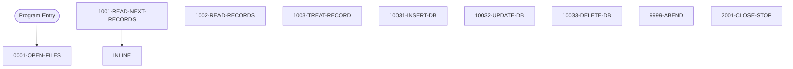

# Program: COBTUPDT


---

## Quick Reference

| Attribute | Value |
|-----------|-------|
| Program ID | `COBTUPDT` |
| Type | DB2 |
| Lines | 238 |
| Source | [COBTUPDT.cbl](../carddemo/COBTUPDT.cbl#L1) |
| Paragraphs | 9 |
| Statements | 31 |
| Impact Risk | **LOW** — 0 programs affected |

> **View Source:** [Open COBTUPDT.cbl](../carddemo/COBTUPDT.cbl#L1)

## Source Grounding Facts


Status conditions found in source:
- `WS-INF-STATUS = '00'`


## Business Purpose

*Business purpose is not present in the extracted data. Run LLM enrichment to populate this section.*


## Dependency Context

> This section shows how **COBTUPDT** connects to the rest of the system — who calls it,
> what it calls, and what data it shares. If linked programs exist, they must appear here.

### Programs That Call COBTUPDT (Callers)

*No programs call COBTUPDT — this is likely a top-level entry point or CICS transaction starter.*

### Programs Called by COBTUPDT (Callees)

*COBTUPDT does not call any other programs (leaf program).*

### Shared Data (Copybooks & Files)

*No shared copybooks.*

#### Shared Files

| File | Type | Access | Also Used By |
|------|------|--------|-------------|
| `TR-RECORD` | SEQUENTIAL | SEQUENTIAL |  |

## Legacy Data Contracts

> These tables are derived from FILE SECTION records and COPY-expanded data declarations. They preserve the legacy field names, COBOL storage type, inferred modern type, and status-code values needed for Java DTOs, SQL schemas, API contracts, and migration mapping.

### File Record Layouts

#### `TR-RECORD` / `WS-INPUT-VARS`
| Legacy Field | Meaning | COBOL Type | Modern Type | Notes |
|--------------|---------|------------|-------------|-------|
| `WS-INPUT-VARS` | Input Vars | `GROUP` | `OBJECT` |  |
| `INPUT-TYPE` | Input Type | `PIC X(1)` | `STRING(1)` |  |
| `INPUT-TR-NUMBER` | Input Tr Number | `PIC X(2)` | `STRING(2)` |  |
| `INPUT-TR-DESC` | Input Tr Desc | `PIC X(50)` | `STRING(50)` |  |


---

## Dependency Graph


> **Legend:** 🔴 Target program · 🔵 Direct callers · 🟢 Direct callees · 🟡 Copybook-coupled · ⚫ Transitive (indirect)

---

## Impact Ripple View

> **If you change COBTUPDT, what else could break?**

| Impact Metric | Count |
|--------------|-------|
| Direct Callers | 0 |
| Transitive Callers (callers of callers) | 0 |
| Direct Callees | 0 |
| Transitive Callees | 0 |
| Copybook-Coupled Programs | 0 |
| **Total Impact** | **0** |
| **Risk Rating** | **LOW** |


---

## Statement Profile

| Statement Type | Count |
|---------------|-------|
| EXIT | 9 |
| MOVE | 4 |
| EVALUATE | 4 |
| PERFORM | 3 |
| EXECSQL | 3 |
| IF | 2 |
| STOP | 1 |
| READ | 1 |
| OPEN | 1 |
| DISPLAY | 1 |
| DELETE | 1 |
| CLOSE | 1 |

## Control Flow



## Paragraphs

### 0001-OPEN-FILES

| | |
|---|---|
| **Paragraph** | `0001-OPEN-FILES` |
| **Lines** | 82 - 90 |
| **View Code** | [Jump to Line 82](../carddemo/COBTUPDT.cbl#L82) |


### 1001-READ-NEXT-RECORDS

| | |
|---|---|
| **Paragraph** | `1001-READ-NEXT-RECORDS` |
| **Lines** | 91 - 99 |
| **View Code** | [Jump to Line 91](../carddemo/COBTUPDT.cbl#L91) |


### 1002-READ-RECORDS

| | |
|---|---|
| **Paragraph** | `1002-READ-RECORDS` |
| **Lines** | 100 - 108 |
| **View Code** | [Jump to Line 100](../carddemo/COBTUPDT.cbl#L100) |


### 1003-TREAT-RECORD

| | |
|---|---|
| **Paragraph** | `1003-TREAT-RECORD` |
| **Lines** | 109 - 131 |
| **View Code** | [Jump to Line 109](../carddemo/COBTUPDT.cbl#L109) |


### 10031-INSERT-DB

| | |
|---|---|
| **Paragraph** | `10031-INSERT-DB` |
| **Lines** | 132 - 165 |
| **View Code** | [Jump to Line 132](../carddemo/COBTUPDT.cbl#L132) |


### 10032-UPDATE-DB

| | |
|---|---|
| **Paragraph** | `10032-UPDATE-DB` |
| **Lines** | 166 - 195 |
| **View Code** | [Jump to Line 166](../carddemo/COBTUPDT.cbl#L166) |


### 10033-DELETE-DB

| | |
|---|---|
| **Paragraph** | `10033-DELETE-DB` |
| **Lines** | 196 - 229 |
| **View Code** | [Jump to Line 196](../carddemo/COBTUPDT.cbl#L196) |


### 9999-ABEND

| | |
|---|---|
| **Paragraph** | `9999-ABEND` |
| **Lines** | 230 - 233 |
| **View Code** | [Jump to Line 230](../carddemo/COBTUPDT.cbl#L230) |


### 2001-CLOSE-STOP

| | |
|---|---|
| **Paragraph** | `2001-CLOSE-STOP` |
| **Lines** | 234 - 237 |
| **View Code** | [Jump to Line 234](../carddemo/COBTUPDT.cbl#L234) |


## Database Operations (EXEC SQL / DB2)

This program uses the following SQL statements:

| Command | Table / Cursor | Paragraph | Line |
|---------|----------------|-----------|------|
| `INCLUDE` | None | None | 50 |
| `INCLUDE` | WS | None | 54 |
| `UPDATE` | CARDDEMO.TRANSACTION_TYPE | 10032-UPDATE-DB | 171 |
| `DELETE` | CARDDEMO.TRANSACTION_TYPE | 10033-DELETE-DB | 201 |

**Summary:** 4 SQL statement(s) — INCLUDE (2), UPDATE (1), DELETE (1)


## File Record Layouts (FD)

This program declares the following file records (data contracts for I/O):

### `FD TR-RECORD` (record `WS-INPUT-VARS`)

| Level | Field | PIC | USAGE | Parent |
|-------|-------|-----|-------|--------|
| `01` | `WS-INPUT-VARS` | `None` | None | None |
| `05` | `INPUT-TYPE` | `X(1)` | None | WS-INPUT-VARS |
| `05` | `INPUT-TR-NUMBER` | `X(2)` | None | WS-INPUT-VARS |
| `05` | `INPUT-TR-DESC` | `X(50)` | None | WS-INPUT-VARS |


## Data Lineage (MOVE Flow)

The following MOVE statements were extracted from the source. Each row is a `source → destination`
flow that the migration team can use to trace how data is reshaped and routed.

| Source | Destination | Paragraph | Line |
|--------|-------------|-----------|------|
| `'Y'` | `LASTREC` | 1002-READ-RECORDS | 102 |
| `SQLCODE` | `WS-VAR-SQLCODE` | 10031-INSERT-DB | 149 |
| `SQLCODE` | `WS-VAR-SQLCODE` | 10032-UPDATE-DB | 176 |
| `SQLCODE` | `WS-VAR-SQLCODE` | 10033-DELETE-DB | 205 |
| `'4'` | `RETURN-CODE` | 9999-ABEND | 232 |


## Known Issues & Code Anomalies

Static analysis flagged the following items in this program. Migration teams should
review each one before re-implementing in a modern stack.

| Severity | Category | Title | Paragraph | Line |
|----------|----------|-------|-----------|------|
| **NOTICE** | DEAD_CODE | Variable `INPUT-TYPE` is declared but never referenced | None | 41 |
| **NOTICE** | DEAD_CODE | Variable `INPUT-TR-NUMBER` is declared but never referenced | None | 43 |
| **NOTICE** | DEAD_CODE | Variable `INPUT-TR-DESC` is declared but never referenced | None | 45 |
| **NOTICE** | DEAD_CODE | Variable `WS-INF-STAT1` is declared but never referenced | None | 68 |
| **NOTICE** | DEAD_CODE | Variable `WS-INF-STAT2` is declared but never referenced | None | 69 |
| **NOTICE** | LOGIC | Paragraph `1001-READ-NEXT-RECORDS` terminates the program on error | 1001-READ-NEXT-RECORDS | 91 |
| **NOTICE** | LOGIC | Paragraph `1003-TREAT-RECORD` terminates the program on error | 1003-TREAT-RECORD | 109 |
| **NOTICE** | LOGIC | Paragraph `10031-INSERT-DB` terminates the program on error | 10031-INSERT-DB | 132 |
| **NOTICE** | LOGIC | Paragraph `10032-UPDATE-DB` terminates the program on error | 10032-UPDATE-DB | 166 |
| **NOTICE** | LOGIC | Paragraph `10033-DELETE-DB` terminates the program on error | 10033-DELETE-DB | 196 |

### NOTICE — Variable `INPUT-TYPE` is declared but never referenced

`INPUT-TYPE` is declared at line 41 but no other statement reads or writes it. Likely a leftover from prior refactoring or an incomplete feature.
**Source excerpt** (line 41):
```cobol
05 INPUT-TYPE                            PIC X(1)             00320032
```

**Recommendation:** Remove the declaration or wire it into the logic that was originally intended.
---
### NOTICE — Variable `INPUT-TR-NUMBER` is declared but never referenced

`INPUT-TR-NUMBER` is declared at line 43 but no other statement reads or writes it. Likely a leftover from prior refactoring or an incomplete feature.
**Source excerpt** (line 43):
```cobol
05 INPUT-TR-NUMBER                       PIC X(2)             00340032
```

**Recommendation:** Remove the declaration or wire it into the logic that was originally intended.
---
### NOTICE — Variable `INPUT-TR-DESC` is declared but never referenced

`INPUT-TR-DESC` is declared at line 45 but no other statement reads or writes it. Likely a leftover from prior refactoring or an incomplete feature.
**Source excerpt** (line 45):
```cobol
05 INPUT-TR-DESC                         PIC X(50)            00360032
```

**Recommendation:** Remove the declaration or wire it into the logic that was originally intended.
---
### NOTICE — Variable `WS-INF-STAT1` is declared but never referenced

`WS-INF-STAT1` is declared at line 68 but no other statement reads or writes it. Likely a leftover from prior refactoring or an incomplete feature.
**Source excerpt** (line 68):
```cobol
05  WS-INF-STAT1       PIC X.                                00580032
```

**Recommendation:** Remove the declaration or wire it into the logic that was originally intended.
---
### NOTICE — Variable `WS-INF-STAT2` is declared but never referenced

`WS-INF-STAT2` is declared at line 69 but no other statement reads or writes it. Likely a leftover from prior refactoring or an incomplete feature.
**Source excerpt** (line 69):
```cobol
05  WS-INF-STAT2       PIC X.                                00590032
```

**Recommendation:** Remove the declaration or wire it into the logic that was originally intended.
---
### NOTICE — Paragraph `1001-READ-NEXT-RECORDS` terminates the program on error

`1001-READ-NEXT-RECORDS` calls an ABEND routine (or STOP RUN) on the failure path. This means an error here ENDS the entire program — it does NOT reject, skip, or log-and-continue. Documentation must use "abend" / "terminate" language, not "reject".

**Recommendation:** Use ‘abend’ or ‘terminates the program’ when describing the error path of this paragraph.
---
### NOTICE — Paragraph `1003-TREAT-RECORD` terminates the program on error

`1003-TREAT-RECORD` calls an ABEND routine (or STOP RUN) on the failure path. This means an error here ENDS the entire program — it does NOT reject, skip, or log-and-continue. Documentation must use "abend" / "terminate" language, not "reject".

**Recommendation:** Use ‘abend’ or ‘terminates the program’ when describing the error path of this paragraph.
---
### NOTICE — Paragraph `10031-INSERT-DB` terminates the program on error

`10031-INSERT-DB` calls an ABEND routine (or STOP RUN) on the failure path. This means an error here ENDS the entire program — it does NOT reject, skip, or log-and-continue. Documentation must use "abend" / "terminate" language, not "reject".

**Recommendation:** Use ‘abend’ or ‘terminates the program’ when describing the error path of this paragraph.
---
### NOTICE — Paragraph `10032-UPDATE-DB` terminates the program on error

`10032-UPDATE-DB` calls an ABEND routine (or STOP RUN) on the failure path. This means an error here ENDS the entire program — it does NOT reject, skip, or log-and-continue. Documentation must use "abend" / "terminate" language, not "reject".

**Recommendation:** Use ‘abend’ or ‘terminates the program’ when describing the error path of this paragraph.
---
### NOTICE — Paragraph `10033-DELETE-DB` terminates the program on error

`10033-DELETE-DB` calls an ABEND routine (or STOP RUN) on the failure path. This means an error here ENDS the entire program — it does NOT reject, skip, or log-and-continue. Documentation must use "abend" / "terminate" language, not "reject".

**Recommendation:** Use ‘abend’ or ‘terminates the program’ when describing the error path of this paragraph.
---


## File OPEN / CLOSE Operations

The exact OPEN mode (INPUT / OUTPUT / I-O / EXTEND) determines whether a file can be
read, written, or both — and whether REWRITE / DELETE are legal. This table is the
source of truth for migrators converting to modern storage layers.

| File | Operation | Mode | Paragraph | Line |
|------|-----------|------|-----------|------|
| `TR-RECORD` | OPEN | INPUT | 0001-OPEN-FILES | 83 |
| `TR-RECORD` | CLOSE | None | 2001-CLOSE-STOP | 235 |


## Decision Tables (EVALUATE / WHEN)

Captured from the source. Each EVALUATE block is a structured decision the
migration team should turn into either a switch / pattern-match or a rules table.

### EVALUATE `INPUT-REC-TYPE` — paragraph `1003-TREAT-RECORD` (line 122)

| WHEN | Action |
|------|--------|
| **WHEN OTHER** | STRING |
| `'A'` | DISPLAY 'ADDING RECORD' |
| `'U'` | DISPLAY 'UPDATING RECORD' |
| `'D'` | DISPLAY 'DELETING RECORD' |
| `'*'` | DISPLAY 'IGNORING COMMENTED LINE' |

### EVALUATE `TRUE` — paragraph `10031-INSERT-DB` (line 152)

| WHEN | Action |
|------|--------|
| `SQLCODE = ZERO` | DISPLAY 'RECORD INSERTED SUCCESSFULLY' |
| `SQLCODE < 0` | STRING |

### EVALUATE `TRUE` — paragraph `10032-UPDATE-DB` (line 178)

| WHEN | Action |
|------|--------|
| `SQLCODE = ZERO` | DISPLAY 'RECORD UPDATED SUCCESSFULLY' |
| `SQLCODE = +100` | STRING 'No records found.' DELIMITED BY SIZE |
| `SQLCODE < 0` | STRING |

### EVALUATE `TRUE` — paragraph `10033-DELETE-DB` (line 208)

| WHEN | Action |
|------|--------|
| `SQLCODE = ZERO` | DISPLAY 'RECORD DELETED SUCCESSFULLY' |
| `SQLCODE = +100` | STRING 'No records found.' DELIMITED BY SIZE |
| `SQLCODE < 0` | STRING |


## Modernization Review Findings

These are source-derived review notes that should be checked before translating this program into Java, Spring Boot, SQL, APIs, or batch jobs.

| Finding | Why It Matters |
|---------|----------------|
| Nested IF blocks need compiler-accurate validation | Nested conditional logic was detected. During migration, validate scope with the original compiler rules and explicit `END-IF`/period termination before translating to Java or SQL. |


## Business Rules

- **Transaction File Open Success** `BR-031`  
  The transaction file must open successfully for the update process to continue.  
  [View Rule Details](../business-rules/BR-031.md)
- **Database Connection Success** `BR-032`  
  A successful connection to the DB2 database is required to perform updates.  
  [View Rule Details](../business-rules/BR-032.md)
- **Process Insert Record** `BR-033`  
  When a transaction record indicates an insert operation, a new record should be created in the database.  
  [View Rule Details](../business-rules/BR-033.md)
- **Process Update Record** `BR-034`  
  When a transaction record indicates an update operation, an existing record in the database should be modified.  
  [View Rule Details](../business-rules/BR-034.md)
- **Process Delete Record** `BR-035`  
  When a transaction record indicates a delete operation, an existing record in the database should be removed.  
  [View Rule Details](../business-rules/BR-035.md)
- **Process Insert Record** `BR-036`  
  When a transaction record indicates an insert operation, add a new record to the database.  
  [View Rule Details](../business-rules/BR-036.md)
- **Process Update Record** `BR-037`  
  When a transaction record indicates an update operation, modify an existing record in the database.  
  [View Rule Details](../business-rules/BR-037.md)
- **Process Delete Record** `BR-038`  
  When a transaction record indicates a delete operation, remove an existing record from the database.  
  [View Rule Details](../business-rules/BR-038.md)
- **Record Type Validation** `BR-039`  
  The system determines the type of database update (insert, update, or delete) based on a record type code within the transaction record.  
  [View Rule Details](../business-rules/BR-039.md)
- **Transaction Type Validation** `BR-040`  
  The system determines the type of database update (insert, update, or delete) based on a record type code within the transaction record.  
  [View Rule Details](../business-rules/BR-040.md)
- **Delete Record Validation** `BR-041`  
  If the database delete operation fails, set the DB2 delete status code to 'DB2-DELETE-ERROR'.  
  [View Rule Details](../business-rules/BR-041.md)
- **Delete Record Failure Handling** `BR-042`  
  If the database delete operation fails, set the overall program return code to 8.  
  [View Rule Details](../business-rules/BR-042.md)

## Key Data Items

| Name | Level | Picture | Section | Business Name |
|------|-------|---------|---------|---------------|
| `FLAGS` | 1 | `None` | WORKING-STORAGE | None |
| `LASTREC` | 5 | `X(1)` | WORKING-STORAGE | None |
| `WORKING-VARIABLES` | 1 | `None` | WORKING-STORAGE | None |
| `WS-RETURN-MSG` | 5 | `X(80)` | WORKING-STORAGE | None |
| `WS-MISC-VARS` | 1 | `None` | WORKING-STORAGE | None |
| `WS-VAR-SQLCODE` | 5 | `----9` | WORKING-STORAGE | None |
| `WS-INF-STATUS` | 1 | `None` | WORKING-STORAGE | None |
| `WS-INF-STAT1` | 5 | `X` | WORKING-STORAGE | None |
| `WS-INF-STAT2` | 5 | `X` | WORKING-STORAGE | None |
| `WS-INPUT-REC` | 1 | `None` | WORKING-STORAGE | None |
| `INPUT-REC-TYPE` | 5 | `X(1)` | WORKING-STORAGE | None |
| `INPUT-REC-NUMBER` | 5 | `X(2)` | WORKING-STORAGE | None |
| `INPUT-REC-DESC` | 5 | `X(50)` | WORKING-STORAGE | None |

---

*Generated 2026-05-02 17:07*