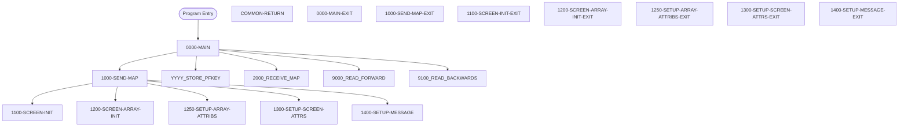

# Program: COCRDLIC


---

## Quick Reference

| Attribute | Value |
|-----------|-------|
| Program ID | `COCRDLIC` |
| Type | ONLINE |
| Lines | 1460 |
| Source | [COCRDLIC.cbl](../carddemo/COCRDLIC.cbl#L1) |
| Paragraphs | 39 |
| Statements | 59 |
| Impact Risk | **HIGH** — 24 programs affected |

> **View Source:** [Open COCRDLIC.cbl](../carddemo/COCRDLIC.cbl#L1)

## Source Grounding Facts

| Data Item | Literal Value |
|-----------|---------------|
| `WS-ROW-SELECT-ERROR` | `1` |
| `WS-INFORM-REC-ACTIONS` | `TYPE S FOR DETAIL, U TO UPDATE ANY RECORD` |
| `WS-EXIT-MESSAGE` | `PF03 PRESSED.EXITING` |
| `WS-NO-RECORDS-FOUND` | `NO RECORDS FOUND FOR THIS SEARCH CONDITION.` |
| `WS-MORE-THAN-1-ACTION` | `PLEASE SELECT ONLY ONE RECORD TO VIEW OR UPDATE` |
| `WS-INVALID-ACTION-CODE` | `INVALID ACTION CODE` |
| `WS-CONTEXT-FRESH-START` | `0` |
| `WS-CONTEXT-FRESH-START-NO` | `1` |
| `WS-EXCLUDE-THIS-RECORD` | `0` |
| `WS-DONOT-EXCLUDE-THIS-RECORD` | `1` |
| `WS-RETURN-FLAG-ON` | `1` |


## Business Purpose

*Business purpose is not present in the extracted data. Run LLM enrichment to populate this section.*


## Dependency Context

> This section shows how **COCRDLIC** connects to the rest of the system — who calls it,
> what it calls, and what data it shares. If linked programs exist, they must appear here.

### Programs That Call COCRDLIC (Callers)

*No programs call COCRDLIC — this is likely a top-level entry point or CICS transaction starter.*

### Programs Called by COCRDLIC (Callees)

*COCRDLIC does not call any other programs (leaf program).*

### Shared Data (Copybooks & Files)

#### Shared Copybooks

| Copybook | Also Used By | # Co-Users |
|----------|-------------|------------|
| `COCOM01Y` | COACTUPC, COACTVWC, COADM01C, COBIL00C, COCRDSLC (+15 more) | 20 |
| `COCRDLI` |  | 0 |
| `COTTL01Y` | COACTUPC, COACTVWC, COADM01C, COBIL00C, COCRDSLC (+15 more) | 20 |
| `CSDAT01Y` | COACTUPC, COACTVWC, COADM01C, COBIL00C, COCRDSLC (+15 more) | 20 |
| `CSMSG01Y` | COACTUPC, COACTVWC, COADM01C, COBIL00C, COCRDSLC (+15 more) | 20 |
| `CSUSR01Y` | COACTUPC, COACTVWC, COADM01C, COCRDSLC, COCRDUPC (+8 more) | 13 |
| `CVACT02Y` | CBACT02C, CBEXPORT, CBIMPORT, CBTRN01C, COACTVWC (+4 more) | 9 |
| `CVCRD01Y` | COACTUPC, COACTVWC, COCRDSLC, COCRDUPC, COTRTLIC (+1 more) | 6 |
| `DFHAID` | COACTUPC, COACTVWC, COADM01C, COBIL00C, COCRDSLC (+15 more) | 20 |
| `DFHBMSCA` | COACTUPC, COACTVWC, COADM01C, COBIL00C, COCRDSLC (+15 more) | 20 |


## Legacy Data Contracts

> These tables are derived from FILE SECTION records and COPY-expanded data declarations. They preserve the legacy field names, COBOL storage type, inferred modern type, and status-code values needed for Java DTOs, SQL schemas, API contracts, and migration mapping.


### Copybook Segment Layouts

#### `COCOM01Y` as `CARDDEMO-COMMAREA`

| Legacy Field | Meaning | COBOL Type | Modern Type | Status / Format Notes |
|--------------|---------|------------|-------------|-----------------------|
| `CARDDEMO-COMMAREA` | Carddemo Commarea | `GROUP` | `OBJECT` |  |
| `CDEMO-GENERAL-INFO` | General Info | `GROUP` | `OBJECT` |  |
| `CDEMO-FROM-TRANID` | From Tranid | `PIC X(04)` | `STRING(4)` |  |
| `CDEMO-FROM-PROGRAM` | From Program | `PIC X(08)` | `STRING(8)` |  |
| `CDEMO-TO-TRANID` | To Tranid | `PIC X(04)` | `STRING(4)` |  |
| `CDEMO-TO-PROGRAM` | To Program | `PIC X(08)` | `STRING(8)` |  |
| `CDEMO-USER-ID` | User ID | `PIC X(08)` | `STRING(8)` |  |
| `CDEMO-USER-TYPE` | User Type | `PIC X(01)` | `STRING(1)` |  |
| `CDEMO-PGM-CONTEXT` | Pgm Context | `PIC 9(01)` | `INTEGER` |  |
| `CDEMO-CUSTOMER-INFO` | Customer Info | `GROUP` | `OBJECT` |  |
| `CDEMO-CUST-ID` | Customer ID | `PIC 9(09)` | `INTEGER` |  |
| `CDEMO-CUST-FNAME` | Customer Fname | `PIC X(25)` | `STRING(25)` |  |
| `CDEMO-CUST-MNAME` | Customer Mname | `PIC X(25)` | `STRING(25)` |  |
| `CDEMO-CUST-LNAME` | Customer Lname | `PIC X(25)` | `STRING(25)` |  |
| `CDEMO-ACCOUNT-INFO` | Account Info | `GROUP` | `OBJECT` |  |
| `CDEMO-ACCT-ID` | Account ID | `PIC 9(11)` | `BIGINT` |  |
| `CDEMO-ACCT-STATUS` | Account Status | `PIC X(01)` | `STRING(1)` |  |
| `CDEMO-CARD-INFO` | Card Info | `GROUP` | `OBJECT` |  |
| `CDEMO-CARD-NUM` | Card Number | `PIC 9(16)` | `BIGINT` |  |
| `CDEMO-MORE-INFO` | More Info | `GROUP` | `OBJECT` |  |
| `CDEMO-LAST-MAP` | Last Map | `PIC X(7)` | `STRING(7)` |  |
| `CDEMO-LAST-MAPSET` | Last Mapset | `PIC X(7)` | `STRING(7)` |  |

#### `COCRDLI` as `CCRDLIAI`

| Legacy Field | Meaning | COBOL Type | Modern Type | Status / Format Notes |
|--------------|---------|------------|-------------|-----------------------|
| `CCRDLIAI` | Ccrdliai | `GROUP` | `OBJECT` |  |
| `CCRDLIAO` | Ccrdliao | `GROUP` | `OBJECT` |  |

#### `COTTL01Y` as `CCDA-SCREEN-TITLE`

| Legacy Field | Meaning | COBOL Type | Modern Type | Status / Format Notes |
|--------------|---------|------------|-------------|-----------------------|
| `CCDA-SCREEN-TITLE` | Ccda Screen Title | `GROUP` | `OBJECT` |  |
| `CCDA-TITLE01` | Ccda Title01 | `PIC X(40)` | `STRING(40)` |  |
| `CCDA-TITLE02` | Ccda Title02 | `PIC X(40)` | `STRING(40)` |  |
| `CCDA-THANK-YOU` | Ccda Thank You | `PIC X(40)` | `STRING(40)` |  |

#### `CSDAT01Y` as `WS-DATE-TIME`

| Legacy Field | Meaning | COBOL Type | Modern Type | Status / Format Notes |
|--------------|---------|------------|-------------|-----------------------|
| `WS-DATE-TIME` | Date Time | `GROUP` | `OBJECT` |  |
| `WS-CURDATE-DATA` | Curdate Data | `GROUP` | `OBJECT` |  |
| `WS-CURDATE` | Curdate | `GROUP` | `OBJECT` |  |
| `WS-CURDATE-YEAR` | Curdate Year | `PIC 9(04)` | `INTEGER` |  |
| `WS-CURDATE-MONTH` | Curdate Month | `PIC 9(02)` | `INTEGER` |  |
| `WS-CURDATE-DAY` | Curdate Day | `PIC 9(02)` | `INTEGER` |  |
| `WS-CURDATE-N` | Curdate N | `PIC 9(08)` | `INTEGER` |  |
| `WS-CURTIME` | Curtime | `GROUP` | `OBJECT` |  |
| `WS-CURTIME-HOURS` | Curtime Hours | `PIC 9(02)` | `INTEGER` |  |
| `WS-CURTIME-MINUTE` | Curtime Minute | `PIC 9(02)` | `INTEGER` |  |
| `WS-CURTIME-SECOND` | Curtime Second | `PIC 9(02)` | `INTEGER` |  |
| `WS-CURTIME-MILSEC` | Curtime Milsec | `PIC 9(02)` | `INTEGER` |  |
| `WS-CURTIME-N` | Curtime N | `PIC 9(08)` | `INTEGER` |  |
| `WS-CURDATE-MM-DD-YY` | Curdate Mm Dd Yy | `GROUP` | `OBJECT` |  |
| `WS-CURDATE-MM` | Curdate Mm | `PIC 9(02)` | `INTEGER` |  |
| `FILLER` | Filler | `PIC X(01)` | `STRING(1)` |  |
| `WS-CURDATE-DD` | Curdate Dd | `PIC 9(02)` | `INTEGER` |  |
| `FILLER` | Filler | `PIC X(01)` | `STRING(1)` |  |
| `WS-CURDATE-YY` | Curdate Yy | `PIC 9(02)` | `INTEGER` |  |
| `WS-CURTIME-HH-MM-SS` | Curtime Hh Mm Ss | `GROUP` | `OBJECT` |  |
| `WS-CURTIME-HH` | Curtime Hh | `PIC 9(02)` | `INTEGER` |  |
| `FILLER` | Filler | `PIC X(01)` | `STRING(1)` |  |
| `WS-CURTIME-MM` | Curtime Mm | `PIC 9(02)` | `INTEGER` |  |
| `FILLER` | Filler | `PIC X(01)` | `STRING(1)` |  |
| `WS-CURTIME-SS` | Curtime Ss | `PIC 9(02)` | `INTEGER` |  |
| `WS-TIMESTAMP` | Timestamp | `GROUP` | `OBJECT` |  |
| `WS-TIMESTAMP-DT-YYYY` | Timestamp Date Yyyy | `PIC 9(04)` | `INTEGER` |  |
| `FILLER` | Filler | `PIC X(01)` | `STRING(1)` |  |
| `WS-TIMESTAMP-DT-MM` | Timestamp Date Mm | `PIC 9(02)` | `INTEGER` |  |
| `FILLER` | Filler | `PIC X(01)` | `STRING(1)` |  |
| `WS-TIMESTAMP-DT-DD` | Timestamp Date Dd | `PIC 9(02)` | `INTEGER` |  |
| `FILLER` | Filler | `PIC X(01)` | `STRING(1)` |  |
| `WS-TIMESTAMP-TM-HH` | Timestamp Tm Hh | `PIC 9(02)` | `INTEGER` |  |
| `FILLER` | Filler | `PIC X(01)` | `STRING(1)` |  |
| `WS-TIMESTAMP-TM-MM` | Timestamp Tm Mm | `PIC 9(02)` | `INTEGER` |  |
| `FILLER` | Filler | `PIC X(01)` | `STRING(1)` |  |
| `WS-TIMESTAMP-TM-SS` | Timestamp Tm Ss | `PIC 9(02)` | `INTEGER` |  |
| `FILLER` | Filler | `PIC X(01)` | `STRING(1)` |  |
| `WS-TIMESTAMP-TM-MS6` | Timestamp Tm Ms6 | `PIC 9(06)` | `INTEGER` |  |

#### `CSMSG01Y` as `CCDA-COMMON-MESSAGES`

| Legacy Field | Meaning | COBOL Type | Modern Type | Status / Format Notes |
|--------------|---------|------------|-------------|-----------------------|
| `CCDA-COMMON-MESSAGES` | Ccda Common Messages | `GROUP` | `OBJECT` |  |
| `CCDA-MSG-THANK-YOU` | Ccda Msg Thank You | `PIC X(50)` | `STRING(50)` |  |
| `CCDA-MSG-INVALID-KEY` | Ccda Msg Invalid Key | `PIC X(50)` | `STRING(50)` |  |

#### `CSUSR01Y` as `SEC-USER-DATA`

| Legacy Field | Meaning | COBOL Type | Modern Type | Status / Format Notes |
|--------------|---------|------------|-------------|-----------------------|
| `SEC-USER-DATA` | Sec User Data | `GROUP` | `OBJECT` |  |
| `SEC-USR-ID` | Sec Usr ID | `PIC X(08)` | `STRING(8)` |  |
| `SEC-USR-FNAME` | Sec Usr Fname | `PIC X(20)` | `STRING(20)` |  |
| `SEC-USR-LNAME` | Sec Usr Lname | `PIC X(20)` | `STRING(20)` |  |
| `SEC-USR-PWD` | Sec Usr Pwd | `PIC X(08)` | `STRING(8)` |  |
| `SEC-USR-TYPE` | Sec Usr Type | `PIC X(01)` | `STRING(1)` |  |
| `SEC-USR-FILLER` | Sec Usr Filler | `PIC X(23)` | `STRING(23)` |  |

#### `CVACT02Y` as `CARD-RECORD`

| Legacy Field | Meaning | COBOL Type | Modern Type | Status / Format Notes |
|--------------|---------|------------|-------------|-----------------------|
| `CARD-RECORD` | Card Record | `GROUP` | `OBJECT` |  |
| `CARD-NUM` | Card Number | `PIC X(16)` | `STRING(16)` |  |
| `CARD-ACCT-ID` | Card Account ID | `PIC 9(11)` | `BIGINT` |  |
| `CARD-CVV-CD` | Card Cvv Cd | `PIC 9(03)` | `INTEGER` |  |
| `CARD-EMBOSSED-NAME` | Card Embossed Name | `PIC X(50)` | `STRING(50)` |  |
| `CARD-EXPIRAION-DATE` | Card Expiraion Date | `PIC X(10)` | `STRING(10)` | Date-like field; verify YYDDD, YYMMDD, or ISO format before migration. |
| `CARD-ACTIVE-STATUS` | Card Active Status | `PIC X(01)` | `STRING(1)` |  |
| `FILLER` | Filler | `PIC X(59)` | `STRING(59)` |  |

#### `CVCRD01Y` as `CC-WORK-AREAS`

| Legacy Field | Meaning | COBOL Type | Modern Type | Status / Format Notes |
|--------------|---------|------------|-------------|-----------------------|
| `CC-WORK-AREAS` | Cc Work Areas | `GROUP` | `OBJECT` |  |
| `CC-WORK-AREA` | Cc Work Area | `GROUP` | `OBJECT` |  |
| `CCARD-AID` | Ccard Aid | `PIC X(5)` | `STRING(5)` |  |
| `CCARD-NEXT-PROG` | Ccard Next Prog | `PIC X(8)` | `STRING(8)` |  |
| `CCARD-NEXT-MAPSET` | Ccard Next Mapset | `PIC X(7)` | `STRING(7)` |  |
| `CCARD-NEXT-MAP` | Ccard Next Map | `PIC X(7)` | `STRING(7)` |  |
| `CCARD-ERROR-MSG` | Ccard Error Msg | `PIC X(75)` | `STRING(75)` |  |
| `CCARD-RETURN-MSG` | Ccard Return Msg | `PIC X(75)` | `STRING(75)` |  |
| `CC-ACCT-ID` | Cc Account ID | `PIC X(11)` | `STRING(11)` |  |
| `CC-ACCT-ID-N` | Cc Account ID N | `PIC 9(11)` | `BIGINT` |  |
| `CC-CARD-NUM` | Cc Card Number | `PIC X(16)` | `STRING(16)` |  |
| `CC-CARD-NUM-N` | Cc Card Number N | `PIC 9(16)` | `BIGINT` |  |
| `CC-CUST-ID` | Cc Customer ID | `PIC X(09)` | `STRING(9)` |  |
| `CC-CUST-ID-N` | Cc Customer ID N | `PIC 9(9)` | `INTEGER` |  |

#### `DFHAID` as `DFHAID`

| Legacy Field | Meaning | COBOL Type | Modern Type | Status / Format Notes |
|--------------|---------|------------|-------------|-----------------------|
| `DFHAID` | Dfhaid | `GROUP` | `OBJECT` |  |

#### `DFHBMSCA` as `DFHBMSCA`

| Legacy Field | Meaning | COBOL Type | Modern Type | Status / Format Notes |
|--------------|---------|------------|-------------|-----------------------|
| `DFHBMSCA` | Dfhbmsca | `GROUP` | `OBJECT` |  |


### Data Movement And Key Mapping

| Line | Source | Target | Meaning |
|------|--------|--------|---------|
| 645 | `FUNCTION CURRENT-DATE` | `WS-CURDATE-DATA` | FUNCTION CURRENT-DATE populates WS-CURDATE-DATA |
| 652 | `FUNCTION CURRENT-DATE` | `WS-CURDATE-DATA` | FUNCTION CURRENT-DATE populates WS-CURDATE-DATA |
| 654 | `WS-CURDATE-MONTH` | `WS-CURDATE-MM` | WS-CURDATE-MONTH populates WS-CURDATE-MM |
| 655 | `WS-CURDATE-DAY` | `WS-CURDATE-DD` | WS-CURDATE-DAY populates WS-CURDATE-DD |
| 656 | `WS-CURDATE-YEAR(3:2)` | `WS-CURDATE-YY` | WS-CURDATE-YEAR(3:2) populates WS-CURDATE-YY |
| 658 | `WS-CURDATE-MM-DD-YY` | `CURDATEO OF CCRDLIAO` | WS-CURDATE-MM-DD-YY populates CURDATEO OF CCRDLIAO |
| 684 | `WS-ROW-ACCTNO(1)` | `ACCTNO1O OF CCRDLIAO` | WS-ROW-ACCTNO(1) populates ACCTNO1O OF CCRDLIAO |
| 686 | `WS-ROW-CARD-STATUS(1)` | `CRDSTS1O OF CCRDLIAO` | WS-ROW-CARD-STATUS(1) populates CRDSTS1O OF CCRDLIAO |
| 693 | `WS-ROW-ACCTNO(2)` | `ACCTNO2O OF CCRDLIAO` | WS-ROW-ACCTNO(2) populates ACCTNO2O OF CCRDLIAO |
| 695 | `WS-ROW-CARD-STATUS(2)` | `CRDSTS2O OF CCRDLIAO` | WS-ROW-CARD-STATUS(2) populates CRDSTS2O OF CCRDLIAO |
| 702 | `WS-ROW-ACCTNO(3)` | `ACCTNO3O OF CCRDLIAO` | WS-ROW-ACCTNO(3) populates ACCTNO3O OF CCRDLIAO |
| 704 | `WS-ROW-CARD-STATUS(3)` | `CRDSTS3O OF CCRDLIAO` | WS-ROW-CARD-STATUS(3) populates CRDSTS3O OF CCRDLIAO |
| 711 | `WS-ROW-ACCTNO(4)` | `ACCTNO4O OF CCRDLIAO` | WS-ROW-ACCTNO(4) populates ACCTNO4O OF CCRDLIAO |
| 713 | `WS-ROW-CARD-STATUS(4)` | `CRDSTS4O OF CCRDLIAO` | WS-ROW-CARD-STATUS(4) populates CRDSTS4O OF CCRDLIAO |
| 720 | `WS-ROW-ACCTNO(5)` | `ACCTNO5O OF CCRDLIAO` | WS-ROW-ACCTNO(5) populates ACCTNO5O OF CCRDLIAO |
| 722 | `WS-ROW-CARD-STATUS(5)` | `CRDSTS5O OF CCRDLIAO` | WS-ROW-CARD-STATUS(5) populates CRDSTS5O OF CCRDLIAO |
| 730 | `WS-ROW-ACCTNO(6)` | `ACCTNO6O OF CCRDLIAO` | WS-ROW-ACCTNO(6) populates ACCTNO6O OF CCRDLIAO |
| 732 | `WS-ROW-CARD-STATUS(6)` | `CRDSTS6O OF CCRDLIAO` | WS-ROW-CARD-STATUS(6) populates CRDSTS6O OF CCRDLIAO |
| 739 | `WS-ROW-ACCTNO(7)` | `ACCTNO7O OF CCRDLIAO` | WS-ROW-ACCTNO(7) populates ACCTNO7O OF CCRDLIAO |
| 741 | `WS-ROW-CARD-STATUS(7)` | `CRDSTS7O OF CCRDLIAO` | WS-ROW-CARD-STATUS(7) populates CRDSTS7O OF CCRDLIAO |
| 847 | `CC-ACCT-ID` | `ACCTSIDO OF CCRDLIAO` | CC-ACCT-ID populates ACCTSIDO OF CCRDLIAO |
| 848 | `DFHBMFSE` | `ACCTSIDA OF CCRDLIAI` | DFHBMFSE populates ACCTSIDA OF CCRDLIAI |
| 850 | `LOW-VALUES` | `ACCTSIDO OF CCRDLIAO` | LOW-VALUES populates ACCTSIDO OF CCRDLIAO |
| 852 | `CDEMO-ACCT-ID` | `ACCTSIDO OF CCRDLIAO` | CDEMO-ACCT-ID populates ACCTSIDO OF CCRDLIAO |
| 853 | `DFHBMFSE` | `ACCTSIDA OF CCRDLIAI` | DFHBMFSE populates ACCTSIDA OF CCRDLIAI |
| 873 | `DFHRED` | `ACCTSIDC OF CCRDLIAO` | DFHRED populates ACCTSIDC OF CCRDLIAO |
| 874 | `-1` | `ACCTSIDL OF CCRDLIAI` | -1 populates ACCTSIDL OF CCRDLIAI |
| 885 | `-1` | `ACCTSIDL OF CCRDLIAI` | -1 populates ACCTSIDL OF CCRDLIAI |
| 969 | `ACCTSIDI OF CCRDLIAI` | `CC-ACCT-ID` | ACCTSIDI OF CCRDLIAI populates CC-ACCT-ID |
| 1011 | `ZEROES` | `CDEMO-ACCT-ID` | ZEROES populates CDEMO-ACCT-ID |


---

## Dependency Graph

```mermaid
flowchart TD
    COCRDLIC["⬤ COCRDLIC"]:::target
    CB_COCOM01Y{{"COCOM01Y"}}:::copybook
    COCRDLIC -.- CB_COCOM01Y
    COACTUPC["COACTUPC"]:::coupled
    CB_COCOM01Y -.- COACTUPC
    COACTVWC["COACTVWC"]:::coupled
    CB_COCOM01Y -.- COACTVWC
    COADM01C["COADM01C"]:::coupled
    CB_COCOM01Y -.- COADM01C
    CB_COTTL01Y{{"COTTL01Y"}}:::copybook
    COCRDLIC -.- CB_COTTL01Y
    COACTUPC["COACTUPC"]:::coupled
    CB_COTTL01Y -.- COACTUPC
    COACTVWC["COACTVWC"]:::coupled
    CB_COTTL01Y -.- COACTVWC
    COADM01C["COADM01C"]:::coupled
    CB_COTTL01Y -.- COADM01C
    CB_CSDAT01Y{{"CSDAT01Y"}}:::copybook
    COCRDLIC -.- CB_CSDAT01Y
    COACTUPC["COACTUPC"]:::coupled
    CB_CSDAT01Y -.- COACTUPC
    COACTVWC["COACTVWC"]:::coupled
    CB_CSDAT01Y -.- COACTVWC
    COADM01C["COADM01C"]:::coupled
    CB_CSDAT01Y -.- COADM01C
    CB_CSMSG01Y{{"CSMSG01Y"}}:::copybook
    COCRDLIC -.- CB_CSMSG01Y
    COACTUPC["COACTUPC"]:::coupled
    CB_CSMSG01Y -.- COACTUPC
    COACTVWC["COACTVWC"]:::coupled
    CB_CSMSG01Y -.- COACTVWC
    COADM01C["COADM01C"]:::coupled
    CB_CSMSG01Y -.- COADM01C
    CB_CSUSR01Y{{"CSUSR01Y"}}:::copybook
    COCRDLIC -.- CB_CSUSR01Y
    COACTUPC["COACTUPC"]:::coupled
    CB_CSUSR01Y -.- COACTUPC
    COACTVWC["COACTVWC"]:::coupled
    CB_CSUSR01Y -.- COACTVWC
    COADM01C["COADM01C"]:::coupled
    CB_CSUSR01Y -.- COADM01C
    CB_CVACT02Y{{"CVACT02Y"}}:::copybook
    COCRDLIC -.- CB_CVACT02Y
    CBACT02C["CBACT02C"]:::coupled
    CB_CVACT02Y -.- CBACT02C
    CBEXPORT["CBEXPORT"]:::coupled
    CB_CVACT02Y -.- CBEXPORT
    CBIMPORT["CBIMPORT"]:::coupled
    CB_CVACT02Y -.- CBIMPORT
    CB_CVCRD01Y{{"CVCRD01Y"}}:::copybook
    COCRDLIC -.- CB_CVCRD01Y
    COACTUPC["COACTUPC"]:::coupled
    CB_CVCRD01Y -.- COACTUPC
    COACTVWC["COACTVWC"]:::coupled
    CB_CVCRD01Y -.- COACTVWC
    COCRDSLC["COCRDSLC"]:::coupled
    CB_CVCRD01Y -.- COCRDSLC
    classDef target fill:#f85149,stroke:#da3633,color:#fff,stroke-width:3px
    classDef caller fill:#58a6ff,stroke:#1f6feb,color:#fff
    classDef callee fill:#3fb950,stroke:#238636,color:#fff
    classDef copybook fill:#d29922,stroke:#9e6a03,color:#fff
    classDef coupled fill:#d29922,stroke:#9e6a03,color:#fff,stroke-dasharray:5
    classDef transitive fill:#484f58,stroke:#8b949e,color:#c9d1d9,stroke-dasharray:5
```



> **Legend:** 🔴 Target program · 🔵 Direct callers · 🟢 Direct callees · 🟡 Copybook-coupled · ⚫ Transitive (indirect)

---

## Impact Ripple View

> **If you change COCRDLIC, what else could break?**

| Impact Metric | Count |
|--------------|-------|
| Direct Callers | 0 |
| Transitive Callers (callers of callers) | 0 |
| Direct Callees | 0 |
| Transitive Callees | 0 |
| Copybook-Coupled Programs | 24 |
| **Total Impact** | **24** |
| **Risk Rating** | **HIGH** |


**Programs affected via shared copybooks:**
- `CBACT02C`
- `CBEXPORT`
- `CBIMPORT`
- `CBTRN01C`
- `COACTUPC`
- `COACTVWC`
- `COADM01C`
- `COBIL00C`
- `COCRDSLC`
- `COCRDUPC`
- `COMEN01C`
- `COPAUS0C`
- `COPAUS1C`
- `CORPT00C`
- `COSGN00C`
- `COTRN00C`
- `COTRN01C`
- `COTRN02C`
- `COTRTLIC`
- `COTRTUPC`
- `COUSR00C`
- `COUSR01C`
- `COUSR02C`
- `COUSR03C`

---

## Statement Profile

| Statement Type | Count |
|---------------|-------|
| IF | 59 |

## Control Flow



## Paragraphs

### 0000-MAIN

| | |
|---|---|
| **Paragraph** | `0000-MAIN` |
| **Lines** | 298 - 603 |
| **View Code** | [Jump to Line 298](../carddemo/COCRDLIC.cbl#L298) |


### COMMON-RETURN

| | |
|---|---|
| **Paragraph** | `COMMON-RETURN` |
| **Lines** | 604 - 620 |
| **View Code** | [Jump to Line 604](../carddemo/COCRDLIC.cbl#L604) |


### 0000-MAIN-EXIT

| | |
|---|---|
| **Paragraph** | `0000-MAIN-EXIT` |
| **Lines** | 621 - 623 |
| **View Code** | [Jump to Line 621](../carddemo/COCRDLIC.cbl#L621) |


### 1000-SEND-MAP

| | |
|---|---|
| **Paragraph** | `1000-SEND-MAP` |
| **Lines** | 624 - 638 |
| **View Code** | [Jump to Line 624](../carddemo/COCRDLIC.cbl#L624) |


### 1000-SEND-MAP-EXIT

| | |
|---|---|
| **Paragraph** | `1000-SEND-MAP-EXIT` |
| **Lines** | 639 - 641 |
| **View Code** | [Jump to Line 639](../carddemo/COCRDLIC.cbl#L639) |


### 1100-SCREEN-INIT

| | |
|---|---|
| **Paragraph** | `1100-SCREEN-INIT` |
| **Lines** | 642 - 673 |
| **View Code** | [Jump to Line 642](../carddemo/COCRDLIC.cbl#L642) |


### 1100-SCREEN-INIT-EXIT

| | |
|---|---|
| **Paragraph** | `1100-SCREEN-INIT-EXIT` |
| **Lines** | 674 - 677 |
| **View Code** | [Jump to Line 674](../carddemo/COCRDLIC.cbl#L674) |


### 1200-SCREEN-ARRAY-INIT

| | |
|---|---|
| **Paragraph** | `1200-SCREEN-ARRAY-INIT` |
| **Lines** | 678 - 744 |
| **View Code** | [Jump to Line 678](../carddemo/COCRDLIC.cbl#L678) |


### 1200-SCREEN-ARRAY-INIT-EXIT

| | |
|---|---|
| **Paragraph** | `1200-SCREEN-ARRAY-INIT-EXIT` |
| **Lines** | 745 - 747 |
| **View Code** | [Jump to Line 745](../carddemo/COCRDLIC.cbl#L745) |


### 1250-SETUP-ARRAY-ATTRIBS

| | |
|---|---|
| **Paragraph** | `1250-SETUP-ARRAY-ATTRIBS` |
| **Lines** | 748 - 833 |
| **View Code** | [Jump to Line 748](../carddemo/COCRDLIC.cbl#L748) |


### 1250-SETUP-ARRAY-ATTRIBS-EXIT

| | |
|---|---|
| **Paragraph** | `1250-SETUP-ARRAY-ATTRIBS-EXIT` |
| **Lines** | 834 - 836 |
| **View Code** | [Jump to Line 834](../carddemo/COCRDLIC.cbl#L834) |


### 1300-SETUP-SCREEN-ATTRS

| | |
|---|---|
| **Paragraph** | `1300-SETUP-SCREEN-ATTRS` |
| **Lines** | 837 - 889 |
| **View Code** | [Jump to Line 837](../carddemo/COCRDLIC.cbl#L837) |


### 1300-SETUP-SCREEN-ATTRS-EXIT

| | |
|---|---|
| **Paragraph** | `1300-SETUP-SCREEN-ATTRS-EXIT` |
| **Lines** | 890 - 894 |
| **View Code** | [Jump to Line 890](../carddemo/COCRDLIC.cbl#L890) |


### 1400-SETUP-MESSAGE

| | |
|---|---|
| **Paragraph** | `1400-SETUP-MESSAGE` |
| **Lines** | 895 - 932 |
| **View Code** | [Jump to Line 895](../carddemo/COCRDLIC.cbl#L895) |


### 1400-SETUP-MESSAGE-EXIT

| | |
|---|---|
| **Paragraph** | `1400-SETUP-MESSAGE-EXIT` |
| **Lines** | 933 - 937 |
| **View Code** | [Jump to Line 933](../carddemo/COCRDLIC.cbl#L933) |


### 1500-SEND-SCREEN

| | |
|---|---|
| **Paragraph** | `1500-SEND-SCREEN` |
| **Lines** | 938 - 947 |
| **View Code** | [Jump to Line 938](../carddemo/COCRDLIC.cbl#L938) |


### 1500-SEND-SCREEN-EXIT

| | |
|---|---|
| **Paragraph** | `1500-SEND-SCREEN-EXIT` |
| **Lines** | 948 - 950 |
| **View Code** | [Jump to Line 948](../carddemo/COCRDLIC.cbl#L948) |


### 2000-RECEIVE-MAP

| | |
|---|---|
| **Paragraph** | `2000-RECEIVE-MAP` |
| **Lines** | 951 - 958 |
| **View Code** | [Jump to Line 951](../carddemo/COCRDLIC.cbl#L951) |


### 2000-RECEIVE-MAP-EXIT

| | |
|---|---|
| **Paragraph** | `2000-RECEIVE-MAP-EXIT` |
| **Lines** | 959 - 961 |
| **View Code** | [Jump to Line 959](../carddemo/COCRDLIC.cbl#L959) |


### 2100-RECEIVE-SCREEN

| | |
|---|---|
| **Paragraph** | `2100-RECEIVE-SCREEN` |
| **Lines** | 962 - 980 |
| **View Code** | [Jump to Line 962](../carddemo/COCRDLIC.cbl#L962) |


### 2100-RECEIVE-SCREEN-EXIT

| | |
|---|---|
| **Paragraph** | `2100-RECEIVE-SCREEN-EXIT` |
| **Lines** | 981 - 984 |
| **View Code** | [Jump to Line 981](../carddemo/COCRDLIC.cbl#L981) |


### 2200-EDIT-INPUTS

| | |
|---|---|
| **Paragraph** | `2200-EDIT-INPUTS` |
| **Lines** | 985 - 998 |
| **View Code** | [Jump to Line 985](../carddemo/COCRDLIC.cbl#L985) |


### 2200-EDIT-INPUTS-EXIT

| | |
|---|---|
| **Paragraph** | `2200-EDIT-INPUTS-EXIT` |
| **Lines** | 999 - 1002 |
| **View Code** | [Jump to Line 999](../carddemo/COCRDLIC.cbl#L999) |


### 2210-EDIT-ACCOUNT

| | |
|---|---|
| **Paragraph** | `2210-EDIT-ACCOUNT` |
| **Lines** | 1003 - 1031 |
| **View Code** | [Jump to Line 1003](../carddemo/COCRDLIC.cbl#L1003) |


### 2210-EDIT-ACCOUNT-EXIT

| | |
|---|---|
| **Paragraph** | `2210-EDIT-ACCOUNT-EXIT` |
| **Lines** | 1032 - 1035 |
| **View Code** | [Jump to Line 1032](../carddemo/COCRDLIC.cbl#L1032) |


### 2220-EDIT-CARD

| | |
|---|---|
| **Paragraph** | `2220-EDIT-CARD` |
| **Lines** | 1036 - 1068 |
| **View Code** | [Jump to Line 1036](../carddemo/COCRDLIC.cbl#L1036) |


### 2220-EDIT-CARD-EXIT

| | |
|---|---|
| **Paragraph** | `2220-EDIT-CARD-EXIT` |
| **Lines** | 1069 - 1072 |
| **View Code** | [Jump to Line 1069](../carddemo/COCRDLIC.cbl#L1069) |


### 2250-EDIT-ARRAY

| | |
|---|---|
| **Paragraph** | `2250-EDIT-ARRAY` |
| **Lines** | 1073 - 1118 |
| **View Code** | [Jump to Line 1073](../carddemo/COCRDLIC.cbl#L1073) |


### 2250-EDIT-ARRAY-EXIT

| | |
|---|---|
| **Paragraph** | `2250-EDIT-ARRAY-EXIT` |
| **Lines** | 1119 - 1122 |
| **View Code** | [Jump to Line 1119](../carddemo/COCRDLIC.cbl#L1119) |


### 9000-READ-FORWARD

| | |
|---|---|
| **Paragraph** | `9000-READ-FORWARD` |
| **Lines** | 1123 - 1260 |
| **View Code** | [Jump to Line 1123](../carddemo/COCRDLIC.cbl#L1123) |


### 9000-READ-FORWARD-EXIT

| | |
|---|---|
| **Paragraph** | `9000-READ-FORWARD-EXIT` |
| **Lines** | 1261 - 1263 |
| **View Code** | [Jump to Line 1261](../carddemo/COCRDLIC.cbl#L1261) |


### 9100-READ-BACKWARDS

| | |
|---|---|
| **Paragraph** | `9100-READ-BACKWARDS` |
| **Lines** | 1264 - 1373 |
| **View Code** | [Jump to Line 1264](../carddemo/COCRDLIC.cbl#L1264) |


### 9100-READ-BACKWARDS-EXIT

| | |
|---|---|
| **Paragraph** | `9100-READ-BACKWARDS-EXIT` |
| **Lines** | 1374 - 1381 |
| **View Code** | [Jump to Line 1374](../carddemo/COCRDLIC.cbl#L1374) |


### 9500-FILTER-RECORDS

| | |
|---|---|
| **Paragraph** | `9500-FILTER-RECORDS` |
| **Lines** | 1382 - 1408 |
| **View Code** | [Jump to Line 1382](../carddemo/COCRDLIC.cbl#L1382) |


### 9500-FILTER-RECORDS-EXIT

| | |
|---|---|
| **Paragraph** | `9500-FILTER-RECORDS-EXIT` |
| **Lines** | 1409 - 1421 |
| **View Code** | [Jump to Line 1409](../carddemo/COCRDLIC.cbl#L1409) |


### SEND-PLAIN-TEXT

| | |
|---|---|
| **Paragraph** | `SEND-PLAIN-TEXT` |
| **Lines** | 1422 - 1432 |
| **View Code** | [Jump to Line 1422](../carddemo/COCRDLIC.cbl#L1422) |


### SEND-PLAIN-TEXT-EXIT

| | |
|---|---|
| **Paragraph** | `SEND-PLAIN-TEXT-EXIT` |
| **Lines** | 1433 - 1440 |
| **View Code** | [Jump to Line 1433](../carddemo/COCRDLIC.cbl#L1433) |


### SEND-LONG-TEXT

| | |
|---|---|
| **Paragraph** | `SEND-LONG-TEXT` |
| **Lines** | 1441 - 1451 |
| **View Code** | [Jump to Line 1441](../carddemo/COCRDLIC.cbl#L1441) |


### SEND-LONG-TEXT-EXIT

| | |
|---|---|
| **Paragraph** | `SEND-LONG-TEXT-EXIT` |
| **Lines** | 1452 - 1459 |
| **View Code** | [Jump to Line 1452](../carddemo/COCRDLIC.cbl#L1452) |


## Copybook Field Dictionaries

The following copybooks are included by this program. Each entry shows the actual fields
extracted from the copybook source file (`.cpy`).

### Copybook `COCOM01Y`

| Level | Field | PIC | USAGE | Parent | Notes |
|-------|-------|-----|-------|--------|-------|
| `01` | `CARDDEMO-COMMAREA` | `None` | None | None |  |
| `05` | `CDEMO-GENERAL-INFO` | `None` | None | CARDDEMO-COMMAREA |  |
| `10` | `CDEMO-FROM-TRANID` | `X(04)` | None | CDEMO-GENERAL-INFO |  |
| `10` | `CDEMO-FROM-PROGRAM` | `X(08)` | None | CDEMO-GENERAL-INFO |  |
| `10` | `CDEMO-TO-TRANID` | `X(04)` | None | CDEMO-GENERAL-INFO |  |
| `10` | `CDEMO-TO-PROGRAM` | `X(08)` | None | CDEMO-GENERAL-INFO |  |
| `10` | `CDEMO-USER-ID` | `X(08)` | None | CDEMO-GENERAL-INFO |  |
| `10` | `CDEMO-USER-TYPE` | `X(01)` | None | CDEMO-GENERAL-INFO |  |
| `88` | `CDEMO-USRTYP-ADMIN` | `None` | None | CDEMO-GENERAL-INFO |  |
| `88` | `CDEMO-USRTYP-USER` | `None` | None | CDEMO-GENERAL-INFO |  |
| `10` | `CDEMO-PGM-CONTEXT` | `9(01)` | None | CDEMO-GENERAL-INFO |  |
| `88` | `CDEMO-PGM-ENTER` | `None` | None | CDEMO-GENERAL-INFO |  |
| `88` | `CDEMO-PGM-REENTER` | `None` | None | CDEMO-GENERAL-INFO |  |
| `05` | `CDEMO-CUSTOMER-INFO` | `None` | None | CARDDEMO-COMMAREA |  |
| `10` | `CDEMO-CUST-ID` | `9(09)` | None | CDEMO-CUSTOMER-INFO |  |
| `10` | `CDEMO-CUST-FNAME` | `X(25)` | None | CDEMO-CUSTOMER-INFO |  |
| `10` | `CDEMO-CUST-MNAME` | `X(25)` | None | CDEMO-CUSTOMER-INFO |  |
| `10` | `CDEMO-CUST-LNAME` | `X(25)` | None | CDEMO-CUSTOMER-INFO |  |
| `05` | `CDEMO-ACCOUNT-INFO` | `None` | None | CARDDEMO-COMMAREA |  |
| `10` | `CDEMO-ACCT-ID` | `9(11)` | None | CDEMO-ACCOUNT-INFO |  |
| `10` | `CDEMO-ACCT-STATUS` | `X(01)` | None | CDEMO-ACCOUNT-INFO |  |
| `05` | `CDEMO-CARD-INFO` | `None` | None | CARDDEMO-COMMAREA |  |
| `10` | `CDEMO-CARD-NUM` | `9(16)` | None | CDEMO-CARD-INFO |  |
| `05` | `CDEMO-MORE-INFO` | `None` | None | CARDDEMO-COMMAREA |  |
| `10` | `CDEMO-LAST-MAP` | `X(7)` | None | CDEMO-MORE-INFO |  |
| `10` | `CDEMO-LAST-MAPSET` | `X(7)` | None | CDEMO-MORE-INFO |  |

### Copybook `COCRDLI`

| Level | Field | PIC | USAGE | Parent | Notes |
|-------|-------|-----|-------|--------|-------|
| `01` | `CCRDLIAI` | `None` | None | None |  |
| `02` | `TRNNAMEL` | `S9(4)` | COMP | CCRDLIAI |  |
| `02` | `TRNNAMEF` | `X` | None | CCRDLIAI |  |
| `03` | `TRNNAMEA` | `X` | None | CCRDLIAI |  |
| `02` | `TRNNAMEI` | `X(4)` | None | CCRDLIAI |  |
| `02` | `TITLE01L` | `S9(4)` | COMP | CCRDLIAI |  |
| `02` | `TITLE01F` | `X` | None | CCRDLIAI |  |
| `03` | `TITLE01A` | `X` | None | CCRDLIAI |  |
| `02` | `TITLE01I` | `X(40)` | None | CCRDLIAI |  |
| `02` | `CURDATEL` | `S9(4)` | COMP | CCRDLIAI |  |
| `02` | `CURDATEF` | `X` | None | CCRDLIAI |  |
| `03` | `CURDATEA` | `X` | None | CCRDLIAI |  |
| `02` | `CURDATEI` | `X(8)` | None | CCRDLIAI |  |
| `02` | `PGMNAMEL` | `S9(4)` | COMP | CCRDLIAI |  |
| `02` | `PGMNAMEF` | `X` | None | CCRDLIAI |  |
| `03` | `PGMNAMEA` | `X` | None | CCRDLIAI |  |
| `02` | `PGMNAMEI` | `X(8)` | None | CCRDLIAI |  |
| `02` | `TITLE02L` | `S9(4)` | COMP | CCRDLIAI |  |
| `02` | `TITLE02F` | `X` | None | CCRDLIAI |  |
| `03` | `TITLE02A` | `X` | None | CCRDLIAI |  |
| `02` | `TITLE02I` | `X(40)` | None | CCRDLIAI |  |
| `02` | `CURTIMEL` | `S9(4)` | COMP | CCRDLIAI |  |
| `02` | `CURTIMEF` | `X` | None | CCRDLIAI |  |
| `03` | `CURTIMEA` | `X` | None | CCRDLIAI |  |
| `02` | `CURTIMEI` | `X(8)` | None | CCRDLIAI |  |
| `02` | `PAGENOL` | `S9(4)` | COMP | CCRDLIAI |  |
| `02` | `PAGENOF` | `X` | None | CCRDLIAI |  |
| `03` | `PAGENOA` | `X` | None | CCRDLIAI |  |
| `02` | `PAGENOI` | `X(3)` | None | CCRDLIAI |  |
| `02` | `ACCTSIDL` | `S9(4)` | COMP | CCRDLIAI |  |
| `02` | `ACCTSIDF` | `X` | None | CCRDLIAI |  |
| `03` | `ACCTSIDA` | `X` | None | CCRDLIAI |  |
| `02` | `ACCTSIDI` | `X(11)` | None | CCRDLIAI |  |
| `02` | `CARDSIDL` | `S9(4)` | COMP | CCRDLIAI |  |
| `02` | `CARDSIDF` | `X` | None | CCRDLIAI |  |
| `03` | `CARDSIDA` | `X` | None | CCRDLIAI |  |
| `02` | `CARDSIDI` | `X(16)` | None | CCRDLIAI |  |
| `02` | `CRDSEL1L` | `S9(4)` | COMP | CCRDLIAI |  |
| `02` | `CRDSEL1F` | `X` | None | CCRDLIAI |  |
| `03` | `CRDSEL1A` | `X` | None | CCRDLIAI |  |
| `02` | `CRDSEL1I` | `X(1)` | None | CCRDLIAI |  |
| `02` | `ACCTNO1L` | `S9(4)` | COMP | CCRDLIAI |  |
| `02` | `ACCTNO1F` | `X` | None | CCRDLIAI |  |
| `03` | `ACCTNO1A` | `X` | None | CCRDLIAI |  |
| `02` | `ACCTNO1I` | `X(11)` | None | CCRDLIAI |  |
| `02` | `CRDNUM1L` | `S9(4)` | COMP | CCRDLIAI |  |
| `02` | `CRDNUM1F` | `X` | None | CCRDLIAI |  |
| `03` | `CRDNUM1A` | `X` | None | CCRDLIAI |  |
| `02` | `CRDNUM1I` | `X(16)` | None | CCRDLIAI |  |
| `02` | `CRDSTS1L` | `S9(4)` | COMP | CCRDLIAI |  |
*+ 357 more fields*
### Copybook `COTTL01Y`

| Level | Field | PIC | USAGE | Parent | Notes |
|-------|-------|-----|-------|--------|-------|
| `01` | `CCDA-SCREEN-TITLE` | `None` | None | None |  |
| `05` | `CCDA-TITLE01` | `X(40)` | None | CCDA-SCREEN-TITLE |  |
| `05` | `CCDA-TITLE02` | `X(40)` | None | CCDA-SCREEN-TITLE |  |
| `05` | `CCDA-THANK-YOU` | `X(40)` | None | CCDA-SCREEN-TITLE |  |

### Copybook `CSDAT01Y`

| Level | Field | PIC | USAGE | Parent | Notes |
|-------|-------|-----|-------|--------|-------|
| `01` | `WS-DATE-TIME` | `None` | None | None |  |
| `05` | `WS-CURDATE-DATA` | `None` | None | WS-DATE-TIME |  |
| `10` | `WS-CURDATE` | `None` | None | WS-CURDATE-DATA |  |
| `15` | `WS-CURDATE-YEAR` | `9(04)` | None | WS-CURDATE |  |
| `15` | `WS-CURDATE-MONTH` | `9(02)` | None | WS-CURDATE |  |
| `15` | `WS-CURDATE-DAY` | `9(02)` | None | WS-CURDATE |  |
| `10` | `WS-CURDATE-N` | `9(08)` | None | WS-CURDATE-DATA |  REDEFINES WS-CURDATE |
| `10` | `WS-CURTIME` | `None` | None | WS-CURDATE-DATA |  |
| `15` | `WS-CURTIME-HOURS` | `9(02)` | None | WS-CURTIME |  |
| `15` | `WS-CURTIME-MINUTE` | `9(02)` | None | WS-CURTIME |  |
| `15` | `WS-CURTIME-SECOND` | `9(02)` | None | WS-CURTIME |  |
| `15` | `WS-CURTIME-MILSEC` | `9(02)` | None | WS-CURTIME |  |
| `10` | `WS-CURTIME-N` | `9(08)` | None | WS-CURDATE-DATA |  REDEFINES WS-CURTIME |
| `05` | `WS-CURDATE-MM-DD-YY` | `None` | None | WS-DATE-TIME |  |
| `10` | `WS-CURDATE-MM` | `9(02)` | None | WS-CURDATE-MM-DD-YY |  |
| `10` | `WS-CURDATE-DD` | `9(02)` | None | WS-CURDATE-MM-DD-YY |  |
| `10` | `WS-CURDATE-YY` | `9(02)` | None | WS-CURDATE-MM-DD-YY |  |
| `05` | `WS-CURTIME-HH-MM-SS` | `None` | None | WS-DATE-TIME |  |
| `10` | `WS-CURTIME-HH` | `9(02)` | None | WS-CURTIME-HH-MM-SS |  |
| `10` | `WS-CURTIME-MM` | `9(02)` | None | WS-CURTIME-HH-MM-SS |  |
| `10` | `WS-CURTIME-SS` | `9(02)` | None | WS-CURTIME-HH-MM-SS |  |
| `05` | `WS-TIMESTAMP` | `None` | None | WS-DATE-TIME |  |
| `10` | `WS-TIMESTAMP-DT-YYYY` | `9(04)` | None | WS-TIMESTAMP |  |
| `10` | `WS-TIMESTAMP-DT-MM` | `9(02)` | None | WS-TIMESTAMP |  |
| `10` | `WS-TIMESTAMP-DT-DD` | `9(02)` | None | WS-TIMESTAMP |  |
| `10` | `WS-TIMESTAMP-TM-HH` | `9(02)` | None | WS-TIMESTAMP |  |
| `10` | `WS-TIMESTAMP-TM-MM` | `9(02)` | None | WS-TIMESTAMP |  |
| `10` | `WS-TIMESTAMP-TM-SS` | `9(02)` | None | WS-TIMESTAMP |  |
| `10` | `WS-TIMESTAMP-TM-MS6` | `9(06)` | None | WS-TIMESTAMP |  |

### Copybook `CSMSG01Y`

| Level | Field | PIC | USAGE | Parent | Notes |
|-------|-------|-----|-------|--------|-------|
| `01` | `CCDA-COMMON-MESSAGES` | `None` | None | None |  |
| `05` | `CCDA-MSG-THANK-YOU` | `X(50)` | None | CCDA-COMMON-MESSAGES |  |
| `05` | `CCDA-MSG-INVALID-KEY` | `X(50)` | None | CCDA-COMMON-MESSAGES |  |

### Copybook `CSUSR01Y`

| Level | Field | PIC | USAGE | Parent | Notes |
|-------|-------|-----|-------|--------|-------|
| `01` | `SEC-USER-DATA` | `None` | None | None |  |
| `05` | `SEC-USR-ID` | `X(08)` | None | SEC-USER-DATA |  |
| `05` | `SEC-USR-FNAME` | `X(20)` | None | SEC-USER-DATA |  |
| `05` | `SEC-USR-LNAME` | `X(20)` | None | SEC-USER-DATA |  |
| `05` | `SEC-USR-PWD` | `X(08)` | None | SEC-USER-DATA |  |
| `05` | `SEC-USR-TYPE` | `X(01)` | None | SEC-USER-DATA |  |
| `05` | `SEC-USR-FILLER` | `X(23)` | None | SEC-USER-DATA |  |

### Copybook `CVACT02Y`

| Level | Field | PIC | USAGE | Parent | Notes |
|-------|-------|-----|-------|--------|-------|
| `01` | `CARD-RECORD` | `None` | None | None |  |
| `05` | `CARD-NUM` | `X(16)` | None | CARD-RECORD |  |
| `05` | `CARD-ACCT-ID` | `9(11)` | None | CARD-RECORD |  |
| `05` | `CARD-CVV-CD` | `9(03)` | None | CARD-RECORD |  |
| `05` | `CARD-EMBOSSED-NAME` | `X(50)` | None | CARD-RECORD |  |
| `05` | `CARD-EXPIRAION-DATE` | `X(10)` | None | CARD-RECORD |  |
| `05` | `CARD-ACTIVE-STATUS` | `X(01)` | None | CARD-RECORD |  |

### Copybook `CVCRD01Y`

| Level | Field | PIC | USAGE | Parent | Notes |
|-------|-------|-----|-------|--------|-------|
| `01` | `CC-WORK-AREAS` | `None` | None | None |  |
| `05` | `CC-WORK-AREA` | `None` | None | CC-WORK-AREAS |  |
| `10` | `CCARD-AID` | `X(5)` | None | CC-WORK-AREA |  |
| `88` | `CCARD-AID-ENTER` | `None` | None | CC-WORK-AREA |  |
| `88` | `CCARD-AID-CLEAR` | `None` | None | CC-WORK-AREA |  |
| `88` | `CCARD-AID-PA1` | `None` | None | CC-WORK-AREA |  |
| `88` | `CCARD-AID-PA2` | `None` | None | CC-WORK-AREA |  |
| `88` | `CCARD-AID-PFK01` | `None` | None | CC-WORK-AREA |  |
| `88` | `CCARD-AID-PFK02` | `None` | None | CC-WORK-AREA |  |
| `88` | `CCARD-AID-PFK03` | `None` | None | CC-WORK-AREA |  |
| `88` | `CCARD-AID-PFK04` | `None` | None | CC-WORK-AREA |  |
| `88` | `CCARD-AID-PFK05` | `None` | None | CC-WORK-AREA |  |
| `88` | `CCARD-AID-PFK06` | `None` | None | CC-WORK-AREA |  |
| `88` | `CCARD-AID-PFK07` | `None` | None | CC-WORK-AREA |  |
| `88` | `CCARD-AID-PFK08` | `None` | None | CC-WORK-AREA |  |
| `88` | `CCARD-AID-PFK09` | `None` | None | CC-WORK-AREA |  |
| `88` | `CCARD-AID-PFK10` | `None` | None | CC-WORK-AREA |  |
| `88` | `CCARD-AID-PFK11` | `None` | None | CC-WORK-AREA |  |
| `88` | `CCARD-AID-PFK12` | `None` | None | CC-WORK-AREA |  |
| `10` | `CCARD-NEXT-PROG` | `X(8)` | None | CC-WORK-AREA |  |
| `10` | `CCARD-NEXT-MAPSET` | `X(7)` | None | CC-WORK-AREA |  |
| `10` | `CCARD-NEXT-MAP` | `X(7)` | None | CC-WORK-AREA |  |
| `10` | `CCARD-ERROR-MSG` | `X(75)` | None | CC-WORK-AREA |  |
| `10` | `CCARD-RETURN-MSG` | `X(75)` | None | CC-WORK-AREA |  |
| `88` | `CCARD-RETURN-MSG-OFF` | `None` | None | CC-WORK-AREA |  |
| `10` | `CC-ACCT-ID` | `X(11)` | None | CC-WORK-AREA |  |
| `10` | `CC-ACCT-ID-N` | `9(11)` | None | CC-WORK-AREA |  REDEFINES CC-ACCT-ID |
| `10` | `CC-CARD-NUM` | `X(16)` | None | CC-WORK-AREA |  |
| `10` | `CC-CARD-NUM-N` | `9(16)` | None | CC-WORK-AREA |  REDEFINES CC-CARD-NUM |
| `10` | `CC-CUST-ID` | `X(09)` | None | CC-WORK-AREA |  |
| `10` | `CC-CUST-ID-N` | `9(9)` | None | CC-WORK-AREA |  REDEFINES CC-CUST-ID |

### Copybook `DFHAID`

| Level | Field | PIC | USAGE | Parent | Notes |
|-------|-------|-----|-------|--------|-------|
| `01` | `DFHAID` | `None` | None | None |  |
| `02` | `DFHENTER` | `X` | None | DFHAID |  |
| `02` | `DFHCLEAR` | `X` | None | DFHAID |  |
| `02` | `DFHCLRP` | `X` | None | DFHAID |  |
| `02` | `DFHPA1` | `X` | None | DFHAID |  |
| `02` | `DFHPA2` | `X` | None | DFHAID |  |
| `02` | `DFHPA3` | `X` | None | DFHAID |  |
| `02` | `DFHPF1` | `X` | None | DFHAID |  |
| `02` | `DFHPF2` | `X` | None | DFHAID |  |
| `02` | `DFHPF3` | `X` | None | DFHAID |  |
| `02` | `DFHPF4` | `X` | None | DFHAID |  |
| `02` | `DFHPF5` | `X` | None | DFHAID |  |
| `02` | `DFHPF6` | `X` | None | DFHAID |  |
| `02` | `DFHPF7` | `X` | None | DFHAID |  |
| `02` | `DFHPF8` | `X` | None | DFHAID |  |
| `02` | `DFHPF9` | `X` | None | DFHAID |  |
| `02` | `DFHPF10` | `X` | None | DFHAID |  |
| `02` | `DFHPF11` | `X` | None | DFHAID |  |
| `02` | `DFHPF12` | `X` | None | DFHAID |  |
| `02` | `DFHPF13` | `X` | None | DFHAID |  |
| `02` | `DFHPF14` | `X` | None | DFHAID |  |
| `02` | `DFHPF15` | `X` | None | DFHAID |  |
| `02` | `DFHPF16` | `X` | None | DFHAID |  |
| `02` | `DFHPF17` | `X` | None | DFHAID |  |
| `02` | `DFHPF18` | `X` | None | DFHAID |  |
| `02` | `DFHPF19` | `X` | None | DFHAID |  |
| `02` | `DFHPF20` | `X` | None | DFHAID |  |
| `02` | `DFHPF21` | `X` | None | DFHAID |  |
| `02` | `DFHPF22` | `X` | None | DFHAID |  |
| `02` | `DFHPF23` | `X` | None | DFHAID |  |
| `02` | `DFHPF24` | `X` | None | DFHAID |  |
| `02` | `DFHPEN` | `X` | None | DFHAID |  |
| `02` | `DFHOPID` | `X` | None | DFHAID |  |
| `02` | `DFHMSRE` | `X` | None | DFHAID |  |
| `02` | `DFHSTRF` | `X` | None | DFHAID |  |
| `02` | `DFHTRIG` | `X` | None | DFHAID |  |

### Copybook `DFHBMSCA`

| Level | Field | PIC | USAGE | Parent | Notes |
|-------|-------|-----|-------|--------|-------|
| `01` | `DFHBMSCA` | `None` | None | None |  |
| `02` | `DFHBMPEM` | `X` | None | DFHBMSCA |  |
| `02` | `DFHBMPNL` | `X` | None | DFHBMSCA |  |
| `02` | `DFHBMASK` | `X` | None | DFHBMSCA |  |
| `02` | `DFHBMUNP` | `X` | None | DFHBMSCA |  |
| `02` | `DFHBMUNN` | `X` | None | DFHBMSCA |  |
| `02` | `DFHBMPRO` | `X` | None | DFHBMSCA |  |
| `02` | `DFHBMBRY` | `X` | None | DFHBMSCA |  |
| `02` | `DFHBMDAR` | `X` | None | DFHBMSCA |  |
| `02` | `DFHBMFSE` | `X` | None | DFHBMSCA |  |
| `02` | `DFHBMPRF` | `X` | None | DFHBMSCA |  |
| `02` | `DFHBMASF` | `X` | None | DFHBMSCA |  |
| `02` | `DFHBMASB` | `X` | None | DFHBMSCA |  |
| `02` | `DFHBMEOF` | `X` | None | DFHBMSCA |  |
| `02` | `DFHBMEC` | `X` | None | DFHBMSCA |  |
| `02` | `DFHSA` | `X` | None | DFHBMSCA |  |
| `02` | `DFHCOLOR` | `X` | None | DFHBMSCA |  |
| `02` | `DFHPS` | `X` | None | DFHBMSCA |  |
| `02` | `DFHHLT` | `X` | None | DFHBMSCA |  |
| `02` | `DFHVAL` | `X` | None | DFHBMSCA |  |
| `02` | `DFHOUTLN` | `X` | None | DFHBMSCA |  |
| `02` | `DFHBKTRN` | `X` | None | DFHBMSCA |  |
| `02` | `DFHALL` | `X` | None | DFHBMSCA |  |
| `02` | `DFHERROR` | `X` | None | DFHBMSCA |  |
| `02` | `DFHDFT` | `X` | None | DFHBMSCA |  |
| `02` | `DFHDFCOL` | `X` | None | DFHBMSCA |  |
| `02` | `DFHBLUE` | `X` | None | DFHBMSCA |  |
| `02` | `DFHRED` | `X` | None | DFHBMSCA |  |
| `02` | `DFHPINK` | `X` | None | DFHBMSCA |  |
| `02` | `DFHGREEN` | `X` | None | DFHBMSCA |  |
| `02` | `DFHTURQ` | `X` | None | DFHBMSCA |  |
| `02` | `DFHYELLO` | `X` | None | DFHBMSCA |  |
| `02` | `DFHWHTE` | `X` | None | DFHBMSCA |  |
| `02` | `CATTR-H-UNPROT` | `X` | None | DFHBMSCA |  |
| `02` | `CATTR-H-UNPROT-FSET` | `X` | None | DFHBMSCA |  |
| `02` | `CATTR-H-UNPROT-NUM` | `X` | None | DFHBMSCA |  |
| `02` | `CATTR-H-ASKIP` | `X` | None | DFHBMSCA |  |


## Data Lineage (MOVE Flow)

The following MOVE statements were extracted from the source. Each row is a `source → destination`
flow that the migration team can use to trace how data is reshaped and routed.

| Source | Destination | Paragraph | Line |
|--------|-------------|-----------|------|
| `LIT-THISTRANID` | `WS-TRANID` | 0000-MAIN | 307 |
| `LIT-THISTRANID` | `CDEMO-FROM-TRANID` | 0000-MAIN | 318 |
| `LIT-THISPGM` | `CDEMO-FROM-PROGRAM` | 0000-MAIN | 319 |
| `LIT-THISMAP` | `CDEMO-LAST-MAP` | 0000-MAIN | 322 |
| `LIT-THISMAPSET` | `CDEMO-LAST-MAPSET` | 0000-MAIN | 323 |
| `LIT-THISMAP` | `CDEMO-LAST-MAP` | 0000-MAIN | 340 |
| `LIT-THISTRANID` | `CDEMO-FROM-TRANID` | 0000-MAIN | 386 |
| `LIT-THISPGM` | `CDEMO-FROM-PROGRAM` | 0000-MAIN | 387 |
| `LIT-THISMAPSET` | `CDEMO-LAST-MAPSET` | 0000-MAIN | 390 |
| `LIT-THISMAP` | `CDEMO-LAST-MAP` | 0000-MAIN | 391 |
| `LIT-MENUPGM` | `CDEMO-TO-PROGRAM` | 0000-MAIN | 392 |
| `LIT-MENUMAPSET` | `CCARD-NEXT-MAPSET` | 0000-MAIN | 394 |
| `LIT-THISMAP` | `CCARD-NEXT-MAP` | 0000-MAIN | 395 |
| `WS-ERROR-MSG` | `CCARD-ERROR-MSG` | 0000-MAIN | 423 |
| `LIT-THISPGM` | `CDEMO-FROM-PROGRAM` | 0000-MAIN | 424 |
| `LIT-THISMAPSET` | `CDEMO-LAST-MAPSET` | 0000-MAIN | 425 |
| `LIT-THISMAP` | `CDEMO-LAST-MAP` | 0000-MAIN | 426 |
| `LIT-THISPGM` | `CCARD-NEXT-PROG` | 0000-MAIN | 428 |
| `LIT-THISMAPSET` | `CCARD-NEXT-MAPSET` | 0000-MAIN | 429 |
| `LIT-THISMAP` | `CCARD-NEXT-MAP` | 0000-MAIN | 430 |
| `LIT-THISTRANID` | `CDEMO-FROM-TRANID` | 0000-MAIN | 464 |
| `LIT-THISPGM` | `CDEMO-FROM-PROGRAM` | 0000-MAIN | 465 |
| `LIT-THISMAP` | `CDEMO-LAST-MAP` | 0000-MAIN | 468 |
| `LIT-THISMAPSET` | `CDEMO-LAST-MAPSET` | 0000-MAIN | 469 |
| `LIT-THISTRANID` | `CDEMO-FROM-TRANID` | 0000-MAIN | 520 |
| `LIT-THISPGM` | `CDEMO-FROM-PROGRAM` | 0000-MAIN | 521 |
| `LIT-THISMAPSET` | `CDEMO-LAST-MAPSET` | 0000-MAIN | 524 |
| `LIT-THISMAP` | `CDEMO-LAST-MAP` | 0000-MAIN | 525 |
| `LIT-CARDDTLPGM` | `CCARD-NEXT-PROG` | 0000-MAIN | 526 |
| `LIT-CARDDTLMAPSET` | `CCARD-NEXT-MAPSET` | 0000-MAIN | 528 |
| `LIT-CARDDTLMAP` | `CCARD-NEXT-MAP` | 0000-MAIN | 529 |
| `LIT-THISTRANID` | `CDEMO-FROM-TRANID` | 0000-MAIN | 548 |
| `LIT-THISPGM` | `CDEMO-FROM-PROGRAM` | 0000-MAIN | 549 |
| `LIT-THISMAPSET` | `CDEMO-LAST-MAPSET` | 0000-MAIN | 552 |
| `LIT-THISMAP` | `CDEMO-LAST-MAP` | 0000-MAIN | 553 |
| `LIT-CARDUPDPGM` | `CCARD-NEXT-PROG` | 0000-MAIN | 554 |
| `LIT-CARDUPDMAPSET` | `CCARD-NEXT-MAPSET` | 0000-MAIN | 556 |
| `LIT-CARDUPDMAP` | `CCARD-NEXT-MAP` | 0000-MAIN | 557 |
| `WS-ERROR-MSG` | `CCARD-ERROR-MSG` | 0000-MAIN | 587 |
| `LIT-THISPGM` | `CDEMO-FROM-PROGRAM` | 0000-MAIN | 588 |
| `LIT-THISMAPSET` | `CDEMO-LAST-MAPSET` | 0000-MAIN | 589 |
| `LIT-THISMAP` | `CDEMO-LAST-MAP` | 0000-MAIN | 590 |
| `LIT-THISPGM` | `CCARD-NEXT-PROG` | 0000-MAIN | 592 |
| `LIT-THISMAPSET` | `CCARD-NEXT-MAPSET` | 0000-MAIN | 593 |
| `LIT-THISMAP` | `CCARD-NEXT-MAP` | 0000-MAIN | 594 |
| `LIT-THISPGM` | `CCARD-NEXT-PROG` | 0000-MAIN | 600 |
| `LIT-THISTRANID` | `CDEMO-FROM-TRANID` | COMMON-RETURN | 605 |
| `LIT-THISPGM` | `CDEMO-FROM-PROGRAM` | COMMON-RETURN | 606 |
| `LIT-THISMAPSET` | `CDEMO-LAST-MAPSET` | COMMON-RETURN | 607 |
| `LIT-THISMAP` | `CDEMO-LAST-MAP` | COMMON-RETURN | 608 |
| `CARDDEMO-COMMAREA` | `WS-COMMAREA` | COMMON-RETURN | 609 |
| `LOW-VALUES` | `CCRDLIAO` | 1100-SCREEN-INIT | 643 |
| `CCDA-TITLE01` | `TITLE01O` | 1100-SCREEN-INIT | 647 |
| `CCDA-TITLE01` | `OF` | 1100-SCREEN-INIT | 647 |
| `CCDA-TITLE01` | `CCRDLIAO` | 1100-SCREEN-INIT | 647 |
| `CCDA-TITLE02` | `TITLE02O` | 1100-SCREEN-INIT | 648 |
| `CCDA-TITLE02` | `OF` | 1100-SCREEN-INIT | 648 |
| `CCDA-TITLE02` | `CCRDLIAO` | 1100-SCREEN-INIT | 648 |
| `LIT-THISTRANID` | `TRNNAMEO` | 1100-SCREEN-INIT | 649 |
| `LIT-THISTRANID` | `OF` | 1100-SCREEN-INIT | 649 |
*+ 40 more movements*

## Known Issues & Code Anomalies

Static analysis flagged the following items in this program. Migration teams should
review each one before re-implementing in a modern stack.

| Severity | Category | Title | Paragraph | Line |
|----------|----------|-------|-----------|------|
| **NOTICE** | DEAD_CODE | Variable `WS-INPUT-FLAG` is declared but never referenced | None | 56 |
| **NOTICE** | DEAD_CODE | Variable `WS-EDIT-ACCT-FLAG` is declared but never referenced | None | 61 |
| **NOTICE** | DEAD_CODE | Variable `WS-EDIT-CARD-FLAG` is declared but never referenced | None | 65 |
| **NOTICE** | DEAD_CODE | Variable `WS-EDIT-SELECT-COUNTER` is declared but never referenced | None | 69 |
| **NOTICE** | DEAD_CODE | Variable `WS-PFK-FLAG` is declared but never referenced | None | 127 |
| **NOTICE** | DEAD_CODE | Variable `WS-CONTEXT-FLAG` is declared but never referenced | None | 130 |
| **NOTICE** | DEAD_CODE | Variable `WS-FILTER-RECORD-FLAG` is declared but never referenced | None | 147 |
| **NOTICE** | DEAD_CODE | Variable `WS-RECORDS-TO-PROCESS-FLAG` is declared but never referenced | None | 150 |
| **NOTICE** | DEAD_CODE | Variable `LIT-MENUTRANID` is declared but never referenced | None | 189 |
| **NOTICE** | DEAD_CODE | Variable `LIT-CARDDTLTRANID` is declared but never referenced | None | 197 |

### NOTICE — Variable `WS-INPUT-FLAG` is declared but never referenced

`WS-INPUT-FLAG` is declared at line 56 but no other statement reads or writes it. Likely a leftover from prior refactoring or an incomplete feature.
**Source excerpt** (line 56):
```cobol
05 WS-INPUT-FLAG                          PIC X(1).
```

**Recommendation:** Remove the declaration or wire it into the logic that was originally intended.
---
### NOTICE — Variable `WS-EDIT-ACCT-FLAG` is declared but never referenced

`WS-EDIT-ACCT-FLAG` is declared at line 61 but no other statement reads or writes it. Likely a leftover from prior refactoring or an incomplete feature.
**Source excerpt** (line 61):
```cobol
05  WS-EDIT-ACCT-FLAG                     PIC X(1).
```

**Recommendation:** Remove the declaration or wire it into the logic that was originally intended.
---
### NOTICE — Variable `WS-EDIT-CARD-FLAG` is declared but never referenced

`WS-EDIT-CARD-FLAG` is declared at line 65 but no other statement reads or writes it. Likely a leftover from prior refactoring or an incomplete feature.
**Source excerpt** (line 65):
```cobol
05  WS-EDIT-CARD-FLAG                     PIC X(1).
```

**Recommendation:** Remove the declaration or wire it into the logic that was originally intended.
---
### NOTICE — Variable `WS-EDIT-SELECT-COUNTER` is declared but never referenced

`WS-EDIT-SELECT-COUNTER` is declared at line 69 but no other statement reads or writes it. Likely a leftover from prior refactoring or an incomplete feature.
**Source excerpt** (line 69):
```cobol
05 WS-EDIT-SELECT-COUNTER                PIC S9(04)
```

**Recommendation:** Remove the declaration or wire it into the logic that was originally intended.
---
### NOTICE — Variable `WS-PFK-FLAG` is declared but never referenced

`WS-PFK-FLAG` is declared at line 127 but no other statement reads or writes it. Likely a leftover from prior refactoring or an incomplete feature.
**Source excerpt** (line 127):
```cobol
05  WS-PFK-FLAG                           PIC X(1).
```

**Recommendation:** Remove the declaration or wire it into the logic that was originally intended.
---
### NOTICE — Variable `WS-CONTEXT-FLAG` is declared but never referenced

`WS-CONTEXT-FLAG` is declared at line 130 but no other statement reads or writes it. Likely a leftover from prior refactoring or an incomplete feature.
**Source excerpt** (line 130):
```cobol
05  WS-CONTEXT-FLAG                       PIC X(1).
```

**Recommendation:** Remove the declaration or wire it into the logic that was originally intended.
---
### NOTICE — Variable `WS-FILTER-RECORD-FLAG` is declared but never referenced

`WS-FILTER-RECORD-FLAG` is declared at line 147 but no other statement reads or writes it. Likely a leftover from prior refactoring or an incomplete feature.
**Source excerpt** (line 147):
```cobol
05  WS-FILTER-RECORD-FLAG                 PIC X(1).
```

**Recommendation:** Remove the declaration or wire it into the logic that was originally intended.
---
### NOTICE — Variable `WS-RECORDS-TO-PROCESS-FLAG` is declared but never referenced

`WS-RECORDS-TO-PROCESS-FLAG` is declared at line 150 but no other statement reads or writes it. Likely a leftover from prior refactoring or an incomplete feature.
**Source excerpt** (line 150):
```cobol
05  WS-RECORDS-TO-PROCESS-FLAG            PIC X(1).
```

**Recommendation:** Remove the declaration or wire it into the logic that was originally intended.
---
### NOTICE — Variable `LIT-MENUTRANID` is declared but never referenced

`LIT-MENUTRANID` is declared at line 189 but no other statement reads or writes it. Likely a leftover from prior refactoring or an incomplete feature.
**Source excerpt** (line 189):
```cobol
05  LIT-MENUTRANID                         PIC X(4)
```

**Recommendation:** Remove the declaration or wire it into the logic that was originally intended.
---
### NOTICE — Variable `LIT-CARDDTLTRANID` is declared but never referenced

`LIT-CARDDTLTRANID` is declared at line 197 but no other statement reads or writes it. Likely a leftover from prior refactoring or an incomplete feature.
**Source excerpt** (line 197):
```cobol
05  LIT-CARDDTLTRANID                      PIC X(4)
```

**Recommendation:** Remove the declaration or wire it into the logic that was originally intended.
---


## Decision Tables (EVALUATE / WHEN)

Captured from the source. Each EVALUATE block is a structured decision the
migration team should turn into either a switch / pattern-match or a rules table.

### EVALUATE `TRUE` — paragraph `2250-EDIT-ARRAY` (line 1108)

| WHEN | Action |
|------|--------|
| **WHEN OTHER** | SET INPUT-ERROR TO TRUE |
| `SELECT-OK(I)` | MOVE I TO I-SELECTED |
| `SELECT-BLANK(I)` | CONTINUE |

### EVALUATE `WS-RESP-CD` — paragraph `9000-READ-FORWARD` (line 1246)

| WHEN | Action |
|------|--------|
| **WHEN OTHER** | SET READ-LOOP-EXIT             TO TRUE |
| `DFHRESP(NORMAL)` |  |
| `DFHRESP(DUPREC)` | PERFORM 9500-FILTER-RECORDS |
| `DFHRESP(ENDFILE)` | SET READ-LOOP-EXIT              TO TRUE |

### EVALUATE `WS-RESP-CD` — paragraph `9000-READ-FORWARD` (line 1222)

| WHEN | Action |
|------|--------|
| **WHEN OTHER** | SET READ-LOOP-EXIT      TO TRUE |
| `DFHRESP(NORMAL)` |  |
| `DFHRESP(DUPREC)` | SET CA-NEXT-PAGE-EXISTS |
| `DFHRESP(ENDFILE)` | SET CA-NEXT-PAGE-NOT-EXISTS     TO TRUE |

### EVALUATE `WS-RESP-CD` — paragraph `9100-READ-BACKWARDS` (line 1308)

| WHEN | Action |
|------|--------|
| **WHEN OTHER** | SET READ-LOOP-EXIT             TO TRUE |
| `DFHRESP(NORMAL)` |  |
| `DFHRESP(DUPREC)` | SUBTRACT 1          FROM WS-SCRN-COUNTER |

### EVALUATE `WS-RESP-CD` — paragraph `9100-READ-BACKWARDS` (line 1361)

| WHEN | Action |
|------|--------|
| **WHEN OTHER** | SET READ-LOOP-EXIT             TO TRUE |
| `DFHRESP(NORMAL)` |  |
| `DFHRESP(DUPREC)` | PERFORM 9500-FILTER-RECORDS |

### EVALUATE `TRUE` — paragraph `0000-MAIN` (line 572)

| WHEN | Action |
|------|--------|
| **WHEN OTHER** | MOVE WS-CA-FIRST-CARD-NUM |
| `INPUT-ERROR` | MOVE WS-ERROR-MSG    TO CCARD-ERROR-MSG |
| `CCARD-AID-PFK07` | AND CA-FIRST-PAGE |
| `CCARD-AID-PFK07` | AND CA-FIRST-PAGE |
| `CCARD-AID-PFK03` |  |
| `CDEMO-PGM-REENTER AND` | CDEMO-FROM-PROGRAM NOT EQUAL LIT-THISPGM |
| `CCARD-AID-PFK08` | AND CA-NEXT-PAGE-EXISTS |
| `CCARD-AID-PFK07` | AND NOT CA-FIRST-PAGE |
| `CCARD-AID-ENTER` | AND VIEW-REQUESTED-ON(I-SELECTED) |
| `CCARD-AID-ENTER` | AND UPDATE-REQUESTED-ON(I-SELECTED) |

### EVALUATE `TRUE` — paragraph `1300-SETUP-SCREEN-ATTRS` (line 851)

| WHEN | Action |
|------|--------|
| **WHEN OTHER** | MOVE CDEMO-ACCT-ID TO ACCTSIDO OF CCRDLIAO |
| `FLG-ACCTFILTER-ISVALID` |  |
| `FLG-ACCTFILTER-NOT-OK` | MOVE CC-ACCT-ID   TO ACCTSIDO OF CCRDLIAO |
| `CDEMO-ACCT-ID = 0` | MOVE LOW-VALUES   TO ACCTSIDO OF CCRDLIAO |

### EVALUATE `TRUE` — paragraph `1300-SETUP-SCREEN-ATTRS` (line 863)

| WHEN | Action |
|------|--------|
| **WHEN OTHER** | MOVE CDEMO-CARD-NUM |
| `FLG-CARDFILTER-ISVALID` |  |
| `FLG-CARDFILTER-NOT-OK` | MOVE CC-CARD-NUM  TO CARDSIDO OF CCRDLIAO |
| `CDEMO-CARD-NUM = 0` | MOVE LOW-VALUES   TO CARDSIDO OF CCRDLIAO |

### EVALUATE `TRUE` — paragraph `1400-SETUP-MESSAGE` (line 920)

| WHEN | Action |
|------|--------|
| **WHEN OTHER** | SET WS-NO-INFO-MESSAGE TO TRUE |
| `FLG-ACCTFILTER-NOT-OK` |  |
| `FLG-CARDFILTER-NOT-OK` | CONTINUE |
| `CCARD-AID-PFK07` | AND CA-FIRST-PAGE |
| `CCARD-AID-PFK08` | AND CA-NEXT-PAGE-NOT-EXISTS |
| `CCARD-AID-PFK08` | AND CA-NEXT-PAGE-NOT-EXISTS |
| `WS-NO-INFO-MESSAGE` |  |
| `CA-NEXT-PAGE-EXISTS` | SET WS-INFORM-REC-ACTIONS TO TRUE |


## Modernization Review Findings

These are source-derived review notes that should be checked before translating this program into Java, Spring Boot, SQL, APIs, or batch jobs.

| Finding | Why It Matters |
|---------|----------------|
| Nested IF blocks need compiler-accurate validation | Nested conditional logic was detected. During migration, validate scope with the original compiler rules and explicit `END-IF`/period termination before translating to Java or SQL. |


## Business Rules

*No business rules extracted yet. Run LLM enrichment to extract rules from IF/EVALUATE logic.*

## Key Data Items

*No data items found for this program.*

---

*Generated 2026-05-02 17:07*