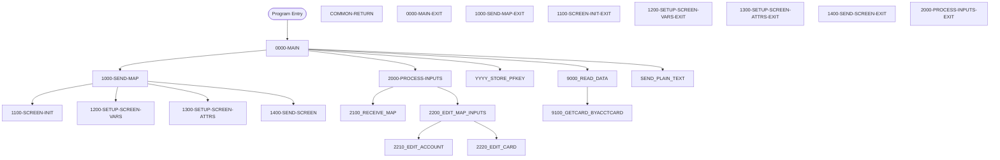

# Program: COCRDSLC


---

## Quick Reference

| Attribute | Value |
|-----------|-------|
| Program ID | `COCRDSLC` |
| Type | ONLINE |
| Lines | 888 |
| Source | [COCRDSLC.cbl](../carddemo/COCRDSLC.cbl#L1) |
| Paragraphs | 34 |
| Statements | 33 |
| Impact Risk | **HIGH** — 26 programs affected |

> **View Source:** [Open COCRDSLC.cbl](../carddemo/COCRDSLC.cbl#L1)

## Source Grounding Facts

| Data Item | Literal Value |
|-----------|---------------|
| `WS-RETURN-FLAG-ON` | `1` |
| `WS-PROMPT-FOR-INPUT` | `Please enter Account and Card Number` |
| `WS-EXIT-MESSAGE` | `PF03 pressed.Exiting` |
| `WS-PROMPT-FOR-ACCT` | `Account number not provided` |
| `WS-PROMPT-FOR-CARD` | `Card number not provided` |


## Business Purpose

*Business purpose is not present in the extracted data. Run LLM enrichment to populate this section.*


## Dependency Context

> This section shows how **COCRDSLC** connects to the rest of the system — who calls it,
> what it calls, and what data it shares. If linked programs exist, they must appear here.

### Programs That Call COCRDSLC (Callers)

*No programs call COCRDSLC — this is likely a top-level entry point or CICS transaction starter.*

### Programs Called by COCRDSLC (Callees)

*COCRDSLC does not call any other programs (leaf program).*

### Shared Data (Copybooks & Files)

#### Shared Copybooks

| Copybook | Also Used By | # Co-Users |
|----------|-------------|------------|
| `COCOM01Y` | COACTUPC, COACTVWC, COADM01C, COBIL00C, COCRDLIC (+15 more) | 20 |
| `COCRDSL` |  | 0 |
| `COTTL01Y` | COACTUPC, COACTVWC, COADM01C, COBIL00C, COCRDLIC (+15 more) | 20 |
| `CSDAT01Y` | COACTUPC, COACTVWC, COADM01C, COBIL00C, COCRDLIC (+15 more) | 20 |
| `CSMSG01Y` | COACTUPC, COACTVWC, COADM01C, COBIL00C, COCRDLIC (+15 more) | 20 |
| `CSMSG02Y` | COACTUPC, COACTVWC, COCRDUPC, COPAUS0C, COPAUS1C (+1 more) | 6 |
| `CSUSR01Y` | COACTUPC, COACTVWC, COADM01C, COCRDLIC, COCRDUPC (+8 more) | 13 |
| `CVACT02Y` | CBACT02C, CBEXPORT, CBIMPORT, CBTRN01C, COACTVWC (+4 more) | 9 |
| `CVCRD01Y` | COACTUPC, COACTVWC, COCRDLIC, COCRDUPC, COTRTLIC (+1 more) | 6 |
| `CVCUS01Y` | CBCUS01C, CBEXPORT, CBIMPORT, CBTRN01C, COACTUPC (+4 more) | 9 |
| `DFHAID` | COACTUPC, COACTVWC, COADM01C, COBIL00C, COCRDLIC (+15 more) | 20 |
| `DFHBMSCA` | COACTUPC, COACTVWC, COADM01C, COBIL00C, COCRDLIC (+15 more) | 20 |


## Legacy Data Contracts

> These tables are derived from FILE SECTION records and COPY-expanded data declarations. They preserve the legacy field names, COBOL storage type, inferred modern type, and status-code values needed for Java DTOs, SQL schemas, API contracts, and migration mapping.


### Copybook Segment Layouts

#### `COCOM01Y` as `CARDDEMO-COMMAREA`

| Legacy Field | Meaning | COBOL Type | Modern Type | Status / Format Notes |
|--------------|---------|------------|-------------|-----------------------|
| `CARDDEMO-COMMAREA` | Carddemo Commarea | `GROUP` | `OBJECT` |  |
| `CDEMO-GENERAL-INFO` | General Info | `GROUP` | `OBJECT` |  |
| `CDEMO-FROM-TRANID` | From Tranid | `PIC X(04)` | `STRING(4)` |  |
| `CDEMO-FROM-PROGRAM` | From Program | `PIC X(08)` | `STRING(8)` |  |
| `CDEMO-TO-TRANID` | To Tranid | `PIC X(04)` | `STRING(4)` |  |
| `CDEMO-TO-PROGRAM` | To Program | `PIC X(08)` | `STRING(8)` |  |
| `CDEMO-USER-ID` | User ID | `PIC X(08)` | `STRING(8)` |  |
| `CDEMO-USER-TYPE` | User Type | `PIC X(01)` | `STRING(1)` |  |
| `CDEMO-PGM-CONTEXT` | Pgm Context | `PIC 9(01)` | `INTEGER` |  |
| `CDEMO-CUSTOMER-INFO` | Customer Info | `GROUP` | `OBJECT` |  |
| `CDEMO-CUST-ID` | Customer ID | `PIC 9(09)` | `INTEGER` |  |
| `CDEMO-CUST-FNAME` | Customer Fname | `PIC X(25)` | `STRING(25)` |  |
| `CDEMO-CUST-MNAME` | Customer Mname | `PIC X(25)` | `STRING(25)` |  |
| `CDEMO-CUST-LNAME` | Customer Lname | `PIC X(25)` | `STRING(25)` |  |
| `CDEMO-ACCOUNT-INFO` | Account Info | `GROUP` | `OBJECT` |  |
| `CDEMO-ACCT-ID` | Account ID | `PIC 9(11)` | `BIGINT` |  |
| `CDEMO-ACCT-STATUS` | Account Status | `PIC X(01)` | `STRING(1)` |  |
| `CDEMO-CARD-INFO` | Card Info | `GROUP` | `OBJECT` |  |
| `CDEMO-CARD-NUM` | Card Number | `PIC 9(16)` | `BIGINT` |  |
| `CDEMO-MORE-INFO` | More Info | `GROUP` | `OBJECT` |  |
| `CDEMO-LAST-MAP` | Last Map | `PIC X(7)` | `STRING(7)` |  |
| `CDEMO-LAST-MAPSET` | Last Mapset | `PIC X(7)` | `STRING(7)` |  |

#### `COCRDSL` as `CCRDSLAI`

| Legacy Field | Meaning | COBOL Type | Modern Type | Status / Format Notes |
|--------------|---------|------------|-------------|-----------------------|
| `CCRDSLAI` | Ccrdslai | `GROUP` | `OBJECT` |  |
| `CCRDSLAO` | Ccrdslao | `GROUP` | `OBJECT` |  |

#### `COTTL01Y` as `CCDA-SCREEN-TITLE`

| Legacy Field | Meaning | COBOL Type | Modern Type | Status / Format Notes |
|--------------|---------|------------|-------------|-----------------------|
| `CCDA-SCREEN-TITLE` | Ccda Screen Title | `GROUP` | `OBJECT` |  |
| `CCDA-TITLE01` | Ccda Title01 | `PIC X(40)` | `STRING(40)` |  |
| `CCDA-TITLE02` | Ccda Title02 | `PIC X(40)` | `STRING(40)` |  |
| `CCDA-THANK-YOU` | Ccda Thank You | `PIC X(40)` | `STRING(40)` |  |

#### `CSDAT01Y` as `WS-DATE-TIME`

| Legacy Field | Meaning | COBOL Type | Modern Type | Status / Format Notes |
|--------------|---------|------------|-------------|-----------------------|
| `WS-DATE-TIME` | Date Time | `GROUP` | `OBJECT` |  |
| `WS-CURDATE-DATA` | Curdate Data | `GROUP` | `OBJECT` |  |
| `WS-CURDATE` | Curdate | `GROUP` | `OBJECT` |  |
| `WS-CURDATE-YEAR` | Curdate Year | `PIC 9(04)` | `INTEGER` |  |
| `WS-CURDATE-MONTH` | Curdate Month | `PIC 9(02)` | `INTEGER` |  |
| `WS-CURDATE-DAY` | Curdate Day | `PIC 9(02)` | `INTEGER` |  |
| `WS-CURDATE-N` | Curdate N | `PIC 9(08)` | `INTEGER` |  |
| `WS-CURTIME` | Curtime | `GROUP` | `OBJECT` |  |
| `WS-CURTIME-HOURS` | Curtime Hours | `PIC 9(02)` | `INTEGER` |  |
| `WS-CURTIME-MINUTE` | Curtime Minute | `PIC 9(02)` | `INTEGER` |  |
| `WS-CURTIME-SECOND` | Curtime Second | `PIC 9(02)` | `INTEGER` |  |
| `WS-CURTIME-MILSEC` | Curtime Milsec | `PIC 9(02)` | `INTEGER` |  |
| `WS-CURTIME-N` | Curtime N | `PIC 9(08)` | `INTEGER` |  |
| `WS-CURDATE-MM-DD-YY` | Curdate Mm Dd Yy | `GROUP` | `OBJECT` |  |
| `WS-CURDATE-MM` | Curdate Mm | `PIC 9(02)` | `INTEGER` |  |
| `FILLER` | Filler | `PIC X(01)` | `STRING(1)` |  |
| `WS-CURDATE-DD` | Curdate Dd | `PIC 9(02)` | `INTEGER` |  |
| `FILLER` | Filler | `PIC X(01)` | `STRING(1)` |  |
| `WS-CURDATE-YY` | Curdate Yy | `PIC 9(02)` | `INTEGER` |  |
| `WS-CURTIME-HH-MM-SS` | Curtime Hh Mm Ss | `GROUP` | `OBJECT` |  |
| `WS-CURTIME-HH` | Curtime Hh | `PIC 9(02)` | `INTEGER` |  |
| `FILLER` | Filler | `PIC X(01)` | `STRING(1)` |  |
| `WS-CURTIME-MM` | Curtime Mm | `PIC 9(02)` | `INTEGER` |  |
| `FILLER` | Filler | `PIC X(01)` | `STRING(1)` |  |
| `WS-CURTIME-SS` | Curtime Ss | `PIC 9(02)` | `INTEGER` |  |
| `WS-TIMESTAMP` | Timestamp | `GROUP` | `OBJECT` |  |
| `WS-TIMESTAMP-DT-YYYY` | Timestamp Date Yyyy | `PIC 9(04)` | `INTEGER` |  |
| `FILLER` | Filler | `PIC X(01)` | `STRING(1)` |  |
| `WS-TIMESTAMP-DT-MM` | Timestamp Date Mm | `PIC 9(02)` | `INTEGER` |  |
| `FILLER` | Filler | `PIC X(01)` | `STRING(1)` |  |
| `WS-TIMESTAMP-DT-DD` | Timestamp Date Dd | `PIC 9(02)` | `INTEGER` |  |
| `FILLER` | Filler | `PIC X(01)` | `STRING(1)` |  |
| `WS-TIMESTAMP-TM-HH` | Timestamp Tm Hh | `PIC 9(02)` | `INTEGER` |  |
| `FILLER` | Filler | `PIC X(01)` | `STRING(1)` |  |
| `WS-TIMESTAMP-TM-MM` | Timestamp Tm Mm | `PIC 9(02)` | `INTEGER` |  |
| `FILLER` | Filler | `PIC X(01)` | `STRING(1)` |  |
| `WS-TIMESTAMP-TM-SS` | Timestamp Tm Ss | `PIC 9(02)` | `INTEGER` |  |
| `FILLER` | Filler | `PIC X(01)` | `STRING(1)` |  |
| `WS-TIMESTAMP-TM-MS6` | Timestamp Tm Ms6 | `PIC 9(06)` | `INTEGER` |  |

#### `CSMSG01Y` as `CCDA-COMMON-MESSAGES`

| Legacy Field | Meaning | COBOL Type | Modern Type | Status / Format Notes |
|--------------|---------|------------|-------------|-----------------------|
| `CCDA-COMMON-MESSAGES` | Ccda Common Messages | `GROUP` | `OBJECT` |  |
| `CCDA-MSG-THANK-YOU` | Ccda Msg Thank You | `PIC X(50)` | `STRING(50)` |  |
| `CCDA-MSG-INVALID-KEY` | Ccda Msg Invalid Key | `PIC X(50)` | `STRING(50)` |  |

#### `CSMSG02Y` as `ABEND-DATA`

| Legacy Field | Meaning | COBOL Type | Modern Type | Status / Format Notes |
|--------------|---------|------------|-------------|-----------------------|
| `ABEND-DATA` | Abend Data | `GROUP` | `OBJECT` |  |
| `ABEND-CODE` | Abend Code | `PIC X(4)` | `STRING(4)` |  |
| `ABEND-CULPRIT` | Abend Culprit | `PIC X(8)` | `STRING(8)` |  |
| `ABEND-REASON` | Abend Reason | `PIC X(50)` | `STRING(50)` |  |
| `ABEND-MSG` | Abend Msg | `PIC X(72)` | `STRING(72)` |  |

#### `CSUSR01Y` as `SEC-USER-DATA`

| Legacy Field | Meaning | COBOL Type | Modern Type | Status / Format Notes |
|--------------|---------|------------|-------------|-----------------------|
| `SEC-USER-DATA` | Sec User Data | `GROUP` | `OBJECT` |  |
| `SEC-USR-ID` | Sec Usr ID | `PIC X(08)` | `STRING(8)` |  |
| `SEC-USR-FNAME` | Sec Usr Fname | `PIC X(20)` | `STRING(20)` |  |
| `SEC-USR-LNAME` | Sec Usr Lname | `PIC X(20)` | `STRING(20)` |  |
| `SEC-USR-PWD` | Sec Usr Pwd | `PIC X(08)` | `STRING(8)` |  |
| `SEC-USR-TYPE` | Sec Usr Type | `PIC X(01)` | `STRING(1)` |  |
| `SEC-USR-FILLER` | Sec Usr Filler | `PIC X(23)` | `STRING(23)` |  |

#### `CVACT02Y` as `CARD-RECORD`

| Legacy Field | Meaning | COBOL Type | Modern Type | Status / Format Notes |
|--------------|---------|------------|-------------|-----------------------|
| `CARD-RECORD` | Card Record | `GROUP` | `OBJECT` |  |
| `CARD-NUM` | Card Number | `PIC X(16)` | `STRING(16)` |  |
| `CARD-ACCT-ID` | Card Account ID | `PIC 9(11)` | `BIGINT` |  |
| `CARD-CVV-CD` | Card Cvv Cd | `PIC 9(03)` | `INTEGER` |  |
| `CARD-EMBOSSED-NAME` | Card Embossed Name | `PIC X(50)` | `STRING(50)` |  |
| `CARD-EXPIRAION-DATE` | Card Expiraion Date | `PIC X(10)` | `STRING(10)` | Date-like field; verify YYDDD, YYMMDD, or ISO format before migration. |
| `CARD-ACTIVE-STATUS` | Card Active Status | `PIC X(01)` | `STRING(1)` |  |
| `FILLER` | Filler | `PIC X(59)` | `STRING(59)` |  |

#### `CVCRD01Y` as `CC-WORK-AREAS`

| Legacy Field | Meaning | COBOL Type | Modern Type | Status / Format Notes |
|--------------|---------|------------|-------------|-----------------------|
| `CC-WORK-AREAS` | Cc Work Areas | `GROUP` | `OBJECT` |  |
| `CC-WORK-AREA` | Cc Work Area | `GROUP` | `OBJECT` |  |
| `CCARD-AID` | Ccard Aid | `PIC X(5)` | `STRING(5)` |  |
| `CCARD-NEXT-PROG` | Ccard Next Prog | `PIC X(8)` | `STRING(8)` |  |
| `CCARD-NEXT-MAPSET` | Ccard Next Mapset | `PIC X(7)` | `STRING(7)` |  |
| `CCARD-NEXT-MAP` | Ccard Next Map | `PIC X(7)` | `STRING(7)` |  |
| `CCARD-ERROR-MSG` | Ccard Error Msg | `PIC X(75)` | `STRING(75)` |  |
| `CCARD-RETURN-MSG` | Ccard Return Msg | `PIC X(75)` | `STRING(75)` |  |
| `CC-ACCT-ID` | Cc Account ID | `PIC X(11)` | `STRING(11)` |  |
| `CC-ACCT-ID-N` | Cc Account ID N | `PIC 9(11)` | `BIGINT` |  |
| `CC-CARD-NUM` | Cc Card Number | `PIC X(16)` | `STRING(16)` |  |
| `CC-CARD-NUM-N` | Cc Card Number N | `PIC 9(16)` | `BIGINT` |  |
| `CC-CUST-ID` | Cc Customer ID | `PIC X(09)` | `STRING(9)` |  |
| `CC-CUST-ID-N` | Cc Customer ID N | `PIC 9(9)` | `INTEGER` |  |

#### `CVCUS01Y` as `CUSTOMER-RECORD`

| Legacy Field | Meaning | COBOL Type | Modern Type | Status / Format Notes |
|--------------|---------|------------|-------------|-----------------------|
| `CUSTOMER-RECORD` | Customer Record | `GROUP` | `OBJECT` |  |
| `CUST-ID` | Customer ID | `PIC 9(09)` | `INTEGER` |  |
| `CUST-FIRST-NAME` | Customer First Name | `PIC X(25)` | `STRING(25)` |  |
| `CUST-MIDDLE-NAME` | Customer Middle Name | `PIC X(25)` | `STRING(25)` |  |
| `CUST-LAST-NAME` | Customer Last Name | `PIC X(25)` | `STRING(25)` |  |
| `CUST-ADDR-LINE-1` | Customer Addr Line 1 | `PIC X(50)` | `STRING(50)` |  |
| `CUST-ADDR-LINE-2` | Customer Addr Line 2 | `PIC X(50)` | `STRING(50)` |  |
| `CUST-ADDR-LINE-3` | Customer Addr Line 3 | `PIC X(50)` | `STRING(50)` |  |
| `CUST-ADDR-STATE-CD` | Customer Addr State Cd | `PIC X(02)` | `STRING(2)` |  |
| `CUST-ADDR-COUNTRY-CD` | Customer Addr Country Cd | `PIC X(03)` | `STRING(3)` |  |
| `CUST-ADDR-ZIP` | Customer Addr Zip | `PIC X(10)` | `STRING(10)` |  |
| `CUST-PHONE-NUM-1` | Customer Phone Number 1 | `PIC X(15)` | `STRING(15)` |  |
| `CUST-PHONE-NUM-2` | Customer Phone Number 2 | `PIC X(15)` | `STRING(15)` |  |
| `CUST-SSN` | Customer Ssn | `PIC 9(09)` | `INTEGER` |  |
| `CUST-GOVT-ISSUED-ID` | Customer Govt Issued ID | `PIC X(20)` | `STRING(20)` |  |
| `CUST-DOB-YYYY-MM-DD` | Customer Dob Yyyy Mm Dd | `PIC X(10)` | `STRING(10)` |  |
| `CUST-EFT-ACCOUNT-ID` | Customer Eft Account ID | `PIC X(10)` | `STRING(10)` |  |
| `CUST-PRI-CARD-HOLDER-IND` | Customer Pri Card Holder Ind | `PIC X(01)` | `STRING(1)` |  |
| `CUST-FICO-CREDIT-SCORE` | Customer Fico Credit Score | `PIC 9(03)` | `INTEGER` |  |
| `FILLER` | Filler | `PIC X(168)` | `STRING(168)` |  |

#### `DFHAID` as `DFHAID`

| Legacy Field | Meaning | COBOL Type | Modern Type | Status / Format Notes |
|--------------|---------|------------|-------------|-----------------------|
| `DFHAID` | Dfhaid | `GROUP` | `OBJECT` |  |

#### `DFHBMSCA` as `DFHBMSCA`

| Legacy Field | Meaning | COBOL Type | Modern Type | Status / Format Notes |
|--------------|---------|------------|-------------|-----------------------|
| `DFHBMSCA` | Dfhbmsca | `GROUP` | `OBJECT` |  |


### Data Movement And Key Mapping

| Line | Source | Target | Meaning |
|------|--------|--------|---------|
| 342 | `CDEMO-ACCT-ID` | `CC-ACCT-ID-N` | CDEMO-ACCT-ID populates CC-ACCT-ID-N |
| 430 | `FUNCTION CURRENT-DATE` | `WS-CURDATE-DATA` | FUNCTION CURRENT-DATE populates WS-CURDATE-DATA |
| 437 | `FUNCTION CURRENT-DATE` | `WS-CURDATE-DATA` | FUNCTION CURRENT-DATE populates WS-CURDATE-DATA |
| 439 | `WS-CURDATE-MONTH` | `WS-CURDATE-MM` | WS-CURDATE-MONTH populates WS-CURDATE-MM |
| 440 | `WS-CURDATE-DAY` | `WS-CURDATE-DD` | WS-CURDATE-DAY populates WS-CURDATE-DD |
| 441 | `WS-CURDATE-YEAR(3:2)` | `WS-CURDATE-YY` | WS-CURDATE-YEAR(3:2) populates WS-CURDATE-YY |
| 443 | `WS-CURDATE-MM-DD-YY` | `CURDATEO OF CCRDSLAO` | WS-CURDATE-MM-DD-YY populates CURDATEO OF CCRDSLAO |
| 463 | `LOW-VALUES` | `ACCTSIDO OF CCRDSLAO` | LOW-VALUES populates ACCTSIDO OF CCRDSLAO |
| 465 | `CC-ACCT-ID` | `ACCTSIDO OF CCRDSLAO` | CC-ACCT-ID populates ACCTSIDO OF CCRDSLAO |
| 484 | `CARD-ACTIVE-STATUS` | `CRDSTCDO OF CCRDSLAO` | CARD-ACTIVE-STATUS populates CRDSTCDO OF CCRDSLAO |
| 507 | `DFHBMPRF` | `ACCTSIDA OF CCRDSLAI` | DFHBMPRF populates ACCTSIDA OF CCRDSLAI |
| 510 | `DFHBMFSE` | `ACCTSIDA OF CCRDSLAI` | DFHBMFSE populates ACCTSIDA OF CCRDSLAI |
| 518 | `-1` | `ACCTSIDL OF CCRDSLAI` | -1 populates ACCTSIDL OF CCRDSLAI |
| 523 | `-1` | `ACCTSIDL OF CCRDSLAI` | -1 populates ACCTSIDL OF CCRDSLAI |
| 529 | `DFHDFCOL` | `ACCTSIDC OF CCRDSLAO` | DFHDFCOL populates ACCTSIDC OF CCRDSLAO |
| 534 | `DFHRED` | `ACCTSIDC OF CCRDSLAO` | DFHRED populates ACCTSIDC OF CCRDSLAO |
| 543 | `'*'` | `ACCTSIDO OF CCRDSLAO` | '*' populates ACCTSIDO OF CCRDSLAO |
| 544 | `DFHRED` | `ACCTSIDC OF CCRDSLAO` | DFHRED populates ACCTSIDC OF CCRDSLAO |
| 617 | `LOW-VALUES` | `CC-ACCT-ID` | LOW-VALUES populates CC-ACCT-ID |
| 619 | `ACCTSIDI OF CCRDSLAI` | `CC-ACCT-ID` | ACCTSIDI OF CCRDSLAI populates CC-ACCT-ID |
| 659 | `ZEROES` | `CDEMO-ACCT-ID` | ZEROES populates CDEMO-ACCT-ID |
| 673 | `ZERO` | `CDEMO-ACCT-ID` | ZERO populates CDEMO-ACCT-ID |
| 676 | `CC-ACCT-ID` | `CDEMO-ACCT-ID` | CC-ACCT-ID populates CDEMO-ACCT-ID |
| 768 | `LIT-CARDFILENAME` | `ERROR-FILE` | LIT-CARDFILENAME populates ERROR-FILE |
| 771 | `WS-FILE-ERROR-MESSAGE` | `WS-RETURN-MSG` | WS-FILE-ERROR-MESSAGE populates WS-RETURN-MSG |
| 804 | `LIT-CARDFILENAME-ACCT-PATH` | `ERROR-FILE` | LIT-CARDFILENAME-ACCT-PATH populates ERROR-FILE |
| 807 | `WS-FILE-ERROR-MESSAGE` | `WS-RETURN-MSG` | WS-FILE-ERROR-MESSAGE populates WS-RETURN-MSG |


---

## Dependency Graph

```mermaid
flowchart TD
    COCRDSLC["⬤ COCRDSLC"]:::target
    CB_COCOM01Y{{"COCOM01Y"}}:::copybook
    COCRDSLC -.- CB_COCOM01Y
    COACTUPC["COACTUPC"]:::coupled
    CB_COCOM01Y -.- COACTUPC
    COACTVWC["COACTVWC"]:::coupled
    CB_COCOM01Y -.- COACTVWC
    COADM01C["COADM01C"]:::coupled
    CB_COCOM01Y -.- COADM01C
    CB_COTTL01Y{{"COTTL01Y"}}:::copybook
    COCRDSLC -.- CB_COTTL01Y
    COACTUPC["COACTUPC"]:::coupled
    CB_COTTL01Y -.- COACTUPC
    COACTVWC["COACTVWC"]:::coupled
    CB_COTTL01Y -.- COACTVWC
    COADM01C["COADM01C"]:::coupled
    CB_COTTL01Y -.- COADM01C
    CB_CSDAT01Y{{"CSDAT01Y"}}:::copybook
    COCRDSLC -.- CB_CSDAT01Y
    COACTUPC["COACTUPC"]:::coupled
    CB_CSDAT01Y -.- COACTUPC
    COACTVWC["COACTVWC"]:::coupled
    CB_CSDAT01Y -.- COACTVWC
    COADM01C["COADM01C"]:::coupled
    CB_CSDAT01Y -.- COADM01C
    CB_CSMSG01Y{{"CSMSG01Y"}}:::copybook
    COCRDSLC -.- CB_CSMSG01Y
    COACTUPC["COACTUPC"]:::coupled
    CB_CSMSG01Y -.- COACTUPC
    COACTVWC["COACTVWC"]:::coupled
    CB_CSMSG01Y -.- COACTVWC
    COADM01C["COADM01C"]:::coupled
    CB_CSMSG01Y -.- COADM01C
    CB_CSMSG02Y{{"CSMSG02Y"}}:::copybook
    COCRDSLC -.- CB_CSMSG02Y
    COACTUPC["COACTUPC"]:::coupled
    CB_CSMSG02Y -.- COACTUPC
    COACTVWC["COACTVWC"]:::coupled
    CB_CSMSG02Y -.- COACTVWC
    COCRDUPC["COCRDUPC"]:::coupled
    CB_CSMSG02Y -.- COCRDUPC
    CB_CSUSR01Y{{"CSUSR01Y"}}:::copybook
    COCRDSLC -.- CB_CSUSR01Y
    COACTUPC["COACTUPC"]:::coupled
    CB_CSUSR01Y -.- COACTUPC
    COACTVWC["COACTVWC"]:::coupled
    CB_CSUSR01Y -.- COACTVWC
    COADM01C["COADM01C"]:::coupled
    CB_CSUSR01Y -.- COADM01C
    CB_CVACT02Y{{"CVACT02Y"}}:::copybook
    COCRDSLC -.- CB_CVACT02Y
    CBACT02C["CBACT02C"]:::coupled
    CB_CVACT02Y -.- CBACT02C
    CBEXPORT["CBEXPORT"]:::coupled
    CB_CVACT02Y -.- CBEXPORT
    CBIMPORT["CBIMPORT"]:::coupled
    CB_CVACT02Y -.- CBIMPORT
    classDef target fill:#f85149,stroke:#da3633,color:#fff,stroke-width:3px
    classDef caller fill:#58a6ff,stroke:#1f6feb,color:#fff
    classDef callee fill:#3fb950,stroke:#238636,color:#fff
    classDef copybook fill:#d29922,stroke:#9e6a03,color:#fff
    classDef coupled fill:#d29922,stroke:#9e6a03,color:#fff,stroke-dasharray:5
    classDef transitive fill:#484f58,stroke:#8b949e,color:#c9d1d9,stroke-dasharray:5
```



> **Legend:** 🔴 Target program · 🔵 Direct callers · 🟢 Direct callees · 🟡 Copybook-coupled · ⚫ Transitive (indirect)

---

## Impact Ripple View

> **If you change COCRDSLC, what else could break?**

| Impact Metric | Count |
|--------------|-------|
| Direct Callers | 0 |
| Transitive Callers (callers of callers) | 0 |
| Direct Callees | 0 |
| Transitive Callees | 0 |
| Copybook-Coupled Programs | 26 |
| **Total Impact** | **26** |
| **Risk Rating** | **HIGH** |


**Programs affected via shared copybooks:**
- `CBACT02C`
- `CBCUS01C`
- `CBEXPORT`
- `CBIMPORT`
- `CBTRN01C`
- `COACTUPC`
- `COACTVWC`
- `COADM01C`
- `COBIL00C`
- `COCRDLIC`
- `COCRDUPC`
- `COMEN01C`
- `COPAUA0C`
- `COPAUS0C`
- `COPAUS1C`
- `CORPT00C`
- `COSGN00C`
- `COTRN00C`
- `COTRN01C`
- `COTRN02C`
- `COTRTLIC`
- `COTRTUPC`
- `COUSR00C`
- `COUSR01C`
- `COUSR02C`
- `COUSR03C`

---

## Statement Profile

| Statement Type | Count |
|---------------|-------|
| IF | 33 |

## Control Flow



## Paragraphs

### 0000-MAIN

| | |
|---|---|
| **Paragraph** | `0000-MAIN` |
| **Lines** | 248 - 393 |
| **View Code** | [Jump to Line 248](../carddemo/COCRDSLC.cbl#L248) |


### COMMON-RETURN

| | |
|---|---|
| **Paragraph** | `COMMON-RETURN` |
| **Lines** | 394 - 407 |
| **View Code** | [Jump to Line 394](../carddemo/COCRDSLC.cbl#L394) |


### 0000-MAIN-EXIT

| | |
|---|---|
| **Paragraph** | `0000-MAIN-EXIT` |
| **Lines** | 408 - 411 |
| **View Code** | [Jump to Line 408](../carddemo/COCRDSLC.cbl#L408) |


### 1000-SEND-MAP

| | |
|---|---|
| **Paragraph** | `1000-SEND-MAP` |
| **Lines** | 412 - 422 |
| **View Code** | [Jump to Line 412](../carddemo/COCRDSLC.cbl#L412) |


### 1000-SEND-MAP-EXIT

| | |
|---|---|
| **Paragraph** | `1000-SEND-MAP-EXIT` |
| **Lines** | 423 - 426 |
| **View Code** | [Jump to Line 423](../carddemo/COCRDSLC.cbl#L423) |


### 1100-SCREEN-INIT

| | |
|---|---|
| **Paragraph** | `1100-SCREEN-INIT` |
| **Lines** | 427 - 452 |
| **View Code** | [Jump to Line 427](../carddemo/COCRDSLC.cbl#L427) |


### 1100-SCREEN-INIT-EXIT

| | |
|---|---|
| **Paragraph** | `1100-SCREEN-INIT-EXIT` |
| **Lines** | 453 - 456 |
| **View Code** | [Jump to Line 453](../carddemo/COCRDSLC.cbl#L453) |


### 1200-SETUP-SCREEN-VARS

| | |
|---|---|
| **Paragraph** | `1200-SETUP-SCREEN-VARS` |
| **Lines** | 457 - 498 |
| **View Code** | [Jump to Line 457](../carddemo/COCRDSLC.cbl#L457) |


### 1200-SETUP-SCREEN-VARS-EXIT

| | |
|---|---|
| **Paragraph** | `1200-SETUP-SCREEN-VARS-EXIT` |
| **Lines** | 499 - 501 |
| **View Code** | [Jump to Line 499](../carddemo/COCRDSLC.cbl#L499) |


### 1300-SETUP-SCREEN-ATTRS

| | |
|---|---|
| **Paragraph** | `1300-SETUP-SCREEN-ATTRS` |
| **Lines** | 502 - 558 |
| **View Code** | [Jump to Line 502](../carddemo/COCRDSLC.cbl#L502) |


### 1300-SETUP-SCREEN-ATTRS-EXIT

| | |
|---|---|
| **Paragraph** | `1300-SETUP-SCREEN-ATTRS-EXIT` |
| **Lines** | 559 - 562 |
| **View Code** | [Jump to Line 559](../carddemo/COCRDSLC.cbl#L559) |


### 1400-SEND-SCREEN

| | |
|---|---|
| **Paragraph** | `1400-SEND-SCREEN` |
| **Lines** | 563 - 577 |
| **View Code** | [Jump to Line 563](../carddemo/COCRDSLC.cbl#L563) |


### 1400-SEND-SCREEN-EXIT

| | |
|---|---|
| **Paragraph** | `1400-SEND-SCREEN-EXIT` |
| **Lines** | 578 - 581 |
| **View Code** | [Jump to Line 578](../carddemo/COCRDSLC.cbl#L578) |


### 2000-PROCESS-INPUTS

| | |
|---|---|
| **Paragraph** | `2000-PROCESS-INPUTS` |
| **Lines** | 582 - 592 |
| **View Code** | [Jump to Line 582](../carddemo/COCRDSLC.cbl#L582) |


### 2000-PROCESS-INPUTS-EXIT

| | |
|---|---|
| **Paragraph** | `2000-PROCESS-INPUTS-EXIT` |
| **Lines** | 593 - 595 |
| **View Code** | [Jump to Line 593](../carddemo/COCRDSLC.cbl#L593) |


### 2100-RECEIVE-MAP

| | |
|---|---|
| **Paragraph** | `2100-RECEIVE-MAP` |
| **Lines** | 596 - 604 |
| **View Code** | [Jump to Line 596](../carddemo/COCRDSLC.cbl#L596) |


### 2100-RECEIVE-MAP-EXIT

| | |
|---|---|
| **Paragraph** | `2100-RECEIVE-MAP-EXIT` |
| **Lines** | 605 - 607 |
| **View Code** | [Jump to Line 605](../carddemo/COCRDSLC.cbl#L605) |


### 2200-EDIT-MAP-INPUTS

| | |
|---|---|
| **Paragraph** | `2200-EDIT-MAP-INPUTS` |
| **Lines** | 608 - 642 |
| **View Code** | [Jump to Line 608](../carddemo/COCRDSLC.cbl#L608) |


### 2200-EDIT-MAP-INPUTS-EXIT

| | |
|---|---|
| **Paragraph** | `2200-EDIT-MAP-INPUTS-EXIT` |
| **Lines** | 643 - 646 |
| **View Code** | [Jump to Line 643](../carddemo/COCRDSLC.cbl#L643) |


### 2210-EDIT-ACCOUNT

| | |
|---|---|
| **Paragraph** | `2210-EDIT-ACCOUNT` |
| **Lines** | 647 - 680 |
| **View Code** | [Jump to Line 647](../carddemo/COCRDSLC.cbl#L647) |


### 2210-EDIT-ACCOUNT-EXIT

| | |
|---|---|
| **Paragraph** | `2210-EDIT-ACCOUNT-EXIT` |
| **Lines** | 681 - 684 |
| **View Code** | [Jump to Line 681](../carddemo/COCRDSLC.cbl#L681) |


### 2220-EDIT-CARD

| | |
|---|---|
| **Paragraph** | `2220-EDIT-CARD` |
| **Lines** | 685 - 721 |
| **View Code** | [Jump to Line 685](../carddemo/COCRDSLC.cbl#L685) |


### 2220-EDIT-CARD-EXIT

| | |
|---|---|
| **Paragraph** | `2220-EDIT-CARD-EXIT` |
| **Lines** | 722 - 725 |
| **View Code** | [Jump to Line 722](../carddemo/COCRDSLC.cbl#L722) |


### 9000-READ-DATA

| | |
|---|---|
| **Paragraph** | `9000-READ-DATA` |
| **Lines** | 726 - 731 |
| **View Code** | [Jump to Line 726](../carddemo/COCRDSLC.cbl#L726) |


### 9000-READ-DATA-EXIT

| | |
|---|---|
| **Paragraph** | `9000-READ-DATA-EXIT` |
| **Lines** | 732 - 735 |
| **View Code** | [Jump to Line 732](../carddemo/COCRDSLC.cbl#L732) |


### 9100-GETCARD-BYACCTCARD

| | |
|---|---|
| **Paragraph** | `9100-GETCARD-BYACCTCARD` |
| **Lines** | 736 - 774 |
| **View Code** | [Jump to Line 736](../carddemo/COCRDSLC.cbl#L736) |


### 9100-GETCARD-BYACCTCARD-EXIT

| | |
|---|---|
| **Paragraph** | `9100-GETCARD-BYACCTCARD-EXIT` |
| **Lines** | 775 - 778 |
| **View Code** | [Jump to Line 775](../carddemo/COCRDSLC.cbl#L775) |


### 9150-GETCARD-BYACCT

| | |
|---|---|
| **Paragraph** | `9150-GETCARD-BYACCT` |
| **Lines** | 779 - 809 |
| **View Code** | [Jump to Line 779](../carddemo/COCRDSLC.cbl#L779) |


### 9150-GETCARD-BYACCT-EXIT

| | |
|---|---|
| **Paragraph** | `9150-GETCARD-BYACCT-EXIT` |
| **Lines** | 810 - 819 |
| **View Code** | [Jump to Line 810](../carddemo/COCRDSLC.cbl#L810) |


### SEND-LONG-TEXT

| | |
|---|---|
| **Paragraph** | `SEND-LONG-TEXT` |
| **Lines** | 820 - 830 |
| **View Code** | [Jump to Line 820](../carddemo/COCRDSLC.cbl#L820) |


### SEND-LONG-TEXT-EXIT

| | |
|---|---|
| **Paragraph** | `SEND-LONG-TEXT-EXIT` |
| **Lines** | 831 - 837 |
| **View Code** | [Jump to Line 831](../carddemo/COCRDSLC.cbl#L831) |


### SEND-PLAIN-TEXT

| | |
|---|---|
| **Paragraph** | `SEND-PLAIN-TEXT` |
| **Lines** | 838 - 848 |
| **View Code** | [Jump to Line 838](../carddemo/COCRDSLC.cbl#L838) |


### SEND-PLAIN-TEXT-EXIT

| | |
|---|---|
| **Paragraph** | `SEND-PLAIN-TEXT-EXIT` |
| **Lines** | 849 - 856 |
| **View Code** | [Jump to Line 849](../carddemo/COCRDSLC.cbl#L849) |


### ABEND-ROUTINE

| | |
|---|---|
| **Paragraph** | `ABEND-ROUTINE` |
| **Lines** | 857 - 887 |
| **View Code** | [Jump to Line 857](../carddemo/COCRDSLC.cbl#L857) |


## Copybook Field Dictionaries

The following copybooks are included by this program. Each entry shows the actual fields
extracted from the copybook source file (`.cpy`).

### Copybook `COCOM01Y`

| Level | Field | PIC | USAGE | Parent | Notes |
|-------|-------|-----|-------|--------|-------|
| `01` | `CARDDEMO-COMMAREA` | `None` | None | None |  |
| `05` | `CDEMO-GENERAL-INFO` | `None` | None | CARDDEMO-COMMAREA |  |
| `10` | `CDEMO-FROM-TRANID` | `X(04)` | None | CDEMO-GENERAL-INFO |  |
| `10` | `CDEMO-FROM-PROGRAM` | `X(08)` | None | CDEMO-GENERAL-INFO |  |
| `10` | `CDEMO-TO-TRANID` | `X(04)` | None | CDEMO-GENERAL-INFO |  |
| `10` | `CDEMO-TO-PROGRAM` | `X(08)` | None | CDEMO-GENERAL-INFO |  |
| `10` | `CDEMO-USER-ID` | `X(08)` | None | CDEMO-GENERAL-INFO |  |
| `10` | `CDEMO-USER-TYPE` | `X(01)` | None | CDEMO-GENERAL-INFO |  |
| `88` | `CDEMO-USRTYP-ADMIN` | `None` | None | CDEMO-GENERAL-INFO |  |
| `88` | `CDEMO-USRTYP-USER` | `None` | None | CDEMO-GENERAL-INFO |  |
| `10` | `CDEMO-PGM-CONTEXT` | `9(01)` | None | CDEMO-GENERAL-INFO |  |
| `88` | `CDEMO-PGM-ENTER` | `None` | None | CDEMO-GENERAL-INFO |  |
| `88` | `CDEMO-PGM-REENTER` | `None` | None | CDEMO-GENERAL-INFO |  |
| `05` | `CDEMO-CUSTOMER-INFO` | `None` | None | CARDDEMO-COMMAREA |  |
| `10` | `CDEMO-CUST-ID` | `9(09)` | None | CDEMO-CUSTOMER-INFO |  |
| `10` | `CDEMO-CUST-FNAME` | `X(25)` | None | CDEMO-CUSTOMER-INFO |  |
| `10` | `CDEMO-CUST-MNAME` | `X(25)` | None | CDEMO-CUSTOMER-INFO |  |
| `10` | `CDEMO-CUST-LNAME` | `X(25)` | None | CDEMO-CUSTOMER-INFO |  |
| `05` | `CDEMO-ACCOUNT-INFO` | `None` | None | CARDDEMO-COMMAREA |  |
| `10` | `CDEMO-ACCT-ID` | `9(11)` | None | CDEMO-ACCOUNT-INFO |  |
| `10` | `CDEMO-ACCT-STATUS` | `X(01)` | None | CDEMO-ACCOUNT-INFO |  |
| `05` | `CDEMO-CARD-INFO` | `None` | None | CARDDEMO-COMMAREA |  |
| `10` | `CDEMO-CARD-NUM` | `9(16)` | None | CDEMO-CARD-INFO |  |
| `05` | `CDEMO-MORE-INFO` | `None` | None | CARDDEMO-COMMAREA |  |
| `10` | `CDEMO-LAST-MAP` | `X(7)` | None | CDEMO-MORE-INFO |  |
| `10` | `CDEMO-LAST-MAPSET` | `X(7)` | None | CDEMO-MORE-INFO |  |

### Copybook `COCRDSL`

| Level | Field | PIC | USAGE | Parent | Notes |
|-------|-------|-----|-------|--------|-------|
| `01` | `CCRDSLAI` | `None` | None | None |  |
| `02` | `TRNNAMEL` | `S9(4)` | COMP | CCRDSLAI |  |
| `02` | `TRNNAMEF` | `X` | None | CCRDSLAI |  |
| `03` | `TRNNAMEA` | `X` | None | CCRDSLAI |  |
| `02` | `TRNNAMEI` | `X(4)` | None | CCRDSLAI |  |
| `02` | `TITLE01L` | `S9(4)` | COMP | CCRDSLAI |  |
| `02` | `TITLE01F` | `X` | None | CCRDSLAI |  |
| `03` | `TITLE01A` | `X` | None | CCRDSLAI |  |
| `02` | `TITLE01I` | `X(40)` | None | CCRDSLAI |  |
| `02` | `CURDATEL` | `S9(4)` | COMP | CCRDSLAI |  |
| `02` | `CURDATEF` | `X` | None | CCRDSLAI |  |
| `03` | `CURDATEA` | `X` | None | CCRDSLAI |  |
| `02` | `CURDATEI` | `X(8)` | None | CCRDSLAI |  |
| `02` | `PGMNAMEL` | `S9(4)` | COMP | CCRDSLAI |  |
| `02` | `PGMNAMEF` | `X` | None | CCRDSLAI |  |
| `03` | `PGMNAMEA` | `X` | None | CCRDSLAI |  |
| `02` | `PGMNAMEI` | `X(8)` | None | CCRDSLAI |  |
| `02` | `TITLE02L` | `S9(4)` | COMP | CCRDSLAI |  |
| `02` | `TITLE02F` | `X` | None | CCRDSLAI |  |
| `03` | `TITLE02A` | `X` | None | CCRDSLAI |  |
| `02` | `TITLE02I` | `X(40)` | None | CCRDSLAI |  |
| `02` | `CURTIMEL` | `S9(4)` | COMP | CCRDSLAI |  |
| `02` | `CURTIMEF` | `X` | None | CCRDSLAI |  |
| `03` | `CURTIMEA` | `X` | None | CCRDSLAI |  |
| `02` | `CURTIMEI` | `X(8)` | None | CCRDSLAI |  |
| `02` | `ACCTSIDL` | `S9(4)` | COMP | CCRDSLAI |  |
| `02` | `ACCTSIDF` | `X` | None | CCRDSLAI |  |
| `03` | `ACCTSIDA` | `X` | None | CCRDSLAI |  |
| `02` | `ACCTSIDI` | `X(11)` | None | CCRDSLAI |  |
| `02` | `CARDSIDL` | `S9(4)` | COMP | CCRDSLAI |  |
| `02` | `CARDSIDF` | `X` | None | CCRDSLAI |  |
| `03` | `CARDSIDA` | `X` | None | CCRDSLAI |  |
| `02` | `CARDSIDI` | `X(16)` | None | CCRDSLAI |  |
| `02` | `CRDNAMEL` | `S9(4)` | COMP | CCRDSLAI |  |
| `02` | `CRDNAMEF` | `X` | None | CCRDSLAI |  |
| `03` | `CRDNAMEA` | `X` | None | CCRDSLAI |  |
| `02` | `CRDNAMEI` | `X(50)` | None | CCRDSLAI |  |
| `02` | `CRDSTCDL` | `S9(4)` | COMP | CCRDSLAI |  |
| `02` | `CRDSTCDF` | `X` | None | CCRDSLAI |  |
| `03` | `CRDSTCDA` | `X` | None | CCRDSLAI |  |
| `02` | `CRDSTCDI` | `X(1)` | None | CCRDSLAI |  |
| `02` | `EXPMONL` | `S9(4)` | COMP | CCRDSLAI |  |
| `02` | `EXPMONF` | `X` | None | CCRDSLAI |  |
| `03` | `EXPMONA` | `X` | None | CCRDSLAI |  |
| `02` | `EXPMONI` | `X(2)` | None | CCRDSLAI |  |
| `02` | `EXPYEARL` | `S9(4)` | COMP | CCRDSLAI |  |
| `02` | `EXPYEARF` | `X` | None | CCRDSLAI |  |
| `03` | `EXPYEARA` | `X` | None | CCRDSLAI |  |
| `02` | `EXPYEARI` | `X(4)` | None | CCRDSLAI |  |
| `02` | `INFOMSGL` | `S9(4)` | COMP | CCRDSLAI |  |
*+ 87 more fields*
### Copybook `COTTL01Y`

| Level | Field | PIC | USAGE | Parent | Notes |
|-------|-------|-----|-------|--------|-------|
| `01` | `CCDA-SCREEN-TITLE` | `None` | None | None |  |
| `05` | `CCDA-TITLE01` | `X(40)` | None | CCDA-SCREEN-TITLE |  |
| `05` | `CCDA-TITLE02` | `X(40)` | None | CCDA-SCREEN-TITLE |  |
| `05` | `CCDA-THANK-YOU` | `X(40)` | None | CCDA-SCREEN-TITLE |  |

### Copybook `CSDAT01Y`

| Level | Field | PIC | USAGE | Parent | Notes |
|-------|-------|-----|-------|--------|-------|
| `01` | `WS-DATE-TIME` | `None` | None | None |  |
| `05` | `WS-CURDATE-DATA` | `None` | None | WS-DATE-TIME |  |
| `10` | `WS-CURDATE` | `None` | None | WS-CURDATE-DATA |  |
| `15` | `WS-CURDATE-YEAR` | `9(04)` | None | WS-CURDATE |  |
| `15` | `WS-CURDATE-MONTH` | `9(02)` | None | WS-CURDATE |  |
| `15` | `WS-CURDATE-DAY` | `9(02)` | None | WS-CURDATE |  |
| `10` | `WS-CURDATE-N` | `9(08)` | None | WS-CURDATE-DATA |  REDEFINES WS-CURDATE |
| `10` | `WS-CURTIME` | `None` | None | WS-CURDATE-DATA |  |
| `15` | `WS-CURTIME-HOURS` | `9(02)` | None | WS-CURTIME |  |
| `15` | `WS-CURTIME-MINUTE` | `9(02)` | None | WS-CURTIME |  |
| `15` | `WS-CURTIME-SECOND` | `9(02)` | None | WS-CURTIME |  |
| `15` | `WS-CURTIME-MILSEC` | `9(02)` | None | WS-CURTIME |  |
| `10` | `WS-CURTIME-N` | `9(08)` | None | WS-CURDATE-DATA |  REDEFINES WS-CURTIME |
| `05` | `WS-CURDATE-MM-DD-YY` | `None` | None | WS-DATE-TIME |  |
| `10` | `WS-CURDATE-MM` | `9(02)` | None | WS-CURDATE-MM-DD-YY |  |
| `10` | `WS-CURDATE-DD` | `9(02)` | None | WS-CURDATE-MM-DD-YY |  |
| `10` | `WS-CURDATE-YY` | `9(02)` | None | WS-CURDATE-MM-DD-YY |  |
| `05` | `WS-CURTIME-HH-MM-SS` | `None` | None | WS-DATE-TIME |  |
| `10` | `WS-CURTIME-HH` | `9(02)` | None | WS-CURTIME-HH-MM-SS |  |
| `10` | `WS-CURTIME-MM` | `9(02)` | None | WS-CURTIME-HH-MM-SS |  |
| `10` | `WS-CURTIME-SS` | `9(02)` | None | WS-CURTIME-HH-MM-SS |  |
| `05` | `WS-TIMESTAMP` | `None` | None | WS-DATE-TIME |  |
| `10` | `WS-TIMESTAMP-DT-YYYY` | `9(04)` | None | WS-TIMESTAMP |  |
| `10` | `WS-TIMESTAMP-DT-MM` | `9(02)` | None | WS-TIMESTAMP |  |
| `10` | `WS-TIMESTAMP-DT-DD` | `9(02)` | None | WS-TIMESTAMP |  |
| `10` | `WS-TIMESTAMP-TM-HH` | `9(02)` | None | WS-TIMESTAMP |  |
| `10` | `WS-TIMESTAMP-TM-MM` | `9(02)` | None | WS-TIMESTAMP |  |
| `10` | `WS-TIMESTAMP-TM-SS` | `9(02)` | None | WS-TIMESTAMP |  |
| `10` | `WS-TIMESTAMP-TM-MS6` | `9(06)` | None | WS-TIMESTAMP |  |

### Copybook `CSMSG01Y`

| Level | Field | PIC | USAGE | Parent | Notes |
|-------|-------|-----|-------|--------|-------|
| `01` | `CCDA-COMMON-MESSAGES` | `None` | None | None |  |
| `05` | `CCDA-MSG-THANK-YOU` | `X(50)` | None | CCDA-COMMON-MESSAGES |  |
| `05` | `CCDA-MSG-INVALID-KEY` | `X(50)` | None | CCDA-COMMON-MESSAGES |  |

### Copybook `CSMSG02Y`

| Level | Field | PIC | USAGE | Parent | Notes |
|-------|-------|-----|-------|--------|-------|
| `01` | `ABEND-DATA` | `None` | None | None |  |
| `05` | `ABEND-CODE` | `X(4)` | None | ABEND-DATA |  |
| `05` | `ABEND-CULPRIT` | `X(8)` | None | ABEND-DATA |  |
| `05` | `ABEND-REASON` | `X(50)` | None | ABEND-DATA |  |
| `05` | `ABEND-MSG` | `X(72)` | None | ABEND-DATA |  |

### Copybook `CSUSR01Y`

| Level | Field | PIC | USAGE | Parent | Notes |
|-------|-------|-----|-------|--------|-------|
| `01` | `SEC-USER-DATA` | `None` | None | None |  |
| `05` | `SEC-USR-ID` | `X(08)` | None | SEC-USER-DATA |  |
| `05` | `SEC-USR-FNAME` | `X(20)` | None | SEC-USER-DATA |  |
| `05` | `SEC-USR-LNAME` | `X(20)` | None | SEC-USER-DATA |  |
| `05` | `SEC-USR-PWD` | `X(08)` | None | SEC-USER-DATA |  |
| `05` | `SEC-USR-TYPE` | `X(01)` | None | SEC-USER-DATA |  |
| `05` | `SEC-USR-FILLER` | `X(23)` | None | SEC-USER-DATA |  |

### Copybook `CVACT02Y`

| Level | Field | PIC | USAGE | Parent | Notes |
|-------|-------|-----|-------|--------|-------|
| `01` | `CARD-RECORD` | `None` | None | None |  |
| `05` | `CARD-NUM` | `X(16)` | None | CARD-RECORD |  |
| `05` | `CARD-ACCT-ID` | `9(11)` | None | CARD-RECORD |  |
| `05` | `CARD-CVV-CD` | `9(03)` | None | CARD-RECORD |  |
| `05` | `CARD-EMBOSSED-NAME` | `X(50)` | None | CARD-RECORD |  |
| `05` | `CARD-EXPIRAION-DATE` | `X(10)` | None | CARD-RECORD |  |
| `05` | `CARD-ACTIVE-STATUS` | `X(01)` | None | CARD-RECORD |  |

### Copybook `CVCRD01Y`

| Level | Field | PIC | USAGE | Parent | Notes |
|-------|-------|-----|-------|--------|-------|
| `01` | `CC-WORK-AREAS` | `None` | None | None |  |
| `05` | `CC-WORK-AREA` | `None` | None | CC-WORK-AREAS |  |
| `10` | `CCARD-AID` | `X(5)` | None | CC-WORK-AREA |  |
| `88` | `CCARD-AID-ENTER` | `None` | None | CC-WORK-AREA |  |
| `88` | `CCARD-AID-CLEAR` | `None` | None | CC-WORK-AREA |  |
| `88` | `CCARD-AID-PA1` | `None` | None | CC-WORK-AREA |  |
| `88` | `CCARD-AID-PA2` | `None` | None | CC-WORK-AREA |  |
| `88` | `CCARD-AID-PFK01` | `None` | None | CC-WORK-AREA |  |
| `88` | `CCARD-AID-PFK02` | `None` | None | CC-WORK-AREA |  |
| `88` | `CCARD-AID-PFK03` | `None` | None | CC-WORK-AREA |  |
| `88` | `CCARD-AID-PFK04` | `None` | None | CC-WORK-AREA |  |
| `88` | `CCARD-AID-PFK05` | `None` | None | CC-WORK-AREA |  |
| `88` | `CCARD-AID-PFK06` | `None` | None | CC-WORK-AREA |  |
| `88` | `CCARD-AID-PFK07` | `None` | None | CC-WORK-AREA |  |
| `88` | `CCARD-AID-PFK08` | `None` | None | CC-WORK-AREA |  |
| `88` | `CCARD-AID-PFK09` | `None` | None | CC-WORK-AREA |  |
| `88` | `CCARD-AID-PFK10` | `None` | None | CC-WORK-AREA |  |
| `88` | `CCARD-AID-PFK11` | `None` | None | CC-WORK-AREA |  |
| `88` | `CCARD-AID-PFK12` | `None` | None | CC-WORK-AREA |  |
| `10` | `CCARD-NEXT-PROG` | `X(8)` | None | CC-WORK-AREA |  |
| `10` | `CCARD-NEXT-MAPSET` | `X(7)` | None | CC-WORK-AREA |  |
| `10` | `CCARD-NEXT-MAP` | `X(7)` | None | CC-WORK-AREA |  |
| `10` | `CCARD-ERROR-MSG` | `X(75)` | None | CC-WORK-AREA |  |
| `10` | `CCARD-RETURN-MSG` | `X(75)` | None | CC-WORK-AREA |  |
| `88` | `CCARD-RETURN-MSG-OFF` | `None` | None | CC-WORK-AREA |  |
| `10` | `CC-ACCT-ID` | `X(11)` | None | CC-WORK-AREA |  |
| `10` | `CC-ACCT-ID-N` | `9(11)` | None | CC-WORK-AREA |  REDEFINES CC-ACCT-ID |
| `10` | `CC-CARD-NUM` | `X(16)` | None | CC-WORK-AREA |  |
| `10` | `CC-CARD-NUM-N` | `9(16)` | None | CC-WORK-AREA |  REDEFINES CC-CARD-NUM |
| `10` | `CC-CUST-ID` | `X(09)` | None | CC-WORK-AREA |  |
| `10` | `CC-CUST-ID-N` | `9(9)` | None | CC-WORK-AREA |  REDEFINES CC-CUST-ID |

### Copybook `CVCUS01Y`

| Level | Field | PIC | USAGE | Parent | Notes |
|-------|-------|-----|-------|--------|-------|
| `01` | `CUSTOMER-RECORD` | `None` | None | None |  |
| `05` | `CUST-ID` | `9(09)` | None | CUSTOMER-RECORD |  |
| `05` | `CUST-FIRST-NAME` | `X(25)` | None | CUSTOMER-RECORD |  |
| `05` | `CUST-MIDDLE-NAME` | `X(25)` | None | CUSTOMER-RECORD |  |
| `05` | `CUST-LAST-NAME` | `X(25)` | None | CUSTOMER-RECORD |  |
| `05` | `CUST-ADDR-LINE-1` | `X(50)` | None | CUSTOMER-RECORD |  |
| `05` | `CUST-ADDR-LINE-2` | `X(50)` | None | CUSTOMER-RECORD |  |
| `05` | `CUST-ADDR-LINE-3` | `X(50)` | None | CUSTOMER-RECORD |  |
| `05` | `CUST-ADDR-STATE-CD` | `X(02)` | None | CUSTOMER-RECORD |  |
| `05` | `CUST-ADDR-COUNTRY-CD` | `X(03)` | None | CUSTOMER-RECORD |  |
| `05` | `CUST-ADDR-ZIP` | `X(10)` | None | CUSTOMER-RECORD |  |
| `05` | `CUST-PHONE-NUM-1` | `X(15)` | None | CUSTOMER-RECORD |  |
| `05` | `CUST-PHONE-NUM-2` | `X(15)` | None | CUSTOMER-RECORD |  |
| `05` | `CUST-SSN` | `9(09)` | None | CUSTOMER-RECORD |  |
| `05` | `CUST-GOVT-ISSUED-ID` | `X(20)` | None | CUSTOMER-RECORD |  |
| `05` | `CUST-DOB-YYYY-MM-DD` | `X(10)` | None | CUSTOMER-RECORD |  |
| `05` | `CUST-EFT-ACCOUNT-ID` | `X(10)` | None | CUSTOMER-RECORD |  |
| `05` | `CUST-PRI-CARD-HOLDER-IND` | `X(01)` | None | CUSTOMER-RECORD |  |
| `05` | `CUST-FICO-CREDIT-SCORE` | `9(03)` | None | CUSTOMER-RECORD |  |

### Copybook `DFHAID`

| Level | Field | PIC | USAGE | Parent | Notes |
|-------|-------|-----|-------|--------|-------|
| `01` | `DFHAID` | `None` | None | None |  |
| `02` | `DFHENTER` | `X` | None | DFHAID |  |
| `02` | `DFHCLEAR` | `X` | None | DFHAID |  |
| `02` | `DFHCLRP` | `X` | None | DFHAID |  |
| `02` | `DFHPA1` | `X` | None | DFHAID |  |
| `02` | `DFHPA2` | `X` | None | DFHAID |  |
| `02` | `DFHPA3` | `X` | None | DFHAID |  |
| `02` | `DFHPF1` | `X` | None | DFHAID |  |
| `02` | `DFHPF2` | `X` | None | DFHAID |  |
| `02` | `DFHPF3` | `X` | None | DFHAID |  |
| `02` | `DFHPF4` | `X` | None | DFHAID |  |
| `02` | `DFHPF5` | `X` | None | DFHAID |  |
| `02` | `DFHPF6` | `X` | None | DFHAID |  |
| `02` | `DFHPF7` | `X` | None | DFHAID |  |
| `02` | `DFHPF8` | `X` | None | DFHAID |  |
| `02` | `DFHPF9` | `X` | None | DFHAID |  |
| `02` | `DFHPF10` | `X` | None | DFHAID |  |
| `02` | `DFHPF11` | `X` | None | DFHAID |  |
| `02` | `DFHPF12` | `X` | None | DFHAID |  |
| `02` | `DFHPF13` | `X` | None | DFHAID |  |
| `02` | `DFHPF14` | `X` | None | DFHAID |  |
| `02` | `DFHPF15` | `X` | None | DFHAID |  |
| `02` | `DFHPF16` | `X` | None | DFHAID |  |
| `02` | `DFHPF17` | `X` | None | DFHAID |  |
| `02` | `DFHPF18` | `X` | None | DFHAID |  |
| `02` | `DFHPF19` | `X` | None | DFHAID |  |
| `02` | `DFHPF20` | `X` | None | DFHAID |  |
| `02` | `DFHPF21` | `X` | None | DFHAID |  |
| `02` | `DFHPF22` | `X` | None | DFHAID |  |
| `02` | `DFHPF23` | `X` | None | DFHAID |  |
| `02` | `DFHPF24` | `X` | None | DFHAID |  |
| `02` | `DFHPEN` | `X` | None | DFHAID |  |
| `02` | `DFHOPID` | `X` | None | DFHAID |  |
| `02` | `DFHMSRE` | `X` | None | DFHAID |  |
| `02` | `DFHSTRF` | `X` | None | DFHAID |  |
| `02` | `DFHTRIG` | `X` | None | DFHAID |  |

### Copybook `DFHBMSCA`

| Level | Field | PIC | USAGE | Parent | Notes |
|-------|-------|-----|-------|--------|-------|
| `01` | `DFHBMSCA` | `None` | None | None |  |
| `02` | `DFHBMPEM` | `X` | None | DFHBMSCA |  |
| `02` | `DFHBMPNL` | `X` | None | DFHBMSCA |  |
| `02` | `DFHBMASK` | `X` | None | DFHBMSCA |  |
| `02` | `DFHBMUNP` | `X` | None | DFHBMSCA |  |
| `02` | `DFHBMUNN` | `X` | None | DFHBMSCA |  |
| `02` | `DFHBMPRO` | `X` | None | DFHBMSCA |  |
| `02` | `DFHBMBRY` | `X` | None | DFHBMSCA |  |
| `02` | `DFHBMDAR` | `X` | None | DFHBMSCA |  |
| `02` | `DFHBMFSE` | `X` | None | DFHBMSCA |  |
| `02` | `DFHBMPRF` | `X` | None | DFHBMSCA |  |
| `02` | `DFHBMASF` | `X` | None | DFHBMSCA |  |
| `02` | `DFHBMASB` | `X` | None | DFHBMSCA |  |
| `02` | `DFHBMEOF` | `X` | None | DFHBMSCA |  |
| `02` | `DFHBMEC` | `X` | None | DFHBMSCA |  |
| `02` | `DFHSA` | `X` | None | DFHBMSCA |  |
| `02` | `DFHCOLOR` | `X` | None | DFHBMSCA |  |
| `02` | `DFHPS` | `X` | None | DFHBMSCA |  |
| `02` | `DFHHLT` | `X` | None | DFHBMSCA |  |
| `02` | `DFHVAL` | `X` | None | DFHBMSCA |  |
| `02` | `DFHOUTLN` | `X` | None | DFHBMSCA |  |
| `02` | `DFHBKTRN` | `X` | None | DFHBMSCA |  |
| `02` | `DFHALL` | `X` | None | DFHBMSCA |  |
| `02` | `DFHERROR` | `X` | None | DFHBMSCA |  |
| `02` | `DFHDFT` | `X` | None | DFHBMSCA |  |
| `02` | `DFHDFCOL` | `X` | None | DFHBMSCA |  |
| `02` | `DFHBLUE` | `X` | None | DFHBMSCA |  |
| `02` | `DFHRED` | `X` | None | DFHBMSCA |  |
| `02` | `DFHPINK` | `X` | None | DFHBMSCA |  |
| `02` | `DFHGREEN` | `X` | None | DFHBMSCA |  |
| `02` | `DFHTURQ` | `X` | None | DFHBMSCA |  |
| `02` | `DFHYELLO` | `X` | None | DFHBMSCA |  |
| `02` | `DFHWHTE` | `X` | None | DFHBMSCA |  |
| `02` | `CATTR-H-UNPROT` | `X` | None | DFHBMSCA |  |
| `02` | `CATTR-H-UNPROT-FSET` | `X` | None | DFHBMSCA |  |
| `02` | `CATTR-H-UNPROT-NUM` | `X` | None | DFHBMSCA |  |
| `02` | `CATTR-H-ASKIP` | `X` | None | DFHBMSCA |  |


## Data Lineage (MOVE Flow)

The following MOVE statements were extracted from the source. Each row is a `source → destination`
flow that the migration team can use to trace how data is reshaped and routed.

| Source | Destination | Paragraph | Line |
|--------|-------------|-----------|------|
| `LIT-THISTRANID` | `WS-TRANID` | 0000-MAIN | 260 |
| `LIT-MENUTRANID` | `CDEMO-TO-TRANID` | 0000-MAIN | 311 |
| `CDEMO-FROM-TRANID` | `CDEMO-TO-TRANID` | 0000-MAIN | 313 |
| `LIT-MENUPGM` | `CDEMO-TO-PROGRAM` | 0000-MAIN | 318 |
| `CDEMO-FROM-PROGRAM` | `CDEMO-TO-PROGRAM` | 0000-MAIN | 320 |
| `LIT-THISTRANID` | `CDEMO-FROM-TRANID` | 0000-MAIN | 323 |
| `LIT-THISPGM` | `CDEMO-FROM-PROGRAM` | 0000-MAIN | 324 |
| `LIT-THISMAPSET` | `CDEMO-LAST-MAPSET` | 0000-MAIN | 328 |
| `LIT-THISMAP` | `CDEMO-LAST-MAP` | 0000-MAIN | 329 |
| `CDEMO-ACCT-ID` | `CC-ACCT-ID-N` | 0000-MAIN | 342 |
| `CDEMO-CARD-NUM` | `CC-CARD-NUM-N` | 0000-MAIN | 343 |
| `LIT-THISPGM` | `ABEND-CULPRIT` | 0000-MAIN | 374 |
| `'0001'` | `ABEND-CODE` | 0000-MAIN | 375 |
| `SPACES` | `ABEND-REASON` | 0000-MAIN | 376 |
| `WS-RETURN-MSG` | `CCARD-ERROR-MSG` | 0000-MAIN | 387 |
| `WS-RETURN-MSG` | `CCARD-ERROR-MSG` | COMMON-RETURN | 395 |
| `CARDDEMO-COMMAREA` | `WS-COMMAREA` | COMMON-RETURN | 397 |
| `LOW-VALUES` | `CCRDSLAO` | 1100-SCREEN-INIT | 428 |
| `CCDA-TITLE01` | `TITLE01O` | 1100-SCREEN-INIT | 432 |
| `CCDA-TITLE01` | `OF` | 1100-SCREEN-INIT | 432 |
| `CCDA-TITLE01` | `CCRDSLAO` | 1100-SCREEN-INIT | 432 |
| `CCDA-TITLE02` | `TITLE02O` | 1100-SCREEN-INIT | 433 |
| `CCDA-TITLE02` | `OF` | 1100-SCREEN-INIT | 433 |
| `CCDA-TITLE02` | `CCRDSLAO` | 1100-SCREEN-INIT | 433 |
| `LIT-THISTRANID` | `TRNNAMEO` | 1100-SCREEN-INIT | 434 |
| `LIT-THISTRANID` | `OF` | 1100-SCREEN-INIT | 434 |
| `LIT-THISTRANID` | `CCRDSLAO` | 1100-SCREEN-INIT | 434 |
| `LIT-THISPGM` | `PGMNAMEO` | 1100-SCREEN-INIT | 435 |
| `LIT-THISPGM` | `OF` | 1100-SCREEN-INIT | 435 |
| `LIT-THISPGM` | `CCRDSLAO` | 1100-SCREEN-INIT | 435 |
| `WS-CURDATE-MONTH` | `WS-CURDATE-MM` | 1100-SCREEN-INIT | 439 |
| `WS-CURDATE-DAY` | `WS-CURDATE-DD` | 1100-SCREEN-INIT | 440 |
| `WS-CURDATE-YEAR(3:2)` | `WS-CURDATE-YY` | 1100-SCREEN-INIT | 441 |
| `WS-CURDATE-MM-DD-YY` | `CURDATEO` | 1100-SCREEN-INIT | 443 |
| `WS-CURDATE-MM-DD-YY` | `OF` | 1100-SCREEN-INIT | 443 |
| `WS-CURDATE-MM-DD-YY` | `CCRDSLAO` | 1100-SCREEN-INIT | 443 |
| `WS-CURTIME-HOURS` | `WS-CURTIME-HH` | 1100-SCREEN-INIT | 445 |
| `WS-CURTIME-MINUTE` | `WS-CURTIME-MM` | 1100-SCREEN-INIT | 446 |
| `WS-CURTIME-SECOND` | `WS-CURTIME-SS` | 1100-SCREEN-INIT | 447 |
| `WS-CURTIME-HH-MM-SS` | `CURTIMEO` | 1100-SCREEN-INIT | 449 |
| `WS-CURTIME-HH-MM-SS` | `OF` | 1100-SCREEN-INIT | 449 |
| `WS-CURTIME-HH-MM-SS` | `CCRDSLAO` | 1100-SCREEN-INIT | 449 |
| `LOW-VALUES` | `ACCTSIDO` | 1200-SETUP-SCREEN-VARS | 463 |
| `LOW-VALUES` | `OF` | 1200-SETUP-SCREEN-VARS | 463 |
| `LOW-VALUES` | `CCRDSLAO` | 1200-SETUP-SCREEN-VARS | 463 |
| `CC-ACCT-ID` | `ACCTSIDO` | 1200-SETUP-SCREEN-VARS | 465 |
| `CC-ACCT-ID` | `OF` | 1200-SETUP-SCREEN-VARS | 465 |
| `CC-ACCT-ID` | `CCRDSLAO` | 1200-SETUP-SCREEN-VARS | 465 |
| `LOW-VALUES` | `CARDSIDO` | 1200-SETUP-SCREEN-VARS | 469 |
| `LOW-VALUES` | `OF` | 1200-SETUP-SCREEN-VARS | 469 |
| `LOW-VALUES` | `CCRDSLAO` | 1200-SETUP-SCREEN-VARS | 469 |
| `CC-CARD-NUM` | `CARDSIDO` | 1200-SETUP-SCREEN-VARS | 471 |
| `CC-CARD-NUM` | `OF` | 1200-SETUP-SCREEN-VARS | 471 |
| `CC-CARD-NUM` | `CCRDSLAO` | 1200-SETUP-SCREEN-VARS | 471 |
| `CARD-EXPIRY-MONTH` | `EXPMONO` | 1200-SETUP-SCREEN-VARS | 480 |
| `CARD-EXPIRY-MONTH` | `OF` | 1200-SETUP-SCREEN-VARS | 480 |
| `CARD-EXPIRY-MONTH` | `CCRDSLAO` | 1200-SETUP-SCREEN-VARS | 480 |
| `CARD-EXPIRY-YEAR` | `EXPYEARO` | 1200-SETUP-SCREEN-VARS | 482 |
| `CARD-EXPIRY-YEAR` | `OF` | 1200-SETUP-SCREEN-VARS | 482 |
| `CARD-EXPIRY-YEAR` | `CCRDSLAO` | 1200-SETUP-SCREEN-VARS | 482 |
*+ 40 more movements*

## Known Issues & Code Anomalies

Static analysis flagged the following items in this program. Migration teams should
review each one before re-implementing in a modern stack.

| Severity | Category | Title | Paragraph | Line |
|----------|----------|-------|-----------|------|
| **NOTICE** | DEAD_CODE | Variable `WS-INPUT-FLAG` is declared but never referenced | None | 51 |
| **NOTICE** | DEAD_CODE | Variable `WS-EDIT-ACCT-FLAG` is declared but never referenced | None | 55 |
| **NOTICE** | DEAD_CODE | Variable `WS-EDIT-CARD-FLAG` is declared but never referenced | None | 59 |
| **NOTICE** | DEAD_CODE | Variable `WS-PFK-FLAG` is declared but never referenced | None | 66 |
| **NOTICE** | DEAD_CODE | Variable `LIT-CCLISTTRANID` is declared but never referenced | None | 173 |
| **NOTICE** | DEAD_CODE | Variable `LIT-MENUMAPSET` is declared but never referenced | None | 183 |

### NOTICE — Variable `WS-INPUT-FLAG` is declared but never referenced

`WS-INPUT-FLAG` is declared at line 51 but no other statement reads or writes it. Likely a leftover from prior refactoring or an incomplete feature.
**Source excerpt** (line 51):
```cobol
05  WS-INPUT-FLAG                         PIC X(1).
```

**Recommendation:** Remove the declaration or wire it into the logic that was originally intended.
---
### NOTICE — Variable `WS-EDIT-ACCT-FLAG` is declared but never referenced

`WS-EDIT-ACCT-FLAG` is declared at line 55 but no other statement reads or writes it. Likely a leftover from prior refactoring or an incomplete feature.
**Source excerpt** (line 55):
```cobol
05  WS-EDIT-ACCT-FLAG                     PIC X(1).
```

**Recommendation:** Remove the declaration or wire it into the logic that was originally intended.
---
### NOTICE — Variable `WS-EDIT-CARD-FLAG` is declared but never referenced

`WS-EDIT-CARD-FLAG` is declared at line 59 but no other statement reads or writes it. Likely a leftover from prior refactoring or an incomplete feature.
**Source excerpt** (line 59):
```cobol
05  WS-EDIT-CARD-FLAG                     PIC X(1).
```

**Recommendation:** Remove the declaration or wire it into the logic that was originally intended.
---
### NOTICE — Variable `WS-PFK-FLAG` is declared but never referenced

`WS-PFK-FLAG` is declared at line 66 but no other statement reads or writes it. Likely a leftover from prior refactoring or an incomplete feature.
**Source excerpt** (line 66):
```cobol
05  WS-PFK-FLAG                           PIC X(1).
```

**Recommendation:** Remove the declaration or wire it into the logic that was originally intended.
---
### NOTICE — Variable `LIT-CCLISTTRANID` is declared but never referenced

`LIT-CCLISTTRANID` is declared at line 173 but no other statement reads or writes it. Likely a leftover from prior refactoring or an incomplete feature.
**Source excerpt** (line 173):
```cobol
05 LIT-CCLISTTRANID                      PIC X(4)
```

**Recommendation:** Remove the declaration or wire it into the logic that was originally intended.
---
### NOTICE — Variable `LIT-MENUMAPSET` is declared but never referenced

`LIT-MENUMAPSET` is declared at line 183 but no other statement reads or writes it. Likely a leftover from prior refactoring or an incomplete feature.
**Source excerpt** (line 183):
```cobol
05 LIT-MENUMAPSET                        PIC X(7)
```

**Recommendation:** Remove the declaration or wire it into the logic that was originally intended.
---


## Decision Tables (EVALUATE / WHEN)

Captured from the source. Each EVALUATE block is a structured decision the
migration team should turn into either a switch / pattern-match or a rules table.

### EVALUATE `TRUE` — paragraph `0000-MAIN` (line 373)

| WHEN | Action |
|------|--------|
| **WHEN OTHER** | MOVE LIT-THISPGM    TO ABEND-CULPRIT |
| `CCARD-AID-PFK03` | IF CDEMO-FROM-TRANID    EQUAL LOW-VALUES |
| `CDEMO-PGM-ENTER` | AND CDEMO-FROM-PROGRAM  EQUAL LIT-CCLISTPGM |
| `CDEMO-PGM-ENTER` | PERFORM 1000-SEND-MAP THRU |
| `CDEMO-PGM-REENTER` | PERFORM 2000-PROCESS-INPUTS |

### EVALUATE `TRUE` — paragraph `1300-SETUP-SCREEN-ATTRS` (line 522)

| WHEN | Action |
|------|--------|
| **WHEN OTHER** | MOVE -1             TO ACCTSIDL OF CCRDSLAI |
| `FLG-ACCTFILTER-NOT-OK` |  |
| `FLG-ACCTFILTER-BLANK` | MOVE -1             TO ACCTSIDL OF CCRDSLAI |
| `FLG-CARDFILTER-NOT-OK` |  |
| `FLG-CARDFILTER-BLANK` | MOVE -1             TO CARDSIDL OF CCRDSLAI |

### EVALUATE `WS-RESP-CD` — paragraph `9100-GETCARD-BYACCTCARD` (line 762)

| WHEN | Action |
|------|--------|
| **WHEN OTHER** | SET INPUT-ERROR                    TO TRUE |
| `DFHRESP(NORMAL)` | SET FOUND-CARDS-FOR-ACCOUNT TO TRUE |
| `DFHRESP(NOTFND)` | SET INPUT-ERROR                    TO TRUE |

### EVALUATE `WS-RESP-CD` — paragraph `9150-GETCARD-BYACCT` (line 800)

| WHEN | Action |
|------|--------|
| **WHEN OTHER** | SET INPUT-ERROR                 TO TRUE |
| `DFHRESP(NORMAL)` | SET FOUND-CARDS-FOR-ACCOUNT TO TRUE |
| `DFHRESP(NOTFND)` | SET INPUT-ERROR                 TO TRUE |


## CICS HANDLE Routing

Each entry shows where exceptional CICS conditions are routed. Migration to a
modern stack should map these to try / catch handlers or middleware filters.

| Type | Condition | Target Paragraph | Line |
|------|-----------|------------------|------|
| ABEND | `LABEL` | `ABEND-ROUTINE` | 250 |
| ABEND | `ABEND-ROUTINE` | *(suspend / cancel prior handler)* | 250 |
| ABEND | `CANCEL` | *(suspend / cancel prior handler)* | 871 |


## Modernization Review Findings

These are source-derived review notes that should be checked before translating this program into Java, Spring Boot, SQL, APIs, or batch jobs.

| Finding | Why It Matters |
|---------|----------------|
| Nested IF blocks need compiler-accurate validation | Nested conditional logic was detected. During migration, validate scope with the original compiler rules and explicit `END-IF`/period termination before translating to Java or SQL. |


## Business Rules

*No business rules extracted yet. Run LLM enrichment to extract rules from IF/EVALUATE logic.*

## Key Data Items

*No data items found for this program.*

---

*Generated 2026-05-02 17:07*