# Program: CODATE01


---

## Quick Reference

| Attribute | Value |
|-----------|-------|
| Program ID | `CODATE01` |
| Type | ONLINE |
| Lines | 525 |
| Source | [CODATE01.cbl](../carddemo/CODATE01.cbl#L1) |
| Paragraphs | 13 |
| Statements | 6 |
| Impact Risk | **LOW** — 2 programs affected |

> **View Source:** [Open CODATE01.cbl](../carddemo/CODATE01.cbl#L1)

## Source Grounding Facts

| Data Item | Literal Value |
|-----------|---------------|
| `WS-MQ-MSG-FLAG` | `N` |
| `WS-RESP-QUEUE-STS` | `N` |
| `WS-ERR-QUEUE-STS` | `N` |
| `WS-REPLY-QUEUE-STS` | `N` |


## Business Purpose

*Business purpose is not present in the extracted data. Run LLM enrichment to populate this section.*


## Dependency Context

> This section shows how **CODATE01** connects to the rest of the system — who calls it,
> what it calls, and what data it shares. If linked programs exist, they must appear here.

### Programs That Call CODATE01 (Callers)

*No programs call CODATE01 — this is likely a top-level entry point or CICS transaction starter.*

### Programs Called by CODATE01 (Callees)

| Called Program | Type | Line | Why |
|----------------|------|------|-----|
| `MQCLOSE` | None | 461 |  |
| `MQCLOSE` | None | 483 |  |
| `MQCLOSE` | None | 506 |  |
| `MQGET` | None | 301 |  |
| `MQOPEN` | None | 182 |  |
| `MQOPEN` | None | 216 |  |
| `MQOPEN` | None | 251 |  |
| `MQPUT` | None | 383 |  |
| `MQPUT` | None | 420 |  |

### Shared Data (Copybooks & Files)

#### Shared Copybooks

| Copybook | Also Used By | # Co-Users |
|----------|-------------|------------|
| `03220012` |  | 0 |
| `CMQGMOV` | COACCT01, COPAUA0C | 2 |
| `CMQMDV` | COACCT01, COPAUA0C | 2 |
| `CMQODV` | COACCT01, COPAUA0C | 2 |
| `CMQPMOV` | COACCT01, COPAUA0C | 2 |
| `CMQTML` | COACCT01, COPAUA0C | 2 |
| `CMQV` | COACCT01, COPAUA0C | 2 |
| `REPLACING` | COACCT01 | 1 |


## Legacy Data Contracts

> These tables are derived from FILE SECTION records and COPY-expanded data declarations. They preserve the legacy field names, COBOL storage type, inferred modern type, and status-code values needed for Java DTOs, SQL schemas, API contracts, and migration mapping.


### Copybook Segment Layouts

#### `CMQGMOV` as `MQGMO`

| Legacy Field | Meaning | COBOL Type | Modern Type | Status / Format Notes |
|--------------|---------|------------|-------------|-----------------------|
| `MQGMO` | Mqgmo | `GROUP` | `OBJECT` |  |
| `MQGMO-STRUCID` | Mqgmo Strucid | `PIC X(04)` | `STRING(4)` |  |
| `MQGMO-VERSION` | Mqgmo Version | `PIC S9(09) COMP` | `INTEGER` |  |
| `MQGMO-OPTIONS` | Mqgmo Options | `PIC S9(09) COMP` | `INTEGER` |  |
| `MQGMO-WAITINTERVAL` | Mqgmo Waitinterval | `PIC S9(09) COMP` | `INTEGER` |  |


### Data Movement And Key Mapping

| Line | Source | Target | Meaning |
|------|--------|--------|---------|
| 147 | `'CARD.DEMO.REPLY.DATE'` | `REPLY-QUEUE-NAME` | 'CARD.DEMO.REPLY.DATE' populates REPLY-QUEUE-NAME |
| 199 | `'INP MQOPEN ERR'` | `MQ-APPL-RETURN-MESSAGE` | 'INP MQOPEN ERR' populates MQ-APPL-RETURN-MESSAGE |
| 233 | `'OUT MQOPEN ERR'` | `MQ-APPL-RETURN-MESSAGE` | 'OUT MQOPEN ERR' populates MQ-APPL-RETURN-MESSAGE |
| 268 | `'ERR MQOPEN ERR'` | `MQ-APPL-RETURN-MESSAGE` | 'ERR MQOPEN ERR' populates MQ-APPL-RETURN-MESSAGE |
| 318 | `MQ-BUFFER` | `REQUEST-MESSAGE` | MQ-BUFFER populates REQUEST-MESSAGE |
| 322 | `REQUEST-MESSAGE` | `REQUEST-MSG-COPY` | REQUEST-MESSAGE populates REQUEST-MSG-COPY |
| 333 | `'INP MQGET ERR:'` | `MQ-APPL-RETURN-MESSAGE` | 'INP MQGET ERR:' populates MQ-APPL-RETURN-MESSAGE |
| 340 | `SPACES` | `REPLY-MESSAGE` | SPACES populates REPLY-MESSAGE |
| 371 | `REPLY-MESSAGE` | `MQ-BUFFER` | REPLY-MESSAGE populates MQ-BUFFER |
| 400 | `'MQPUT ERR'` | `MQ-APPL-RETURN-MESSAGE` | 'MQPUT ERR' populates MQ-APPL-RETURN-MESSAGE |
| 409 | `MQ-ERR-DISPLAY` | `ERROR-MESSAGE,` | MQ-ERR-DISPLAY populates ERROR-MESSAGE, |
| 410 | `ERROR-MESSAGE` | `MQ-BUFFER` | ERROR-MESSAGE populates MQ-BUFFER |
| 437 | `'MQPUT ERR'` | `MQ-APPL-RETURN-MESSAGE` | 'MQPUT ERR' populates MQ-APPL-RETURN-MESSAGE |
| 475 | `'MQCLOSE ERR'` | `MQ-APPL-RETURN-MESSAGE` | 'MQCLOSE ERR' populates MQ-APPL-RETURN-MESSAGE |
| 497 | `'MQCLOSE ERR'` | `MQ-APPL-RETURN-MESSAGE` | 'MQCLOSE ERR' populates MQ-APPL-RETURN-MESSAGE |
| 520 | `'MQCLOSE ERR'` | `MQ-APPL-RETURN-MESSAGE` | 'MQCLOSE ERR' populates MQ-APPL-RETURN-MESSAGE |


---

## Dependency Graph

```mermaid
flowchart TD
    CODATE01["⬤ CODATE01"]:::target
    MQCLOSE["MQCLOSE"]:::callee
    MQCLOSE["MQCLOSE"]:::callee
    MQCLOSE["MQCLOSE"]:::callee
    MQGET["MQGET"]:::callee
    MQOPEN["MQOPEN"]:::callee
    MQOPEN["MQOPEN"]:::callee
    MQOPEN["MQOPEN"]:::callee
    MQPUT["MQPUT"]:::callee
    MQPUT["MQPUT"]:::callee
    CODATE01 --> MQCLOSE
    CODATE01 --> MQCLOSE
    CODATE01 --> MQCLOSE
    CODATE01 --> MQGET
    CODATE01 --> MQOPEN
    CODATE01 --> MQOPEN
    CODATE01 --> MQOPEN
    CODATE01 --> MQPUT
    CODATE01 --> MQPUT
    CB_CMQGMOV{{"CMQGMOV"}}:::copybook
    CODATE01 -.- CB_CMQGMOV
    COACCT01["COACCT01"]:::coupled
    CB_CMQGMOV -.- COACCT01
    COPAUA0C["COPAUA0C"]:::coupled
    CB_CMQGMOV -.- COPAUA0C
    CB_CMQMDV{{"CMQMDV"}}:::copybook
    CODATE01 -.- CB_CMQMDV
    COACCT01["COACCT01"]:::coupled
    CB_CMQMDV -.- COACCT01
    COPAUA0C["COPAUA0C"]:::coupled
    CB_CMQMDV -.- COPAUA0C
    CB_CMQODV{{"CMQODV"}}:::copybook
    CODATE01 -.- CB_CMQODV
    COACCT01["COACCT01"]:::coupled
    CB_CMQODV -.- COACCT01
    COPAUA0C["COPAUA0C"]:::coupled
    CB_CMQODV -.- COPAUA0C
    CB_CMQPMOV{{"CMQPMOV"}}:::copybook
    CODATE01 -.- CB_CMQPMOV
    COACCT01["COACCT01"]:::coupled
    CB_CMQPMOV -.- COACCT01
    COPAUA0C["COPAUA0C"]:::coupled
    CB_CMQPMOV -.- COPAUA0C
    CB_CMQTML{{"CMQTML"}}:::copybook
    CODATE01 -.- CB_CMQTML
    COACCT01["COACCT01"]:::coupled
    CB_CMQTML -.- COACCT01
    COPAUA0C["COPAUA0C"]:::coupled
    CB_CMQTML -.- COPAUA0C
    CB_CMQV{{"CMQV"}}:::copybook
    CODATE01 -.- CB_CMQV
    COACCT01["COACCT01"]:::coupled
    CB_CMQV -.- COACCT01
    COPAUA0C["COPAUA0C"]:::coupled
    CB_CMQV -.- COPAUA0C
    CB_REPLACING{{"REPLACING"}}:::copybook
    CODATE01 -.- CB_REPLACING
    COACCT01["COACCT01"]:::coupled
    CB_REPLACING -.- COACCT01
    classDef target fill:#f85149,stroke:#da3633,color:#fff,stroke-width:3px
    classDef caller fill:#58a6ff,stroke:#1f6feb,color:#fff
    classDef callee fill:#3fb950,stroke:#238636,color:#fff
    classDef copybook fill:#d29922,stroke:#9e6a03,color:#fff
    classDef coupled fill:#d29922,stroke:#9e6a03,color:#fff,stroke-dasharray:5
    classDef transitive fill:#484f58,stroke:#8b949e,color:#c9d1d9,stroke-dasharray:5
```



> **Legend:** 🔴 Target program · 🔵 Direct callers · 🟢 Direct callees · 🟡 Copybook-coupled · ⚫ Transitive (indirect)

---

## Impact Ripple View

> **If you change CODATE01, what else could break?**

| Impact Metric | Count |
|--------------|-------|
| Direct Callers | 0 |
| Transitive Callers (callers of callers) | 0 |
| Direct Callees | 0 |
| Transitive Callees | 0 |
| Copybook-Coupled Programs | 2 |
| **Total Impact** | **2** |
| **Risk Rating** | **LOW** |


**Programs affected via shared copybooks:**
- `COACCT01`
- `COPAUA0C`

---

## Statement Profile

| Statement Type | Count |
|---------------|-------|
| IF | 6 |

## Control Flow

```mermaid
flowchart TD
    START([Program Entry])
    1000_CONTROL["1000-CONTROL"]
    2300_OPEN_INPUT_QUEUE["2300-OPEN-INPUT-QUEUE"]
    2400_OPEN_OUTPUT_QUEUE["2400-OPEN-OUTPUT-QUEUE"]
    2100_OPEN_ERROR_QUEUE["2100-OPEN-ERROR-QUEUE"]
    4000_MAIN_PROCESS["4000-MAIN-PROCESS"]
    3000_GET_REQUEST["3000-GET-REQUEST"]
    4000_PROCESS_REQUEST_REPLY["4000-PROCESS-REQUEST-REPLY"]
    4100_PUT_REPLY["4100-PUT-REPLY"]
    9000_ERROR["9000-ERROR"]
    8000_TERMINATION["8000-TERMINATION"]
    5000_CLOSE_INPUT_QUEUE["5000-CLOSE-INPUT-QUEUE"]
    5100_CLOSE_OUTPUT_QUEUE["5100-CLOSE-OUTPUT-QUEUE"]
    5200_CLOSE_ERROR_QUEUE["5200-CLOSE-ERROR-QUEUE"]
    START --> 1000_CONTROL
    MAIN --> 2100_OPEN_ERROR_QUEUE
    MAIN --> 9000_ERROR
    MAIN --> 8000_TERMINATION
    MAIN --> 2300_OPEN_INPUT_QUEUE
    MAIN --> 2400_OPEN_OUTPUT_QUEUE
    MAIN --> 3000_GET_REQUEST
    MAIN --> 4000_MAIN_PROCESS
    MAIN --> 4000_PROCESS_REQUEST_REPLY
    MAIN --> 4100_PUT_REPLY
```



## Paragraphs

### 1000-CONTROL

| | |
|---|---|
| **Paragraph** | `1000-CONTROL` |
| **Lines** | 127 - 170 |
| **View Code** | [Jump to Line 127](../carddemo/CODATE01.cbl#L127) |


### 2300-OPEN-INPUT-QUEUE

| | |
|---|---|
| **Paragraph** | `2300-OPEN-INPUT-QUEUE` |
| **Lines** | 171 - 203 |
| **View Code** | [Jump to Line 171](../carddemo/CODATE01.cbl#L171) |


### 2400-OPEN-OUTPUT-QUEUE

| | |
|---|---|
| **Paragraph** | `2400-OPEN-OUTPUT-QUEUE` |
| **Lines** | 204 - 237 |
| **View Code** | [Jump to Line 204](../carddemo/CODATE01.cbl#L204) |


### 2100-OPEN-ERROR-QUEUE

| | |
|---|---|
| **Paragraph** | `2100-OPEN-ERROR-QUEUE` |
| **Lines** | 238 - 273 |
| **View Code** | [Jump to Line 238](../carddemo/CODATE01.cbl#L238) |


### 4000-MAIN-PROCESS

| | |
|---|---|
| **Paragraph** | `4000-MAIN-PROCESS` |
| **Lines** | 274 - 282 |
| **View Code** | [Jump to Line 274](../carddemo/CODATE01.cbl#L274) |


### 3000-GET-REQUEST

| | |
|---|---|
| **Paragraph** | `3000-GET-REQUEST` |
| **Lines** | 283 - 338 |
| **View Code** | [Jump to Line 283](../carddemo/CODATE01.cbl#L283) |


### 4000-PROCESS-REQUEST-REPLY

| | |
|---|---|
| **Paragraph** | `4000-PROCESS-REQUEST-REPLY` |
| **Lines** | 339 - 365 |
| **View Code** | [Jump to Line 339](../carddemo/CODATE01.cbl#L339) |


### 4100-PUT-REPLY

| | |
|---|---|
| **Paragraph** | `4100-PUT-REPLY` |
| **Lines** | 366 - 404 |
| **View Code** | [Jump to Line 366](../carddemo/CODATE01.cbl#L366) |


### 9000-ERROR

| | |
|---|---|
| **Paragraph** | `9000-ERROR` |
| **Lines** | 405 - 441 |
| **View Code** | [Jump to Line 405](../carddemo/CODATE01.cbl#L405) |


### 8000-TERMINATION

| | |
|---|---|
| **Paragraph** | `8000-TERMINATION` |
| **Lines** | 442 - 455 |
| **View Code** | [Jump to Line 442](../carddemo/CODATE01.cbl#L442) |


### 5000-CLOSE-INPUT-QUEUE

| | |
|---|---|
| **Paragraph** | `5000-CLOSE-INPUT-QUEUE` |
| **Lines** | 456 - 477 |
| **View Code** | [Jump to Line 456](../carddemo/CODATE01.cbl#L456) |


### 5100-CLOSE-OUTPUT-QUEUE

| | |
|---|---|
| **Paragraph** | `5100-CLOSE-OUTPUT-QUEUE` |
| **Lines** | 478 - 500 |
| **View Code** | [Jump to Line 478](../carddemo/CODATE01.cbl#L478) |


### 5200-CLOSE-ERROR-QUEUE

| | |
|---|---|
| **Paragraph** | `5200-CLOSE-ERROR-QUEUE` |
| **Lines** | 501 - 525 |
| **View Code** | [Jump to Line 501](../carddemo/CODATE01.cbl#L501) |


## Copybook Field Dictionaries

The following copybooks are included by this program. Each entry shows the actual fields
extracted from the copybook source file (`.cpy`).

### Copybook `CMQGMOV`

| Level | Field | PIC | USAGE | Parent | Notes |
|-------|-------|-----|-------|--------|-------|
| `01` | `MQGMO` | `None` | None | None |  |
| `05` | `MQGMO-STRUCID` | `X(04)` | None | MQGMO |  |
| `05` | `MQGMO-VERSION` | `S9(09)` | COMP | MQGMO |  |
| `05` | `MQGMO-OPTIONS` | `S9(09)` | COMP | MQGMO |  |
| `05` | `MQGMO-WAITINTERVAL` | `S9(09)` | COMP | MQGMO |  |


## Data Lineage (MOVE Flow)

The following MOVE statements were extracted from the source. Each row is a `source → destination`
flow that the migration team can use to trace how data is reshaped and routed.

| Source | Destination | Paragraph | Line |
|--------|-------------|-----------|------|
| `MQTM-QNAME` | `INPUT-QUEUE-NAME` | 1000-CONTROL | 146 |
| `'CARD.DEMO.REPLY.DATE'` | `REPLY-QUEUE-NAME` | 1000-CONTROL | 147 |
| `'CICS RETRIEVE'` | `MQ-ERROR-PARA` | 1000-CONTROL | 149 |
| `WS-CICS-RESP1-CD` | `WS-CICS-RESP1-CD-D` | 1000-CONTROL | 150 |
| `WS-CICS-RESP2-CD` | `WS-CICS-RESP2-CD` | 1000-CONTROL | 151 |
| `SPACES` | `MQOD-OBJECTQMGRNAME` | 2300-OPEN-INPUT-QUEUE | 175 |
| `INPUT-QUEUE-NAME` | `MQOD-OBJECTNAME` | 2300-OPEN-INPUT-QUEUE | 176 |
| `MQ-CONDITION-CODE` | `MQ-APPL-CONDITION-CODE` | 2300-OPEN-INPUT-QUEUE | 191 |
| `MQ-REASON-CODE` | `MQ-APPL-REASON-CODE` | 2300-OPEN-INPUT-QUEUE | 192 |
| `MQ-HOBJ` | `INPUT-QUEUE-HANDLE` | 2300-OPEN-INPUT-QUEUE | 193 |
| `MQ-CONDITION-CODE` | `MQ-APPL-CONDITION-CODE` | 2300-OPEN-INPUT-QUEUE | 196 |
| `MQ-REASON-CODE` | `MQ-APPL-REASON-CODE` | 2300-OPEN-INPUT-QUEUE | 197 |
| `INPUT-QUEUE-NAME` | `MQ-APPL-QUEUE-NAME` | 2300-OPEN-INPUT-QUEUE | 198 |
| `'INP MQOPEN ERR'` | `MQ-APPL-RETURN-MESSAGE` | 2300-OPEN-INPUT-QUEUE | 199 |
| `SPACES` | `MQOD-OBJECTQMGRNAME` | 2400-OPEN-OUTPUT-QUEUE | 209 |
| `REPLY-QUEUE-NAME` | `MQOD-OBJECTNAME` | 2400-OPEN-OUTPUT-QUEUE | 210 |
| `MQ-CONDITION-CODE` | `MQ-APPL-CONDITION-CODE` | 2400-OPEN-OUTPUT-QUEUE | 225 |
| `MQ-REASON-CODE` | `MQ-APPL-REASON-CODE` | 2400-OPEN-OUTPUT-QUEUE | 226 |
| `MQ-HOBJ` | `OUTPUT-QUEUE-HANDLE` | 2400-OPEN-OUTPUT-QUEUE | 227 |
| `MQ-CONDITION-CODE` | `MQ-APPL-CONDITION-CODE` | 2400-OPEN-OUTPUT-QUEUE | 230 |
| `MQ-REASON-CODE` | `MQ-APPL-REASON-CODE` | 2400-OPEN-OUTPUT-QUEUE | 231 |
| `REPLY-QUEUE-NAME` | `MQ-APPL-QUEUE-NAME` | 2400-OPEN-OUTPUT-QUEUE | 232 |
| `'OUT MQOPEN ERR'` | `MQ-APPL-RETURN-MESSAGE` | 2400-OPEN-OUTPUT-QUEUE | 233 |
| `'CARD.DEMO.ERROR'` | `ERROR-QUEUE-NAME` | 2100-OPEN-ERROR-QUEUE | 243 |
| `SPACES` | `MQOD-OBJECTQMGRNAME` | 2100-OPEN-ERROR-QUEUE | 244 |
| `ERROR-QUEUE-NAME` | `MQOD-OBJECTNAME` | 2100-OPEN-ERROR-QUEUE | 245 |
| `MQ-CONDITION-CODE` | `MQ-APPL-CONDITION-CODE` | 2100-OPEN-ERROR-QUEUE | 260 |
| `MQ-REASON-CODE` | `MQ-APPL-REASON-CODE` | 2100-OPEN-ERROR-QUEUE | 261 |
| `MQ-HOBJ` | `ERROR-QUEUE-HANDLE` | 2100-OPEN-ERROR-QUEUE | 262 |
| `MQ-CONDITION-CODE` | `MQ-APPL-CONDITION-CODE` | 2100-OPEN-ERROR-QUEUE | 265 |
| `MQ-REASON-CODE` | `MQ-APPL-REASON-CODE` | 2100-OPEN-ERROR-QUEUE | 266 |
| `ERROR-QUEUE-NAME` | `MQ-APPL-QUEUE-NAME` | 2100-OPEN-ERROR-QUEUE | 267 |
| `'ERR MQOPEN ERR'` | `MQ-APPL-RETURN-MESSAGE` | 2100-OPEN-ERROR-QUEUE | 268 |
| `'5000'` | `MQGMO-WAITINTERVAL` | 3000-GET-REQUEST | 286 |
| `SPACES` | `MQ-CORRELID` | 3000-GET-REQUEST | 287 |
| `SPACES` | `MQ-MSG-ID` | 3000-GET-REQUEST | 288 |
| `INPUT-QUEUE-NAME` | `MQ-QUEUE` | 3000-GET-REQUEST | 289 |
| `INPUT-QUEUE-HANDLE` | `MQ-HOBJ` | 3000-GET-REQUEST | 290 |
| `'1000'` | `MQ-BUFFER-LENGTH` | 3000-GET-REQUEST | 291 |
| `MQMI-NONE` | `MQMD-MSGID` | 3000-GET-REQUEST | 292 |
| `MQCI-NONE` | `MQMD-CORRELID` | 3000-GET-REQUEST | 293 |
| `MQMD-MSGID` | `MQ-MSG-ID` | 3000-GET-REQUEST | 313 |
| `MQMD-CORRELID` | `MQ-CORRELID` | 3000-GET-REQUEST | 314 |
| `MQMD-REPLYTOQ` | `MQ-QUEUE-REPLY` | 3000-GET-REQUEST | 315 |
| `MQ-CONDITION-CODE` | `MQ-APPL-CONDITION-CODE` | 3000-GET-REQUEST | 316 |
| `MQ-REASON-CODE` | `MQ-APPL-REASON-CODE` | 3000-GET-REQUEST | 317 |
| `MQ-BUFFER` | `REQUEST-MESSAGE` | 3000-GET-REQUEST | 318 |
| `MQ-CORRELID` | `SAVE-CORELID` | 3000-GET-REQUEST | 319 |
| `MQ-QUEUE-REPLY` | `SAVE-REPLY2Q` | 3000-GET-REQUEST | 320 |
| `MQ-MSG-ID` | `SAVE-MSGID` | 3000-GET-REQUEST | 321 |
| `REQUEST-MESSAGE` | `REQUEST-MSG-COPY` | 3000-GET-REQUEST | 322 |
| `MQ-CONDITION-CODE` | `MQ-APPL-CONDITION-CODE` | 3000-GET-REQUEST | 330 |
| `MQ-REASON-CODE` | `MQ-APPL-REASON-CODE` | 3000-GET-REQUEST | 331 |
| `INPUT-QUEUE-NAME` | `MQ-APPL-QUEUE-NAME` | 3000-GET-REQUEST | 332 |
| `'INP MQGET ERR:'` | `MQ-APPL-RETURN-MESSAGE` | 3000-GET-REQUEST | 333 |
| `SPACES` | `REPLY-MESSAGE` | 4000-PROCESS-REQUEST-REPLY | 340 |
| `REPLY-MESSAGE` | `MQ-BUFFER` | 4100-PUT-REPLY | 371 |
| `'1000'` | `MQ-BUFFER-LENGTH` | 4100-PUT-REPLY | 372 |
| `SAVE-MSGID` | `MQMD-MSGID` | 4100-PUT-REPLY | 373 |
| `SAVE-CORELID` | `MQMD-CORRELID` | 4100-PUT-REPLY | 374 |
*+ 40 more movements*

## Known Issues & Code Anomalies

Static analysis flagged the following items in this program. Migration teams should
review each one before re-implementing in a modern stack.

| Severity | Category | Title | Paragraph | Line |
|----------|----------|-------|-----------|------|
| **NOTICE** | DEAD_CODE | Variable `WS-MQ-MSG-FLAG` is declared but never referenced | None | 13 |
| **NOTICE** | DEAD_CODE | Variable `WS-RESP-QUEUE-STS` is declared but never referenced | None | 16 |
| **NOTICE** | DEAD_CODE | Variable `WS-ERR-QUEUE-STS` is declared but never referenced | None | 19 |
| **NOTICE** | DEAD_CODE | Variable `WS-REPLY-QUEUE-STS` is declared but never referenced | None | 22 |
| **NOTICE** | DEAD_CODE | Variable `LIT-ACCTFILENAME` is declared but never referenced | None | 115 |
| **NOTICE** | DEAD_CODE | Variable `WS-RESP-CD` is declared but never referenced | None | 117 |
| **NOTICE** | DEAD_CODE | Variable `WS-REAS-CD` is declared but never referenced | None | 119 |
| **NOTICE** | DEPENDENCY | Static CALL to external `MQOPEN` (not in this codebase) | None | 182 |
| **NOTICE** | DEPENDENCY | Static CALL to external `MQGET` (not in this codebase) | None | 301 |
| **NOTICE** | DEPENDENCY | Static CALL to external `MQPUT` (not in this codebase) | None | 383 |
| **NOTICE** | DEPENDENCY | Static CALL to external `MQCLOSE` (not in this codebase) | None | 461 |

### NOTICE — Variable `WS-MQ-MSG-FLAG` is declared but never referenced

`WS-MQ-MSG-FLAG` is declared at line 13 but no other statement reads or writes it. Likely a leftover from prior refactoring or an incomplete feature.
**Source excerpt** (line 13):
```cobol
001800 01 WS-MQ-MSG-FLAG                PIC X(01) VALUE 'N'.            00130012
```

**Recommendation:** Remove the declaration or wire it into the logic that was originally intended.
---
### NOTICE — Variable `WS-RESP-QUEUE-STS` is declared but never referenced

`WS-RESP-QUEUE-STS` is declared at line 16 but no other statement reads or writes it. Likely a leftover from prior refactoring or an incomplete feature.
**Source excerpt** (line 16):
```cobol
002100 01 WS-RESP-QUEUE-STS            PIC X(01) VALUE 'N'.             00160012
```

**Recommendation:** Remove the declaration or wire it into the logic that was originally intended.
---
### NOTICE — Variable `WS-ERR-QUEUE-STS` is declared but never referenced

`WS-ERR-QUEUE-STS` is declared at line 19 but no other statement reads or writes it. Likely a leftover from prior refactoring or an incomplete feature.
**Source excerpt** (line 19):
```cobol
002400 01 WS-ERR-QUEUE-STS             PIC X(01) VALUE 'N'.             00190012
```

**Recommendation:** Remove the declaration or wire it into the logic that was originally intended.
---
### NOTICE — Variable `WS-REPLY-QUEUE-STS` is declared but never referenced

`WS-REPLY-QUEUE-STS` is declared at line 22 but no other statement reads or writes it. Likely a leftover from prior refactoring or an incomplete feature.
**Source excerpt** (line 22):
```cobol
002700 01 WS-REPLY-QUEUE-STS           PIC X(01) VALUE 'N'.             00220012
```

**Recommendation:** Remove the declaration or wire it into the logic that was originally intended.
---
### NOTICE — Variable `LIT-ACCTFILENAME` is declared but never referenced

`LIT-ACCTFILENAME` is declared at line 115 but no other statement reads or writes it. Likely a leftover from prior refactoring or an incomplete feature.
**Source excerpt** (line 115):
```cobol
05 LIT-ACCTFILENAME                      PIC X(8)             01150012
```

**Recommendation:** Remove the declaration or wire it into the logic that was originally intended.
---
### NOTICE — Variable `WS-RESP-CD` is declared but never referenced

`WS-RESP-CD` is declared at line 117 but no other statement reads or writes it. Likely a leftover from prior refactoring or an incomplete feature.
**Source excerpt** (line 117):
```cobol
05 WS-RESP-CD                          PIC S9(09) COMP        01170012
```

**Recommendation:** Remove the declaration or wire it into the logic that was originally intended.
---
### NOTICE — Variable `WS-REAS-CD` is declared but never referenced

`WS-REAS-CD` is declared at line 119 but no other statement reads or writes it. Likely a leftover from prior refactoring or an incomplete feature.
**Source excerpt** (line 119):
```cobol
05 WS-REAS-CD                          PIC S9(09) COMP        01190012
```

**Recommendation:** Remove the declaration or wire it into the logic that was originally intended.
---
### NOTICE — Static CALL to external `MQOPEN` (not in this codebase)

`CALL 'MQOPEN'` appears in the source but `MQOPEN` is not a program in the loaded codebase. External subroutine — verify whether it is a sister application program, a vendor utility, or an IBM-supplied service.
**Source excerpt** (line 182):
```cobol
CALL 'MQOPEN' USING QMGR-HANDLE-CONN                         01820012
```

**Recommendation:** Document this external dependency in the Migration Notes — the modern equivalent must replicate its behaviour.
---
### NOTICE — Static CALL to external `MQGET` (not in this codebase)

`CALL 'MQGET'` appears in the source but `MQGET` is not a program in the loaded codebase. External subroutine — verify whether it is a sister application program, a vendor utility, or an IBM-supplied service.
**Source excerpt** (line 301):
```cobol
CALL 'MQGET'  USING MQ-HCONN                                 03010012
```

**Recommendation:** Document this external dependency in the Migration Notes — the modern equivalent must replicate its behaviour.
---
### NOTICE — Static CALL to external `MQPUT` (not in this codebase)

`CALL 'MQPUT'` appears in the source but `MQPUT` is not a program in the loaded codebase. External subroutine — verify whether it is a sister application program, a vendor utility, or an IBM-supplied service.
**Source excerpt** (line 383):
```cobol
CALL 'MQPUT'  USING MQ-HCONN                                 03830012
```

**Recommendation:** Document this external dependency in the Migration Notes — the modern equivalent must replicate its behaviour.
---
### NOTICE — Static CALL to external `MQCLOSE` (not in this codebase)

`CALL 'MQCLOSE'` appears in the source but `MQCLOSE` is not a program in the loaded codebase. External subroutine — verify whether it is a sister application program, a vendor utility, or an IBM-supplied service.
**Source excerpt** (line 461):
```cobol
CALL 'MQCLOSE' USING MQ-HCONN                                04610012
```

**Recommendation:** Document this external dependency in the Migration Notes — the modern equivalent must replicate its behaviour.
---


## IBM MQ Operations

This program calls the IBM MQ API. Each row is a queueing operation that must be
preserved (or migrated to Kafka/SQS topics) when modernising.

| Function | Description | Queue | Paragraph | Line |
|----------|-------------|-------|-----------|------|
| `MQOPEN` | Open a queue or other object | None | 2300-OPEN-INPUT-QUEUE | 182 |
| `MQOPEN` | Open a queue or other object | None | 2400-OPEN-OUTPUT-QUEUE | 216 |
| `MQOPEN` | Open a queue or other object | None | 2100-OPEN-ERROR-QUEUE | 251 |
| `MQGET` | Read a message from a queue | None | 3000-GET-REQUEST | 301 |
| `MQPUT` | Write a message to a queue | None | 4100-PUT-REPLY | 383 |
| `MQPUT` | Write a message to a queue | None | 9000-ERROR | 420 |
| `MQCLOSE` | Close a queue or other object | None | 5000-CLOSE-INPUT-QUEUE | 461 |
| `MQCLOSE` | Close a queue or other object | None | 5100-CLOSE-OUTPUT-QUEUE | 483 |
| `MQCLOSE` | Close a queue or other object | None | 5200-CLOSE-ERROR-QUEUE | 506 |

## Decision Tables (EVALUATE / WHEN)

Captured from the source. Each EVALUATE block is a structured decision the
migration team should turn into either a switch / pattern-match or a rules table.

### EVALUATE `MQ-CONDITION-CODE` — paragraph `2300-OPEN-INPUT-QUEUE` (line 195)

| WHEN | Action |
|------|--------|
| **WHEN OTHER** | MOVE MQ-CONDITION-CODE TO MQ-APPL-CONDITION-CODE |
| `MQCC-OK` | MOVE MQ-CONDITION-CODE TO MQ-APPL-CONDITION-CODE |

### EVALUATE `MQ-CONDITION-CODE` — paragraph `2400-OPEN-OUTPUT-QUEUE` (line 229)

| WHEN | Action |
|------|--------|
| **WHEN OTHER** | MOVE MQ-CONDITION-CODE TO MQ-APPL-CONDITION-CODE |
| `MQCC-OK` | MOVE MQ-CONDITION-CODE TO MQ-APPL-CONDITION-CODE |

### EVALUATE `MQ-CONDITION-CODE` — paragraph `2100-OPEN-ERROR-QUEUE` (line 264)

| WHEN | Action |
|------|--------|
| **WHEN OTHER** | MOVE MQ-CONDITION-CODE TO MQ-APPL-CONDITION-CODE |
| `MQCC-OK` | MOVE MQ-CONDITION-CODE TO MQ-APPL-CONDITION-CODE |

### EVALUATE `MQ-CONDITION-CODE` — paragraph `4100-PUT-REPLY` (line 396)

| WHEN | Action |
|------|--------|
| **WHEN OTHER** | MOVE MQ-CONDITION-CODE TO MQ-APPL-CONDITION-CODE |
| `MQCC-OK` | MOVE MQ-CONDITION-CODE TO MQ-APPL-CONDITION-CODE |

### EVALUATE `MQ-CONDITION-CODE` — paragraph `9000-ERROR` (line 433)

| WHEN | Action |
|------|--------|
| **WHEN OTHER** | MOVE MQ-CONDITION-CODE TO MQ-APPL-CONDITION-CODE |
| `MQCC-OK` | MOVE MQ-CONDITION-CODE TO MQ-APPL-CONDITION-CODE |

### EVALUATE `MQ-CONDITION-CODE` — paragraph `5000-CLOSE-INPUT-QUEUE` (line 471)

| WHEN | Action |
|------|--------|
| **WHEN OTHER** | MOVE MQ-CONDITION-CODE TO MQ-APPL-CONDITION-CODE |
| `MQCC-OK` | MOVE MQ-CONDITION-CODE TO MQ-APPL-CONDITION-CODE |

### EVALUATE `MQ-CONDITION-CODE` — paragraph `5100-CLOSE-OUTPUT-QUEUE` (line 493)

| WHEN | Action |
|------|--------|
| **WHEN OTHER** | MOVE MQ-CONDITION-CODE TO MQ-APPL-CONDITION-CODE |
| `MQCC-OK` | MOVE MQ-CONDITION-CODE TO MQ-APPL-CONDITION-CODE |

### EVALUATE `MQ-CONDITION-CODE` — paragraph `5200-CLOSE-ERROR-QUEUE` (line 516)

| WHEN | Action |
|------|--------|
| **WHEN OTHER** | MOVE MQ-CONDITION-CODE TO MQ-APPL-CONDITION-CODE |
| `MQCC-OK` | MOVE MQ-CONDITION-CODE TO MQ-APPL-CONDITION-CODE |


## Modernization Review Findings

These are source-derived review notes that should be checked before translating this program into Java, Spring Boot, SQL, APIs, or batch jobs.

| Finding | Why It Matters |
|---------|----------------|
| Nested IF blocks need compiler-accurate validation | Nested conditional logic was detected. During migration, validate scope with the original compiler rules and explicit `END-IF`/period termination before translating to Java or SQL. |


## Business Rules

*No business rules extracted yet. Run LLM enrichment to extract rules from IF/EVALUATE logic.*

## Key Data Items

*No data items found for this program.*

---

*Generated 2026-05-02 17:07*