# Program: COPAUA0C


---

## Quick Reference

| Attribute | Value |
|-----------|-------|
| Program ID | `COPAUA0C` |
| Type | ONLINE |
| Lines | 1027 |
| Source | [COPAUA0C.cbl](../carddemo/COPAUA0C.cbl#L1) |
| Paragraphs | 43 |
| Statements | 26 |
| Impact Risk | **HIGH** — 25 programs affected |

> **View Source:** [Open COPAUA0C.cbl](../carddemo/COPAUA0C.cbl#L1)

## Source Grounding Facts

| Data Item | Literal Value |
|-----------|---------------|
| `WS-PGM-AUTH` | `COPAUA0C` |
| `WS-CICS-TRANID` | `CP00` |
| `WS-ACCTFILENAME` | `ACCTDAT` |
| `WS-CUSTFILENAME` | `CUSTDAT` |
| `WS-CARDFILENAME` | `CARDDAT` |
| `WS-CARDFILENAME-ACCT-PATH` | `CARDAIX` |
| `WS-CCXREF-FILE` | `CCXREF` |
| `WS-MSG-LOOP-FLG` | `N` |
| `WS-LOOP-END` | `E` |
| `WS-MSG-AVAILABLE-FLG` | `M` |
| `WS-REQUEST-MQ-FLG` | `C` |
| `WS-REQUEST-MQ-OPEN` | `O` |
| `WS-REQUEST-MQ-CLSE` | `C` |
| `WS-REPLY-MQ-FLG` | `C` |
| `WS-REPLY-MQ-OPEN` | `O` |
| `WS-REPLY-MQ-CLSE` | `C` |


## Business Purpose

*Business purpose is not present in the extracted data. Run LLM enrichment to populate this section.*


## Dependency Context

> This section shows how **COPAUA0C** connects to the rest of the system — who calls it,
> what it calls, and what data it shares. If linked programs exist, they must appear here.

### Programs That Call COPAUA0C (Callers)

*No programs call COPAUA0C — this is likely a top-level entry point or CICS transaction starter.*

### Programs Called by COPAUA0C (Callees)

| Called Program | Type | Line | Why |
|----------------|------|------|-----|
| `MQCLOSE` | None | 956 |  |
| `MQGET` | None | 400 |  |
| `MQOPEN` | None | 262 |  |
| `MQPUT1` | None | 758 |  |

### Shared Data (Copybooks & Files)

#### Shared Copybooks

| Copybook | Also Used By | # Co-Users |
|----------|-------------|------------|
| `CCPAUERY` |  | 0 |
| `CCPAURLY` |  | 0 |
| `CCPAURQY` |  | 0 |
| `CIPAUDTY` | CBPAUP0C, COPAUS0C, COPAUS1C, COPAUS2C, DBUNLDGS (+2 more) | 7 |
| `CIPAUSMY` | CBPAUP0C, COPAUS0C, COPAUS1C, DBUNLDGS, PAUDBLOD (+1 more) | 6 |
| `CMQGMOV` | COACCT01, CODATE01 | 2 |
| `CMQMDV` | COACCT01, CODATE01 | 2 |
| `CMQODV` | COACCT01, CODATE01 | 2 |
| `CMQPMOV` | COACCT01, CODATE01 | 2 |
| `CMQTML` | COACCT01, CODATE01 | 2 |
| `CMQV` | COACCT01, CODATE01 | 2 |
| `CVACT01Y` | CBACT01C, CBACT04C, CBEXPORT, CBIMPORT, CBSTM03A (+8 more) | 13 |
| `CVACT03Y` | CBACT03C, CBACT04C, CBEXPORT, CBIMPORT, CBSTM03A (+8 more) | 13 |
| `CVCUS01Y` | CBCUS01C, CBEXPORT, CBIMPORT, CBTRN01C, COACTUPC (+4 more) | 9 |


## Legacy Data Contracts

> These tables are derived from FILE SECTION records and COPY-expanded data declarations. They preserve the legacy field names, COBOL storage type, inferred modern type, and status-code values needed for Java DTOs, SQL schemas, API contracts, and migration mapping.


### Copybook Segment Layouts

#### `CCPAUERY` as `ERROR-LOG-RECORD`

| Legacy Field | Meaning | COBOL Type | Modern Type | Status / Format Notes |
|--------------|---------|------------|-------------|-----------------------|
| `ERROR-LOG-RECORD` | Error Log Record | `GROUP` | `OBJECT` |  |
| `ERR-DATE` | Err Date | `PIC X(06)` | `STRING(6)` |  |
| `ERR-TIME` | Err Time | `PIC X(06)` | `STRING(6)` |  |
| `ERR-APPLICATION` | Err Application | `PIC X(08)` | `STRING(8)` |  |
| `ERR-PROGRAM` | Err Program | `PIC X(08)` | `STRING(8)` |  |
| `ERR-LOCATION` | Err Location | `PIC X(04)` | `STRING(4)` |  |
| `ERR-LEVEL` | Err Level | `PIC X(01)` | `STRING(1)` |  |
| `ERR-SUBSYSTEM` | Err Subsystem | `PIC X(01)` | `STRING(1)` |  |
| `ERR-CODE-1` | Err Code 1 | `PIC X(09)` | `STRING(9)` |  |
| `ERR-CODE-2` | Err Code 2 | `PIC X(09)` | `STRING(9)` |  |
| `ERR-MESSAGE` | Err Message | `PIC X(50)` | `STRING(50)` |  |
| `ERR-EVENT-KEY` | Err Event Key | `PIC X(20)` | `STRING(20)` |  |

#### `CCPAURLY` as `PENDING-AUTH-RESPONSE`

| Legacy Field | Meaning | COBOL Type | Modern Type | Status / Format Notes |
|--------------|---------|------------|-------------|-----------------------|
| `PA-RL-CARD-NUM` | Rl Card Number | `PIC X(16)` | `STRING(16)` |  |
| `PA-RL-TRANSACTION-ID` | Rl Transaction ID | `PIC X(15)` | `STRING(15)` |  |
| `PA-RL-AUTH-ID-CODE` | Rl Authorization ID Code | `PIC X(06)` | `STRING(6)` |  |
| `PA-RL-AUTH-RESP-CODE` | Rl Authorization Response Code | `PIC X(02)` | `STRING(2)` |  |
| `PA-RL-AUTH-RESP-REASON` | Rl Authorization Response Reason | `PIC X(04)` | `STRING(4)` |  |
| `PA-RL-APPROVED-AMT` | Rl Approved Amount | `PIC +9(10)` | `BIGINT` |  |

#### `CCPAURQY` as `PENDING-AUTH-REQUEST`

| Legacy Field | Meaning | COBOL Type | Modern Type | Status / Format Notes |
|--------------|---------|------------|-------------|-----------------------|
| `PA-RQ-AUTH-DATE` | Rq Authorization Date | `PIC X(06)` | `STRING(6)` |  |
| `PA-RQ-AUTH-TIME` | Rq Authorization Time | `PIC X(06)` | `STRING(6)` |  |
| `PA-RQ-CARD-NUM` | Rq Card Number | `PIC X(16)` | `STRING(16)` |  |
| `PA-RQ-AUTH-TYPE` | Rq Authorization Type | `PIC X(04)` | `STRING(4)` |  |
| `PA-RQ-CARD-EXPIRY-DATE` | Rq Card Expiry Date | `PIC X(04)` | `STRING(4)` |  |
| `PA-RQ-MESSAGE-TYPE` | Rq Message Type | `PIC X(06)` | `STRING(6)` |  |
| `PA-RQ-MESSAGE-SOURCE` | Rq Message Source | `PIC X(06)` | `STRING(6)` |  |
| `PA-RQ-PROCESSING-CODE` | Rq Processing Code | `PIC 9(06)` | `INTEGER` |  |
| `PA-RQ-TRANSACTION-AMT` | Rq Transaction Amount | `PIC +9(10)` | `BIGINT` |  |
| `PA-RQ-MERCHANT-CATAGORY-CODE` | Rq Merchant Catagory Code | `PIC X(04)` | `STRING(4)` |  |
| `PA-RQ-ACQR-COUNTRY-CODE` | Rq Acqr Country Code | `PIC X(03)` | `STRING(3)` |  |
| `PA-RQ-POS-ENTRY-MODE` | Rq Pos Entry Mode | `PIC 9(02)` | `INTEGER` |  |
| `PA-RQ-MERCHANT-ID` | Rq Merchant ID | `PIC X(15)` | `STRING(15)` |  |
| `PA-RQ-MERCHANT-NAME` | Rq Merchant Name | `PIC X(22)` | `STRING(22)` |  |
| `PA-RQ-MERCHANT-CITY` | Rq Merchant City | `PIC X(13)` | `STRING(13)` |  |
| `PA-RQ-MERCHANT-STATE` | Rq Merchant State | `PIC X(02)` | `STRING(2)` |  |
| `PA-RQ-MERCHANT-ZIP` | Rq Merchant Zip | `PIC X(09)` | `STRING(9)` |  |
| `PA-RQ-TRANSACTION-ID` | Rq Transaction ID | `PIC X(15)` | `STRING(15)` |  |

#### `CIPAUDTY` as `PENDING-AUTH-DETAILS`

| Legacy Field | Meaning | COBOL Type | Modern Type | Status / Format Notes |
|--------------|---------|------------|-------------|-----------------------|
| `PA-AUTHORIZATION-KEY` | Authorization Key | `GROUP` | `OBJECT` |  |
| `PA-AUTH-DATE-9C` | Authorization Date | `PIC S9(05) COMP-3` | `INTEGER` | Date-like field; verify YYDDD, YYMMDD, or ISO format before migration. |
| `PA-AUTH-TIME-9C` | Authorization Time | `PIC S9(09) COMP-3` | `INTEGER` |  |
| `PA-AUTH-ORIG-DATE` | Authorization Orig Date | `PIC X(06)` | `STRING(6)` |  |
| `PA-AUTH-ORIG-TIME` | Authorization Orig Time | `PIC X(06)` | `STRING(6)` |  |
| `PA-CARD-NUM` | Card Number | `PIC X(16)` | `STRING(16)` |  |
| `PA-AUTH-TYPE` | Authorization Type | `PIC X(04)` | `STRING(4)` |  |
| `PA-CARD-EXPIRY-DATE` | Card Expiry Date | `PIC X(04)` | `STRING(4)` |  |
| `PA-MESSAGE-TYPE` | Message Type | `PIC X(06)` | `STRING(6)` |  |
| `PA-MESSAGE-SOURCE` | Message Source | `PIC X(06)` | `STRING(6)` |  |
| `PA-AUTH-ID-CODE` | Authorization ID Code | `PIC X(06)` | `STRING(6)` |  |
| `PA-AUTH-RESP-CODE` | Authorization Response Code | `PIC X(02)` | `STRING(2)` |  |
| `PA-AUTH-RESP-REASON` | Authorization Response Reason | `PIC X(04)` | `STRING(4)` |  |
| `PA-PROCESSING-CODE` | Processing Code | `PIC 9(06)` | `INTEGER` |  |
| `PA-TRANSACTION-AMT` | Transaction Amount | `PIC S9(10)V99 COMP-3` | `DECIMAL(12,2)` |  |
| `PA-APPROVED-AMT` | Approved Amount | `PIC S9(10)V99 COMP-3` | `DECIMAL(12,2)` |  |
| `PA-MERCHANT-CATAGORY-CODE` | Merchant Catagory Code | `PIC X(04)` | `STRING(4)` |  |
| `PA-ACQR-COUNTRY-CODE` | Acqr Country Code | `PIC X(03)` | `STRING(3)` |  |
| `PA-POS-ENTRY-MODE` | Pos Entry Mode | `PIC 9(02)` | `INTEGER` |  |
| `PA-MERCHANT-ID` | Merchant ID | `PIC X(15)` | `STRING(15)` |  |
| `PA-MERCHANT-NAME` | Merchant Name | `PIC X(22)` | `STRING(22)` |  |
| `PA-MERCHANT-CITY` | Merchant City | `PIC X(13)` | `STRING(13)` |  |
| `PA-MERCHANT-STATE` | Merchant State | `PIC X(02)` | `STRING(2)` |  |
| `PA-MERCHANT-ZIP` | Merchant Zip | `PIC X(09)` | `STRING(9)` |  |
| `PA-TRANSACTION-ID` | Transaction ID | `PIC X(15)` | `STRING(15)` |  |
| `PA-MATCH-STATUS` | Match Status | `PIC X(01)` | `STRING(1)` |  |
| `PA-AUTH-FRAUD` | Authorization Fraud | `PIC X(01)` | `STRING(1)` |  |
| `PA-FRAUD-RPT-DATE` | Fraud Rpt Date | `PIC X(08)` | `STRING(8)` | Date-like field; verify YYDDD, YYMMDD, or ISO format before migration. |
| `FILLER` | Filler | `PIC X(17)` | `STRING(17)` |  |

#### `CIPAUSMY` as `PENDING-AUTH-SUMMARY`

| Legacy Field | Meaning | COBOL Type | Modern Type | Status / Format Notes |
|--------------|---------|------------|-------------|-----------------------|
| `PA-ACCT-ID` | Account ID | `PIC S9(11) COMP-3` | `BIGINT` |  |
| `PA-CUST-ID` | Customer ID | `PIC 9(09)` | `INTEGER` |  |
| `PA-AUTH-STATUS` | Authorization Status | `PIC X(01)` | `STRING(1)` |  |
| `PA-ACCOUNT-STATUS` | Account Status | `PIC X(02) OCCURS 5` | `STRING(2)` | Repeating field, 5 occurrences. |
| `PA-CREDIT-LIMIT` | Credit Limit | `PIC S9(09)V99 COMP-3` | `DECIMAL(11,2)` |  |
| `PA-CASH-LIMIT` | Cash Limit | `PIC S9(09)V99 COMP-3` | `DECIMAL(11,2)` |  |
| `PA-CREDIT-BALANCE` | Credit Balance | `PIC S9(09)V99 COMP-3` | `DECIMAL(11,2)` |  |
| `PA-CASH-BALANCE` | Cash Balance | `PIC S9(09)V99 COMP-3` | `DECIMAL(11,2)` |  |
| `PA-APPROVED-AUTH-CNT` | Approved Authorization Count | `PIC S9(04) COMP` | `INTEGER` |  |
| `PA-DECLINED-AUTH-CNT` | Declined Authorization Count | `PIC S9(04) COMP` | `INTEGER` |  |
| `PA-APPROVED-AUTH-AMT` | Approved Authorization Amount | `PIC S9(09)V99 COMP-3` | `DECIMAL(11,2)` |  |
| `PA-DECLINED-AUTH-AMT` | Declined Authorization Amount | `PIC S9(09)V99 COMP-3` | `DECIMAL(11,2)` |  |
| `FILLER` | Filler | `PIC X(34)` | `STRING(34)` |  |

#### `CMQGMOV` as `MQGMO`

| Legacy Field | Meaning | COBOL Type | Modern Type | Status / Format Notes |
|--------------|---------|------------|-------------|-----------------------|
| `MQGMO` | Mqgmo | `GROUP` | `OBJECT` |  |
| `MQGMO-STRUCID` | Mqgmo Strucid | `PIC X(04)` | `STRING(4)` |  |
| `MQGMO-VERSION` | Mqgmo Version | `PIC S9(09) COMP` | `INTEGER` |  |
| `MQGMO-OPTIONS` | Mqgmo Options | `PIC S9(09) COMP` | `INTEGER` |  |
| `MQGMO-WAITINTERVAL` | Mqgmo Waitinterval | `PIC S9(09) COMP` | `INTEGER` |  |

#### `CVACT01Y` as `ACCOUNT-RECORD`

| Legacy Field | Meaning | COBOL Type | Modern Type | Status / Format Notes |
|--------------|---------|------------|-------------|-----------------------|
| `ACCOUNT-RECORD` | Account Record | `GROUP` | `OBJECT` |  |
| `ACCT-ID` | Account ID | `PIC 9(11)` | `BIGINT` |  |
| `ACCT-ACTIVE-STATUS` | Account Active Status | `PIC X(01)` | `STRING(1)` |  |
| `ACCT-CURR-BAL` | Account Curr Bal | `PIC S9(10)V99` | `DECIMAL(12,2)` |  |
| `ACCT-CREDIT-LIMIT` | Account Credit Limit | `PIC S9(10)V99` | `DECIMAL(12,2)` |  |
| `ACCT-CASH-CREDIT-LIMIT` | Account Cash Credit Limit | `PIC S9(10)V99` | `DECIMAL(12,2)` |  |
| `ACCT-OPEN-DATE` | Account Open Date | `PIC X(10)` | `STRING(10)` | Date-like field; verify YYDDD, YYMMDD, or ISO format before migration. |
| `ACCT-EXPIRAION-DATE` | Account Expiraion Date | `PIC X(10)` | `STRING(10)` | Date-like field; verify YYDDD, YYMMDD, or ISO format before migration. |
| `ACCT-REISSUE-DATE` | Account Reissue Date | `PIC X(10)` | `STRING(10)` | Date-like field; verify YYDDD, YYMMDD, or ISO format before migration. |
| `ACCT-CURR-CYC-CREDIT` | Account Curr Cyc Credit | `PIC S9(10)V99` | `DECIMAL(12,2)` |  |
| `ACCT-CURR-CYC-DEBIT` | Account Curr Cyc Debit | `PIC S9(10)V99` | `DECIMAL(12,2)` |  |
| `ACCT-ADDR-ZIP` | Account Addr Zip | `PIC X(10)` | `STRING(10)` |  |
| `ACCT-GROUP-ID` | Account Group ID | `PIC X(10)` | `STRING(10)` |  |
| `FILLER` | Filler | `PIC X(178)` | `STRING(178)` |  |

#### `CVACT03Y` as `CARD-XREF-RECORD`

| Legacy Field | Meaning | COBOL Type | Modern Type | Status / Format Notes |
|--------------|---------|------------|-------------|-----------------------|
| `CARD-XREF-RECORD` | Card Xref Record | `GROUP` | `OBJECT` |  |
| `XREF-CARD-NUM` | Xref Card Number | `PIC X(16)` | `STRING(16)` |  |
| `XREF-CUST-ID` | Xref Customer ID | `PIC 9(09)` | `INTEGER` |  |
| `XREF-ACCT-ID` | Xref Account ID | `PIC 9(11)` | `BIGINT` |  |
| `FILLER` | Filler | `PIC X(14)` | `STRING(14)` |  |

#### `CVCUS01Y` as `CUSTOMER-RECORD`

| Legacy Field | Meaning | COBOL Type | Modern Type | Status / Format Notes |
|--------------|---------|------------|-------------|-----------------------|
| `CUSTOMER-RECORD` | Customer Record | `GROUP` | `OBJECT` |  |
| `CUST-ID` | Customer ID | `PIC 9(09)` | `INTEGER` |  |
| `CUST-FIRST-NAME` | Customer First Name | `PIC X(25)` | `STRING(25)` |  |
| `CUST-MIDDLE-NAME` | Customer Middle Name | `PIC X(25)` | `STRING(25)` |  |
| `CUST-LAST-NAME` | Customer Last Name | `PIC X(25)` | `STRING(25)` |  |
| `CUST-ADDR-LINE-1` | Customer Addr Line 1 | `PIC X(50)` | `STRING(50)` |  |
| `CUST-ADDR-LINE-2` | Customer Addr Line 2 | `PIC X(50)` | `STRING(50)` |  |
| `CUST-ADDR-LINE-3` | Customer Addr Line 3 | `PIC X(50)` | `STRING(50)` |  |
| `CUST-ADDR-STATE-CD` | Customer Addr State Cd | `PIC X(02)` | `STRING(2)` |  |
| `CUST-ADDR-COUNTRY-CD` | Customer Addr Country Cd | `PIC X(03)` | `STRING(3)` |  |
| `CUST-ADDR-ZIP` | Customer Addr Zip | `PIC X(10)` | `STRING(10)` |  |
| `CUST-PHONE-NUM-1` | Customer Phone Number 1 | `PIC X(15)` | `STRING(15)` |  |
| `CUST-PHONE-NUM-2` | Customer Phone Number 2 | `PIC X(15)` | `STRING(15)` |  |
| `CUST-SSN` | Customer Ssn | `PIC 9(09)` | `INTEGER` |  |
| `CUST-GOVT-ISSUED-ID` | Customer Govt Issued ID | `PIC X(20)` | `STRING(20)` |  |
| `CUST-DOB-YYYY-MM-DD` | Customer Dob Yyyy Mm Dd | `PIC X(10)` | `STRING(10)` |  |
| `CUST-EFT-ACCOUNT-ID` | Customer Eft Account ID | `PIC X(10)` | `STRING(10)` |  |
| `CUST-PRI-CARD-HOLDER-IND` | Customer Pri Card Holder Ind | `PIC X(01)` | `STRING(1)` |  |
| `CUST-FICO-CREDIT-SCORE` | Customer Fico Credit Score | `PIC 9(03)` | `INTEGER` |  |
| `FILLER` | Filler | `PIC X(168)` | `STRING(168)` |  |


### Data Movement And Key Mapping

| Line | Source | Target | Meaning |
|------|--------|--------|---------|
| 315 | `'IMS SCHD FAILED'` | `ERR-MESSAGE` | 'IMS SCHD FAILED' populates ERR-MESSAGE |
| 379 | `PA-RQ-TRANSACTION-AMT` | `WS-TRANSACTION-AMT` | PA-RQ-TRANSACTION-AMT populates WS-TRANSACTION-AMT |
| 428 | `PA-CARD-NUM` | `ERR-EVENT-KEY` | PA-CARD-NUM populates ERR-EVENT-KEY |
| 499 | `XREF-CARD-NUM` | `ERR-EVENT-KEY` | XREF-CARD-NUM populates ERR-EVENT-KEY |
| 509 | `'FAILED` | `READ XREF FILE'` | 'FAILED populates READ XREF FILE' |
| 511 | `XREF-CARD-NUM` | `ERR-EVENT-KEY` | XREF-CARD-NUM populates ERR-EVENT-KEY |
| 523 | `XREF-ACCT-ID` | `WS-CARD-RID-ACCT-ID` | XREF-ACCT-ID populates WS-CARD-RID-ACCT-ID |
| 546 | `WS-CARD-RID-ACCT-ID-X` | `ERR-EVENT-KEY` | WS-CARD-RID-ACCT-ID-X populates ERR-EVENT-KEY |
| 557 | `'FAILED` | `READ ACCT FILE'` | 'FAILED populates READ ACCT FILE' |
| 559 | `WS-CARD-RID-ACCT-ID-X` | `ERR-EVENT-KEY` | WS-CARD-RID-ACCT-ID-X populates ERR-EVENT-KEY |
| 571 | `XREF-CUST-ID` | `WS-CARD-RID-CUST-ID` | XREF-CUST-ID populates WS-CARD-RID-CUST-ID |
| 594 | `WS-CARD-RID-CUST-ID` | `ERR-EVENT-KEY` | WS-CARD-RID-CUST-ID populates ERR-EVENT-KEY |
| 605 | `'FAILED` | `READ CUST FILE'` | 'FAILED populates READ CUST FILE' |
| 607 | `WS-CARD-RID-CUST-ID` | `ERR-EVENT-KEY` | WS-CARD-RID-CUST-ID populates ERR-EVENT-KEY |
| 619 | `XREF-ACCT-ID` | `PA-ACCT-ID` | XREF-ACCT-ID populates PA-ACCT-ID |
| 637 | `'IMS GET SUMMARY FAILED'` | `ERR-MESSAGE` | 'IMS GET SUMMARY FAILED' populates ERR-MESSAGE |
| 638 | `PA-CARD-NUM` | `ERR-EVENT-KEY` | PA-CARD-NUM populates ERR-EVENT-KEY |
| 662 | `PA-RQ-AUTH-TIME` | `PA-RL-AUTH-ID-CODE` | PA-RQ-AUTH-TIME populates PA-RL-AUTH-ID-CODE |
| 688 | `'05'` | `PA-RL-AUTH-RESP-CODE` | '05' populates PA-RL-AUTH-RESP-CODE |
| 689 | `0` | `PA-RL-APPROVED-AMT` | 0 populates PA-RL-APPROVED-AMT |
| 693 | `'00'` | `PA-RL-AUTH-RESP-CODE` | '00' populates PA-RL-AUTH-RESP-CODE |
| 694 | `PA-RQ-TRANSACTION-AMT` | `PA-RL-APPROVED-AMT` | PA-RQ-TRANSACTION-AMT populates PA-RL-APPROVED-AMT |
| 698 | `'0000'` | `PA-RL-AUTH-RESP-REASON` | '0000' populates PA-RL-AUTH-RESP-REASON |
| 704 | `'3100'` | `PA-RL-AUTH-RESP-REASON` | '3100' populates PA-RL-AUTH-RESP-REASON |
| 706 | `'4100'` | `PA-RL-AUTH-RESP-REASON` | '4100' populates PA-RL-AUTH-RESP-REASON |
| 708 | `'4200'` | `PA-RL-AUTH-RESP-REASON` | '4200' populates PA-RL-AUTH-RESP-REASON |
| 710 | `'4300'` | `PA-RL-AUTH-RESP-REASON` | '4300' populates PA-RL-AUTH-RESP-REASON |
| 712 | `'5100'` | `PA-RL-AUTH-RESP-REASON` | '5100' populates PA-RL-AUTH-RESP-REASON |
| 714 | `'5200'` | `PA-RL-AUTH-RESP-REASON` | '5200' populates PA-RL-AUTH-RESP-REASON |
| 716 | `'9000'` | `PA-RL-AUTH-RESP-REASON` | '9000' populates PA-RL-AUTH-RESP-REASON |


---

## Dependency Graph

```mermaid
flowchart TD
    COPAUA0C["⬤ COPAUA0C"]:::target
    MQCLOSE["MQCLOSE"]:::callee
    MQGET["MQGET"]:::callee
    MQOPEN["MQOPEN"]:::callee
    MQPUT1["MQPUT1"]:::callee
    COPAUA0C --> MQCLOSE
    COPAUA0C --> MQGET
    COPAUA0C --> MQOPEN
    COPAUA0C --> MQPUT1
    CB_CIPAUDTY{{"CIPAUDTY"}}:::copybook
    COPAUA0C -.- CB_CIPAUDTY
    CBPAUP0C["CBPAUP0C"]:::coupled
    CB_CIPAUDTY -.- CBPAUP0C
    COPAUS0C["COPAUS0C"]:::coupled
    CB_CIPAUDTY -.- COPAUS0C
    COPAUS1C["COPAUS1C"]:::coupled
    CB_CIPAUDTY -.- COPAUS1C
    CB_CIPAUSMY{{"CIPAUSMY"}}:::copybook
    COPAUA0C -.- CB_CIPAUSMY
    CBPAUP0C["CBPAUP0C"]:::coupled
    CB_CIPAUSMY -.- CBPAUP0C
    COPAUS0C["COPAUS0C"]:::coupled
    CB_CIPAUSMY -.- COPAUS0C
    COPAUS1C["COPAUS1C"]:::coupled
    CB_CIPAUSMY -.- COPAUS1C
    CB_CMQGMOV{{"CMQGMOV"}}:::copybook
    COPAUA0C -.- CB_CMQGMOV
    COACCT01["COACCT01"]:::coupled
    CB_CMQGMOV -.- COACCT01
    CODATE01["CODATE01"]:::coupled
    CB_CMQGMOV -.- CODATE01
    CB_CMQMDV{{"CMQMDV"}}:::copybook
    COPAUA0C -.- CB_CMQMDV
    COACCT01["COACCT01"]:::coupled
    CB_CMQMDV -.- COACCT01
    CODATE01["CODATE01"]:::coupled
    CB_CMQMDV -.- CODATE01
    CB_CMQODV{{"CMQODV"}}:::copybook
    COPAUA0C -.- CB_CMQODV
    COACCT01["COACCT01"]:::coupled
    CB_CMQODV -.- COACCT01
    CODATE01["CODATE01"]:::coupled
    CB_CMQODV -.- CODATE01
    classDef target fill:#f85149,stroke:#da3633,color:#fff,stroke-width:3px
    classDef caller fill:#58a6ff,stroke:#1f6feb,color:#fff
    classDef callee fill:#3fb950,stroke:#238636,color:#fff
    classDef copybook fill:#d29922,stroke:#9e6a03,color:#fff
    classDef coupled fill:#d29922,stroke:#9e6a03,color:#fff,stroke-dasharray:5
    classDef transitive fill:#484f58,stroke:#8b949e,color:#c9d1d9,stroke-dasharray:5
```



> **Legend:** 🔴 Target program · 🔵 Direct callers · 🟢 Direct callees · 🟡 Copybook-coupled · ⚫ Transitive (indirect)

---

## Impact Ripple View

> **If you change COPAUA0C, what else could break?**

| Impact Metric | Count |
|--------------|-------|
| Direct Callers | 0 |
| Transitive Callers (callers of callers) | 0 |
| Direct Callees | 0 |
| Transitive Callees | 0 |
| Copybook-Coupled Programs | 25 |
| **Total Impact** | **25** |
| **Risk Rating** | **HIGH** |


**Programs affected via shared copybooks:**
- `CBACT01C`
- `CBACT03C`
- `CBACT04C`
- `CBCUS01C`
- `CBEXPORT`
- `CBIMPORT`
- `CBPAUP0C`
- `CBSTM03A`
- `CBTRN01C`
- `CBTRN02C`
- `CBTRN03C`
- `COACCT01`
- `COACTUPC`
- `COACTVWC`
- `COBIL00C`
- `COCRDSLC`
- `COCRDUPC`
- `CODATE01`
- `COPAUS0C`
- `COPAUS1C`
- `COPAUS2C`
- `COTRN02C`
- `DBUNLDGS`
- `PAUDBLOD`
- `PAUDBUNL`

---

## Statement Profile

| Statement Type | Count |
|---------------|-------|
| IF | 26 |

## Control Flow

```mermaid
flowchart TD
    START([Program Entry])
    MAIN_PARA["MAIN-PARA"]
    1000_INITIALIZE["1000-INITIALIZE"]
    1000_EXIT["1000-EXIT"]
    1100_OPEN_REQUEST_QUEUE["1100-OPEN-REQUEST-QUEUE"]
    1100_EXIT["1100-EXIT"]
    1200_SCHEDULE_PSB["1200-SCHEDULE-PSB"]
    1200_EXIT["1200-EXIT"]
    2000_MAIN_PROCESS["2000-MAIN-PROCESS"]
    2000_EXIT["2000-EXIT"]
    2100_EXTRACT_REQUEST_MSG["2100-EXTRACT-REQUEST-MSG"]
    2100_EXIT["2100-EXIT"]
    3100_READ_REQUEST_MQ["3100-READ-REQUEST-MQ"]
    3100_EXIT["3100-EXIT"]
    5000_PROCESS_AUTH["5000-PROCESS-AUTH"]
    5000_EXIT["5000-EXIT"]
    START --> MAIN_PARA
    MAIN_PARA --> 1000_INITIALIZE
    MAIN_PARA --> 2000_MAIN_PROCESS
    MAIN_PARA --> 9000_TERMINATE
    1000_INITIALIZE --> 1100_OPEN_REQUEST_QUEUE
    1000_INITIALIZE --> 3100_READ_REQUEST_MQ
    1100_OPEN_REQUEST_QUEUE --> 9500_LOG_ERROR
    1100_EXIT --> 9500_LOG_ERROR
    2000_MAIN_PROCESS --> UNTIL
    2000_MAIN_PROCESS --> 2100_EXTRACT_REQUEST_MSG
    2000_MAIN_PROCESS --> 5000_PROCESS_AUTH
    2000_MAIN_PROCESS --> 3100_READ_REQUEST_MQ
    3100_READ_REQUEST_MQ --> 9500_LOG_ERROR
    5000_PROCESS_AUTH --> 1200_SCHEDULE_PSB
    5000_PROCESS_AUTH --> 5100_READ_XREF_RECORD
    5000_PROCESS_AUTH --> 5200_READ_ACCT_RECORD
    5000_PROCESS_AUTH --> 5300_READ_CUST_RECORD
    5000_PROCESS_AUTH --> 5500_READ_AUTH_SUMMRY
    5000_PROCESS_AUTH --> 5600_READ_PROFILE_DATA
    5000_PROCESS_AUTH --> 6000_MAKE_DECISION
    5000_PROCESS_AUTH --> 7100_SEND_RESPONSE
```



## Paragraphs

### MAIN-PARA

| | |
|---|---|
| **Paragraph** | `MAIN-PARA` |
| **Lines** | 220 - 229 |
| **View Code** | [Jump to Line 220](../carddemo/COPAUA0C.cbl#L220) |


### 1000-INITIALIZE

| | |
|---|---|
| **Paragraph** | `1000-INITIALIZE` |
| **Lines** | 230 - 248 |
| **View Code** | [Jump to Line 230](../carddemo/COPAUA0C.cbl#L230) |


### 1000-EXIT

| | |
|---|---|
| **Paragraph** | `1000-EXIT` |
| **Lines** | 249 - 254 |
| **View Code** | [Jump to Line 249](../carddemo/COPAUA0C.cbl#L249) |


### 1100-OPEN-REQUEST-QUEUE

| | |
|---|---|
| **Paragraph** | `1100-OPEN-REQUEST-QUEUE` |
| **Lines** | 255 - 285 |
| **View Code** | [Jump to Line 255](../carddemo/COPAUA0C.cbl#L255) |


### 1100-EXIT

| | |
|---|---|
| **Paragraph** | `1100-EXIT` |
| **Lines** | 286 - 318 |
| **View Code** | [Jump to Line 286](../carddemo/COPAUA0C.cbl#L286) |


### 1200-SCHEDULE-PSB

| | |
|---|---|
| **Paragraph** | `1200-SCHEDULE-PSB` |
| **Lines** | 292 - 318 |
| **View Code** | [Jump to Line 292](../carddemo/COPAUA0C.cbl#L292) |


### 1200-EXIT

| | |
|---|---|
| **Paragraph** | `1200-EXIT` |
| **Lines** | 319 - 322 |
| **View Code** | [Jump to Line 319](../carddemo/COPAUA0C.cbl#L319) |


### 2000-MAIN-PROCESS

| | |
|---|---|
| **Paragraph** | `2000-MAIN-PROCESS` |
| **Lines** | 323 - 346 |
| **View Code** | [Jump to Line 323](../carddemo/COPAUA0C.cbl#L323) |


### 2000-EXIT

| | |
|---|---|
| **Paragraph** | `2000-EXIT` |
| **Lines** | 347 - 350 |
| **View Code** | [Jump to Line 347](../carddemo/COPAUA0C.cbl#L347) |


### 2100-EXTRACT-REQUEST-MSG

| | |
|---|---|
| **Paragraph** | `2100-EXTRACT-REQUEST-MSG` |
| **Lines** | 351 - 381 |
| **View Code** | [Jump to Line 351](../carddemo/COPAUA0C.cbl#L351) |


### 2100-EXIT

| | |
|---|---|
| **Paragraph** | `2100-EXIT` |
| **Lines** | 382 - 385 |
| **View Code** | [Jump to Line 382](../carddemo/COPAUA0C.cbl#L382) |


### 3100-READ-REQUEST-MQ

| | |
|---|---|
| **Paragraph** | `3100-READ-REQUEST-MQ` |
| **Lines** | 386 - 433 |
| **View Code** | [Jump to Line 386](../carddemo/COPAUA0C.cbl#L386) |


### 3100-EXIT

| | |
|---|---|
| **Paragraph** | `3100-EXIT` |
| **Lines** | 434 - 437 |
| **View Code** | [Jump to Line 434](../carddemo/COPAUA0C.cbl#L434) |


### 5000-PROCESS-AUTH

| | |
|---|---|
| **Paragraph** | `5000-PROCESS-AUTH` |
| **Lines** | 438 - 467 |
| **View Code** | [Jump to Line 438](../carddemo/COPAUA0C.cbl#L438) |


### 5000-EXIT

| | |
|---|---|
| **Paragraph** | `5000-EXIT` |
| **Lines** | 468 - 471 |
| **View Code** | [Jump to Line 468](../carddemo/COPAUA0C.cbl#L468) |


### 5100-READ-XREF-RECORD

| | |
|---|---|
| **Paragraph** | `5100-READ-XREF-RECORD` |
| **Lines** | 472 - 515 |
| **View Code** | [Jump to Line 472](../carddemo/COPAUA0C.cbl#L472) |


### 5100-EXIT

| | |
|---|---|
| **Paragraph** | `5100-EXIT` |
| **Lines** | 516 - 519 |
| **View Code** | [Jump to Line 516](../carddemo/COPAUA0C.cbl#L516) |


### 5200-READ-ACCT-RECORD

| | |
|---|---|
| **Paragraph** | `5200-READ-ACCT-RECORD` |
| **Lines** | 520 - 563 |
| **View Code** | [Jump to Line 520](../carddemo/COPAUA0C.cbl#L520) |


### 5200-EXIT

| | |
|---|---|
| **Paragraph** | `5200-EXIT` |
| **Lines** | 564 - 567 |
| **View Code** | [Jump to Line 564](../carddemo/COPAUA0C.cbl#L564) |


### 5300-READ-CUST-RECORD

| | |
|---|---|
| **Paragraph** | `5300-READ-CUST-RECORD` |
| **Lines** | 568 - 611 |
| **View Code** | [Jump to Line 568](../carddemo/COPAUA0C.cbl#L568) |


### 5300-EXIT

| | |
|---|---|
| **Paragraph** | `5300-EXIT` |
| **Lines** | 612 - 615 |
| **View Code** | [Jump to Line 612](../carddemo/COPAUA0C.cbl#L612) |


### 5500-READ-AUTH-SUMMRY

| | |
|---|---|
| **Paragraph** | `5500-READ-AUTH-SUMMRY` |
| **Lines** | 616 - 642 |
| **View Code** | [Jump to Line 616](../carddemo/COPAUA0C.cbl#L616) |


### 5500-EXIT

| | |
|---|---|
| **Paragraph** | `5500-EXIT` |
| **Lines** | 643 - 646 |
| **View Code** | [Jump to Line 643](../carddemo/COPAUA0C.cbl#L643) |


### 5600-READ-PROFILE-DATA

| | |
|---|---|
| **Paragraph** | `5600-READ-PROFILE-DATA` |
| **Lines** | 647 - 652 |
| **View Code** | [Jump to Line 647](../carddemo/COPAUA0C.cbl#L647) |


### 5600-EXIT

| | |
|---|---|
| **Paragraph** | `5600-EXIT` |
| **Lines** | 653 - 656 |
| **View Code** | [Jump to Line 653](../carddemo/COPAUA0C.cbl#L653) |


### 6000-MAKE-DECISION

| | |
|---|---|
| **Paragraph** | `6000-MAKE-DECISION` |
| **Lines** | 657 - 733 |
| **View Code** | [Jump to Line 657](../carddemo/COPAUA0C.cbl#L657) |


### 6000-EXIT

| | |
|---|---|
| **Paragraph** | `6000-EXIT` |
| **Lines** | 734 - 737 |
| **View Code** | [Jump to Line 734](../carddemo/COPAUA0C.cbl#L734) |


### 7100-SEND-RESPONSE

| | |
|---|---|
| **Paragraph** | `7100-SEND-RESPONSE` |
| **Lines** | 738 - 781 |
| **View Code** | [Jump to Line 738](../carddemo/COPAUA0C.cbl#L738) |


### 7100-EXIT

| | |
|---|---|
| **Paragraph** | `7100-EXIT` |
| **Lines** | 782 - 785 |
| **View Code** | [Jump to Line 782](../carddemo/COPAUA0C.cbl#L782) |


### 8000-WRITE-AUTH-TO-DB

| | |
|---|---|
| **Paragraph** | `8000-WRITE-AUTH-TO-DB` |
| **Lines** | 786 - 793 |
| **View Code** | [Jump to Line 786](../carddemo/COPAUA0C.cbl#L786) |


### 8000-EXIT

| | |
|---|---|
| **Paragraph** | `8000-EXIT` |
| **Lines** | 794 - 797 |
| **View Code** | [Jump to Line 794](../carddemo/COPAUA0C.cbl#L794) |


### 8400-UPDATE-SUMMARY

| | |
|---|---|
| **Paragraph** | `8400-UPDATE-SUMMARY` |
| **Lines** | 798 - 849 |
| **View Code** | [Jump to Line 798](../carddemo/COPAUA0C.cbl#L798) |


### 8400-EXIT

| | |
|---|---|
| **Paragraph** | `8400-EXIT` |
| **Lines** | 850 - 853 |
| **View Code** | [Jump to Line 850](../carddemo/COPAUA0C.cbl#L850) |


### 8500-INSERT-AUTH

| | |
|---|---|
| **Paragraph** | `8500-INSERT-AUTH` |
| **Lines** | 854 - 934 |
| **View Code** | [Jump to Line 854](../carddemo/COPAUA0C.cbl#L854) |


### 8500-EXIT

| | |
|---|---|
| **Paragraph** | `8500-EXIT` |
| **Lines** | 935 - 939 |
| **View Code** | [Jump to Line 935](../carddemo/COPAUA0C.cbl#L935) |


### 9000-TERMINATE

| | |
|---|---|
| **Paragraph** | `9000-TERMINATE` |
| **Lines** | 940 - 949 |
| **View Code** | [Jump to Line 940](../carddemo/COPAUA0C.cbl#L940) |


### 9000-EXIT

| | |
|---|---|
| **Paragraph** | `9000-EXIT` |
| **Lines** | 950 - 952 |
| **View Code** | [Jump to Line 950](../carddemo/COPAUA0C.cbl#L950) |


### 9100-CLOSE-REQUEST-QUEUE

| | |
|---|---|
| **Paragraph** | `9100-CLOSE-REQUEST-QUEUE` |
| **Lines** | 953 - 978 |
| **View Code** | [Jump to Line 953](../carddemo/COPAUA0C.cbl#L953) |


### 9100-EXIT

| | |
|---|---|
| **Paragraph** | `9100-EXIT` |
| **Lines** | 979 - 982 |
| **View Code** | [Jump to Line 979](../carddemo/COPAUA0C.cbl#L979) |


### 9500-LOG-ERROR

| | |
|---|---|
| **Paragraph** | `9500-LOG-ERROR` |
| **Lines** | 983 - 1011 |
| **View Code** | [Jump to Line 983](../carddemo/COPAUA0C.cbl#L983) |


### 9500-EXIT

| | |
|---|---|
| **Paragraph** | `9500-EXIT` |
| **Lines** | 1012 - 1015 |
| **View Code** | [Jump to Line 1012](../carddemo/COPAUA0C.cbl#L1012) |


### 9990-END-ROUTINE

| | |
|---|---|
| **Paragraph** | `9990-END-ROUTINE` |
| **Lines** | 1016 - 1023 |
| **View Code** | [Jump to Line 1016](../carddemo/COPAUA0C.cbl#L1016) |


### 9990-EXIT

| | |
|---|---|
| **Paragraph** | `9990-EXIT` |
| **Lines** | 1024 - 1026 |
| **View Code** | [Jump to Line 1024](../carddemo/COPAUA0C.cbl#L1024) |


## Copybook Field Dictionaries

The following copybooks are included by this program. Each entry shows the actual fields
extracted from the copybook source file (`.cpy`).

### Copybook `CCPAUERY`

| Level | Field | PIC | USAGE | Parent | Notes |
|-------|-------|-----|-------|--------|-------|
| `01` | `ERROR-LOG-RECORD` | `None` | None | None |  |
| `05` | `ERR-DATE` | `X(06)` | None | ERROR-LOG-RECORD |  |
| `05` | `ERR-TIME` | `X(06)` | None | ERROR-LOG-RECORD |  |
| `05` | `ERR-APPLICATION` | `X(08)` | None | ERROR-LOG-RECORD |  |
| `05` | `ERR-PROGRAM` | `X(08)` | None | ERROR-LOG-RECORD |  |
| `05` | `ERR-LOCATION` | `X(04)` | None | ERROR-LOG-RECORD |  |
| `05` | `ERR-LEVEL` | `X(01)` | None | ERROR-LOG-RECORD |  |
| `88` | `ERR-LOG` | `None` | None | ERROR-LOG-RECORD |  |
| `88` | `ERR-INFO` | `None` | None | ERROR-LOG-RECORD |  |
| `88` | `ERR-WARNING` | `None` | None | ERROR-LOG-RECORD |  |
| `88` | `ERR-CRITICAL` | `None` | None | ERROR-LOG-RECORD |  |
| `05` | `ERR-SUBSYSTEM` | `X(01)` | None | ERROR-LOG-RECORD |  |
| `88` | `ERR-APP` | `None` | None | ERROR-LOG-RECORD |  |
| `88` | `ERR-CICS` | `None` | None | ERROR-LOG-RECORD |  |
| `88` | `ERR-IMS` | `None` | None | ERROR-LOG-RECORD |  |
| `88` | `ERR-DB2` | `None` | None | ERROR-LOG-RECORD |  |
| `88` | `ERR-MQ` | `None` | None | ERROR-LOG-RECORD |  |
| `88` | `ERR-FILE` | `None` | None | ERROR-LOG-RECORD |  |
| `05` | `ERR-CODE-1` | `X(09)` | None | ERROR-LOG-RECORD |  |
| `05` | `ERR-CODE-2` | `X(09)` | None | ERROR-LOG-RECORD |  |
| `05` | `ERR-MESSAGE` | `X(50)` | None | ERROR-LOG-RECORD |  |
| `05` | `ERR-EVENT-KEY` | `X(20)` | None | ERROR-LOG-RECORD |  |

### Copybook `CCPAURLY`

| Level | Field | PIC | USAGE | Parent | Notes |
|-------|-------|-----|-------|--------|-------|
| `05` | `PA-RL-CARD-NUM` | `X(16)` | None | None |  |
| `05` | `PA-RL-TRANSACTION-ID` | `X(15)` | None | None |  |
| `05` | `PA-RL-AUTH-ID-CODE` | `X(06)` | None | None |  |
| `05` | `PA-RL-AUTH-RESP-CODE` | `X(02)` | None | None |  |
| `05` | `PA-RL-AUTH-RESP-REASON` | `X(04)` | None | None |  |
| `05` | `PA-RL-APPROVED-AMT` | `+9(10)` | None | None |  |

### Copybook `CCPAURQY`

| Level | Field | PIC | USAGE | Parent | Notes |
|-------|-------|-----|-------|--------|-------|
| `05` | `PA-RQ-AUTH-DATE` | `X(06)` | None | None |  |
| `05` | `PA-RQ-AUTH-TIME` | `X(06)` | None | None |  |
| `05` | `PA-RQ-CARD-NUM` | `X(16)` | None | None |  |
| `05` | `PA-RQ-AUTH-TYPE` | `X(04)` | None | None |  |
| `05` | `PA-RQ-CARD-EXPIRY-DATE` | `X(04)` | None | None |  |
| `05` | `PA-RQ-MESSAGE-TYPE` | `X(06)` | None | None |  |
| `05` | `PA-RQ-MESSAGE-SOURCE` | `X(06)` | None | None |  |
| `05` | `PA-RQ-PROCESSING-CODE` | `9(06)` | None | None |  |
| `05` | `PA-RQ-TRANSACTION-AMT` | `+9(10)` | None | None |  |
| `05` | `PA-RQ-MERCHANT-CATAGORY-CODE` | `X(04)` | None | None |  |
| `05` | `PA-RQ-ACQR-COUNTRY-CODE` | `X(03)` | None | None |  |
| `05` | `PA-RQ-POS-ENTRY-MODE` | `9(02)` | None | None |  |
| `05` | `PA-RQ-MERCHANT-ID` | `X(15)` | None | None |  |
| `05` | `PA-RQ-MERCHANT-NAME` | `X(22)` | None | None |  |
| `05` | `PA-RQ-MERCHANT-CITY` | `X(13)` | None | None |  |
| `05` | `PA-RQ-MERCHANT-STATE` | `X(02)` | None | None |  |
| `05` | `PA-RQ-MERCHANT-ZIP` | `X(09)` | None | None |  |
| `05` | `PA-RQ-TRANSACTION-ID` | `X(15)` | None | None |  |

### Copybook `CIPAUDTY`

| Level | Field | PIC | USAGE | Parent | Notes |
|-------|-------|-----|-------|--------|-------|
| `05` | `PA-AUTHORIZATION-KEY` | `None` | None | None |  |
| `10` | `PA-AUTH-DATE-9C` | `S9(05)` | COMP | PA-AUTHORIZATION-KEY |  |
| `10` | `PA-AUTH-TIME-9C` | `S9(09)` | COMP | PA-AUTHORIZATION-KEY |  |
| `05` | `PA-AUTH-ORIG-DATE` | `X(06)` | None | None |  |
| `05` | `PA-AUTH-ORIG-TIME` | `X(06)` | None | None |  |
| `05` | `PA-CARD-NUM` | `X(16)` | None | None |  |
| `05` | `PA-AUTH-TYPE` | `X(04)` | None | None |  |
| `05` | `PA-CARD-EXPIRY-DATE` | `X(04)` | None | None |  |
| `05` | `PA-MESSAGE-TYPE` | `X(06)` | None | None |  |
| `05` | `PA-MESSAGE-SOURCE` | `X(06)` | None | None |  |
| `05` | `PA-AUTH-ID-CODE` | `X(06)` | None | None |  |
| `05` | `PA-AUTH-RESP-CODE` | `X(02)` | None | None |  |
| `88` | `PA-AUTH-APPROVED` | `None` | None | None |  |
| `05` | `PA-AUTH-RESP-REASON` | `X(04)` | None | None |  |
| `05` | `PA-PROCESSING-CODE` | `9(06)` | None | None |  |
| `05` | `PA-TRANSACTION-AMT` | `S9(10)V99` | COMP | None |  |
| `05` | `PA-APPROVED-AMT` | `S9(10)V99` | COMP | None |  |
| `05` | `PA-MERCHANT-CATAGORY-CODE` | `X(04)` | None | None |  |
| `05` | `PA-ACQR-COUNTRY-CODE` | `X(03)` | None | None |  |
| `05` | `PA-POS-ENTRY-MODE` | `9(02)` | None | None |  |
| `05` | `PA-MERCHANT-ID` | `X(15)` | None | None |  |
| `05` | `PA-MERCHANT-NAME` | `X(22)` | None | None |  |
| `05` | `PA-MERCHANT-CITY` | `X(13)` | None | None |  |
| `05` | `PA-MERCHANT-STATE` | `X(02)` | None | None |  |
| `05` | `PA-MERCHANT-ZIP` | `X(09)` | None | None |  |
| `05` | `PA-TRANSACTION-ID` | `X(15)` | None | None |  |
| `05` | `PA-MATCH-STATUS` | `X(01)` | None | None |  |
| `88` | `PA-MATCH-PENDING` | `None` | None | None |  |
| `88` | `PA-MATCH-AUTH-DECLINED` | `None` | None | None |  |
| `88` | `PA-MATCH-PENDING-EXPIRED` | `None` | None | None |  |
| `88` | `PA-MATCHED-WITH-TRAN` | `None` | None | None |  |
| `05` | `PA-AUTH-FRAUD` | `X(01)` | None | None |  |
| `88` | `PA-FRAUD-CONFIRMED` | `None` | None | None |  |
| `88` | `PA-FRAUD-REMOVED` | `None` | None | None |  |
| `05` | `PA-FRAUD-RPT-DATE` | `X(08)` | None | None |  |

### Copybook `CIPAUSMY`

| Level | Field | PIC | USAGE | Parent | Notes |
|-------|-------|-----|-------|--------|-------|
| `05` | `PA-ACCT-ID` | `S9(11)` | COMP | None |  |
| `05` | `PA-CUST-ID` | `9(09)` | None | None |  |
| `05` | `PA-AUTH-STATUS` | `X(01)` | None | None |  |
| `05` | `PA-ACCOUNT-STATUS` | `X(02)` | None | None | OCCURS 5 |
| `05` | `PA-CREDIT-LIMIT` | `S9(09)V99` | COMP | None |  |
| `05` | `PA-CASH-LIMIT` | `S9(09)V99` | COMP | None |  |
| `05` | `PA-CREDIT-BALANCE` | `S9(09)V99` | COMP | None |  |
| `05` | `PA-CASH-BALANCE` | `S9(09)V99` | COMP | None |  |
| `05` | `PA-APPROVED-AUTH-CNT` | `S9(04)` | COMP | None |  |
| `05` | `PA-DECLINED-AUTH-CNT` | `S9(04)` | COMP | None |  |
| `05` | `PA-APPROVED-AUTH-AMT` | `S9(09)V99` | COMP | None |  |
| `05` | `PA-DECLINED-AUTH-AMT` | `S9(09)V99` | COMP | None |  |

### Copybook `CMQGMOV`

| Level | Field | PIC | USAGE | Parent | Notes |
|-------|-------|-----|-------|--------|-------|
| `01` | `MQGMO` | `None` | None | None |  |
| `05` | `MQGMO-STRUCID` | `X(04)` | None | MQGMO |  |
| `05` | `MQGMO-VERSION` | `S9(09)` | COMP | MQGMO |  |
| `05` | `MQGMO-OPTIONS` | `S9(09)` | COMP | MQGMO |  |
| `05` | `MQGMO-WAITINTERVAL` | `S9(09)` | COMP | MQGMO |  |

### Copybook `CVACT01Y`

| Level | Field | PIC | USAGE | Parent | Notes |
|-------|-------|-----|-------|--------|-------|
| `01` | `ACCOUNT-RECORD` | `None` | None | None |  |
| `05` | `ACCT-ID` | `9(11)` | None | ACCOUNT-RECORD |  |
| `05` | `ACCT-ACTIVE-STATUS` | `X(01)` | None | ACCOUNT-RECORD |  |
| `05` | `ACCT-CURR-BAL` | `S9(10)V99` | None | ACCOUNT-RECORD |  |
| `05` | `ACCT-CREDIT-LIMIT` | `S9(10)V99` | None | ACCOUNT-RECORD |  |
| `05` | `ACCT-CASH-CREDIT-LIMIT` | `S9(10)V99` | None | ACCOUNT-RECORD |  |
| `05` | `ACCT-OPEN-DATE` | `X(10)` | None | ACCOUNT-RECORD |  |
| `05` | `ACCT-EXPIRAION-DATE` | `X(10)` | None | ACCOUNT-RECORD |  |
| `05` | `ACCT-REISSUE-DATE` | `X(10)` | None | ACCOUNT-RECORD |  |
| `05` | `ACCT-CURR-CYC-CREDIT` | `S9(10)V99` | None | ACCOUNT-RECORD |  |
| `05` | `ACCT-CURR-CYC-DEBIT` | `S9(10)V99` | None | ACCOUNT-RECORD |  |
| `05` | `ACCT-ADDR-ZIP` | `X(10)` | None | ACCOUNT-RECORD |  |
| `05` | `ACCT-GROUP-ID` | `X(10)` | None | ACCOUNT-RECORD |  |

### Copybook `CVACT03Y`

| Level | Field | PIC | USAGE | Parent | Notes |
|-------|-------|-----|-------|--------|-------|
| `01` | `CARD-XREF-RECORD` | `None` | None | None |  |
| `05` | `XREF-CARD-NUM` | `X(16)` | None | CARD-XREF-RECORD |  |
| `05` | `XREF-CUST-ID` | `9(09)` | None | CARD-XREF-RECORD |  |
| `05` | `XREF-ACCT-ID` | `9(11)` | None | CARD-XREF-RECORD |  |

### Copybook `CVCUS01Y`

| Level | Field | PIC | USAGE | Parent | Notes |
|-------|-------|-----|-------|--------|-------|
| `01` | `CUSTOMER-RECORD` | `None` | None | None |  |
| `05` | `CUST-ID` | `9(09)` | None | CUSTOMER-RECORD |  |
| `05` | `CUST-FIRST-NAME` | `X(25)` | None | CUSTOMER-RECORD |  |
| `05` | `CUST-MIDDLE-NAME` | `X(25)` | None | CUSTOMER-RECORD |  |
| `05` | `CUST-LAST-NAME` | `X(25)` | None | CUSTOMER-RECORD |  |
| `05` | `CUST-ADDR-LINE-1` | `X(50)` | None | CUSTOMER-RECORD |  |
| `05` | `CUST-ADDR-LINE-2` | `X(50)` | None | CUSTOMER-RECORD |  |
| `05` | `CUST-ADDR-LINE-3` | `X(50)` | None | CUSTOMER-RECORD |  |
| `05` | `CUST-ADDR-STATE-CD` | `X(02)` | None | CUSTOMER-RECORD |  |
| `05` | `CUST-ADDR-COUNTRY-CD` | `X(03)` | None | CUSTOMER-RECORD |  |
| `05` | `CUST-ADDR-ZIP` | `X(10)` | None | CUSTOMER-RECORD |  |
| `05` | `CUST-PHONE-NUM-1` | `X(15)` | None | CUSTOMER-RECORD |  |
| `05` | `CUST-PHONE-NUM-2` | `X(15)` | None | CUSTOMER-RECORD |  |
| `05` | `CUST-SSN` | `9(09)` | None | CUSTOMER-RECORD |  |
| `05` | `CUST-GOVT-ISSUED-ID` | `X(20)` | None | CUSTOMER-RECORD |  |
| `05` | `CUST-DOB-YYYY-MM-DD` | `X(10)` | None | CUSTOMER-RECORD |  |
| `05` | `CUST-EFT-ACCOUNT-ID` | `X(10)` | None | CUSTOMER-RECORD |  |
| `05` | `CUST-PRI-CARD-HOLDER-IND` | `X(01)` | None | CUSTOMER-RECORD |  |
| `05` | `CUST-FICO-CREDIT-SCORE` | `9(03)` | None | CUSTOMER-RECORD |  |


## Data Lineage (MOVE Flow)

The following MOVE statements were extracted from the source. Each row is a `source → destination`
flow that the migration team can use to trace how data is reshaped and routed.

| Source | Destination | Paragraph | Line |
|--------|-------------|-----------|------|
| `MQTM-QNAME` | `WS-REQUEST-QNAME` | 1000-INITIALIZE | 238 |
| `MQTM-TRIGGERDATA` | `WS-TRIGGER-DATA` | 1000-INITIALIZE | 239 |
| `'5000'` | `WS-WAIT-INTERVAL` | 1000-INITIALIZE | 242 |
| `MQOT-Q` | `MQOD-OBJECTTYPE` | 1100-OPEN-REQUEST-QUEUE | 257 |
| `MQOT-Q` | `OF` | 1100-OPEN-REQUEST-QUEUE | 257 |
| `MQOT-Q` | `MQM-OD-REQUEST` | 1100-OPEN-REQUEST-QUEUE | 257 |
| `WS-REQUEST-QNAME` | `MQOD-OBJECTNAME` | 1100-OPEN-REQUEST-QUEUE | 258 |
| `WS-REQUEST-QNAME` | `OF` | 1100-OPEN-REQUEST-QUEUE | 258 |
| `WS-REQUEST-QNAME` | `MQM-OD-REQUEST` | 1100-OPEN-REQUEST-QUEUE | 258 |
| `'M001'` | `ERR-LOCATION` | 1100-OPEN-REQUEST-QUEUE | 273 |
| `WS-COMPCODE` | `WS-CODE-DISPLAY` | 1100-OPEN-REQUEST-QUEUE | 276 |
| `WS-CODE-DISPLAY` | `ERR-CODE-1` | 1100-OPEN-REQUEST-QUEUE | 277 |
| `WS-REASON` | `WS-CODE-DISPLAY` | 1100-OPEN-REQUEST-QUEUE | 278 |
| `WS-CODE-DISPLAY` | `ERR-CODE-2` | 1100-OPEN-REQUEST-QUEUE | 279 |
| `DIBSTAT` | `IMS-RETURN-CODE` | 1200-SCHEDULE-PSB | 297 |
| `DIBSTAT` | `IMS-RETURN-CODE` | 1200-SCHEDULE-PSB | 306 |
| `'I001'` | `ERR-LOCATION` | 1200-SCHEDULE-PSB | 311 |
| `IMS-RETURN-CODE` | `ERR-CODE-1` | 1200-SCHEDULE-PSB | 314 |
| `'IMS SCHD FAILED'` | `ERR-MESSAGE` | 1200-SCHEDULE-PSB | 315 |
| `PA-RQ-TRANSACTION-AMT` | `WS-TRANSACTION-AMT` | 2100-EXTRACT-REQUEST-MSG | 379 |
| `WS-WAIT-INTERVAL` | `MQGMO-WAITINTERVAL` | 3100-READ-REQUEST-MQ | 393 |
| `MQMI-NONE` | `MQMD-MSGID` | 3100-READ-REQUEST-MQ | 395 |
| `MQMI-NONE` | `OF` | 3100-READ-REQUEST-MQ | 395 |
| `MQMI-NONE` | `MQM-MD-REQUEST` | 3100-READ-REQUEST-MQ | 395 |
| `MQCI-NONE` | `MQMD-CORRELID` | 3100-READ-REQUEST-MQ | 396 |
| `MQCI-NONE` | `OF` | 3100-READ-REQUEST-MQ | 396 |
| `MQCI-NONE` | `MQM-MD-REQUEST` | 3100-READ-REQUEST-MQ | 396 |
| `MQFMT-STRING` | `MQMD-FORMAT` | 3100-READ-REQUEST-MQ | 397 |
| `MQFMT-STRING` | `OF` | 3100-READ-REQUEST-MQ | 397 |
| `MQFMT-STRING` | `MQM-MD-REQUEST` | 3100-READ-REQUEST-MQ | 397 |
| `'M003'` | `ERR-LOCATION` | 3100-READ-REQUEST-MQ | 419 |
| `WS-COMPCODE` | `WS-CODE-DISPLAY` | 3100-READ-REQUEST-MQ | 422 |
| `WS-CODE-DISPLAY` | `ERR-CODE-1` | 3100-READ-REQUEST-MQ | 423 |
| `WS-REASON` | `WS-CODE-DISPLAY` | 3100-READ-REQUEST-MQ | 424 |
| `WS-CODE-DISPLAY` | `ERR-CODE-2` | 3100-READ-REQUEST-MQ | 425 |
| `PA-CARD-NUM` | `ERR-EVENT-KEY` | 3100-READ-REQUEST-MQ | 428 |
| `PA-RQ-CARD-NUM` | `XREF-CARD-NUM` | 5100-READ-XREF-RECORD | 475 |
| `'A001'` | `ERR-LOCATION` | 5100-READ-XREF-RECORD | 494 |
| `XREF-CARD-NUM` | `ERR-EVENT-KEY` | 5100-READ-XREF-RECORD | 499 |
| `'C001'` | `ERR-LOCATION` | 5100-READ-XREF-RECORD | 502 |
| `WS-RESP-CD` | `WS-CODE-DISPLAY` | 5100-READ-XREF-RECORD | 505 |
| `WS-CODE-DISPLAY` | `ERR-CODE-1` | 5100-READ-XREF-RECORD | 506 |
| `WS-REAS-CD` | `WS-CODE-DISPLAY` | 5100-READ-XREF-RECORD | 507 |
| `WS-CODE-DISPLAY` | `ERR-CODE-2` | 5100-READ-XREF-RECORD | 508 |
| `XREF-CARD-NUM` | `ERR-EVENT-KEY` | 5100-READ-XREF-RECORD | 511 |
| `XREF-ACCT-ID` | `WS-CARD-RID-ACCT-ID` | 5200-READ-ACCT-RECORD | 523 |
| `'A002'` | `ERR-LOCATION` | 5200-READ-ACCT-RECORD | 541 |
| `WS-CARD-RID-ACCT-ID-X` | `ERR-EVENT-KEY` | 5200-READ-ACCT-RECORD | 546 |
| `'C002'` | `ERR-LOCATION` | 5200-READ-ACCT-RECORD | 550 |
| `WS-RESP-CD` | `WS-CODE-DISPLAY` | 5200-READ-ACCT-RECORD | 553 |
| `WS-CODE-DISPLAY` | `ERR-CODE-1` | 5200-READ-ACCT-RECORD | 554 |
| `WS-REAS-CD` | `WS-CODE-DISPLAY` | 5200-READ-ACCT-RECORD | 555 |
| `WS-CODE-DISPLAY` | `ERR-CODE-2` | 5200-READ-ACCT-RECORD | 556 |
| `WS-CARD-RID-ACCT-ID-X` | `ERR-EVENT-KEY` | 5200-READ-ACCT-RECORD | 559 |
| `XREF-CUST-ID` | `WS-CARD-RID-CUST-ID` | 5300-READ-CUST-RECORD | 571 |
| `'A003'` | `ERR-LOCATION` | 5300-READ-CUST-RECORD | 589 |
| `WS-CARD-RID-CUST-ID` | `ERR-EVENT-KEY` | 5300-READ-CUST-RECORD | 594 |
| `'C003'` | `ERR-LOCATION` | 5300-READ-CUST-RECORD | 598 |
| `WS-RESP-CD` | `WS-CODE-DISPLAY` | 5300-READ-CUST-RECORD | 601 |
| `WS-CODE-DISPLAY` | `ERR-CODE-1` | 5300-READ-CUST-RECORD | 602 |
*+ 40 more movements*

## Known Issues & Code Anomalies

Static analysis flagged the following items in this program. Migration teams should
review each one before re-implementing in a modern stack.

| Severity | Category | Title | Paragraph | Line |
|----------|----------|-------|-----------|------|
| **NOTICE** | DEAD_CODE | Variable `WS-CARDFILENAME-ACCT-PATH` is declared but never referenced | None | 38 |
| **NOTICE** | DEAD_CODE | Variable `WS-IMS-PSB-SCHD-FLG` is declared but never referenced | None | 95 |
| **NOTICE** | DEAD_CODE | Variable `W02-DATALEN` is declared but never referenced | None | 107 |
| **NOTICE** | DEAD_CODE | Variable `WS-AUTH-RESP-FLG` is declared but never referenced | None | 111 |
| **NOTICE** | DEAD_CODE | Variable `WS-MSG-LOOP-FLG` is declared but never referenced | None | 114 |
| **NOTICE** | DEAD_CODE | Variable `WS-MSG-AVAILABLE-FLG` is declared but never referenced | None | 116 |
| **NOTICE** | DEAD_CODE | Variable `WS-REQUEST-MQ-FLG` is declared but never referenced | None | 119 |
| **NOTICE** | DEAD_CODE | Variable `WS-REPLY-MQ-FLG` is declared but never referenced | None | 122 |
| **NOTICE** | DEAD_CODE | Variable `WS-XREF-READ-FLG` is declared but never referenced | None | 125 |
| **NOTICE** | DEAD_CODE | Variable `WS-ACCT-MASTER-READ-FLG` is declared but never referenced | None | 128 |
| **NOTICE** | DEPENDENCY | Static CALL to external `MQOPEN` (not in this codebase) | None | 262 |
| **NOTICE** | DEPENDENCY | Static CALL to external `MQGET` (not in this codebase) | None | 400 |
| **NOTICE** | DEPENDENCY | Static CALL to external `MQPUT1` (not in this codebase) | None | 758 |
| **NOTICE** | DEPENDENCY | Static CALL to external `MQCLOSE` (not in this codebase) | None | 956 |

### NOTICE — Variable `WS-CARDFILENAME-ACCT-PATH` is declared but never referenced

`WS-CARDFILENAME-ACCT-PATH` is declared at line 38 but no other statement reads or writes it. Likely a leftover from prior refactoring or an incomplete feature.
**Source excerpt** (line 38):
```cobol
05 WS-CARDFILENAME-ACCT-PATH  PIC X(8)   VALUE 'CARDAIX '.
```

**Recommendation:** Remove the declaration or wire it into the logic that was originally intended.
---
### NOTICE — Variable `WS-IMS-PSB-SCHD-FLG` is declared but never referenced

`WS-IMS-PSB-SCHD-FLG` is declared at line 95 but no other statement reads or writes it. Likely a leftover from prior refactoring or an incomplete feature.
**Source excerpt** (line 95):
```cobol
05 WS-IMS-PSB-SCHD-FLG             PIC X(1).
```

**Recommendation:** Remove the declaration or wire it into the logic that was originally intended.
---
### NOTICE — Variable `W02-DATALEN` is declared but never referenced

`W02-DATALEN` is declared at line 107 but no other statement reads or writes it. Likely a leftover from prior refactoring or an incomplete feature.
**Source excerpt** (line 107):
```cobol
01  W02-DATALEN                 PIC S9(9) BINARY.
```

**Recommendation:** Remove the declaration or wire it into the logic that was originally intended.
---
### NOTICE — Variable `WS-AUTH-RESP-FLG` is declared but never referenced

`WS-AUTH-RESP-FLG` is declared at line 111 but no other statement reads or writes it. Likely a leftover from prior refactoring or an incomplete feature.
**Source excerpt** (line 111):
```cobol
05 WS-AUTH-RESP-FLG         PIC X(01).
```

**Recommendation:** Remove the declaration or wire it into the logic that was originally intended.
---
### NOTICE — Variable `WS-MSG-LOOP-FLG` is declared but never referenced

`WS-MSG-LOOP-FLG` is declared at line 114 but no other statement reads or writes it. Likely a leftover from prior refactoring or an incomplete feature.
**Source excerpt** (line 114):
```cobol
05 WS-MSG-LOOP-FLG          PIC X(01) VALUE 'N'.
```

**Recommendation:** Remove the declaration or wire it into the logic that was originally intended.
---
### NOTICE — Variable `WS-MSG-AVAILABLE-FLG` is declared but never referenced

`WS-MSG-AVAILABLE-FLG` is declared at line 116 but no other statement reads or writes it. Likely a leftover from prior refactoring or an incomplete feature.
**Source excerpt** (line 116):
```cobol
05 WS-MSG-AVAILABLE-FLG     PIC X(01) VALUE 'M'.
```

**Recommendation:** Remove the declaration or wire it into the logic that was originally intended.
---
### NOTICE — Variable `WS-REQUEST-MQ-FLG` is declared but never referenced

`WS-REQUEST-MQ-FLG` is declared at line 119 but no other statement reads or writes it. Likely a leftover from prior refactoring or an incomplete feature.
**Source excerpt** (line 119):
```cobol
05 WS-REQUEST-MQ-FLG        PIC X(01) VALUE 'C'.
```

**Recommendation:** Remove the declaration or wire it into the logic that was originally intended.
---
### NOTICE — Variable `WS-REPLY-MQ-FLG` is declared but never referenced

`WS-REPLY-MQ-FLG` is declared at line 122 but no other statement reads or writes it. Likely a leftover from prior refactoring or an incomplete feature.
**Source excerpt** (line 122):
```cobol
05 WS-REPLY-MQ-FLG          PIC X(01) VALUE 'C'.
```

**Recommendation:** Remove the declaration or wire it into the logic that was originally intended.
---
### NOTICE — Variable `WS-XREF-READ-FLG` is declared but never referenced

`WS-XREF-READ-FLG` is declared at line 125 but no other statement reads or writes it. Likely a leftover from prior refactoring or an incomplete feature.
**Source excerpt** (line 125):
```cobol
05 WS-XREF-READ-FLG         PIC X(1).
```

**Recommendation:** Remove the declaration or wire it into the logic that was originally intended.
---
### NOTICE — Variable `WS-ACCT-MASTER-READ-FLG` is declared but never referenced

`WS-ACCT-MASTER-READ-FLG` is declared at line 128 but no other statement reads or writes it. Likely a leftover from prior refactoring or an incomplete feature.
**Source excerpt** (line 128):
```cobol
05 WS-ACCT-MASTER-READ-FLG PIC X(1).
```

**Recommendation:** Remove the declaration or wire it into the logic that was originally intended.
---
### NOTICE — Static CALL to external `MQOPEN` (not in this codebase)

`CALL 'MQOPEN'` appears in the source but `MQOPEN` is not a program in the loaded codebase. External subroutine — verify whether it is a sister application program, a vendor utility, or an IBM-supplied service.
**Source excerpt** (line 262):
```cobol
CALL 'MQOPEN' USING W01-HCONN-REQUEST
```

**Recommendation:** Document this external dependency in the Migration Notes — the modern equivalent must replicate its behaviour.
---
### NOTICE — Static CALL to external `MQGET` (not in this codebase)

`CALL 'MQGET'` appears in the source but `MQGET` is not a program in the loaded codebase. External subroutine — verify whether it is a sister application program, a vendor utility, or an IBM-supplied service.
**Source excerpt** (line 400):
```cobol
CALL 'MQGET' USING W01-HCONN-REQUEST
```

**Recommendation:** Document this external dependency in the Migration Notes — the modern equivalent must replicate its behaviour.
---
### NOTICE — Static CALL to external `MQPUT1` (not in this codebase)

`CALL 'MQPUT1'` appears in the source but `MQPUT1` is not a program in the loaded codebase. External subroutine — verify whether it is a sister application program, a vendor utility, or an IBM-supplied service.
**Source excerpt** (line 758):
```cobol
CALL 'MQPUT1' USING W02-HCONN-REPLY
```

**Recommendation:** Document this external dependency in the Migration Notes — the modern equivalent must replicate its behaviour.
---
### NOTICE — Static CALL to external `MQCLOSE` (not in this codebase)

`CALL 'MQCLOSE'` appears in the source but `MQCLOSE` is not a program in the loaded codebase. External subroutine — verify whether it is a sister application program, a vendor utility, or an IBM-supplied service.
**Source excerpt** (line 956):
```cobol
CALL 'MQCLOSE' USING W01-HCONN-REQUEST
```

**Recommendation:** Document this external dependency in the Migration Notes — the modern equivalent must replicate its behaviour.
---


## File OPEN / CLOSE Operations

The exact OPEN mode (INPUT / OUTPUT / I-O / EXTEND) determines whether a file can be
read, written, or both — and whether REWRITE / DELETE are legal. This table is the
source of truth for migrators converting to modern storage layers.

| File | Operation | Mode | Paragraph | Line |
|------|-----------|------|-----------|------|
| `REQUEST` | CLOSE | None | 9100-CLOSE-REQUEST-QUEUE | 973 |
| `MQ` | CLOSE | None | 9100-CLOSE-REQUEST-QUEUE | 973 |

## IBM MQ Operations

This program calls the IBM MQ API. Each row is a queueing operation that must be
preserved (or migrated to Kafka/SQS topics) when modernising.

| Function | Description | Queue | Paragraph | Line |
|----------|-------------|-------|-----------|------|
| `MQOPEN` | Open a queue or other object | None | 1100-OPEN-REQUEST-QUEUE | 262 |
| `MQGET` | Read a message from a queue | None | 3100-READ-REQUEST-MQ | 400 |
| `MQPUT1` | Open + write + close in one call | None | 7100-SEND-RESPONSE | 758 |
| `MQCLOSE` | Close a queue or other object | None | 9100-CLOSE-REQUEST-QUEUE | 956 |

## Decision Tables (EVALUATE / WHEN)

Captured from the source. Each EVALUATE block is a structured decision the
migration team should turn into either a switch / pattern-match or a rules table.

### EVALUATE `WS-RESP-CD` — paragraph `5100-READ-XREF-RECORD` (line 501)

| WHEN | Action |
|------|--------|
| **WHEN OTHER** | MOVE 'C001'          TO ERR-LOCATION |
| `DFHRESP(NORMAL)` | SET  CARD-FOUND-XREF  TO TRUE |
| `DFHRESP(NOTFND)` | SET  CARD-NFOUND-XREF TO TRUE |

### EVALUATE `WS-RESP-CD` — paragraph `5200-READ-ACCT-RECORD` (line 549)

| WHEN | Action |
|------|--------|
| **WHEN OTHER** | MOVE 'C002'                TO ERR-LOCATION |
| `DFHRESP(NORMAL)` | SET FOUND-ACCT-IN-MSTR     TO TRUE |
| `DFHRESP(NOTFND)` | SET NFOUND-ACCT-IN-MSTR    TO TRUE |

### EVALUATE `WS-RESP-CD` — paragraph `5300-READ-CUST-RECORD` (line 597)

| WHEN | Action |
|------|--------|
| **WHEN OTHER** | MOVE 'C003'                TO ERR-LOCATION |
| `DFHRESP(NORMAL)` | SET FOUND-CUST-IN-MSTR     TO TRUE |
| `DFHRESP(NOTFND)` | SET NFOUND-CUST-IN-MSTR    TO TRUE |

### EVALUATE `TRUE` — paragraph `5500-READ-AUTH-SUMMRY` (line 632)

| WHEN | Action |
|------|--------|
| **WHEN OTHER** | MOVE 'I002'                    TO ERR-LOCATION |
| `STATUS-OK` | SET FOUND-PAUT-SMRY-SEG        TO TRUE |
| `SEGMENT-NOT-FOUND` | SET NFOUND-PAUT-SMRY-SEG       TO TRUE |

### EVALUATE `TRUE` — paragraph `6000-MAKE-DECISION` (line 715)

| WHEN | Action |
|------|--------|
| **WHEN OTHER** | MOVE '9000'         TO PA-RL-AUTH-RESP-REASON |
| `CARD-NFOUND-XREF` |  |
| `NFOUND-ACCT-IN-MSTR` |  |
| `NFOUND-CUST-IN-MSTR` | MOVE '3100'         TO PA-RL-AUTH-RESP-REASON |
| `INSUFFICIENT-FUND` | MOVE '4100'         TO PA-RL-AUTH-RESP-REASON |
| `CARD-NOT-ACTIVE` | MOVE '4200'         TO PA-RL-AUTH-RESP-REASON |
| `ACCOUNT-CLOSED` | MOVE '4300'         TO PA-RL-AUTH-RESP-REASON |
| `CARD-FRAUD` | MOVE '5100'         TO PA-RL-AUTH-RESP-REASON |
| `MERCHANT-FRAUD` | MOVE '5200'         TO PA-RL-AUTH-RESP-REASON |


## Modernization Review Findings

These are source-derived review notes that should be checked before translating this program into Java, Spring Boot, SQL, APIs, or batch jobs.

| Finding | Why It Matters |
|---------|----------------|
| Template/debug fields require usage review | Fields such as `PA-CARD-EXPIRY-DATE`, `PA-RQ-CARD-EXPIRY-DATE` look like debug, checkpoint, or abandoned template state. Verify references before designing modern DTOs or database columns. |
| Nested IF blocks need compiler-accurate validation | Nested conditional logic was detected. During migration, validate scope with the original compiler rules and explicit `END-IF`/period termination before translating to Java or SQL. |


## Business Rules

*No business rules extracted yet. Run LLM enrichment to extract rules from IF/EVALUATE logic.*

## Key Data Items

*No data items found for this program.*

---

*Generated 2026-05-02 17:07*