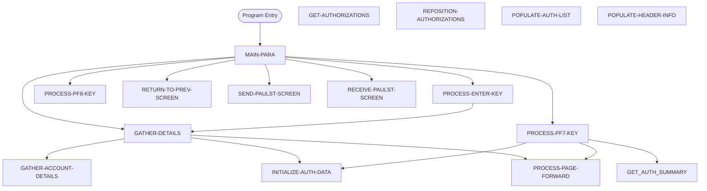

# Program: COPAUS0C


---

## Quick Reference

| Attribute | Value |
|-----------|-------|
| Program ID | `COPAUS0C` |
| Type | ONLINE |
| Lines | 1033 |
| Source | [COPAUS0C.cbl](../carddemo/COPAUS0C.cbl#L1) |
| Paragraphs | 20 |
| Statements | 25 |
| Impact Risk | **HIGH** — 38 programs affected |

> **View Source:** [Open COPAUS0C.cbl](../carddemo/COPAUS0C.cbl#L1)

## Source Grounding Facts

| Data Item | Literal Value |
|-----------|---------------|
| `WS-PGM-AUTH-SMRY` | `COPAUS0C` |
| `WS-PGM-AUTH-DTL` | `COPAUS1C` |
| `WS-PGM-MENU` | `COMEN01C` |
| `WS-CICS-TRANID` | `CPVS` |
| `WS-ACCTFILENAME` | `ACCTDAT` |
| `WS-CUSTFILENAME` | `CUSTDAT` |
| `WS-CARDFILENAME` | `CARDDAT` |
| `WS-CARDXREFNAME-ACCT-PATH` | `CXACAIX` |
| `WS-CCXREF-FILE` | `CCXREF` |
| `WS-AUTH-DATE` | `00/00/00` |
| `WS-AUTH-TIME` | `00:00:00` |
| `WS-ERR-FLG` | `N` |
| `WS-AUTHS-EOF` | `N` |
| `WS-SEND-ERASE-FLG` | `Y` |


## Business Purpose

*Business purpose is not present in the extracted data. Run LLM enrichment to populate this section.*


## Dependency Context

> This section shows how **COPAUS0C** connects to the rest of the system — who calls it,
> what it calls, and what data it shares. If linked programs exist, they must appear here.

### Programs That Call COPAUS0C (Callers)

*No programs call COPAUS0C — this is likely a top-level entry point or CICS transaction starter.*

### Programs Called by COPAUS0C (Callees)

*COPAUS0C does not call any other programs (leaf program).*

### Shared Data (Copybooks & Files)

#### Shared Copybooks

| Copybook | Also Used By | # Co-Users |
|----------|-------------|------------|
| `CIPAUDTY` | CBPAUP0C, COPAUA0C, COPAUS1C, COPAUS2C, DBUNLDGS (+2 more) | 7 |
| `CIPAUSMY` | CBPAUP0C, COPAUA0C, COPAUS1C, DBUNLDGS, PAUDBLOD (+1 more) | 6 |
| `COCOM01Y` | COACTUPC, COACTVWC, COADM01C, COBIL00C, COCRDLIC (+15 more) | 20 |
| `COPAU00` |  | 0 |
| `COTTL01Y` | COACTUPC, COACTVWC, COADM01C, COBIL00C, COCRDLIC (+15 more) | 20 |
| `CSDAT01Y` | COACTUPC, COACTVWC, COADM01C, COBIL00C, COCRDLIC (+15 more) | 20 |
| `CSMSG01Y` | COACTUPC, COACTVWC, COADM01C, COBIL00C, COCRDLIC (+15 more) | 20 |
| `CSMSG02Y` | COACTUPC, COACTVWC, COCRDSLC, COCRDUPC, COPAUS1C (+1 more) | 6 |
| `CVACT01Y` | CBACT01C, CBACT04C, CBEXPORT, CBIMPORT, CBSTM03A (+8 more) | 13 |
| `CVACT02Y` | CBACT02C, CBEXPORT, CBIMPORT, CBTRN01C, COACTVWC (+4 more) | 9 |
| `CVACT03Y` | CBACT03C, CBACT04C, CBEXPORT, CBIMPORT, CBSTM03A (+8 more) | 13 |
| `CVCUS01Y` | CBCUS01C, CBEXPORT, CBIMPORT, CBTRN01C, COACTUPC (+4 more) | 9 |
| `DFHAID` | COACTUPC, COACTVWC, COADM01C, COBIL00C, COCRDLIC (+15 more) | 20 |
| `DFHBMSCA` | COACTUPC, COACTVWC, COADM01C, COBIL00C, COCRDLIC (+15 more) | 20 |


## Legacy Data Contracts

> These tables are derived from FILE SECTION records and COPY-expanded data declarations. They preserve the legacy field names, COBOL storage type, inferred modern type, and status-code values needed for Java DTOs, SQL schemas, API contracts, and migration mapping.


### Copybook Segment Layouts

#### `CIPAUDTY` as `PENDING-AUTH-DETAILS`

| Legacy Field | Meaning | COBOL Type | Modern Type | Status / Format Notes |
|--------------|---------|------------|-------------|-----------------------|
| `PA-AUTHORIZATION-KEY` | Authorization Key | `GROUP` | `OBJECT` |  |
| `PA-AUTH-DATE-9C` | Authorization Date | `PIC S9(05) COMP-3` | `INTEGER` | Date-like field; verify YYDDD, YYMMDD, or ISO format before migration. |
| `PA-AUTH-TIME-9C` | Authorization Time | `PIC S9(09) COMP-3` | `INTEGER` |  |
| `PA-AUTH-ORIG-DATE` | Authorization Orig Date | `PIC X(06)` | `STRING(6)` |  |
| `PA-AUTH-ORIG-TIME` | Authorization Orig Time | `PIC X(06)` | `STRING(6)` |  |
| `PA-CARD-NUM` | Card Number | `PIC X(16)` | `STRING(16)` |  |
| `PA-AUTH-TYPE` | Authorization Type | `PIC X(04)` | `STRING(4)` |  |
| `PA-CARD-EXPIRY-DATE` | Card Expiry Date | `PIC X(04)` | `STRING(4)` |  |
| `PA-MESSAGE-TYPE` | Message Type | `PIC X(06)` | `STRING(6)` |  |
| `PA-MESSAGE-SOURCE` | Message Source | `PIC X(06)` | `STRING(6)` |  |
| `PA-AUTH-ID-CODE` | Authorization ID Code | `PIC X(06)` | `STRING(6)` |  |
| `PA-AUTH-RESP-CODE` | Authorization Response Code | `PIC X(02)` | `STRING(2)` |  |
| `PA-AUTH-RESP-REASON` | Authorization Response Reason | `PIC X(04)` | `STRING(4)` |  |
| `PA-PROCESSING-CODE` | Processing Code | `PIC 9(06)` | `INTEGER` |  |
| `PA-TRANSACTION-AMT` | Transaction Amount | `PIC S9(10)V99 COMP-3` | `DECIMAL(12,2)` |  |
| `PA-APPROVED-AMT` | Approved Amount | `PIC S9(10)V99 COMP-3` | `DECIMAL(12,2)` |  |
| `PA-MERCHANT-CATAGORY-CODE` | Merchant Catagory Code | `PIC X(04)` | `STRING(4)` |  |
| `PA-ACQR-COUNTRY-CODE` | Acqr Country Code | `PIC X(03)` | `STRING(3)` |  |
| `PA-POS-ENTRY-MODE` | Pos Entry Mode | `PIC 9(02)` | `INTEGER` |  |
| `PA-MERCHANT-ID` | Merchant ID | `PIC X(15)` | `STRING(15)` |  |
| `PA-MERCHANT-NAME` | Merchant Name | `PIC X(22)` | `STRING(22)` |  |
| `PA-MERCHANT-CITY` | Merchant City | `PIC X(13)` | `STRING(13)` |  |
| `PA-MERCHANT-STATE` | Merchant State | `PIC X(02)` | `STRING(2)` |  |
| `PA-MERCHANT-ZIP` | Merchant Zip | `PIC X(09)` | `STRING(9)` |  |
| `PA-TRANSACTION-ID` | Transaction ID | `PIC X(15)` | `STRING(15)` |  |
| `PA-MATCH-STATUS` | Match Status | `PIC X(01)` | `STRING(1)` |  |
| `PA-AUTH-FRAUD` | Authorization Fraud | `PIC X(01)` | `STRING(1)` |  |
| `PA-FRAUD-RPT-DATE` | Fraud Rpt Date | `PIC X(08)` | `STRING(8)` | Date-like field; verify YYDDD, YYMMDD, or ISO format before migration. |
| `FILLER` | Filler | `PIC X(17)` | `STRING(17)` |  |

#### `CIPAUSMY` as `PENDING-AUTH-SUMMARY`

| Legacy Field | Meaning | COBOL Type | Modern Type | Status / Format Notes |
|--------------|---------|------------|-------------|-----------------------|
| `PA-ACCT-ID` | Account ID | `PIC S9(11) COMP-3` | `BIGINT` |  |
| `PA-CUST-ID` | Customer ID | `PIC 9(09)` | `INTEGER` |  |
| `PA-AUTH-STATUS` | Authorization Status | `PIC X(01)` | `STRING(1)` |  |
| `PA-ACCOUNT-STATUS` | Account Status | `PIC X(02) OCCURS 5` | `STRING(2)` | Repeating field, 5 occurrences. |
| `PA-CREDIT-LIMIT` | Credit Limit | `PIC S9(09)V99 COMP-3` | `DECIMAL(11,2)` |  |
| `PA-CASH-LIMIT` | Cash Limit | `PIC S9(09)V99 COMP-3` | `DECIMAL(11,2)` |  |
| `PA-CREDIT-BALANCE` | Credit Balance | `PIC S9(09)V99 COMP-3` | `DECIMAL(11,2)` |  |
| `PA-CASH-BALANCE` | Cash Balance | `PIC S9(09)V99 COMP-3` | `DECIMAL(11,2)` |  |
| `PA-APPROVED-AUTH-CNT` | Approved Authorization Count | `PIC S9(04) COMP` | `INTEGER` |  |
| `PA-DECLINED-AUTH-CNT` | Declined Authorization Count | `PIC S9(04) COMP` | `INTEGER` |  |
| `PA-APPROVED-AUTH-AMT` | Approved Authorization Amount | `PIC S9(09)V99 COMP-3` | `DECIMAL(11,2)` |  |
| `PA-DECLINED-AUTH-AMT` | Declined Authorization Amount | `PIC S9(09)V99 COMP-3` | `DECIMAL(11,2)` |  |
| `FILLER` | Filler | `PIC X(34)` | `STRING(34)` |  |

#### `COCOM01Y` as `CARDDEMO-COMMAREA`

| Legacy Field | Meaning | COBOL Type | Modern Type | Status / Format Notes |
|--------------|---------|------------|-------------|-----------------------|
| `CARDDEMO-COMMAREA` | Carddemo Commarea | `GROUP` | `OBJECT` |  |
| `CDEMO-GENERAL-INFO` | General Info | `GROUP` | `OBJECT` |  |
| `CDEMO-FROM-TRANID` | From Tranid | `PIC X(04)` | `STRING(4)` |  |
| `CDEMO-FROM-PROGRAM` | From Program | `PIC X(08)` | `STRING(8)` |  |
| `CDEMO-TO-TRANID` | To Tranid | `PIC X(04)` | `STRING(4)` |  |
| `CDEMO-TO-PROGRAM` | To Program | `PIC X(08)` | `STRING(8)` |  |
| `CDEMO-USER-ID` | User ID | `PIC X(08)` | `STRING(8)` |  |
| `CDEMO-USER-TYPE` | User Type | `PIC X(01)` | `STRING(1)` |  |
| `CDEMO-PGM-CONTEXT` | Pgm Context | `PIC 9(01)` | `INTEGER` |  |
| `CDEMO-CUSTOMER-INFO` | Customer Info | `GROUP` | `OBJECT` |  |
| `CDEMO-CUST-ID` | Customer ID | `PIC 9(09)` | `INTEGER` |  |
| `CDEMO-CUST-FNAME` | Customer Fname | `PIC X(25)` | `STRING(25)` |  |
| `CDEMO-CUST-MNAME` | Customer Mname | `PIC X(25)` | `STRING(25)` |  |
| `CDEMO-CUST-LNAME` | Customer Lname | `PIC X(25)` | `STRING(25)` |  |
| `CDEMO-ACCOUNT-INFO` | Account Info | `GROUP` | `OBJECT` |  |
| `CDEMO-ACCT-ID` | Account ID | `PIC 9(11)` | `BIGINT` |  |
| `CDEMO-ACCT-STATUS` | Account Status | `PIC X(01)` | `STRING(1)` |  |
| `CDEMO-CARD-INFO` | Card Info | `GROUP` | `OBJECT` |  |
| `CDEMO-CARD-NUM` | Card Number | `PIC 9(16)` | `BIGINT` |  |
| `CDEMO-MORE-INFO` | More Info | `GROUP` | `OBJECT` |  |
| `CDEMO-LAST-MAP` | Last Map | `PIC X(7)` | `STRING(7)` |  |
| `CDEMO-LAST-MAPSET` | Last Mapset | `PIC X(7)` | `STRING(7)` |  |

#### `COPAU00` as `COPAU0AI`

| Legacy Field | Meaning | COBOL Type | Modern Type | Status / Format Notes |
|--------------|---------|------------|-------------|-----------------------|
| `COPAU0AI` | Copau0Ai | `GROUP` | `OBJECT` |  |
| `COPAU0AO` | Copau0Ao | `GROUP` | `OBJECT` |  |

#### `COTTL01Y` as `CCDA-SCREEN-TITLE`

| Legacy Field | Meaning | COBOL Type | Modern Type | Status / Format Notes |
|--------------|---------|------------|-------------|-----------------------|
| `CCDA-SCREEN-TITLE` | Ccda Screen Title | `GROUP` | `OBJECT` |  |
| `CCDA-TITLE01` | Ccda Title01 | `PIC X(40)` | `STRING(40)` |  |
| `CCDA-TITLE02` | Ccda Title02 | `PIC X(40)` | `STRING(40)` |  |
| `CCDA-THANK-YOU` | Ccda Thank You | `PIC X(40)` | `STRING(40)` |  |

#### `CSDAT01Y` as `WS-DATE-TIME`

| Legacy Field | Meaning | COBOL Type | Modern Type | Status / Format Notes |
|--------------|---------|------------|-------------|-----------------------|
| `WS-DATE-TIME` | Date Time | `GROUP` | `OBJECT` |  |
| `WS-CURDATE-DATA` | Curdate Data | `GROUP` | `OBJECT` |  |
| `WS-CURDATE` | Curdate | `GROUP` | `OBJECT` |  |
| `WS-CURDATE-YEAR` | Curdate Year | `PIC 9(04)` | `INTEGER` |  |
| `WS-CURDATE-MONTH` | Curdate Month | `PIC 9(02)` | `INTEGER` |  |
| `WS-CURDATE-DAY` | Curdate Day | `PIC 9(02)` | `INTEGER` |  |
| `WS-CURDATE-N` | Curdate N | `PIC 9(08)` | `INTEGER` |  |
| `WS-CURTIME` | Curtime | `GROUP` | `OBJECT` |  |
| `WS-CURTIME-HOURS` | Curtime Hours | `PIC 9(02)` | `INTEGER` |  |
| `WS-CURTIME-MINUTE` | Curtime Minute | `PIC 9(02)` | `INTEGER` |  |
| `WS-CURTIME-SECOND` | Curtime Second | `PIC 9(02)` | `INTEGER` |  |
| `WS-CURTIME-MILSEC` | Curtime Milsec | `PIC 9(02)` | `INTEGER` |  |
| `WS-CURTIME-N` | Curtime N | `PIC 9(08)` | `INTEGER` |  |
| `WS-CURDATE-MM-DD-YY` | Curdate Mm Dd Yy | `GROUP` | `OBJECT` |  |
| `WS-CURDATE-MM` | Curdate Mm | `PIC 9(02)` | `INTEGER` |  |
| `FILLER` | Filler | `PIC X(01)` | `STRING(1)` |  |
| `WS-CURDATE-DD` | Curdate Dd | `PIC 9(02)` | `INTEGER` |  |
| `FILLER` | Filler | `PIC X(01)` | `STRING(1)` |  |
| `WS-CURDATE-YY` | Curdate Yy | `PIC 9(02)` | `INTEGER` |  |
| `WS-CURTIME-HH-MM-SS` | Curtime Hh Mm Ss | `GROUP` | `OBJECT` |  |
| `WS-CURTIME-HH` | Curtime Hh | `PIC 9(02)` | `INTEGER` |  |
| `FILLER` | Filler | `PIC X(01)` | `STRING(1)` |  |
| `WS-CURTIME-MM` | Curtime Mm | `PIC 9(02)` | `INTEGER` |  |
| `FILLER` | Filler | `PIC X(01)` | `STRING(1)` |  |
| `WS-CURTIME-SS` | Curtime Ss | `PIC 9(02)` | `INTEGER` |  |
| `WS-TIMESTAMP` | Timestamp | `GROUP` | `OBJECT` |  |
| `WS-TIMESTAMP-DT-YYYY` | Timestamp Date Yyyy | `PIC 9(04)` | `INTEGER` |  |
| `FILLER` | Filler | `PIC X(01)` | `STRING(1)` |  |
| `WS-TIMESTAMP-DT-MM` | Timestamp Date Mm | `PIC 9(02)` | `INTEGER` |  |
| `FILLER` | Filler | `PIC X(01)` | `STRING(1)` |  |
| `WS-TIMESTAMP-DT-DD` | Timestamp Date Dd | `PIC 9(02)` | `INTEGER` |  |
| `FILLER` | Filler | `PIC X(01)` | `STRING(1)` |  |
| `WS-TIMESTAMP-TM-HH` | Timestamp Tm Hh | `PIC 9(02)` | `INTEGER` |  |
| `FILLER` | Filler | `PIC X(01)` | `STRING(1)` |  |
| `WS-TIMESTAMP-TM-MM` | Timestamp Tm Mm | `PIC 9(02)` | `INTEGER` |  |
| `FILLER` | Filler | `PIC X(01)` | `STRING(1)` |  |
| `WS-TIMESTAMP-TM-SS` | Timestamp Tm Ss | `PIC 9(02)` | `INTEGER` |  |
| `FILLER` | Filler | `PIC X(01)` | `STRING(1)` |  |
| `WS-TIMESTAMP-TM-MS6` | Timestamp Tm Ms6 | `PIC 9(06)` | `INTEGER` |  |

#### `CSMSG01Y` as `CCDA-COMMON-MESSAGES`

| Legacy Field | Meaning | COBOL Type | Modern Type | Status / Format Notes |
|--------------|---------|------------|-------------|-----------------------|
| `CCDA-COMMON-MESSAGES` | Ccda Common Messages | `GROUP` | `OBJECT` |  |
| `CCDA-MSG-THANK-YOU` | Ccda Msg Thank You | `PIC X(50)` | `STRING(50)` |  |
| `CCDA-MSG-INVALID-KEY` | Ccda Msg Invalid Key | `PIC X(50)` | `STRING(50)` |  |

#### `CSMSG02Y` as `ABEND-DATA`

| Legacy Field | Meaning | COBOL Type | Modern Type | Status / Format Notes |
|--------------|---------|------------|-------------|-----------------------|
| `ABEND-DATA` | Abend Data | `GROUP` | `OBJECT` |  |
| `ABEND-CODE` | Abend Code | `PIC X(4)` | `STRING(4)` |  |
| `ABEND-CULPRIT` | Abend Culprit | `PIC X(8)` | `STRING(8)` |  |
| `ABEND-REASON` | Abend Reason | `PIC X(50)` | `STRING(50)` |  |
| `ABEND-MSG` | Abend Msg | `PIC X(72)` | `STRING(72)` |  |

#### `CVACT01Y` as `ACCOUNT-RECORD`

| Legacy Field | Meaning | COBOL Type | Modern Type | Status / Format Notes |
|--------------|---------|------------|-------------|-----------------------|
| `ACCOUNT-RECORD` | Account Record | `GROUP` | `OBJECT` |  |
| `ACCT-ID` | Account ID | `PIC 9(11)` | `BIGINT` |  |
| `ACCT-ACTIVE-STATUS` | Account Active Status | `PIC X(01)` | `STRING(1)` |  |
| `ACCT-CURR-BAL` | Account Curr Bal | `PIC S9(10)V99` | `DECIMAL(12,2)` |  |
| `ACCT-CREDIT-LIMIT` | Account Credit Limit | `PIC S9(10)V99` | `DECIMAL(12,2)` |  |
| `ACCT-CASH-CREDIT-LIMIT` | Account Cash Credit Limit | `PIC S9(10)V99` | `DECIMAL(12,2)` |  |
| `ACCT-OPEN-DATE` | Account Open Date | `PIC X(10)` | `STRING(10)` | Date-like field; verify YYDDD, YYMMDD, or ISO format before migration. |
| `ACCT-EXPIRAION-DATE` | Account Expiraion Date | `PIC X(10)` | `STRING(10)` | Date-like field; verify YYDDD, YYMMDD, or ISO format before migration. |
| `ACCT-REISSUE-DATE` | Account Reissue Date | `PIC X(10)` | `STRING(10)` | Date-like field; verify YYDDD, YYMMDD, or ISO format before migration. |
| `ACCT-CURR-CYC-CREDIT` | Account Curr Cyc Credit | `PIC S9(10)V99` | `DECIMAL(12,2)` |  |
| `ACCT-CURR-CYC-DEBIT` | Account Curr Cyc Debit | `PIC S9(10)V99` | `DECIMAL(12,2)` |  |
| `ACCT-ADDR-ZIP` | Account Addr Zip | `PIC X(10)` | `STRING(10)` |  |
| `ACCT-GROUP-ID` | Account Group ID | `PIC X(10)` | `STRING(10)` |  |
| `FILLER` | Filler | `PIC X(178)` | `STRING(178)` |  |

#### `CVACT02Y` as `CARD-RECORD`

| Legacy Field | Meaning | COBOL Type | Modern Type | Status / Format Notes |
|--------------|---------|------------|-------------|-----------------------|
| `CARD-RECORD` | Card Record | `GROUP` | `OBJECT` |  |
| `CARD-NUM` | Card Number | `PIC X(16)` | `STRING(16)` |  |
| `CARD-ACCT-ID` | Card Account ID | `PIC 9(11)` | `BIGINT` |  |
| `CARD-CVV-CD` | Card Cvv Cd | `PIC 9(03)` | `INTEGER` |  |
| `CARD-EMBOSSED-NAME` | Card Embossed Name | `PIC X(50)` | `STRING(50)` |  |
| `CARD-EXPIRAION-DATE` | Card Expiraion Date | `PIC X(10)` | `STRING(10)` | Date-like field; verify YYDDD, YYMMDD, or ISO format before migration. |
| `CARD-ACTIVE-STATUS` | Card Active Status | `PIC X(01)` | `STRING(1)` |  |
| `FILLER` | Filler | `PIC X(59)` | `STRING(59)` |  |

#### `CVACT03Y` as `CARD-XREF-RECORD`

| Legacy Field | Meaning | COBOL Type | Modern Type | Status / Format Notes |
|--------------|---------|------------|-------------|-----------------------|
| `CARD-XREF-RECORD` | Card Xref Record | `GROUP` | `OBJECT` |  |
| `XREF-CARD-NUM` | Xref Card Number | `PIC X(16)` | `STRING(16)` |  |
| `XREF-CUST-ID` | Xref Customer ID | `PIC 9(09)` | `INTEGER` |  |
| `XREF-ACCT-ID` | Xref Account ID | `PIC 9(11)` | `BIGINT` |  |
| `FILLER` | Filler | `PIC X(14)` | `STRING(14)` |  |

#### `CVCUS01Y` as `CUSTOMER-RECORD`

| Legacy Field | Meaning | COBOL Type | Modern Type | Status / Format Notes |
|--------------|---------|------------|-------------|-----------------------|
| `CUSTOMER-RECORD` | Customer Record | `GROUP` | `OBJECT` |  |
| `CUST-ID` | Customer ID | `PIC 9(09)` | `INTEGER` |  |
| `CUST-FIRST-NAME` | Customer First Name | `PIC X(25)` | `STRING(25)` |  |
| `CUST-MIDDLE-NAME` | Customer Middle Name | `PIC X(25)` | `STRING(25)` |  |
| `CUST-LAST-NAME` | Customer Last Name | `PIC X(25)` | `STRING(25)` |  |
| `CUST-ADDR-LINE-1` | Customer Addr Line 1 | `PIC X(50)` | `STRING(50)` |  |
| `CUST-ADDR-LINE-2` | Customer Addr Line 2 | `PIC X(50)` | `STRING(50)` |  |
| `CUST-ADDR-LINE-3` | Customer Addr Line 3 | `PIC X(50)` | `STRING(50)` |  |
| `CUST-ADDR-STATE-CD` | Customer Addr State Cd | `PIC X(02)` | `STRING(2)` |  |
| `CUST-ADDR-COUNTRY-CD` | Customer Addr Country Cd | `PIC X(03)` | `STRING(3)` |  |
| `CUST-ADDR-ZIP` | Customer Addr Zip | `PIC X(10)` | `STRING(10)` |  |
| `CUST-PHONE-NUM-1` | Customer Phone Number 1 | `PIC X(15)` | `STRING(15)` |  |
| `CUST-PHONE-NUM-2` | Customer Phone Number 2 | `PIC X(15)` | `STRING(15)` |  |
| `CUST-SSN` | Customer Ssn | `PIC 9(09)` | `INTEGER` |  |
| `CUST-GOVT-ISSUED-ID` | Customer Govt Issued ID | `PIC X(20)` | `STRING(20)` |  |
| `CUST-DOB-YYYY-MM-DD` | Customer Dob Yyyy Mm Dd | `PIC X(10)` | `STRING(10)` |  |
| `CUST-EFT-ACCOUNT-ID` | Customer Eft Account ID | `PIC X(10)` | `STRING(10)` |  |
| `CUST-PRI-CARD-HOLDER-IND` | Customer Pri Card Holder Ind | `PIC X(01)` | `STRING(1)` |  |
| `CUST-FICO-CREDIT-SCORE` | Customer Fico Credit Score | `PIC 9(03)` | `INTEGER` |  |
| `FILLER` | Filler | `PIC X(168)` | `STRING(168)` |  |

#### `DFHAID` as `DFHAID`

| Legacy Field | Meaning | COBOL Type | Modern Type | Status / Format Notes |
|--------------|---------|------------|-------------|-----------------------|
| `DFHAID` | Dfhaid | `GROUP` | `OBJECT` |  |

#### `DFHBMSCA` as `DFHBMSCA`

| Legacy Field | Meaning | COBOL Type | Modern Type | Status / Format Notes |
|--------------|---------|------------|-------------|-----------------------|
| `DFHBMSCA` | Dfhbmsca | `GROUP` | `OBJECT` |  |


### Data Movement And Key Mapping

| Line | Source | Target | Meaning |
|------|--------|--------|---------|
| 186 | `SPACES` | `WS-MESSAGE ERRMSGO OF COPAU0AO` | SPACES populates WS-MESSAGE ERRMSGO OF COPAU0AO |
| 188 | `-1` | `ACCTIDL OF COPAU0AI` | -1 populates ACCTIDL OF COPAU0AI |
| 192 | `WS-PGM-AUTH-SMRY` | `CDEMO-TO-PROGRAM` | WS-PGM-AUTH-SMRY populates CDEMO-TO-PROGRAM |
| 196 | `-1` | `ACCTIDL OF COPAU0AI` | -1 populates ACCTIDL OF COPAU0AI |
| 208 | `CDEMO-ACCT-ID` | `WS-ACCT-ID` | CDEMO-ACCT-ID populates WS-ACCT-ID |
| 211 | `SPACE` | `ACCTIDO OF COPAU0AO` | SPACE populates ACCTIDO OF COPAU0AO |
| 212 | `LOW-VALUES` | `WS-ACCT-ID` | LOW-VALUES populates WS-ACCT-ID |
| 229 | `SPACE` | `ACCTIDO OF COPAU0AO` | SPACE populates ACCTIDO OF COPAU0AO |
| 231 | `WS-ACCT-ID` | `ACCTIDO OF COPAU0AO` | WS-ACCT-ID populates ACCTIDO OF COPAU0AO |
| 247 | `-1` | `ACCTIDL OF COPAU0AI` | -1 populates ACCTIDL OF COPAU0AI |
| 248 | `CCDA-MSG-INVALID-KEY` | `WS-MESSAGE` | CCDA-MSG-INVALID-KEY populates WS-MESSAGE |
| 265 | `LOW-VALUES` | `WS-ACCT-ID` | LOW-VALUES populates WS-ACCT-ID |
| 271 | `-1` | `ACCTIDL OF COPAU0AI` | -1 populates ACCTIDL OF COPAU0AI |
| 274 | `LOW-VALUES` | `WS-ACCT-ID` | LOW-VALUES populates WS-ACCT-ID |
| 280 | `-1` | `ACCTIDL OF COPAU0AI` | -1 populates ACCTIDL OF COPAU0AI |
| 283 | `ACCTIDI OF COPAU0AI` | `WS-ACCT-ID` | ACCTIDI OF COPAU0AI populates WS-ACCT-ID |
| 316 | `WS-PGM-AUTH-DTL` | `CDEMO-TO-PROGRAM` | WS-PGM-AUTH-DTL populates CDEMO-TO-PROGRAM |
| 318 | `WS-PGM-AUTH-SMRY` | `CDEMO-FROM-PROGRAM` | WS-PGM-AUTH-SMRY populates CDEMO-FROM-PROGRAM |
| 330 | `-1` | `ACCTIDL OF COPAU0AI` | -1 populates ACCTIDL OF COPAU0AI |
| 345 | `-1` | `ACCTIDL OF COPAU0AI` | -1 populates ACCTIDL OF COPAU0AI |
| 375 | `-1` | `ACCTIDL OF COPAU0AI` | -1 populates ACCTIDL OF COPAU0AI |
| 392 | `LOW-VALUES` | `WS-AUTH-KEY-SAVE` | LOW-VALUES populates WS-AUTH-KEY-SAVE |
| 394 | `CDEMO-CPVS-PAUKEY-LAST` | `WS-AUTH-KEY-SAVE` | CDEMO-CPVS-PAUKEY-LAST populates WS-AUTH-KEY-SAVE |
| 400 | `-1` | `ACCTIDL OF COPAU0AI` | -1 populates ACCTIDL OF COPAU0AI |
| 422 | `LOW-VALUES` | `CDEMO-CPVS-PAUKEY-LAST` | LOW-VALUES populates CDEMO-CPVS-PAUKEY-LAST |
| 482 | `-1` | `ACCTIDL OF COPAU0AI` | -1 populates ACCTIDL OF COPAU0AI |
| 491 | `WS-AUTH-KEY-SAVE` | `PA-AUTHORIZATION-KEY` | WS-AUTH-KEY-SAVE populates PA-AUTHORIZATION-KEY |
| 515 | `-1` | `ACCTIDL OF COPAU0AI` | -1 populates ACCTIDL OF COPAU0AI |
| 525 | `PA-APPROVED-AMT` | `WS-AUTH-AMT` | PA-APPROVED-AMT populates WS-AUTH-AMT |
| 527 | `PA-AUTH-ORIG-TIME(1:2)` | `WS-AUTH-TIME(1:2)` | PA-AUTH-ORIG-TIME(1:2) populates WS-AUTH-TIME(1:2) |


---

## Dependency Graph

```mermaid
flowchart TD
    COPAUS0C["⬤ COPAUS0C"]:::target
    CB_CIPAUDTY{{"CIPAUDTY"}}:::copybook
    COPAUS0C -.- CB_CIPAUDTY
    CBPAUP0C["CBPAUP0C"]:::coupled
    CB_CIPAUDTY -.- CBPAUP0C
    COPAUA0C["COPAUA0C"]:::coupled
    CB_CIPAUDTY -.- COPAUA0C
    COPAUS1C["COPAUS1C"]:::coupled
    CB_CIPAUDTY -.- COPAUS1C
    CB_CIPAUSMY{{"CIPAUSMY"}}:::copybook
    COPAUS0C -.- CB_CIPAUSMY
    CBPAUP0C["CBPAUP0C"]:::coupled
    CB_CIPAUSMY -.- CBPAUP0C
    COPAUA0C["COPAUA0C"]:::coupled
    CB_CIPAUSMY -.- COPAUA0C
    COPAUS1C["COPAUS1C"]:::coupled
    CB_CIPAUSMY -.- COPAUS1C
    CB_COCOM01Y{{"COCOM01Y"}}:::copybook
    COPAUS0C -.- CB_COCOM01Y
    COACTUPC["COACTUPC"]:::coupled
    CB_COCOM01Y -.- COACTUPC
    COACTVWC["COACTVWC"]:::coupled
    CB_COCOM01Y -.- COACTVWC
    COADM01C["COADM01C"]:::coupled
    CB_COCOM01Y -.- COADM01C
    CB_COTTL01Y{{"COTTL01Y"}}:::copybook
    COPAUS0C -.- CB_COTTL01Y
    COACTUPC["COACTUPC"]:::coupled
    CB_COTTL01Y -.- COACTUPC
    COACTVWC["COACTVWC"]:::coupled
    CB_COTTL01Y -.- COACTVWC
    COADM01C["COADM01C"]:::coupled
    CB_COTTL01Y -.- COADM01C
    CB_CSDAT01Y{{"CSDAT01Y"}}:::copybook
    COPAUS0C -.- CB_CSDAT01Y
    COACTUPC["COACTUPC"]:::coupled
    CB_CSDAT01Y -.- COACTUPC
    COACTVWC["COACTVWC"]:::coupled
    CB_CSDAT01Y -.- COACTVWC
    COADM01C["COADM01C"]:::coupled
    CB_CSDAT01Y -.- COADM01C
    CB_CSMSG01Y{{"CSMSG01Y"}}:::copybook
    COPAUS0C -.- CB_CSMSG01Y
    COACTUPC["COACTUPC"]:::coupled
    CB_CSMSG01Y -.- COACTUPC
    COACTVWC["COACTVWC"]:::coupled
    CB_CSMSG01Y -.- COACTVWC
    COADM01C["COADM01C"]:::coupled
    CB_CSMSG01Y -.- COADM01C
    CB_CSMSG02Y{{"CSMSG02Y"}}:::copybook
    COPAUS0C -.- CB_CSMSG02Y
    COACTUPC["COACTUPC"]:::coupled
    CB_CSMSG02Y -.- COACTUPC
    COACTVWC["COACTVWC"]:::coupled
    CB_CSMSG02Y -.- COACTVWC
    COCRDSLC["COCRDSLC"]:::coupled
    CB_CSMSG02Y -.- COCRDSLC
    classDef target fill:#f85149,stroke:#da3633,color:#fff,stroke-width:3px
    classDef caller fill:#58a6ff,stroke:#1f6feb,color:#fff
    classDef callee fill:#3fb950,stroke:#238636,color:#fff
    classDef copybook fill:#d29922,stroke:#9e6a03,color:#fff
    classDef coupled fill:#d29922,stroke:#9e6a03,color:#fff,stroke-dasharray:5
    classDef transitive fill:#484f58,stroke:#8b949e,color:#c9d1d9,stroke-dasharray:5
```



> **Legend:** 🔴 Target program · 🔵 Direct callers · 🟢 Direct callees · 🟡 Copybook-coupled · ⚫ Transitive (indirect)

---

## Impact Ripple View

> **If you change COPAUS0C, what else could break?**

| Impact Metric | Count |
|--------------|-------|
| Direct Callers | 0 |
| Transitive Callers (callers of callers) | 0 |
| Direct Callees | 0 |
| Transitive Callees | 0 |
| Copybook-Coupled Programs | 38 |
| **Total Impact** | **38** |
| **Risk Rating** | **HIGH** |


**Programs affected via shared copybooks:**
- `CBACT01C`
- `CBACT02C`
- `CBACT03C`
- `CBACT04C`
- `CBCUS01C`
- `CBEXPORT`
- `CBIMPORT`
- `CBPAUP0C`
- `CBSTM03A`
- `CBTRN01C`
- `CBTRN02C`
- `CBTRN03C`
- `COACCT01`
- `COACTUPC`
- `COACTVWC`
- `COADM01C`
- `COBIL00C`
- `COCRDLIC`
- `COCRDSLC`
- `COCRDUPC`
- `COMEN01C`
- `COPAUA0C`
- `COPAUS1C`
- `COPAUS2C`
- `CORPT00C`
- `COSGN00C`
- `COTRN00C`
- `COTRN01C`
- `COTRN02C`
- `COTRTLIC`
- `COTRTUPC`
- `COUSR00C`
- `COUSR01C`
- `COUSR02C`
- `COUSR03C`
- `DBUNLDGS`
- `PAUDBLOD`
- `PAUDBUNL`

---

## Statement Profile

| Statement Type | Count |
|---------------|-------|
| IF | 25 |

## Control Flow



## Paragraphs

### MAIN-PARA

| | |
|---|---|
| **Paragraph** | `MAIN-PARA` |
| **Lines** | 178 - 260 |
| **View Code** | [Jump to Line 178](../carddemo/COPAUS0C.cbl#L178) |


### PROCESS-ENTER-KEY

| | |
|---|---|
| **Paragraph** | `PROCESS-ENTER-KEY` |
| **Lines** | 261 - 341 |
| **View Code** | [Jump to Line 261](../carddemo/COPAUS0C.cbl#L261) |


### GATHER-DETAILS

| | |
|---|---|
| **Paragraph** | `GATHER-DETAILS` |
| **Lines** | 342 - 361 |
| **View Code** | [Jump to Line 342](../carddemo/COPAUS0C.cbl#L342) |


### PROCESS-PF7-KEY

| | |
|---|---|
| **Paragraph** | `PROCESS-PF7-KEY` |
| **Lines** | 362 - 387 |
| **View Code** | [Jump to Line 362](../carddemo/COPAUS0C.cbl#L362) |


### PROCESS-PF8-KEY

| | |
|---|---|
| **Paragraph** | `PROCESS-PF8-KEY` |
| **Lines** | 388 - 414 |
| **View Code** | [Jump to Line 388](../carddemo/COPAUS0C.cbl#L388) |


### PROCESS-PAGE-FORWARD

| | |
|---|---|
| **Paragraph** | `PROCESS-PAGE-FORWARD` |
| **Lines** | 415 - 457 |
| **View Code** | [Jump to Line 415](../carddemo/COPAUS0C.cbl#L415) |


### GET-AUTHORIZATIONS

| | |
|---|---|
| **Paragraph** | `GET-AUTHORIZATIONS` |
| **Lines** | 458 - 487 |
| **View Code** | [Jump to Line 458](../carddemo/COPAUS0C.cbl#L458) |


### REPOSITION-AUTHORIZATIONS

| | |
|---|---|
| **Paragraph** | `REPOSITION-AUTHORIZATIONS` |
| **Lines** | 488 - 521 |
| **View Code** | [Jump to Line 488](../carddemo/COPAUS0C.cbl#L488) |


### POPULATE-AUTH-LIST

| | |
|---|---|
| **Paragraph** | `POPULATE-AUTH-LIST` |
| **Lines** | 522 - 607 |
| **View Code** | [Jump to Line 522](../carddemo/COPAUS0C.cbl#L522) |


### INITIALIZE-AUTH-DATA

| | |
|---|---|
| **Paragraph** | `INITIALIZE-AUTH-DATA` |
| **Lines** | 608 - 664 |
| **View Code** | [Jump to Line 608](../carddemo/COPAUS0C.cbl#L608) |


### RETURN-TO-PREV-SCREEN

| | |
|---|---|
| **Paragraph** | `RETURN-TO-PREV-SCREEN` |
| **Lines** | 665 - 680 |
| **View Code** | [Jump to Line 665](../carddemo/COPAUS0C.cbl#L665) |


### SEND-PAULST-SCREEN

| | |
|---|---|
| **Paragraph** | `SEND-PAULST-SCREEN` |
| **Lines** | 681 - 711 |
| **View Code** | [Jump to Line 681](../carddemo/COPAUS0C.cbl#L681) |


### RECEIVE-PAULST-SCREEN

| | |
|---|---|
| **Paragraph** | `RECEIVE-PAULST-SCREEN` |
| **Lines** | 712 - 725 |
| **View Code** | [Jump to Line 712](../carddemo/COPAUS0C.cbl#L712) |


### POPULATE-HEADER-INFO

| | |
|---|---|
| **Paragraph** | `POPULATE-HEADER-INFO` |
| **Lines** | 726 - 749 |
| **View Code** | [Jump to Line 726](../carddemo/COPAUS0C.cbl#L726) |


### GATHER-ACCOUNT-DETAILS

| | |
|---|---|
| **Paragraph** | `GATHER-ACCOUNT-DETAILS` |
| **Lines** | 750 - 811 |
| **View Code** | [Jump to Line 750](../carddemo/COPAUS0C.cbl#L750) |


### GETCARDXREF-BYACCT

| | |
|---|---|
| **Paragraph** | `GETCARDXREF-BYACCT` |
| **Lines** | 812 - 864 |
| **View Code** | [Jump to Line 812](../carddemo/COPAUS0C.cbl#L812) |


### GETACCTDATA-BYACCT

| | |
|---|---|
| **Paragraph** | `GETACCTDATA-BYACCT` |
| **Lines** | 865 - 914 |
| **View Code** | [Jump to Line 865](../carddemo/COPAUS0C.cbl#L865) |


### GETCUSTDATA-BYCUST

| | |
|---|---|
| **Paragraph** | `GETCUSTDATA-BYCUST` |
| **Lines** | 915 - 965 |
| **View Code** | [Jump to Line 915](../carddemo/COPAUS0C.cbl#L915) |


### GET-AUTH-SUMMARY

| | |
|---|---|
| **Paragraph** | `GET-AUTH-SUMMARY` |
| **Lines** | 966 - 1000 |
| **View Code** | [Jump to Line 966](../carddemo/COPAUS0C.cbl#L966) |


### SCHEDULE-PSB

| | |
|---|---|
| **Paragraph** | `SCHEDULE-PSB` |
| **Lines** | 1001 - 1032 |
| **View Code** | [Jump to Line 1001](../carddemo/COPAUS0C.cbl#L1001) |


## Copybook Field Dictionaries

The following copybooks are included by this program. Each entry shows the actual fields
extracted from the copybook source file (`.cpy`).

### Copybook `CIPAUDTY`

| Level | Field | PIC | USAGE | Parent | Notes |
|-------|-------|-----|-------|--------|-------|
| `05` | `PA-AUTHORIZATION-KEY` | `None` | None | None |  |
| `10` | `PA-AUTH-DATE-9C` | `S9(05)` | COMP | PA-AUTHORIZATION-KEY |  |
| `10` | `PA-AUTH-TIME-9C` | `S9(09)` | COMP | PA-AUTHORIZATION-KEY |  |
| `05` | `PA-AUTH-ORIG-DATE` | `X(06)` | None | None |  |
| `05` | `PA-AUTH-ORIG-TIME` | `X(06)` | None | None |  |
| `05` | `PA-CARD-NUM` | `X(16)` | None | None |  |
| `05` | `PA-AUTH-TYPE` | `X(04)` | None | None |  |
| `05` | `PA-CARD-EXPIRY-DATE` | `X(04)` | None | None |  |
| `05` | `PA-MESSAGE-TYPE` | `X(06)` | None | None |  |
| `05` | `PA-MESSAGE-SOURCE` | `X(06)` | None | None |  |
| `05` | `PA-AUTH-ID-CODE` | `X(06)` | None | None |  |
| `05` | `PA-AUTH-RESP-CODE` | `X(02)` | None | None |  |
| `88` | `PA-AUTH-APPROVED` | `None` | None | None |  |
| `05` | `PA-AUTH-RESP-REASON` | `X(04)` | None | None |  |
| `05` | `PA-PROCESSING-CODE` | `9(06)` | None | None |  |
| `05` | `PA-TRANSACTION-AMT` | `S9(10)V99` | COMP | None |  |
| `05` | `PA-APPROVED-AMT` | `S9(10)V99` | COMP | None |  |
| `05` | `PA-MERCHANT-CATAGORY-CODE` | `X(04)` | None | None |  |
| `05` | `PA-ACQR-COUNTRY-CODE` | `X(03)` | None | None |  |
| `05` | `PA-POS-ENTRY-MODE` | `9(02)` | None | None |  |
| `05` | `PA-MERCHANT-ID` | `X(15)` | None | None |  |
| `05` | `PA-MERCHANT-NAME` | `X(22)` | None | None |  |
| `05` | `PA-MERCHANT-CITY` | `X(13)` | None | None |  |
| `05` | `PA-MERCHANT-STATE` | `X(02)` | None | None |  |
| `05` | `PA-MERCHANT-ZIP` | `X(09)` | None | None |  |
| `05` | `PA-TRANSACTION-ID` | `X(15)` | None | None |  |
| `05` | `PA-MATCH-STATUS` | `X(01)` | None | None |  |
| `88` | `PA-MATCH-PENDING` | `None` | None | None |  |
| `88` | `PA-MATCH-AUTH-DECLINED` | `None` | None | None |  |
| `88` | `PA-MATCH-PENDING-EXPIRED` | `None` | None | None |  |
| `88` | `PA-MATCHED-WITH-TRAN` | `None` | None | None |  |
| `05` | `PA-AUTH-FRAUD` | `X(01)` | None | None |  |
| `88` | `PA-FRAUD-CONFIRMED` | `None` | None | None |  |
| `88` | `PA-FRAUD-REMOVED` | `None` | None | None |  |
| `05` | `PA-FRAUD-RPT-DATE` | `X(08)` | None | None |  |

### Copybook `CIPAUSMY`

| Level | Field | PIC | USAGE | Parent | Notes |
|-------|-------|-----|-------|--------|-------|
| `05` | `PA-ACCT-ID` | `S9(11)` | COMP | None |  |
| `05` | `PA-CUST-ID` | `9(09)` | None | None |  |
| `05` | `PA-AUTH-STATUS` | `X(01)` | None | None |  |
| `05` | `PA-ACCOUNT-STATUS` | `X(02)` | None | None | OCCURS 5 |
| `05` | `PA-CREDIT-LIMIT` | `S9(09)V99` | COMP | None |  |
| `05` | `PA-CASH-LIMIT` | `S9(09)V99` | COMP | None |  |
| `05` | `PA-CREDIT-BALANCE` | `S9(09)V99` | COMP | None |  |
| `05` | `PA-CASH-BALANCE` | `S9(09)V99` | COMP | None |  |
| `05` | `PA-APPROVED-AUTH-CNT` | `S9(04)` | COMP | None |  |
| `05` | `PA-DECLINED-AUTH-CNT` | `S9(04)` | COMP | None |  |
| `05` | `PA-APPROVED-AUTH-AMT` | `S9(09)V99` | COMP | None |  |
| `05` | `PA-DECLINED-AUTH-AMT` | `S9(09)V99` | COMP | None |  |

### Copybook `COCOM01Y`

| Level | Field | PIC | USAGE | Parent | Notes |
|-------|-------|-----|-------|--------|-------|
| `01` | `CARDDEMO-COMMAREA` | `None` | None | None |  |
| `05` | `CDEMO-GENERAL-INFO` | `None` | None | CARDDEMO-COMMAREA |  |
| `10` | `CDEMO-FROM-TRANID` | `X(04)` | None | CDEMO-GENERAL-INFO |  |
| `10` | `CDEMO-FROM-PROGRAM` | `X(08)` | None | CDEMO-GENERAL-INFO |  |
| `10` | `CDEMO-TO-TRANID` | `X(04)` | None | CDEMO-GENERAL-INFO |  |
| `10` | `CDEMO-TO-PROGRAM` | `X(08)` | None | CDEMO-GENERAL-INFO |  |
| `10` | `CDEMO-USER-ID` | `X(08)` | None | CDEMO-GENERAL-INFO |  |
| `10` | `CDEMO-USER-TYPE` | `X(01)` | None | CDEMO-GENERAL-INFO |  |
| `88` | `CDEMO-USRTYP-ADMIN` | `None` | None | CDEMO-GENERAL-INFO |  |
| `88` | `CDEMO-USRTYP-USER` | `None` | None | CDEMO-GENERAL-INFO |  |
| `10` | `CDEMO-PGM-CONTEXT` | `9(01)` | None | CDEMO-GENERAL-INFO |  |
| `88` | `CDEMO-PGM-ENTER` | `None` | None | CDEMO-GENERAL-INFO |  |
| `88` | `CDEMO-PGM-REENTER` | `None` | None | CDEMO-GENERAL-INFO |  |
| `05` | `CDEMO-CUSTOMER-INFO` | `None` | None | CARDDEMO-COMMAREA |  |
| `10` | `CDEMO-CUST-ID` | `9(09)` | None | CDEMO-CUSTOMER-INFO |  |
| `10` | `CDEMO-CUST-FNAME` | `X(25)` | None | CDEMO-CUSTOMER-INFO |  |
| `10` | `CDEMO-CUST-MNAME` | `X(25)` | None | CDEMO-CUSTOMER-INFO |  |
| `10` | `CDEMO-CUST-LNAME` | `X(25)` | None | CDEMO-CUSTOMER-INFO |  |
| `05` | `CDEMO-ACCOUNT-INFO` | `None` | None | CARDDEMO-COMMAREA |  |
| `10` | `CDEMO-ACCT-ID` | `9(11)` | None | CDEMO-ACCOUNT-INFO |  |
| `10` | `CDEMO-ACCT-STATUS` | `X(01)` | None | CDEMO-ACCOUNT-INFO |  |
| `05` | `CDEMO-CARD-INFO` | `None` | None | CARDDEMO-COMMAREA |  |
| `10` | `CDEMO-CARD-NUM` | `9(16)` | None | CDEMO-CARD-INFO |  |
| `05` | `CDEMO-MORE-INFO` | `None` | None | CARDDEMO-COMMAREA |  |
| `10` | `CDEMO-LAST-MAP` | `X(7)` | None | CDEMO-MORE-INFO |  |
| `10` | `CDEMO-LAST-MAPSET` | `X(7)` | None | CDEMO-MORE-INFO |  |

### Copybook `COPAU00`

| Level | Field | PIC | USAGE | Parent | Notes |
|-------|-------|-----|-------|--------|-------|
| `01` | `COPAU0AI` | `None` | None | None |  |
| `02` | `TRNNAMEL` | `S9(4)` | COMP | COPAU0AI |  |
| `02` | `TRNNAMEF` | `X` | None | COPAU0AI |  |
| `03` | `TRNNAMEA` | `X` | None | COPAU0AI |  |
| `02` | `TRNNAMEI` | `X(4)` | None | COPAU0AI |  |
| `02` | `TITLE01L` | `S9(4)` | COMP | COPAU0AI |  |
| `02` | `TITLE01F` | `X` | None | COPAU0AI |  |
| `03` | `TITLE01A` | `X` | None | COPAU0AI |  |
| `02` | `TITLE01I` | `X(40)` | None | COPAU0AI |  |
| `02` | `CURDATEL` | `S9(4)` | COMP | COPAU0AI |  |
| `02` | `CURDATEF` | `X` | None | COPAU0AI |  |
| `03` | `CURDATEA` | `X` | None | COPAU0AI |  |
| `02` | `CURDATEI` | `X(8)` | None | COPAU0AI |  |
| `02` | `PGMNAMEL` | `S9(4)` | COMP | COPAU0AI |  |
| `02` | `PGMNAMEF` | `X` | None | COPAU0AI |  |
| `03` | `PGMNAMEA` | `X` | None | COPAU0AI |  |
| `02` | `PGMNAMEI` | `X(8)` | None | COPAU0AI |  |
| `02` | `TITLE02L` | `S9(4)` | COMP | COPAU0AI |  |
| `02` | `TITLE02F` | `X` | None | COPAU0AI |  |
| `03` | `TITLE02A` | `X` | None | COPAU0AI |  |
| `02` | `TITLE02I` | `X(40)` | None | COPAU0AI |  |
| `02` | `CURTIMEL` | `S9(4)` | COMP | COPAU0AI |  |
| `02` | `CURTIMEF` | `X` | None | COPAU0AI |  |
| `03` | `CURTIMEA` | `X` | None | COPAU0AI |  |
| `02` | `CURTIMEI` | `X(8)` | None | COPAU0AI |  |
| `02` | `ACCTIDL` | `S9(4)` | COMP | COPAU0AI |  |
| `02` | `ACCTIDF` | `X` | None | COPAU0AI |  |
| `03` | `ACCTIDA` | `X` | None | COPAU0AI |  |
| `02` | `ACCTIDI` | `X(11)` | None | COPAU0AI |  |
| `02` | `CNAMEL` | `S9(4)` | COMP | COPAU0AI |  |
| `02` | `CNAMEF` | `X` | None | COPAU0AI |  |
| `03` | `CNAMEA` | `X` | None | COPAU0AI |  |
| `02` | `CNAMEI` | `X(25)` | None | COPAU0AI |  |
| `02` | `CUSTIDL` | `S9(4)` | COMP | COPAU0AI |  |
| `02` | `CUSTIDF` | `X` | None | COPAU0AI |  |
| `03` | `CUSTIDA` | `X` | None | COPAU0AI |  |
| `02` | `CUSTIDI` | `X(9)` | None | COPAU0AI |  |
| `02` | `ADDR001L` | `S9(4)` | COMP | COPAU0AI |  |
| `02` | `ADDR001F` | `X` | None | COPAU0AI |  |
| `03` | `ADDR001A` | `X` | None | COPAU0AI |  |
| `02` | `ADDR001I` | `X(25)` | None | COPAU0AI |  |
| `02` | `ACCSTATL` | `S9(4)` | COMP | COPAU0AI |  |
| `02` | `ACCSTATF` | `X` | None | COPAU0AI |  |
| `03` | `ACCSTATA` | `X` | None | COPAU0AI |  |
| `02` | `ACCSTATI` | `X(1)` | None | COPAU0AI |  |
| `02` | `ADDR002L` | `S9(4)` | COMP | COPAU0AI |  |
| `02` | `ADDR002F` | `X` | None | COPAU0AI |  |
| `03` | `ADDR002A` | `X` | None | COPAU0AI |  |
| `02` | `ADDR002I` | `X(25)` | None | COPAU0AI |  |
| `02` | `PHONE1L` | `S9(4)` | COMP | COPAU0AI |  |
*+ 510 more fields*
### Copybook `COTTL01Y`

| Level | Field | PIC | USAGE | Parent | Notes |
|-------|-------|-----|-------|--------|-------|
| `01` | `CCDA-SCREEN-TITLE` | `None` | None | None |  |
| `05` | `CCDA-TITLE01` | `X(40)` | None | CCDA-SCREEN-TITLE |  |
| `05` | `CCDA-TITLE02` | `X(40)` | None | CCDA-SCREEN-TITLE |  |
| `05` | `CCDA-THANK-YOU` | `X(40)` | None | CCDA-SCREEN-TITLE |  |

### Copybook `CSDAT01Y`

| Level | Field | PIC | USAGE | Parent | Notes |
|-------|-------|-----|-------|--------|-------|
| `01` | `WS-DATE-TIME` | `None` | None | None |  |
| `05` | `WS-CURDATE-DATA` | `None` | None | WS-DATE-TIME |  |
| `10` | `WS-CURDATE` | `None` | None | WS-CURDATE-DATA |  |
| `15` | `WS-CURDATE-YEAR` | `9(04)` | None | WS-CURDATE |  |
| `15` | `WS-CURDATE-MONTH` | `9(02)` | None | WS-CURDATE |  |
| `15` | `WS-CURDATE-DAY` | `9(02)` | None | WS-CURDATE |  |
| `10` | `WS-CURDATE-N` | `9(08)` | None | WS-CURDATE-DATA |  REDEFINES WS-CURDATE |
| `10` | `WS-CURTIME` | `None` | None | WS-CURDATE-DATA |  |
| `15` | `WS-CURTIME-HOURS` | `9(02)` | None | WS-CURTIME |  |
| `15` | `WS-CURTIME-MINUTE` | `9(02)` | None | WS-CURTIME |  |
| `15` | `WS-CURTIME-SECOND` | `9(02)` | None | WS-CURTIME |  |
| `15` | `WS-CURTIME-MILSEC` | `9(02)` | None | WS-CURTIME |  |
| `10` | `WS-CURTIME-N` | `9(08)` | None | WS-CURDATE-DATA |  REDEFINES WS-CURTIME |
| `05` | `WS-CURDATE-MM-DD-YY` | `None` | None | WS-DATE-TIME |  |
| `10` | `WS-CURDATE-MM` | `9(02)` | None | WS-CURDATE-MM-DD-YY |  |
| `10` | `WS-CURDATE-DD` | `9(02)` | None | WS-CURDATE-MM-DD-YY |  |
| `10` | `WS-CURDATE-YY` | `9(02)` | None | WS-CURDATE-MM-DD-YY |  |
| `05` | `WS-CURTIME-HH-MM-SS` | `None` | None | WS-DATE-TIME |  |
| `10` | `WS-CURTIME-HH` | `9(02)` | None | WS-CURTIME-HH-MM-SS |  |
| `10` | `WS-CURTIME-MM` | `9(02)` | None | WS-CURTIME-HH-MM-SS |  |
| `10` | `WS-CURTIME-SS` | `9(02)` | None | WS-CURTIME-HH-MM-SS |  |
| `05` | `WS-TIMESTAMP` | `None` | None | WS-DATE-TIME |  |
| `10` | `WS-TIMESTAMP-DT-YYYY` | `9(04)` | None | WS-TIMESTAMP |  |
| `10` | `WS-TIMESTAMP-DT-MM` | `9(02)` | None | WS-TIMESTAMP |  |
| `10` | `WS-TIMESTAMP-DT-DD` | `9(02)` | None | WS-TIMESTAMP |  |
| `10` | `WS-TIMESTAMP-TM-HH` | `9(02)` | None | WS-TIMESTAMP |  |
| `10` | `WS-TIMESTAMP-TM-MM` | `9(02)` | None | WS-TIMESTAMP |  |
| `10` | `WS-TIMESTAMP-TM-SS` | `9(02)` | None | WS-TIMESTAMP |  |
| `10` | `WS-TIMESTAMP-TM-MS6` | `9(06)` | None | WS-TIMESTAMP |  |

### Copybook `CSMSG01Y`

| Level | Field | PIC | USAGE | Parent | Notes |
|-------|-------|-----|-------|--------|-------|
| `01` | `CCDA-COMMON-MESSAGES` | `None` | None | None |  |
| `05` | `CCDA-MSG-THANK-YOU` | `X(50)` | None | CCDA-COMMON-MESSAGES |  |
| `05` | `CCDA-MSG-INVALID-KEY` | `X(50)` | None | CCDA-COMMON-MESSAGES |  |

### Copybook `CSMSG02Y`

| Level | Field | PIC | USAGE | Parent | Notes |
|-------|-------|-----|-------|--------|-------|
| `01` | `ABEND-DATA` | `None` | None | None |  |
| `05` | `ABEND-CODE` | `X(4)` | None | ABEND-DATA |  |
| `05` | `ABEND-CULPRIT` | `X(8)` | None | ABEND-DATA |  |
| `05` | `ABEND-REASON` | `X(50)` | None | ABEND-DATA |  |
| `05` | `ABEND-MSG` | `X(72)` | None | ABEND-DATA |  |

### Copybook `CVACT01Y`

| Level | Field | PIC | USAGE | Parent | Notes |
|-------|-------|-----|-------|--------|-------|
| `01` | `ACCOUNT-RECORD` | `None` | None | None |  |
| `05` | `ACCT-ID` | `9(11)` | None | ACCOUNT-RECORD |  |
| `05` | `ACCT-ACTIVE-STATUS` | `X(01)` | None | ACCOUNT-RECORD |  |
| `05` | `ACCT-CURR-BAL` | `S9(10)V99` | None | ACCOUNT-RECORD |  |
| `05` | `ACCT-CREDIT-LIMIT` | `S9(10)V99` | None | ACCOUNT-RECORD |  |
| `05` | `ACCT-CASH-CREDIT-LIMIT` | `S9(10)V99` | None | ACCOUNT-RECORD |  |
| `05` | `ACCT-OPEN-DATE` | `X(10)` | None | ACCOUNT-RECORD |  |
| `05` | `ACCT-EXPIRAION-DATE` | `X(10)` | None | ACCOUNT-RECORD |  |
| `05` | `ACCT-REISSUE-DATE` | `X(10)` | None | ACCOUNT-RECORD |  |
| `05` | `ACCT-CURR-CYC-CREDIT` | `S9(10)V99` | None | ACCOUNT-RECORD |  |
| `05` | `ACCT-CURR-CYC-DEBIT` | `S9(10)V99` | None | ACCOUNT-RECORD |  |
| `05` | `ACCT-ADDR-ZIP` | `X(10)` | None | ACCOUNT-RECORD |  |
| `05` | `ACCT-GROUP-ID` | `X(10)` | None | ACCOUNT-RECORD |  |

### Copybook `CVACT02Y`

| Level | Field | PIC | USAGE | Parent | Notes |
|-------|-------|-----|-------|--------|-------|
| `01` | `CARD-RECORD` | `None` | None | None |  |
| `05` | `CARD-NUM` | `X(16)` | None | CARD-RECORD |  |
| `05` | `CARD-ACCT-ID` | `9(11)` | None | CARD-RECORD |  |
| `05` | `CARD-CVV-CD` | `9(03)` | None | CARD-RECORD |  |
| `05` | `CARD-EMBOSSED-NAME` | `X(50)` | None | CARD-RECORD |  |
| `05` | `CARD-EXPIRAION-DATE` | `X(10)` | None | CARD-RECORD |  |
| `05` | `CARD-ACTIVE-STATUS` | `X(01)` | None | CARD-RECORD |  |

### Copybook `CVACT03Y`

| Level | Field | PIC | USAGE | Parent | Notes |
|-------|-------|-----|-------|--------|-------|
| `01` | `CARD-XREF-RECORD` | `None` | None | None |  |
| `05` | `XREF-CARD-NUM` | `X(16)` | None | CARD-XREF-RECORD |  |
| `05` | `XREF-CUST-ID` | `9(09)` | None | CARD-XREF-RECORD |  |
| `05` | `XREF-ACCT-ID` | `9(11)` | None | CARD-XREF-RECORD |  |

### Copybook `CVCUS01Y`

| Level | Field | PIC | USAGE | Parent | Notes |
|-------|-------|-----|-------|--------|-------|
| `01` | `CUSTOMER-RECORD` | `None` | None | None |  |
| `05` | `CUST-ID` | `9(09)` | None | CUSTOMER-RECORD |  |
| `05` | `CUST-FIRST-NAME` | `X(25)` | None | CUSTOMER-RECORD |  |
| `05` | `CUST-MIDDLE-NAME` | `X(25)` | None | CUSTOMER-RECORD |  |
| `05` | `CUST-LAST-NAME` | `X(25)` | None | CUSTOMER-RECORD |  |
| `05` | `CUST-ADDR-LINE-1` | `X(50)` | None | CUSTOMER-RECORD |  |
| `05` | `CUST-ADDR-LINE-2` | `X(50)` | None | CUSTOMER-RECORD |  |
| `05` | `CUST-ADDR-LINE-3` | `X(50)` | None | CUSTOMER-RECORD |  |
| `05` | `CUST-ADDR-STATE-CD` | `X(02)` | None | CUSTOMER-RECORD |  |
| `05` | `CUST-ADDR-COUNTRY-CD` | `X(03)` | None | CUSTOMER-RECORD |  |
| `05` | `CUST-ADDR-ZIP` | `X(10)` | None | CUSTOMER-RECORD |  |
| `05` | `CUST-PHONE-NUM-1` | `X(15)` | None | CUSTOMER-RECORD |  |
| `05` | `CUST-PHONE-NUM-2` | `X(15)` | None | CUSTOMER-RECORD |  |
| `05` | `CUST-SSN` | `9(09)` | None | CUSTOMER-RECORD |  |
| `05` | `CUST-GOVT-ISSUED-ID` | `X(20)` | None | CUSTOMER-RECORD |  |
| `05` | `CUST-DOB-YYYY-MM-DD` | `X(10)` | None | CUSTOMER-RECORD |  |
| `05` | `CUST-EFT-ACCOUNT-ID` | `X(10)` | None | CUSTOMER-RECORD |  |
| `05` | `CUST-PRI-CARD-HOLDER-IND` | `X(01)` | None | CUSTOMER-RECORD |  |
| `05` | `CUST-FICO-CREDIT-SCORE` | `9(03)` | None | CUSTOMER-RECORD |  |

### Copybook `DFHAID`

| Level | Field | PIC | USAGE | Parent | Notes |
|-------|-------|-----|-------|--------|-------|
| `01` | `DFHAID` | `None` | None | None |  |
| `02` | `DFHENTER` | `X` | None | DFHAID |  |
| `02` | `DFHCLEAR` | `X` | None | DFHAID |  |
| `02` | `DFHCLRP` | `X` | None | DFHAID |  |
| `02` | `DFHPA1` | `X` | None | DFHAID |  |
| `02` | `DFHPA2` | `X` | None | DFHAID |  |
| `02` | `DFHPA3` | `X` | None | DFHAID |  |
| `02` | `DFHPF1` | `X` | None | DFHAID |  |
| `02` | `DFHPF2` | `X` | None | DFHAID |  |
| `02` | `DFHPF3` | `X` | None | DFHAID |  |
| `02` | `DFHPF4` | `X` | None | DFHAID |  |
| `02` | `DFHPF5` | `X` | None | DFHAID |  |
| `02` | `DFHPF6` | `X` | None | DFHAID |  |
| `02` | `DFHPF7` | `X` | None | DFHAID |  |
| `02` | `DFHPF8` | `X` | None | DFHAID |  |
| `02` | `DFHPF9` | `X` | None | DFHAID |  |
| `02` | `DFHPF10` | `X` | None | DFHAID |  |
| `02` | `DFHPF11` | `X` | None | DFHAID |  |
| `02` | `DFHPF12` | `X` | None | DFHAID |  |
| `02` | `DFHPF13` | `X` | None | DFHAID |  |
| `02` | `DFHPF14` | `X` | None | DFHAID |  |
| `02` | `DFHPF15` | `X` | None | DFHAID |  |
| `02` | `DFHPF16` | `X` | None | DFHAID |  |
| `02` | `DFHPF17` | `X` | None | DFHAID |  |
| `02` | `DFHPF18` | `X` | None | DFHAID |  |
| `02` | `DFHPF19` | `X` | None | DFHAID |  |
| `02` | `DFHPF20` | `X` | None | DFHAID |  |
| `02` | `DFHPF21` | `X` | None | DFHAID |  |
| `02` | `DFHPF22` | `X` | None | DFHAID |  |
| `02` | `DFHPF23` | `X` | None | DFHAID |  |
| `02` | `DFHPF24` | `X` | None | DFHAID |  |
| `02` | `DFHPEN` | `X` | None | DFHAID |  |
| `02` | `DFHOPID` | `X` | None | DFHAID |  |
| `02` | `DFHMSRE` | `X` | None | DFHAID |  |
| `02` | `DFHSTRF` | `X` | None | DFHAID |  |
| `02` | `DFHTRIG` | `X` | None | DFHAID |  |

### Copybook `DFHBMSCA`

| Level | Field | PIC | USAGE | Parent | Notes |
|-------|-------|-----|-------|--------|-------|
| `01` | `DFHBMSCA` | `None` | None | None |  |
| `02` | `DFHBMPEM` | `X` | None | DFHBMSCA |  |
| `02` | `DFHBMPNL` | `X` | None | DFHBMSCA |  |
| `02` | `DFHBMASK` | `X` | None | DFHBMSCA |  |
| `02` | `DFHBMUNP` | `X` | None | DFHBMSCA |  |
| `02` | `DFHBMUNN` | `X` | None | DFHBMSCA |  |
| `02` | `DFHBMPRO` | `X` | None | DFHBMSCA |  |
| `02` | `DFHBMBRY` | `X` | None | DFHBMSCA |  |
| `02` | `DFHBMDAR` | `X` | None | DFHBMSCA |  |
| `02` | `DFHBMFSE` | `X` | None | DFHBMSCA |  |
| `02` | `DFHBMPRF` | `X` | None | DFHBMSCA |  |
| `02` | `DFHBMASF` | `X` | None | DFHBMSCA |  |
| `02` | `DFHBMASB` | `X` | None | DFHBMSCA |  |
| `02` | `DFHBMEOF` | `X` | None | DFHBMSCA |  |
| `02` | `DFHBMEC` | `X` | None | DFHBMSCA |  |
| `02` | `DFHSA` | `X` | None | DFHBMSCA |  |
| `02` | `DFHCOLOR` | `X` | None | DFHBMSCA |  |
| `02` | `DFHPS` | `X` | None | DFHBMSCA |  |
| `02` | `DFHHLT` | `X` | None | DFHBMSCA |  |
| `02` | `DFHVAL` | `X` | None | DFHBMSCA |  |
| `02` | `DFHOUTLN` | `X` | None | DFHBMSCA |  |
| `02` | `DFHBKTRN` | `X` | None | DFHBMSCA |  |
| `02` | `DFHALL` | `X` | None | DFHBMSCA |  |
| `02` | `DFHERROR` | `X` | None | DFHBMSCA |  |
| `02` | `DFHDFT` | `X` | None | DFHBMSCA |  |
| `02` | `DFHDFCOL` | `X` | None | DFHBMSCA |  |
| `02` | `DFHBLUE` | `X` | None | DFHBMSCA |  |
| `02` | `DFHRED` | `X` | None | DFHBMSCA |  |
| `02` | `DFHPINK` | `X` | None | DFHBMSCA |  |
| `02` | `DFHGREEN` | `X` | None | DFHBMSCA |  |
| `02` | `DFHTURQ` | `X` | None | DFHBMSCA |  |
| `02` | `DFHYELLO` | `X` | None | DFHBMSCA |  |
| `02` | `DFHWHTE` | `X` | None | DFHBMSCA |  |
| `02` | `CATTR-H-UNPROT` | `X` | None | DFHBMSCA |  |
| `02` | `CATTR-H-UNPROT-FSET` | `X` | None | DFHBMSCA |  |
| `02` | `CATTR-H-UNPROT-NUM` | `X` | None | DFHBMSCA |  |
| `02` | `CATTR-H-ASKIP` | `X` | None | DFHBMSCA |  |


## Data Lineage (MOVE Flow)

The following MOVE statements were extracted from the source. Each row is a `source → destination`
flow that the migration team can use to trace how data is reshaped and routed.

| Source | Destination | Paragraph | Line |
|--------|-------------|-----------|------|
| `SPACES` | `WS-MESSAGE` | MAIN-PARA | 186 |
| `SPACES` | `ERRMSGO` | MAIN-PARA | 186 |
| `SPACES` | `OF` | MAIN-PARA | 186 |
| `SPACES` | `COPAU0AO` | MAIN-PARA | 186 |
| `'-1'` | `ACCTIDL` | MAIN-PARA | 188 |
| `'-1'` | `OF` | MAIN-PARA | 188 |
| `'-1'` | `COPAU0AI` | MAIN-PARA | 188 |
| `WS-PGM-AUTH-SMRY` | `CDEMO-TO-PROGRAM` | MAIN-PARA | 192 |
| `LOW-VALUES` | `COPAU0AO` | MAIN-PARA | 195 |
| `'-1'` | `ACCTIDL` | MAIN-PARA | 196 |
| `'-1'` | `OF` | MAIN-PARA | 196 |
| `'-1'` | `COPAU0AI` | MAIN-PARA | 196 |
| `DFHCOMMAREA(1:EIBCALEN)` | `CARDDEMO-COMMAREA` | MAIN-PARA | 200 |
| `LOW-VALUES` | `COPAU0AO` | MAIN-PARA | 205 |
| `CDEMO-ACCT-ID` | `WS-ACCT-ID` | MAIN-PARA | 208 |
| `SPACE` | `ACCTIDO` | MAIN-PARA | 211 |
| `SPACE` | `OF` | MAIN-PARA | 211 |
| `SPACE` | `COPAU0AO` | MAIN-PARA | 211 |
| `LOW-VALUES` | `WS-ACCT-ID` | MAIN-PARA | 212 |
| `SPACE` | `ACCTIDO` | MAIN-PARA | 229 |
| `SPACE` | `OF` | MAIN-PARA | 229 |
| `SPACE` | `COPAU0AO` | MAIN-PARA | 229 |
| `WS-ACCT-ID` | `ACCTIDO` | MAIN-PARA | 231 |
| `WS-ACCT-ID` | `OF` | MAIN-PARA | 231 |
| `WS-ACCT-ID` | `COPAU0AO` | MAIN-PARA | 231 |
| `WS-PGM-MENU` | `CDEMO-TO-PROGRAM` | MAIN-PARA | 236 |
| `'Y'` | `WS-ERR-FLG` | MAIN-PARA | 246 |
| `'-1'` | `ACCTIDL` | MAIN-PARA | 247 |
| `'-1'` | `OF` | MAIN-PARA | 247 |
| `'-1'` | `COPAU0AI` | MAIN-PARA | 247 |
| `CCDA-MSG-INVALID-KEY` | `WS-MESSAGE` | MAIN-PARA | 248 |
| `LOW-VALUES` | `WS-ACCT-ID` | PROCESS-ENTER-KEY | 265 |
| `'Y'` | `WS-ERR-FLG` | PROCESS-ENTER-KEY | 267 |
| `'-1'` | `ACCTIDL` | PROCESS-ENTER-KEY | 271 |
| `'-1'` | `OF` | PROCESS-ENTER-KEY | 271 |
| `'-1'` | `COPAU0AI` | PROCESS-ENTER-KEY | 271 |
| `LOW-VALUES` | `WS-ACCT-ID` | PROCESS-ENTER-KEY | 274 |
| `'Y'` | `WS-ERR-FLG` | PROCESS-ENTER-KEY | 276 |
| `'-1'` | `ACCTIDL` | PROCESS-ENTER-KEY | 280 |
| `'-1'` | `OF` | PROCESS-ENTER-KEY | 280 |
| `'-1'` | `COPAU0AI` | PROCESS-ENTER-KEY | 280 |
| `SPACES` | `CDEMO-CPVS-PAU-SEL-FLG` | PROCESS-ENTER-KEY | 307 |
| `SPACES` | `CDEMO-CPVS-PAU-SELECTED` | PROCESS-ENTER-KEY | 308 |
| `WS-PGM-AUTH-DTL` | `CDEMO-TO-PROGRAM` | PROCESS-ENTER-KEY | 316 |
| `WS-CICS-TRANID` | `CDEMO-FROM-TRANID` | PROCESS-ENTER-KEY | 317 |
| `WS-PGM-AUTH-SMRY` | `CDEMO-FROM-PROGRAM` | PROCESS-ENTER-KEY | 318 |
| `'0'` | `CDEMO-PGM-CONTEXT` | PROCESS-ENTER-KEY | 319 |
| `'-1'` | `ACCTIDL` | PROCESS-ENTER-KEY | 330 |
| `'-1'` | `OF` | PROCESS-ENTER-KEY | 330 |
| `'-1'` | `COPAU0AI` | PROCESS-ENTER-KEY | 330 |
| `'-1'` | `ACCTIDL` | GATHER-DETAILS | 345 |
| `'-1'` | `OF` | GATHER-DETAILS | 345 |
| `'-1'` | `COPAU0AI` | GATHER-DETAILS | 345 |
| `'0'` | `CDEMO-CPVS-PAGE-NUM` | GATHER-DETAILS | 347 |
| `'-1'` | `ACCTIDL` | PROCESS-PF7-KEY | 375 |
| `'-1'` | `OF` | PROCESS-PF7-KEY | 375 |
| `'-1'` | `COPAU0AI` | PROCESS-PF7-KEY | 375 |
| `LOW-VALUES` | `WS-AUTH-KEY-SAVE` | PROCESS-PF8-KEY | 392 |
| `CDEMO-CPVS-PAUKEY-LAST` | `WS-AUTH-KEY-SAVE` | PROCESS-PF8-KEY | 394 |
| `'-1'` | `ACCTIDL` | PROCESS-PF8-KEY | 400 |
*+ 40 more movements*

## Known Issues & Code Anomalies

Static analysis flagged the following items in this program. Migration teams should
review each one before re-implementing in a modern stack.

| Severity | Category | Title | Paragraph | Line |
|----------|----------|-------|-----------|------|
| **NOTICE** | DEAD_CODE | Variable `WS-CARDFILENAME` is declared but never referenced | None | 40 |
| **NOTICE** | DEAD_CODE | Variable `WS-CCXREF-FILE` is declared but never referenced | None | 42 |
| **NOTICE** | DEAD_CODE | Variable `WS-REC-COUNT` is declared but never referenced | None | 51 |
| **NOTICE** | DEAD_CODE | Variable `WS-PAGE-NUM` is declared but never referenced | None | 53 |
| **NOTICE** | DEAD_CODE | Variable `WS-IMS-PSB-SCHD-FLG` is declared but never referenced | None | 88 |
| **NOTICE** | DEAD_CODE | Variable `WS-XREF-READ-FLG` is declared but never referenced | None | 94 |
| **NOTICE** | DEAD_CODE | Variable `WS-ACCT-MASTER-READ-FLG` is declared but never referenced | None | 97 |
| **NOTICE** | DEAD_CODE | Variable `WS-CUST-MASTER-READ-FLG` is declared but never referenced | None | 100 |
| **NOTICE** | DEAD_CODE | Variable `WS-PAUT-SMRY-SEG-FLG` is declared but never referenced | None | 103 |
| **NOTICE** | DEAD_CODE | Variable `WS-AUTHS-EOF` is declared but never referenced | None | 109 |

### NOTICE — Variable `WS-CARDFILENAME` is declared but never referenced

`WS-CARDFILENAME` is declared at line 40 but no other statement reads or writes it. Likely a leftover from prior refactoring or an incomplete feature.
**Source excerpt** (line 40):
```cobol
05 WS-CARDFILENAME            PIC X(8)  VALUE 'CARDDAT '.
```

**Recommendation:** Remove the declaration or wire it into the logic that was originally intended.
---
### NOTICE — Variable `WS-CCXREF-FILE` is declared but never referenced

`WS-CCXREF-FILE` is declared at line 42 but no other statement reads or writes it. Likely a leftover from prior refactoring or an incomplete feature.
**Source excerpt** (line 42):
```cobol
05 WS-CCXREF-FILE             PIC X(08) VALUE 'CCXREF  '.
```

**Recommendation:** Remove the declaration or wire it into the logic that was originally intended.
---
### NOTICE — Variable `WS-REC-COUNT` is declared but never referenced

`WS-REC-COUNT` is declared at line 51 but no other statement reads or writes it. Likely a leftover from prior refactoring or an incomplete feature.
**Source excerpt** (line 51):
```cobol
05 WS-REC-COUNT               PIC S9(04) COMP VALUE ZEROS.
```

**Recommendation:** Remove the declaration or wire it into the logic that was originally intended.
---
### NOTICE — Variable `WS-PAGE-NUM` is declared but never referenced

`WS-PAGE-NUM` is declared at line 53 but no other statement reads or writes it. Likely a leftover from prior refactoring or an incomplete feature.
**Source excerpt** (line 53):
```cobol
05 WS-PAGE-NUM                PIC S9(04) COMP VALUE ZEROS.
```

**Recommendation:** Remove the declaration or wire it into the logic that was originally intended.
---
### NOTICE — Variable `WS-IMS-PSB-SCHD-FLG` is declared but never referenced

`WS-IMS-PSB-SCHD-FLG` is declared at line 88 but no other statement reads or writes it. Likely a leftover from prior refactoring or an incomplete feature.
**Source excerpt** (line 88):
```cobol
05 WS-IMS-PSB-SCHD-FLG             PIC X(1).
```

**Recommendation:** Remove the declaration or wire it into the logic that was originally intended.
---
### NOTICE — Variable `WS-XREF-READ-FLG` is declared but never referenced

`WS-XREF-READ-FLG` is declared at line 94 but no other statement reads or writes it. Likely a leftover from prior refactoring or an incomplete feature.
**Source excerpt** (line 94):
```cobol
05 WS-XREF-READ-FLG           PIC X(1).
```

**Recommendation:** Remove the declaration or wire it into the logic that was originally intended.
---
### NOTICE — Variable `WS-ACCT-MASTER-READ-FLG` is declared but never referenced

`WS-ACCT-MASTER-READ-FLG` is declared at line 97 but no other statement reads or writes it. Likely a leftover from prior refactoring or an incomplete feature.
**Source excerpt** (line 97):
```cobol
05 WS-ACCT-MASTER-READ-FLG    PIC X(1).
```

**Recommendation:** Remove the declaration or wire it into the logic that was originally intended.
---
### NOTICE — Variable `WS-CUST-MASTER-READ-FLG` is declared but never referenced

`WS-CUST-MASTER-READ-FLG` is declared at line 100 but no other statement reads or writes it. Likely a leftover from prior refactoring or an incomplete feature.
**Source excerpt** (line 100):
```cobol
05 WS-CUST-MASTER-READ-FLG    PIC X(1).
```

**Recommendation:** Remove the declaration or wire it into the logic that was originally intended.
---
### NOTICE — Variable `WS-PAUT-SMRY-SEG-FLG` is declared but never referenced

`WS-PAUT-SMRY-SEG-FLG` is declared at line 103 but no other statement reads or writes it. Likely a leftover from prior refactoring or an incomplete feature.
**Source excerpt** (line 103):
```cobol
05 WS-PAUT-SMRY-SEG-FLG       PIC X(1).
```

**Recommendation:** Remove the declaration or wire it into the logic that was originally intended.
---
### NOTICE — Variable `WS-AUTHS-EOF` is declared but never referenced

`WS-AUTHS-EOF` is declared at line 109 but no other statement reads or writes it. Likely a leftover from prior refactoring or an incomplete feature.
**Source excerpt** (line 109):
```cobol
05 WS-AUTHS-EOF               PIC X(1)  VALUE 'N'.
```

**Recommendation:** Remove the declaration or wire it into the logic that was originally intended.
---


## Decision Tables (EVALUATE / WHEN)

Captured from the source. Each EVALUATE block is a structured decision the
migration team should turn into either a switch / pattern-match or a rules table.

### EVALUATE `EIBAID` — paragraph `MAIN-PARA` (line 245)

| WHEN | Action |
|------|--------|
| **WHEN OTHER** | MOVE 'Y'              TO WS-ERR-FLG |
| `DFHENTER` | PERFORM PROCESS-ENTER-KEY |
| `DFHPF3` | MOVE WS-PGM-MENU        TO CDEMO-TO-PROGRAM |
| `DFHPF7` | PERFORM PROCESS-PF7-KEY |
| `DFHPF8` | PERFORM PROCESS-PF8-KEY |

### EVALUATE `TRUE` — paragraph `PROCESS-ENTER-KEY` (line 306)

| WHEN | Action |
|------|--------|
| **WHEN OTHER** | MOVE SPACES   TO CDEMO-CPVS-PAU-SEL-FLG |
| `SEL0001I OF COPAU0AI NOT = SPACES AND LOW-VALUES` | MOVE SEL0001I OF COPAU0AI TO CDEMO-CPVS-PAU-SEL-FLG |
| `SEL0002I OF COPAU0AI NOT = SPACES AND LOW-VALUES` | MOVE SEL0002I OF COPAU0AI TO CDEMO-CPVS-PAU-SEL-FLG |
| `SEL0003I OF COPAU0AI NOT = SPACES AND LOW-VALUES` | MOVE SEL0003I OF COPAU0AI TO CDEMO-CPVS-PAU-SEL-FLG |
| `SEL0004I OF COPAU0AI NOT = SPACES AND LOW-VALUES` | MOVE SEL0004I OF COPAU0AI TO CDEMO-CPVS-PAU-SEL-FLG |
| `SEL0005I OF COPAU0AI NOT = SPACES AND LOW-VALUES` | MOVE SEL0005I OF COPAU0AI TO CDEMO-CPVS-PAU-SEL-FLG |

### EVALUATE `CDEMO-CPVS-PAU-SEL-FLG` — paragraph `PROCESS-ENTER-KEY` (line 326)

| WHEN | Action |
|------|--------|
| **WHEN OTHER** | MOVE |
| `'S'` |  |
| `'s'` | MOVE WS-PGM-AUTH-DTL  TO CDEMO-TO-PROGRAM |

### EVALUATE `TRUE` — paragraph `GET-AUTHORIZATIONS` (line 473)

| WHEN | Action |
|------|--------|
| **WHEN OTHER** | MOVE 'Y'     TO WS-ERR-FLG |
| `STATUS-OK` | SET AUTHS-NOT-EOF              TO TRUE |
| `SEGMENT-NOT-FOUND` |  |
| `END-OF-DB` | SET AUTHS-EOF                  TO TRUE |

### EVALUATE `TRUE` — paragraph `REPOSITION-AUTHORIZATIONS` (line 506)

| WHEN | Action |
|------|--------|
| **WHEN OTHER** | MOVE 'Y'     TO WS-ERR-FLG |
| `STATUS-OK` | SET AUTHS-NOT-EOF              TO TRUE |
| `SEGMENT-NOT-FOUND` |  |
| `END-OF-DB` | SET AUTHS-EOF                  TO TRUE |

### EVALUATE `WS-IDX` — paragraph `POPULATE-AUTH-LIST` (line 603)

| WHEN | Action |
|------|--------|
| **WHEN OTHER** | CONTINUE |
| `1` | MOVE PA-AUTHORIZATION-KEY |
| `2` | MOVE PA-AUTHORIZATION-KEY |
| `3` | MOVE PA-AUTHORIZATION-KEY |
| `4` | MOVE PA-AUTHORIZATION-KEY |
| `5` | MOVE PA-AUTHORIZATION-KEY |

### EVALUATE `WS-IDX` — paragraph `INITIALIZE-AUTH-DATA` (line 658)

| WHEN | Action |
|------|--------|
| **WHEN OTHER** | CONTINUE |
| `1` | MOVE DFHBMPRO TO SEL0001A OF COPAU0AI |
| `2` | MOVE DFHBMPRO TO SEL0002A OF COPAU0AI |
| `3` | MOVE DFHBMPRO TO SEL0003A OF COPAU0AI |
| `4` | MOVE DFHBMPRO TO SEL0004A OF COPAU0AI |
| `5` | MOVE DFHBMPRO TO SEL0005A OF COPAU0AI |

### EVALUATE `WS-RESP-CD` — paragraph `GETCARDXREF-BYACCT` (line 846)

| WHEN | Action |
|------|--------|
| **WHEN OTHER** | MOVE 'Y'     TO WS-ERR-FLG |
| `DFHRESP(NORMAL)` | MOVE XREF-CUST-ID               TO CDEMO-CUST-ID |
| `DFHRESP(NOTFND)` | MOVE WS-RESP-CD        TO WS-RESP-CD-DIS |

### EVALUATE `WS-RESP-CD` — paragraph `GETACCTDATA-BYACCT` (line 896)

| WHEN | Action |
|------|--------|
| **WHEN OTHER** | MOVE 'Y'     TO WS-ERR-FLG |
| `DFHRESP(NORMAL)` | continue |
| `DFHRESP(NOTFND)` | MOVE WS-RESP-CD        TO WS-RESP-CD-DIS |

### EVALUATE `WS-RESP-CD` — paragraph `GETCUSTDATA-BYCUST` (line 947)

| WHEN | Action |
|------|--------|
| **WHEN OTHER** | MOVE 'Y'     TO WS-ERR-FLG |
| `DFHRESP(NORMAL)` | CONTINUE |
| `DFHRESP(NOTFND)` | MOVE WS-RESP-CD        TO WS-RESP-CD-DIS |

### EVALUATE `TRUE` — paragraph `GET-AUTH-SUMMARY` (line 985)

| WHEN | Action |
|------|--------|
| **WHEN OTHER** | MOVE 'Y'     TO WS-ERR-FLG |
| `STATUS-OK` | SET FOUND-PAUT-SMRY-SEG        TO TRUE |
| `SEGMENT-NOT-FOUND` | SET NFOUND-PAUT-SMRY-SEG       TO TRUE |


## Modernization Review Findings

These are source-derived review notes that should be checked before translating this program into Java, Spring Boot, SQL, APIs, or batch jobs.

| Finding | Why It Matters |
|---------|----------------|
| Template/debug fields require usage review | Fields such as `PA-CARD-EXPIRY-DATE` look like debug, checkpoint, or abandoned template state. Verify references before designing modern DTOs or database columns. |
| Numeric validation on a COBOL numeric field | `CDEMO-ACCT-ID IS NUMERIC` was found in source. If the field is packed or binary numeric, this may be corruption detection rather than normal validation. |
| Nested IF blocks need compiler-accurate validation | Nested conditional logic was detected. During migration, validate scope with the original compiler rules and explicit `END-IF`/period termination before translating to Java or SQL. |


## Business Rules

*No business rules extracted yet. Run LLM enrichment to extract rules from IF/EVALUATE logic.*

## Key Data Items

*No data items found for this program.*

---

*Generated 2026-05-02 17:07*