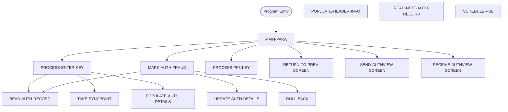

# Program: COPAUS1C


---

## Quick Reference

| Attribute | Value |
|-----------|-------|
| Program ID | `COPAUS1C` |
| Type | ONLINE |
| Lines | 605 |
| Source | [COPAUS1C.cbl](../carddemo/COPAUS1C.cbl#L1) |
| Paragraphs | 15 |
| Statements | 17 |
| Impact Risk | **HIGH** — 26 programs affected |

> **View Source:** [Open COPAUS1C.cbl](../carddemo/COPAUS1C.cbl#L1)

## Source Grounding Facts

| Data Item | Literal Value |
|-----------|---------------|
| `WS-PGM-AUTH-DTL` | `COPAUS1C` |
| `WS-PGM-AUTH-SMRY` | `COPAUS0C` |
| `WS-PGM-AUTH-FRAUD` | `COPAUS2C` |
| `WS-CICS-TRANID` | `CPVD` |
| `WS-ERR-FLG` | `N` |
| `WS-AUTHS-EOF` | `N` |
| `WS-SEND-ERASE-FLG` | `Y` |
| `WS-AUTH-DATE` | `00/00/00` |
| `WS-AUTH-TIME` | `00:00:00` |
| `WS-REPORT-FRAUD` | `F` |
| `WS-REMOVE-FRAUD` | `R` |
| `WS-FRD-UPDT-SUCCESS` | `S` |
| `WS-FRD-UPDT-FAILED` | `F` |


## Business Purpose

*Business purpose is not present in the extracted data. Run LLM enrichment to populate this section.*


## Dependency Context

> This section shows how **COPAUS1C** connects to the rest of the system — who calls it,
> what it calls, and what data it shares. If linked programs exist, they must appear here.

### Programs That Call COPAUS1C (Callers)

*No programs call COPAUS1C — this is likely a top-level entry point or CICS transaction starter.*

### Programs Called by COPAUS1C (Callees)

*COPAUS1C does not call any other programs (leaf program).*

### Shared Data (Copybooks & Files)

#### Shared Copybooks

| Copybook | Also Used By | # Co-Users |
|----------|-------------|------------|
| `CIPAUDTY` | CBPAUP0C, COPAUA0C, COPAUS0C, COPAUS2C, DBUNLDGS (+2 more) | 7 |
| `CIPAUSMY` | CBPAUP0C, COPAUA0C, COPAUS0C, DBUNLDGS, PAUDBLOD (+1 more) | 6 |
| `COCOM01Y` | COACTUPC, COACTVWC, COADM01C, COBIL00C, COCRDLIC (+15 more) | 20 |
| `COPAU01` |  | 0 |
| `COTTL01Y` | COACTUPC, COACTVWC, COADM01C, COBIL00C, COCRDLIC (+15 more) | 20 |
| `CSDAT01Y` | COACTUPC, COACTVWC, COADM01C, COBIL00C, COCRDLIC (+15 more) | 20 |
| `CSMSG01Y` | COACTUPC, COACTVWC, COADM01C, COBIL00C, COCRDLIC (+15 more) | 20 |
| `CSMSG02Y` | COACTUPC, COACTVWC, COCRDSLC, COCRDUPC, COPAUS0C (+1 more) | 6 |
| `DFHAID` | COACTUPC, COACTVWC, COADM01C, COBIL00C, COCRDLIC (+15 more) | 20 |
| `DFHBMSCA` | COACTUPC, COACTVWC, COADM01C, COBIL00C, COCRDLIC (+15 more) | 20 |


## Legacy Data Contracts

> These tables are derived from FILE SECTION records and COPY-expanded data declarations. They preserve the legacy field names, COBOL storage type, inferred modern type, and status-code values needed for Java DTOs, SQL schemas, API contracts, and migration mapping.


### Copybook Segment Layouts

#### `CIPAUDTY` as `PENDING-AUTH-DETAILS`

| Legacy Field | Meaning | COBOL Type | Modern Type | Status / Format Notes |
|--------------|---------|------------|-------------|-----------------------|
| `PA-AUTHORIZATION-KEY` | Authorization Key | `GROUP` | `OBJECT` |  |
| `PA-AUTH-DATE-9C` | Authorization Date | `PIC S9(05) COMP-3` | `INTEGER` | Date-like field; verify YYDDD, YYMMDD, or ISO format before migration. |
| `PA-AUTH-TIME-9C` | Authorization Time | `PIC S9(09) COMP-3` | `INTEGER` |  |
| `PA-AUTH-ORIG-DATE` | Authorization Orig Date | `PIC X(06)` | `STRING(6)` |  |
| `PA-AUTH-ORIG-TIME` | Authorization Orig Time | `PIC X(06)` | `STRING(6)` |  |
| `PA-CARD-NUM` | Card Number | `PIC X(16)` | `STRING(16)` |  |
| `PA-AUTH-TYPE` | Authorization Type | `PIC X(04)` | `STRING(4)` |  |
| `PA-CARD-EXPIRY-DATE` | Card Expiry Date | `PIC X(04)` | `STRING(4)` |  |
| `PA-MESSAGE-TYPE` | Message Type | `PIC X(06)` | `STRING(6)` |  |
| `PA-MESSAGE-SOURCE` | Message Source | `PIC X(06)` | `STRING(6)` |  |
| `PA-AUTH-ID-CODE` | Authorization ID Code | `PIC X(06)` | `STRING(6)` |  |
| `PA-AUTH-RESP-CODE` | Authorization Response Code | `PIC X(02)` | `STRING(2)` |  |
| `PA-AUTH-RESP-REASON` | Authorization Response Reason | `PIC X(04)` | `STRING(4)` |  |
| `PA-PROCESSING-CODE` | Processing Code | `PIC 9(06)` | `INTEGER` |  |
| `PA-TRANSACTION-AMT` | Transaction Amount | `PIC S9(10)V99 COMP-3` | `DECIMAL(12,2)` |  |
| `PA-APPROVED-AMT` | Approved Amount | `PIC S9(10)V99 COMP-3` | `DECIMAL(12,2)` |  |
| `PA-MERCHANT-CATAGORY-CODE` | Merchant Catagory Code | `PIC X(04)` | `STRING(4)` |  |
| `PA-ACQR-COUNTRY-CODE` | Acqr Country Code | `PIC X(03)` | `STRING(3)` |  |
| `PA-POS-ENTRY-MODE` | Pos Entry Mode | `PIC 9(02)` | `INTEGER` |  |
| `PA-MERCHANT-ID` | Merchant ID | `PIC X(15)` | `STRING(15)` |  |
| `PA-MERCHANT-NAME` | Merchant Name | `PIC X(22)` | `STRING(22)` |  |
| `PA-MERCHANT-CITY` | Merchant City | `PIC X(13)` | `STRING(13)` |  |
| `PA-MERCHANT-STATE` | Merchant State | `PIC X(02)` | `STRING(2)` |  |
| `PA-MERCHANT-ZIP` | Merchant Zip | `PIC X(09)` | `STRING(9)` |  |
| `PA-TRANSACTION-ID` | Transaction ID | `PIC X(15)` | `STRING(15)` |  |
| `PA-MATCH-STATUS` | Match Status | `PIC X(01)` | `STRING(1)` |  |
| `PA-AUTH-FRAUD` | Authorization Fraud | `PIC X(01)` | `STRING(1)` |  |
| `PA-FRAUD-RPT-DATE` | Fraud Rpt Date | `PIC X(08)` | `STRING(8)` | Date-like field; verify YYDDD, YYMMDD, or ISO format before migration. |
| `FILLER` | Filler | `PIC X(17)` | `STRING(17)` |  |

#### `CIPAUSMY` as `PENDING-AUTH-SUMMARY`

| Legacy Field | Meaning | COBOL Type | Modern Type | Status / Format Notes |
|--------------|---------|------------|-------------|-----------------------|
| `PA-ACCT-ID` | Account ID | `PIC S9(11) COMP-3` | `BIGINT` |  |
| `PA-CUST-ID` | Customer ID | `PIC 9(09)` | `INTEGER` |  |
| `PA-AUTH-STATUS` | Authorization Status | `PIC X(01)` | `STRING(1)` |  |
| `PA-ACCOUNT-STATUS` | Account Status | `PIC X(02) OCCURS 5` | `STRING(2)` | Repeating field, 5 occurrences. |
| `PA-CREDIT-LIMIT` | Credit Limit | `PIC S9(09)V99 COMP-3` | `DECIMAL(11,2)` |  |
| `PA-CASH-LIMIT` | Cash Limit | `PIC S9(09)V99 COMP-3` | `DECIMAL(11,2)` |  |
| `PA-CREDIT-BALANCE` | Credit Balance | `PIC S9(09)V99 COMP-3` | `DECIMAL(11,2)` |  |
| `PA-CASH-BALANCE` | Cash Balance | `PIC S9(09)V99 COMP-3` | `DECIMAL(11,2)` |  |
| `PA-APPROVED-AUTH-CNT` | Approved Authorization Count | `PIC S9(04) COMP` | `INTEGER` |  |
| `PA-DECLINED-AUTH-CNT` | Declined Authorization Count | `PIC S9(04) COMP` | `INTEGER` |  |
| `PA-APPROVED-AUTH-AMT` | Approved Authorization Amount | `PIC S9(09)V99 COMP-3` | `DECIMAL(11,2)` |  |
| `PA-DECLINED-AUTH-AMT` | Declined Authorization Amount | `PIC S9(09)V99 COMP-3` | `DECIMAL(11,2)` |  |
| `FILLER` | Filler | `PIC X(34)` | `STRING(34)` |  |

#### `COCOM01Y` as `CARDDEMO-COMMAREA`

| Legacy Field | Meaning | COBOL Type | Modern Type | Status / Format Notes |
|--------------|---------|------------|-------------|-----------------------|
| `CARDDEMO-COMMAREA` | Carddemo Commarea | `GROUP` | `OBJECT` |  |
| `CDEMO-GENERAL-INFO` | General Info | `GROUP` | `OBJECT` |  |
| `CDEMO-FROM-TRANID` | From Tranid | `PIC X(04)` | `STRING(4)` |  |
| `CDEMO-FROM-PROGRAM` | From Program | `PIC X(08)` | `STRING(8)` |  |
| `CDEMO-TO-TRANID` | To Tranid | `PIC X(04)` | `STRING(4)` |  |
| `CDEMO-TO-PROGRAM` | To Program | `PIC X(08)` | `STRING(8)` |  |
| `CDEMO-USER-ID` | User ID | `PIC X(08)` | `STRING(8)` |  |
| `CDEMO-USER-TYPE` | User Type | `PIC X(01)` | `STRING(1)` |  |
| `CDEMO-PGM-CONTEXT` | Pgm Context | `PIC 9(01)` | `INTEGER` |  |
| `CDEMO-CUSTOMER-INFO` | Customer Info | `GROUP` | `OBJECT` |  |
| `CDEMO-CUST-ID` | Customer ID | `PIC 9(09)` | `INTEGER` |  |
| `CDEMO-CUST-FNAME` | Customer Fname | `PIC X(25)` | `STRING(25)` |  |
| `CDEMO-CUST-MNAME` | Customer Mname | `PIC X(25)` | `STRING(25)` |  |
| `CDEMO-CUST-LNAME` | Customer Lname | `PIC X(25)` | `STRING(25)` |  |
| `CDEMO-ACCOUNT-INFO` | Account Info | `GROUP` | `OBJECT` |  |
| `CDEMO-ACCT-ID` | Account ID | `PIC 9(11)` | `BIGINT` |  |
| `CDEMO-ACCT-STATUS` | Account Status | `PIC X(01)` | `STRING(1)` |  |
| `CDEMO-CARD-INFO` | Card Info | `GROUP` | `OBJECT` |  |
| `CDEMO-CARD-NUM` | Card Number | `PIC 9(16)` | `BIGINT` |  |
| `CDEMO-MORE-INFO` | More Info | `GROUP` | `OBJECT` |  |
| `CDEMO-LAST-MAP` | Last Map | `PIC X(7)` | `STRING(7)` |  |
| `CDEMO-LAST-MAPSET` | Last Mapset | `PIC X(7)` | `STRING(7)` |  |

#### `COPAU01` as `COPAU1AI`

| Legacy Field | Meaning | COBOL Type | Modern Type | Status / Format Notes |
|--------------|---------|------------|-------------|-----------------------|
| `COPAU1AI` | Copau1Ai | `GROUP` | `OBJECT` |  |
| `COPAU1AO` | Copau1Ao | `GROUP` | `OBJECT` |  |

#### `COTTL01Y` as `CCDA-SCREEN-TITLE`

| Legacy Field | Meaning | COBOL Type | Modern Type | Status / Format Notes |
|--------------|---------|------------|-------------|-----------------------|
| `CCDA-SCREEN-TITLE` | Ccda Screen Title | `GROUP` | `OBJECT` |  |
| `CCDA-TITLE01` | Ccda Title01 | `PIC X(40)` | `STRING(40)` |  |
| `CCDA-TITLE02` | Ccda Title02 | `PIC X(40)` | `STRING(40)` |  |
| `CCDA-THANK-YOU` | Ccda Thank You | `PIC X(40)` | `STRING(40)` |  |

#### `CSDAT01Y` as `WS-DATE-TIME`

| Legacy Field | Meaning | COBOL Type | Modern Type | Status / Format Notes |
|--------------|---------|------------|-------------|-----------------------|
| `WS-DATE-TIME` | Date Time | `GROUP` | `OBJECT` |  |
| `WS-CURDATE-DATA` | Curdate Data | `GROUP` | `OBJECT` |  |
| `WS-CURDATE` | Curdate | `GROUP` | `OBJECT` |  |
| `WS-CURDATE-YEAR` | Curdate Year | `PIC 9(04)` | `INTEGER` |  |
| `WS-CURDATE-MONTH` | Curdate Month | `PIC 9(02)` | `INTEGER` |  |
| `WS-CURDATE-DAY` | Curdate Day | `PIC 9(02)` | `INTEGER` |  |
| `WS-CURDATE-N` | Curdate N | `PIC 9(08)` | `INTEGER` |  |
| `WS-CURTIME` | Curtime | `GROUP` | `OBJECT` |  |
| `WS-CURTIME-HOURS` | Curtime Hours | `PIC 9(02)` | `INTEGER` |  |
| `WS-CURTIME-MINUTE` | Curtime Minute | `PIC 9(02)` | `INTEGER` |  |
| `WS-CURTIME-SECOND` | Curtime Second | `PIC 9(02)` | `INTEGER` |  |
| `WS-CURTIME-MILSEC` | Curtime Milsec | `PIC 9(02)` | `INTEGER` |  |
| `WS-CURTIME-N` | Curtime N | `PIC 9(08)` | `INTEGER` |  |
| `WS-CURDATE-MM-DD-YY` | Curdate Mm Dd Yy | `GROUP` | `OBJECT` |  |
| `WS-CURDATE-MM` | Curdate Mm | `PIC 9(02)` | `INTEGER` |  |
| `FILLER` | Filler | `PIC X(01)` | `STRING(1)` |  |
| `WS-CURDATE-DD` | Curdate Dd | `PIC 9(02)` | `INTEGER` |  |
| `FILLER` | Filler | `PIC X(01)` | `STRING(1)` |  |
| `WS-CURDATE-YY` | Curdate Yy | `PIC 9(02)` | `INTEGER` |  |
| `WS-CURTIME-HH-MM-SS` | Curtime Hh Mm Ss | `GROUP` | `OBJECT` |  |
| `WS-CURTIME-HH` | Curtime Hh | `PIC 9(02)` | `INTEGER` |  |
| `FILLER` | Filler | `PIC X(01)` | `STRING(1)` |  |
| `WS-CURTIME-MM` | Curtime Mm | `PIC 9(02)` | `INTEGER` |  |
| `FILLER` | Filler | `PIC X(01)` | `STRING(1)` |  |
| `WS-CURTIME-SS` | Curtime Ss | `PIC 9(02)` | `INTEGER` |  |
| `WS-TIMESTAMP` | Timestamp | `GROUP` | `OBJECT` |  |
| `WS-TIMESTAMP-DT-YYYY` | Timestamp Date Yyyy | `PIC 9(04)` | `INTEGER` |  |
| `FILLER` | Filler | `PIC X(01)` | `STRING(1)` |  |
| `WS-TIMESTAMP-DT-MM` | Timestamp Date Mm | `PIC 9(02)` | `INTEGER` |  |
| `FILLER` | Filler | `PIC X(01)` | `STRING(1)` |  |
| `WS-TIMESTAMP-DT-DD` | Timestamp Date Dd | `PIC 9(02)` | `INTEGER` |  |
| `FILLER` | Filler | `PIC X(01)` | `STRING(1)` |  |
| `WS-TIMESTAMP-TM-HH` | Timestamp Tm Hh | `PIC 9(02)` | `INTEGER` |  |
| `FILLER` | Filler | `PIC X(01)` | `STRING(1)` |  |
| `WS-TIMESTAMP-TM-MM` | Timestamp Tm Mm | `PIC 9(02)` | `INTEGER` |  |
| `FILLER` | Filler | `PIC X(01)` | `STRING(1)` |  |
| `WS-TIMESTAMP-TM-SS` | Timestamp Tm Ss | `PIC 9(02)` | `INTEGER` |  |
| `FILLER` | Filler | `PIC X(01)` | `STRING(1)` |  |
| `WS-TIMESTAMP-TM-MS6` | Timestamp Tm Ms6 | `PIC 9(06)` | `INTEGER` |  |

#### `CSMSG01Y` as `CCDA-COMMON-MESSAGES`

| Legacy Field | Meaning | COBOL Type | Modern Type | Status / Format Notes |
|--------------|---------|------------|-------------|-----------------------|
| `CCDA-COMMON-MESSAGES` | Ccda Common Messages | `GROUP` | `OBJECT` |  |
| `CCDA-MSG-THANK-YOU` | Ccda Msg Thank You | `PIC X(50)` | `STRING(50)` |  |
| `CCDA-MSG-INVALID-KEY` | Ccda Msg Invalid Key | `PIC X(50)` | `STRING(50)` |  |

#### `CSMSG02Y` as `ABEND-DATA`

| Legacy Field | Meaning | COBOL Type | Modern Type | Status / Format Notes |
|--------------|---------|------------|-------------|-----------------------|
| `ABEND-DATA` | Abend Data | `GROUP` | `OBJECT` |  |
| `ABEND-CODE` | Abend Code | `PIC X(4)` | `STRING(4)` |  |
| `ABEND-CULPRIT` | Abend Culprit | `PIC X(8)` | `STRING(8)` |  |
| `ABEND-REASON` | Abend Reason | `PIC X(50)` | `STRING(50)` |  |
| `ABEND-MSG` | Abend Msg | `PIC X(72)` | `STRING(72)` |  |

#### `DFHAID` as `DFHAID`

| Legacy Field | Meaning | COBOL Type | Modern Type | Status / Format Notes |
|--------------|---------|------------|-------------|-----------------------|
| `DFHAID` | Dfhaid | `GROUP` | `OBJECT` |  |

#### `DFHBMSCA` as `DFHBMSCA`

| Legacy Field | Meaning | COBOL Type | Modern Type | Status / Format Notes |
|--------------|---------|------------|-------------|-----------------------|
| `DFHBMSCA` | Dfhbmsca | `GROUP` | `OBJECT` |  |


### Data Movement And Key Mapping

| Line | Source | Target | Meaning |
|------|--------|--------|---------|
| 162 | `SPACES` | `WS-MESSAGE` | SPACES populates WS-MESSAGE |
| 168 | `WS-PGM-AUTH-SMRY` | `CDEMO-TO-PROGRAM` | WS-PGM-AUTH-SMRY populates CDEMO-TO-PROGRAM |
| 185 | `WS-PGM-AUTH-SMRY` | `CDEMO-TO-PROGRAM` | WS-PGM-AUTH-SMRY populates CDEMO-TO-PROGRAM |
| 196 | `CCDA-MSG-INVALID-KEY` | `WS-MESSAGE` | CCDA-MSG-INVALID-KEY populates WS-MESSAGE |
| 213 | `CDEMO-ACCT-ID` | `WS-ACCT-ID` | CDEMO-ACCT-ID populates WS-ACCT-ID |
| 231 | `CDEMO-ACCT-ID` | `WS-ACCT-ID` | CDEMO-ACCT-ID populates WS-ACCT-ID |
| 232 | `CDEMO-CPVD-PAU-SELECTED` | `WS-AUTH-KEY` | CDEMO-CPVD-PAU-SELECTED populates WS-AUTH-KEY |
| 244 | `PENDING-AUTH-DETAILS` | `WS-FRAUD-AUTH-RECORD` | PENDING-AUTH-DETAILS populates WS-FRAUD-AUTH-RECORD |
| 245 | `CDEMO-ACCT-ID` | `WS-FRD-ACCT-ID` | CDEMO-ACCT-ID populates WS-FRD-ACCT-ID |
| 246 | `CDEMO-CUST-ID` | `WS-FRD-CUST-ID` | CDEMO-CUST-ID populates WS-FRD-CUST-ID |
| 257 | `WS-FRD-ACT-MSG` | `WS-MESSAGE` | WS-FRD-ACT-MSG populates WS-MESSAGE |
| 264 | `PA-AUTHORIZATION-KEY` | `CDEMO-CPVD-PAU-SELECTED` | PA-AUTHORIZATION-KEY populates CDEMO-CPVD-PAU-SELECTED |
| 270 | `CDEMO-ACCT-ID` | `WS-ACCT-ID` | CDEMO-ACCT-ID populates WS-ACCT-ID |
| 271 | `CDEMO-CPVD-PAU-SELECTED` | `WS-AUTH-KEY` | CDEMO-CPVD-PAU-SELECTED populates WS-AUTH-KEY |
| 286 | `PA-AUTHORIZATION-KEY` | `CDEMO-CPVD-PAU-SELECTED` | PA-AUTHORIZATION-KEY populates CDEMO-CPVD-PAU-SELECTED |
| 297 | `PA-AUTH-ORIG-DATE(1:2)` | `WS-CURDATE-YY` | PA-AUTH-ORIG-DATE(1:2) populates WS-CURDATE-YY |
| 298 | `PA-AUTH-ORIG-DATE(3:2)` | `WS-CURDATE-MM` | PA-AUTH-ORIG-DATE(3:2) populates WS-CURDATE-MM |
| 299 | `PA-AUTH-ORIG-DATE(5:2)` | `WS-CURDATE-DD` | PA-AUTH-ORIG-DATE(5:2) populates WS-CURDATE-DD |
| 300 | `WS-CURDATE-MM-DD-YY` | `WS-AUTH-DATE` | WS-CURDATE-MM-DD-YY populates WS-AUTH-DATE |
| 301 | `WS-AUTH-DATE` | `AUTHDTO` | WS-AUTH-DATE populates AUTHDTO |
| 303 | `PA-AUTH-ORIG-TIME(1:2)` | `WS-AUTH-TIME(1:2)` | PA-AUTH-ORIG-TIME(1:2) populates WS-AUTH-TIME(1:2) |
| 304 | `PA-AUTH-ORIG-TIME(3:2)` | `WS-AUTH-TIME(4:2)` | PA-AUTH-ORIG-TIME(3:2) populates WS-AUTH-TIME(4:2) |
| 305 | `PA-AUTH-ORIG-TIME(5:2)` | `WS-AUTH-TIME(7:2)` | PA-AUTH-ORIG-TIME(5:2) populates WS-AUTH-TIME(7:2) |
| 306 | `WS-AUTH-TIME` | `AUTHTMO` | WS-AUTH-TIME populates AUTHTMO |
| 308 | `PA-APPROVED-AMT` | `WS-AUTH-AMT` | PA-APPROVED-AMT populates WS-AUTH-AMT |
| 309 | `WS-AUTH-AMT` | `AUTHAMTO` | WS-AUTH-AMT populates AUTHAMTO |
| 312 | `'A'` | `AUTHRSPO` | 'A' populates AUTHRSPO |
| 313 | `DFHGREEN` | `AUTHRSPC` | DFHGREEN populates AUTHRSPC |
| 315 | `'D'` | `AUTHRSPO` | 'D' populates AUTHRSPO |
| 316 | `DFHRED` | `AUTHRSPC` | DFHRED populates AUTHRSPC |


---

## Dependency Graph

```mermaid
flowchart TD
    COPAUS1C["⬤ COPAUS1C"]:::target
    CB_CIPAUDTY{{"CIPAUDTY"}}:::copybook
    COPAUS1C -.- CB_CIPAUDTY
    CBPAUP0C["CBPAUP0C"]:::coupled
    CB_CIPAUDTY -.- CBPAUP0C
    COPAUA0C["COPAUA0C"]:::coupled
    CB_CIPAUDTY -.- COPAUA0C
    COPAUS0C["COPAUS0C"]:::coupled
    CB_CIPAUDTY -.- COPAUS0C
    CB_CIPAUSMY{{"CIPAUSMY"}}:::copybook
    COPAUS1C -.- CB_CIPAUSMY
    CBPAUP0C["CBPAUP0C"]:::coupled
    CB_CIPAUSMY -.- CBPAUP0C
    COPAUA0C["COPAUA0C"]:::coupled
    CB_CIPAUSMY -.- COPAUA0C
    COPAUS0C["COPAUS0C"]:::coupled
    CB_CIPAUSMY -.- COPAUS0C
    CB_COCOM01Y{{"COCOM01Y"}}:::copybook
    COPAUS1C -.- CB_COCOM01Y
    COACTUPC["COACTUPC"]:::coupled
    CB_COCOM01Y -.- COACTUPC
    COACTVWC["COACTVWC"]:::coupled
    CB_COCOM01Y -.- COACTVWC
    COADM01C["COADM01C"]:::coupled
    CB_COCOM01Y -.- COADM01C
    CB_COTTL01Y{{"COTTL01Y"}}:::copybook
    COPAUS1C -.- CB_COTTL01Y
    COACTUPC["COACTUPC"]:::coupled
    CB_COTTL01Y -.- COACTUPC
    COACTVWC["COACTVWC"]:::coupled
    CB_COTTL01Y -.- COACTVWC
    COADM01C["COADM01C"]:::coupled
    CB_COTTL01Y -.- COADM01C
    CB_CSDAT01Y{{"CSDAT01Y"}}:::copybook
    COPAUS1C -.- CB_CSDAT01Y
    COACTUPC["COACTUPC"]:::coupled
    CB_CSDAT01Y -.- COACTUPC
    COACTVWC["COACTVWC"]:::coupled
    CB_CSDAT01Y -.- COACTVWC
    COADM01C["COADM01C"]:::coupled
    CB_CSDAT01Y -.- COADM01C
    CB_CSMSG01Y{{"CSMSG01Y"}}:::copybook
    COPAUS1C -.- CB_CSMSG01Y
    COACTUPC["COACTUPC"]:::coupled
    CB_CSMSG01Y -.- COACTUPC
    COACTVWC["COACTVWC"]:::coupled
    CB_CSMSG01Y -.- COACTVWC
    COADM01C["COADM01C"]:::coupled
    CB_CSMSG01Y -.- COADM01C
    CB_CSMSG02Y{{"CSMSG02Y"}}:::copybook
    COPAUS1C -.- CB_CSMSG02Y
    COACTUPC["COACTUPC"]:::coupled
    CB_CSMSG02Y -.- COACTUPC
    COACTVWC["COACTVWC"]:::coupled
    CB_CSMSG02Y -.- COACTVWC
    COCRDSLC["COCRDSLC"]:::coupled
    CB_CSMSG02Y -.- COCRDSLC
    classDef target fill:#f85149,stroke:#da3633,color:#fff,stroke-width:3px
    classDef caller fill:#58a6ff,stroke:#1f6feb,color:#fff
    classDef callee fill:#3fb950,stroke:#238636,color:#fff
    classDef copybook fill:#d29922,stroke:#9e6a03,color:#fff
    classDef coupled fill:#d29922,stroke:#9e6a03,color:#fff,stroke-dasharray:5
    classDef transitive fill:#484f58,stroke:#8b949e,color:#c9d1d9,stroke-dasharray:5
```



> **Legend:** 🔴 Target program · 🔵 Direct callers · 🟢 Direct callees · 🟡 Copybook-coupled · ⚫ Transitive (indirect)

---

## Impact Ripple View

> **If you change COPAUS1C, what else could break?**

| Impact Metric | Count |
|--------------|-------|
| Direct Callers | 0 |
| Transitive Callers (callers of callers) | 0 |
| Direct Callees | 0 |
| Transitive Callees | 0 |
| Copybook-Coupled Programs | 26 |
| **Total Impact** | **26** |
| **Risk Rating** | **HIGH** |


**Programs affected via shared copybooks:**
- `CBPAUP0C`
- `COACTUPC`
- `COACTVWC`
- `COADM01C`
- `COBIL00C`
- `COCRDLIC`
- `COCRDSLC`
- `COCRDUPC`
- `COMEN01C`
- `COPAUA0C`
- `COPAUS0C`
- `COPAUS2C`
- `CORPT00C`
- `COSGN00C`
- `COTRN00C`
- `COTRN01C`
- `COTRN02C`
- `COTRTLIC`
- `COTRTUPC`
- `COUSR00C`
- `COUSR01C`
- `COUSR02C`
- `COUSR03C`
- `DBUNLDGS`
- `PAUDBLOD`
- `PAUDBUNL`

---

## Statement Profile

| Statement Type | Count |
|---------------|-------|
| IF | 17 |

## Control Flow



## Paragraphs

### MAIN-PARA

| | |
|---|---|
| **Paragraph** | `MAIN-PARA` |
| **Lines** | 157 - 207 |
| **View Code** | [Jump to Line 157](../carddemo/COPAUS1C.cbl#L157) |


### PROCESS-ENTER-KEY

| | |
|---|---|
| **Paragraph** | `PROCESS-ENTER-KEY` |
| **Lines** | 208 - 229 |
| **View Code** | [Jump to Line 208](../carddemo/COPAUS1C.cbl#L208) |


### MARK-AUTH-FRAUD

| | |
|---|---|
| **Paragraph** | `MARK-AUTH-FRAUD` |
| **Lines** | 230 - 267 |
| **View Code** | [Jump to Line 230](../carddemo/COPAUS1C.cbl#L230) |


### PROCESS-PF8-KEY

| | |
|---|---|
| **Paragraph** | `PROCESS-PF8-KEY` |
| **Lines** | 268 - 290 |
| **View Code** | [Jump to Line 268](../carddemo/COPAUS1C.cbl#L268) |


### POPULATE-AUTH-DETAILS

| | |
|---|---|
| **Paragraph** | `POPULATE-AUTH-DETAILS` |
| **Lines** | 291 - 359 |
| **View Code** | [Jump to Line 291](../carddemo/COPAUS1C.cbl#L291) |


### RETURN-TO-PREV-SCREEN

| | |
|---|---|
| **Paragraph** | `RETURN-TO-PREV-SCREEN` |
| **Lines** | 360 - 372 |
| **View Code** | [Jump to Line 360](../carddemo/COPAUS1C.cbl#L360) |


### SEND-AUTHVIEW-SCREEN

| | |
|---|---|
| **Paragraph** | `SEND-AUTHVIEW-SCREEN` |
| **Lines** | 373 - 397 |
| **View Code** | [Jump to Line 373](../carddemo/COPAUS1C.cbl#L373) |


### RECEIVE-AUTHVIEW-SCREEN

| | |
|---|---|
| **Paragraph** | `RECEIVE-AUTHVIEW-SCREEN` |
| **Lines** | 398 - 408 |
| **View Code** | [Jump to Line 398](../carddemo/COPAUS1C.cbl#L398) |


### POPULATE-HEADER-INFO

| | |
|---|---|
| **Paragraph** | `POPULATE-HEADER-INFO` |
| **Lines** | 409 - 430 |
| **View Code** | [Jump to Line 409](../carddemo/COPAUS1C.cbl#L409) |


### READ-AUTH-RECORD

| | |
|---|---|
| **Paragraph** | `READ-AUTH-RECORD` |
| **Lines** | 431 - 492 |
| **View Code** | [Jump to Line 431](../carddemo/COPAUS1C.cbl#L431) |


### READ-NEXT-AUTH-RECORD

| | |
|---|---|
| **Paragraph** | `READ-NEXT-AUTH-RECORD` |
| **Lines** | 493 - 519 |
| **View Code** | [Jump to Line 493](../carddemo/COPAUS1C.cbl#L493) |


### UPDATE-AUTH-DETAILS

| | |
|---|---|
| **Paragraph** | `UPDATE-AUTH-DETAILS` |
| **Lines** | 520 - 556 |
| **View Code** | [Jump to Line 520](../carddemo/COPAUS1C.cbl#L520) |


### TAKE-SYNCPOINT

| | |
|---|---|
| **Paragraph** | `TAKE-SYNCPOINT` |
| **Lines** | 557 - 564 |
| **View Code** | [Jump to Line 557](../carddemo/COPAUS1C.cbl#L557) |


### ROLL-BACK

| | |
|---|---|
| **Paragraph** | `ROLL-BACK` |
| **Lines** | 565 - 573 |
| **View Code** | [Jump to Line 565](../carddemo/COPAUS1C.cbl#L565) |


### SCHEDULE-PSB

| | |
|---|---|
| **Paragraph** | `SCHEDULE-PSB` |
| **Lines** | 574 - 604 |
| **View Code** | [Jump to Line 574](../carddemo/COPAUS1C.cbl#L574) |


## Copybook Field Dictionaries

The following copybooks are included by this program. Each entry shows the actual fields
extracted from the copybook source file (`.cpy`).

### Copybook `CIPAUDTY`

| Level | Field | PIC | USAGE | Parent | Notes |
|-------|-------|-----|-------|--------|-------|
| `05` | `PA-AUTHORIZATION-KEY` | `None` | None | None |  |
| `10` | `PA-AUTH-DATE-9C` | `S9(05)` | COMP | PA-AUTHORIZATION-KEY |  |
| `10` | `PA-AUTH-TIME-9C` | `S9(09)` | COMP | PA-AUTHORIZATION-KEY |  |
| `05` | `PA-AUTH-ORIG-DATE` | `X(06)` | None | None |  |
| `05` | `PA-AUTH-ORIG-TIME` | `X(06)` | None | None |  |
| `05` | `PA-CARD-NUM` | `X(16)` | None | None |  |
| `05` | `PA-AUTH-TYPE` | `X(04)` | None | None |  |
| `05` | `PA-CARD-EXPIRY-DATE` | `X(04)` | None | None |  |
| `05` | `PA-MESSAGE-TYPE` | `X(06)` | None | None |  |
| `05` | `PA-MESSAGE-SOURCE` | `X(06)` | None | None |  |
| `05` | `PA-AUTH-ID-CODE` | `X(06)` | None | None |  |
| `05` | `PA-AUTH-RESP-CODE` | `X(02)` | None | None |  |
| `88` | `PA-AUTH-APPROVED` | `None` | None | None |  |
| `05` | `PA-AUTH-RESP-REASON` | `X(04)` | None | None |  |
| `05` | `PA-PROCESSING-CODE` | `9(06)` | None | None |  |
| `05` | `PA-TRANSACTION-AMT` | `S9(10)V99` | COMP | None |  |
| `05` | `PA-APPROVED-AMT` | `S9(10)V99` | COMP | None |  |
| `05` | `PA-MERCHANT-CATAGORY-CODE` | `X(04)` | None | None |  |
| `05` | `PA-ACQR-COUNTRY-CODE` | `X(03)` | None | None |  |
| `05` | `PA-POS-ENTRY-MODE` | `9(02)` | None | None |  |
| `05` | `PA-MERCHANT-ID` | `X(15)` | None | None |  |
| `05` | `PA-MERCHANT-NAME` | `X(22)` | None | None |  |
| `05` | `PA-MERCHANT-CITY` | `X(13)` | None | None |  |
| `05` | `PA-MERCHANT-STATE` | `X(02)` | None | None |  |
| `05` | `PA-MERCHANT-ZIP` | `X(09)` | None | None |  |
| `05` | `PA-TRANSACTION-ID` | `X(15)` | None | None |  |
| `05` | `PA-MATCH-STATUS` | `X(01)` | None | None |  |
| `88` | `PA-MATCH-PENDING` | `None` | None | None |  |
| `88` | `PA-MATCH-AUTH-DECLINED` | `None` | None | None |  |
| `88` | `PA-MATCH-PENDING-EXPIRED` | `None` | None | None |  |
| `88` | `PA-MATCHED-WITH-TRAN` | `None` | None | None |  |
| `05` | `PA-AUTH-FRAUD` | `X(01)` | None | None |  |
| `88` | `PA-FRAUD-CONFIRMED` | `None` | None | None |  |
| `88` | `PA-FRAUD-REMOVED` | `None` | None | None |  |
| `05` | `PA-FRAUD-RPT-DATE` | `X(08)` | None | None |  |

### Copybook `CIPAUSMY`

| Level | Field | PIC | USAGE | Parent | Notes |
|-------|-------|-----|-------|--------|-------|
| `05` | `PA-ACCT-ID` | `S9(11)` | COMP | None |  |
| `05` | `PA-CUST-ID` | `9(09)` | None | None |  |
| `05` | `PA-AUTH-STATUS` | `X(01)` | None | None |  |
| `05` | `PA-ACCOUNT-STATUS` | `X(02)` | None | None | OCCURS 5 |
| `05` | `PA-CREDIT-LIMIT` | `S9(09)V99` | COMP | None |  |
| `05` | `PA-CASH-LIMIT` | `S9(09)V99` | COMP | None |  |
| `05` | `PA-CREDIT-BALANCE` | `S9(09)V99` | COMP | None |  |
| `05` | `PA-CASH-BALANCE` | `S9(09)V99` | COMP | None |  |
| `05` | `PA-APPROVED-AUTH-CNT` | `S9(04)` | COMP | None |  |
| `05` | `PA-DECLINED-AUTH-CNT` | `S9(04)` | COMP | None |  |
| `05` | `PA-APPROVED-AUTH-AMT` | `S9(09)V99` | COMP | None |  |
| `05` | `PA-DECLINED-AUTH-AMT` | `S9(09)V99` | COMP | None |  |

### Copybook `COCOM01Y`

| Level | Field | PIC | USAGE | Parent | Notes |
|-------|-------|-----|-------|--------|-------|
| `01` | `CARDDEMO-COMMAREA` | `None` | None | None |  |
| `05` | `CDEMO-GENERAL-INFO` | `None` | None | CARDDEMO-COMMAREA |  |
| `10` | `CDEMO-FROM-TRANID` | `X(04)` | None | CDEMO-GENERAL-INFO |  |
| `10` | `CDEMO-FROM-PROGRAM` | `X(08)` | None | CDEMO-GENERAL-INFO |  |
| `10` | `CDEMO-TO-TRANID` | `X(04)` | None | CDEMO-GENERAL-INFO |  |
| `10` | `CDEMO-TO-PROGRAM` | `X(08)` | None | CDEMO-GENERAL-INFO |  |
| `10` | `CDEMO-USER-ID` | `X(08)` | None | CDEMO-GENERAL-INFO |  |
| `10` | `CDEMO-USER-TYPE` | `X(01)` | None | CDEMO-GENERAL-INFO |  |
| `88` | `CDEMO-USRTYP-ADMIN` | `None` | None | CDEMO-GENERAL-INFO |  |
| `88` | `CDEMO-USRTYP-USER` | `None` | None | CDEMO-GENERAL-INFO |  |
| `10` | `CDEMO-PGM-CONTEXT` | `9(01)` | None | CDEMO-GENERAL-INFO |  |
| `88` | `CDEMO-PGM-ENTER` | `None` | None | CDEMO-GENERAL-INFO |  |
| `88` | `CDEMO-PGM-REENTER` | `None` | None | CDEMO-GENERAL-INFO |  |
| `05` | `CDEMO-CUSTOMER-INFO` | `None` | None | CARDDEMO-COMMAREA |  |
| `10` | `CDEMO-CUST-ID` | `9(09)` | None | CDEMO-CUSTOMER-INFO |  |
| `10` | `CDEMO-CUST-FNAME` | `X(25)` | None | CDEMO-CUSTOMER-INFO |  |
| `10` | `CDEMO-CUST-MNAME` | `X(25)` | None | CDEMO-CUSTOMER-INFO |  |
| `10` | `CDEMO-CUST-LNAME` | `X(25)` | None | CDEMO-CUSTOMER-INFO |  |
| `05` | `CDEMO-ACCOUNT-INFO` | `None` | None | CARDDEMO-COMMAREA |  |
| `10` | `CDEMO-ACCT-ID` | `9(11)` | None | CDEMO-ACCOUNT-INFO |  |
| `10` | `CDEMO-ACCT-STATUS` | `X(01)` | None | CDEMO-ACCOUNT-INFO |  |
| `05` | `CDEMO-CARD-INFO` | `None` | None | CARDDEMO-COMMAREA |  |
| `10` | `CDEMO-CARD-NUM` | `9(16)` | None | CDEMO-CARD-INFO |  |
| `05` | `CDEMO-MORE-INFO` | `None` | None | CARDDEMO-COMMAREA |  |
| `10` | `CDEMO-LAST-MAP` | `X(7)` | None | CDEMO-MORE-INFO |  |
| `10` | `CDEMO-LAST-MAPSET` | `X(7)` | None | CDEMO-MORE-INFO |  |

### Copybook `COPAU01`

| Level | Field | PIC | USAGE | Parent | Notes |
|-------|-------|-----|-------|--------|-------|
| `01` | `COPAU1AI` | `None` | None | None |  |
| `02` | `TRNNAMEL` | `S9(4)` | COMP | COPAU1AI |  |
| `02` | `TRNNAMEF` | `X` | None | COPAU1AI |  |
| `03` | `TRNNAMEA` | `X` | None | COPAU1AI |  |
| `02` | `TRNNAMEI` | `X(4)` | None | COPAU1AI |  |
| `02` | `TITLE01L` | `S9(4)` | COMP | COPAU1AI |  |
| `02` | `TITLE01F` | `X` | None | COPAU1AI |  |
| `03` | `TITLE01A` | `X` | None | COPAU1AI |  |
| `02` | `TITLE01I` | `X(40)` | None | COPAU1AI |  |
| `02` | `CURDATEL` | `S9(4)` | COMP | COPAU1AI |  |
| `02` | `CURDATEF` | `X` | None | COPAU1AI |  |
| `03` | `CURDATEA` | `X` | None | COPAU1AI |  |
| `02` | `CURDATEI` | `X(8)` | None | COPAU1AI |  |
| `02` | `PGMNAMEL` | `S9(4)` | COMP | COPAU1AI |  |
| `02` | `PGMNAMEF` | `X` | None | COPAU1AI |  |
| `03` | `PGMNAMEA` | `X` | None | COPAU1AI |  |
| `02` | `PGMNAMEI` | `X(8)` | None | COPAU1AI |  |
| `02` | `TITLE02L` | `S9(4)` | COMP | COPAU1AI |  |
| `02` | `TITLE02F` | `X` | None | COPAU1AI |  |
| `03` | `TITLE02A` | `X` | None | COPAU1AI |  |
| `02` | `TITLE02I` | `X(40)` | None | COPAU1AI |  |
| `02` | `CURTIMEL` | `S9(4)` | COMP | COPAU1AI |  |
| `02` | `CURTIMEF` | `X` | None | COPAU1AI |  |
| `03` | `CURTIMEA` | `X` | None | COPAU1AI |  |
| `02` | `CURTIMEI` | `X(8)` | None | COPAU1AI |  |
| `02` | `CARDNUML` | `S9(4)` | COMP | COPAU1AI |  |
| `02` | `CARDNUMF` | `X` | None | COPAU1AI |  |
| `03` | `CARDNUMA` | `X` | None | COPAU1AI |  |
| `02` | `CARDNUMI` | `X(16)` | None | COPAU1AI |  |
| `02` | `AUTHDTL` | `S9(4)` | COMP | COPAU1AI |  |
| `02` | `AUTHDTF` | `X` | None | COPAU1AI |  |
| `03` | `AUTHDTA` | `X` | None | COPAU1AI |  |
| `02` | `AUTHDTI` | `X(10)` | None | COPAU1AI |  |
| `02` | `AUTHTML` | `S9(4)` | COMP | COPAU1AI |  |
| `02` | `AUTHTMF` | `X` | None | COPAU1AI |  |
| `03` | `AUTHTMA` | `X` | None | COPAU1AI |  |
| `02` | `AUTHTMI` | `X(10)` | None | COPAU1AI |  |
| `02` | `AUTHRSPL` | `S9(4)` | COMP | COPAU1AI |  |
| `02` | `AUTHRSPF` | `X` | None | COPAU1AI |  |
| `03` | `AUTHRSPA` | `X` | None | COPAU1AI |  |
| `02` | `AUTHRSPI` | `X(1)` | None | COPAU1AI |  |
| `02` | `AUTHRSNL` | `S9(4)` | COMP | COPAU1AI |  |
| `02` | `AUTHRSNF` | `X` | None | COPAU1AI |  |
| `03` | `AUTHRSNA` | `X` | None | COPAU1AI |  |
| `02` | `AUTHRSNI` | `X(20)` | None | COPAU1AI |  |
| `02` | `AUTHCDL` | `S9(4)` | COMP | COPAU1AI |  |
| `02` | `AUTHCDF` | `X` | None | COPAU1AI |  |
| `03` | `AUTHCDA` | `X` | None | COPAU1AI |  |
| `02` | `AUTHCDI` | `X(6)` | None | COPAU1AI |  |
| `02` | `AUTHAMTL` | `S9(4)` | COMP | COPAU1AI |  |
*+ 195 more fields*
### Copybook `COTTL01Y`

| Level | Field | PIC | USAGE | Parent | Notes |
|-------|-------|-----|-------|--------|-------|
| `01` | `CCDA-SCREEN-TITLE` | `None` | None | None |  |
| `05` | `CCDA-TITLE01` | `X(40)` | None | CCDA-SCREEN-TITLE |  |
| `05` | `CCDA-TITLE02` | `X(40)` | None | CCDA-SCREEN-TITLE |  |
| `05` | `CCDA-THANK-YOU` | `X(40)` | None | CCDA-SCREEN-TITLE |  |

### Copybook `CSDAT01Y`

| Level | Field | PIC | USAGE | Parent | Notes |
|-------|-------|-----|-------|--------|-------|
| `01` | `WS-DATE-TIME` | `None` | None | None |  |
| `05` | `WS-CURDATE-DATA` | `None` | None | WS-DATE-TIME |  |
| `10` | `WS-CURDATE` | `None` | None | WS-CURDATE-DATA |  |
| `15` | `WS-CURDATE-YEAR` | `9(04)` | None | WS-CURDATE |  |
| `15` | `WS-CURDATE-MONTH` | `9(02)` | None | WS-CURDATE |  |
| `15` | `WS-CURDATE-DAY` | `9(02)` | None | WS-CURDATE |  |
| `10` | `WS-CURDATE-N` | `9(08)` | None | WS-CURDATE-DATA |  REDEFINES WS-CURDATE |
| `10` | `WS-CURTIME` | `None` | None | WS-CURDATE-DATA |  |
| `15` | `WS-CURTIME-HOURS` | `9(02)` | None | WS-CURTIME |  |
| `15` | `WS-CURTIME-MINUTE` | `9(02)` | None | WS-CURTIME |  |
| `15` | `WS-CURTIME-SECOND` | `9(02)` | None | WS-CURTIME |  |
| `15` | `WS-CURTIME-MILSEC` | `9(02)` | None | WS-CURTIME |  |
| `10` | `WS-CURTIME-N` | `9(08)` | None | WS-CURDATE-DATA |  REDEFINES WS-CURTIME |
| `05` | `WS-CURDATE-MM-DD-YY` | `None` | None | WS-DATE-TIME |  |
| `10` | `WS-CURDATE-MM` | `9(02)` | None | WS-CURDATE-MM-DD-YY |  |
| `10` | `WS-CURDATE-DD` | `9(02)` | None | WS-CURDATE-MM-DD-YY |  |
| `10` | `WS-CURDATE-YY` | `9(02)` | None | WS-CURDATE-MM-DD-YY |  |
| `05` | `WS-CURTIME-HH-MM-SS` | `None` | None | WS-DATE-TIME |  |
| `10` | `WS-CURTIME-HH` | `9(02)` | None | WS-CURTIME-HH-MM-SS |  |
| `10` | `WS-CURTIME-MM` | `9(02)` | None | WS-CURTIME-HH-MM-SS |  |
| `10` | `WS-CURTIME-SS` | `9(02)` | None | WS-CURTIME-HH-MM-SS |  |
| `05` | `WS-TIMESTAMP` | `None` | None | WS-DATE-TIME |  |
| `10` | `WS-TIMESTAMP-DT-YYYY` | `9(04)` | None | WS-TIMESTAMP |  |
| `10` | `WS-TIMESTAMP-DT-MM` | `9(02)` | None | WS-TIMESTAMP |  |
| `10` | `WS-TIMESTAMP-DT-DD` | `9(02)` | None | WS-TIMESTAMP |  |
| `10` | `WS-TIMESTAMP-TM-HH` | `9(02)` | None | WS-TIMESTAMP |  |
| `10` | `WS-TIMESTAMP-TM-MM` | `9(02)` | None | WS-TIMESTAMP |  |
| `10` | `WS-TIMESTAMP-TM-SS` | `9(02)` | None | WS-TIMESTAMP |  |
| `10` | `WS-TIMESTAMP-TM-MS6` | `9(06)` | None | WS-TIMESTAMP |  |

### Copybook `CSMSG01Y`

| Level | Field | PIC | USAGE | Parent | Notes |
|-------|-------|-----|-------|--------|-------|
| `01` | `CCDA-COMMON-MESSAGES` | `None` | None | None |  |
| `05` | `CCDA-MSG-THANK-YOU` | `X(50)` | None | CCDA-COMMON-MESSAGES |  |
| `05` | `CCDA-MSG-INVALID-KEY` | `X(50)` | None | CCDA-COMMON-MESSAGES |  |

### Copybook `CSMSG02Y`

| Level | Field | PIC | USAGE | Parent | Notes |
|-------|-------|-----|-------|--------|-------|
| `01` | `ABEND-DATA` | `None` | None | None |  |
| `05` | `ABEND-CODE` | `X(4)` | None | ABEND-DATA |  |
| `05` | `ABEND-CULPRIT` | `X(8)` | None | ABEND-DATA |  |
| `05` | `ABEND-REASON` | `X(50)` | None | ABEND-DATA |  |
| `05` | `ABEND-MSG` | `X(72)` | None | ABEND-DATA |  |

### Copybook `DFHAID`

| Level | Field | PIC | USAGE | Parent | Notes |
|-------|-------|-----|-------|--------|-------|
| `01` | `DFHAID` | `None` | None | None |  |
| `02` | `DFHENTER` | `X` | None | DFHAID |  |
| `02` | `DFHCLEAR` | `X` | None | DFHAID |  |
| `02` | `DFHCLRP` | `X` | None | DFHAID |  |
| `02` | `DFHPA1` | `X` | None | DFHAID |  |
| `02` | `DFHPA2` | `X` | None | DFHAID |  |
| `02` | `DFHPA3` | `X` | None | DFHAID |  |
| `02` | `DFHPF1` | `X` | None | DFHAID |  |
| `02` | `DFHPF2` | `X` | None | DFHAID |  |
| `02` | `DFHPF3` | `X` | None | DFHAID |  |
| `02` | `DFHPF4` | `X` | None | DFHAID |  |
| `02` | `DFHPF5` | `X` | None | DFHAID |  |
| `02` | `DFHPF6` | `X` | None | DFHAID |  |
| `02` | `DFHPF7` | `X` | None | DFHAID |  |
| `02` | `DFHPF8` | `X` | None | DFHAID |  |
| `02` | `DFHPF9` | `X` | None | DFHAID |  |
| `02` | `DFHPF10` | `X` | None | DFHAID |  |
| `02` | `DFHPF11` | `X` | None | DFHAID |  |
| `02` | `DFHPF12` | `X` | None | DFHAID |  |
| `02` | `DFHPF13` | `X` | None | DFHAID |  |
| `02` | `DFHPF14` | `X` | None | DFHAID |  |
| `02` | `DFHPF15` | `X` | None | DFHAID |  |
| `02` | `DFHPF16` | `X` | None | DFHAID |  |
| `02` | `DFHPF17` | `X` | None | DFHAID |  |
| `02` | `DFHPF18` | `X` | None | DFHAID |  |
| `02` | `DFHPF19` | `X` | None | DFHAID |  |
| `02` | `DFHPF20` | `X` | None | DFHAID |  |
| `02` | `DFHPF21` | `X` | None | DFHAID |  |
| `02` | `DFHPF22` | `X` | None | DFHAID |  |
| `02` | `DFHPF23` | `X` | None | DFHAID |  |
| `02` | `DFHPF24` | `X` | None | DFHAID |  |
| `02` | `DFHPEN` | `X` | None | DFHAID |  |
| `02` | `DFHOPID` | `X` | None | DFHAID |  |
| `02` | `DFHMSRE` | `X` | None | DFHAID |  |
| `02` | `DFHSTRF` | `X` | None | DFHAID |  |
| `02` | `DFHTRIG` | `X` | None | DFHAID |  |

### Copybook `DFHBMSCA`

| Level | Field | PIC | USAGE | Parent | Notes |
|-------|-------|-----|-------|--------|-------|
| `01` | `DFHBMSCA` | `None` | None | None |  |
| `02` | `DFHBMPEM` | `X` | None | DFHBMSCA |  |
| `02` | `DFHBMPNL` | `X` | None | DFHBMSCA |  |
| `02` | `DFHBMASK` | `X` | None | DFHBMSCA |  |
| `02` | `DFHBMUNP` | `X` | None | DFHBMSCA |  |
| `02` | `DFHBMUNN` | `X` | None | DFHBMSCA |  |
| `02` | `DFHBMPRO` | `X` | None | DFHBMSCA |  |
| `02` | `DFHBMBRY` | `X` | None | DFHBMSCA |  |
| `02` | `DFHBMDAR` | `X` | None | DFHBMSCA |  |
| `02` | `DFHBMFSE` | `X` | None | DFHBMSCA |  |
| `02` | `DFHBMPRF` | `X` | None | DFHBMSCA |  |
| `02` | `DFHBMASF` | `X` | None | DFHBMSCA |  |
| `02` | `DFHBMASB` | `X` | None | DFHBMSCA |  |
| `02` | `DFHBMEOF` | `X` | None | DFHBMSCA |  |
| `02` | `DFHBMEC` | `X` | None | DFHBMSCA |  |
| `02` | `DFHSA` | `X` | None | DFHBMSCA |  |
| `02` | `DFHCOLOR` | `X` | None | DFHBMSCA |  |
| `02` | `DFHPS` | `X` | None | DFHBMSCA |  |
| `02` | `DFHHLT` | `X` | None | DFHBMSCA |  |
| `02` | `DFHVAL` | `X` | None | DFHBMSCA |  |
| `02` | `DFHOUTLN` | `X` | None | DFHBMSCA |  |
| `02` | `DFHBKTRN` | `X` | None | DFHBMSCA |  |
| `02` | `DFHALL` | `X` | None | DFHBMSCA |  |
| `02` | `DFHERROR` | `X` | None | DFHBMSCA |  |
| `02` | `DFHDFT` | `X` | None | DFHBMSCA |  |
| `02` | `DFHDFCOL` | `X` | None | DFHBMSCA |  |
| `02` | `DFHBLUE` | `X` | None | DFHBMSCA |  |
| `02` | `DFHRED` | `X` | None | DFHBMSCA |  |
| `02` | `DFHPINK` | `X` | None | DFHBMSCA |  |
| `02` | `DFHGREEN` | `X` | None | DFHBMSCA |  |
| `02` | `DFHTURQ` | `X` | None | DFHBMSCA |  |
| `02` | `DFHYELLO` | `X` | None | DFHBMSCA |  |
| `02` | `DFHWHTE` | `X` | None | DFHBMSCA |  |
| `02` | `CATTR-H-UNPROT` | `X` | None | DFHBMSCA |  |
| `02` | `CATTR-H-UNPROT-FSET` | `X` | None | DFHBMSCA |  |
| `02` | `CATTR-H-UNPROT-NUM` | `X` | None | DFHBMSCA |  |
| `02` | `CATTR-H-ASKIP` | `X` | None | DFHBMSCA |  |


## Data Lineage (MOVE Flow)

The following MOVE statements were extracted from the source. Each row is a `source → destination`
flow that the migration team can use to trace how data is reshaped and routed.

| Source | Destination | Paragraph | Line |
|--------|-------------|-----------|------|
| `SPACES` | `WS-MESSAGE` | MAIN-PARA | 162 |
| `WS-PGM-AUTH-SMRY` | `CDEMO-TO-PROGRAM` | MAIN-PARA | 168 |
| `DFHCOMMAREA(1:EIBCALEN)` | `CARDDEMO-COMMAREA` | MAIN-PARA | 171 |
| `SPACES` | `CDEMO-CPVD-FRAUD-DATA` | MAIN-PARA | 172 |
| `WS-PGM-AUTH-SMRY` | `CDEMO-TO-PROGRAM` | MAIN-PARA | 185 |
| `CCDA-MSG-INVALID-KEY` | `WS-MESSAGE` | MAIN-PARA | 196 |
| `LOW-VALUES` | `COPAU1AO` | PROCESS-ENTER-KEY | 210 |
| `CDEMO-ACCT-ID` | `WS-ACCT-ID` | PROCESS-ENTER-KEY | 213 |
| `CDEMO-ACCT-ID` | `WS-ACCT-ID` | MARK-AUTH-FRAUD | 231 |
| `CDEMO-CPVD-PAU-SELECTED` | `WS-AUTH-KEY` | MARK-AUTH-FRAUD | 232 |
| `PENDING-AUTH-DETAILS` | `WS-FRAUD-AUTH-RECORD` | MARK-AUTH-FRAUD | 244 |
| `CDEMO-ACCT-ID` | `WS-FRD-ACCT-ID` | MARK-AUTH-FRAUD | 245 |
| `CDEMO-CUST-ID` | `WS-FRD-CUST-ID` | MARK-AUTH-FRAUD | 246 |
| `WS-FRD-ACT-MSG` | `WS-MESSAGE` | MARK-AUTH-FRAUD | 257 |
| `PA-AUTHORIZATION-KEY` | `CDEMO-CPVD-PAU-SELECTED` | MARK-AUTH-FRAUD | 264 |
| `CDEMO-ACCT-ID` | `WS-ACCT-ID` | PROCESS-PF8-KEY | 270 |
| `CDEMO-CPVD-PAU-SELECTED` | `WS-AUTH-KEY` | PROCESS-PF8-KEY | 271 |
| `PA-AUTHORIZATION-KEY` | `CDEMO-CPVD-PAU-SELECTED` | PROCESS-PF8-KEY | 286 |
| `PA-CARD-NUM` | `CARDNUMO` | POPULATE-AUTH-DETAILS | 295 |
| `PA-AUTH-ORIG-DATE(1:2)` | `WS-CURDATE-YY` | POPULATE-AUTH-DETAILS | 297 |
| `PA-AUTH-ORIG-DATE(3:2)` | `WS-CURDATE-MM` | POPULATE-AUTH-DETAILS | 298 |
| `PA-AUTH-ORIG-DATE(5:2)` | `WS-CURDATE-DD` | POPULATE-AUTH-DETAILS | 299 |
| `WS-CURDATE-MM-DD-YY` | `WS-AUTH-DATE` | POPULATE-AUTH-DETAILS | 300 |
| `WS-AUTH-DATE` | `AUTHDTO` | POPULATE-AUTH-DETAILS | 301 |
| `PA-AUTH-ORIG-TIME(1:2)` | `WS-AUTH-TIME` | POPULATE-AUTH-DETAILS | 303 |
| `PA-AUTH-ORIG-TIME(3:2)` | `WS-AUTH-TIME` | POPULATE-AUTH-DETAILS | 304 |
| `PA-AUTH-ORIG-TIME(5:2)` | `WS-AUTH-TIME` | POPULATE-AUTH-DETAILS | 305 |
| `WS-AUTH-TIME` | `AUTHTMO` | POPULATE-AUTH-DETAILS | 306 |
| `PA-APPROVED-AMT` | `WS-AUTH-AMT` | POPULATE-AUTH-DETAILS | 308 |
| `WS-AUTH-AMT` | `AUTHAMTO` | POPULATE-AUTH-DETAILS | 309 |
| `'A'` | `AUTHRSPO` | POPULATE-AUTH-DETAILS | 312 |
| `DFHGREEN` | `AUTHRSPC` | POPULATE-AUTH-DETAILS | 313 |
| `'D'` | `AUTHRSPO` | POPULATE-AUTH-DETAILS | 315 |
| `DFHRED` | `AUTHRSPC` | POPULATE-AUTH-DETAILS | 316 |
| `'9999'` | `AUTHRSNO` | POPULATE-AUTH-DETAILS | 321 |
| `'-'` | `AUTHRSNO` | POPULATE-AUTH-DETAILS | 322 |
| `'ERROR'` | `AUTHRSNO` | POPULATE-AUTH-DETAILS | 323 |
| `PA-AUTH-RESP-REASON` | `AUTHRSNO` | POPULATE-AUTH-DETAILS | 325 |
| `'-'` | `AUTHRSNO` | POPULATE-AUTH-DETAILS | 326 |
| `DECL-DESC(WS-DECL-RSN-IDX)` | `AUTHRSNO` | POPULATE-AUTH-DETAILS | 327 |
| `PA-PROCESSING-CODE` | `AUTHCDO` | POPULATE-AUTH-DETAILS | 331 |
| `PA-POS-ENTRY-MODE` | `POSEMDO` | POPULATE-AUTH-DETAILS | 332 |
| `PA-MESSAGE-SOURCE` | `AUTHSRCO` | POPULATE-AUTH-DETAILS | 333 |
| `PA-MERCHANT-CATAGORY-CODE` | `MCCCDO` | POPULATE-AUTH-DETAILS | 334 |
| `PA-CARD-EXPIRY-DATE(1:2)` | `CRDEXPO` | POPULATE-AUTH-DETAILS | 336 |
| `'/'` | `CRDEXPO` | POPULATE-AUTH-DETAILS | 337 |
| `PA-CARD-EXPIRY-DATE(3:2)` | `CRDEXPO` | POPULATE-AUTH-DETAILS | 338 |
| `PA-AUTH-TYPE` | `AUTHTYPO` | POPULATE-AUTH-DETAILS | 340 |
| `PA-TRANSACTION-ID` | `TRNIDO` | POPULATE-AUTH-DETAILS | 341 |
| `PA-MATCH-STATUS` | `AUTHMTCO` | POPULATE-AUTH-DETAILS | 342 |
| `PA-AUTH-FRAUD` | `AUTHFRDO` | POPULATE-AUTH-DETAILS | 345 |
| `'-'` | `AUTHFRDO` | POPULATE-AUTH-DETAILS | 346 |
| `PA-FRAUD-RPT-DATE` | `AUTHFRDO` | POPULATE-AUTH-DETAILS | 347 |
| `'-'` | `AUTHFRDO` | POPULATE-AUTH-DETAILS | 349 |
| `PA-MERCHANT-NAME` | `MERNAMEO` | POPULATE-AUTH-DETAILS | 352 |
| `PA-MERCHANT-ID` | `MERIDO` | POPULATE-AUTH-DETAILS | 353 |
| `PA-MERCHANT-CITY` | `MERCITYO` | POPULATE-AUTH-DETAILS | 354 |
| `PA-MERCHANT-STATE` | `MERSTO` | POPULATE-AUTH-DETAILS | 355 |
| `PA-MERCHANT-ZIP` | `MERZIPO` | POPULATE-AUTH-DETAILS | 356 |
| `WS-CICS-TRANID` | `CDEMO-FROM-TRANID` | RETURN-TO-PREV-SCREEN | 362 |
*+ 40 more movements*

## Known Issues & Code Anomalies

Static analysis flagged the following items in this program. Migration teams should
review each one before re-implementing in a modern stack.

| Severity | Category | Title | Paragraph | Line |
|----------|----------|-------|-----------|------|
| **NOTICE** | DEAD_CODE | Variable `WS-AUTHS-EOF` is declared but never referenced | None | 41 |
| **NOTICE** | DEAD_CODE | Variable `WS-SEND-ERASE-FLG` is declared but never referenced | None | 44 |
| **NOTICE** | DEAD_CODE | Variable `WS-RESP-CD` is declared but never referenced | None | 47 |
| **NOTICE** | DEAD_CODE | Variable `WS-REAS-CD` is declared but never referenced | None | 48 |
| **NOTICE** | DEAD_CODE | Variable `WS-IMS-PSB-SCHD-FLG` is declared but never referenced | None | 89 |
| **NOTICE** | DEAD_CODE | Variable `WS-FRD-ACTION` is declared but never referenced | None | 98 |
| **NOTICE** | DEAD_CODE | Variable `WS-FRD-UPDATE-STATUS` is declared but never referenced | None | 101 |
| **NOTICE** | DEAD_CODE | Variable `LK-COMMAREA` is declared but never referenced | None | 153 |

### NOTICE — Variable `WS-AUTHS-EOF` is declared but never referenced

`WS-AUTHS-EOF` is declared at line 41 but no other statement reads or writes it. Likely a leftover from prior refactoring or an incomplete feature.
**Source excerpt** (line 41):
```cobol
05 WS-AUTHS-EOF               PIC X(01) VALUE 'N'.
```

**Recommendation:** Remove the declaration or wire it into the logic that was originally intended.
---
### NOTICE — Variable `WS-SEND-ERASE-FLG` is declared but never referenced

`WS-SEND-ERASE-FLG` is declared at line 44 but no other statement reads or writes it. Likely a leftover from prior refactoring or an incomplete feature.
**Source excerpt** (line 44):
```cobol
05 WS-SEND-ERASE-FLG          PIC X(01) VALUE 'Y'.
```

**Recommendation:** Remove the declaration or wire it into the logic that was originally intended.
---
### NOTICE — Variable `WS-RESP-CD` is declared but never referenced

`WS-RESP-CD` is declared at line 47 but no other statement reads or writes it. Likely a leftover from prior refactoring or an incomplete feature.
**Source excerpt** (line 47):
```cobol
05 WS-RESP-CD                 PIC S9(09) COMP VALUE ZEROS.
```

**Recommendation:** Remove the declaration or wire it into the logic that was originally intended.
---
### NOTICE — Variable `WS-REAS-CD` is declared but never referenced

`WS-REAS-CD` is declared at line 48 but no other statement reads or writes it. Likely a leftover from prior refactoring or an incomplete feature.
**Source excerpt** (line 48):
```cobol
05 WS-REAS-CD                 PIC S9(09) COMP VALUE ZEROS.
```

**Recommendation:** Remove the declaration or wire it into the logic that was originally intended.
---
### NOTICE — Variable `WS-IMS-PSB-SCHD-FLG` is declared but never referenced

`WS-IMS-PSB-SCHD-FLG` is declared at line 89 but no other statement reads or writes it. Likely a leftover from prior refactoring or an incomplete feature.
**Source excerpt** (line 89):
```cobol
05 WS-IMS-PSB-SCHD-FLG             PIC X(1).
```

**Recommendation:** Remove the declaration or wire it into the logic that was originally intended.
---
### NOTICE — Variable `WS-FRD-ACTION` is declared but never referenced

`WS-FRD-ACTION` is declared at line 98 but no other statement reads or writes it. Likely a leftover from prior refactoring or an incomplete feature.
**Source excerpt** (line 98):
```cobol
05 WS-FRD-ACTION              PIC X(01).
```

**Recommendation:** Remove the declaration or wire it into the logic that was originally intended.
---
### NOTICE — Variable `WS-FRD-UPDATE-STATUS` is declared but never referenced

`WS-FRD-UPDATE-STATUS` is declared at line 101 but no other statement reads or writes it. Likely a leftover from prior refactoring or an incomplete feature.
**Source excerpt** (line 101):
```cobol
05 WS-FRD-UPDATE-STATUS       PIC X(01).
```

**Recommendation:** Remove the declaration or wire it into the logic that was originally intended.
---
### NOTICE — Variable `LK-COMMAREA` is declared but never referenced

`LK-COMMAREA` is declared at line 153 but no other statement reads or writes it. Likely a leftover from prior refactoring or an incomplete feature.
**Source excerpt** (line 153):
```cobol
05  LK-COMMAREA                           PIC X(01)
```

**Recommendation:** Remove the declaration or wire it into the logic that was originally intended.
---


## Decision Tables (EVALUATE / WHEN)

Captured from the source. Each EVALUATE block is a structured decision the
migration team should turn into either a switch / pattern-match or a rules table.

### EVALUATE `EIBAID` — paragraph `MAIN-PARA` (line 193)

| WHEN | Action |
|------|--------|
| **WHEN OTHER** | PERFORM PROCESS-ENTER-KEY |
| `DFHENTER` | PERFORM PROCESS-ENTER-KEY |
| `DFHPF3` | MOVE WS-PGM-AUTH-SMRY     TO CDEMO-TO-PROGRAM |
| `DFHPF5` | PERFORM MARK-AUTH-FRAUD |
| `DFHPF8` | PERFORM PROCESS-PF8-KEY |

### EVALUATE `TRUE` — paragraph `READ-AUTH-RECORD` (line 452)

| WHEN | Action |
|------|--------|
| **WHEN OTHER** | MOVE 'Y'     TO WS-ERR-FLG |
| `STATUS-OK` | SET AUTHS-NOT-EOF              TO TRUE |
| `SEGMENT-NOT-FOUND` |  |
| `END-OF-DB` | SET AUTHS-EOF                  TO TRUE |

### EVALUATE `TRUE` — paragraph `READ-AUTH-RECORD` (line 478)

| WHEN | Action |
|------|--------|
| **WHEN OTHER** | MOVE 'Y'     TO WS-ERR-FLG |
| `STATUS-OK` | SET AUTHS-NOT-EOF              TO TRUE |
| `SEGMENT-NOT-FOUND` |  |
| `END-OF-DB` | SET AUTHS-EOF                  TO TRUE |

### EVALUATE `TRUE` — paragraph `READ-NEXT-AUTH-RECORD` (line 507)

| WHEN | Action |
|------|--------|
| **WHEN OTHER** | MOVE 'Y'     TO WS-ERR-FLG |
| `STATUS-OK` | SET AUTHS-NOT-EOF              TO TRUE |
| `SEGMENT-NOT-FOUND` |  |
| `END-OF-DB` | SET AUTHS-EOF                  TO TRUE |

### EVALUATE `TRUE` — paragraph `UPDATE-AUTH-DETAILS` (line 539)

| WHEN | Action |
|------|--------|
| **WHEN OTHER** | PERFORM ROLL-BACK |
| `STATUS-OK` | PERFORM TAKE-SYNCPOINT |


## Modernization Review Findings

These are source-derived review notes that should be checked before translating this program into Java, Spring Boot, SQL, APIs, or batch jobs.

| Finding | Why It Matters |
|---------|----------------|
| Template/debug fields require usage review | Fields such as `PA-CARD-EXPIRY-DATE` look like debug, checkpoint, or abandoned template state. Verify references before designing modern DTOs or database columns. |
| Numeric validation on a COBOL numeric field | `CDEMO-ACCT-ID IS NUMERIC` was found in source. If the field is packed or binary numeric, this may be corruption detection rather than normal validation. |
| Nested IF blocks need compiler-accurate validation | Nested conditional logic was detected. During migration, validate scope with the original compiler rules and explicit `END-IF`/period termination before translating to Java or SQL. |


## Business Rules

*No business rules extracted yet. Run LLM enrichment to extract rules from IF/EVALUATE logic.*

## Key Data Items

*No data items found for this program.*

---

*Generated 2026-05-02 17:07*