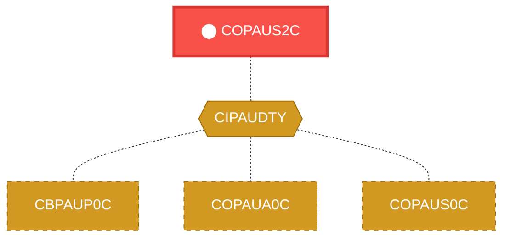
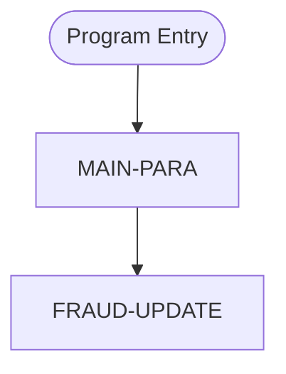

# Program: COPAUS2C


---

## Quick Reference

| Attribute | Value |
|-----------|-------|
| Program ID | `COPAUS2C` |
| Type | ONLINE |
| Lines | 245 |
| Source | [COPAUS2C.cbl](../carddemo/COPAUS2C.cbl#L1) |
| Paragraphs | 2 |
| Statements | 44 |
| Impact Risk | **MEDIUM** — 7 programs affected |

> **View Source:** [Open COPAUS2C.cbl](../carddemo/COPAUS2C.cbl#L1)

## Source Grounding Facts

| Data Item | Literal Value |
|-----------|---------------|
| `WS-PGMNAME` | `COPAUS2C` |
| `WS-ERR-FLG` | `N` |
| `WS-REPORT-FRAUD` | `F` |
| `WS-REMOVE-FRAUD` | `R` |
| `WS-FRD-UPDT-SUCCESS` | `S` |
| `WS-FRD-UPDT-FAILED` | `F` |


## Business Purpose

*Business purpose is not present in the extracted data. Run LLM enrichment to populate this section.*


## Dependency Context

> This section shows how **COPAUS2C** connects to the rest of the system — who calls it,
> what it calls, and what data it shares. If linked programs exist, they must appear here.

### Programs That Call COPAUS2C (Callers)

*No programs call COPAUS2C — this is likely a top-level entry point or CICS transaction starter.*

### Programs Called by COPAUS2C (Callees)

*COPAUS2C does not call any other programs (leaf program).*

### Shared Data (Copybooks & Files)

#### Shared Copybooks

| Copybook | Also Used By | # Co-Users |
|----------|-------------|------------|
| `CIPAUDTY` | CBPAUP0C, COPAUA0C, COPAUS0C, COPAUS1C, DBUNLDGS (+2 more) | 7 |


## Legacy Data Contracts

> These tables are derived from FILE SECTION records and COPY-expanded data declarations. They preserve the legacy field names, COBOL storage type, inferred modern type, and status-code values needed for Java DTOs, SQL schemas, API contracts, and migration mapping.


### Copybook Segment Layouts

#### `CIPAUDTY` as `DFHCOMMAREA`

| Legacy Field | Meaning | COBOL Type | Modern Type | Status / Format Notes |
|--------------|---------|------------|-------------|-----------------------|
| `PA-AUTHORIZATION-KEY` | Authorization Key | `GROUP` | `OBJECT` |  |
| `PA-AUTH-DATE-9C` | Authorization Date | `PIC S9(05) COMP-3` | `INTEGER` | Date-like field; verify YYDDD, YYMMDD, or ISO format before migration. |
| `PA-AUTH-TIME-9C` | Authorization Time | `PIC S9(09) COMP-3` | `INTEGER` |  |
| `PA-AUTH-ORIG-DATE` | Authorization Orig Date | `PIC X(06)` | `STRING(6)` |  |
| `PA-AUTH-ORIG-TIME` | Authorization Orig Time | `PIC X(06)` | `STRING(6)` |  |
| `PA-CARD-NUM` | Card Number | `PIC X(16)` | `STRING(16)` |  |
| `PA-AUTH-TYPE` | Authorization Type | `PIC X(04)` | `STRING(4)` |  |
| `PA-CARD-EXPIRY-DATE` | Card Expiry Date | `PIC X(04)` | `STRING(4)` |  |
| `PA-MESSAGE-TYPE` | Message Type | `PIC X(06)` | `STRING(6)` |  |
| `PA-MESSAGE-SOURCE` | Message Source | `PIC X(06)` | `STRING(6)` |  |
| `PA-AUTH-ID-CODE` | Authorization ID Code | `PIC X(06)` | `STRING(6)` |  |
| `PA-AUTH-RESP-CODE` | Authorization Response Code | `PIC X(02)` | `STRING(2)` |  |
| `PA-AUTH-RESP-REASON` | Authorization Response Reason | `PIC X(04)` | `STRING(4)` |  |
| `PA-PROCESSING-CODE` | Processing Code | `PIC 9(06)` | `INTEGER` |  |
| `PA-TRANSACTION-AMT` | Transaction Amount | `PIC S9(10)V99 COMP-3` | `DECIMAL(12,2)` |  |
| `PA-APPROVED-AMT` | Approved Amount | `PIC S9(10)V99 COMP-3` | `DECIMAL(12,2)` |  |
| `PA-MERCHANT-CATAGORY-CODE` | Merchant Catagory Code | `PIC X(04)` | `STRING(4)` |  |
| `PA-ACQR-COUNTRY-CODE` | Acqr Country Code | `PIC X(03)` | `STRING(3)` |  |
| `PA-POS-ENTRY-MODE` | Pos Entry Mode | `PIC 9(02)` | `INTEGER` |  |
| `PA-MERCHANT-ID` | Merchant ID | `PIC X(15)` | `STRING(15)` |  |
| `PA-MERCHANT-NAME` | Merchant Name | `PIC X(22)` | `STRING(22)` |  |
| `PA-MERCHANT-CITY` | Merchant City | `PIC X(13)` | `STRING(13)` |  |
| `PA-MERCHANT-STATE` | Merchant State | `PIC X(02)` | `STRING(2)` |  |
| `PA-MERCHANT-ZIP` | Merchant Zip | `PIC X(09)` | `STRING(9)` |  |
| `PA-TRANSACTION-ID` | Transaction ID | `PIC X(15)` | `STRING(15)` |  |
| `PA-MATCH-STATUS` | Match Status | `PIC X(01)` | `STRING(1)` |  |
| `PA-AUTH-FRAUD` | Authorization Fraud | `PIC X(01)` | `STRING(1)` |  |
| `PA-FRAUD-RPT-DATE` | Fraud Rpt Date | `PIC X(08)` | `STRING(8)` | Date-like field; verify YYDDD, YYMMDD, or ISO format before migration. |
| `FILLER` | Filler | `PIC X(17)` | `STRING(17)` |  |


### Data Movement And Key Mapping

| Line | Source | Target | Meaning |
|------|--------|--------|---------|
| 101 | `WS-CUR-DATE` | `PA-FRAUD-RPT-DATE` | WS-CUR-DATE populates PA-FRAUD-RPT-DATE |
| 103 | `PA-AUTH-ORIG-DATE(1:2)` | `WS-AUTH-YY` | PA-AUTH-ORIG-DATE(1:2) populates WS-AUTH-YY |
| 104 | `PA-AUTH-ORIG-DATE(3:2)` | `WS-AUTH-MM` | PA-AUTH-ORIG-DATE(3:2) populates WS-AUTH-MM |
| 105 | `PA-AUTH-ORIG-DATE(5:2)` | `WS-AUTH-DD` | PA-AUTH-ORIG-DATE(5:2) populates WS-AUTH-DD |
| 108 | `WS-AUTH-TIME-AN(1:2)` | `WS-AUTH-HH` | WS-AUTH-TIME-AN(1:2) populates WS-AUTH-HH |
| 109 | `WS-AUTH-TIME-AN(3:2)` | `WS-AUTH-MI` | WS-AUTH-TIME-AN(3:2) populates WS-AUTH-MI |
| 110 | `WS-AUTH-TIME-AN(5:2)` | `WS-AUTH-SS` | WS-AUTH-TIME-AN(5:2) populates WS-AUTH-SS |
| 111 | `WS-AUTH-TIME-AN(7:3)` | `WS-AUTH-SSS` | WS-AUTH-TIME-AN(7:3) populates WS-AUTH-SSS |
| 114 | `WS-AUTH-TS` | `AUTH-TS` | WS-AUTH-TS populates AUTH-TS |
| 115 | `PA-AUTH-TYPE` | `AUTH-TYPE` | PA-AUTH-TYPE populates AUTH-TYPE |
| 116 | `PA-CARD-EXPIRY-DATE` | `CARD-EXPIRY-DATE` | PA-CARD-EXPIRY-DATE populates CARD-EXPIRY-DATE |
| 117 | `PA-MESSAGE-TYPE` | `MESSAGE-TYPE` | PA-MESSAGE-TYPE populates MESSAGE-TYPE |
| 118 | `PA-MESSAGE-SOURCE` | `MESSAGE-SOURCE` | PA-MESSAGE-SOURCE populates MESSAGE-SOURCE |
| 119 | `PA-AUTH-ID-CODE` | `AUTH-ID-CODE` | PA-AUTH-ID-CODE populates AUTH-ID-CODE |
| 120 | `PA-AUTH-RESP-CODE` | `AUTH-RESP-CODE` | PA-AUTH-RESP-CODE populates AUTH-RESP-CODE |
| 121 | `PA-AUTH-RESP-REASON` | `AUTH-RESP-REASON` | PA-AUTH-RESP-REASON populates AUTH-RESP-REASON |
| 123 | `PA-TRANSACTION-AMT` | `TRANSACTION-AMT` | PA-TRANSACTION-AMT populates TRANSACTION-AMT |
| 124 | `PA-APPROVED-AMT` | `APPROVED-AMT` | PA-APPROVED-AMT populates APPROVED-AMT |
| 136 | `PA-MATCH-STATUS` | `MATCH-STATUS` | PA-MATCH-STATUS populates MATCH-STATUS |
| 137 | `WS-FRD-ACTION` | `AUTH-FRAUD` | WS-FRD-ACTION populates AUTH-FRAUD |
| 138 | `WS-ACCT-ID` | `ACCT-ID` | WS-ACCT-ID populates ACCT-ID |
| 139 | `WS-CUST-ID` | `CUST-ID` | WS-CUST-ID populates CUST-ID |


---

## Dependency Graph



> **Legend:** 🔴 Target program · 🔵 Direct callers · 🟢 Direct callees · 🟡 Copybook-coupled · ⚫ Transitive (indirect)

---

## Impact Ripple View

> **If you change COPAUS2C, what else could break?**

| Impact Metric | Count |
|--------------|-------|
| Direct Callers | 0 |
| Transitive Callers (callers of callers) | 0 |
| Direct Callees | 0 |
| Transitive Callees | 0 |
| Copybook-Coupled Programs | 7 |
| **Total Impact** | **7** |
| **Risk Rating** | **MEDIUM** |


**Programs affected via shared copybooks:**
- `CBPAUP0C`
- `COPAUA0C`
- `COPAUS0C`
- `COPAUS1C`
- `DBUNLDGS`
- `PAUDBLOD`
- `PAUDBUNL`

---

## Statement Profile

| Statement Type | Count |
|---------------|-------|
| MOVE | 34 |
| IF | 5 |
| EXEC_CICS | 2 |
| EXECSQL | 2 |
| COMPUTE | 1 |

## Control Flow



## Paragraphs

### MAIN-PARA

| | |
|---|---|
| **Paragraph** | `MAIN-PARA` |
| **Lines** | 89 - 220 |
| **View Code** | [Jump to Line 89](../carddemo/COPAUS2C.cbl#L89) |


### FRAUD-UPDATE

| | |
|---|---|
| **Paragraph** | `FRAUD-UPDATE` |
| **Lines** | 221 - 244 |
| **View Code** | [Jump to Line 221](../carddemo/COPAUS2C.cbl#L221) |


## Database Operations (EXEC SQL / DB2)

This program uses the following SQL statements:

| Command | Table / Cursor | Paragraph | Line |
|---------|----------------|-----------|------|
| `INCLUDE` | None | None | 65 |
| `INCLUDE` | None | None | 68 |
| `INSERT` | CARDDEMO.AUTHFRDS | MAIN-PARA | 141 |
| `UPDATE` | CARDDEMO.AUTHFRDS | FRAUD-UPDATE | 222 |

**Summary:** 4 SQL statement(s) — INCLUDE (2), INSERT (1), UPDATE (1)


## Copybook Field Dictionaries

The following copybooks are included by this program. Each entry shows the actual fields
extracted from the copybook source file (`.cpy`).

### Copybook `CIPAUDTY`

| Level | Field | PIC | USAGE | Parent | Notes |
|-------|-------|-----|-------|--------|-------|
| `05` | `PA-AUTHORIZATION-KEY` | `None` | None | None |  |
| `10` | `PA-AUTH-DATE-9C` | `S9(05)` | COMP | PA-AUTHORIZATION-KEY |  |
| `10` | `PA-AUTH-TIME-9C` | `S9(09)` | COMP | PA-AUTHORIZATION-KEY |  |
| `05` | `PA-AUTH-ORIG-DATE` | `X(06)` | None | None |  |
| `05` | `PA-AUTH-ORIG-TIME` | `X(06)` | None | None |  |
| `05` | `PA-CARD-NUM` | `X(16)` | None | None |  |
| `05` | `PA-AUTH-TYPE` | `X(04)` | None | None |  |
| `05` | `PA-CARD-EXPIRY-DATE` | `X(04)` | None | None |  |
| `05` | `PA-MESSAGE-TYPE` | `X(06)` | None | None |  |
| `05` | `PA-MESSAGE-SOURCE` | `X(06)` | None | None |  |
| `05` | `PA-AUTH-ID-CODE` | `X(06)` | None | None |  |
| `05` | `PA-AUTH-RESP-CODE` | `X(02)` | None | None |  |
| `88` | `PA-AUTH-APPROVED` | `None` | None | None |  |
| `05` | `PA-AUTH-RESP-REASON` | `X(04)` | None | None |  |
| `05` | `PA-PROCESSING-CODE` | `9(06)` | None | None |  |
| `05` | `PA-TRANSACTION-AMT` | `S9(10)V99` | COMP | None |  |
| `05` | `PA-APPROVED-AMT` | `S9(10)V99` | COMP | None |  |
| `05` | `PA-MERCHANT-CATAGORY-CODE` | `X(04)` | None | None |  |
| `05` | `PA-ACQR-COUNTRY-CODE` | `X(03)` | None | None |  |
| `05` | `PA-POS-ENTRY-MODE` | `9(02)` | None | None |  |
| `05` | `PA-MERCHANT-ID` | `X(15)` | None | None |  |
| `05` | `PA-MERCHANT-NAME` | `X(22)` | None | None |  |
| `05` | `PA-MERCHANT-CITY` | `X(13)` | None | None |  |
| `05` | `PA-MERCHANT-STATE` | `X(02)` | None | None |  |
| `05` | `PA-MERCHANT-ZIP` | `X(09)` | None | None |  |
| `05` | `PA-TRANSACTION-ID` | `X(15)` | None | None |  |
| `05` | `PA-MATCH-STATUS` | `X(01)` | None | None |  |
| `88` | `PA-MATCH-PENDING` | `None` | None | None |  |
| `88` | `PA-MATCH-AUTH-DECLINED` | `None` | None | None |  |
| `88` | `PA-MATCH-PENDING-EXPIRED` | `None` | None | None |  |
| `88` | `PA-MATCHED-WITH-TRAN` | `None` | None | None |  |
| `05` | `PA-AUTH-FRAUD` | `X(01)` | None | None |  |
| `88` | `PA-FRAUD-CONFIRMED` | `None` | None | None |  |
| `88` | `PA-FRAUD-REMOVED` | `None` | None | None |  |
| `05` | `PA-FRAUD-RPT-DATE` | `X(08)` | None | None |  |


## Data Lineage (MOVE Flow)

The following MOVE statements were extracted from the source. Each row is a `source → destination`
flow that the migration team can use to trace how data is reshaped and routed.

| Source | Destination | Paragraph | Line |
|--------|-------------|-----------|------|
| `WS-CUR-DATE` | `PA-FRAUD-RPT-DATE` | MAIN-PARA | 101 |
| `PA-AUTH-ORIG-DATE(1:2)` | `WS-AUTH-YY` | MAIN-PARA | 103 |
| `PA-AUTH-ORIG-DATE(3:2)` | `WS-AUTH-MM` | MAIN-PARA | 104 |
| `PA-AUTH-ORIG-DATE(5:2)` | `WS-AUTH-DD` | MAIN-PARA | 105 |
| `WS-AUTH-TIME-AN(1:2)` | `WS-AUTH-HH` | MAIN-PARA | 108 |
| `WS-AUTH-TIME-AN(3:2)` | `WS-AUTH-MI` | MAIN-PARA | 109 |
| `WS-AUTH-TIME-AN(5:2)` | `WS-AUTH-SS` | MAIN-PARA | 110 |
| `WS-AUTH-TIME-AN(7:3)` | `WS-AUTH-SSS` | MAIN-PARA | 111 |
| `PA-CARD-NUM` | `CARD-NUM` | MAIN-PARA | 113 |
| `WS-AUTH-TS` | `AUTH-TS` | MAIN-PARA | 114 |
| `PA-AUTH-TYPE` | `AUTH-TYPE` | MAIN-PARA | 115 |
| `PA-CARD-EXPIRY-DATE` | `CARD-EXPIRY-DATE` | MAIN-PARA | 116 |
| `PA-MESSAGE-TYPE` | `MESSAGE-TYPE` | MAIN-PARA | 117 |
| `PA-MESSAGE-SOURCE` | `MESSAGE-SOURCE` | MAIN-PARA | 118 |
| `PA-AUTH-ID-CODE` | `AUTH-ID-CODE` | MAIN-PARA | 119 |
| `PA-AUTH-RESP-CODE` | `AUTH-RESP-CODE` | MAIN-PARA | 120 |
| `PA-AUTH-RESP-REASON` | `AUTH-RESP-REASON` | MAIN-PARA | 121 |
| `PA-PROCESSING-CODE` | `PROCESSING-CODE` | MAIN-PARA | 122 |
| `PA-TRANSACTION-AMT` | `TRANSACTION-AMT` | MAIN-PARA | 123 |
| `PA-APPROVED-AMT` | `APPROVED-AMT` | MAIN-PARA | 124 |
| `PA-ACQR-COUNTRY-CODE` | `ACQR-COUNTRY-CODE` | MAIN-PARA | 127 |
| `PA-POS-ENTRY-MODE` | `POS-ENTRY-MODE` | MAIN-PARA | 128 |
| `PA-MERCHANT-ID` | `MERCHANT-ID` | MAIN-PARA | 129 |
| `PA-MERCHANT-NAME` | `MERCHANT-NAME-TEXT` | MAIN-PARA | 131 |
| `PA-MERCHANT-CITY` | `MERCHANT-CITY` | MAIN-PARA | 132 |
| `PA-MERCHANT-STATE` | `MERCHANT-STATE` | MAIN-PARA | 133 |
| `PA-MERCHANT-ZIP` | `MERCHANT-ZIP` | MAIN-PARA | 134 |
| `PA-TRANSACTION-ID` | `TRANSACTION-ID` | MAIN-PARA | 135 |
| `PA-MATCH-STATUS` | `MATCH-STATUS` | MAIN-PARA | 136 |
| `WS-FRD-ACTION` | `AUTH-FRAUD` | MAIN-PARA | 137 |
| `WS-ACCT-ID` | `ACCT-ID` | MAIN-PARA | 138 |
| `WS-CUST-ID` | `CUST-ID` | MAIN-PARA | 139 |
| `'ADD SUCCESS'` | `WS-FRD-ACT-MSG` | MAIN-PARA | 201 |
| `SQLCODE` | `WS-SQLCODE` | MAIN-PARA | 208 |
| `SQLSTATE` | `WS-SQLSTATE` | MAIN-PARA | 209 |
| `'UPDT SUCCESS'` | `WS-FRD-ACT-MSG` | FRAUD-UPDATE | 232 |
| `SQLCODE` | `WS-SQLCODE` | FRAUD-UPDATE | 236 |
| `SQLSTATE` | `WS-SQLSTATE` | FRAUD-UPDATE | 237 |


## Known Issues & Code Anomalies

Static analysis flagged the following items in this program. Migration teams should
review each one before re-implementing in a modern stack.

| Severity | Category | Title | Paragraph | Line |
|----------|----------|-------|-----------|------|
| **NOTICE** | DEAD_CODE | Variable `WS-PGMNAME` is declared but never referenced | None | 33 |
| **NOTICE** | DEAD_CODE | Variable `WS-LENGTH` is declared but never referenced | None | 34 |
| **NOTICE** | DEAD_CODE | Variable `WS-ERR-FLG` is declared but never referenced | None | 52 |
| **NOTICE** | DEAD_CODE | Variable `WS-FRD-UPDATE-STATUS` is declared but never referenced | None | 83 |

### NOTICE — Variable `WS-PGMNAME` is declared but never referenced

`WS-PGMNAME` is declared at line 33 but no other statement reads or writes it. Likely a leftover from prior refactoring or an incomplete feature.
**Source excerpt** (line 33):
```cobol
05 WS-PGMNAME                 PIC X(08) VALUE 'COPAUS2C'.
```

**Recommendation:** Remove the declaration or wire it into the logic that was originally intended.
---
### NOTICE — Variable `WS-LENGTH` is declared but never referenced

`WS-LENGTH` is declared at line 34 but no other statement reads or writes it. Likely a leftover from prior refactoring or an incomplete feature.
**Source excerpt** (line 34):
```cobol
05 WS-LENGTH                  PIC S9(4) COMP VALUE ZERO.
```

**Recommendation:** Remove the declaration or wire it into the logic that was originally intended.
---
### NOTICE — Variable `WS-ERR-FLG` is declared but never referenced

`WS-ERR-FLG` is declared at line 52 but no other statement reads or writes it. Likely a leftover from prior refactoring or an incomplete feature.
**Source excerpt** (line 52):
```cobol
05 WS-ERR-FLG                 PIC X(01) VALUE 'N'.
```

**Recommendation:** Remove the declaration or wire it into the logic that was originally intended.
---
### NOTICE — Variable `WS-FRD-UPDATE-STATUS` is declared but never referenced

`WS-FRD-UPDATE-STATUS` is declared at line 83 but no other statement reads or writes it. Likely a leftover from prior refactoring or an incomplete feature.
**Source excerpt** (line 83):
```cobol
05 WS-FRD-UPDATE-STATUS       PIC X(01).
```

**Recommendation:** Remove the declaration or wire it into the logic that was originally intended.
---


## CICS Commands

This program uses the following EXEC CICS commands:

| Command | Paragraph | Line | Details |
|---------|-----------|------|---------|
| `ASKTIME` | MAIN-PARA | 91 | {"details": {}} |
| `FORMATTIME` | MAIN-PARA | 95 | {"details": {}} |
| `RETURN` | MAIN-PARA | 218 | {"details": {}} |

**Summary:** 3 CICS command(s) — ASKTIME (1), FORMATTIME (1), RETURN (1)

## CICS Screen Workflow Notes

These notes are derived directly from the COBOL source and BMS map usage. They are intended
to prevent migration errors where a PF key label is mistaken for the full transaction flow.

### ERR-FLG is reset at the start of each run

`ERR-FLG` starts each invocation on the off path via `SET ERR-FLG-OFF TO TRUE`. Validation and file-error branches set or test `ERR-FLG-ON` to stop later processing.

Evidence:
- L53: `88 ERR-FLG-ON                        VALUE 'Y'.`


## Modernization Review Findings

These are source-derived review notes that should be checked before translating this program into Java, Spring Boot, SQL, APIs, or batch jobs.

| Finding | Why It Matters |
|---------|----------------|
| Template/debug fields require usage review | Fields such as `PA-CARD-EXPIRY-DATE` look like debug, checkpoint, or abandoned template state. Verify references before designing modern DTOs or database columns. |
| Nested IF blocks need compiler-accurate validation | Nested conditional logic was detected. During migration, validate scope with the original compiler rules and explicit `END-IF`/period termination before translating to Java or SQL. |


## Business Rules

- **Update Fraud Indicator** `BR-001`  
  Under certain conditions, flag a transaction as potentially fraudulent.  
  [View Rule Details](../business-rules/BR-001.md)
- **Flag Potentially Fraudulent Activity** `BR-002`  
  If a specific, but currently unknown, condition is met, then a fraud indicator is updated to reflect a potential fraudulent activity.  
  [View Rule Details](../business-rules/BR-002.md)

## Key Data Items

| Name | Level | Picture | Section | Business Name |
|------|-------|---------|---------|---------------|
| `WS-VARIABLES` | 1 | `None` | WORKING-STORAGE | None |
| `WS-PGMNAME` | 5 | `X(08)` | WORKING-STORAGE | None |
| `WS-LENGTH` | 5 | `S9(4)` | WORKING-STORAGE | None |
| `WS-AUTH-TIME` | 5 | `9(09)` | WORKING-STORAGE | None |
| `WS-AUTH-TIME-AN` | 5 | `X(09)` | WORKING-STORAGE | None |
| `WS-AUTH-TS` | 5 | `None` | WORKING-STORAGE | None |
| `WS-AUTH-YY` | 10 | `X(02)` | WORKING-STORAGE | None |
| `FILLER` | 10 | `X(01)` | WORKING-STORAGE | None |
| `WS-AUTH-MM` | 10 | `X(02)` | WORKING-STORAGE | None |
| `FILLER` | 10 | `X(01)` | WORKING-STORAGE | None |
| `WS-AUTH-DD` | 10 | `X(02)` | WORKING-STORAGE | None |
| `FILLER` | 10 | `X(01)` | WORKING-STORAGE | None |
| `WS-AUTH-HH` | 10 | `X(02)` | WORKING-STORAGE | None |
| `FILLER` | 10 | `X(01)` | WORKING-STORAGE | None |
| `WS-AUTH-MI` | 10 | `X(02)` | WORKING-STORAGE | None |
| `FILLER` | 10 | `X(01)` | WORKING-STORAGE | None |
| `WS-AUTH-SS` | 10 | `X(02)` | WORKING-STORAGE | None |
| `WS-AUTH-SSS` | 10 | `X(03)` | WORKING-STORAGE | None |
| `FILLER` | 10 | `X(03)` | WORKING-STORAGE | None |
| `WS-ERR-FLG` | 5 | `X(01)` | WORKING-STORAGE | None |
| `ERR-FLG-ON` | 88 | `None` | WORKING-STORAGE | None |
| `ERR-FLG-OF` | 88 | `None` | WORKING-STORAGE | None |
| `WS-SQLCODE` | 5 | `+9(06)` | WORKING-STORAGE | None |
| `WS-SQLSTATE` | 5 | `+9(09)` | WORKING-STORAGE | None |
| `WS-ABS-TIME` | 5 | `S9(15)` | WORKING-STORAGE | None |
| `WS-CUR-DATE` | 5 | `X(08)` | WORKING-STORAGE | None |
| `DFHCOMMAREA` | 1 | `None` | LINKAGE | None |
| `WS-ACCT-ID` | 2 | `9(11)` | LINKAGE | None |
| `WS-CUST-ID` | 2 | `9(9)` | LINKAGE | None |
| `WS-FRAUD-AUTH-RECORD` | 2 | `None` | LINKAGE | None |
| `PA-AUTHORIZATION-KEY` | 5 | `None` | LINKAGE | None |
| `PA-AUTH-DATE-9C` | 10 | `S9(05)` | LINKAGE | None |
| `PA-AUTH-TIME-9C` | 10 | `S9(09)` | LINKAGE | None |
| `PA-AUTH-ORIG-DATE` | 5 | `X(06)` | LINKAGE | None |
| `PA-AUTH-ORIG-TIME` | 5 | `X(06)` | LINKAGE | None |
| `PA-CARD-NUM` | 5 | `X(16)` | LINKAGE | None |
| `PA-AUTH-TYPE` | 5 | `X(04)` | LINKAGE | None |
| `PA-CARD-EXPIRY-DATE` | 5 | `X(04)` | LINKAGE | None |
| `PA-MESSAGE-TYPE` | 5 | `X(06)` | LINKAGE | None |
| `PA-MESSAGE-SOURCE` | 5 | `X(06)` | LINKAGE | None |

*Showing 40 of 74 data items. See [Data Dictionary](../data-dictionary.md).*

---

*Generated 2026-05-02 17:07*