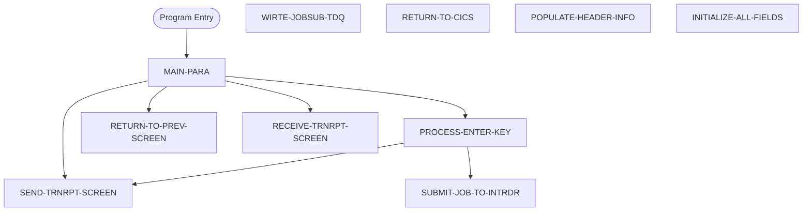

# Program: CORPT00C


---

## Quick Reference

| Attribute | Value |
|-----------|-------|
| Program ID | `CORPT00C` |
| Type | ONLINE |
| Lines | 650 |
| Source | [CORPT00C.cbl](../carddemo/CORPT00C.cbl#L1) |
| Paragraphs | 10 |
| Statements | 59 |
| Impact Risk | **HIGH** — 26 programs affected |

> **View Source:** [Open CORPT00C.cbl](../carddemo/CORPT00C.cbl#L1)

## Source Grounding Facts

| Data Item | Literal Value |
|-----------|---------------|
| `WS-PGMNAME` | `CORPT00C` |
| `WS-TRANID` | `CR00` |
| `WS-TRANSACT-FILE` | `TRANSACT` |
| `WS-ERR-FLG` | `N` |
| `WS-TRANSACT-EOF` | `N` |
| `WS-SEND-ERASE-FLG` | `Y` |
| `WS-END-LOOP` | `N` |
| `WS-DATE-FORMAT` | `YYYY-MM-DD` |
| `WS-TRAN-DATE` | `00/00/00` |


## Business Purpose

*Business purpose is not present in the extracted data. Run LLM enrichment to populate this section.*


## Dependency Context

> This section shows how **CORPT00C** connects to the rest of the system — who calls it,
> what it calls, and what data it shares. If linked programs exist, they must appear here.

### Programs That Call CORPT00C (Callers)

*No programs call CORPT00C — this is likely a top-level entry point or CICS transaction starter.*

### Programs Called by CORPT00C (Callees)

*CORPT00C does not call any other programs (leaf program).*

### Shared Data (Copybooks & Files)

#### Shared Copybooks

| Copybook | Also Used By | # Co-Users |
|----------|-------------|------------|
| `COCOM01Y` | COACTUPC, COACTVWC, COADM01C, COBIL00C, COCRDLIC (+15 more) | 20 |
| `CORPT00` |  | 0 |
| `COTTL01Y` | COACTUPC, COACTVWC, COADM01C, COBIL00C, COCRDLIC (+15 more) | 20 |
| `CSDAT01Y` | COACTUPC, COACTVWC, COADM01C, COBIL00C, COCRDLIC (+15 more) | 20 |
| `CSMSG01Y` | COACTUPC, COACTVWC, COADM01C, COBIL00C, COCRDLIC (+15 more) | 20 |
| `CVTRA05Y` | CBACT04C, CBEXPORT, CBIMPORT, CBTRN01C, CBTRN02C (+5 more) | 10 |
| `DFHAID` | COACTUPC, COACTVWC, COADM01C, COBIL00C, COCRDLIC (+15 more) | 20 |
| `DFHBMSCA` | COACTUPC, COACTVWC, COADM01C, COBIL00C, COCRDLIC (+15 more) | 20 |


## Legacy Data Contracts

> These tables are derived from FILE SECTION records and COPY-expanded data declarations. They preserve the legacy field names, COBOL storage type, inferred modern type, and status-code values needed for Java DTOs, SQL schemas, API contracts, and migration mapping.


### Copybook Segment Layouts

#### `COCOM01Y` as `CARDDEMO-COMMAREA`

| Legacy Field | Meaning | COBOL Type | Modern Type | Status / Format Notes |
|--------------|---------|------------|-------------|-----------------------|
| `CARDDEMO-COMMAREA` | Carddemo Commarea | `GROUP` | `OBJECT` |  |
| `CDEMO-GENERAL-INFO` | General Info | `GROUP` | `OBJECT` |  |
| `CDEMO-FROM-TRANID` | From Tranid | `PIC X(04)` | `STRING(4)` |  |
| `CDEMO-FROM-PROGRAM` | From Program | `PIC X(08)` | `STRING(8)` |  |
| `CDEMO-TO-TRANID` | To Tranid | `PIC X(04)` | `STRING(4)` |  |
| `CDEMO-TO-PROGRAM` | To Program | `PIC X(08)` | `STRING(8)` |  |
| `CDEMO-USER-ID` | User ID | `PIC X(08)` | `STRING(8)` |  |
| `CDEMO-USER-TYPE` | User Type | `PIC X(01)` | `STRING(1)` |  |
| `CDEMO-PGM-CONTEXT` | Pgm Context | `PIC 9(01)` | `INTEGER` |  |
| `CDEMO-CUSTOMER-INFO` | Customer Info | `GROUP` | `OBJECT` |  |
| `CDEMO-CUST-ID` | Customer ID | `PIC 9(09)` | `INTEGER` |  |
| `CDEMO-CUST-FNAME` | Customer Fname | `PIC X(25)` | `STRING(25)` |  |
| `CDEMO-CUST-MNAME` | Customer Mname | `PIC X(25)` | `STRING(25)` |  |
| `CDEMO-CUST-LNAME` | Customer Lname | `PIC X(25)` | `STRING(25)` |  |
| `CDEMO-ACCOUNT-INFO` | Account Info | `GROUP` | `OBJECT` |  |
| `CDEMO-ACCT-ID` | Account ID | `PIC 9(11)` | `BIGINT` |  |
| `CDEMO-ACCT-STATUS` | Account Status | `PIC X(01)` | `STRING(1)` |  |
| `CDEMO-CARD-INFO` | Card Info | `GROUP` | `OBJECT` |  |
| `CDEMO-CARD-NUM` | Card Number | `PIC 9(16)` | `BIGINT` |  |
| `CDEMO-MORE-INFO` | More Info | `GROUP` | `OBJECT` |  |
| `CDEMO-LAST-MAP` | Last Map | `PIC X(7)` | `STRING(7)` |  |
| `CDEMO-LAST-MAPSET` | Last Mapset | `PIC X(7)` | `STRING(7)` |  |

#### `CORPT00` as `CORPT0AI`

| Legacy Field | Meaning | COBOL Type | Modern Type | Status / Format Notes |
|--------------|---------|------------|-------------|-----------------------|
| `CORPT0AI` | Corpt0Ai | `GROUP` | `OBJECT` |  |
| `CORPT0AO` | Corpt0Ao | `GROUP` | `OBJECT` |  |

#### `COTTL01Y` as `CCDA-SCREEN-TITLE`

| Legacy Field | Meaning | COBOL Type | Modern Type | Status / Format Notes |
|--------------|---------|------------|-------------|-----------------------|
| `CCDA-SCREEN-TITLE` | Ccda Screen Title | `GROUP` | `OBJECT` |  |
| `CCDA-TITLE01` | Ccda Title01 | `PIC X(40)` | `STRING(40)` |  |
| `CCDA-TITLE02` | Ccda Title02 | `PIC X(40)` | `STRING(40)` |  |
| `CCDA-THANK-YOU` | Ccda Thank You | `PIC X(40)` | `STRING(40)` |  |

#### `CSDAT01Y` as `WS-DATE-TIME`

| Legacy Field | Meaning | COBOL Type | Modern Type | Status / Format Notes |
|--------------|---------|------------|-------------|-----------------------|
| `WS-DATE-TIME` | Date Time | `GROUP` | `OBJECT` |  |
| `WS-CURDATE-DATA` | Curdate Data | `GROUP` | `OBJECT` |  |
| `WS-CURDATE` | Curdate | `GROUP` | `OBJECT` |  |
| `WS-CURDATE-YEAR` | Curdate Year | `PIC 9(04)` | `INTEGER` |  |
| `WS-CURDATE-MONTH` | Curdate Month | `PIC 9(02)` | `INTEGER` |  |
| `WS-CURDATE-DAY` | Curdate Day | `PIC 9(02)` | `INTEGER` |  |
| `WS-CURDATE-N` | Curdate N | `PIC 9(08)` | `INTEGER` |  |
| `WS-CURTIME` | Curtime | `GROUP` | `OBJECT` |  |
| `WS-CURTIME-HOURS` | Curtime Hours | `PIC 9(02)` | `INTEGER` |  |
| `WS-CURTIME-MINUTE` | Curtime Minute | `PIC 9(02)` | `INTEGER` |  |
| `WS-CURTIME-SECOND` | Curtime Second | `PIC 9(02)` | `INTEGER` |  |
| `WS-CURTIME-MILSEC` | Curtime Milsec | `PIC 9(02)` | `INTEGER` |  |
| `WS-CURTIME-N` | Curtime N | `PIC 9(08)` | `INTEGER` |  |
| `WS-CURDATE-MM-DD-YY` | Curdate Mm Dd Yy | `GROUP` | `OBJECT` |  |
| `WS-CURDATE-MM` | Curdate Mm | `PIC 9(02)` | `INTEGER` |  |
| `FILLER` | Filler | `PIC X(01)` | `STRING(1)` |  |
| `WS-CURDATE-DD` | Curdate Dd | `PIC 9(02)` | `INTEGER` |  |
| `FILLER` | Filler | `PIC X(01)` | `STRING(1)` |  |
| `WS-CURDATE-YY` | Curdate Yy | `PIC 9(02)` | `INTEGER` |  |
| `WS-CURTIME-HH-MM-SS` | Curtime Hh Mm Ss | `GROUP` | `OBJECT` |  |
| `WS-CURTIME-HH` | Curtime Hh | `PIC 9(02)` | `INTEGER` |  |
| `FILLER` | Filler | `PIC X(01)` | `STRING(1)` |  |
| `WS-CURTIME-MM` | Curtime Mm | `PIC 9(02)` | `INTEGER` |  |
| `FILLER` | Filler | `PIC X(01)` | `STRING(1)` |  |
| `WS-CURTIME-SS` | Curtime Ss | `PIC 9(02)` | `INTEGER` |  |
| `WS-TIMESTAMP` | Timestamp | `GROUP` | `OBJECT` |  |
| `WS-TIMESTAMP-DT-YYYY` | Timestamp Date Yyyy | `PIC 9(04)` | `INTEGER` |  |
| `FILLER` | Filler | `PIC X(01)` | `STRING(1)` |  |
| `WS-TIMESTAMP-DT-MM` | Timestamp Date Mm | `PIC 9(02)` | `INTEGER` |  |
| `FILLER` | Filler | `PIC X(01)` | `STRING(1)` |  |
| `WS-TIMESTAMP-DT-DD` | Timestamp Date Dd | `PIC 9(02)` | `INTEGER` |  |
| `FILLER` | Filler | `PIC X(01)` | `STRING(1)` |  |
| `WS-TIMESTAMP-TM-HH` | Timestamp Tm Hh | `PIC 9(02)` | `INTEGER` |  |
| `FILLER` | Filler | `PIC X(01)` | `STRING(1)` |  |
| `WS-TIMESTAMP-TM-MM` | Timestamp Tm Mm | `PIC 9(02)` | `INTEGER` |  |
| `FILLER` | Filler | `PIC X(01)` | `STRING(1)` |  |
| `WS-TIMESTAMP-TM-SS` | Timestamp Tm Ss | `PIC 9(02)` | `INTEGER` |  |
| `FILLER` | Filler | `PIC X(01)` | `STRING(1)` |  |
| `WS-TIMESTAMP-TM-MS6` | Timestamp Tm Ms6 | `PIC 9(06)` | `INTEGER` |  |

#### `CSMSG01Y` as `CCDA-COMMON-MESSAGES`

| Legacy Field | Meaning | COBOL Type | Modern Type | Status / Format Notes |
|--------------|---------|------------|-------------|-----------------------|
| `CCDA-COMMON-MESSAGES` | Ccda Common Messages | `GROUP` | `OBJECT` |  |
| `CCDA-MSG-THANK-YOU` | Ccda Msg Thank You | `PIC X(50)` | `STRING(50)` |  |
| `CCDA-MSG-INVALID-KEY` | Ccda Msg Invalid Key | `PIC X(50)` | `STRING(50)` |  |

#### `CVTRA05Y` as `TRAN-RECORD`

| Legacy Field | Meaning | COBOL Type | Modern Type | Status / Format Notes |
|--------------|---------|------------|-------------|-----------------------|
| `TRAN-RECORD` | Tran Record | `GROUP` | `OBJECT` |  |
| `TRAN-ID` | Tran ID | `PIC X(16)` | `STRING(16)` |  |
| `TRAN-TYPE-CD` | Tran Type Cd | `PIC X(02)` | `STRING(2)` |  |
| `TRAN-CAT-CD` | Tran Cat Cd | `PIC 9(04)` | `INTEGER` |  |
| `TRAN-SOURCE` | Tran Source | `PIC X(10)` | `STRING(10)` |  |
| `TRAN-DESC` | Tran Desc | `PIC X(100)` | `STRING(100)` |  |
| `TRAN-AMT` | Tran Amount | `PIC S9(09)V99` | `DECIMAL(11,2)` |  |
| `TRAN-MERCHANT-ID` | Tran Merchant ID | `PIC 9(09)` | `INTEGER` |  |
| `TRAN-MERCHANT-NAME` | Tran Merchant Name | `PIC X(50)` | `STRING(50)` |  |
| `TRAN-MERCHANT-CITY` | Tran Merchant City | `PIC X(50)` | `STRING(50)` |  |
| `TRAN-MERCHANT-ZIP` | Tran Merchant Zip | `PIC X(10)` | `STRING(10)` |  |
| `TRAN-CARD-NUM` | Tran Card Number | `PIC X(16)` | `STRING(16)` |  |
| `TRAN-ORIG-TS` | Tran Orig Ts | `PIC X(26)` | `STRING(26)` |  |
| `TRAN-PROC-TS` | Tran Proc Ts | `PIC X(26)` | `STRING(26)` |  |
| `FILLER` | Filler | `PIC X(20)` | `STRING(20)` |  |

#### `DFHAID` as `DFHAID`

| Legacy Field | Meaning | COBOL Type | Modern Type | Status / Format Notes |
|--------------|---------|------------|-------------|-----------------------|
| `DFHAID` | Dfhaid | `GROUP` | `OBJECT` |  |

#### `DFHBMSCA` as `DFHBMSCA`

| Legacy Field | Meaning | COBOL Type | Modern Type | Status / Format Notes |
|--------------|---------|------------|-------------|-----------------------|
| `DFHBMSCA` | Dfhbmsca | `GROUP` | `OBJECT` |  |


### Data Movement And Key Mapping

| Line | Source | Target | Meaning |
|------|--------|--------|---------|
| 169 | `SPACES` | `WS-MESSAGE` | SPACES populates WS-MESSAGE |
| 193 | `CCDA-MSG-INVALID-KEY` | `WS-MESSAGE` | CCDA-MSG-INVALID-KEY populates WS-MESSAGE |
| 215 | `FUNCTION CURRENT-DATE` | `WS-CURDATE-DATA` | FUNCTION CURRENT-DATE populates WS-CURDATE-DATA |
| 217 | `WS-CURDATE-YEAR` | `WS-START-DATE-YYYY` | WS-CURDATE-YEAR populates WS-START-DATE-YYYY |
| 218 | `WS-CURDATE-MONTH` | `WS-START-DATE-MM` | WS-CURDATE-MONTH populates WS-START-DATE-MM |
| 219 | `'01'` | `WS-START-DATE-DD` | '01' populates WS-START-DATE-DD |
| 220 | `WS-START-DATE` | `PARM-START-DATE-1` | WS-START-DATE populates PARM-START-DATE-1 |
| 223 | `1` | `WS-CURDATE-DAY` | 1 populates WS-CURDATE-DAY |
| 227 | `1` | `WS-CURDATE-MONTH` | 1 populates WS-CURDATE-MONTH |
| 232 | `WS-CURDATE-YEAR` | `WS-END-DATE-YYYY` | WS-CURDATE-YEAR populates WS-END-DATE-YYYY |
| 233 | `WS-CURDATE-MONTH` | `WS-END-DATE-MM` | WS-CURDATE-MONTH populates WS-END-DATE-MM |
| 234 | `WS-CURDATE-DAY` | `WS-END-DATE-DD` | WS-CURDATE-DAY populates WS-END-DATE-DD |
| 235 | `WS-END-DATE` | `PARM-END-DATE-1` | WS-END-DATE populates PARM-END-DATE-1 |
| 241 | `FUNCTION CURRENT-DATE` | `WS-CURDATE-DATA` | FUNCTION CURRENT-DATE populates WS-CURDATE-DATA |
| 243 | `WS-CURDATE-YEAR` | `WS-START-DATE-YYYY` | WS-CURDATE-YEAR populates WS-START-DATE-YYYY |
| 245 | `'01'` | `WS-START-DATE-MM` | '01' populates WS-START-DATE-MM |
| 247 | `WS-START-DATE` | `PARM-START-DATE-1` | WS-START-DATE populates PARM-START-DATE-1 |
| 250 | `'12'` | `WS-END-DATE-MM` | '12' populates WS-END-DATE-MM |
| 251 | `'31'` | `WS-END-DATE-DD` | '31' populates WS-END-DATE-DD |
| 252 | `WS-END-DATE` | `PARM-END-DATE-1` | WS-END-DATE populates PARM-END-DATE-1 |
| 381 | `SDTYYYYI OF CORPT0AI` | `WS-START-DATE-YYYY` | SDTYYYYI OF CORPT0AI populates WS-START-DATE-YYYY |
| 382 | `SDTMMI OF CORPT0AI` | `WS-START-DATE-MM` | SDTMMI OF CORPT0AI populates WS-START-DATE-MM |
| 383 | `SDTDDI OF CORPT0AI` | `WS-START-DATE-DD` | SDTDDI OF CORPT0AI populates WS-START-DATE-DD |
| 384 | `EDTYYYYI OF CORPT0AI` | `WS-END-DATE-YYYY` | EDTYYYYI OF CORPT0AI populates WS-END-DATE-YYYY |
| 385 | `EDTMMI OF CORPT0AI` | `WS-END-DATE-MM` | EDTMMI OF CORPT0AI populates WS-END-DATE-MM |
| 386 | `EDTDDI OF CORPT0AI` | `WS-END-DATE-DD` | EDTDDI OF CORPT0AI populates WS-END-DATE-DD |
| 388 | `WS-START-DATE` | `CSUTLDTC-DATE` | WS-START-DATE populates CSUTLDTC-DATE |
| 389 | `WS-DATE-FORMAT` | `CSUTLDTC-DATE-FORMAT` | WS-DATE-FORMAT populates CSUTLDTC-DATE-FORMAT |
| 408 | `WS-END-DATE` | `CSUTLDTC-DATE` | WS-END-DATE populates CSUTLDTC-DATE |
| 409 | `WS-DATE-FORMAT` | `CSUTLDTC-DATE-FORMAT` | WS-DATE-FORMAT populates CSUTLDTC-DATE-FORMAT |


---

## Dependency Graph

```mermaid
flowchart TD
    CORPT00C["⬤ CORPT00C"]:::target
    CB_COCOM01Y{{"COCOM01Y"}}:::copybook
    CORPT00C -.- CB_COCOM01Y
    COACTUPC["COACTUPC"]:::coupled
    CB_COCOM01Y -.- COACTUPC
    COACTVWC["COACTVWC"]:::coupled
    CB_COCOM01Y -.- COACTVWC
    COADM01C["COADM01C"]:::coupled
    CB_COCOM01Y -.- COADM01C
    CB_COTTL01Y{{"COTTL01Y"}}:::copybook
    CORPT00C -.- CB_COTTL01Y
    COACTUPC["COACTUPC"]:::coupled
    CB_COTTL01Y -.- COACTUPC
    COACTVWC["COACTVWC"]:::coupled
    CB_COTTL01Y -.- COACTVWC
    COADM01C["COADM01C"]:::coupled
    CB_COTTL01Y -.- COADM01C
    CB_CSDAT01Y{{"CSDAT01Y"}}:::copybook
    CORPT00C -.- CB_CSDAT01Y
    COACTUPC["COACTUPC"]:::coupled
    CB_CSDAT01Y -.- COACTUPC
    COACTVWC["COACTVWC"]:::coupled
    CB_CSDAT01Y -.- COACTVWC
    COADM01C["COADM01C"]:::coupled
    CB_CSDAT01Y -.- COADM01C
    CB_CSMSG01Y{{"CSMSG01Y"}}:::copybook
    CORPT00C -.- CB_CSMSG01Y
    COACTUPC["COACTUPC"]:::coupled
    CB_CSMSG01Y -.- COACTUPC
    COACTVWC["COACTVWC"]:::coupled
    CB_CSMSG01Y -.- COACTVWC
    COADM01C["COADM01C"]:::coupled
    CB_CSMSG01Y -.- COADM01C
    CB_CVTRA05Y{{"CVTRA05Y"}}:::copybook
    CORPT00C -.- CB_CVTRA05Y
    CBACT04C["CBACT04C"]:::coupled
    CB_CVTRA05Y -.- CBACT04C
    CBEXPORT["CBEXPORT"]:::coupled
    CB_CVTRA05Y -.- CBEXPORT
    CBIMPORT["CBIMPORT"]:::coupled
    CB_CVTRA05Y -.- CBIMPORT
    CB_DFHAID{{"DFHAID"}}:::copybook
    CORPT00C -.- CB_DFHAID
    COACTUPC["COACTUPC"]:::coupled
    CB_DFHAID -.- COACTUPC
    COACTVWC["COACTVWC"]:::coupled
    CB_DFHAID -.- COACTVWC
    COADM01C["COADM01C"]:::coupled
    CB_DFHAID -.- COADM01C
    CB_DFHBMSCA{{"DFHBMSCA"}}:::copybook
    CORPT00C -.- CB_DFHBMSCA
    COACTUPC["COACTUPC"]:::coupled
    CB_DFHBMSCA -.- COACTUPC
    COACTVWC["COACTVWC"]:::coupled
    CB_DFHBMSCA -.- COACTVWC
    COADM01C["COADM01C"]:::coupled
    CB_DFHBMSCA -.- COADM01C
    classDef target fill:#f85149,stroke:#da3633,color:#fff,stroke-width:3px
    classDef caller fill:#58a6ff,stroke:#1f6feb,color:#fff
    classDef callee fill:#3fb950,stroke:#238636,color:#fff
    classDef copybook fill:#d29922,stroke:#9e6a03,color:#fff
    classDef coupled fill:#d29922,stroke:#9e6a03,color:#fff,stroke-dasharray:5
    classDef transitive fill:#484f58,stroke:#8b949e,color:#c9d1d9,stroke-dasharray:5
```



> **Legend:** 🔴 Target program · 🔵 Direct callers · 🟢 Direct callees · 🟡 Copybook-coupled · ⚫ Transitive (indirect)

---

## Impact Ripple View

> **If you change CORPT00C, what else could break?**

| Impact Metric | Count |
|--------------|-------|
| Direct Callers | 0 |
| Transitive Callers (callers of callers) | 0 |
| Direct Callees | 0 |
| Transitive Callees | 0 |
| Copybook-Coupled Programs | 26 |
| **Total Impact** | **26** |
| **Risk Rating** | **HIGH** |


**Programs affected via shared copybooks:**
- `CBACT04C`
- `CBEXPORT`
- `CBIMPORT`
- `CBTRN01C`
- `CBTRN02C`
- `CBTRN03C`
- `COACTUPC`
- `COACTVWC`
- `COADM01C`
- `COBIL00C`
- `COCRDLIC`
- `COCRDSLC`
- `COCRDUPC`
- `COMEN01C`
- `COPAUS0C`
- `COPAUS1C`
- `COSGN00C`
- `COTRN00C`
- `COTRN01C`
- `COTRN02C`
- `COTRTLIC`
- `COTRTUPC`
- `COUSR00C`
- `COUSR01C`
- `COUSR02C`
- `COUSR03C`

---

## Statement Profile

| Statement Type | Count |
|---------------|-------|
| IF | 26 |
| MOVE | 19 |
| EXEC_CICS | 5 |
| SET | 3 |
| EVALUATE | 2 |
| PERFORM | 1 |
| INITIALIZE | 1 |
| GOTO | 1 |
| DISPLAY | 1 |

## Control Flow



## Paragraphs

### MAIN-PARA

| | |
|---|---|
| **Paragraph** | `MAIN-PARA` |
| **Lines** | 163 - 207 |
| **View Code** | [Jump to Line 163](../carddemo/CORPT00C.cbl#L163) |


### PROCESS-ENTER-KEY

| | |
|---|---|
| **Paragraph** | `PROCESS-ENTER-KEY` |
| **Lines** | 208 - 461 |
| **View Code** | [Jump to Line 208](../carddemo/CORPT00C.cbl#L208) |


### SUBMIT-JOB-TO-INTRDR

| | |
|---|---|
| **Paragraph** | `SUBMIT-JOB-TO-INTRDR` |
| **Lines** | 462 - 514 |
| **View Code** | [Jump to Line 462](../carddemo/CORPT00C.cbl#L462) |


### WIRTE-JOBSUB-TDQ

| | |
|---|---|
| **Paragraph** | `WIRTE-JOBSUB-TDQ` |
| **Lines** | 515 - 539 |
| **View Code** | [Jump to Line 515](../carddemo/CORPT00C.cbl#L515) |


### RETURN-TO-PREV-SCREEN

| | |
|---|---|
| **Paragraph** | `RETURN-TO-PREV-SCREEN` |
| **Lines** | 540 - 555 |
| **View Code** | [Jump to Line 540](../carddemo/CORPT00C.cbl#L540) |


### SEND-TRNRPT-SCREEN

| | |
|---|---|
| **Paragraph** | `SEND-TRNRPT-SCREEN` |
| **Lines** | 556 - 584 |
| **View Code** | [Jump to Line 556](../carddemo/CORPT00C.cbl#L556) |


### RETURN-TO-CICS

| | |
|---|---|
| **Paragraph** | `RETURN-TO-CICS` |
| **Lines** | 585 - 595 |
| **View Code** | [Jump to Line 585](../carddemo/CORPT00C.cbl#L585) |


### RECEIVE-TRNRPT-SCREEN

| | |
|---|---|
| **Paragraph** | `RECEIVE-TRNRPT-SCREEN` |
| **Lines** | 596 - 608 |
| **View Code** | [Jump to Line 596](../carddemo/CORPT00C.cbl#L596) |


### POPULATE-HEADER-INFO

| | |
|---|---|
| **Paragraph** | `POPULATE-HEADER-INFO` |
| **Lines** | 609 - 632 |
| **View Code** | [Jump to Line 609](../carddemo/CORPT00C.cbl#L609) |


### INITIALIZE-ALL-FIELDS

| | |
|---|---|
| **Paragraph** | `INITIALIZE-ALL-FIELDS` |
| **Lines** | 633 - 649 |
| **View Code** | [Jump to Line 633](../carddemo/CORPT00C.cbl#L633) |


## Copybook Field Dictionaries

The following copybooks are included by this program. Each entry shows the actual fields
extracted from the copybook source file (`.cpy`).

### Copybook `COCOM01Y`

| Level | Field | PIC | USAGE | Parent | Notes |
|-------|-------|-----|-------|--------|-------|
| `01` | `CARDDEMO-COMMAREA` | `None` | None | None |  |
| `05` | `CDEMO-GENERAL-INFO` | `None` | None | CARDDEMO-COMMAREA |  |
| `10` | `CDEMO-FROM-TRANID` | `X(04)` | None | CDEMO-GENERAL-INFO |  |
| `10` | `CDEMO-FROM-PROGRAM` | `X(08)` | None | CDEMO-GENERAL-INFO |  |
| `10` | `CDEMO-TO-TRANID` | `X(04)` | None | CDEMO-GENERAL-INFO |  |
| `10` | `CDEMO-TO-PROGRAM` | `X(08)` | None | CDEMO-GENERAL-INFO |  |
| `10` | `CDEMO-USER-ID` | `X(08)` | None | CDEMO-GENERAL-INFO |  |
| `10` | `CDEMO-USER-TYPE` | `X(01)` | None | CDEMO-GENERAL-INFO |  |
| `88` | `CDEMO-USRTYP-ADMIN` | `None` | None | CDEMO-GENERAL-INFO |  |
| `88` | `CDEMO-USRTYP-USER` | `None` | None | CDEMO-GENERAL-INFO |  |
| `10` | `CDEMO-PGM-CONTEXT` | `9(01)` | None | CDEMO-GENERAL-INFO |  |
| `88` | `CDEMO-PGM-ENTER` | `None` | None | CDEMO-GENERAL-INFO |  |
| `88` | `CDEMO-PGM-REENTER` | `None` | None | CDEMO-GENERAL-INFO |  |
| `05` | `CDEMO-CUSTOMER-INFO` | `None` | None | CARDDEMO-COMMAREA |  |
| `10` | `CDEMO-CUST-ID` | `9(09)` | None | CDEMO-CUSTOMER-INFO |  |
| `10` | `CDEMO-CUST-FNAME` | `X(25)` | None | CDEMO-CUSTOMER-INFO |  |
| `10` | `CDEMO-CUST-MNAME` | `X(25)` | None | CDEMO-CUSTOMER-INFO |  |
| `10` | `CDEMO-CUST-LNAME` | `X(25)` | None | CDEMO-CUSTOMER-INFO |  |
| `05` | `CDEMO-ACCOUNT-INFO` | `None` | None | CARDDEMO-COMMAREA |  |
| `10` | `CDEMO-ACCT-ID` | `9(11)` | None | CDEMO-ACCOUNT-INFO |  |
| `10` | `CDEMO-ACCT-STATUS` | `X(01)` | None | CDEMO-ACCOUNT-INFO |  |
| `05` | `CDEMO-CARD-INFO` | `None` | None | CARDDEMO-COMMAREA |  |
| `10` | `CDEMO-CARD-NUM` | `9(16)` | None | CDEMO-CARD-INFO |  |
| `05` | `CDEMO-MORE-INFO` | `None` | None | CARDDEMO-COMMAREA |  |
| `10` | `CDEMO-LAST-MAP` | `X(7)` | None | CDEMO-MORE-INFO |  |
| `10` | `CDEMO-LAST-MAPSET` | `X(7)` | None | CDEMO-MORE-INFO |  |

### Copybook `CORPT00`

| Level | Field | PIC | USAGE | Parent | Notes |
|-------|-------|-----|-------|--------|-------|
| `01` | `CORPT0AI` | `None` | None | None |  |
| `02` | `TRNNAMEL` | `S9(4)` | COMP | CORPT0AI |  |
| `02` | `TRNNAMEF` | `X` | None | CORPT0AI |  |
| `03` | `TRNNAMEA` | `X` | None | CORPT0AI |  |
| `02` | `TRNNAMEI` | `X(4)` | None | CORPT0AI |  |
| `02` | `TITLE01L` | `S9(4)` | COMP | CORPT0AI |  |
| `02` | `TITLE01F` | `X` | None | CORPT0AI |  |
| `03` | `TITLE01A` | `X` | None | CORPT0AI |  |
| `02` | `TITLE01I` | `X(40)` | None | CORPT0AI |  |
| `02` | `CURDATEL` | `S9(4)` | COMP | CORPT0AI |  |
| `02` | `CURDATEF` | `X` | None | CORPT0AI |  |
| `03` | `CURDATEA` | `X` | None | CORPT0AI |  |
| `02` | `CURDATEI` | `X(8)` | None | CORPT0AI |  |
| `02` | `PGMNAMEL` | `S9(4)` | COMP | CORPT0AI |  |
| `02` | `PGMNAMEF` | `X` | None | CORPT0AI |  |
| `03` | `PGMNAMEA` | `X` | None | CORPT0AI |  |
| `02` | `PGMNAMEI` | `X(8)` | None | CORPT0AI |  |
| `02` | `TITLE02L` | `S9(4)` | COMP | CORPT0AI |  |
| `02` | `TITLE02F` | `X` | None | CORPT0AI |  |
| `03` | `TITLE02A` | `X` | None | CORPT0AI |  |
| `02` | `TITLE02I` | `X(40)` | None | CORPT0AI |  |
| `02` | `CURTIMEL` | `S9(4)` | COMP | CORPT0AI |  |
| `02` | `CURTIMEF` | `X` | None | CORPT0AI |  |
| `03` | `CURTIMEA` | `X` | None | CORPT0AI |  |
| `02` | `CURTIMEI` | `X(8)` | None | CORPT0AI |  |
| `02` | `MONTHLYL` | `S9(4)` | COMP | CORPT0AI |  |
| `02` | `MONTHLYF` | `X` | None | CORPT0AI |  |
| `03` | `MONTHLYA` | `X` | None | CORPT0AI |  |
| `02` | `MONTHLYI` | `X(1)` | None | CORPT0AI |  |
| `02` | `YEARLYL` | `S9(4)` | COMP | CORPT0AI |  |
| `02` | `YEARLYF` | `X` | None | CORPT0AI |  |
| `03` | `YEARLYA` | `X` | None | CORPT0AI |  |
| `02` | `YEARLYI` | `X(1)` | None | CORPT0AI |  |
| `02` | `CUSTOML` | `S9(4)` | COMP | CORPT0AI |  |
| `02` | `CUSTOMF` | `X` | None | CORPT0AI |  |
| `03` | `CUSTOMA` | `X` | None | CORPT0AI |  |
| `02` | `CUSTOMI` | `X(1)` | None | CORPT0AI |  |
| `02` | `SDTMML` | `S9(4)` | COMP | CORPT0AI |  |
| `02` | `SDTMMF` | `X` | None | CORPT0AI |  |
| `03` | `SDTMMA` | `X` | None | CORPT0AI |  |
| `02` | `SDTMMI` | `X(2)` | None | CORPT0AI |  |
| `02` | `SDTDDL` | `S9(4)` | COMP | CORPT0AI |  |
| `02` | `SDTDDF` | `X` | None | CORPT0AI |  |
| `03` | `SDTDDA` | `X` | None | CORPT0AI |  |
| `02` | `SDTDDI` | `X(2)` | None | CORPT0AI |  |
| `02` | `SDTYYYYL` | `S9(4)` | COMP | CORPT0AI |  |
| `02` | `SDTYYYYF` | `X` | None | CORPT0AI |  |
| `03` | `SDTYYYYA` | `X` | None | CORPT0AI |  |
| `02` | `SDTYYYYI` | `X(4)` | None | CORPT0AI |  |
| `02` | `EDTMML` | `S9(4)` | COMP | CORPT0AI |  |
*+ 105 more fields*
### Copybook `COTTL01Y`

| Level | Field | PIC | USAGE | Parent | Notes |
|-------|-------|-----|-------|--------|-------|
| `01` | `CCDA-SCREEN-TITLE` | `None` | None | None |  |
| `05` | `CCDA-TITLE01` | `X(40)` | None | CCDA-SCREEN-TITLE |  |
| `05` | `CCDA-TITLE02` | `X(40)` | None | CCDA-SCREEN-TITLE |  |
| `05` | `CCDA-THANK-YOU` | `X(40)` | None | CCDA-SCREEN-TITLE |  |

### Copybook `CSDAT01Y`

| Level | Field | PIC | USAGE | Parent | Notes |
|-------|-------|-----|-------|--------|-------|
| `01` | `WS-DATE-TIME` | `None` | None | None |  |
| `05` | `WS-CURDATE-DATA` | `None` | None | WS-DATE-TIME |  |
| `10` | `WS-CURDATE` | `None` | None | WS-CURDATE-DATA |  |
| `15` | `WS-CURDATE-YEAR` | `9(04)` | None | WS-CURDATE |  |
| `15` | `WS-CURDATE-MONTH` | `9(02)` | None | WS-CURDATE |  |
| `15` | `WS-CURDATE-DAY` | `9(02)` | None | WS-CURDATE |  |
| `10` | `WS-CURDATE-N` | `9(08)` | None | WS-CURDATE-DATA |  REDEFINES WS-CURDATE |
| `10` | `WS-CURTIME` | `None` | None | WS-CURDATE-DATA |  |
| `15` | `WS-CURTIME-HOURS` | `9(02)` | None | WS-CURTIME |  |
| `15` | `WS-CURTIME-MINUTE` | `9(02)` | None | WS-CURTIME |  |
| `15` | `WS-CURTIME-SECOND` | `9(02)` | None | WS-CURTIME |  |
| `15` | `WS-CURTIME-MILSEC` | `9(02)` | None | WS-CURTIME |  |
| `10` | `WS-CURTIME-N` | `9(08)` | None | WS-CURDATE-DATA |  REDEFINES WS-CURTIME |
| `05` | `WS-CURDATE-MM-DD-YY` | `None` | None | WS-DATE-TIME |  |
| `10` | `WS-CURDATE-MM` | `9(02)` | None | WS-CURDATE-MM-DD-YY |  |
| `10` | `WS-CURDATE-DD` | `9(02)` | None | WS-CURDATE-MM-DD-YY |  |
| `10` | `WS-CURDATE-YY` | `9(02)` | None | WS-CURDATE-MM-DD-YY |  |
| `05` | `WS-CURTIME-HH-MM-SS` | `None` | None | WS-DATE-TIME |  |
| `10` | `WS-CURTIME-HH` | `9(02)` | None | WS-CURTIME-HH-MM-SS |  |
| `10` | `WS-CURTIME-MM` | `9(02)` | None | WS-CURTIME-HH-MM-SS |  |
| `10` | `WS-CURTIME-SS` | `9(02)` | None | WS-CURTIME-HH-MM-SS |  |
| `05` | `WS-TIMESTAMP` | `None` | None | WS-DATE-TIME |  |
| `10` | `WS-TIMESTAMP-DT-YYYY` | `9(04)` | None | WS-TIMESTAMP |  |
| `10` | `WS-TIMESTAMP-DT-MM` | `9(02)` | None | WS-TIMESTAMP |  |
| `10` | `WS-TIMESTAMP-DT-DD` | `9(02)` | None | WS-TIMESTAMP |  |
| `10` | `WS-TIMESTAMP-TM-HH` | `9(02)` | None | WS-TIMESTAMP |  |
| `10` | `WS-TIMESTAMP-TM-MM` | `9(02)` | None | WS-TIMESTAMP |  |
| `10` | `WS-TIMESTAMP-TM-SS` | `9(02)` | None | WS-TIMESTAMP |  |
| `10` | `WS-TIMESTAMP-TM-MS6` | `9(06)` | None | WS-TIMESTAMP |  |

### Copybook `CSMSG01Y`

| Level | Field | PIC | USAGE | Parent | Notes |
|-------|-------|-----|-------|--------|-------|
| `01` | `CCDA-COMMON-MESSAGES` | `None` | None | None |  |
| `05` | `CCDA-MSG-THANK-YOU` | `X(50)` | None | CCDA-COMMON-MESSAGES |  |
| `05` | `CCDA-MSG-INVALID-KEY` | `X(50)` | None | CCDA-COMMON-MESSAGES |  |

### Copybook `CVTRA05Y`

| Level | Field | PIC | USAGE | Parent | Notes |
|-------|-------|-----|-------|--------|-------|
| `01` | `TRAN-RECORD` | `None` | None | None |  |
| `05` | `TRAN-ID` | `X(16)` | None | TRAN-RECORD |  |
| `05` | `TRAN-TYPE-CD` | `X(02)` | None | TRAN-RECORD |  |
| `05` | `TRAN-CAT-CD` | `9(04)` | None | TRAN-RECORD |  |
| `05` | `TRAN-SOURCE` | `X(10)` | None | TRAN-RECORD |  |
| `05` | `TRAN-DESC` | `X(100)` | None | TRAN-RECORD |  |
| `05` | `TRAN-AMT` | `S9(09)V99` | None | TRAN-RECORD |  |
| `05` | `TRAN-MERCHANT-ID` | `9(09)` | None | TRAN-RECORD |  |
| `05` | `TRAN-MERCHANT-NAME` | `X(50)` | None | TRAN-RECORD |  |
| `05` | `TRAN-MERCHANT-CITY` | `X(50)` | None | TRAN-RECORD |  |
| `05` | `TRAN-MERCHANT-ZIP` | `X(10)` | None | TRAN-RECORD |  |
| `05` | `TRAN-CARD-NUM` | `X(16)` | None | TRAN-RECORD |  |
| `05` | `TRAN-ORIG-TS` | `X(26)` | None | TRAN-RECORD |  |
| `05` | `TRAN-PROC-TS` | `X(26)` | None | TRAN-RECORD |  |

### Copybook `DFHAID`

| Level | Field | PIC | USAGE | Parent | Notes |
|-------|-------|-----|-------|--------|-------|
| `01` | `DFHAID` | `None` | None | None |  |
| `02` | `DFHENTER` | `X` | None | DFHAID |  |
| `02` | `DFHCLEAR` | `X` | None | DFHAID |  |
| `02` | `DFHCLRP` | `X` | None | DFHAID |  |
| `02` | `DFHPA1` | `X` | None | DFHAID |  |
| `02` | `DFHPA2` | `X` | None | DFHAID |  |
| `02` | `DFHPA3` | `X` | None | DFHAID |  |
| `02` | `DFHPF1` | `X` | None | DFHAID |  |
| `02` | `DFHPF2` | `X` | None | DFHAID |  |
| `02` | `DFHPF3` | `X` | None | DFHAID |  |
| `02` | `DFHPF4` | `X` | None | DFHAID |  |
| `02` | `DFHPF5` | `X` | None | DFHAID |  |
| `02` | `DFHPF6` | `X` | None | DFHAID |  |
| `02` | `DFHPF7` | `X` | None | DFHAID |  |
| `02` | `DFHPF8` | `X` | None | DFHAID |  |
| `02` | `DFHPF9` | `X` | None | DFHAID |  |
| `02` | `DFHPF10` | `X` | None | DFHAID |  |
| `02` | `DFHPF11` | `X` | None | DFHAID |  |
| `02` | `DFHPF12` | `X` | None | DFHAID |  |
| `02` | `DFHPF13` | `X` | None | DFHAID |  |
| `02` | `DFHPF14` | `X` | None | DFHAID |  |
| `02` | `DFHPF15` | `X` | None | DFHAID |  |
| `02` | `DFHPF16` | `X` | None | DFHAID |  |
| `02` | `DFHPF17` | `X` | None | DFHAID |  |
| `02` | `DFHPF18` | `X` | None | DFHAID |  |
| `02` | `DFHPF19` | `X` | None | DFHAID |  |
| `02` | `DFHPF20` | `X` | None | DFHAID |  |
| `02` | `DFHPF21` | `X` | None | DFHAID |  |
| `02` | `DFHPF22` | `X` | None | DFHAID |  |
| `02` | `DFHPF23` | `X` | None | DFHAID |  |
| `02` | `DFHPF24` | `X` | None | DFHAID |  |
| `02` | `DFHPEN` | `X` | None | DFHAID |  |
| `02` | `DFHOPID` | `X` | None | DFHAID |  |
| `02` | `DFHMSRE` | `X` | None | DFHAID |  |
| `02` | `DFHSTRF` | `X` | None | DFHAID |  |
| `02` | `DFHTRIG` | `X` | None | DFHAID |  |

### Copybook `DFHBMSCA`

| Level | Field | PIC | USAGE | Parent | Notes |
|-------|-------|-----|-------|--------|-------|
| `01` | `DFHBMSCA` | `None` | None | None |  |
| `02` | `DFHBMPEM` | `X` | None | DFHBMSCA |  |
| `02` | `DFHBMPNL` | `X` | None | DFHBMSCA |  |
| `02` | `DFHBMASK` | `X` | None | DFHBMSCA |  |
| `02` | `DFHBMUNP` | `X` | None | DFHBMSCA |  |
| `02` | `DFHBMUNN` | `X` | None | DFHBMSCA |  |
| `02` | `DFHBMPRO` | `X` | None | DFHBMSCA |  |
| `02` | `DFHBMBRY` | `X` | None | DFHBMSCA |  |
| `02` | `DFHBMDAR` | `X` | None | DFHBMSCA |  |
| `02` | `DFHBMFSE` | `X` | None | DFHBMSCA |  |
| `02` | `DFHBMPRF` | `X` | None | DFHBMSCA |  |
| `02` | `DFHBMASF` | `X` | None | DFHBMSCA |  |
| `02` | `DFHBMASB` | `X` | None | DFHBMSCA |  |
| `02` | `DFHBMEOF` | `X` | None | DFHBMSCA |  |
| `02` | `DFHBMEC` | `X` | None | DFHBMSCA |  |
| `02` | `DFHSA` | `X` | None | DFHBMSCA |  |
| `02` | `DFHCOLOR` | `X` | None | DFHBMSCA |  |
| `02` | `DFHPS` | `X` | None | DFHBMSCA |  |
| `02` | `DFHHLT` | `X` | None | DFHBMSCA |  |
| `02` | `DFHVAL` | `X` | None | DFHBMSCA |  |
| `02` | `DFHOUTLN` | `X` | None | DFHBMSCA |  |
| `02` | `DFHBKTRN` | `X` | None | DFHBMSCA |  |
| `02` | `DFHALL` | `X` | None | DFHBMSCA |  |
| `02` | `DFHERROR` | `X` | None | DFHBMSCA |  |
| `02` | `DFHDFT` | `X` | None | DFHBMSCA |  |
| `02` | `DFHDFCOL` | `X` | None | DFHBMSCA |  |
| `02` | `DFHBLUE` | `X` | None | DFHBMSCA |  |
| `02` | `DFHRED` | `X` | None | DFHBMSCA |  |
| `02` | `DFHPINK` | `X` | None | DFHBMSCA |  |
| `02` | `DFHGREEN` | `X` | None | DFHBMSCA |  |
| `02` | `DFHTURQ` | `X` | None | DFHBMSCA |  |
| `02` | `DFHYELLO` | `X` | None | DFHBMSCA |  |
| `02` | `DFHWHTE` | `X` | None | DFHBMSCA |  |
| `02` | `CATTR-H-UNPROT` | `X` | None | DFHBMSCA |  |
| `02` | `CATTR-H-UNPROT-FSET` | `X` | None | DFHBMSCA |  |
| `02` | `CATTR-H-UNPROT-NUM` | `X` | None | DFHBMSCA |  |
| `02` | `CATTR-H-ASKIP` | `X` | None | DFHBMSCA |  |


## Data Lineage (MOVE Flow)

The following MOVE statements were extracted from the source. Each row is a `source → destination`
flow that the migration team can use to trace how data is reshaped and routed.

| Source | Destination | Paragraph | Line |
|--------|-------------|-----------|------|
| `SPACES` | `WS-MESSAGE` | MAIN-PARA | 169 |
| `'COSGN00C'` | `CDEMO-TO-PROGRAM` | MAIN-PARA | 173 |
| `DFHCOMMAREA(1:EIBCALEN)` | `CARDDEMO-COMMAREA` | MAIN-PARA | 176 |
| `LOW-VALUES` | `CORPT0AO` | MAIN-PARA | 179 |
| `'-1'` | `MONTHLYL` | MAIN-PARA | 180 |
| `'-1'` | `OF` | MAIN-PARA | 180 |
| `'-1'` | `CORPT0AI` | MAIN-PARA | 180 |
| `'COMEN01C'` | `CDEMO-TO-PROGRAM` | MAIN-PARA | 188 |
| `'Y'` | `WS-ERR-FLG` | MAIN-PARA | 191 |
| `'-1'` | `MONTHLYL` | MAIN-PARA | 192 |
| `'-1'` | `OF` | MAIN-PARA | 192 |
| `'-1'` | `CORPT0AI` | MAIN-PARA | 192 |
| `CCDA-MSG-INVALID-KEY` | `WS-MESSAGE` | MAIN-PARA | 193 |
| `'Monthly'` | `WS-REPORT-NAME` | PROCESS-ENTER-KEY | 214 |
| `WS-CURDATE-YEAR` | `WS-START-DATE-YYYY` | PROCESS-ENTER-KEY | 217 |
| `WS-CURDATE-MONTH` | `WS-START-DATE-MM` | PROCESS-ENTER-KEY | 218 |
| `'01'` | `WS-START-DATE-DD` | PROCESS-ENTER-KEY | 219 |
| `WS-START-DATE` | `PARM-START-DATE-1` | PROCESS-ENTER-KEY | 220 |
| `'1'` | `WS-CURDATE-DAY` | PROCESS-ENTER-KEY | 223 |
| `'1'` | `WS-CURDATE-MONTH` | PROCESS-ENTER-KEY | 227 |
| `WS-CURDATE-YEAR` | `WS-END-DATE-YYYY` | PROCESS-ENTER-KEY | 232 |
| `WS-CURDATE-MONTH` | `WS-END-DATE-MM` | PROCESS-ENTER-KEY | 233 |
| `WS-CURDATE-DAY` | `WS-END-DATE-DD` | PROCESS-ENTER-KEY | 234 |
| `WS-END-DATE` | `PARM-END-DATE-1` | PROCESS-ENTER-KEY | 235 |
| `'Yearly'` | `WS-REPORT-NAME` | PROCESS-ENTER-KEY | 240 |
| `WS-CURDATE-YEAR` | `WS-START-DATE-YYYY` | PROCESS-ENTER-KEY | 243 |
| `'01'` | `WS-START-DATE-MM` | PROCESS-ENTER-KEY | 245 |
| `WS-START-DATE` | `PARM-START-DATE-1` | PROCESS-ENTER-KEY | 247 |
| `'12'` | `WS-END-DATE-MM` | PROCESS-ENTER-KEY | 250 |
| `'31'` | `WS-END-DATE-DD` | PROCESS-ENTER-KEY | 251 |
| `WS-END-DATE` | `PARM-END-DATE-1` | PROCESS-ENTER-KEY | 252 |
| `'Y'` | `WS-ERR-FLG` | PROCESS-ENTER-KEY | 263 |
| `'-1'` | `SDTMML` | PROCESS-ENTER-KEY | 264 |
| `'-1'` | `OF` | PROCESS-ENTER-KEY | 264 |
| `'-1'` | `CORPT0AI` | PROCESS-ENTER-KEY | 264 |
| `'Y'` | `WS-ERR-FLG` | PROCESS-ENTER-KEY | 270 |
| `'-1'` | `SDTDDL` | PROCESS-ENTER-KEY | 271 |
| `'-1'` | `OF` | PROCESS-ENTER-KEY | 271 |
| `'-1'` | `CORPT0AI` | PROCESS-ENTER-KEY | 271 |
| `'Y'` | `WS-ERR-FLG` | PROCESS-ENTER-KEY | 277 |
| `'-1'` | `SDTYYYYL` | PROCESS-ENTER-KEY | 278 |
| `'-1'` | `OF` | PROCESS-ENTER-KEY | 278 |
| `'-1'` | `CORPT0AI` | PROCESS-ENTER-KEY | 278 |
| `'Y'` | `WS-ERR-FLG` | PROCESS-ENTER-KEY | 284 |
| `'-1'` | `EDTMML` | PROCESS-ENTER-KEY | 285 |
| `'-1'` | `OF` | PROCESS-ENTER-KEY | 285 |
| `'-1'` | `CORPT0AI` | PROCESS-ENTER-KEY | 285 |
| `'Y'` | `WS-ERR-FLG` | PROCESS-ENTER-KEY | 291 |
| `'-1'` | `EDTDDL` | PROCESS-ENTER-KEY | 292 |
| `'-1'` | `OF` | PROCESS-ENTER-KEY | 292 |
| `'-1'` | `CORPT0AI` | PROCESS-ENTER-KEY | 292 |
| `'Y'` | `WS-ERR-FLG` | PROCESS-ENTER-KEY | 298 |
| `'-1'` | `EDTYYYYL` | PROCESS-ENTER-KEY | 299 |
| `'-1'` | `OF` | PROCESS-ENTER-KEY | 299 |
| `'-1'` | `CORPT0AI` | PROCESS-ENTER-KEY | 299 |
| `WS-NUM-99` | `SDTMMI` | PROCESS-ENTER-KEY | 307 |
| `WS-NUM-99` | `OF` | PROCESS-ENTER-KEY | 307 |
| `WS-NUM-99` | `CORPT0AI` | PROCESS-ENTER-KEY | 307 |
| `WS-NUM-99` | `SDTDDI` | PROCESS-ENTER-KEY | 311 |
| `WS-NUM-99` | `OF` | PROCESS-ENTER-KEY | 311 |
*+ 40 more movements*

## Known Issues & Code Anomalies

Static analysis flagged the following items in this program. Migration teams should
review each one before re-implementing in a modern stack.

| Severity | Category | Title | Paragraph | Line |
|----------|----------|-------|-----------|------|
| **NOTICE** | DEAD_CODE | Variable `WS-TRANSACT-FILE` is declared but never referenced | None | 40 |
| **NOTICE** | DEAD_CODE | Variable `WS-TRANSACT-EOF` is declared but never referenced | None | 44 |
| **NOTICE** | DEAD_CODE | Variable `WS-SEND-ERASE-FLG` is declared but never referenced | None | 47 |
| **NOTICE** | DEAD_CODE | Variable `WS-END-LOOP` is declared but never referenced | None | 50 |
| **NOTICE** | DEAD_CODE | Variable `WS-REC-COUNT` is declared but never referenced | None | 56 |
| **NOTICE** | DEAD_CODE | Variable `WS-TRAN-AMT` is declared but never referenced | None | 77 |
| **NOTICE** | DEAD_CODE | Variable `WS-TRAN-DATE` is declared but never referenced | None | 78 |
| **NOTICE** | DEAD_CODE | Variable `LK-COMMAREA` is declared but never referenced | None | 156 |
| **NOTICE** | DEPENDENCY | Static CALL to external `CSUTLDTC` (not in this codebase) | None | 392 |

### NOTICE — Variable `WS-TRANSACT-FILE` is declared but never referenced

`WS-TRANSACT-FILE` is declared at line 40 but no other statement reads or writes it. Likely a leftover from prior refactoring or an incomplete feature.
**Source excerpt** (line 40):
```cobol
05 WS-TRANSACT-FILE             PIC X(08) VALUE 'TRANSACT'.
```

**Recommendation:** Remove the declaration or wire it into the logic that was originally intended.
---
### NOTICE — Variable `WS-TRANSACT-EOF` is declared but never referenced

`WS-TRANSACT-EOF` is declared at line 44 but no other statement reads or writes it. Likely a leftover from prior refactoring or an incomplete feature.
**Source excerpt** (line 44):
```cobol
05 WS-TRANSACT-EOF            PIC X(01) VALUE 'N'.
```

**Recommendation:** Remove the declaration or wire it into the logic that was originally intended.
---
### NOTICE — Variable `WS-SEND-ERASE-FLG` is declared but never referenced

`WS-SEND-ERASE-FLG` is declared at line 47 but no other statement reads or writes it. Likely a leftover from prior refactoring or an incomplete feature.
**Source excerpt** (line 47):
```cobol
05 WS-SEND-ERASE-FLG          PIC X(01) VALUE 'Y'.
```

**Recommendation:** Remove the declaration or wire it into the logic that was originally intended.
---
### NOTICE — Variable `WS-END-LOOP` is declared but never referenced

`WS-END-LOOP` is declared at line 50 but no other statement reads or writes it. Likely a leftover from prior refactoring or an incomplete feature.
**Source excerpt** (line 50):
```cobol
05 WS-END-LOOP                PIC X(01) VALUE 'N'.
```

**Recommendation:** Remove the declaration or wire it into the logic that was originally intended.
---
### NOTICE — Variable `WS-REC-COUNT` is declared but never referenced

`WS-REC-COUNT` is declared at line 56 but no other statement reads or writes it. Likely a leftover from prior refactoring or an incomplete feature.
**Source excerpt** (line 56):
```cobol
05 WS-REC-COUNT               PIC S9(04) COMP VALUE ZEROS.
```

**Recommendation:** Remove the declaration or wire it into the logic that was originally intended.
---
### NOTICE — Variable `WS-TRAN-AMT` is declared but never referenced

`WS-TRAN-AMT` is declared at line 77 but no other statement reads or writes it. Likely a leftover from prior refactoring or an incomplete feature.
**Source excerpt** (line 77):
```cobol
05 WS-TRAN-AMT                PIC +99999999.99.
```

**Recommendation:** Remove the declaration or wire it into the logic that was originally intended.
---
### NOTICE — Variable `WS-TRAN-DATE` is declared but never referenced

`WS-TRAN-DATE` is declared at line 78 but no other statement reads or writes it. Likely a leftover from prior refactoring or an incomplete feature.
**Source excerpt** (line 78):
```cobol
05 WS-TRAN-DATE               PIC X(08) VALUE '00/00/00'.
```

**Recommendation:** Remove the declaration or wire it into the logic that was originally intended.
---
### NOTICE — Variable `LK-COMMAREA` is declared but never referenced

`LK-COMMAREA` is declared at line 156 but no other statement reads or writes it. Likely a leftover from prior refactoring or an incomplete feature.
**Source excerpt** (line 156):
```cobol
05  LK-COMMAREA                           PIC X(01)
```

**Recommendation:** Remove the declaration or wire it into the logic that was originally intended.
---
### NOTICE — Static CALL to external `CSUTLDTC` (not in this codebase)

`CALL 'CSUTLDTC'` appears in the source but `CSUTLDTC` is not a program in the loaded codebase. External subroutine — verify whether it is a sister application program, a vendor utility, or an IBM-supplied service.
**Source excerpt** (line 392):
```cobol
CALL 'CSUTLDTC' USING   CSUTLDTC-DATE
```

**Recommendation:** Document this external dependency in the Migration Notes — the modern equivalent must replicate its behaviour.
---


## Decision Tables (EVALUATE / WHEN)

Captured from the source. Each EVALUATE block is a structured decision the
migration team should turn into either a switch / pattern-match or a rules table.

### EVALUATE `EIBAID` — paragraph `MAIN-PARA` (line 190)

| WHEN | Action |
|------|--------|
| **WHEN OTHER** | MOVE 'Y'                       TO WS-ERR-FLG |
| `DFHENTER` | PERFORM PROCESS-ENTER-KEY |
| `DFHPF3` | MOVE 'COMEN01C' TO CDEMO-TO-PROGRAM |

### EVALUATE `TRUE` — paragraph `PROCESS-ENTER-KEY` (line 437)

| WHEN | Action |
|------|--------|
| **WHEN OTHER** | MOVE 'Select a report type to print report...' TO |
| `MONTHLYI OF CORPT0AI NOT = SPACES AND LOW-VALUES` | MOVE 'Monthly'   TO WS-REPORT-NAME |
| `YEARLYI OF CORPT0AI NOT = SPACES AND LOW-VALUES` | MOVE 'Yearly'   TO WS-REPORT-NAME |
| `CUSTOMI OF CORPT0AI NOT = SPACES AND LOW-VALUES` | COMPUTE WS-NUM-99 = FUNCTION NUMVAL-C |

### EVALUATE `TRUE` — paragraph `PROCESS-ENTER-KEY` (line 301)

| WHEN | Action |
|------|--------|
| **WHEN OTHER** | CONTINUE |
| `SDTMMI OF CORPT0AI = SPACES OR` | LOW-VALUES |
| `SDTDDI OF CORPT0AI = SPACES OR` | LOW-VALUES |
| `SDTYYYYI OF CORPT0AI = SPACES OR` | LOW-VALUES |
| `EDTMMI OF CORPT0AI = SPACES OR` | LOW-VALUES |
| `EDTDDI OF CORPT0AI = SPACES OR` | LOW-VALUES |
| `EDTYYYYI OF CORPT0AI = SPACES OR` | LOW-VALUES |

### EVALUATE `TRUE` — paragraph `SUBMIT-JOB-TO-INTRDR` (line 484)

| WHEN | Action |
|------|--------|
| **WHEN OTHER** | STRING |
| `CONFIRMI OF CORPT0AI = 'Y' OR 'y'` | CONTINUE |
| `CONFIRMI OF CORPT0AI = 'N' OR 'n'` | PERFORM INITIALIZE-ALL-FIELDS |

### EVALUATE `WS-RESP-CD` — paragraph `WIRTE-JOBSUB-TDQ` (line 528)

| WHEN | Action |
|------|--------|
| **WHEN OTHER** | DISPLAY 'RESP:' WS-RESP-CD 'REAS:' WS-REAS-CD |
| `DFHRESP(NORMAL)` | CONTINUE |


## CICS Commands

This program uses the following EXEC CICS commands:

| Command | Paragraph | Line | Details |
|---------|-----------|------|---------|
| `RETURN` | MAIN-PARA | 199 | {"details": {"transid": "WS-TRANID", "commarea": "CARDDEMO-COMMAREA"}} |
| `WRITEQ` | WIRTE-JOBSUB-TDQ | 517 | {"details": {"from": "JCL-RECORD", "length": "LENGTH OF JCL-RECORD", "queue": "J... |
| `XCTL` | RETURN-TO-PREV-SCREEN | 548 | {"details": {"program": "CDEMO-TO-PROGRAM", "commarea": "CARDDEMO-COMMAREA"}} |
| `SEND` | SEND-TRNRPT-SCREEN | 563 | {"details": {"map": "CORPT0A", "mapset": "CORPT00", "from": "CORPT0AO"}} |
| `SEND` | SEND-TRNRPT-SCREEN | 571 | {"details": {"map": "CORPT0A", "mapset": "CORPT00", "from": "CORPT0AO"}} |
| `RETURN` | RETURN-TO-CICS | 587 | {"details": {"transid": "WS-TRANID", "length": "LENGTH OF CARDDEMO-COMMAREA", "c... |
| `RECEIVE` | RECEIVE-TRNRPT-SCREEN | 598 | {"details": {"map": "CORPT0A", "mapset": "CORPT00", "into": "CORPT0AI", "resp": ... |

**Summary:** 7 CICS command(s) — RETURN (2), WRITEQ (1), XCTL (1), SEND (2), RECEIVE (1)

## CICS Screen Workflow Notes

These notes are derived directly from the COBOL source and BMS map usage. They are intended
to prevent migration errors where a PF key label is mistaken for the full transaction flow.

### Program transfers use XCTL, not a soft return

`EXEC CICS XCTL` transfers control to another program and does not return to the current program like a subroutine call. Document PF-key navigation that reaches this paragraph as a CICS transfer, not as an in-place screen redisplay.

Evidence:
- L548 in `RETURN-TO-PREV-SCREEN`: EXEC CICS XCTL {"details": {"program": "CDEMO-TO-PROGRAM", "commarea": "CARDDEMO-COMMAREA"}}

### Initial entry without COMMAREA transfers to sign-on

When `EIBCALEN = 0`, this program prepares `COSGN00C` as the target and follows the return/transfer path. It does not display its own BMS map on that entry path.

Evidence:
- L172: `IF EIBCALEN = 0`
- L173: `MOVE 'COSGN00C' TO CDEMO-TO-PROGRAM`
- L543: `MOVE 'COSGN00C' TO CDEMO-TO-PROGRAM`
- L548 in `RETURN-TO-PREV-SCREEN`: EXEC CICS XCTL {"details": {"program": "CDEMO-TO-PROGRAM", "commarea": "CARDDEMO-COMMAREA"}}

### PF3 navigation resolves through RETURN-TO-PREV-SCREEN

PF3 selects the `RETURN-TO-PREV-SCREEN` path. That paragraph ends in `EXEC CICS XCTL`, so PF3 is a transfer to the target program held in the COMMAREA routing fields.

Evidence:
- L187: `WHEN DFHPF3`
- L174: `PERFORM RETURN-TO-PREV-SCREEN`
- L189: `PERFORM RETURN-TO-PREV-SCREEN`
- L548 in `RETURN-TO-PREV-SCREEN`: EXEC CICS XCTL {"details": {"program": "CDEMO-TO-PROGRAM", "commarea": "CARDDEMO-COMMAREA"}}

### Error/message text is written to the BMS output field

`ERRMSGI` exists in the input copybook area, but this program displays messages by moving `WS-MESSAGE` to `ERRMSGO OF COUSR3AO`. Documentation should refer to `ERRMSGO` when describing rendered error or status messages.

Evidence:
- L560: `MOVE WS-MESSAGE TO ERRMSGO OF CORPT0AO`

### ERR-FLG is reset at the start of each run

`ERR-FLG` starts each invocation on the off path via `SET ERR-FLG-OFF TO TRUE`. Validation and file-error branches set or test `ERR-FLG-ON` to stop later processing.

Evidence:
- L165: `SET ERR-FLG-OFF TO TRUE`
- L42: `88 ERR-FLG-ON                         VALUE 'Y'.`
- L434: `IF NOT ERR-FLG-ON`
- L445: `IF NOT ERR-FLG-ON`
- L476: `IF NOT ERR-FLG-ON`

### The BMS map can be sent from multiple paths

Screen output is centralized in the send paragraph, but several routines can perform it. If a read routine sends the map and its caller also sends the map, a modern UI migration must preserve or deliberately remove that duplicate response behavior.

Evidence:
- L181: `MAIN-PARA` performs `SEND-TRNRPT-SCREEN`
- L194: `MAIN-PARA` performs `SEND-TRNRPT-SCREEN`
- L265: `PROCESS-ENTER-KEY` performs `SEND-TRNRPT-SCREEN`
- L272: `PROCESS-ENTER-KEY` performs `SEND-TRNRPT-SCREEN`
- L279: `PROCESS-ENTER-KEY` performs `SEND-TRNRPT-SCREEN`
- L286: `PROCESS-ENTER-KEY` performs `SEND-TRNRPT-SCREEN`
- L293: `PROCESS-ENTER-KEY` performs `SEND-TRNRPT-SCREEN`
- L300: `PROCESS-ENTER-KEY` performs `SEND-TRNRPT-SCREEN`
- L563 in `SEND-TRNRPT-SCREEN`: EXEC CICS SEND {"details": {"map": "CORPT0A", "mapset": "CORPT00", "from": "CORPT0AO"}}


## Modernization Review Findings

These are source-derived review notes that should be checked before translating this program into Java, Spring Boot, SQL, APIs, or batch jobs.

| Finding | Why It Matters |
|---------|----------------|
| Nested IF blocks need compiler-accurate validation | Nested conditional logic was detected. During migration, validate scope with the original compiler rules and explicit `END-IF`/period termination before translating to Java or SQL. |


## Business Rules

- **Transaction Report Submission** `BR-322`  
  A user submits a transaction report request via an online screen.  
  [View Rule Details](../business-rules/BR-322.md)
- **Report Request Submission** `BR-323`  
  When the user presses the ENTER key, the system submits a request to generate a transaction report.  
  [View Rule Details](../business-rules/BR-323.md)
- **Job Submission Confirmation** `BR-324`  
  After submitting the report generation job, the system provides confirmation to the user.  
  [View Rule Details](../business-rules/BR-324.md)
- **Job Submission Confirmation** `BR-325`  
  If the job submission to the internal reader is successful, proceed to write job details to the temporary data queue.  
  [View Rule Details](../business-rules/BR-325.md)
- **Confirmation Screen Display** `BR-326`  
  If writing job details to the temporary data queue is successful, display the confirmation screen to the user.  
  [View Rule Details](../business-rules/BR-326.md)
- **Transaction Report Submission Confirmation** `BR-327`  
  The system confirms the successful submission of a transaction report request.  
  [View Rule Details](../business-rules/BR-327.md)
- **Transaction Report Request Processing** `BR-328`  
  The system processes transaction report requests in the background.  
  [View Rule Details](../business-rules/BR-328.md)
- **Transaction Report Request Logging** `BR-329`  
  The system logs details of transaction report submissions.  
  [View Rule Details](../business-rules/BR-329.md)
- **Return to Previous Screen** `BR-330`  
  The system returns the user to the previous screen.  
  [View Rule Details](../business-rules/BR-330.md)
- **Transaction Report Submission** `BR-331`  
  The system accepts a transaction report request from the user.  
  [View Rule Details](../business-rules/BR-331.md)

## Key Data Items

| Name | Level | Picture | Section | Business Name |
|------|-------|---------|---------|---------------|
| `WS-VARIABLES` | 1 | `None` | WORKING-STORAGE | None |
| `WS-PGMNAME` | 5 | `X(08)` | WORKING-STORAGE | None |
| `WS-TRANID` | 5 | `X(04)` | WORKING-STORAGE | None |
| `WS-MESSAGE` | 5 | `X(80)` | WORKING-STORAGE | None |
| `WS-TRANSACT-FILE` | 5 | `X(08)` | WORKING-STORAGE | None |
| `WS-ERR-FLG` | 5 | `X(01)` | WORKING-STORAGE | None |
| `ERR-FLG-ON` | 88 | `None` | WORKING-STORAGE | None |
| `ERR-FLG-OFF` | 88 | `None` | WORKING-STORAGE | None |
| `WS-TRANSACT-EOF` | 5 | `X(01)` | WORKING-STORAGE | None |
| `TRANSACT-EOF` | 88 | `None` | WORKING-STORAGE | None |
| `TRANSACT-NOT-EOF` | 88 | `None` | WORKING-STORAGE | None |
| `WS-SEND-ERASE-FLG` | 5 | `X(01)` | WORKING-STORAGE | None |
| `SEND-ERASE-YES` | 88 | `None` | WORKING-STORAGE | None |
| `SEND-ERASE-NO` | 88 | `None` | WORKING-STORAGE | None |
| `WS-END-LOOP` | 5 | `X(01)` | WORKING-STORAGE | None |
| `END-LOOP-YES` | 88 | `None` | WORKING-STORAGE | None |
| `END-LOOP-NO` | 88 | `None` | WORKING-STORAGE | None |
| `WS-RESP-CD` | 5 | `S9(09)` | WORKING-STORAGE | None |
| `WS-REAS-CD` | 5 | `S9(09)` | WORKING-STORAGE | None |
| `WS-REC-COUNT` | 5 | `S9(04)` | WORKING-STORAGE | None |
| `WS-IDX` | 5 | `S9(04)` | WORKING-STORAGE | None |
| `WS-REPORT-NAME` | 5 | `X(10)` | WORKING-STORAGE | None |
| `WS-START-DATE` | 5 | `None` | WORKING-STORAGE | None |
| `WS-START-DATE-YYYY` | 10 | `X(04)` | WORKING-STORAGE | None |
| `FILLER` | 10 | `X(01)` | WORKING-STORAGE | None |
| `WS-START-DATE-MM` | 10 | `X(02)` | WORKING-STORAGE | None |
| `FILLER` | 10 | `X(01)` | WORKING-STORAGE | None |
| `WS-START-DATE-DD` | 10 | `X(02)` | WORKING-STORAGE | None |
| `WS-END-DATE` | 5 | `None` | WORKING-STORAGE | None |
| `WS-END-DATE-YYYY` | 10 | `X(04)` | WORKING-STORAGE | None |
| `FILLER` | 10 | `X(01)` | WORKING-STORAGE | None |
| `WS-END-DATE-MM` | 10 | `X(02)` | WORKING-STORAGE | None |
| `FILLER` | 10 | `X(01)` | WORKING-STORAGE | None |
| `WS-END-DATE-DD` | 10 | `X(02)` | WORKING-STORAGE | None |
| `WS-DATE-FORMAT` | 5 | `X(10)` | WORKING-STORAGE | None |
| `WS-NUM-99` | 5 | `99` | WORKING-STORAGE | None |
| `WS-NUM-9999` | 5 | `9999` | WORKING-STORAGE | None |
| `WS-TRAN-AMT` | 5 | `+99999999.99` | WORKING-STORAGE | None |
| `WS-TRAN-DATE` | 5 | `X(08)` | WORKING-STORAGE | None |
| `JCL-RECORD` | 5 | `X(80)` | WORKING-STORAGE | None |

*Showing 40 of 449 data items. See [Data Dictionary](../data-dictionary.md).*

---

*Generated 2026-05-02 17:07*