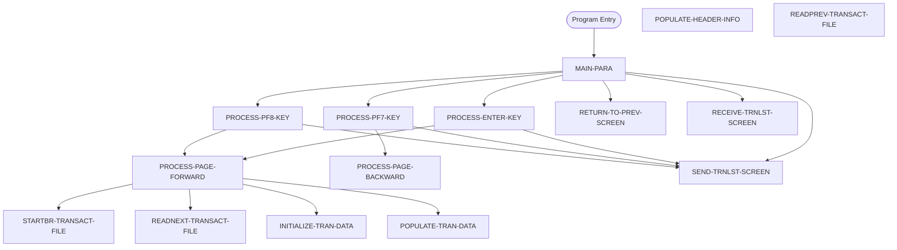

# Program: COTRN00C


---

## Quick Reference

| Attribute | Value |
|-----------|-------|
| Program ID | `COTRN00C` |
| Type | ONLINE |
| Lines | 700 |
| Source | [COTRN00C.cbl](../carddemo/COTRN00C.cbl#L1) |
| Paragraphs | 16 |
| Statements | 89 |
| Impact Risk | **HIGH** — 26 programs affected |

> **View Source:** [Open COTRN00C.cbl](../carddemo/COTRN00C.cbl#L1)

## Source Grounding Facts

| Data Item | Literal Value |
|-----------|---------------|
| `WS-PGMNAME` | `COTRN00C` |
| `WS-TRANID` | `CT00` |
| `WS-TRANSACT-FILE` | `TRANSACT` |
| `WS-ERR-FLG` | `N` |
| `WS-TRANSACT-EOF` | `N` |
| `WS-SEND-ERASE-FLG` | `Y` |
| `WS-TRAN-DATE` | `00/00/00` |


## Business Purpose

*Business purpose is not present in the extracted data. Run LLM enrichment to populate this section.*


## Dependency Context

> This section shows how **COTRN00C** connects to the rest of the system — who calls it,
> what it calls, and what data it shares. If linked programs exist, they must appear here.

### Programs That Call COTRN00C (Callers)

*No programs call COTRN00C — this is likely a top-level entry point or CICS transaction starter.*

### Programs Called by COTRN00C (Callees)

*COTRN00C does not call any other programs (leaf program).*

### Shared Data (Copybooks & Files)

#### Shared Copybooks

| Copybook | Also Used By | # Co-Users |
|----------|-------------|------------|
| `COCOM01Y` | COACTUPC, COACTVWC, COADM01C, COBIL00C, COCRDLIC (+15 more) | 20 |
| `COTRN00` |  | 0 |
| `COTTL01Y` | COACTUPC, COACTVWC, COADM01C, COBIL00C, COCRDLIC (+15 more) | 20 |
| `CSDAT01Y` | COACTUPC, COACTVWC, COADM01C, COBIL00C, COCRDLIC (+15 more) | 20 |
| `CSMSG01Y` | COACTUPC, COACTVWC, COADM01C, COBIL00C, COCRDLIC (+15 more) | 20 |
| `CVTRA05Y` | CBACT04C, CBEXPORT, CBIMPORT, CBTRN01C, CBTRN02C (+5 more) | 10 |
| `DFHAID` | COACTUPC, COACTVWC, COADM01C, COBIL00C, COCRDLIC (+15 more) | 20 |
| `DFHBMSCA` | COACTUPC, COACTVWC, COADM01C, COBIL00C, COCRDLIC (+15 more) | 20 |


## Legacy Data Contracts

> These tables are derived from FILE SECTION records and COPY-expanded data declarations. They preserve the legacy field names, COBOL storage type, inferred modern type, and status-code values needed for Java DTOs, SQL schemas, API contracts, and migration mapping.


### Copybook Segment Layouts

#### `COCOM01Y` as `CARDDEMO-COMMAREA`

| Legacy Field | Meaning | COBOL Type | Modern Type | Status / Format Notes |
|--------------|---------|------------|-------------|-----------------------|
| `CARDDEMO-COMMAREA` | Carddemo Commarea | `GROUP` | `OBJECT` |  |
| `CDEMO-GENERAL-INFO` | General Info | `GROUP` | `OBJECT` |  |
| `CDEMO-FROM-TRANID` | From Tranid | `PIC X(04)` | `STRING(4)` |  |
| `CDEMO-FROM-PROGRAM` | From Program | `PIC X(08)` | `STRING(8)` |  |
| `CDEMO-TO-TRANID` | To Tranid | `PIC X(04)` | `STRING(4)` |  |
| `CDEMO-TO-PROGRAM` | To Program | `PIC X(08)` | `STRING(8)` |  |
| `CDEMO-USER-ID` | User ID | `PIC X(08)` | `STRING(8)` |  |
| `CDEMO-USER-TYPE` | User Type | `PIC X(01)` | `STRING(1)` |  |
| `CDEMO-PGM-CONTEXT` | Pgm Context | `PIC 9(01)` | `INTEGER` |  |
| `CDEMO-CUSTOMER-INFO` | Customer Info | `GROUP` | `OBJECT` |  |
| `CDEMO-CUST-ID` | Customer ID | `PIC 9(09)` | `INTEGER` |  |
| `CDEMO-CUST-FNAME` | Customer Fname | `PIC X(25)` | `STRING(25)` |  |
| `CDEMO-CUST-MNAME` | Customer Mname | `PIC X(25)` | `STRING(25)` |  |
| `CDEMO-CUST-LNAME` | Customer Lname | `PIC X(25)` | `STRING(25)` |  |
| `CDEMO-ACCOUNT-INFO` | Account Info | `GROUP` | `OBJECT` |  |
| `CDEMO-ACCT-ID` | Account ID | `PIC 9(11)` | `BIGINT` |  |
| `CDEMO-ACCT-STATUS` | Account Status | `PIC X(01)` | `STRING(1)` |  |
| `CDEMO-CARD-INFO` | Card Info | `GROUP` | `OBJECT` |  |
| `CDEMO-CARD-NUM` | Card Number | `PIC 9(16)` | `BIGINT` |  |
| `CDEMO-MORE-INFO` | More Info | `GROUP` | `OBJECT` |  |
| `CDEMO-LAST-MAP` | Last Map | `PIC X(7)` | `STRING(7)` |  |
| `CDEMO-LAST-MAPSET` | Last Mapset | `PIC X(7)` | `STRING(7)` |  |

#### `COTRN00` as `COTRN0AI`

| Legacy Field | Meaning | COBOL Type | Modern Type | Status / Format Notes |
|--------------|---------|------------|-------------|-----------------------|
| `COTRN0AI` | Cotrn0Ai | `GROUP` | `OBJECT` |  |
| `COTRN0AO` | Cotrn0Ao | `GROUP` | `OBJECT` |  |

#### `COTTL01Y` as `CCDA-SCREEN-TITLE`

| Legacy Field | Meaning | COBOL Type | Modern Type | Status / Format Notes |
|--------------|---------|------------|-------------|-----------------------|
| `CCDA-SCREEN-TITLE` | Ccda Screen Title | `GROUP` | `OBJECT` |  |
| `CCDA-TITLE01` | Ccda Title01 | `PIC X(40)` | `STRING(40)` |  |
| `CCDA-TITLE02` | Ccda Title02 | `PIC X(40)` | `STRING(40)` |  |
| `CCDA-THANK-YOU` | Ccda Thank You | `PIC X(40)` | `STRING(40)` |  |

#### `CSDAT01Y` as `WS-DATE-TIME`

| Legacy Field | Meaning | COBOL Type | Modern Type | Status / Format Notes |
|--------------|---------|------------|-------------|-----------------------|
| `WS-DATE-TIME` | Date Time | `GROUP` | `OBJECT` |  |
| `WS-CURDATE-DATA` | Curdate Data | `GROUP` | `OBJECT` |  |
| `WS-CURDATE` | Curdate | `GROUP` | `OBJECT` |  |
| `WS-CURDATE-YEAR` | Curdate Year | `PIC 9(04)` | `INTEGER` |  |
| `WS-CURDATE-MONTH` | Curdate Month | `PIC 9(02)` | `INTEGER` |  |
| `WS-CURDATE-DAY` | Curdate Day | `PIC 9(02)` | `INTEGER` |  |
| `WS-CURDATE-N` | Curdate N | `PIC 9(08)` | `INTEGER` |  |
| `WS-CURTIME` | Curtime | `GROUP` | `OBJECT` |  |
| `WS-CURTIME-HOURS` | Curtime Hours | `PIC 9(02)` | `INTEGER` |  |
| `WS-CURTIME-MINUTE` | Curtime Minute | `PIC 9(02)` | `INTEGER` |  |
| `WS-CURTIME-SECOND` | Curtime Second | `PIC 9(02)` | `INTEGER` |  |
| `WS-CURTIME-MILSEC` | Curtime Milsec | `PIC 9(02)` | `INTEGER` |  |
| `WS-CURTIME-N` | Curtime N | `PIC 9(08)` | `INTEGER` |  |
| `WS-CURDATE-MM-DD-YY` | Curdate Mm Dd Yy | `GROUP` | `OBJECT` |  |
| `WS-CURDATE-MM` | Curdate Mm | `PIC 9(02)` | `INTEGER` |  |
| `FILLER` | Filler | `PIC X(01)` | `STRING(1)` |  |
| `WS-CURDATE-DD` | Curdate Dd | `PIC 9(02)` | `INTEGER` |  |
| `FILLER` | Filler | `PIC X(01)` | `STRING(1)` |  |
| `WS-CURDATE-YY` | Curdate Yy | `PIC 9(02)` | `INTEGER` |  |
| `WS-CURTIME-HH-MM-SS` | Curtime Hh Mm Ss | `GROUP` | `OBJECT` |  |
| `WS-CURTIME-HH` | Curtime Hh | `PIC 9(02)` | `INTEGER` |  |
| `FILLER` | Filler | `PIC X(01)` | `STRING(1)` |  |
| `WS-CURTIME-MM` | Curtime Mm | `PIC 9(02)` | `INTEGER` |  |
| `FILLER` | Filler | `PIC X(01)` | `STRING(1)` |  |
| `WS-CURTIME-SS` | Curtime Ss | `PIC 9(02)` | `INTEGER` |  |
| `WS-TIMESTAMP` | Timestamp | `GROUP` | `OBJECT` |  |
| `WS-TIMESTAMP-DT-YYYY` | Timestamp Date Yyyy | `PIC 9(04)` | `INTEGER` |  |
| `FILLER` | Filler | `PIC X(01)` | `STRING(1)` |  |
| `WS-TIMESTAMP-DT-MM` | Timestamp Date Mm | `PIC 9(02)` | `INTEGER` |  |
| `FILLER` | Filler | `PIC X(01)` | `STRING(1)` |  |
| `WS-TIMESTAMP-DT-DD` | Timestamp Date Dd | `PIC 9(02)` | `INTEGER` |  |
| `FILLER` | Filler | `PIC X(01)` | `STRING(1)` |  |
| `WS-TIMESTAMP-TM-HH` | Timestamp Tm Hh | `PIC 9(02)` | `INTEGER` |  |
| `FILLER` | Filler | `PIC X(01)` | `STRING(1)` |  |
| `WS-TIMESTAMP-TM-MM` | Timestamp Tm Mm | `PIC 9(02)` | `INTEGER` |  |
| `FILLER` | Filler | `PIC X(01)` | `STRING(1)` |  |
| `WS-TIMESTAMP-TM-SS` | Timestamp Tm Ss | `PIC 9(02)` | `INTEGER` |  |
| `FILLER` | Filler | `PIC X(01)` | `STRING(1)` |  |
| `WS-TIMESTAMP-TM-MS6` | Timestamp Tm Ms6 | `PIC 9(06)` | `INTEGER` |  |

#### `CSMSG01Y` as `CCDA-COMMON-MESSAGES`

| Legacy Field | Meaning | COBOL Type | Modern Type | Status / Format Notes |
|--------------|---------|------------|-------------|-----------------------|
| `CCDA-COMMON-MESSAGES` | Ccda Common Messages | `GROUP` | `OBJECT` |  |
| `CCDA-MSG-THANK-YOU` | Ccda Msg Thank You | `PIC X(50)` | `STRING(50)` |  |
| `CCDA-MSG-INVALID-KEY` | Ccda Msg Invalid Key | `PIC X(50)` | `STRING(50)` |  |

#### `CVTRA05Y` as `TRAN-RECORD`

| Legacy Field | Meaning | COBOL Type | Modern Type | Status / Format Notes |
|--------------|---------|------------|-------------|-----------------------|
| `TRAN-RECORD` | Tran Record | `GROUP` | `OBJECT` |  |
| `TRAN-ID` | Tran ID | `PIC X(16)` | `STRING(16)` |  |
| `TRAN-TYPE-CD` | Tran Type Cd | `PIC X(02)` | `STRING(2)` |  |
| `TRAN-CAT-CD` | Tran Cat Cd | `PIC 9(04)` | `INTEGER` |  |
| `TRAN-SOURCE` | Tran Source | `PIC X(10)` | `STRING(10)` |  |
| `TRAN-DESC` | Tran Desc | `PIC X(100)` | `STRING(100)` |  |
| `TRAN-AMT` | Tran Amount | `PIC S9(09)V99` | `DECIMAL(11,2)` |  |
| `TRAN-MERCHANT-ID` | Tran Merchant ID | `PIC 9(09)` | `INTEGER` |  |
| `TRAN-MERCHANT-NAME` | Tran Merchant Name | `PIC X(50)` | `STRING(50)` |  |
| `TRAN-MERCHANT-CITY` | Tran Merchant City | `PIC X(50)` | `STRING(50)` |  |
| `TRAN-MERCHANT-ZIP` | Tran Merchant Zip | `PIC X(10)` | `STRING(10)` |  |
| `TRAN-CARD-NUM` | Tran Card Number | `PIC X(16)` | `STRING(16)` |  |
| `TRAN-ORIG-TS` | Tran Orig Ts | `PIC X(26)` | `STRING(26)` |  |
| `TRAN-PROC-TS` | Tran Proc Ts | `PIC X(26)` | `STRING(26)` |  |
| `FILLER` | Filler | `PIC X(20)` | `STRING(20)` |  |

#### `DFHAID` as `DFHAID`

| Legacy Field | Meaning | COBOL Type | Modern Type | Status / Format Notes |
|--------------|---------|------------|-------------|-----------------------|
| `DFHAID` | Dfhaid | `GROUP` | `OBJECT` |  |

#### `DFHBMSCA` as `DFHBMSCA`

| Legacy Field | Meaning | COBOL Type | Modern Type | Status / Format Notes |
|--------------|---------|------------|-------------|-----------------------|
| `DFHBMSCA` | Dfhbmsca | `GROUP` | `OBJECT` |  |


### Data Movement And Key Mapping

| Line | Source | Target | Meaning |
|------|--------|--------|---------|
| 102 | `SPACES` | `WS-MESSAGE` | SPACES populates WS-MESSAGE |
| 132 | `CCDA-MSG-INVALID-KEY` | `WS-MESSAGE` | CCDA-MSG-INVALID-KEY populates WS-MESSAGE |
| 383 | `TRAN-AMT` | `WS-TRAN-AMT` | TRAN-AMT populates WS-TRAN-AMT |
| 385 | `WS-TIMESTAMP-DT-YYYY(3:2)` | `WS-CURDATE-YY` | WS-TIMESTAMP-DT-YYYY(3:2) populates WS-CURDATE-YY |
| 386 | `WS-TIMESTAMP-DT-MM` | `WS-CURDATE-MM` | WS-TIMESTAMP-DT-MM populates WS-CURDATE-MM |
| 387 | `WS-TIMESTAMP-DT-DD` | `WS-CURDATE-DD` | WS-TIMESTAMP-DT-DD populates WS-CURDATE-DD |
| 388 | `WS-CURDATE-MM-DD-YY` | `WS-TRAN-DATE` | WS-CURDATE-MM-DD-YY populates WS-TRAN-DATE |
| 394 | `WS-TRAN-DATE` | `TDATE01I OF COTRN0AI` | WS-TRAN-DATE populates TDATE01I OF COTRN0AI |
| 396 | `WS-TRAN-AMT` | `TAMT001I OF COTRN0AI` | WS-TRAN-AMT populates TAMT001I OF COTRN0AI |
| 399 | `WS-TRAN-DATE` | `TDATE02I OF COTRN0AI` | WS-TRAN-DATE populates TDATE02I OF COTRN0AI |
| 401 | `WS-TRAN-AMT` | `TAMT002I OF COTRN0AI` | WS-TRAN-AMT populates TAMT002I OF COTRN0AI |
| 404 | `WS-TRAN-DATE` | `TDATE03I OF COTRN0AI` | WS-TRAN-DATE populates TDATE03I OF COTRN0AI |
| 406 | `WS-TRAN-AMT` | `TAMT003I OF COTRN0AI` | WS-TRAN-AMT populates TAMT003I OF COTRN0AI |
| 409 | `WS-TRAN-DATE` | `TDATE04I OF COTRN0AI` | WS-TRAN-DATE populates TDATE04I OF COTRN0AI |
| 411 | `WS-TRAN-AMT` | `TAMT004I OF COTRN0AI` | WS-TRAN-AMT populates TAMT004I OF COTRN0AI |
| 414 | `WS-TRAN-DATE` | `TDATE05I OF COTRN0AI` | WS-TRAN-DATE populates TDATE05I OF COTRN0AI |
| 416 | `WS-TRAN-AMT` | `TAMT005I OF COTRN0AI` | WS-TRAN-AMT populates TAMT005I OF COTRN0AI |
| 419 | `WS-TRAN-DATE` | `TDATE06I OF COTRN0AI` | WS-TRAN-DATE populates TDATE06I OF COTRN0AI |
| 421 | `WS-TRAN-AMT` | `TAMT006I OF COTRN0AI` | WS-TRAN-AMT populates TAMT006I OF COTRN0AI |
| 424 | `WS-TRAN-DATE` | `TDATE07I OF COTRN0AI` | WS-TRAN-DATE populates TDATE07I OF COTRN0AI |
| 426 | `WS-TRAN-AMT` | `TAMT007I OF COTRN0AI` | WS-TRAN-AMT populates TAMT007I OF COTRN0AI |
| 429 | `WS-TRAN-DATE` | `TDATE08I OF COTRN0AI` | WS-TRAN-DATE populates TDATE08I OF COTRN0AI |
| 431 | `WS-TRAN-AMT` | `TAMT008I OF COTRN0AI` | WS-TRAN-AMT populates TAMT008I OF COTRN0AI |
| 434 | `WS-TRAN-DATE` | `TDATE09I OF COTRN0AI` | WS-TRAN-DATE populates TDATE09I OF COTRN0AI |
| 436 | `WS-TRAN-AMT` | `TAMT009I OF COTRN0AI` | WS-TRAN-AMT populates TAMT009I OF COTRN0AI |
| 440 | `WS-TRAN-DATE` | `TDATE10I OF COTRN0AI` | WS-TRAN-DATE populates TDATE10I OF COTRN0AI |
| 442 | `WS-TRAN-AMT` | `TAMT010I OF COTRN0AI` | WS-TRAN-AMT populates TAMT010I OF COTRN0AI |
| 455 | `SPACES` | `TDATE01I OF COTRN0AI` | SPACES populates TDATE01I OF COTRN0AI |
| 457 | `SPACES` | `TAMT001I OF COTRN0AI` | SPACES populates TAMT001I OF COTRN0AI |
| 460 | `SPACES` | `TDATE02I OF COTRN0AI` | SPACES populates TDATE02I OF COTRN0AI |


---

## Dependency Graph

```mermaid
flowchart TD
    COTRN00C["⬤ COTRN00C"]:::target
    CB_COCOM01Y{{"COCOM01Y"}}:::copybook
    COTRN00C -.- CB_COCOM01Y
    COACTUPC["COACTUPC"]:::coupled
    CB_COCOM01Y -.- COACTUPC
    COACTVWC["COACTVWC"]:::coupled
    CB_COCOM01Y -.- COACTVWC
    COADM01C["COADM01C"]:::coupled
    CB_COCOM01Y -.- COADM01C
    CB_COTTL01Y{{"COTTL01Y"}}:::copybook
    COTRN00C -.- CB_COTTL01Y
    COACTUPC["COACTUPC"]:::coupled
    CB_COTTL01Y -.- COACTUPC
    COACTVWC["COACTVWC"]:::coupled
    CB_COTTL01Y -.- COACTVWC
    COADM01C["COADM01C"]:::coupled
    CB_COTTL01Y -.- COADM01C
    CB_CSDAT01Y{{"CSDAT01Y"}}:::copybook
    COTRN00C -.- CB_CSDAT01Y
    COACTUPC["COACTUPC"]:::coupled
    CB_CSDAT01Y -.- COACTUPC
    COACTVWC["COACTVWC"]:::coupled
    CB_CSDAT01Y -.- COACTVWC
    COADM01C["COADM01C"]:::coupled
    CB_CSDAT01Y -.- COADM01C
    CB_CSMSG01Y{{"CSMSG01Y"}}:::copybook
    COTRN00C -.- CB_CSMSG01Y
    COACTUPC["COACTUPC"]:::coupled
    CB_CSMSG01Y -.- COACTUPC
    COACTVWC["COACTVWC"]:::coupled
    CB_CSMSG01Y -.- COACTVWC
    COADM01C["COADM01C"]:::coupled
    CB_CSMSG01Y -.- COADM01C
    CB_CVTRA05Y{{"CVTRA05Y"}}:::copybook
    COTRN00C -.- CB_CVTRA05Y
    CBACT04C["CBACT04C"]:::coupled
    CB_CVTRA05Y -.- CBACT04C
    CBEXPORT["CBEXPORT"]:::coupled
    CB_CVTRA05Y -.- CBEXPORT
    CBIMPORT["CBIMPORT"]:::coupled
    CB_CVTRA05Y -.- CBIMPORT
    CB_DFHAID{{"DFHAID"}}:::copybook
    COTRN00C -.- CB_DFHAID
    COACTUPC["COACTUPC"]:::coupled
    CB_DFHAID -.- COACTUPC
    COACTVWC["COACTVWC"]:::coupled
    CB_DFHAID -.- COACTVWC
    COADM01C["COADM01C"]:::coupled
    CB_DFHAID -.- COADM01C
    CB_DFHBMSCA{{"DFHBMSCA"}}:::copybook
    COTRN00C -.- CB_DFHBMSCA
    COACTUPC["COACTUPC"]:::coupled
    CB_DFHBMSCA -.- COACTUPC
    COACTVWC["COACTVWC"]:::coupled
    CB_DFHBMSCA -.- COACTVWC
    COADM01C["COADM01C"]:::coupled
    CB_DFHBMSCA -.- COADM01C
    classDef target fill:#f85149,stroke:#da3633,color:#fff,stroke-width:3px
    classDef caller fill:#58a6ff,stroke:#1f6feb,color:#fff
    classDef callee fill:#3fb950,stroke:#238636,color:#fff
    classDef copybook fill:#d29922,stroke:#9e6a03,color:#fff
    classDef coupled fill:#d29922,stroke:#9e6a03,color:#fff,stroke-dasharray:5
    classDef transitive fill:#484f58,stroke:#8b949e,color:#c9d1d9,stroke-dasharray:5
```



> **Legend:** 🔴 Target program · 🔵 Direct callers · 🟢 Direct callees · 🟡 Copybook-coupled · ⚫ Transitive (indirect)

---

## Impact Ripple View

> **If you change COTRN00C, what else could break?**

| Impact Metric | Count |
|--------------|-------|
| Direct Callers | 0 |
| Transitive Callers (callers of callers) | 0 |
| Direct Callees | 0 |
| Transitive Callees | 0 |
| Copybook-Coupled Programs | 26 |
| **Total Impact** | **26** |
| **Risk Rating** | **HIGH** |


**Programs affected via shared copybooks:**
- `CBACT04C`
- `CBEXPORT`
- `CBIMPORT`
- `CBTRN01C`
- `CBTRN02C`
- `CBTRN03C`
- `COACTUPC`
- `COACTVWC`
- `COADM01C`
- `COBIL00C`
- `COCRDLIC`
- `COCRDSLC`
- `COCRDUPC`
- `COMEN01C`
- `COPAUS0C`
- `COPAUS1C`
- `CORPT00C`
- `COSGN00C`
- `COTRN01C`
- `COTRN02C`
- `COTRTLIC`
- `COTRTUPC`
- `COUSR00C`
- `COUSR01C`
- `COUSR02C`
- `COUSR03C`

---

## Statement Profile

| Statement Type | Count |
|---------------|-------|
| IF | 38 |
| MOVE | 29 |
| EXEC_CICS | 7 |
| EVALUATE | 6 |
| SET | 5 |
| PERFORM | 4 |

## Control Flow



## Paragraphs

### MAIN-PARA

| | |
|---|---|
| **Paragraph** | `MAIN-PARA` |
| **Lines** | 95 - 145 |
| **View Code** | [Jump to Line 95](../carddemo/COTRN00C.cbl#L95) |


### PROCESS-ENTER-KEY

| | |
|---|---|
| **Paragraph** | `PROCESS-ENTER-KEY` |
| **Lines** | 146 - 233 |
| **View Code** | [Jump to Line 146](../carddemo/COTRN00C.cbl#L146) |


### PROCESS-PF7-KEY

| | |
|---|---|
| **Paragraph** | `PROCESS-PF7-KEY` |
| **Lines** | 234 - 256 |
| **View Code** | [Jump to Line 234](../carddemo/COTRN00C.cbl#L234) |


### PROCESS-PF8-KEY

| | |
|---|---|
| **Paragraph** | `PROCESS-PF8-KEY` |
| **Lines** | 257 - 278 |
| **View Code** | [Jump to Line 257](../carddemo/COTRN00C.cbl#L257) |


### PROCESS-PAGE-FORWARD

| | |
|---|---|
| **Paragraph** | `PROCESS-PAGE-FORWARD` |
| **Lines** | 279 - 332 |
| **View Code** | [Jump to Line 279](../carddemo/COTRN00C.cbl#L279) |


### PROCESS-PAGE-BACKWARD

| | |
|---|---|
| **Paragraph** | `PROCESS-PAGE-BACKWARD` |
| **Lines** | 333 - 380 |
| **View Code** | [Jump to Line 333](../carddemo/COTRN00C.cbl#L333) |


### POPULATE-TRAN-DATA

| | |
|---|---|
| **Paragraph** | `POPULATE-TRAN-DATA` |
| **Lines** | 381 - 449 |
| **View Code** | [Jump to Line 381](../carddemo/COTRN00C.cbl#L381) |


### INITIALIZE-TRAN-DATA

| | |
|---|---|
| **Paragraph** | `INITIALIZE-TRAN-DATA` |
| **Lines** | 450 - 509 |
| **View Code** | [Jump to Line 450](../carddemo/COTRN00C.cbl#L450) |


### RETURN-TO-PREV-SCREEN

| | |
|---|---|
| **Paragraph** | `RETURN-TO-PREV-SCREEN` |
| **Lines** | 510 - 526 |
| **View Code** | [Jump to Line 510](../carddemo/COTRN00C.cbl#L510) |


### SEND-TRNLST-SCREEN

| | |
|---|---|
| **Paragraph** | `SEND-TRNLST-SCREEN` |
| **Lines** | 527 - 553 |
| **View Code** | [Jump to Line 527](../carddemo/COTRN00C.cbl#L527) |


### RECEIVE-TRNLST-SCREEN

| | |
|---|---|
| **Paragraph** | `RECEIVE-TRNLST-SCREEN` |
| **Lines** | 554 - 566 |
| **View Code** | [Jump to Line 554](../carddemo/COTRN00C.cbl#L554) |


### POPULATE-HEADER-INFO

| | |
|---|---|
| **Paragraph** | `POPULATE-HEADER-INFO` |
| **Lines** | 567 - 590 |
| **View Code** | [Jump to Line 567](../carddemo/COTRN00C.cbl#L567) |


### STARTBR-TRANSACT-FILE

| | |
|---|---|
| **Paragraph** | `STARTBR-TRANSACT-FILE` |
| **Lines** | 591 - 623 |
| **View Code** | [Jump to Line 591](../carddemo/COTRN00C.cbl#L591) |


### READNEXT-TRANSACT-FILE

| | |
|---|---|
| **Paragraph** | `READNEXT-TRANSACT-FILE` |
| **Lines** | 624 - 657 |
| **View Code** | [Jump to Line 624](../carddemo/COTRN00C.cbl#L624) |


### READPREV-TRANSACT-FILE

| | |
|---|---|
| **Paragraph** | `READPREV-TRANSACT-FILE` |
| **Lines** | 658 - 691 |
| **View Code** | [Jump to Line 658](../carddemo/COTRN00C.cbl#L658) |


### ENDBR-TRANSACT-FILE

| | |
|---|---|
| **Paragraph** | `ENDBR-TRANSACT-FILE` |
| **Lines** | 692 - 699 |
| **View Code** | [Jump to Line 692](../carddemo/COTRN00C.cbl#L692) |


## Copybook Field Dictionaries

The following copybooks are included by this program. Each entry shows the actual fields
extracted from the copybook source file (`.cpy`).

### Copybook `COCOM01Y`

| Level | Field | PIC | USAGE | Parent | Notes |
|-------|-------|-----|-------|--------|-------|
| `01` | `CARDDEMO-COMMAREA` | `None` | None | None |  |
| `05` | `CDEMO-GENERAL-INFO` | `None` | None | CARDDEMO-COMMAREA |  |
| `10` | `CDEMO-FROM-TRANID` | `X(04)` | None | CDEMO-GENERAL-INFO |  |
| `10` | `CDEMO-FROM-PROGRAM` | `X(08)` | None | CDEMO-GENERAL-INFO |  |
| `10` | `CDEMO-TO-TRANID` | `X(04)` | None | CDEMO-GENERAL-INFO |  |
| `10` | `CDEMO-TO-PROGRAM` | `X(08)` | None | CDEMO-GENERAL-INFO |  |
| `10` | `CDEMO-USER-ID` | `X(08)` | None | CDEMO-GENERAL-INFO |  |
| `10` | `CDEMO-USER-TYPE` | `X(01)` | None | CDEMO-GENERAL-INFO |  |
| `88` | `CDEMO-USRTYP-ADMIN` | `None` | None | CDEMO-GENERAL-INFO |  |
| `88` | `CDEMO-USRTYP-USER` | `None` | None | CDEMO-GENERAL-INFO |  |
| `10` | `CDEMO-PGM-CONTEXT` | `9(01)` | None | CDEMO-GENERAL-INFO |  |
| `88` | `CDEMO-PGM-ENTER` | `None` | None | CDEMO-GENERAL-INFO |  |
| `88` | `CDEMO-PGM-REENTER` | `None` | None | CDEMO-GENERAL-INFO |  |
| `05` | `CDEMO-CUSTOMER-INFO` | `None` | None | CARDDEMO-COMMAREA |  |
| `10` | `CDEMO-CUST-ID` | `9(09)` | None | CDEMO-CUSTOMER-INFO |  |
| `10` | `CDEMO-CUST-FNAME` | `X(25)` | None | CDEMO-CUSTOMER-INFO |  |
| `10` | `CDEMO-CUST-MNAME` | `X(25)` | None | CDEMO-CUSTOMER-INFO |  |
| `10` | `CDEMO-CUST-LNAME` | `X(25)` | None | CDEMO-CUSTOMER-INFO |  |
| `05` | `CDEMO-ACCOUNT-INFO` | `None` | None | CARDDEMO-COMMAREA |  |
| `10` | `CDEMO-ACCT-ID` | `9(11)` | None | CDEMO-ACCOUNT-INFO |  |
| `10` | `CDEMO-ACCT-STATUS` | `X(01)` | None | CDEMO-ACCOUNT-INFO |  |
| `05` | `CDEMO-CARD-INFO` | `None` | None | CARDDEMO-COMMAREA |  |
| `10` | `CDEMO-CARD-NUM` | `9(16)` | None | CDEMO-CARD-INFO |  |
| `05` | `CDEMO-MORE-INFO` | `None` | None | CARDDEMO-COMMAREA |  |
| `10` | `CDEMO-LAST-MAP` | `X(7)` | None | CDEMO-MORE-INFO |  |
| `10` | `CDEMO-LAST-MAPSET` | `X(7)` | None | CDEMO-MORE-INFO |  |

### Copybook `COTRN00`

| Level | Field | PIC | USAGE | Parent | Notes |
|-------|-------|-----|-------|--------|-------|
| `01` | `COTRN0AI` | `None` | None | None |  |
| `02` | `TRNNAMEL` | `S9(4)` | COMP | COTRN0AI |  |
| `02` | `TRNNAMEF` | `X` | None | COTRN0AI |  |
| `03` | `TRNNAMEA` | `X` | None | COTRN0AI |  |
| `02` | `TRNNAMEI` | `X(4)` | None | COTRN0AI |  |
| `02` | `TITLE01L` | `S9(4)` | COMP | COTRN0AI |  |
| `02` | `TITLE01F` | `X` | None | COTRN0AI |  |
| `03` | `TITLE01A` | `X` | None | COTRN0AI |  |
| `02` | `TITLE01I` | `X(40)` | None | COTRN0AI |  |
| `02` | `CURDATEL` | `S9(4)` | COMP | COTRN0AI |  |
| `02` | `CURDATEF` | `X` | None | COTRN0AI |  |
| `03` | `CURDATEA` | `X` | None | COTRN0AI |  |
| `02` | `CURDATEI` | `X(8)` | None | COTRN0AI |  |
| `02` | `PGMNAMEL` | `S9(4)` | COMP | COTRN0AI |  |
| `02` | `PGMNAMEF` | `X` | None | COTRN0AI |  |
| `03` | `PGMNAMEA` | `X` | None | COTRN0AI |  |
| `02` | `PGMNAMEI` | `X(8)` | None | COTRN0AI |  |
| `02` | `TITLE02L` | `S9(4)` | COMP | COTRN0AI |  |
| `02` | `TITLE02F` | `X` | None | COTRN0AI |  |
| `03` | `TITLE02A` | `X` | None | COTRN0AI |  |
| `02` | `TITLE02I` | `X(40)` | None | COTRN0AI |  |
| `02` | `CURTIMEL` | `S9(4)` | COMP | COTRN0AI |  |
| `02` | `CURTIMEF` | `X` | None | COTRN0AI |  |
| `03` | `CURTIMEA` | `X` | None | COTRN0AI |  |
| `02` | `CURTIMEI` | `X(8)` | None | COTRN0AI |  |
| `02` | `PAGENUML` | `S9(4)` | COMP | COTRN0AI |  |
| `02` | `PAGENUMF` | `X` | None | COTRN0AI |  |
| `03` | `PAGENUMA` | `X` | None | COTRN0AI |  |
| `02` | `PAGENUMI` | `X(8)` | None | COTRN0AI |  |
| `02` | `TRNIDINL` | `S9(4)` | COMP | COTRN0AI |  |
| `02` | `TRNIDINF` | `X` | None | COTRN0AI |  |
| `03` | `TRNIDINA` | `X` | None | COTRN0AI |  |
| `02` | `TRNIDINI` | `X(16)` | None | COTRN0AI |  |
| `02` | `SEL0001L` | `S9(4)` | COMP | COTRN0AI |  |
| `02` | `SEL0001F` | `X` | None | COTRN0AI |  |
| `03` | `SEL0001A` | `X` | None | COTRN0AI |  |
| `02` | `SEL0001I` | `X(1)` | None | COTRN0AI |  |
| `02` | `TRNID01L` | `S9(4)` | COMP | COTRN0AI |  |
| `02` | `TRNID01F` | `X` | None | COTRN0AI |  |
| `03` | `TRNID01A` | `X` | None | COTRN0AI |  |
| `02` | `TRNID01I` | `X(16)` | None | COTRN0AI |  |
| `02` | `TDATE01L` | `S9(4)` | COMP | COTRN0AI |  |
| `02` | `TDATE01F` | `X` | None | COTRN0AI |  |
| `03` | `TDATE01A` | `X` | None | COTRN0AI |  |
| `02` | `TDATE01I` | `X(8)` | None | COTRN0AI |  |
| `02` | `TDESC01L` | `S9(4)` | COMP | COTRN0AI |  |
| `02` | `TDESC01F` | `X` | None | COTRN0AI |  |
| `03` | `TDESC01A` | `X` | None | COTRN0AI |  |
| `02` | `TDESC01I` | `X(26)` | None | COTRN0AI |  |
| `02` | `TAMT001L` | `S9(4)` | COMP | COTRN0AI |  |
*+ 483 more fields*
### Copybook `COTTL01Y`

| Level | Field | PIC | USAGE | Parent | Notes |
|-------|-------|-----|-------|--------|-------|
| `01` | `CCDA-SCREEN-TITLE` | `None` | None | None |  |
| `05` | `CCDA-TITLE01` | `X(40)` | None | CCDA-SCREEN-TITLE |  |
| `05` | `CCDA-TITLE02` | `X(40)` | None | CCDA-SCREEN-TITLE |  |
| `05` | `CCDA-THANK-YOU` | `X(40)` | None | CCDA-SCREEN-TITLE |  |

### Copybook `CSDAT01Y`

| Level | Field | PIC | USAGE | Parent | Notes |
|-------|-------|-----|-------|--------|-------|
| `01` | `WS-DATE-TIME` | `None` | None | None |  |
| `05` | `WS-CURDATE-DATA` | `None` | None | WS-DATE-TIME |  |
| `10` | `WS-CURDATE` | `None` | None | WS-CURDATE-DATA |  |
| `15` | `WS-CURDATE-YEAR` | `9(04)` | None | WS-CURDATE |  |
| `15` | `WS-CURDATE-MONTH` | `9(02)` | None | WS-CURDATE |  |
| `15` | `WS-CURDATE-DAY` | `9(02)` | None | WS-CURDATE |  |
| `10` | `WS-CURDATE-N` | `9(08)` | None | WS-CURDATE-DATA |  REDEFINES WS-CURDATE |
| `10` | `WS-CURTIME` | `None` | None | WS-CURDATE-DATA |  |
| `15` | `WS-CURTIME-HOURS` | `9(02)` | None | WS-CURTIME |  |
| `15` | `WS-CURTIME-MINUTE` | `9(02)` | None | WS-CURTIME |  |
| `15` | `WS-CURTIME-SECOND` | `9(02)` | None | WS-CURTIME |  |
| `15` | `WS-CURTIME-MILSEC` | `9(02)` | None | WS-CURTIME |  |
| `10` | `WS-CURTIME-N` | `9(08)` | None | WS-CURDATE-DATA |  REDEFINES WS-CURTIME |
| `05` | `WS-CURDATE-MM-DD-YY` | `None` | None | WS-DATE-TIME |  |
| `10` | `WS-CURDATE-MM` | `9(02)` | None | WS-CURDATE-MM-DD-YY |  |
| `10` | `WS-CURDATE-DD` | `9(02)` | None | WS-CURDATE-MM-DD-YY |  |
| `10` | `WS-CURDATE-YY` | `9(02)` | None | WS-CURDATE-MM-DD-YY |  |
| `05` | `WS-CURTIME-HH-MM-SS` | `None` | None | WS-DATE-TIME |  |
| `10` | `WS-CURTIME-HH` | `9(02)` | None | WS-CURTIME-HH-MM-SS |  |
| `10` | `WS-CURTIME-MM` | `9(02)` | None | WS-CURTIME-HH-MM-SS |  |
| `10` | `WS-CURTIME-SS` | `9(02)` | None | WS-CURTIME-HH-MM-SS |  |
| `05` | `WS-TIMESTAMP` | `None` | None | WS-DATE-TIME |  |
| `10` | `WS-TIMESTAMP-DT-YYYY` | `9(04)` | None | WS-TIMESTAMP |  |
| `10` | `WS-TIMESTAMP-DT-MM` | `9(02)` | None | WS-TIMESTAMP |  |
| `10` | `WS-TIMESTAMP-DT-DD` | `9(02)` | None | WS-TIMESTAMP |  |
| `10` | `WS-TIMESTAMP-TM-HH` | `9(02)` | None | WS-TIMESTAMP |  |
| `10` | `WS-TIMESTAMP-TM-MM` | `9(02)` | None | WS-TIMESTAMP |  |
| `10` | `WS-TIMESTAMP-TM-SS` | `9(02)` | None | WS-TIMESTAMP |  |
| `10` | `WS-TIMESTAMP-TM-MS6` | `9(06)` | None | WS-TIMESTAMP |  |

### Copybook `CSMSG01Y`

| Level | Field | PIC | USAGE | Parent | Notes |
|-------|-------|-----|-------|--------|-------|
| `01` | `CCDA-COMMON-MESSAGES` | `None` | None | None |  |
| `05` | `CCDA-MSG-THANK-YOU` | `X(50)` | None | CCDA-COMMON-MESSAGES |  |
| `05` | `CCDA-MSG-INVALID-KEY` | `X(50)` | None | CCDA-COMMON-MESSAGES |  |

### Copybook `CVTRA05Y`

| Level | Field | PIC | USAGE | Parent | Notes |
|-------|-------|-----|-------|--------|-------|
| `01` | `TRAN-RECORD` | `None` | None | None |  |
| `05` | `TRAN-ID` | `X(16)` | None | TRAN-RECORD |  |
| `05` | `TRAN-TYPE-CD` | `X(02)` | None | TRAN-RECORD |  |
| `05` | `TRAN-CAT-CD` | `9(04)` | None | TRAN-RECORD |  |
| `05` | `TRAN-SOURCE` | `X(10)` | None | TRAN-RECORD |  |
| `05` | `TRAN-DESC` | `X(100)` | None | TRAN-RECORD |  |
| `05` | `TRAN-AMT` | `S9(09)V99` | None | TRAN-RECORD |  |
| `05` | `TRAN-MERCHANT-ID` | `9(09)` | None | TRAN-RECORD |  |
| `05` | `TRAN-MERCHANT-NAME` | `X(50)` | None | TRAN-RECORD |  |
| `05` | `TRAN-MERCHANT-CITY` | `X(50)` | None | TRAN-RECORD |  |
| `05` | `TRAN-MERCHANT-ZIP` | `X(10)` | None | TRAN-RECORD |  |
| `05` | `TRAN-CARD-NUM` | `X(16)` | None | TRAN-RECORD |  |
| `05` | `TRAN-ORIG-TS` | `X(26)` | None | TRAN-RECORD |  |
| `05` | `TRAN-PROC-TS` | `X(26)` | None | TRAN-RECORD |  |

### Copybook `DFHAID`

| Level | Field | PIC | USAGE | Parent | Notes |
|-------|-------|-----|-------|--------|-------|
| `01` | `DFHAID` | `None` | None | None |  |
| `02` | `DFHENTER` | `X` | None | DFHAID |  |
| `02` | `DFHCLEAR` | `X` | None | DFHAID |  |
| `02` | `DFHCLRP` | `X` | None | DFHAID |  |
| `02` | `DFHPA1` | `X` | None | DFHAID |  |
| `02` | `DFHPA2` | `X` | None | DFHAID |  |
| `02` | `DFHPA3` | `X` | None | DFHAID |  |
| `02` | `DFHPF1` | `X` | None | DFHAID |  |
| `02` | `DFHPF2` | `X` | None | DFHAID |  |
| `02` | `DFHPF3` | `X` | None | DFHAID |  |
| `02` | `DFHPF4` | `X` | None | DFHAID |  |
| `02` | `DFHPF5` | `X` | None | DFHAID |  |
| `02` | `DFHPF6` | `X` | None | DFHAID |  |
| `02` | `DFHPF7` | `X` | None | DFHAID |  |
| `02` | `DFHPF8` | `X` | None | DFHAID |  |
| `02` | `DFHPF9` | `X` | None | DFHAID |  |
| `02` | `DFHPF10` | `X` | None | DFHAID |  |
| `02` | `DFHPF11` | `X` | None | DFHAID |  |
| `02` | `DFHPF12` | `X` | None | DFHAID |  |
| `02` | `DFHPF13` | `X` | None | DFHAID |  |
| `02` | `DFHPF14` | `X` | None | DFHAID |  |
| `02` | `DFHPF15` | `X` | None | DFHAID |  |
| `02` | `DFHPF16` | `X` | None | DFHAID |  |
| `02` | `DFHPF17` | `X` | None | DFHAID |  |
| `02` | `DFHPF18` | `X` | None | DFHAID |  |
| `02` | `DFHPF19` | `X` | None | DFHAID |  |
| `02` | `DFHPF20` | `X` | None | DFHAID |  |
| `02` | `DFHPF21` | `X` | None | DFHAID |  |
| `02` | `DFHPF22` | `X` | None | DFHAID |  |
| `02` | `DFHPF23` | `X` | None | DFHAID |  |
| `02` | `DFHPF24` | `X` | None | DFHAID |  |
| `02` | `DFHPEN` | `X` | None | DFHAID |  |
| `02` | `DFHOPID` | `X` | None | DFHAID |  |
| `02` | `DFHMSRE` | `X` | None | DFHAID |  |
| `02` | `DFHSTRF` | `X` | None | DFHAID |  |
| `02` | `DFHTRIG` | `X` | None | DFHAID |  |

### Copybook `DFHBMSCA`

| Level | Field | PIC | USAGE | Parent | Notes |
|-------|-------|-----|-------|--------|-------|
| `01` | `DFHBMSCA` | `None` | None | None |  |
| `02` | `DFHBMPEM` | `X` | None | DFHBMSCA |  |
| `02` | `DFHBMPNL` | `X` | None | DFHBMSCA |  |
| `02` | `DFHBMASK` | `X` | None | DFHBMSCA |  |
| `02` | `DFHBMUNP` | `X` | None | DFHBMSCA |  |
| `02` | `DFHBMUNN` | `X` | None | DFHBMSCA |  |
| `02` | `DFHBMPRO` | `X` | None | DFHBMSCA |  |
| `02` | `DFHBMBRY` | `X` | None | DFHBMSCA |  |
| `02` | `DFHBMDAR` | `X` | None | DFHBMSCA |  |
| `02` | `DFHBMFSE` | `X` | None | DFHBMSCA |  |
| `02` | `DFHBMPRF` | `X` | None | DFHBMSCA |  |
| `02` | `DFHBMASF` | `X` | None | DFHBMSCA |  |
| `02` | `DFHBMASB` | `X` | None | DFHBMSCA |  |
| `02` | `DFHBMEOF` | `X` | None | DFHBMSCA |  |
| `02` | `DFHBMEC` | `X` | None | DFHBMSCA |  |
| `02` | `DFHSA` | `X` | None | DFHBMSCA |  |
| `02` | `DFHCOLOR` | `X` | None | DFHBMSCA |  |
| `02` | `DFHPS` | `X` | None | DFHBMSCA |  |
| `02` | `DFHHLT` | `X` | None | DFHBMSCA |  |
| `02` | `DFHVAL` | `X` | None | DFHBMSCA |  |
| `02` | `DFHOUTLN` | `X` | None | DFHBMSCA |  |
| `02` | `DFHBKTRN` | `X` | None | DFHBMSCA |  |
| `02` | `DFHALL` | `X` | None | DFHBMSCA |  |
| `02` | `DFHERROR` | `X` | None | DFHBMSCA |  |
| `02` | `DFHDFT` | `X` | None | DFHBMSCA |  |
| `02` | `DFHDFCOL` | `X` | None | DFHBMSCA |  |
| `02` | `DFHBLUE` | `X` | None | DFHBMSCA |  |
| `02` | `DFHRED` | `X` | None | DFHBMSCA |  |
| `02` | `DFHPINK` | `X` | None | DFHBMSCA |  |
| `02` | `DFHGREEN` | `X` | None | DFHBMSCA |  |
| `02` | `DFHTURQ` | `X` | None | DFHBMSCA |  |
| `02` | `DFHYELLO` | `X` | None | DFHBMSCA |  |
| `02` | `DFHWHTE` | `X` | None | DFHBMSCA |  |
| `02` | `CATTR-H-UNPROT` | `X` | None | DFHBMSCA |  |
| `02` | `CATTR-H-UNPROT-FSET` | `X` | None | DFHBMSCA |  |
| `02` | `CATTR-H-UNPROT-NUM` | `X` | None | DFHBMSCA |  |
| `02` | `CATTR-H-ASKIP` | `X` | None | DFHBMSCA |  |


## Data Lineage (MOVE Flow)

The following MOVE statements were extracted from the source. Each row is a `source → destination`
flow that the migration team can use to trace how data is reshaped and routed.

| Source | Destination | Paragraph | Line |
|--------|-------------|-----------|------|
| `SPACES` | `WS-MESSAGE` | MAIN-PARA | 102 |
| `'-1'` | `TRNIDINL` | MAIN-PARA | 105 |
| `'-1'` | `OF` | MAIN-PARA | 105 |
| `'-1'` | `COTRN0AI` | MAIN-PARA | 105 |
| `'COSGN00C'` | `CDEMO-TO-PROGRAM` | MAIN-PARA | 108 |
| `DFHCOMMAREA(1:EIBCALEN)` | `CARDDEMO-COMMAREA` | MAIN-PARA | 111 |
| `LOW-VALUES` | `COTRN0AO` | MAIN-PARA | 114 |
| `'COMEN01C'` | `CDEMO-TO-PROGRAM` | MAIN-PARA | 123 |
| `'Y'` | `WS-ERR-FLG` | MAIN-PARA | 130 |
| `'-1'` | `TRNIDINL` | MAIN-PARA | 131 |
| `'-1'` | `OF` | MAIN-PARA | 131 |
| `'-1'` | `COTRN0AI` | MAIN-PARA | 131 |
| `CCDA-MSG-INVALID-KEY` | `WS-MESSAGE` | MAIN-PARA | 132 |
| `SPACES` | `CDEMO-CT00-TRN-SEL-FLG` | PROCESS-ENTER-KEY | 180 |
| `SPACES` | `CDEMO-CT00-TRN-SELECTED` | PROCESS-ENTER-KEY | 181 |
| `'COTRN01C'` | `CDEMO-TO-PROGRAM` | PROCESS-ENTER-KEY | 188 |
| `WS-TRANID` | `CDEMO-FROM-TRANID` | PROCESS-ENTER-KEY | 189 |
| `WS-PGMNAME` | `CDEMO-FROM-PROGRAM` | PROCESS-ENTER-KEY | 190 |
| `'0'` | `CDEMO-PGM-CONTEXT` | PROCESS-ENTER-KEY | 191 |
| `'-1'` | `TRNIDINL` | PROCESS-ENTER-KEY | 201 |
| `'-1'` | `OF` | PROCESS-ENTER-KEY | 201 |
| `'-1'` | `COTRN0AI` | PROCESS-ENTER-KEY | 201 |
| `LOW-VALUES` | `TRAN-ID` | PROCESS-ENTER-KEY | 207 |
| `'Y'` | `WS-ERR-FLG` | PROCESS-ENTER-KEY | 212 |
| `'-1'` | `TRNIDINL` | PROCESS-ENTER-KEY | 216 |
| `'-1'` | `OF` | PROCESS-ENTER-KEY | 216 |
| `'-1'` | `COTRN0AI` | PROCESS-ENTER-KEY | 216 |
| `'-1'` | `TRNIDINL` | PROCESS-ENTER-KEY | 221 |
| `'-1'` | `OF` | PROCESS-ENTER-KEY | 221 |
| `'-1'` | `COTRN0AI` | PROCESS-ENTER-KEY | 221 |
| `'0'` | `CDEMO-CT00-PAGE-NUM` | PROCESS-ENTER-KEY | 224 |
| `SPACE` | `TRNIDINO` | PROCESS-ENTER-KEY | 228 |
| `SPACE` | `OF` | PROCESS-ENTER-KEY | 228 |
| `SPACE` | `COTRN0AO` | PROCESS-ENTER-KEY | 228 |
| `LOW-VALUES` | `TRAN-ID` | PROCESS-PF7-KEY | 237 |
| `CDEMO-CT00-TRNID-FIRST` | `TRAN-ID` | PROCESS-PF7-KEY | 239 |
| `'-1'` | `TRNIDINL` | PROCESS-PF7-KEY | 243 |
| `'-1'` | `OF` | PROCESS-PF7-KEY | 243 |
| `'-1'` | `COTRN0AI` | PROCESS-PF7-KEY | 243 |
| `HIGH-VALUES` | `TRAN-ID` | PROCESS-PF8-KEY | 260 |
| `CDEMO-CT00-TRNID-LAST` | `TRAN-ID` | PROCESS-PF8-KEY | 262 |
| `'-1'` | `TRNIDINL` | PROCESS-PF8-KEY | 265 |
| `'-1'` | `OF` | PROCESS-PF8-KEY | 265 |
| `'-1'` | `COTRN0AI` | PROCESS-PF8-KEY | 265 |
| `'1'` | `WS-IDX` | PROCESS-PAGE-FORWARD | 295 |
| `CDEMO-CT00-PAGE-NUM` | `PAGENUMI` | PROCESS-PAGE-FORWARD | 324 |
| `CDEMO-CT00-PAGE-NUM` | `OF` | PROCESS-PAGE-FORWARD | 324 |
| `CDEMO-CT00-PAGE-NUM` | `COTRN0AI` | PROCESS-PAGE-FORWARD | 324 |
| `SPACE` | `TRNIDINO` | PROCESS-PAGE-FORWARD | 325 |
| `SPACE` | `OF` | PROCESS-PAGE-FORWARD | 325 |
| `SPACE` | `COTRN0AO` | PROCESS-PAGE-FORWARD | 325 |
| `'10'` | `WS-IDX` | PROCESS-PAGE-BACKWARD | 349 |
| `'1'` | `CDEMO-CT00-PAGE-NUM` | PROCESS-PAGE-BACKWARD | 366 |
| `CDEMO-CT00-PAGE-NUM` | `PAGENUMI` | PROCESS-PAGE-BACKWARD | 373 |
| `CDEMO-CT00-PAGE-NUM` | `OF` | PROCESS-PAGE-BACKWARD | 373 |
| `CDEMO-CT00-PAGE-NUM` | `COTRN0AI` | PROCESS-PAGE-BACKWARD | 373 |
| `TRAN-AMT` | `WS-TRAN-AMT` | POPULATE-TRAN-DATA | 383 |
| `TRAN-ORIG-TS` | `WS-TIMESTAMP` | POPULATE-TRAN-DATA | 384 |
| `WS-TIMESTAMP-DT-YYYY(3:2)` | `WS-CURDATE-YY` | POPULATE-TRAN-DATA | 385 |
| `WS-TIMESTAMP-DT-MM` | `WS-CURDATE-MM` | POPULATE-TRAN-DATA | 386 |
*+ 40 more movements*

## Known Issues & Code Anomalies

Static analysis flagged the following items in this program. Migration teams should
review each one before re-implementing in a modern stack.

| Severity | Category | Title | Paragraph | Line |
|----------|----------|-------|-----------|------|
| **NOTICE** | DEAD_CODE | Variable `WS-TRANSACT-EOF` is declared but never referenced | None | 43 |
| **NOTICE** | DEAD_CODE | Variable `WS-SEND-ERASE-FLG` is declared but never referenced | None | 46 |
| **NOTICE** | DEAD_CODE | Variable `WS-REC-COUNT` is declared but never referenced | None | 52 |
| **NOTICE** | DEAD_CODE | Variable `WS-PAGE-NUM` is declared but never referenced | None | 54 |
| **NOTICE** | DEAD_CODE | Variable `LK-COMMAREA` is declared but never referenced | None | 88 |

### NOTICE — Variable `WS-TRANSACT-EOF` is declared but never referenced

`WS-TRANSACT-EOF` is declared at line 43 but no other statement reads or writes it. Likely a leftover from prior refactoring or an incomplete feature.
**Source excerpt** (line 43):
```cobol
05 WS-TRANSACT-EOF            PIC X(01) VALUE 'N'.
```

**Recommendation:** Remove the declaration or wire it into the logic that was originally intended.
---
### NOTICE — Variable `WS-SEND-ERASE-FLG` is declared but never referenced

`WS-SEND-ERASE-FLG` is declared at line 46 but no other statement reads or writes it. Likely a leftover from prior refactoring or an incomplete feature.
**Source excerpt** (line 46):
```cobol
05 WS-SEND-ERASE-FLG          PIC X(01) VALUE 'Y'.
```

**Recommendation:** Remove the declaration or wire it into the logic that was originally intended.
---
### NOTICE — Variable `WS-REC-COUNT` is declared but never referenced

`WS-REC-COUNT` is declared at line 52 but no other statement reads or writes it. Likely a leftover from prior refactoring or an incomplete feature.
**Source excerpt** (line 52):
```cobol
05 WS-REC-COUNT               PIC S9(04) COMP VALUE ZEROS.
```

**Recommendation:** Remove the declaration or wire it into the logic that was originally intended.
---
### NOTICE — Variable `WS-PAGE-NUM` is declared but never referenced

`WS-PAGE-NUM` is declared at line 54 but no other statement reads or writes it. Likely a leftover from prior refactoring or an incomplete feature.
**Source excerpt** (line 54):
```cobol
05 WS-PAGE-NUM                PIC S9(04) COMP VALUE ZEROS.
```

**Recommendation:** Remove the declaration or wire it into the logic that was originally intended.
---
### NOTICE — Variable `LK-COMMAREA` is declared but never referenced

`LK-COMMAREA` is declared at line 88 but no other statement reads or writes it. Likely a leftover from prior refactoring or an incomplete feature.
**Source excerpt** (line 88):
```cobol
05  LK-COMMAREA                           PIC X(01)
```

**Recommendation:** Remove the declaration or wire it into the logic that was originally intended.
---


## Decision Tables (EVALUATE / WHEN)

Captured from the source. Each EVALUATE block is a structured decision the
migration team should turn into either a switch / pattern-match or a rules table.

### EVALUATE `EIBAID` — paragraph `MAIN-PARA` (line 129)

| WHEN | Action |
|------|--------|
| **WHEN OTHER** | MOVE 'Y'                       TO WS-ERR-FLG |
| `DFHENTER` | PERFORM PROCESS-ENTER-KEY |
| `DFHPF3` | MOVE 'COMEN01C' TO CDEMO-TO-PROGRAM |
| `DFHPF7` | PERFORM PROCESS-PF7-KEY |
| `DFHPF8` | PERFORM PROCESS-PF8-KEY |

### EVALUATE `TRUE` — paragraph `PROCESS-ENTER-KEY` (line 179)

| WHEN | Action |
|------|--------|
| **WHEN OTHER** | MOVE SPACES   TO CDEMO-CT00-TRN-SEL-FLG |
| `SEL0001I OF COTRN0AI NOT = SPACES AND LOW-VALUES` | MOVE SEL0001I OF COTRN0AI TO CDEMO-CT00-TRN-SEL-FLG |
| `SEL0002I OF COTRN0AI NOT = SPACES AND LOW-VALUES` | MOVE SEL0002I OF COTRN0AI TO CDEMO-CT00-TRN-SEL-FLG |
| `SEL0003I OF COTRN0AI NOT = SPACES AND LOW-VALUES` | MOVE SEL0003I OF COTRN0AI TO CDEMO-CT00-TRN-SEL-FLG |
| `SEL0004I OF COTRN0AI NOT = SPACES AND LOW-VALUES` | MOVE SEL0004I OF COTRN0AI TO CDEMO-CT00-TRN-SEL-FLG |
| `SEL0005I OF COTRN0AI NOT = SPACES AND LOW-VALUES` | MOVE SEL0005I OF COTRN0AI TO CDEMO-CT00-TRN-SEL-FLG |
| `SEL0006I OF COTRN0AI NOT = SPACES AND LOW-VALUES` | MOVE SEL0006I OF COTRN0AI TO CDEMO-CT00-TRN-SEL-FLG |
| `SEL0007I OF COTRN0AI NOT = SPACES AND LOW-VALUES` | MOVE SEL0007I OF COTRN0AI TO CDEMO-CT00-TRN-SEL-FLG |
| `SEL0008I OF COTRN0AI NOT = SPACES AND LOW-VALUES` | MOVE SEL0008I OF COTRN0AI TO CDEMO-CT00-TRN-SEL-FLG |
| `SEL0009I OF COTRN0AI NOT = SPACES AND LOW-VALUES` | MOVE SEL0009I OF COTRN0AI TO CDEMO-CT00-TRN-SEL-FLG |
| `SEL0010I OF COTRN0AI NOT = SPACES AND LOW-VALUES` | MOVE SEL0010I OF COTRN0AI TO CDEMO-CT00-TRN-SEL-FLG |

### EVALUATE `CDEMO-CT00-TRN-SEL-FLG` — paragraph `PROCESS-ENTER-KEY` (line 196)

| WHEN | Action |
|------|--------|
| **WHEN OTHER** | MOVE |
| `'S'` |  |
| `'s'` | MOVE 'COTRN01C'   TO CDEMO-TO-PROGRAM |

### EVALUATE `WS-IDX` — paragraph `POPULATE-TRAN-DATA` (line 443)

| WHEN | Action |
|------|--------|
| **WHEN OTHER** | CONTINUE |
| `1` | MOVE TRAN-ID    TO TRNID01I OF COTRN0AI |
| `2` | MOVE TRAN-ID    TO TRNID02I OF COTRN0AI |
| `3` | MOVE TRAN-ID    TO TRNID03I OF COTRN0AI |
| `4` | MOVE TRAN-ID    TO TRNID04I OF COTRN0AI |
| `5` | MOVE TRAN-ID    TO TRNID05I OF COTRN0AI |
| `6` | MOVE TRAN-ID    TO TRNID06I OF COTRN0AI |
| `7` | MOVE TRAN-ID    TO TRNID07I OF COTRN0AI |
| `8` | MOVE TRAN-ID    TO TRNID08I OF COTRN0AI |
| `9` | MOVE TRAN-ID    TO TRNID09I OF COTRN0AI |
| `10` | MOVE TRAN-ID    TO TRNID10I OF COTRN0AI |

### EVALUATE `WS-IDX` — paragraph `INITIALIZE-TRAN-DATA` (line 503)

| WHEN | Action |
|------|--------|
| **WHEN OTHER** | CONTINUE |
| `1` | MOVE SPACES TO TRNID01I OF COTRN0AI |
| `2` | MOVE SPACES TO TRNID02I OF COTRN0AI |
| `3` | MOVE SPACES TO TRNID03I OF COTRN0AI |
| `4` | MOVE SPACES TO TRNID04I OF COTRN0AI |
| `5` | MOVE SPACES TO TRNID05I OF COTRN0AI |
| `6` | MOVE SPACES TO TRNID06I OF COTRN0AI |
| `7` | MOVE SPACES TO TRNID07I OF COTRN0AI |
| `8` | MOVE SPACES TO TRNID08I OF COTRN0AI |
| `9` | MOVE SPACES TO TRNID09I OF COTRN0AI |
| `10` | MOVE SPACES TO TRNID10I OF COTRN0AI |

### EVALUATE `WS-RESP-CD` — paragraph `STARTBR-TRANSACT-FILE` (line 612)

| WHEN | Action |
|------|--------|
| **WHEN OTHER** | DISPLAY 'RESP:' WS-RESP-CD 'REAS:' WS-REAS-CD |
| `DFHRESP(NORMAL)` | CONTINUE |
| `DFHRESP(NOTFND)` | CONTINUE |

### EVALUATE `WS-RESP-CD` — paragraph `READNEXT-TRANSACT-FILE` (line 646)

| WHEN | Action |
|------|--------|
| **WHEN OTHER** | DISPLAY 'RESP:' WS-RESP-CD 'REAS:' WS-REAS-CD |
| `DFHRESP(NORMAL)` | CONTINUE |
| `DFHRESP(ENDFILE)` | CONTINUE |

### EVALUATE `WS-RESP-CD` — paragraph `READPREV-TRANSACT-FILE` (line 680)

| WHEN | Action |
|------|--------|
| **WHEN OTHER** | DISPLAY 'RESP:' WS-RESP-CD 'REAS:' WS-REAS-CD |
| `DFHRESP(NORMAL)` | CONTINUE |
| `DFHRESP(ENDFILE)` | CONTINUE |


## CICS Commands

This program uses the following EXEC CICS commands:

| Command | Paragraph | Line | Details |
|---------|-----------|------|---------|
| `RETURN` | MAIN-PARA | 138 | {"details": {"transid": "WS-TRANID", "commarea": "CARDDEMO-COMMAREA"}} |
| `XCTL` | PROCESS-ENTER-KEY | 192 | {"details": {"program": "CDEMO-TO-PROGRAM", "commarea": "CARDDEMO-COMMAREA"}} |
| `XCTL` | RETURN-TO-PREV-SCREEN | 518 | {"details": {"program": "CDEMO-TO-PROGRAM", "commarea": "CARDDEMO-COMMAREA"}} |
| `SEND` | SEND-TRNLST-SCREEN | 534 | {"details": {"map": "COTRN0A", "mapset": "COTRN00", "from": "COTRN0AO"}} |
| `SEND` | SEND-TRNLST-SCREEN | 542 | {"details": {"map": "COTRN0A", "mapset": "COTRN00", "from": "COTRN0AO"}} |
| `RECEIVE` | RECEIVE-TRNLST-SCREEN | 556 | {"details": {"map": "COTRN0A", "mapset": "COTRN00", "into": "COTRN0AI", "resp": ... |
| `STARTBR` | STARTBR-TRANSACT-FILE | 593 | {"details": {"dataset": "WS-TRANSACT-FILE", "length": "LENGTH OF TRAN-ID", "ridf... |
| `READNEXT` | READNEXT-TRANSACT-FILE | 626 | {"details": {"dataset": "WS-TRANSACT-FILE", "into": "TRAN-RECORD", "length": "LE... |
| `READPREV` | READPREV-TRANSACT-FILE | 660 | {"details": {"dataset": "WS-TRANSACT-FILE", "into": "TRAN-RECORD", "length": "LE... |
| `ENDBR` | ENDBR-TRANSACT-FILE | 694 | {"details": {"dataset": "WS-TRANSACT-FILE"}} |

**Summary:** 10 CICS command(s) — RETURN (1), XCTL (2), SEND (2), RECEIVE (1), STARTBR (1), READNEXT (1), READPREV (1), ENDBR (1)

## CICS Screen Workflow Notes

These notes are derived directly from the COBOL source and BMS map usage. They are intended
to prevent migration errors where a PF key label is mistaken for the full transaction flow.

### Program transfers use XCTL, not a soft return

`EXEC CICS XCTL` transfers control to another program and does not return to the current program like a subroutine call. Document PF-key navigation that reaches this paragraph as a CICS transfer, not as an in-place screen redisplay.

Evidence:
- L192 in `PROCESS-ENTER-KEY`: EXEC CICS XCTL {"details": {"program": "CDEMO-TO-PROGRAM", "commarea": "CARDDEMO-COMMAREA"}}
- L518 in `RETURN-TO-PREV-SCREEN`: EXEC CICS XCTL {"details": {"program": "CDEMO-TO-PROGRAM", "commarea": "CARDDEMO-COMMAREA"}}

### Initial entry without COMMAREA transfers to sign-on

When `EIBCALEN = 0`, this program prepares `COSGN00C` as the target and follows the return/transfer path. It does not display its own BMS map on that entry path.

Evidence:
- L107: `IF EIBCALEN = 0`
- L108: `MOVE 'COSGN00C' TO CDEMO-TO-PROGRAM`
- L513: `MOVE 'COSGN00C' TO CDEMO-TO-PROGRAM`
- L192 in `PROCESS-ENTER-KEY`: EXEC CICS XCTL {"details": {"program": "CDEMO-TO-PROGRAM", "commarea": "CARDDEMO-COMMAREA"}}

### PF3 navigation resolves through RETURN-TO-PREV-SCREEN

PF3 selects the `RETURN-TO-PREV-SCREEN` path. That paragraph ends in `EXEC CICS XCTL`, so PF3 is a transfer to the target program held in the COMMAREA routing fields.

Evidence:
- L122: `WHEN DFHPF3`
- L109: `PERFORM RETURN-TO-PREV-SCREEN`
- L124: `PERFORM RETURN-TO-PREV-SCREEN`
- L192 in `PROCESS-ENTER-KEY`: EXEC CICS XCTL {"details": {"program": "CDEMO-TO-PROGRAM", "commarea": "CARDDEMO-COMMAREA"}}

### Error/message text is written to the BMS output field

`ERRMSGI` exists in the input copybook area, but this program displays messages by moving `WS-MESSAGE` to `ERRMSGO OF COUSR3AO`. Documentation should refer to `ERRMSGO` when describing rendered error or status messages.

Evidence:
- L531: `MOVE WS-MESSAGE TO ERRMSGO OF COTRN0AO`

### ERR-FLG is reset at the start of each run

`ERR-FLG` starts each invocation on the off path via `SET ERR-FLG-OFF TO TRUE`. Validation and file-error branches set or test `ERR-FLG-ON` to stop later processing.

Evidence:
- L97: `SET ERR-FLG-OFF TO TRUE`
- L41: `88 ERR-FLG-ON                         VALUE 'Y'.`
- L227: `IF NOT ERR-FLG-ON`
- L283: `IF NOT ERR-FLG-ON`
- L297: `PERFORM UNTIL WS-IDX >= 11 OR TRANSACT-EOF OR ERR-FLG-ON`

### The BMS map can be sent from multiple paths

Screen output is centralized in the send paragraph, but several routines can perform it. If a read routine sends the map and its caller also sends the map, a modern UI migration must preserve or deliberately remove that duplicate response behavior.

Evidence:
- L116: `MAIN-PARA` performs `SEND-TRNLST-SCREEN`
- L133: `MAIN-PARA` performs `SEND-TRNLST-SCREEN`
- L217: `PROCESS-ENTER-KEY` performs `SEND-TRNLST-SCREEN`
- L251: `PROCESS-PF7-KEY` performs `SEND-TRNLST-SCREEN`
- L273: `PROCESS-PF8-KEY` performs `SEND-TRNLST-SCREEN`
- L326: `PROCESS-PAGE-FORWARD` performs `SEND-TRNLST-SCREEN`
- L374: `PROCESS-PAGE-BACKWARD` performs `SEND-TRNLST-SCREEN`
- L611: `STARTBR-TRANSACT-FILE` performs `SEND-TRNLST-SCREEN`
- L534 in `SEND-TRNLST-SCREEN`: EXEC CICS SEND {"details": {"map": "COTRN0A", "mapset": "COTRN00", "from": "COTRN0AO"}}


## Modernization Review Findings

These are source-derived review notes that should be checked before translating this program into Java, Spring Boot, SQL, APIs, or batch jobs.

| Finding | Why It Matters |
|---------|----------------|
| Numeric validation on a COBOL numeric field | `COTRN0AI IS NUMERIC` was found in source. If the field is packed or binary numeric, this may be corruption detection rather than normal validation. |
| Nested IF blocks need compiler-accurate validation | Nested conditional logic was detected. During migration, validate scope with the original compiler rules and explicit `END-IF`/period termination before translating to Java or SQL. |


## Business Rules

- **Transaction Display Limit Reached** `BR-341`  
  If the maximum number of transactions that can be displayed on a single screen has been reached, stop adding more transactions to the display.  
  [View Rule Details](../business-rules/BR-341.md)
- **Transaction Display Limit** `BR-342`  
  The system limits the number of transactions displayed on a single screen.  
  [View Rule Details](../business-rules/BR-342.md)
- **Transaction Data Formatting** `BR-343`  
  Transaction data must be formatted in a specific way for display on the terminal screen.  
  [View Rule Details](../business-rules/BR-343.md)
- **User Navigation** `BR-344`  
  Users can navigate through the list of transactions using specific function keys.  
  [View Rule Details](../business-rules/BR-344.md)
- **Display Previous Page of Transactions** `BR-345`  
  The system displays the previous page of transaction records when the user presses the PF7 key.  
  [View Rule Details](../business-rules/BR-345.md)
- **Display Next Page of Transactions** `BR-346`  
  When the user presses the PF8 key, display the next page of transaction records.  
  [View Rule Details](../business-rules/BR-346.md)
- **Check for End of Transaction Data** `BR-347`  
  Before displaying the next page, verify if the end of the transaction data file has been reached.  
  [View Rule Details](../business-rules/BR-347.md)
- **Transaction Display - Page Forward Limit** `BR-348`  
  The system determines if the last transaction has been displayed.  
  [View Rule Details](../business-rules/BR-348.md)
- **Prevent Paging Beyond First Page** `BR-349`  
  The user cannot navigate to a previous page if they are already on the first page of transaction data.  
  [View Rule Details](../business-rules/BR-349.md)
- **Transaction Data Population** `BR-350`  
  Transaction details are retrieved and prepared for display on the user's screen.  
  [View Rule Details](../business-rules/BR-350.md)
- **Transaction Display Logic** `BR-351`  
  The program determines which transactions to display based on user navigation (paging forward or backward).  
  [View Rule Details](../business-rules/BR-351.md)
- **Return to Previous Screen** `BR-352`  
  The system displays the previous screen of transaction data.  
  [View Rule Details](../business-rules/BR-352.md)
- **Transaction List Display** `BR-353`  
  Display the transaction list on the user's terminal screen.  
  [View Rule Details](../business-rules/BR-353.md)
- **Transaction Display Logic** `BR-354`  
  The system determines which set of transactions to display to the user based on their navigation actions (e.g., next page, previous page).  
  [View Rule Details](../business-rules/BR-354.md)
- **Transaction File End of File Handling** `BR-355`  
  When the end of the transaction file is reached, the system should display a message indicating that there are no more transactions to display.  
  [View Rule Details](../business-rules/BR-355.md)
- **Transaction File Read Error Handling** `BR-356`  
  If an error occurs while reading the transaction file, the system should display an error message to the user and potentially terminate the transaction display process.  
  [View Rule Details](../business-rules/BR-356.md)
- **Transaction File End of File Handling** `BR-357`  
  When attempting to read the previous transaction, if the beginning of the transaction file is reached, indicate that there are no more previous transactions to display.  
  [View Rule Details](../business-rules/BR-357.md)
- **Transaction File Read Error Handling** `BR-358`  
  If an error occurs while attempting to read the previous transaction from the transaction file, display an error message to the user.  
  [View Rule Details](../business-rules/BR-358.md)

## Key Data Items

| Name | Level | Picture | Section | Business Name |
|------|-------|---------|---------|---------------|
| `WS-VARIABLES` | 1 | `None` | WORKING-STORAGE | None |
| `WS-PGMNAME` | 5 | `X(08)` | WORKING-STORAGE | None |
| `WS-TRANID` | 5 | `X(04)` | WORKING-STORAGE | None |
| `WS-MESSAGE` | 5 | `X(80)` | WORKING-STORAGE | None |
| `WS-TRANSACT-FILE` | 5 | `X(08)` | WORKING-STORAGE | None |
| `WS-ERR-FLG` | 5 | `X(01)` | WORKING-STORAGE | None |
| `ERR-FLG-ON` | 88 | `None` | WORKING-STORAGE | None |
| `ERR-FLG-OFF` | 88 | `None` | WORKING-STORAGE | None |
| `WS-TRANSACT-EOF` | 5 | `X(01)` | WORKING-STORAGE | None |
| `TRANSACT-EOF` | 88 | `None` | WORKING-STORAGE | None |
| `TRANSACT-NOT-EOF` | 88 | `None` | WORKING-STORAGE | None |
| `WS-SEND-ERASE-FLG` | 5 | `X(01)` | WORKING-STORAGE | None |
| `SEND-ERASE-YES` | 88 | `None` | WORKING-STORAGE | None |
| `SEND-ERASE-NO` | 88 | `None` | WORKING-STORAGE | None |
| `WS-RESP-CD` | 5 | `S9(09)` | WORKING-STORAGE | None |
| `WS-REAS-CD` | 5 | `S9(09)` | WORKING-STORAGE | None |
| `WS-REC-COUNT` | 5 | `S9(04)` | WORKING-STORAGE | None |
| `WS-IDX` | 5 | `S9(04)` | WORKING-STORAGE | None |
| `WS-PAGE-NUM` | 5 | `S9(04)` | WORKING-STORAGE | None |
| `WS-TRAN-AMT` | 5 | `+99999999.99` | WORKING-STORAGE | None |
| `WS-TRAN-DATE` | 5 | `X(08)` | WORKING-STORAGE | None |
| `CARDDEMO-COMMAREA` | 1 | `None` | WORKING-STORAGE | None |
| `CDEMO-GENERAL-INFO` | 5 | `None` | WORKING-STORAGE | None |
| `CDEMO-FROM-TRANID` | 10 | `X(04)` | WORKING-STORAGE | None |
| `CDEMO-FROM-PROGRAM` | 10 | `X(08)` | WORKING-STORAGE | None |
| `CDEMO-TO-TRANID` | 10 | `X(04)` | WORKING-STORAGE | None |
| `CDEMO-TO-PROGRAM` | 10 | `X(08)` | WORKING-STORAGE | None |
| `CDEMO-USER-ID` | 10 | `X(08)` | WORKING-STORAGE | None |
| `CDEMO-USER-TYPE` | 10 | `X(01)` | WORKING-STORAGE | None |
| `CDEMO-USRTYP-ADMIN` | 88 | `None` | WORKING-STORAGE | None |
| `CDEMO-USRTYP-USER` | 88 | `None` | WORKING-STORAGE | None |
| `CDEMO-PGM-CONTEXT` | 10 | `9(01)` | WORKING-STORAGE | None |
| `CDEMO-PGM-ENTER` | 88 | `None` | WORKING-STORAGE | None |
| `CDEMO-PGM-REENTER` | 88 | `None` | WORKING-STORAGE | None |
| `CDEMO-CUSTOMER-INFO` | 5 | `None` | WORKING-STORAGE | None |
| `CDEMO-CUST-ID` | 10 | `9(09)` | WORKING-STORAGE | None |
| `CDEMO-CUST-FNAME` | 10 | `X(25)` | WORKING-STORAGE | None |
| `CDEMO-CUST-MNAME` | 10 | `X(25)` | WORKING-STORAGE | None |
| `CDEMO-CUST-LNAME` | 10 | `X(25)` | WORKING-STORAGE | None |
| `CDEMO-ACCOUNT-INFO` | 5 | `None` | WORKING-STORAGE | None |

*Showing 40 of 904 data items. See [Data Dictionary](../data-dictionary.md).*

---

*Generated 2026-05-02 17:07*