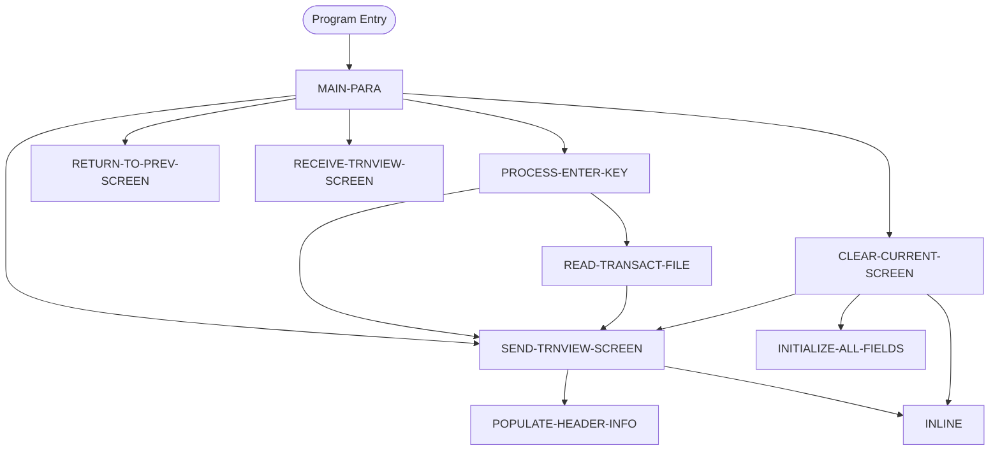

# Program: COTRN01C


---

## Quick Reference

| Attribute | Value |
|-----------|-------|
| Program ID | `COTRN01C` |
| Type | ONLINE |
| Lines | 331 |
| Source | [COTRN01C.cbl](../carddemo/COTRN01C.cbl#L1) |
| Paragraphs | 9 |
| Statements | 43 |
| Impact Risk | **HIGH** — 26 programs affected |

> **View Source:** [Open COTRN01C.cbl](../carddemo/COTRN01C.cbl#L1)

## Source Grounding Facts

| Data Item | Literal Value |
|-----------|---------------|
| `WS-PGMNAME` | `COTRN01C` |
| `WS-TRANID` | `CT01` |
| `WS-TRANSACT-FILE` | `TRANSACT` |
| `WS-ERR-FLG` | `N` |
| `WS-USR-MODIFIED` | `N` |
| `WS-TRAN-DATE` | `00/00/00` |


## Business Purpose

*Business purpose is not present in the extracted data. Run LLM enrichment to populate this section.*


## Dependency Context

> This section shows how **COTRN01C** connects to the rest of the system — who calls it,
> what it calls, and what data it shares. If linked programs exist, they must appear here.

### Programs That Call COTRN01C (Callers)

*No programs call COTRN01C — this is likely a top-level entry point or CICS transaction starter.*

### Programs Called by COTRN01C (Callees)

*COTRN01C does not call any other programs (leaf program).*

### Shared Data (Copybooks & Files)

#### Shared Copybooks

| Copybook | Also Used By | # Co-Users |
|----------|-------------|------------|
| `COCOM01Y` | COACTUPC, COACTVWC, COADM01C, COBIL00C, COCRDLIC (+15 more) | 20 |
| `COTRN01` |  | 0 |
| `COTTL01Y` | COACTUPC, COACTVWC, COADM01C, COBIL00C, COCRDLIC (+15 more) | 20 |
| `CSDAT01Y` | COACTUPC, COACTVWC, COADM01C, COBIL00C, COCRDLIC (+15 more) | 20 |
| `CSMSG01Y` | COACTUPC, COACTVWC, COADM01C, COBIL00C, COCRDLIC (+15 more) | 20 |
| `CVTRA05Y` | CBACT04C, CBEXPORT, CBIMPORT, CBTRN01C, CBTRN02C (+5 more) | 10 |
| `DFHAID` | COACTUPC, COACTVWC, COADM01C, COBIL00C, COCRDLIC (+15 more) | 20 |
| `DFHBMSCA` | COACTUPC, COACTVWC, COADM01C, COBIL00C, COCRDLIC (+15 more) | 20 |


## Legacy Data Contracts

> These tables are derived from FILE SECTION records and COPY-expanded data declarations. They preserve the legacy field names, COBOL storage type, inferred modern type, and status-code values needed for Java DTOs, SQL schemas, API contracts, and migration mapping.


### Copybook Segment Layouts

#### `COCOM01Y` as `CARDDEMO-COMMAREA`

| Legacy Field | Meaning | COBOL Type | Modern Type | Status / Format Notes |
|--------------|---------|------------|-------------|-----------------------|
| `CARDDEMO-COMMAREA` | Carddemo Commarea | `GROUP` | `OBJECT` |  |
| `CDEMO-GENERAL-INFO` | General Info | `GROUP` | `OBJECT` |  |
| `CDEMO-FROM-TRANID` | From Tranid | `PIC X(04)` | `STRING(4)` |  |
| `CDEMO-FROM-PROGRAM` | From Program | `PIC X(08)` | `STRING(8)` |  |
| `CDEMO-TO-TRANID` | To Tranid | `PIC X(04)` | `STRING(4)` |  |
| `CDEMO-TO-PROGRAM` | To Program | `PIC X(08)` | `STRING(8)` |  |
| `CDEMO-USER-ID` | User ID | `PIC X(08)` | `STRING(8)` |  |
| `CDEMO-USER-TYPE` | User Type | `PIC X(01)` | `STRING(1)` |  |
| `CDEMO-PGM-CONTEXT` | Pgm Context | `PIC 9(01)` | `INTEGER` |  |
| `CDEMO-CUSTOMER-INFO` | Customer Info | `GROUP` | `OBJECT` |  |
| `CDEMO-CUST-ID` | Customer ID | `PIC 9(09)` | `INTEGER` |  |
| `CDEMO-CUST-FNAME` | Customer Fname | `PIC X(25)` | `STRING(25)` |  |
| `CDEMO-CUST-MNAME` | Customer Mname | `PIC X(25)` | `STRING(25)` |  |
| `CDEMO-CUST-LNAME` | Customer Lname | `PIC X(25)` | `STRING(25)` |  |
| `CDEMO-ACCOUNT-INFO` | Account Info | `GROUP` | `OBJECT` |  |
| `CDEMO-ACCT-ID` | Account ID | `PIC 9(11)` | `BIGINT` |  |
| `CDEMO-ACCT-STATUS` | Account Status | `PIC X(01)` | `STRING(1)` |  |
| `CDEMO-CARD-INFO` | Card Info | `GROUP` | `OBJECT` |  |
| `CDEMO-CARD-NUM` | Card Number | `PIC 9(16)` | `BIGINT` |  |
| `CDEMO-MORE-INFO` | More Info | `GROUP` | `OBJECT` |  |
| `CDEMO-LAST-MAP` | Last Map | `PIC X(7)` | `STRING(7)` |  |
| `CDEMO-LAST-MAPSET` | Last Mapset | `PIC X(7)` | `STRING(7)` |  |

#### `COTRN01` as `COTRN1AI`

| Legacy Field | Meaning | COBOL Type | Modern Type | Status / Format Notes |
|--------------|---------|------------|-------------|-----------------------|
| `COTRN1AI` | Cotrn1Ai | `GROUP` | `OBJECT` |  |
| `COTRN1AO` | Cotrn1Ao | `GROUP` | `OBJECT` |  |

#### `COTTL01Y` as `CCDA-SCREEN-TITLE`

| Legacy Field | Meaning | COBOL Type | Modern Type | Status / Format Notes |
|--------------|---------|------------|-------------|-----------------------|
| `CCDA-SCREEN-TITLE` | Ccda Screen Title | `GROUP` | `OBJECT` |  |
| `CCDA-TITLE01` | Ccda Title01 | `PIC X(40)` | `STRING(40)` |  |
| `CCDA-TITLE02` | Ccda Title02 | `PIC X(40)` | `STRING(40)` |  |
| `CCDA-THANK-YOU` | Ccda Thank You | `PIC X(40)` | `STRING(40)` |  |

#### `CSDAT01Y` as `WS-DATE-TIME`

| Legacy Field | Meaning | COBOL Type | Modern Type | Status / Format Notes |
|--------------|---------|------------|-------------|-----------------------|
| `WS-DATE-TIME` | Date Time | `GROUP` | `OBJECT` |  |
| `WS-CURDATE-DATA` | Curdate Data | `GROUP` | `OBJECT` |  |
| `WS-CURDATE` | Curdate | `GROUP` | `OBJECT` |  |
| `WS-CURDATE-YEAR` | Curdate Year | `PIC 9(04)` | `INTEGER` |  |
| `WS-CURDATE-MONTH` | Curdate Month | `PIC 9(02)` | `INTEGER` |  |
| `WS-CURDATE-DAY` | Curdate Day | `PIC 9(02)` | `INTEGER` |  |
| `WS-CURDATE-N` | Curdate N | `PIC 9(08)` | `INTEGER` |  |
| `WS-CURTIME` | Curtime | `GROUP` | `OBJECT` |  |
| `WS-CURTIME-HOURS` | Curtime Hours | `PIC 9(02)` | `INTEGER` |  |
| `WS-CURTIME-MINUTE` | Curtime Minute | `PIC 9(02)` | `INTEGER` |  |
| `WS-CURTIME-SECOND` | Curtime Second | `PIC 9(02)` | `INTEGER` |  |
| `WS-CURTIME-MILSEC` | Curtime Milsec | `PIC 9(02)` | `INTEGER` |  |
| `WS-CURTIME-N` | Curtime N | `PIC 9(08)` | `INTEGER` |  |
| `WS-CURDATE-MM-DD-YY` | Curdate Mm Dd Yy | `GROUP` | `OBJECT` |  |
| `WS-CURDATE-MM` | Curdate Mm | `PIC 9(02)` | `INTEGER` |  |
| `FILLER` | Filler | `PIC X(01)` | `STRING(1)` |  |
| `WS-CURDATE-DD` | Curdate Dd | `PIC 9(02)` | `INTEGER` |  |
| `FILLER` | Filler | `PIC X(01)` | `STRING(1)` |  |
| `WS-CURDATE-YY` | Curdate Yy | `PIC 9(02)` | `INTEGER` |  |
| `WS-CURTIME-HH-MM-SS` | Curtime Hh Mm Ss | `GROUP` | `OBJECT` |  |
| `WS-CURTIME-HH` | Curtime Hh | `PIC 9(02)` | `INTEGER` |  |
| `FILLER` | Filler | `PIC X(01)` | `STRING(1)` |  |
| `WS-CURTIME-MM` | Curtime Mm | `PIC 9(02)` | `INTEGER` |  |
| `FILLER` | Filler | `PIC X(01)` | `STRING(1)` |  |
| `WS-CURTIME-SS` | Curtime Ss | `PIC 9(02)` | `INTEGER` |  |
| `WS-TIMESTAMP` | Timestamp | `GROUP` | `OBJECT` |  |
| `WS-TIMESTAMP-DT-YYYY` | Timestamp Date Yyyy | `PIC 9(04)` | `INTEGER` |  |
| `FILLER` | Filler | `PIC X(01)` | `STRING(1)` |  |
| `WS-TIMESTAMP-DT-MM` | Timestamp Date Mm | `PIC 9(02)` | `INTEGER` |  |
| `FILLER` | Filler | `PIC X(01)` | `STRING(1)` |  |
| `WS-TIMESTAMP-DT-DD` | Timestamp Date Dd | `PIC 9(02)` | `INTEGER` |  |
| `FILLER` | Filler | `PIC X(01)` | `STRING(1)` |  |
| `WS-TIMESTAMP-TM-HH` | Timestamp Tm Hh | `PIC 9(02)` | `INTEGER` |  |
| `FILLER` | Filler | `PIC X(01)` | `STRING(1)` |  |
| `WS-TIMESTAMP-TM-MM` | Timestamp Tm Mm | `PIC 9(02)` | `INTEGER` |  |
| `FILLER` | Filler | `PIC X(01)` | `STRING(1)` |  |
| `WS-TIMESTAMP-TM-SS` | Timestamp Tm Ss | `PIC 9(02)` | `INTEGER` |  |
| `FILLER` | Filler | `PIC X(01)` | `STRING(1)` |  |
| `WS-TIMESTAMP-TM-MS6` | Timestamp Tm Ms6 | `PIC 9(06)` | `INTEGER` |  |

#### `CSMSG01Y` as `CCDA-COMMON-MESSAGES`

| Legacy Field | Meaning | COBOL Type | Modern Type | Status / Format Notes |
|--------------|---------|------------|-------------|-----------------------|
| `CCDA-COMMON-MESSAGES` | Ccda Common Messages | `GROUP` | `OBJECT` |  |
| `CCDA-MSG-THANK-YOU` | Ccda Msg Thank You | `PIC X(50)` | `STRING(50)` |  |
| `CCDA-MSG-INVALID-KEY` | Ccda Msg Invalid Key | `PIC X(50)` | `STRING(50)` |  |

#### `CVTRA05Y` as `TRAN-RECORD`

| Legacy Field | Meaning | COBOL Type | Modern Type | Status / Format Notes |
|--------------|---------|------------|-------------|-----------------------|
| `TRAN-RECORD` | Tran Record | `GROUP` | `OBJECT` |  |
| `TRAN-ID` | Tran ID | `PIC X(16)` | `STRING(16)` |  |
| `TRAN-TYPE-CD` | Tran Type Cd | `PIC X(02)` | `STRING(2)` |  |
| `TRAN-CAT-CD` | Tran Cat Cd | `PIC 9(04)` | `INTEGER` |  |
| `TRAN-SOURCE` | Tran Source | `PIC X(10)` | `STRING(10)` |  |
| `TRAN-DESC` | Tran Desc | `PIC X(100)` | `STRING(100)` |  |
| `TRAN-AMT` | Tran Amount | `PIC S9(09)V99` | `DECIMAL(11,2)` |  |
| `TRAN-MERCHANT-ID` | Tran Merchant ID | `PIC 9(09)` | `INTEGER` |  |
| `TRAN-MERCHANT-NAME` | Tran Merchant Name | `PIC X(50)` | `STRING(50)` |  |
| `TRAN-MERCHANT-CITY` | Tran Merchant City | `PIC X(50)` | `STRING(50)` |  |
| `TRAN-MERCHANT-ZIP` | Tran Merchant Zip | `PIC X(10)` | `STRING(10)` |  |
| `TRAN-CARD-NUM` | Tran Card Number | `PIC X(16)` | `STRING(16)` |  |
| `TRAN-ORIG-TS` | Tran Orig Ts | `PIC X(26)` | `STRING(26)` |  |
| `TRAN-PROC-TS` | Tran Proc Ts | `PIC X(26)` | `STRING(26)` |  |
| `FILLER` | Filler | `PIC X(20)` | `STRING(20)` |  |

#### `DFHAID` as `DFHAID`

| Legacy Field | Meaning | COBOL Type | Modern Type | Status / Format Notes |
|--------------|---------|------------|-------------|-----------------------|
| `DFHAID` | Dfhaid | `GROUP` | `OBJECT` |  |

#### `DFHBMSCA` as `DFHBMSCA`

| Legacy Field | Meaning | COBOL Type | Modern Type | Status / Format Notes |
|--------------|---------|------------|-------------|-----------------------|
| `DFHBMSCA` | Dfhbmsca | `GROUP` | `OBJECT` |  |


### Data Movement And Key Mapping

| Line | Source | Target | Meaning |
|------|--------|--------|---------|
| 91 | `SPACES` | `WS-MESSAGE` | SPACES populates WS-MESSAGE |
| 130 | `CCDA-MSG-INVALID-KEY` | `WS-MESSAGE` | CCDA-MSG-INVALID-KEY populates WS-MESSAGE |
| 177 | `TRAN-AMT` | `WS-TRAN-AMT` | TRAN-AMT populates WS-TRAN-AMT |
| 183 | `WS-TRAN-AMT` | `TRNAMTI OF COTRN1AI` | WS-TRAN-AMT populates TRNAMTI OF COTRN1AI |
| 217 | `WS-MESSAGE` | `ERRMSGO OF COTRN1AO` | WS-MESSAGE populates ERRMSGO OF COTRN1AO |
| 245 | `FUNCTION CURRENT-DATE` | `WS-CURDATE-DATA` | FUNCTION CURRENT-DATE populates WS-CURDATE-DATA |
| 252 | `WS-CURDATE-MONTH` | `WS-CURDATE-MM` | WS-CURDATE-MONTH populates WS-CURDATE-MM |
| 253 | `WS-CURDATE-DAY` | `WS-CURDATE-DD` | WS-CURDATE-DAY populates WS-CURDATE-DD |
| 254 | `WS-CURDATE-YEAR(3:2)` | `WS-CURDATE-YY` | WS-CURDATE-YEAR(3:2) populates WS-CURDATE-YY |
| 256 | `WS-CURDATE-MM-DD-YY` | `CURDATEO OF COTRN1AO` | WS-CURDATE-MM-DD-YY populates CURDATEO OF COTRN1AO |


---

## Dependency Graph

```mermaid
flowchart TD
    COTRN01C["⬤ COTRN01C"]:::target
    CB_COCOM01Y{{"COCOM01Y"}}:::copybook
    COTRN01C -.- CB_COCOM01Y
    COACTUPC["COACTUPC"]:::coupled
    CB_COCOM01Y -.- COACTUPC
    COACTVWC["COACTVWC"]:::coupled
    CB_COCOM01Y -.- COACTVWC
    COADM01C["COADM01C"]:::coupled
    CB_COCOM01Y -.- COADM01C
    CB_COTTL01Y{{"COTTL01Y"}}:::copybook
    COTRN01C -.- CB_COTTL01Y
    COACTUPC["COACTUPC"]:::coupled
    CB_COTTL01Y -.- COACTUPC
    COACTVWC["COACTVWC"]:::coupled
    CB_COTTL01Y -.- COACTVWC
    COADM01C["COADM01C"]:::coupled
    CB_COTTL01Y -.- COADM01C
    CB_CSDAT01Y{{"CSDAT01Y"}}:::copybook
    COTRN01C -.- CB_CSDAT01Y
    COACTUPC["COACTUPC"]:::coupled
    CB_CSDAT01Y -.- COACTUPC
    COACTVWC["COACTVWC"]:::coupled
    CB_CSDAT01Y -.- COACTVWC
    COADM01C["COADM01C"]:::coupled
    CB_CSDAT01Y -.- COADM01C
    CB_CSMSG01Y{{"CSMSG01Y"}}:::copybook
    COTRN01C -.- CB_CSMSG01Y
    COACTUPC["COACTUPC"]:::coupled
    CB_CSMSG01Y -.- COACTUPC
    COACTVWC["COACTVWC"]:::coupled
    CB_CSMSG01Y -.- COACTVWC
    COADM01C["COADM01C"]:::coupled
    CB_CSMSG01Y -.- COADM01C
    CB_CVTRA05Y{{"CVTRA05Y"}}:::copybook
    COTRN01C -.- CB_CVTRA05Y
    CBACT04C["CBACT04C"]:::coupled
    CB_CVTRA05Y -.- CBACT04C
    CBEXPORT["CBEXPORT"]:::coupled
    CB_CVTRA05Y -.- CBEXPORT
    CBIMPORT["CBIMPORT"]:::coupled
    CB_CVTRA05Y -.- CBIMPORT
    CB_DFHAID{{"DFHAID"}}:::copybook
    COTRN01C -.- CB_DFHAID
    COACTUPC["COACTUPC"]:::coupled
    CB_DFHAID -.- COACTUPC
    COACTVWC["COACTVWC"]:::coupled
    CB_DFHAID -.- COACTVWC
    COADM01C["COADM01C"]:::coupled
    CB_DFHAID -.- COADM01C
    CB_DFHBMSCA{{"DFHBMSCA"}}:::copybook
    COTRN01C -.- CB_DFHBMSCA
    COACTUPC["COACTUPC"]:::coupled
    CB_DFHBMSCA -.- COACTUPC
    COACTVWC["COACTVWC"]:::coupled
    CB_DFHBMSCA -.- COACTVWC
    COADM01C["COADM01C"]:::coupled
    CB_DFHBMSCA -.- COADM01C
    classDef target fill:#f85149,stroke:#da3633,color:#fff,stroke-width:3px
    classDef caller fill:#58a6ff,stroke:#1f6feb,color:#fff
    classDef callee fill:#3fb950,stroke:#238636,color:#fff
    classDef copybook fill:#d29922,stroke:#9e6a03,color:#fff
    classDef coupled fill:#d29922,stroke:#9e6a03,color:#fff,stroke-dasharray:5
    classDef transitive fill:#484f58,stroke:#8b949e,color:#c9d1d9,stroke-dasharray:5
```



> **Legend:** 🔴 Target program · 🔵 Direct callers · 🟢 Direct callees · 🟡 Copybook-coupled · ⚫ Transitive (indirect)

---

## Impact Ripple View

> **If you change COTRN01C, what else could break?**

| Impact Metric | Count |
|--------------|-------|
| Direct Callers | 0 |
| Transitive Callers (callers of callers) | 0 |
| Direct Callees | 0 |
| Transitive Callees | 0 |
| Copybook-Coupled Programs | 26 |
| **Total Impact** | **26** |
| **Risk Rating** | **HIGH** |


**Programs affected via shared copybooks:**
- `CBACT04C`
- `CBEXPORT`
- `CBIMPORT`
- `CBTRN01C`
- `CBTRN02C`
- `CBTRN03C`
- `COACTUPC`
- `COACTVWC`
- `COADM01C`
- `COBIL00C`
- `COCRDLIC`
- `COCRDSLC`
- `COCRDUPC`
- `COMEN01C`
- `COPAUS0C`
- `COPAUS1C`
- `CORPT00C`
- `COSGN00C`
- `COTRN00C`
- `COTRN02C`
- `COTRTLIC`
- `COTRTUPC`
- `COUSR00C`
- `COUSR01C`
- `COUSR02C`
- `COUSR03C`

---

## Statement Profile

| Statement Type | Count |
|---------------|-------|
| MOVE | 20 |
| IF | 11 |
| EXEC_CICS | 5 |
| PERFORM | 3 |
| SET | 2 |
| EVALUATE | 2 |

## Control Flow



## Paragraphs

### MAIN-PARA

| | |
|---|---|
| **Paragraph** | `MAIN-PARA` |
| **Lines** | 86 - 143 |
| **View Code** | [Jump to Line 86](../carddemo/COTRN01C.cbl#L86) |


### PROCESS-ENTER-KEY

| | |
|---|---|
| **Paragraph** | `PROCESS-ENTER-KEY` |
| **Lines** | 144 - 196 |
| **View Code** | [Jump to Line 144](../carddemo/COTRN01C.cbl#L144) |


### RETURN-TO-PREV-SCREEN

| | |
|---|---|
| **Paragraph** | `RETURN-TO-PREV-SCREEN` |
| **Lines** | 197 - 212 |
| **View Code** | [Jump to Line 197](../carddemo/COTRN01C.cbl#L197) |


### SEND-TRNVIEW-SCREEN

| | |
|---|---|
| **Paragraph** | `SEND-TRNVIEW-SCREEN` |
| **Lines** | 213 - 229 |
| **View Code** | [Jump to Line 213](../carddemo/COTRN01C.cbl#L213) |


### RECEIVE-TRNVIEW-SCREEN

| | |
|---|---|
| **Paragraph** | `RECEIVE-TRNVIEW-SCREEN` |
| **Lines** | 230 - 242 |
| **View Code** | [Jump to Line 230](../carddemo/COTRN01C.cbl#L230) |


### POPULATE-HEADER-INFO

| | |
|---|---|
| **Paragraph** | `POPULATE-HEADER-INFO` |
| **Lines** | 243 - 266 |
| **View Code** | [Jump to Line 243](../carddemo/COTRN01C.cbl#L243) |


### READ-TRANSACT-FILE

| | |
|---|---|
| **Paragraph** | `READ-TRANSACT-FILE` |
| **Lines** | 267 - 300 |
| **View Code** | [Jump to Line 267](../carddemo/COTRN01C.cbl#L267) |


### CLEAR-CURRENT-SCREEN

| | |
|---|---|
| **Paragraph** | `CLEAR-CURRENT-SCREEN` |
| **Lines** | 301 - 308 |
| **View Code** | [Jump to Line 301](../carddemo/COTRN01C.cbl#L301) |


### INITIALIZE-ALL-FIELDS

| | |
|---|---|
| **Paragraph** | `INITIALIZE-ALL-FIELDS` |
| **Lines** | 309 - 330 |
| **View Code** | [Jump to Line 309](../carddemo/COTRN01C.cbl#L309) |


## Copybook Field Dictionaries

The following copybooks are included by this program. Each entry shows the actual fields
extracted from the copybook source file (`.cpy`).

### Copybook `COCOM01Y`

| Level | Field | PIC | USAGE | Parent | Notes |
|-------|-------|-----|-------|--------|-------|
| `01` | `CARDDEMO-COMMAREA` | `None` | None | None |  |
| `05` | `CDEMO-GENERAL-INFO` | `None` | None | CARDDEMO-COMMAREA |  |
| `10` | `CDEMO-FROM-TRANID` | `X(04)` | None | CDEMO-GENERAL-INFO |  |
| `10` | `CDEMO-FROM-PROGRAM` | `X(08)` | None | CDEMO-GENERAL-INFO |  |
| `10` | `CDEMO-TO-TRANID` | `X(04)` | None | CDEMO-GENERAL-INFO |  |
| `10` | `CDEMO-TO-PROGRAM` | `X(08)` | None | CDEMO-GENERAL-INFO |  |
| `10` | `CDEMO-USER-ID` | `X(08)` | None | CDEMO-GENERAL-INFO |  |
| `10` | `CDEMO-USER-TYPE` | `X(01)` | None | CDEMO-GENERAL-INFO |  |
| `88` | `CDEMO-USRTYP-ADMIN` | `None` | None | CDEMO-GENERAL-INFO |  |
| `88` | `CDEMO-USRTYP-USER` | `None` | None | CDEMO-GENERAL-INFO |  |
| `10` | `CDEMO-PGM-CONTEXT` | `9(01)` | None | CDEMO-GENERAL-INFO |  |
| `88` | `CDEMO-PGM-ENTER` | `None` | None | CDEMO-GENERAL-INFO |  |
| `88` | `CDEMO-PGM-REENTER` | `None` | None | CDEMO-GENERAL-INFO |  |
| `05` | `CDEMO-CUSTOMER-INFO` | `None` | None | CARDDEMO-COMMAREA |  |
| `10` | `CDEMO-CUST-ID` | `9(09)` | None | CDEMO-CUSTOMER-INFO |  |
| `10` | `CDEMO-CUST-FNAME` | `X(25)` | None | CDEMO-CUSTOMER-INFO |  |
| `10` | `CDEMO-CUST-MNAME` | `X(25)` | None | CDEMO-CUSTOMER-INFO |  |
| `10` | `CDEMO-CUST-LNAME` | `X(25)` | None | CDEMO-CUSTOMER-INFO |  |
| `05` | `CDEMO-ACCOUNT-INFO` | `None` | None | CARDDEMO-COMMAREA |  |
| `10` | `CDEMO-ACCT-ID` | `9(11)` | None | CDEMO-ACCOUNT-INFO |  |
| `10` | `CDEMO-ACCT-STATUS` | `X(01)` | None | CDEMO-ACCOUNT-INFO |  |
| `05` | `CDEMO-CARD-INFO` | `None` | None | CARDDEMO-COMMAREA |  |
| `10` | `CDEMO-CARD-NUM` | `9(16)` | None | CDEMO-CARD-INFO |  |
| `05` | `CDEMO-MORE-INFO` | `None` | None | CARDDEMO-COMMAREA |  |
| `10` | `CDEMO-LAST-MAP` | `X(7)` | None | CDEMO-MORE-INFO |  |
| `10` | `CDEMO-LAST-MAPSET` | `X(7)` | None | CDEMO-MORE-INFO |  |

### Copybook `COTRN01`

| Level | Field | PIC | USAGE | Parent | Notes |
|-------|-------|-----|-------|--------|-------|
| `01` | `COTRN1AI` | `None` | None | None |  |
| `02` | `TRNNAMEL` | `S9(4)` | COMP | COTRN1AI |  |
| `02` | `TRNNAMEF` | `X` | None | COTRN1AI |  |
| `03` | `TRNNAMEA` | `X` | None | COTRN1AI |  |
| `02` | `TRNNAMEI` | `X(4)` | None | COTRN1AI |  |
| `02` | `TITLE01L` | `S9(4)` | COMP | COTRN1AI |  |
| `02` | `TITLE01F` | `X` | None | COTRN1AI |  |
| `03` | `TITLE01A` | `X` | None | COTRN1AI |  |
| `02` | `TITLE01I` | `X(40)` | None | COTRN1AI |  |
| `02` | `CURDATEL` | `S9(4)` | COMP | COTRN1AI |  |
| `02` | `CURDATEF` | `X` | None | COTRN1AI |  |
| `03` | `CURDATEA` | `X` | None | COTRN1AI |  |
| `02` | `CURDATEI` | `X(8)` | None | COTRN1AI |  |
| `02` | `PGMNAMEL` | `S9(4)` | COMP | COTRN1AI |  |
| `02` | `PGMNAMEF` | `X` | None | COTRN1AI |  |
| `03` | `PGMNAMEA` | `X` | None | COTRN1AI |  |
| `02` | `PGMNAMEI` | `X(8)` | None | COTRN1AI |  |
| `02` | `TITLE02L` | `S9(4)` | COMP | COTRN1AI |  |
| `02` | `TITLE02F` | `X` | None | COTRN1AI |  |
| `03` | `TITLE02A` | `X` | None | COTRN1AI |  |
| `02` | `TITLE02I` | `X(40)` | None | COTRN1AI |  |
| `02` | `CURTIMEL` | `S9(4)` | COMP | COTRN1AI |  |
| `02` | `CURTIMEF` | `X` | None | COTRN1AI |  |
| `03` | `CURTIMEA` | `X` | None | COTRN1AI |  |
| `02` | `CURTIMEI` | `X(8)` | None | COTRN1AI |  |
| `02` | `TRNIDINL` | `S9(4)` | COMP | COTRN1AI |  |
| `02` | `TRNIDINF` | `X` | None | COTRN1AI |  |
| `03` | `TRNIDINA` | `X` | None | COTRN1AI |  |
| `02` | `TRNIDINI` | `X(16)` | None | COTRN1AI |  |
| `02` | `TRNIDL` | `S9(4)` | COMP | COTRN1AI |  |
| `02` | `TRNIDF` | `X` | None | COTRN1AI |  |
| `03` | `TRNIDA` | `X` | None | COTRN1AI |  |
| `02` | `TRNIDI` | `X(16)` | None | COTRN1AI |  |
| `02` | `CARDNUML` | `S9(4)` | COMP | COTRN1AI |  |
| `02` | `CARDNUMF` | `X` | None | COTRN1AI |  |
| `03` | `CARDNUMA` | `X` | None | COTRN1AI |  |
| `02` | `CARDNUMI` | `X(16)` | None | COTRN1AI |  |
| `02` | `TTYPCDL` | `S9(4)` | COMP | COTRN1AI |  |
| `02` | `TTYPCDF` | `X` | None | COTRN1AI |  |
| `03` | `TTYPCDA` | `X` | None | COTRN1AI |  |
| `02` | `TTYPCDI` | `X(2)` | None | COTRN1AI |  |
| `02` | `TCATCDL` | `S9(4)` | COMP | COTRN1AI |  |
| `02` | `TCATCDF` | `X` | None | COTRN1AI |  |
| `03` | `TCATCDA` | `X` | None | COTRN1AI |  |
| `02` | `TCATCDI` | `X(4)` | None | COTRN1AI |  |
| `02` | `TRNSRCL` | `S9(4)` | COMP | COTRN1AI |  |
| `02` | `TRNSRCF` | `X` | None | COTRN1AI |  |
| `03` | `TRNSRCA` | `X` | None | COTRN1AI |  |
| `02` | `TRNSRCI` | `X(10)` | None | COTRN1AI |  |
| `02` | `TDESCL` | `S9(4)` | COMP | COTRN1AI |  |
*+ 141 more fields*
### Copybook `COTTL01Y`

| Level | Field | PIC | USAGE | Parent | Notes |
|-------|-------|-----|-------|--------|-------|
| `01` | `CCDA-SCREEN-TITLE` | `None` | None | None |  |
| `05` | `CCDA-TITLE01` | `X(40)` | None | CCDA-SCREEN-TITLE |  |
| `05` | `CCDA-TITLE02` | `X(40)` | None | CCDA-SCREEN-TITLE |  |
| `05` | `CCDA-THANK-YOU` | `X(40)` | None | CCDA-SCREEN-TITLE |  |

### Copybook `CSDAT01Y`

| Level | Field | PIC | USAGE | Parent | Notes |
|-------|-------|-----|-------|--------|-------|
| `01` | `WS-DATE-TIME` | `None` | None | None |  |
| `05` | `WS-CURDATE-DATA` | `None` | None | WS-DATE-TIME |  |
| `10` | `WS-CURDATE` | `None` | None | WS-CURDATE-DATA |  |
| `15` | `WS-CURDATE-YEAR` | `9(04)` | None | WS-CURDATE |  |
| `15` | `WS-CURDATE-MONTH` | `9(02)` | None | WS-CURDATE |  |
| `15` | `WS-CURDATE-DAY` | `9(02)` | None | WS-CURDATE |  |
| `10` | `WS-CURDATE-N` | `9(08)` | None | WS-CURDATE-DATA |  REDEFINES WS-CURDATE |
| `10` | `WS-CURTIME` | `None` | None | WS-CURDATE-DATA |  |
| `15` | `WS-CURTIME-HOURS` | `9(02)` | None | WS-CURTIME |  |
| `15` | `WS-CURTIME-MINUTE` | `9(02)` | None | WS-CURTIME |  |
| `15` | `WS-CURTIME-SECOND` | `9(02)` | None | WS-CURTIME |  |
| `15` | `WS-CURTIME-MILSEC` | `9(02)` | None | WS-CURTIME |  |
| `10` | `WS-CURTIME-N` | `9(08)` | None | WS-CURDATE-DATA |  REDEFINES WS-CURTIME |
| `05` | `WS-CURDATE-MM-DD-YY` | `None` | None | WS-DATE-TIME |  |
| `10` | `WS-CURDATE-MM` | `9(02)` | None | WS-CURDATE-MM-DD-YY |  |
| `10` | `WS-CURDATE-DD` | `9(02)` | None | WS-CURDATE-MM-DD-YY |  |
| `10` | `WS-CURDATE-YY` | `9(02)` | None | WS-CURDATE-MM-DD-YY |  |
| `05` | `WS-CURTIME-HH-MM-SS` | `None` | None | WS-DATE-TIME |  |
| `10` | `WS-CURTIME-HH` | `9(02)` | None | WS-CURTIME-HH-MM-SS |  |
| `10` | `WS-CURTIME-MM` | `9(02)` | None | WS-CURTIME-HH-MM-SS |  |
| `10` | `WS-CURTIME-SS` | `9(02)` | None | WS-CURTIME-HH-MM-SS |  |
| `05` | `WS-TIMESTAMP` | `None` | None | WS-DATE-TIME |  |
| `10` | `WS-TIMESTAMP-DT-YYYY` | `9(04)` | None | WS-TIMESTAMP |  |
| `10` | `WS-TIMESTAMP-DT-MM` | `9(02)` | None | WS-TIMESTAMP |  |
| `10` | `WS-TIMESTAMP-DT-DD` | `9(02)` | None | WS-TIMESTAMP |  |
| `10` | `WS-TIMESTAMP-TM-HH` | `9(02)` | None | WS-TIMESTAMP |  |
| `10` | `WS-TIMESTAMP-TM-MM` | `9(02)` | None | WS-TIMESTAMP |  |
| `10` | `WS-TIMESTAMP-TM-SS` | `9(02)` | None | WS-TIMESTAMP |  |
| `10` | `WS-TIMESTAMP-TM-MS6` | `9(06)` | None | WS-TIMESTAMP |  |

### Copybook `CSMSG01Y`

| Level | Field | PIC | USAGE | Parent | Notes |
|-------|-------|-----|-------|--------|-------|
| `01` | `CCDA-COMMON-MESSAGES` | `None` | None | None |  |
| `05` | `CCDA-MSG-THANK-YOU` | `X(50)` | None | CCDA-COMMON-MESSAGES |  |
| `05` | `CCDA-MSG-INVALID-KEY` | `X(50)` | None | CCDA-COMMON-MESSAGES |  |

### Copybook `CVTRA05Y`

| Level | Field | PIC | USAGE | Parent | Notes |
|-------|-------|-----|-------|--------|-------|
| `01` | `TRAN-RECORD` | `None` | None | None |  |
| `05` | `TRAN-ID` | `X(16)` | None | TRAN-RECORD |  |
| `05` | `TRAN-TYPE-CD` | `X(02)` | None | TRAN-RECORD |  |
| `05` | `TRAN-CAT-CD` | `9(04)` | None | TRAN-RECORD |  |
| `05` | `TRAN-SOURCE` | `X(10)` | None | TRAN-RECORD |  |
| `05` | `TRAN-DESC` | `X(100)` | None | TRAN-RECORD |  |
| `05` | `TRAN-AMT` | `S9(09)V99` | None | TRAN-RECORD |  |
| `05` | `TRAN-MERCHANT-ID` | `9(09)` | None | TRAN-RECORD |  |
| `05` | `TRAN-MERCHANT-NAME` | `X(50)` | None | TRAN-RECORD |  |
| `05` | `TRAN-MERCHANT-CITY` | `X(50)` | None | TRAN-RECORD |  |
| `05` | `TRAN-MERCHANT-ZIP` | `X(10)` | None | TRAN-RECORD |  |
| `05` | `TRAN-CARD-NUM` | `X(16)` | None | TRAN-RECORD |  |
| `05` | `TRAN-ORIG-TS` | `X(26)` | None | TRAN-RECORD |  |
| `05` | `TRAN-PROC-TS` | `X(26)` | None | TRAN-RECORD |  |

### Copybook `DFHAID`

| Level | Field | PIC | USAGE | Parent | Notes |
|-------|-------|-----|-------|--------|-------|
| `01` | `DFHAID` | `None` | None | None |  |
| `02` | `DFHENTER` | `X` | None | DFHAID |  |
| `02` | `DFHCLEAR` | `X` | None | DFHAID |  |
| `02` | `DFHCLRP` | `X` | None | DFHAID |  |
| `02` | `DFHPA1` | `X` | None | DFHAID |  |
| `02` | `DFHPA2` | `X` | None | DFHAID |  |
| `02` | `DFHPA3` | `X` | None | DFHAID |  |
| `02` | `DFHPF1` | `X` | None | DFHAID |  |
| `02` | `DFHPF2` | `X` | None | DFHAID |  |
| `02` | `DFHPF3` | `X` | None | DFHAID |  |
| `02` | `DFHPF4` | `X` | None | DFHAID |  |
| `02` | `DFHPF5` | `X` | None | DFHAID |  |
| `02` | `DFHPF6` | `X` | None | DFHAID |  |
| `02` | `DFHPF7` | `X` | None | DFHAID |  |
| `02` | `DFHPF8` | `X` | None | DFHAID |  |
| `02` | `DFHPF9` | `X` | None | DFHAID |  |
| `02` | `DFHPF10` | `X` | None | DFHAID |  |
| `02` | `DFHPF11` | `X` | None | DFHAID |  |
| `02` | `DFHPF12` | `X` | None | DFHAID |  |
| `02` | `DFHPF13` | `X` | None | DFHAID |  |
| `02` | `DFHPF14` | `X` | None | DFHAID |  |
| `02` | `DFHPF15` | `X` | None | DFHAID |  |
| `02` | `DFHPF16` | `X` | None | DFHAID |  |
| `02` | `DFHPF17` | `X` | None | DFHAID |  |
| `02` | `DFHPF18` | `X` | None | DFHAID |  |
| `02` | `DFHPF19` | `X` | None | DFHAID |  |
| `02` | `DFHPF20` | `X` | None | DFHAID |  |
| `02` | `DFHPF21` | `X` | None | DFHAID |  |
| `02` | `DFHPF22` | `X` | None | DFHAID |  |
| `02` | `DFHPF23` | `X` | None | DFHAID |  |
| `02` | `DFHPF24` | `X` | None | DFHAID |  |
| `02` | `DFHPEN` | `X` | None | DFHAID |  |
| `02` | `DFHOPID` | `X` | None | DFHAID |  |
| `02` | `DFHMSRE` | `X` | None | DFHAID |  |
| `02` | `DFHSTRF` | `X` | None | DFHAID |  |
| `02` | `DFHTRIG` | `X` | None | DFHAID |  |

### Copybook `DFHBMSCA`

| Level | Field | PIC | USAGE | Parent | Notes |
|-------|-------|-----|-------|--------|-------|
| `01` | `DFHBMSCA` | `None` | None | None |  |
| `02` | `DFHBMPEM` | `X` | None | DFHBMSCA |  |
| `02` | `DFHBMPNL` | `X` | None | DFHBMSCA |  |
| `02` | `DFHBMASK` | `X` | None | DFHBMSCA |  |
| `02` | `DFHBMUNP` | `X` | None | DFHBMSCA |  |
| `02` | `DFHBMUNN` | `X` | None | DFHBMSCA |  |
| `02` | `DFHBMPRO` | `X` | None | DFHBMSCA |  |
| `02` | `DFHBMBRY` | `X` | None | DFHBMSCA |  |
| `02` | `DFHBMDAR` | `X` | None | DFHBMSCA |  |
| `02` | `DFHBMFSE` | `X` | None | DFHBMSCA |  |
| `02` | `DFHBMPRF` | `X` | None | DFHBMSCA |  |
| `02` | `DFHBMASF` | `X` | None | DFHBMSCA |  |
| `02` | `DFHBMASB` | `X` | None | DFHBMSCA |  |
| `02` | `DFHBMEOF` | `X` | None | DFHBMSCA |  |
| `02` | `DFHBMEC` | `X` | None | DFHBMSCA |  |
| `02` | `DFHSA` | `X` | None | DFHBMSCA |  |
| `02` | `DFHCOLOR` | `X` | None | DFHBMSCA |  |
| `02` | `DFHPS` | `X` | None | DFHBMSCA |  |
| `02` | `DFHHLT` | `X` | None | DFHBMSCA |  |
| `02` | `DFHVAL` | `X` | None | DFHBMSCA |  |
| `02` | `DFHOUTLN` | `X` | None | DFHBMSCA |  |
| `02` | `DFHBKTRN` | `X` | None | DFHBMSCA |  |
| `02` | `DFHALL` | `X` | None | DFHBMSCA |  |
| `02` | `DFHERROR` | `X` | None | DFHBMSCA |  |
| `02` | `DFHDFT` | `X` | None | DFHBMSCA |  |
| `02` | `DFHDFCOL` | `X` | None | DFHBMSCA |  |
| `02` | `DFHBLUE` | `X` | None | DFHBMSCA |  |
| `02` | `DFHRED` | `X` | None | DFHBMSCA |  |
| `02` | `DFHPINK` | `X` | None | DFHBMSCA |  |
| `02` | `DFHGREEN` | `X` | None | DFHBMSCA |  |
| `02` | `DFHTURQ` | `X` | None | DFHBMSCA |  |
| `02` | `DFHYELLO` | `X` | None | DFHBMSCA |  |
| `02` | `DFHWHTE` | `X` | None | DFHBMSCA |  |
| `02` | `CATTR-H-UNPROT` | `X` | None | DFHBMSCA |  |
| `02` | `CATTR-H-UNPROT-FSET` | `X` | None | DFHBMSCA |  |
| `02` | `CATTR-H-UNPROT-NUM` | `X` | None | DFHBMSCA |  |
| `02` | `CATTR-H-ASKIP` | `X` | None | DFHBMSCA |  |


## Data Lineage (MOVE Flow)

The following MOVE statements were extracted from the source. Each row is a `source → destination`
flow that the migration team can use to trace how data is reshaped and routed.

| Source | Destination | Paragraph | Line |
|--------|-------------|-----------|------|
| `SPACES` | `WS-MESSAGE` | MAIN-PARA | 91 |
| `'COSGN00C'` | `CDEMO-TO-PROGRAM` | MAIN-PARA | 95 |
| `DFHCOMMAREA(1:EIBCALEN)` | `CARDDEMO-COMMAREA` | MAIN-PARA | 98 |
| `LOW-VALUES` | `COTRN1AO` | MAIN-PARA | 101 |
| `'-1'` | `TRNIDINL` | MAIN-PARA | 102 |
| `'-1'` | `OF` | MAIN-PARA | 102 |
| `'-1'` | `COTRN1AI` | MAIN-PARA | 102 |
| `'COMEN01C'` | `CDEMO-TO-PROGRAM` | MAIN-PARA | 117 |
| `'COTRN00C'` | `CDEMO-TO-PROGRAM` | MAIN-PARA | 126 |
| `'Y'` | `WS-ERR-FLG` | MAIN-PARA | 129 |
| `CCDA-MSG-INVALID-KEY` | `WS-MESSAGE` | MAIN-PARA | 130 |
| `'Y'` | `WS-ERR-FLG` | PROCESS-ENTER-KEY | 148 |
| `'-1'` | `TRNIDINL` | PROCESS-ENTER-KEY | 151 |
| `'-1'` | `OF` | PROCESS-ENTER-KEY | 151 |
| `'-1'` | `COTRN1AI` | PROCESS-ENTER-KEY | 151 |
| `'-1'` | `TRNIDINL` | PROCESS-ENTER-KEY | 154 |
| `'-1'` | `OF` | PROCESS-ENTER-KEY | 154 |
| `'-1'` | `COTRN1AI` | PROCESS-ENTER-KEY | 154 |
| `SPACES` | `TRNIDI` | PROCESS-ENTER-KEY | 159 |
| `SPACES` | `OF` | PROCESS-ENTER-KEY | 159 |
| `SPACES` | `COTRN1AI` | PROCESS-ENTER-KEY | 159 |
| `TRAN-AMT` | `WS-TRAN-AMT` | PROCESS-ENTER-KEY | 177 |
| `TRAN-ID` | `TRNIDI` | PROCESS-ENTER-KEY | 178 |
| `TRAN-ID` | `OF` | PROCESS-ENTER-KEY | 178 |
| `TRAN-ID` | `COTRN1AI` | PROCESS-ENTER-KEY | 178 |
| `TRAN-CARD-NUM` | `CARDNUMI` | PROCESS-ENTER-KEY | 179 |
| `TRAN-CARD-NUM` | `OF` | PROCESS-ENTER-KEY | 179 |
| `TRAN-CARD-NUM` | `COTRN1AI` | PROCESS-ENTER-KEY | 179 |
| `TRAN-TYPE-CD` | `TTYPCDI` | PROCESS-ENTER-KEY | 180 |
| `TRAN-TYPE-CD` | `OF` | PROCESS-ENTER-KEY | 180 |
| `TRAN-TYPE-CD` | `COTRN1AI` | PROCESS-ENTER-KEY | 180 |
| `TRAN-CAT-CD` | `TCATCDI` | PROCESS-ENTER-KEY | 181 |
| `TRAN-CAT-CD` | `OF` | PROCESS-ENTER-KEY | 181 |
| `TRAN-CAT-CD` | `COTRN1AI` | PROCESS-ENTER-KEY | 181 |
| `TRAN-SOURCE` | `TRNSRCI` | PROCESS-ENTER-KEY | 182 |
| `TRAN-SOURCE` | `OF` | PROCESS-ENTER-KEY | 182 |
| `TRAN-SOURCE` | `COTRN1AI` | PROCESS-ENTER-KEY | 182 |
| `WS-TRAN-AMT` | `TRNAMTI` | PROCESS-ENTER-KEY | 183 |
| `WS-TRAN-AMT` | `OF` | PROCESS-ENTER-KEY | 183 |
| `WS-TRAN-AMT` | `COTRN1AI` | PROCESS-ENTER-KEY | 183 |
| `TRAN-DESC` | `TDESCI` | PROCESS-ENTER-KEY | 184 |
| `TRAN-DESC` | `OF` | PROCESS-ENTER-KEY | 184 |
| `TRAN-DESC` | `COTRN1AI` | PROCESS-ENTER-KEY | 184 |
| `TRAN-ORIG-TS` | `TORIGDTI` | PROCESS-ENTER-KEY | 185 |
| `TRAN-ORIG-TS` | `OF` | PROCESS-ENTER-KEY | 185 |
| `TRAN-ORIG-TS` | `COTRN1AI` | PROCESS-ENTER-KEY | 185 |
| `TRAN-PROC-TS` | `TPROCDTI` | PROCESS-ENTER-KEY | 186 |
| `TRAN-PROC-TS` | `OF` | PROCESS-ENTER-KEY | 186 |
| `TRAN-PROC-TS` | `COTRN1AI` | PROCESS-ENTER-KEY | 186 |
| `TRAN-MERCHANT-ID` | `MIDI` | PROCESS-ENTER-KEY | 187 |
| `TRAN-MERCHANT-ID` | `OF` | PROCESS-ENTER-KEY | 187 |
| `TRAN-MERCHANT-ID` | `COTRN1AI` | PROCESS-ENTER-KEY | 187 |
| `TRAN-MERCHANT-NAME` | `MNAMEI` | PROCESS-ENTER-KEY | 188 |
| `TRAN-MERCHANT-NAME` | `OF` | PROCESS-ENTER-KEY | 188 |
| `TRAN-MERCHANT-NAME` | `COTRN1AI` | PROCESS-ENTER-KEY | 188 |
| `TRAN-MERCHANT-CITY` | `MCITYI` | PROCESS-ENTER-KEY | 189 |
| `TRAN-MERCHANT-CITY` | `OF` | PROCESS-ENTER-KEY | 189 |
| `TRAN-MERCHANT-CITY` | `COTRN1AI` | PROCESS-ENTER-KEY | 189 |
| `TRAN-MERCHANT-ZIP` | `MZIPI` | PROCESS-ENTER-KEY | 190 |
| `TRAN-MERCHANT-ZIP` | `OF` | PROCESS-ENTER-KEY | 190 |
*+ 40 more movements*

## Known Issues & Code Anomalies

Static analysis flagged the following items in this program. Migration teams should
review each one before re-implementing in a modern stack.

| Severity | Category | Title | Paragraph | Line |
|----------|----------|-------|-----------|------|
| **NOTICE** | DEAD_CODE | Variable `WS-USR-MODIFIED` is declared but never referenced | None | 45 |
| **NOTICE** | DEAD_CODE | Variable `WS-TRAN-DATE` is declared but never referenced | None | 50 |
| **NOTICE** | DEAD_CODE | Variable `LK-COMMAREA` is declared but never referenced | None | 79 |

### NOTICE — Variable `WS-USR-MODIFIED` is declared but never referenced

`WS-USR-MODIFIED` is declared at line 45 but no other statement reads or writes it. Likely a leftover from prior refactoring or an incomplete feature.
**Source excerpt** (line 45):
```cobol
05 WS-USR-MODIFIED            PIC X(01) VALUE 'N'.
```

**Recommendation:** Remove the declaration or wire it into the logic that was originally intended.
---
### NOTICE — Variable `WS-TRAN-DATE` is declared but never referenced

`WS-TRAN-DATE` is declared at line 50 but no other statement reads or writes it. Likely a leftover from prior refactoring or an incomplete feature.
**Source excerpt** (line 50):
```cobol
05 WS-TRAN-DATE               PIC X(08) VALUE '00/00/00'.
```

**Recommendation:** Remove the declaration or wire it into the logic that was originally intended.
---
### NOTICE — Variable `LK-COMMAREA` is declared but never referenced

`LK-COMMAREA` is declared at line 79 but no other statement reads or writes it. Likely a leftover from prior refactoring or an incomplete feature.
**Source excerpt** (line 79):
```cobol
05  LK-COMMAREA                           PIC X(01)
```

**Recommendation:** Remove the declaration or wire it into the logic that was originally intended.
---


## Decision Tables (EVALUATE / WHEN)

Captured from the source. Each EVALUATE block is a structured decision the
migration team should turn into either a switch / pattern-match or a rules table.

### EVALUATE `EIBAID` — paragraph `MAIN-PARA` (line 128)

| WHEN | Action |
|------|--------|
| **WHEN OTHER** | MOVE 'Y'                       TO WS-ERR-FLG |
| `DFHENTER` | PERFORM PROCESS-ENTER-KEY |
| `DFHPF3` | IF CDEMO-FROM-PROGRAM = SPACES OR LOW-VALUES |
| `DFHPF4` | PERFORM CLEAR-CURRENT-SCREEN |
| `DFHPF5` | MOVE 'COTRN00C' TO CDEMO-TO-PROGRAM |

### EVALUATE `TRUE` — paragraph `PROCESS-ENTER-KEY` (line 153)

| WHEN | Action |
|------|--------|
| **WHEN OTHER** | MOVE -1       TO TRNIDINL OF COTRN1AI |
| `TRNIDINI OF COTRN1AI = SPACES OR LOW-VALUES` | MOVE 'Y'     TO WS-ERR-FLG |

### EVALUATE `WS-RESP-CD` — paragraph `READ-TRANSACT-FILE` (line 289)

| WHEN | Action |
|------|--------|
| **WHEN OTHER** | DISPLAY 'RESP:' WS-RESP-CD 'REAS:' WS-REAS-CD |
| `DFHRESP(NORMAL)` | CONTINUE |
| `DFHRESP(NOTFND)` | MOVE 'Y'     TO WS-ERR-FLG |


## CICS Commands

This program uses the following EXEC CICS commands:

| Command | Paragraph | Line | Details |
|---------|-----------|------|---------|
| `RETURN` | MAIN-PARA | 136 | {"details": {"transid": "WS-TRANID", "commarea": "CARDDEMO-COMMAREA"}} |
| `XCTL` | RETURN-TO-PREV-SCREEN | 205 | {"details": {"program": "CDEMO-TO-PROGRAM", "commarea": "CARDDEMO-COMMAREA"}} |
| `SEND` | SEND-TRNVIEW-SCREEN | 219 | {"details": {"map": "COTRN1A", "mapset": "COTRN01", "from": "COTRN1AO"}} |
| `RECEIVE` | RECEIVE-TRNVIEW-SCREEN | 232 | {"details": {"map": "COTRN1A", "mapset": "COTRN01", "into": "COTRN1AI", "resp": ... |
| `READ` | READ-TRANSACT-FILE | 269 | {"details": {"dataset": "WS-TRANSACT-FILE", "into": "TRAN-RECORD", "length": "LE... |

**Summary:** 5 CICS command(s) — RETURN (1), XCTL (1), SEND (1), RECEIVE (1), READ (1)

## CICS Screen Workflow Notes

These notes are derived directly from the COBOL source and BMS map usage. They are intended
to prevent migration errors where a PF key label is mistaken for the full transaction flow.

### Program transfers use XCTL, not a soft return

`EXEC CICS XCTL` transfers control to another program and does not return to the current program like a subroutine call. Document PF-key navigation that reaches this paragraph as a CICS transfer, not as an in-place screen redisplay.

Evidence:
- L205 in `RETURN-TO-PREV-SCREEN`: EXEC CICS XCTL {"details": {"program": "CDEMO-TO-PROGRAM", "commarea": "CARDDEMO-COMMAREA"}}

### Initial entry without COMMAREA transfers to sign-on

When `EIBCALEN = 0`, this program prepares `COSGN00C` as the target and follows the return/transfer path. It does not display its own BMS map on that entry path.

Evidence:
- L94: `IF EIBCALEN = 0`
- L95: `MOVE 'COSGN00C' TO CDEMO-TO-PROGRAM`
- L200: `MOVE 'COSGN00C' TO CDEMO-TO-PROGRAM`
- L205 in `RETURN-TO-PREV-SCREEN`: EXEC CICS XCTL {"details": {"program": "CDEMO-TO-PROGRAM", "commarea": "CARDDEMO-COMMAREA"}}

### PF3 navigation resolves through RETURN-TO-PREV-SCREEN

PF3 selects the `RETURN-TO-PREV-SCREEN` path. That paragraph ends in `EXEC CICS XCTL`, so PF3 is a transfer to the target program held in the COMMAREA routing fields.

Evidence:
- L115: `WHEN DFHPF3`
- L96: `PERFORM RETURN-TO-PREV-SCREEN`
- L122: `PERFORM RETURN-TO-PREV-SCREEN`
- L127: `PERFORM RETURN-TO-PREV-SCREEN`
- L205 in `RETURN-TO-PREV-SCREEN`: EXEC CICS XCTL {"details": {"program": "CDEMO-TO-PROGRAM", "commarea": "CARDDEMO-COMMAREA"}}

### PF5 delete is a two-step user flow

The screen label says `F5=Delete`, but the COBOL flow first validates/fetches the user record. On a successful read, the program displays a message telling the user to press PF5. The actual delete is then executed through `DELETE-USER-INFO` and `DELETE-USER-SEC-FILE`.

Evidence:
- L125: `WHEN DFHPF5`
- L269 in `READ-TRANSACT-FILE`: EXEC CICS READ {"details": {"dataset": "WS-TRANSACT-FILE", "into": "TRAN-RECORD", "length": "LENGTH OF TRAN-RECORD", "ridfld": "TRAN-ID", "resp": "WS-RESP-CD"}}

### Error/message text is written to the BMS output field

`ERRMSGI` exists in the input copybook area, but this program displays messages by moving `WS-MESSAGE` to `ERRMSGO OF COUSR3AO`. Documentation should refer to `ERRMSGO` when describing rendered error or status messages.

Evidence:
- L217: `MOVE WS-MESSAGE TO ERRMSGO OF COTRN1AO`

### ERR-FLG is reset at the start of each run

`ERR-FLG` starts each invocation on the off path via `SET ERR-FLG-OFF TO TRUE`. Validation and file-error branches set or test `ERR-FLG-ON` to stop later processing.

Evidence:
- L88: `SET ERR-FLG-OFF     TO TRUE`
- L41: `88 ERR-FLG-ON                         VALUE 'Y'.`
- L158: `IF NOT ERR-FLG-ON`
- L176: `IF NOT ERR-FLG-ON`

### The BMS map can be sent from multiple paths

Screen output is centralized in the send paragraph, but several routines can perform it. If a read routine sends the map and its caller also sends the map, a modern UI migration must preserve or deliberately remove that duplicate response behavior.

Evidence:
- L288: `READ-TRANSACT-FILE` performs `SEND-TRNVIEW-SCREEN`
- L295: `READ-TRANSACT-FILE` performs `SEND-TRNVIEW-SCREEN`
- L219 in `SEND-TRNVIEW-SCREEN`: EXEC CICS SEND {"details": {"map": "COTRN1A", "mapset": "COTRN01", "from": "COTRN1AO"}}


## Modernization Review Findings

These are source-derived review notes that should be checked before translating this program into Java, Spring Boot, SQL, APIs, or batch jobs.

| Finding | Why It Matters |
|---------|----------------|
| Nested IF blocks need compiler-accurate validation | Nested conditional logic was detected. During migration, validate scope with the original compiler rules and explicit `END-IF`/period termination before translating to Java or SQL. |


## Business Rules

- **Transaction Code Validation** `BR-359`  
  If the entered transaction code is invalid, display an error message to the user.  
  [View Rule Details](../business-rules/BR-359.md)
- **Return to Previous Screen** `BR-360`  
  If the user presses the 'Return' key, the system should navigate back to the previous screen.  
  [View Rule Details](../business-rules/BR-360.md)
- **Return to Previous Screen** `BR-361`  
  The system allows the user to return to the previous screen.  
  [View Rule Details](../business-rules/BR-361.md)
- **Transaction Record Not Found** `BR-362`  
  If a transaction record cannot be found, display an error message to the user.  
  [View Rule Details](../business-rules/BR-362.md)

## Key Data Items

| Name | Level | Picture | Section | Business Name |
|------|-------|---------|---------|---------------|
| `WS-VARIABLES` | 1 | `None` | WORKING-STORAGE | None |
| `WS-PGMNAME` | 5 | `X(08)` | WORKING-STORAGE | None |
| `WS-TRANID` | 5 | `X(04)` | WORKING-STORAGE | None |
| `WS-MESSAGE` | 5 | `X(80)` | WORKING-STORAGE | None |
| `WS-TRANSACT-FILE` | 5 | `X(08)` | WORKING-STORAGE | None |
| `WS-ERR-FLG` | 5 | `X(01)` | WORKING-STORAGE | None |
| `ERR-FLG-ON` | 88 | `None` | WORKING-STORAGE | None |
| `ERR-FLG-OFF` | 88 | `None` | WORKING-STORAGE | None |
| `WS-RESP-CD` | 5 | `S9(09)` | WORKING-STORAGE | None |
| `WS-REAS-CD` | 5 | `S9(09)` | WORKING-STORAGE | None |
| `WS-USR-MODIFIED` | 5 | `X(01)` | WORKING-STORAGE | None |
| `USR-MODIFIED-YES` | 88 | `None` | WORKING-STORAGE | None |
| `USR-MODIFIED-NO` | 88 | `None` | WORKING-STORAGE | None |
| `WS-TRAN-AMT` | 5 | `+99999999.99` | WORKING-STORAGE | None |
| `WS-TRAN-DATE` | 5 | `X(08)` | WORKING-STORAGE | None |
| `CARDDEMO-COMMAREA` | 1 | `None` | WORKING-STORAGE | None |
| `CDEMO-GENERAL-INFO` | 5 | `None` | WORKING-STORAGE | None |
| `CDEMO-FROM-TRANID` | 10 | `X(04)` | WORKING-STORAGE | None |
| `CDEMO-FROM-PROGRAM` | 10 | `X(08)` | WORKING-STORAGE | None |
| `CDEMO-TO-TRANID` | 10 | `X(04)` | WORKING-STORAGE | None |
| `CDEMO-TO-PROGRAM` | 10 | `X(08)` | WORKING-STORAGE | None |
| `CDEMO-USER-ID` | 10 | `X(08)` | WORKING-STORAGE | None |
| `CDEMO-USER-TYPE` | 10 | `X(01)` | WORKING-STORAGE | None |
| `CDEMO-USRTYP-ADMIN` | 88 | `None` | WORKING-STORAGE | None |
| `CDEMO-USRTYP-USER` | 88 | `None` | WORKING-STORAGE | None |
| `CDEMO-PGM-CONTEXT` | 10 | `9(01)` | WORKING-STORAGE | None |
| `CDEMO-PGM-ENTER` | 88 | `None` | WORKING-STORAGE | None |
| `CDEMO-PGM-REENTER` | 88 | `None` | WORKING-STORAGE | None |
| `CDEMO-CUSTOMER-INFO` | 5 | `None` | WORKING-STORAGE | None |
| `CDEMO-CUST-ID` | 10 | `9(09)` | WORKING-STORAGE | None |
| `CDEMO-CUST-FNAME` | 10 | `X(25)` | WORKING-STORAGE | None |
| `CDEMO-CUST-MNAME` | 10 | `X(25)` | WORKING-STORAGE | None |
| `CDEMO-CUST-LNAME` | 10 | `X(25)` | WORKING-STORAGE | None |
| `CDEMO-ACCOUNT-INFO` | 5 | `None` | WORKING-STORAGE | None |
| `CDEMO-ACCT-ID` | 10 | `9(11)` | WORKING-STORAGE | None |
| `CDEMO-ACCT-STATUS` | 10 | `X(01)` | WORKING-STORAGE | None |
| `CDEMO-CARD-INFO` | 5 | `None` | WORKING-STORAGE | None |
| `CDEMO-CARD-NUM` | 10 | `9(16)` | WORKING-STORAGE | None |
| `CDEMO-MORE-INFO` | 5 | `None` | WORKING-STORAGE | None |
| `CDEMO-LAST-MAP` | 10 | `X(7)` | WORKING-STORAGE | None |

*Showing 40 of 442 data items. See [Data Dictionary](../data-dictionary.md).*

---

*Generated 2026-05-02 17:07*