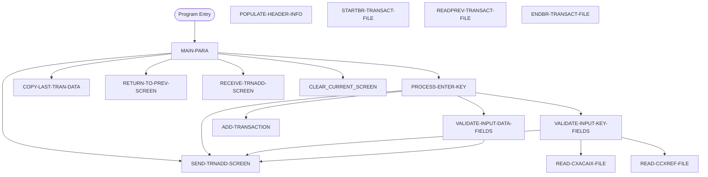

# Program: COTRN02C


---

## Quick Reference

| Attribute | Value |
|-----------|-------|
| Program ID | `COTRN02C` |
| Type | ONLINE |
| Lines | 784 |
| Source | [COTRN02C.cbl](../carddemo/COTRN02C.cbl#L1) |
| Paragraphs | 18 |
| Statements | 110 |
| Impact Risk | **HIGH** — 31 programs affected |

> **View Source:** [Open COTRN02C.cbl](../carddemo/COTRN02C.cbl#L1)

## Source Grounding Facts

| Data Item | Literal Value |
|-----------|---------------|
| `WS-PGMNAME` | `COTRN02C` |
| `WS-TRANID` | `CT02` |
| `WS-TRANSACT-FILE` | `TRANSACT` |
| `WS-ACCTDAT-FILE` | `ACCTDAT` |
| `WS-CCXREF-FILE` | `CCXREF` |
| `WS-CXACAIX-FILE` | `CXACAIX` |
| `WS-ERR-FLG` | `N` |
| `WS-USR-MODIFIED` | `N` |
| `WS-TRAN-DATE` | `00/00/00` |
| `WS-DATE-FORMAT` | `YYYY-MM-DD` |


## Business Purpose

*Business purpose is not present in the extracted data. Run LLM enrichment to populate this section.*


## Dependency Context

> This section shows how **COTRN02C** connects to the rest of the system — who calls it,
> what it calls, and what data it shares. If linked programs exist, they must appear here.

### Programs That Call COTRN02C (Callers)

*No programs call COTRN02C — this is likely a top-level entry point or CICS transaction starter.*

### Programs Called by COTRN02C (Callees)

| Called Program | Type | Line | Why |
|----------------|------|------|-----|
| `UNKNOWN` | None | 950 |  |
| `UNKNOWN` | None | 970 |  |

### Shared Data (Copybooks & Files)

#### Shared Copybooks

| Copybook | Also Used By | # Co-Users |
|----------|-------------|------------|
| `COCOM01Y` | COACTUPC, COACTVWC, COADM01C, COBIL00C, COCRDLIC (+15 more) | 20 |
| `COTRN02` |  | 0 |
| `COTTL01Y` | COACTUPC, COACTVWC, COADM01C, COBIL00C, COCRDLIC (+15 more) | 20 |
| `CSDAT01Y` | COACTUPC, COACTVWC, COADM01C, COBIL00C, COCRDLIC (+15 more) | 20 |
| `CSMSG01Y` | COACTUPC, COACTVWC, COADM01C, COBIL00C, COCRDLIC (+15 more) | 20 |
| `CVACT01Y` | CBACT01C, CBACT04C, CBEXPORT, CBIMPORT, CBSTM03A (+8 more) | 13 |
| `CVACT03Y` | CBACT03C, CBACT04C, CBEXPORT, CBIMPORT, CBSTM03A (+8 more) | 13 |
| `CVTRA05Y` | CBACT04C, CBEXPORT, CBIMPORT, CBTRN01C, CBTRN02C (+5 more) | 10 |
| `DFHAID` | COACTUPC, COACTVWC, COADM01C, COBIL00C, COCRDLIC (+15 more) | 20 |
| `DFHBMSCA` | COACTUPC, COACTVWC, COADM01C, COBIL00C, COCRDLIC (+15 more) | 20 |


## Legacy Data Contracts

> These tables are derived from FILE SECTION records and COPY-expanded data declarations. They preserve the legacy field names, COBOL storage type, inferred modern type, and status-code values needed for Java DTOs, SQL schemas, API contracts, and migration mapping.


### Copybook Segment Layouts

#### `COCOM01Y` as `CARDDEMO-COMMAREA`

| Legacy Field | Meaning | COBOL Type | Modern Type | Status / Format Notes |
|--------------|---------|------------|-------------|-----------------------|
| `CARDDEMO-COMMAREA` | Carddemo Commarea | `GROUP` | `OBJECT` |  |
| `CDEMO-GENERAL-INFO` | General Info | `GROUP` | `OBJECT` |  |
| `CDEMO-FROM-TRANID` | From Tranid | `PIC X(04)` | `STRING(4)` |  |
| `CDEMO-FROM-PROGRAM` | From Program | `PIC X(08)` | `STRING(8)` |  |
| `CDEMO-TO-TRANID` | To Tranid | `PIC X(04)` | `STRING(4)` |  |
| `CDEMO-TO-PROGRAM` | To Program | `PIC X(08)` | `STRING(8)` |  |
| `CDEMO-USER-ID` | User ID | `PIC X(08)` | `STRING(8)` |  |
| `CDEMO-USER-TYPE` | User Type | `PIC X(01)` | `STRING(1)` |  |
| `CDEMO-PGM-CONTEXT` | Pgm Context | `PIC 9(01)` | `INTEGER` |  |
| `CDEMO-CUSTOMER-INFO` | Customer Info | `GROUP` | `OBJECT` |  |
| `CDEMO-CUST-ID` | Customer ID | `PIC 9(09)` | `INTEGER` |  |
| `CDEMO-CUST-FNAME` | Customer Fname | `PIC X(25)` | `STRING(25)` |  |
| `CDEMO-CUST-MNAME` | Customer Mname | `PIC X(25)` | `STRING(25)` |  |
| `CDEMO-CUST-LNAME` | Customer Lname | `PIC X(25)` | `STRING(25)` |  |
| `CDEMO-ACCOUNT-INFO` | Account Info | `GROUP` | `OBJECT` |  |
| `CDEMO-ACCT-ID` | Account ID | `PIC 9(11)` | `BIGINT` |  |
| `CDEMO-ACCT-STATUS` | Account Status | `PIC X(01)` | `STRING(1)` |  |
| `CDEMO-CARD-INFO` | Card Info | `GROUP` | `OBJECT` |  |
| `CDEMO-CARD-NUM` | Card Number | `PIC 9(16)` | `BIGINT` |  |
| `CDEMO-MORE-INFO` | More Info | `GROUP` | `OBJECT` |  |
| `CDEMO-LAST-MAP` | Last Map | `PIC X(7)` | `STRING(7)` |  |
| `CDEMO-LAST-MAPSET` | Last Mapset | `PIC X(7)` | `STRING(7)` |  |

#### `COTRN02` as `COTRN2AI`

| Legacy Field | Meaning | COBOL Type | Modern Type | Status / Format Notes |
|--------------|---------|------------|-------------|-----------------------|
| `COTRN2AI` | Cotrn2Ai | `GROUP` | `OBJECT` |  |
| `COTRN2AO` | Cotrn2Ao | `GROUP` | `OBJECT` |  |

#### `COTTL01Y` as `CCDA-SCREEN-TITLE`

| Legacy Field | Meaning | COBOL Type | Modern Type | Status / Format Notes |
|--------------|---------|------------|-------------|-----------------------|
| `CCDA-SCREEN-TITLE` | Ccda Screen Title | `GROUP` | `OBJECT` |  |
| `CCDA-TITLE01` | Ccda Title01 | `PIC X(40)` | `STRING(40)` |  |
| `CCDA-TITLE02` | Ccda Title02 | `PIC X(40)` | `STRING(40)` |  |
| `CCDA-THANK-YOU` | Ccda Thank You | `PIC X(40)` | `STRING(40)` |  |

#### `CSDAT01Y` as `WS-DATE-TIME`

| Legacy Field | Meaning | COBOL Type | Modern Type | Status / Format Notes |
|--------------|---------|------------|-------------|-----------------------|
| `WS-DATE-TIME` | Date Time | `GROUP` | `OBJECT` |  |
| `WS-CURDATE-DATA` | Curdate Data | `GROUP` | `OBJECT` |  |
| `WS-CURDATE` | Curdate | `GROUP` | `OBJECT` |  |
| `WS-CURDATE-YEAR` | Curdate Year | `PIC 9(04)` | `INTEGER` |  |
| `WS-CURDATE-MONTH` | Curdate Month | `PIC 9(02)` | `INTEGER` |  |
| `WS-CURDATE-DAY` | Curdate Day | `PIC 9(02)` | `INTEGER` |  |
| `WS-CURDATE-N` | Curdate N | `PIC 9(08)` | `INTEGER` |  |
| `WS-CURTIME` | Curtime | `GROUP` | `OBJECT` |  |
| `WS-CURTIME-HOURS` | Curtime Hours | `PIC 9(02)` | `INTEGER` |  |
| `WS-CURTIME-MINUTE` | Curtime Minute | `PIC 9(02)` | `INTEGER` |  |
| `WS-CURTIME-SECOND` | Curtime Second | `PIC 9(02)` | `INTEGER` |  |
| `WS-CURTIME-MILSEC` | Curtime Milsec | `PIC 9(02)` | `INTEGER` |  |
| `WS-CURTIME-N` | Curtime N | `PIC 9(08)` | `INTEGER` |  |
| `WS-CURDATE-MM-DD-YY` | Curdate Mm Dd Yy | `GROUP` | `OBJECT` |  |
| `WS-CURDATE-MM` | Curdate Mm | `PIC 9(02)` | `INTEGER` |  |
| `FILLER` | Filler | `PIC X(01)` | `STRING(1)` |  |
| `WS-CURDATE-DD` | Curdate Dd | `PIC 9(02)` | `INTEGER` |  |
| `FILLER` | Filler | `PIC X(01)` | `STRING(1)` |  |
| `WS-CURDATE-YY` | Curdate Yy | `PIC 9(02)` | `INTEGER` |  |
| `WS-CURTIME-HH-MM-SS` | Curtime Hh Mm Ss | `GROUP` | `OBJECT` |  |
| `WS-CURTIME-HH` | Curtime Hh | `PIC 9(02)` | `INTEGER` |  |
| `FILLER` | Filler | `PIC X(01)` | `STRING(1)` |  |
| `WS-CURTIME-MM` | Curtime Mm | `PIC 9(02)` | `INTEGER` |  |
| `FILLER` | Filler | `PIC X(01)` | `STRING(1)` |  |
| `WS-CURTIME-SS` | Curtime Ss | `PIC 9(02)` | `INTEGER` |  |
| `WS-TIMESTAMP` | Timestamp | `GROUP` | `OBJECT` |  |
| `WS-TIMESTAMP-DT-YYYY` | Timestamp Date Yyyy | `PIC 9(04)` | `INTEGER` |  |
| `FILLER` | Filler | `PIC X(01)` | `STRING(1)` |  |
| `WS-TIMESTAMP-DT-MM` | Timestamp Date Mm | `PIC 9(02)` | `INTEGER` |  |
| `FILLER` | Filler | `PIC X(01)` | `STRING(1)` |  |
| `WS-TIMESTAMP-DT-DD` | Timestamp Date Dd | `PIC 9(02)` | `INTEGER` |  |
| `FILLER` | Filler | `PIC X(01)` | `STRING(1)` |  |
| `WS-TIMESTAMP-TM-HH` | Timestamp Tm Hh | `PIC 9(02)` | `INTEGER` |  |
| `FILLER` | Filler | `PIC X(01)` | `STRING(1)` |  |
| `WS-TIMESTAMP-TM-MM` | Timestamp Tm Mm | `PIC 9(02)` | `INTEGER` |  |
| `FILLER` | Filler | `PIC X(01)` | `STRING(1)` |  |
| `WS-TIMESTAMP-TM-SS` | Timestamp Tm Ss | `PIC 9(02)` | `INTEGER` |  |
| `FILLER` | Filler | `PIC X(01)` | `STRING(1)` |  |
| `WS-TIMESTAMP-TM-MS6` | Timestamp Tm Ms6 | `PIC 9(06)` | `INTEGER` |  |

#### `CSMSG01Y` as `CCDA-COMMON-MESSAGES`

| Legacy Field | Meaning | COBOL Type | Modern Type | Status / Format Notes |
|--------------|---------|------------|-------------|-----------------------|
| `CCDA-COMMON-MESSAGES` | Ccda Common Messages | `GROUP` | `OBJECT` |  |
| `CCDA-MSG-THANK-YOU` | Ccda Msg Thank You | `PIC X(50)` | `STRING(50)` |  |
| `CCDA-MSG-INVALID-KEY` | Ccda Msg Invalid Key | `PIC X(50)` | `STRING(50)` |  |

#### `CVACT01Y` as `ACCOUNT-RECORD`

| Legacy Field | Meaning | COBOL Type | Modern Type | Status / Format Notes |
|--------------|---------|------------|-------------|-----------------------|
| `ACCOUNT-RECORD` | Account Record | `GROUP` | `OBJECT` |  |
| `ACCT-ID` | Account ID | `PIC 9(11)` | `BIGINT` |  |
| `ACCT-ACTIVE-STATUS` | Account Active Status | `PIC X(01)` | `STRING(1)` |  |
| `ACCT-CURR-BAL` | Account Curr Bal | `PIC S9(10)V99` | `DECIMAL(12,2)` |  |
| `ACCT-CREDIT-LIMIT` | Account Credit Limit | `PIC S9(10)V99` | `DECIMAL(12,2)` |  |
| `ACCT-CASH-CREDIT-LIMIT` | Account Cash Credit Limit | `PIC S9(10)V99` | `DECIMAL(12,2)` |  |
| `ACCT-OPEN-DATE` | Account Open Date | `PIC X(10)` | `STRING(10)` | Date-like field; verify YYDDD, YYMMDD, or ISO format before migration. |
| `ACCT-EXPIRAION-DATE` | Account Expiraion Date | `PIC X(10)` | `STRING(10)` | Date-like field; verify YYDDD, YYMMDD, or ISO format before migration. |
| `ACCT-REISSUE-DATE` | Account Reissue Date | `PIC X(10)` | `STRING(10)` | Date-like field; verify YYDDD, YYMMDD, or ISO format before migration. |
| `ACCT-CURR-CYC-CREDIT` | Account Curr Cyc Credit | `PIC S9(10)V99` | `DECIMAL(12,2)` |  |
| `ACCT-CURR-CYC-DEBIT` | Account Curr Cyc Debit | `PIC S9(10)V99` | `DECIMAL(12,2)` |  |
| `ACCT-ADDR-ZIP` | Account Addr Zip | `PIC X(10)` | `STRING(10)` |  |
| `ACCT-GROUP-ID` | Account Group ID | `PIC X(10)` | `STRING(10)` |  |
| `FILLER` | Filler | `PIC X(178)` | `STRING(178)` |  |

#### `CVACT03Y` as `CARD-XREF-RECORD`

| Legacy Field | Meaning | COBOL Type | Modern Type | Status / Format Notes |
|--------------|---------|------------|-------------|-----------------------|
| `CARD-XREF-RECORD` | Card Xref Record | `GROUP` | `OBJECT` |  |
| `XREF-CARD-NUM` | Xref Card Number | `PIC X(16)` | `STRING(16)` |  |
| `XREF-CUST-ID` | Xref Customer ID | `PIC 9(09)` | `INTEGER` |  |
| `XREF-ACCT-ID` | Xref Account ID | `PIC 9(11)` | `BIGINT` |  |
| `FILLER` | Filler | `PIC X(14)` | `STRING(14)` |  |

#### `CVTRA05Y` as `TRAN-RECORD`

| Legacy Field | Meaning | COBOL Type | Modern Type | Status / Format Notes |
|--------------|---------|------------|-------------|-----------------------|
| `TRAN-RECORD` | Tran Record | `GROUP` | `OBJECT` |  |
| `TRAN-ID` | Tran ID | `PIC X(16)` | `STRING(16)` |  |
| `TRAN-TYPE-CD` | Tran Type Cd | `PIC X(02)` | `STRING(2)` |  |
| `TRAN-CAT-CD` | Tran Cat Cd | `PIC 9(04)` | `INTEGER` |  |
| `TRAN-SOURCE` | Tran Source | `PIC X(10)` | `STRING(10)` |  |
| `TRAN-DESC` | Tran Desc | `PIC X(100)` | `STRING(100)` |  |
| `TRAN-AMT` | Tran Amount | `PIC S9(09)V99` | `DECIMAL(11,2)` |  |
| `TRAN-MERCHANT-ID` | Tran Merchant ID | `PIC 9(09)` | `INTEGER` |  |
| `TRAN-MERCHANT-NAME` | Tran Merchant Name | `PIC X(50)` | `STRING(50)` |  |
| `TRAN-MERCHANT-CITY` | Tran Merchant City | `PIC X(50)` | `STRING(50)` |  |
| `TRAN-MERCHANT-ZIP` | Tran Merchant Zip | `PIC X(10)` | `STRING(10)` |  |
| `TRAN-CARD-NUM` | Tran Card Number | `PIC X(16)` | `STRING(16)` |  |
| `TRAN-ORIG-TS` | Tran Orig Ts | `PIC X(26)` | `STRING(26)` |  |
| `TRAN-PROC-TS` | Tran Proc Ts | `PIC X(26)` | `STRING(26)` |  |
| `FILLER` | Filler | `PIC X(20)` | `STRING(20)` |  |

#### `DFHAID` as `DFHAID`

| Legacy Field | Meaning | COBOL Type | Modern Type | Status / Format Notes |
|--------------|---------|------------|-------------|-----------------------|
| `DFHAID` | Dfhaid | `GROUP` | `OBJECT` |  |

#### `DFHBMSCA` as `DFHBMSCA`

| Legacy Field | Meaning | COBOL Type | Modern Type | Status / Format Notes |
|--------------|---------|------------|-------------|-----------------------|
| `DFHBMSCA` | Dfhbmsca | `GROUP` | `OBJECT` |  |


### Data Movement And Key Mapping

| Line | Source | Target | Meaning |
|------|--------|--------|---------|
| 112 | `SPACES` | `WS-MESSAGE` | SPACES populates WS-MESSAGE |
| 150 | `CCDA-MSG-INVALID-KEY` | `WS-MESSAGE` | CCDA-MSG-INVALID-KEY populates WS-MESSAGE |
| 206 | `WS-ACCT-ID-N` | `XREF-ACCT-ID` | WS-ACCT-ID-N populates XREF-ACCT-ID |
| 223 | `XREF-ACCT-ID` | `ACTIDINI OF COTRN2AI` | XREF-ACCT-ID populates ACTIDINI OF COTRN2AI |
| 280 | `-1` | `TRNAMTL OF COTRN2AI` | -1 populates TRNAMTL OF COTRN2AI |
| 347 | `-1` | `TRNAMTL OF COTRN2AI` | -1 populates TRNAMTL OF COTRN2AI |
| 385 | `WS-TRAN-AMT-N` | `WS-TRAN-AMT-E` | WS-TRAN-AMT-N populates WS-TRAN-AMT-E |
| 386 | `WS-TRAN-AMT-E` | `TRNAMTI OF COTRN2AI` | WS-TRAN-AMT-E populates TRNAMTI OF COTRN2AI |
| 389 | `TORIGDTI OF COTRN2AI` | `CSUTLDTC-DATE` | TORIGDTI OF COTRN2AI populates CSUTLDTC-DATE |
| 390 | `WS-DATE-FORMAT` | `CSUTLDTC-DATE-FORMAT` | WS-DATE-FORMAT populates CSUTLDTC-DATE-FORMAT |
| 409 | `TPROCDTI OF COTRN2AI` | `CSUTLDTC-DATE` | TPROCDTI OF COTRN2AI populates CSUTLDTC-DATE |
| 410 | `WS-DATE-FORMAT` | `CSUTLDTC-DATE-FORMAT` | WS-DATE-FORMAT populates CSUTLDTC-DATE-FORMAT |
| 458 | `WS-TRAN-AMT-N` | `TRAN-AMT` | WS-TRAN-AMT-N populates TRAN-AMT |
| 481 | `TRAN-AMT` | `WS-TRAN-AMT-E` | TRAN-AMT populates WS-TRAN-AMT-E |
| 485 | `WS-TRAN-AMT-E` | `TRNAMTI OF COTRN2AI` | WS-TRAN-AMT-E populates TRNAMTI OF COTRN2AI |
| 520 | `WS-MESSAGE` | `ERRMSGO OF COTRN2AO` | WS-MESSAGE populates ERRMSGO OF COTRN2AO |
| 554 | `FUNCTION CURRENT-DATE` | `WS-CURDATE-DATA` | FUNCTION CURRENT-DATE populates WS-CURDATE-DATA |
| 561 | `WS-CURDATE-MONTH` | `WS-CURDATE-MM` | WS-CURDATE-MONTH populates WS-CURDATE-MM |
| 562 | `WS-CURDATE-DAY` | `WS-CURDATE-DD` | WS-CURDATE-DAY populates WS-CURDATE-DD |
| 563 | `WS-CURDATE-YEAR(3:2)` | `WS-CURDATE-YY` | WS-CURDATE-YEAR(3:2) populates WS-CURDATE-YY |
| 565 | `WS-CURDATE-MM-DD-YY` | `CURDATEO OF COTRN2AO` | WS-CURDATE-MM-DD-YY populates CURDATEO OF COTRN2AO |
| 600 | `'Unable` | `lookup Acct in XREF AIX file` | 'Unable populates lookup Acct in XREF AIX file |
| 633 | `'Unable` | `lookup Card # in XREF file` | 'Unable populates lookup Card # in XREF file |
| 726 | `SPACES` | `WS-MESSAGE` | SPACES populates WS-MESSAGE |


---

## Dependency Graph

```mermaid
flowchart TD
    COTRN02C["⬤ COTRN02C"]:::target
    UNKNOWN["UNKNOWN"]:::callee
    UNKNOWN["UNKNOWN"]:::callee
    COTRN02C --> UNKNOWN
    COTRN02C --> UNKNOWN
    CB_COCOM01Y{{"COCOM01Y"}}:::copybook
    COTRN02C -.- CB_COCOM01Y
    COACTUPC["COACTUPC"]:::coupled
    CB_COCOM01Y -.- COACTUPC
    COACTVWC["COACTVWC"]:::coupled
    CB_COCOM01Y -.- COACTVWC
    COADM01C["COADM01C"]:::coupled
    CB_COCOM01Y -.- COADM01C
    CB_COTTL01Y{{"COTTL01Y"}}:::copybook
    COTRN02C -.- CB_COTTL01Y
    COACTUPC["COACTUPC"]:::coupled
    CB_COTTL01Y -.- COACTUPC
    COACTVWC["COACTVWC"]:::coupled
    CB_COTTL01Y -.- COACTVWC
    COADM01C["COADM01C"]:::coupled
    CB_COTTL01Y -.- COADM01C
    CB_CSDAT01Y{{"CSDAT01Y"}}:::copybook
    COTRN02C -.- CB_CSDAT01Y
    COACTUPC["COACTUPC"]:::coupled
    CB_CSDAT01Y -.- COACTUPC
    COACTVWC["COACTVWC"]:::coupled
    CB_CSDAT01Y -.- COACTVWC
    COADM01C["COADM01C"]:::coupled
    CB_CSDAT01Y -.- COADM01C
    CB_CSMSG01Y{{"CSMSG01Y"}}:::copybook
    COTRN02C -.- CB_CSMSG01Y
    COACTUPC["COACTUPC"]:::coupled
    CB_CSMSG01Y -.- COACTUPC
    COACTVWC["COACTVWC"]:::coupled
    CB_CSMSG01Y -.- COACTVWC
    COADM01C["COADM01C"]:::coupled
    CB_CSMSG01Y -.- COADM01C
    CB_CVACT01Y{{"CVACT01Y"}}:::copybook
    COTRN02C -.- CB_CVACT01Y
    CBACT01C["CBACT01C"]:::coupled
    CB_CVACT01Y -.- CBACT01C
    CBACT04C["CBACT04C"]:::coupled
    CB_CVACT01Y -.- CBACT04C
    CBEXPORT["CBEXPORT"]:::coupled
    CB_CVACT01Y -.- CBEXPORT
    CB_CVACT03Y{{"CVACT03Y"}}:::copybook
    COTRN02C -.- CB_CVACT03Y
    CBACT03C["CBACT03C"]:::coupled
    CB_CVACT03Y -.- CBACT03C
    CBACT04C["CBACT04C"]:::coupled
    CB_CVACT03Y -.- CBACT04C
    CBEXPORT["CBEXPORT"]:::coupled
    CB_CVACT03Y -.- CBEXPORT
    CB_CVTRA05Y{{"CVTRA05Y"}}:::copybook
    COTRN02C -.- CB_CVTRA05Y
    CBACT04C["CBACT04C"]:::coupled
    CB_CVTRA05Y -.- CBACT04C
    CBEXPORT["CBEXPORT"]:::coupled
    CB_CVTRA05Y -.- CBEXPORT
    CBIMPORT["CBIMPORT"]:::coupled
    CB_CVTRA05Y -.- CBIMPORT
    classDef target fill:#f85149,stroke:#da3633,color:#fff,stroke-width:3px
    classDef caller fill:#58a6ff,stroke:#1f6feb,color:#fff
    classDef callee fill:#3fb950,stroke:#238636,color:#fff
    classDef copybook fill:#d29922,stroke:#9e6a03,color:#fff
    classDef coupled fill:#d29922,stroke:#9e6a03,color:#fff,stroke-dasharray:5
    classDef transitive fill:#484f58,stroke:#8b949e,color:#c9d1d9,stroke-dasharray:5
```



> **Legend:** 🔴 Target program · 🔵 Direct callers · 🟢 Direct callees · 🟡 Copybook-coupled · ⚫ Transitive (indirect)

---

## Impact Ripple View

> **If you change COTRN02C, what else could break?**

| Impact Metric | Count |
|--------------|-------|
| Direct Callers | 0 |
| Transitive Callers (callers of callers) | 0 |
| Direct Callees | 0 |
| Transitive Callees | 0 |
| Copybook-Coupled Programs | 31 |
| **Total Impact** | **31** |
| **Risk Rating** | **HIGH** |


**Programs affected via shared copybooks:**
- `CBACT01C`
- `CBACT03C`
- `CBACT04C`
- `CBEXPORT`
- `CBIMPORT`
- `CBSTM03A`
- `CBTRN01C`
- `CBTRN02C`
- `CBTRN03C`
- `COACCT01`
- `COACTUPC`
- `COACTVWC`
- `COADM01C`
- `COBIL00C`
- `COCRDLIC`
- `COCRDSLC`
- `COCRDUPC`
- `COMEN01C`
- `COPAUA0C`
- `COPAUS0C`
- `COPAUS1C`
- `CORPT00C`
- `COSGN00C`
- `COTRN00C`
- `COTRN01C`
- `COTRTLIC`
- `COTRTUPC`
- `COUSR00C`
- `COUSR01C`
- `COUSR02C`
- `COUSR03C`

---

## Statement Profile

| Statement Type | Count |
|---------------|-------|
| MOVE | 44 |
| IF | 21 |
| PERFORM | 14 |
| EVALUATE | 12 |
| EXEC_CICS | 11 |
| SET | 2 |
| COMPUTE | 2 |
| CALL | 2 |
| INITIALIZE | 1 |
| ARITHMETIC | 1 |

## Control Flow



## Paragraphs

### MAIN-PARA

| | |
|---|---|
| **Paragraph** | `MAIN-PARA` |
| **Lines** | 107 - 163 |
| **View Code** | [Jump to Line 107](../carddemo/COTRN02C.cbl#L107) |


### PROCESS-ENTER-KEY

| | |
|---|---|
| **Paragraph** | `PROCESS-ENTER-KEY` |
| **Lines** | 164 - 192 |
| **View Code** | [Jump to Line 164](../carddemo/COTRN02C.cbl#L164) |


### VALIDATE-INPUT-KEY-FIELDS

| | |
|---|---|
| **Paragraph** | `VALIDATE-INPUT-KEY-FIELDS` |
| **Lines** | 193 - 234 |
| **View Code** | [Jump to Line 193](../carddemo/COTRN02C.cbl#L193) |


### VALIDATE-INPUT-DATA-FIELDS

| | |
|---|---|
| **Paragraph** | `VALIDATE-INPUT-DATA-FIELDS` |
| **Lines** | 235 - 441 |
| **View Code** | [Jump to Line 235](../carddemo/COTRN02C.cbl#L235) |


### ADD-TRANSACTION

| | |
|---|---|
| **Paragraph** | `ADD-TRANSACTION` |
| **Lines** | 442 - 470 |
| **View Code** | [Jump to Line 442](../carddemo/COTRN02C.cbl#L442) |


### COPY-LAST-TRAN-DATA

| | |
|---|---|
| **Paragraph** | `COPY-LAST-TRAN-DATA` |
| **Lines** | 471 - 499 |
| **View Code** | [Jump to Line 471](../carddemo/COTRN02C.cbl#L471) |


### RETURN-TO-PREV-SCREEN

| | |
|---|---|
| **Paragraph** | `RETURN-TO-PREV-SCREEN` |
| **Lines** | 500 - 515 |
| **View Code** | [Jump to Line 500](../carddemo/COTRN02C.cbl#L500) |


### SEND-TRNADD-SCREEN

| | |
|---|---|
| **Paragraph** | `SEND-TRNADD-SCREEN` |
| **Lines** | 516 - 538 |
| **View Code** | [Jump to Line 516](../carddemo/COTRN02C.cbl#L516) |


### RECEIVE-TRNADD-SCREEN

| | |
|---|---|
| **Paragraph** | `RECEIVE-TRNADD-SCREEN` |
| **Lines** | 539 - 551 |
| **View Code** | [Jump to Line 539](../carddemo/COTRN02C.cbl#L539) |


### POPULATE-HEADER-INFO

| | |
|---|---|
| **Paragraph** | `POPULATE-HEADER-INFO` |
| **Lines** | 552 - 575 |
| **View Code** | [Jump to Line 552](../carddemo/COTRN02C.cbl#L552) |


### READ-CXACAIX-FILE

| | |
|---|---|
| **Paragraph** | `READ-CXACAIX-FILE` |
| **Lines** | 576 - 608 |
| **View Code** | [Jump to Line 576](../carddemo/COTRN02C.cbl#L576) |


### READ-CCXREF-FILE

| | |
|---|---|
| **Paragraph** | `READ-CCXREF-FILE` |
| **Lines** | 609 - 641 |
| **View Code** | [Jump to Line 609](../carddemo/COTRN02C.cbl#L609) |


### STARTBR-TRANSACT-FILE

| | |
|---|---|
| **Paragraph** | `STARTBR-TRANSACT-FILE` |
| **Lines** | 642 - 672 |
| **View Code** | [Jump to Line 642](../carddemo/COTRN02C.cbl#L642) |


### READPREV-TRANSACT-FILE

| | |
|---|---|
| **Paragraph** | `READPREV-TRANSACT-FILE` |
| **Lines** | 673 - 701 |
| **View Code** | [Jump to Line 673](../carddemo/COTRN02C.cbl#L673) |


### ENDBR-TRANSACT-FILE

| | |
|---|---|
| **Paragraph** | `ENDBR-TRANSACT-FILE` |
| **Lines** | 702 - 710 |
| **View Code** | [Jump to Line 702](../carddemo/COTRN02C.cbl#L702) |


### WRITE-TRANSACT-FILE

| | |
|---|---|
| **Paragraph** | `WRITE-TRANSACT-FILE` |
| **Lines** | 711 - 753 |
| **View Code** | [Jump to Line 711](../carddemo/COTRN02C.cbl#L711) |


### CLEAR-CURRENT-SCREEN

| | |
|---|---|
| **Paragraph** | `CLEAR-CURRENT-SCREEN` |
| **Lines** | 754 - 761 |
| **View Code** | [Jump to Line 754](../carddemo/COTRN02C.cbl#L754) |


### INITIALIZE-ALL-FIELDS

| | |
|---|---|
| **Paragraph** | `INITIALIZE-ALL-FIELDS` |
| **Lines** | 762 - 783 |
| **View Code** | [Jump to Line 762](../carddemo/COTRN02C.cbl#L762) |


## Copybook Field Dictionaries

The following copybooks are included by this program. Each entry shows the actual fields
extracted from the copybook source file (`.cpy`).

### Copybook `COCOM01Y`

| Level | Field | PIC | USAGE | Parent | Notes |
|-------|-------|-----|-------|--------|-------|
| `01` | `CARDDEMO-COMMAREA` | `None` | None | None |  |
| `05` | `CDEMO-GENERAL-INFO` | `None` | None | CARDDEMO-COMMAREA |  |
| `10` | `CDEMO-FROM-TRANID` | `X(04)` | None | CDEMO-GENERAL-INFO |  |
| `10` | `CDEMO-FROM-PROGRAM` | `X(08)` | None | CDEMO-GENERAL-INFO |  |
| `10` | `CDEMO-TO-TRANID` | `X(04)` | None | CDEMO-GENERAL-INFO |  |
| `10` | `CDEMO-TO-PROGRAM` | `X(08)` | None | CDEMO-GENERAL-INFO |  |
| `10` | `CDEMO-USER-ID` | `X(08)` | None | CDEMO-GENERAL-INFO |  |
| `10` | `CDEMO-USER-TYPE` | `X(01)` | None | CDEMO-GENERAL-INFO |  |
| `88` | `CDEMO-USRTYP-ADMIN` | `None` | None | CDEMO-GENERAL-INFO |  |
| `88` | `CDEMO-USRTYP-USER` | `None` | None | CDEMO-GENERAL-INFO |  |
| `10` | `CDEMO-PGM-CONTEXT` | `9(01)` | None | CDEMO-GENERAL-INFO |  |
| `88` | `CDEMO-PGM-ENTER` | `None` | None | CDEMO-GENERAL-INFO |  |
| `88` | `CDEMO-PGM-REENTER` | `None` | None | CDEMO-GENERAL-INFO |  |
| `05` | `CDEMO-CUSTOMER-INFO` | `None` | None | CARDDEMO-COMMAREA |  |
| `10` | `CDEMO-CUST-ID` | `9(09)` | None | CDEMO-CUSTOMER-INFO |  |
| `10` | `CDEMO-CUST-FNAME` | `X(25)` | None | CDEMO-CUSTOMER-INFO |  |
| `10` | `CDEMO-CUST-MNAME` | `X(25)` | None | CDEMO-CUSTOMER-INFO |  |
| `10` | `CDEMO-CUST-LNAME` | `X(25)` | None | CDEMO-CUSTOMER-INFO |  |
| `05` | `CDEMO-ACCOUNT-INFO` | `None` | None | CARDDEMO-COMMAREA |  |
| `10` | `CDEMO-ACCT-ID` | `9(11)` | None | CDEMO-ACCOUNT-INFO |  |
| `10` | `CDEMO-ACCT-STATUS` | `X(01)` | None | CDEMO-ACCOUNT-INFO |  |
| `05` | `CDEMO-CARD-INFO` | `None` | None | CARDDEMO-COMMAREA |  |
| `10` | `CDEMO-CARD-NUM` | `9(16)` | None | CDEMO-CARD-INFO |  |
| `05` | `CDEMO-MORE-INFO` | `None` | None | CARDDEMO-COMMAREA |  |
| `10` | `CDEMO-LAST-MAP` | `X(7)` | None | CDEMO-MORE-INFO |  |
| `10` | `CDEMO-LAST-MAPSET` | `X(7)` | None | CDEMO-MORE-INFO |  |

### Copybook `COTRN02`

| Level | Field | PIC | USAGE | Parent | Notes |
|-------|-------|-----|-------|--------|-------|
| `01` | `COTRN2AI` | `None` | None | None |  |
| `02` | `TRNNAMEL` | `S9(4)` | COMP | COTRN2AI |  |
| `02` | `TRNNAMEF` | `X` | None | COTRN2AI |  |
| `03` | `TRNNAMEA` | `X` | None | COTRN2AI |  |
| `02` | `TRNNAMEI` | `X(4)` | None | COTRN2AI |  |
| `02` | `TITLE01L` | `S9(4)` | COMP | COTRN2AI |  |
| `02` | `TITLE01F` | `X` | None | COTRN2AI |  |
| `03` | `TITLE01A` | `X` | None | COTRN2AI |  |
| `02` | `TITLE01I` | `X(40)` | None | COTRN2AI |  |
| `02` | `CURDATEL` | `S9(4)` | COMP | COTRN2AI |  |
| `02` | `CURDATEF` | `X` | None | COTRN2AI |  |
| `03` | `CURDATEA` | `X` | None | COTRN2AI |  |
| `02` | `CURDATEI` | `X(8)` | None | COTRN2AI |  |
| `02` | `PGMNAMEL` | `S9(4)` | COMP | COTRN2AI |  |
| `02` | `PGMNAMEF` | `X` | None | COTRN2AI |  |
| `03` | `PGMNAMEA` | `X` | None | COTRN2AI |  |
| `02` | `PGMNAMEI` | `X(8)` | None | COTRN2AI |  |
| `02` | `TITLE02L` | `S9(4)` | COMP | COTRN2AI |  |
| `02` | `TITLE02F` | `X` | None | COTRN2AI |  |
| `03` | `TITLE02A` | `X` | None | COTRN2AI |  |
| `02` | `TITLE02I` | `X(40)` | None | COTRN2AI |  |
| `02` | `CURTIMEL` | `S9(4)` | COMP | COTRN2AI |  |
| `02` | `CURTIMEF` | `X` | None | COTRN2AI |  |
| `03` | `CURTIMEA` | `X` | None | COTRN2AI |  |
| `02` | `CURTIMEI` | `X(8)` | None | COTRN2AI |  |
| `02` | `ACTIDINL` | `S9(4)` | COMP | COTRN2AI |  |
| `02` | `ACTIDINF` | `X` | None | COTRN2AI |  |
| `03` | `ACTIDINA` | `X` | None | COTRN2AI |  |
| `02` | `ACTIDINI` | `X(11)` | None | COTRN2AI |  |
| `02` | `CARDNINL` | `S9(4)` | COMP | COTRN2AI |  |
| `02` | `CARDNINF` | `X` | None | COTRN2AI |  |
| `03` | `CARDNINA` | `X` | None | COTRN2AI |  |
| `02` | `CARDNINI` | `X(16)` | None | COTRN2AI |  |
| `02` | `TTYPCDL` | `S9(4)` | COMP | COTRN2AI |  |
| `02` | `TTYPCDF` | `X` | None | COTRN2AI |  |
| `03` | `TTYPCDA` | `X` | None | COTRN2AI |  |
| `02` | `TTYPCDI` | `X(2)` | None | COTRN2AI |  |
| `02` | `TCATCDL` | `S9(4)` | COMP | COTRN2AI |  |
| `02` | `TCATCDF` | `X` | None | COTRN2AI |  |
| `03` | `TCATCDA` | `X` | None | COTRN2AI |  |
| `02` | `TCATCDI` | `X(4)` | None | COTRN2AI |  |
| `02` | `TRNSRCL` | `S9(4)` | COMP | COTRN2AI |  |
| `02` | `TRNSRCF` | `X` | None | COTRN2AI |  |
| `03` | `TRNSRCA` | `X` | None | COTRN2AI |  |
| `02` | `TRNSRCI` | `X(10)` | None | COTRN2AI |  |
| `02` | `TDESCL` | `S9(4)` | COMP | COTRN2AI |  |
| `02` | `TDESCF` | `X` | None | COTRN2AI |  |
| `03` | `TDESCA` | `X` | None | COTRN2AI |  |
| `02` | `TDESCI` | `X(60)` | None | COTRN2AI |  |
| `02` | `TRNAMTL` | `S9(4)` | COMP | COTRN2AI |  |
*+ 141 more fields*
### Copybook `COTTL01Y`

| Level | Field | PIC | USAGE | Parent | Notes |
|-------|-------|-----|-------|--------|-------|
| `01` | `CCDA-SCREEN-TITLE` | `None` | None | None |  |
| `05` | `CCDA-TITLE01` | `X(40)` | None | CCDA-SCREEN-TITLE |  |
| `05` | `CCDA-TITLE02` | `X(40)` | None | CCDA-SCREEN-TITLE |  |
| `05` | `CCDA-THANK-YOU` | `X(40)` | None | CCDA-SCREEN-TITLE |  |

### Copybook `CSDAT01Y`

| Level | Field | PIC | USAGE | Parent | Notes |
|-------|-------|-----|-------|--------|-------|
| `01` | `WS-DATE-TIME` | `None` | None | None |  |
| `05` | `WS-CURDATE-DATA` | `None` | None | WS-DATE-TIME |  |
| `10` | `WS-CURDATE` | `None` | None | WS-CURDATE-DATA |  |
| `15` | `WS-CURDATE-YEAR` | `9(04)` | None | WS-CURDATE |  |
| `15` | `WS-CURDATE-MONTH` | `9(02)` | None | WS-CURDATE |  |
| `15` | `WS-CURDATE-DAY` | `9(02)` | None | WS-CURDATE |  |
| `10` | `WS-CURDATE-N` | `9(08)` | None | WS-CURDATE-DATA |  REDEFINES WS-CURDATE |
| `10` | `WS-CURTIME` | `None` | None | WS-CURDATE-DATA |  |
| `15` | `WS-CURTIME-HOURS` | `9(02)` | None | WS-CURTIME |  |
| `15` | `WS-CURTIME-MINUTE` | `9(02)` | None | WS-CURTIME |  |
| `15` | `WS-CURTIME-SECOND` | `9(02)` | None | WS-CURTIME |  |
| `15` | `WS-CURTIME-MILSEC` | `9(02)` | None | WS-CURTIME |  |
| `10` | `WS-CURTIME-N` | `9(08)` | None | WS-CURDATE-DATA |  REDEFINES WS-CURTIME |
| `05` | `WS-CURDATE-MM-DD-YY` | `None` | None | WS-DATE-TIME |  |
| `10` | `WS-CURDATE-MM` | `9(02)` | None | WS-CURDATE-MM-DD-YY |  |
| `10` | `WS-CURDATE-DD` | `9(02)` | None | WS-CURDATE-MM-DD-YY |  |
| `10` | `WS-CURDATE-YY` | `9(02)` | None | WS-CURDATE-MM-DD-YY |  |
| `05` | `WS-CURTIME-HH-MM-SS` | `None` | None | WS-DATE-TIME |  |
| `10` | `WS-CURTIME-HH` | `9(02)` | None | WS-CURTIME-HH-MM-SS |  |
| `10` | `WS-CURTIME-MM` | `9(02)` | None | WS-CURTIME-HH-MM-SS |  |
| `10` | `WS-CURTIME-SS` | `9(02)` | None | WS-CURTIME-HH-MM-SS |  |
| `05` | `WS-TIMESTAMP` | `None` | None | WS-DATE-TIME |  |
| `10` | `WS-TIMESTAMP-DT-YYYY` | `9(04)` | None | WS-TIMESTAMP |  |
| `10` | `WS-TIMESTAMP-DT-MM` | `9(02)` | None | WS-TIMESTAMP |  |
| `10` | `WS-TIMESTAMP-DT-DD` | `9(02)` | None | WS-TIMESTAMP |  |
| `10` | `WS-TIMESTAMP-TM-HH` | `9(02)` | None | WS-TIMESTAMP |  |
| `10` | `WS-TIMESTAMP-TM-MM` | `9(02)` | None | WS-TIMESTAMP |  |
| `10` | `WS-TIMESTAMP-TM-SS` | `9(02)` | None | WS-TIMESTAMP |  |
| `10` | `WS-TIMESTAMP-TM-MS6` | `9(06)` | None | WS-TIMESTAMP |  |

### Copybook `CSMSG01Y`

| Level | Field | PIC | USAGE | Parent | Notes |
|-------|-------|-----|-------|--------|-------|
| `01` | `CCDA-COMMON-MESSAGES` | `None` | None | None |  |
| `05` | `CCDA-MSG-THANK-YOU` | `X(50)` | None | CCDA-COMMON-MESSAGES |  |
| `05` | `CCDA-MSG-INVALID-KEY` | `X(50)` | None | CCDA-COMMON-MESSAGES |  |

### Copybook `CVACT01Y`

| Level | Field | PIC | USAGE | Parent | Notes |
|-------|-------|-----|-------|--------|-------|
| `01` | `ACCOUNT-RECORD` | `None` | None | None |  |
| `05` | `ACCT-ID` | `9(11)` | None | ACCOUNT-RECORD |  |
| `05` | `ACCT-ACTIVE-STATUS` | `X(01)` | None | ACCOUNT-RECORD |  |
| `05` | `ACCT-CURR-BAL` | `S9(10)V99` | None | ACCOUNT-RECORD |  |
| `05` | `ACCT-CREDIT-LIMIT` | `S9(10)V99` | None | ACCOUNT-RECORD |  |
| `05` | `ACCT-CASH-CREDIT-LIMIT` | `S9(10)V99` | None | ACCOUNT-RECORD |  |
| `05` | `ACCT-OPEN-DATE` | `X(10)` | None | ACCOUNT-RECORD |  |
| `05` | `ACCT-EXPIRAION-DATE` | `X(10)` | None | ACCOUNT-RECORD |  |
| `05` | `ACCT-REISSUE-DATE` | `X(10)` | None | ACCOUNT-RECORD |  |
| `05` | `ACCT-CURR-CYC-CREDIT` | `S9(10)V99` | None | ACCOUNT-RECORD |  |
| `05` | `ACCT-CURR-CYC-DEBIT` | `S9(10)V99` | None | ACCOUNT-RECORD |  |
| `05` | `ACCT-ADDR-ZIP` | `X(10)` | None | ACCOUNT-RECORD |  |
| `05` | `ACCT-GROUP-ID` | `X(10)` | None | ACCOUNT-RECORD |  |

### Copybook `CVACT03Y`

| Level | Field | PIC | USAGE | Parent | Notes |
|-------|-------|-----|-------|--------|-------|
| `01` | `CARD-XREF-RECORD` | `None` | None | None |  |
| `05` | `XREF-CARD-NUM` | `X(16)` | None | CARD-XREF-RECORD |  |
| `05` | `XREF-CUST-ID` | `9(09)` | None | CARD-XREF-RECORD |  |
| `05` | `XREF-ACCT-ID` | `9(11)` | None | CARD-XREF-RECORD |  |

### Copybook `CVTRA05Y`

| Level | Field | PIC | USAGE | Parent | Notes |
|-------|-------|-----|-------|--------|-------|
| `01` | `TRAN-RECORD` | `None` | None | None |  |
| `05` | `TRAN-ID` | `X(16)` | None | TRAN-RECORD |  |
| `05` | `TRAN-TYPE-CD` | `X(02)` | None | TRAN-RECORD |  |
| `05` | `TRAN-CAT-CD` | `9(04)` | None | TRAN-RECORD |  |
| `05` | `TRAN-SOURCE` | `X(10)` | None | TRAN-RECORD |  |
| `05` | `TRAN-DESC` | `X(100)` | None | TRAN-RECORD |  |
| `05` | `TRAN-AMT` | `S9(09)V99` | None | TRAN-RECORD |  |
| `05` | `TRAN-MERCHANT-ID` | `9(09)` | None | TRAN-RECORD |  |
| `05` | `TRAN-MERCHANT-NAME` | `X(50)` | None | TRAN-RECORD |  |
| `05` | `TRAN-MERCHANT-CITY` | `X(50)` | None | TRAN-RECORD |  |
| `05` | `TRAN-MERCHANT-ZIP` | `X(10)` | None | TRAN-RECORD |  |
| `05` | `TRAN-CARD-NUM` | `X(16)` | None | TRAN-RECORD |  |
| `05` | `TRAN-ORIG-TS` | `X(26)` | None | TRAN-RECORD |  |
| `05` | `TRAN-PROC-TS` | `X(26)` | None | TRAN-RECORD |  |

### Copybook `DFHAID`

| Level | Field | PIC | USAGE | Parent | Notes |
|-------|-------|-----|-------|--------|-------|
| `01` | `DFHAID` | `None` | None | None |  |
| `02` | `DFHENTER` | `X` | None | DFHAID |  |
| `02` | `DFHCLEAR` | `X` | None | DFHAID |  |
| `02` | `DFHCLRP` | `X` | None | DFHAID |  |
| `02` | `DFHPA1` | `X` | None | DFHAID |  |
| `02` | `DFHPA2` | `X` | None | DFHAID |  |
| `02` | `DFHPA3` | `X` | None | DFHAID |  |
| `02` | `DFHPF1` | `X` | None | DFHAID |  |
| `02` | `DFHPF2` | `X` | None | DFHAID |  |
| `02` | `DFHPF3` | `X` | None | DFHAID |  |
| `02` | `DFHPF4` | `X` | None | DFHAID |  |
| `02` | `DFHPF5` | `X` | None | DFHAID |  |
| `02` | `DFHPF6` | `X` | None | DFHAID |  |
| `02` | `DFHPF7` | `X` | None | DFHAID |  |
| `02` | `DFHPF8` | `X` | None | DFHAID |  |
| `02` | `DFHPF9` | `X` | None | DFHAID |  |
| `02` | `DFHPF10` | `X` | None | DFHAID |  |
| `02` | `DFHPF11` | `X` | None | DFHAID |  |
| `02` | `DFHPF12` | `X` | None | DFHAID |  |
| `02` | `DFHPF13` | `X` | None | DFHAID |  |
| `02` | `DFHPF14` | `X` | None | DFHAID |  |
| `02` | `DFHPF15` | `X` | None | DFHAID |  |
| `02` | `DFHPF16` | `X` | None | DFHAID |  |
| `02` | `DFHPF17` | `X` | None | DFHAID |  |
| `02` | `DFHPF18` | `X` | None | DFHAID |  |
| `02` | `DFHPF19` | `X` | None | DFHAID |  |
| `02` | `DFHPF20` | `X` | None | DFHAID |  |
| `02` | `DFHPF21` | `X` | None | DFHAID |  |
| `02` | `DFHPF22` | `X` | None | DFHAID |  |
| `02` | `DFHPF23` | `X` | None | DFHAID |  |
| `02` | `DFHPF24` | `X` | None | DFHAID |  |
| `02` | `DFHPEN` | `X` | None | DFHAID |  |
| `02` | `DFHOPID` | `X` | None | DFHAID |  |
| `02` | `DFHMSRE` | `X` | None | DFHAID |  |
| `02` | `DFHSTRF` | `X` | None | DFHAID |  |
| `02` | `DFHTRIG` | `X` | None | DFHAID |  |

### Copybook `DFHBMSCA`

| Level | Field | PIC | USAGE | Parent | Notes |
|-------|-------|-----|-------|--------|-------|
| `01` | `DFHBMSCA` | `None` | None | None |  |
| `02` | `DFHBMPEM` | `X` | None | DFHBMSCA |  |
| `02` | `DFHBMPNL` | `X` | None | DFHBMSCA |  |
| `02` | `DFHBMASK` | `X` | None | DFHBMSCA |  |
| `02` | `DFHBMUNP` | `X` | None | DFHBMSCA |  |
| `02` | `DFHBMUNN` | `X` | None | DFHBMSCA |  |
| `02` | `DFHBMPRO` | `X` | None | DFHBMSCA |  |
| `02` | `DFHBMBRY` | `X` | None | DFHBMSCA |  |
| `02` | `DFHBMDAR` | `X` | None | DFHBMSCA |  |
| `02` | `DFHBMFSE` | `X` | None | DFHBMSCA |  |
| `02` | `DFHBMPRF` | `X` | None | DFHBMSCA |  |
| `02` | `DFHBMASF` | `X` | None | DFHBMSCA |  |
| `02` | `DFHBMASB` | `X` | None | DFHBMSCA |  |
| `02` | `DFHBMEOF` | `X` | None | DFHBMSCA |  |
| `02` | `DFHBMEC` | `X` | None | DFHBMSCA |  |
| `02` | `DFHSA` | `X` | None | DFHBMSCA |  |
| `02` | `DFHCOLOR` | `X` | None | DFHBMSCA |  |
| `02` | `DFHPS` | `X` | None | DFHBMSCA |  |
| `02` | `DFHHLT` | `X` | None | DFHBMSCA |  |
| `02` | `DFHVAL` | `X` | None | DFHBMSCA |  |
| `02` | `DFHOUTLN` | `X` | None | DFHBMSCA |  |
| `02` | `DFHBKTRN` | `X` | None | DFHBMSCA |  |
| `02` | `DFHALL` | `X` | None | DFHBMSCA |  |
| `02` | `DFHERROR` | `X` | None | DFHBMSCA |  |
| `02` | `DFHDFT` | `X` | None | DFHBMSCA |  |
| `02` | `DFHDFCOL` | `X` | None | DFHBMSCA |  |
| `02` | `DFHBLUE` | `X` | None | DFHBMSCA |  |
| `02` | `DFHRED` | `X` | None | DFHBMSCA |  |
| `02` | `DFHPINK` | `X` | None | DFHBMSCA |  |
| `02` | `DFHGREEN` | `X` | None | DFHBMSCA |  |
| `02` | `DFHTURQ` | `X` | None | DFHBMSCA |  |
| `02` | `DFHYELLO` | `X` | None | DFHBMSCA |  |
| `02` | `DFHWHTE` | `X` | None | DFHBMSCA |  |
| `02` | `CATTR-H-UNPROT` | `X` | None | DFHBMSCA |  |
| `02` | `CATTR-H-UNPROT-FSET` | `X` | None | DFHBMSCA |  |
| `02` | `CATTR-H-UNPROT-NUM` | `X` | None | DFHBMSCA |  |
| `02` | `CATTR-H-ASKIP` | `X` | None | DFHBMSCA |  |


## Data Lineage (MOVE Flow)

The following MOVE statements were extracted from the source. Each row is a `source → destination`
flow that the migration team can use to trace how data is reshaped and routed.

| Source | Destination | Paragraph | Line |
|--------|-------------|-----------|------|
| `SPACES` | `WS-MESSAGE` | MAIN-PARA | 112 |
| `'COSGN00C'` | `CDEMO-TO-PROGRAM` | MAIN-PARA | 116 |
| `DFHCOMMAREA(1:EIBCALEN)` | `CARDDEMO-COMMAREA` | MAIN-PARA | 119 |
| `LOW-VALUES` | `COTRN2AO` | MAIN-PARA | 122 |
| `'-1'` | `ACTIDINL` | MAIN-PARA | 123 |
| `'-1'` | `OF` | MAIN-PARA | 123 |
| `'-1'` | `COTRN2AI` | MAIN-PARA | 123 |
| `'COMEN01C'` | `CDEMO-TO-PROGRAM` | MAIN-PARA | 138 |
| `'Y'` | `WS-ERR-FLG` | MAIN-PARA | 149 |
| `CCDA-MSG-INVALID-KEY` | `WS-MESSAGE` | MAIN-PARA | 150 |
| `'Y'` | `WS-ERR-FLG` | PROCESS-ENTER-KEY | 177 |
| `'-1'` | `CONFIRML` | PROCESS-ENTER-KEY | 180 |
| `'-1'` | `OF` | PROCESS-ENTER-KEY | 180 |
| `'-1'` | `COTRN2AI` | PROCESS-ENTER-KEY | 180 |
| `'Y'` | `WS-ERR-FLG` | PROCESS-ENTER-KEY | 183 |
| `'-1'` | `CONFIRML` | PROCESS-ENTER-KEY | 186 |
| `'-1'` | `OF` | PROCESS-ENTER-KEY | 186 |
| `'-1'` | `COTRN2AI` | PROCESS-ENTER-KEY | 186 |
| `'Y'` | `WS-ERR-FLG` | VALIDATE-INPUT-KEY-FIELDS | 198 |
| `'-1'` | `ACTIDINL` | VALIDATE-INPUT-KEY-FIELDS | 201 |
| `'-1'` | `OF` | VALIDATE-INPUT-KEY-FIELDS | 201 |
| `'-1'` | `COTRN2AI` | VALIDATE-INPUT-KEY-FIELDS | 201 |
| `WS-ACCT-ID-N` | `XREF-ACCT-ID` | VALIDATE-INPUT-KEY-FIELDS | 206 |
| `XREF-CARD-NUM` | `CARDNINI` | VALIDATE-INPUT-KEY-FIELDS | 209 |
| `XREF-CARD-NUM` | `OF` | VALIDATE-INPUT-KEY-FIELDS | 209 |
| `XREF-CARD-NUM` | `COTRN2AI` | VALIDATE-INPUT-KEY-FIELDS | 209 |
| `'Y'` | `WS-ERR-FLG` | VALIDATE-INPUT-KEY-FIELDS | 212 |
| `'-1'` | `CARDNINL` | VALIDATE-INPUT-KEY-FIELDS | 215 |
| `'-1'` | `OF` | VALIDATE-INPUT-KEY-FIELDS | 215 |
| `'-1'` | `COTRN2AI` | VALIDATE-INPUT-KEY-FIELDS | 215 |
| `WS-CARD-NUM-N` | `XREF-CARD-NUM` | VALIDATE-INPUT-KEY-FIELDS | 220 |
| `XREF-ACCT-ID` | `ACTIDINI` | VALIDATE-INPUT-KEY-FIELDS | 223 |
| `XREF-ACCT-ID` | `OF` | VALIDATE-INPUT-KEY-FIELDS | 223 |
| `XREF-ACCT-ID` | `COTRN2AI` | VALIDATE-INPUT-KEY-FIELDS | 223 |
| `'Y'` | `WS-ERR-FLG` | VALIDATE-INPUT-KEY-FIELDS | 225 |
| `'-1'` | `ACTIDINL` | VALIDATE-INPUT-KEY-FIELDS | 228 |
| `'-1'` | `OF` | VALIDATE-INPUT-KEY-FIELDS | 228 |
| `'-1'` | `COTRN2AI` | VALIDATE-INPUT-KEY-FIELDS | 228 |
| `SPACES` | `TTYPCDI` | VALIDATE-INPUT-DATA-FIELDS | 238 |
| `SPACES` | `OF` | VALIDATE-INPUT-DATA-FIELDS | 238 |
| `SPACES` | `COTRN2AI` | VALIDATE-INPUT-DATA-FIELDS | 238 |
| `'Y'` | `WS-ERR-FLG` | VALIDATE-INPUT-DATA-FIELDS | 253 |
| `'-1'` | `TTYPCDL` | VALIDATE-INPUT-DATA-FIELDS | 256 |
| `'-1'` | `OF` | VALIDATE-INPUT-DATA-FIELDS | 256 |
| `'-1'` | `COTRN2AI` | VALIDATE-INPUT-DATA-FIELDS | 256 |
| `'Y'` | `WS-ERR-FLG` | VALIDATE-INPUT-DATA-FIELDS | 259 |
| `'-1'` | `TCATCDL` | VALIDATE-INPUT-DATA-FIELDS | 262 |
| `'-1'` | `OF` | VALIDATE-INPUT-DATA-FIELDS | 262 |
| `'-1'` | `COTRN2AI` | VALIDATE-INPUT-DATA-FIELDS | 262 |
| `'Y'` | `WS-ERR-FLG` | VALIDATE-INPUT-DATA-FIELDS | 265 |
| `'-1'` | `TRNSRCL` | VALIDATE-INPUT-DATA-FIELDS | 268 |
| `'-1'` | `OF` | VALIDATE-INPUT-DATA-FIELDS | 268 |
| `'-1'` | `COTRN2AI` | VALIDATE-INPUT-DATA-FIELDS | 268 |
| `'Y'` | `WS-ERR-FLG` | VALIDATE-INPUT-DATA-FIELDS | 271 |
| `'-1'` | `TDESCL` | VALIDATE-INPUT-DATA-FIELDS | 274 |
| `'-1'` | `OF` | VALIDATE-INPUT-DATA-FIELDS | 274 |
| `'-1'` | `COTRN2AI` | VALIDATE-INPUT-DATA-FIELDS | 274 |
| `'Y'` | `WS-ERR-FLG` | VALIDATE-INPUT-DATA-FIELDS | 277 |
| `'-1'` | `TRNAMTL` | VALIDATE-INPUT-DATA-FIELDS | 280 |
| `'-1'` | `OF` | VALIDATE-INPUT-DATA-FIELDS | 280 |
*+ 40 more movements*

## Known Issues & Code Anomalies

Static analysis flagged the following items in this program. Migration teams should
review each one before re-implementing in a modern stack.

| Severity | Category | Title | Paragraph | Line |
|----------|----------|-------|-----------|------|
| **NOTICE** | DEAD_CODE | Variable `WS-ACCTDAT-FILE` is declared but never referenced | None | 40 |
| **NOTICE** | DEAD_CODE | Variable `WS-USR-MODIFIED` is declared but never referenced | None | 49 |
| **NOTICE** | DEAD_CODE | Variable `WS-TRAN-DATE` is declared but never referenced | None | 54 |
| **NOTICE** | DEAD_CODE | Variable `LK-COMMAREA` is declared but never referenced | None | 100 |
| **NOTICE** | DEPENDENCY | Static CALL to external `CSUTLDTC` (not in this codebase) | None | 393 |

### NOTICE — Variable `WS-ACCTDAT-FILE` is declared but never referenced

`WS-ACCTDAT-FILE` is declared at line 40 but no other statement reads or writes it. Likely a leftover from prior refactoring or an incomplete feature.
**Source excerpt** (line 40):
```cobol
05 WS-ACCTDAT-FILE            PIC X(08) VALUE 'ACCTDAT '.
```

**Recommendation:** Remove the declaration or wire it into the logic that was originally intended.
---
### NOTICE — Variable `WS-USR-MODIFIED` is declared but never referenced

`WS-USR-MODIFIED` is declared at line 49 but no other statement reads or writes it. Likely a leftover from prior refactoring or an incomplete feature.
**Source excerpt** (line 49):
```cobol
05 WS-USR-MODIFIED            PIC X(01) VALUE 'N'.
```

**Recommendation:** Remove the declaration or wire it into the logic that was originally intended.
---
### NOTICE — Variable `WS-TRAN-DATE` is declared but never referenced

`WS-TRAN-DATE` is declared at line 54 but no other statement reads or writes it. Likely a leftover from prior refactoring or an incomplete feature.
**Source excerpt** (line 54):
```cobol
05 WS-TRAN-DATE               PIC X(08) VALUE '00/00/00'.
```

**Recommendation:** Remove the declaration or wire it into the logic that was originally intended.
---
### NOTICE — Variable `LK-COMMAREA` is declared but never referenced

`LK-COMMAREA` is declared at line 100 but no other statement reads or writes it. Likely a leftover from prior refactoring or an incomplete feature.
**Source excerpt** (line 100):
```cobol
05  LK-COMMAREA                           PIC X(01)
```

**Recommendation:** Remove the declaration or wire it into the logic that was originally intended.
---
### NOTICE — Static CALL to external `CSUTLDTC` (not in this codebase)

`CALL 'CSUTLDTC'` appears in the source but `CSUTLDTC` is not a program in the loaded codebase. External subroutine — verify whether it is a sister application program, a vendor utility, or an IBM-supplied service.
**Source excerpt** (line 393):
```cobol
CALL 'CSUTLDTC' USING   CSUTLDTC-DATE
```

**Recommendation:** Document this external dependency in the Migration Notes — the modern equivalent must replicate its behaviour.
---


## Decision Tables (EVALUATE / WHEN)

Captured from the source. Each EVALUATE block is a structured decision the
migration team should turn into either a switch / pattern-match or a rules table.

### EVALUATE `EIBAID` — paragraph `MAIN-PARA` (line 148)

| WHEN | Action |
|------|--------|
| **WHEN OTHER** | MOVE 'Y'                       TO WS-ERR-FLG |
| `DFHENTER` | PERFORM PROCESS-ENTER-KEY |
| `DFHPF3` | IF CDEMO-FROM-PROGRAM = SPACES OR LOW-VALUES |
| `DFHPF4` | PERFORM CLEAR-CURRENT-SCREEN |
| `DFHPF5` | PERFORM COPY-LAST-TRAN-DATA |

### EVALUATE `CONFIRMI OF COTRN2AI` — paragraph `PROCESS-ENTER-KEY` (line 182)

| WHEN | Action |
|------|--------|
| **WHEN OTHER** | MOVE 'Y'     TO WS-ERR-FLG |
| `'Y'` |  |
| `'y'` | PERFORM ADD-TRANSACTION |
| `'N'` |  |
| `'n'` |  |
| `SPACES` |  |
| `LOW-VALUES` | MOVE 'Y'     TO WS-ERR-FLG |

### EVALUATE `TRUE` — paragraph `VALIDATE-INPUT-KEY-FIELDS` (line 224)

| WHEN | Action |
|------|--------|
| **WHEN OTHER** | MOVE 'Y'     TO WS-ERR-FLG |
| `ACTIDINI OF COTRN2AI NOT = SPACES AND LOW-VALUES` | IF ACTIDINI OF COTRN2AI IS NOT NUMERIC |
| `CARDNINI OF COTRN2AI NOT = SPACES AND LOW-VALUES` | IF CARDNINI OF COTRN2AI IS NOT NUMERIC |

### EVALUATE `TRUE` — paragraph `VALIDATE-INPUT-DATA-FIELDS` (line 318)

| WHEN | Action |
|------|--------|
| **WHEN OTHER** | CONTINUE |
| `TTYPCDI OF COTRN2AI = SPACES OR LOW-VALUES` | MOVE 'Y'     TO WS-ERR-FLG |
| `TCATCDI OF COTRN2AI = SPACES OR LOW-VALUES` | MOVE 'Y'     TO WS-ERR-FLG |
| `TRNSRCI OF COTRN2AI = SPACES OR LOW-VALUES` | MOVE 'Y'     TO WS-ERR-FLG |
| `TDESCI OF COTRN2AI = SPACES OR LOW-VALUES` | MOVE 'Y'     TO WS-ERR-FLG |
| `TRNAMTI OF COTRN2AI = SPACES OR LOW-VALUES` | MOVE 'Y'     TO WS-ERR-FLG |
| `TORIGDTI OF COTRN2AI = SPACES OR LOW-VALUES` | MOVE 'Y'     TO WS-ERR-FLG |
| `TPROCDTI OF COTRN2AI = SPACES OR LOW-VALUES` | MOVE 'Y'     TO WS-ERR-FLG |
| `MIDI OF COTRN2AI = SPACES OR LOW-VALUES` | MOVE 'Y'     TO WS-ERR-FLG |
| `MNAMEI OF COTRN2AI = SPACES OR LOW-VALUES` | MOVE 'Y'     TO WS-ERR-FLG |
| `MCITYI OF COTRN2AI = SPACES OR LOW-VALUES` | MOVE 'Y'     TO WS-ERR-FLG |
| `MZIPI OF COTRN2AI = SPACES OR LOW-VALUES` | MOVE 'Y'     TO WS-ERR-FLG |

### EVALUATE `TRUE` — paragraph `VALIDATE-INPUT-DATA-FIELDS` (line 335)

| WHEN | Action |
|------|--------|
| **WHEN OTHER** | CONTINUE |
| `TTYPCDI OF COTRN2AI NOT NUMERIC` | MOVE 'Y'     TO WS-ERR-FLG |
| `TCATCDI OF COTRN2AI NOT NUMERIC` | MOVE 'Y'     TO WS-ERR-FLG |

### EVALUATE `TRUE` — paragraph `VALIDATE-INPUT-DATA-FIELDS` (line 349)

| WHEN | Action |
|------|--------|
| **WHEN OTHER** | CONTINUE |
| `TRNAMTI OF COTRN2AI(1:1) NOT EQUAL '-' AND '+'` |  |
| `TRNAMTI OF COTRN2AI(2:8) NOT NUMERIC` |  |
| `TRNAMTI OF COTRN2AI(10:1) NOT = '.'` |  |
| `TRNAMTI OF COTRN2AI(11:2) IS NOT NUMERIC` | MOVE 'Y'     TO WS-ERR-FLG |

### EVALUATE `TRUE` — paragraph `VALIDATE-INPUT-DATA-FIELDS` (line 364)

| WHEN | Action |
|------|--------|
| **WHEN OTHER** | CONTINUE |
| `TORIGDTI OF COTRN2AI(1:4) IS NOT NUMERIC` |  |
| `TORIGDTI OF COTRN2AI(5:1) NOT EQUAL '-'` |  |
| `TORIGDTI OF COTRN2AI(6:2) NOT NUMERIC` |  |
| `TORIGDTI OF COTRN2AI(8:1) NOT EQUAL '-'` |  |
| `TORIGDTI OF COTRN2AI(9:2) NOT NUMERIC` | MOVE 'Y'     TO WS-ERR-FLG |

### EVALUATE `TRUE` — paragraph `VALIDATE-INPUT-DATA-FIELDS` (line 379)

| WHEN | Action |
|------|--------|
| **WHEN OTHER** | CONTINUE |
| `TPROCDTI OF COTRN2AI(1:4) IS NOT NUMERIC` |  |
| `TPROCDTI OF COTRN2AI(5:1) NOT EQUAL '-'` |  |
| `TPROCDTI OF COTRN2AI(6:2) NOT NUMERIC` |  |
| `TPROCDTI OF COTRN2AI(8:1) NOT EQUAL '-'` |  |
| `TPROCDTI OF COTRN2AI(9:2) NOT NUMERIC` | MOVE 'Y'     TO WS-ERR-FLG |

### EVALUATE `WS-RESP-CD` — paragraph `READ-CXACAIX-FILE` (line 597)

| WHEN | Action |
|------|--------|
| **WHEN OTHER** | DISPLAY 'RESP:' WS-RESP-CD 'REAS:' WS-REAS-CD |
| `DFHRESP(NORMAL)` | CONTINUE |
| `DFHRESP(NOTFND)` | MOVE 'Y'     TO WS-ERR-FLG |

### EVALUATE `WS-RESP-CD` — paragraph `READ-CCXREF-FILE` (line 630)

| WHEN | Action |
|------|--------|
| **WHEN OTHER** | DISPLAY 'RESP:' WS-RESP-CD 'REAS:' WS-REAS-CD |
| `DFHRESP(NORMAL)` | CONTINUE |
| `DFHRESP(NOTFND)` | MOVE 'Y'     TO WS-ERR-FLG |

### EVALUATE `WS-RESP-CD` — paragraph `STARTBR-TRANSACT-FILE` (line 661)

| WHEN | Action |
|------|--------|
| **WHEN OTHER** | DISPLAY 'RESP:' WS-RESP-CD 'REAS:' WS-REAS-CD |
| `DFHRESP(NORMAL)` | CONTINUE |
| `DFHRESP(NOTFND)` | MOVE 'Y'     TO WS-ERR-FLG |

### EVALUATE `WS-RESP-CD` — paragraph `READPREV-TRANSACT-FILE` (line 690)

| WHEN | Action |
|------|--------|
| **WHEN OTHER** | DISPLAY 'RESP:' WS-RESP-CD 'REAS:' WS-REAS-CD |
| `DFHRESP(NORMAL)` | CONTINUE |
| `DFHRESP(ENDFILE)` | MOVE ZEROS TO TRAN-ID |

### EVALUATE `WS-RESP-CD` — paragraph `WRITE-TRANSACT-FILE` (line 742)

| WHEN | Action |
|------|--------|
| **WHEN OTHER** | DISPLAY 'RESP:' WS-RESP-CD 'REAS:' WS-REAS-CD |
| `DFHRESP(NORMAL)` | PERFORM INITIALIZE-ALL-FIELDS |
| `DFHRESP(DUPKEY)` |  |
| `DFHRESP(DUPREC)` | MOVE 'Y'     TO WS-ERR-FLG |


## CICS Commands

This program uses the following EXEC CICS commands:

| Command | Paragraph | Line | Details |
|---------|-----------|------|---------|
| `RETURN` | MAIN-PARA | 156 | {"details": {"transid": "WS-TRANID", "commarea": "CARDDEMO-COMMAREA"}} |
| `XCTL` | RETURN-TO-PREV-SCREEN | 508 | {"details": {"program": "CDEMO-TO-PROGRAM", "commarea": "CARDDEMO-COMMAREA"}} |
| `SEND` | SEND-TRNADD-SCREEN | 522 | {"details": {"map": "COTRN2A", "mapset": "COTRN02", "from": "COTRN2AO"}} |
| `RETURN` | SEND-TRNADD-SCREEN | 530 | {"details": {"transid": "WS-TRANID", "length": "LENGTH OF CARDDEMO-COMMAREA", "c... |
| `RECEIVE` | RECEIVE-TRNADD-SCREEN | 541 | {"details": {"map": "COTRN2A", "mapset": "COTRN02", "into": "COTRN2AI", "resp": ... |
| `READ` | READ-CXACAIX-FILE | 578 | {"details": {"dataset": "WS-CXACAIX-FILE", "into": "CARD-XREF-RECORD", "length":... |
| `READ` | READ-CCXREF-FILE | 611 | {"details": {"dataset": "WS-CCXREF-FILE", "into": "CARD-XREF-RECORD", "length": ... |
| `STARTBR` | STARTBR-TRANSACT-FILE | 644 | {"details": {"dataset": "WS-TRANSACT-FILE", "length": "LENGTH OF TRAN-ID", "ridf... |
| `READPREV` | READPREV-TRANSACT-FILE | 675 | {"details": {"dataset": "WS-TRANSACT-FILE", "into": "TRAN-RECORD", "length": "LE... |
| `ENDBR` | ENDBR-TRANSACT-FILE | 704 | {"details": {"dataset": "WS-TRANSACT-FILE"}} |
| `WRITE` | WRITE-TRANSACT-FILE | 713 | {"details": {"dataset": "WS-TRANSACT-FILE", "from": "TRAN-RECORD", "length": "LE... |

**Summary:** 11 CICS command(s) — RETURN (2), XCTL (1), SEND (1), RECEIVE (1), READ (2), STARTBR (1), READPREV (1), ENDBR (1), WRITE (1)

## CICS Screen Workflow Notes

These notes are derived directly from the COBOL source and BMS map usage. They are intended
to prevent migration errors where a PF key label is mistaken for the full transaction flow.

### Program transfers use XCTL, not a soft return

`EXEC CICS XCTL` transfers control to another program and does not return to the current program like a subroutine call. Document PF-key navigation that reaches this paragraph as a CICS transfer, not as an in-place screen redisplay.

Evidence:
- L508 in `RETURN-TO-PREV-SCREEN`: EXEC CICS XCTL {"details": {"program": "CDEMO-TO-PROGRAM", "commarea": "CARDDEMO-COMMAREA"}}

### Initial entry without COMMAREA transfers to sign-on

When `EIBCALEN = 0`, this program prepares `COSGN00C` as the target and follows the return/transfer path. It does not display its own BMS map on that entry path.

Evidence:
- L115: `IF EIBCALEN = 0`
- L116: `MOVE 'COSGN00C' TO CDEMO-TO-PROGRAM`
- L503: `MOVE 'COSGN00C' TO CDEMO-TO-PROGRAM`
- L508 in `RETURN-TO-PREV-SCREEN`: EXEC CICS XCTL {"details": {"program": "CDEMO-TO-PROGRAM", "commarea": "CARDDEMO-COMMAREA"}}

### PF3 navigation resolves through RETURN-TO-PREV-SCREEN

PF3 selects the `RETURN-TO-PREV-SCREEN` path. That paragraph ends in `EXEC CICS XCTL`, so PF3 is a transfer to the target program held in the COMMAREA routing fields.

Evidence:
- L136: `WHEN DFHPF3`
- L117: `PERFORM RETURN-TO-PREV-SCREEN`
- L143: `PERFORM RETURN-TO-PREV-SCREEN`
- L508 in `RETURN-TO-PREV-SCREEN`: EXEC CICS XCTL {"details": {"program": "CDEMO-TO-PROGRAM", "commarea": "CARDDEMO-COMMAREA"}}

### PF5 delete is a two-step user flow

The screen label says `F5=Delete`, but the COBOL flow first validates/fetches the user record. On a successful read, the program displays a message telling the user to press PF5. The actual delete is then executed through `DELETE-USER-INFO` and `DELETE-USER-SEC-FILE`.

Evidence:
- L146: `WHEN DFHPF5`
- L578 in `READ-CXACAIX-FILE`: EXEC CICS READ {"details": {"dataset": "WS-CXACAIX-FILE", "into": "CARD-XREF-RECORD", "length": "LENGTH OF CARD-XREF-RECORD", "ridfld": "XREF-ACCT-ID", "resp": "WS-RESP-CD"}}

### Error/message text is written to the BMS output field

`ERRMSGI` exists in the input copybook area, but this program displays messages by moving `WS-MESSAGE` to `ERRMSGO OF COUSR3AO`. Documentation should refer to `ERRMSGO` when describing rendered error or status messages.

Evidence:
- L520: `MOVE WS-MESSAGE TO ERRMSGO OF COTRN2AO`

### ERR-FLG is reset at the start of each run

`ERR-FLG` starts each invocation on the off path via `SET ERR-FLG-OFF TO TRUE`. Validation and file-error branches set or test `ERR-FLG-ON` to stop later processing.

Evidence:
- L109: `SET ERR-FLG-OFF     TO TRUE`
- L45: `88 ERR-FLG-ON                         VALUE 'Y'.`
- L237: `IF ERR-FLG-ON`
- L480: `IF NOT ERR-FLG-ON`

### The BMS map can be sent from multiple paths

Screen output is centralized in the send paragraph, but several routines can perform it. If a read routine sends the map and its caller also sends the map, a modern UI migration must preserve or deliberately remove that duplicate response behavior.

Evidence:
- L596: `READ-CXACAIX-FILE` performs `SEND-TRNADD-SCREEN`
- L603: `READ-CXACAIX-FILE` performs `SEND-TRNADD-SCREEN`
- L629: `READ-CCXREF-FILE` performs `SEND-TRNADD-SCREEN`
- L636: `READ-CCXREF-FILE` performs `SEND-TRNADD-SCREEN`
- L522 in `SEND-TRNADD-SCREEN`: EXEC CICS SEND {"details": {"map": "COTRN2A", "mapset": "COTRN02", "from": "COTRN2AO"}}


## Modernization Review Findings

These are source-derived review notes that should be checked before translating this program into Java, Spring Boot, SQL, APIs, or batch jobs.

| Finding | Why It Matters |
|---------|----------------|
| Nested IF blocks need compiler-accurate validation | Nested conditional logic was detected. During migration, validate scope with the original compiler rules and explicit `END-IF`/period termination before translating to Java or SQL. |


## Business Rules

- **Transaction Record Creation** `BR-363`  
  A new transaction record is created and added to the TRANSACT file based on the data entered by the user.  
  [View Rule Details](../business-rules/BR-363.md)
- **Transaction Data Copy** `BR-364`  
  Transaction data is copied for potential reuse in subsequent transactions.  
  [View Rule Details](../business-rules/BR-364.md)
- **Data Entry Assistance** `BR-365`  
  Related information from CXACAIX and CCXREF files is retrieved and displayed to assist the user during data entry and ensure accuracy.  
  [View Rule Details](../business-rules/BR-365.md)
- **Transaction Type Validation** `BR-366`  
  The system determines the subsequent processing steps based on the type of transaction entered.  
  [View Rule Details](../business-rules/BR-366.md)
- **Transaction Type A Processing** `BR-367`  
  If the transaction type is 'A', the system performs specific actions related to transaction type A.  
  [View Rule Details](../business-rules/BR-367.md)
- **Transaction Type B Processing** `BR-368`  
  If the transaction type is 'B', the system performs specific actions related to transaction type B.  
  [View Rule Details](../business-rules/BR-368.md)
- **Transaction Type C Processing** `BR-369`  
  If the transaction type is 'C', the system performs specific actions related to transaction type C.  
  [View Rule Details](../business-rules/BR-369.md)
- **Transaction Type D Processing** `BR-370`  
  If the transaction type is 'D', the system performs specific actions related to transaction type D.  
  [View Rule Details](../business-rules/BR-370.md)
- **Invalid Transaction Type Handling** `BR-371`  
  If the transaction type is not A, B, C, or D, the system displays an error message.  
  [View Rule Details](../business-rules/BR-371.md)
- **Transaction Type Validation** `BR-372`  
  The transaction type must be one of the allowed values.  
  [View Rule Details](../business-rules/BR-372.md)
- **Account Number Validation** `BR-373`  
  The account number must be numeric.  
  [View Rule Details](../business-rules/BR-373.md)
- **Amount Validation** `BR-374`  
  The transaction amount must be numeric.  
  [View Rule Details](../business-rules/BR-374.md)
- **Transaction Type Validation** `BR-375`  
  The transaction type must be a valid code.  
  [View Rule Details](../business-rules/BR-375.md)
- **Cross-Reference Validation** `BR-376`  
  The cross-reference code must be a valid code.  
  [View Rule Details](../business-rules/BR-376.md)
- **Amount Validation** `BR-377`  
  The transaction amount must be within acceptable limits.  
  [View Rule Details](../business-rules/BR-377.md)
- **Copy Last Transaction Data** `BR-378`  
  The system copies the last entered transaction data to pre-populate fields for the next transaction.  
  [View Rule Details](../business-rules/BR-378.md)
- **Return to Previous Screen** `BR-379`  
  The system returns the user to the previous screen after processing the transaction.  
  [View Rule Details](../business-rules/BR-379.md)
- **Invalid CXACAIX Record** `BR-380`  
  If the CXACAIX record cannot be read, display an error message.  
  [View Rule Details](../business-rules/BR-380.md)
- **Invalid CCXREF Record** `BR-381`  
  If the CCXREF record is not found, display an error message.  
  [View Rule Details](../business-rules/BR-381.md)
- **Transaction File Read Error** `BR-382`  
  If there is a problem accessing the transaction file, inform the user.  
  [View Rule Details](../business-rules/BR-382.md)
- **Transaction File Not Found** `BR-383`  
  If the transaction file cannot be found, inform the user.  
  [View Rule Details](../business-rules/BR-383.md)
- **Transaction File Permanent Error** `BR-384`  
  If a permanent error occurs while accessing the transaction file, inform the user.  
  [View Rule Details](../business-rules/BR-384.md)
- **Transaction File Read Error** `BR-385`  
  If there is an error reading the previous transaction file, the system will display an error message.  
  [View Rule Details](../business-rules/BR-385.md)
- **Transaction File Not Found** `BR-386`  
  If the previous transaction file is not found, the system will display an error message.  
  [View Rule Details](../business-rules/BR-386.md)
- **Transaction File Write Success** `BR-387`  
  If writing the transaction record to the TRANSACT file is successful, proceed to copy the transaction data for potential reuse.  
  [View Rule Details](../business-rules/BR-387.md)
- **Transaction File Write Error** `BR-388`  
  If writing the transaction record to the TRANSACT file fails, display an error message to the user indicating the write failure.  
  [View Rule Details](../business-rules/BR-388.md)

## Key Data Items

| Name | Level | Picture | Section | Business Name |
|------|-------|---------|---------|---------------|
| `WS-VARIABLES` | 1 | `None` | WORKING-STORAGE | None |
| `WS-PGMNAME` | 5 | `X(08)` | WORKING-STORAGE | None |
| `WS-TRANID` | 5 | `X(04)` | WORKING-STORAGE | None |
| `WS-MESSAGE` | 5 | `X(80)` | WORKING-STORAGE | None |
| `WS-TRANSACT-FILE` | 5 | `X(08)` | WORKING-STORAGE | None |
| `WS-ACCTDAT-FILE` | 5 | `X(08)` | WORKING-STORAGE | None |
| `WS-CCXREF-FILE` | 5 | `X(08)` | WORKING-STORAGE | None |
| `WS-CXACAIX-FILE` | 5 | `X(08)` | WORKING-STORAGE | None |
| `WS-ERR-FLG` | 5 | `X(01)` | WORKING-STORAGE | None |
| `ERR-FLG-ON` | 88 | `None` | WORKING-STORAGE | None |
| `ERR-FLG-OFF` | 88 | `None` | WORKING-STORAGE | None |
| `WS-RESP-CD` | 5 | `S9(09)` | WORKING-STORAGE | None |
| `WS-REAS-CD` | 5 | `S9(09)` | WORKING-STORAGE | None |
| `WS-USR-MODIFIED` | 5 | `X(01)` | WORKING-STORAGE | None |
| `USR-MODIFIED-YES` | 88 | `None` | WORKING-STORAGE | None |
| `USR-MODIFIED-NO` | 88 | `None` | WORKING-STORAGE | None |
| `WS-TRAN-AMT` | 5 | `+99999999.99` | WORKING-STORAGE | None |
| `WS-TRAN-DATE` | 5 | `X(08)` | WORKING-STORAGE | None |
| `WS-ACCT-ID-N` | 5 | `9(11)` | WORKING-STORAGE | None |
| `WS-CARD-NUM-N` | 5 | `9(16)` | WORKING-STORAGE | None |
| `WS-TRAN-ID-N` | 5 | `9(16)` | WORKING-STORAGE | None |
| `WS-TRAN-AMT-N` | 5 | `S9(9)V99` | WORKING-STORAGE | None |
| `WS-TRAN-AMT-E` | 5 | `+99999999.99` | WORKING-STORAGE | None |
| `WS-DATE-FORMAT` | 5 | `X(10)` | WORKING-STORAGE | None |
| `CSUTLDTC-PARM` | 1 | `None` | WORKING-STORAGE | None |
| `CSUTLDTC-DATE` | 5 | `X(10)` | WORKING-STORAGE | None |
| `CSUTLDTC-DATE-FORMAT` | 5 | `X(10)` | WORKING-STORAGE | None |
| `CSUTLDTC-RESULT` | 5 | `None` | WORKING-STORAGE | None |
| `CSUTLDTC-RESULT-SEV-CD` | 10 | `X(04)` | WORKING-STORAGE | None |
| `FILLER` | 10 | `X(11)` | WORKING-STORAGE | None |
| `CSUTLDTC-RESULT-MSG-NUM` | 10 | `X(04)` | WORKING-STORAGE | None |
| `CSUTLDTC-RESULT-MSG` | 10 | `X(61)` | WORKING-STORAGE | None |
| `CARDDEMO-COMMAREA` | 1 | `None` | WORKING-STORAGE | None |
| `CDEMO-GENERAL-INFO` | 5 | `None` | WORKING-STORAGE | None |
| `CDEMO-FROM-TRANID` | 10 | `X(04)` | WORKING-STORAGE | None |
| `CDEMO-FROM-PROGRAM` | 10 | `X(08)` | WORKING-STORAGE | None |
| `CDEMO-TO-TRANID` | 10 | `X(04)` | WORKING-STORAGE | None |
| `CDEMO-TO-PROGRAM` | 10 | `X(08)` | WORKING-STORAGE | None |
| `CDEMO-USER-ID` | 10 | `X(08)` | WORKING-STORAGE | None |
| `CDEMO-USER-TYPE` | 10 | `X(01)` | WORKING-STORAGE | None |

*Showing 40 of 478 data items. See [Data Dictionary](../data-dictionary.md).*

---

*Generated 2026-05-02 17:07*