# Program: COTRTLIC


---

## Quick Reference

| Attribute | Value |
|-----------|-------|
| Program ID | `COTRTLIC` |
| Type | ONLINE |
| Lines | 2099 |
| Source | [COTRTLIC.cbl](../carddemo/COTRTLIC.cbl#L1) |
| Paragraphs | 56 |
| Statements | 91 |
| Impact Risk | **HIGH** — 24 programs affected |

> **View Source:** [Open COTRTLIC.cbl](../carddemo/COTRTLIC.cbl#L1)

## Source Grounding Facts

| Data Item | Literal Value |
|-----------|---------------|
| `WS-ROW-SELECT-ERROR` | `1` |
| `WS-INFORM-REC-ACTIONS` | `Type U to update, D to delete any record` |
| `WS-INFORM-DELETE` | `Delete HIGHLIGHTED row ? Press F10 to confirm` |
| `WS-INFORM-UPDATE` | `Update HIGHLIGHTED row. Press F10 to save` |
| `WS-INFORM-DELETE-SUCCESS` | `HIGHLIGHTED row deleted.Hit Enter to continue` |
| `WS-INFORM-UPDATE-SUCCESS` | `HIGHLIGHTED row was updated` |
| `WS-EXIT-MESSAGE` | `PF03 pressed. Exiting` |
| `WS-MESG-NO-RECORDS-FOUND` | `No records found for this search condition.` |
| `WS-MESG-NO-MORE-RECORDS` | `No more pages for these search conditions` |
| `WS-MESG-MORE-THAN-1-ACTION` | `Please select only 1 action` |
| `WS-MESG-INVALID-ACTION-CODE` | `Action code selected is invalid` |
| `WS-MESG-NO-CHANGES-DETECTED` | `No change detected with respect to database values.` |


## Business Purpose

*Business purpose is not present in the extracted data. Run LLM enrichment to populate this section.*


## Dependency Context

> This section shows how **COTRTLIC** connects to the rest of the system — who calls it,
> what it calls, and what data it shares. If linked programs exist, they must appear here.

### Programs That Call COTRTLIC (Callers)

*No programs call COTRTLIC — this is likely a top-level entry point or CICS transaction starter.*

### Programs Called by COTRTLIC (Callees)

*COTRTLIC does not call any other programs (leaf program).*

### Shared Data (Copybooks & Files)

#### Shared Copybooks

| Copybook | Also Used By | # Co-Users |
|----------|-------------|------------|
| `COCOM01Y` | COACTUPC, COACTVWC, COADM01C, COBIL00C, COCRDLIC (+15 more) | 20 |
| `COTRTLI` |  | 0 |
| `COTTL01Y` | COACTUPC, COACTVWC, COADM01C, COBIL00C, COCRDLIC (+15 more) | 20 |
| `CSDAT01Y` | COACTUPC, COACTVWC, COADM01C, COBIL00C, COCRDLIC (+15 more) | 20 |
| `CSMSG01Y` | COACTUPC, COACTVWC, COADM01C, COBIL00C, COCRDLIC (+15 more) | 20 |
| `CSUSR01Y` | COACTUPC, COACTVWC, COADM01C, COCRDLIC, COCRDSLC (+8 more) | 13 |
| `CVACT02Y` | CBACT02C, CBEXPORT, CBIMPORT, CBTRN01C, COACTVWC (+4 more) | 9 |
| `CVCRD01Y` | COACTUPC, COACTVWC, COCRDLIC, COCRDSLC, COCRDUPC (+1 more) | 6 |
| `DFHAID` | COACTUPC, COACTVWC, COADM01C, COBIL00C, COCRDLIC (+15 more) | 20 |
| `DFHBMSCA` | COACTUPC, COACTVWC, COADM01C, COBIL00C, COCRDLIC (+15 more) | 20 |


## Legacy Data Contracts

> These tables are derived from FILE SECTION records and COPY-expanded data declarations. They preserve the legacy field names, COBOL storage type, inferred modern type, and status-code values needed for Java DTOs, SQL schemas, API contracts, and migration mapping.


### Copybook Segment Layouts

#### `COCOM01Y` as `CARDDEMO-COMMAREA`

| Legacy Field | Meaning | COBOL Type | Modern Type | Status / Format Notes |
|--------------|---------|------------|-------------|-----------------------|
| `CARDDEMO-COMMAREA` | Carddemo Commarea | `GROUP` | `OBJECT` |  |
| `CDEMO-GENERAL-INFO` | General Info | `GROUP` | `OBJECT` |  |
| `CDEMO-FROM-TRANID` | From Tranid | `PIC X(04)` | `STRING(4)` |  |
| `CDEMO-FROM-PROGRAM` | From Program | `PIC X(08)` | `STRING(8)` |  |
| `CDEMO-TO-TRANID` | To Tranid | `PIC X(04)` | `STRING(4)` |  |
| `CDEMO-TO-PROGRAM` | To Program | `PIC X(08)` | `STRING(8)` |  |
| `CDEMO-USER-ID` | User ID | `PIC X(08)` | `STRING(8)` |  |
| `CDEMO-USER-TYPE` | User Type | `PIC X(01)` | `STRING(1)` |  |
| `CDEMO-PGM-CONTEXT` | Pgm Context | `PIC 9(01)` | `INTEGER` |  |
| `CDEMO-CUSTOMER-INFO` | Customer Info | `GROUP` | `OBJECT` |  |
| `CDEMO-CUST-ID` | Customer ID | `PIC 9(09)` | `INTEGER` |  |
| `CDEMO-CUST-FNAME` | Customer Fname | `PIC X(25)` | `STRING(25)` |  |
| `CDEMO-CUST-MNAME` | Customer Mname | `PIC X(25)` | `STRING(25)` |  |
| `CDEMO-CUST-LNAME` | Customer Lname | `PIC X(25)` | `STRING(25)` |  |
| `CDEMO-ACCOUNT-INFO` | Account Info | `GROUP` | `OBJECT` |  |
| `CDEMO-ACCT-ID` | Account ID | `PIC 9(11)` | `BIGINT` |  |
| `CDEMO-ACCT-STATUS` | Account Status | `PIC X(01)` | `STRING(1)` |  |
| `CDEMO-CARD-INFO` | Card Info | `GROUP` | `OBJECT` |  |
| `CDEMO-CARD-NUM` | Card Number | `PIC 9(16)` | `BIGINT` |  |
| `CDEMO-MORE-INFO` | More Info | `GROUP` | `OBJECT` |  |
| `CDEMO-LAST-MAP` | Last Map | `PIC X(7)` | `STRING(7)` |  |
| `CDEMO-LAST-MAPSET` | Last Mapset | `PIC X(7)` | `STRING(7)` |  |

#### `COTRTLI` as `CTRTLIAI`

| Legacy Field | Meaning | COBOL Type | Modern Type | Status / Format Notes |
|--------------|---------|------------|-------------|-----------------------|
| `CTRTLIAI` | Ctrtliai | `GROUP` | `OBJECT` |  |
| `CTRTLIAO` | Ctrtliao | `GROUP` | `OBJECT` |  |

#### `COTTL01Y` as `CCDA-SCREEN-TITLE`

| Legacy Field | Meaning | COBOL Type | Modern Type | Status / Format Notes |
|--------------|---------|------------|-------------|-----------------------|
| `CCDA-SCREEN-TITLE` | Ccda Screen Title | `GROUP` | `OBJECT` |  |
| `CCDA-TITLE01` | Ccda Title01 | `PIC X(40)` | `STRING(40)` |  |
| `CCDA-TITLE02` | Ccda Title02 | `PIC X(40)` | `STRING(40)` |  |
| `CCDA-THANK-YOU` | Ccda Thank You | `PIC X(40)` | `STRING(40)` |  |

#### `CSDAT01Y` as `WS-DATE-TIME`

| Legacy Field | Meaning | COBOL Type | Modern Type | Status / Format Notes |
|--------------|---------|------------|-------------|-----------------------|
| `WS-DATE-TIME` | Date Time | `GROUP` | `OBJECT` |  |
| `WS-CURDATE-DATA` | Curdate Data | `GROUP` | `OBJECT` |  |
| `WS-CURDATE` | Curdate | `GROUP` | `OBJECT` |  |
| `WS-CURDATE-YEAR` | Curdate Year | `PIC 9(04)` | `INTEGER` |  |
| `WS-CURDATE-MONTH` | Curdate Month | `PIC 9(02)` | `INTEGER` |  |
| `WS-CURDATE-DAY` | Curdate Day | `PIC 9(02)` | `INTEGER` |  |
| `WS-CURDATE-N` | Curdate N | `PIC 9(08)` | `INTEGER` |  |
| `WS-CURTIME` | Curtime | `GROUP` | `OBJECT` |  |
| `WS-CURTIME-HOURS` | Curtime Hours | `PIC 9(02)` | `INTEGER` |  |
| `WS-CURTIME-MINUTE` | Curtime Minute | `PIC 9(02)` | `INTEGER` |  |
| `WS-CURTIME-SECOND` | Curtime Second | `PIC 9(02)` | `INTEGER` |  |
| `WS-CURTIME-MILSEC` | Curtime Milsec | `PIC 9(02)` | `INTEGER` |  |
| `WS-CURTIME-N` | Curtime N | `PIC 9(08)` | `INTEGER` |  |
| `WS-CURDATE-MM-DD-YY` | Curdate Mm Dd Yy | `GROUP` | `OBJECT` |  |
| `WS-CURDATE-MM` | Curdate Mm | `PIC 9(02)` | `INTEGER` |  |
| `FILLER` | Filler | `PIC X(01)` | `STRING(1)` |  |
| `WS-CURDATE-DD` | Curdate Dd | `PIC 9(02)` | `INTEGER` |  |
| `FILLER` | Filler | `PIC X(01)` | `STRING(1)` |  |
| `WS-CURDATE-YY` | Curdate Yy | `PIC 9(02)` | `INTEGER` |  |
| `WS-CURTIME-HH-MM-SS` | Curtime Hh Mm Ss | `GROUP` | `OBJECT` |  |
| `WS-CURTIME-HH` | Curtime Hh | `PIC 9(02)` | `INTEGER` |  |
| `FILLER` | Filler | `PIC X(01)` | `STRING(1)` |  |
| `WS-CURTIME-MM` | Curtime Mm | `PIC 9(02)` | `INTEGER` |  |
| `FILLER` | Filler | `PIC X(01)` | `STRING(1)` |  |
| `WS-CURTIME-SS` | Curtime Ss | `PIC 9(02)` | `INTEGER` |  |
| `WS-TIMESTAMP` | Timestamp | `GROUP` | `OBJECT` |  |
| `WS-TIMESTAMP-DT-YYYY` | Timestamp Date Yyyy | `PIC 9(04)` | `INTEGER` |  |
| `FILLER` | Filler | `PIC X(01)` | `STRING(1)` |  |
| `WS-TIMESTAMP-DT-MM` | Timestamp Date Mm | `PIC 9(02)` | `INTEGER` |  |
| `FILLER` | Filler | `PIC X(01)` | `STRING(1)` |  |
| `WS-TIMESTAMP-DT-DD` | Timestamp Date Dd | `PIC 9(02)` | `INTEGER` |  |
| `FILLER` | Filler | `PIC X(01)` | `STRING(1)` |  |
| `WS-TIMESTAMP-TM-HH` | Timestamp Tm Hh | `PIC 9(02)` | `INTEGER` |  |
| `FILLER` | Filler | `PIC X(01)` | `STRING(1)` |  |
| `WS-TIMESTAMP-TM-MM` | Timestamp Tm Mm | `PIC 9(02)` | `INTEGER` |  |
| `FILLER` | Filler | `PIC X(01)` | `STRING(1)` |  |
| `WS-TIMESTAMP-TM-SS` | Timestamp Tm Ss | `PIC 9(02)` | `INTEGER` |  |
| `FILLER` | Filler | `PIC X(01)` | `STRING(1)` |  |
| `WS-TIMESTAMP-TM-MS6` | Timestamp Tm Ms6 | `PIC 9(06)` | `INTEGER` |  |

#### `CSMSG01Y` as `CCDA-COMMON-MESSAGES`

| Legacy Field | Meaning | COBOL Type | Modern Type | Status / Format Notes |
|--------------|---------|------------|-------------|-----------------------|
| `CCDA-COMMON-MESSAGES` | Ccda Common Messages | `GROUP` | `OBJECT` |  |
| `CCDA-MSG-THANK-YOU` | Ccda Msg Thank You | `PIC X(50)` | `STRING(50)` |  |
| `CCDA-MSG-INVALID-KEY` | Ccda Msg Invalid Key | `PIC X(50)` | `STRING(50)` |  |

#### `CSUSR01Y` as `SEC-USER-DATA`

| Legacy Field | Meaning | COBOL Type | Modern Type | Status / Format Notes |
|--------------|---------|------------|-------------|-----------------------|
| `SEC-USER-DATA` | Sec User Data | `GROUP` | `OBJECT` |  |
| `SEC-USR-ID` | Sec Usr ID | `PIC X(08)` | `STRING(8)` |  |
| `SEC-USR-FNAME` | Sec Usr Fname | `PIC X(20)` | `STRING(20)` |  |
| `SEC-USR-LNAME` | Sec Usr Lname | `PIC X(20)` | `STRING(20)` |  |
| `SEC-USR-PWD` | Sec Usr Pwd | `PIC X(08)` | `STRING(8)` |  |
| `SEC-USR-TYPE` | Sec Usr Type | `PIC X(01)` | `STRING(1)` |  |
| `SEC-USR-FILLER` | Sec Usr Filler | `PIC X(23)` | `STRING(23)` |  |

#### `CVACT02Y` as `CARD-RECORD`

| Legacy Field | Meaning | COBOL Type | Modern Type | Status / Format Notes |
|--------------|---------|------------|-------------|-----------------------|
| `CARD-RECORD` | Card Record | `GROUP` | `OBJECT` |  |
| `CARD-NUM` | Card Number | `PIC X(16)` | `STRING(16)` |  |
| `CARD-ACCT-ID` | Card Account ID | `PIC 9(11)` | `BIGINT` |  |
| `CARD-CVV-CD` | Card Cvv Cd | `PIC 9(03)` | `INTEGER` |  |
| `CARD-EMBOSSED-NAME` | Card Embossed Name | `PIC X(50)` | `STRING(50)` |  |
| `CARD-EXPIRAION-DATE` | Card Expiraion Date | `PIC X(10)` | `STRING(10)` | Date-like field; verify YYDDD, YYMMDD, or ISO format before migration. |
| `CARD-ACTIVE-STATUS` | Card Active Status | `PIC X(01)` | `STRING(1)` |  |
| `FILLER` | Filler | `PIC X(59)` | `STRING(59)` |  |

#### `CVCRD01Y` as `CC-WORK-AREAS`

| Legacy Field | Meaning | COBOL Type | Modern Type | Status / Format Notes |
|--------------|---------|------------|-------------|-----------------------|
| `CC-WORK-AREAS` | Cc Work Areas | `GROUP` | `OBJECT` |  |
| `CC-WORK-AREA` | Cc Work Area | `GROUP` | `OBJECT` |  |
| `CCARD-AID` | Ccard Aid | `PIC X(5)` | `STRING(5)` |  |
| `CCARD-NEXT-PROG` | Ccard Next Prog | `PIC X(8)` | `STRING(8)` |  |
| `CCARD-NEXT-MAPSET` | Ccard Next Mapset | `PIC X(7)` | `STRING(7)` |  |
| `CCARD-NEXT-MAP` | Ccard Next Map | `PIC X(7)` | `STRING(7)` |  |
| `CCARD-ERROR-MSG` | Ccard Error Msg | `PIC X(75)` | `STRING(75)` |  |
| `CCARD-RETURN-MSG` | Ccard Return Msg | `PIC X(75)` | `STRING(75)` |  |
| `CC-ACCT-ID` | Cc Account ID | `PIC X(11)` | `STRING(11)` |  |
| `CC-ACCT-ID-N` | Cc Account ID N | `PIC 9(11)` | `BIGINT` |  |
| `CC-CARD-NUM` | Cc Card Number | `PIC X(16)` | `STRING(16)` |  |
| `CC-CARD-NUM-N` | Cc Card Number N | `PIC 9(16)` | `BIGINT` |  |
| `CC-CUST-ID` | Cc Customer ID | `PIC X(09)` | `STRING(9)` |  |
| `CC-CUST-ID-N` | Cc Customer ID N | `PIC 9(9)` | `INTEGER` |  |

#### `DFHAID` as `DFHAID`

| Legacy Field | Meaning | COBOL Type | Modern Type | Status / Format Notes |
|--------------|---------|------------|-------------|-----------------------|
| `DFHAID` | Dfhaid | `GROUP` | `OBJECT` |  |

#### `DFHBMSCA` as `DFHBMSCA`

| Legacy Field | Meaning | COBOL Type | Modern Type | Status / Format Notes |
|--------------|---------|------------|-------------|-----------------------|
| `DFHBMSCA` | Dfhbmsca | `GROUP` | `OBJECT` |  |


### Data Movement And Key Mapping

| Line | Source | Target | Meaning |
|------|--------|--------|---------|
| 756 | `WS-CA-FIRST-TR-CODE` | `WS-START-KEY` | WS-CA-FIRST-TR-CODE populates WS-START-KEY |
| 1296 | `FUNCTION CURRENT-DATE` | `WS-CURDATE-DATA` | FUNCTION CURRENT-DATE populates WS-CURDATE-DATA |
| 1303 | `FUNCTION CURRENT-DATE` | `WS-CURDATE-DATA` | FUNCTION CURRENT-DATE populates WS-CURDATE-DATA |
| 1305 | `WS-CURDATE-MONTH` | `WS-CURDATE-MM` | WS-CURDATE-MONTH populates WS-CURDATE-MM |
| 1306 | `WS-CURDATE-DAY` | `WS-CURDATE-DD` | WS-CURDATE-DAY populates WS-CURDATE-DD |
| 1307 | `WS-CURDATE-YEAR(3:2)` | `WS-CURDATE-YY` | WS-CURDATE-YEAR(3:2) populates WS-CURDATE-YY |
| 1309 | `WS-CURDATE-MM-DD-YY` | `CURDATEO OF CTRTLIAO` | WS-CURDATE-MM-DD-YY populates CURDATEO OF CTRTLIAO |
| 1731 | `WS-CA-FIRST-TTYPEKEY` | `WS-CA-LAST-TTYPEKEY` | WS-CA-FIRST-TTYPEKEY populates WS-CA-LAST-TTYPEKEY |


---

## Dependency Graph

```mermaid
flowchart TD
    COTRTLIC["⬤ COTRTLIC"]:::target
    CB_COCOM01Y{{"COCOM01Y"}}:::copybook
    COTRTLIC -.- CB_COCOM01Y
    COACTUPC["COACTUPC"]:::coupled
    CB_COCOM01Y -.- COACTUPC
    COACTVWC["COACTVWC"]:::coupled
    CB_COCOM01Y -.- COACTVWC
    COADM01C["COADM01C"]:::coupled
    CB_COCOM01Y -.- COADM01C
    CB_COTTL01Y{{"COTTL01Y"}}:::copybook
    COTRTLIC -.- CB_COTTL01Y
    COACTUPC["COACTUPC"]:::coupled
    CB_COTTL01Y -.- COACTUPC
    COACTVWC["COACTVWC"]:::coupled
    CB_COTTL01Y -.- COACTVWC
    COADM01C["COADM01C"]:::coupled
    CB_COTTL01Y -.- COADM01C
    CB_CSDAT01Y{{"CSDAT01Y"}}:::copybook
    COTRTLIC -.- CB_CSDAT01Y
    COACTUPC["COACTUPC"]:::coupled
    CB_CSDAT01Y -.- COACTUPC
    COACTVWC["COACTVWC"]:::coupled
    CB_CSDAT01Y -.- COACTVWC
    COADM01C["COADM01C"]:::coupled
    CB_CSDAT01Y -.- COADM01C
    CB_CSMSG01Y{{"CSMSG01Y"}}:::copybook
    COTRTLIC -.- CB_CSMSG01Y
    COACTUPC["COACTUPC"]:::coupled
    CB_CSMSG01Y -.- COACTUPC
    COACTVWC["COACTVWC"]:::coupled
    CB_CSMSG01Y -.- COACTVWC
    COADM01C["COADM01C"]:::coupled
    CB_CSMSG01Y -.- COADM01C
    CB_CSUSR01Y{{"CSUSR01Y"}}:::copybook
    COTRTLIC -.- CB_CSUSR01Y
    COACTUPC["COACTUPC"]:::coupled
    CB_CSUSR01Y -.- COACTUPC
    COACTVWC["COACTVWC"]:::coupled
    CB_CSUSR01Y -.- COACTVWC
    COADM01C["COADM01C"]:::coupled
    CB_CSUSR01Y -.- COADM01C
    CB_CVACT02Y{{"CVACT02Y"}}:::copybook
    COTRTLIC -.- CB_CVACT02Y
    CBACT02C["CBACT02C"]:::coupled
    CB_CVACT02Y -.- CBACT02C
    CBEXPORT["CBEXPORT"]:::coupled
    CB_CVACT02Y -.- CBEXPORT
    CBIMPORT["CBIMPORT"]:::coupled
    CB_CVACT02Y -.- CBIMPORT
    CB_CVCRD01Y{{"CVCRD01Y"}}:::copybook
    COTRTLIC -.- CB_CVCRD01Y
    COACTUPC["COACTUPC"]:::coupled
    CB_CVCRD01Y -.- COACTUPC
    COACTVWC["COACTVWC"]:::coupled
    CB_CVCRD01Y -.- COACTVWC
    COCRDLIC["COCRDLIC"]:::coupled
    CB_CVCRD01Y -.- COCRDLIC
    classDef target fill:#f85149,stroke:#da3633,color:#fff,stroke-width:3px
    classDef caller fill:#58a6ff,stroke:#1f6feb,color:#fff
    classDef callee fill:#3fb950,stroke:#238636,color:#fff
    classDef copybook fill:#d29922,stroke:#9e6a03,color:#fff
    classDef coupled fill:#d29922,stroke:#9e6a03,color:#fff,stroke-dasharray:5
    classDef transitive fill:#484f58,stroke:#8b949e,color:#c9d1d9,stroke-dasharray:5
```



> **Legend:** 🔴 Target program · 🔵 Direct callers · 🟢 Direct callees · 🟡 Copybook-coupled · ⚫ Transitive (indirect)

---

## Impact Ripple View

> **If you change COTRTLIC, what else could break?**

| Impact Metric | Count |
|--------------|-------|
| Direct Callers | 0 |
| Transitive Callers (callers of callers) | 0 |
| Direct Callees | 0 |
| Transitive Callees | 0 |
| Copybook-Coupled Programs | 24 |
| **Total Impact** | **24** |
| **Risk Rating** | **HIGH** |


**Programs affected via shared copybooks:**
- `CBACT02C`
- `CBEXPORT`
- `CBIMPORT`
- `CBTRN01C`
- `COACTUPC`
- `COACTVWC`
- `COADM01C`
- `COBIL00C`
- `COCRDLIC`
- `COCRDSLC`
- `COCRDUPC`
- `COMEN01C`
- `COPAUS0C`
- `COPAUS1C`
- `CORPT00C`
- `COSGN00C`
- `COTRN00C`
- `COTRN01C`
- `COTRN02C`
- `COTRTUPC`
- `COUSR00C`
- `COUSR01C`
- `COUSR02C`
- `COUSR03C`

---

## Statement Profile

| Statement Type | Count |
|---------------|-------|
| IF | 86 |
| OPEN | 2 |
| CLOSE | 2 |
| DELETE | 1 |

## Control Flow

```mermaid
flowchart TD
    START([Program Entry])
    0000_MAIN["0000-MAIN"]
    COMMON_RETURN["COMMON-RETURN"]
    0000_MAIN_EXIT["0000-MAIN-EXIT"]
    1000_RECEIVE_MAP["1000-RECEIVE-MAP"]
    1000_RECEIVE_MAP_EXIT["1000-RECEIVE-MAP-EXIT"]
    1100_RECEIVE_SCREEN["1100-RECEIVE-SCREEN"]
    1100_RECEIVE_SCREEN_EXIT["1100-RECEIVE-SCREEN-EXIT"]
    1200_EDIT_INPUTS["1200-EDIT-INPUTS"]
    1200_EDIT_INPUTS_EXIT["1200-EDIT-INPUTS-EXIT"]
    1210_EDIT_ARRAY["1210-EDIT-ARRAY"]
    1210_EDIT_ARRAY_EXIT["1210-EDIT-ARRAY-EXIT"]
    1211_EDIT_ARRAY_DESC["1211-EDIT-ARRAY-DESC"]
    1211_EDIT_ARRAY_DESC_EXIT["1211-EDIT-ARRAY-DESC-EXIT"]
    1220_EDIT_TYPECD["1220-EDIT-TYPECD"]
    1220_EDIT_TYPECD_EXIT["1220-EDIT-TYPECD-EXIT"]
    START --> 0000_MAIN
    MAIN --> YYYY_STORE_PFKEY
    MAIN --> 1000_RECEIVE_MAP
    MAIN --> 9998_PRIMING_QUERY
    MAIN --> SEND_LONG_TEXT
    0000_MAIN --> SEND_LONG_TEXT
    MAIN --> 8000_READ_FORWARD
    MAIN --> 2000_SEND_MAP
    MAIN --> 8100_READ_BACKWARDS
    MAIN --> 9300_DELETE_RECORD
```



## Paragraphs

### 0000-MAIN

| | |
|---|---|
| **Paragraph** | `0000-MAIN` |
| **Lines** | 498 - 898 |
| **View Code** | [Jump to Line 498](../carddemo/COTRTLIC.cbl#L498) |


### COMMON-RETURN

| | |
|---|---|
| **Paragraph** | `COMMON-RETURN` |
| **Lines** | 899 - 915 |
| **View Code** | [Jump to Line 899](../carddemo/COTRTLIC.cbl#L899) |


### 0000-MAIN-EXIT

| | |
|---|---|
| **Paragraph** | `0000-MAIN-EXIT` |
| **Lines** | 916 - 918 |
| **View Code** | [Jump to Line 916](../carddemo/COTRTLIC.cbl#L916) |


### 1000-RECEIVE-MAP

| | |
|---|---|
| **Paragraph** | `1000-RECEIVE-MAP` |
| **Lines** | 919 - 925 |
| **View Code** | [Jump to Line 919](../carddemo/COTRTLIC.cbl#L919) |


### 1000-RECEIVE-MAP-EXIT

| | |
|---|---|
| **Paragraph** | `1000-RECEIVE-MAP-EXIT` |
| **Lines** | 926 - 929 |
| **View Code** | [Jump to Line 926](../carddemo/COTRTLIC.cbl#L926) |


### 1100-RECEIVE-SCREEN

| | |
|---|---|
| **Paragraph** | `1100-RECEIVE-SCREEN` |
| **Lines** | 930 - 955 |
| **View Code** | [Jump to Line 930](../carddemo/COTRTLIC.cbl#L930) |


### 1100-RECEIVE-SCREEN-EXIT

| | |
|---|---|
| **Paragraph** | `1100-RECEIVE-SCREEN-EXIT` |
| **Lines** | 956 - 959 |
| **View Code** | [Jump to Line 956](../carddemo/COTRTLIC.cbl#L956) |


### 1200-EDIT-INPUTS

| | |
|---|---|
| **Paragraph** | `1200-EDIT-INPUTS` |
| **Lines** | 960 - 977 |
| **View Code** | [Jump to Line 960](../carddemo/COTRTLIC.cbl#L960) |


### 1200-EDIT-INPUTS-EXIT

| | |
|---|---|
| **Paragraph** | `1200-EDIT-INPUTS-EXIT` |
| **Lines** | 978 - 981 |
| **View Code** | [Jump to Line 978](../carddemo/COTRTLIC.cbl#L978) |


### 1210-EDIT-ARRAY

| | |
|---|---|
| **Paragraph** | `1210-EDIT-ARRAY` |
| **Lines** | 982 - 1054 |
| **View Code** | [Jump to Line 982](../carddemo/COTRTLIC.cbl#L982) |


### 1210-EDIT-ARRAY-EXIT

| | |
|---|---|
| **Paragraph** | `1210-EDIT-ARRAY-EXIT` |
| **Lines** | 1055 - 1059 |
| **View Code** | [Jump to Line 1055](../carddemo/COTRTLIC.cbl#L1055) |


### 1211-EDIT-ARRAY-DESC

| | |
|---|---|
| **Paragraph** | `1211-EDIT-ARRAY-DESC` |
| **Lines** | 1060 - 1091 |
| **View Code** | [Jump to Line 1060](../carddemo/COTRTLIC.cbl#L1060) |


### 1211-EDIT-ARRAY-DESC-EXIT

| | |
|---|---|
| **Paragraph** | `1211-EDIT-ARRAY-DESC-EXIT` |
| **Lines** | 1092 - 1095 |
| **View Code** | [Jump to Line 1092](../carddemo/COTRTLIC.cbl#L1092) |


### 1220-EDIT-TYPECD

| | |
|---|---|
| **Paragraph** | `1220-EDIT-TYPECD` |
| **Lines** | 1096 - 1124 |
| **View Code** | [Jump to Line 1096](../carddemo/COTRTLIC.cbl#L1096) |


### 1220-EDIT-TYPECD-EXIT

| | |
|---|---|
| **Paragraph** | `1220-EDIT-TYPECD-EXIT` |
| **Lines** | 1125 - 1141 |
| **View Code** | [Jump to Line 1125](../carddemo/COTRTLIC.cbl#L1125) |


### 1230-EDIT-DESC

| | |
|---|---|
| **Paragraph** | `1230-EDIT-DESC` |
| **Lines** | 1142 - 1164 |
| **View Code** | [Jump to Line 1142](../carddemo/COTRTLIC.cbl#L1142) |


### 1230-EDIT-DESC-EXIT

| | |
|---|---|
| **Paragraph** | `1230-EDIT-DESC-EXIT` |
| **Lines** | 1165 - 1180 |
| **View Code** | [Jump to Line 1165](../carddemo/COTRTLIC.cbl#L1165) |


### 1240-EDIT-ALPHANUM-REQD

| | |
|---|---|
| **Paragraph** | `1240-EDIT-ALPHANUM-REQD` |
| **Lines** | 1181 - 1234 |
| **View Code** | [Jump to Line 1181](../carddemo/COTRTLIC.cbl#L1181) |


### 1240-EDIT-ALPHANUM-REQD-EXIT

| | |
|---|---|
| **Paragraph** | `1240-EDIT-ALPHANUM-REQD-EXIT` |
| **Lines** | 1235 - 1238 |
| **View Code** | [Jump to Line 1235](../carddemo/COTRTLIC.cbl#L1235) |


### 1290-CROSS-EDITS

| | |
|---|---|
| **Paragraph** | `1290-CROSS-EDITS` |
| **Lines** | 1239 - 1268 |
| **View Code** | [Jump to Line 1239](../carddemo/COTRTLIC.cbl#L1239) |


### 1290-CROSS-EDITS-EXIT

| | |
|---|---|
| **Paragraph** | `1290-CROSS-EDITS-EXIT` |
| **Lines** | 1269 - 1289 |
| **View Code** | [Jump to Line 1269](../carddemo/COTRTLIC.cbl#L1269) |


### 2000-SEND-MAP-EXIT

| | |
|---|---|
| **Paragraph** | `2000-SEND-MAP-EXIT` |
| **Lines** | 1290 - 1292 |
| **View Code** | [Jump to Line 1290](../carddemo/COTRTLIC.cbl#L1290) |


### 2100-SCREEN-INIT

| | |
|---|---|
| **Paragraph** | `2100-SCREEN-INIT` |
| **Lines** | 1293 - 1324 |
| **View Code** | [Jump to Line 1293](../carddemo/COTRTLIC.cbl#L1293) |


### 2100-SCREEN-INIT-EXIT

| | |
|---|---|
| **Paragraph** | `2100-SCREEN-INIT-EXIT` |
| **Lines** | 1325 - 1328 |
| **View Code** | [Jump to Line 1325](../carddemo/COTRTLIC.cbl#L1325) |


### 2200-SETUP-ARRAY-ATTRIBS

| | |
|---|---|
| **Paragraph** | `2200-SETUP-ARRAY-ATTRIBS` |
| **Lines** | 1329 - 1376 |
| **View Code** | [Jump to Line 1329](../carddemo/COTRTLIC.cbl#L1329) |


### 2200-SETUP-ARRAY-ATTRIBS-EXIT

| | |
|---|---|
| **Paragraph** | `2200-SETUP-ARRAY-ATTRIBS-EXIT` |
| **Lines** | 1377 - 1382 |
| **View Code** | [Jump to Line 1377](../carddemo/COTRTLIC.cbl#L1377) |


### 2300-SCREEN-ARRAY-INIT

| | |
|---|---|
| **Paragraph** | `2300-SCREEN-ARRAY-INIT` |
| **Lines** | 1383 - 1432 |
| **View Code** | [Jump to Line 1383](../carddemo/COTRTLIC.cbl#L1383) |


### 2300-SCREEN-ARRAY-INIT-EXIT

| | |
|---|---|
| **Paragraph** | `2300-SCREEN-ARRAY-INIT-EXIT` |
| **Lines** | 1433 - 1437 |
| **View Code** | [Jump to Line 1433](../carddemo/COTRTLIC.cbl#L1433) |


### 2400-SETUP-SCREEN-ATTRS

| | |
|---|---|
| **Paragraph** | `2400-SETUP-SCREEN-ATTRS` |
| **Lines** | 1438 - 1498 |
| **View Code** | [Jump to Line 1438](../carddemo/COTRTLIC.cbl#L1438) |


### 2400-SETUP-SCREEN-ATTRS-EXIT

| | |
|---|---|
| **Paragraph** | `2400-SETUP-SCREEN-ATTRS-EXIT` |
| **Lines** | 1499 - 1503 |
| **View Code** | [Jump to Line 1499](../carddemo/COTRTLIC.cbl#L1499) |


### 2500-SETUP-MESSAGE

| | |
|---|---|
| **Paragraph** | `2500-SETUP-MESSAGE` |
| **Lines** | 1504 - 1581 |
| **View Code** | [Jump to Line 1504](../carddemo/COTRTLIC.cbl#L1504) |


### 2500-SETUP-MESSAGE-EXIT

| | |
|---|---|
| **Paragraph** | `2500-SETUP-MESSAGE-EXIT` |
| **Lines** | 1582 - 1586 |
| **View Code** | [Jump to Line 1582](../carddemo/COTRTLIC.cbl#L1582) |


### 2600-SEND-SCREEN

| | |
|---|---|
| **Paragraph** | `2600-SEND-SCREEN` |
| **Lines** | 1587 - 1596 |
| **View Code** | [Jump to Line 1587](../carddemo/COTRTLIC.cbl#L1587) |


### 2600-SEND-SCREEN-EXIT

| | |
|---|---|
| **Paragraph** | `2600-SEND-SCREEN-EXIT` |
| **Lines** | 1597 - 1602 |
| **View Code** | [Jump to Line 1597](../carddemo/COTRTLIC.cbl#L1597) |


### 8000-READ-FORWARD

| | |
|---|---|
| **Paragraph** | `8000-READ-FORWARD` |
| **Lines** | 1603 - 1723 |
| **View Code** | [Jump to Line 1603](../carddemo/COTRTLIC.cbl#L1603) |


### 8000-READ-FORWARD-EXIT

| | |
|---|---|
| **Paragraph** | `8000-READ-FORWARD-EXIT` |
| **Lines** | 1724 - 1726 |
| **View Code** | [Jump to Line 1724](../carddemo/COTRTLIC.cbl#L1724) |


### 8100-READ-BACKWARDS

| | |
|---|---|
| **Paragraph** | `8100-READ-BACKWARDS` |
| **Lines** | 1727 - 1793 |
| **View Code** | [Jump to Line 1727](../carddemo/COTRTLIC.cbl#L1727) |


### 8100-READ-BACKWARDS-EXIT

| | |
|---|---|
| **Paragraph** | `8100-READ-BACKWARDS-EXIT` |
| **Lines** | 1794 - 1800 |
| **View Code** | [Jump to Line 1794](../carddemo/COTRTLIC.cbl#L1794) |


### 9100-CHECK-FILTERS

| | |
|---|---|
| **Paragraph** | `9100-CHECK-FILTERS` |
| **Lines** | 1801 - 1833 |
| **View Code** | [Jump to Line 1801](../carddemo/COTRTLIC.cbl#L1801) |


### 9100-CHECK-FILTERS-EXIT

| | |
|---|---|
| **Paragraph** | `9100-CHECK-FILTERS-EXIT` |
| **Lines** | 1834 - 1836 |
| **View Code** | [Jump to Line 1834](../carddemo/COTRTLIC.cbl#L1834) |


### 9200-UPDATE-RECORD

| | |
|---|---|
| **Paragraph** | `9200-UPDATE-RECORD` |
| **Lines** | 1837 - 1891 |
| **View Code** | [Jump to Line 1837](../carddemo/COTRTLIC.cbl#L1837) |


### 9200-UPDATE-RECORD-EXIT

| | |
|---|---|
| **Paragraph** | `9200-UPDATE-RECORD-EXIT` |
| **Lines** | 1892 - 1895 |
| **View Code** | [Jump to Line 1892](../carddemo/COTRTLIC.cbl#L1892) |


### 9300-DELETE-RECORD

| | |
|---|---|
| **Paragraph** | `9300-DELETE-RECORD` |
| **Lines** | 1896 - 1937 |
| **View Code** | [Jump to Line 1896](../carddemo/COTRTLIC.cbl#L1896) |


### 9300-DELETE-RECORD-EXIT

| | |
|---|---|
| **Paragraph** | `9300-DELETE-RECORD-EXIT` |
| **Lines** | 1938 - 1941 |
| **View Code** | [Jump to Line 1938](../carddemo/COTRTLIC.cbl#L1938) |


### 9400-OPEN-FORWARD-CURSOR

| | |
|---|---|
| **Paragraph** | `9400-OPEN-FORWARD-CURSOR` |
| **Lines** | 1942 - 1964 |
| **View Code** | [Jump to Line 1942](../carddemo/COTRTLIC.cbl#L1942) |


### 9400-OPEN-FORWARD-CURSOR-EXIT

| | |
|---|---|
| **Paragraph** | `9400-OPEN-FORWARD-CURSOR-EXIT` |
| **Lines** | 1965 - 1969 |
| **View Code** | [Jump to Line 1965](../carddemo/COTRTLIC.cbl#L1965) |


### 9450-CLOSE-FORWARD-CURSOR

| | |
|---|---|
| **Paragraph** | `9450-CLOSE-FORWARD-CURSOR` |
| **Lines** | 1970 - 1992 |
| **View Code** | [Jump to Line 1970](../carddemo/COTRTLIC.cbl#L1970) |


### 9450-CLOSE-FORWARD-CURSOR-EXIT

| | |
|---|---|
| **Paragraph** | `9450-CLOSE-FORWARD-CURSOR-EXIT` |
| **Lines** | 1993 - 1996 |
| **View Code** | [Jump to Line 1993](../carddemo/COTRTLIC.cbl#L1993) |


### 9500-OPEN-BACKWARD-CURSOR

| | |
|---|---|
| **Paragraph** | `9500-OPEN-BACKWARD-CURSOR` |
| **Lines** | 1997 - 2020 |
| **View Code** | [Jump to Line 1997](../carddemo/COTRTLIC.cbl#L1997) |


### 9500-OPEN-BACKWARD-CURSOR-EXIT

| | |
|---|---|
| **Paragraph** | `9500-OPEN-BACKWARD-CURSOR-EXIT` |
| **Lines** | 2021 - 2025 |
| **View Code** | [Jump to Line 2021](../carddemo/COTRTLIC.cbl#L2021) |


### 9550-CLOSE-BACK-CURSOR

| | |
|---|---|
| **Paragraph** | `9550-CLOSE-BACK-CURSOR` |
| **Lines** | 2026 - 2048 |
| **View Code** | [Jump to Line 2026](../carddemo/COTRTLIC.cbl#L2026) |


### 9550-CLOSE-BACK-CURSOR-EXIT

| | |
|---|---|
| **Paragraph** | `9550-CLOSE-BACK-CURSOR-EXIT` |
| **Lines** | 2049 - 2065 |
| **View Code** | [Jump to Line 2049](../carddemo/COTRTLIC.cbl#L2049) |


### SEND-PLAIN-TEXT

| | |
|---|---|
| **Paragraph** | `SEND-PLAIN-TEXT` |
| **Lines** | 2066 - 2076 |
| **View Code** | [Jump to Line 2066](../carddemo/COTRTLIC.cbl#L2066) |


### SEND-PLAIN-TEXT-EXIT

| | |
|---|---|
| **Paragraph** | `SEND-PLAIN-TEXT-EXIT` |
| **Lines** | 2077 - 2084 |
| **View Code** | [Jump to Line 2077](../carddemo/COTRTLIC.cbl#L2077) |


### SEND-LONG-TEXT

| | |
|---|---|
| **Paragraph** | `SEND-LONG-TEXT` |
| **Lines** | 2085 - 2095 |
| **View Code** | [Jump to Line 2085](../carddemo/COTRTLIC.cbl#L2085) |


### SEND-LONG-TEXT-EXIT

| | |
|---|---|
| **Paragraph** | `SEND-LONG-TEXT-EXIT` |
| **Lines** | 2096 - 2099 |
| **View Code** | [Jump to Line 2096](../carddemo/COTRTLIC.cbl#L2096) |


## Database Operations (EXEC SQL / DB2)

This program uses the following SQL statements:

| Command | Table / Cursor | Paragraph | Line |
|---------|----------------|-----------|------|
| `INCLUDE` | None | None | 304 |
| `INCLUDE` | CARDDEMO.TRANSACTION_TYPE | None | 333 |
| `DECLARE` | CARDDEMO.TRANSACTION_TYPE | None | 354 |
| `FETCH` | None | 8000-READ-FORWARD | 1626 |
| `FETCH` | None | 8000-READ-FORWARD | 1661 |
| `FETCH` | None | 8100-READ-BACKWARDS | 1753 |
| `SELECT` | CARDDEMO.TRANSACTION_TYPE | 9100-CHECK-FILTERS | 1803 |
| `UPDATE` | CARDDEMO.TRANSACTION_TYPE | 9200-UPDATE-RECORD | 1846 |
| `DELETE` | CARDDEMO.TRANSACTION_TYPE | 9300-DELETE-RECORD | 1900 |
| `OPEN` | None | 9400-OPEN-FORWARD-CURSOR | 1943 |
| `CLOSE` | None | 9450-CLOSE-FORWARD-CURSOR | 1971 |
| `OPEN` | None | 9500-OPEN-BACKWARD-CURSOR | 1998 |
| `CLOSE` | None | 9550-CLOSE-BACK-CURSOR | 2027 |
| `INCLUDE` | None | 9550-CLOSE-BACK-CURSOR-EXIT | 2055 |

**Summary:** 14 SQL statement(s) — INCLUDE (3), DECLARE (1), FETCH (3), SELECT (1), UPDATE (1), DELETE (1), OPEN (2), CLOSE (2)


## Copybook Field Dictionaries

The following copybooks are included by this program. Each entry shows the actual fields
extracted from the copybook source file (`.cpy`).

### Copybook `COCOM01Y`

| Level | Field | PIC | USAGE | Parent | Notes |
|-------|-------|-----|-------|--------|-------|
| `01` | `CARDDEMO-COMMAREA` | `None` | None | None |  |
| `05` | `CDEMO-GENERAL-INFO` | `None` | None | CARDDEMO-COMMAREA |  |
| `10` | `CDEMO-FROM-TRANID` | `X(04)` | None | CDEMO-GENERAL-INFO |  |
| `10` | `CDEMO-FROM-PROGRAM` | `X(08)` | None | CDEMO-GENERAL-INFO |  |
| `10` | `CDEMO-TO-TRANID` | `X(04)` | None | CDEMO-GENERAL-INFO |  |
| `10` | `CDEMO-TO-PROGRAM` | `X(08)` | None | CDEMO-GENERAL-INFO |  |
| `10` | `CDEMO-USER-ID` | `X(08)` | None | CDEMO-GENERAL-INFO |  |
| `10` | `CDEMO-USER-TYPE` | `X(01)` | None | CDEMO-GENERAL-INFO |  |
| `88` | `CDEMO-USRTYP-ADMIN` | `None` | None | CDEMO-GENERAL-INFO |  |
| `88` | `CDEMO-USRTYP-USER` | `None` | None | CDEMO-GENERAL-INFO |  |
| `10` | `CDEMO-PGM-CONTEXT` | `9(01)` | None | CDEMO-GENERAL-INFO |  |
| `88` | `CDEMO-PGM-ENTER` | `None` | None | CDEMO-GENERAL-INFO |  |
| `88` | `CDEMO-PGM-REENTER` | `None` | None | CDEMO-GENERAL-INFO |  |
| `05` | `CDEMO-CUSTOMER-INFO` | `None` | None | CARDDEMO-COMMAREA |  |
| `10` | `CDEMO-CUST-ID` | `9(09)` | None | CDEMO-CUSTOMER-INFO |  |
| `10` | `CDEMO-CUST-FNAME` | `X(25)` | None | CDEMO-CUSTOMER-INFO |  |
| `10` | `CDEMO-CUST-MNAME` | `X(25)` | None | CDEMO-CUSTOMER-INFO |  |
| `10` | `CDEMO-CUST-LNAME` | `X(25)` | None | CDEMO-CUSTOMER-INFO |  |
| `05` | `CDEMO-ACCOUNT-INFO` | `None` | None | CARDDEMO-COMMAREA |  |
| `10` | `CDEMO-ACCT-ID` | `9(11)` | None | CDEMO-ACCOUNT-INFO |  |
| `10` | `CDEMO-ACCT-STATUS` | `X(01)` | None | CDEMO-ACCOUNT-INFO |  |
| `05` | `CDEMO-CARD-INFO` | `None` | None | CARDDEMO-COMMAREA |  |
| `10` | `CDEMO-CARD-NUM` | `9(16)` | None | CDEMO-CARD-INFO |  |
| `05` | `CDEMO-MORE-INFO` | `None` | None | CARDDEMO-COMMAREA |  |
| `10` | `CDEMO-LAST-MAP` | `X(7)` | None | CDEMO-MORE-INFO |  |
| `10` | `CDEMO-LAST-MAPSET` | `X(7)` | None | CDEMO-MORE-INFO |  |

### Copybook `COTRTLI`

| Level | Field | PIC | USAGE | Parent | Notes |
|-------|-------|-----|-------|--------|-------|
| `01` | `CTRTLIAI` | `None` | None | None |  |
| `02` | `TRNNAMEL` | `S9(4)` | COMP | CTRTLIAI |  |
| `02` | `TRNNAMEF` | `X` | None | CTRTLIAI |  |
| `03` | `TRNNAMEA` | `X` | None | CTRTLIAI |  |
| `02` | `TRNNAMEI` | `X(4)` | None | CTRTLIAI |  |
| `02` | `TITLE01L` | `S9(4)` | COMP | CTRTLIAI |  |
| `02` | `TITLE01F` | `X` | None | CTRTLIAI |  |
| `03` | `TITLE01A` | `X` | None | CTRTLIAI |  |
| `02` | `TITLE01I` | `X(40)` | None | CTRTLIAI |  |
| `02` | `CURDATEL` | `S9(4)` | COMP | CTRTLIAI |  |
| `02` | `CURDATEF` | `X` | None | CTRTLIAI |  |
| `03` | `CURDATEA` | `X` | None | CTRTLIAI |  |
| `02` | `CURDATEI` | `X(8)` | None | CTRTLIAI |  |
| `02` | `PGMNAMEL` | `S9(4)` | COMP | CTRTLIAI |  |
| `02` | `PGMNAMEF` | `X` | None | CTRTLIAI |  |
| `03` | `PGMNAMEA` | `X` | None | CTRTLIAI |  |
| `02` | `PGMNAMEI` | `X(8)` | None | CTRTLIAI |  |
| `02` | `TITLE02L` | `S9(4)` | COMP | CTRTLIAI |  |
| `02` | `TITLE02F` | `X` | None | CTRTLIAI |  |
| `03` | `TITLE02A` | `X` | None | CTRTLIAI |  |
| `02` | `TITLE02I` | `X(40)` | None | CTRTLIAI |  |
| `02` | `CURTIMEL` | `S9(4)` | COMP | CTRTLIAI |  |
| `02` | `CURTIMEF` | `X` | None | CTRTLIAI |  |
| `03` | `CURTIMEA` | `X` | None | CTRTLIAI |  |
| `02` | `CURTIMEI` | `X(8)` | None | CTRTLIAI |  |
| `02` | `PAGENOL` | `S9(4)` | COMP | CTRTLIAI |  |
| `02` | `PAGENOF` | `X` | None | CTRTLIAI |  |
| `03` | `PAGENOA` | `X` | None | CTRTLIAI |  |
| `02` | `PAGENOI` | `X(3)` | None | CTRTLIAI |  |
| `02` | `TRTYPEL` | `S9(4)` | COMP | CTRTLIAI |  |
| `02` | `TRTYPEF` | `X` | None | CTRTLIAI |  |
| `03` | `TRTYPEA` | `X` | None | CTRTLIAI |  |
| `02` | `TRTYPEI` | `X(2)` | None | CTRTLIAI |  |
| `02` | `TRDESCL` | `S9(4)` | COMP | CTRTLIAI |  |
| `02` | `TRDESCF` | `X` | None | CTRTLIAI |  |
| `03` | `TRDESCA` | `X` | None | CTRTLIAI |  |
| `02` | `TRDESCI` | `X(50)` | None | CTRTLIAI |  |
| `02` | `TRTSEL1L` | `S9(4)` | COMP | CTRTLIAI |  |
| `02` | `TRTSEL1F` | `X` | None | CTRTLIAI |  |
| `03` | `TRTSEL1A` | `X` | None | CTRTLIAI |  |
| `02` | `TRTSEL1I` | `X(1)` | None | CTRTLIAI |  |
| `02` | `TRTTYP1L` | `S9(4)` | COMP | CTRTLIAI |  |
| `02` | `TRTTYP1F` | `X` | None | CTRTLIAI |  |
| `03` | `TRTTYP1A` | `X` | None | CTRTLIAI |  |
| `02` | `TRTTYP1I` | `X(2)` | None | CTRTLIAI |  |
| `02` | `TRTYPD1L` | `S9(4)` | COMP | CTRTLIAI |  |
| `02` | `TRTYPD1F` | `X` | None | CTRTLIAI |  |
| `03` | `TRTYPD1A` | `X` | None | CTRTLIAI |  |
| `02` | `TRTYPD1I` | `X(50)` | None | CTRTLIAI |  |
| `02` | `TRTSEL2L` | `S9(4)` | COMP | CTRTLIAI |  |
*+ 312 more fields*
### Copybook `COTTL01Y`

| Level | Field | PIC | USAGE | Parent | Notes |
|-------|-------|-----|-------|--------|-------|
| `01` | `CCDA-SCREEN-TITLE` | `None` | None | None |  |
| `05` | `CCDA-TITLE01` | `X(40)` | None | CCDA-SCREEN-TITLE |  |
| `05` | `CCDA-TITLE02` | `X(40)` | None | CCDA-SCREEN-TITLE |  |
| `05` | `CCDA-THANK-YOU` | `X(40)` | None | CCDA-SCREEN-TITLE |  |

### Copybook `CSDAT01Y`

| Level | Field | PIC | USAGE | Parent | Notes |
|-------|-------|-----|-------|--------|-------|
| `01` | `WS-DATE-TIME` | `None` | None | None |  |
| `05` | `WS-CURDATE-DATA` | `None` | None | WS-DATE-TIME |  |
| `10` | `WS-CURDATE` | `None` | None | WS-CURDATE-DATA |  |
| `15` | `WS-CURDATE-YEAR` | `9(04)` | None | WS-CURDATE |  |
| `15` | `WS-CURDATE-MONTH` | `9(02)` | None | WS-CURDATE |  |
| `15` | `WS-CURDATE-DAY` | `9(02)` | None | WS-CURDATE |  |
| `10` | `WS-CURDATE-N` | `9(08)` | None | WS-CURDATE-DATA |  REDEFINES WS-CURDATE |
| `10` | `WS-CURTIME` | `None` | None | WS-CURDATE-DATA |  |
| `15` | `WS-CURTIME-HOURS` | `9(02)` | None | WS-CURTIME |  |
| `15` | `WS-CURTIME-MINUTE` | `9(02)` | None | WS-CURTIME |  |
| `15` | `WS-CURTIME-SECOND` | `9(02)` | None | WS-CURTIME |  |
| `15` | `WS-CURTIME-MILSEC` | `9(02)` | None | WS-CURTIME |  |
| `10` | `WS-CURTIME-N` | `9(08)` | None | WS-CURDATE-DATA |  REDEFINES WS-CURTIME |
| `05` | `WS-CURDATE-MM-DD-YY` | `None` | None | WS-DATE-TIME |  |
| `10` | `WS-CURDATE-MM` | `9(02)` | None | WS-CURDATE-MM-DD-YY |  |
| `10` | `WS-CURDATE-DD` | `9(02)` | None | WS-CURDATE-MM-DD-YY |  |
| `10` | `WS-CURDATE-YY` | `9(02)` | None | WS-CURDATE-MM-DD-YY |  |
| `05` | `WS-CURTIME-HH-MM-SS` | `None` | None | WS-DATE-TIME |  |
| `10` | `WS-CURTIME-HH` | `9(02)` | None | WS-CURTIME-HH-MM-SS |  |
| `10` | `WS-CURTIME-MM` | `9(02)` | None | WS-CURTIME-HH-MM-SS |  |
| `10` | `WS-CURTIME-SS` | `9(02)` | None | WS-CURTIME-HH-MM-SS |  |
| `05` | `WS-TIMESTAMP` | `None` | None | WS-DATE-TIME |  |
| `10` | `WS-TIMESTAMP-DT-YYYY` | `9(04)` | None | WS-TIMESTAMP |  |
| `10` | `WS-TIMESTAMP-DT-MM` | `9(02)` | None | WS-TIMESTAMP |  |
| `10` | `WS-TIMESTAMP-DT-DD` | `9(02)` | None | WS-TIMESTAMP |  |
| `10` | `WS-TIMESTAMP-TM-HH` | `9(02)` | None | WS-TIMESTAMP |  |
| `10` | `WS-TIMESTAMP-TM-MM` | `9(02)` | None | WS-TIMESTAMP |  |
| `10` | `WS-TIMESTAMP-TM-SS` | `9(02)` | None | WS-TIMESTAMP |  |
| `10` | `WS-TIMESTAMP-TM-MS6` | `9(06)` | None | WS-TIMESTAMP |  |

### Copybook `CSMSG01Y`

| Level | Field | PIC | USAGE | Parent | Notes |
|-------|-------|-----|-------|--------|-------|
| `01` | `CCDA-COMMON-MESSAGES` | `None` | None | None |  |
| `05` | `CCDA-MSG-THANK-YOU` | `X(50)` | None | CCDA-COMMON-MESSAGES |  |
| `05` | `CCDA-MSG-INVALID-KEY` | `X(50)` | None | CCDA-COMMON-MESSAGES |  |

### Copybook `CSUSR01Y`

| Level | Field | PIC | USAGE | Parent | Notes |
|-------|-------|-----|-------|--------|-------|
| `01` | `SEC-USER-DATA` | `None` | None | None |  |
| `05` | `SEC-USR-ID` | `X(08)` | None | SEC-USER-DATA |  |
| `05` | `SEC-USR-FNAME` | `X(20)` | None | SEC-USER-DATA |  |
| `05` | `SEC-USR-LNAME` | `X(20)` | None | SEC-USER-DATA |  |
| `05` | `SEC-USR-PWD` | `X(08)` | None | SEC-USER-DATA |  |
| `05` | `SEC-USR-TYPE` | `X(01)` | None | SEC-USER-DATA |  |
| `05` | `SEC-USR-FILLER` | `X(23)` | None | SEC-USER-DATA |  |

### Copybook `CVACT02Y`

| Level | Field | PIC | USAGE | Parent | Notes |
|-------|-------|-----|-------|--------|-------|
| `01` | `CARD-RECORD` | `None` | None | None |  |
| `05` | `CARD-NUM` | `X(16)` | None | CARD-RECORD |  |
| `05` | `CARD-ACCT-ID` | `9(11)` | None | CARD-RECORD |  |
| `05` | `CARD-CVV-CD` | `9(03)` | None | CARD-RECORD |  |
| `05` | `CARD-EMBOSSED-NAME` | `X(50)` | None | CARD-RECORD |  |
| `05` | `CARD-EXPIRAION-DATE` | `X(10)` | None | CARD-RECORD |  |
| `05` | `CARD-ACTIVE-STATUS` | `X(01)` | None | CARD-RECORD |  |

### Copybook `CVCRD01Y`

| Level | Field | PIC | USAGE | Parent | Notes |
|-------|-------|-----|-------|--------|-------|
| `01` | `CC-WORK-AREAS` | `None` | None | None |  |
| `05` | `CC-WORK-AREA` | `None` | None | CC-WORK-AREAS |  |
| `10` | `CCARD-AID` | `X(5)` | None | CC-WORK-AREA |  |
| `88` | `CCARD-AID-ENTER` | `None` | None | CC-WORK-AREA |  |
| `88` | `CCARD-AID-CLEAR` | `None` | None | CC-WORK-AREA |  |
| `88` | `CCARD-AID-PA1` | `None` | None | CC-WORK-AREA |  |
| `88` | `CCARD-AID-PA2` | `None` | None | CC-WORK-AREA |  |
| `88` | `CCARD-AID-PFK01` | `None` | None | CC-WORK-AREA |  |
| `88` | `CCARD-AID-PFK02` | `None` | None | CC-WORK-AREA |  |
| `88` | `CCARD-AID-PFK03` | `None` | None | CC-WORK-AREA |  |
| `88` | `CCARD-AID-PFK04` | `None` | None | CC-WORK-AREA |  |
| `88` | `CCARD-AID-PFK05` | `None` | None | CC-WORK-AREA |  |
| `88` | `CCARD-AID-PFK06` | `None` | None | CC-WORK-AREA |  |
| `88` | `CCARD-AID-PFK07` | `None` | None | CC-WORK-AREA |  |
| `88` | `CCARD-AID-PFK08` | `None` | None | CC-WORK-AREA |  |
| `88` | `CCARD-AID-PFK09` | `None` | None | CC-WORK-AREA |  |
| `88` | `CCARD-AID-PFK10` | `None` | None | CC-WORK-AREA |  |
| `88` | `CCARD-AID-PFK11` | `None` | None | CC-WORK-AREA |  |
| `88` | `CCARD-AID-PFK12` | `None` | None | CC-WORK-AREA |  |
| `10` | `CCARD-NEXT-PROG` | `X(8)` | None | CC-WORK-AREA |  |
| `10` | `CCARD-NEXT-MAPSET` | `X(7)` | None | CC-WORK-AREA |  |
| `10` | `CCARD-NEXT-MAP` | `X(7)` | None | CC-WORK-AREA |  |
| `10` | `CCARD-ERROR-MSG` | `X(75)` | None | CC-WORK-AREA |  |
| `10` | `CCARD-RETURN-MSG` | `X(75)` | None | CC-WORK-AREA |  |
| `88` | `CCARD-RETURN-MSG-OFF` | `None` | None | CC-WORK-AREA |  |
| `10` | `CC-ACCT-ID` | `X(11)` | None | CC-WORK-AREA |  |
| `10` | `CC-ACCT-ID-N` | `9(11)` | None | CC-WORK-AREA |  REDEFINES CC-ACCT-ID |
| `10` | `CC-CARD-NUM` | `X(16)` | None | CC-WORK-AREA |  |
| `10` | `CC-CARD-NUM-N` | `9(16)` | None | CC-WORK-AREA |  REDEFINES CC-CARD-NUM |
| `10` | `CC-CUST-ID` | `X(09)` | None | CC-WORK-AREA |  |
| `10` | `CC-CUST-ID-N` | `9(9)` | None | CC-WORK-AREA |  REDEFINES CC-CUST-ID |

### Copybook `DFHAID`

| Level | Field | PIC | USAGE | Parent | Notes |
|-------|-------|-----|-------|--------|-------|
| `01` | `DFHAID` | `None` | None | None |  |
| `02` | `DFHENTER` | `X` | None | DFHAID |  |
| `02` | `DFHCLEAR` | `X` | None | DFHAID |  |
| `02` | `DFHCLRP` | `X` | None | DFHAID |  |
| `02` | `DFHPA1` | `X` | None | DFHAID |  |
| `02` | `DFHPA2` | `X` | None | DFHAID |  |
| `02` | `DFHPA3` | `X` | None | DFHAID |  |
| `02` | `DFHPF1` | `X` | None | DFHAID |  |
| `02` | `DFHPF2` | `X` | None | DFHAID |  |
| `02` | `DFHPF3` | `X` | None | DFHAID |  |
| `02` | `DFHPF4` | `X` | None | DFHAID |  |
| `02` | `DFHPF5` | `X` | None | DFHAID |  |
| `02` | `DFHPF6` | `X` | None | DFHAID |  |
| `02` | `DFHPF7` | `X` | None | DFHAID |  |
| `02` | `DFHPF8` | `X` | None | DFHAID |  |
| `02` | `DFHPF9` | `X` | None | DFHAID |  |
| `02` | `DFHPF10` | `X` | None | DFHAID |  |
| `02` | `DFHPF11` | `X` | None | DFHAID |  |
| `02` | `DFHPF12` | `X` | None | DFHAID |  |
| `02` | `DFHPF13` | `X` | None | DFHAID |  |
| `02` | `DFHPF14` | `X` | None | DFHAID |  |
| `02` | `DFHPF15` | `X` | None | DFHAID |  |
| `02` | `DFHPF16` | `X` | None | DFHAID |  |
| `02` | `DFHPF17` | `X` | None | DFHAID |  |
| `02` | `DFHPF18` | `X` | None | DFHAID |  |
| `02` | `DFHPF19` | `X` | None | DFHAID |  |
| `02` | `DFHPF20` | `X` | None | DFHAID |  |
| `02` | `DFHPF21` | `X` | None | DFHAID |  |
| `02` | `DFHPF22` | `X` | None | DFHAID |  |
| `02` | `DFHPF23` | `X` | None | DFHAID |  |
| `02` | `DFHPF24` | `X` | None | DFHAID |  |
| `02` | `DFHPEN` | `X` | None | DFHAID |  |
| `02` | `DFHOPID` | `X` | None | DFHAID |  |
| `02` | `DFHMSRE` | `X` | None | DFHAID |  |
| `02` | `DFHSTRF` | `X` | None | DFHAID |  |
| `02` | `DFHTRIG` | `X` | None | DFHAID |  |

### Copybook `DFHBMSCA`

| Level | Field | PIC | USAGE | Parent | Notes |
|-------|-------|-----|-------|--------|-------|
| `01` | `DFHBMSCA` | `None` | None | None |  |
| `02` | `DFHBMPEM` | `X` | None | DFHBMSCA |  |
| `02` | `DFHBMPNL` | `X` | None | DFHBMSCA |  |
| `02` | `DFHBMASK` | `X` | None | DFHBMSCA |  |
| `02` | `DFHBMUNP` | `X` | None | DFHBMSCA |  |
| `02` | `DFHBMUNN` | `X` | None | DFHBMSCA |  |
| `02` | `DFHBMPRO` | `X` | None | DFHBMSCA |  |
| `02` | `DFHBMBRY` | `X` | None | DFHBMSCA |  |
| `02` | `DFHBMDAR` | `X` | None | DFHBMSCA |  |
| `02` | `DFHBMFSE` | `X` | None | DFHBMSCA |  |
| `02` | `DFHBMPRF` | `X` | None | DFHBMSCA |  |
| `02` | `DFHBMASF` | `X` | None | DFHBMSCA |  |
| `02` | `DFHBMASB` | `X` | None | DFHBMSCA |  |
| `02` | `DFHBMEOF` | `X` | None | DFHBMSCA |  |
| `02` | `DFHBMEC` | `X` | None | DFHBMSCA |  |
| `02` | `DFHSA` | `X` | None | DFHBMSCA |  |
| `02` | `DFHCOLOR` | `X` | None | DFHBMSCA |  |
| `02` | `DFHPS` | `X` | None | DFHBMSCA |  |
| `02` | `DFHHLT` | `X` | None | DFHBMSCA |  |
| `02` | `DFHVAL` | `X` | None | DFHBMSCA |  |
| `02` | `DFHOUTLN` | `X` | None | DFHBMSCA |  |
| `02` | `DFHBKTRN` | `X` | None | DFHBMSCA |  |
| `02` | `DFHALL` | `X` | None | DFHBMSCA |  |
| `02` | `DFHERROR` | `X` | None | DFHBMSCA |  |
| `02` | `DFHDFT` | `X` | None | DFHBMSCA |  |
| `02` | `DFHDFCOL` | `X` | None | DFHBMSCA |  |
| `02` | `DFHBLUE` | `X` | None | DFHBMSCA |  |
| `02` | `DFHRED` | `X` | None | DFHBMSCA |  |
| `02` | `DFHPINK` | `X` | None | DFHBMSCA |  |
| `02` | `DFHGREEN` | `X` | None | DFHBMSCA |  |
| `02` | `DFHTURQ` | `X` | None | DFHBMSCA |  |
| `02` | `DFHYELLO` | `X` | None | DFHBMSCA |  |
| `02` | `DFHWHTE` | `X` | None | DFHBMSCA |  |
| `02` | `CATTR-H-UNPROT` | `X` | None | DFHBMSCA |  |
| `02` | `CATTR-H-UNPROT-FSET` | `X` | None | DFHBMSCA |  |
| `02` | `CATTR-H-UNPROT-NUM` | `X` | None | DFHBMSCA |  |
| `02` | `CATTR-H-ASKIP` | `X` | None | DFHBMSCA |  |


## Data Lineage (MOVE Flow)

The following MOVE statements were extracted from the source. Each row is a `source → destination`
flow that the migration team can use to trace how data is reshaped and routed.

| Source | Destination | Paragraph | Line |
|--------|-------------|-----------|------|
| `LIT-THISTRANID` | `WS-TRANID` | 0000-MAIN | 507 |
| `LIT-THISTRANID` | `CDEMO-FROM-TRANID` | 0000-MAIN | 518 |
| `LIT-THISPGM` | `CDEMO-FROM-PROGRAM` | 0000-MAIN | 519 |
| `LIT-THISMAP` | `CDEMO-LAST-MAP` | 0000-MAIN | 522 |
| `LIT-THISMAPSET` | `CDEMO-LAST-MAPSET` | 0000-MAIN | 523 |
| `LIT-THISMAP` | `CDEMO-LAST-MAP` | 0000-MAIN | 551 |
| `LIT-ADMINTRANID` | `CDEMO-TO-TRANID` | 0000-MAIN | 595 |
| `CDEMO-FROM-TRANID` | `CDEMO-TO-TRANID` | 0000-MAIN | 597 |
| `LIT-ADMINPGM` | `CDEMO-TO-PROGRAM` | 0000-MAIN | 603 |
| `CDEMO-FROM-PROGRAM` | `CDEMO-TO-PROGRAM` | 0000-MAIN | 605 |
| `LIT-THISTRANID` | `CDEMO-FROM-TRANID` | 0000-MAIN | 608 |
| `LIT-THISPGM` | `CDEMO-FROM-PROGRAM` | 0000-MAIN | 609 |
| `LIT-THISMAPSET` | `CDEMO-LAST-MAPSET` | 0000-MAIN | 613 |
| `LIT-THISMAP` | `CDEMO-LAST-MAP` | 0000-MAIN | 614 |
| `LIT-THISTRANID` | `CDEMO-FROM-TRANID` | 0000-MAIN | 632 |
| `LIT-THISPGM` | `CDEMO-FROM-PROGRAM` | 0000-MAIN | 633 |
| `LIT-THISMAPSET` | `CDEMO-LAST-MAPSET` | 0000-MAIN | 636 |
| `LIT-THISMAP` | `CDEMO-LAST-MAP` | 0000-MAIN | 637 |
| `LIT-ADDTPGM` | `CDEMO-TO-PROGRAM` | 0000-MAIN | 638 |
| `LIT-ADDTMAPSET` | `CCARD-NEXT-MAPSET` | 0000-MAIN | 640 |
| `LIT-ADDTMAP` | `CCARD-NEXT-MAP` | 0000-MAIN | 641 |
| `WS-RETURN-MSG` | `CCARD-ERROR-MSG` | 0000-MAIN | 703 |
| `LIT-THISPGM` | `CDEMO-FROM-PROGRAM` | 0000-MAIN | 704 |
| `LIT-THISMAPSET` | `CDEMO-LAST-MAPSET` | 0000-MAIN | 705 |
| `LIT-THISMAP` | `CDEMO-LAST-MAP` | 0000-MAIN | 706 |
| `LIT-THISPGM` | `CCARD-NEXT-PROG` | 0000-MAIN | 708 |
| `LIT-THISMAPSET` | `CCARD-NEXT-MAPSET` | 0000-MAIN | 709 |
| `LIT-THISMAP` | `CCARD-NEXT-MAP` | 0000-MAIN | 710 |
| `LIT-THISTRANID` | `CDEMO-FROM-TRANID` | 0000-MAIN | 746 |
| `LIT-THISPGM` | `CDEMO-FROM-PROGRAM` | 0000-MAIN | 747 |
| `LIT-THISMAP` | `CDEMO-LAST-MAP` | 0000-MAIN | 748 |
| `LIT-THISMAPSET` | `CDEMO-LAST-MAPSET` | 0000-MAIN | 749 |
| `WS-CA-FIRST-TR-CODE` | `WS-START-KEY` | 0000-MAIN | 756 |
| `WS-RETURN-MSG` | `CCARD-ERROR-MSG` | 0000-MAIN | 883 |
| `LIT-THISPGM` | `CDEMO-FROM-PROGRAM` | 0000-MAIN | 884 |
| `LIT-THISMAPSET` | `CDEMO-LAST-MAPSET` | 0000-MAIN | 885 |
| `LIT-THISMAP` | `CDEMO-LAST-MAP` | 0000-MAIN | 886 |
| `LIT-THISPGM` | `CCARD-NEXT-PROG` | 0000-MAIN | 888 |
| `LIT-THISMAPSET` | `CCARD-NEXT-MAPSET` | 0000-MAIN | 889 |
| `LIT-THISMAP` | `CCARD-NEXT-MAP` | 0000-MAIN | 890 |
| `LIT-THISPGM` | `CCARD-NEXT-PROG` | 0000-MAIN | 895 |
| `LIT-THISTRANID` | `CDEMO-FROM-TRANID` | COMMON-RETURN | 900 |
| `LIT-THISPGM` | `CDEMO-FROM-PROGRAM` | COMMON-RETURN | 901 |
| `LIT-THISMAPSET` | `CDEMO-LAST-MAPSET` | COMMON-RETURN | 902 |
| `LIT-THISMAP` | `CDEMO-LAST-MAP` | COMMON-RETURN | 903 |
| `CARDDEMO-COMMAREA` | `WS-COMMAREA` | COMMON-RETURN | 904 |
| `TRTSELI(I)` | `WS-EDIT-SELECT` | 1100-RECEIVE-SCREEN | 941 |
| `TRTTYPI(I)` | `WS-ROW-TR-CODE-IN` | 1100-RECEIVE-SCREEN | 942 |
| `LOW-VALUES` | `WS-ROW-TR-DESC-IN` | 1100-RECEIVE-SCREEN | 944 |
| `ZERO` | `WS-ACTIONS-REQUESTED` | 1210-EDIT-ARRAY | 984 |
| `ZERO` | `I-SELECTED` | 1210-EDIT-ARRAY | 1014 |
| `I` | `I-SELECTED` | 1210-EDIT-ARRAY | 1023 |
| `'1'` | `WS-ROW-TRTSELECT-ERROR` | 1210-EDIT-ARRAY | 1025 |
| `'1'` | `WS-ROW-TRTSELECT-ERROR` | 1210-EDIT-ARRAY | 1036 |
| `I-SELECTED` | `WS-CA-ROW-SELECTED` | 1210-EDIT-ARRAY | 1046 |
| `'Transaction Desc'` | `WS-EDIT-VARIABLE-NAME` | 1211-EDIT-ARRAY-DESC | 1083 |
| `WS-ROW-TR-DESC-IN(I)` | `WS-EDIT-ALPHANUM-ONLY` | 1211-EDIT-ARRAY-DESC | 1084 |
| `'50'` | `WS-EDIT-ALPHANUM-LENGTH` | 1211-EDIT-ARRAY-DESC | 1085 |
| `ZEROES` | `WS-TYPE-CD-FILTER` | 1220-EDIT-TYPECD | 1105 |
| `WS-IN-TYPE-CD` | `WS-TYPE-CD-FILTER` | 1220-EDIT-TYPECD | 1120 |
*+ 40 more movements*

## Known Issues & Code Anomalies

Static analysis flagged the following items in this program. Migration teams should
review each one before re-implementing in a modern stack.

| Severity | Category | Title | Paragraph | Line |
|----------|----------|-------|-----------|------|
| **NOTICE** | DEAD_CODE | Variable `LIT-ADMINMAPSET` is declared but never referenced | None | 49 |
| **NOTICE** | DEAD_CODE | Variable `LIT-DSNTIAC` is declared but never referenced | None | 54 |
| **NOTICE** | DEAD_CODE | Variable `LIT-TRANTYPE-TABLE` is declared but never referenced | None | 56 |
| **NOTICE** | DEAD_CODE | Variable `LIT-ALL-NUM-FROM` is declared but never referenced | None | 79 |
| **NOTICE** | DEAD_CODE | Variable `LIT-ALPHA-SPACES-TO` is declared but never referenced | None | 80 |
| **NOTICE** | DEAD_CODE | Variable `LIT-NUM-SPACES-TO` is declared but never referenced | None | 82 |
| **NOTICE** | DEAD_CODE | Variable `WS-INPUT-FLAG` is declared but never referenced | None | 98 |
| **NOTICE** | DEAD_CODE | Variable `WS-TYPEFILTER-CHANGED` is declared but never referenced | None | 111 |
| **NOTICE** | DEAD_CODE | Variable `WS-DESCFILTER-CHANGED` is declared but never referenced | None | 114 |
| **NOTICE** | DEAD_CODE | Variable `WS-ROW-RECORDS-CHANGED` is declared but never referenced | None | 117 |

### NOTICE — Variable `LIT-ADMINMAPSET` is declared but never referenced

`LIT-ADMINMAPSET` is declared at line 49 but no other statement reads or writes it. Likely a leftover from prior refactoring or an incomplete feature.
**Source excerpt** (line 49):
```cobol
004900   05  LIT-ADMINMAPSET          PIC X(7)       VALUE 'COADM01'.
```

**Recommendation:** Remove the declaration or wire it into the logic that was originally intended.
---
### NOTICE — Variable `LIT-DSNTIAC` is declared but never referenced

`LIT-DSNTIAC` is declared at line 54 but no other statement reads or writes it. Likely a leftover from prior refactoring or an incomplete feature.
**Source excerpt** (line 54):
```cobol
005400   05  LIT-DSNTIAC             PIC X(7)        VALUE 'DSNTIAC'.
```

**Recommendation:** Remove the declaration or wire it into the logic that was originally intended.
---
### NOTICE — Variable `LIT-TRANTYPE-TABLE` is declared but never referenced

`LIT-TRANTYPE-TABLE` is declared at line 56 but no other statement reads or writes it. Likely a leftover from prior refactoring or an incomplete feature.
**Source excerpt** (line 56):
```cobol
005600   05  LIT-TRANTYPE-TABLE      PIC X(30)       VALUE
```

**Recommendation:** Remove the declaration or wire it into the logic that was originally intended.
---
### NOTICE — Variable `LIT-ALL-NUM-FROM` is declared but never referenced

`LIT-ALL-NUM-FROM` is declared at line 79 but no other statement reads or writes it. Likely a leftover from prior refactoring or an incomplete feature.
**Source excerpt** (line 79):
```cobol
007900 01  LIT-ALL-NUM-FROM       PIC X(10) VALUE SPACES.
```

**Recommendation:** Remove the declaration or wire it into the logic that was originally intended.
---
### NOTICE — Variable `LIT-ALPHA-SPACES-TO` is declared but never referenced

`LIT-ALPHA-SPACES-TO` is declared at line 80 but no other statement reads or writes it. Likely a leftover from prior refactoring or an incomplete feature.
**Source excerpt** (line 80):
```cobol
008000 77  LIT-ALPHA-SPACES-TO    PIC X(52) VALUE SPACES.
```

**Recommendation:** Remove the declaration or wire it into the logic that was originally intended.
---
### NOTICE — Variable `LIT-NUM-SPACES-TO` is declared but never referenced

`LIT-NUM-SPACES-TO` is declared at line 82 but no other statement reads or writes it. Likely a leftover from prior refactoring or an incomplete feature.
**Source excerpt** (line 82):
```cobol
008200 77  LIT-NUM-SPACES-TO      PIC X(10) VALUE SPACES.
```

**Recommendation:** Remove the declaration or wire it into the logic that was originally intended.
---
### NOTICE — Variable `WS-INPUT-FLAG` is declared but never referenced

`WS-INPUT-FLAG` is declared at line 98 but no other statement reads or writes it. Likely a leftover from prior refactoring or an incomplete feature.
**Source excerpt** (line 98):
```cobol
009800   05 WS-INPUT-FLAG                          PIC X(1).
```

**Recommendation:** Remove the declaration or wire it into the logic that was originally intended.
---
### NOTICE — Variable `WS-TYPEFILTER-CHANGED` is declared but never referenced

`WS-TYPEFILTER-CHANGED` is declared at line 111 but no other statement reads or writes it. Likely a leftover from prior refactoring or an incomplete feature.
**Source excerpt** (line 111):
```cobol
011100   05 WS-TYPEFILTER-CHANGED                  PIC X(1).
```

**Recommendation:** Remove the declaration or wire it into the logic that was originally intended.
---
### NOTICE — Variable `WS-DESCFILTER-CHANGED` is declared but never referenced

`WS-DESCFILTER-CHANGED` is declared at line 114 but no other statement reads or writes it. Likely a leftover from prior refactoring or an incomplete feature.
**Source excerpt** (line 114):
```cobol
011400   05 WS-DESCFILTER-CHANGED                  PIC X(1).
```

**Recommendation:** Remove the declaration or wire it into the logic that was originally intended.
---
### NOTICE — Variable `WS-ROW-RECORDS-CHANGED` is declared but never referenced

`WS-ROW-RECORDS-CHANGED` is declared at line 117 but no other statement reads or writes it. Likely a leftover from prior refactoring or an incomplete feature.
**Source excerpt** (line 117):
```cobol
011700   05 WS-ROW-RECORDS-CHANGED                 PIC X(01)
```

**Recommendation:** Remove the declaration or wire it into the logic that was originally intended.
---


## File OPEN / CLOSE Operations

The exact OPEN mode (INPUT / OUTPUT / I-O / EXTEND) determines whether a file can be
read, written, or both — and whether REWRITE / DELETE are legal. This table is the
source of truth for migrators converting to modern storage layers.

| File | Operation | Mode | Paragraph | Line |
|------|-----------|------|-----------|------|
| `C-TR-TYPE-FORWARD` | CLOSE | None | 9450-CLOSE-FORWARD-CURSOR | 1972 |
| `C-TR-TYPE-BACKWARD` | CLOSE | None | 9550-CLOSE-BACK-CURSOR | 2028 |


## Decision Tables (EVALUATE / WHEN)

Captured from the source. Each EVALUATE block is a structured decision the
migration team should turn into either a switch / pattern-match or a rules table.

### EVALUATE `TRUE` — paragraph `1210-EDIT-ARRAY` (line 1034)

| WHEN | Action |
|------|--------|
| **WHEN OTHER** | SET INPUT-ERROR TO TRUE |
| `SELECT-OK(I)` | MOVE I TO I-SELECTED |
| `SELECT-BLANK(I)` | CONTINUE |

### EVALUATE `TRUE` — paragraph `2300-SCREEN-ARRAY-INIT` (line 1416)

| WHEN | Action |
|------|--------|
| **WHEN OTHER** | MOVE WS-ROW-TR-DESC-IN(I) |
| `FLG-ROW-DESCRIPTION-BLANK` | MOVE LIT-ASTERISK    TO TRTYPDO(I) |

### EVALUATE `TRUE` — paragraph `2400-SETUP-SCREEN-ATTRS` (line 1456)

| WHEN | Action |
|------|--------|
| **WHEN OTHER** | MOVE LOW-VALUES        TO TRTYPEO OF CTRTLIAO |
| `WS-ACTIONS-REQUESTED > 0` | MOVE WS-IN-TYPE-CD    TO TRTYPEO OF CTRTLIAO |
| `FLG-TYPEFILTER-ISVALID` |  |
| `FLG-TYPEFILTER-NOT-OK` | MOVE WS-IN-TYPE-CD    TO TRTYPEO OF CTRTLIAO |
| `WS-IN-TYPE-CD = 0` | MOVE LOW-VALUES       TO TRTYPEO OF CTRTLIAO |

### EVALUATE `TRUE` — paragraph `2400-SETUP-SCREEN-ATTRS` (line 1470)

| WHEN | Action |
|------|--------|
| **WHEN OTHER** | MOVE DFHBMFSE          TO TRDESCA OF CTRTLIAI |
| `WS-ACTIONS-REQUESTED > 0` | MOVE WS-IN-TYPE-DESC  TO TRDESCO OF CTRTLIAO |
| `FLG-DESCFILTER-ISVALID` |  |
| `FLG-DESCFILTER-NOT-OK` | MOVE WS-IN-TYPE-DESC  TO TRDESCO OF CTRTLIAO |

### EVALUATE `TRUE` — paragraph `2500-SETUP-MESSAGE` (line 1553)

| WHEN | Action |
|------|--------|
| **WHEN OTHER** | SET WS-NO-INFO-MESSAGE         TO TRUE |
| `FLG-DELETED-YES` | SET WS-INFORM-DELETE-SUCCESS TO TRUE |
| `FLG-UPDATE-COMPLETED` | SET WS-INFORM-UPDATE-SUCCESS TO TRUE |
| `FLG-TYPEFILTER-NOT-OK` |  |
| `FLG-DESCFILTER-NOT-OK` | CONTINUE |
| `CCARD-AID-ENTER` | AND WS-DELETES-REQUESTED > 0 |
| `CCARD-AID-ENTER` | AND WS-UPDATES-REQUESTED > 0 |
| `CCARD-AID-PFK07` | AND CA-FIRST-PAGE |
| `CCARD-AID-PFK08` | AND CA-NEXT-PAGE-NOT-EXISTS |
| `CCARD-AID-PFK08` | AND CA-NEXT-PAGE-NOT-EXISTS |
| `WS-NO-INFO-MESSAGE` |  |
| `CA-NEXT-PAGE-EXISTS` | SET WS-INFORM-REC-ACTIONS       TO TRUE |

### EVALUATE `TRUE` — paragraph `8000-READ-FORWARD` (line 1706)

| WHEN | Action |
|------|--------|
| **WHEN OTHER** | SET READ-LOOP-EXIT             TO TRUE |
| `SQLCODE = ZERO` | ADD 1              TO WS-ROW-NUMBER |
| `SQLCODE = +100` | SET READ-LOOP-EXIT              TO TRUE |

### EVALUATE `TRUE` — paragraph `8000-READ-FORWARD` (line 1681)

| WHEN | Action |
|------|--------|
| **WHEN OTHER** | SET READ-LOOP-EXIT      TO TRUE |
| `SQLCODE = ZERO` | SET CA-NEXT-PAGE-EXISTS |
| `SQLCODE = +100` | SET CA-NEXT-PAGE-NOT-EXISTS     TO TRUE |

### EVALUATE `TRUE` — paragraph `8100-READ-BACKWARDS` (line 1777)

| WHEN | Action |
|------|--------|
| **WHEN OTHER** | SET READ-LOOP-EXIT             TO TRUE |
| `SQLCODE = ZERO` | MOVE DCL-TR-TYPE |

### EVALUATE `TRUE` — paragraph `9100-CHECK-FILTERS` (line 1822)

| WHEN | Action |
|------|--------|
| **WHEN OTHER** | SET INPUT-ERROR                   TO TRUE |
| `SQLCODE = ZERO` | CONTINUE |

### EVALUATE `TRUE` — paragraph `9200-UPDATE-RECORD` (line 1855)

| WHEN | Action |
|------|--------|
| `SQLCODE = ZERO` | EXEC CICS SYNCPOINT END-EXEC |
| `SQLCODE = +100` | SET CA-UPDATE-REQUESTED           TO TRUE |
| `SQLCODE = -911` | SET CA-UPDATE-REQUESTED           TO TRUE |
| `SQLCODE < 0` | SET CA-UPDATE-REQUESTED           TO TRUE |

### EVALUATE `TRUE` — paragraph `9300-DELETE-RECORD` (line 1926)

| WHEN | Action |
|------|--------|
| **WHEN OTHER** | IF WS-RETURN-MSG-OFF |
| `SQLCODE = ZERO` | EXEC CICS SYNCPOINT END-EXEC |
| `SQLCODE = -532` | SET CA-DELETE-REQUESTED           TO TRUE |

### EVALUATE `TRUE` — paragraph `9400-OPEN-FORWARD-CURSOR` (line 1952)

| WHEN | Action |
|------|--------|
| **WHEN OTHER** | SET WS-DB2-ERROR        TO TRUE |
| `SQLCODE = ZERO` | CONTINUE |

### EVALUATE `TRUE` — paragraph `9450-CLOSE-FORWARD-CURSOR` (line 1980)

| WHEN | Action |
|------|--------|
| **WHEN OTHER** | SET WS-DB2-ERROR        TO TRUE |
| `SQLCODE = ZERO` | CONTINUE |

### EVALUATE `TRUE` — paragraph `9500-OPEN-BACKWARD-CURSOR` (line 2007)

| WHEN | Action |
|------|--------|
| **WHEN OTHER** | SET WS-DB2-ERROR        TO TRUE |
| `SQLCODE = ZERO` | CONTINUE |

### EVALUATE `TRUE` — paragraph `9550-CLOSE-BACK-CURSOR` (line 2036)

| WHEN | Action |
|------|--------|
| **WHEN OTHER** | SET WS-DB2-ERROR        TO TRUE |
| `SQLCODE = ZERO` | CONTINUE |

### EVALUATE `TRUE` — paragraph `0000-MAIN` (line 870)

| WHEN | Action |
|------|--------|
| **WHEN OTHER** | MOVE WS-CA-FIRST-TR-CODE |
| `INPUT-ERROR` | MOVE WS-RETURN-MSG   TO CCARD-ERROR-MSG |
| `CCARD-AID-PFK07` | AND CA-FIRST-PAGE |
| `CCARD-AID-PFK07` | AND CA-FIRST-PAGE |
| `CCARD-AID-PFK03` |  |
| `CDEMO-PGM-REENTER AND` | CDEMO-FROM-PROGRAM NOT EQUAL LIT-THISPGM |
| `CCARD-AID-PFK08` | AND CA-NEXT-PAGE-EXISTS |
| `CCARD-AID-PFK07` | AND NOT CA-FIRST-PAGE |
| `CCARD-AID-ENTER` | AND WS-DELETES-REQUESTED > 0 |
| `CCARD-AID-PFK10` | AND WS-DELETES-REQUESTED > 0 |
| `CCARD-AID-ENTER` | AND WS-UPDATES-REQUESTED > 0 |
| `CCARD-AID-PFK10` | AND WS-UPDATES-REQUESTED > 0 |


## SQL Cursor Lifecycles

Each cursor's full DECLARE → OPEN → FETCH → CLOSE chain. Use this when porting
to streaming queries or paginated REST endpoints.

### Cursor `C-TR-TYPE-BACKWARD` (over table `CARDDEMO.TRANSACTION_TYPE`)

| Phase | Paragraph | Line |
|-------|-----------|------|
| DECLARE | None | 354 |
| OPEN | 9500-OPEN-BACKWARD-CURSOR | 1998 |
| FETCH | 8100-READ-BACKWARDS | 1753 |
| CLOSE | 9550-CLOSE-BACK-CURSOR | 2027 |

### Cursor `C-TR-TYPE-FORWARD`

| Phase | Paragraph | Line |
|-------|-----------|------|
| DECLARE | - | - |
| OPEN | 9400-OPEN-FORWARD-CURSOR | 1943 |
| FETCH | 8000-READ-FORWARD | 1626 |
| FETCH | 8000-READ-FORWARD | 1661 |
| CLOSE | 9450-CLOSE-FORWARD-CURSOR | 1971 |


## Modernization Review Findings

These are source-derived review notes that should be checked before translating this program into Java, Spring Boot, SQL, APIs, or batch jobs.

| Finding | Why It Matters |
|---------|----------------|
| Nested IF blocks need compiler-accurate validation | Nested conditional logic was detected. During migration, validate scope with the original compiler rules and explicit `END-IF`/period termination before translating to Java or SQL. |


## Business Rules

*No business rules extracted yet. Run LLM enrichment to extract rules from IF/EVALUATE logic.*

## Key Data Items

*No data items found for this program.*

---

*Generated 2026-05-02 17:07*