# Program: COTRTUPC


---

## Quick Reference

| Attribute | Value |
|-----------|-------|
| Program ID | `COTRTUPC` |
| Type | ONLINE |
| Lines | 1703 |
| Source | [COTRTUPC.cbl](../carddemo/COTRTUPC.cbl#L1) |
| Paragraphs | 63 |
| Statements | 50 |
| Impact Risk | **HIGH** — 20 programs affected |

> **View Source:** [Open COTRTUPC.cbl](../carddemo/COTRTUPC.cbl#L1)

## Source Grounding Facts

| Data Item | Literal Value |
|-----------|---------------|
| `WS-RETURN-FLAG-ON` | `1` |
| `WS-EXIT-MESSAGE` | `PF03 pressed.Exiting` |
| `WS-INVALID-KEY` | `Invalid Key pressed.` |
| `WS-NAME-MUST-BE-ALPHA` | `Name can only contain alphabets and spaces` |
| `WS-RECORD-NOT-FOUND` | `No record found for this key in database` |
| `WS-UPDATE-WAS-CANCELLED` | `Update was cancelled` |
| `WS-DELETE-WAS-CANCELLED` | `Delete was cancelled` |
| `WS-INVALID-KEY-PRESSED` | `Invalid key pressed` |


## Business Purpose

*Business purpose is not present in the extracted data. Run LLM enrichment to populate this section.*


## Dependency Context

> This section shows how **COTRTUPC** connects to the rest of the system — who calls it,
> what it calls, and what data it shares. If linked programs exist, they must appear here.

### Programs That Call COTRTUPC (Callers)

*No programs call COTRTUPC — this is likely a top-level entry point or CICS transaction starter.*

### Programs Called by COTRTUPC (Callees)

*COTRTUPC does not call any other programs (leaf program).*

### Shared Data (Copybooks & Files)

#### Shared Copybooks

| Copybook | Also Used By | # Co-Users |
|----------|-------------|------------|
| `COCOM01Y` | COACTUPC, COACTVWC, COADM01C, COBIL00C, COCRDLIC (+15 more) | 20 |
| `COTRTUP` |  | 0 |
| `COTTL01Y` | COACTUPC, COACTVWC, COADM01C, COBIL00C, COCRDLIC (+15 more) | 20 |
| `CSDAT01Y` | COACTUPC, COACTVWC, COADM01C, COBIL00C, COCRDLIC (+15 more) | 20 |
| `CSMSG01Y` | COACTUPC, COACTVWC, COADM01C, COBIL00C, COCRDLIC (+15 more) | 20 |
| `CSMSG02Y` | COACTUPC, COACTVWC, COCRDSLC, COCRDUPC, COPAUS0C (+1 more) | 6 |
| `CSSETATY` | COACTUPC | 1 |
| `CSUSR01Y` | COACTUPC, COACTVWC, COADM01C, COCRDLIC, COCRDSLC (+8 more) | 13 |
| `CVCRD01Y` | COACTUPC, COACTVWC, COCRDLIC, COCRDSLC, COCRDUPC (+1 more) | 6 |
| `DFHAID` | COACTUPC, COACTVWC, COADM01C, COBIL00C, COCRDLIC (+15 more) | 20 |
| `DFHBMSCA` | COACTUPC, COACTVWC, COADM01C, COBIL00C, COCRDLIC (+15 more) | 20 |


## Legacy Data Contracts

> These tables are derived from FILE SECTION records and COPY-expanded data declarations. They preserve the legacy field names, COBOL storage type, inferred modern type, and status-code values needed for Java DTOs, SQL schemas, API contracts, and migration mapping.


### Copybook Segment Layouts

#### `COCOM01Y` as `CARDDEMO-COMMAREA`

| Legacy Field | Meaning | COBOL Type | Modern Type | Status / Format Notes |
|--------------|---------|------------|-------------|-----------------------|
| `CARDDEMO-COMMAREA` | Carddemo Commarea | `GROUP` | `OBJECT` |  |
| `CDEMO-GENERAL-INFO` | General Info | `GROUP` | `OBJECT` |  |
| `CDEMO-FROM-TRANID` | From Tranid | `PIC X(04)` | `STRING(4)` |  |
| `CDEMO-FROM-PROGRAM` | From Program | `PIC X(08)` | `STRING(8)` |  |
| `CDEMO-TO-TRANID` | To Tranid | `PIC X(04)` | `STRING(4)` |  |
| `CDEMO-TO-PROGRAM` | To Program | `PIC X(08)` | `STRING(8)` |  |
| `CDEMO-USER-ID` | User ID | `PIC X(08)` | `STRING(8)` |  |
| `CDEMO-USER-TYPE` | User Type | `PIC X(01)` | `STRING(1)` |  |
| `CDEMO-PGM-CONTEXT` | Pgm Context | `PIC 9(01)` | `INTEGER` |  |
| `CDEMO-CUSTOMER-INFO` | Customer Info | `GROUP` | `OBJECT` |  |
| `CDEMO-CUST-ID` | Customer ID | `PIC 9(09)` | `INTEGER` |  |
| `CDEMO-CUST-FNAME` | Customer Fname | `PIC X(25)` | `STRING(25)` |  |
| `CDEMO-CUST-MNAME` | Customer Mname | `PIC X(25)` | `STRING(25)` |  |
| `CDEMO-CUST-LNAME` | Customer Lname | `PIC X(25)` | `STRING(25)` |  |
| `CDEMO-ACCOUNT-INFO` | Account Info | `GROUP` | `OBJECT` |  |
| `CDEMO-ACCT-ID` | Account ID | `PIC 9(11)` | `BIGINT` |  |
| `CDEMO-ACCT-STATUS` | Account Status | `PIC X(01)` | `STRING(1)` |  |
| `CDEMO-CARD-INFO` | Card Info | `GROUP` | `OBJECT` |  |
| `CDEMO-CARD-NUM` | Card Number | `PIC 9(16)` | `BIGINT` |  |
| `CDEMO-MORE-INFO` | More Info | `GROUP` | `OBJECT` |  |
| `CDEMO-LAST-MAP` | Last Map | `PIC X(7)` | `STRING(7)` |  |
| `CDEMO-LAST-MAPSET` | Last Mapset | `PIC X(7)` | `STRING(7)` |  |

#### `COTRTUP` as `CTRTUPAI`

| Legacy Field | Meaning | COBOL Type | Modern Type | Status / Format Notes |
|--------------|---------|------------|-------------|-----------------------|
| `CTRTUPAI` | Ctrtupai | `GROUP` | `OBJECT` |  |
| `CTRTUPAO` | Ctrtupao | `GROUP` | `OBJECT` |  |

#### `COTTL01Y` as `CCDA-SCREEN-TITLE`

| Legacy Field | Meaning | COBOL Type | Modern Type | Status / Format Notes |
|--------------|---------|------------|-------------|-----------------------|
| `CCDA-SCREEN-TITLE` | Ccda Screen Title | `GROUP` | `OBJECT` |  |
| `CCDA-TITLE01` | Ccda Title01 | `PIC X(40)` | `STRING(40)` |  |
| `CCDA-TITLE02` | Ccda Title02 | `PIC X(40)` | `STRING(40)` |  |
| `CCDA-THANK-YOU` | Ccda Thank You | `PIC X(40)` | `STRING(40)` |  |

#### `CSDAT01Y` as `WS-DATE-TIME`

| Legacy Field | Meaning | COBOL Type | Modern Type | Status / Format Notes |
|--------------|---------|------------|-------------|-----------------------|
| `WS-DATE-TIME` | Date Time | `GROUP` | `OBJECT` |  |
| `WS-CURDATE-DATA` | Curdate Data | `GROUP` | `OBJECT` |  |
| `WS-CURDATE` | Curdate | `GROUP` | `OBJECT` |  |
| `WS-CURDATE-YEAR` | Curdate Year | `PIC 9(04)` | `INTEGER` |  |
| `WS-CURDATE-MONTH` | Curdate Month | `PIC 9(02)` | `INTEGER` |  |
| `WS-CURDATE-DAY` | Curdate Day | `PIC 9(02)` | `INTEGER` |  |
| `WS-CURDATE-N` | Curdate N | `PIC 9(08)` | `INTEGER` |  |
| `WS-CURTIME` | Curtime | `GROUP` | `OBJECT` |  |
| `WS-CURTIME-HOURS` | Curtime Hours | `PIC 9(02)` | `INTEGER` |  |
| `WS-CURTIME-MINUTE` | Curtime Minute | `PIC 9(02)` | `INTEGER` |  |
| `WS-CURTIME-SECOND` | Curtime Second | `PIC 9(02)` | `INTEGER` |  |
| `WS-CURTIME-MILSEC` | Curtime Milsec | `PIC 9(02)` | `INTEGER` |  |
| `WS-CURTIME-N` | Curtime N | `PIC 9(08)` | `INTEGER` |  |
| `WS-CURDATE-MM-DD-YY` | Curdate Mm Dd Yy | `GROUP` | `OBJECT` |  |
| `WS-CURDATE-MM` | Curdate Mm | `PIC 9(02)` | `INTEGER` |  |
| `FILLER` | Filler | `PIC X(01)` | `STRING(1)` |  |
| `WS-CURDATE-DD` | Curdate Dd | `PIC 9(02)` | `INTEGER` |  |
| `FILLER` | Filler | `PIC X(01)` | `STRING(1)` |  |
| `WS-CURDATE-YY` | Curdate Yy | `PIC 9(02)` | `INTEGER` |  |
| `WS-CURTIME-HH-MM-SS` | Curtime Hh Mm Ss | `GROUP` | `OBJECT` |  |
| `WS-CURTIME-HH` | Curtime Hh | `PIC 9(02)` | `INTEGER` |  |
| `FILLER` | Filler | `PIC X(01)` | `STRING(1)` |  |
| `WS-CURTIME-MM` | Curtime Mm | `PIC 9(02)` | `INTEGER` |  |
| `FILLER` | Filler | `PIC X(01)` | `STRING(1)` |  |
| `WS-CURTIME-SS` | Curtime Ss | `PIC 9(02)` | `INTEGER` |  |
| `WS-TIMESTAMP` | Timestamp | `GROUP` | `OBJECT` |  |
| `WS-TIMESTAMP-DT-YYYY` | Timestamp Date Yyyy | `PIC 9(04)` | `INTEGER` |  |
| `FILLER` | Filler | `PIC X(01)` | `STRING(1)` |  |
| `WS-TIMESTAMP-DT-MM` | Timestamp Date Mm | `PIC 9(02)` | `INTEGER` |  |
| `FILLER` | Filler | `PIC X(01)` | `STRING(1)` |  |
| `WS-TIMESTAMP-DT-DD` | Timestamp Date Dd | `PIC 9(02)` | `INTEGER` |  |
| `FILLER` | Filler | `PIC X(01)` | `STRING(1)` |  |
| `WS-TIMESTAMP-TM-HH` | Timestamp Tm Hh | `PIC 9(02)` | `INTEGER` |  |
| `FILLER` | Filler | `PIC X(01)` | `STRING(1)` |  |
| `WS-TIMESTAMP-TM-MM` | Timestamp Tm Mm | `PIC 9(02)` | `INTEGER` |  |
| `FILLER` | Filler | `PIC X(01)` | `STRING(1)` |  |
| `WS-TIMESTAMP-TM-SS` | Timestamp Tm Ss | `PIC 9(02)` | `INTEGER` |  |
| `FILLER` | Filler | `PIC X(01)` | `STRING(1)` |  |
| `WS-TIMESTAMP-TM-MS6` | Timestamp Tm Ms6 | `PIC 9(06)` | `INTEGER` |  |

#### `CSMSG01Y` as `CCDA-COMMON-MESSAGES`

| Legacy Field | Meaning | COBOL Type | Modern Type | Status / Format Notes |
|--------------|---------|------------|-------------|-----------------------|
| `CCDA-COMMON-MESSAGES` | Ccda Common Messages | `GROUP` | `OBJECT` |  |
| `CCDA-MSG-THANK-YOU` | Ccda Msg Thank You | `PIC X(50)` | `STRING(50)` |  |
| `CCDA-MSG-INVALID-KEY` | Ccda Msg Invalid Key | `PIC X(50)` | `STRING(50)` |  |

#### `CSMSG02Y` as `ABEND-DATA`

| Legacy Field | Meaning | COBOL Type | Modern Type | Status / Format Notes |
|--------------|---------|------------|-------------|-----------------------|
| `ABEND-DATA` | Abend Data | `GROUP` | `OBJECT` |  |
| `ABEND-CODE` | Abend Code | `PIC X(4)` | `STRING(4)` |  |
| `ABEND-CULPRIT` | Abend Culprit | `PIC X(8)` | `STRING(8)` |  |
| `ABEND-REASON` | Abend Reason | `PIC X(50)` | `STRING(50)` |  |
| `ABEND-MSG` | Abend Msg | `PIC X(72)` | `STRING(72)` |  |

#### `CSUSR01Y` as `SEC-USER-DATA`

| Legacy Field | Meaning | COBOL Type | Modern Type | Status / Format Notes |
|--------------|---------|------------|-------------|-----------------------|
| `SEC-USER-DATA` | Sec User Data | `GROUP` | `OBJECT` |  |
| `SEC-USR-ID` | Sec Usr ID | `PIC X(08)` | `STRING(8)` |  |
| `SEC-USR-FNAME` | Sec Usr Fname | `PIC X(20)` | `STRING(20)` |  |
| `SEC-USR-LNAME` | Sec Usr Lname | `PIC X(20)` | `STRING(20)` |  |
| `SEC-USR-PWD` | Sec Usr Pwd | `PIC X(08)` | `STRING(8)` |  |
| `SEC-USR-TYPE` | Sec Usr Type | `PIC X(01)` | `STRING(1)` |  |
| `SEC-USR-FILLER` | Sec Usr Filler | `PIC X(23)` | `STRING(23)` |  |

#### `CVCRD01Y` as `CC-WORK-AREAS`

| Legacy Field | Meaning | COBOL Type | Modern Type | Status / Format Notes |
|--------------|---------|------------|-------------|-----------------------|
| `CC-WORK-AREAS` | Cc Work Areas | `GROUP` | `OBJECT` |  |
| `CC-WORK-AREA` | Cc Work Area | `GROUP` | `OBJECT` |  |
| `CCARD-AID` | Ccard Aid | `PIC X(5)` | `STRING(5)` |  |
| `CCARD-NEXT-PROG` | Ccard Next Prog | `PIC X(8)` | `STRING(8)` |  |
| `CCARD-NEXT-MAPSET` | Ccard Next Mapset | `PIC X(7)` | `STRING(7)` |  |
| `CCARD-NEXT-MAP` | Ccard Next Map | `PIC X(7)` | `STRING(7)` |  |
| `CCARD-ERROR-MSG` | Ccard Error Msg | `PIC X(75)` | `STRING(75)` |  |
| `CCARD-RETURN-MSG` | Ccard Return Msg | `PIC X(75)` | `STRING(75)` |  |
| `CC-ACCT-ID` | Cc Account ID | `PIC X(11)` | `STRING(11)` |  |
| `CC-ACCT-ID-N` | Cc Account ID N | `PIC 9(11)` | `BIGINT` |  |
| `CC-CARD-NUM` | Cc Card Number | `PIC X(16)` | `STRING(16)` |  |
| `CC-CARD-NUM-N` | Cc Card Number N | `PIC 9(16)` | `BIGINT` |  |
| `CC-CUST-ID` | Cc Customer ID | `PIC X(09)` | `STRING(9)` |  |
| `CC-CUST-ID-N` | Cc Customer ID N | `PIC 9(9)` | `INTEGER` |  |

#### `DFHAID` as `DFHAID`

| Legacy Field | Meaning | COBOL Type | Modern Type | Status / Format Notes |
|--------------|---------|------------|-------------|-----------------------|
| `DFHAID` | Dfhaid | `GROUP` | `OBJECT` |  |

#### `DFHBMSCA` as `DFHBMSCA`

| Legacy Field | Meaning | COBOL Type | Modern Type | Status / Format Notes |
|--------------|---------|------------|-------------|-----------------------|
| `DFHBMSCA` | Dfhbmsca | `GROUP` | `OBJECT` |  |


### Data Movement And Key Mapping

| Line | Source | Target | Meaning |
|------|--------|--------|---------|
| 749 | `LOW-VALUES` | `WS-NON-KEY-FLAGS` | LOW-VALUES populates WS-NON-KEY-FLAGS |
| 1069 | `ZEROES` | `CDEMO-ACCT-ID` | ZEROES populates CDEMO-ACCT-ID |
| 1071 | `LOW-VALUES` | `CDEMO-ACCT-STATUS` | LOW-VALUES populates CDEMO-ACCT-STATUS |
| 1113 | `FUNCTION CURRENT-DATE` | `WS-CURDATE-DATA` | FUNCTION CURRENT-DATE populates WS-CURDATE-DATA |
| 1120 | `FUNCTION CURRENT-DATE` | `WS-CURDATE-DATA` | FUNCTION CURRENT-DATE populates WS-CURDATE-DATA |
| 1122 | `WS-CURDATE-MONTH` | `WS-CURDATE-MM` | WS-CURDATE-MONTH populates WS-CURDATE-MM |
| 1123 | `WS-CURDATE-DAY` | `WS-CURDATE-DD` | WS-CURDATE-DAY populates WS-CURDATE-DD |
| 1124 | `WS-CURDATE-YEAR(3:2)` | `WS-CURDATE-YY` | WS-CURDATE-YEAR(3:2) populates WS-CURDATE-YY |
| 1126 | `WS-CURDATE-MM-DD-YY` | `CURDATEO OF CTRTUPAO` | WS-CURDATE-MM-DD-YY populates CURDATEO OF CTRTUPAO |
| 1187 | `LOW-VALUES` | `WS-NON-KEY-FLAGS` | LOW-VALUES populates WS-NON-KEY-FLAGS |
| 1401 | `DFHBMDAR` | `FKEYSA OF CTRTUPAI` | DFHBMDAR populates FKEYSA OF CTRTUPAI |
| 1403 | `DFHBMASB` | `FKEYSA OF CTRTUPAI` | DFHBMASB populates FKEYSA OF CTRTUPAI |
| 1408 | `DFHBMASB` | `FKEY04A OF CTRTUPAI` | DFHBMASB populates FKEY04A OF CTRTUPAI |
| 1413 | `DFHBMASB` | `FKEY05A OF CTRTUPAI` | DFHBMASB populates FKEY05A OF CTRTUPAI |
| 1421 | `DFHBMASB` | `FKEY12A OF CTRTUPAI` | DFHBMASB populates FKEY12A OF CTRTUPAI |


---

## Dependency Graph

```mermaid
flowchart TD
    COTRTUPC["⬤ COTRTUPC"]:::target
    CB_COCOM01Y{{"COCOM01Y"}}:::copybook
    COTRTUPC -.- CB_COCOM01Y
    COACTUPC["COACTUPC"]:::coupled
    CB_COCOM01Y -.- COACTUPC
    COACTVWC["COACTVWC"]:::coupled
    CB_COCOM01Y -.- COACTVWC
    COADM01C["COADM01C"]:::coupled
    CB_COCOM01Y -.- COADM01C
    CB_COTTL01Y{{"COTTL01Y"}}:::copybook
    COTRTUPC -.- CB_COTTL01Y
    COACTUPC["COACTUPC"]:::coupled
    CB_COTTL01Y -.- COACTUPC
    COACTVWC["COACTVWC"]:::coupled
    CB_COTTL01Y -.- COACTVWC
    COADM01C["COADM01C"]:::coupled
    CB_COTTL01Y -.- COADM01C
    CB_CSDAT01Y{{"CSDAT01Y"}}:::copybook
    COTRTUPC -.- CB_CSDAT01Y
    COACTUPC["COACTUPC"]:::coupled
    CB_CSDAT01Y -.- COACTUPC
    COACTVWC["COACTVWC"]:::coupled
    CB_CSDAT01Y -.- COACTVWC
    COADM01C["COADM01C"]:::coupled
    CB_CSDAT01Y -.- COADM01C
    CB_CSMSG01Y{{"CSMSG01Y"}}:::copybook
    COTRTUPC -.- CB_CSMSG01Y
    COACTUPC["COACTUPC"]:::coupled
    CB_CSMSG01Y -.- COACTUPC
    COACTVWC["COACTVWC"]:::coupled
    CB_CSMSG01Y -.- COACTVWC
    COADM01C["COADM01C"]:::coupled
    CB_CSMSG01Y -.- COADM01C
    CB_CSMSG02Y{{"CSMSG02Y"}}:::copybook
    COTRTUPC -.- CB_CSMSG02Y
    COACTUPC["COACTUPC"]:::coupled
    CB_CSMSG02Y -.- COACTUPC
    COACTVWC["COACTVWC"]:::coupled
    CB_CSMSG02Y -.- COACTVWC
    COCRDSLC["COCRDSLC"]:::coupled
    CB_CSMSG02Y -.- COCRDSLC
    CB_CSSETATY{{"CSSETATY"}}:::copybook
    COTRTUPC -.- CB_CSSETATY
    COACTUPC["COACTUPC"]:::coupled
    CB_CSSETATY -.- COACTUPC
    CB_CSUSR01Y{{"CSUSR01Y"}}:::copybook
    COTRTUPC -.- CB_CSUSR01Y
    COACTUPC["COACTUPC"]:::coupled
    CB_CSUSR01Y -.- COACTUPC
    COACTVWC["COACTVWC"]:::coupled
    CB_CSUSR01Y -.- COACTVWC
    COADM01C["COADM01C"]:::coupled
    CB_CSUSR01Y -.- COADM01C
    classDef target fill:#f85149,stroke:#da3633,color:#fff,stroke-width:3px
    classDef caller fill:#58a6ff,stroke:#1f6feb,color:#fff
    classDef callee fill:#3fb950,stroke:#238636,color:#fff
    classDef copybook fill:#d29922,stroke:#9e6a03,color:#fff
    classDef coupled fill:#d29922,stroke:#9e6a03,color:#fff,stroke-dasharray:5
    classDef transitive fill:#484f58,stroke:#8b949e,color:#c9d1d9,stroke-dasharray:5
```



> **Legend:** 🔴 Target program · 🔵 Direct callers · 🟢 Direct callees · 🟡 Copybook-coupled · ⚫ Transitive (indirect)

---

## Impact Ripple View

> **If you change COTRTUPC, what else could break?**

| Impact Metric | Count |
|--------------|-------|
| Direct Callers | 0 |
| Transitive Callers (callers of callers) | 0 |
| Direct Callees | 0 |
| Transitive Callees | 0 |
| Copybook-Coupled Programs | 20 |
| **Total Impact** | **20** |
| **Risk Rating** | **HIGH** |


**Programs affected via shared copybooks:**
- `COACTUPC`
- `COACTVWC`
- `COADM01C`
- `COBIL00C`
- `COCRDLIC`
- `COCRDSLC`
- `COCRDUPC`
- `COMEN01C`
- `COPAUS0C`
- `COPAUS1C`
- `CORPT00C`
- `COSGN00C`
- `COTRN00C`
- `COTRN01C`
- `COTRN02C`
- `COTRTLIC`
- `COUSR00C`
- `COUSR01C`
- `COUSR02C`
- `COUSR03C`

---

## Statement Profile

| Statement Type | Count |
|---------------|-------|
| IF | 49 |
| DELETE | 1 |

## Control Flow

```mermaid
flowchart TD
    START([Program Entry])
    0000_MAIN["0000-MAIN"]
    COMMON_RETURN["COMMON-RETURN"]
    0000_MAIN_EXIT["0000-MAIN-EXIT"]
    0001_CHECK_PFKEYS["0001-CHECK-PFKEYS"]
    0001_CHECK_PFKEYS_EXIT["0001-CHECK-PFKEYS-EXIT"]
    1000_PROCESS_INPUTS["1000-PROCESS-INPUTS"]
    1000_PROCESS_INPUTS_EXIT["1000-PROCESS-INPUTS-EXIT"]
    1100_RECEIVE_MAP["1100-RECEIVE-MAP"]
    1100_RECEIVE_MAP_EXIT["1100-RECEIVE-MAP-EXIT"]
    1150_STORE_MAP_IN_NEW["1150-STORE-MAP-IN-NEW"]
    1150_STORE_MAP_IN_NEW_EXIT["1150-STORE-MAP-IN-NEW-EXIT"]
    1200_EDIT_MAP_INPUTS["1200-EDIT-MAP-INPUTS"]
    1200_EDIT_MAP_INPUTS_EXIT["1200-EDIT-MAP-INPUTS-EXIT"]
    1205_COMPARE_OLD_NEW["1205-COMPARE-OLD-NEW"]
    1205_COMPARE_OLD_NEW_EXIT["1205-COMPARE-OLD-NEW-EXIT"]
    START --> 0000_MAIN
    MAIN --> YYYY_STORE_PFKEY
    MAIN --> 0001_CHECK_PFKEYS
    MAIN --> 3000_SEND_MAP
    MAIN --> 9800_DELETE_PROCESSING
    MAIN --> 9600_WRITE_PROCESSING
    MAIN --> 2000_DECIDE_ACTION
    MAIN --> 1000_PROCESS_INPUTS
    MAIN --> 1100_RECEIVE_MAP
    MAIN --> 1150_STORE_MAP_IN_NEW
    MAIN --> 1200_EDIT_MAP_INPUTS
    MAIN --> 1210_EDIT_TRANTYPE
    MAIN --> 1205_COMPARE_OLD_NEW
```



## Paragraphs

### 0000-MAIN

| | |
|---|---|
| **Paragraph** | `0000-MAIN` |
| **Lines** | 345 - 558 |
| **View Code** | [Jump to Line 345](../carddemo/COTRTUPC.cbl#L345) |


### COMMON-RETURN

| | |
|---|---|
| **Paragraph** | `COMMON-RETURN` |
| **Lines** | 559 - 572 |
| **View Code** | [Jump to Line 559](../carddemo/COTRTUPC.cbl#L559) |


### 0000-MAIN-EXIT

| | |
|---|---|
| **Paragraph** | `0000-MAIN-EXIT` |
| **Lines** | 573 - 576 |
| **View Code** | [Jump to Line 573](../carddemo/COTRTUPC.cbl#L573) |


### 0001-CHECK-PFKEYS

| | |
|---|---|
| **Paragraph** | `0001-CHECK-PFKEYS` |
| **Lines** | 577 - 620 |
| **View Code** | [Jump to Line 577](../carddemo/COTRTUPC.cbl#L577) |


### 0001-CHECK-PFKEYS-EXIT

| | |
|---|---|
| **Paragraph** | `0001-CHECK-PFKEYS-EXIT` |
| **Lines** | 621 - 624 |
| **View Code** | [Jump to Line 621](../carddemo/COTRTUPC.cbl#L621) |


### 1000-PROCESS-INPUTS

| | |
|---|---|
| **Paragraph** | `1000-PROCESS-INPUTS` |
| **Lines** | 625 - 637 |
| **View Code** | [Jump to Line 625](../carddemo/COTRTUPC.cbl#L625) |


### 1000-PROCESS-INPUTS-EXIT

| | |
|---|---|
| **Paragraph** | `1000-PROCESS-INPUTS-EXIT` |
| **Lines** | 638 - 640 |
| **View Code** | [Jump to Line 638](../carddemo/COTRTUPC.cbl#L638) |


### 1100-RECEIVE-MAP

| | |
|---|---|
| **Paragraph** | `1100-RECEIVE-MAP` |
| **Lines** | 641 - 648 |
| **View Code** | [Jump to Line 641](../carddemo/COTRTUPC.cbl#L641) |


### 1100-RECEIVE-MAP-EXIT

| | |
|---|---|
| **Paragraph** | `1100-RECEIVE-MAP-EXIT` |
| **Lines** | 649 - 651 |
| **View Code** | [Jump to Line 649](../carddemo/COTRTUPC.cbl#L649) |


### 1150-STORE-MAP-IN-NEW

| | |
|---|---|
| **Paragraph** | `1150-STORE-MAP-IN-NEW` |
| **Lines** | 652 - 685 |
| **View Code** | [Jump to Line 652](../carddemo/COTRTUPC.cbl#L652) |


### 1150-STORE-MAP-IN-NEW-EXIT

| | |
|---|---|
| **Paragraph** | `1150-STORE-MAP-IN-NEW-EXIT` |
| **Lines** | 686 - 688 |
| **View Code** | [Jump to Line 686](../carddemo/COTRTUPC.cbl#L686) |


### 1200-EDIT-MAP-INPUTS

| | |
|---|---|
| **Paragraph** | `1200-EDIT-MAP-INPUTS` |
| **Lines** | 689 - 778 |
| **View Code** | [Jump to Line 689](../carddemo/COTRTUPC.cbl#L689) |


### 1200-EDIT-MAP-INPUTS-EXIT

| | |
|---|---|
| **Paragraph** | `1200-EDIT-MAP-INPUTS-EXIT` |
| **Lines** | 779 - 782 |
| **View Code** | [Jump to Line 779](../carddemo/COTRTUPC.cbl#L779) |


### 1205-COMPARE-OLD-NEW

| | |
|---|---|
| **Paragraph** | `1205-COMPARE-OLD-NEW` |
| **Lines** | 783 - 813 |
| **View Code** | [Jump to Line 783](../carddemo/COTRTUPC.cbl#L783) |


### 1205-COMPARE-OLD-NEW-EXIT

| | |
|---|---|
| **Paragraph** | `1205-COMPARE-OLD-NEW-EXIT` |
| **Lines** | 814 - 819 |
| **View Code** | [Jump to Line 814](../carddemo/COTRTUPC.cbl#L814) |


### 1210-EDIT-TRANTYPE

| | |
|---|---|
| **Paragraph** | `1210-EDIT-TRANTYPE` |
| **Lines** | 820 - 844 |
| **View Code** | [Jump to Line 820](../carddemo/COTRTUPC.cbl#L820) |


### 1210-EDIT-TRANTYPE-EXIT

| | |
|---|---|
| **Paragraph** | `1210-EDIT-TRANTYPE-EXIT` |
| **Lines** | 845 - 848 |
| **View Code** | [Jump to Line 845](../carddemo/COTRTUPC.cbl#L845) |


### 1230-EDIT-ALPHANUM-REQD

| | |
|---|---|
| **Paragraph** | `1230-EDIT-ALPHANUM-REQD` |
| **Lines** | 849 - 902 |
| **View Code** | [Jump to Line 849](../carddemo/COTRTUPC.cbl#L849) |


### 1230-EDIT-ALPHANUM-REQD-EXIT

| | |
|---|---|
| **Paragraph** | `1230-EDIT-ALPHANUM-REQD-EXIT` |
| **Lines** | 903 - 906 |
| **View Code** | [Jump to Line 903](../carddemo/COTRTUPC.cbl#L903) |


### 1245-EDIT-NUM-REQD

| | |
|---|---|
| **Paragraph** | `1245-EDIT-NUM-REQD` |
| **Lines** | 907 - 973 |
| **View Code** | [Jump to Line 907](../carddemo/COTRTUPC.cbl#L907) |


### 1245-EDIT-NUM-REQD-EXIT

| | |
|---|---|
| **Paragraph** | `1245-EDIT-NUM-REQD-EXIT` |
| **Lines** | 974 - 977 |
| **View Code** | [Jump to Line 974](../carddemo/COTRTUPC.cbl#L974) |


### 2000-DECIDE-ACTION

| | |
|---|---|
| **Paragraph** | `2000-DECIDE-ACTION` |
| **Lines** | 978 - 1082 |
| **View Code** | [Jump to Line 978](../carddemo/COTRTUPC.cbl#L978) |


### 2000-DECIDE-ACTION-EXIT

| | |
|---|---|
| **Paragraph** | `2000-DECIDE-ACTION-EXIT` |
| **Lines** | 1083 - 1088 |
| **View Code** | [Jump to Line 1083](../carddemo/COTRTUPC.cbl#L1083) |


### 3000-SEND-MAP

| | |
|---|---|
| **Paragraph** | `3000-SEND-MAP` |
| **Lines** | 1089 - 1105 |
| **View Code** | [Jump to Line 1089](../carddemo/COTRTUPC.cbl#L1089) |


### 3000-SEND-MAP-EXIT

| | |
|---|---|
| **Paragraph** | `3000-SEND-MAP-EXIT` |
| **Lines** | 1106 - 1109 |
| **View Code** | [Jump to Line 1106](../carddemo/COTRTUPC.cbl#L1106) |


### 3100-SCREEN-INIT

| | |
|---|---|
| **Paragraph** | `3100-SCREEN-INIT` |
| **Lines** | 1110 - 1135 |
| **View Code** | [Jump to Line 1110](../carddemo/COTRTUPC.cbl#L1110) |


### 3100-SCREEN-INIT-EXIT

| | |
|---|---|
| **Paragraph** | `3100-SCREEN-INIT-EXIT` |
| **Lines** | 1136 - 1139 |
| **View Code** | [Jump to Line 1136](../carddemo/COTRTUPC.cbl#L1136) |


### 3200-SETUP-SCREEN-VARS

| | |
|---|---|
| **Paragraph** | `3200-SETUP-SCREEN-VARS` |
| **Lines** | 1140 - 1171 |
| **View Code** | [Jump to Line 1140](../carddemo/COTRTUPC.cbl#L1140) |


### 3200-SETUP-SCREEN-VARS-EXIT

| | |
|---|---|
| **Paragraph** | `3200-SETUP-SCREEN-VARS-EXIT` |
| **Lines** | 1172 - 1175 |
| **View Code** | [Jump to Line 1172](../carddemo/COTRTUPC.cbl#L1172) |


### 3201-SHOW-INITIAL-VALUES

| | |
|---|---|
| **Paragraph** | `3201-SHOW-INITIAL-VALUES` |
| **Lines** | 1176 - 1180 |
| **View Code** | [Jump to Line 1176](../carddemo/COTRTUPC.cbl#L1176) |


### 3201-SHOW-INITIAL-VALUES-EXIT

| | |
|---|---|
| **Paragraph** | `3201-SHOW-INITIAL-VALUES-EXIT` |
| **Lines** | 1181 - 1184 |
| **View Code** | [Jump to Line 1181](../carddemo/COTRTUPC.cbl#L1181) |


### 3202-SHOW-ORIGINAL-VALUES

| | |
|---|---|
| **Paragraph** | `3202-SHOW-ORIGINAL-VALUES` |
| **Lines** | 1185 - 1193 |
| **View Code** | [Jump to Line 1185](../carddemo/COTRTUPC.cbl#L1185) |


### 3202-SHOW-ORIGINAL-VALUES-EXIT

| | |
|---|---|
| **Paragraph** | `3202-SHOW-ORIGINAL-VALUES-EXIT` |
| **Lines** | 1194 - 1196 |
| **View Code** | [Jump to Line 1194](../carddemo/COTRTUPC.cbl#L1194) |


### 3203-SHOW-UPDATED-VALUES

| | |
|---|---|
| **Paragraph** | `3203-SHOW-UPDATED-VALUES` |
| **Lines** | 1197 - 1202 |
| **View Code** | [Jump to Line 1197](../carddemo/COTRTUPC.cbl#L1197) |


### 3203-SHOW-UPDATED-VALUES-EXIT

| | |
|---|---|
| **Paragraph** | `3203-SHOW-UPDATED-VALUES-EXIT` |
| **Lines** | 1203 - 1209 |
| **View Code** | [Jump to Line 1203](../carddemo/COTRTUPC.cbl#L1203) |


### 3250-SETUP-INFOMSG

| | |
|---|---|
| **Paragraph** | `3250-SETUP-INFOMSG` |
| **Lines** | 1210 - 1265 |
| **View Code** | [Jump to Line 1210](../carddemo/COTRTUPC.cbl#L1210) |


### 3250-SETUP-INFOMSG-EXIT

| | |
|---|---|
| **Paragraph** | `3250-SETUP-INFOMSG-EXIT` |
| **Lines** | 1266 - 1268 |
| **View Code** | [Jump to Line 1266](../carddemo/COTRTUPC.cbl#L1266) |


### 3300-SETUP-SCREEN-ATTRS

| | |
|---|---|
| **Paragraph** | `3300-SETUP-SCREEN-ATTRS` |
| **Lines** | 1269 - 1363 |
| **View Code** | [Jump to Line 1269](../carddemo/COTRTUPC.cbl#L1269) |


### 3300-SETUP-SCREEN-ATTRS-EXIT

| | |
|---|---|
| **Paragraph** | `3300-SETUP-SCREEN-ATTRS-EXIT` |
| **Lines** | 1364 - 1367 |
| **View Code** | [Jump to Line 1364](../carddemo/COTRTUPC.cbl#L1364) |


### 3310-PROTECT-ALL-ATTRS

| | |
|---|---|
| **Paragraph** | `3310-PROTECT-ALL-ATTRS` |
| **Lines** | 1368 - 1372 |
| **View Code** | [Jump to Line 1368](../carddemo/COTRTUPC.cbl#L1368) |


### 3310-PROTECT-ALL-ATTRS-EXIT

| | |
|---|---|
| **Paragraph** | `3310-PROTECT-ALL-ATTRS-EXIT` |
| **Lines** | 1373 - 1376 |
| **View Code** | [Jump to Line 1373](../carddemo/COTRTUPC.cbl#L1373) |


### 3320-UNPROTECT-FEW-ATTRS

| | |
|---|---|
| **Paragraph** | `3320-UNPROTECT-FEW-ATTRS` |
| **Lines** | 1377 - 1381 |
| **View Code** | [Jump to Line 1377](../carddemo/COTRTUPC.cbl#L1377) |


### 3320-UNPROTECT-FEW-ATTRS-EXIT

| | |
|---|---|
| **Paragraph** | `3320-UNPROTECT-FEW-ATTRS-EXIT` |
| **Lines** | 1382 - 1385 |
| **View Code** | [Jump to Line 1382](../carddemo/COTRTUPC.cbl#L1382) |


### 3390-SETUP-INFOMSG-ATTRS

| | |
|---|---|
| **Paragraph** | `3390-SETUP-INFOMSG-ATTRS` |
| **Lines** | 1386 - 1392 |
| **View Code** | [Jump to Line 1386](../carddemo/COTRTUPC.cbl#L1386) |


### 3390-SETUP-INFOMSG-ATTRS-EXIT

| | |
|---|---|
| **Paragraph** | `3390-SETUP-INFOMSG-ATTRS-EXIT` |
| **Lines** | 1393 - 1396 |
| **View Code** | [Jump to Line 1393](../carddemo/COTRTUPC.cbl#L1393) |


### 3391-SETUP-PFKEY-ATTRS

| | |
|---|---|
| **Paragraph** | `3391-SETUP-PFKEY-ATTRS` |
| **Lines** | 1397 - 1423 |
| **View Code** | [Jump to Line 1397](../carddemo/COTRTUPC.cbl#L1397) |


### 3391-SETUP-PFKEY-ATTRS-EXIT

| | |
|---|---|
| **Paragraph** | `3391-SETUP-PFKEY-ATTRS-EXIT` |
| **Lines** | 1424 - 1427 |
| **View Code** | [Jump to Line 1424](../carddemo/COTRTUPC.cbl#L1424) |


### 3400-SEND-SCREEN

| | |
|---|---|
| **Paragraph** | `3400-SEND-SCREEN` |
| **Lines** | 1428 - 1441 |
| **View Code** | [Jump to Line 1428](../carddemo/COTRTUPC.cbl#L1428) |


### 3400-SEND-SCREEN-EXIT

| | |
|---|---|
| **Paragraph** | `3400-SEND-SCREEN-EXIT` |
| **Lines** | 1442 - 1446 |
| **View Code** | [Jump to Line 1442](../carddemo/COTRTUPC.cbl#L1442) |


### 9000-READ-TRANTYPE

| | |
|---|---|
| **Paragraph** | `9000-READ-TRANTYPE` |
| **Lines** | 1447 - 1465 |
| **View Code** | [Jump to Line 1447](../carddemo/COTRTUPC.cbl#L1447) |


### 9000-READ-TRANTYPE-EXIT

| | |
|---|---|
| **Paragraph** | `9000-READ-TRANTYPE-EXIT` |
| **Lines** | 1466 - 1468 |
| **View Code** | [Jump to Line 1466](../carddemo/COTRTUPC.cbl#L1466) |


### 9100-GET-TRANSACTION-TYPE

| | |
|---|---|
| **Paragraph** | `9100-GET-TRANSACTION-TYPE` |
| **Lines** | 1469 - 1511 |
| **View Code** | [Jump to Line 1469](../carddemo/COTRTUPC.cbl#L1469) |


### 9100-GET-TRANSACTION-TYPE-EXIT

| | |
|---|---|
| **Paragraph** | `9100-GET-TRANSACTION-TYPE-EXIT` |
| **Lines** | 1512 - 1516 |
| **View Code** | [Jump to Line 1512](../carddemo/COTRTUPC.cbl#L1512) |


### 9500-STORE-FETCHED-DATA

| | |
|---|---|
| **Paragraph** | `9500-STORE-FETCHED-DATA` |
| **Lines** | 1517 - 1527 |
| **View Code** | [Jump to Line 1517](../carddemo/COTRTUPC.cbl#L1517) |


### 9500-STORE-FETCHED-DATA-EXIT

| | |
|---|---|
| **Paragraph** | `9500-STORE-FETCHED-DATA-EXIT` |
| **Lines** | 1528 - 1530 |
| **View Code** | [Jump to Line 1528](../carddemo/COTRTUPC.cbl#L1528) |


### 9600-WRITE-PROCESSING

| | |
|---|---|
| **Paragraph** | `9600-WRITE-PROCESSING` |
| **Lines** | 1531 - 1592 |
| **View Code** | [Jump to Line 1531](../carddemo/COTRTUPC.cbl#L1531) |


### 9600-WRITE-PROCESSING-EXIT

| | |
|---|---|
| **Paragraph** | `9600-WRITE-PROCESSING-EXIT` |
| **Lines** | 1593 - 1595 |
| **View Code** | [Jump to Line 1593](../carddemo/COTRTUPC.cbl#L1593) |


### 9700-INSERT-RECORD

| | |
|---|---|
| **Paragraph** | `9700-INSERT-RECORD` |
| **Lines** | 1596 - 1620 |
| **View Code** | [Jump to Line 1596](../carddemo/COTRTUPC.cbl#L1596) |


### 9700-INSERT-RECORD-EXIT

| | |
|---|---|
| **Paragraph** | `9700-INSERT-RECORD-EXIT` |
| **Lines** | 1621 - 1623 |
| **View Code** | [Jump to Line 1621](../carddemo/COTRTUPC.cbl#L1621) |


### 9800-DELETE-PROCESSING

| | |
|---|---|
| **Paragraph** | `9800-DELETE-PROCESSING` |
| **Lines** | 1624 - 1663 |
| **View Code** | [Jump to Line 1624](../carddemo/COTRTUPC.cbl#L1624) |


### 9800-DELETE-PROCESSING-EXIT

| | |
|---|---|
| **Paragraph** | `9800-DELETE-PROCESSING-EXIT` |
| **Lines** | 1664 - 1674 |
| **View Code** | [Jump to Line 1664](../carddemo/COTRTUPC.cbl#L1664) |


### ABEND-ROUTINE

| | |
|---|---|
| **Paragraph** | `ABEND-ROUTINE` |
| **Lines** | 1675 - 1698 |
| **View Code** | [Jump to Line 1675](../carddemo/COTRTUPC.cbl#L1675) |


### ABEND-ROUTINE-EXIT

| | |
|---|---|
| **Paragraph** | `ABEND-ROUTINE-EXIT` |
| **Lines** | 1699 - 1703 |
| **View Code** | [Jump to Line 1699](../carddemo/COTRTUPC.cbl#L1699) |


## Database Operations (EXEC SQL / DB2)

This program uses the following SQL statements:

| Command | Table / Cursor | Paragraph | Line |
|---------|----------------|-----------|------|
| `INCLUDE` | None | None | 282 |
| `INCLUDE` | None | None | 286 |
| `SELECT` | CARDDEMO.TRANSACTION_TYPE | 9100-GET-TRANSACTION-TYPE | 1475 |
| `UPDATE` | CARDDEMO.TRANSACTION_TYPE | 9600-WRITE-PROCESSING | 1544 |
| `INSERT` | CARDDEMO.TRANSACTION_TYPE | 9700-INSERT-RECORD | 1597 |
| `DELETE` | CARDDEMO.TRANSACTION_TYPE | 9800-DELETE-PROCESSING | 1627 |

**Summary:** 6 SQL statement(s) — INCLUDE (2), SELECT (1), UPDATE (1), INSERT (1), DELETE (1)


## Copybook Field Dictionaries

The following copybooks are included by this program. Each entry shows the actual fields
extracted from the copybook source file (`.cpy`).

### Copybook `COCOM01Y`

| Level | Field | PIC | USAGE | Parent | Notes |
|-------|-------|-----|-------|--------|-------|
| `01` | `CARDDEMO-COMMAREA` | `None` | None | None |  |
| `05` | `CDEMO-GENERAL-INFO` | `None` | None | CARDDEMO-COMMAREA |  |
| `10` | `CDEMO-FROM-TRANID` | `X(04)` | None | CDEMO-GENERAL-INFO |  |
| `10` | `CDEMO-FROM-PROGRAM` | `X(08)` | None | CDEMO-GENERAL-INFO |  |
| `10` | `CDEMO-TO-TRANID` | `X(04)` | None | CDEMO-GENERAL-INFO |  |
| `10` | `CDEMO-TO-PROGRAM` | `X(08)` | None | CDEMO-GENERAL-INFO |  |
| `10` | `CDEMO-USER-ID` | `X(08)` | None | CDEMO-GENERAL-INFO |  |
| `10` | `CDEMO-USER-TYPE` | `X(01)` | None | CDEMO-GENERAL-INFO |  |
| `88` | `CDEMO-USRTYP-ADMIN` | `None` | None | CDEMO-GENERAL-INFO |  |
| `88` | `CDEMO-USRTYP-USER` | `None` | None | CDEMO-GENERAL-INFO |  |
| `10` | `CDEMO-PGM-CONTEXT` | `9(01)` | None | CDEMO-GENERAL-INFO |  |
| `88` | `CDEMO-PGM-ENTER` | `None` | None | CDEMO-GENERAL-INFO |  |
| `88` | `CDEMO-PGM-REENTER` | `None` | None | CDEMO-GENERAL-INFO |  |
| `05` | `CDEMO-CUSTOMER-INFO` | `None` | None | CARDDEMO-COMMAREA |  |
| `10` | `CDEMO-CUST-ID` | `9(09)` | None | CDEMO-CUSTOMER-INFO |  |
| `10` | `CDEMO-CUST-FNAME` | `X(25)` | None | CDEMO-CUSTOMER-INFO |  |
| `10` | `CDEMO-CUST-MNAME` | `X(25)` | None | CDEMO-CUSTOMER-INFO |  |
| `10` | `CDEMO-CUST-LNAME` | `X(25)` | None | CDEMO-CUSTOMER-INFO |  |
| `05` | `CDEMO-ACCOUNT-INFO` | `None` | None | CARDDEMO-COMMAREA |  |
| `10` | `CDEMO-ACCT-ID` | `9(11)` | None | CDEMO-ACCOUNT-INFO |  |
| `10` | `CDEMO-ACCT-STATUS` | `X(01)` | None | CDEMO-ACCOUNT-INFO |  |
| `05` | `CDEMO-CARD-INFO` | `None` | None | CARDDEMO-COMMAREA |  |
| `10` | `CDEMO-CARD-NUM` | `9(16)` | None | CDEMO-CARD-INFO |  |
| `05` | `CDEMO-MORE-INFO` | `None` | None | CARDDEMO-COMMAREA |  |
| `10` | `CDEMO-LAST-MAP` | `X(7)` | None | CDEMO-MORE-INFO |  |
| `10` | `CDEMO-LAST-MAPSET` | `X(7)` | None | CDEMO-MORE-INFO |  |

### Copybook `COTRTUP`

| Level | Field | PIC | USAGE | Parent | Notes |
|-------|-------|-----|-------|--------|-------|
| `01` | `CTRTUPAI` | `None` | None | None |  |
| `02` | `TRNNAMEL` | `S9(4)` | COMP | CTRTUPAI |  |
| `02` | `TRNNAMEF` | `X` | None | CTRTUPAI |  |
| `03` | `TRNNAMEA` | `X` | None | CTRTUPAI |  |
| `02` | `TRNNAMEI` | `X(4)` | None | CTRTUPAI |  |
| `02` | `TITLE01L` | `S9(4)` | COMP | CTRTUPAI |  |
| `02` | `TITLE01F` | `X` | None | CTRTUPAI |  |
| `03` | `TITLE01A` | `X` | None | CTRTUPAI |  |
| `02` | `TITLE01I` | `X(40)` | None | CTRTUPAI |  |
| `02` | `CURDATEL` | `S9(4)` | COMP | CTRTUPAI |  |
| `02` | `CURDATEF` | `X` | None | CTRTUPAI |  |
| `03` | `CURDATEA` | `X` | None | CTRTUPAI |  |
| `02` | `CURDATEI` | `X(8)` | None | CTRTUPAI |  |
| `02` | `PGMNAMEL` | `S9(4)` | COMP | CTRTUPAI |  |
| `02` | `PGMNAMEF` | `X` | None | CTRTUPAI |  |
| `03` | `PGMNAMEA` | `X` | None | CTRTUPAI |  |
| `02` | `PGMNAMEI` | `X(8)` | None | CTRTUPAI |  |
| `02` | `TITLE02L` | `S9(4)` | COMP | CTRTUPAI |  |
| `02` | `TITLE02F` | `X` | None | CTRTUPAI |  |
| `03` | `TITLE02A` | `X` | None | CTRTUPAI |  |
| `02` | `TITLE02I` | `X(40)` | None | CTRTUPAI |  |
| `02` | `CURTIMEL` | `S9(4)` | COMP | CTRTUPAI |  |
| `02` | `CURTIMEF` | `X` | None | CTRTUPAI |  |
| `03` | `CURTIMEA` | `X` | None | CTRTUPAI |  |
| `02` | `CURTIMEI` | `X(8)` | None | CTRTUPAI |  |
| `02` | `TRTYPCDL` | `S9(4)` | COMP | CTRTUPAI |  |
| `02` | `TRTYPCDF` | `X` | None | CTRTUPAI |  |
| `03` | `TRTYPCDA` | `X` | None | CTRTUPAI |  |
| `02` | `TRTYPCDI` | `X(2)` | None | CTRTUPAI |  |
| `02` | `TRTYDSCL` | `S9(4)` | COMP | CTRTUPAI |  |
| `02` | `TRTYDSCF` | `X` | None | CTRTUPAI |  |
| `03` | `TRTYDSCA` | `X` | None | CTRTUPAI |  |
| `02` | `TRTYDSCI` | `X(50)` | None | CTRTUPAI |  |
| `02` | `INFOMSGL` | `S9(4)` | COMP | CTRTUPAI |  |
| `02` | `INFOMSGF` | `X` | None | CTRTUPAI |  |
| `03` | `INFOMSGA` | `X` | None | CTRTUPAI |  |
| `02` | `INFOMSGI` | `X(45)` | None | CTRTUPAI |  |
| `02` | `ERRMSGL` | `S9(4)` | COMP | CTRTUPAI |  |
| `02` | `ERRMSGF` | `X` | None | CTRTUPAI |  |
| `03` | `ERRMSGA` | `X` | None | CTRTUPAI |  |
| `02` | `ERRMSGI` | `X(78)` | None | CTRTUPAI |  |
| `02` | `FKEYSL` | `S9(4)` | COMP | CTRTUPAI |  |
| `02` | `FKEYSF` | `X` | None | CTRTUPAI |  |
| `03` | `FKEYSA` | `X` | None | CTRTUPAI |  |
| `02` | `FKEYSI` | `X(21)` | None | CTRTUPAI |  |
| `02` | `FKEY04L` | `S9(4)` | COMP | CTRTUPAI |  |
| `02` | `FKEY04F` | `X` | None | CTRTUPAI |  |
| `03` | `FKEY04A` | `X` | None | CTRTUPAI |  |
| `02` | `FKEY04I` | `X(9)` | None | CTRTUPAI |  |
| `02` | `FKEY05L` | `S9(4)` | COMP | CTRTUPAI |  |
*+ 87 more fields*
### Copybook `COTTL01Y`

| Level | Field | PIC | USAGE | Parent | Notes |
|-------|-------|-----|-------|--------|-------|
| `01` | `CCDA-SCREEN-TITLE` | `None` | None | None |  |
| `05` | `CCDA-TITLE01` | `X(40)` | None | CCDA-SCREEN-TITLE |  |
| `05` | `CCDA-TITLE02` | `X(40)` | None | CCDA-SCREEN-TITLE |  |
| `05` | `CCDA-THANK-YOU` | `X(40)` | None | CCDA-SCREEN-TITLE |  |

### Copybook `CSDAT01Y`

| Level | Field | PIC | USAGE | Parent | Notes |
|-------|-------|-----|-------|--------|-------|
| `01` | `WS-DATE-TIME` | `None` | None | None |  |
| `05` | `WS-CURDATE-DATA` | `None` | None | WS-DATE-TIME |  |
| `10` | `WS-CURDATE` | `None` | None | WS-CURDATE-DATA |  |
| `15` | `WS-CURDATE-YEAR` | `9(04)` | None | WS-CURDATE |  |
| `15` | `WS-CURDATE-MONTH` | `9(02)` | None | WS-CURDATE |  |
| `15` | `WS-CURDATE-DAY` | `9(02)` | None | WS-CURDATE |  |
| `10` | `WS-CURDATE-N` | `9(08)` | None | WS-CURDATE-DATA |  REDEFINES WS-CURDATE |
| `10` | `WS-CURTIME` | `None` | None | WS-CURDATE-DATA |  |
| `15` | `WS-CURTIME-HOURS` | `9(02)` | None | WS-CURTIME |  |
| `15` | `WS-CURTIME-MINUTE` | `9(02)` | None | WS-CURTIME |  |
| `15` | `WS-CURTIME-SECOND` | `9(02)` | None | WS-CURTIME |  |
| `15` | `WS-CURTIME-MILSEC` | `9(02)` | None | WS-CURTIME |  |
| `10` | `WS-CURTIME-N` | `9(08)` | None | WS-CURDATE-DATA |  REDEFINES WS-CURTIME |
| `05` | `WS-CURDATE-MM-DD-YY` | `None` | None | WS-DATE-TIME |  |
| `10` | `WS-CURDATE-MM` | `9(02)` | None | WS-CURDATE-MM-DD-YY |  |
| `10` | `WS-CURDATE-DD` | `9(02)` | None | WS-CURDATE-MM-DD-YY |  |
| `10` | `WS-CURDATE-YY` | `9(02)` | None | WS-CURDATE-MM-DD-YY |  |
| `05` | `WS-CURTIME-HH-MM-SS` | `None` | None | WS-DATE-TIME |  |
| `10` | `WS-CURTIME-HH` | `9(02)` | None | WS-CURTIME-HH-MM-SS |  |
| `10` | `WS-CURTIME-MM` | `9(02)` | None | WS-CURTIME-HH-MM-SS |  |
| `10` | `WS-CURTIME-SS` | `9(02)` | None | WS-CURTIME-HH-MM-SS |  |
| `05` | `WS-TIMESTAMP` | `None` | None | WS-DATE-TIME |  |
| `10` | `WS-TIMESTAMP-DT-YYYY` | `9(04)` | None | WS-TIMESTAMP |  |
| `10` | `WS-TIMESTAMP-DT-MM` | `9(02)` | None | WS-TIMESTAMP |  |
| `10` | `WS-TIMESTAMP-DT-DD` | `9(02)` | None | WS-TIMESTAMP |  |
| `10` | `WS-TIMESTAMP-TM-HH` | `9(02)` | None | WS-TIMESTAMP |  |
| `10` | `WS-TIMESTAMP-TM-MM` | `9(02)` | None | WS-TIMESTAMP |  |
| `10` | `WS-TIMESTAMP-TM-SS` | `9(02)` | None | WS-TIMESTAMP |  |
| `10` | `WS-TIMESTAMP-TM-MS6` | `9(06)` | None | WS-TIMESTAMP |  |

### Copybook `CSMSG01Y`

| Level | Field | PIC | USAGE | Parent | Notes |
|-------|-------|-----|-------|--------|-------|
| `01` | `CCDA-COMMON-MESSAGES` | `None` | None | None |  |
| `05` | `CCDA-MSG-THANK-YOU` | `X(50)` | None | CCDA-COMMON-MESSAGES |  |
| `05` | `CCDA-MSG-INVALID-KEY` | `X(50)` | None | CCDA-COMMON-MESSAGES |  |

### Copybook `CSMSG02Y`

| Level | Field | PIC | USAGE | Parent | Notes |
|-------|-------|-----|-------|--------|-------|
| `01` | `ABEND-DATA` | `None` | None | None |  |
| `05` | `ABEND-CODE` | `X(4)` | None | ABEND-DATA |  |
| `05` | `ABEND-CULPRIT` | `X(8)` | None | ABEND-DATA |  |
| `05` | `ABEND-REASON` | `X(50)` | None | ABEND-DATA |  |
| `05` | `ABEND-MSG` | `X(72)` | None | ABEND-DATA |  |

### Copybook `CSUSR01Y`

| Level | Field | PIC | USAGE | Parent | Notes |
|-------|-------|-----|-------|--------|-------|
| `01` | `SEC-USER-DATA` | `None` | None | None |  |
| `05` | `SEC-USR-ID` | `X(08)` | None | SEC-USER-DATA |  |
| `05` | `SEC-USR-FNAME` | `X(20)` | None | SEC-USER-DATA |  |
| `05` | `SEC-USR-LNAME` | `X(20)` | None | SEC-USER-DATA |  |
| `05` | `SEC-USR-PWD` | `X(08)` | None | SEC-USER-DATA |  |
| `05` | `SEC-USR-TYPE` | `X(01)` | None | SEC-USER-DATA |  |
| `05` | `SEC-USR-FILLER` | `X(23)` | None | SEC-USER-DATA |  |

### Copybook `CVCRD01Y`

| Level | Field | PIC | USAGE | Parent | Notes |
|-------|-------|-----|-------|--------|-------|
| `01` | `CC-WORK-AREAS` | `None` | None | None |  |
| `05` | `CC-WORK-AREA` | `None` | None | CC-WORK-AREAS |  |
| `10` | `CCARD-AID` | `X(5)` | None | CC-WORK-AREA |  |
| `88` | `CCARD-AID-ENTER` | `None` | None | CC-WORK-AREA |  |
| `88` | `CCARD-AID-CLEAR` | `None` | None | CC-WORK-AREA |  |
| `88` | `CCARD-AID-PA1` | `None` | None | CC-WORK-AREA |  |
| `88` | `CCARD-AID-PA2` | `None` | None | CC-WORK-AREA |  |
| `88` | `CCARD-AID-PFK01` | `None` | None | CC-WORK-AREA |  |
| `88` | `CCARD-AID-PFK02` | `None` | None | CC-WORK-AREA |  |
| `88` | `CCARD-AID-PFK03` | `None` | None | CC-WORK-AREA |  |
| `88` | `CCARD-AID-PFK04` | `None` | None | CC-WORK-AREA |  |
| `88` | `CCARD-AID-PFK05` | `None` | None | CC-WORK-AREA |  |
| `88` | `CCARD-AID-PFK06` | `None` | None | CC-WORK-AREA |  |
| `88` | `CCARD-AID-PFK07` | `None` | None | CC-WORK-AREA |  |
| `88` | `CCARD-AID-PFK08` | `None` | None | CC-WORK-AREA |  |
| `88` | `CCARD-AID-PFK09` | `None` | None | CC-WORK-AREA |  |
| `88` | `CCARD-AID-PFK10` | `None` | None | CC-WORK-AREA |  |
| `88` | `CCARD-AID-PFK11` | `None` | None | CC-WORK-AREA |  |
| `88` | `CCARD-AID-PFK12` | `None` | None | CC-WORK-AREA |  |
| `10` | `CCARD-NEXT-PROG` | `X(8)` | None | CC-WORK-AREA |  |
| `10` | `CCARD-NEXT-MAPSET` | `X(7)` | None | CC-WORK-AREA |  |
| `10` | `CCARD-NEXT-MAP` | `X(7)` | None | CC-WORK-AREA |  |
| `10` | `CCARD-ERROR-MSG` | `X(75)` | None | CC-WORK-AREA |  |
| `10` | `CCARD-RETURN-MSG` | `X(75)` | None | CC-WORK-AREA |  |
| `88` | `CCARD-RETURN-MSG-OFF` | `None` | None | CC-WORK-AREA |  |
| `10` | `CC-ACCT-ID` | `X(11)` | None | CC-WORK-AREA |  |
| `10` | `CC-ACCT-ID-N` | `9(11)` | None | CC-WORK-AREA |  REDEFINES CC-ACCT-ID |
| `10` | `CC-CARD-NUM` | `X(16)` | None | CC-WORK-AREA |  |
| `10` | `CC-CARD-NUM-N` | `9(16)` | None | CC-WORK-AREA |  REDEFINES CC-CARD-NUM |
| `10` | `CC-CUST-ID` | `X(09)` | None | CC-WORK-AREA |  |
| `10` | `CC-CUST-ID-N` | `9(9)` | None | CC-WORK-AREA |  REDEFINES CC-CUST-ID |

### Copybook `DFHAID`

| Level | Field | PIC | USAGE | Parent | Notes |
|-------|-------|-----|-------|--------|-------|
| `01` | `DFHAID` | `None` | None | None |  |
| `02` | `DFHENTER` | `X` | None | DFHAID |  |
| `02` | `DFHCLEAR` | `X` | None | DFHAID |  |
| `02` | `DFHCLRP` | `X` | None | DFHAID |  |
| `02` | `DFHPA1` | `X` | None | DFHAID |  |
| `02` | `DFHPA2` | `X` | None | DFHAID |  |
| `02` | `DFHPA3` | `X` | None | DFHAID |  |
| `02` | `DFHPF1` | `X` | None | DFHAID |  |
| `02` | `DFHPF2` | `X` | None | DFHAID |  |
| `02` | `DFHPF3` | `X` | None | DFHAID |  |
| `02` | `DFHPF4` | `X` | None | DFHAID |  |
| `02` | `DFHPF5` | `X` | None | DFHAID |  |
| `02` | `DFHPF6` | `X` | None | DFHAID |  |
| `02` | `DFHPF7` | `X` | None | DFHAID |  |
| `02` | `DFHPF8` | `X` | None | DFHAID |  |
| `02` | `DFHPF9` | `X` | None | DFHAID |  |
| `02` | `DFHPF10` | `X` | None | DFHAID |  |
| `02` | `DFHPF11` | `X` | None | DFHAID |  |
| `02` | `DFHPF12` | `X` | None | DFHAID |  |
| `02` | `DFHPF13` | `X` | None | DFHAID |  |
| `02` | `DFHPF14` | `X` | None | DFHAID |  |
| `02` | `DFHPF15` | `X` | None | DFHAID |  |
| `02` | `DFHPF16` | `X` | None | DFHAID |  |
| `02` | `DFHPF17` | `X` | None | DFHAID |  |
| `02` | `DFHPF18` | `X` | None | DFHAID |  |
| `02` | `DFHPF19` | `X` | None | DFHAID |  |
| `02` | `DFHPF20` | `X` | None | DFHAID |  |
| `02` | `DFHPF21` | `X` | None | DFHAID |  |
| `02` | `DFHPF22` | `X` | None | DFHAID |  |
| `02` | `DFHPF23` | `X` | None | DFHAID |  |
| `02` | `DFHPF24` | `X` | None | DFHAID |  |
| `02` | `DFHPEN` | `X` | None | DFHAID |  |
| `02` | `DFHOPID` | `X` | None | DFHAID |  |
| `02` | `DFHMSRE` | `X` | None | DFHAID |  |
| `02` | `DFHSTRF` | `X` | None | DFHAID |  |
| `02` | `DFHTRIG` | `X` | None | DFHAID |  |

### Copybook `DFHBMSCA`

| Level | Field | PIC | USAGE | Parent | Notes |
|-------|-------|-----|-------|--------|-------|
| `01` | `DFHBMSCA` | `None` | None | None |  |
| `02` | `DFHBMPEM` | `X` | None | DFHBMSCA |  |
| `02` | `DFHBMPNL` | `X` | None | DFHBMSCA |  |
| `02` | `DFHBMASK` | `X` | None | DFHBMSCA |  |
| `02` | `DFHBMUNP` | `X` | None | DFHBMSCA |  |
| `02` | `DFHBMUNN` | `X` | None | DFHBMSCA |  |
| `02` | `DFHBMPRO` | `X` | None | DFHBMSCA |  |
| `02` | `DFHBMBRY` | `X` | None | DFHBMSCA |  |
| `02` | `DFHBMDAR` | `X` | None | DFHBMSCA |  |
| `02` | `DFHBMFSE` | `X` | None | DFHBMSCA |  |
| `02` | `DFHBMPRF` | `X` | None | DFHBMSCA |  |
| `02` | `DFHBMASF` | `X` | None | DFHBMSCA |  |
| `02` | `DFHBMASB` | `X` | None | DFHBMSCA |  |
| `02` | `DFHBMEOF` | `X` | None | DFHBMSCA |  |
| `02` | `DFHBMEC` | `X` | None | DFHBMSCA |  |
| `02` | `DFHSA` | `X` | None | DFHBMSCA |  |
| `02` | `DFHCOLOR` | `X` | None | DFHBMSCA |  |
| `02` | `DFHPS` | `X` | None | DFHBMSCA |  |
| `02` | `DFHHLT` | `X` | None | DFHBMSCA |  |
| `02` | `DFHVAL` | `X` | None | DFHBMSCA |  |
| `02` | `DFHOUTLN` | `X` | None | DFHBMSCA |  |
| `02` | `DFHBKTRN` | `X` | None | DFHBMSCA |  |
| `02` | `DFHALL` | `X` | None | DFHBMSCA |  |
| `02` | `DFHERROR` | `X` | None | DFHBMSCA |  |
| `02` | `DFHDFT` | `X` | None | DFHBMSCA |  |
| `02` | `DFHDFCOL` | `X` | None | DFHBMSCA |  |
| `02` | `DFHBLUE` | `X` | None | DFHBMSCA |  |
| `02` | `DFHRED` | `X` | None | DFHBMSCA |  |
| `02` | `DFHPINK` | `X` | None | DFHBMSCA |  |
| `02` | `DFHGREEN` | `X` | None | DFHBMSCA |  |
| `02` | `DFHTURQ` | `X` | None | DFHBMSCA |  |
| `02` | `DFHYELLO` | `X` | None | DFHBMSCA |  |
| `02` | `DFHWHTE` | `X` | None | DFHBMSCA |  |
| `02` | `CATTR-H-UNPROT` | `X` | None | DFHBMSCA |  |
| `02` | `CATTR-H-UNPROT-FSET` | `X` | None | DFHBMSCA |  |
| `02` | `CATTR-H-UNPROT-NUM` | `X` | None | DFHBMSCA |  |
| `02` | `CATTR-H-ASKIP` | `X` | None | DFHBMSCA |  |


## Data Lineage (MOVE Flow)

The following MOVE statements were extracted from the source. Each row is a `source → destination`
flow that the migration team can use to trace how data is reshaped and routed.

| Source | Destination | Paragraph | Line |
|--------|-------------|-----------|------|
| `LIT-THISTRANID` | `WS-TRANID` | 0000-MAIN | 358 |
| `LIT-ADMINTRANID` | `CDEMO-TO-TRANID` | 0000-MAIN | 433 |
| `CDEMO-FROM-TRANID` | `CDEMO-TO-TRANID` | 0000-MAIN | 435 |
| `LIT-ADMINPGM` | `CDEMO-TO-PROGRAM` | 0000-MAIN | 440 |
| `CDEMO-FROM-PROGRAM` | `CDEMO-TO-PROGRAM` | 0000-MAIN | 442 |
| `LIT-THISTRANID` | `CDEMO-FROM-TRANID` | 0000-MAIN | 445 |
| `LIT-THISPGM` | `CDEMO-FROM-PROGRAM` | 0000-MAIN | 446 |
| `LIT-THISMAPSET` | `CDEMO-LAST-MAPSET` | 0000-MAIN | 450 |
| `LIT-THISMAP` | `CDEMO-LAST-MAP` | 0000-MAIN | 451 |
| `WS-RETURN-MSG` | `CCARD-ERROR-MSG` | COMMON-RETURN | 560 |
| `CARDDEMO-COMMAREA` | `WS-COMMAREA` | COMMON-RETURN | 562 |
| `WS-RETURN-MSG` | `CCARD-ERROR-MSG` | 1000-PROCESS-INPUTS | 632 |
| `LIT-THISPGM` | `CCARD-NEXT-PROG` | 1000-PROCESS-INPUTS | 633 |
| `LIT-THISMAPSET` | `CCARD-NEXT-MAPSET` | 1000-PROCESS-INPUTS | 634 |
| `LIT-THISMAP` | `CCARD-NEXT-MAP` | 1000-PROCESS-INPUTS | 635 |
| `LOW-VALUES` | `TTUP-NEW-TTYP-TYPE` | 1150-STORE-MAP-IN-NEW | 669 |
| `LOW-VALUES` | `TTUP-NEW-TTYP-TYPE-DESC` | 1150-STORE-MAP-IN-NEW | 680 |
| `LOW-VALUES` | `WS-NON-KEY-FLAGS` | 1200-EDIT-MAP-INPUTS | 749 |
| `'Transaction Desc'` | `WS-EDIT-VARIABLE-NAME` | 1200-EDIT-MAP-INPUTS | 758 |
| `TTUP-NEW-TTYP-TYPE-DESC` | `WS-EDIT-ALPHANUM-ONLY` | 1200-EDIT-MAP-INPUTS | 759 |
| `'50'` | `WS-EDIT-ALPHANUM-LENGTH` | 1200-EDIT-MAP-INPUTS | 760 |
| `'Tran Type code'` | `WS-EDIT-VARIABLE-NAME` | 1210-EDIT-TRANTYPE | 826 |
| `TTUP-NEW-TTYP-TYPE` | `WS-EDIT-ALPHANUM-ONLY` | 1210-EDIT-TRANTYPE | 827 |
| `'2'` | `WS-EDIT-ALPHANUM-LENGTH` | 1210-EDIT-TRANTYPE | 828 |
| `WS-EDIT-NUMERIC-2` | `WS-EDIT-ALPHANUMERIC-2` | 1210-EDIT-TRANTYPE | 838 |
| `WS-EDIT-ALPHANUMERIC-2` | `TTUP-NEW-TTYP-TYPE` | 1210-EDIT-TRANTYPE | 841 |
| `LIT-ALL-ALPHANUM-FROM-X` | `LIT-ALL-ALPHANUM-FROM` | 1230-EDIT-ALPHANUM-REQD | 876 |
| `ZEROES` | `CDEMO-ACCT-ID` | 2000-DECIDE-ACTION | 1069 |
| `LOW-VALUES` | `CDEMO-ACCT-STATUS` | 2000-DECIDE-ACTION | 1071 |
| `LIT-THISPGM` | `ABEND-CULPRIT` | 2000-DECIDE-ACTION | 1074 |
| `'0001'` | `ABEND-CODE` | 2000-DECIDE-ACTION | 1075 |
| `SPACES` | `ABEND-REASON` | 2000-DECIDE-ACTION | 1076 |
| `LOW-VALUES` | `CTRTUPAO` | 3100-SCREEN-INIT | 1111 |
| `CCDA-TITLE01` | `TITLE01O` | 3100-SCREEN-INIT | 1115 |
| `CCDA-TITLE01` | `OF` | 3100-SCREEN-INIT | 1115 |
| `CCDA-TITLE01` | `CTRTUPAO` | 3100-SCREEN-INIT | 1115 |
| `CCDA-TITLE02` | `TITLE02O` | 3100-SCREEN-INIT | 1116 |
| `CCDA-TITLE02` | `OF` | 3100-SCREEN-INIT | 1116 |
| `CCDA-TITLE02` | `CTRTUPAO` | 3100-SCREEN-INIT | 1116 |
| `LIT-THISTRANID` | `TRNNAMEO` | 3100-SCREEN-INIT | 1117 |
| `LIT-THISTRANID` | `OF` | 3100-SCREEN-INIT | 1117 |
| `LIT-THISTRANID` | `CTRTUPAO` | 3100-SCREEN-INIT | 1117 |
| `LIT-THISPGM` | `PGMNAMEO` | 3100-SCREEN-INIT | 1118 |
| `LIT-THISPGM` | `OF` | 3100-SCREEN-INIT | 1118 |
| `LIT-THISPGM` | `CTRTUPAO` | 3100-SCREEN-INIT | 1118 |
| `WS-CURDATE-MONTH` | `WS-CURDATE-MM` | 3100-SCREEN-INIT | 1122 |
| `WS-CURDATE-DAY` | `WS-CURDATE-DD` | 3100-SCREEN-INIT | 1123 |
| `WS-CURDATE-YEAR(3:2)` | `WS-CURDATE-YY` | 3100-SCREEN-INIT | 1124 |
| `WS-CURDATE-MM-DD-YY` | `CURDATEO` | 3100-SCREEN-INIT | 1126 |
| `WS-CURDATE-MM-DD-YY` | `OF` | 3100-SCREEN-INIT | 1126 |
| `WS-CURDATE-MM-DD-YY` | `CTRTUPAO` | 3100-SCREEN-INIT | 1126 |
| `WS-CURTIME-HOURS` | `WS-CURTIME-HH` | 3100-SCREEN-INIT | 1128 |
| `WS-CURTIME-MINUTE` | `WS-CURTIME-MM` | 3100-SCREEN-INIT | 1129 |
| `WS-CURTIME-SECOND` | `WS-CURTIME-SS` | 3100-SCREEN-INIT | 1130 |
| `WS-CURTIME-HH-MM-SS` | `CURTIMEO` | 3100-SCREEN-INIT | 1132 |
| `WS-CURTIME-HH-MM-SS` | `OF` | 3100-SCREEN-INIT | 1132 |
| `WS-CURTIME-HH-MM-SS` | `CTRTUPAO` | 3100-SCREEN-INIT | 1132 |
| `LOW-VALUES` | `TRTYPCDO` | 3201-SHOW-INITIAL-VALUES | 1177 |
| `LOW-VALUES` | `OF` | 3201-SHOW-INITIAL-VALUES | 1177 |
| `LOW-VALUES` | `CTRTUPAO` | 3201-SHOW-INITIAL-VALUES | 1177 |
*+ 40 more movements*

## Known Issues & Code Anomalies

Static analysis flagged the following items in this program. Migration teams should
review each one before re-implementing in a modern stack.

| Severity | Category | Title | Paragraph | Line |
|----------|----------|-------|-----------|------|
| **WARNING** | LOGIC | IF block likely terminated by a period instead of END-IF | 9100-GET-TRANSACTION-TYPE | 1498 |
| **NOTICE** | DEAD_CODE | Variable `WS-DATACHANGED-FLAG` is declared but never referenced | None | 78 |
| **NOTICE** | DEAD_CODE | Variable `WS-INPUT-FLAG` is declared but never referenced | None | 81 |
| **NOTICE** | DEAD_CODE | Variable `WS-PFK-FLAG` is declared but never referenced | None | 88 |
| **NOTICE** | DEAD_CODE | Variable `LIT-ADMINMAPSET` is declared but never referenced | None | 213 |
| **NOTICE** | DEAD_CODE | Variable `LIT-LISTTTRANID` is declared but never referenced | None | 219 |
| **NOTICE** | DEAD_CODE | Variable `LIT-LISTTMAPSET` is declared but never referenced | None | 221 |
| **NOTICE** | DEAD_CODE | Variable `LIT-ALL-NUM-FROM` is declared but never referenced | None | 251 |
| **NOTICE** | DEAD_CODE | Variable `LIT-ALPHA-SPACES-TO` is declared but never referenced | None | 252 |
| **NOTICE** | DEAD_CODE | Variable `LIT-NUM-SPACES-TO` is declared but never referenced | None | 254 |

### WARNING — IF block likely terminated by a period instead of END-IF

An `IF` statement appears to be closed by a period mid-block rather than an explicit `END-IF`/`ELSE`. Statements that look nested in the IF may actually run unconditionally. This pattern frequently masks a real conditional bug.
**Source excerpt** (line 1498):
```cobol
149800            IF WS-RETURN-MSG-OFF                                  14980000
149900              STRING                                              14990000
150000              'Error accessing:'                                  15000000
150100              ' TRANSACTION_TYPE table. SQLCODE:'                 15010000
150200              WS-DISP-SQLCODE                                     15020000
```

**Recommendation:** Add an explicit END-IF and re-check that the statements after the period are intentionally unconditional.
---
### NOTICE — Variable `WS-DATACHANGED-FLAG` is declared but never referenced

`WS-DATACHANGED-FLAG` is declared at line 78 but no other statement reads or writes it. Likely a leftover from prior refactoring or an incomplete feature.
**Source excerpt** (line 78):
```cobol
007800   05  WS-DATACHANGED-FLAG                   PIC X(1).            00780000
```

**Recommendation:** Remove the declaration or wire it into the logic that was originally intended.
---
### NOTICE — Variable `WS-INPUT-FLAG` is declared but never referenced

`WS-INPUT-FLAG` is declared at line 81 but no other statement reads or writes it. Likely a leftover from prior refactoring or an incomplete feature.
**Source excerpt** (line 81):
```cobol
008100   05  WS-INPUT-FLAG                         PIC X(1).            00810000
```

**Recommendation:** Remove the declaration or wire it into the logic that was originally intended.
---
### NOTICE — Variable `WS-PFK-FLAG` is declared but never referenced

`WS-PFK-FLAG` is declared at line 88 but no other statement reads or writes it. Likely a leftover from prior refactoring or an incomplete feature.
**Source excerpt** (line 88):
```cobol
008800   05  WS-PFK-FLAG                           PIC X(1).            00880000
```

**Recommendation:** Remove the declaration or wire it into the logic that was originally intended.
---
### NOTICE — Variable `LIT-ADMINMAPSET` is declared but never referenced

`LIT-ADMINMAPSET` is declared at line 213 but no other statement reads or writes it. Likely a leftover from prior refactoring or an incomplete feature.
**Source excerpt** (line 213):
```cobol
021300    05 LIT-ADMINMAPSET                        PIC X(7)            02130000
```

**Recommendation:** Remove the declaration or wire it into the logic that was originally intended.
---
### NOTICE — Variable `LIT-LISTTTRANID` is declared but never referenced

`LIT-LISTTTRANID` is declared at line 219 but no other statement reads or writes it. Likely a leftover from prior refactoring or an incomplete feature.
**Source excerpt** (line 219):
```cobol
021900    05 LIT-LISTTTRANID                        PIC X(4)            02190000
```

**Recommendation:** Remove the declaration or wire it into the logic that was originally intended.
---
### NOTICE — Variable `LIT-LISTTMAPSET` is declared but never referenced

`LIT-LISTTMAPSET` is declared at line 221 but no other statement reads or writes it. Likely a leftover from prior refactoring or an incomplete feature.
**Source excerpt** (line 221):
```cobol
022100    05 LIT-LISTTMAPSET                        PIC X(7)            02210000
```

**Recommendation:** Remove the declaration or wire it into the logic that was originally intended.
---
### NOTICE — Variable `LIT-ALL-NUM-FROM` is declared but never referenced

`LIT-ALL-NUM-FROM` is declared at line 251 but no other statement reads or writes it. Likely a leftover from prior refactoring or an incomplete feature.
**Source excerpt** (line 251):
```cobol
025100 01  LIT-ALL-NUM-FROM       PIC X(10) VALUE SPACES.               02510000
```

**Recommendation:** Remove the declaration or wire it into the logic that was originally intended.
---
### NOTICE — Variable `LIT-ALPHA-SPACES-TO` is declared but never referenced

`LIT-ALPHA-SPACES-TO` is declared at line 252 but no other statement reads or writes it. Likely a leftover from prior refactoring or an incomplete feature.
**Source excerpt** (line 252):
```cobol
025200 77  LIT-ALPHA-SPACES-TO    PIC X(52) VALUE SPACES.               02520000
```

**Recommendation:** Remove the declaration or wire it into the logic that was originally intended.
---
### NOTICE — Variable `LIT-NUM-SPACES-TO` is declared but never referenced

`LIT-NUM-SPACES-TO` is declared at line 254 but no other statement reads or writes it. Likely a leftover from prior refactoring or an incomplete feature.
**Source excerpt** (line 254):
```cobol
025400 77  LIT-NUM-SPACES-TO      PIC X(10) VALUE SPACES.               02540000
```

**Recommendation:** Remove the declaration or wire it into the logic that was originally intended.
---


## Decision Tables (EVALUATE / WHEN)

Captured from the source. Each EVALUATE block is a structured decision the
migration team should turn into either a switch / pattern-match or a rules table.

### EVALUATE `TRUE` — paragraph `3200-SETUP-SCREEN-VARS` (line 1165)

| WHEN | Action |
|------|--------|
| **WHEN OTHER** | INITIALIZE TTUP-NEW-DETAILS |
| `TTUP-DETAILS-NOT-FETCHED` | PERFORM 3201-SHOW-INITIAL-VALUES |
| `TTUP-SHOW-DETAILS` |  |
| `TTUP-CONFIRM-DELETE` |  |
| `TTUP-DELETE-FAILED` |  |
| `TTUP-DELETE-DONE` |  |
| `TTUP-CHANGES-BACKED-OUT` | INITIALIZE TTUP-NEW-DETAILS |
| `TTUP-CHANGES-MADE` |  |
| `TTUP-CHANGES-NOT-OK` |  |
| `TTUP-DETAILS-NOT-FOUND` |  |
| `TTUP-INVALID-SEARCH-KEYS` |  |
| `TTUP-CREATE-NEW-RECORD` |  |
| `TTUP-CHANGES-OKAYED-AND-DONE` | PERFORM 3203-SHOW-UPDATED-VALUES |

### EVALUATE `TRUE` — paragraph `3250-SETUP-INFOMSG` (line 1214)

| WHEN | Action |
|------|--------|
| `CDEMO-PGM-ENTER` | SET  PROMPT-FOR-SEARCH-KEYS    TO TRUE |
| `TTUP-DETAILS-NOT-FETCHED` |  |
| `TTUP-INVALID-SEARCH-KEYS` | SET PROMPT-FOR-SEARCH-KEYS     TO TRUE |
| `TTUP-DETAILS-NOT-FOUND` | SET PROMPT-CREATE-NEW-RECORD   TO TRUE |
| `TTUP-SHOW-DETAILS` |  |
| `TTUP-CHANGES-BACKED-OUT` | AND (TTUP-OLD-TTYP-TYPE    = LOW-VALUES |
| `TTUP-CHANGES-BACKED-OUT` |  |
| `TTUP-CHANGES-NOT-OK` | SET PROMPT-FOR-CHANGES         TO TRUE |
| `TTUP-CONFIRM-DELETE` | SET PROMPT-DELETE-CONFIRM      TO TRUE |
| `TTUP-DELETE-FAILED` | SET INFORM-FAILURE             TO TRUE |
| `TTUP-DELETE-DONE` | SET CONFIRM-DELETE-SUCCESS     TO TRUE |
| `TTUP-CREATE-NEW-RECORD` | SET PROMPT-FOR-NEWDATA         TO TRUE |
| `TTUP-CHANGES-OK-NOT-CONFIRMED` | SET PROMPT-FOR-CONFIRMATION    TO TRUE |
| `TTUP-CHANGES-OKAYED-AND-DONE` | SET CONFIRM-UPDATE-SUCCESS     TO TRUE |
| `TTUP-CHANGES-OKAYED-LOCK-ERROR` | SET INFORM-FAILURE             TO TRUE |
| `TTUP-CHANGES-OKAYED-BUT-FAILED` | SET INFORM-FAILURE             TO TRUE |
| `WS-NO-INFO-MESSAGE` | SET PROMPT-FOR-SEARCH-KEYS      TO TRUE |

### EVALUATE `TRUE` — paragraph `3300-SETUP-SCREEN-ATTRS` (line 1296)

| WHEN | Action |
|------|--------|
| **WHEN OTHER** | MOVE DFHBMFSE      TO TRTYPCDA OF CTRTUPAI |
| `TTUP-DETAILS-NOT-FETCHED` |  |
| `TTUP-INVALID-SEARCH-KEYS` |  |
| `TTUP-DETAILS-NOT-FOUND` |  |
| `TTUP-CHANGES-BACKED-OUT` | AND (TTUP-OLD-TTYP-TYPE    = LOW-VALUES |
| `TTUP-SHOW-DETAILS` |  |
| `TTUP-CHANGES-NOT-OK` |  |
| `TTUP-CREATE-NEW-RECORD` |  |
| `TTUP-CHANGES-BACKED-OUT` | PERFORM 3320-UNPROTECT-FEW-ATTRS |
| `TTUP-CHANGES-OK-NOT-CONFIRMED` |  |
| `TTUP-CHANGES-OKAYED-AND-DONE` |  |
| `TTUP-DELETE-IN-PROGRESS` | CONTINUE |

### EVALUATE `TRUE` — paragraph `3300-SETUP-SCREEN-ATTRS` (line 1323)

| WHEN | Action |
|------|--------|
| **WHEN OTHER** | MOVE -1              TO TRTYPCDL OF CTRTUPAI |
| `TTUP-DETAILS-NOT-FETCHED` |  |
| `TTUP-DETAILS-NOT-FOUND` |  |
| `TTUP-INVALID-SEARCH-KEYS` |  |
| `FLG-TRANFILTER-NOT-OK` |  |
| `FLG-TRANFILTER-BLANK` |  |
| `TTUP-CHANGES-OKAYED-AND-DONE` |  |
| `TTUP-CHANGES-BACKED-OUT` | AND (TTUP-OLD-TTYP-TYPE    = LOW-VALUES |
| `TTUP-CREATE-NEW-RECORD` |  |
| `NO-CHANGES-DETECTED` |  |
| `FLG-DESCRIPTION-NOT-OK` |  |
| `FLG-DESCRIPTION-BLANK` |  |
| `TTUP-CHANGES-MADE` |  |
| `TTUP-CHANGES-BACKED-OUT` |  |
| `TTUP-SHOW-DETAILS` | MOVE -1              TO TRTYDSCL OF CTRTUPAI |

### EVALUATE `TRUE` — paragraph `9100-GET-TRANSACTION-TYPE` (line 1487)

| WHEN | Action |
|------|--------|
| `SQLCODE = ZERO` | SET FOUND-TRANTYPE-IN-TABLE     TO TRUE |
| `SQLCODE = +100` | SET INPUT-ERROR                 TO TRUE |
| `SQLCODE < 0` | SET INPUT-ERROR                 TO TRUE |

### EVALUATE `TRUE` — paragraph `9600-WRITE-PROCESSING` (line 1556)

| WHEN | Action |
|------|--------|
| `SQLCODE = ZERO` | EXEC CICS SYNCPOINT END-EXEC |
| `SQLCODE = +100` | PERFORM 9700-INSERT-RECORD |
| `SQLCODE = -911` | SET INPUT-ERROR                    TO TRUE |
| `SQLCODE < 0` | SET TABLE-UPDATE-FAILED            TO TRUE |

### EVALUATE `TRUE` — paragraph `9600-WRITE-PROCESSING` (line 1587)

| WHEN | Action |
|------|--------|
| **WHEN OTHER** | SET TTUP-CHANGES-OKAYED-AND-DONE     TO TRUE |
| `COULD-NOT-LOCK-REC-FOR-UPDATE` | SET TTUP-CHANGES-OKAYED-LOCK-ERROR TO TRUE |
| `TABLE-UPDATE-FAILED` | SET TTUP-CHANGES-OKAYED-BUT-FAILED TO TRUE |
| `DATA-WAS-CHANGED-BEFORE-UPDATE` | SET TTUP-SHOW-DETAILS              TO TRUE |

### EVALUATE `TRUE` — paragraph `9700-INSERT-RECORD` (line 1607)

| WHEN | Action |
|------|--------|
| **WHEN OTHER** | SET TABLE-UPDATE-FAILED            TO TRUE |
| `SQLCODE = ZERO` | EXEC CICS SYNCPOINT END-EXEC |

### EVALUATE `TRUE` — paragraph `9800-DELETE-PROCESSING` (line 1650)

| WHEN | Action |
|------|--------|
| **WHEN OTHER** | SET RECORD-DELETE-FAILED          TO TRUE |
| `SQLCODE = ZERO` | SET TTUP-DELETE-DONE              TO TRUE |
| `SQLCODE = -532` | SET RECORD-DELETE-FAILED          TO TRUE |

### EVALUATE `TRUE` — paragraph `0000-MAIN` (line 406)

| WHEN | Action |
|------|--------|
| `CCARD-AID-PFK12` | AND (TTUP-SHOW-DETAILS |
| `TTUP-CHANGES-OKAYED-AND-DONE` |  |
| `TTUP-CHANGES-FAILED` |  |
| `TTUP-CHANGES-BACKED-OUT` | AND  (TTUP-OLD-DETAILS EQUAL LOW-VALUES |
| `TTUP-DELETE-DONE` |  |
| `TTUP-DELETE-FAILED` | SET CDEMO-PGM-ENTER          TO TRUE |

### EVALUATE `TRUE` — paragraph `0000-MAIN` (line 548)

| WHEN | Action |
|------|--------|
| **WHEN OTHER** | PERFORM 1000-PROCESS-INPUTS |
| `CCARD-AID-PFK03` | IF CDEMO-FROM-TRANID    EQUAL LOW-VALUES |
| `NOT CDEMO-PGM-REENTER` | AND CDEMO-FROM-PROGRAM   EQUAL LIT-ADMINPGM |
| `NOT CDEMO-PGM-REENTER` | AND CDEMO-FROM-PROGRAM   EQUAL LIT-LISTTPGM |
| `CDEMO-PGM-ENTER` | AND TTUP-DETAILS-NOT-FETCHED |
| `CCARD-AID-PFK04` | AND TTUP-CONFIRM-DELETE |
| `CCARD-AID-PFK04` | AND TTUP-SHOW-DETAILS |
| `CCARD-AID-PFK05` | AND TTUP-DETAILS-NOT-FOUND |
| `CCARD-AID-PFK05` | AND TTUP-CHANGES-OK-NOT-CONFIRMED |
| `CCARD-AID-PFK12` | AND (TTUP-CHANGES-OK-NOT-CONFIRMED |
| `WS-INVALID-KEY-PRESSED` | PERFORM 3000-SEND-MAP |

### EVALUATE `TRUE` — paragraph `2000-DECIDE-ACTION` (line 1073)

| WHEN | Action |
|------|--------|
| **WHEN OTHER** | MOVE LIT-THISPGM    TO ABEND-CULPRIT |
| `TTUP-DETAILS-NOT-FETCHED` |  |
| `CCARD-AID-PFK12` | IF  FLG-TRANFILTER-ISVALID |
| `TTUP-CONFIRM-DELETE` | AND CCARD-AID-PFK12 |
| `TTUP-SHOW-DETAILS` | IF INPUT-ERROR |
| `TTUP-CHANGES-NOT-OK` | CONTINUE |
| `TTUP-CHANGES-BACKED-OUT` | SET TTUP-CHANGES-NOT-OK            TO TRUE |
| `TTUP-INVALID-SEARCH-KEYS` | CONTINUE |
| `CCARD-AID-PFK05` | AND TTUP-DETAILS-NOT-FOUND |
| `TTUP-CHANGES-OK-NOT-CONFIRMED` | CONTINUE |
| `TTUP-CHANGES-OKAYED-AND-DONE` | SET TTUP-SHOW-DETAILS TO TRUE |

### EVALUATE `TRUE` — paragraph `2000-DECIDE-ACTION` (line 1006)

| WHEN | Action |
|------|--------|
| **WHEN OTHER** | SET TTUP-DETAILS-NOT-FETCHED    TO TRUE |
| `TTUP-CONFIRM-DELETE` | SET WS-DELETE-WAS-CANCELLED     TO TRUE |
| `TTUP-CHANGES-OK-NOT-CONFIRMED` | SET WS-UPDATE-WAS-CANCELLED     TO TRUE |


## CICS HANDLE Routing

Each entry shows where exceptional CICS conditions are routed. Migration to a
modern stack should map these to try / catch handlers or middleware filters.

| Type | Condition | Target Paragraph | Line |
|------|-----------|------------------|------|
| ABEND | `LABEL` | `ABEND-ROUTINE` | 348 |
| ABEND | `ABEND-ROUTINE` | *(suspend / cancel prior handler)* | 348 |
| ABEND | `CANCEL` | *(suspend / cancel prior handler)* | 1691 |


## Modernization Review Findings

These are source-derived review notes that should be checked before translating this program into Java, Spring Boot, SQL, APIs, or batch jobs.

| Finding | Why It Matters |
|---------|----------------|
| Nested IF blocks need compiler-accurate validation | Nested conditional logic was detected. During migration, validate scope with the original compiler rules and explicit `END-IF`/period termination before translating to Java or SQL. |


## Business Rules

*No business rules extracted yet. Run LLM enrichment to extract rules from IF/EVALUATE logic.*

## Key Data Items

*No data items found for this program.*

---

*Generated 2026-05-02 17:07*