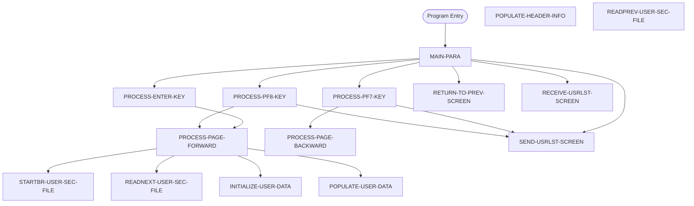

# Program: COUSR00C


---

## Quick Reference

| Attribute | Value |
|-----------|-------|
| Program ID | `COUSR00C` |
| Type | ONLINE |
| Lines | 696 |
| Source | [COUSR00C.cbl](../carddemo/COUSR00C.cbl#L1) |
| Paragraphs | 16 |
| Statements | 82 |
| Impact Risk | **HIGH** — 20 programs affected |

> **View Source:** [Open COUSR00C.cbl](../carddemo/COUSR00C.cbl#L1)

## Source Grounding Facts

| Data Item | Literal Value |
|-----------|---------------|
| `WS-PGMNAME` | `COUSR00C` |
| `WS-TRANID` | `CU00` |
| `WS-USRSEC-FILE` | `USRSEC` |
| `WS-ERR-FLG` | `N` |
| `WS-USER-SEC-EOF` | `N` |
| `WS-SEND-ERASE-FLG` | `Y` |


## Business Purpose

*Business purpose is not present in the extracted data. Run LLM enrichment to populate this section.*


## Dependency Context

> This section shows how **COUSR00C** connects to the rest of the system — who calls it,
> what it calls, and what data it shares. If linked programs exist, they must appear here.

### Programs That Call COUSR00C (Callers)

*No programs call COUSR00C — this is likely a top-level entry point or CICS transaction starter.*

### Programs Called by COUSR00C (Callees)

*COUSR00C does not call any other programs (leaf program).*

### Shared Data (Copybooks & Files)

#### Shared Copybooks

| Copybook | Also Used By | # Co-Users |
|----------|-------------|------------|
| `COCOM01Y` | COACTUPC, COACTVWC, COADM01C, COBIL00C, COCRDLIC (+15 more) | 20 |
| `COTTL01Y` | COACTUPC, COACTVWC, COADM01C, COBIL00C, COCRDLIC (+15 more) | 20 |
| `COUSR00` |  | 0 |
| `CSDAT01Y` | COACTUPC, COACTVWC, COADM01C, COBIL00C, COCRDLIC (+15 more) | 20 |
| `CSMSG01Y` | COACTUPC, COACTVWC, COADM01C, COBIL00C, COCRDLIC (+15 more) | 20 |
| `CSUSR01Y` | COACTUPC, COACTVWC, COADM01C, COCRDLIC, COCRDSLC (+8 more) | 13 |
| `DFHAID` | COACTUPC, COACTVWC, COADM01C, COBIL00C, COCRDLIC (+15 more) | 20 |
| `DFHBMSCA` | COACTUPC, COACTVWC, COADM01C, COBIL00C, COCRDLIC (+15 more) | 20 |


## Legacy Data Contracts

> These tables are derived from FILE SECTION records and COPY-expanded data declarations. They preserve the legacy field names, COBOL storage type, inferred modern type, and status-code values needed for Java DTOs, SQL schemas, API contracts, and migration mapping.


### Copybook Segment Layouts

#### `COCOM01Y` as `CARDDEMO-COMMAREA`

| Legacy Field | Meaning | COBOL Type | Modern Type | Status / Format Notes |
|--------------|---------|------------|-------------|-----------------------|
| `CARDDEMO-COMMAREA` | Carddemo Commarea | `GROUP` | `OBJECT` |  |
| `CDEMO-GENERAL-INFO` | General Info | `GROUP` | `OBJECT` |  |
| `CDEMO-FROM-TRANID` | From Tranid | `PIC X(04)` | `STRING(4)` |  |
| `CDEMO-FROM-PROGRAM` | From Program | `PIC X(08)` | `STRING(8)` |  |
| `CDEMO-TO-TRANID` | To Tranid | `PIC X(04)` | `STRING(4)` |  |
| `CDEMO-TO-PROGRAM` | To Program | `PIC X(08)` | `STRING(8)` |  |
| `CDEMO-USER-ID` | User ID | `PIC X(08)` | `STRING(8)` |  |
| `CDEMO-USER-TYPE` | User Type | `PIC X(01)` | `STRING(1)` |  |
| `CDEMO-PGM-CONTEXT` | Pgm Context | `PIC 9(01)` | `INTEGER` |  |
| `CDEMO-CUSTOMER-INFO` | Customer Info | `GROUP` | `OBJECT` |  |
| `CDEMO-CUST-ID` | Customer ID | `PIC 9(09)` | `INTEGER` |  |
| `CDEMO-CUST-FNAME` | Customer Fname | `PIC X(25)` | `STRING(25)` |  |
| `CDEMO-CUST-MNAME` | Customer Mname | `PIC X(25)` | `STRING(25)` |  |
| `CDEMO-CUST-LNAME` | Customer Lname | `PIC X(25)` | `STRING(25)` |  |
| `CDEMO-ACCOUNT-INFO` | Account Info | `GROUP` | `OBJECT` |  |
| `CDEMO-ACCT-ID` | Account ID | `PIC 9(11)` | `BIGINT` |  |
| `CDEMO-ACCT-STATUS` | Account Status | `PIC X(01)` | `STRING(1)` |  |
| `CDEMO-CARD-INFO` | Card Info | `GROUP` | `OBJECT` |  |
| `CDEMO-CARD-NUM` | Card Number | `PIC 9(16)` | `BIGINT` |  |
| `CDEMO-MORE-INFO` | More Info | `GROUP` | `OBJECT` |  |
| `CDEMO-LAST-MAP` | Last Map | `PIC X(7)` | `STRING(7)` |  |
| `CDEMO-LAST-MAPSET` | Last Mapset | `PIC X(7)` | `STRING(7)` |  |

#### `COTTL01Y` as `CCDA-SCREEN-TITLE`

| Legacy Field | Meaning | COBOL Type | Modern Type | Status / Format Notes |
|--------------|---------|------------|-------------|-----------------------|
| `CCDA-SCREEN-TITLE` | Ccda Screen Title | `GROUP` | `OBJECT` |  |
| `CCDA-TITLE01` | Ccda Title01 | `PIC X(40)` | `STRING(40)` |  |
| `CCDA-TITLE02` | Ccda Title02 | `PIC X(40)` | `STRING(40)` |  |
| `CCDA-THANK-YOU` | Ccda Thank You | `PIC X(40)` | `STRING(40)` |  |

#### `COUSR00` as `COUSR0AI`

| Legacy Field | Meaning | COBOL Type | Modern Type | Status / Format Notes |
|--------------|---------|------------|-------------|-----------------------|
| `COUSR0AI` | Cousr0Ai | `GROUP` | `OBJECT` |  |
| `COUSR0AO` | Cousr0Ao | `GROUP` | `OBJECT` |  |

#### `CSDAT01Y` as `WS-DATE-TIME`

| Legacy Field | Meaning | COBOL Type | Modern Type | Status / Format Notes |
|--------------|---------|------------|-------------|-----------------------|
| `WS-DATE-TIME` | Date Time | `GROUP` | `OBJECT` |  |
| `WS-CURDATE-DATA` | Curdate Data | `GROUP` | `OBJECT` |  |
| `WS-CURDATE` | Curdate | `GROUP` | `OBJECT` |  |
| `WS-CURDATE-YEAR` | Curdate Year | `PIC 9(04)` | `INTEGER` |  |
| `WS-CURDATE-MONTH` | Curdate Month | `PIC 9(02)` | `INTEGER` |  |
| `WS-CURDATE-DAY` | Curdate Day | `PIC 9(02)` | `INTEGER` |  |
| `WS-CURDATE-N` | Curdate N | `PIC 9(08)` | `INTEGER` |  |
| `WS-CURTIME` | Curtime | `GROUP` | `OBJECT` |  |
| `WS-CURTIME-HOURS` | Curtime Hours | `PIC 9(02)` | `INTEGER` |  |
| `WS-CURTIME-MINUTE` | Curtime Minute | `PIC 9(02)` | `INTEGER` |  |
| `WS-CURTIME-SECOND` | Curtime Second | `PIC 9(02)` | `INTEGER` |  |
| `WS-CURTIME-MILSEC` | Curtime Milsec | `PIC 9(02)` | `INTEGER` |  |
| `WS-CURTIME-N` | Curtime N | `PIC 9(08)` | `INTEGER` |  |
| `WS-CURDATE-MM-DD-YY` | Curdate Mm Dd Yy | `GROUP` | `OBJECT` |  |
| `WS-CURDATE-MM` | Curdate Mm | `PIC 9(02)` | `INTEGER` |  |
| `FILLER` | Filler | `PIC X(01)` | `STRING(1)` |  |
| `WS-CURDATE-DD` | Curdate Dd | `PIC 9(02)` | `INTEGER` |  |
| `FILLER` | Filler | `PIC X(01)` | `STRING(1)` |  |
| `WS-CURDATE-YY` | Curdate Yy | `PIC 9(02)` | `INTEGER` |  |
| `WS-CURTIME-HH-MM-SS` | Curtime Hh Mm Ss | `GROUP` | `OBJECT` |  |
| `WS-CURTIME-HH` | Curtime Hh | `PIC 9(02)` | `INTEGER` |  |
| `FILLER` | Filler | `PIC X(01)` | `STRING(1)` |  |
| `WS-CURTIME-MM` | Curtime Mm | `PIC 9(02)` | `INTEGER` |  |
| `FILLER` | Filler | `PIC X(01)` | `STRING(1)` |  |
| `WS-CURTIME-SS` | Curtime Ss | `PIC 9(02)` | `INTEGER` |  |
| `WS-TIMESTAMP` | Timestamp | `GROUP` | `OBJECT` |  |
| `WS-TIMESTAMP-DT-YYYY` | Timestamp Date Yyyy | `PIC 9(04)` | `INTEGER` |  |
| `FILLER` | Filler | `PIC X(01)` | `STRING(1)` |  |
| `WS-TIMESTAMP-DT-MM` | Timestamp Date Mm | `PIC 9(02)` | `INTEGER` |  |
| `FILLER` | Filler | `PIC X(01)` | `STRING(1)` |  |
| `WS-TIMESTAMP-DT-DD` | Timestamp Date Dd | `PIC 9(02)` | `INTEGER` |  |
| `FILLER` | Filler | `PIC X(01)` | `STRING(1)` |  |
| `WS-TIMESTAMP-TM-HH` | Timestamp Tm Hh | `PIC 9(02)` | `INTEGER` |  |
| `FILLER` | Filler | `PIC X(01)` | `STRING(1)` |  |
| `WS-TIMESTAMP-TM-MM` | Timestamp Tm Mm | `PIC 9(02)` | `INTEGER` |  |
| `FILLER` | Filler | `PIC X(01)` | `STRING(1)` |  |
| `WS-TIMESTAMP-TM-SS` | Timestamp Tm Ss | `PIC 9(02)` | `INTEGER` |  |
| `FILLER` | Filler | `PIC X(01)` | `STRING(1)` |  |
| `WS-TIMESTAMP-TM-MS6` | Timestamp Tm Ms6 | `PIC 9(06)` | `INTEGER` |  |

#### `CSMSG01Y` as `CCDA-COMMON-MESSAGES`

| Legacy Field | Meaning | COBOL Type | Modern Type | Status / Format Notes |
|--------------|---------|------------|-------------|-----------------------|
| `CCDA-COMMON-MESSAGES` | Ccda Common Messages | `GROUP` | `OBJECT` |  |
| `CCDA-MSG-THANK-YOU` | Ccda Msg Thank You | `PIC X(50)` | `STRING(50)` |  |
| `CCDA-MSG-INVALID-KEY` | Ccda Msg Invalid Key | `PIC X(50)` | `STRING(50)` |  |

#### `CSUSR01Y` as `SEC-USER-DATA`

| Legacy Field | Meaning | COBOL Type | Modern Type | Status / Format Notes |
|--------------|---------|------------|-------------|-----------------------|
| `SEC-USER-DATA` | Sec User Data | `GROUP` | `OBJECT` |  |
| `SEC-USR-ID` | Sec Usr ID | `PIC X(08)` | `STRING(8)` |  |
| `SEC-USR-FNAME` | Sec Usr Fname | `PIC X(20)` | `STRING(20)` |  |
| `SEC-USR-LNAME` | Sec Usr Lname | `PIC X(20)` | `STRING(20)` |  |
| `SEC-USR-PWD` | Sec Usr Pwd | `PIC X(08)` | `STRING(8)` |  |
| `SEC-USR-TYPE` | Sec Usr Type | `PIC X(01)` | `STRING(1)` |  |
| `SEC-USR-FILLER` | Sec Usr Filler | `PIC X(23)` | `STRING(23)` |  |

#### `DFHAID` as `DFHAID`

| Legacy Field | Meaning | COBOL Type | Modern Type | Status / Format Notes |
|--------------|---------|------------|-------------|-----------------------|
| `DFHAID` | Dfhaid | `GROUP` | `OBJECT` |  |

#### `DFHBMSCA` as `DFHBMSCA`

| Legacy Field | Meaning | COBOL Type | Modern Type | Status / Format Notes |
|--------------|---------|------------|-------------|-----------------------|
| `DFHBMSCA` | Dfhbmsca | `GROUP` | `OBJECT` |  |


### Data Movement And Key Mapping

| Line | Source | Target | Meaning |
|------|--------|--------|---------|
| 105 | `SPACES` | `WS-MESSAGE` | SPACES populates WS-MESSAGE |
| 135 | `CCDA-MSG-INVALID-KEY` | `WS-MESSAGE` | CCDA-MSG-INVALID-KEY populates WS-MESSAGE |
| 526 | `WS-MESSAGE` | `ERRMSGO OF COUSR0AO` | WS-MESSAGE populates ERRMSGO OF COUSR0AO |
| 564 | `FUNCTION CURRENT-DATE` | `WS-CURDATE-DATA` | FUNCTION CURRENT-DATE populates WS-CURDATE-DATA |
| 571 | `WS-CURDATE-MONTH` | `WS-CURDATE-MM` | WS-CURDATE-MONTH populates WS-CURDATE-MM |
| 572 | `WS-CURDATE-DAY` | `WS-CURDATE-DD` | WS-CURDATE-DAY populates WS-CURDATE-DD |
| 573 | `WS-CURDATE-YEAR(3:2)` | `WS-CURDATE-YY` | WS-CURDATE-YEAR(3:2) populates WS-CURDATE-YY |
| 575 | `WS-CURDATE-MM-DD-YY` | `CURDATEO OF COUSR0AO` | WS-CURDATE-MM-DD-YY populates CURDATEO OF COUSR0AO |


---

## Dependency Graph

```mermaid
flowchart TD
    COUSR00C["⬤ COUSR00C"]:::target
    CB_COCOM01Y{{"COCOM01Y"}}:::copybook
    COUSR00C -.- CB_COCOM01Y
    COACTUPC["COACTUPC"]:::coupled
    CB_COCOM01Y -.- COACTUPC
    COACTVWC["COACTVWC"]:::coupled
    CB_COCOM01Y -.- COACTVWC
    COADM01C["COADM01C"]:::coupled
    CB_COCOM01Y -.- COADM01C
    CB_COTTL01Y{{"COTTL01Y"}}:::copybook
    COUSR00C -.- CB_COTTL01Y
    COACTUPC["COACTUPC"]:::coupled
    CB_COTTL01Y -.- COACTUPC
    COACTVWC["COACTVWC"]:::coupled
    CB_COTTL01Y -.- COACTVWC
    COADM01C["COADM01C"]:::coupled
    CB_COTTL01Y -.- COADM01C
    CB_CSDAT01Y{{"CSDAT01Y"}}:::copybook
    COUSR00C -.- CB_CSDAT01Y
    COACTUPC["COACTUPC"]:::coupled
    CB_CSDAT01Y -.- COACTUPC
    COACTVWC["COACTVWC"]:::coupled
    CB_CSDAT01Y -.- COACTVWC
    COADM01C["COADM01C"]:::coupled
    CB_CSDAT01Y -.- COADM01C
    CB_CSMSG01Y{{"CSMSG01Y"}}:::copybook
    COUSR00C -.- CB_CSMSG01Y
    COACTUPC["COACTUPC"]:::coupled
    CB_CSMSG01Y -.- COACTUPC
    COACTVWC["COACTVWC"]:::coupled
    CB_CSMSG01Y -.- COACTVWC
    COADM01C["COADM01C"]:::coupled
    CB_CSMSG01Y -.- COADM01C
    CB_CSUSR01Y{{"CSUSR01Y"}}:::copybook
    COUSR00C -.- CB_CSUSR01Y
    COACTUPC["COACTUPC"]:::coupled
    CB_CSUSR01Y -.- COACTUPC
    COACTVWC["COACTVWC"]:::coupled
    CB_CSUSR01Y -.- COACTVWC
    COADM01C["COADM01C"]:::coupled
    CB_CSUSR01Y -.- COADM01C
    CB_DFHAID{{"DFHAID"}}:::copybook
    COUSR00C -.- CB_DFHAID
    COACTUPC["COACTUPC"]:::coupled
    CB_DFHAID -.- COACTUPC
    COACTVWC["COACTVWC"]:::coupled
    CB_DFHAID -.- COACTVWC
    COADM01C["COADM01C"]:::coupled
    CB_DFHAID -.- COADM01C
    CB_DFHBMSCA{{"DFHBMSCA"}}:::copybook
    COUSR00C -.- CB_DFHBMSCA
    COACTUPC["COACTUPC"]:::coupled
    CB_DFHBMSCA -.- COACTUPC
    COACTVWC["COACTVWC"]:::coupled
    CB_DFHBMSCA -.- COACTVWC
    COADM01C["COADM01C"]:::coupled
    CB_DFHBMSCA -.- COADM01C
    classDef target fill:#f85149,stroke:#da3633,color:#fff,stroke-width:3px
    classDef caller fill:#58a6ff,stroke:#1f6feb,color:#fff
    classDef callee fill:#3fb950,stroke:#238636,color:#fff
    classDef copybook fill:#d29922,stroke:#9e6a03,color:#fff
    classDef coupled fill:#d29922,stroke:#9e6a03,color:#fff,stroke-dasharray:5
    classDef transitive fill:#484f58,stroke:#8b949e,color:#c9d1d9,stroke-dasharray:5
```



> **Legend:** 🔴 Target program · 🔵 Direct callers · 🟢 Direct callees · 🟡 Copybook-coupled · ⚫ Transitive (indirect)

---

## Impact Ripple View

> **If you change COUSR00C, what else could break?**

| Impact Metric | Count |
|--------------|-------|
| Direct Callers | 0 |
| Transitive Callers (callers of callers) | 0 |
| Direct Callees | 0 |
| Transitive Callees | 0 |
| Copybook-Coupled Programs | 20 |
| **Total Impact** | **20** |
| **Risk Rating** | **HIGH** |


**Programs affected via shared copybooks:**
- `COACTUPC`
- `COACTVWC`
- `COADM01C`
- `COBIL00C`
- `COCRDLIC`
- `COCRDSLC`
- `COCRDUPC`
- `COMEN01C`
- `COPAUS0C`
- `COPAUS1C`
- `CORPT00C`
- `COSGN00C`
- `COTRN00C`
- `COTRN01C`
- `COTRN02C`
- `COTRTLIC`
- `COTRTUPC`
- `COUSR01C`
- `COUSR02C`
- `COUSR03C`

---

## Statement Profile

| Statement Type | Count |
|---------------|-------|
| IF | 37 |
| MOVE | 23 |
| EXEC_CICS | 7 |
| EVALUATE | 6 |
| SET | 5 |
| PERFORM | 4 |

## Control Flow



## Paragraphs

### MAIN-PARA

| | |
|---|---|
| **Paragraph** | `MAIN-PARA` |
| **Lines** | 98 - 148 |
| **View Code** | [Jump to Line 98](../carddemo/COUSR00C.cbl#L98) |


### PROCESS-ENTER-KEY

| | |
|---|---|
| **Paragraph** | `PROCESS-ENTER-KEY` |
| **Lines** | 149 - 236 |
| **View Code** | [Jump to Line 149](../carddemo/COUSR00C.cbl#L149) |


### PROCESS-PF7-KEY

| | |
|---|---|
| **Paragraph** | `PROCESS-PF7-KEY` |
| **Lines** | 237 - 259 |
| **View Code** | [Jump to Line 237](../carddemo/COUSR00C.cbl#L237) |


### PROCESS-PF8-KEY

| | |
|---|---|
| **Paragraph** | `PROCESS-PF8-KEY` |
| **Lines** | 260 - 281 |
| **View Code** | [Jump to Line 260](../carddemo/COUSR00C.cbl#L260) |


### PROCESS-PAGE-FORWARD

| | |
|---|---|
| **Paragraph** | `PROCESS-PAGE-FORWARD` |
| **Lines** | 282 - 335 |
| **View Code** | [Jump to Line 282](../carddemo/COUSR00C.cbl#L282) |


### PROCESS-PAGE-BACKWARD

| | |
|---|---|
| **Paragraph** | `PROCESS-PAGE-BACKWARD` |
| **Lines** | 336 - 383 |
| **View Code** | [Jump to Line 336](../carddemo/COUSR00C.cbl#L336) |


### POPULATE-USER-DATA

| | |
|---|---|
| **Paragraph** | `POPULATE-USER-DATA` |
| **Lines** | 384 - 445 |
| **View Code** | [Jump to Line 384](../carddemo/COUSR00C.cbl#L384) |


### INITIALIZE-USER-DATA

| | |
|---|---|
| **Paragraph** | `INITIALIZE-USER-DATA` |
| **Lines** | 446 - 505 |
| **View Code** | [Jump to Line 446](../carddemo/COUSR00C.cbl#L446) |


### RETURN-TO-PREV-SCREEN

| | |
|---|---|
| **Paragraph** | `RETURN-TO-PREV-SCREEN` |
| **Lines** | 506 - 521 |
| **View Code** | [Jump to Line 506](../carddemo/COUSR00C.cbl#L506) |


### SEND-USRLST-SCREEN

| | |
|---|---|
| **Paragraph** | `SEND-USRLST-SCREEN` |
| **Lines** | 522 - 548 |
| **View Code** | [Jump to Line 522](../carddemo/COUSR00C.cbl#L522) |


### RECEIVE-USRLST-SCREEN

| | |
|---|---|
| **Paragraph** | `RECEIVE-USRLST-SCREEN` |
| **Lines** | 549 - 561 |
| **View Code** | [Jump to Line 549](../carddemo/COUSR00C.cbl#L549) |


### POPULATE-HEADER-INFO

| | |
|---|---|
| **Paragraph** | `POPULATE-HEADER-INFO` |
| **Lines** | 562 - 585 |
| **View Code** | [Jump to Line 562](../carddemo/COUSR00C.cbl#L562) |


### STARTBR-USER-SEC-FILE

| | |
|---|---|
| **Paragraph** | `STARTBR-USER-SEC-FILE` |
| **Lines** | 586 - 618 |
| **View Code** | [Jump to Line 586](../carddemo/COUSR00C.cbl#L586) |


### READNEXT-USER-SEC-FILE

| | |
|---|---|
| **Paragraph** | `READNEXT-USER-SEC-FILE` |
| **Lines** | 619 - 652 |
| **View Code** | [Jump to Line 619](../carddemo/COUSR00C.cbl#L619) |


### READPREV-USER-SEC-FILE

| | |
|---|---|
| **Paragraph** | `READPREV-USER-SEC-FILE` |
| **Lines** | 653 - 686 |
| **View Code** | [Jump to Line 653](../carddemo/COUSR00C.cbl#L653) |


### ENDBR-USER-SEC-FILE

| | |
|---|---|
| **Paragraph** | `ENDBR-USER-SEC-FILE` |
| **Lines** | 687 - 695 |
| **View Code** | [Jump to Line 687](../carddemo/COUSR00C.cbl#L687) |


## Copybook Field Dictionaries

The following copybooks are included by this program. Each entry shows the actual fields
extracted from the copybook source file (`.cpy`).

### Copybook `COCOM01Y`

| Level | Field | PIC | USAGE | Parent | Notes |
|-------|-------|-----|-------|--------|-------|
| `01` | `CARDDEMO-COMMAREA` | `None` | None | None |  |
| `05` | `CDEMO-GENERAL-INFO` | `None` | None | CARDDEMO-COMMAREA |  |
| `10` | `CDEMO-FROM-TRANID` | `X(04)` | None | CDEMO-GENERAL-INFO |  |
| `10` | `CDEMO-FROM-PROGRAM` | `X(08)` | None | CDEMO-GENERAL-INFO |  |
| `10` | `CDEMO-TO-TRANID` | `X(04)` | None | CDEMO-GENERAL-INFO |  |
| `10` | `CDEMO-TO-PROGRAM` | `X(08)` | None | CDEMO-GENERAL-INFO |  |
| `10` | `CDEMO-USER-ID` | `X(08)` | None | CDEMO-GENERAL-INFO |  |
| `10` | `CDEMO-USER-TYPE` | `X(01)` | None | CDEMO-GENERAL-INFO |  |
| `88` | `CDEMO-USRTYP-ADMIN` | `None` | None | CDEMO-GENERAL-INFO |  |
| `88` | `CDEMO-USRTYP-USER` | `None` | None | CDEMO-GENERAL-INFO |  |
| `10` | `CDEMO-PGM-CONTEXT` | `9(01)` | None | CDEMO-GENERAL-INFO |  |
| `88` | `CDEMO-PGM-ENTER` | `None` | None | CDEMO-GENERAL-INFO |  |
| `88` | `CDEMO-PGM-REENTER` | `None` | None | CDEMO-GENERAL-INFO |  |
| `05` | `CDEMO-CUSTOMER-INFO` | `None` | None | CARDDEMO-COMMAREA |  |
| `10` | `CDEMO-CUST-ID` | `9(09)` | None | CDEMO-CUSTOMER-INFO |  |
| `10` | `CDEMO-CUST-FNAME` | `X(25)` | None | CDEMO-CUSTOMER-INFO |  |
| `10` | `CDEMO-CUST-MNAME` | `X(25)` | None | CDEMO-CUSTOMER-INFO |  |
| `10` | `CDEMO-CUST-LNAME` | `X(25)` | None | CDEMO-CUSTOMER-INFO |  |
| `05` | `CDEMO-ACCOUNT-INFO` | `None` | None | CARDDEMO-COMMAREA |  |
| `10` | `CDEMO-ACCT-ID` | `9(11)` | None | CDEMO-ACCOUNT-INFO |  |
| `10` | `CDEMO-ACCT-STATUS` | `X(01)` | None | CDEMO-ACCOUNT-INFO |  |
| `05` | `CDEMO-CARD-INFO` | `None` | None | CARDDEMO-COMMAREA |  |
| `10` | `CDEMO-CARD-NUM` | `9(16)` | None | CDEMO-CARD-INFO |  |
| `05` | `CDEMO-MORE-INFO` | `None` | None | CARDDEMO-COMMAREA |  |
| `10` | `CDEMO-LAST-MAP` | `X(7)` | None | CDEMO-MORE-INFO |  |
| `10` | `CDEMO-LAST-MAPSET` | `X(7)` | None | CDEMO-MORE-INFO |  |

### Copybook `COTTL01Y`

| Level | Field | PIC | USAGE | Parent | Notes |
|-------|-------|-----|-------|--------|-------|
| `01` | `CCDA-SCREEN-TITLE` | `None` | None | None |  |
| `05` | `CCDA-TITLE01` | `X(40)` | None | CCDA-SCREEN-TITLE |  |
| `05` | `CCDA-TITLE02` | `X(40)` | None | CCDA-SCREEN-TITLE |  |
| `05` | `CCDA-THANK-YOU` | `X(40)` | None | CCDA-SCREEN-TITLE |  |

### Copybook `COUSR00`

| Level | Field | PIC | USAGE | Parent | Notes |
|-------|-------|-----|-------|--------|-------|
| `01` | `COUSR0AI` | `None` | None | None |  |
| `02` | `TRNNAMEL` | `S9(4)` | COMP | COUSR0AI |  |
| `02` | `TRNNAMEF` | `X` | None | COUSR0AI |  |
| `03` | `TRNNAMEA` | `X` | None | COUSR0AI |  |
| `02` | `TRNNAMEI` | `X(4)` | None | COUSR0AI |  |
| `02` | `TITLE01L` | `S9(4)` | COMP | COUSR0AI |  |
| `02` | `TITLE01F` | `X` | None | COUSR0AI |  |
| `03` | `TITLE01A` | `X` | None | COUSR0AI |  |
| `02` | `TITLE01I` | `X(40)` | None | COUSR0AI |  |
| `02` | `CURDATEL` | `S9(4)` | COMP | COUSR0AI |  |
| `02` | `CURDATEF` | `X` | None | COUSR0AI |  |
| `03` | `CURDATEA` | `X` | None | COUSR0AI |  |
| `02` | `CURDATEI` | `X(8)` | None | COUSR0AI |  |
| `02` | `PGMNAMEL` | `S9(4)` | COMP | COUSR0AI |  |
| `02` | `PGMNAMEF` | `X` | None | COUSR0AI |  |
| `03` | `PGMNAMEA` | `X` | None | COUSR0AI |  |
| `02` | `PGMNAMEI` | `X(8)` | None | COUSR0AI |  |
| `02` | `TITLE02L` | `S9(4)` | COMP | COUSR0AI |  |
| `02` | `TITLE02F` | `X` | None | COUSR0AI |  |
| `03` | `TITLE02A` | `X` | None | COUSR0AI |  |
| `02` | `TITLE02I` | `X(40)` | None | COUSR0AI |  |
| `02` | `CURTIMEL` | `S9(4)` | COMP | COUSR0AI |  |
| `02` | `CURTIMEF` | `X` | None | COUSR0AI |  |
| `03` | `CURTIMEA` | `X` | None | COUSR0AI |  |
| `02` | `CURTIMEI` | `X(8)` | None | COUSR0AI |  |
| `02` | `PAGENUML` | `S9(4)` | COMP | COUSR0AI |  |
| `02` | `PAGENUMF` | `X` | None | COUSR0AI |  |
| `03` | `PAGENUMA` | `X` | None | COUSR0AI |  |
| `02` | `PAGENUMI` | `X(8)` | None | COUSR0AI |  |
| `02` | `USRIDINL` | `S9(4)` | COMP | COUSR0AI |  |
| `02` | `USRIDINF` | `X` | None | COUSR0AI |  |
| `03` | `USRIDINA` | `X` | None | COUSR0AI |  |
| `02` | `USRIDINI` | `X(8)` | None | COUSR0AI |  |
| `02` | `SEL0001L` | `S9(4)` | COMP | COUSR0AI |  |
| `02` | `SEL0001F` | `X` | None | COUSR0AI |  |
| `03` | `SEL0001A` | `X` | None | COUSR0AI |  |
| `02` | `SEL0001I` | `X(1)` | None | COUSR0AI |  |
| `02` | `USRID01L` | `S9(4)` | COMP | COUSR0AI |  |
| `02` | `USRID01F` | `X` | None | COUSR0AI |  |
| `03` | `USRID01A` | `X` | None | COUSR0AI |  |
| `02` | `USRID01I` | `X(8)` | None | COUSR0AI |  |
| `02` | `FNAME01L` | `S9(4)` | COMP | COUSR0AI |  |
| `02` | `FNAME01F` | `X` | None | COUSR0AI |  |
| `03` | `FNAME01A` | `X` | None | COUSR0AI |  |
| `02` | `FNAME01I` | `X(20)` | None | COUSR0AI |  |
| `02` | `LNAME01L` | `S9(4)` | COMP | COUSR0AI |  |
| `02` | `LNAME01F` | `X` | None | COUSR0AI |  |
| `03` | `LNAME01A` | `X` | None | COUSR0AI |  |
| `02` | `LNAME01I` | `X(20)` | None | COUSR0AI |  |
| `02` | `UTYPE01L` | `S9(4)` | COMP | COUSR0AI |  |
*+ 483 more fields*
### Copybook `CSDAT01Y`

| Level | Field | PIC | USAGE | Parent | Notes |
|-------|-------|-----|-------|--------|-------|
| `01` | `WS-DATE-TIME` | `None` | None | None |  |
| `05` | `WS-CURDATE-DATA` | `None` | None | WS-DATE-TIME |  |
| `10` | `WS-CURDATE` | `None` | None | WS-CURDATE-DATA |  |
| `15` | `WS-CURDATE-YEAR` | `9(04)` | None | WS-CURDATE |  |
| `15` | `WS-CURDATE-MONTH` | `9(02)` | None | WS-CURDATE |  |
| `15` | `WS-CURDATE-DAY` | `9(02)` | None | WS-CURDATE |  |
| `10` | `WS-CURDATE-N` | `9(08)` | None | WS-CURDATE-DATA |  REDEFINES WS-CURDATE |
| `10` | `WS-CURTIME` | `None` | None | WS-CURDATE-DATA |  |
| `15` | `WS-CURTIME-HOURS` | `9(02)` | None | WS-CURTIME |  |
| `15` | `WS-CURTIME-MINUTE` | `9(02)` | None | WS-CURTIME |  |
| `15` | `WS-CURTIME-SECOND` | `9(02)` | None | WS-CURTIME |  |
| `15` | `WS-CURTIME-MILSEC` | `9(02)` | None | WS-CURTIME |  |
| `10` | `WS-CURTIME-N` | `9(08)` | None | WS-CURDATE-DATA |  REDEFINES WS-CURTIME |
| `05` | `WS-CURDATE-MM-DD-YY` | `None` | None | WS-DATE-TIME |  |
| `10` | `WS-CURDATE-MM` | `9(02)` | None | WS-CURDATE-MM-DD-YY |  |
| `10` | `WS-CURDATE-DD` | `9(02)` | None | WS-CURDATE-MM-DD-YY |  |
| `10` | `WS-CURDATE-YY` | `9(02)` | None | WS-CURDATE-MM-DD-YY |  |
| `05` | `WS-CURTIME-HH-MM-SS` | `None` | None | WS-DATE-TIME |  |
| `10` | `WS-CURTIME-HH` | `9(02)` | None | WS-CURTIME-HH-MM-SS |  |
| `10` | `WS-CURTIME-MM` | `9(02)` | None | WS-CURTIME-HH-MM-SS |  |
| `10` | `WS-CURTIME-SS` | `9(02)` | None | WS-CURTIME-HH-MM-SS |  |
| `05` | `WS-TIMESTAMP` | `None` | None | WS-DATE-TIME |  |
| `10` | `WS-TIMESTAMP-DT-YYYY` | `9(04)` | None | WS-TIMESTAMP |  |
| `10` | `WS-TIMESTAMP-DT-MM` | `9(02)` | None | WS-TIMESTAMP |  |
| `10` | `WS-TIMESTAMP-DT-DD` | `9(02)` | None | WS-TIMESTAMP |  |
| `10` | `WS-TIMESTAMP-TM-HH` | `9(02)` | None | WS-TIMESTAMP |  |
| `10` | `WS-TIMESTAMP-TM-MM` | `9(02)` | None | WS-TIMESTAMP |  |
| `10` | `WS-TIMESTAMP-TM-SS` | `9(02)` | None | WS-TIMESTAMP |  |
| `10` | `WS-TIMESTAMP-TM-MS6` | `9(06)` | None | WS-TIMESTAMP |  |

### Copybook `CSMSG01Y`

| Level | Field | PIC | USAGE | Parent | Notes |
|-------|-------|-----|-------|--------|-------|
| `01` | `CCDA-COMMON-MESSAGES` | `None` | None | None |  |
| `05` | `CCDA-MSG-THANK-YOU` | `X(50)` | None | CCDA-COMMON-MESSAGES |  |
| `05` | `CCDA-MSG-INVALID-KEY` | `X(50)` | None | CCDA-COMMON-MESSAGES |  |

### Copybook `CSUSR01Y`

| Level | Field | PIC | USAGE | Parent | Notes |
|-------|-------|-----|-------|--------|-------|
| `01` | `SEC-USER-DATA` | `None` | None | None |  |
| `05` | `SEC-USR-ID` | `X(08)` | None | SEC-USER-DATA |  |
| `05` | `SEC-USR-FNAME` | `X(20)` | None | SEC-USER-DATA |  |
| `05` | `SEC-USR-LNAME` | `X(20)` | None | SEC-USER-DATA |  |
| `05` | `SEC-USR-PWD` | `X(08)` | None | SEC-USER-DATA |  |
| `05` | `SEC-USR-TYPE` | `X(01)` | None | SEC-USER-DATA |  |
| `05` | `SEC-USR-FILLER` | `X(23)` | None | SEC-USER-DATA |  |

### Copybook `DFHAID`

| Level | Field | PIC | USAGE | Parent | Notes |
|-------|-------|-----|-------|--------|-------|
| `01` | `DFHAID` | `None` | None | None |  |
| `02` | `DFHENTER` | `X` | None | DFHAID |  |
| `02` | `DFHCLEAR` | `X` | None | DFHAID |  |
| `02` | `DFHCLRP` | `X` | None | DFHAID |  |
| `02` | `DFHPA1` | `X` | None | DFHAID |  |
| `02` | `DFHPA2` | `X` | None | DFHAID |  |
| `02` | `DFHPA3` | `X` | None | DFHAID |  |
| `02` | `DFHPF1` | `X` | None | DFHAID |  |
| `02` | `DFHPF2` | `X` | None | DFHAID |  |
| `02` | `DFHPF3` | `X` | None | DFHAID |  |
| `02` | `DFHPF4` | `X` | None | DFHAID |  |
| `02` | `DFHPF5` | `X` | None | DFHAID |  |
| `02` | `DFHPF6` | `X` | None | DFHAID |  |
| `02` | `DFHPF7` | `X` | None | DFHAID |  |
| `02` | `DFHPF8` | `X` | None | DFHAID |  |
| `02` | `DFHPF9` | `X` | None | DFHAID |  |
| `02` | `DFHPF10` | `X` | None | DFHAID |  |
| `02` | `DFHPF11` | `X` | None | DFHAID |  |
| `02` | `DFHPF12` | `X` | None | DFHAID |  |
| `02` | `DFHPF13` | `X` | None | DFHAID |  |
| `02` | `DFHPF14` | `X` | None | DFHAID |  |
| `02` | `DFHPF15` | `X` | None | DFHAID |  |
| `02` | `DFHPF16` | `X` | None | DFHAID |  |
| `02` | `DFHPF17` | `X` | None | DFHAID |  |
| `02` | `DFHPF18` | `X` | None | DFHAID |  |
| `02` | `DFHPF19` | `X` | None | DFHAID |  |
| `02` | `DFHPF20` | `X` | None | DFHAID |  |
| `02` | `DFHPF21` | `X` | None | DFHAID |  |
| `02` | `DFHPF22` | `X` | None | DFHAID |  |
| `02` | `DFHPF23` | `X` | None | DFHAID |  |
| `02` | `DFHPF24` | `X` | None | DFHAID |  |
| `02` | `DFHPEN` | `X` | None | DFHAID |  |
| `02` | `DFHOPID` | `X` | None | DFHAID |  |
| `02` | `DFHMSRE` | `X` | None | DFHAID |  |
| `02` | `DFHSTRF` | `X` | None | DFHAID |  |
| `02` | `DFHTRIG` | `X` | None | DFHAID |  |

### Copybook `DFHBMSCA`

| Level | Field | PIC | USAGE | Parent | Notes |
|-------|-------|-----|-------|--------|-------|
| `01` | `DFHBMSCA` | `None` | None | None |  |
| `02` | `DFHBMPEM` | `X` | None | DFHBMSCA |  |
| `02` | `DFHBMPNL` | `X` | None | DFHBMSCA |  |
| `02` | `DFHBMASK` | `X` | None | DFHBMSCA |  |
| `02` | `DFHBMUNP` | `X` | None | DFHBMSCA |  |
| `02` | `DFHBMUNN` | `X` | None | DFHBMSCA |  |
| `02` | `DFHBMPRO` | `X` | None | DFHBMSCA |  |
| `02` | `DFHBMBRY` | `X` | None | DFHBMSCA |  |
| `02` | `DFHBMDAR` | `X` | None | DFHBMSCA |  |
| `02` | `DFHBMFSE` | `X` | None | DFHBMSCA |  |
| `02` | `DFHBMPRF` | `X` | None | DFHBMSCA |  |
| `02` | `DFHBMASF` | `X` | None | DFHBMSCA |  |
| `02` | `DFHBMASB` | `X` | None | DFHBMSCA |  |
| `02` | `DFHBMEOF` | `X` | None | DFHBMSCA |  |
| `02` | `DFHBMEC` | `X` | None | DFHBMSCA |  |
| `02` | `DFHSA` | `X` | None | DFHBMSCA |  |
| `02` | `DFHCOLOR` | `X` | None | DFHBMSCA |  |
| `02` | `DFHPS` | `X` | None | DFHBMSCA |  |
| `02` | `DFHHLT` | `X` | None | DFHBMSCA |  |
| `02` | `DFHVAL` | `X` | None | DFHBMSCA |  |
| `02` | `DFHOUTLN` | `X` | None | DFHBMSCA |  |
| `02` | `DFHBKTRN` | `X` | None | DFHBMSCA |  |
| `02` | `DFHALL` | `X` | None | DFHBMSCA |  |
| `02` | `DFHERROR` | `X` | None | DFHBMSCA |  |
| `02` | `DFHDFT` | `X` | None | DFHBMSCA |  |
| `02` | `DFHDFCOL` | `X` | None | DFHBMSCA |  |
| `02` | `DFHBLUE` | `X` | None | DFHBMSCA |  |
| `02` | `DFHRED` | `X` | None | DFHBMSCA |  |
| `02` | `DFHPINK` | `X` | None | DFHBMSCA |  |
| `02` | `DFHGREEN` | `X` | None | DFHBMSCA |  |
| `02` | `DFHTURQ` | `X` | None | DFHBMSCA |  |
| `02` | `DFHYELLO` | `X` | None | DFHBMSCA |  |
| `02` | `DFHWHTE` | `X` | None | DFHBMSCA |  |
| `02` | `CATTR-H-UNPROT` | `X` | None | DFHBMSCA |  |
| `02` | `CATTR-H-UNPROT-FSET` | `X` | None | DFHBMSCA |  |
| `02` | `CATTR-H-UNPROT-NUM` | `X` | None | DFHBMSCA |  |
| `02` | `CATTR-H-ASKIP` | `X` | None | DFHBMSCA |  |


## Data Lineage (MOVE Flow)

The following MOVE statements were extracted from the source. Each row is a `source → destination`
flow that the migration team can use to trace how data is reshaped and routed.

| Source | Destination | Paragraph | Line |
|--------|-------------|-----------|------|
| `SPACES` | `WS-MESSAGE` | MAIN-PARA | 105 |
| `'-1'` | `USRIDINL` | MAIN-PARA | 108 |
| `'-1'` | `OF` | MAIN-PARA | 108 |
| `'-1'` | `COUSR0AI` | MAIN-PARA | 108 |
| `'COSGN00C'` | `CDEMO-TO-PROGRAM` | MAIN-PARA | 111 |
| `DFHCOMMAREA(1:EIBCALEN)` | `CARDDEMO-COMMAREA` | MAIN-PARA | 114 |
| `LOW-VALUES` | `COUSR0AO` | MAIN-PARA | 117 |
| `'COADM01C'` | `CDEMO-TO-PROGRAM` | MAIN-PARA | 126 |
| `'Y'` | `WS-ERR-FLG` | MAIN-PARA | 133 |
| `'-1'` | `USRIDINL` | MAIN-PARA | 134 |
| `'-1'` | `OF` | MAIN-PARA | 134 |
| `'-1'` | `COUSR0AI` | MAIN-PARA | 134 |
| `CCDA-MSG-INVALID-KEY` | `WS-MESSAGE` | MAIN-PARA | 135 |
| `SPACES` | `CDEMO-CU00-USR-SEL-FLG` | PROCESS-ENTER-KEY | 183 |
| `SPACES` | `CDEMO-CU00-USR-SELECTED` | PROCESS-ENTER-KEY | 184 |
| `'COUSR02C'` | `CDEMO-TO-PROGRAM` | PROCESS-ENTER-KEY | 192 |
| `WS-TRANID` | `CDEMO-FROM-TRANID` | PROCESS-ENTER-KEY | 193 |
| `WS-PGMNAME` | `CDEMO-FROM-PROGRAM` | PROCESS-ENTER-KEY | 194 |
| `'0'` | `CDEMO-PGM-CONTEXT` | PROCESS-ENTER-KEY | 195 |
| `'COUSR03C'` | `CDEMO-TO-PROGRAM` | PROCESS-ENTER-KEY | 202 |
| `WS-TRANID` | `CDEMO-FROM-TRANID` | PROCESS-ENTER-KEY | 203 |
| `WS-PGMNAME` | `CDEMO-FROM-PROGRAM` | PROCESS-ENTER-KEY | 204 |
| `'0'` | `CDEMO-PGM-CONTEXT` | PROCESS-ENTER-KEY | 205 |
| `'-1'` | `USRIDINL` | PROCESS-ENTER-KEY | 214 |
| `'-1'` | `OF` | PROCESS-ENTER-KEY | 214 |
| `'-1'` | `COUSR0AI` | PROCESS-ENTER-KEY | 214 |
| `LOW-VALUES` | `SEC-USR-ID` | PROCESS-ENTER-KEY | 219 |
| `'-1'` | `USRIDINL` | PROCESS-ENTER-KEY | 224 |
| `'-1'` | `OF` | PROCESS-ENTER-KEY | 224 |
| `'-1'` | `COUSR0AI` | PROCESS-ENTER-KEY | 224 |
| `'0'` | `CDEMO-CU00-PAGE-NUM` | PROCESS-ENTER-KEY | 227 |
| `SPACE` | `USRIDINO` | PROCESS-ENTER-KEY | 231 |
| `SPACE` | `OF` | PROCESS-ENTER-KEY | 231 |
| `SPACE` | `COUSR0AO` | PROCESS-ENTER-KEY | 231 |
| `LOW-VALUES` | `SEC-USR-ID` | PROCESS-PF7-KEY | 240 |
| `CDEMO-CU00-USRID-FIRST` | `SEC-USR-ID` | PROCESS-PF7-KEY | 242 |
| `'-1'` | `USRIDINL` | PROCESS-PF7-KEY | 246 |
| `'-1'` | `OF` | PROCESS-PF7-KEY | 246 |
| `'-1'` | `COUSR0AI` | PROCESS-PF7-KEY | 246 |
| `HIGH-VALUES` | `SEC-USR-ID` | PROCESS-PF8-KEY | 263 |
| `CDEMO-CU00-USRID-LAST` | `SEC-USR-ID` | PROCESS-PF8-KEY | 265 |
| `'-1'` | `USRIDINL` | PROCESS-PF8-KEY | 268 |
| `'-1'` | `OF` | PROCESS-PF8-KEY | 268 |
| `'-1'` | `COUSR0AI` | PROCESS-PF8-KEY | 268 |
| `'1'` | `WS-IDX` | PROCESS-PAGE-FORWARD | 298 |
| `CDEMO-CU00-PAGE-NUM` | `PAGENUMI` | PROCESS-PAGE-FORWARD | 327 |
| `CDEMO-CU00-PAGE-NUM` | `OF` | PROCESS-PAGE-FORWARD | 327 |
| `CDEMO-CU00-PAGE-NUM` | `COUSR0AI` | PROCESS-PAGE-FORWARD | 327 |
| `SPACE` | `USRIDINO` | PROCESS-PAGE-FORWARD | 328 |
| `SPACE` | `OF` | PROCESS-PAGE-FORWARD | 328 |
| `SPACE` | `COUSR0AO` | PROCESS-PAGE-FORWARD | 328 |
| `'10'` | `WS-IDX` | PROCESS-PAGE-BACKWARD | 352 |
| `'1'` | `CDEMO-CU00-PAGE-NUM` | PROCESS-PAGE-BACKWARD | 369 |
| `CDEMO-CU00-PAGE-NUM` | `PAGENUMI` | PROCESS-PAGE-BACKWARD | 376 |
| `CDEMO-CU00-PAGE-NUM` | `OF` | PROCESS-PAGE-BACKWARD | 376 |
| `CDEMO-CU00-PAGE-NUM` | `COUSR0AI` | PROCESS-PAGE-BACKWARD | 376 |
| `SEC-USR-ID` | `USRID01I` | POPULATE-USER-DATA | 388 |
| `SEC-USR-ID` | `OF` | POPULATE-USER-DATA | 388 |
| `SEC-USR-ID` | `COUSR0AI` | POPULATE-USER-DATA | 388 |
| `SEC-USR-FNAME` | `FNAME01I` | POPULATE-USER-DATA | 390 |
*+ 40 more movements*

## Known Issues & Code Anomalies

Static analysis flagged the following items in this program. Migration teams should
review each one before re-implementing in a modern stack.

| Severity | Category | Title | Paragraph | Line |
|----------|----------|-------|-----------|------|
| **NOTICE** | DEAD_CODE | Variable `WS-USER-SEC-EOF` is declared but never referenced | None | 43 |
| **NOTICE** | DEAD_CODE | Variable `WS-SEND-ERASE-FLG` is declared but never referenced | None | 46 |
| **NOTICE** | DEAD_CODE | Variable `WS-REC-COUNT` is declared but never referenced | None | 52 |
| **NOTICE** | DEAD_CODE | Variable `WS-PAGE-NUM` is declared but never referenced | None | 54 |
| **NOTICE** | DEAD_CODE | Variable `USER-SEL` is declared but never referenced | None | 58 |
| **NOTICE** | DEAD_CODE | Variable `USER-ID` is declared but never referenced | None | 60 |
| **NOTICE** | DEAD_CODE | Variable `USER-NAME` is declared but never referenced | None | 62 |
| **NOTICE** | DEAD_CODE | Variable `USER-TYPE` is declared but never referenced | None | 64 |
| **NOTICE** | DEAD_CODE | Variable `LK-COMMAREA` is declared but never referenced | None | 91 |

### NOTICE — Variable `WS-USER-SEC-EOF` is declared but never referenced

`WS-USER-SEC-EOF` is declared at line 43 but no other statement reads or writes it. Likely a leftover from prior refactoring or an incomplete feature.
**Source excerpt** (line 43):
```cobol
05 WS-USER-SEC-EOF            PIC X(01) VALUE 'N'.
```

**Recommendation:** Remove the declaration or wire it into the logic that was originally intended.
---
### NOTICE — Variable `WS-SEND-ERASE-FLG` is declared but never referenced

`WS-SEND-ERASE-FLG` is declared at line 46 but no other statement reads or writes it. Likely a leftover from prior refactoring or an incomplete feature.
**Source excerpt** (line 46):
```cobol
05 WS-SEND-ERASE-FLG          PIC X(01) VALUE 'Y'.
```

**Recommendation:** Remove the declaration or wire it into the logic that was originally intended.
---
### NOTICE — Variable `WS-REC-COUNT` is declared but never referenced

`WS-REC-COUNT` is declared at line 52 but no other statement reads or writes it. Likely a leftover from prior refactoring or an incomplete feature.
**Source excerpt** (line 52):
```cobol
05 WS-REC-COUNT               PIC S9(04) COMP VALUE ZEROS.
```

**Recommendation:** Remove the declaration or wire it into the logic that was originally intended.
---
### NOTICE — Variable `WS-PAGE-NUM` is declared but never referenced

`WS-PAGE-NUM` is declared at line 54 but no other statement reads or writes it. Likely a leftover from prior refactoring or an incomplete feature.
**Source excerpt** (line 54):
```cobol
05 WS-PAGE-NUM                PIC S9(04) COMP VALUE ZEROS.
```

**Recommendation:** Remove the declaration or wire it into the logic that was originally intended.
---
### NOTICE — Variable `USER-SEL` is declared but never referenced

`USER-SEL` is declared at line 58 but no other statement reads or writes it. Likely a leftover from prior refactoring or an incomplete feature.
**Source excerpt** (line 58):
```cobol
05 USER-SEL                   PIC X(01).
```

**Recommendation:** Remove the declaration or wire it into the logic that was originally intended.
---
### NOTICE — Variable `USER-ID` is declared but never referenced

`USER-ID` is declared at line 60 but no other statement reads or writes it. Likely a leftover from prior refactoring or an incomplete feature.
**Source excerpt** (line 60):
```cobol
05 USER-ID                    PIC X(08).
```

**Recommendation:** Remove the declaration or wire it into the logic that was originally intended.
---
### NOTICE — Variable `USER-NAME` is declared but never referenced

`USER-NAME` is declared at line 62 but no other statement reads or writes it. Likely a leftover from prior refactoring or an incomplete feature.
**Source excerpt** (line 62):
```cobol
05 USER-NAME                  PIC X(25).
```

**Recommendation:** Remove the declaration or wire it into the logic that was originally intended.
---
### NOTICE — Variable `USER-TYPE` is declared but never referenced

`USER-TYPE` is declared at line 64 but no other statement reads or writes it. Likely a leftover from prior refactoring or an incomplete feature.
**Source excerpt** (line 64):
```cobol
05 USER-TYPE                  PIC X(08).
```

**Recommendation:** Remove the declaration or wire it into the logic that was originally intended.
---
### NOTICE — Variable `LK-COMMAREA` is declared but never referenced

`LK-COMMAREA` is declared at line 91 but no other statement reads or writes it. Likely a leftover from prior refactoring or an incomplete feature.
**Source excerpt** (line 91):
```cobol
05  LK-COMMAREA                           PIC X(01)
```

**Recommendation:** Remove the declaration or wire it into the logic that was originally intended.
---


## Decision Tables (EVALUATE / WHEN)

Captured from the source. Each EVALUATE block is a structured decision the
migration team should turn into either a switch / pattern-match or a rules table.

### EVALUATE `EIBAID` — paragraph `MAIN-PARA` (line 132)

| WHEN | Action |
|------|--------|
| **WHEN OTHER** | MOVE 'Y'                       TO WS-ERR-FLG |
| `DFHENTER` | PERFORM PROCESS-ENTER-KEY |
| `DFHPF3` | MOVE 'COADM01C' TO CDEMO-TO-PROGRAM |
| `DFHPF7` | PERFORM PROCESS-PF7-KEY |
| `DFHPF8` | PERFORM PROCESS-PF8-KEY |

### EVALUATE `TRUE` — paragraph `PROCESS-ENTER-KEY` (line 182)

| WHEN | Action |
|------|--------|
| **WHEN OTHER** | MOVE SPACES   TO CDEMO-CU00-USR-SEL-FLG |
| `SEL0001I OF COUSR0AI NOT = SPACES AND LOW-VALUES` | MOVE SEL0001I OF COUSR0AI TO CDEMO-CU00-USR-SEL-FLG |
| `SEL0002I OF COUSR0AI NOT = SPACES AND LOW-VALUES` | MOVE SEL0002I OF COUSR0AI TO CDEMO-CU00-USR-SEL-FLG |
| `SEL0003I OF COUSR0AI NOT = SPACES AND LOW-VALUES` | MOVE SEL0003I OF COUSR0AI TO CDEMO-CU00-USR-SEL-FLG |
| `SEL0004I OF COUSR0AI NOT = SPACES AND LOW-VALUES` | MOVE SEL0004I OF COUSR0AI TO CDEMO-CU00-USR-SEL-FLG |
| `SEL0005I OF COUSR0AI NOT = SPACES AND LOW-VALUES` | MOVE SEL0005I OF COUSR0AI TO CDEMO-CU00-USR-SEL-FLG |
| `SEL0006I OF COUSR0AI NOT = SPACES AND LOW-VALUES` | MOVE SEL0006I OF COUSR0AI TO CDEMO-CU00-USR-SEL-FLG |
| `SEL0007I OF COUSR0AI NOT = SPACES AND LOW-VALUES` | MOVE SEL0007I OF COUSR0AI TO CDEMO-CU00-USR-SEL-FLG |
| `SEL0008I OF COUSR0AI NOT = SPACES AND LOW-VALUES` | MOVE SEL0008I OF COUSR0AI TO CDEMO-CU00-USR-SEL-FLG |
| `SEL0009I OF COUSR0AI NOT = SPACES AND LOW-VALUES` | MOVE SEL0009I OF COUSR0AI TO CDEMO-CU00-USR-SEL-FLG |
| `SEL0010I OF COUSR0AI NOT = SPACES AND LOW-VALUES` | MOVE SEL0010I OF COUSR0AI TO CDEMO-CU00-USR-SEL-FLG |

### EVALUATE `CDEMO-CU00-USR-SEL-FLG` — paragraph `PROCESS-ENTER-KEY` (line 210)

| WHEN | Action |
|------|--------|
| **WHEN OTHER** | MOVE |
| `'U'` |  |
| `'u'` | MOVE 'COUSR02C'   TO CDEMO-TO-PROGRAM |
| `'D'` |  |
| `'d'` | MOVE 'COUSR03C'   TO CDEMO-TO-PROGRAM |

### EVALUATE `WS-IDX` — paragraph `POPULATE-USER-DATA` (line 439)

| WHEN | Action |
|------|--------|
| **WHEN OTHER** | CONTINUE |
| `1` | MOVE SEC-USR-ID    TO USRID01I OF COUSR0AI |
| `2` | MOVE SEC-USR-ID    TO USRID02I OF COUSR0AI |
| `3` | MOVE SEC-USR-ID    TO USRID03I OF COUSR0AI |
| `4` | MOVE SEC-USR-ID    TO USRID04I OF COUSR0AI |
| `5` | MOVE SEC-USR-ID    TO USRID05I OF COUSR0AI |
| `6` | MOVE SEC-USR-ID    TO USRID06I OF COUSR0AI |
| `7` | MOVE SEC-USR-ID    TO USRID07I OF COUSR0AI |
| `8` | MOVE SEC-USR-ID    TO USRID08I OF COUSR0AI |
| `9` | MOVE SEC-USR-ID    TO USRID09I OF COUSR0AI |
| `10` | MOVE SEC-USR-ID    TO USRID10I OF COUSR0AI |

### EVALUATE `WS-IDX` — paragraph `INITIALIZE-USER-DATA` (line 499)

| WHEN | Action |
|------|--------|
| **WHEN OTHER** | CONTINUE |
| `1` | MOVE SPACES TO USRID01I OF COUSR0AI |
| `2` | MOVE SPACES TO USRID02I OF COUSR0AI |
| `3` | MOVE SPACES TO USRID03I OF COUSR0AI |
| `4` | MOVE SPACES TO USRID04I OF COUSR0AI |
| `5` | MOVE SPACES TO USRID05I OF COUSR0AI |
| `6` | MOVE SPACES TO USRID06I OF COUSR0AI |
| `7` | MOVE SPACES TO USRID07I OF COUSR0AI |
| `8` | MOVE SPACES TO USRID08I OF COUSR0AI |
| `9` | MOVE SPACES TO USRID09I OF COUSR0AI |
| `10` | MOVE SPACES TO USRID10I OF COUSR0AI |

### EVALUATE `WS-RESP-CD` — paragraph `STARTBR-USER-SEC-FILE` (line 607)

| WHEN | Action |
|------|--------|
| **WHEN OTHER** | DISPLAY 'RESP:' WS-RESP-CD 'REAS:' WS-REAS-CD |
| `DFHRESP(NORMAL)` | CONTINUE |
| `DFHRESP(NOTFND)` | CONTINUE |

### EVALUATE `WS-RESP-CD` — paragraph `READNEXT-USER-SEC-FILE` (line 641)

| WHEN | Action |
|------|--------|
| **WHEN OTHER** | DISPLAY 'RESP:' WS-RESP-CD 'REAS:' WS-REAS-CD |
| `DFHRESP(NORMAL)` | CONTINUE |
| `DFHRESP(ENDFILE)` | CONTINUE |

### EVALUATE `WS-RESP-CD` — paragraph `READPREV-USER-SEC-FILE` (line 675)

| WHEN | Action |
|------|--------|
| **WHEN OTHER** | DISPLAY 'RESP:' WS-RESP-CD 'REAS:' WS-REAS-CD |
| `DFHRESP(NORMAL)` | CONTINUE |
| `DFHRESP(ENDFILE)` | CONTINUE |


## CICS Commands

This program uses the following EXEC CICS commands:

| Command | Paragraph | Line | Details |
|---------|-----------|------|---------|
| `RETURN` | MAIN-PARA | 141 | {"details": {"transid": "WS-TRANID", "commarea": "CARDDEMO-COMMAREA"}} |
| `XCTL` | PROCESS-ENTER-KEY | 196 | {"details": {"program": "CDEMO-TO-PROGRAM", "commarea": "CARDDEMO-COMMAREA"}} |
| `XCTL` | PROCESS-ENTER-KEY | 206 | {"details": {"program": "CDEMO-TO-PROGRAM", "commarea": "CARDDEMO-COMMAREA"}} |
| `XCTL` | RETURN-TO-PREV-SCREEN | 514 | {"details": {"program": "CDEMO-TO-PROGRAM", "commarea": "CARDDEMO-COMMAREA"}} |
| `SEND` | SEND-USRLST-SCREEN | 529 | {"details": {"map": "COUSR0A", "mapset": "COUSR00", "from": "COUSR0AO"}} |
| `SEND` | SEND-USRLST-SCREEN | 537 | {"details": {"map": "COUSR0A", "mapset": "COUSR00", "from": "COUSR0AO"}} |
| `RECEIVE` | RECEIVE-USRLST-SCREEN | 551 | {"details": {"map": "COUSR0A", "mapset": "COUSR00", "into": "COUSR0AI", "resp": ... |
| `STARTBR` | STARTBR-USER-SEC-FILE | 588 | {"details": {"dataset": "WS-USRSEC-FILE", "length": "LENGTH OF SEC-USR-ID", "rid... |
| `READNEXT` | READNEXT-USER-SEC-FILE | 621 | {"details": {"dataset": "WS-USRSEC-FILE", "into": "SEC-USER-DATA", "length": "LE... |
| `READPREV` | READPREV-USER-SEC-FILE | 655 | {"details": {"dataset": "WS-USRSEC-FILE", "into": "SEC-USER-DATA", "length": "LE... |
| `ENDBR` | ENDBR-USER-SEC-FILE | 689 | {"details": {"dataset": "WS-USRSEC-FILE"}} |

**Summary:** 11 CICS command(s) — RETURN (1), XCTL (3), SEND (2), RECEIVE (1), STARTBR (1), READNEXT (1), READPREV (1), ENDBR (1)

## CICS Screen Workflow Notes

These notes are derived directly from the COBOL source and BMS map usage. They are intended
to prevent migration errors where a PF key label is mistaken for the full transaction flow.

### Program transfers use XCTL, not a soft return

`EXEC CICS XCTL` transfers control to another program and does not return to the current program like a subroutine call. Document PF-key navigation that reaches this paragraph as a CICS transfer, not as an in-place screen redisplay.

Evidence:
- L196 in `PROCESS-ENTER-KEY`: EXEC CICS XCTL {"details": {"program": "CDEMO-TO-PROGRAM", "commarea": "CARDDEMO-COMMAREA"}}
- L206 in `PROCESS-ENTER-KEY`: EXEC CICS XCTL {"details": {"program": "CDEMO-TO-PROGRAM", "commarea": "CARDDEMO-COMMAREA"}}
- L514 in `RETURN-TO-PREV-SCREEN`: EXEC CICS XCTL {"details": {"program": "CDEMO-TO-PROGRAM", "commarea": "CARDDEMO-COMMAREA"}}

### Initial entry without COMMAREA transfers to sign-on

When `EIBCALEN = 0`, this program prepares `COSGN00C` as the target and follows the return/transfer path. It does not display its own BMS map on that entry path.

Evidence:
- L110: `IF EIBCALEN = 0`
- L111: `MOVE 'COSGN00C' TO CDEMO-TO-PROGRAM`
- L509: `MOVE 'COSGN00C' TO CDEMO-TO-PROGRAM`
- L196 in `PROCESS-ENTER-KEY`: EXEC CICS XCTL {"details": {"program": "CDEMO-TO-PROGRAM", "commarea": "CARDDEMO-COMMAREA"}}

### PF3 navigation resolves through RETURN-TO-PREV-SCREEN

PF3 selects the `RETURN-TO-PREV-SCREEN` path. That paragraph ends in `EXEC CICS XCTL`, so PF3 is a transfer to the target program held in the COMMAREA routing fields.

Evidence:
- L125: `WHEN DFHPF3`
- L112: `PERFORM RETURN-TO-PREV-SCREEN`
- L127: `PERFORM RETURN-TO-PREV-SCREEN`
- L196 in `PROCESS-ENTER-KEY`: EXEC CICS XCTL {"details": {"program": "CDEMO-TO-PROGRAM", "commarea": "CARDDEMO-COMMAREA"}}

### Error/message text is written to the BMS output field

`ERRMSGI` exists in the input copybook area, but this program displays messages by moving `WS-MESSAGE` to `ERRMSGO OF COUSR3AO`. Documentation should refer to `ERRMSGO` when describing rendered error or status messages.

Evidence:
- L526: `MOVE WS-MESSAGE TO ERRMSGO OF COUSR0AO`

### ERR-FLG is reset at the start of each run

`ERR-FLG` starts each invocation on the off path via `SET ERR-FLG-OFF TO TRUE`. Validation and file-error branches set or test `ERR-FLG-ON` to stop later processing.

Evidence:
- L100: `SET ERR-FLG-OFF TO TRUE`
- L41: `88 ERR-FLG-ON                         VALUE 'Y'.`
- L230: `IF NOT ERR-FLG-ON`
- L286: `IF NOT ERR-FLG-ON`
- L300: `PERFORM UNTIL WS-IDX >= 11 OR USER-SEC-EOF OR ERR-FLG-ON`

### The BMS map can be sent from multiple paths

Screen output is centralized in the send paragraph, but several routines can perform it. If a read routine sends the map and its caller also sends the map, a modern UI migration must preserve or deliberately remove that duplicate response behavior.

Evidence:
- L119: `MAIN-PARA` performs `SEND-USRLST-SCREEN`
- L136: `MAIN-PARA` performs `SEND-USRLST-SCREEN`
- L254: `PROCESS-PF7-KEY` performs `SEND-USRLST-SCREEN`
- L276: `PROCESS-PF8-KEY` performs `SEND-USRLST-SCREEN`
- L329: `PROCESS-PAGE-FORWARD` performs `SEND-USRLST-SCREEN`
- L377: `PROCESS-PAGE-BACKWARD` performs `SEND-USRLST-SCREEN`
- L606: `STARTBR-USER-SEC-FILE` performs `SEND-USRLST-SCREEN`
- L613: `STARTBR-USER-SEC-FILE` performs `SEND-USRLST-SCREEN`
- L529 in `SEND-USRLST-SCREEN`: EXEC CICS SEND {"details": {"map": "COUSR0A", "mapset": "COUSR00", "from": "COUSR0AO"}}


## Modernization Review Findings

These are source-derived review notes that should be checked before translating this program into Java, Spring Boot, SQL, APIs, or batch jobs.

| Finding | Why It Matters |
|---------|----------------|
| Nested IF blocks need compiler-accurate validation | Nested conditional logic was detected. During migration, validate scope with the original compiler rules and explicit `END-IF`/period termination before translating to Java or SQL. |


## Business Rules

- **Display User Data** `BR-389`  
  User data is prepared for display on the terminal screen.  
  [View Rule Details](../business-rules/BR-389.md)
- **Display Next Page of Users** `BR-390`  
  When the user requests the next page of user data, display the subsequent set of users from the security file.  
  [View Rule Details](../business-rules/BR-390.md)
- **Display Previous Page of Users** `BR-391`  
  When the user requests the previous page of user data, display the preceding set of users from the security file.  
  [View Rule Details](../business-rules/BR-391.md)
- **Return to Previous Menu** `BR-392`  
  When the user requests to return to the previous menu, terminate the current user display and navigate back to the calling menu.  
  [View Rule Details](../business-rules/BR-392.md)
- **Display Next Page** `BR-393`  
  If the user presses the PF7 key, display the next page of user records.  
  [View Rule Details](../business-rules/BR-393.md)
- **Display Previous Page** `BR-394`  
  If the user presses the PF7 key, display the previous page of user records.  
  [View Rule Details](../business-rules/BR-394.md)
- **Display Next Page** `BR-395`  
  If the user presses the PF8 key, display the next page of user records.  
  [View Rule Details](../business-rules/BR-395.md)
- **End of User List** `BR-396`  
  The user cannot page forward if they are already viewing the last page of user records.  
  [View Rule Details](../business-rules/BR-396.md)
- **Prevent Paging Beyond First Page** `BR-397`  
  The user cannot page backward if they are already on the first page of the user list.  
  [View Rule Details](../business-rules/BR-397.md)
- **User Status Determination** `BR-398`  
  The system determines the status of a user based on a specific code within their security record.  
  [View Rule Details](../business-rules/BR-398.md)
- **Handle Invalid Menu Option** `BR-399`  
  If the user enters an invalid option on the menu, display an error message.  
  [View Rule Details](../business-rules/BR-399.md)
- **Display User List** `BR-400`  
  Display a list of users from the security file on the terminal screen.  
  [View Rule Details](../business-rules/BR-400.md)
- **Page Forward Through User List** `BR-401`  
  Allow the user to page forward through the list of users.  
  [View Rule Details](../business-rules/BR-401.md)
- **Page Backward Through User List** `BR-402`  
  Allow the user to page backward through the list of users.  
  [View Rule Details](../business-rules/BR-402.md)
- **Return to Previous Screen** `BR-403`  
  Allow the user to return to the previous screen (presumably the menu).  
  [View Rule Details](../business-rules/BR-403.md)
- **Return to Previous Screen** `BR-404`  
  When the user chooses to return to the previous screen, the system prepares to display the previous screen.  
  [View Rule Details](../business-rules/BR-404.md)
- **Display User List** `BR-405`  
  The system displays a list of users from the security file on the terminal screen.  
  [View Rule Details](../business-rules/BR-405.md)
- **Page Through User List** `BR-406`  
  The user can navigate through the list of users.  
  [View Rule Details](../business-rules/BR-406.md)
- **Return to Previous Screen** `BR-407`  
  The user can return to the previous screen.  
  [View Rule Details](../business-rules/BR-407.md)
- **Handle Errors and Display Messages** `BR-408`  
  The system handles errors and displays messages to the user.  
  [View Rule Details](../business-rules/BR-408.md)
- **Invalid Security File Status** `BR-409`  
  If the security file is not in a valid state after an attempted read, display an error message to the user.  
  [View Rule Details](../business-rules/BR-409.md)
- **Display User Record** `BR-410`  
  Display the user's record on the terminal screen.  
  [View Rule Details](../business-rules/BR-410.md)
- **Handle End of File** `BR-411`  
  Inform the user that the end of the user list has been reached.  
  [View Rule Details](../business-rules/BR-411.md)
- **Handle File Read Error** `BR-412`  
  Inform the user that there was an error reading the user list.  
  [View Rule Details](../business-rules/BR-412.md)
- **Display Previous User Record** `BR-413`  
  The system retrieves and displays the previous user record from the security file.  
  [View Rule Details](../business-rules/BR-413.md)

## Key Data Items

| Name | Level | Picture | Section | Business Name |
|------|-------|---------|---------|---------------|
| `WS-VARIABLES` | 1 | `None` | WORKING-STORAGE | None |
| `WS-PGMNAME` | 5 | `X(08)` | WORKING-STORAGE | None |
| `WS-TRANID` | 5 | `X(04)` | WORKING-STORAGE | None |
| `WS-MESSAGE` | 5 | `X(80)` | WORKING-STORAGE | None |
| `WS-USRSEC-FILE` | 5 | `X(08)` | WORKING-STORAGE | None |
| `WS-ERR-FLG` | 5 | `X(01)` | WORKING-STORAGE | None |
| `ERR-FLG-ON` | 88 | `None` | WORKING-STORAGE | None |
| `ERR-FLG-OFF` | 88 | `None` | WORKING-STORAGE | None |
| `WS-USER-SEC-EOF` | 5 | `X(01)` | WORKING-STORAGE | None |
| `USER-SEC-EOF` | 88 | `None` | WORKING-STORAGE | None |
| `USER-SEC-NOT-EOF` | 88 | `None` | WORKING-STORAGE | None |
| `WS-SEND-ERASE-FLG` | 5 | `X(01)` | WORKING-STORAGE | None |
| `SEND-ERASE-YES` | 88 | `None` | WORKING-STORAGE | None |
| `SEND-ERASE-NO` | 88 | `None` | WORKING-STORAGE | None |
| `WS-RESP-CD` | 5 | `S9(09)` | WORKING-STORAGE | None |
| `WS-REAS-CD` | 5 | `S9(09)` | WORKING-STORAGE | None |
| `WS-REC-COUNT` | 5 | `S9(04)` | WORKING-STORAGE | None |
| `WS-IDX` | 5 | `S9(04)` | WORKING-STORAGE | None |
| `WS-PAGE-NUM` | 5 | `S9(04)` | WORKING-STORAGE | None |
| `WS-USER-DATA` | 1 | `None` | WORKING-STORAGE | None |
| `USER-REC` | 2 | `None` | WORKING-STORAGE | None |
| `USER-SEL` | 5 | `X(01)` | WORKING-STORAGE | None |
| `FILLER` | 5 | `X(02)` | WORKING-STORAGE | None |
| `USER-ID` | 5 | `X(08)` | WORKING-STORAGE | None |
| `FILLER` | 5 | `X(02)` | WORKING-STORAGE | None |
| `USER-NAME` | 5 | `X(25)` | WORKING-STORAGE | None |
| `FILLER` | 5 | `X(02)` | WORKING-STORAGE | None |
| `USER-TYPE` | 5 | `X(08)` | WORKING-STORAGE | None |
| `CARDDEMO-COMMAREA` | 1 | `None` | WORKING-STORAGE | None |
| `CDEMO-GENERAL-INFO` | 5 | `None` | WORKING-STORAGE | None |
| `CDEMO-FROM-TRANID` | 10 | `X(04)` | WORKING-STORAGE | None |
| `CDEMO-FROM-PROGRAM` | 10 | `X(08)` | WORKING-STORAGE | None |
| `CDEMO-TO-TRANID` | 10 | `X(04)` | WORKING-STORAGE | None |
| `CDEMO-TO-PROGRAM` | 10 | `X(08)` | WORKING-STORAGE | None |
| `CDEMO-USER-ID` | 10 | `X(08)` | WORKING-STORAGE | None |
| `CDEMO-USER-TYPE` | 10 | `X(01)` | WORKING-STORAGE | None |
| `CDEMO-USRTYP-ADMIN` | 88 | `None` | WORKING-STORAGE | None |
| `CDEMO-USRTYP-USER` | 88 | `None` | WORKING-STORAGE | None |
| `CDEMO-PGM-CONTEXT` | 10 | `9(01)` | WORKING-STORAGE | None |
| `CDEMO-PGM-ENTER` | 88 | `None` | WORKING-STORAGE | None |

*Showing 40 of 903 data items. See [Data Dictionary](../data-dictionary.md).*

---

*Generated 2026-05-02 17:07*