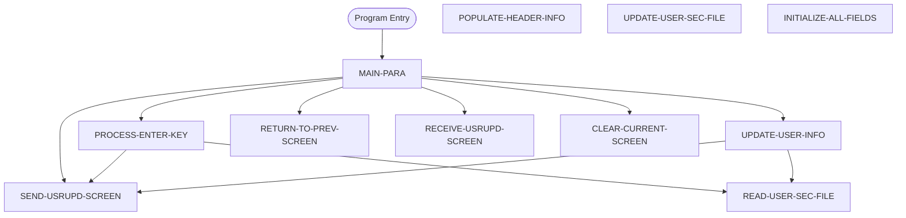

# Program: COUSR02C


---

## Quick Reference

| Attribute | Value |
|-----------|-------|
| Program ID | `COUSR02C` |
| Type | ONLINE |
| Lines | 415 |
| Source | [COUSR02C.cbl](../carddemo/COUSR02C.cbl#L1) |
| Paragraphs | 11 |
| Statements | 53 |
| Impact Risk | **HIGH** — 20 programs affected |

> **View Source:** [Open COUSR02C.cbl](../carddemo/COUSR02C.cbl#L1)

## Source Grounding Facts

| Data Item | Literal Value |
|-----------|---------------|
| `WS-PGMNAME` | `COUSR02C` |
| `WS-TRANID` | `CU02` |
| `WS-USRSEC-FILE` | `USRSEC` |
| `WS-ERR-FLG` | `N` |
| `WS-USR-MODIFIED` | `N` |


## Business Purpose

*Business purpose is not present in the extracted data. Run LLM enrichment to populate this section.*


## Dependency Context

> This section shows how **COUSR02C** connects to the rest of the system — who calls it,
> what it calls, and what data it shares. If linked programs exist, they must appear here.

### Programs That Call COUSR02C (Callers)

*No programs call COUSR02C — this is likely a top-level entry point or CICS transaction starter.*

### Programs Called by COUSR02C (Callees)

*COUSR02C does not call any other programs (leaf program).*

### Shared Data (Copybooks & Files)

#### Shared Copybooks

| Copybook | Also Used By | # Co-Users |
|----------|-------------|------------|
| `COCOM01Y` | COACTUPC, COACTVWC, COADM01C, COBIL00C, COCRDLIC (+15 more) | 20 |
| `COTTL01Y` | COACTUPC, COACTVWC, COADM01C, COBIL00C, COCRDLIC (+15 more) | 20 |
| `COUSR02` |  | 0 |
| `CSDAT01Y` | COACTUPC, COACTVWC, COADM01C, COBIL00C, COCRDLIC (+15 more) | 20 |
| `CSMSG01Y` | COACTUPC, COACTVWC, COADM01C, COBIL00C, COCRDLIC (+15 more) | 20 |
| `CSUSR01Y` | COACTUPC, COACTVWC, COADM01C, COCRDLIC, COCRDSLC (+8 more) | 13 |
| `DFHAID` | COACTUPC, COACTVWC, COADM01C, COBIL00C, COCRDLIC (+15 more) | 20 |
| `DFHBMSCA` | COACTUPC, COACTVWC, COADM01C, COBIL00C, COCRDLIC (+15 more) | 20 |


## Legacy Data Contracts

> These tables are derived from FILE SECTION records and COPY-expanded data declarations. They preserve the legacy field names, COBOL storage type, inferred modern type, and status-code values needed for Java DTOs, SQL schemas, API contracts, and migration mapping.


### Copybook Segment Layouts

#### `COCOM01Y` as `CARDDEMO-COMMAREA`

| Legacy Field | Meaning | COBOL Type | Modern Type | Status / Format Notes |
|--------------|---------|------------|-------------|-----------------------|
| `CARDDEMO-COMMAREA` | Carddemo Commarea | `GROUP` | `OBJECT` |  |
| `CDEMO-GENERAL-INFO` | General Info | `GROUP` | `OBJECT` |  |
| `CDEMO-FROM-TRANID` | From Tranid | `PIC X(04)` | `STRING(4)` |  |
| `CDEMO-FROM-PROGRAM` | From Program | `PIC X(08)` | `STRING(8)` |  |
| `CDEMO-TO-TRANID` | To Tranid | `PIC X(04)` | `STRING(4)` |  |
| `CDEMO-TO-PROGRAM` | To Program | `PIC X(08)` | `STRING(8)` |  |
| `CDEMO-USER-ID` | User ID | `PIC X(08)` | `STRING(8)` |  |
| `CDEMO-USER-TYPE` | User Type | `PIC X(01)` | `STRING(1)` |  |
| `CDEMO-PGM-CONTEXT` | Pgm Context | `PIC 9(01)` | `INTEGER` |  |
| `CDEMO-CUSTOMER-INFO` | Customer Info | `GROUP` | `OBJECT` |  |
| `CDEMO-CUST-ID` | Customer ID | `PIC 9(09)` | `INTEGER` |  |
| `CDEMO-CUST-FNAME` | Customer Fname | `PIC X(25)` | `STRING(25)` |  |
| `CDEMO-CUST-MNAME` | Customer Mname | `PIC X(25)` | `STRING(25)` |  |
| `CDEMO-CUST-LNAME` | Customer Lname | `PIC X(25)` | `STRING(25)` |  |
| `CDEMO-ACCOUNT-INFO` | Account Info | `GROUP` | `OBJECT` |  |
| `CDEMO-ACCT-ID` | Account ID | `PIC 9(11)` | `BIGINT` |  |
| `CDEMO-ACCT-STATUS` | Account Status | `PIC X(01)` | `STRING(1)` |  |
| `CDEMO-CARD-INFO` | Card Info | `GROUP` | `OBJECT` |  |
| `CDEMO-CARD-NUM` | Card Number | `PIC 9(16)` | `BIGINT` |  |
| `CDEMO-MORE-INFO` | More Info | `GROUP` | `OBJECT` |  |
| `CDEMO-LAST-MAP` | Last Map | `PIC X(7)` | `STRING(7)` |  |
| `CDEMO-LAST-MAPSET` | Last Mapset | `PIC X(7)` | `STRING(7)` |  |

#### `COTTL01Y` as `CCDA-SCREEN-TITLE`

| Legacy Field | Meaning | COBOL Type | Modern Type | Status / Format Notes |
|--------------|---------|------------|-------------|-----------------------|
| `CCDA-SCREEN-TITLE` | Ccda Screen Title | `GROUP` | `OBJECT` |  |
| `CCDA-TITLE01` | Ccda Title01 | `PIC X(40)` | `STRING(40)` |  |
| `CCDA-TITLE02` | Ccda Title02 | `PIC X(40)` | `STRING(40)` |  |
| `CCDA-THANK-YOU` | Ccda Thank You | `PIC X(40)` | `STRING(40)` |  |

#### `COUSR02` as `COUSR2AI`

| Legacy Field | Meaning | COBOL Type | Modern Type | Status / Format Notes |
|--------------|---------|------------|-------------|-----------------------|
| `COUSR2AI` | Cousr2Ai | `GROUP` | `OBJECT` |  |
| `COUSR2AO` | Cousr2Ao | `GROUP` | `OBJECT` |  |

#### `CSDAT01Y` as `WS-DATE-TIME`

| Legacy Field | Meaning | COBOL Type | Modern Type | Status / Format Notes |
|--------------|---------|------------|-------------|-----------------------|
| `WS-DATE-TIME` | Date Time | `GROUP` | `OBJECT` |  |
| `WS-CURDATE-DATA` | Curdate Data | `GROUP` | `OBJECT` |  |
| `WS-CURDATE` | Curdate | `GROUP` | `OBJECT` |  |
| `WS-CURDATE-YEAR` | Curdate Year | `PIC 9(04)` | `INTEGER` |  |
| `WS-CURDATE-MONTH` | Curdate Month | `PIC 9(02)` | `INTEGER` |  |
| `WS-CURDATE-DAY` | Curdate Day | `PIC 9(02)` | `INTEGER` |  |
| `WS-CURDATE-N` | Curdate N | `PIC 9(08)` | `INTEGER` |  |
| `WS-CURTIME` | Curtime | `GROUP` | `OBJECT` |  |
| `WS-CURTIME-HOURS` | Curtime Hours | `PIC 9(02)` | `INTEGER` |  |
| `WS-CURTIME-MINUTE` | Curtime Minute | `PIC 9(02)` | `INTEGER` |  |
| `WS-CURTIME-SECOND` | Curtime Second | `PIC 9(02)` | `INTEGER` |  |
| `WS-CURTIME-MILSEC` | Curtime Milsec | `PIC 9(02)` | `INTEGER` |  |
| `WS-CURTIME-N` | Curtime N | `PIC 9(08)` | `INTEGER` |  |
| `WS-CURDATE-MM-DD-YY` | Curdate Mm Dd Yy | `GROUP` | `OBJECT` |  |
| `WS-CURDATE-MM` | Curdate Mm | `PIC 9(02)` | `INTEGER` |  |
| `FILLER` | Filler | `PIC X(01)` | `STRING(1)` |  |
| `WS-CURDATE-DD` | Curdate Dd | `PIC 9(02)` | `INTEGER` |  |
| `FILLER` | Filler | `PIC X(01)` | `STRING(1)` |  |
| `WS-CURDATE-YY` | Curdate Yy | `PIC 9(02)` | `INTEGER` |  |
| `WS-CURTIME-HH-MM-SS` | Curtime Hh Mm Ss | `GROUP` | `OBJECT` |  |
| `WS-CURTIME-HH` | Curtime Hh | `PIC 9(02)` | `INTEGER` |  |
| `FILLER` | Filler | `PIC X(01)` | `STRING(1)` |  |
| `WS-CURTIME-MM` | Curtime Mm | `PIC 9(02)` | `INTEGER` |  |
| `FILLER` | Filler | `PIC X(01)` | `STRING(1)` |  |
| `WS-CURTIME-SS` | Curtime Ss | `PIC 9(02)` | `INTEGER` |  |
| `WS-TIMESTAMP` | Timestamp | `GROUP` | `OBJECT` |  |
| `WS-TIMESTAMP-DT-YYYY` | Timestamp Date Yyyy | `PIC 9(04)` | `INTEGER` |  |
| `FILLER` | Filler | `PIC X(01)` | `STRING(1)` |  |
| `WS-TIMESTAMP-DT-MM` | Timestamp Date Mm | `PIC 9(02)` | `INTEGER` |  |
| `FILLER` | Filler | `PIC X(01)` | `STRING(1)` |  |
| `WS-TIMESTAMP-DT-DD` | Timestamp Date Dd | `PIC 9(02)` | `INTEGER` |  |
| `FILLER` | Filler | `PIC X(01)` | `STRING(1)` |  |
| `WS-TIMESTAMP-TM-HH` | Timestamp Tm Hh | `PIC 9(02)` | `INTEGER` |  |
| `FILLER` | Filler | `PIC X(01)` | `STRING(1)` |  |
| `WS-TIMESTAMP-TM-MM` | Timestamp Tm Mm | `PIC 9(02)` | `INTEGER` |  |
| `FILLER` | Filler | `PIC X(01)` | `STRING(1)` |  |
| `WS-TIMESTAMP-TM-SS` | Timestamp Tm Ss | `PIC 9(02)` | `INTEGER` |  |
| `FILLER` | Filler | `PIC X(01)` | `STRING(1)` |  |
| `WS-TIMESTAMP-TM-MS6` | Timestamp Tm Ms6 | `PIC 9(06)` | `INTEGER` |  |

#### `CSMSG01Y` as `CCDA-COMMON-MESSAGES`

| Legacy Field | Meaning | COBOL Type | Modern Type | Status / Format Notes |
|--------------|---------|------------|-------------|-----------------------|
| `CCDA-COMMON-MESSAGES` | Ccda Common Messages | `GROUP` | `OBJECT` |  |
| `CCDA-MSG-THANK-YOU` | Ccda Msg Thank You | `PIC X(50)` | `STRING(50)` |  |
| `CCDA-MSG-INVALID-KEY` | Ccda Msg Invalid Key | `PIC X(50)` | `STRING(50)` |  |

#### `CSUSR01Y` as `SEC-USER-DATA`

| Legacy Field | Meaning | COBOL Type | Modern Type | Status / Format Notes |
|--------------|---------|------------|-------------|-----------------------|
| `SEC-USER-DATA` | Sec User Data | `GROUP` | `OBJECT` |  |
| `SEC-USR-ID` | Sec Usr ID | `PIC X(08)` | `STRING(8)` |  |
| `SEC-USR-FNAME` | Sec Usr Fname | `PIC X(20)` | `STRING(20)` |  |
| `SEC-USR-LNAME` | Sec Usr Lname | `PIC X(20)` | `STRING(20)` |  |
| `SEC-USR-PWD` | Sec Usr Pwd | `PIC X(08)` | `STRING(8)` |  |
| `SEC-USR-TYPE` | Sec Usr Type | `PIC X(01)` | `STRING(1)` |  |
| `SEC-USR-FILLER` | Sec Usr Filler | `PIC X(23)` | `STRING(23)` |  |

#### `DFHAID` as `DFHAID`

| Legacy Field | Meaning | COBOL Type | Modern Type | Status / Format Notes |
|--------------|---------|------------|-------------|-----------------------|
| `DFHAID` | Dfhaid | `GROUP` | `OBJECT` |  |

#### `DFHBMSCA` as `DFHBMSCA`

| Legacy Field | Meaning | COBOL Type | Modern Type | Status / Format Notes |
|--------------|---------|------------|-------------|-----------------------|
| `DFHBMSCA` | Dfhbmsca | `GROUP` | `OBJECT` |  |


### Data Movement And Key Mapping

| Line | Source | Target | Meaning |
|------|--------|--------|---------|
| 87 | `SPACES` | `WS-MESSAGE` | SPACES populates WS-MESSAGE |
| 129 | `CCDA-MSG-INVALID-KEY` | `WS-MESSAGE` | CCDA-MSG-INVALID-KEY populates WS-MESSAGE |
| 239 | `'Please modify` | `update` | 'Please modify populates update |
| 270 | `WS-MESSAGE` | `ERRMSGO OF COUSR2AO` | WS-MESSAGE populates ERRMSGO OF COUSR2AO |
| 298 | `FUNCTION CURRENT-DATE` | `WS-CURDATE-DATA` | FUNCTION CURRENT-DATE populates WS-CURDATE-DATA |
| 305 | `WS-CURDATE-MONTH` | `WS-CURDATE-MM` | WS-CURDATE-MONTH populates WS-CURDATE-MM |
| 306 | `WS-CURDATE-DAY` | `WS-CURDATE-DD` | WS-CURDATE-DAY populates WS-CURDATE-DD |
| 307 | `WS-CURDATE-YEAR(3:2)` | `WS-CURDATE-YY` | WS-CURDATE-YEAR(3:2) populates WS-CURDATE-YY |
| 309 | `WS-CURDATE-MM-DD-YY` | `CURDATEO OF COUSR2AO` | WS-CURDATE-MM-DD-YY populates CURDATEO OF COUSR2AO |
| 336 | `'Press PF5 key` | `save your updates` | 'Press PF5 key populates save your updates |
| 370 | `SPACES` | `WS-MESSAGE` | SPACES populates WS-MESSAGE |
| 386 | `'Unable` | `Update User` | 'Unable populates Update User |


---

## Dependency Graph

```mermaid
flowchart TD
    COUSR02C["⬤ COUSR02C"]:::target
    CB_COCOM01Y{{"COCOM01Y"}}:::copybook
    COUSR02C -.- CB_COCOM01Y
    COACTUPC["COACTUPC"]:::coupled
    CB_COCOM01Y -.- COACTUPC
    COACTVWC["COACTVWC"]:::coupled
    CB_COCOM01Y -.- COACTVWC
    COADM01C["COADM01C"]:::coupled
    CB_COCOM01Y -.- COADM01C
    CB_COTTL01Y{{"COTTL01Y"}}:::copybook
    COUSR02C -.- CB_COTTL01Y
    COACTUPC["COACTUPC"]:::coupled
    CB_COTTL01Y -.- COACTUPC
    COACTVWC["COACTVWC"]:::coupled
    CB_COTTL01Y -.- COACTVWC
    COADM01C["COADM01C"]:::coupled
    CB_COTTL01Y -.- COADM01C
    CB_CSDAT01Y{{"CSDAT01Y"}}:::copybook
    COUSR02C -.- CB_CSDAT01Y
    COACTUPC["COACTUPC"]:::coupled
    CB_CSDAT01Y -.- COACTUPC
    COACTVWC["COACTVWC"]:::coupled
    CB_CSDAT01Y -.- COACTVWC
    COADM01C["COADM01C"]:::coupled
    CB_CSDAT01Y -.- COADM01C
    CB_CSMSG01Y{{"CSMSG01Y"}}:::copybook
    COUSR02C -.- CB_CSMSG01Y
    COACTUPC["COACTUPC"]:::coupled
    CB_CSMSG01Y -.- COACTUPC
    COACTVWC["COACTVWC"]:::coupled
    CB_CSMSG01Y -.- COACTVWC
    COADM01C["COADM01C"]:::coupled
    CB_CSMSG01Y -.- COADM01C
    CB_CSUSR01Y{{"CSUSR01Y"}}:::copybook
    COUSR02C -.- CB_CSUSR01Y
    COACTUPC["COACTUPC"]:::coupled
    CB_CSUSR01Y -.- COACTUPC
    COACTVWC["COACTVWC"]:::coupled
    CB_CSUSR01Y -.- COACTVWC
    COADM01C["COADM01C"]:::coupled
    CB_CSUSR01Y -.- COADM01C
    CB_DFHAID{{"DFHAID"}}:::copybook
    COUSR02C -.- CB_DFHAID
    COACTUPC["COACTUPC"]:::coupled
    CB_DFHAID -.- COACTUPC
    COACTVWC["COACTVWC"]:::coupled
    CB_DFHAID -.- COACTVWC
    COADM01C["COADM01C"]:::coupled
    CB_DFHAID -.- COADM01C
    CB_DFHBMSCA{{"DFHBMSCA"}}:::copybook
    COUSR02C -.- CB_DFHBMSCA
    COACTUPC["COACTUPC"]:::coupled
    CB_DFHBMSCA -.- COACTUPC
    COACTVWC["COACTVWC"]:::coupled
    CB_DFHBMSCA -.- COACTVWC
    COADM01C["COADM01C"]:::coupled
    CB_DFHBMSCA -.- COADM01C
    classDef target fill:#f85149,stroke:#da3633,color:#fff,stroke-width:3px
    classDef caller fill:#58a6ff,stroke:#1f6feb,color:#fff
    classDef callee fill:#3fb950,stroke:#238636,color:#fff
    classDef copybook fill:#d29922,stroke:#9e6a03,color:#fff
    classDef coupled fill:#d29922,stroke:#9e6a03,color:#fff,stroke-dasharray:5
    classDef transitive fill:#484f58,stroke:#8b949e,color:#c9d1d9,stroke-dasharray:5
```



> **Legend:** 🔴 Target program · 🔵 Direct callers · 🟢 Direct callees · 🟡 Copybook-coupled · ⚫ Transitive (indirect)

---

## Impact Ripple View

> **If you change COUSR02C, what else could break?**

| Impact Metric | Count |
|--------------|-------|
| Direct Callers | 0 |
| Transitive Callers (callers of callers) | 0 |
| Direct Callees | 0 |
| Transitive Callees | 0 |
| Copybook-Coupled Programs | 20 |
| **Total Impact** | **20** |
| **Risk Rating** | **HIGH** |


**Programs affected via shared copybooks:**
- `COACTUPC`
- `COACTVWC`
- `COADM01C`
- `COBIL00C`
- `COCRDLIC`
- `COCRDSLC`
- `COCRDUPC`
- `COMEN01C`
- `COPAUS0C`
- `COPAUS1C`
- `CORPT00C`
- `COSGN00C`
- `COTRN00C`
- `COTRN01C`
- `COTRN02C`
- `COTRTLIC`
- `COTRTUPC`
- `COUSR00C`
- `COUSR01C`
- `COUSR03C`

---

## Statement Profile

| Statement Type | Count |
|---------------|-------|
| MOVE | 20 |
| IF | 18 |
| EXEC_CICS | 6 |
| EVALUATE | 4 |
| PERFORM | 3 |
| SET | 2 |

## Control Flow



## Paragraphs

### MAIN-PARA

| | |
|---|---|
| **Paragraph** | `MAIN-PARA` |
| **Lines** | 82 - 142 |
| **View Code** | [Jump to Line 82](../carddemo/COUSR02C.cbl#L82) |


### PROCESS-ENTER-KEY

| | |
|---|---|
| **Paragraph** | `PROCESS-ENTER-KEY` |
| **Lines** | 143 - 176 |
| **View Code** | [Jump to Line 143](../carddemo/COUSR02C.cbl#L143) |


### UPDATE-USER-INFO

| | |
|---|---|
| **Paragraph** | `UPDATE-USER-INFO` |
| **Lines** | 177 - 249 |
| **View Code** | [Jump to Line 177](../carddemo/COUSR02C.cbl#L177) |


### RETURN-TO-PREV-SCREEN

| | |
|---|---|
| **Paragraph** | `RETURN-TO-PREV-SCREEN` |
| **Lines** | 250 - 265 |
| **View Code** | [Jump to Line 250](../carddemo/COUSR02C.cbl#L250) |


### SEND-USRUPD-SCREEN

| | |
|---|---|
| **Paragraph** | `SEND-USRUPD-SCREEN` |
| **Lines** | 266 - 282 |
| **View Code** | [Jump to Line 266](../carddemo/COUSR02C.cbl#L266) |


### RECEIVE-USRUPD-SCREEN

| | |
|---|---|
| **Paragraph** | `RECEIVE-USRUPD-SCREEN` |
| **Lines** | 283 - 295 |
| **View Code** | [Jump to Line 283](../carddemo/COUSR02C.cbl#L283) |


### POPULATE-HEADER-INFO

| | |
|---|---|
| **Paragraph** | `POPULATE-HEADER-INFO` |
| **Lines** | 296 - 319 |
| **View Code** | [Jump to Line 296](../carddemo/COUSR02C.cbl#L296) |


### READ-USER-SEC-FILE

| | |
|---|---|
| **Paragraph** | `READ-USER-SEC-FILE` |
| **Lines** | 320 - 357 |
| **View Code** | [Jump to Line 320](../carddemo/COUSR02C.cbl#L320) |


### UPDATE-USER-SEC-FILE

| | |
|---|---|
| **Paragraph** | `UPDATE-USER-SEC-FILE` |
| **Lines** | 358 - 394 |
| **View Code** | [Jump to Line 358](../carddemo/COUSR02C.cbl#L358) |


### CLEAR-CURRENT-SCREEN

| | |
|---|---|
| **Paragraph** | `CLEAR-CURRENT-SCREEN` |
| **Lines** | 395 - 402 |
| **View Code** | [Jump to Line 395](../carddemo/COUSR02C.cbl#L395) |


### INITIALIZE-ALL-FIELDS

| | |
|---|---|
| **Paragraph** | `INITIALIZE-ALL-FIELDS` |
| **Lines** | 403 - 414 |
| **View Code** | [Jump to Line 403](../carddemo/COUSR02C.cbl#L403) |


## Copybook Field Dictionaries

The following copybooks are included by this program. Each entry shows the actual fields
extracted from the copybook source file (`.cpy`).

### Copybook `COCOM01Y`

| Level | Field | PIC | USAGE | Parent | Notes |
|-------|-------|-----|-------|--------|-------|
| `01` | `CARDDEMO-COMMAREA` | `None` | None | None |  |
| `05` | `CDEMO-GENERAL-INFO` | `None` | None | CARDDEMO-COMMAREA |  |
| `10` | `CDEMO-FROM-TRANID` | `X(04)` | None | CDEMO-GENERAL-INFO |  |
| `10` | `CDEMO-FROM-PROGRAM` | `X(08)` | None | CDEMO-GENERAL-INFO |  |
| `10` | `CDEMO-TO-TRANID` | `X(04)` | None | CDEMO-GENERAL-INFO |  |
| `10` | `CDEMO-TO-PROGRAM` | `X(08)` | None | CDEMO-GENERAL-INFO |  |
| `10` | `CDEMO-USER-ID` | `X(08)` | None | CDEMO-GENERAL-INFO |  |
| `10` | `CDEMO-USER-TYPE` | `X(01)` | None | CDEMO-GENERAL-INFO |  |
| `88` | `CDEMO-USRTYP-ADMIN` | `None` | None | CDEMO-GENERAL-INFO |  |
| `88` | `CDEMO-USRTYP-USER` | `None` | None | CDEMO-GENERAL-INFO |  |
| `10` | `CDEMO-PGM-CONTEXT` | `9(01)` | None | CDEMO-GENERAL-INFO |  |
| `88` | `CDEMO-PGM-ENTER` | `None` | None | CDEMO-GENERAL-INFO |  |
| `88` | `CDEMO-PGM-REENTER` | `None` | None | CDEMO-GENERAL-INFO |  |
| `05` | `CDEMO-CUSTOMER-INFO` | `None` | None | CARDDEMO-COMMAREA |  |
| `10` | `CDEMO-CUST-ID` | `9(09)` | None | CDEMO-CUSTOMER-INFO |  |
| `10` | `CDEMO-CUST-FNAME` | `X(25)` | None | CDEMO-CUSTOMER-INFO |  |
| `10` | `CDEMO-CUST-MNAME` | `X(25)` | None | CDEMO-CUSTOMER-INFO |  |
| `10` | `CDEMO-CUST-LNAME` | `X(25)` | None | CDEMO-CUSTOMER-INFO |  |
| `05` | `CDEMO-ACCOUNT-INFO` | `None` | None | CARDDEMO-COMMAREA |  |
| `10` | `CDEMO-ACCT-ID` | `9(11)` | None | CDEMO-ACCOUNT-INFO |  |
| `10` | `CDEMO-ACCT-STATUS` | `X(01)` | None | CDEMO-ACCOUNT-INFO |  |
| `05` | `CDEMO-CARD-INFO` | `None` | None | CARDDEMO-COMMAREA |  |
| `10` | `CDEMO-CARD-NUM` | `9(16)` | None | CDEMO-CARD-INFO |  |
| `05` | `CDEMO-MORE-INFO` | `None` | None | CARDDEMO-COMMAREA |  |
| `10` | `CDEMO-LAST-MAP` | `X(7)` | None | CDEMO-MORE-INFO |  |
| `10` | `CDEMO-LAST-MAPSET` | `X(7)` | None | CDEMO-MORE-INFO |  |

### Copybook `COTTL01Y`

| Level | Field | PIC | USAGE | Parent | Notes |
|-------|-------|-----|-------|--------|-------|
| `01` | `CCDA-SCREEN-TITLE` | `None` | None | None |  |
| `05` | `CCDA-TITLE01` | `X(40)` | None | CCDA-SCREEN-TITLE |  |
| `05` | `CCDA-TITLE02` | `X(40)` | None | CCDA-SCREEN-TITLE |  |
| `05` | `CCDA-THANK-YOU` | `X(40)` | None | CCDA-SCREEN-TITLE |  |

### Copybook `COUSR02`

| Level | Field | PIC | USAGE | Parent | Notes |
|-------|-------|-----|-------|--------|-------|
| `01` | `COUSR2AI` | `None` | None | None |  |
| `02` | `TRNNAMEL` | `S9(4)` | COMP | COUSR2AI |  |
| `02` | `TRNNAMEF` | `X` | None | COUSR2AI |  |
| `03` | `TRNNAMEA` | `X` | None | COUSR2AI |  |
| `02` | `TRNNAMEI` | `X(4)` | None | COUSR2AI |  |
| `02` | `TITLE01L` | `S9(4)` | COMP | COUSR2AI |  |
| `02` | `TITLE01F` | `X` | None | COUSR2AI |  |
| `03` | `TITLE01A` | `X` | None | COUSR2AI |  |
| `02` | `TITLE01I` | `X(40)` | None | COUSR2AI |  |
| `02` | `CURDATEL` | `S9(4)` | COMP | COUSR2AI |  |
| `02` | `CURDATEF` | `X` | None | COUSR2AI |  |
| `03` | `CURDATEA` | `X` | None | COUSR2AI |  |
| `02` | `CURDATEI` | `X(8)` | None | COUSR2AI |  |
| `02` | `PGMNAMEL` | `S9(4)` | COMP | COUSR2AI |  |
| `02` | `PGMNAMEF` | `X` | None | COUSR2AI |  |
| `03` | `PGMNAMEA` | `X` | None | COUSR2AI |  |
| `02` | `PGMNAMEI` | `X(8)` | None | COUSR2AI |  |
| `02` | `TITLE02L` | `S9(4)` | COMP | COUSR2AI |  |
| `02` | `TITLE02F` | `X` | None | COUSR2AI |  |
| `03` | `TITLE02A` | `X` | None | COUSR2AI |  |
| `02` | `TITLE02I` | `X(40)` | None | COUSR2AI |  |
| `02` | `CURTIMEL` | `S9(4)` | COMP | COUSR2AI |  |
| `02` | `CURTIMEF` | `X` | None | COUSR2AI |  |
| `03` | `CURTIMEA` | `X` | None | COUSR2AI |  |
| `02` | `CURTIMEI` | `X(8)` | None | COUSR2AI |  |
| `02` | `USRIDINL` | `S9(4)` | COMP | COUSR2AI |  |
| `02` | `USRIDINF` | `X` | None | COUSR2AI |  |
| `03` | `USRIDINA` | `X` | None | COUSR2AI |  |
| `02` | `USRIDINI` | `X(8)` | None | COUSR2AI |  |
| `02` | `FNAMEL` | `S9(4)` | COMP | COUSR2AI |  |
| `02` | `FNAMEF` | `X` | None | COUSR2AI |  |
| `03` | `FNAMEA` | `X` | None | COUSR2AI |  |
| `02` | `FNAMEI` | `X(20)` | None | COUSR2AI |  |
| `02` | `LNAMEL` | `S9(4)` | COMP | COUSR2AI |  |
| `02` | `LNAMEF` | `X` | None | COUSR2AI |  |
| `03` | `LNAMEA` | `X` | None | COUSR2AI |  |
| `02` | `LNAMEI` | `X(20)` | None | COUSR2AI |  |
| `02` | `PASSWDL` | `S9(4)` | COMP | COUSR2AI |  |
| `02` | `PASSWDF` | `X` | None | COUSR2AI |  |
| `03` | `PASSWDA` | `X` | None | COUSR2AI |  |
| `02` | `PASSWDI` | `X(8)` | None | COUSR2AI |  |
| `02` | `USRTYPEL` | `S9(4)` | COMP | COUSR2AI |  |
| `02` | `USRTYPEF` | `X` | None | COUSR2AI |  |
| `03` | `USRTYPEA` | `X` | None | COUSR2AI |  |
| `02` | `USRTYPEI` | `X(1)` | None | COUSR2AI |  |
| `02` | `ERRMSGL` | `S9(4)` | COMP | COUSR2AI |  |
| `02` | `ERRMSGF` | `X` | None | COUSR2AI |  |
| `03` | `ERRMSGA` | `X` | None | COUSR2AI |  |
| `02` | `ERRMSGI` | `X(78)` | None | COUSR2AI |  |
| `01` | `COUSR2AO` | `None` | None | None |  REDEFINES COUSR2AI |
*+ 60 more fields*
### Copybook `CSDAT01Y`

| Level | Field | PIC | USAGE | Parent | Notes |
|-------|-------|-----|-------|--------|-------|
| `01` | `WS-DATE-TIME` | `None` | None | None |  |
| `05` | `WS-CURDATE-DATA` | `None` | None | WS-DATE-TIME |  |
| `10` | `WS-CURDATE` | `None` | None | WS-CURDATE-DATA |  |
| `15` | `WS-CURDATE-YEAR` | `9(04)` | None | WS-CURDATE |  |
| `15` | `WS-CURDATE-MONTH` | `9(02)` | None | WS-CURDATE |  |
| `15` | `WS-CURDATE-DAY` | `9(02)` | None | WS-CURDATE |  |
| `10` | `WS-CURDATE-N` | `9(08)` | None | WS-CURDATE-DATA |  REDEFINES WS-CURDATE |
| `10` | `WS-CURTIME` | `None` | None | WS-CURDATE-DATA |  |
| `15` | `WS-CURTIME-HOURS` | `9(02)` | None | WS-CURTIME |  |
| `15` | `WS-CURTIME-MINUTE` | `9(02)` | None | WS-CURTIME |  |
| `15` | `WS-CURTIME-SECOND` | `9(02)` | None | WS-CURTIME |  |
| `15` | `WS-CURTIME-MILSEC` | `9(02)` | None | WS-CURTIME |  |
| `10` | `WS-CURTIME-N` | `9(08)` | None | WS-CURDATE-DATA |  REDEFINES WS-CURTIME |
| `05` | `WS-CURDATE-MM-DD-YY` | `None` | None | WS-DATE-TIME |  |
| `10` | `WS-CURDATE-MM` | `9(02)` | None | WS-CURDATE-MM-DD-YY |  |
| `10` | `WS-CURDATE-DD` | `9(02)` | None | WS-CURDATE-MM-DD-YY |  |
| `10` | `WS-CURDATE-YY` | `9(02)` | None | WS-CURDATE-MM-DD-YY |  |
| `05` | `WS-CURTIME-HH-MM-SS` | `None` | None | WS-DATE-TIME |  |
| `10` | `WS-CURTIME-HH` | `9(02)` | None | WS-CURTIME-HH-MM-SS |  |
| `10` | `WS-CURTIME-MM` | `9(02)` | None | WS-CURTIME-HH-MM-SS |  |
| `10` | `WS-CURTIME-SS` | `9(02)` | None | WS-CURTIME-HH-MM-SS |  |
| `05` | `WS-TIMESTAMP` | `None` | None | WS-DATE-TIME |  |
| `10` | `WS-TIMESTAMP-DT-YYYY` | `9(04)` | None | WS-TIMESTAMP |  |
| `10` | `WS-TIMESTAMP-DT-MM` | `9(02)` | None | WS-TIMESTAMP |  |
| `10` | `WS-TIMESTAMP-DT-DD` | `9(02)` | None | WS-TIMESTAMP |  |
| `10` | `WS-TIMESTAMP-TM-HH` | `9(02)` | None | WS-TIMESTAMP |  |
| `10` | `WS-TIMESTAMP-TM-MM` | `9(02)` | None | WS-TIMESTAMP |  |
| `10` | `WS-TIMESTAMP-TM-SS` | `9(02)` | None | WS-TIMESTAMP |  |
| `10` | `WS-TIMESTAMP-TM-MS6` | `9(06)` | None | WS-TIMESTAMP |  |

### Copybook `CSMSG01Y`

| Level | Field | PIC | USAGE | Parent | Notes |
|-------|-------|-----|-------|--------|-------|
| `01` | `CCDA-COMMON-MESSAGES` | `None` | None | None |  |
| `05` | `CCDA-MSG-THANK-YOU` | `X(50)` | None | CCDA-COMMON-MESSAGES |  |
| `05` | `CCDA-MSG-INVALID-KEY` | `X(50)` | None | CCDA-COMMON-MESSAGES |  |

### Copybook `CSUSR01Y`

| Level | Field | PIC | USAGE | Parent | Notes |
|-------|-------|-----|-------|--------|-------|
| `01` | `SEC-USER-DATA` | `None` | None | None |  |
| `05` | `SEC-USR-ID` | `X(08)` | None | SEC-USER-DATA |  |
| `05` | `SEC-USR-FNAME` | `X(20)` | None | SEC-USER-DATA |  |
| `05` | `SEC-USR-LNAME` | `X(20)` | None | SEC-USER-DATA |  |
| `05` | `SEC-USR-PWD` | `X(08)` | None | SEC-USER-DATA |  |
| `05` | `SEC-USR-TYPE` | `X(01)` | None | SEC-USER-DATA |  |
| `05` | `SEC-USR-FILLER` | `X(23)` | None | SEC-USER-DATA |  |

### Copybook `DFHAID`

| Level | Field | PIC | USAGE | Parent | Notes |
|-------|-------|-----|-------|--------|-------|
| `01` | `DFHAID` | `None` | None | None |  |
| `02` | `DFHENTER` | `X` | None | DFHAID |  |
| `02` | `DFHCLEAR` | `X` | None | DFHAID |  |
| `02` | `DFHCLRP` | `X` | None | DFHAID |  |
| `02` | `DFHPA1` | `X` | None | DFHAID |  |
| `02` | `DFHPA2` | `X` | None | DFHAID |  |
| `02` | `DFHPA3` | `X` | None | DFHAID |  |
| `02` | `DFHPF1` | `X` | None | DFHAID |  |
| `02` | `DFHPF2` | `X` | None | DFHAID |  |
| `02` | `DFHPF3` | `X` | None | DFHAID |  |
| `02` | `DFHPF4` | `X` | None | DFHAID |  |
| `02` | `DFHPF5` | `X` | None | DFHAID |  |
| `02` | `DFHPF6` | `X` | None | DFHAID |  |
| `02` | `DFHPF7` | `X` | None | DFHAID |  |
| `02` | `DFHPF8` | `X` | None | DFHAID |  |
| `02` | `DFHPF9` | `X` | None | DFHAID |  |
| `02` | `DFHPF10` | `X` | None | DFHAID |  |
| `02` | `DFHPF11` | `X` | None | DFHAID |  |
| `02` | `DFHPF12` | `X` | None | DFHAID |  |
| `02` | `DFHPF13` | `X` | None | DFHAID |  |
| `02` | `DFHPF14` | `X` | None | DFHAID |  |
| `02` | `DFHPF15` | `X` | None | DFHAID |  |
| `02` | `DFHPF16` | `X` | None | DFHAID |  |
| `02` | `DFHPF17` | `X` | None | DFHAID |  |
| `02` | `DFHPF18` | `X` | None | DFHAID |  |
| `02` | `DFHPF19` | `X` | None | DFHAID |  |
| `02` | `DFHPF20` | `X` | None | DFHAID |  |
| `02` | `DFHPF21` | `X` | None | DFHAID |  |
| `02` | `DFHPF22` | `X` | None | DFHAID |  |
| `02` | `DFHPF23` | `X` | None | DFHAID |  |
| `02` | `DFHPF24` | `X` | None | DFHAID |  |
| `02` | `DFHPEN` | `X` | None | DFHAID |  |
| `02` | `DFHOPID` | `X` | None | DFHAID |  |
| `02` | `DFHMSRE` | `X` | None | DFHAID |  |
| `02` | `DFHSTRF` | `X` | None | DFHAID |  |
| `02` | `DFHTRIG` | `X` | None | DFHAID |  |

### Copybook `DFHBMSCA`

| Level | Field | PIC | USAGE | Parent | Notes |
|-------|-------|-----|-------|--------|-------|
| `01` | `DFHBMSCA` | `None` | None | None |  |
| `02` | `DFHBMPEM` | `X` | None | DFHBMSCA |  |
| `02` | `DFHBMPNL` | `X` | None | DFHBMSCA |  |
| `02` | `DFHBMASK` | `X` | None | DFHBMSCA |  |
| `02` | `DFHBMUNP` | `X` | None | DFHBMSCA |  |
| `02` | `DFHBMUNN` | `X` | None | DFHBMSCA |  |
| `02` | `DFHBMPRO` | `X` | None | DFHBMSCA |  |
| `02` | `DFHBMBRY` | `X` | None | DFHBMSCA |  |
| `02` | `DFHBMDAR` | `X` | None | DFHBMSCA |  |
| `02` | `DFHBMFSE` | `X` | None | DFHBMSCA |  |
| `02` | `DFHBMPRF` | `X` | None | DFHBMSCA |  |
| `02` | `DFHBMASF` | `X` | None | DFHBMSCA |  |
| `02` | `DFHBMASB` | `X` | None | DFHBMSCA |  |
| `02` | `DFHBMEOF` | `X` | None | DFHBMSCA |  |
| `02` | `DFHBMEC` | `X` | None | DFHBMSCA |  |
| `02` | `DFHSA` | `X` | None | DFHBMSCA |  |
| `02` | `DFHCOLOR` | `X` | None | DFHBMSCA |  |
| `02` | `DFHPS` | `X` | None | DFHBMSCA |  |
| `02` | `DFHHLT` | `X` | None | DFHBMSCA |  |
| `02` | `DFHVAL` | `X` | None | DFHBMSCA |  |
| `02` | `DFHOUTLN` | `X` | None | DFHBMSCA |  |
| `02` | `DFHBKTRN` | `X` | None | DFHBMSCA |  |
| `02` | `DFHALL` | `X` | None | DFHBMSCA |  |
| `02` | `DFHERROR` | `X` | None | DFHBMSCA |  |
| `02` | `DFHDFT` | `X` | None | DFHBMSCA |  |
| `02` | `DFHDFCOL` | `X` | None | DFHBMSCA |  |
| `02` | `DFHBLUE` | `X` | None | DFHBMSCA |  |
| `02` | `DFHRED` | `X` | None | DFHBMSCA |  |
| `02` | `DFHPINK` | `X` | None | DFHBMSCA |  |
| `02` | `DFHGREEN` | `X` | None | DFHBMSCA |  |
| `02` | `DFHTURQ` | `X` | None | DFHBMSCA |  |
| `02` | `DFHYELLO` | `X` | None | DFHBMSCA |  |
| `02` | `DFHWHTE` | `X` | None | DFHBMSCA |  |
| `02` | `CATTR-H-UNPROT` | `X` | None | DFHBMSCA |  |
| `02` | `CATTR-H-UNPROT-FSET` | `X` | None | DFHBMSCA |  |
| `02` | `CATTR-H-UNPROT-NUM` | `X` | None | DFHBMSCA |  |
| `02` | `CATTR-H-ASKIP` | `X` | None | DFHBMSCA |  |


## Data Lineage (MOVE Flow)

The following MOVE statements were extracted from the source. Each row is a `source → destination`
flow that the migration team can use to trace how data is reshaped and routed.

| Source | Destination | Paragraph | Line |
|--------|-------------|-----------|------|
| `SPACES` | `WS-MESSAGE` | MAIN-PARA | 87 |
| `'COSGN00C'` | `CDEMO-TO-PROGRAM` | MAIN-PARA | 91 |
| `DFHCOMMAREA(1:EIBCALEN)` | `CARDDEMO-COMMAREA` | MAIN-PARA | 94 |
| `LOW-VALUES` | `COUSR2AO` | MAIN-PARA | 97 |
| `'-1'` | `USRIDINL` | MAIN-PARA | 98 |
| `'-1'` | `OF` | MAIN-PARA | 98 |
| `'-1'` | `COUSR2AI` | MAIN-PARA | 98 |
| `'COADM01C'` | `CDEMO-TO-PROGRAM` | MAIN-PARA | 114 |
| `'COADM01C'` | `CDEMO-TO-PROGRAM` | MAIN-PARA | 125 |
| `'Y'` | `WS-ERR-FLG` | MAIN-PARA | 128 |
| `CCDA-MSG-INVALID-KEY` | `WS-MESSAGE` | MAIN-PARA | 129 |
| `'Y'` | `WS-ERR-FLG` | PROCESS-ENTER-KEY | 147 |
| `'-1'` | `USRIDINL` | PROCESS-ENTER-KEY | 150 |
| `'-1'` | `OF` | PROCESS-ENTER-KEY | 150 |
| `'-1'` | `COUSR2AI` | PROCESS-ENTER-KEY | 150 |
| `'-1'` | `USRIDINL` | PROCESS-ENTER-KEY | 153 |
| `'-1'` | `OF` | PROCESS-ENTER-KEY | 153 |
| `'-1'` | `COUSR2AI` | PROCESS-ENTER-KEY | 153 |
| `SPACES` | `FNAMEI` | PROCESS-ENTER-KEY | 158 |
| `SPACES` | `OF` | PROCESS-ENTER-KEY | 158 |
| `SPACES` | `COUSR2AI` | PROCESS-ENTER-KEY | 158 |
| `SEC-USR-FNAME` | `FNAMEI` | PROCESS-ENTER-KEY | 167 |
| `SEC-USR-FNAME` | `OF` | PROCESS-ENTER-KEY | 167 |
| `SEC-USR-FNAME` | `COUSR2AI` | PROCESS-ENTER-KEY | 167 |
| `SEC-USR-LNAME` | `LNAMEI` | PROCESS-ENTER-KEY | 168 |
| `SEC-USR-LNAME` | `OF` | PROCESS-ENTER-KEY | 168 |
| `SEC-USR-LNAME` | `COUSR2AI` | PROCESS-ENTER-KEY | 168 |
| `SEC-USR-PWD` | `PASSWDI` | PROCESS-ENTER-KEY | 169 |
| `SEC-USR-PWD` | `OF` | PROCESS-ENTER-KEY | 169 |
| `SEC-USR-PWD` | `COUSR2AI` | PROCESS-ENTER-KEY | 169 |
| `SEC-USR-TYPE` | `USRTYPEI` | PROCESS-ENTER-KEY | 170 |
| `SEC-USR-TYPE` | `OF` | PROCESS-ENTER-KEY | 170 |
| `SEC-USR-TYPE` | `COUSR2AI` | PROCESS-ENTER-KEY | 170 |
| `'Y'` | `WS-ERR-FLG` | UPDATE-USER-INFO | 181 |
| `'-1'` | `USRIDINL` | UPDATE-USER-INFO | 184 |
| `'-1'` | `OF` | UPDATE-USER-INFO | 184 |
| `'-1'` | `COUSR2AI` | UPDATE-USER-INFO | 184 |
| `'Y'` | `WS-ERR-FLG` | UPDATE-USER-INFO | 187 |
| `'-1'` | `FNAMEL` | UPDATE-USER-INFO | 190 |
| `'-1'` | `OF` | UPDATE-USER-INFO | 190 |
| `'-1'` | `COUSR2AI` | UPDATE-USER-INFO | 190 |
| `'Y'` | `WS-ERR-FLG` | UPDATE-USER-INFO | 193 |
| `'-1'` | `LNAMEL` | UPDATE-USER-INFO | 196 |
| `'-1'` | `OF` | UPDATE-USER-INFO | 196 |
| `'-1'` | `COUSR2AI` | UPDATE-USER-INFO | 196 |
| `'Y'` | `WS-ERR-FLG` | UPDATE-USER-INFO | 199 |
| `'-1'` | `PASSWDL` | UPDATE-USER-INFO | 202 |
| `'-1'` | `OF` | UPDATE-USER-INFO | 202 |
| `'-1'` | `COUSR2AI` | UPDATE-USER-INFO | 202 |
| `'Y'` | `WS-ERR-FLG` | UPDATE-USER-INFO | 205 |
| `'-1'` | `USRTYPEL` | UPDATE-USER-INFO | 208 |
| `'-1'` | `OF` | UPDATE-USER-INFO | 208 |
| `'-1'` | `COUSR2AI` | UPDATE-USER-INFO | 208 |
| `'-1'` | `FNAMEL` | UPDATE-USER-INFO | 211 |
| `'-1'` | `OF` | UPDATE-USER-INFO | 211 |
| `'-1'` | `COUSR2AI` | UPDATE-USER-INFO | 211 |
| `DFHRED` | `ERRMSGC` | UPDATE-USER-INFO | 241 |
| `DFHRED` | `OF` | UPDATE-USER-INFO | 241 |
| `DFHRED` | `COUSR2AO` | UPDATE-USER-INFO | 241 |
| `'COSGN00C'` | `CDEMO-TO-PROGRAM` | RETURN-TO-PREV-SCREEN | 253 |
*+ 40 more movements*

## Known Issues & Code Anomalies

Static analysis flagged the following items in this program. Migration teams should
review each one before re-implementing in a modern stack.

| Severity | Category | Title | Paragraph | Line |
|----------|----------|-------|-----------|------|
| **NOTICE** | DEAD_CODE | Variable `WS-USR-MODIFIED` is declared but never referenced | None | 45 |
| **NOTICE** | DEAD_CODE | Variable `LK-COMMAREA` is declared but never referenced | None | 75 |

### NOTICE — Variable `WS-USR-MODIFIED` is declared but never referenced

`WS-USR-MODIFIED` is declared at line 45 but no other statement reads or writes it. Likely a leftover from prior refactoring or an incomplete feature.
**Source excerpt** (line 45):
```cobol
05 WS-USR-MODIFIED            PIC X(01) VALUE 'N'.
```

**Recommendation:** Remove the declaration or wire it into the logic that was originally intended.
---
### NOTICE — Variable `LK-COMMAREA` is declared but never referenced

`LK-COMMAREA` is declared at line 75 but no other statement reads or writes it. Likely a leftover from prior refactoring or an incomplete feature.
**Source excerpt** (line 75):
```cobol
05  LK-COMMAREA                           PIC X(01)
```

**Recommendation:** Remove the declaration or wire it into the logic that was originally intended.
---


## Decision Tables (EVALUATE / WHEN)

Captured from the source. Each EVALUATE block is a structured decision the
migration team should turn into either a switch / pattern-match or a rules table.

### EVALUATE `EIBAID` — paragraph `MAIN-PARA` (line 127)

| WHEN | Action |
|------|--------|
| **WHEN OTHER** | MOVE 'Y'                       TO WS-ERR-FLG |
| `DFHENTER` | PERFORM PROCESS-ENTER-KEY |
| `DFHPF3` | PERFORM UPDATE-USER-INFO |
| `DFHPF4` | PERFORM CLEAR-CURRENT-SCREEN |
| `DFHPF5` | PERFORM UPDATE-USER-INFO |
| `DFHPF12` | MOVE 'COADM01C' TO CDEMO-TO-PROGRAM |

### EVALUATE `TRUE` — paragraph `PROCESS-ENTER-KEY` (line 152)

| WHEN | Action |
|------|--------|
| **WHEN OTHER** | MOVE -1       TO USRIDINL OF COUSR2AI |
| `USRIDINI OF COUSR2AI = SPACES OR LOW-VALUES` | MOVE 'Y'     TO WS-ERR-FLG |

### EVALUATE `TRUE` — paragraph `UPDATE-USER-INFO` (line 210)

| WHEN | Action |
|------|--------|
| **WHEN OTHER** | MOVE -1       TO FNAMEL OF COUSR2AI |
| `USRIDINI OF COUSR2AI = SPACES OR LOW-VALUES` | MOVE 'Y'     TO WS-ERR-FLG |
| `FNAMEI OF COUSR2AI = SPACES OR LOW-VALUES` | MOVE 'Y'     TO WS-ERR-FLG |
| `LNAMEI OF COUSR2AI = SPACES OR LOW-VALUES` | MOVE 'Y'     TO WS-ERR-FLG |
| `PASSWDI OF COUSR2AI = SPACES OR LOW-VALUES` | MOVE 'Y'     TO WS-ERR-FLG |
| `USRTYPEI OF COUSR2AI = SPACES OR LOW-VALUES` | MOVE 'Y'     TO WS-ERR-FLG |

### EVALUATE `WS-RESP-CD` — paragraph `READ-USER-SEC-FILE` (line 346)

| WHEN | Action |
|------|--------|
| **WHEN OTHER** | DISPLAY 'RESP:' WS-RESP-CD 'REAS:' WS-REAS-CD |
| `DFHRESP(NORMAL)` | CONTINUE |
| `DFHRESP(NOTFND)` | MOVE 'Y'     TO WS-ERR-FLG |

### EVALUATE `WS-RESP-CD` — paragraph `UPDATE-USER-SEC-FILE` (line 383)

| WHEN | Action |
|------|--------|
| **WHEN OTHER** | DISPLAY 'RESP:' WS-RESP-CD 'REAS:' WS-REAS-CD |
| `DFHRESP(NORMAL)` | MOVE SPACES             TO WS-MESSAGE |
| `DFHRESP(NOTFND)` | MOVE 'Y'     TO WS-ERR-FLG |


## CICS Commands

This program uses the following EXEC CICS commands:

| Command | Paragraph | Line | Details |
|---------|-----------|------|---------|
| `RETURN` | MAIN-PARA | 135 | {"details": {"transid": "WS-TRANID", "commarea": "CARDDEMO-COMMAREA"}} |
| `XCTL` | RETURN-TO-PREV-SCREEN | 258 | {"details": {"program": "CDEMO-TO-PROGRAM", "commarea": "CARDDEMO-COMMAREA"}} |
| `SEND` | SEND-USRUPD-SCREEN | 272 | {"details": {"map": "COUSR2A", "mapset": "COUSR02", "from": "COUSR2AO"}} |
| `RECEIVE` | RECEIVE-USRUPD-SCREEN | 285 | {"details": {"map": "COUSR2A", "mapset": "COUSR02", "into": "COUSR2AI", "resp": ... |
| `READ` | READ-USER-SEC-FILE | 322 | {"details": {"dataset": "WS-USRSEC-FILE", "into": "SEC-USER-DATA", "length": "LE... |
| `REWRITE` | UPDATE-USER-SEC-FILE | 360 | {"details": {"dataset": "WS-USRSEC-FILE", "from": "SEC-USER-DATA", "length": "LE... |

**Summary:** 6 CICS command(s) — RETURN (1), XCTL (1), SEND (1), RECEIVE (1), READ (1), REWRITE (1)

## CICS Screen Workflow Notes

These notes are derived directly from the COBOL source and BMS map usage. They are intended
to prevent migration errors where a PF key label is mistaken for the full transaction flow.

### Program transfers use XCTL, not a soft return

`EXEC CICS XCTL` transfers control to another program and does not return to the current program like a subroutine call. Document PF-key navigation that reaches this paragraph as a CICS transfer, not as an in-place screen redisplay.

Evidence:
- L258 in `RETURN-TO-PREV-SCREEN`: EXEC CICS XCTL {"details": {"program": "CDEMO-TO-PROGRAM", "commarea": "CARDDEMO-COMMAREA"}}

### Initial entry without COMMAREA transfers to sign-on

When `EIBCALEN = 0`, this program prepares `COSGN00C` as the target and follows the return/transfer path. It does not display its own BMS map on that entry path.

Evidence:
- L90: `IF EIBCALEN = 0`
- L91: `MOVE 'COSGN00C' TO CDEMO-TO-PROGRAM`
- L253: `MOVE 'COSGN00C' TO CDEMO-TO-PROGRAM`
- L258 in `RETURN-TO-PREV-SCREEN`: EXEC CICS XCTL {"details": {"program": "CDEMO-TO-PROGRAM", "commarea": "CARDDEMO-COMMAREA"}}

### PF3 navigation resolves through RETURN-TO-PREV-SCREEN

PF3 selects the `RETURN-TO-PREV-SCREEN` path. That paragraph ends in `EXEC CICS XCTL`, so PF3 is a transfer to the target program held in the COMMAREA routing fields.

Evidence:
- L111: `WHEN DFHPF3`
- L92: `PERFORM RETURN-TO-PREV-SCREEN`
- L119: `PERFORM RETURN-TO-PREV-SCREEN`
- L126: `PERFORM RETURN-TO-PREV-SCREEN`
- L258 in `RETURN-TO-PREV-SCREEN`: EXEC CICS XCTL {"details": {"program": "CDEMO-TO-PROGRAM", "commarea": "CARDDEMO-COMMAREA"}}

### PF5 delete is a two-step user flow

The screen label says `F5=Delete`, but the COBOL flow first validates/fetches the user record. On a successful read, the program displays a message telling the user to press PF5. The actual delete is then executed through `DELETE-USER-INFO` and `DELETE-USER-SEC-FILE`.

Evidence:
- L122: `WHEN DFHPF5`
- L322 in `READ-USER-SEC-FILE`: EXEC CICS READ {"details": {"dataset": "WS-USRSEC-FILE", "into": "SEC-USER-DATA", "length": "LENGTH OF SEC-USER-DATA", "ridfld": "SEC-USR-ID", "resp": "WS-RESP-CD"}}

### Error/message text is written to the BMS output field

`ERRMSGI` exists in the input copybook area, but this program displays messages by moving `WS-MESSAGE` to `ERRMSGO OF COUSR3AO`. Documentation should refer to `ERRMSGO` when describing rendered error or status messages.

Evidence:
- L270: `MOVE WS-MESSAGE TO ERRMSGO OF COUSR2AO`

### ERR-FLG is reset at the start of each run

`ERR-FLG` starts each invocation on the off path via `SET ERR-FLG-OFF TO TRUE`. Validation and file-error branches set or test `ERR-FLG-ON` to stop later processing.

Evidence:
- L84: `SET ERR-FLG-OFF     TO TRUE`
- L41: `88 ERR-FLG-ON                         VALUE 'Y'.`
- L157: `IF NOT ERR-FLG-ON`
- L166: `IF NOT ERR-FLG-ON`
- L215: `IF NOT ERR-FLG-ON`

### The BMS map can be sent from multiple paths

Screen output is centralized in the send paragraph, but several routines can perform it. If a read routine sends the map and its caller also sends the map, a modern UI migration must preserve or deliberately remove that duplicate response behavior.

Evidence:
- L339: `READ-USER-SEC-FILE` performs `SEND-USRUPD-SCREEN`
- L345: `READ-USER-SEC-FILE` performs `SEND-USRUPD-SCREEN`
- L352: `READ-USER-SEC-FILE` performs `SEND-USRUPD-SCREEN`
- L272 in `SEND-USRUPD-SCREEN`: EXEC CICS SEND {"details": {"map": "COUSR2A", "mapset": "COUSR02", "from": "COUSR2AO"}}


## Modernization Review Findings

These are source-derived review notes that should be checked before translating this program into Java, Spring Boot, SQL, APIs, or batch jobs.

| Finding | Why It Matters |
|---------|----------------|
| Nested IF blocks need compiler-accurate validation | Nested conditional logic was detected. During migration, validate scope with the original compiler rules and explicit `END-IF`/period termination before translating to Java or SQL. |


## Business Rules

- **Data Movement** `BR-421`  
  Data is moved from one location to another.  
  [View Rule Details](../business-rules/BR-421.md)
- **Profile Update Validation** `BR-422`  
  The system validates the updated profile information entered by the user.  
  [View Rule Details](../business-rules/BR-422.md)
- **Security Record Update** `BR-423`  
  The system updates the user's security record with the validated profile information.  
  [View Rule Details](../business-rules/BR-423.md)
- **Display Updated Information** `BR-424`  
  The system displays the updated profile information to the user.  
  [View Rule Details](../business-rules/BR-424.md)
- **Invalid Security Code** `BR-425`  
  If the security code entered by the user is invalid, the update process will not proceed.  
  [View Rule Details](../business-rules/BR-425.md)
- **Profile Update Confirmation** `BR-426`  
  The user must confirm the changes to their profile information before the update is applied.  
  [View Rule Details](../business-rules/BR-426.md)
- **Clear Screen Messages** `BR-427`  
  The system clears the screen message fields.  
  [View Rule Details](../business-rules/BR-427.md)
- **Invalid Security Level** `BR-428`  
  If the user enters a security level that is not valid, the update will not proceed.  
  [View Rule Details](../business-rules/BR-428.md)
- **Security Record Not Found** `BR-429`  
  If the user's security record cannot be found, the update will not proceed.  
  [View Rule Details](../business-rules/BR-429.md)
- **Invalid Security Level** `BR-430`  
  If the security level entered is not valid, the update will not proceed.  
  [View Rule Details](../business-rules/BR-430.md)
- **Password Complexity Check** `BR-431`  
  The new password must meet complexity requirements before it can be accepted.  
  [View Rule Details](../business-rules/BR-431.md)

## Key Data Items

| Name | Level | Picture | Section | Business Name |
|------|-------|---------|---------|---------------|
| `WS-VARIABLES` | 1 | `None` | WORKING-STORAGE | None |
| `WS-PGMNAME` | 5 | `X(08)` | WORKING-STORAGE | None |
| `WS-TRANID` | 5 | `X(04)` | WORKING-STORAGE | None |
| `WS-MESSAGE` | 5 | `X(80)` | WORKING-STORAGE | None |
| `WS-USRSEC-FILE` | 5 | `X(08)` | WORKING-STORAGE | None |
| `WS-ERR-FLG` | 5 | `X(01)` | WORKING-STORAGE | None |
| `ERR-FLG-ON` | 88 | `None` | WORKING-STORAGE | None |
| `ERR-FLG-OFF` | 88 | `None` | WORKING-STORAGE | None |
| `WS-RESP-CD` | 5 | `S9(09)` | WORKING-STORAGE | None |
| `WS-REAS-CD` | 5 | `S9(09)` | WORKING-STORAGE | None |
| `WS-USR-MODIFIED` | 5 | `X(01)` | WORKING-STORAGE | None |
| `USR-MODIFIED-YES` | 88 | `None` | WORKING-STORAGE | None |
| `USR-MODIFIED-NO` | 88 | `None` | WORKING-STORAGE | None |
| `CARDDEMO-COMMAREA` | 1 | `None` | WORKING-STORAGE | None |
| `CDEMO-GENERAL-INFO` | 5 | `None` | WORKING-STORAGE | None |
| `CDEMO-FROM-TRANID` | 10 | `X(04)` | WORKING-STORAGE | None |
| `CDEMO-FROM-PROGRAM` | 10 | `X(08)` | WORKING-STORAGE | None |
| `CDEMO-TO-TRANID` | 10 | `X(04)` | WORKING-STORAGE | None |
| `CDEMO-TO-PROGRAM` | 10 | `X(08)` | WORKING-STORAGE | None |
| `CDEMO-USER-ID` | 10 | `X(08)` | WORKING-STORAGE | None |
| `CDEMO-USER-TYPE` | 10 | `X(01)` | WORKING-STORAGE | None |
| `CDEMO-USRTYP-ADMIN` | 88 | `None` | WORKING-STORAGE | None |
| `CDEMO-USRTYP-USER` | 88 | `None` | WORKING-STORAGE | None |
| `CDEMO-PGM-CONTEXT` | 10 | `9(01)` | WORKING-STORAGE | None |
| `CDEMO-PGM-ENTER` | 88 | `None` | WORKING-STORAGE | None |
| `CDEMO-PGM-REENTER` | 88 | `None` | WORKING-STORAGE | None |
| `CDEMO-CUSTOMER-INFO` | 5 | `None` | WORKING-STORAGE | None |
| `CDEMO-CUST-ID` | 10 | `9(09)` | WORKING-STORAGE | None |
| `CDEMO-CUST-FNAME` | 10 | `X(25)` | WORKING-STORAGE | None |
| `CDEMO-CUST-MNAME` | 10 | `X(25)` | WORKING-STORAGE | None |
| `CDEMO-CUST-LNAME` | 10 | `X(25)` | WORKING-STORAGE | None |
| `CDEMO-ACCOUNT-INFO` | 5 | `None` | WORKING-STORAGE | None |
| `CDEMO-ACCT-ID` | 10 | `9(11)` | WORKING-STORAGE | None |
| `CDEMO-ACCT-STATUS` | 10 | `X(01)` | WORKING-STORAGE | None |
| `CDEMO-CARD-INFO` | 5 | `None` | WORKING-STORAGE | None |
| `CDEMO-CARD-NUM` | 10 | `9(16)` | WORKING-STORAGE | None |
| `CDEMO-MORE-INFO` | 5 | `None` | WORKING-STORAGE | None |
| `CDEMO-LAST-MAP` | 10 | `X(7)` | WORKING-STORAGE | None |
| `CDEMO-LAST-MAPSET` | 10 | `X(7)` | WORKING-STORAGE | None |
| `CDEMO-CU02-INFO` | 5 | `None` | WORKING-STORAGE | None |

*Showing 40 of 324 data items. See [Data Dictionary](../data-dictionary.md).*

---

*Generated 2026-05-02 17:07*