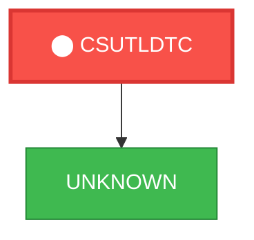
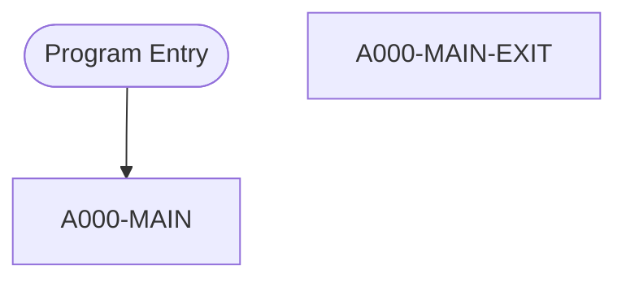

# Program: CSUTLDTC


---

## Quick Reference

| Attribute | Value |
|-----------|-------|
| Program ID | `CSUTLDTC` |
| Type | BATCH |
| Lines | 158 |
| Source | [CSUTLDTC.cbl](../carddemo/CSUTLDTC.cbl#L1) |
| Paragraphs | 2 |
| Statements | 11 |
| Impact Risk | **LOW** — 0 programs affected |

> **View Source:** [Open CSUTLDTC.cbl](../carddemo/CSUTLDTC.cbl#L1)


## Business Purpose

*Business purpose is not present in the extracted data. Run LLM enrichment to populate this section.*


## Dependency Context

> This section shows how **CSUTLDTC** connects to the rest of the system — who calls it,
> what it calls, and what data it shares. If linked programs exist, they must appear here.

### Programs That Call CSUTLDTC (Callers)

*No programs call CSUTLDTC — this is likely a top-level entry point or CICS transaction starter.*

### Programs Called by CSUTLDTC (Callees)

| Called Program | Type | Line | Why |
|----------------|------|------|-----|
| `UNKNOWN` | None | 116 |  |

### Shared Data (Copybooks & Files)

*No shared copybooks.*


## Legacy Data Contracts

> These tables are derived from FILE SECTION records and COPY-expanded data declarations. They preserve the legacy field names, COBOL storage type, inferred modern type, and status-code values needed for Java DTOs, SQL schemas, API contracts, and migration mapping.


### Data Movement And Key Mapping

| Line | Source | Target | Meaning |
|------|--------|--------|---------|
| 91 | `SPACES` | `WS-DATE` | SPACES populates WS-DATE |
| 97 | `WS-MESSAGE` | `LS-RESULT` | WS-MESSAGE populates LS-RESULT |
| 107 | `LS-DATE` | `VSTRING-TEXT OF WS-DATE-TO-TEST` | LS-DATE populates VSTRING-TEXT OF WS-DATE-TO-TEST |
| 122 | `WS-DATE-TO-TEST` | `WS-DATE` | WS-DATE-TO-TEST populates WS-DATE |
| 130 | `'Date is valid'` | `WS-RESULT` | 'Date is valid' populates WS-RESULT |
| 134 | `'Datevalue error'` | `WS-RESULT` | 'Datevalue error' populates WS-RESULT |
| 148 | `'Date is invalid'` | `WS-RESULT` | 'Date is invalid' populates WS-RESULT |


*No concrete file or copybook record layouts were found for this program.*

---

## Dependency Graph



> **Legend:** 🔴 Target program · 🔵 Direct callers · 🟢 Direct callees · 🟡 Copybook-coupled · ⚫ Transitive (indirect)

---

## Impact Ripple View

> **If you change CSUTLDTC, what else could break?**

| Impact Metric | Count |
|--------------|-------|
| Direct Callers | 0 |
| Transitive Callers (callers of callers) | 0 |
| Direct Callees | 0 |
| Transitive Callees | 0 |
| Copybook-Coupled Programs | 0 |
| **Total Impact** | **0** |
| **Risk Rating** | **LOW** |


---

## Statement Profile

| Statement Type | Count |
|---------------|-------|
| MOVE | 8 |
| EXIT | 1 |
| EVALUATE | 1 |
| CALL | 1 |

## Control Flow



## Paragraphs

### A000-MAIN

| | |
|---|---|
| **Paragraph** | `A000-MAIN` |
| **Lines** | 103 - 151 |
| **View Code** | [Jump to Line 103](../carddemo/CSUTLDTC.cbl#L103) |


### A000-MAIN-EXIT

| | |
|---|---|
| **Paragraph** | `A000-MAIN-EXIT` |
| **Lines** | 152 - 157 |
| **View Code** | [Jump to Line 152](../carddemo/CSUTLDTC.cbl#L152) |


## Data Lineage (MOVE Flow)

The following MOVE statements were extracted from the source. Each row is a `source → destination`
flow that the migration team can use to trace how data is reshaped and routed.

| Source | Destination | Paragraph | Line |
|--------|-------------|-----------|------|
| `SPACES` | `WS-DATE` | None | 91 |
| `WS-MESSAGE` | `LS-RESULT` | None | 97 |
| `WS-SEVERITY-N` | `RETURN-CODE` | None | 98 |
| `LS-DATE` | `VSTRING-TEXT` | A000-MAIN | 107 |
| `LS-DATE` | `OF` | A000-MAIN | 107 |
| `LS-DATE` | `WS-DATE-TO-TEST` | A000-MAIN | 107 |
| `'0'` | `OUTPUT-LILLIAN` | A000-MAIN | 114 |
| `WS-DATE-TO-TEST` | `WS-DATE` | A000-MAIN | 122 |
| `'Date is valid'` | `WS-RESULT` | A000-MAIN | 130 |
| `'Insufficient'` | `WS-RESULT` | A000-MAIN | 132 |
| `'Datevalue error'` | `WS-RESULT` | A000-MAIN | 134 |
| `'Invalid Era    '` | `WS-RESULT` | A000-MAIN | 136 |
| `'Unsupp. Range  '` | `WS-RESULT` | A000-MAIN | 138 |
| `'Invalid month  '` | `WS-RESULT` | A000-MAIN | 140 |
| `'Bad Pic String '` | `WS-RESULT` | A000-MAIN | 142 |
| `'Nonnumeric data'` | `WS-RESULT` | A000-MAIN | 144 |
| `'YearInEra is 0 '` | `WS-RESULT` | A000-MAIN | 146 |
| `'Date is invalid'` | `WS-RESULT` | A000-MAIN | 148 |


## Known Issues & Code Anomalies

Static analysis flagged the following items in this program. Migration teams should
review each one before re-implementing in a modern stack.

| Severity | Category | Title | Paragraph | Line |
|----------|----------|-------|-----------|------|
| **NOTICE** | DEPENDENCY | Static CALL to external `CEEDAYS` (not in this codebase) | None | 116 |

### NOTICE — Static CALL to external `CEEDAYS` (not in this codebase)

`CALL 'CEEDAYS'` appears in the source but `CEEDAYS` is not a program in the loaded codebase. IBM Language Environment date conversion (date string → Lilian day count).
**Source excerpt** (line 116):
```cobol
CALL "CEEDAYS" USING
```

**Recommendation:** Document this external dependency in the Migration Notes — the modern equivalent must replicate its behaviour.
---

## External Runtime Parameters

This program receives the following parameters at runtime (via `PROCEDURE DIVISION USING`
or `ENTRY USING`). Each parameter must be supplied by the caller — typically a JCL job
step (`PARM=`), CICS COMMAREA, or the IMS region controller. The migration target needs
an equivalent input wiring.

| # | Parameter | Source | Declared at line |
|---|-----------|--------|------------------|
| 0 | `LS-DATE` | PROCEDURE DIVISION USING | 88 |
| 1 | `LS-DATE-FORMAT` | PROCEDURE DIVISION USING | 88 |
| 2 | `LS-RESULT` | PROCEDURE DIVISION USING | 88 |


## Decision Tables (EVALUATE / WHEN)

Captured from the source. Each EVALUATE block is a structured decision the
migration team should turn into either a switch / pattern-match or a rules table.

### EVALUATE `TRUE` — paragraph `A000-MAIN` (line 147)

| WHEN | Action |
|------|--------|
| **WHEN OTHER** | MOVE 'Date is invalid'    TO WS-RESULT |
| `FC-INVALID-DATE` | MOVE 'Date is valid'      TO WS-RESULT |
| `FC-INSUFFICIENT-DATA` | MOVE 'Insufficient'       TO WS-RESULT |
| `FC-BAD-DATE-VALUE` | MOVE 'Datevalue error'    TO WS-RESULT |
| `FC-INVALID-ERA` | MOVE 'Invalid Era    '    TO WS-RESULT |
| `FC-UNSUPP-RANGE` | MOVE 'Unsupp. Range  '    TO WS-RESULT |
| `FC-INVALID-MONTH` | MOVE 'Invalid month  '    TO WS-RESULT |
| `FC-BAD-PIC-STRING` | MOVE 'Bad Pic String '    TO WS-RESULT |
| `FC-NON-NUMERIC-DATA` | MOVE 'Nonnumeric data'    TO WS-RESULT |
| `FC-YEAR-IN-ERA-ZERO` | MOVE 'YearInEra is 0 '    TO WS-RESULT |


## Business Rules

- **Date Validation Result** `BR-445`  
  The system validates a date against a specified format and provides a validation result.  
  [View Rule Details](../business-rules/BR-445.md)
- **Date Conversion to Lillian Format** `BR-446`  
  The system converts a valid date to the Lillian date format.  
  [View Rule Details](../business-rules/BR-446.md)
- **Error Reporting for Invalid Dates** `BR-447`  
  The system reports an error when a date is invalid.  
  [View Rule Details](../business-rules/BR-447.md)

## Key Data Items

| Name | Level | Picture | Section | Business Name |
|------|-------|---------|---------|---------------|
| `WS-DATE-TO-TEST` | 1 | `None` | WORKING-STORAGE | None |
| `Vstring-length` | 2 | `S9(4)` | WORKING-STORAGE | None |
| `Vstring-text` | 2 | `None` | WORKING-STORAGE | None |
| `Vstring-char` | 3 | `X` | WORKING-STORAGE | None |
| `WS-DATE-FORMAT` | 1 | `None` | WORKING-STORAGE | None |
| `Vstring-length` | 2 | `S9(4)` | WORKING-STORAGE | None |
| `Vstring-text` | 2 | `None` | WORKING-STORAGE | None |
| `Vstring-char` | 3 | `X` | WORKING-STORAGE | None |
| `OUTPUT-LILLIAN` | 1 | `S9(9)` | WORKING-STORAGE | None |
| `WS-MESSAGE` | 1 | `None` | WORKING-STORAGE | None |
| `WS-SEVERITY` | 2 | `X(04)` | WORKING-STORAGE | None |
| `WS-SEVERITY-N` | 2 | `9(4)` | WORKING-STORAGE | None |
| `FILLER` | 2 | `X(11)` | WORKING-STORAGE | None |
| `WS-MSG-NO` | 2 | `X(04)` | WORKING-STORAGE | None |
| `WS-MSG-NO-N` | 2 | `9(4)` | WORKING-STORAGE | None |
| `FILLER` | 2 | `X(01)` | WORKING-STORAGE | None |
| `WS-RESULT` | 2 | `X(15)` | WORKING-STORAGE | None |
| `FILLER` | 2 | `X(01)` | WORKING-STORAGE | None |
| `FILLER` | 2 | `X(09)` | WORKING-STORAGE | None |
| `WS-DATE` | 2 | `X(10)` | WORKING-STORAGE | None |
| `FILLER` | 2 | `X(01)` | WORKING-STORAGE | None |
| `FILLER` | 2 | `X(10)` | WORKING-STORAGE | None |
| `WS-DATE-FMT` | 2 | `X(10)` | WORKING-STORAGE | None |
| `FILLER` | 2 | `X(01)` | WORKING-STORAGE | None |
| `FILLER` | 2 | `X(03)` | WORKING-STORAGE | None |
| `FEEDBACK-CODE` | 1 | `None` | WORKING-STORAGE | None |
| `FEEDBACK-TOKEN-VALUE` | 2 | `None` | WORKING-STORAGE | None |
| `FC-INVALID-DATE` | 88 | `None` | WORKING-STORAGE | None |
| `FC-INSUFFICIENT-DATA` | 88 | `None` | WORKING-STORAGE | None |
| `FC-BAD-DATE-VALUE` | 88 | `None` | WORKING-STORAGE | None |
| `FC-INVALID-ERA` | 88 | `None` | WORKING-STORAGE | None |
| `FC-UNSUPP-RANGE` | 88 | `None` | WORKING-STORAGE | None |
| `FC-INVALID-MONTH` | 88 | `None` | WORKING-STORAGE | None |
| `FC-BAD-PIC-STRING` | 88 | `None` | WORKING-STORAGE | None |
| `FC-NON-NUMERIC-DATA` | 88 | `None` | WORKING-STORAGE | None |
| `FC-YEAR-IN-ERA-ZERO` | 88 | `None` | WORKING-STORAGE | None |
| `CASE-1-CONDITION-ID` | 3 | `None` | WORKING-STORAGE | None |
| `SEVERITY` | 4 | `S9(4)` | WORKING-STORAGE | None |
| `MSG-NO` | 4 | `S9(4)` | WORKING-STORAGE | None |
| `CASE-2-CONDITION-ID` | 3 | `None` | WORKING-STORAGE | None |

*Showing 40 of 48 data items. See [Data Dictionary](../data-dictionary.md).*

---

*Generated 2026-05-02 17:07*