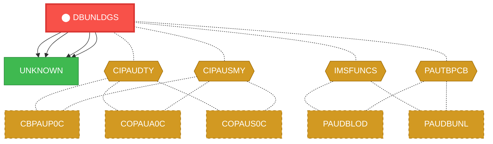

# Program: DBUNLDGS


---

## Quick Reference

| Attribute | Value |
|-----------|-------|
| Program ID | `DBUNLDGS` |
| Type | BATCH |
| Lines | 367 |
| Source | [DBUNLDGS.CBL](../carddemo/DBUNLDGS.CBL#L1) |
| Paragraphs | 15 |
| Statements | 45 |
| Impact Risk | **MEDIUM** — 7 programs affected |

> **View Source:** [Open DBUNLDGS.CBL](../carddemo/DBUNLDGS.CBL#L1)

## Source Grounding Facts

| Data Item | Literal Value |
|-----------|---------------|
| `WS-PGMNAME` | `IMSUNLOD` |
| `WS-ERR-FLG` | `N` |
| `WS-END-OF-AUTHDB-FLAG` | `N` |
| `WS-MORE-AUTHS-FLAG` | `N` |
| `END-OF-FILE` | `10` |

Status conditions found in source:
- `PAUT-PCB-STATUS = SPACES`
- `PAUT-PCB-STATUS = 'GB'`
- `PAUT-PCB-STATUS NOT EQUAL TO`
- `PAUT-PCB-STATUS = 'GE'`
- `PASFL-PCB-STATUS NOT EQUAL TO`
- `PADFL-PCB-STATUS NOT EQUAL TO`


## Business Purpose

*Business purpose is not present in the extracted data. Run LLM enrichment to populate this section.*


## Dependency Context

> This section shows how **DBUNLDGS** connects to the rest of the system — who calls it,
> what it calls, and what data it shares. If linked programs exist, they must appear here.

### Programs That Call DBUNLDGS (Callers)

*No programs call DBUNLDGS — this is likely a top-level entry point or CICS transaction starter.*

### Programs Called by DBUNLDGS (Callees)

| Called Program | Type | Line | Why |
|----------------|------|------|-----|
| `UNKNOWN` | None | 412 |  |
| `UNKNOWN` | None | 457 |  |
| `UNKNOWN` | None | 492 |  |
| `UNKNOWN` | None | 511 |  |

### Shared Data (Copybooks & Files)

#### Shared Copybooks

| Copybook | Also Used By | # Co-Users |
|----------|-------------|------------|
| `CIPAUDTY` | CBPAUP0C, COPAUA0C, COPAUS0C, COPAUS1C, COPAUS2C (+2 more) | 7 |
| `CIPAUSMY` | CBPAUP0C, COPAUA0C, COPAUS0C, COPAUS1C, PAUDBLOD (+1 more) | 6 |
| `IMSFUNCS` | PAUDBLOD, PAUDBUNL | 2 |
| `PADFLPCB` |  | 0 |
| `PASFLPCB` |  | 0 |
| `PAUTBPCB` | PAUDBLOD, PAUDBUNL | 2 |


## Legacy Data Contracts

> These tables are derived from FILE SECTION records and COPY-expanded data declarations. They preserve the legacy field names, COBOL storage type, inferred modern type, and status-code values needed for Java DTOs, SQL schemas, API contracts, and migration mapping.


### Copybook Segment Layouts

#### `CIPAUDTY` as `PENDING-AUTH-DETAILS`

| Legacy Field | Meaning | COBOL Type | Modern Type | Status / Format Notes |
|--------------|---------|------------|-------------|-----------------------|
| `PA-AUTHORIZATION-KEY` | Authorization Key | `GROUP` | `OBJECT` |  |
| `PA-AUTH-DATE-9C` | Authorization Date | `PIC S9(05) COMP-3` | `INTEGER` | Date-like field; verify YYDDD, YYMMDD, or ISO format before migration. |
| `PA-AUTH-TIME-9C` | Authorization Time | `PIC S9(09) COMP-3` | `INTEGER` |  |
| `PA-AUTH-ORIG-DATE` | Authorization Orig Date | `PIC X(06)` | `STRING(6)` |  |
| `PA-AUTH-ORIG-TIME` | Authorization Orig Time | `PIC X(06)` | `STRING(6)` |  |
| `PA-CARD-NUM` | Card Number | `PIC X(16)` | `STRING(16)` |  |
| `PA-AUTH-TYPE` | Authorization Type | `PIC X(04)` | `STRING(4)` |  |
| `PA-CARD-EXPIRY-DATE` | Card Expiry Date | `PIC X(04)` | `STRING(4)` |  |
| `PA-MESSAGE-TYPE` | Message Type | `PIC X(06)` | `STRING(6)` |  |
| `PA-MESSAGE-SOURCE` | Message Source | `PIC X(06)` | `STRING(6)` |  |
| `PA-AUTH-ID-CODE` | Authorization ID Code | `PIC X(06)` | `STRING(6)` |  |
| `PA-AUTH-RESP-CODE` | Authorization Response Code | `PIC X(02)` | `STRING(2)` |  |
| `PA-AUTH-RESP-REASON` | Authorization Response Reason | `PIC X(04)` | `STRING(4)` |  |
| `PA-PROCESSING-CODE` | Processing Code | `PIC 9(06)` | `INTEGER` |  |
| `PA-TRANSACTION-AMT` | Transaction Amount | `PIC S9(10)V99 COMP-3` | `DECIMAL(12,2)` |  |
| `PA-APPROVED-AMT` | Approved Amount | `PIC S9(10)V99 COMP-3` | `DECIMAL(12,2)` |  |
| `PA-MERCHANT-CATAGORY-CODE` | Merchant Catagory Code | `PIC X(04)` | `STRING(4)` |  |
| `PA-ACQR-COUNTRY-CODE` | Acqr Country Code | `PIC X(03)` | `STRING(3)` |  |
| `PA-POS-ENTRY-MODE` | Pos Entry Mode | `PIC 9(02)` | `INTEGER` |  |
| `PA-MERCHANT-ID` | Merchant ID | `PIC X(15)` | `STRING(15)` |  |
| `PA-MERCHANT-NAME` | Merchant Name | `PIC X(22)` | `STRING(22)` |  |
| `PA-MERCHANT-CITY` | Merchant City | `PIC X(13)` | `STRING(13)` |  |
| `PA-MERCHANT-STATE` | Merchant State | `PIC X(02)` | `STRING(2)` |  |
| `PA-MERCHANT-ZIP` | Merchant Zip | `PIC X(09)` | `STRING(9)` |  |
| `PA-TRANSACTION-ID` | Transaction ID | `PIC X(15)` | `STRING(15)` |  |
| `PA-MATCH-STATUS` | Match Status | `PIC X(01)` | `STRING(1)` |  |
| `PA-AUTH-FRAUD` | Authorization Fraud | `PIC X(01)` | `STRING(1)` |  |
| `PA-FRAUD-RPT-DATE` | Fraud Rpt Date | `PIC X(08)` | `STRING(8)` | Date-like field; verify YYDDD, YYMMDD, or ISO format before migration. |
| `FILLER` | Filler | `PIC X(17)` | `STRING(17)` |  |

#### `CIPAUSMY` as `PENDING-AUTH-SUMMARY`

| Legacy Field | Meaning | COBOL Type | Modern Type | Status / Format Notes |
|--------------|---------|------------|-------------|-----------------------|
| `PA-ACCT-ID` | Account ID | `PIC S9(11) COMP-3` | `BIGINT` |  |
| `PA-CUST-ID` | Customer ID | `PIC 9(09)` | `INTEGER` |  |
| `PA-AUTH-STATUS` | Authorization Status | `PIC X(01)` | `STRING(1)` |  |
| `PA-ACCOUNT-STATUS` | Account Status | `PIC X(02) OCCURS 5` | `STRING(2)` | Repeating field, 5 occurrences. |
| `PA-CREDIT-LIMIT` | Credit Limit | `PIC S9(09)V99 COMP-3` | `DECIMAL(11,2)` |  |
| `PA-CASH-LIMIT` | Cash Limit | `PIC S9(09)V99 COMP-3` | `DECIMAL(11,2)` |  |
| `PA-CREDIT-BALANCE` | Credit Balance | `PIC S9(09)V99 COMP-3` | `DECIMAL(11,2)` |  |
| `PA-CASH-BALANCE` | Cash Balance | `PIC S9(09)V99 COMP-3` | `DECIMAL(11,2)` |  |
| `PA-APPROVED-AUTH-CNT` | Approved Authorization Count | `PIC S9(04) COMP` | `INTEGER` |  |
| `PA-DECLINED-AUTH-CNT` | Declined Authorization Count | `PIC S9(04) COMP` | `INTEGER` |  |
| `PA-APPROVED-AUTH-AMT` | Approved Authorization Amount | `PIC S9(09)V99 COMP-3` | `DECIMAL(11,2)` |  |
| `PA-DECLINED-AUTH-AMT` | Declined Authorization Amount | `PIC S9(09)V99 COMP-3` | `DECIMAL(11,2)` |  |
| `FILLER` | Filler | `PIC X(34)` | `STRING(34)` |  |

#### `IMSFUNCS` as `FUNC-CODES`

| Legacy Field | Meaning | COBOL Type | Modern Type | Status / Format Notes |
|--------------|---------|------------|-------------|-----------------------|
| `FUNC-CODES` | Func Codes | `GROUP` | `OBJECT` |  |
| `FUNC-GU` | Func Gu | `PIC X(04)` | `STRING(4)` |  |
| `FUNC-GHU` | Func Ghu | `PIC X(04)` | `STRING(4)` |  |
| `FUNC-GN` | Func Gn | `PIC X(04)` | `STRING(4)` |  |
| `FUNC-GHN` | Func Ghn | `PIC X(04)` | `STRING(4)` |  |
| `FUNC-GNP` | Func Gnp | `PIC X(04)` | `STRING(4)` |  |
| `FUNC-GHNP` | Func Ghnp | `PIC X(04)` | `STRING(4)` |  |
| `FUNC-REPL` | Func Repl | `PIC X(04)` | `STRING(4)` |  |
| `FUNC-ISRT` | Func Isrt | `PIC X(04)` | `STRING(4)` |  |
| `FUNC-DLET` | Func Dlet | `PIC X(04)` | `STRING(4)` |  |
| `PARMCOUNT` | Parmcount | `PIC S9(05) COMP-5` | `INTEGER` |  |

#### `PADFLPCB` as `PADFLPCB`

| Legacy Field | Meaning | COBOL Type | Modern Type | Status / Format Notes |
|--------------|---------|------------|-------------|-----------------------|
| `PADFLPCB` | Padflpcb | `GROUP` | `OBJECT` |  |
| `PADFL-DBDNAME` | Padfl Dbdname | `PIC X(08)` | `STRING(8)` |  |
| `PADFL-SEG-LEVEL` | Padfl Segment Level | `PIC X(02)` | `STRING(2)` |  |
| `PADFL-PCB-STATUS` | Padfl Pcb Status | `PIC X(02)` | `STRING(2)` |  |
| `PADFL-PCB-PROCOPT` | Padfl Pcb Procopt | `PIC X(04)` | `STRING(4)` |  |
| `FILLER` | Filler | `PIC S9(05) COMP` | `INTEGER` |  |
| `PADFL-SEG-NAME` | Padfl Segment Name | `PIC X(08)` | `STRING(8)` |  |
| `PADFL-KEYFB-NAME` | Padfl Keyfb Name | `PIC S9(05) COMP` | `INTEGER` |  |
| `PADFL-NUM-SENSEGS` | Padfl Number Sensegs | `PIC S9(05) COMP` | `INTEGER` |  |
| `PADFL-KEYFB` | Padfl Keyfb | `PIC X(255)` | `STRING(255)` |  |

#### `PASFLPCB` as `PASFLPCB`

| Legacy Field | Meaning | COBOL Type | Modern Type | Status / Format Notes |
|--------------|---------|------------|-------------|-----------------------|
| `PASFLPCB` | Pasflpcb | `GROUP` | `OBJECT` |  |
| `PASFL-DBDNAME` | Pasfl Dbdname | `PIC X(08)` | `STRING(8)` |  |
| `PASFL-SEG-LEVEL` | Pasfl Segment Level | `PIC X(02)` | `STRING(2)` |  |
| `PASFL-PCB-STATUS` | Pasfl Pcb Status | `PIC X(02)` | `STRING(2)` |  |
| `PASFL-PCB-PROCOPT` | Pasfl Pcb Procopt | `PIC X(04)` | `STRING(4)` |  |
| `FILLER` | Filler | `PIC S9(05) COMP` | `INTEGER` |  |
| `PASFL-SEG-NAME` | Pasfl Segment Name | `PIC X(08)` | `STRING(8)` |  |
| `PASFL-KEYFB-NAME` | Pasfl Keyfb Name | `PIC S9(05) COMP` | `INTEGER` |  |
| `PASFL-NUM-SENSEGS` | Pasfl Number Sensegs | `PIC S9(05) COMP` | `INTEGER` |  |
| `PASFL-KEYFB` | Pasfl Keyfb | `PIC X(100)` | `STRING(100)` |  |

#### `PAUTBPCB` as `PAUTBPCB`

| Legacy Field | Meaning | COBOL Type | Modern Type | Status / Format Notes |
|--------------|---------|------------|-------------|-----------------------|
| `PAUTBPCB` | Pautbpcb | `GROUP` | `OBJECT` |  |
| `PAUT-DBDNAME` | Paut Dbdname | `PIC X(08)` | `STRING(8)` |  |
| `PAUT-SEG-LEVEL` | Paut Segment Level | `PIC X(02)` | `STRING(2)` |  |
| `PAUT-PCB-STATUS` | Paut Pcb Status | `PIC X(02)` | `STRING(2)` |  |
| `PAUT-PCB-PROCOPT` | Paut Pcb Procopt | `PIC X(04)` | `STRING(4)` |  |
| `FILLER` | Filler | `PIC S9(05) COMP` | `INTEGER` |  |
| `PAUT-SEG-NAME` | Paut Segment Name | `PIC X(08)` | `STRING(8)` |  |
| `PAUT-KEYFB-NAME` | Paut Keyfb Name | `PIC S9(05) COMP` | `INTEGER` |  |
| `PAUT-NUM-SENSEGS` | Paut Number Sensegs | `PIC S9(05) COMP` | `INTEGER` |  |
| `PAUT-KEYFB` | Paut Keyfb | `PIC X(255)` | `STRING(255)` |  |


### Data Movement And Key Mapping

| Line | Source | Target | Meaning |
|------|--------|--------|---------|
| 236 | `PENDING-AUTH-SUMMARY` | `OPFIL1-REC` | PENDING-AUTH-SUMMARY populates OPFIL1-REC |
| 239 | `PA-ACCT-ID` | `ROOT-SEG-KEY` | PA-ACCT-ID populates ROOT-SEG-KEY |
| 251 | `'Y'` | `WS-END-OF-ROOT-SEG` | 'Y' populates WS-END-OF-ROOT-SEG |
| 280 | `PENDING-AUTH-DETAILS` | `CHILD-SEG-REC` | PENDING-AUTH-DETAILS populates CHILD-SEG-REC |
| 286 | `'Y'` | `WS-END-OF-CHILD-SEG` | 'Y' populates WS-END-OF-CHILD-SEG |


---

## Dependency Graph



> **Legend:** 🔴 Target program · 🔵 Direct callers · 🟢 Direct callees · 🟡 Copybook-coupled · ⚫ Transitive (indirect)

---

## Impact Ripple View

> **If you change DBUNLDGS, what else could break?**

| Impact Metric | Count |
|--------------|-------|
| Direct Callers | 0 |
| Transitive Callers (callers of callers) | 0 |
| Direct Callees | 0 |
| Transitive Callees | 0 |
| Copybook-Coupled Programs | 7 |
| **Total Impact** | **7** |
| **Risk Rating** | **MEDIUM** |


**Programs affected via shared copybooks:**
- `CBPAUP0C`
- `COPAUA0C`
- `COPAUS0C`
- `COPAUS1C`
- `COPAUS2C`
- `PAUDBLOD`
- `PAUDBUNL`

---

## Statement Profile

| Statement Type | Count |
|---------------|-------|
| IF | 17 |
| EXIT | 7 |
| DISPLAY | 6 |
| CALL | 4 |
| PERFORM | 3 |
| INITIALIZE | 2 |
| GOBACK | 2 |
| ACCEPT | 2 |
| MOVE | 1 |
| ENTRY | 1 |

## Control Flow

```mermaid
flowchart TD
    START([Program Entry])
    MAIN_PARA["MAIN-PARA"]
    1000_INITIALIZE["1000-INITIALIZE"]
    1000_EXIT["1000-EXIT"]
    2000_FIND_NEXT_AUTH_SUMMARY["2000-FIND-NEXT-AUTH-SUMMARY"]
    2000_EXIT["2000-EXIT"]
    3000_FIND_NEXT_AUTH_DTL["3000-FIND-NEXT-AUTH-DTL"]
    3000_EXIT["3000-EXIT"]
    3100_INSERT_PARENT_SEG_GSAM["3100-INSERT-PARENT-SEG-GSAM"]
    3100_EXIT["3100-EXIT"]
    3200_INSERT_CHILD_SEG_GSAM["3200-INSERT-CHILD-SEG-GSAM"]
    3200_EXIT["3200-EXIT"]
    4000_FILE_CLOSE["4000-FILE-CLOSE"]
    4000_EXIT["4000-EXIT"]
    9999_ABEND["9999-ABEND"]
    9999_EXIT["9999-EXIT"]
    START --> MAIN_PARA
    9999_ABEND --> INLINE
    9999_EXIT --> INLINE
```



## Paragraphs

### MAIN-PARA

| | |
|---|---|
| **Paragraph** | `MAIN-PARA` |
| **Lines** | 164 - 181 |
| **View Code** | [Jump to Line 164](../carddemo/DBUNLDGS.CBL#L164) |


### 1000-INITIALIZE

| | |
|---|---|
| **Paragraph** | `1000-INITIALIZE` |
| **Lines** | 182 - 211 |
| **View Code** | [Jump to Line 182](../carddemo/DBUNLDGS.CBL#L182) |


### 1000-EXIT

| | |
|---|---|
| **Paragraph** | `1000-EXIT` |
| **Lines** | 212 - 215 |
| **View Code** | [Jump to Line 212](../carddemo/DBUNLDGS.CBL#L212) |


### 2000-FIND-NEXT-AUTH-SUMMARY

| | |
|---|---|
| **Paragraph** | `2000-FIND-NEXT-AUTH-SUMMARY` |
| **Lines** | 216 - 257 |
| **View Code** | [Jump to Line 216](../carddemo/DBUNLDGS.CBL#L216) |


### 2000-EXIT

| | |
|---|---|
| **Paragraph** | `2000-EXIT` |
| **Lines** | 258 - 262 |
| **View Code** | [Jump to Line 258](../carddemo/DBUNLDGS.CBL#L258) |


### 3000-FIND-NEXT-AUTH-DTL

| | |
|---|---|
| **Paragraph** | `3000-FIND-NEXT-AUTH-DTL` |
| **Lines** | 263 - 295 |
| **View Code** | [Jump to Line 263](../carddemo/DBUNLDGS.CBL#L263) |


### 3000-EXIT

| | |
|---|---|
| **Paragraph** | `3000-EXIT` |
| **Lines** | 296 - 299 |
| **View Code** | [Jump to Line 296](../carddemo/DBUNLDGS.CBL#L296) |


### 3100-INSERT-PARENT-SEG-GSAM

| | |
|---|---|
| **Paragraph** | `3100-INSERT-PARENT-SEG-GSAM` |
| **Lines** | 300 - 315 |
| **View Code** | [Jump to Line 300](../carddemo/DBUNLDGS.CBL#L300) |


### 3100-EXIT

| | |
|---|---|
| **Paragraph** | `3100-EXIT` |
| **Lines** | 316 - 318 |
| **View Code** | [Jump to Line 316](../carddemo/DBUNLDGS.CBL#L316) |


### 3200-INSERT-CHILD-SEG-GSAM

| | |
|---|---|
| **Paragraph** | `3200-INSERT-CHILD-SEG-GSAM` |
| **Lines** | 319 - 334 |
| **View Code** | [Jump to Line 319](../carddemo/DBUNLDGS.CBL#L319) |


### 3200-EXIT

| | |
|---|---|
| **Paragraph** | `3200-EXIT` |
| **Lines** | 335 - 337 |
| **View Code** | [Jump to Line 335](../carddemo/DBUNLDGS.CBL#L335) |


### 4000-FILE-CLOSE

| | |
|---|---|
| **Paragraph** | `4000-FILE-CLOSE` |
| **Lines** | 338 - 353 |
| **View Code** | [Jump to Line 338](../carddemo/DBUNLDGS.CBL#L338) |


### 4000-EXIT

| | |
|---|---|
| **Paragraph** | `4000-EXIT` |
| **Lines** | 354 - 356 |
| **View Code** | [Jump to Line 354](../carddemo/DBUNLDGS.CBL#L354) |


### 9999-ABEND

| | |
|---|---|
| **Paragraph** | `9999-ABEND` |
| **Lines** | 357 - 364 |
| **View Code** | [Jump to Line 357](../carddemo/DBUNLDGS.CBL#L357) |


### 9999-EXIT

| | |
|---|---|
| **Paragraph** | `9999-EXIT` |
| **Lines** | 365 - 366 |
| **View Code** | [Jump to Line 365](../carddemo/DBUNLDGS.CBL#L365) |


## IMS DL/I Calls

This program uses the following IMS DL/I calls:

| Function | Meaning | PCB | Segment Area | SSA | Qualifier | Paragraph | Line |
|----------|---------|-----|--------------|-----|-----------|-----------|------|
| `ENTRY` | IMS Batch Entry Point (DLITCBL) | None | None | None | None | MAIN-PARA | 165 |
| `GN` | Get Next | PAUTBPCB | PENDING-AUTH-SUMMARY | ROOT-UNQUAL-SSA (segment: PAUTSUM0) | None | 2000-FIND-NEXT-AUTH-SUMMARY | 222 |
| `GNP` | Get Next in Parent | PAUTBPCB | PENDING-AUTH-DETAILS | CHILD-UNQUAL-SSA (segment: PAUTDTL1) | None | 3000-FIND-NEXT-AUTH-DTL | 267 |
| `ISRT` | Insert | PASFLPCB | PENDING-AUTH-SUMMARY | None | None | 3100-INSERT-PARENT-SEG-GSAM | 302 |
| `ISRT` | Insert | PADFLPCB | PENDING-AUTH-DETAILS | None | None | 3200-INSERT-CHILD-SEG-GSAM | 321 |


## Copybook Field Dictionaries

The following copybooks are included by this program. Each entry shows the actual fields
extracted from the copybook source file (`.cpy`).

### Copybook `CIPAUDTY`

| Level | Field | PIC | USAGE | Parent | Notes |
|-------|-------|-----|-------|--------|-------|
| `05` | `PA-AUTHORIZATION-KEY` | `None` | None | None |  |
| `10` | `PA-AUTH-DATE-9C` | `S9(05)` | COMP | PA-AUTHORIZATION-KEY |  |
| `10` | `PA-AUTH-TIME-9C` | `S9(09)` | COMP | PA-AUTHORIZATION-KEY |  |
| `05` | `PA-AUTH-ORIG-DATE` | `X(06)` | None | None |  |
| `05` | `PA-AUTH-ORIG-TIME` | `X(06)` | None | None |  |
| `05` | `PA-CARD-NUM` | `X(16)` | None | None |  |
| `05` | `PA-AUTH-TYPE` | `X(04)` | None | None |  |
| `05` | `PA-CARD-EXPIRY-DATE` | `X(04)` | None | None |  |
| `05` | `PA-MESSAGE-TYPE` | `X(06)` | None | None |  |
| `05` | `PA-MESSAGE-SOURCE` | `X(06)` | None | None |  |
| `05` | `PA-AUTH-ID-CODE` | `X(06)` | None | None |  |
| `05` | `PA-AUTH-RESP-CODE` | `X(02)` | None | None |  |
| `88` | `PA-AUTH-APPROVED` | `None` | None | None |  |
| `05` | `PA-AUTH-RESP-REASON` | `X(04)` | None | None |  |
| `05` | `PA-PROCESSING-CODE` | `9(06)` | None | None |  |
| `05` | `PA-TRANSACTION-AMT` | `S9(10)V99` | COMP | None |  |
| `05` | `PA-APPROVED-AMT` | `S9(10)V99` | COMP | None |  |
| `05` | `PA-MERCHANT-CATAGORY-CODE` | `X(04)` | None | None |  |
| `05` | `PA-ACQR-COUNTRY-CODE` | `X(03)` | None | None |  |
| `05` | `PA-POS-ENTRY-MODE` | `9(02)` | None | None |  |
| `05` | `PA-MERCHANT-ID` | `X(15)` | None | None |  |
| `05` | `PA-MERCHANT-NAME` | `X(22)` | None | None |  |
| `05` | `PA-MERCHANT-CITY` | `X(13)` | None | None |  |
| `05` | `PA-MERCHANT-STATE` | `X(02)` | None | None |  |
| `05` | `PA-MERCHANT-ZIP` | `X(09)` | None | None |  |
| `05` | `PA-TRANSACTION-ID` | `X(15)` | None | None |  |
| `05` | `PA-MATCH-STATUS` | `X(01)` | None | None |  |
| `88` | `PA-MATCH-PENDING` | `None` | None | None |  |
| `88` | `PA-MATCH-AUTH-DECLINED` | `None` | None | None |  |
| `88` | `PA-MATCH-PENDING-EXPIRED` | `None` | None | None |  |
| `88` | `PA-MATCHED-WITH-TRAN` | `None` | None | None |  |
| `05` | `PA-AUTH-FRAUD` | `X(01)` | None | None |  |
| `88` | `PA-FRAUD-CONFIRMED` | `None` | None | None |  |
| `88` | `PA-FRAUD-REMOVED` | `None` | None | None |  |
| `05` | `PA-FRAUD-RPT-DATE` | `X(08)` | None | None |  |

### Copybook `CIPAUSMY`

| Level | Field | PIC | USAGE | Parent | Notes |
|-------|-------|-----|-------|--------|-------|
| `05` | `PA-ACCT-ID` | `S9(11)` | COMP | None |  |
| `05` | `PA-CUST-ID` | `9(09)` | None | None |  |
| `05` | `PA-AUTH-STATUS` | `X(01)` | None | None |  |
| `05` | `PA-ACCOUNT-STATUS` | `X(02)` | None | None | OCCURS 5 |
| `05` | `PA-CREDIT-LIMIT` | `S9(09)V99` | COMP | None |  |
| `05` | `PA-CASH-LIMIT` | `S9(09)V99` | COMP | None |  |
| `05` | `PA-CREDIT-BALANCE` | `S9(09)V99` | COMP | None |  |
| `05` | `PA-CASH-BALANCE` | `S9(09)V99` | COMP | None |  |
| `05` | `PA-APPROVED-AUTH-CNT` | `S9(04)` | COMP | None |  |
| `05` | `PA-DECLINED-AUTH-CNT` | `S9(04)` | COMP | None |  |
| `05` | `PA-APPROVED-AUTH-AMT` | `S9(09)V99` | COMP | None |  |
| `05` | `PA-DECLINED-AUTH-AMT` | `S9(09)V99` | COMP | None |  |

### Copybook `IMSFUNCS`

| Level | Field | PIC | USAGE | Parent | Notes |
|-------|-------|-----|-------|--------|-------|
| `01` | `FUNC-CODES` | `None` | None | None |  |
| `05` | `FUNC-GU` | `X(04)` | None | FUNC-CODES |  |
| `05` | `FUNC-GHU` | `X(04)` | None | FUNC-CODES |  |
| `05` | `FUNC-GN` | `X(04)` | None | FUNC-CODES |  |
| `05` | `FUNC-GHN` | `X(04)` | None | FUNC-CODES |  |
| `05` | `FUNC-GNP` | `X(04)` | None | FUNC-CODES |  |
| `05` | `FUNC-GHNP` | `X(04)` | None | FUNC-CODES |  |
| `05` | `FUNC-REPL` | `X(04)` | None | FUNC-CODES |  |
| `05` | `FUNC-ISRT` | `X(04)` | None | FUNC-CODES |  |
| `05` | `FUNC-DLET` | `X(04)` | None | FUNC-CODES |  |
| `05` | `PARMCOUNT` | `S9(05)` | COMP | FUNC-CODES |  |

### Copybook `PADFLPCB`

| Level | Field | PIC | USAGE | Parent | Notes |
|-------|-------|-----|-------|--------|-------|
| `01` | `PADFLPCB` | `None` | None | None |  |
| `05` | `PADFL-DBDNAME` | `X(08)` | None | PADFLPCB |  |
| `05` | `PADFL-SEG-LEVEL` | `X(02)` | None | PADFLPCB |  |
| `05` | `PADFL-PCB-STATUS` | `X(02)` | None | PADFLPCB |  |
| `05` | `PADFL-PCB-PROCOPT` | `X(04)` | None | PADFLPCB |  |
| `05` | `PADFL-SEG-NAME` | `X(08)` | None | PADFLPCB |  |
| `05` | `PADFL-KEYFB-NAME` | `S9(05)` | COMP | PADFLPCB |  |
| `05` | `PADFL-NUM-SENSEGS` | `S9(05)` | COMP | PADFLPCB |  |
| `05` | `PADFL-KEYFB` | `X(255)` | None | PADFLPCB |  |

### Copybook `PASFLPCB`

| Level | Field | PIC | USAGE | Parent | Notes |
|-------|-------|-----|-------|--------|-------|
| `01` | `PASFLPCB` | `None` | None | None |  |
| `05` | `PASFL-DBDNAME` | `X(08)` | None | PASFLPCB |  |
| `05` | `PASFL-SEG-LEVEL` | `X(02)` | None | PASFLPCB |  |
| `05` | `PASFL-PCB-STATUS` | `X(02)` | None | PASFLPCB |  |
| `05` | `PASFL-PCB-PROCOPT` | `X(04)` | None | PASFLPCB |  |
| `05` | `PASFL-SEG-NAME` | `X(08)` | None | PASFLPCB |  |
| `05` | `PASFL-KEYFB-NAME` | `S9(05)` | COMP | PASFLPCB |  |
| `05` | `PASFL-NUM-SENSEGS` | `S9(05)` | COMP | PASFLPCB |  |
| `05` | `PASFL-KEYFB` | `X(100)` | None | PASFLPCB |  |

### Copybook `PAUTBPCB`

| Level | Field | PIC | USAGE | Parent | Notes |
|-------|-------|-----|-------|--------|-------|
| `01` | `PAUTBPCB` | `None` | None | None |  |
| `05` | `PAUT-DBDNAME` | `X(08)` | None | PAUTBPCB |  |
| `05` | `PAUT-SEG-LEVEL` | `X(02)` | None | PAUTBPCB |  |
| `05` | `PAUT-PCB-STATUS` | `X(02)` | None | PAUTBPCB |  |
| `05` | `PAUT-PCB-PROCOPT` | `X(04)` | None | PAUTBPCB |  |
| `05` | `PAUT-SEG-NAME` | `X(08)` | None | PAUTBPCB |  |
| `05` | `PAUT-KEYFB-NAME` | `S9(05)` | COMP | PAUTBPCB |  |
| `05` | `PAUT-NUM-SENSEGS` | `S9(05)` | COMP | PAUTBPCB |  |
| `05` | `PAUT-KEYFB` | `X(255)` | None | PAUTBPCB |  |


## Data Lineage (MOVE Flow)

The following MOVE statements were extracted from the source. Each row is a `source → destination`
flow that the migration team can use to trace how data is reshaped and routed.

| Source | Destination | Paragraph | Line |
|--------|-------------|-----------|------|
| `PENDING-AUTH-SUMMARY` | `OPFIL1-REC` | 2000-FIND-NEXT-AUTH-SUMMARY | 236 |
| `PA-ACCT-ID` | `ROOT-SEG-KEY` | 2000-FIND-NEXT-AUTH-SUMMARY | 239 |
| `'Y'` | `WS-END-OF-ROOT-SEG` | 2000-FIND-NEXT-AUTH-SUMMARY | 251 |
| `PENDING-AUTH-DETAILS` | `CHILD-SEG-REC` | 3000-FIND-NEXT-AUTH-DTL | 280 |
| `'Y'` | `WS-END-OF-CHILD-SEG` | 3000-FIND-NEXT-AUTH-DTL | 286 |
| `'16'` | `RETURN-CODE` | 9999-ABEND | 362 |


## Known Issues & Code Anomalies

Static analysis flagged the following items in this program. Migration teams should
review each one before re-implementing in a modern stack.

| Severity | Category | Title | Paragraph | Line |
|----------|----------|-------|-----------|------|
| **WARNING** | NAMING | WS-PGMNAME literal does not match the actual PROGRAM-ID | None | 58 |
| **NOTICE** | DEAD_CODE | Variable `WS-PGMNAME` is declared but never referenced | None | 58 |
| **NOTICE** | DEAD_CODE | Variable `WS-AUTH-DATE` is declared but never referenced | None | 61 |
| **NOTICE** | DEAD_CODE | Variable `WS-EXPIRY-DAYS` is declared but never referenced | None | 62 |
| **NOTICE** | DEAD_CODE | Variable `WS-DAY-DIFF` is declared but never referenced | None | 63 |
| **NOTICE** | DEAD_CODE | Variable `IDX` is declared but never referenced | None | 64 |
| **NOTICE** | DEAD_CODE | Variable `WS-CURR-APP-ID` is declared but never referenced | None | 65 |
| **NOTICE** | DEAD_CODE | Variable `WS-NO-CHKP` is declared but never referenced | None | 67 |
| **NOTICE** | DEAD_CODE | Variable `WS-TOT-REC-WRITTEN` is declared but never referenced | None | 69 |
| **NOTICE** | DEAD_CODE | Variable `WS-NO-SUMRY-DELETED` is declared but never referenced | None | 71 |
| **NOTICE** | DEAD_CODE | Variable `WS-NO-DTL-READ` is declared but never referenced | None | 72 |
| **NOTICE** | LOGIC | Paragraph `2000-FIND-NEXT-AUTH-SUMMARY` terminates the program on error | 2000-FIND-NEXT-AUTH-SUMMARY | 216 |
| **NOTICE** | DEPENDENCY | Static CALL to external `CBLTDLI` (not in this codebase) | None | 222 |
| **NOTICE** | LOGIC | Paragraph `3000-FIND-NEXT-AUTH-DTL` terminates the program on error | 3000-FIND-NEXT-AUTH-DTL | 263 |
| **NOTICE** | LOGIC | Paragraph `3100-INSERT-PARENT-SEG-GSAM` terminates the program on error | 3100-INSERT-PARENT-SEG-GSAM | 300 |
| **NOTICE** | LOGIC | Paragraph `3200-INSERT-CHILD-SEG-GSAM` terminates the program on error | 3200-INSERT-CHILD-SEG-GSAM | 319 |

### WARNING — WS-PGMNAME literal does not match the actual PROGRAM-ID

The program identifier is `DBUNLDGS` but the source sets `WS-PGMNAME` to `'IMSUNLOD'`. This is misleading for debug traces, runtime logs, and audit records that key off WS-PGMNAME.
**Source excerpt** (line 58):
```cobol
05 WS-PGMNAME                 PIC X(08) VALUE 'IMSUNLOD'.
```

**Recommendation:** Update the literal to 'DBUNLDGS' or rename the program to 'IMSUNLOD' depending on which is canonical.
---
### NOTICE — Variable `WS-PGMNAME` is declared but never referenced

`WS-PGMNAME` is declared at line 58 but no other statement reads or writes it. Likely a leftover from prior refactoring or an incomplete feature.
**Source excerpt** (line 58):
```cobol
05 WS-PGMNAME                 PIC X(08) VALUE 'IMSUNLOD'.      00380000
```

**Recommendation:** Remove the declaration or wire it into the logic that was originally intended.
---
### NOTICE — Variable `WS-AUTH-DATE` is declared but never referenced

`WS-AUTH-DATE` is declared at line 61 but no other statement reads or writes it. Likely a leftover from prior refactoring or an incomplete feature.
**Source excerpt** (line 61):
```cobol
05 WS-AUTH-DATE               PIC 9(05).                       00410000
```

**Recommendation:** Remove the declaration or wire it into the logic that was originally intended.
---
### NOTICE — Variable `WS-EXPIRY-DAYS` is declared but never referenced

`WS-EXPIRY-DAYS` is declared at line 62 but no other statement reads or writes it. Likely a leftover from prior refactoring or an incomplete feature.
**Source excerpt** (line 62):
```cobol
05 WS-EXPIRY-DAYS             PIC S9(4) COMP.                  00420000
```

**Recommendation:** Remove the declaration or wire it into the logic that was originally intended.
---
### NOTICE — Variable `WS-DAY-DIFF` is declared but never referenced

`WS-DAY-DIFF` is declared at line 63 but no other statement reads or writes it. Likely a leftover from prior refactoring or an incomplete feature.
**Source excerpt** (line 63):
```cobol
05 WS-DAY-DIFF                PIC S9(4) COMP.                  00430000
```

**Recommendation:** Remove the declaration or wire it into the logic that was originally intended.
---
### NOTICE — Variable `IDX` is declared but never referenced

`IDX` is declared at line 64 but no other statement reads or writes it. Likely a leftover from prior refactoring or an incomplete feature.
**Source excerpt** (line 64):
```cobol
05 IDX                        PIC S9(4) COMP.                  00440000
```

**Recommendation:** Remove the declaration or wire it into the logic that was originally intended.
---
### NOTICE — Variable `WS-CURR-APP-ID` is declared but never referenced

`WS-CURR-APP-ID` is declared at line 65 but no other statement reads or writes it. Likely a leftover from prior refactoring or an incomplete feature.
**Source excerpt** (line 65):
```cobol
05 WS-CURR-APP-ID             PIC 9(11).                       00450000
```

**Recommendation:** Remove the declaration or wire it into the logic that was originally intended.
---
### NOTICE — Variable `WS-NO-CHKP` is declared but never referenced

`WS-NO-CHKP` is declared at line 67 but no other statement reads or writes it. Likely a leftover from prior refactoring or an incomplete feature.
**Source excerpt** (line 67):
```cobol
05 WS-NO-CHKP                 PIC  9(8) VALUE 0.               00470000
```

**Recommendation:** Remove the declaration or wire it into the logic that was originally intended.
---
### NOTICE — Variable `WS-TOT-REC-WRITTEN` is declared but never referenced

`WS-TOT-REC-WRITTEN` is declared at line 69 but no other statement reads or writes it. Likely a leftover from prior refactoring or an incomplete feature.
**Source excerpt** (line 69):
```cobol
05 WS-TOT-REC-WRITTEN         PIC S9(8) COMP VALUE 0.          00490000
```

**Recommendation:** Remove the declaration or wire it into the logic that was originally intended.
---
### NOTICE — Variable `WS-NO-SUMRY-DELETED` is declared but never referenced

`WS-NO-SUMRY-DELETED` is declared at line 71 but no other statement reads or writes it. Likely a leftover from prior refactoring or an incomplete feature.
**Source excerpt** (line 71):
```cobol
05 WS-NO-SUMRY-DELETED        PIC S9(8) COMP VALUE 0.          00510000
```

**Recommendation:** Remove the declaration or wire it into the logic that was originally intended.
---
### NOTICE — Variable `WS-NO-DTL-READ` is declared but never referenced

`WS-NO-DTL-READ` is declared at line 72 but no other statement reads or writes it. Likely a leftover from prior refactoring or an incomplete feature.
**Source excerpt** (line 72):
```cobol
05 WS-NO-DTL-READ             PIC S9(8) COMP VALUE 0.          00520000
```

**Recommendation:** Remove the declaration or wire it into the logic that was originally intended.
---
### NOTICE — Paragraph `2000-FIND-NEXT-AUTH-SUMMARY` terminates the program on error

`2000-FIND-NEXT-AUTH-SUMMARY` calls an ABEND routine (or STOP RUN) on the failure path. This means an error here ENDS the entire program — it does NOT reject, skip, or log-and-continue. Documentation must use "abend" / "terminate" language, not "reject".

**Recommendation:** Use ‘abend’ or ‘terminates the program’ when describing the error path of this paragraph.
---
### NOTICE — Static CALL to external `CBLTDLI` (not in this codebase)

`CALL 'CBLTDLI'` appears in the source but `CBLTDLI` is not a program in the loaded codebase. IMS DL/I database call interface.
**Source excerpt** (line 222):
```cobol
CALL 'CBLTDLI'            USING  FUNC-GN                    01970000
```

**Recommendation:** Document this external dependency in the Migration Notes — the modern equivalent must replicate its behaviour.
---
### NOTICE — Paragraph `3000-FIND-NEXT-AUTH-DTL` terminates the program on error

`3000-FIND-NEXT-AUTH-DTL` calls an ABEND routine (or STOP RUN) on the failure path. This means an error here ENDS the entire program — it does NOT reject, skip, or log-and-continue. Documentation must use "abend" / "terminate" language, not "reject".

**Recommendation:** Use ‘abend’ or ‘terminates the program’ when describing the error path of this paragraph.
---
### NOTICE — Paragraph `3100-INSERT-PARENT-SEG-GSAM` terminates the program on error

`3100-INSERT-PARENT-SEG-GSAM` calls an ABEND routine (or STOP RUN) on the failure path. This means an error here ENDS the entire program — it does NOT reject, skip, or log-and-continue. Documentation must use "abend" / "terminate" language, not "reject".

**Recommendation:** Use ‘abend’ or ‘terminates the program’ when describing the error path of this paragraph.
---
### NOTICE — Paragraph `3200-INSERT-CHILD-SEG-GSAM` terminates the program on error

`3200-INSERT-CHILD-SEG-GSAM` calls an ABEND routine (or STOP RUN) on the failure path. This means an error here ENDS the entire program — it does NOT reject, skip, or log-and-continue. Documentation must use "abend" / "terminate" language, not "reject".

**Recommendation:** Use ‘abend’ or ‘terminates the program’ when describing the error path of this paragraph.
---

## External Runtime Parameters

This program receives the following parameters at runtime (via `PROCEDURE DIVISION USING`
or `ENTRY USING`). Each parameter must be supplied by the caller — typically a JCL job
step (`PARM=`), CICS COMMAREA, or the IMS region controller. The migration target needs
an equivalent input wiring.

| # | Parameter | Source | Declared at line |
|---|-----------|--------|------------------|
| 0 | `PAUTBPCB` | ENTRY USING | 165 |
| 0 | `PAUTBPCB` | PROCEDURE DIVISION USING | 159 |
| 1 | `PASFLPCB` | PROCEDURE DIVISION USING | 159 |
| 2 | `PADFLPCB` | PROCEDURE DIVISION USING | 159 |

## File OPEN / CLOSE Operations

The exact OPEN mode (INPUT / OUTPUT / I-O / EXTEND) determines whether a file can be
read, written, or both — and whether REWRITE / DELETE are legal. This table is the
source of truth for migrators converting to modern storage layers.

| File | Operation | Mode | Paragraph | Line |
|------|-----------|------|-----------|------|
| `THRU` | CLOSE | None | MAIN-PARA | 175 |


## Modernization Review Findings

These are source-derived review notes that should be checked before translating this program into Java, Spring Boot, SQL, APIs, or batch jobs.

| Finding | Why It Matters |
|---------|----------------|
| Program name literal differs from PROGRAM-ID | `WS-PGMNAME` is `IMSUNLOD` while `PROGRAM-ID` is `DBUNLDGS`. Treat this as a migration review item; it may be copied template state or an intentional external name. |
| Checkpoint/restart fields without checkpoint calls | Checkpoint-style fields exist, but no IMS `CHKP` or `XRST` call was extracted. Confirm whether restart logic was abandoned or still expected operationally. |
| Template/debug fields require usage review | Fields such as `DEBUG-OFF`, `DEBUG-ON`, `P-DEBUG-FLAG`, `P-EXPIRY-DAYS`, `PA-CARD-EXPIRY-DATE`, `WK-CHKPT-ID`, `WK-CHKPT-ID-CTR`, `WS-DAY-DIFF` look like debug, checkpoint, or abandoned template state. Verify references before designing modern DTOs or database columns. |
| Numeric validation on a COBOL numeric field | `PA-ACCT-ID IS NUMERIC` was found in source. If the field is packed or binary numeric, this may be corruption detection rather than normal validation. |
| Nested IF blocks need compiler-accurate validation | Nested conditional logic was detected. During migration, validate scope with the original compiler rules and explicit `END-IF`/period termination before translating to Java or SQL. |


## Business Rules

- **Authorization Summary Record Found** `BR-003`  
  If an authorization summary record is successfully read from the database, process it to extract associated detail records.  
  [View Rule Details](../business-rules/BR-003.md)
- **Authorization Detail Record Found** `BR-004`  
  If an authorization detail record is successfully read from the database, process it to be written to the output file.  
  [View Rule Details](../business-rules/BR-004.md)
- **End of Authorization Detail Records** `BR-005`  
  If there are no more authorization detail records associated with a summary record, proceed to the next authorization summary record.  
  [View Rule Details](../business-rules/BR-005.md)
- **Detail Record Belongs to Summary Record** `BR-006`  
  A detail record is only processed if it is associated with the current authorization summary record.  
  [View Rule Details](../business-rules/BR-006.md)
- **Authorization Detail Record Limit** `BR-007`  
  There is a limit to the number of detail records that can be associated with a single authorization summary record.  
  [View Rule Details](../business-rules/BR-007.md)
- **Authorization Summary Record Insertion** `BR-008`  
  An authorization summary record must be written to the GSAM file.  
  [View Rule Details](../business-rules/BR-008.md)
- **Authorization Detail Record Insertion** `BR-009`  
  Authorization detail records associated with a summary record are written to the GSAM file.  
  [View Rule Details](../business-rules/BR-009.md)

## Key Data Items

| Name | Level | Picture | Section | Business Name |
|------|-------|---------|---------|---------------|
| `OPFIL1-REC` | 1 | `X(100)` | WORKING-STORAGE | None |
| `OPFIL2-REC` | 1 | `None` | WORKING-STORAGE | None |
| `ROOT-SEG-KEY` | 5 | `S9(11)` | WORKING-STORAGE | None |
| `CHILD-SEG-REC` | 5 | `X(200)` | WORKING-STORAGE | None |
| `WS-VARIABLES` | 1 | `None` | WORKING-STORAGE | None |
| `WS-PGMNAME` | 5 | `X(08)` | WORKING-STORAGE | None |
| `CURRENT-DATE` | 5 | `9(06)` | WORKING-STORAGE | None |
| `CURRENT-YYDDD` | 5 | `9(05)` | WORKING-STORAGE | None |
| `WS-AUTH-DATE` | 5 | `9(05)` | WORKING-STORAGE | None |
| `WS-EXPIRY-DAYS` | 5 | `S9(4)` | WORKING-STORAGE | None |
| `WS-DAY-DIFF` | 5 | `S9(4)` | WORKING-STORAGE | None |
| `IDX` | 5 | `S9(4)` | WORKING-STORAGE | None |
| `WS-CURR-APP-ID` | 5 | `9(11)` | WORKING-STORAGE | None |
| `WS-NO-CHKP` | 5 | `9(8)` | WORKING-STORAGE | None |
| `WS-AUTH-SMRY-PROC-CNT` | 5 | `9(8)` | WORKING-STORAGE | None |
| `WS-TOT-REC-WRITTEN` | 5 | `S9(8)` | WORKING-STORAGE | None |
| `WS-NO-SUMRY-READ` | 5 | `S9(8)` | WORKING-STORAGE | None |
| `WS-NO-SUMRY-DELETED` | 5 | `S9(8)` | WORKING-STORAGE | None |
| `WS-NO-DTL-READ` | 5 | `S9(8)` | WORKING-STORAGE | None |
| `WS-NO-DTL-DELETED` | 5 | `S9(8)` | WORKING-STORAGE | None |
| `WS-ERR-FLG` | 5 | `X(01)` | WORKING-STORAGE | None |
| `ERR-FLG-ON` | 88 | `None` | WORKING-STORAGE | None |
| `ERR-FLG-OFF` | 88 | `None` | WORKING-STORAGE | None |
| `WS-END-OF-AUTHDB-FLAG` | 5 | `X(01)` | WORKING-STORAGE | None |
| `END-OF-AUTHDB` | 88 | `None` | WORKING-STORAGE | None |
| `NOT-END-OF-AUTHDB` | 88 | `None` | WORKING-STORAGE | None |
| `WS-MORE-AUTHS-FLAG` | 5 | `X(01)` | WORKING-STORAGE | None |
| `MORE-AUTHS` | 88 | `None` | WORKING-STORAGE | None |
| `NO-MORE-AUTHS` | 88 | `None` | WORKING-STORAGE | None |
| `WS-END-OF-ROOT-SEG` | 5 | `X(01)` | WORKING-STORAGE | None |
| `WS-END-OF-CHILD-SEG` | 5 | `X(01)` | WORKING-STORAGE | None |
| `WS-INFILE-STATUS` | 5 | `X(02)` | WORKING-STORAGE | None |
| `WS-OUTFL1-STATUS` | 5 | `X(02)` | WORKING-STORAGE | None |
| `WS-OUTFL2-STATUS` | 5 | `X(02)` | WORKING-STORAGE | None |
| `WS-CUSTID-STATUS` | 5 | `X(02)` | WORKING-STORAGE | None |
| `END-OF-FILE` | 88 | `None` | WORKING-STORAGE | None |
| `WK-CHKPT-ID` | 5 | `None` | WORKING-STORAGE | None |
| `FILLER` | 10 | `X(04)` | WORKING-STORAGE | None |
| `WK-CHKPT-ID-CTR` | 10 | `9(04)` | WORKING-STORAGE | None |
| `WS-IMS-VARIABLES` | 1 | `None` | WORKING-STORAGE | None |

*Showing 40 of 162 data items. See [Data Dictionary](../data-dictionary.md).*

---

*Generated 2026-05-02 17:07*