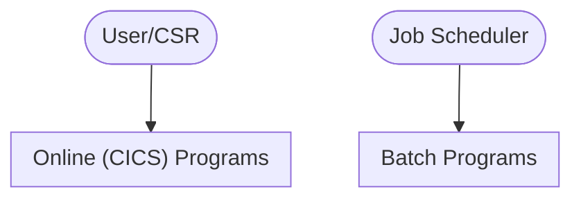

# CardDemo - System Overview

> **Auto-generated documentation** | 2026-05-12 12:20  
> Analyzed from 0 COBOL programs across 0 functional modules

---

## What is CardDemo?

CardDemo is a mainframe COBOL application composed of 0 programs
across 0 functional modules. It exposes 21 BMS screens for
online (CICS) interaction and is orchestrated by 55 JCL batch
jobs. The sections below summarize its structure, dependencies, and modernization-relevant
characteristics.

## System at a Glance

| Metric | Count |
|--------|-------|
| Programs | 0 |
| Functional Modules | 0 |
| BMS Screens | 21 |
| Data Items | 0 |
| CICS Commands | 0 |
| SQL Statements | 0 |
| Inter-Program Calls | 0 |
| Business Rules | 0 |
| Copybooks | 65 |

## Architecture Overview

## Functional Modules

## Entry Points

Programs that are not called by others -- these are likely user-facing entry points:

## Quick Navigation

| Section | Description |
|---------|-------------|
| [Program Documentation](programs/) | Detailed walkthrough for each COBOL program |
| [Linked Programs](clusters/INDEX.md) | Connected program clusters and dependency graphs |
| [Module Documentation](modules/) | Business-grouped program clusters |
| [Business Rules Catalog](business-rules/INDEX.md) | All extracted business rules |
| [Screen Catalog](screens/INDEX.md) | BMS screen definitions and layouts |
| [Call Graph](diagrams/call-graph.md) | Inter-program dependency diagram |
| [Data Dictionary](data-dictionary.md) | Complete variable listing |
| [Copybook Reference](copybook-reference.md) | Shared data structures |

---

*Generated by COBOL Documentation Pipeline*