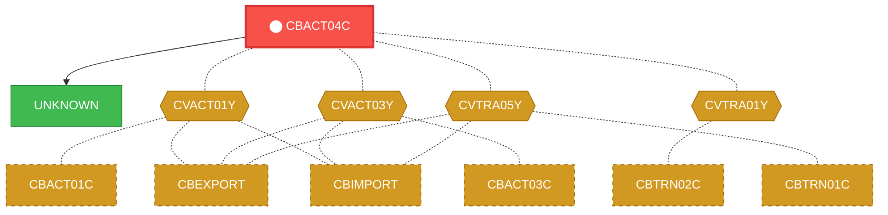

# Program: CBACT04C

---

## Quick Reference

| Attribute | Value |
|-----------|-------|
| Program ID | `CBACT04C` |
| Type | BATCH |
| Lines | 653 |
| Source | [CBACT04C.cbl](../carddemo\app/CBACT04C.cbl#L1) |
| Paragraphs | 22 |
| Statements | 120 |
| Impact Risk | **HIGH** — 18 programs affected |

> **View Source:** [Open CBACT04C.cbl](../carddemo\app/CBACT04C.cbl#L1)

## Dependency Context

> This section shows how **CBACT04C** connects to the rest of the system — who calls it,
> what it calls, and what data it shares. If linked programs exist, they must appear here.

### Programs That Call CBACT04C (Callers)

*No programs call CBACT04C — this is likely a top-level entry point or CICS transaction starter.*

### Programs Called by CBACT04C (Callees)

| Called Program | Type | Line | Why |
|----------------|------|------|-----|
| [UNKNOWN](UNKNOWN.md) | None | 710 |  |

### Shared Data (Copybooks & Files)

#### Shared Copybooks

| Copybook | Also Used By | # Co-Users |
|----------|-------------|------------|
| `CVACT01Y` | CBACT01C, CBEXPORT, CBIMPORT, CBSTM03A, CBTRN01C (+8 more) | 13 |
| `CVACT03Y` | CBACT03C, CBEXPORT, CBIMPORT, CBSTM03A, CBTRN01C (+8 more) | 13 |
| `CVTRA01Y` | CBTRN02C | 1 |
| `CVTRA02Y` |  | 0 |
| `CVTRA05Y` | CBEXPORT, CBIMPORT, CBTRN01C, CBTRN02C, CBTRN03C (+5 more) | 10 |

---

## Dependency Graph

> **Legend:** 🔴 Target program · 🔵 Direct callers · 🟢 Direct callees · 🟡 Copybook-coupled · ⚫ Transitive (indirect)

---

## Impact Ripple View

> **If you change CBACT04C, what else could break?**

| Impact Metric | Count |
|--------------|-------|
| Direct Callers | 0 |
| Transitive Callers (callers of callers) | 0 |
| Direct Callees | 0 |
| Transitive Callees | 0 |
| Copybook-Coupled Programs | 18 |
| **Total Impact** | **18** |
| **Risk Rating** | **HIGH** |

**Programs affected via shared copybooks:**
- `CBACT01C`
- `CBACT03C`
- `CBEXPORT`
- `CBIMPORT`
- `CBSTM03A`
- `CBTRN01C`
- `CBTRN02C`
- `CBTRN03C`
- `COACCT01`
- `COACTUPC`
- `COACTVWC`
- `COBIL00C`
- `COPAUA0C`
- `COPAUS0C`
- `CORPT00C`
- `COTRN00C`
- `COTRN01C`
- `COTRN02C`

---

## Statement Profile

| Statement Type | Count |
|---------------|-------|
| MOVE | 36 |
| IF | 36 |
| EXIT | 21 |
| READ | 5 |
| OPEN | 5 |
| CLOSE | 5 |
| ARITHMETIC | 3 |
| STRING_OP | 2 |
| PERFORM | 2 |
| WRITE | 1 |
| REWRITE | 1 |
| DISPLAY | 1 |
| COMPUTE | 1 |
| CALL | 1 |

## Control Flow

```mermaid
flowchart TD
    START([Program Entry])
    0000_TCATBALF_OPEN["0000-TCATBALF-OPEN"]
    0100_XREFFILE_OPEN["0100-XREFFILE-OPEN"]
    0200_DISCGRP_OPEN["0200-DISCGRP-OPEN"]
    0300_ACCTFILE_OPEN["0300-ACCTFILE-OPEN"]
    0400_TRANFILE_OPEN["0400-TRANFILE-OPEN"]
    1000_TCATBALF_GET_NEXT["1000-TCATBALF-GET-NEXT"]
    1050_UPDATE_ACCOUNT["1050-UPDATE-ACCOUNT"]
    1100_GET_ACCT_DATA["1100-GET-ACCT-DATA"]
    1110_GET_XREF_DATA["1110-GET-XREF-DATA"]
    1200_GET_INTEREST_RATE["1200-GET-INTEREST-RATE"]
    1200_A_GET_DEFAULT_INT_RATE["1200-A-GET-DEFAULT-INT-RATE"]
    1300_COMPUTE_INTEREST["1300-COMPUTE-INTEREST"]
    1300_B_WRITE_TX["1300-B-WRITE-TX"]
    1400_COMPUTE_FEES["1400-COMPUTE-FEES"]
    9000_TCATBALF_CLOSE["9000-TCATBALF-CLOSE"]
    START --> 0000_TCATBALF_OPEN
    1300_COMPUTE_INTEREST --> INLINE
    1300_B_WRITE_TX --> INLINE
```

## Paragraphs

### 0000-TCATBALF-OPEN

| | |
|---|---|
| **Paragraph** | `0000-TCATBALF-OPEN` |
| **Lines** | 312 - 328 |
| **View Code** | [Jump to Line 312](../carddemo\app/CBACT04C.cbl#L312) |

### 0100-XREFFILE-OPEN

| | |
|---|---|
| **Paragraph** | `0100-XREFFILE-OPEN` |
| **Lines** | 330 - 346 |
| **View Code** | [Jump to Line 330](../carddemo\app/CBACT04C.cbl#L330) |

### 0200-DISCGRP-OPEN

| | |
|---|---|
| **Paragraph** | `0200-DISCGRP-OPEN` |
| **Lines** | 348 - 364 |
| **View Code** | [Jump to Line 348](../carddemo\app/CBACT04C.cbl#L348) |

### 0300-ACCTFILE-OPEN

| | |
|---|---|
| **Paragraph** | `0300-ACCTFILE-OPEN` |
| **Lines** | 367 - 383 |
| **View Code** | [Jump to Line 367](../carddemo\app/CBACT04C.cbl#L367) |

### 0400-TRANFILE-OPEN

| | |
|---|---|
| **Paragraph** | `0400-TRANFILE-OPEN` |
| **Lines** | 385 - 401 |
| **View Code** | [Jump to Line 385](../carddemo\app/CBACT04C.cbl#L385) |

### 1000-TCATBALF-GET-NEXT

| | |
|---|---|
| **Paragraph** | `1000-TCATBALF-GET-NEXT` |
| **Lines** | 403 - 426 |
| **View Code** | [Jump to Line 403](../carddemo\app/CBACT04C.cbl#L403) |

### 1050-UPDATE-ACCOUNT

| | |
|---|---|
| **Paragraph** | `1050-UPDATE-ACCOUNT` |
| **Lines** | 428 - 448 |
| **View Code** | [Jump to Line 428](../carddemo\app/CBACT04C.cbl#L428) |

### 1100-GET-ACCT-DATA

| | |
|---|---|
| **Paragraph** | `1100-GET-ACCT-DATA` |
| **Lines** | 450 - 469 |
| **View Code** | [Jump to Line 450](../carddemo\app/CBACT04C.cbl#L450) |

### 1110-GET-XREF-DATA

| | |
|---|---|
| **Paragraph** | `1110-GET-XREF-DATA` |
| **Lines** | 471 - 491 |
| **View Code** | [Jump to Line 471](../carddemo\app/CBACT04C.cbl#L471) |

### 1200-GET-INTEREST-RATE

| | |
|---|---|
| **Paragraph** | `1200-GET-INTEREST-RATE` |
| **Lines** | 493 - 518 |
| **View Code** | [Jump to Line 493](../carddemo\app/CBACT04C.cbl#L493) |

### 1200-A-GET-DEFAULT-INT-RATE

| | |
|---|---|
| **Paragraph** | `1200-A-GET-DEFAULT-INT-RATE` |
| **Lines** | 521 - 538 |
| **View Code** | [Jump to Line 521](../carddemo\app/CBACT04C.cbl#L521) |

### 1300-COMPUTE-INTEREST

| | |
|---|---|
| **Paragraph** | `1300-COMPUTE-INTEREST` |
| **Lines** | 540 - 548 |
| **View Code** | [Jump to Line 540](../carddemo\app/CBACT04C.cbl#L540) |

### 1300-B-WRITE-TX

| | |
|---|---|
| **Paragraph** | `1300-B-WRITE-TX` |
| **Lines** | 551 - 593 |
| **View Code** | [Jump to Line 551](../carddemo\app/CBACT04C.cbl#L551) |

### 1400-COMPUTE-FEES

| | |
|---|---|
| **Paragraph** | `1400-COMPUTE-FEES` |
| **Lines** | 596 - 598 |
| **View Code** | [Jump to Line 596](../carddemo\app/CBACT04C.cbl#L596) |

### 9000-TCATBALF-CLOSE

| | |
|---|---|
| **Paragraph** | `9000-TCATBALF-CLOSE` |
| **Lines** | 600 - 616 |
| **View Code** | [Jump to Line 600](../carddemo\app/CBACT04C.cbl#L600) |

### 9100-XREFFILE-CLOSE

| | |
|---|---|
| **Paragraph** | `9100-XREFFILE-CLOSE` |
| **Lines** | 619 - 635 |
| **View Code** | [Jump to Line 619](../carddemo\app/CBACT04C.cbl#L619) |

### 9200-DISCGRP-CLOSE

| | |
|---|---|
| **Paragraph** | `9200-DISCGRP-CLOSE` |
| **Lines** | 637 - 653 |
| **View Code** | [Jump to Line 637](../carddemo\app/CBACT04C.cbl#L637) |

### 9300-ACCTFILE-CLOSE

| | |
|---|---|
| **Paragraph** | `9300-ACCTFILE-CLOSE` |
| **Lines** | 655 - 671 |
| **View Code** | [Jump to Line 655](../carddemo\app/CBACT04C.cbl#L655) |

### 9400-TRANFILE-CLOSE

| | |
|---|---|
| **Paragraph** | `9400-TRANFILE-CLOSE` |
| **Lines** | 673 - 689 |
| **View Code** | [Jump to Line 673](../carddemo\app/CBACT04C.cbl#L673) |

### Z-GET-DB2-FORMAT-TIMESTAMP

| | |
|---|---|
| **Paragraph** | `Z-GET-DB2-FORMAT-TIMESTAMP` |
| **Lines** | 691 - 704 |
| **View Code** | [Jump to Line 691](../carddemo\app/CBACT04C.cbl#L691) |

### 9999-ABEND-PROGRAM

| | |
|---|---|
| **Paragraph** | `9999-ABEND-PROGRAM` |
| **Lines** | 706 - 710 |
| **View Code** | [Jump to Line 706](../carddemo\app/CBACT04C.cbl#L706) |

### 9910-DISPLAY-IO-STATUS

| | |
|---|---|
| **Paragraph** | `9910-DISPLAY-IO-STATUS` |
| **Lines** | 713 - 726 |
| **View Code** | [Jump to Line 713](../carddemo\app/CBACT04C.cbl#L713) |

## Executed by JCL Jobs

This program is run by the following batch JCL jobs:

| Job Name | Step | Step Comments |
|----------|------|---------------|
| [INTCALC](../jcl/INTCALC.md) | `STEP15` | *****************************************************************
Copyright Amaz... |

## Business Rules

*No business rules extracted yet. Run LLM enrichment to extract rules from IF/EVALUATE logic.*

## Key Data Items

| Name | Level | Picture | Section | Business Name |
|------|-------|---------|---------|---------------|
| `TRAN-CAT-BAL-RECORD` | 1 | `None` | WORKING-STORAGE | None |
| `TRAN-CAT-KEY` | 5 | `None` | WORKING-STORAGE | None |
| `TRANCAT-ACCT-ID` | 10 | `9(11)` | WORKING-STORAGE | None |
| `TRANCAT-TYPE-CD` | 10 | `X(02)` | WORKING-STORAGE | None |
| `TRANCAT-CD` | 10 | `9(04)` | WORKING-STORAGE | None |
| `TRAN-CAT-BAL` | 5 | `S9(09)V99` | WORKING-STORAGE | None |
| `FILLER` | 5 | `X(22)` | WORKING-STORAGE | None |
| `TCATBALF-STATUS` | 1 | `None` | WORKING-STORAGE | None |
| `TCATBALF-STAT1` | 5 | `X` | WORKING-STORAGE | None |
| `TCATBALF-STAT2` | 5 | `X` | WORKING-STORAGE | None |
| `CARD-XREF-RECORD` | 1 | `None` | WORKING-STORAGE | None |
| `XREF-CARD-NUM` | 5 | `X(16)` | WORKING-STORAGE | None |
| `XREF-CUST-ID` | 5 | `9(09)` | WORKING-STORAGE | None |
| `XREF-ACCT-ID` | 5 | `9(11)` | WORKING-STORAGE | None |
| `FILLER` | 5 | `X(14)` | WORKING-STORAGE | None |
| `XREFFILE-STATUS` | 1 | `None` | WORKING-STORAGE | None |
| `XREFFILE-STAT1` | 5 | `X` | WORKING-STORAGE | None |
| `XREFFILE-STAT2` | 5 | `X` | WORKING-STORAGE | None |
| `DIS-GROUP-RECORD` | 1 | `None` | WORKING-STORAGE | None |
| `DIS-GROUP-KEY` | 5 | `None` | WORKING-STORAGE | None |
| `DIS-ACCT-GROUP-ID` | 10 | `X(10)` | WORKING-STORAGE | None |
| `DIS-TRAN-TYPE-CD` | 10 | `X(02)` | WORKING-STORAGE | None |
| `DIS-TRAN-CAT-CD` | 10 | `9(04)` | WORKING-STORAGE | None |
| `DIS-INT-RATE` | 5 | `S9(04)V99` | WORKING-STORAGE | None |
| `FILLER` | 5 | `X(28)` | WORKING-STORAGE | None |
| `DISCGRP-STATUS` | 1 | `None` | WORKING-STORAGE | None |
| `DISCGRP-STAT1` | 5 | `X` | WORKING-STORAGE | None |
| `DISCGRP-STAT2` | 5 | `X` | WORKING-STORAGE | None |
| `ACCOUNT-RECORD` | 1 | `None` | WORKING-STORAGE | None |
| `ACCT-ID` | 5 | `9(11)` | WORKING-STORAGE | None |
| `ACCT-ACTIVE-STATUS` | 5 | `X(01)` | WORKING-STORAGE | None |
| `ACCT-CURR-BAL` | 5 | `S9(10)V99` | WORKING-STORAGE | None |
| `ACCT-CREDIT-LIMIT` | 5 | `S9(10)V99` | WORKING-STORAGE | None |
| `ACCT-CASH-CREDIT-LIMIT` | 5 | `S9(10)V99` | WORKING-STORAGE | None |
| `ACCT-OPEN-DATE` | 5 | `X(10)` | WORKING-STORAGE | None |
| `ACCT-EXPIRAION-DATE` | 5 | `X(10)` | WORKING-STORAGE | None |
| `ACCT-REISSUE-DATE` | 5 | `X(10)` | WORKING-STORAGE | None |
| `ACCT-CURR-CYC-CREDIT` | 5 | `S9(10)V99` | WORKING-STORAGE | None |
| `ACCT-CURR-CYC-DEBIT` | 5 | `S9(10)V99` | WORKING-STORAGE | None |
| `ACCT-ADDR-ZIP` | 5 | `X(10)` | WORKING-STORAGE | None |

*Showing 40 of 115 data items. See [Data Dictionary](../data-dictionary.md).*

---

*Generated 2026-03-16 19:39*