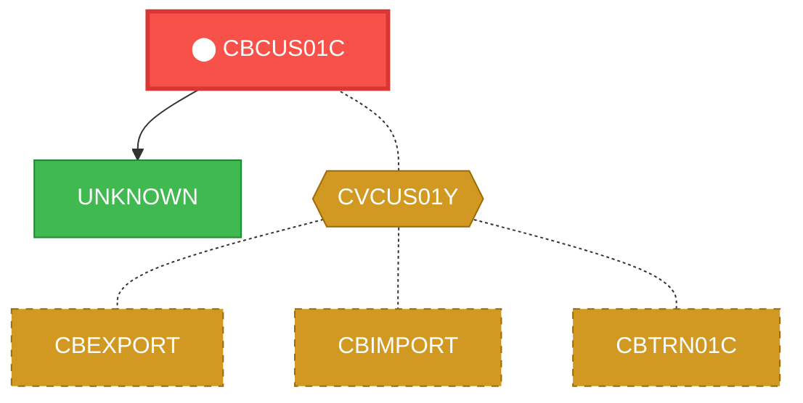
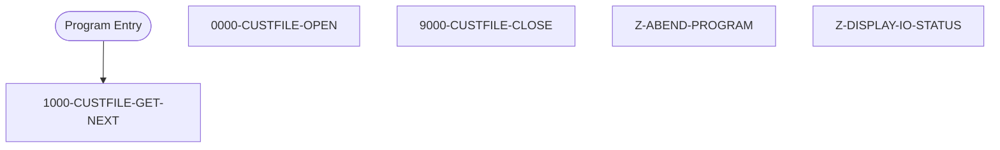

# Program: CBCUS01C

---

## Quick Reference

| Attribute | Value |
|-----------|-------|
| Program ID | `CBCUS01C` |
| Type | BATCH |
| Lines | 179 |
| Source | [CBCUS01C.cbl](../carddemo\app/CBCUS01C.cbl#L1) |
| Paragraphs | 5 |
| Statements | 20 |
| Impact Risk | **MEDIUM** — 9 programs affected |

> **View Source:** [Open CBCUS01C.cbl](../carddemo\app/CBCUS01C.cbl#L1)

## Dependency Context

> This section shows how **CBCUS01C** connects to the rest of the system — who calls it,
> what it calls, and what data it shares. If linked programs exist, they must appear here.

### Programs That Call CBCUS01C (Callers)

*No programs call CBCUS01C — this is likely a top-level entry point or CICS transaction starter.*

### Programs Called by CBCUS01C (Callees)

| Called Program | Type | Line | Why |
|----------------|------|------|-----|
| [UNKNOWN](UNKNOWN.md) | None | 184 |  |

### Shared Data (Copybooks & Files)

#### Shared Copybooks

| Copybook | Also Used By | # Co-Users |
|----------|-------------|------------|
| `CVCUS01Y` | CBEXPORT, CBIMPORT, CBTRN01C, COACTUPC, COACTVWC (+4 more) | 9 |

---

## Dependency Graph

> **Legend:** 🔴 Target program · 🔵 Direct callers · 🟢 Direct callees · 🟡 Copybook-coupled · ⚫ Transitive (indirect)

---

## Impact Ripple View

> **If you change CBCUS01C, what else could break?**

| Impact Metric | Count |
|--------------|-------|
| Direct Callers | 0 |
| Transitive Callers (callers of callers) | 0 |
| Direct Callees | 0 |
| Transitive Callees | 0 |
| Copybook-Coupled Programs | 9 |
| **Total Impact** | **9** |
| **Risk Rating** | **MEDIUM** |

**Programs affected via shared copybooks:**
- `CBEXPORT`
- `CBIMPORT`
- `CBTRN01C`
- `COACTUPC`
- `COACTVWC`
- `COCRDSLC`
- `COCRDUPC`
- `COPAUA0C`
- `COPAUS0C`

---

## Statement Profile

| Statement Type | Count |
|---------------|-------|
| IF | 7 |
| EXIT | 4 |
| MOVE | 3 |
| READ | 1 |
| OPEN | 1 |
| DISPLAY | 1 |
| CLOSE | 1 |
| CALL | 1 |
| ARITHMETIC | 1 |

## Control Flow

## Paragraphs

### 1000-CUSTFILE-GET-NEXT

| | |
|---|---|
| **Paragraph** | `1000-CUSTFILE-GET-NEXT` |
| **Lines** | 118 - 142 |
| **View Code** | [Jump to Line 118](../carddemo\app/CBCUS01C.cbl#L118) |

### 0000-CUSTFILE-OPEN

| | |
|---|---|
| **Paragraph** | `0000-CUSTFILE-OPEN` |
| **Lines** | 144 - 160 |
| **View Code** | [Jump to Line 144](../carddemo\app/CBCUS01C.cbl#L144) |

### 9000-CUSTFILE-CLOSE

| | |
|---|---|
| **Paragraph** | `9000-CUSTFILE-CLOSE` |
| **Lines** | 162 - 178 |
| **View Code** | [Jump to Line 162](../carddemo\app/CBCUS01C.cbl#L162) |

### Z-ABEND-PROGRAM

| | |
|---|---|
| **Paragraph** | `Z-ABEND-PROGRAM` |
| **Lines** | 180 - 184 |
| **View Code** | [Jump to Line 180](../carddemo\app/CBCUS01C.cbl#L180) |

### Z-DISPLAY-IO-STATUS

| | |
|---|---|
| **Paragraph** | `Z-DISPLAY-IO-STATUS` |
| **Lines** | 187 - 200 |
| **View Code** | [Jump to Line 187](../carddemo\app/CBCUS01C.cbl#L187) |

## Executed by JCL Jobs

This program is run by the following batch JCL jobs:

| Job Name | Step | Step Comments |
|----------|------|---------------|
| [READCUST](../jcl/READCUST.md) | `STEP05` | *****************************************************************
Copyright Amaz... |

## Business Rules

*No business rules extracted yet. Run LLM enrichment to extract rules from IF/EVALUATE logic.*

## Key Data Items

| Name | Level | Picture | Section | Business Name |
|------|-------|---------|---------|---------------|
| `CUSTOMER-RECORD` | 1 | `None` | WORKING-STORAGE | None |
| `CUST-ID` | 5 | `9(09)` | WORKING-STORAGE | None |
| `CUST-FIRST-NAME` | 5 | `X(25)` | WORKING-STORAGE | None |
| `CUST-MIDDLE-NAME` | 5 | `X(25)` | WORKING-STORAGE | None |
| `CUST-LAST-NAME` | 5 | `X(25)` | WORKING-STORAGE | None |
| `CUST-ADDR-LINE-1` | 5 | `X(50)` | WORKING-STORAGE | None |
| `CUST-ADDR-LINE-2` | 5 | `X(50)` | WORKING-STORAGE | None |
| `CUST-ADDR-LINE-3` | 5 | `X(50)` | WORKING-STORAGE | None |
| `CUST-ADDR-STATE-CD` | 5 | `X(02)` | WORKING-STORAGE | None |
| `CUST-ADDR-COUNTRY-CD` | 5 | `X(03)` | WORKING-STORAGE | None |
| `CUST-ADDR-ZIP` | 5 | `X(10)` | WORKING-STORAGE | None |
| `CUST-PHONE-NUM-1` | 5 | `X(15)` | WORKING-STORAGE | None |
| `CUST-PHONE-NUM-2` | 5 | `X(15)` | WORKING-STORAGE | None |
| `CUST-SSN` | 5 | `9(09)` | WORKING-STORAGE | None |
| `CUST-GOVT-ISSUED-ID` | 5 | `X(20)` | WORKING-STORAGE | None |
| `CUST-DOB-YYYY-MM-DD` | 5 | `X(10)` | WORKING-STORAGE | None |
| `CUST-EFT-ACCOUNT-ID` | 5 | `X(10)` | WORKING-STORAGE | None |
| `CUST-PRI-CARD-HOLDER-IND` | 5 | `X(01)` | WORKING-STORAGE | None |
| `CUST-FICO-CREDIT-SCORE` | 5 | `9(03)` | WORKING-STORAGE | None |
| `FILLER` | 5 | `X(168)` | WORKING-STORAGE | None |
| `CUSTFILE-STATUS` | 1 | `None` | WORKING-STORAGE | None |
| `CUSTFILE-STAT1` | 5 | `X` | WORKING-STORAGE | None |
| `CUSTFILE-STAT2` | 5 | `X` | WORKING-STORAGE | None |
| `IO-STATUS` | 1 | `None` | WORKING-STORAGE | None |
| `IO-STAT1` | 5 | `X` | WORKING-STORAGE | None |
| `IO-STAT2` | 5 | `X` | WORKING-STORAGE | None |
| `TWO-BYTES-BINARY` | 1 | `9(4)` | WORKING-STORAGE | None |
| `TWO-BYTES-ALPHA` | 1 | `None` | WORKING-STORAGE | None |
| `TWO-BYTES-LEFT` | 5 | `X` | WORKING-STORAGE | None |
| `TWO-BYTES-RIGHT` | 5 | `X` | WORKING-STORAGE | None |
| `IO-STATUS-04` | 1 | `None` | WORKING-STORAGE | None |
| `IO-STATUS-0401` | 5 | `9` | WORKING-STORAGE | None |
| `IO-STATUS-0403` | 5 | `999` | WORKING-STORAGE | None |
| `APPL-RESULT` | 1 | `S9(9)` | WORKING-STORAGE | None |
| `APPL-AOK` | 88 | `None` | WORKING-STORAGE | None |
| `APPL-EOF` | 88 | `None` | WORKING-STORAGE | None |
| `END-OF-FILE` | 1 | `X(01)` | WORKING-STORAGE | None |
| `ABCODE` | 1 | `S9(9)` | WORKING-STORAGE | None |
| `TIMING` | 1 | `S9(9)` | WORKING-STORAGE | None |

---

*Generated 2026-03-16 19:39*