# Program: CBIMPORT

---

## Quick Reference

| Attribute | Value |
|-----------|-------|
| Program ID | `CBIMPORT` |
| Type | BATCH |
| Lines | 488 |
| Source | [CBIMPORT.cbl](../carddemo\app/CBIMPORT.cbl#L1) |
| Paragraphs | 16 |
| Statements | 139 |
| Impact Risk | **HIGH** — 24 programs affected |

> **View Source:** [Open CBIMPORT.cbl](../carddemo\app/CBIMPORT.cbl#L1)

## Dependency Context

> This section shows how **CBIMPORT** connects to the rest of the system — who calls it,
> what it calls, and what data it shares. If linked programs exist, they must appear here.

### Programs That Call CBIMPORT (Callers)

*No programs call CBIMPORT — this is likely a top-level entry point or CICS transaction starter.*

### Programs Called by CBIMPORT (Callees)

| Called Program | Type | Line | Why |
|----------------|------|------|-----|
| [UNKNOWN](UNKNOWN.md) | None | 679 |  |

### Shared Data (Copybooks & Files)

#### Shared Copybooks

| Copybook | Also Used By | # Co-Users |
|----------|-------------|------------|
| `CVACT01Y` | CBACT01C, CBACT04C, CBEXPORT, CBSTM03A, CBTRN01C (+8 more) | 13 |
| `CVACT02Y` | CBACT02C, CBEXPORT, CBTRN01C, COACTVWC, COCRDLIC (+4 more) | 9 |
| `CVACT03Y` | CBACT03C, CBACT04C, CBEXPORT, CBSTM03A, CBTRN01C (+8 more) | 13 |
| `CVCUS01Y` | CBCUS01C, CBEXPORT, CBTRN01C, COACTUPC, COACTVWC (+4 more) | 9 |
| `CVEXPORT` | CBEXPORT | 1 |
| `CVTRA05Y` | CBACT04C, CBEXPORT, CBTRN01C, CBTRN02C, CBTRN03C (+5 more) | 10 |

---

## Dependency Graph

```mermaid
flowchart TD
    CBIMPORT["⬤ CBIMPORT"]:::target
    UNKNOWN["UNKNOWN"]:::callee
    CBIMPORT --> UNKNOWN
    CB_CVACT01Y{{"CVACT01Y"}}:::copybook
    CBIMPORT -.- CB_CVACT01Y
    CBACT01C["CBACT01C"]:::coupled
    CB_CVACT01Y -.- CBACT01C
    CBACT04C["CBACT04C"]:::coupled
    CB_CVACT01Y -.- CBACT04C
    CBEXPORT["CBEXPORT"]:::coupled
    CB_CVACT01Y -.- CBEXPORT
    CB_CVACT02Y{{"CVACT02Y"}}:::copybook
    CBIMPORT -.- CB_CVACT02Y
    CBACT02C["CBACT02C"]:::coupled
    CB_CVACT02Y -.- CBACT02C
    CBEXPORT["CBEXPORT"]:::coupled
    CB_CVACT02Y -.- CBEXPORT
    CBTRN01C["CBTRN01C"]:::coupled
    CB_CVACT02Y -.- CBTRN01C
    CB_CVACT03Y{{"CVACT03Y"}}:::copybook
    CBIMPORT -.- CB_CVACT03Y
    CBACT03C["CBACT03C"]:::coupled
    CB_CVACT03Y -.- CBACT03C
    CBACT04C["CBACT04C"]:::coupled
    CB_CVACT03Y -.- CBACT04C
    CBEXPORT["CBEXPORT"]:::coupled
    CB_CVACT03Y -.- CBEXPORT
    CB_CVCUS01Y{{"CVCUS01Y"}}:::copybook
    CBIMPORT -.- CB_CVCUS01Y
    CBCUS01C["CBCUS01C"]:::coupled
    CB_CVCUS01Y -.- CBCUS01C
    CBEXPORT["CBEXPORT"]:::coupled
    CB_CVCUS01Y -.- CBEXPORT
    CBTRN01C["CBTRN01C"]:::coupled
    CB_CVCUS01Y -.- CBTRN01C
    CB_CVEXPORT{{"CVEXPORT"}}:::copybook
    CBIMPORT -.- CB_CVEXPORT
    CBEXPORT["CBEXPORT"]:::coupled
    CB_CVEXPORT -.- CBEXPORT
    CB_CVTRA05Y{{"CVTRA05Y"}}:::copybook
    CBIMPORT -.- CB_CVTRA05Y
    CBACT04C["CBACT04C"]:::coupled
    CB_CVTRA05Y -.- CBACT04C
    CBEXPORT["CBEXPORT"]:::coupled
    CB_CVTRA05Y -.- CBEXPORT
    CBTRN01C["CBTRN01C"]:::coupled
    CB_CVTRA05Y -.- CBTRN01C

    classDef target fill:#f85149,stroke:#da3633,color:#fff,stroke-width:3px
    classDef caller fill:#58a6ff,stroke:#1f6feb,color:#fff
    classDef callee fill:#3fb950,stroke:#238636,color:#fff
    classDef copybook fill:#d29922,stroke:#9e6a03,color:#fff
    classDef coupled fill:#d29922,stroke:#9e6a03,color:#fff,stroke-dasharray:5
    classDef transitive fill:#484f58,stroke:#8b949e,color:#c9d1d9,stroke-dasharray:5
```

> **Legend:** 🔴 Target program · 🔵 Direct callers · 🟢 Direct callees · 🟡 Copybook-coupled · ⚫ Transitive (indirect)

---

## Impact Ripple View

> **If you change CBIMPORT, what else could break?**

| Impact Metric | Count |
|--------------|-------|
| Direct Callers | 0 |
| Transitive Callers (callers of callers) | 0 |
| Direct Callees | 0 |
| Transitive Callees | 0 |
| Copybook-Coupled Programs | 24 |
| **Total Impact** | **24** |
| **Risk Rating** | **HIGH** |

**Programs affected via shared copybooks:**
- `CBACT01C`
- `CBACT02C`
- `CBACT03C`
- `CBACT04C`
- `CBCUS01C`
- `CBEXPORT`
- `CBSTM03A`
- `CBTRN01C`
- `CBTRN02C`
- `CBTRN03C`
- `COACCT01`
- `COACTUPC`
- `COACTVWC`
- `COBIL00C`
- `COCRDLIC`
- `COCRDSLC`
- `COCRDUPC`
- `COPAUA0C`
- `COPAUS0C`
- `CORPT00C`
- `COTRN00C`
- `COTRN01C`
- `COTRN02C`
- `COTRTLIC`

---

## Statement Profile

| Statement Type | Count |
|---------------|-------|
| MOVE | 66 |
| DISPLAY | 15 |
| IF | 14 |
| PERFORM | 8 |
| OPEN | 7 |
| CLOSE | 7 |
| ARITHMETIC | 7 |
| WRITE | 6 |
| INITIALIZE | 5 |
| READ | 1 |
| GOBACK | 1 |
| EVALUATE | 1 |
| CALL | 1 |

## Control Flow

```mermaid
flowchart TD
    START([Program Entry])
    0000_MAIN_PROCESSING["0000-MAIN-PROCESSING"]
    1000_INITIALIZE["1000-INITIALIZE"]
    1100_OPEN_FILES["1100-OPEN-FILES"]
    2000_PROCESS_EXPORT_FILE["2000-PROCESS-EXPORT-FILE"]
    2100_READ_EXPORT_RECORD["2100-READ-EXPORT-RECORD"]
    2200_PROCESS_RECORD_BY_TYPE["2200-PROCESS-RECORD-BY-TYPE"]
    2300_PROCESS_CUSTOMER_RECORD["2300-PROCESS-CUSTOMER-RECORD"]
    2400_PROCESS_ACCOUNT_RECORD["2400-PROCESS-ACCOUNT-RECORD"]
    2500_PROCESS_XREF_RECORD["2500-PROCESS-XREF-RECORD"]
    2600_PROCESS_TRAN_RECORD["2600-PROCESS-TRAN-RECORD"]
    2650_PROCESS_CARD_RECORD["2650-PROCESS-CARD-RECORD"]
    2700_PROCESS_UNKNOWN_RECORD["2700-PROCESS-UNKNOWN-RECORD"]
    2750_WRITE_ERROR["2750-WRITE-ERROR"]
    3000_VALIDATE_IMPORT["3000-VALIDATE-IMPORT"]
    4000_FINALIZE["4000-FINALIZE"]
    START --> 0000_MAIN_PROCESSING
    0000_MAIN_PROCESSING --> INLINE
    1000_INITIALIZE --> INLINE
    2000_PROCESS_EXPORT_FILE --> INLINE
    2700_PROCESS_UNKNOWN_RECORD --> INLINE
```

## Paragraphs

### 0000-MAIN-PROCESSING

| | |
|---|---|
| **Paragraph** | `0000-MAIN-PROCESSING` |
| **Lines** | 360 - 366 |
| **View Code** | [Jump to Line 360](../carddemo\app/CBIMPORT.cbl#L360) |

### 1000-INITIALIZE

| | |
|---|---|
| **Paragraph** | `1000-INITIALIZE` |
| **Lines** | 369 - 388 |
| **View Code** | [Jump to Line 369](../carddemo\app/CBIMPORT.cbl#L369) |

### 1100-OPEN-FILES

| | |
|---|---|
| **Paragraph** | `1100-OPEN-FILES` |
| **Lines** | 391 - 440 |
| **View Code** | [Jump to Line 391](../carddemo\app/CBIMPORT.cbl#L391) |

### 2000-PROCESS-EXPORT-FILE

| | |
|---|---|
| **Paragraph** | `2000-PROCESS-EXPORT-FILE` |
| **Lines** | 443 - 451 |
| **View Code** | [Jump to Line 443](../carddemo\app/CBIMPORT.cbl#L443) |

### 2100-READ-EXPORT-RECORD

| | |
|---|---|
| **Paragraph** | `2100-READ-EXPORT-RECORD` |
| **Lines** | 454 - 462 |
| **View Code** | [Jump to Line 454](../carddemo\app/CBIMPORT.cbl#L454) |

### 2200-PROCESS-RECORD-BY-TYPE

| | |
|---|---|
| **Paragraph** | `2200-PROCESS-RECORD-BY-TYPE` |
| **Lines** | 465 - 480 |
| **View Code** | [Jump to Line 465](../carddemo\app/CBIMPORT.cbl#L465) |

### 2300-PROCESS-CUSTOMER-RECORD

| | |
|---|---|
| **Paragraph** | `2300-PROCESS-CUSTOMER-RECORD` |
| **Lines** | 483 - 515 |
| **View Code** | [Jump to Line 483](../carddemo\app/CBIMPORT.cbl#L483) |

### 2400-PROCESS-ACCOUNT-RECORD

| | |
|---|---|
| **Paragraph** | `2400-PROCESS-ACCOUNT-RECORD` |
| **Lines** | 518 - 544 |
| **View Code** | [Jump to Line 518](../carddemo\app/CBIMPORT.cbl#L518) |

### 2500-PROCESS-XREF-RECORD

| | |
|---|---|
| **Paragraph** | `2500-PROCESS-XREF-RECORD` |
| **Lines** | 547 - 564 |
| **View Code** | [Jump to Line 547](../carddemo\app/CBIMPORT.cbl#L547) |

### 2600-PROCESS-TRAN-RECORD

| | |
|---|---|
| **Paragraph** | `2600-PROCESS-TRAN-RECORD` |
| **Lines** | 567 - 594 |
| **View Code** | [Jump to Line 567](../carddemo\app/CBIMPORT.cbl#L567) |

### 2650-PROCESS-CARD-RECORD

| | |
|---|---|
| **Paragraph** | `2650-PROCESS-CARD-RECORD` |
| **Lines** | 597 - 617 |
| **View Code** | [Jump to Line 597](../carddemo\app/CBIMPORT.cbl#L597) |

### 2700-PROCESS-UNKNOWN-RECORD

| | |
|---|---|
| **Paragraph** | `2700-PROCESS-UNKNOWN-RECORD` |
| **Lines** | 620 - 629 |
| **View Code** | [Jump to Line 620](../carddemo\app/CBIMPORT.cbl#L620) |

### 2750-WRITE-ERROR

| | |
|---|---|
| **Paragraph** | `2750-WRITE-ERROR` |
| **Lines** | 632 - 641 |
| **View Code** | [Jump to Line 632](../carddemo\app/CBIMPORT.cbl#L632) |

### 3000-VALIDATE-IMPORT

| | |
|---|---|
| **Paragraph** | `3000-VALIDATE-IMPORT` |
| **Lines** | 644 - 647 |
| **View Code** | [Jump to Line 644](../carddemo\app/CBIMPORT.cbl#L644) |

### 4000-FINALIZE

| | |
|---|---|
| **Paragraph** | `4000-FINALIZE` |
| **Lines** | 650 - 673 |
| **View Code** | [Jump to Line 650](../carddemo\app/CBIMPORT.cbl#L650) |

### 9999-ABEND-PROGRAM

| | |
|---|---|
| **Paragraph** | `9999-ABEND-PROGRAM` |
| **Lines** | 676 - 679 |
| **View Code** | [Jump to Line 676](../carddemo\app/CBIMPORT.cbl#L676) |

## Executed by JCL Jobs

This program is run by the following batch JCL jobs:

| Job Name | Step | Step Comments |
|----------|------|---------------|
| [CBIMPORT](../jcl/CBIMPORT.md) | `STEP01` | *****************************************************************
Copyright Amaz... |

## Business Rules

*No business rules extracted yet. Run LLM enrichment to extract rules from IF/EVALUATE logic.*

## Key Data Items

| Name | Level | Picture | Section | Business Name |
|------|-------|---------|---------|---------------|
| `EXPORT-RECORD` | 1 | `None` | WORKING-STORAGE | None |
| `EXPORT-REC-TYPE` | 5 | `X(1)` | WORKING-STORAGE | None |
| `EXPORT-TIMESTAMP` | 5 | `X(26)` | WORKING-STORAGE | None |
| `EXPORT-TIMESTAMP-R` | 5 | `None` | WORKING-STORAGE | None |
| `EXPORT-DATE` | 10 | `X(10)` | WORKING-STORAGE | None |
| `EXPORT-DATE-TIME-SEP` | 10 | `X(1)` | WORKING-STORAGE | None |
| `EXPORT-TIME` | 10 | `X(15)` | WORKING-STORAGE | None |
| `EXPORT-SEQUENCE-NUM` | 5 | `9(9)` | WORKING-STORAGE | None |
| `EXPORT-BRANCH-ID` | 5 | `X(4)` | WORKING-STORAGE | None |
| `EXPORT-REGION-CODE` | 5 | `X(5)` | WORKING-STORAGE | None |
| `EXPORT-RECORD-DATA` | 5 | `X(460)` | WORKING-STORAGE | None |
| `EXPORT-CUSTOMER-DATA` | 5 | `None` | WORKING-STORAGE | None |
| `EXP-CUST-ID` | 10 | `9(09)` | WORKING-STORAGE | None |
| `EXP-CUST-FIRST-NAME` | 10 | `X(25)` | WORKING-STORAGE | None |
| `EXP-CUST-MIDDLE-NAME` | 10 | `X(25)` | WORKING-STORAGE | None |
| `EXP-CUST-LAST-NAME` | 10 | `X(25)` | WORKING-STORAGE | None |
| `EXP-CUST-ADDR-LINES` | 10 | `None` | WORKING-STORAGE | None |
| `EXP-CUST-ADDR-LINE` | 15 | `X(50)` | WORKING-STORAGE | None |
| `EXP-CUST-ADDR-STATE-CD` | 10 | `X(02)` | WORKING-STORAGE | None |
| `EXP-CUST-ADDR-COUNTRY-CD` | 10 | `X(03)` | WORKING-STORAGE | None |
| `EXP-CUST-ADDR-ZIP` | 10 | `X(10)` | WORKING-STORAGE | None |
| `EXP-CUST-PHONE-NUMS` | 10 | `None` | WORKING-STORAGE | None |
| `EXP-CUST-PHONE-NUM` | 15 | `X(15)` | WORKING-STORAGE | None |
| `EXP-CUST-SSN` | 10 | `9(09)` | WORKING-STORAGE | None |
| `EXP-CUST-GOVT-ISSUED-ID` | 10 | `X(20)` | WORKING-STORAGE | None |
| `EXP-CUST-DOB-YYYY-MM-DD` | 10 | `X(10)` | WORKING-STORAGE | None |
| `EXP-CUST-EFT-ACCOUNT-ID` | 10 | `X(10)` | WORKING-STORAGE | None |
| `EXP-CUST-PRI-CARD-HOLDER-IND` | 10 | `X(01)` | WORKING-STORAGE | None |
| `EXP-CUST-FICO-CREDIT-SCORE` | 10 | `9(03)` | WORKING-STORAGE | None |
| `FILLER` | 10 | `X(134)` | WORKING-STORAGE | None |
| `EXPORT-ACCOUNT-DATA` | 5 | `None` | WORKING-STORAGE | None |
| `EXP-ACCT-ID` | 10 | `9(11)` | WORKING-STORAGE | None |
| `EXP-ACCT-ACTIVE-STATUS` | 10 | `X(01)` | WORKING-STORAGE | None |
| `EXP-ACCT-CURR-BAL` | 10 | `S9(10)V99` | WORKING-STORAGE | None |
| `EXP-ACCT-CREDIT-LIMIT` | 10 | `S9(10)V99` | WORKING-STORAGE | None |
| `EXP-ACCT-CASH-CREDIT-LIMIT` | 10 | `S9(10)V99` | WORKING-STORAGE | None |
| `EXP-ACCT-OPEN-DATE` | 10 | `X(10)` | WORKING-STORAGE | None |
| `EXP-ACCT-EXPIRAION-DATE` | 10 | `X(10)` | WORKING-STORAGE | None |
| `EXP-ACCT-REISSUE-DATE` | 10 | `X(10)` | WORKING-STORAGE | None |
| `EXP-ACCT-CURR-CYC-CREDIT` | 10 | `S9(10)V99` | WORKING-STORAGE | None |

*Showing 40 of 109 data items. See [Data Dictionary](../data-dictionary.md).*

---

*Generated 2026-03-16 19:39*