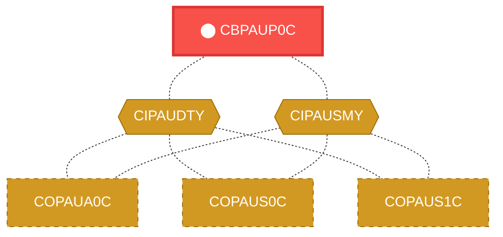

# Program: CBPAUP0C

> **Authorization Expiration Processor**
---

## Quick Reference

| Attribute | Value |
|-----------|-------|
| Program ID | `CBPAUP0C` |
| Type | BATCH |
| Lines | 387 |
| Source | [CBPAUP0C.cbl](../carddemo\app/CBPAUP0C.cbl#L1) |
| Paragraphs | 18 |
| Statements | 0 |
| Impact Risk | **MEDIUM** — 7 programs affected |

> **View Source:** [Open CBPAUP0C.cbl](../carddemo\app/CBPAUP0C.cbl#L1)

## Business Purpose

This program is triggered by a scheduled batch job to process authorization records. It iterates through authorization details and summaries, checks for expired records, and deletes them if necessary. The program appears to maintain data integrity by removing outdated authorization information. It does not read or write to any external files, but rather relies on included copybooks CIPAUDTY and CIPAUSMY for data definitions. The program's output is the updated authorization dataset, which is not explicitly written to a file but rather maintained in the system's memory.

**Used By:** Batch Scheduler  |  **Process:** Authorization Management
## Migration Summary

| Attribute | Value |
|-----------|-------|
| Migration Complexity | **2/5** — The program's logic is relatively straightforward, but the lack of explicit file I/O and reliance on included copybooks may require additional analysis to ensure correct data mapping and transformation. |
| Modern Equivalent | Scheduled batch job or a database stored procedure |
| Target Microservice | `auth-service` |

### How to Migrate This Program

First, identify and document the data definitions from the included copybooks CIPAUDTY and CIPAUSMY. Next, refactor the program's logic into a modern programming language, such as Java or Python. Then, integrate the refactored code with a scheduling framework, like Apache Airflow or Quartz Scheduler, to maintain the batch job functionality. Finally, test the migrated program to ensure data integrity and correct authorization record processing.

### Data Contracts (Input / Output)

The program consumes authorization details and summaries, and produces an updated authorization dataset.

### Migration Risks

> ⚠️ Data corruption or loss during migration, incorrect interpretation of copybook data definitions, and potential issues with scheduling and job execution in the new environment.

---

## Dependency Context

> This section shows how **CBPAUP0C** connects to the rest of the system — who calls it,
> what it calls, and what data it shares. If linked programs exist, they must appear here.

### Programs That Call CBPAUP0C (Callers)

*No programs call CBPAUP0C — this is likely a top-level entry point or CICS transaction starter.*

### Programs Called by CBPAUP0C (Callees)

*CBPAUP0C does not call any other programs (leaf program).*

### Shared Data (Copybooks & Files)

#### Shared Copybooks

| Copybook | Also Used By | # Co-Users |
|----------|-------------|------------|
| `CIPAUDTY` | COPAUA0C, COPAUS0C, COPAUS1C, COPAUS2C, DBUNLDGS (+2 more) | 7 |
| `CIPAUSMY` | COPAUA0C, COPAUS0C, COPAUS1C, DBUNLDGS, PAUDBLOD (+1 more) | 6 |

---

## Dependency Graph

> **Legend:** 🔴 Target program · 🔵 Direct callers · 🟢 Direct callees · 🟡 Copybook-coupled · ⚫ Transitive (indirect)

---

## Impact Ripple View

> **If you change CBPAUP0C, what else could break?**

| Impact Metric | Count |
|--------------|-------|
| Direct Callers | 0 |
| Transitive Callers (callers of callers) | 0 |
| Direct Callees | 0 |
| Transitive Callees | 0 |
| Copybook-Coupled Programs | 7 |
| **Total Impact** | **7** |
| **Risk Rating** | **MEDIUM** |

**Programs affected via shared copybooks:**
- `COPAUA0C`
- `COPAUS0C`
- `COPAUS1C`
- `COPAUS2C`
- `DBUNLDGS`
- `PAUDBLOD`
- `PAUDBUNL`

---

## Statement Profile

## Control Flow

```mermaid
flowchart TD
    START([Program Entry])
    FILE_CONTROL["FILE-CONTROL"]
    MAIN_PARA["MAIN-PARA"]
    1000_INITIALIZE["1000-INITIALIZE"]
    1000_EXIT["1000-EXIT"]
    2000_FIND_NEXT_AUTH_SUMMARY["2000-FIND-NEXT-AUTH-SUMMARY"]
    2000_EXIT["2000-EXIT"]
    3000_FIND_NEXT_AUTH_DTL["3000-FIND-NEXT-AUTH-DTL"]
    3000_EXIT["3000-EXIT"]
    4000_CHECK_IF_EXPIRED["4000-CHECK-IF-EXPIRED"]
    4000_EXIT["4000-EXIT"]
    5000_DELETE_AUTH_DTL["5000-DELETE-AUTH-DTL"]
    5000_EXIT["5000-EXIT"]
    6000_DELETE_AUTH_SUMMARY["6000-DELETE-AUTH-SUMMARY"]
    6000_EXIT["6000-EXIT"]
    9000_TAKE_CHECKPOINT["9000-TAKE-CHECKPOINT"]
    START --> FILE_CONTROL
    MAIN --> 1000_INITIALIZE
    MAIN --> 2000_FIND_NEXT_AUTH_SUMMARY
    MAIN --> UNTIL
    MAIN --> 3000_FIND_NEXT_AUTH_DTL
    MAIN --> 4000_CHECK_IF_EXPIRED
    MAIN --> 5000_DELETE_AUTH_DTL
    MAIN --> 6000_DELETE_AUTH_SUMMARY
    MAIN --> 9000_TAKE_CHECKPOINT
    MAIN --> 9999_ABEND
```

## Paragraphs

### FILE-CONTROL

| | |
|---|---|
| **Paragraph** | `FILE-CONTROL` |
| **Lines** | 30 - 135 |
| **View Code** | [Jump to Line 30](../carddemo\app/CBPAUP0C.cbl#L30) |

### MAIN-PARA

| | |
|---|---|
| **Paragraph** | `MAIN-PARA` |
| **Lines** | 136 - 182 |
| **View Code** | [Jump to Line 136](../carddemo\app/CBPAUP0C.cbl#L136) |

### 1000-INITIALIZE

| | |
|---|---|
| **Paragraph** | `1000-INITIALIZE` |
| **Lines** | 183 - 211 |
| **View Code** | [Jump to Line 183](../carddemo\app/CBPAUP0C.cbl#L183) |

### 1000-EXIT

| | |
|---|---|
| **Paragraph** | `1000-EXIT` |
| **Lines** | 212 - 215 |
| **View Code** | [Jump to Line 212](../carddemo\app/CBPAUP0C.cbl#L212) |

### 2000-FIND-NEXT-AUTH-SUMMARY

| | |
|---|---|
| **Paragraph** | `2000-FIND-NEXT-AUTH-SUMMARY` |
| **Lines** | 216 - 242 |
| **View Code** | [Jump to Line 216](../carddemo\app/CBPAUP0C.cbl#L216) |

### 2000-EXIT

| | |
|---|---|
| **Paragraph** | `2000-EXIT` |
| **Lines** | 243 - 247 |
| **View Code** | [Jump to Line 243](../carddemo\app/CBPAUP0C.cbl#L243) |

### 3000-FIND-NEXT-AUTH-DTL

| | |
|---|---|
| **Paragraph** | `3000-FIND-NEXT-AUTH-DTL` |
| **Lines** | 248 - 272 |
| **View Code** | [Jump to Line 248](../carddemo\app/CBPAUP0C.cbl#L248) |

### 3000-EXIT

| | |
|---|---|
| **Paragraph** | `3000-EXIT` |
| **Lines** | 273 - 276 |
| **View Code** | [Jump to Line 273](../carddemo\app/CBPAUP0C.cbl#L273) |

### 4000-CHECK-IF-EXPIRED

| | |
|---|---|
| **Paragraph** | `4000-CHECK-IF-EXPIRED` |
| **Lines** | 277 - 298 |
| **View Code** | [Jump to Line 277](../carddemo\app/CBPAUP0C.cbl#L277) |

### 4000-EXIT

| | |
|---|---|
| **Paragraph** | `4000-EXIT` |
| **Lines** | 299 - 302 |
| **View Code** | [Jump to Line 299](../carddemo\app/CBPAUP0C.cbl#L299) |

### Remove Expired Authorization Details

| | |
|---|---|
| **Paragraph** | `5000-DELETE-AUTH-DTL` |
| **Lines** | 303 - 323 |
| **View Code** | [Jump to Line 303](../carddemo\app/CBPAUP0C.cbl#L303) |

This function is triggered when the program needs to clean up outdated authorization details. It starts by checking each authorization detail record to see if it has expired. If a record is found to be expired, the program deletes it from the system's memory to maintain data integrity. The program relies on data definitions from included copybooks to understand the structure of the authorization details. By removing expired records, the program ensures that only current and valid authorization information is kept. The updated authorization dataset is then maintained in the system's memory for further processing.

> **Purpose:** Its role is to remove expired authorization details to maintain data integrity and ensure only valid information is kept.

### Exit Authorization Detail Processing

| | |
|---|---|
| **Paragraph** | `5000-EXIT` |
| **Lines** | 324 - 327 |
| **View Code** | [Jump to Line 324](../carddemo\app/CBPAUP0C.cbl#L324) |

This function is triggered after the program has finished processing authorization details. It marks the end of the authorization detail processing section and allows the program to move on to the next step. There are no specific actions or decisions made in this function, as its sole purpose is to provide a clear exit point. The program does not read or write any data during this function, and it does not return any values. The function simply signals the end of the authorization detail processing section. The program then proceeds to the next section, which may involve processing authorization summaries.

> **Purpose:** Its role is to provide a clear exit point for the authorization detail processing section and allow the program to proceed to the next step.

### Remove Expired Authorization Summaries

| | |
|---|---|
| **Paragraph** | `6000-DELETE-AUTH-SUMMARY` |
| **Lines** | 328 - 347 |
| **View Code** | [Jump to Line 328](../carddemo\app/CBPAUP0C.cbl#L328) |

This function is triggered when the program needs to clean up outdated authorization summaries. It starts by checking each authorization summary record to see if it has expired. If a record is found to be expired, the program deletes it from the system's memory to maintain data integrity. The program relies on data definitions from included copybooks to understand the structure of the authorization summaries. By removing expired records, the program ensures that only current and valid authorization information is kept. The updated authorization dataset is then maintained in the system's memory for further processing.

> **Purpose:** Its role is to remove expired authorization summaries to maintain data integrity and ensure only valid information is kept.

### Exit Authorization Summary Processing

| | |
|---|---|
| **Paragraph** | `6000-EXIT` |
| **Lines** | 348 - 351 |
| **View Code** | [Jump to Line 348](../carddemo\app/CBPAUP0C.cbl#L348) |

This function is triggered after the program has finished processing authorization summaries. It marks the end of the authorization summary processing section and allows the program to move on to the next step. There are no specific actions or decisions made in this function, as its sole purpose is to provide a clear exit point. The program does not read or write any data during this function, and it does not return any values. The function simply signals the end of the authorization summary processing section. The program then proceeds to the next section, which may involve taking a checkpoint or handling errors.

> **Purpose:** Its role is to provide a clear exit point for the authorization summary processing section and allow the program to proceed to the next step.

### Take Checkpoint for Error Recovery

| | |
|---|---|
| **Paragraph** | `9000-TAKE-CHECKPOINT` |
| **Lines** | 352 - 372 |
| **View Code** | [Jump to Line 352](../carddemo\app/CBPAUP0C.cbl#L352) |

This function is triggered at a specific point in the program to create a checkpoint for error recovery. It saves the current state of the program, including any updated authorization data, so that if an error occurs, the program can recover from this point. The program relies on system resources to create the checkpoint, and it does not read or write any external files. By taking a checkpoint, the program ensures that it can recover from errors and maintain data integrity. The checkpoint is stored in the system's memory, and the program can use it to restart processing if an error occurs. The function allows the program to proceed with confidence, knowing that it can recover from any errors that may occur.

> **Purpose:** Its role is to create a checkpoint for error recovery, allowing the program to restart processing from a known good state if an error occurs.

### Exit Checkpoint Processing

| | |
|---|---|
| **Paragraph** | `9000-EXIT` |
| **Lines** | 373 - 376 |
| **View Code** | [Jump to Line 373](../carddemo\app/CBPAUP0C.cbl#L373) |

This function is triggered after the program has finished taking a checkpoint. It marks the end of the checkpoint processing section and allows the program to move on to the next step. There are no specific actions or decisions made in this function, as its sole purpose is to provide a clear exit point. The program does not read or write any data during this function, and it does not return any values. The function simply signals the end of the checkpoint processing section. The program then proceeds to the next section, which may involve handling errors or exiting the program.

> **Purpose:** Its role is to provide a clear exit point for the checkpoint processing section and allow the program to proceed to the next step.

### Handle Abnormal Termination

| | |
|---|---|
| **Paragraph** | `9999-ABEND` |
| **Lines** | 377 - 384 |
| **View Code** | [Jump to Line 377](../carddemo\app/CBPAUP0C.cbl#L377) |

This function is triggered when the program encounters an error or exception that requires abnormal termination. It takes control of the program's termination process, ensuring that any necessary cleanup or recovery actions are taken. The program may write error messages or update system logs to record the error. The function then signals the end of the program, allowing the system to terminate the program and release any resources it was using. The program does not attempt to recover from the error, but instead allows the system to handle the termination. The function provides a controlled exit point for the program, ensuring that the system remains in a stable state.

> **Purpose:** Its role is to handle abnormal termination of the program, ensuring that any necessary cleanup or recovery actions are taken before the program exits.

### Exit Abnormal Termination Handling

| | |
|---|---|
| **Paragraph** | `9999-EXIT` |
| **Lines** | 385 - 387 |
| **View Code** | [Jump to Line 385](../carddemo\app/CBPAUP0C.cbl#L385) |

This function is triggered after the program has finished handling an abnormal termination. It marks the end of the abnormal termination handling section and allows the system to finalize the program's termination. There are no specific actions or decisions made in this function, as its sole purpose is to provide a clear exit point. The program does not read or write any data during this function, and it does not return any values. The function simply signals the end of the abnormal termination handling section, allowing the system to release any remaining resources and terminate the program. The system then proceeds to finalize the program's termination, ensuring that all resources are released and the system remains in a stable state.

> **Purpose:** Its role is to provide a clear exit point for the abnormal termination handling section, allowing the system to finalize the program's termination.

## Business Rules

*No business rules extracted yet. Run LLM enrichment to extract rules from IF/EVALUATE logic.*

## Key Data Items

*No data items found for this program.*

---

*Generated 2026-03-16 19:39*