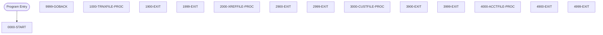

# Program: CBSTM03B

---

## Quick Reference

| Attribute | Value |
|-----------|-------|
| Program ID | `CBSTM03B` |
| Type | BATCH |
| Lines | 231 |
| Source | [CBSTM03B.CBL](../carddemo\app/CBSTM03B.CBL#L1) |
| Paragraphs | 14 |
| Statements | 22 |
| Impact Risk | **LOW** — 0 programs affected |

> **View Source:** [Open CBSTM03B.CBL](../carddemo\app/CBSTM03B.CBL#L1)

## Dependency Context

> This section shows how **CBSTM03B** connects to the rest of the system — who calls it,
> what it calls, and what data it shares. If linked programs exist, they must appear here.

### Programs That Call CBSTM03B (Callers)

*No programs call CBSTM03B — this is likely a top-level entry point or CICS transaction starter.*

### Programs Called by CBSTM03B (Callees)

*CBSTM03B does not call any other programs (leaf program).*

### Shared Data (Copybooks & Files)

*No shared copybooks.*

---

## Dependency Graph

> **Legend:** 🔴 Target program · 🔵 Direct callers · 🟢 Direct callees · 🟡 Copybook-coupled · ⚫ Transitive (indirect)

---

## Impact Ripple View

> **If you change CBSTM03B, what else could break?**

| Impact Metric | Count |
|--------------|-------|
| Direct Callers | 0 |
| Transitive Callers (callers of callers) | 0 |
| Direct Callees | 0 |
| Transitive Callees | 0 |
| Copybook-Coupled Programs | 0 |
| **Total Impact** | **0** |
| **Risk Rating** | **LOW** |

---

## Statement Profile

| Statement Type | Count |
|---------------|-------|
| IF | 12 |
| MOVE | 4 |
| EXIT | 4 |
| GOBACK | 1 |
| EVALUATE | 1 |

## Control Flow

## Paragraphs

### 0000-START

| | |
|---|---|
| **Paragraph** | `0000-START` |
| **Lines** | 116 - 128 |
| **View Code** | [Jump to Line 116](../carddemo\app/CBSTM03B.CBL#L116) |

### 9999-GOBACK

| | |
|---|---|
| **Paragraph** | `9999-GOBACK` |
| **Lines** | 130 - 131 |
| **View Code** | [Jump to Line 130](../carddemo\app/CBSTM03B.CBL#L130) |

### 1000-TRNXFILE-PROC

| | |
|---|---|
| **Paragraph** | `1000-TRNXFILE-PROC` |
| **Lines** | 133 - 149 |
| **View Code** | [Jump to Line 133](../carddemo\app/CBSTM03B.CBL#L133) |

### 1900-EXIT

| | |
|---|---|
| **Paragraph** | `1900-EXIT` |
| **Lines** | 151 - 152 |
| **View Code** | [Jump to Line 151](../carddemo\app/CBSTM03B.CBL#L151) |

### 1999-EXIT

| | |
|---|---|
| **Paragraph** | `1999-EXIT` |
| **Lines** | 154 - 155 |
| **View Code** | [Jump to Line 154](../carddemo\app/CBSTM03B.CBL#L154) |

### 2000-XREFFILE-PROC

| | |
|---|---|
| **Paragraph** | `2000-XREFFILE-PROC` |
| **Lines** | 157 - 173 |
| **View Code** | [Jump to Line 157](../carddemo\app/CBSTM03B.CBL#L157) |

### 2900-EXIT

| | |
|---|---|
| **Paragraph** | `2900-EXIT` |
| **Lines** | 175 - 176 |
| **View Code** | [Jump to Line 175](../carddemo\app/CBSTM03B.CBL#L175) |

### 2999-EXIT

| | |
|---|---|
| **Paragraph** | `2999-EXIT` |
| **Lines** | 178 - 179 |
| **View Code** | [Jump to Line 178](../carddemo\app/CBSTM03B.CBL#L178) |

### 3000-CUSTFILE-PROC

| | |
|---|---|
| **Paragraph** | `3000-CUSTFILE-PROC` |
| **Lines** | 181 - 198 |
| **View Code** | [Jump to Line 181](../carddemo\app/CBSTM03B.CBL#L181) |

### 3900-EXIT

| | |
|---|---|
| **Paragraph** | `3900-EXIT` |
| **Lines** | 200 - 201 |
| **View Code** | [Jump to Line 200](../carddemo\app/CBSTM03B.CBL#L200) |

### 3999-EXIT

| | |
|---|---|
| **Paragraph** | `3999-EXIT` |
| **Lines** | 203 - 204 |
| **View Code** | [Jump to Line 203](../carddemo\app/CBSTM03B.CBL#L203) |

### 4000-ACCTFILE-PROC

| | |
|---|---|
| **Paragraph** | `4000-ACCTFILE-PROC` |
| **Lines** | 206 - 223 |
| **View Code** | [Jump to Line 206](../carddemo\app/CBSTM03B.CBL#L206) |

### 4900-EXIT

| | |
|---|---|
| **Paragraph** | `4900-EXIT` |
| **Lines** | 225 - 226 |
| **View Code** | [Jump to Line 225](../carddemo\app/CBSTM03B.CBL#L225) |

### 4999-EXIT

| | |
|---|---|
| **Paragraph** | `4999-EXIT` |
| **Lines** | 228 - 229 |
| **View Code** | [Jump to Line 228](../carddemo\app/CBSTM03B.CBL#L228) |

## Business Rules

*No business rules extracted yet. Run LLM enrichment to extract rules from IF/EVALUATE logic.*

## Key Data Items

| Name | Level | Picture | Section | Business Name |
|------|-------|---------|---------|---------------|
| `TRNXFILE-STATUS` | 1 | `None` | WORKING-STORAGE | None |
| `TRNXFILE-STAT1` | 5 | `X` | WORKING-STORAGE | None |
| `TRNXFILE-STAT2` | 5 | `X` | WORKING-STORAGE | None |
| `XREFFILE-STATUS` | 1 | `None` | WORKING-STORAGE | None |
| `XREFFILE-STAT1` | 5 | `X` | WORKING-STORAGE | None |
| `XREFFILE-STAT2` | 5 | `X` | WORKING-STORAGE | None |
| `CUSTFILE-STATUS` | 1 | `None` | WORKING-STORAGE | None |
| `CUSTFILE-STAT1` | 5 | `X` | WORKING-STORAGE | None |
| `CUSTFILE-STAT2` | 5 | `X` | WORKING-STORAGE | None |
| `ACCTFILE-STATUS` | 1 | `None` | WORKING-STORAGE | None |
| `ACCTFILE-STAT1` | 5 | `X` | WORKING-STORAGE | None |
| `ACCTFILE-STAT2` | 5 | `X` | WORKING-STORAGE | None |
| `LK-M03B-AREA` | 1 | `None` | LINKAGE | None |
| `LK-M03B-DD` | 5 | `X(08)` | LINKAGE | None |
| `LK-M03B-OPER` | 5 | `X(01)` | LINKAGE | None |
| `M03B-OPEN` | 88 | `None` | LINKAGE | None |
| `M03B-CLOSE` | 88 | `None` | LINKAGE | None |
| `M03B-READ` | 88 | `None` | LINKAGE | None |
| `M03B-READ-K` | 88 | `None` | LINKAGE | None |
| `M03B-WRITE` | 88 | `None` | LINKAGE | None |
| `M03B-REWRITE` | 88 | `None` | LINKAGE | None |
| `LK-M03B-RC` | 5 | `X(02)` | LINKAGE | None |
| `LK-M03B-KEY` | 5 | `X(25)` | LINKAGE | None |
| `LK-M03B-KEY-LN` | 5 | `S9(4)` | LINKAGE | None |
| `LK-M03B-FLDT` | 5 | `X(1000)` | LINKAGE | None |

---

*Generated 2026-03-16 19:39*