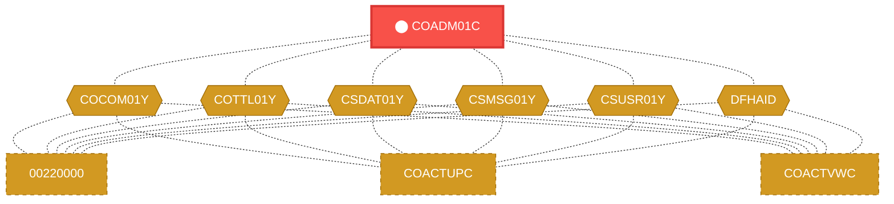
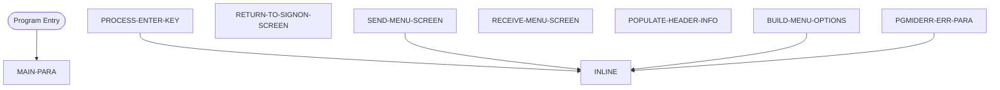

# Program: COADM01C

---

## Quick Reference

| Attribute | Value |
|-----------|-------|
| Program ID | `COADM01C` |
| Type | ONLINE |
| Lines | 289 |
| Source | [COADM01C.cbl](../carddemo\app/COADM01C.cbl#L1) |
| Paragraphs | 8 |
| Statements | 38 |
| Impact Risk | **HIGH** — 20 programs affected |

> **View Source:** [Open COADM01C.cbl](../carddemo\app/COADM01C.cbl#L1)

## Dependency Context

> This section shows how **COADM01C** connects to the rest of the system — who calls it,
> what it calls, and what data it shares. If linked programs exist, they must appear here.

### Programs That Call COADM01C (Callers)

*No programs call COADM01C — this is likely a top-level entry point or CICS transaction starter.*

### Programs Called by COADM01C (Callees)

*COADM01C does not call any other programs (leaf program).*

### Shared Data (Copybooks & Files)

#### Shared Copybooks

| Copybook | Also Used By | # Co-Users |
|----------|-------------|------------|
| `COADM01` |  | 0 |
| `COADM02Y` |  | 0 |
| `COCOM01Y` | 00220000, COACTUPC, COACTVWC, COBIL00C, COCRDLIC (+15 more) | 20 |
| `COTTL01Y` | 00220000, COACTUPC, COACTVWC, COBIL00C, COCRDLIC (+15 more) | 20 |
| `CSDAT01Y` | 00220000, COACTUPC, COACTVWC, COBIL00C, COCRDLIC (+15 more) | 20 |
| `CSMSG01Y` | 00220000, COACTUPC, COACTVWC, COBIL00C, COCRDLIC (+15 more) | 20 |
| `CSUSR01Y` | 00220000, COACTUPC, COACTVWC, COCRDLIC, COCRDSLC (+8 more) | 13 |
| `DFHAID` | 00220000, COACTUPC, COACTVWC, COBIL00C, COCRDLIC (+15 more) | 20 |
| `DFHBMSCA` | 00220000, COACTUPC, COACTVWC, COBIL00C, COCRDLIC (+15 more) | 20 |

---

## Dependency Graph

> **Legend:** 🔴 Target program · 🔵 Direct callers · 🟢 Direct callees · 🟡 Copybook-coupled · ⚫ Transitive (indirect)

---

## Impact Ripple View

> **If you change COADM01C, what else could break?**

| Impact Metric | Count |
|--------------|-------|
| Direct Callers | 0 |
| Transitive Callers (callers of callers) | 0 |
| Direct Callees | 0 |
| Transitive Callees | 0 |
| Copybook-Coupled Programs | 20 |
| **Total Impact** | **20** |
| **Risk Rating** | **HIGH** |

**Programs affected via shared copybooks:**
- `00220000`
- `COACTUPC`
- `COACTVWC`
- `COBIL00C`
- `COCRDLIC`
- `COCRDSLC`
- `COCRDUPC`
- `COMEN01C`
- `COPAUS0C`
- `COPAUS1C`
- `CORPT00C`
- `COSGN00C`
- `COTRN00C`
- `COTRN01C`
- `COTRN02C`
- `COTRTLIC`
- `COUSR00C`
- `COUSR01C`
- `COUSR02C`
- `COUSR03C`

---

## Statement Profile

| Statement Type | Count |
|---------------|-------|
| MOVE | 20 |
| EXEC_CICS | 6 |
| PERFORM | 5 |
| IF | 4 |
| STRING_OP | 1 |
| SET | 1 |
| INSPECT | 1 |

## Control Flow

## Paragraphs

### MAIN-PARA

| | |
|---|---|
| **Paragraph** | `MAIN-PARA` |
| **Lines** | 656 - 695 |
| **View Code** | [Jump to Line 656](../carddemo\app/COADM01C.cbl#L656) |

### PROCESS-ENTER-KEY

| | |
|---|---|
| **Paragraph** | `PROCESS-ENTER-KEY` |
| **Lines** | 700 - 739 |
| **View Code** | [Jump to Line 700](../carddemo\app/COADM01C.cbl#L700) |

### RETURN-TO-SIGNON-SCREEN

| | |
|---|---|
| **Paragraph** | `RETURN-TO-SIGNON-SCREEN` |
| **Lines** | 744 - 751 |
| **View Code** | [Jump to Line 744](../carddemo\app/COADM01C.cbl#L744) |

### SEND-MENU-SCREEN

| | |
|---|---|
| **Paragraph** | `SEND-MENU-SCREEN` |
| **Lines** | 756 - 768 |
| **View Code** | [Jump to Line 756](../carddemo\app/COADM01C.cbl#L756) |

### RECEIVE-MENU-SCREEN

| | |
|---|---|
| **Paragraph** | `RECEIVE-MENU-SCREEN` |
| **Lines** | 773 - 781 |
| **View Code** | [Jump to Line 773](../carddemo\app/COADM01C.cbl#L773) |

### POPULATE-HEADER-INFO

| | |
|---|---|
| **Paragraph** | `POPULATE-HEADER-INFO` |
| **Lines** | 786 - 805 |
| **View Code** | [Jump to Line 786](../carddemo\app/COADM01C.cbl#L786) |

### BUILD-MENU-OPTIONS

| | |
|---|---|
| **Paragraph** | `BUILD-MENU-OPTIONS` |
| **Lines** | 810 - 847 |
| **View Code** | [Jump to Line 810](../carddemo\app/COADM01C.cbl#L810) |

### PGMIDERR-ERR-PARA

| | |
|---|---|
| **Paragraph** | `PGMIDERR-ERR-PARA` |
| **Lines** | 851 - 865 |
| **View Code** | [Jump to Line 851](../carddemo\app/COADM01C.cbl#L851) |

## Business Rules

*No business rules extracted yet. Run LLM enrichment to extract rules from IF/EVALUATE logic.*

## Key Data Items

| Name | Level | Picture | Section | Business Name |
|------|-------|---------|---------|---------------|
| `WS-VARIABLES` | 1 | `None` | WORKING-STORAGE | None |
| `WS-PGMNAME` | 5 | `X(08)` | WORKING-STORAGE | None |
| `WS-TRANID` | 5 | `X(04)` | WORKING-STORAGE | None |
| `WS-MESSAGE` | 5 | `X(80)` | WORKING-STORAGE | None |
| `WS-USRSEC-FILE` | 5 | `X(08)` | WORKING-STORAGE | None |
| `WS-ERR-FLG` | 5 | `X(01)` | WORKING-STORAGE | None |
| `ERR-FLG-ON` | 88 | `None` | WORKING-STORAGE | None |
| `ERR-FLG-OFF` | 88 | `None` | WORKING-STORAGE | None |
| `WS-RESP-CD` | 5 | `S9(09)` | WORKING-STORAGE | None |
| `WS-REAS-CD` | 5 | `S9(09)` | WORKING-STORAGE | None |
| `WS-OPTION-X` | 5 | `X(02)` | WORKING-STORAGE | None |
| `WS-OPTION` | 5 | `9(02)` | WORKING-STORAGE | None |
| `WS-IDX` | 5 | `S9(04)` | WORKING-STORAGE | None |
| `WS-ADMIN-OPT-TXT` | 5 | `X(40)` | WORKING-STORAGE | None |
| `CARDDEMO-COMMAREA` | 1 | `None` | WORKING-STORAGE | None |
| `CDEMO-GENERAL-INFO` | 5 | `None` | WORKING-STORAGE | None |
| `CDEMO-FROM-TRANID` | 10 | `X(04)` | WORKING-STORAGE | None |
| `CDEMO-FROM-PROGRAM` | 10 | `X(08)` | WORKING-STORAGE | None |
| `CDEMO-TO-TRANID` | 10 | `X(04)` | WORKING-STORAGE | None |
| `CDEMO-TO-PROGRAM` | 10 | `X(08)` | WORKING-STORAGE | None |
| `CDEMO-USER-ID` | 10 | `X(08)` | WORKING-STORAGE | None |
| `CDEMO-USER-TYPE` | 10 | `X(01)` | WORKING-STORAGE | None |
| `CDEMO-USRTYP-ADMIN` | 88 | `None` | WORKING-STORAGE | None |
| `CDEMO-USRTYP-USER` | 88 | `None` | WORKING-STORAGE | None |
| `CDEMO-PGM-CONTEXT` | 10 | `9(01)` | WORKING-STORAGE | None |
| `CDEMO-PGM-ENTER` | 88 | `None` | WORKING-STORAGE | None |
| `CDEMO-PGM-REENTER` | 88 | `None` | WORKING-STORAGE | None |
| `CDEMO-CUSTOMER-INFO` | 5 | `None` | WORKING-STORAGE | None |
| `CDEMO-CUST-ID` | 10 | `9(09)` | WORKING-STORAGE | None |
| `CDEMO-CUST-FNAME` | 10 | `X(25)` | WORKING-STORAGE | None |
| `CDEMO-CUST-MNAME` | 10 | `X(25)` | WORKING-STORAGE | None |
| `CDEMO-CUST-LNAME` | 10 | `X(25)` | WORKING-STORAGE | None |
| `CDEMO-ACCOUNT-INFO` | 5 | `None` | WORKING-STORAGE | None |
| `CDEMO-ACCT-ID` | 10 | `9(11)` | WORKING-STORAGE | None |
| `CDEMO-ACCT-STATUS` | 10 | `X(01)` | WORKING-STORAGE | None |
| `CDEMO-CARD-INFO` | 5 | `None` | WORKING-STORAGE | None |
| `CDEMO-CARD-NUM` | 10 | `9(16)` | WORKING-STORAGE | None |
| `CDEMO-MORE-INFO` | 5 | `None` | WORKING-STORAGE | None |
| `CDEMO-LAST-MAP` | 10 | `X(7)` | WORKING-STORAGE | None |
| `CDEMO-LAST-MAPSET` | 10 | `X(7)` | WORKING-STORAGE | None |

*Showing 40 of 438 data items. See [Data Dictionary](../data-dictionary.md).*

---

*Generated 2026-03-16 19:39*