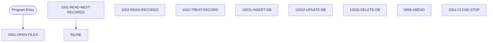

# Program: COBTUPDT

---

## Quick Reference

| Attribute | Value |
|-----------|-------|
| Program ID | `COBTUPDT` |
| Type | DB2 |
| Lines | 238 |
| Source | [COBTUPDT.cbl](../carddemo\app/COBTUPDT.cbl#L1) |
| Paragraphs | 9 |
| Statements | 30 |
| Impact Risk | **LOW** — 0 programs affected |

> **View Source:** [Open COBTUPDT.cbl](../carddemo\app/COBTUPDT.cbl#L1)

## Dependency Context

> This section shows how **COBTUPDT** connects to the rest of the system — who calls it,
> what it calls, and what data it shares. If linked programs exist, they must appear here.

### Programs That Call COBTUPDT (Callers)

*No programs call COBTUPDT — this is likely a top-level entry point or CICS transaction starter.*

### Programs Called by COBTUPDT (Callees)

*COBTUPDT does not call any other programs (leaf program).*

### Shared Data (Copybooks & Files)

*No shared copybooks.*

---

## Dependency Graph

> **Legend:** 🔴 Target program · 🔵 Direct callers · 🟢 Direct callees · 🟡 Copybook-coupled · ⚫ Transitive (indirect)

---

## Impact Ripple View

> **If you change COBTUPDT, what else could break?**

| Impact Metric | Count |
|--------------|-------|
| Direct Callers | 0 |
| Transitive Callers (callers of callers) | 0 |
| Direct Callees | 0 |
| Transitive Callees | 0 |
| Copybook-Coupled Programs | 0 |
| **Total Impact** | **0** |
| **Risk Rating** | **LOW** |

---

## Statement Profile

| Statement Type | Count |
|---------------|-------|
| EXIT | 9 |
| MOVE | 4 |
| EVALUATE | 4 |
| PERFORM | 3 |
| EXECSQL | 3 |
| IF | 2 |
| STOP | 1 |
| READ | 1 |
| OPEN | 1 |
| DISPLAY | 1 |
| CLOSE | 1 |

## Control Flow

## Paragraphs

### 0001-OPEN-FILES

| | |
|---|---|
| **Paragraph** | `0001-OPEN-FILES` |
| **Lines** | 82 - 89 |
| **View Code** | [Jump to Line 82](../carddemo\app/COBTUPDT.cbl#L82) |

### 1001-READ-NEXT-RECORDS

| | |
|---|---|
| **Paragraph** | `1001-READ-NEXT-RECORDS` |
| **Lines** | 91 - 99 |
| **View Code** | [Jump to Line 91](../carddemo\app/COBTUPDT.cbl#L91) |

### 1002-READ-RECORDS

| | |
|---|---|
| **Paragraph** | `1002-READ-RECORDS` |
| **Lines** | 100 - 107 |
| **View Code** | [Jump to Line 100](../carddemo\app/COBTUPDT.cbl#L100) |

### 1003-TREAT-RECORD

| | |
|---|---|
| **Paragraph** | `1003-TREAT-RECORD` |
| **Lines** | 109 - 130 |
| **View Code** | [Jump to Line 109](../carddemo\app/COBTUPDT.cbl#L109) |

### 10031-INSERT-DB

| | |
|---|---|
| **Paragraph** | `10031-INSERT-DB` |
| **Lines** | 132 - 164 |
| **View Code** | [Jump to Line 132](../carddemo\app/COBTUPDT.cbl#L132) |

### 10032-UPDATE-DB

| | |
|---|---|
| **Paragraph** | `10032-UPDATE-DB` |
| **Lines** | 166 - 195 |
| **View Code** | [Jump to Line 166](../carddemo\app/COBTUPDT.cbl#L166) |

### 10033-DELETE-DB

| | |
|---|---|
| **Paragraph** | `10033-DELETE-DB` |
| **Lines** | 196 - 226 |
| **View Code** | [Jump to Line 196](../carddemo\app/COBTUPDT.cbl#L196) |

### 9999-ABEND

| | |
|---|---|
| **Paragraph** | `9999-ABEND` |
| **Lines** | 230 - 233 |
| **View Code** | [Jump to Line 230](../carddemo\app/COBTUPDT.cbl#L230) |

### 2001-CLOSE-STOP

| | |
|---|---|
| **Paragraph** | `2001-CLOSE-STOP` |
| **Lines** | 234 - 236 |
| **View Code** | [Jump to Line 234](../carddemo\app/COBTUPDT.cbl#L234) |

## Business Rules

*No business rules extracted yet. Run LLM enrichment to extract rules from IF/EVALUATE logic.*

## Key Data Items

| Name | Level | Picture | Section | Business Name |
|------|-------|---------|---------|---------------|
| `FLAGS` | 1 | `None` | WORKING-STORAGE | None |
| `LASTREC` | 5 | `X(1)` | WORKING-STORAGE | None |
| `WORKING-VARIABLES` | 1 | `None` | WORKING-STORAGE | None |
| `WS-RETURN-MSG` | 5 | `X(80)` | WORKING-STORAGE | None |
| `WS-MISC-VARS` | 1 | `None` | WORKING-STORAGE | None |
| `WS-VAR-SQLCODE` | 5 | `----9` | WORKING-STORAGE | None |
| `WS-INF-STATUS` | 1 | `None` | WORKING-STORAGE | None |
| `WS-INF-STAT1` | 5 | `X` | WORKING-STORAGE | None |
| `WS-INF-STAT2` | 5 | `X` | WORKING-STORAGE | None |
| `WS-INPUT-REC` | 1 | `None` | WORKING-STORAGE | None |
| `INPUT-REC-TYPE` | 5 | `X(1)` | WORKING-STORAGE | None |
| `INPUT-REC-NUMBER` | 5 | `X(2)` | WORKING-STORAGE | None |
| `INPUT-REC-DESC` | 5 | `X(50)` | WORKING-STORAGE | None |

---

*Generated 2026-03-16 19:39*