# Program: COCRDUPC

---

## Quick Reference

| Attribute | Value |
|-----------|-------|
| Program ID | `COCRDUPC` |
| Type | ONLINE |
| Lines | 1561 |
| Source | [COCRDUPC.cbl](../carddemo\app/COCRDUPC.cbl#L1) |
| Paragraphs | 48 |
| Statements | 0 |
| Impact Risk | **HIGH** — 26 programs affected |

> **View Source:** [Open COCRDUPC.cbl](../carddemo\app/COCRDUPC.cbl#L1)

## Dependency Context

> This section shows how **COCRDUPC** connects to the rest of the system — who calls it,
> what it calls, and what data it shares. If linked programs exist, they must appear here.

### Programs That Call COCRDUPC (Callers)

*No programs call COCRDUPC — this is likely a top-level entry point or CICS transaction starter.*

### Programs Called by COCRDUPC (Callees)

*COCRDUPC does not call any other programs (leaf program).*

### Shared Data (Copybooks & Files)

#### Shared Copybooks

| Copybook | Also Used By | # Co-Users |
|----------|-------------|------------|
| `COCOM01Y` | 00220000, COACTUPC, COACTVWC, COADM01C, COBIL00C (+15 more) | 20 |
| `COCRDUP` |  | 0 |
| `COTTL01Y` | 00220000, COACTUPC, COACTVWC, COADM01C, COBIL00C (+15 more) | 20 |
| `CSDAT01Y` | 00220000, COACTUPC, COACTVWC, COADM01C, COBIL00C (+15 more) | 20 |
| `CSMSG01Y` | 00220000, COACTUPC, COACTVWC, COADM01C, COBIL00C (+15 more) | 20 |
| `CSMSG02Y` | 00220000, COACTUPC, COACTVWC, COCRDSLC, COPAUS0C (+1 more) | 6 |
| `CSUSR01Y` | 00220000, COACTUPC, COACTVWC, COADM01C, COCRDLIC (+8 more) | 13 |
| `CVACT02Y` | CBACT02C, CBEXPORT, CBIMPORT, CBTRN01C, COACTVWC (+4 more) | 9 |
| `CVCRD01Y` | 00220000, COACTUPC, COACTVWC, COCRDLIC, COCRDSLC (+1 more) | 6 |
| `CVCUS01Y` | CBCUS01C, CBEXPORT, CBIMPORT, CBTRN01C, COACTUPC (+4 more) | 9 |
| `DFHAID` | 00220000, COACTUPC, COACTVWC, COADM01C, COBIL00C (+15 more) | 20 |
| `DFHBMSCA` | 00220000, COACTUPC, COACTVWC, COADM01C, COBIL00C (+15 more) | 20 |

---

## Dependency Graph

```mermaid
flowchart TD
    COCRDUPC["⬤ COCRDUPC"]:::target
    CB_COCOM01Y{{"COCOM01Y"}}:::copybook
    COCRDUPC -.- CB_COCOM01Y
    00220000["00220000"]:::coupled
    CB_COCOM01Y -.- 00220000
    COACTUPC["COACTUPC"]:::coupled
    CB_COCOM01Y -.- COACTUPC
    COACTVWC["COACTVWC"]:::coupled
    CB_COCOM01Y -.- COACTVWC
    CB_COTTL01Y{{"COTTL01Y"}}:::copybook
    COCRDUPC -.- CB_COTTL01Y
    00220000["00220000"]:::coupled
    CB_COTTL01Y -.- 00220000
    COACTUPC["COACTUPC"]:::coupled
    CB_COTTL01Y -.- COACTUPC
    COACTVWC["COACTVWC"]:::coupled
    CB_COTTL01Y -.- COACTVWC
    CB_CSDAT01Y{{"CSDAT01Y"}}:::copybook
    COCRDUPC -.- CB_CSDAT01Y
    00220000["00220000"]:::coupled
    CB_CSDAT01Y -.- 00220000
    COACTUPC["COACTUPC"]:::coupled
    CB_CSDAT01Y -.- COACTUPC
    COACTVWC["COACTVWC"]:::coupled
    CB_CSDAT01Y -.- COACTVWC
    CB_CSMSG01Y{{"CSMSG01Y"}}:::copybook
    COCRDUPC -.- CB_CSMSG01Y
    00220000["00220000"]:::coupled
    CB_CSMSG01Y -.- 00220000
    COACTUPC["COACTUPC"]:::coupled
    CB_CSMSG01Y -.- COACTUPC
    COACTVWC["COACTVWC"]:::coupled
    CB_CSMSG01Y -.- COACTVWC
    CB_CSMSG02Y{{"CSMSG02Y"}}:::copybook
    COCRDUPC -.- CB_CSMSG02Y
    00220000["00220000"]:::coupled
    CB_CSMSG02Y -.- 00220000
    COACTUPC["COACTUPC"]:::coupled
    CB_CSMSG02Y -.- COACTUPC
    COACTVWC["COACTVWC"]:::coupled
    CB_CSMSG02Y -.- COACTVWC
    CB_CSUSR01Y{{"CSUSR01Y"}}:::copybook
    COCRDUPC -.- CB_CSUSR01Y
    00220000["00220000"]:::coupled
    CB_CSUSR01Y -.- 00220000
    COACTUPC["COACTUPC"]:::coupled
    CB_CSUSR01Y -.- COACTUPC
    COACTVWC["COACTVWC"]:::coupled
    CB_CSUSR01Y -.- COACTVWC
    CB_CVACT02Y{{"CVACT02Y"}}:::copybook
    COCRDUPC -.- CB_CVACT02Y
    CBACT02C["CBACT02C"]:::coupled
    CB_CVACT02Y -.- CBACT02C
    CBEXPORT["CBEXPORT"]:::coupled
    CB_CVACT02Y -.- CBEXPORT
    CBIMPORT["CBIMPORT"]:::coupled
    CB_CVACT02Y -.- CBIMPORT

    classDef target fill:#f85149,stroke:#da3633,color:#fff,stroke-width:3px
    classDef caller fill:#58a6ff,stroke:#1f6feb,color:#fff
    classDef callee fill:#3fb950,stroke:#238636,color:#fff
    classDef copybook fill:#d29922,stroke:#9e6a03,color:#fff
    classDef coupled fill:#d29922,stroke:#9e6a03,color:#fff,stroke-dasharray:5
    classDef transitive fill:#484f58,stroke:#8b949e,color:#c9d1d9,stroke-dasharray:5
```

> **Legend:** 🔴 Target program · 🔵 Direct callers · 🟢 Direct callees · 🟡 Copybook-coupled · ⚫ Transitive (indirect)

---

## Impact Ripple View

> **If you change COCRDUPC, what else could break?**

| Impact Metric | Count |
|--------------|-------|
| Direct Callers | 0 |
| Transitive Callers (callers of callers) | 0 |
| Direct Callees | 0 |
| Transitive Callees | 0 |
| Copybook-Coupled Programs | 26 |
| **Total Impact** | **26** |
| **Risk Rating** | **HIGH** |

**Programs affected via shared copybooks:**
- `00220000`
- `CBACT02C`
- `CBCUS01C`
- `CBEXPORT`
- `CBIMPORT`
- `CBTRN01C`
- `COACTUPC`
- `COACTVWC`
- `COADM01C`
- `COBIL00C`
- `COCRDLIC`
- `COCRDSLC`
- `COMEN01C`
- `COPAUA0C`
- `COPAUS0C`
- `COPAUS1C`
- `CORPT00C`
- `COSGN00C`
- `COTRN00C`
- `COTRN01C`
- `COTRN02C`
- `COTRTLIC`
- `COUSR00C`
- `COUSR01C`
- `COUSR02C`
- `COUSR03C`

---

## Statement Profile

## Control Flow

```mermaid
flowchart TD
    START([Program Entry])
    PROGRAM_ID["PROGRAM-ID"]
    DATE_WRITTEN["DATE-WRITTEN"]
    DATE_COMPILED["DATE-COMPILED"]
    0000_MAIN["0000-MAIN"]
    COMMON_RETURN["COMMON-RETURN"]
    0000_MAIN_EXIT["0000-MAIN-EXIT"]
    1000_PROCESS_INPUTS["1000-PROCESS-INPUTS"]
    1000_PROCESS_INPUTS_EXIT["1000-PROCESS-INPUTS-EXIT"]
    1100_RECEIVE_MAP["1100-RECEIVE-MAP"]
    1100_RECEIVE_MAP_EXIT["1100-RECEIVE-MAP-EXIT"]
    1200_EDIT_MAP_INPUTS["1200-EDIT-MAP-INPUTS"]
    1200_EDIT_MAP_INPUTS_EXIT["1200-EDIT-MAP-INPUTS-EXIT"]
    1210_EDIT_ACCOUNT["1210-EDIT-ACCOUNT"]
    1210_EDIT_ACCOUNT_EXIT["1210-EDIT-ACCOUNT-EXIT"]
    1220_EDIT_CARD["1220-EDIT-CARD"]
    START --> PROGRAM_ID
    MAIN --> YYYY_STORE_PFKEY
    MAIN --> 9000_READ_DATA
    MAIN --> 3000_SEND_MAP
    MAIN --> 1000_PROCESS_INPUTS
    MAIN --> 2000_DECIDE_ACTION
    MAIN --> 1100_RECEIVE_MAP
    MAIN --> 1200_EDIT_MAP_INPUTS
    MAIN --> 1210_EDIT_ACCOUNT
    MAIN --> 1220_EDIT_CARD
    MAIN --> 1230_EDIT_NAME
    MAIN --> 1240_EDIT_CARDSTATUS
    MAIN --> 1250_EDIT_EXPIRY_MON
    MAIN --> 1260_EDIT_EXPIRY_YEAR
    MAIN --> 9200_WRITE_PROCESSING
    MAIN --> ABEND_ROUTINE
    MAIN --> 3100_SCREEN_INIT
```

## Paragraphs

### PROGRAM-ID

| | |
|---|---|
| **Paragraph** | `PROGRAM-ID` |
| **Lines** | 23 - 24 |
| **View Code** | [Jump to Line 23](../carddemo\app/COCRDUPC.cbl#L23) |

### DATE-WRITTEN

| | |
|---|---|
| **Paragraph** | `DATE-WRITTEN` |
| **Lines** | 25 - 26 |
| **View Code** | [Jump to Line 25](../carddemo\app/COCRDUPC.cbl#L25) |

### DATE-COMPILED

| | |
|---|---|
| **Paragraph** | `DATE-COMPILED` |
| **Lines** | 27 - 366 |
| **View Code** | [Jump to Line 27](../carddemo\app/COCRDUPC.cbl#L27) |

### 0000-MAIN

| | |
|---|---|
| **Paragraph** | `0000-MAIN` |
| **Lines** | 367 - 545 |
| **View Code** | [Jump to Line 367](../carddemo\app/COCRDUPC.cbl#L367) |

### COMMON-RETURN

| | |
|---|---|
| **Paragraph** | `COMMON-RETURN` |
| **Lines** | 546 - 559 |
| **View Code** | [Jump to Line 546](../carddemo\app/COCRDUPC.cbl#L546) |

### 0000-MAIN-EXIT

| | |
|---|---|
| **Paragraph** | `0000-MAIN-EXIT` |
| **Lines** | 560 - 563 |
| **View Code** | [Jump to Line 560](../carddemo\app/COCRDUPC.cbl#L560) |

### 1000-PROCESS-INPUTS

| | |
|---|---|
| **Paragraph** | `1000-PROCESS-INPUTS` |
| **Lines** | 564 - 574 |
| **View Code** | [Jump to Line 564](../carddemo\app/COCRDUPC.cbl#L564) |

### 1000-PROCESS-INPUTS-EXIT

| | |
|---|---|
| **Paragraph** | `1000-PROCESS-INPUTS-EXIT` |
| **Lines** | 575 - 577 |
| **View Code** | [Jump to Line 575](../carddemo\app/COCRDUPC.cbl#L575) |

### 1100-RECEIVE-MAP

| | |
|---|---|
| **Paragraph** | `1100-RECEIVE-MAP` |
| **Lines** | 578 - 637 |
| **View Code** | [Jump to Line 578](../carddemo\app/COCRDUPC.cbl#L578) |

### 1100-RECEIVE-MAP-EXIT

| | |
|---|---|
| **Paragraph** | `1100-RECEIVE-MAP-EXIT` |
| **Lines** | 638 - 640 |
| **View Code** | [Jump to Line 638](../carddemo\app/COCRDUPC.cbl#L638) |

### 1200-EDIT-MAP-INPUTS

| | |
|---|---|
| **Paragraph** | `1200-EDIT-MAP-INPUTS` |
| **Lines** | 641 - 716 |
| **View Code** | [Jump to Line 641](../carddemo\app/COCRDUPC.cbl#L641) |

### 1200-EDIT-MAP-INPUTS-EXIT

| | |
|---|---|
| **Paragraph** | `1200-EDIT-MAP-INPUTS-EXIT` |
| **Lines** | 717 - 720 |
| **View Code** | [Jump to Line 717](../carddemo\app/COCRDUPC.cbl#L717) |

### 1210-EDIT-ACCOUNT

| | |
|---|---|
| **Paragraph** | `1210-EDIT-ACCOUNT` |
| **Lines** | 721 - 757 |
| **View Code** | [Jump to Line 721](../carddemo\app/COCRDUPC.cbl#L721) |

### 1210-EDIT-ACCOUNT-EXIT

| | |
|---|---|
| **Paragraph** | `1210-EDIT-ACCOUNT-EXIT` |
| **Lines** | 758 - 761 |
| **View Code** | [Jump to Line 758](../carddemo\app/COCRDUPC.cbl#L758) |

### 1220-EDIT-CARD

| | |
|---|---|
| **Paragraph** | `1220-EDIT-CARD` |
| **Lines** | 762 - 801 |
| **View Code** | [Jump to Line 762](../carddemo\app/COCRDUPC.cbl#L762) |

### 1220-EDIT-CARD-EXIT

| | |
|---|---|
| **Paragraph** | `1220-EDIT-CARD-EXIT` |
| **Lines** | 802 - 805 |
| **View Code** | [Jump to Line 802](../carddemo\app/COCRDUPC.cbl#L802) |

### 1230-EDIT-NAME

| | |
|---|---|
| **Paragraph** | `1230-EDIT-NAME` |
| **Lines** | 806 - 840 |
| **View Code** | [Jump to Line 806](../carddemo\app/COCRDUPC.cbl#L806) |

### 1230-EDIT-NAME-EXIT

| | |
|---|---|
| **Paragraph** | `1230-EDIT-NAME-EXIT` |
| **Lines** | 841 - 844 |
| **View Code** | [Jump to Line 841](../carddemo\app/COCRDUPC.cbl#L841) |

### 1240-EDIT-CARDSTATUS

| | |
|---|---|
| **Paragraph** | `1240-EDIT-CARDSTATUS` |
| **Lines** | 845 - 873 |
| **View Code** | [Jump to Line 845](../carddemo\app/COCRDUPC.cbl#L845) |

### 1240-EDIT-CARDSTATUS-EXIT

| | |
|---|---|
| **Paragraph** | `1240-EDIT-CARDSTATUS-EXIT` |
| **Lines** | 874 - 876 |
| **View Code** | [Jump to Line 874](../carddemo\app/COCRDUPC.cbl#L874) |

### 1250-EDIT-EXPIRY-MON

| | |
|---|---|
| **Paragraph** | `1250-EDIT-EXPIRY-MON` |
| **Lines** | 877 - 909 |
| **View Code** | [Jump to Line 877](../carddemo\app/COCRDUPC.cbl#L877) |

### 1250-EDIT-EXPIRY-MON-EXIT

| | |
|---|---|
| **Paragraph** | `1250-EDIT-EXPIRY-MON-EXIT` |
| **Lines** | 910 - 912 |
| **View Code** | [Jump to Line 910](../carddemo\app/COCRDUPC.cbl#L910) |

### 1260-EDIT-EXPIRY-YEAR

| | |
|---|---|
| **Paragraph** | `1260-EDIT-EXPIRY-YEAR` |
| **Lines** | 913 - 944 |
| **View Code** | [Jump to Line 913](../carddemo\app/COCRDUPC.cbl#L913) |

### 1260-EDIT-EXPIRY-YEAR-EXIT

| | |
|---|---|
| **Paragraph** | `1260-EDIT-EXPIRY-YEAR-EXIT` |
| **Lines** | 945 - 947 |
| **View Code** | [Jump to Line 945](../carddemo\app/COCRDUPC.cbl#L945) |

### 2000-DECIDE-ACTION

| | |
|---|---|
| **Paragraph** | `2000-DECIDE-ACTION` |
| **Lines** | 948 - 1028 |
| **View Code** | [Jump to Line 948](../carddemo\app/COCRDUPC.cbl#L948) |

### 2000-DECIDE-ACTION-EXIT

| | |
|---|---|
| **Paragraph** | `2000-DECIDE-ACTION-EXIT` |
| **Lines** | 1029 - 1034 |
| **View Code** | [Jump to Line 1029](../carddemo\app/COCRDUPC.cbl#L1029) |

### 3000-SEND-MAP

| | |
|---|---|
| **Paragraph** | `3000-SEND-MAP` |
| **Lines** | 1035 - 1047 |
| **View Code** | [Jump to Line 1035](../carddemo\app/COCRDUPC.cbl#L1035) |

### 3000-SEND-MAP-EXIT

| | |
|---|---|
| **Paragraph** | `3000-SEND-MAP-EXIT` |
| **Lines** | 1048 - 1051 |
| **View Code** | [Jump to Line 1048](../carddemo\app/COCRDUPC.cbl#L1048) |

### 3100-SCREEN-INIT

| | |
|---|---|
| **Paragraph** | `3100-SCREEN-INIT` |
| **Lines** | 1052 - 1077 |
| **View Code** | [Jump to Line 1052](../carddemo\app/COCRDUPC.cbl#L1052) |

### 3100-SCREEN-INIT-EXIT

| | |
|---|---|
| **Paragraph** | `3100-SCREEN-INIT-EXIT` |
| **Lines** | 1078 - 1081 |
| **View Code** | [Jump to Line 1078](../carddemo\app/COCRDUPC.cbl#L1078) |

### 3200-SETUP-SCREEN-VARS

| | |
|---|---|
| **Paragraph** | `3200-SETUP-SCREEN-VARS` |
| **Lines** | 1082 - 1134 |
| **View Code** | [Jump to Line 1082](../carddemo\app/COCRDUPC.cbl#L1082) |

### 3200-SETUP-SCREEN-VARS-EXIT

| | |
|---|---|
| **Paragraph** | `3200-SETUP-SCREEN-VARS-EXIT` |
| **Lines** | 1135 - 1137 |
| **View Code** | [Jump to Line 1135](../carddemo\app/COCRDUPC.cbl#L1135) |

### 3250-SETUP-INFOMSG

| | |
|---|---|
| **Paragraph** | `3250-SETUP-INFOMSG` |
| **Lines** | 1138 - 1164 |
| **View Code** | [Jump to Line 1138](../carddemo\app/COCRDUPC.cbl#L1138) |

### 3250-SETUP-INFOMSG-EXIT

| | |
|---|---|
| **Paragraph** | `3250-SETUP-INFOMSG-EXIT` |
| **Lines** | 1165 - 1167 |
| **View Code** | [Jump to Line 1165](../carddemo\app/COCRDUPC.cbl#L1165) |

### 3300-SETUP-SCREEN-ATTRS

| | |
|---|---|
| **Paragraph** | `3300-SETUP-SCREEN-ATTRS` |
| **Lines** | 1168 - 1318 |
| **View Code** | [Jump to Line 1168](../carddemo\app/COCRDUPC.cbl#L1168) |

### 3300-SETUP-SCREEN-ATTRS-EXIT

| | |
|---|---|
| **Paragraph** | `3300-SETUP-SCREEN-ATTRS-EXIT` |
| **Lines** | 1319 - 1323 |
| **View Code** | [Jump to Line 1319](../carddemo\app/COCRDUPC.cbl#L1319) |

### 3400-SEND-SCREEN

| | |
|---|---|
| **Paragraph** | `3400-SEND-SCREEN` |
| **Lines** | 1324 - 1337 |
| **View Code** | [Jump to Line 1324](../carddemo\app/COCRDUPC.cbl#L1324) |

### 3400-SEND-SCREEN-EXIT

| | |
|---|---|
| **Paragraph** | `3400-SEND-SCREEN-EXIT` |
| **Lines** | 1338 - 1342 |
| **View Code** | [Jump to Line 1338](../carddemo\app/COCRDUPC.cbl#L1338) |

### 9000-READ-DATA

| | |
|---|---|
| **Paragraph** | `9000-READ-DATA` |
| **Lines** | 1343 - 1371 |
| **View Code** | [Jump to Line 1343](../carddemo\app/COCRDUPC.cbl#L1343) |

### 9000-READ-DATA-EXIT

| | |
|---|---|
| **Paragraph** | `9000-READ-DATA-EXIT` |
| **Lines** | 1372 - 1375 |
| **View Code** | [Jump to Line 1372](../carddemo\app/COCRDUPC.cbl#L1372) |

### 9100-GETCARD-BYACCTCARD

| | |
|---|---|
| **Paragraph** | `9100-GETCARD-BYACCTCARD` |
| **Lines** | 1376 - 1414 |
| **View Code** | [Jump to Line 1376](../carddemo\app/COCRDUPC.cbl#L1376) |

### 9100-GETCARD-BYACCTCARD-EXIT

| | |
|---|---|
| **Paragraph** | `9100-GETCARD-BYACCTCARD-EXIT` |
| **Lines** | 1415 - 1419 |
| **View Code** | [Jump to Line 1415](../carddemo\app/COCRDUPC.cbl#L1415) |

### 9200-WRITE-PROCESSING

| | |
|---|---|
| **Paragraph** | `9200-WRITE-PROCESSING` |
| **Lines** | 1420 - 1493 |
| **View Code** | [Jump to Line 1420](../carddemo\app/COCRDUPC.cbl#L1420) |

### 9200-WRITE-PROCESSING-EXIT

| | |
|---|---|
| **Paragraph** | `9200-WRITE-PROCESSING-EXIT` |
| **Lines** | 1494 - 1497 |
| **View Code** | [Jump to Line 1494](../carddemo\app/COCRDUPC.cbl#L1494) |

### 9300-CHECK-CHANGE-IN-REC

| | |
|---|---|
| **Paragraph** | `9300-CHECK-CHANGE-IN-REC` |
| **Lines** | 1498 - 1520 |
| **View Code** | [Jump to Line 1498](../carddemo\app/COCRDUPC.cbl#L1498) |

### 9300-CHECK-CHANGE-IN-REC-EXIT

| | |
|---|---|
| **Paragraph** | `9300-CHECK-CHANGE-IN-REC-EXIT` |
| **Lines** | 1521 - 1530 |
| **View Code** | [Jump to Line 1521](../carddemo\app/COCRDUPC.cbl#L1521) |

### ABEND-ROUTINE

| | |
|---|---|
| **Paragraph** | `ABEND-ROUTINE` |
| **Lines** | 1531 - 1553 |
| **View Code** | [Jump to Line 1531](../carddemo\app/COCRDUPC.cbl#L1531) |

### ABEND-ROUTINE-EXIT

| | |
|---|---|
| **Paragraph** | `ABEND-ROUTINE-EXIT` |
| **Lines** | 1554 - 1561 |
| **View Code** | [Jump to Line 1554](../carddemo\app/COCRDUPC.cbl#L1554) |

## Business Rules

*No business rules extracted yet. Run LLM enrichment to extract rules from IF/EVALUATE logic.*

## Key Data Items

*No data items found for this program.*

---

*Generated 2026-03-16 19:39*