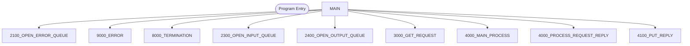

# Program: CODATE01

---

## Quick Reference

| Attribute | Value |
|-----------|-------|
| Program ID | `CODATE01` |
| Type | ONLINE |
| Lines | 525 |
| Source | [CODATE01.cbl](../carddemo\app/CODATE01.cbl#L1) |
| Paragraphs | 0 |
| Statements | 0 |
| Impact Risk | **LOW** — 2 programs affected |

> **View Source:** [Open CODATE01.cbl](../carddemo\app/CODATE01.cbl#L1)

## Dependency Context

> This section shows how **CODATE01** connects to the rest of the system — who calls it,
> what it calls, and what data it shares. If linked programs exist, they must appear here.

### Programs That Call CODATE01 (Callers)

*No programs call CODATE01 — this is likely a top-level entry point or CICS transaction starter.*

### Programs Called by CODATE01 (Callees)

| Called Program | Type | Line | Why |
|----------------|------|------|-----|
| [MQCLOSE](MQCLOSE.md) | None | 461 |  |
| [MQCLOSE](MQCLOSE.md) | None | 483 |  |
| [MQCLOSE](MQCLOSE.md) | None | 506 |  |
| [MQGET](MQGET.md) | None | 301 |  |
| [MQOPEN](MQOPEN.md) | None | 182 |  |
| [MQOPEN](MQOPEN.md) | None | 216 |  |
| [MQOPEN](MQOPEN.md) | None | 251 |  |
| [MQPUT](MQPUT.md) | None | 383 |  |
| [MQPUT](MQPUT.md) | None | 420 |  |

### Shared Data (Copybooks & Files)

#### Shared Copybooks

| Copybook | Also Used By | # Co-Users |
|----------|-------------|------------|
| `03220012` |  | 0 |
| `CMQGMOV` | COACCT01, COPAUA0C | 2 |
| `CMQMDV` | COACCT01, COPAUA0C | 2 |
| `CMQODV` | COACCT01, COPAUA0C | 2 |
| `CMQPMOV` | COACCT01, COPAUA0C | 2 |
| `CMQTML` | COACCT01, COPAUA0C | 2 |
| `CMQV` | COACCT01, COPAUA0C | 2 |
| `REPLACING` | COACCT01 | 1 |

---

## Dependency Graph

```mermaid
flowchart TD
    CODATE01["⬤ CODATE01"]:::target
    MQCLOSE["MQCLOSE"]:::callee
    MQCLOSE["MQCLOSE"]:::callee
    MQCLOSE["MQCLOSE"]:::callee
    MQGET["MQGET"]:::callee
    MQOPEN["MQOPEN"]:::callee
    MQOPEN["MQOPEN"]:::callee
    MQOPEN["MQOPEN"]:::callee
    MQPUT["MQPUT"]:::callee
    MQPUT["MQPUT"]:::callee
    CODATE01 --> MQCLOSE
    CODATE01 --> MQCLOSE
    CODATE01 --> MQCLOSE
    CODATE01 --> MQGET
    CODATE01 --> MQOPEN
    CODATE01 --> MQOPEN
    CODATE01 --> MQOPEN
    CODATE01 --> MQPUT
    CODATE01 --> MQPUT
    CB_CMQGMOV{{"CMQGMOV"}}:::copybook
    CODATE01 -.- CB_CMQGMOV
    COACCT01["COACCT01"]:::coupled
    CB_CMQGMOV -.- COACCT01
    COPAUA0C["COPAUA0C"]:::coupled
    CB_CMQGMOV -.- COPAUA0C
    CB_CMQMDV{{"CMQMDV"}}:::copybook
    CODATE01 -.- CB_CMQMDV
    COACCT01["COACCT01"]:::coupled
    CB_CMQMDV -.- COACCT01
    COPAUA0C["COPAUA0C"]:::coupled
    CB_CMQMDV -.- COPAUA0C
    CB_CMQODV{{"CMQODV"}}:::copybook
    CODATE01 -.- CB_CMQODV
    COACCT01["COACCT01"]:::coupled
    CB_CMQODV -.- COACCT01
    COPAUA0C["COPAUA0C"]:::coupled
    CB_CMQODV -.- COPAUA0C
    CB_CMQPMOV{{"CMQPMOV"}}:::copybook
    CODATE01 -.- CB_CMQPMOV
    COACCT01["COACCT01"]:::coupled
    CB_CMQPMOV -.- COACCT01
    COPAUA0C["COPAUA0C"]:::coupled
    CB_CMQPMOV -.- COPAUA0C
    CB_CMQTML{{"CMQTML"}}:::copybook
    CODATE01 -.- CB_CMQTML
    COACCT01["COACCT01"]:::coupled
    CB_CMQTML -.- COACCT01
    COPAUA0C["COPAUA0C"]:::coupled
    CB_CMQTML -.- COPAUA0C
    CB_CMQV{{"CMQV"}}:::copybook
    CODATE01 -.- CB_CMQV
    COACCT01["COACCT01"]:::coupled
    CB_CMQV -.- COACCT01
    COPAUA0C["COPAUA0C"]:::coupled
    CB_CMQV -.- COPAUA0C
    CB_REPLACING{{"REPLACING"}}:::copybook
    CODATE01 -.- CB_REPLACING
    COACCT01["COACCT01"]:::coupled
    CB_REPLACING -.- COACCT01

    classDef target fill:#f85149,stroke:#da3633,color:#fff,stroke-width:3px
    classDef caller fill:#58a6ff,stroke:#1f6feb,color:#fff
    classDef callee fill:#3fb950,stroke:#238636,color:#fff
    classDef copybook fill:#d29922,stroke:#9e6a03,color:#fff
    classDef coupled fill:#d29922,stroke:#9e6a03,color:#fff,stroke-dasharray:5
    classDef transitive fill:#484f58,stroke:#8b949e,color:#c9d1d9,stroke-dasharray:5
```

> **Legend:** 🔴 Target program · 🔵 Direct callers · 🟢 Direct callees · 🟡 Copybook-coupled · ⚫ Transitive (indirect)

---

## Impact Ripple View

> **If you change CODATE01, what else could break?**

| Impact Metric | Count |
|--------------|-------|
| Direct Callers | 0 |
| Transitive Callers (callers of callers) | 0 |
| Direct Callees | 0 |
| Transitive Callees | 0 |
| Copybook-Coupled Programs | 2 |
| **Total Impact** | **2** |
| **Risk Rating** | **LOW** |

**Programs affected via shared copybooks:**
- `COACCT01`
- `COPAUA0C`

---

## Statement Profile

## Control Flow

## Paragraphs

## Business Rules

*No business rules extracted yet. Run LLM enrichment to extract rules from IF/EVALUATE logic.*

## Key Data Items

*No data items found for this program.*

---

*Generated 2026-03-16 19:39*